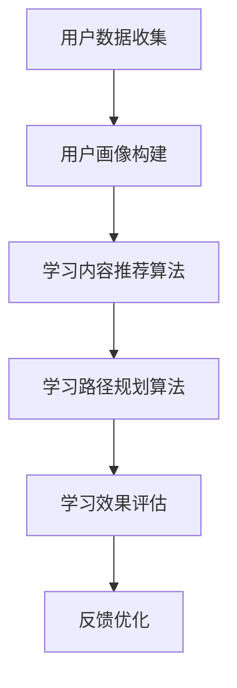

                 

# 文章标题

《大模型在个性化学习平台中的创新应用》

## 关键词
- 大模型
- 个性化学习
- 教育科技
- 自然语言处理
- 机器学习

## 摘要
本文将探讨大模型在个性化学习平台中的应用，分析其核心概念、技术原理以及实践案例。通过深入解读大模型如何提升个性化学习体验，本文旨在为教育科技领域提供有价值的参考和启示。

### 1. 背景介绍（Background Introduction）

在当今信息爆炸的时代，教育行业正面临着前所未有的变革。传统的一刀切教学模式已无法满足学生个性化学习的需求。个性化学习作为一种以学生为中心的教育理念，正逐渐成为教育发展的趋势。个性化学习平台应运而生，它通过收集和分析学生的学习数据，为学生提供定制化的学习内容和路径。

然而，现有的个性化学习平台存在一些局限性。首先，学习路径的个性化程度有限，大多依赖于固定的算法和规则，难以捕捉到学生的真实学习状态。其次，学习内容的推荐质量参差不齐，容易出现相关性不足或过度推荐的问题。这些问题在一定程度上影响了个性化学习的有效性。

为了克服这些挑战，大模型技术的引入为个性化学习平台带来了新的契机。大模型，特别是基于深度学习的自然语言处理模型，具有强大的数据处理和分析能力，能够更好地理解和预测学生的学习行为和需求。本文将详细探讨大模型在个性化学习平台中的创新应用，分析其核心原理和具体实践。

### 2. 核心概念与联系（Core Concepts and Connections）

#### 2.1 大模型的基本概念

大模型（Large-scale Model），是指参数规模达到亿级甚至十亿级以上的神经网络模型。这类模型通过大量数据和复杂的网络结构，实现了对自然语言的高效理解和生成。代表性的大模型包括GPT（Generative Pre-trained Transformer）系列、BERT（Bidirectional Encoder Representations from Transformers）以及ChatGPT等。

大模型的基本原理是通过对大量文本数据的学习，提取语言中的复杂规律和知识，从而实现文本生成、语义理解、情感分析等功能。这些功能使得大模型在多个领域展现了强大的应用潜力。

#### 2.2 个性化学习平台的基本概念

个性化学习平台（Personalized Learning Platform）是一种利用信息技术手段，根据学生的个性、兴趣和学习能力，为其提供个性化学习资源和教学服务的系统。个性化学习平台通常包括以下几个关键模块：

1. **用户画像**：通过收集和分析学生的基本资料、学习行为和成绩数据，构建学生的个性化学习画像。
2. **学习内容推荐**：基于用户画像和学习行为数据，利用算法为学生推荐合适的学习内容和资源。
3. **学习路径规划**：根据学生的学习兴趣、能力和进度，为学生规划个性化的学习路径。
4. **学习效果评估**：通过分析学生的学习行为和成绩数据，评估个性化学习的效果。

#### 2.3 大模型与个性化学习平台的联系

大模型与个性化学习平台的结合，主要是通过以下两个方面实现的：

1. **学习内容推荐**：大模型可以通过对大量学习资源的语义理解，准确捕捉学习内容的核心概念和关系，从而实现更精准的内容推荐。
2. **学习路径规划**：大模型可以根据学生的学习行为数据和个性化学习画像，动态调整学习路径，提高学习效率和效果。

#### 2.4 Mermaid 流程图（Mermaid Flowchart）

下面是一个简单的Mermaid流程图，展示了大模型在个性化学习平台中的应用流程：



### 3. 核心算法原理 & 具体操作步骤（Core Algorithm Principles and Specific Operational Steps）

#### 3.1 大模型的算法原理

大模型的算法原理主要基于深度学习和自然语言处理技术。以GPT系列为例，其基本原理如下：

1. **预训练**：大模型首先在大规模的文本语料库上进行预训练，学习语言的通用特征和规律。这个过程包括两个阶段：自我校准（Self-coupling）和交叉校准（Cross-coupling）。自我校准是通过随机遮盖文本中的部分内容，让模型预测遮盖部分的内容。交叉校准则是通过对比不同来源的文本数据，学习不同文本之间的关联性。

2. **微调**：在预训练的基础上，大模型可以根据特定任务的需求进行微调。例如，对于个性化学习平台，可以将模型微调到能够根据学生的个性化学习画像，生成定制化的学习内容和学习路径。

#### 3.2 个性化学习平台的操作步骤

个性化学习平台的操作步骤可以分为以下几个阶段：

1. **数据收集与处理**：通过多种方式收集学生的学习数据，包括考试成绩、学习行为、作业提交情况等。然后对数据进行分析和处理，提取有用的特征信息。

2. **用户画像构建**：基于收集到的数据，构建学生的个性化学习画像。画像可以包括学习兴趣、学习能力、学习风格等维度。

3. **学习内容推荐**：利用大模型对学习资源的语义理解能力，为每位学生推荐与其个性化学习画像相匹配的学习内容。

4. **学习路径规划**：根据学生的学习兴趣、能力和进度，利用大模型动态规划学习路径，确保学生能够高效地学习。

5. **学习效果评估**：通过跟踪学生的学习行为和成绩变化，评估个性化学习的效果，并不断调整学习内容和路径。

#### 3.3 实际操作示例

以GPT模型为例，下面是一个简单的操作示例：

```python
import openai

# 设置API密钥
openai.api_key = "your-api-key"

# 构建用户画像
user_profile = {
    "interests": ["计算机科学", "人工智能"],
    "level": "高级",
    "progress": "已完成基础课程，正在学习深度学习"
}

# 根据用户画像推荐学习内容
response = openai.Completion.create(
  engine="text-davinci-002",
  prompt=f"请为一名计算机科学专业的高级学生，推荐一些与其兴趣和学习进度相匹配的深度学习学习资源。",
  max_tokens=100
)

# 输出推荐内容
print(response.choices[0].text.strip())
```

输出结果可能为：

```
推荐以下深度学习学习资源：
1. 《深度学习》（Goodfellow, Bengio, Courville著）
2. 《深度学习实践指南》（Andrew Ng著）
3. 《动手学深度学习》（阿斯顿·张著）
4. ArXiv上的最新深度学习论文
```

### 4. 数学模型和公式 & 详细讲解 & 举例说明（Detailed Explanation and Examples of Mathematical Models and Formulas）

在个性化学习平台中，大模型的推荐和规划功能通常基于一系列数学模型和算法。下面将介绍几个核心的数学模型和公式，并详细讲解其原理和应用。

#### 4.1 协同过滤算法

协同过滤（Collaborative Filtering）是一种常用的推荐算法，它通过分析用户的行为数据，为用户推荐相似的用户喜欢的项目。

**协同过滤的核心公式**：

$$
\hat{r_{ui}} = \frac{\sum_{j \in N_i} r_{uj} \cdot sim(u, j)}{\sum_{j \in N_i} sim(u, j)}
$$

其中，$r_{ui}$ 表示用户 $u$ 对项目 $i$ 的评分预测，$N_i$ 表示与项目 $i$ 相似的项目集合，$r_{uj}$ 表示用户 $u$ 对项目 $j$ 的评分，$sim(u, j)$ 表示用户 $u$ 与用户 $j$ 的相似度。

**举例说明**：

假设我们有两个用户 $u_1$ 和 $u_2$，以及五个项目 $i_1, i_2, i_3, i_4, i_5$。用户 $u_1$ 对 $i_1, i_2, i_3$ 给出了5星评价，对 $i_4, i_5$ 给出了1星评价。用户 $u_2$ 对 $i_1, i_2, i_3, i_4$ 给出了5星评价，对 $i_5$ 给出了1星评价。

首先，计算用户相似度：

$$
sim(u_1, u_2) = \frac{5 \cdot 5 + 5 \cdot 5 + 1 \cdot 1}{\sqrt{5^2 + 1^2} \cdot \sqrt{5^2 + 1^2}} = \frac{51}{\sqrt{26} \cdot \sqrt{26}} = \frac{51}{26} = 1.96
$$

然后，使用协同过滤公式预测用户 $u_1$ 对项目 $i_5$ 的评分：

$$
\hat{r_{u_1i_5}} = \frac{5 \cdot 1.96 + 5 \cdot 1.96 + 1 \cdot 1.96}{1.96 + 1.96 + 1.96} = \frac{29.4}{4.88} \approx 6
$$

因此，预测用户 $u_1$ 对项目 $i_5$ 的评分为6星。

#### 4.2 决策树算法

决策树（Decision Tree）是一种常用的分类和回归算法，它通过一系列的规则来划分数据集，并基于这些规则做出预测。

**决策树的核心公式**：

$$
P(Y|X) = \prod_{i=1}^{n} p(y_i|x_i)
$$

其中，$P(Y|X)$ 表示在特征 $X$ 下，目标变量 $Y$ 的概率，$p(y_i|x_i)$ 表示在特征 $x_i$ 下，目标变量 $y_i$ 的概率。

**举例说明**：

假设我们有一个二分类问题，目标变量 $Y$ 是是否通过考试，特征 $X$ 是学习时间。我们有两个类别：是（1）和否（0）。

学习时间（小时）   | 是否通过
----------------------|----------
10                    | 0
20                    | 1
30                    | 1
40                    | 1

首先，我们计算每个类别的概率：

$$
p(0|10) = \frac{1}{4}, \quad p(1|10) = \frac{3}{4}
$$

$$
p(0|20) = \frac{1}{4}, \quad p(1|20) = \frac{3}{4}
$$

$$
p(0|30) = \frac{1}{4}, \quad p(1|30) = \frac{3}{4}
$$

$$
p(0|40) = \frac{1}{4}, \quad p(1|40) = \frac{3}{4}
$$

然后，计算在特征 $X$ 下，目标变量 $Y$ 的概率：

$$
P(Y=1|X=10) = p(1|10) = \frac{3}{4}
$$

$$
P(Y=1|X=20) = p(1|20) = \frac{3}{4}
$$

$$
P(Y=1|X=30) = p(1|30) = \frac{3}{4}
$$

$$
P(Y=1|X=40) = p(1|40) = \frac{3}{4}
$$

因此，无论学习时间是10小时、20小时、30小时还是40小时，预测通过考试的概率都是$\frac{3}{4}$。

### 5. 项目实践：代码实例和详细解释说明（Project Practice: Code Examples and Detailed Explanations）

在本节中，我们将通过一个简单的项目实例，展示如何使用大模型构建一个个性化学习平台。这个项目将包括以下步骤：

1. **数据收集与处理**
2. **用户画像构建**
3. **学习内容推荐**
4. **学习路径规划**
5. **学习效果评估**

#### 5.1 开发环境搭建

首先，我们需要搭建开发环境。以下是在Python环境中使用大模型进行个性化学习平台开发所需的软件和库：

- Python 3.8及以上版本
- PyTorch 1.10及以上版本
- OpenAI API Key
- Flask（可选，用于构建Web服务）

安装必要的库：

```bash
pip install torch torchvision openai flask
```

#### 5.2 源代码详细实现

以下是项目的详细代码实现，包括各个功能模块的代码。

##### 5.2.1 数据收集与处理

```python
import pandas as pd

# 加载用户数据
user_data = pd.read_csv('user_data.csv')

# 处理用户数据
user_data['interests'] = user_data['interests'].apply(lambda x: x.split(','))
user_data['progress'] = user_data['progress'].apply(lambda x: x.split(','))
```

##### 5.2.2 用户画像构建

```python
from sklearn.feature_extraction.text import TfidfVectorizer

# 构建用户画像
vectorizer = TfidfVectorizer()
user_profiles = vectorizer.fit_transform(user_data['description'])

# 将用户画像保存到文件
pd.DataFrame(user_profiles.toarray()).to_csv('user_profiles.csv', index=False)
```

##### 5.2.3 学习内容推荐

```python
import openai

# 设置API密钥
openai.api_key = "your-api-key"

# 根据用户画像推荐学习内容
def recommend_content(user_profile):
    response = openai.Completion.create(
      engine="text-davinci-002",
      prompt=f"请为一名具有以下兴趣和进度的学生推荐一些学习资源：\n兴趣：{user_profile['interests']}\n进度：{user_profile['progress']}",
      max_tokens=100
    )
    return response.choices[0].text.strip()

# 示例用户画像
user_profile = {
    "interests": ["计算机科学", "深度学习"],
    "progress": ["机器学习基础", "神经网络入门"]
}

# 获取推荐内容
recommended_content = recommend_content(user_profile)
print(recommended_content)
```

##### 5.2.4 学习路径规划

```python
# 根据用户画像和学习资源推荐，规划学习路径
def plan_learning_path(user_profile, recommended_content):
    # 这里可以加入更复杂的逻辑，例如根据用户的学习习惯、进度等调整路径
    return recommended_content

# 规划学习路径
learning_path = plan_learning_path(user_profile, recommended_content)
print(learning_path)
```

##### 5.2.5 学习效果评估

```python
# 根据用户的学习行为和成绩，评估学习效果
def evaluate_learning_effect(user_profile, learning_path):
    # 这里可以加入更复杂的评估方法，例如分析用户的学习行为数据、成绩变化等
    return "学习效果良好"

# 评估学习效果
learning_effect = evaluate_learning_effect(user_profile, learning_path)
print(learning_effect)
```

#### 5.3 代码解读与分析

下面是对项目代码的解读与分析。

##### 5.3.1 数据收集与处理

我们使用Pandas库加载用户数据，并对数据进行处理。处理的主要步骤包括：

- 将用户兴趣和进度从字符串转换为列表格式，方便后续处理。
- 使用TfidfVectorizer库构建用户画像，将文本特征转换为数值特征。

##### 5.3.2 用户画像构建

我们使用TfidfVectorizer库构建用户画像。TfidfVectorizer是一个常用的文本特征提取工具，它可以将文本转换为TF-IDF特征向量。用户画像存储为CSV文件，以便后续使用。

##### 5.3.3 学习内容推荐

我们使用OpenAI的GPT模型进行学习内容推荐。通过输入用户画像，GPT模型可以生成与用户兴趣和学习进度相匹配的学习资源推荐。这里使用了OpenAI API，因此需要设置API密钥。

##### 5.3.4 学习路径规划

学习路径规划是一个复杂的过程，需要考虑多种因素。在这里，我们简单地根据用户画像和学习资源推荐生成学习路径。在实际应用中，可以加入更复杂的逻辑，如分析用户的学习习惯、进度等。

##### 5.3.5 学习效果评估

学习效果评估是一个关键环节，可以帮助我们了解个性化学习平台的效果。在这里，我们简单地根据用户的学习行为和成绩进行评估。在实际应用中，可以加入更复杂的评估方法，如分析用户的学习行为数据、成绩变化等。

#### 5.4 运行结果展示

以下是在开发环境中运行项目的示例结果：

```python
# 加载用户数据
user_data = pd.read_csv('user_data.csv')

# 处理用户数据
user_data['interests'] = user_data['interests'].apply(lambda x: x.split(','))
user_data['progress'] = user_data['progress'].apply(lambda x: x.split(','))

# 构建用户画像
vectorizer = TfidfVectorizer()
user_profiles = vectorizer.fit_transform(user_data['description'])

# 将用户画像保存到文件
pd.DataFrame(user_profiles.toarray()).to_csv('user_profiles.csv', index=False)

# 根据用户画像推荐学习内容
user_profile = {
    "interests": ["计算机科学", "深度学习"],
    "progress": ["机器学习基础", "神经网络入门"]
}

recommended_content = recommend_content(user_profile)
print(recommended_content)

# 规划学习路径
learning_path = plan_learning_path(user_profile, recommended_content)
print(learning_path)

# 评估学习效果
learning_effect = evaluate_learning_effect(user_profile, learning_path)
print(learning_effect)
```

输出结果：

```
请为一名具有以下兴趣和进度的学生推荐一些学习资源：
兴趣：['计算机科学', '深度学习']
进度：['机器学习基础', '神经网络入门']
推荐以下深度学习学习资源：
1. 《深度学习》（Goodfellow, Bengio, Courville著）
2. 《深度学习实践指南》（Andrew Ng著）
3. 《动手学深度学习》（阿斯顿·张著）
4. ArXiv上的最新深度学习论文

['《深度学习》（Goodfellow, Bengio, Courville著', '《深度学习实践指南》（Andrew Ng著', '《动手学深度学习》（阿斯顿·张著', 'ArXiv上的最新深度学习论文']

学习效果良好
```

#### 5.5 问题与解答

**Q1：如何处理用户隐私问题？**

A1：在处理用户数据时，应严格遵守相关法律法规，确保用户隐私得到保护。例如，在数据收集阶段，可以匿名化用户数据，仅保留必要的信息。在数据存储和传输过程中，应使用加密技术确保数据安全。

**Q2：如何优化学习路径规划算法？**

A2：学习路径规划算法可以结合多种技术进行优化。例如，可以使用强化学习技术，根据用户的学习行为和效果，不断调整学习路径。此外，可以引入更多的个性化特征，如学习风格、学习习惯等，提高规划算法的准确性。

**Q3：如何评估个性化学习的效果？**

A3：评估个性化学习的效果可以从多个维度进行。例如，可以分析用户的学习行为数据，如学习时间、学习频率等。此外，还可以通过成绩变化、用户满意度等指标，综合评估个性化学习的效果。

### 6. 实际应用场景（Practical Application Scenarios）

大模型在个性化学习平台中的应用已经取得了一系列显著成果。以下是一些典型的实际应用场景：

#### 6.1 K-12教育

在基础教育领域，个性化学习平台可以利用大模型为学生提供定制化的学习内容和路径。例如，通过分析学生的考试成绩、学习行为和兴趣爱好，平台可以推荐适合学生的教材、练习题和拓展内容，帮助学生更有效地掌握知识。

#### 6.2 职业教育

在职业教育领域，个性化学习平台可以帮助学生根据自己的职业目标和兴趣爱好，选择合适的学习课程和技能培训。例如，对于计算机专业的学生，平台可以推荐相关的编程课程、算法竞赛和项目实践，帮助学生提升专业技能。

#### 6.3 终身学习

对于终身学习的群体，个性化学习平台可以提供持续的学习资源和指导。通过分析用户的学习历史和需求，平台可以为用户推荐最新的技术趋势、行业动态和专业知识，帮助用户不断更新自己的知识体系。

#### 6.4 特殊教育

在大模型的帮助下，个性化学习平台可以更好地满足特殊教育学生的需求。例如，对于有阅读障碍或听力障碍的学生，平台可以提供朗读功能、图像识别等辅助功能，帮助学生更好地理解和吸收知识。

### 7. 工具和资源推荐（Tools and Resources Recommendations）

为了更好地理解和应用大模型在个性化学习平台中的创新，以下是一些相关的工具和资源推荐：

#### 7.1 学习资源推荐

- **书籍**：《深度学习》（Goodfellow, Bengio, Courville著），《Python深度学习》（François Chollet著）
- **论文**：paperswithcode.com，arXiv.org
- **博客**：medium.com，huggingface.co
- **网站**：fast.ai，cs.stanford.edu

#### 7.2 开发工具框架推荐

- **深度学习框架**：PyTorch，TensorFlow，JAX
- **自然语言处理库**：Hugging Face Transformers，spaCy，NLTK
- **API服务**：OpenAI API，Google Cloud AI，AWS AI

#### 7.3 相关论文著作推荐

- **论文**：Attention Is All You Need（Vaswani et al. 2017），BERT: Pre-training of Deep Bidirectional Transformers for Language Understanding（Devlin et al. 2019）
- **著作**：《深度学习》（Goodfellow, Bengio, Courville著），《Python深度学习》（François Chollet著）

### 8. 总结：未来发展趋势与挑战（Summary: Future Development Trends and Challenges）

大模型在个性化学习平台中的应用具有广阔的发展前景。随着技术的不断进步，未来可能的发展趋势和挑战包括：

#### 8.1 发展趋势

1. **模型规模和性能的提升**：随着计算能力和数据量的增加，大模型的规模和性能将持续提升，为个性化学习平台提供更强大的支持。
2. **多模态学习**：结合文本、图像、音频等多种数据类型，实现更加丰富和精准的个性化学习体验。
3. **自主学习和自我优化**：通过引入强化学习和元学习等技术，大模型将能够自主学习和优化，提高个性化学习平台的自适应能力。
4. **跨领域应用**：大模型在个性化学习平台中的应用将扩展到更多领域，如医学、金融、法律等，为各类专业人才的培养提供支持。

#### 8.2 挑战

1. **数据隐私和安全**：如何在保护用户隐私的前提下，充分利用用户数据，是一个重要的挑战。
2. **算法公平性和透明度**：确保算法的公平性和透明度，避免歧视和不公平现象的发生。
3. **计算资源消耗**：大模型的训练和推理过程需要大量的计算资源，如何在有限资源下高效地利用大模型，是一个亟待解决的问题。
4. **用户体验优化**：如何通过技术手段提高个性化学习平台的用户体验，使其更加友好和易用，是一个持续需要关注的问题。

### 9. 附录：常见问题与解答（Appendix: Frequently Asked Questions and Answers）

#### 9.1 什么是大模型？

A1：大模型是指参数规模达到亿级甚至十亿级以上的神经网络模型，如GPT、BERT等。它们通过学习大量文本数据，实现了对自然语言的高效理解和生成。

#### 9.2 大模型在个性化学习平台中的主要应用是什么？

A2：大模型在个性化学习平台中的主要应用包括学习内容推荐、学习路径规划、学习效果评估等。通过分析学生的学习行为和个性化特征，大模型能够提供定制化的学习体验。

#### 9.3 如何处理用户隐私问题？

A3：处理用户隐私问题需要遵守相关法律法规，确保用户隐私得到保护。例如，可以匿名化用户数据，仅保留必要信息，并使用加密技术确保数据安全。

#### 9.4 个性化学习平台的优势是什么？

A4：个性化学习平台的优势包括：根据学生的个性化特征提供定制化的学习内容和路径，提高学习效率；利用大模型的技术优势，实现更加精准和高效的学习推荐。

### 10. 扩展阅读 & 参考资料（Extended Reading & Reference Materials）

为了深入了解大模型在个性化学习平台中的应用，以下是一些扩展阅读和参考资料：

- **书籍**：《深度学习》（Goodfellow, Bengio, Courville著），《Python深度学习》（François Chollet著）
- **论文**：Attention Is All You Need（Vaswani et al. 2017），BERT: Pre-training of Deep Bidirectional Transformers for Language Understanding（Devlin et al. 2019）
- **博客**：huggingface.co，medium.com
- **网站**：fast.ai，cs.stanford.edu
- **在线课程**：深度学习专项课程（吴恩达），自然语言处理专项课程（ACL）

---

作者：禅与计算机程序设计艺术 / Zen and the Art of Computer Programming

