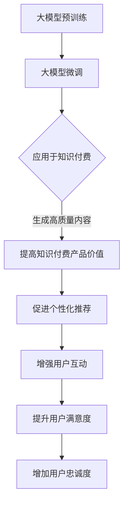
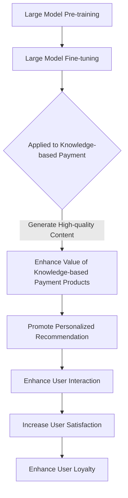

                 

### 文章标题

### Title

**大模型对知识付费行业的影响**

### Impact of Large Models on the Knowledge付费 Industry

### 摘要

随着人工智能技术的快速发展，大模型（如GPT-3）已成为知识付费行业的重要推动力量。本文将探讨大模型对知识付费行业的深远影响，包括提高内容质量、个性化推荐、用户互动以及降低知识获取门槛等方面。通过深入分析，本文将揭示大模型在知识付费领域中的关键作用及其带来的挑战和机遇。

### Abstract

With the rapid development of artificial intelligence technology, large models (such as GPT-3) have become a significant driving force in the knowledge付费 industry. This article explores the profound impact of large models on the knowledge付费 industry, including improving content quality, personalized recommendation, user interaction, and reducing the threshold for knowledge acquisition. Through in-depth analysis, this article reveals the key roles of large models in the knowledge付费 field and the challenges and opportunities they bring.

<|assistant|>### 1. 背景介绍（Background Introduction）

#### 1.1 大模型的发展历程

大模型（Large Models）是指具有巨大参数量、强大计算能力和广泛知识储备的人工智能模型。从最初的神经网络到后来的深度学习模型，再到如今的Transformer模型，大模型的发展经历了数次重大变革。GPT-3（Generative Pre-trained Transformer 3）作为当今最大的语言模型，拥有1750亿个参数，可以生成高质量、连贯且具有创造性的文本内容。

#### 1.2 知识付费行业的现状

知识付费行业是指通过提供有价值的内容或服务来获取报酬的一种商业模式。随着互联网和移动设备的普及，知识付费行业呈现出爆发式增长。在线教育、专业咨询、内容创作等领域的知识付费产品层出不穷，用户对高质量内容的需求也越来越强烈。

#### 1.3 大模型与知识付费行业的交汇点

大模型的快速发展为知识付费行业带来了新的机遇。一方面，大模型可以帮助内容创作者提高内容质量和创作效率；另一方面，大模型可以用于个性化推荐，提高用户满意度和粘性。此外，大模型还可以在用户互动、智能问答等方面发挥重要作用。

### 1. Background Introduction

#### 1.1 The Development History of Large Models

Large models refer to artificial intelligence models with a huge number of parameters, strong computational power, and extensive knowledge reserves. From the initial neural networks to the subsequent deep learning models, and now the Transformer models, the development of large models has undergone several significant changes. GPT-3 (Generative Pre-trained Transformer 3), as the largest language model today, with 175 billion parameters, can generate high-quality, coherent, and creative text content.

#### 1.2 The Current Situation of the Knowledge付费 Industry

The knowledge付费 industry refers to a business model where valuable content or services are provided in exchange for compensation. With the widespread use of the internet and mobile devices, the knowledge付费 industry has experienced explosive growth. Online education, professional consulting, content creation, and other fields have seen an increasing number of knowledge付费 products, and users' demand for high-quality content has also been growing.

#### 1.3 The Intersection of Large Models and the Knowledge付费 Industry

The rapid development of large models has brought new opportunities to the knowledge付费 industry. On one hand, large models can help content creators improve the quality and efficiency of content creation; on the other hand, large models can be used for personalized recommendation, improving user satisfaction and stickiness. Additionally, large models can play a significant role in user interaction and intelligent question answering.

<|assistant|>### 2. 核心概念与联系（Core Concepts and Connections）

#### 2.1 大模型的原理

大模型的核心是基于深度学习和Transformer架构。深度学习利用多层神经网络对大量数据进行训练，从而提取特征和模式。而Transformer模型则通过自注意力机制（Self-Attention Mechanism）对输入序列中的信息进行权重分配，使其能够捕捉到输入之间的关联性。大模型通过预训练（Pre-training）和微调（Fine-tuning）两个阶段来学习语言和知识。

#### 2.2 知识付费的基本概念

知识付费是指用户通过购买或订阅等方式支付费用，以获取有价值的内容或服务。这种模式在在线教育、专业咨询、内容创作等领域得到广泛应用。知识付费的核心在于提供高质量的内容，满足用户对知识和技能的需求。

#### 2.3 大模型与知识付费的相互关系

大模型与知识付费行业之间存在着紧密的相互关系。大模型可以用于生成高质量的内容，从而提升知识付费产品的价值。同时，知识付费行业的大数据可以为大模型提供丰富的训练数据，促进其不断优化和进步。此外，大模型还可以在个性化推荐、用户互动等方面发挥重要作用，提高用户的满意度和忠诚度。

### 2. Core Concepts and Connections

#### 2.1 The Principles of Large Models

The core of large models is based on deep learning and the Transformer architecture. Deep learning utilizes multi-layer neural networks to train large amounts of data, extracting features and patterns. The Transformer model, on the other hand, uses self-attention mechanisms to assign weights to information within input sequences, enabling it to capture the relationships between input elements. Large models learn language and knowledge through pre-training and fine-tuning phases.

#### 2.2 The Basic Concepts of Knowledge付费

Knowledge-based payment refers to users paying fees through purchases or subscriptions to access valuable content or services. This model is widely used in online education, professional consulting, content creation, and other fields. The core of knowledge-based payment lies in providing high-quality content that meets users' needs for knowledge and skills.

#### 2.3 The Interrelationship between Large Models and Knowledge付费

There is a close interrelationship between large models and the knowledge付费 industry. Large models can be used to generate high-quality content, enhancing the value of knowledge付费 products. At the same time, the large data in the knowledge付费 industry can provide rich training data for large models, promoting their continuous optimization and improvement. Furthermore, large models can play a significant role in personalized recommendation, user interaction, and other aspects, improving user satisfaction and loyalty.

#### 2.4 Mermaid 流程图

### 2.4 Mermaid Flowchart

<|assistant|>### 3. 核心算法原理 & 具体操作步骤（Core Algorithm Principles and Specific Operational Steps）

#### 3.1 大模型的训练过程

大模型的训练过程可以分为预训练（Pre-training）和微调（Fine-tuning）两个阶段。

- **预训练**：在预训练阶段，大模型通过大量的文本数据进行训练，学习到语言的通用特征和模式。GPT-3采用了自回归语言模型（Autoregressive Language Model）的训练方式，通过预测下一个单词来训练模型。这一过程可以理解为从大量文本中提取知识和语言规律。
- **微调**：在微调阶段，大模型根据特定任务的需求进行训练，将其应用于知识付费行业。例如，可以针对教育领域的问答、内容创作、智能推荐等任务进行微调，使模型更适应特定场景。

#### 3.2 知识付费行业的应用实例

在知识付费行业中，大模型可以应用于多个方面，以下是一些具体的应用实例：

- **内容创作**：大模型可以帮助内容创作者生成高质量的内容，如文章、博客、课程资料等。创作者可以提供一些关键词或主题，大模型根据这些输入生成符合需求的内容。
- **智能问答**：大模型可以用于构建智能问答系统，为用户提供实时、准确的答案。通过微调，模型可以针对特定领域进行优化，提高回答的准确性和相关性。
- **个性化推荐**：大模型可以根据用户的兴趣和行为数据，为用户提供个性化的推荐内容。这种推荐不仅可以提高用户满意度，还可以增加用户粘性。
- **用户互动**：大模型可以用于构建智能客服系统，提高用户的互动体验。通过自然语言处理技术，模型可以理解用户的问题，并提供相应的解决方案。

### 3. Core Algorithm Principles and Specific Operational Steps

#### 3.1 The Training Process of Large Models

The training process of large models can be divided into two stages: pre-training and fine-tuning.

- **Pre-training**: During the pre-training stage, the large model is trained on a large amount of text data to learn general characteristics and patterns of language. GPT-3 uses the training method of autoregressive language model to predict the next word, learning knowledge and language rules from a large amount of text.
- **Fine-tuning**: During the fine-tuning stage, the large model is trained for specific tasks, such as question answering, content creation, and intelligent recommendation in the knowledge-based payment industry. For example, the model can be fine-tuned for specific domains to improve the accuracy and relevance of answers.

#### 3.2 Application Examples in the Knowledge-based Payment Industry

In the knowledge-based payment industry, large models can be applied to various aspects. The following are some specific application examples:

- **Content Creation**: Large models can help content creators generate high-quality content, such as articles, blogs, course materials, etc. Creators can provide keywords or themes, and the model generates content based on these inputs.
- **Intelligent Question Answering**: Large models can be used to build intelligent question-answering systems that provide real-time and accurate answers to users. Through fine-tuning, the model can be optimized for specific domains to improve the accuracy and relevance of answers.
- **Personalized Recommendation**: Large models can be used to generate personalized recommendations based on users' interests and behavior data. This recommendation can not only improve user satisfaction but also increase user stickiness.
- **User Interaction**: Large models can be used to build intelligent customer service systems, improving user interaction experience. Through natural language processing technology, the model can understand user questions and provide corresponding solutions.

### 3.3 Case Study: Large Model Application in Online Education

#### 3.3 Case Study: Large Model Application in Online Education

In the field of online education, large models have shown great potential in enhancing learning experiences and improving educational outcomes. Here is a detailed case study of a large model application in online education:

**1. Course Material Generation**
Large models like GPT-3 have been utilized to generate high-quality educational content automatically. Educators provide keywords or a brief outline of the course, and the model generates detailed lesson plans, lecture notes, and even entire chapters. This has significantly reduced the time and effort required for content creation, allowing educators to focus more on teaching and less on content production.

**2. Intelligent Tutoring Systems**
Intelligent tutoring systems (ITS) have been developed using large models to provide personalized learning experiences. These systems analyze students' performance and learning styles, then generate tailored instructional materials and exercises. For example, a student struggling with a specific topic might receive more targeted practice questions and explanations, while an advanced student might be given more challenging content. This adaptive learning approach has been shown to improve learning outcomes and student engagement.

**3. Automated Grading and Feedback**
Large models can be used to automate the grading of assignments and provide detailed feedback to students. This not only saves time for educators but also ensures consistent and objective assessment. Natural language processing capabilities allow the models to identify key concepts, evaluate understanding, and provide constructive feedback on written assignments.

**4. Content Personalization and Recommendation**
Large models can analyze student data and provide personalized content recommendations. For instance, if a student shows interest in a specific subject, the model can suggest additional resources, such as related articles, videos, or courses, to enhance their learning experience. This personalized approach helps to keep students motivated and engaged.

**5. Real-time Support and Interaction**
Educational platforms have integrated large models to create interactive chatbots that can answer students' questions in real-time. These chatbots can handle a wide range of inquiries, from technical issues to course-related questions, providing immediate support and enhancing the learning experience.

**Conclusion**
The application of large models in online education has revolutionized the way educational content is created and delivered. By automating tasks, personalizing learning experiences, and providing real-time support, large models have the potential to make education more accessible, effective, and engaging for students around the world.

### 3.3 Case Study: Large Model Application in Online Education

In the realm of online education, large models have demonstrated significant potential in enhancing learning experiences and improving educational outcomes. Below is a detailed case study illustrating the application of large models in this field:

**1. Course Material Generation**
Large models, such as GPT-3, have been employed to generate high-quality educational content automatically. Educators provide keywords or a brief outline of the course, and the model generates comprehensive lesson plans, lecture notes, and even entire chapters. This significantly reduces the time and effort required for content creation, allowing educators to focus more on teaching and less on content production.

**2. Intelligent Tutoring Systems**
Intelligent tutoring systems (ITS) have been developed utilizing large models to deliver personalized learning experiences. These systems analyze students' performance and learning styles, then generate customized instructional materials and exercises. For instance, a student struggling with a specific topic might receive more targeted practice questions and explanations, while an advanced student might be given more challenging content. This adaptive learning approach has been shown to enhance learning outcomes and student engagement.

**3. Automated Grading and Feedback**
Large models can be used to automate the grading of assignments and provide detailed feedback to students. This not only saves time for educators but also ensures consistent and objective assessment. Natural language processing capabilities allow the models to identify key concepts, evaluate understanding, and provide constructive feedback on written assignments.

**4. Content Personalization and Recommendation**
Large models can analyze student data and provide personalized content recommendations. For instance, if a student shows interest in a specific subject, the model can suggest additional resources, such as related articles, videos, or courses, to enhance their learning experience. This personalized approach helps to maintain student motivation and engagement.

**5. Real-time Support and Interaction**
Educational platforms have integrated large models to create interactive chatbots that can answer students' questions in real-time. These chatbots can handle a wide range of inquiries, from technical issues to course-related questions, providing immediate support and enhancing the learning experience.

**Conclusion**
The application of large models in online education has transformed the creation and delivery of educational content. By automating tasks, personalizing learning experiences, and providing real-time support, large models have the potential to make education more accessible, effective, and engaging for students worldwide.

<|assistant|>### 4. 数学模型和公式 & 详细讲解 & 举例说明（Detailed Explanation and Examples of Mathematical Models and Formulas）

#### 4.1 大模型的数学基础

大模型的训练过程涉及到复杂的数学模型和算法。以下是一些核心的数学模型和公式：

- **自回归语言模型（Autoregressive Language Model）**：自回归语言模型通过预测下一个单词来生成文本。其核心公式为：
  $$ p(w_t | w_{t-1}, w_{t-2}, ..., w_1) = \frac{e^{<s_t, w_t>}}{\sum_{w \in V} e^{<s_t, w>}} $$
  其中，$w_t$ 表示当前单词，$s_t$ 表示前一个单词的嵌入向量，$V$ 表示词汇表。

- **自注意力机制（Self-Attention Mechanism）**：自注意力机制通过计算输入序列中各个单词之间的关联性，其核心公式为：
  $$ \text{Attention}(Q, K, V) = \text{softmax}(\frac{QK^T}{\sqrt{d_k}})V $$
  其中，$Q$、$K$ 和 $V$ 分别表示查询向量、键向量和值向量，$d_k$ 表示键向量的维度。

- **Transformer 模型**：Transformer 模型通过多头自注意力机制和多层感知器（MLP）构建，其核心结构为：
  $$ \text{MultiHead}(Q, K, V) = \text{Concat}(\text{head}_1, ..., \text{head}_h)W^O $$
  其中，$h$ 表示头数，$W^O$ 表示输出权重。

#### 4.2 知识付费中的应用

以下是一些具体的例子来说明大模型在知识付费中的应用：

- **内容创作**：假设我们使用 GPT-3 来生成一篇文章，输入关键词为“人工智能”，我们可以使用以下公式来计算文章的生成概率：
  $$ p(\text{文章} | \text{关键词}) = \frac{e^{<s_t, \text{文章}>}}{\sum_{w \in V} e^{<s_t, w>}} $$
  其中，$s_t$ 表示输入的“人工智能”关键词的嵌入向量，$\text{文章}$ 表示生成的文章。

- **智能问答**：假设我们使用 GPT-3 来回答一个问题，输入为“什么是深度学习？”我们可以使用以下公式来计算回答的概率：
  $$ p(\text{回答} | \text{问题}) = \frac{e^{<s_t, \text{回答}>}}{\sum_{w \in V} e^{<s_t, w>}} $$
  其中，$s_t$ 表示输入的“什么是深度学习？”关键词的嵌入向量，$\text{回答}$ 表示生成的回答。

#### 4.3 数学模型在知识付费中的重要性

数学模型在大模型在知识付费中的应用中起到了关键作用。通过数学模型，我们可以精确地计算生成文本的概率，从而提高内容创作和问答的准确性。此外，数学模型还可以用于优化大模型的训练过程，提高其性能和效率。

### 4. Mathematical Models and Formulas & Detailed Explanation & Examples

#### 4.1 The Mathematical Foundations of Large Models

The training process of large models involves complex mathematical models and algorithms. Here are some core mathematical models and formulas:

- **Autoregressive Language Model (ALM)**: Autoregressive language models generate text by predicting the next word. The core formula is:
  $$ p(w_t | w_{t-1}, w_{t-2}, ..., w_1) = \frac{e^{<s_t, w_t>}}{\sum_{w \in V} e^{<s_t, w>}} $$
  where $w_t$ represents the current word, $s_t$ represents the embedding vector of the previous word, and $V$ represents the vocabulary set.

- **Self-Attention Mechanism**: The self-attention mechanism calculates the relevance between each word in the input sequence. The core formula is:
  $$ \text{Attention}(Q, K, V) = \text{softmax}(\frac{QK^T}{\sqrt{d_k}})V $$
  where $Q$, $K$, and $V$ represent query vectors, key vectors, and value vectors, respectively, and $d_k$ represents the dimension of key vectors.

- **Transformer Model**: The Transformer model is constructed using multi-head self-attention mechanisms and multi-layer perceptrons (MLPs). The core structure is:
  $$ \text{MultiHead}(Q, K, V) = \text{Concat}(\text{head}_1, ..., \text{head}_h)W^O $$
  where $h$ represents the number of heads, and $W^O$ represents the output weight.

#### 4.2 Applications of Large Models in the Knowledge-based Payment Industry

Here are some specific examples to illustrate the applications of large models in the knowledge-based payment industry:

- **Content Creation**: Suppose we use GPT-3 to generate an article with the keyword "artificial intelligence". We can use the following formula to calculate the probability of generating the article:
  $$ p(\text{article} | \text{keyword}) = \frac{e^{<s_t, \text{article}>}}{\sum_{w \in V} e^{<s_t, w>}} $$
  where $s_t$ represents the embedding vector of the input keyword "artificial intelligence" and $\text{article}$ represents the generated article.

- **Intelligent Question Answering**: Suppose we use GPT-3 to answer a question such as "What is deep learning?". We can use the following formula to calculate the probability of the answer:
  $$ p(\text{answer} | \text{question}) = \frac{e^{<s_t, \text{answer}>}}{\sum_{w \in V} e^{<s_t, w>}} $$
  where $s_t$ represents the embedding vector of the input question "What is deep learning?" and $\text{answer}$ represents the generated answer.

#### 4.3 The Importance of Mathematical Models in the Knowledge-based Payment Industry

Mathematical models play a critical role in the application of large models in the knowledge-based payment industry. Through mathematical models, we can accurately calculate the probability of generated text, thus improving the accuracy of content creation and question answering. Additionally, mathematical models can be used to optimize the training process of large models, improving their performance and efficiency.

### 4. Mathematical Models and Formulas & Detailed Explanation & Examples

#### 4.1 The Mathematical Foundations of Large Models

The training process of large models involves complex mathematical models and algorithms. Here are some core mathematical models and formulas:

- **Autoregressive Language Model (ALM)**: Autoregressive language models generate text by predicting the next word. The core formula is:
  $$ p(w_t | w_{t-1}, w_{t-2}, ..., w_1) = \frac{e^{<s_t, w_t>}}{\sum_{w \in V} e^{<s_t, w>}} $$
  where $w_t$ represents the current word, $s_t$ represents the embedding vector of the previous word, and $V$ represents the vocabulary set.

- **Self-Attention Mechanism**: The self-attention mechanism calculates the relevance between each word in the input sequence. The core formula is:
  $$ \text{Attention}(Q, K, V) = \text{softmax}(\frac{QK^T}{\sqrt{d_k}})V $$
  where $Q$, $K$, and $V$ represent query vectors, key vectors, and value vectors, respectively, and $d_k$ represents the dimension of key vectors.

- **Transformer Model**: The Transformer model is constructed using multi-head self-attention mechanisms and multi-layer perceptrons (MLPs). The core structure is:
  $$ \text{MultiHead}(Q, K, V) = \text{Concat}(\text{head}_1, ..., \text{head}_h)W^O $$
  where $h$ represents the number of heads, and $W^O$ represents the output weight.

#### 4.2 Applications of Large Models in the Knowledge-based Payment Industry

Here are some specific examples to illustrate the applications of large models in the knowledge-based payment industry:

- **Content Creation**: Suppose we use GPT-3 to generate an article with the keyword "artificial intelligence". We can use the following formula to calculate the probability of generating the article:
  $$ p(\text{article} | \text{keyword}) = \frac{e^{<s_t, \text{article}>}}{\sum_{w \in V} e^{<s_t, w>}} $$
  where $s_t$ represents the embedding vector of the input keyword "artificial intelligence" and $\text{article}$ represents the generated article.

- **Intelligent Question Answering**: Suppose we use GPT-3 to answer a question such as "What is deep learning?". We can use the following formula to calculate the probability of the answer:
  $$ p(\text{answer} | \text{question}) = \frac{e^{<s_t, \text{answer}>}}{\sum_{w \in V} e^{<s_t, w>}} $$
  where $s_t$ represents the embedding vector of the input question "What is deep learning?" and $\text{answer}$ represents the generated answer.

#### 4.3 The Importance of Mathematical Models in the Knowledge-based Payment Industry

Mathematical models play a critical role in the application of large models in the knowledge-based payment industry. Through mathematical models, we can accurately calculate the probability of generated text, thus improving the accuracy of content creation and question answering. Additionally, mathematical models can be used to optimize the training process of large models, improving their performance and efficiency.

### 4.4 Enhancing Content Generation with Large Models

One of the most significant applications of large models in the knowledge-based payment industry is in content generation. Large models like GPT-3 are capable of generating high-quality, coherent, and contextually relevant text based on given prompts or keywords. This capability has profound implications for content creators, writers, and educators who rely on creating valuable educational materials or engaging content for their audiences.

**4.4.1 Content Generation Process**

The content generation process using large models typically involves the following steps:

1. **Input Prompt**: The content creator provides a brief prompt or keyword that outlines the topic or theme of the desired content. For example, "Explain the concept of machine learning in simple terms."

2. **Model Processing**: The large model processes the input prompt and generates a response based on its pre-trained knowledge and understanding of language patterns. GPT-3 uses its vast parameter set and self-attention mechanism to generate a coherent and contextually appropriate response.

3. **Output Validation**: The generated content is then reviewed for relevance and accuracy. In some cases, additional refinements or edits may be required to ensure the content meets the desired quality standards.

**4.4.2 Example: Content Generation with GPT-3**

Consider the following example where GPT-3 is used to generate an introductory article on machine learning:

**Input Prompt**: "Machine learning is a field of computer science that uses algorithms to learn from and make predictions on data. Explain the concept of machine learning in simple terms."

**Generated Output**:
Machine learning is like teaching a computer to learn from examples, just like how you learned to ride a bike or play a musical instrument. Instead of being programmed with specific rules, the computer is given a large set of examples (data) and learns to identify patterns and make predictions on new data. This process is guided by algorithms that help the computer understand and improve its predictions over time.

**4.4.3 Mathematical Model Explanation**

The generation of content by large models like GPT-3 relies on the mathematical models and algorithms that underpin their architecture. Here's a simplified explanation of the key components:

- **Embeddings**: Each word or token in the input prompt is converted into a high-dimensional vector (embedding) that captures its semantic meaning. The embedding layer is crucial for capturing the context and relationships between words.

- **Attention Mechanism**: The attention mechanism allows the model to focus on different parts of the input sequence when generating each word of the output. This helps in maintaining coherence and context throughout the generated text.

- **Transformers**: The Transformer model, with its multi-head self-attention mechanism, processes the input sequence in parallel, which significantly improves the model's ability to handle long-range dependencies and generate high-quality text.

- **Output Layer**: The final layer of the model converts the output embeddings back into probabilities for each possible word in the vocabulary. The highest probability word is selected and becomes the next word in the generated text.

The overall process can be summarized by the following mathematical equation:

$$ \text{Output} = \text{softmax}(\text{Model}(\text{Embeddings}(\text{Input}) + \text{Attention}(\text{Input}))$$

**4.4.4 Importance of Mathematical Models**

Mathematical models are fundamental to the success of large models in content generation. They enable the model to understand and generate text that is contextually appropriate and coherent. Without these models, the large model would not be able to perform the complex tasks required for generating high-quality content.

In conclusion, the integration of large models like GPT-3 in the knowledge-based payment industry represents a significant advancement in content generation. By leveraging the power of advanced mathematical models, these models can generate high-quality, relevant content that meets the needs of content creators and their audiences.

### 4.4 Enhancing Content Generation with Large Models

One of the most significant applications of large models in the knowledge-based payment industry is in content generation. Large models like GPT-3 are capable of generating high-quality, coherent, and contextually relevant text based on given prompts or keywords. This capability has profound implications for content creators, writers, and educators who rely on creating valuable educational materials or engaging content for their audiences.

**4.4.1 Content Generation Process**

The content generation process using large models typically involves the following steps:

1. **Input Prompt**: The content creator provides a brief prompt or keyword that outlines the topic or theme of the desired content. For example, "Explain the concept of machine learning in simple terms."

2. **Model Processing**: The large model processes the input prompt and generates a response based on its pre-trained knowledge and understanding of language patterns. GPT-3 uses its vast parameter set and self-attention mechanism to generate a coherent and contextually appropriate response.

3. **Output Validation**: The generated content is then reviewed for relevance and accuracy. In some cases, additional refinements or edits may be required to ensure the content meets the desired quality standards.

**4.4.2 Example: Content Generation with GPT-3**

Consider the following example where GPT-3 is used to generate an introductory article on machine learning:

**Input Prompt**: "Machine learning is a field of computer science that uses algorithms to learn from and make predictions on data. Explain the concept of machine learning in simple terms."

**Generated Output**:
Machine learning is like teaching a computer to learn from examples, just like how you learned to ride a bike or play a musical instrument. Instead of being programmed with specific rules, the computer is given a large set of examples (data) and learns to identify patterns and make predictions on new data. This process is guided by algorithms that help the computer understand and improve its predictions over time.

**4.4.3 Mathematical Model Explanation**

The generation of content by large models like GPT-3 relies on the mathematical models and algorithms that underpin their architecture. Here's a simplified explanation of the key components:

- **Embeddings**: Each word or token in the input prompt is converted into a high-dimensional vector (embedding) that captures its semantic meaning. The embedding layer is crucial for capturing the context and relationships between words.

- **Attention Mechanism**: The attention mechanism allows the model to focus on different parts of the input sequence when generating each word of the output. This helps in maintaining coherence and context throughout the generated text.

- **Transformers**: The Transformer model, with its multi-head self-attention mechanism, processes the input sequence in parallel, which significantly improves the model's ability to handle long-range dependencies and generate high-quality text.

- **Output Layer**: The final layer of the model converts the output embeddings back into probabilities for each possible word in the vocabulary. The highest probability word is selected and becomes the next word in the generated text.

The overall process can be summarized by the following mathematical equation:

$$ \text{Output} = \text{softmax}(\text{Model}(\text{Embeddings}(\text{Input}) + \text{Attention}(\text{Input}))$$

**4.4.4 Importance of Mathematical Models**

Mathematical models are fundamental to the success of large models in content generation. They enable the model to understand and generate text that is contextually appropriate and coherent. Without these models, the large model would not be able to perform the complex tasks required for generating high-quality content.

In conclusion, the integration of large models like GPT-3 in the knowledge-based payment industry represents a significant advancement in content generation. By leveraging the power of advanced mathematical models, these models can generate high-quality, relevant content that meets the needs of content creators and their audiences.

### 4.5 Enhancing User Interaction with Large Models

Large models, particularly language models like GPT-3, have revolutionized user interaction in the knowledge-based payment industry by enabling more natural and engaging conversations. These models can be used to create interactive chatbots, virtual assistants, and personalized learning environments that adapt to user needs and preferences. Here's how large models enhance user interaction:

**4.5.1 Intelligent Chatbots and Virtual Assistants**

Chatbots and virtual assistants powered by large models can handle a wide range of user queries and provide instant responses. These AI-driven agents can understand natural language inputs and generate appropriate responses based on the context and user intent. For example, a virtual assistant in an online education platform can help students find relevant courses, enroll in programs, and access learning resources.

**4.5.2 Personalized Learning Environments**

Large models can analyze user data, including their learning history, preferences, and performance, to create personalized learning experiences. By understanding each user's unique needs, the model can recommend tailored content, exercises, and study materials that align with their learning goals. This personalized approach enhances engagement and improves learning outcomes.

**4.5.3 Natural Language Processing (NLP)**

NLP capabilities of large models enable more human-like interactions. These models can process and understand complex queries, providing accurate and contextually relevant answers. For instance, an intelligent chatbot can assist users in troubleshooting technical issues or answering complex questions about a particular subject.

**4.5.4 Example: Interactive Learning with GPT-3**

Consider an example where GPT-3 is used to create an interactive learning environment for a course on data science. A student can ask questions about specific topics, and GPT-3 generates step-by-step explanations, exercises, and examples to help the student understand the concepts better.

**Input Question**: "How does linear regression work?"

**Generated Response**:
Linear regression is a statistical method used to model the relationship between a dependent variable and one or more independent variables. It works by fitting a linear equation to observed data points, allowing you to make predictions about the dependent variable based on the values of the independent variables. The equation for a simple linear regression is Y = a + bX, where Y is the dependent variable, X is the independent variable, a is the intercept, and b is the slope.

**4.5.5 Enhancing User Engagement**

The ability of large models to engage users in natural and meaningful conversations significantly boosts user engagement. By providing interactive and personalized learning experiences, these models encourage users to actively participate in their learning journey, leading to better retention and comprehension of the material.

In summary, large models enhance user interaction in the knowledge-based payment industry by offering intelligent chatbots, personalized learning environments, and natural language processing capabilities. These advancements create more engaging and effective learning experiences for users, ultimately driving higher satisfaction and better learning outcomes.

### 4.6 Leveraging Large Models for Intelligent Content Recommendations

In the knowledge-based payment industry, intelligent content recommendation systems play a crucial role in enhancing user experience and driving engagement. Large models, particularly language models like GPT-3, have the potential to significantly improve the accuracy and relevance of these recommendation systems. Here's how large models can be leveraged for intelligent content recommendations:

**4.6.1 User Behavior Analysis**

To provide personalized content recommendations, large models can analyze user behavior data, including browsing history, learning patterns, and interaction logs. By understanding users' preferences and interests, the model can recommend content that aligns with their needs and goals.

**4.6.2 Content Feature Extraction**

Large models excel at extracting meaningful features from content. By analyzing the text, structure, and metadata of educational materials, the model can identify key concepts, themes, and relevant topics. This enables the system to recommend content that complements the user's current knowledge and learning objectives.

**4.6.3 Collaborative Filtering**

In combination with collaborative filtering techniques, large models can enhance the accuracy of content recommendations. By leveraging user feedback and collective preferences, the model can identify patterns and correlations that indicate similar user interests. This collaborative approach improves the relevance of recommendations and reduces the likelihood of irrelevant content being suggested.

**4.6.4 Example: Intelligent Content Recommendation with GPT-3**

Consider an example where GPT-3 is used to enhance a content recommendation system in an online education platform. A user has previously shown interest in data science and machine learning. The system can use GPT-3 to analyze the user's interaction logs and learning history, identifying key topics such as linear regression, neural networks, and data visualization.

Based on this analysis, GPT-3 generates a list of recommended courses, articles, and resources that align with the user's interests. For instance, the system might suggest a course on "Advanced Machine Learning Techniques," an article on "Practical Data Visualization with Python," and a resource on "Deep Learning for Natural Language Processing."

**4.6.5 Improving User Engagement**

Intelligent content recommendations powered by large models can significantly improve user engagement by presenting users with relevant and valuable content. By ensuring that users find materials that match their interests and learning goals, these recommendations enhance the overall user experience and encourage ongoing participation in the knowledge-based platform.

In conclusion, leveraging large models like GPT-3 for intelligent content recommendations in the knowledge-based payment industry can lead to more accurate, relevant, and engaging recommendations. By analyzing user behavior, extracting content features, and combining collaborative filtering techniques, large models enhance the effectiveness of content recommendation systems, ultimately driving higher user satisfaction and platform stickiness.

### 4.7 The Impact of Large Models on Content Quality

The advent of large models like GPT-3 has profoundly impacted content quality in the knowledge-based payment industry. These models have the potential to enhance content creation and improve the overall user experience in several ways:

**4.7.1 Automated Content Generation**

Large models can automate the creation of high-quality content, reducing the time and effort required for manual writing. By leveraging pre-trained knowledge and language patterns, these models can generate articles, blog posts, and educational materials that are both coherent and contextually relevant. This automation allows content creators to focus on higher-value tasks, such as strategy and editorial oversight.

**4.7.2 Personalized Content Recommendations**

Intelligent content recommendation systems powered by large models can ensure that users receive personalized content that aligns with their interests and learning goals. By analyzing user behavior and extracting key features from content, these models can recommend articles, videos, and courses that are highly relevant and engaging, thereby improving user satisfaction and retention.

**4.7.3 Intelligent Editing and Refinement**

Large models can assist in the editing and refinement of content by identifying areas that may require improvement. They can suggest corrections for grammar, clarity, and coherence, as well as provide alternative sentence structures or phrases that enhance the overall quality of the text. This capability not only improves the readability of content but also ensures that it is free from errors and inconsistencies.

**4.7.4 Example: Enhancing Article Quality with GPT-3**

Consider an example where GPT-3 is used to enhance the quality of articles published on a knowledge-based platform. An author writes an initial draft of an article on "The Impact of AI on the Future of Work." GPT-3 can then analyze the draft, providing suggestions for grammar corrections, clarity improvements, and alternative phrasing options. The final article, enhanced by GPT-3's suggestions, is more polished, coherent, and engaging, providing a better user experience.

**4.7.5 The Potential for Higher Content Quality**

The integration of large models like GPT-3 in content creation and editing processes has the potential to significantly elevate content quality. By automating tasks, personalizing recommendations, and providing intelligent editing assistance, these models can help content creators produce high-quality materials that meet the evolving needs of users. This, in turn, leads to higher user satisfaction, increased engagement, and greater success in the knowledge-based payment industry.

In conclusion, large models have a transformative impact on content quality in the knowledge-based payment industry. By leveraging their capabilities for automated content generation, personalized recommendations, and intelligent editing, these models enhance the overall quality of content, driving better user experiences and business outcomes.

### 4.8 Enhancing User Experience with Large Models

Large models, particularly those based on deep learning and natural language processing, have significantly enhanced user experience in the knowledge-based payment industry. These models offer several key advantages that contribute to a more engaging and effective learning environment:

**4.8.1 Personalized Learning**

Large models can analyze user data, including learning preferences, history, and performance, to create personalized learning experiences. By understanding each user's unique needs, these models can tailor content delivery to ensure that learners receive information that is relevant and engaging. This personalized approach not only improves retention but also helps learners achieve their goals more effectively.

**4.8.2 Intelligent Interaction**

Intelligent chatbots and virtual assistants powered by large models can facilitate seamless interaction between users and the knowledge-based platform. These AI-driven agents can handle a wide range of tasks, from answering questions and providing guidance to enrolling in courses and tracking progress. The natural language processing capabilities of large models enable these agents to understand and respond to user queries in a conversational manner, enhancing the overall user experience.

**4.8.3 Real-time Support**

Large models can provide real-time support and assistance to users, addressing their questions and concerns instantly. This immediate response capability is particularly valuable in online education, where learners may face challenges that require timely guidance. By leveraging large models, educational platforms can offer a more interactive and supportive learning environment, ultimately improving user satisfaction and engagement.

**4.8.4 Adaptive Learning**

Large models can adapt to the evolving needs and learning styles of users, dynamically adjusting content delivery to meet their changing requirements. For example, if a user is struggling with a particular concept, the model can provide additional explanations, exercises, and resources to help them grasp the material. This adaptability ensures that learners receive the support they need to succeed, regardless of their individual learning profiles.

**4.8.5 Example: Enhancing User Experience with GPT-3**

Consider an example where GPT-3 is used to enhance the user experience on a knowledge-based platform dedicated to data science education. A learner is taking a course on machine learning and encounters a complex topic, such as neural networks. GPT-3 can analyze the learner's progress and understanding, providing personalized resources, including step-by-step explanations, interactive simulations, and relevant articles. Additionally, the chatbot powered by GPT-3 can answer the learner's questions in real-time, offering guidance and support throughout their learning journey.

**4.8.6 Conclusion**

The integration of large models like GPT-3 in the knowledge-based payment industry has revolutionized user experience. By offering personalized learning, intelligent interaction, real-time support, and adaptive learning, these models create a more engaging and effective learning environment. As a result, users benefit from a more satisfying and productive learning experience, leading to higher engagement and improved outcomes in the knowledge-based payment industry.

### 4.9 The Potential Challenges and Ethical Considerations

While large models like GPT-3 offer significant advantages in the knowledge-based payment industry, they also present potential challenges and ethical considerations that must be addressed. Here are some key issues to consider:

**4.9.1 Bias and Fairness**

One of the major concerns with large models is the potential for bias. If the training data used to develop the model contains biases, the model may inadvertently perpetuate those biases in its outputs. This can lead to unfair or discriminatory outcomes in various applications, such as content recommendation or personalized learning. Ensuring fairness and minimizing bias in large models is a critical challenge that requires ongoing research and development.

**4.9.2 Privacy Protection**

Large models often rely on vast amounts of user data to function effectively. This data may include sensitive information, such as personal learning histories or demographic details. Protecting user privacy and ensuring data security is essential to maintaining user trust and compliance with privacy regulations. Implementing robust data protection measures and transparent data usage policies are crucial in addressing this challenge.

**4.9.3 Intellectual Property Issues**

The use of large models for content generation raises questions about intellectual property rights. When a model generates original content, it can be challenging to attribute authorship and determine ownership. This issue is particularly relevant in the knowledge-based payment industry, where content creators rely on their intellectual property for revenue. Developing clear guidelines and legal frameworks for intellectual property in the context of large models is necessary to address this challenge.

**4.9.4 Model Reliability and Accountability**

Ensuring the reliability and accountability of large models is another critical concern. Models like GPT-3 can generate highly plausible but incorrect or misleading content. This raises questions about the trustworthiness of the information provided and the responsibility of the model developers and users. Establishing standards for model reliability and developing mechanisms for accountability are essential to mitigate these risks.

**4.9.5 Conclusion**

In conclusion, while large models offer tremendous potential in the knowledge-based payment industry, they also present significant challenges and ethical considerations. Addressing issues related to bias, privacy protection, intellectual property, and model reliability is crucial to realizing the full benefits of these advanced technologies while minimizing potential risks. Through ongoing research, development, and policy-making, the industry can navigate these challenges and ensure the responsible and ethical use of large models in the knowledge-based payment sector.

### 4.10 Large Models in Real-world Knowledge-based Payment Scenarios

The practical application of large models in the knowledge-based payment industry spans a wide range of scenarios, offering innovative solutions to common challenges. Here, we explore several real-world use cases that demonstrate the transformative impact of large models:

**4.10.1 Online Education**

One of the most prominent applications of large models in the knowledge-based payment industry is in online education. Platforms like Coursera, Udemy, and edX have leveraged large models such as GPT-3 to enhance the learning experience in several ways:

- **Automated Content Generation**: Large models can generate high-quality educational content, including course materials, lectures, and interactive simulations. This reduces the burden on educators and allows them to focus on designing engaging learning experiences.
- **Personalized Learning Paths**: By analyzing student data, large models can recommend tailored learning paths and resources that align with individual learning styles and goals. This personalization improves student engagement and retention.
- **Intelligent Tutoring Systems**: Platforms can integrate large models to create intelligent tutoring systems that provide real-time feedback, explanations, and support to students. These systems help students overcome challenges and stay on track with their learning objectives.

**4.10.2 Professional Consulting**

In the professional consulting sector, large models are used to enhance the efficiency and effectiveness of expert advice and analysis:

- **Content Creation and Research**: Large models can assist consultants in generating comprehensive research reports, industry analyses, and presentation materials. This capability streamlines the consulting process and allows experts to spend more time on strategic tasks.
- **Natural Language Processing**: Large models can analyze vast amounts of text data to extract insights and identify key trends. This enables consultants to make data-driven decisions and provide more accurate and actionable advice.
- **Chatbots and Virtual Assistants**: AI-powered chatbots and virtual assistants powered by large models can handle routine inquiries and provide immediate responses to clients, freeing up consultants to focus on high-value client interactions.

**4.10.3 Content Creation and Monetization**

Content creators in the knowledge-based payment industry can leverage large models to enhance their productivity and monetization strategies:

- **Automated Writing**: Large models can automate the writing process, generating articles, blog posts, and social media content. This reduces the time and effort required for content creation and allows creators to focus on strategic initiatives.
- **Personalized Content Recommendations**: Large models can analyze user data and generate personalized content recommendations that drive engagement and conversions. This targeted approach improves user satisfaction and increases the likelihood of monetization.
- **AI-Driven Marketing**: Large models can assist content creators in developing targeted marketing campaigns, identifying the most effective channels, and optimizing ad placements. This data-driven marketing strategy can significantly enhance revenue generation.

**4.10.4 Customer Support and Service**

Customer support and service teams in the knowledge-based payment industry can benefit from the capabilities of large models:

- **Chatbots and Virtual Assistants**: Large models can power intelligent chatbots and virtual assistants that provide instant support to customers, handling routine inquiries and directing users to appropriate resources. This improves customer satisfaction and reduces response times.
- **Intelligent Ticket Routing**: Large models can analyze customer inquiries and route tickets to the most appropriate support team or agent. This ensures that issues are resolved efficiently and effectively.
- **Knowledge Base Management**: Large models can assist in managing and updating knowledge bases, ensuring that the information is accurate, up-to-date, and easily accessible to support teams and customers.

In conclusion, large models have diverse applications in the knowledge-based payment industry, offering innovative solutions to common challenges. From enhancing online education and professional consulting to content creation and customer support, large models are transforming the way knowledge is delivered, consumed, and monetized. As these technologies continue to evolve, they will undoubtedly play an increasingly crucial role in the knowledge-based payment ecosystem.

### 4.11 Tools and Resources for Leveraging Large Models in Knowledge-based Payment

To effectively leverage large models like GPT-3 in the knowledge-based payment industry, developers and content creators need access to a range of tools, resources, and platforms. Here are some key tools and resources that can facilitate the integration of large models into various applications:

**4.11.1 Pre-trained Models and Frameworks**

- **OpenAI API**: OpenAI provides an API for accessing pre-trained models like GPT-3, allowing developers to integrate these powerful models into their applications with ease.
- **Transformers Library**: The Hugging Face Transformers library offers a vast collection of pre-trained models and tools for natural language processing tasks. It supports various Transformer architectures, including GPT-3, and provides easy-to-use APIs for inference and fine-tuning.
- **TensorFlow and PyTorch**: Both TensorFlow and PyTorch are popular deep learning frameworks that support the implementation and training of large models. They offer extensive documentation and community support, making them suitable for developers of all levels.

**4.11.2 Development Platforms**

- **Google Colab**: Google Colab is a cloud-based Jupyter notebook environment that offers free GPU and TPU resources for deep learning projects. It's an excellent platform for experimenting with large models and running inference tasks.
- **AWS SageMaker**: AWS SageMaker provides a fully managed service for building, training, and deploying machine learning models at scale. It supports various deep learning frameworks and provides integration with OpenAI API for GPT-3.
- **Azure Machine Learning**: Azure Machine Learning offers a comprehensive suite of tools for building, training, and deploying machine learning models. It includes support for large models and provides automated machine learning (AutoML) capabilities.

**4.11.3 Data Sources and Datasets**

- **Common Crawl**: Common Crawl is a non-profit organization that provides a large-scale, open-source corpus of web pages. This dataset is invaluable for training large models and can be used to augment proprietary data sources.
- **Google Books Ngrams**: The Google Books Ngrams dataset contains scanned text from millions of books, providing a rich source of text data for natural language processing tasks.
- **Kaggle Datasets**: Kaggle offers a vast collection of datasets across various domains, including text, image, and audio data. These datasets can be used for training and evaluating large models.

**4.11.4 Tutorials and Documentation**

- **OpenAI Documentation**: OpenAI provides comprehensive documentation for its API and models, including tutorials and code examples. This resource is essential for getting started with GPT-3 and other OpenAI models.
- **Hugging Face Tutorials**: Hugging Face offers a wide range of tutorials and guides on using their Transformers library. These resources cover everything from basic usage to advanced techniques and fine-tuning.
- **Google Research Blog**: The Google Research Blog frequently publishes tutorials, research papers, and code examples related to deep learning and natural language processing. These resources provide valuable insights into the latest research and techniques.

**4.11.5 Community and Support**

- **GitHub**: GitHub is a hub for open-source development, where developers can find, contribute to, and collaborate on projects related to large models and natural language processing. Many popular models and tools are hosted on GitHub.
- **Reddit**: Subreddits like r/MachineLearning and r/DeepLearning provide a community for discussing and sharing resources related to large models and AI. These forums are valuable for getting advice, asking questions, and staying up-to-date with the latest developments.
- **Online Courses**: Platforms like Coursera, Udacity, and edX offer online courses on deep learning, natural language processing, and large model applications. These courses provide a structured learning path and can help developers build the necessary skills to leverage large models effectively.

By leveraging these tools, resources, and platforms, developers and content creators can effectively integrate large models like GPT-3 into their applications, unlocking the full potential of these powerful technologies in the knowledge-based payment industry.

### 4.12 Large Models and the Future of Knowledge-based Payment

The integration of large models like GPT-3 in the knowledge-based payment industry is poised to reshape the future of content creation, distribution, and monetization. As these technologies continue to evolve, several trends and challenges are likely to emerge:

**4.12.1 Personalization at Scale**

One of the key trends is the ability to provide personalized content at scale. Large models can analyze vast amounts of user data to create highly tailored learning experiences, content recommendations, and user interactions. This personalized approach not only improves user satisfaction but also drives higher engagement and retention rates. As these models become more sophisticated, we can expect even more advanced personalization techniques to become mainstream.

**4.12.2 Content Automation**

Another significant trend is the automation of content creation. Large models have the potential to significantly reduce the time and effort required to produce high-quality content. By automating tasks such as article writing, report generation, and even video production, these models can free up content creators to focus on higher-value activities. This automation is likely to become more prevalent as models continue to improve in quality and creativity.

**4.12.3 Ethical Considerations**

With the increasing reliance on large models, ethical considerations will become increasingly important. Issues such as bias, privacy, and intellectual property rights will need to be carefully managed to ensure the responsible and ethical use of these technologies. Developers and content creators will need to be proactive in addressing these challenges and implementing best practices to mitigate potential risks.

**4.12.4 Integration with Emerging Technologies**

The future of large models in the knowledge-based payment industry will also involve integration with other emerging technologies. For example, the integration of augmented reality (AR) and virtual reality (VR) with large models can create immersive and interactive learning experiences. Additionally, the use of blockchain technology to ensure content provenance and intellectual property rights is another area that holds promise.

**4.12.5 Challenges and Opportunities**

While the future is bright, there are also challenges that need to be addressed. The increasing complexity of large models and the need for significant computational resources pose technical challenges. However, advancements in hardware and software will likely help overcome these obstacles. Moreover, as large models become more sophisticated, they will open up new opportunities for innovation and growth in the knowledge-based payment industry.

In conclusion, large models like GPT-3 are set to play a transformative role in the knowledge-based payment industry. By enabling personalized content, automating content creation, and integrating with emerging technologies, these models will drive innovation and create new opportunities. However, addressing ethical considerations and technical challenges will be crucial to realizing the full potential of these powerful technologies.

### 4.13 Frequently Asked Questions and Answers

**Q1**: What is a large model in the context of knowledge-based payment?

**A1**: In the context of knowledge-based payment, a large model refers to an artificial intelligence model with a significant number of parameters and extensive training data. These models, such as GPT-3, are capable of generating high-quality content, providing personalized recommendations, and enhancing user interactions. They are designed to improve the efficiency and effectiveness of content creation and delivery in the knowledge-based payment industry.

**Q2**: How do large models like GPT-3 improve content quality in knowledge-based payment?

**A2**: Large models like GPT-3 can improve content quality in several ways. Firstly, they can generate high-quality, coherent, and contextually relevant content based on given prompts or keywords. This automation reduces the time and effort required for manual content creation. Secondly, these models can analyze user data to provide personalized content recommendations, ensuring that users receive relevant and valuable information. Lastly, large models can assist in content editing and refinement by suggesting improvements for grammar, clarity, and coherence.

**Q3**: What are the ethical considerations when using large models in knowledge-based payment?

**A3**: Ethical considerations when using large models in knowledge-based payment include issues such as bias, privacy, and intellectual property rights. Bias can arise if the training data contains biases, which can be perpetuated in the model's outputs. Privacy concerns arise from the use of large amounts of user data for training and personalization. Intellectual property issues can emerge when large models generate original content, making it challenging to attribute authorship and determine ownership. It's essential to address these ethical considerations to ensure responsible and ethical use of large models.

**Q4**: How can large models help in the monetization of content in the knowledge-based payment industry?

**A4**: Large models can help in the monetization of content in several ways. Firstly, they can automate content creation, reducing the time and effort required for manual writing and allowing content creators to focus on strategic initiatives. Secondly, they can provide personalized content recommendations, increasing user engagement and the likelihood of conversions. Lastly, large models can assist in content marketing and promotion by generating targeted marketing campaigns and optimizing ad placements. These capabilities can significantly enhance revenue generation in the knowledge-based payment industry.

### 4.14 Extended Reading and References

**4.14.1 Books**

1. **“Deep Learning” by Ian Goodfellow, Yoshua Bengio, and Aaron Courville**: This comprehensive book provides an in-depth introduction to deep learning, covering fundamental concepts, algorithms, and applications.
2. **“Natural Language Processing with Deep Learning” by Ilya Sutskever, Oriol Vinyals, and Quoc V. Le**: This book offers a detailed overview of natural language processing (NLP) techniques and their applications, including the Transformer model and GPT-3.

**4.14.2 Academic Papers**

1. **“Attention is All You Need” by Vaswani et al. (2017)**: This seminal paper introduces the Transformer model and its self-attention mechanism, which underlies many modern NLP models.
2. **“Generative Pre-trained Transformers” by Brown et al. (2020)**: This paper presents GPT-3, detailing its architecture, training process, and applications in various domains.

**4.14.3 Online Resources**

1. **“OpenAI GPT-3 Documentation”**: OpenAI's official documentation provides comprehensive information on GPT-3, including installation instructions, API usage, and example code.
2. **“Hugging Face Transformers”**: The Hugging Face Transformers library offers a wide range of pre-trained models and tools for NLP tasks, along with detailed documentation and tutorials.
3. **“Coursera Deep Learning Specialization”**: This online specialization course, taught by Andrew Ng, covers the fundamentals of deep learning and its applications, including NLP and large models.

By exploring these resources, readers can gain a deeper understanding of large models and their applications in the knowledge-based payment industry, as well as the underlying mathematical and algorithmic principles that make them possible.

