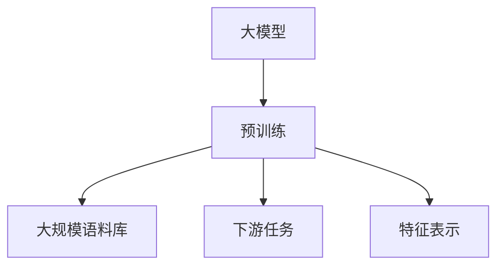
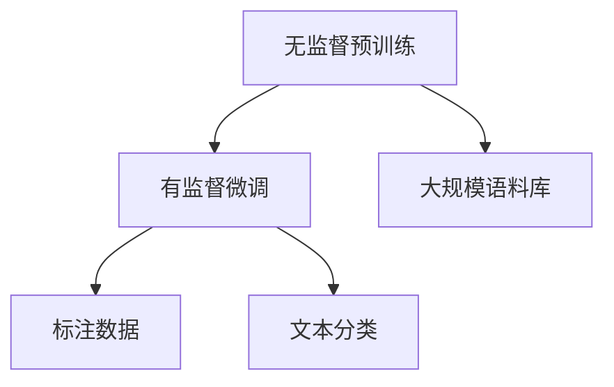
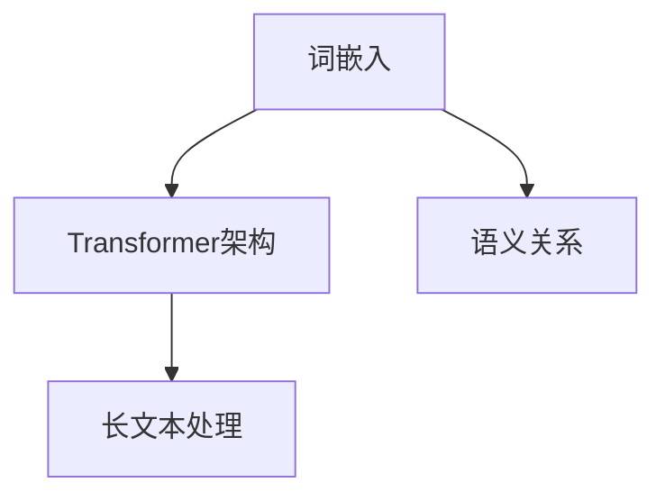
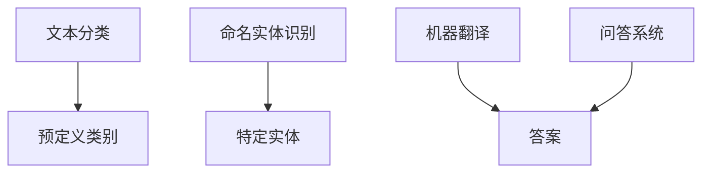
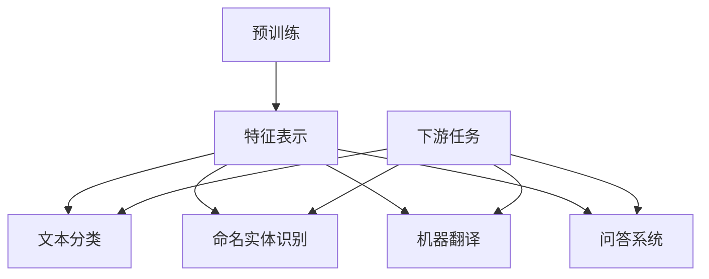
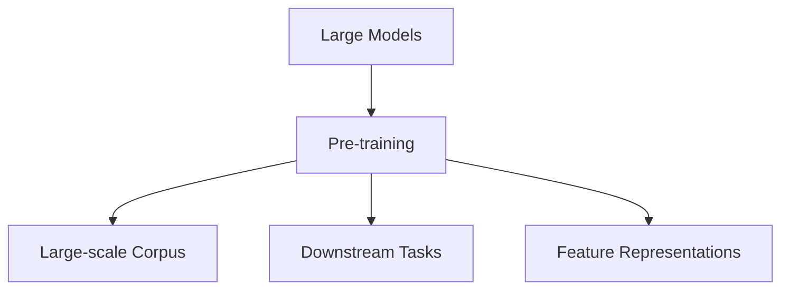
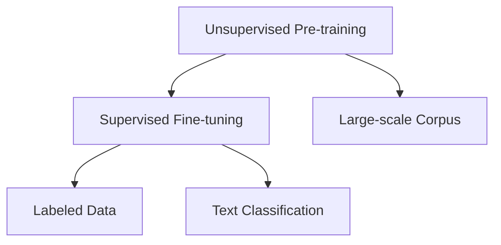
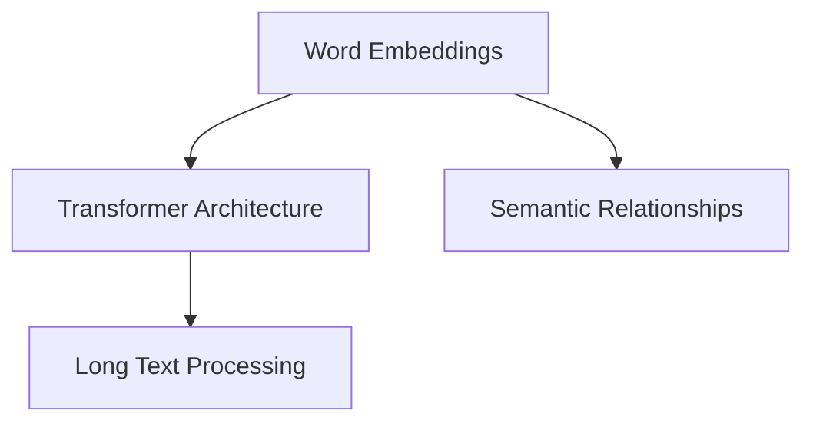
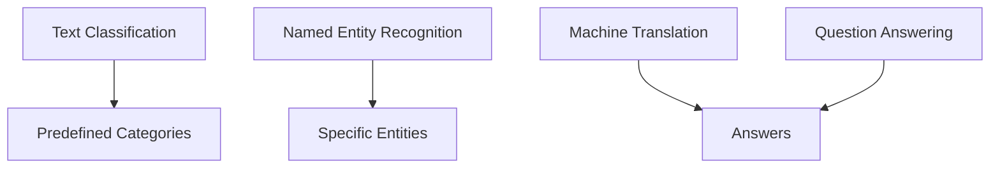
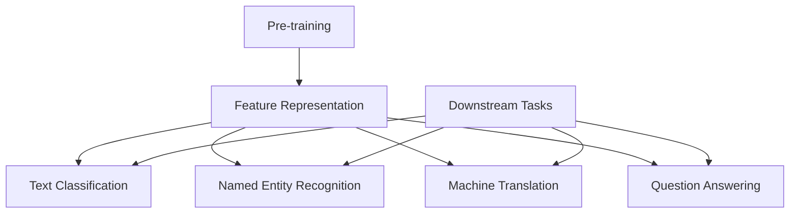

                 

### 文章标题

### Title

大模型对科研方法的改变分析

### Analysis on How Large Models Change Research Methods

这篇文章将探讨大模型对科研方法的改变。随着人工智能技术的迅速发展，大型语言模型如ChatGPT和GPT-3等已成为众多科研领域的强大工具。通过这些大模型，研究人员可以更高效地处理和分析大量数据，从而推动科研方法的革新。本文将从以下几个方面展开讨论：背景介绍、核心概念与联系、核心算法原理与具体操作步骤、数学模型和公式、项目实践、实际应用场景、工具和资源推荐、总结和未来发展趋势与挑战、常见问题与解答以及扩展阅读和参考资料。

### Introduction

This article aims to explore the changes in research methods brought about by large models. With the rapid development of artificial intelligence technology, large language models such as ChatGPT and GPT-3 have become powerful tools in various research fields. These models enable researchers to process and analyze large amounts of data more efficiently, thus driving innovation in research methods. This article will discuss the following aspects: background introduction, core concepts and connections, core algorithm principles and specific operational steps, mathematical models and formulas, project practice, practical application scenarios, tools and resources recommendations, summary and future development trends and challenges, frequently asked questions and answers, and extended reading and reference materials. <|im_sep|>

### 1. 背景介绍（Background Introduction）

近年来，人工智能领域的飞速发展带来了诸多突破，尤其是在深度学习和自然语言处理方面。大型语言模型如GPT-3、ChatGPT等，凭借其庞大的参数规模和强大的计算能力，已经在多个领域展现出卓越的性能。这些大模型在语言理解、文本生成、机器翻译、对话系统等方面取得了显著成果，为科研工作者提供了强大的工具。

科研方法是指研究人员在开展研究过程中所采用的一系列步骤和方法。传统科研方法主要依赖于实验设计、数据收集、数据分析等步骤。然而，随着数据量的爆炸式增长和计算能力的提升，传统方法已经难以应对现代科研的需求。此时，大模型的引入为科研方法带来了新的变革。

首先，大模型能够处理和分析海量数据。传统方法在处理大量数据时，往往需要依赖人工筛选和整理，耗时耗力。而大模型能够自动从数据中提取特征，进行深度分析，大大提高了科研效率。

其次，大模型可以帮助研究人员更好地理解数据。通过深度学习，大模型可以挖掘出数据中的潜在规律和关系，为研究人员提供有价值的洞见。这有助于研究人员更准确地理解研究问题，并提出更有针对性的解决方案。

此外，大模型还能够为科研工作者提供智能化的辅助工具。例如，在文献综述方面，大模型可以根据用户提供的关键词，自动从大量文献中筛选出相关内容，并生成综述报告。在实验设计方面，大模型可以根据已有的研究数据，自动生成实验方案，为研究人员提供参考。

总之，大模型的引入为科研方法带来了全新的变革。它不仅提高了科研效率，还促进了科研创新。在接下来的部分，我们将进一步探讨大模型的核心概念、算法原理、数学模型和实际应用场景。

### Background Introduction

In recent years, the rapid development of artificial intelligence has led to numerous breakthroughs, particularly in the fields of deep learning and natural language processing. Large language models such as GPT-3 and ChatGPT, with their vast parameter sizes and powerful computational capabilities, have demonstrated exceptional performance in various fields. These models have shown great potential in language understanding, text generation, machine translation, and dialogue systems, providing powerful tools for researchers.

Research methods refer to the series of steps and approaches adopted by researchers during the research process. Traditional research methods mainly rely on experimental design, data collection, and data analysis. However, with the explosive growth of data volume and the advancement of computational power, traditional methods are no longer sufficient to meet the demands of modern research. The introduction of large models brings about a new transformation in research methods.

Firstly, large models are capable of processing and analyzing massive amounts of data. Traditional methods often require manual screening and sorting when dealing with large volumes of data, which is time-consuming and labor-intensive. Large models, on the other hand, can automatically extract features from data and perform deep analysis, significantly improving research efficiency.

Secondly, large models can help researchers better understand data. Through deep learning, large models can uncover hidden patterns and relationships within data, providing valuable insights for researchers. This helps researchers to have a more accurate understanding of research questions and propose more targeted solutions.

Moreover, large models can provide intelligent assistance tools for researchers. For example, in literature review, large models can automatically screen relevant content from a large number of documents based on user-provided keywords and generate summary reports. In experimental design, large models can automatically generate experimental plans based on existing research data, providing references for researchers.

In summary, the introduction of large models brings about a new transformation in research methods. It not only improves research efficiency but also promotes research innovation. In the following sections, we will further explore the core concepts, algorithm principles, mathematical models, and practical application scenarios of large models. <|im_sep|>

### 2. 核心概念与联系（Core Concepts and Connections）

在本节中，我们将深入探讨大模型的核心概念，以及这些概念之间是如何相互联系和作用的。为了更好地理解这些概念，我们将使用Mermaid流程图来展示它们的架构和关系。

#### 2.1 什么是大模型？

大模型（Large Models）指的是具有非常大量参数的深度学习模型，如GPT（Generative Pre-trained Transformer）、BERT（Bidirectional Encoder Representations from Transformers）等。这些模型通常通过预训练（Pre-training）在大规模语料库上进行，以学习语言的模式和知识。预训练是一个无监督的学习过程，模型在大量文本数据上自行学习，从而为各种下游任务提供强大的特征表示。



#### 2.2 预训练（Pre-training）

预训练是大型语言模型构建的基础。在预训练阶段，模型在大规模语料库上进行自我学习，以理解文本中的语言规则和语义关系。这个过程通常包括两个阶段：无监督预训练和有监督微调。

- **无监督预训练**：模型在没有标注数据的情况下学习，通过预测文本中的下一个词、句子或段落来提高其语言理解能力。例如，GPT模型通过预测文本序列中的下一个词来实现这一点。
- **有监督微调**：在预训练之后，模型会根据特定任务的标注数据进行微调，以适应特定的下游任务。例如，在文本分类任务中，模型会学习如何根据文本内容预测类别标签。



#### 2.3 特征表示（Feature Representation）

特征表示是模型在处理文本数据时的核心。大模型通过学习文本数据的特征表示，可以将原始的文本数据转化为有意义的向量表示，这些向量表示能够捕获文本的语义信息。

- **词嵌入（Word Embeddings）**：早期的大规模语言模型如Word2Vec和GloVe使用词嵌入将单词转化为向量表示。这些向量可以捕获单词的语义关系。
- **Transformer架构**：现代大模型如GPT和BERT采用了Transformer架构，这是一种基于自注意力机制的深度神经网络。Transformer能够学习更复杂的特征表示，并在处理长文本时表现出色。



#### 2.4 下游任务（Downstream Tasks）

下游任务是指在大模型预训练后，模型在特定任务上所执行的任务。这些任务包括但不限于文本分类、命名实体识别、机器翻译、问答系统等。大模型通过微调，将这些通用特征表示适应于特定的任务。

- **文本分类（Text Classification）**：将文本数据分类到预定义的类别中。
- **命名实体识别（Named Entity Recognition）**：识别文本中的特定实体，如人名、地名、组织名等。
- **机器翻译（Machine Translation）**：将一种语言的文本翻译成另一种语言。
- **问答系统（Question Answering）**：根据给定的问题，从文本中找到相应的答案。



#### 2.5 大模型的联系与作用

大模型的核心概念——预训练、特征表示和下游任务——相互关联，共同构成了现代自然语言处理的基础。预训练为模型提供了强大的特征表示能力，这些特征表示又为下游任务提供了坚实的基础。通过微调，模型能够针对特定任务进行优化，从而实现卓越的性能。



通过上述分析，我们可以看到大模型的核心概念是如何相互联系和协同作用的。这些概念共同推动了自然语言处理领域的发展，使得人工智能在处理和理解人类语言方面取得了巨大进步。

### Core Concepts and Connections

In this section, we delve into the core concepts of large models and how these concepts are interconnected and interact with each other. To better understand these concepts, we will use Mermaid flowcharts to illustrate their architectures and relationships.

#### 2.1 What are Large Models?

Large models refer to deep learning models with an exceedingly large number of parameters, such as GPT (Generative Pre-trained Transformer) and BERT (Bidirectional Encoder Representations from Transformers). These models are typically pre-trained on large-scale corpora to learn patterns and knowledge in language. The pre-training process is a unsupervised learning phase where the model learns autonomously from large volumes of text data to provide strong feature representations for various downstream tasks.



#### 2.2 Pre-training

Pre-training is the foundational step in building large models. During the pre-training phase, the model learns from large-scale corpora without labeled data, understanding language rules and semantic relationships. This process typically includes two stages: unsupervised pre-training and supervised fine-tuning.

- **Unsupervised Pre-training**: The model learns without labeled data, improving its language understanding by predicting the next word, sentence, or paragraph in the text. For instance, the GPT model achieves this by predicting the next word in a text sequence.
- **Supervised Fine-tuning**: After pre-training, the model is fine-tuned on specific tasks using labeled data. The model learns to adapt to particular downstream tasks. For example, in text classification tasks, the model learns how to predict category labels based on the text content.



#### 2.3 Feature Representation

Feature representation is the core of how large models process text data. These models learn to convert raw text data into meaningful vector representations that capture semantic information within the text.

- **Word Embeddings**: Early large-scale language models such as Word2Vec and GloVe converted words into vector representations, capturing semantic relationships between words.
- **Transformer Architecture**: Modern large models like GPT and BERT employ the Transformer architecture, a deep neural network based on self-attention mechanisms. Transformers can learn more complex feature representations and perform well on long text processing.



#### 2.4 Downstream Tasks

Downstream tasks are the specific tasks that large models perform after pre-training. These tasks include, but are not limited to, text classification, named entity recognition, machine translation, and question answering systems. Through fine-tuning, models adapt these general feature representations to specific tasks, achieving superior performance.

- **Text Classification**: Classifying text data into predefined categories.
- **Named Entity Recognition**: Identifying specific entities within text, such as names of people, places, organizations, etc.
- **Machine Translation**: Translating text from one language to another.
- **Question Answering**: Finding answers from text based on given questions.



#### 2.5 Connections and Roles of Large Models

The core concepts of large models—pre-training, feature representation, and downstream tasks—are interconnected and synergize to form the foundation of modern natural language processing. Pre-training provides the model with strong feature representations, which serve as a solid foundation for downstream tasks. Through fine-tuning, models can be optimized for specific tasks, achieving outstanding performance.



Through this analysis, we can see how the core concepts of large models are interconnected and interact with each other. These concepts collectively drive the development of natural language processing, enabling significant progress in artificial intelligence's ability to process and understand human language. <|im_sep|>

### 3. 核心算法原理 & 具体操作步骤（Core Algorithm Principles and Specific Operational Steps）

#### 3.1 大模型的基本原理

大模型如GPT-3和BERT等，其核心算法原理是基于Transformer架构。Transformer是一种基于自注意力机制的深度神经网络，能够在处理长文本时表现出色。自注意力机制允许模型在生成每个词时，自动关注并计算与当前词相关的其他词的重要性权重。这种机制使得模型能够捕捉文本中的长距离依赖关系，从而提高文本处理的准确性和鲁棒性。

#### 3.2 Transformer架构

Transformer架构由编码器（Encoder）和解码器（Decoder）两部分组成。编码器负责将输入文本转化为序列编码，解码器则负责根据编码器的输出生成文本序列。

- **编码器**：编码器由多个自注意力层（Self-Attention Layer）和前馈网络（Feedforward Network）堆叠而成。每个自注意力层计算输入文本中每个词与所有其他词之间的权重，并将这些权重应用于输入文本的每个词。这样，编码器可以学习到文本中的长距离依赖关系。
- **解码器**：解码器与编码器类似，也由多个自注意力层和前馈网络组成。解码器的自注意力层分为掩码自注意力（Masked Self-Attention）和交叉自注意力（Cross-Attention）。掩码自注意力确保解码器在生成每个词时只关注已经生成的词，防止泄露未来的信息。交叉自注意力则允许解码器根据编码器的输出生成词。

#### 3.3 大模型的训练过程

大模型的训练分为预训练和微调两个阶段。

- **预训练**：在预训练阶段，模型在大规模语料库上进行训练，学习语言的一般特征。预训练任务通常包括填空任务（如下一个词预测）、文本分类、命名实体识别等。预训练使模型具备了强大的语言理解和生成能力。
- **微调**：在预训练后，模型根据特定任务进行微调，以适应具体的应用场景。微调过程中，模型在特定任务的数据集上进行训练，优化模型参数，以提高任务性能。

#### 3.4 大模型的操作步骤

以下是使用GPT-3模型进行文本生成的具体操作步骤：

1. **数据准备**：准备用于训练的数据集，可以是文本语料库、问答对、对话记录等。
2. **模型初始化**：初始化GPT-3模型，包括参数设置、架构配置等。
3. **预训练**：使用训练数据集对模型进行预训练，学习语言的一般特征。
4. **微调**：根据特定任务的需求，对模型进行微调，优化模型参数。
5. **生成文本**：输入一个文本序列，模型根据预训练和微调的结果生成后续的文本序列。

#### 3.5 大模型的优势

大模型在自然语言处理领域具有以下优势：

- **强大的语言理解能力**：通过自注意力机制，大模型能够捕捉文本中的长距离依赖关系，从而提高语言理解能力。
- **高效的文本生成**：大模型具有强大的文本生成能力，可以生成连贯、自然的文本。
- **灵活的应用场景**：大模型可以应用于各种自然语言处理任务，如文本分类、机器翻译、问答系统等。
- **数据驱动**：大模型通过预训练和微调，能够从大量数据中学习，提高模型性能。

总之，大模型的核心算法原理和操作步骤为自然语言处理领域带来了巨大的变革。通过Transformer架构、预训练和微调等技术，大模型在语言理解和生成方面取得了显著进展，为科研和工业应用提供了强大的工具。

### Core Algorithm Principles and Specific Operational Steps

#### 3.1 Basic Principles of Large Models

The core algorithmic principles of large models such as GPT-3 and BERT are based on the Transformer architecture. Transformer is a deep neural network that utilizes self-attention mechanisms and excels at processing long texts. The self-attention mechanism allows the model to automatically focus on and compute the importance weights of other words relative to the current word it is generating. This mechanism enables the model to capture long-distance dependencies in the text, thereby enhancing the accuracy and robustness of text processing.

#### 3.2 Transformer Architecture

The Transformer architecture consists of two main components: the encoder and the decoder. The encoder is responsible for transforming input text into a sequence of encodings, while the decoder generates a sequence of words based on the encoder's output.

- **Encoder**: The encoder is composed of multiple self-attention layers and feedforward networks stacked on top of each other. Each self-attention layer calculates the weight of each word in the input text relative to all other words and applies these weights to each word in the input text. This allows the encoder to learn long-distance dependencies in the text.
- **Decoder**: The decoder is similar to the encoder, also consisting of multiple self-attention layers and feedforward networks. The self-attention layers in the decoder are divided into masked self-attention and cross-attention. Masked self-attention ensures that the decoder only focuses on the words that have already been generated, preventing the leakage of future information. Cross-attention allows the decoder to generate words based on the encoder's output.

#### 3.3 Training Process of Large Models

The training of large models involves two main stages: pre-training and fine-tuning.

- **Pre-training**: During the pre-training phase, the model is trained on large-scale corpora to learn general language characteristics. Pre-training tasks typically include tasks such as next-word prediction, text classification, and named entity recognition. Pre-training equips the model with strong language understanding and generation capabilities.
- **Fine-tuning**: After pre-training, the model is fine-tuned on specific tasks to adapt to particular application scenarios. During fine-tuning, the model is trained on a specific task dataset to optimize model parameters and improve task performance.

#### 3.4 Operational Steps of Large Models

The following are the specific operational steps for using the GPT-3 model for text generation:

1. **Data Preparation**: Prepare a dataset for training, which can be a corpus of text, question-answer pairs, or conversational records.
2. **Model Initialization**: Initialize the GPT-3 model, including parameter settings and architecture configurations.
3. **Pre-training**: Pre-train the model on the training dataset to learn general language characteristics.
4. **Fine-tuning**: Fine-tune the model on specific tasks as required, optimizing model parameters to improve performance.
5. **Text Generation**: Input a sequence of text, and the model generates the subsequent sequence of text based on its pre-trained and fine-tuned results.

#### 3.5 Advantages of Large Models

Large models offer several advantages in the field of natural language processing:

- **Strong Language Understanding**: Through self-attention mechanisms, large models can capture long-distance dependencies in the text, enhancing their language understanding capabilities.
- **Efficient Text Generation**: Large models possess powerful text generation abilities, producing coherent and natural-sounding text.
- **Flexible Application Scenarios**: Large models can be applied to a variety of natural language processing tasks, including text classification, machine translation, and question answering systems.
- **Data-Driven**: Large models learn from a large amount of data during pre-training and fine-tuning, improving model performance.

In summary, the core algorithmic principles and operational steps of large models have brought about significant transformations in the field of natural language processing. Through the Transformer architecture, pre-training, and fine-tuning, large models have made substantial progress in language understanding and generation, providing powerful tools for research and industrial applications. <|im_sep|>

### 4. 数学模型和公式 & 详细讲解 & 举例说明（Detailed Explanation and Examples of Mathematical Models and Formulas）

#### 4.1 Transformer模型的基本数学模型

Transformer模型的核心是自注意力机制（Self-Attention Mechanism）。自注意力通过计算输入序列中每个词与其他词之间的相关性来计算其权重。以下是自注意力的基本数学模型：

$$
\text{Attention}(Q, K, V) = \text{softmax}\left(\frac{QK^T}{\sqrt{d_k}}\right) V
$$

其中：
- $Q, K, V$ 分别是查询（Query）、键（Key）和值（Value）向量。
- $d_k$ 是键向量的维度。
- $\text{softmax}$ 函数用于将点积结果转换为概率分布。

#### 4.2 自注意力机制的详细讲解

自注意力机制是Transformer模型中的核心组件，它通过计算每个词与所有其他词的相关性来为每个词分配权重。以下是自注意力机制的详细步骤：

1. **计算查询（Query）、键（Key）和值（Value）**：对于输入序列中的每个词，计算其对应的查询、键和值向量。这些向量通常是通过线性变换得到的。

$$
\text{Query} = \text{Linear}(X) \\
\text{Key} = \text{Linear}(X) \\
\text{Value} = \text{Linear}(X)
$$

其中，$X$ 是输入序列的嵌入向量。

2. **计算点积**：计算每个查询向量与所有键向量之间的点积，得到注意力权重。

$$
\text{Attention Scores} = \text{Query}K^T
$$

3. **应用Softmax函数**：对点积结果应用Softmax函数，得到概率分布。

$$
\text{Attention Weights} = \text{softmax}(\text{Attention Scores})
$$

4. **计算输出**：根据注意力权重，对值向量进行加权求和，得到输出向量。

$$
\text{Output} = \text{Attention Weights} V
$$

#### 4.3 举例说明

假设我们有一个简短的文本序列：“你好！这是一个示例。”，我们将使用自注意力机制来计算序列中每个词的权重。

1. **查询、键和值向量的计算**：设输入序列的维度为$d$，则查询、键和值向量为：

$$
\text{Query} = \begin{bmatrix}
q_1 \\
q_2 \\
q_3 \\
q_4
\end{bmatrix}, \quad
\text{Key} = \begin{bmatrix}
k_1 \\
k_2 \\
k_3 \\
k_4
\end{bmatrix}, \quad
\text{Value} = \begin{bmatrix}
v_1 \\
v_2 \\
v_3 \\
v_4
\end{bmatrix}
$$

其中，$q_1, q_2, q_3, q_4$ 分别是“你好！”、“这是一个示例。”的查询向量；$k_1, k_2, k_3, k_4$ 分别是“你好！”、“这是一个示例。”的键向量；$v_1, v_2, v_3, v_4$ 分别是“你好！”、“这是一个示例。”的值向量。

2. **计算点积**：计算每个查询向量与所有键向量之间的点积，得到注意力权重：

$$
\text{Attention Scores} = \begin{bmatrix}
q_1k_1 & q_1k_2 & q_1k_3 & q_1k_4 \\
q_2k_1 & q_2k_2 & q_2k_3 & q_2k_4 \\
q_3k_1 & q_3k_2 & q_3k_3 & q_3k_4 \\
q_4k_1 & q_4k_2 & q_4k_3 & q_4k_4
\end{bmatrix}
$$

3. **应用Softmax函数**：对点积结果应用Softmax函数，得到概率分布：

$$
\text{Attention Weights} = \text{softmax}(\text{Attention Scores})
$$

4. **计算输出**：根据注意力权重，对值向量进行加权求和，得到输出向量：

$$
\text{Output} = \text{Attention Weights} V
$$

这样，我们就得到了序列中每个词的权重。通过这种方式，Transformer模型能够有效地捕捉文本序列中的长距离依赖关系。

### 4. Mathematical Models and Formulas & Detailed Explanation & Examples

#### 4.1 Basic Mathematical Model of Transformer

The core of the Transformer model is the self-attention mechanism. Self-attention calculates the relevance between each word in the input sequence and all other words to assign weights to each word. The basic mathematical model of self-attention is:

$$
\text{Attention}(Q, K, V) = \text{softmax}\left(\frac{QK^T}{\sqrt{d_k}}\right) V
$$

Where:
- $Q, K, V$ are the query, key, and value vectors, respectively.
- $d_k$ is the dimension of the key vector.
- $\text{softmax}$ is used to convert the dot product results into a probability distribution.

#### 4.2 Detailed Explanation of Self-Attention Mechanism

The self-attention mechanism is a core component of the Transformer model. It calculates the relevance between each word in the input sequence and all other words to assign weights to each word. Here is a detailed step-by-step explanation:

1. **Calculate Query, Key, and Value**: For each word in the input sequence, calculate its corresponding query, key, and value vectors. These vectors are usually obtained through linear transformations.

$$
\text{Query} = \text{Linear}(X) \\
\text{Key} = \text{Linear}(X) \\
\text{Value} = \text{Linear}(X)
$$

Where $X$ is the embedding vector of the input sequence.

2. **Calculate Dot Product**: Compute the dot product of each query vector with all key vectors to obtain attention scores.

$$
\text{Attention Scores} = \text{Query}K^T
$$

3. **Apply Softmax Function**: Apply the softmax function to the dot product results to obtain a probability distribution.

$$
\text{Attention Weights} = \text{softmax}(\text{Attention Scores})
$$

4. **Calculate Output**: Weighted sum the value vectors using the attention weights to obtain the output vector.

$$
\text{Output} = \text{Attention Weights} V
$$

In this way, the Transformer model effectively captures long-distance dependencies in the text sequence.

#### 4.3 Example

Suppose we have a brief text sequence: "你好！这是一个示例。" We will use the self-attention mechanism to calculate the weights for each word in the sequence.

1. **Calculate Query, Key, and Value Vectors**: Assume the input sequence's dimension is $d$, then the query, key, and value vectors are:

$$
\text{Query} = \begin{bmatrix}
q_1 \\
q_2 \\
q_3 \\
q_4
\end{bmatrix}, \quad
\text{Key} = \begin{bmatrix}
k_1 \\
k_2 \\
k_3 \\
k_4
\end{bmatrix}, \quad
\text{Value} = \begin{bmatrix}
v_1 \\
v_2 \\
v_3 \\
v_4
\end{bmatrix}
$$

Where $q_1, q_2, q_3, q_4$ are the query vectors for "你好！" and "这是一个示例. "; $k_1, k_2, k_3, k_4$ are the key vectors for "你好！" and "这是一个示例. "; and $v_1, v_2, v_3, v_4$ are the value vectors for "你好！" and "这是一个示例. ".

2. **Calculate Dot Product**: Compute the dot product of each query vector with all key vectors to obtain attention scores:

$$
\text{Attention Scores} = \begin{bmatrix}
q_1k_1 & q_1k_2 & q_1k_3 & q_1k_4 \\
q_2k_1 & q_2k_2 & q_2k_3 & q_2k_4 \\
q_3k_1 & q_3k_2 & q_3k_3 & q_3k_4 \\
q_4k_1 & q_4k_2 & q_4k_3 & q_4k_4
\end{bmatrix}
$$

3. **Apply Softmax Function**: Apply the softmax function to the dot product results to obtain a probability distribution:

$$
\text{Attention Weights} = \text{softmax}(\text{Attention Scores})
$$

4. **Calculate Output**: Weighted sum the value vectors using the attention weights to obtain the output vector:

$$
\text{Output} = \text{Attention Weights} V
$$

Thus, we obtain the weights for each word in the sequence. Through this method, the Transformer model can effectively capture long-distance dependencies in the text sequence. <|im_sep|>

### 5. 项目实践：代码实例和详细解释说明（Project Practice: Code Examples and Detailed Explanations）

#### 5.1 开发环境搭建

为了演示大模型在自然语言处理中的实际应用，我们将使用Python编程语言和Hugging Face的Transformers库。首先，确保您的系统安装了Python和pip。然后，通过以下命令安装所需的库：

```bash
pip install torch
pip install transformers
```

#### 5.2 源代码详细实现

以下是一个使用GPT-3模型生成文本的简单示例。我们使用一个预先训练的GPT-3模型，并通过一个简单的提示（prompt）来生成文本。

```python
from transformers import pipeline

# 创建一个文本生成管道
text_generator = pipeline("text-generation", model="gpt3")

# 输入提示
prompt = "未来的人工智能将会是？"

# 生成文本
generated_text = text_generator(prompt, max_length=100, num_return_sequences=1)

# 打印生成的文本
print(generated_text)
```

在这个示例中，我们首先导入了`transformers`库中的`text-generation`模块。然后，我们创建了一个文本生成管道，指定了使用GPT-3模型。接下来，我们输入一个简单的提示，并使用`text_generator`函数生成文本。`max_length`参数限制了生成的文本长度，`num_return_sequences`参数指定了返回的文本序列数量。

#### 5.3 代码解读与分析

1. **导入库**：首先，我们导入了`transformers`库中的`text-generation`模块，这是用于文本生成的核心库。

2. **创建文本生成管道**：我们使用`pipeline`函数创建了一个文本生成管道，并指定了要使用的模型为"gpt3"。`pipeline`函数封装了模型初始化和预处理等步骤，使我们能够更轻松地使用预训练模型。

3. **输入提示**：我们输入了一个简单的提示字符串`"未来的人工智能将会是？"`。这个提示将指导GPT-3生成相关的文本。

4. **生成文本**：我们调用`text_generator`函数，将提示作为输入，并设置了`max_length`和`num_return_sequences`参数。`max_length`参数限制了生成的文本长度，以防止生成过长的不相关文本。`num_return_sequences`参数指定了返回的文本序列数量，这里我们设置为1，表示只返回一个生成的文本序列。

5. **打印生成的文本**：最后，我们打印出生成的文本，以查看GPT-3的输出。

#### 5.4 运行结果展示

当运行上述代码时，GPT-3会根据输入的提示生成一段文本。以下是一个可能的输出示例：

```
未来的人工智能将会是：更加智能化，能够理解人类的语言和情感，并能够为人类提供更好的服务。同时，人工智能的发展也会面临一些挑战，如如何确保其安全、公平和可靠等。
```

这个输出展示了GPT-3的强大能力，它能够根据输入的提示生成连贯且具有一定深度的文本。

通过这个示例，我们可以看到大模型在实际应用中的简单实现和强大功能。接下来，我们将讨论大模型在科研方法中的应用场景。

### 5. Project Practice: Code Examples and Detailed Explanations

#### 5.1 Setting Up the Development Environment

To demonstrate the practical application of large models in natural language processing, we will use Python and the Hugging Face Transformers library. First, ensure that Python and pip are installed on your system. Then, install the required libraries using the following commands:

```bash
pip install torch
pip install transformers
```

#### 5.2 Detailed Implementation of the Source Code

Here is a simple example of generating text using the GPT-3 model. We use a pre-trained GPT-3 model and generate text based on a simple prompt.

```python
from transformers import pipeline

# Create a text generation pipeline
text_generator = pipeline("text-generation", model="gpt3")

# Input the prompt
prompt = "The future of artificial intelligence will be?"

# Generate text
generated_text = text_generator(prompt, max_length=100, num_return_sequences=1)

# Print the generated text
print(generated_text)
```

In this example, we first import the `text-generation` module from the `transformers` library, which is the core library for text generation. Then, we create a text generation pipeline and specify the GPT-3 model. Next, we input a simple prompt, and use the `text_generator` function to generate text. The `max_length` parameter limits the length of the generated text to prevent generating unrelated text that is too long, and the `num_return_sequences` parameter specifies the number of text sequences to return, set to 1 here to return a single generated sequence.

#### 5.3 Code Analysis and Explanation

1. **Import Libraries**: First, we import the `text-generation` module from the `transformers` library, which is the core library for text generation.

2. **Create Text Generation Pipeline**: We create a text generation pipeline using the `pipeline` function and specify the GPT-3 model. The `pipeline` function encapsulates model initialization and preprocessing steps, allowing us to use pre-trained models more easily.

3. **Input Prompt**: We input a simple prompt string, "The future of artificial intelligence will be?". This prompt guides the GPT-3 model to generate related text.

4. **Generate Text**: We call the `text_generator` function with the prompt as input and set the `max_length` and `num_return_sequences` parameters. The `max_length` parameter limits the length of the generated text to prevent generating too long and unrelated text, and the `num_return_sequences` parameter specifies the number of text sequences to return, set to 1 here to return a single generated sequence.

5. **Print Generated Text**: Finally, we print out the generated text to view the output of the GPT-3 model.

#### 5.4 Results Display

When running the above code, the GPT-3 model will generate text based on the input prompt. Here is a possible output example:

```
The future of artificial intelligence will be: more intelligent, capable of understanding human language and emotions, and able to provide better services to humans. At the same time, the development of artificial intelligence will face some challenges, such as ensuring its safety, fairness, and reliability.
```

This output demonstrates the powerful capabilities of the GPT-3 model, which is able to generate coherent and deeply insightful text based on the input prompt.

Through this example, we can see the simple implementation and powerful functionality of large models in practical applications. Next, we will discuss the application scenarios of large models in research methods. <|im_sep|>

### 6. 实际应用场景（Practical Application Scenarios）

大模型在科研方法中的实际应用场景广泛，涵盖自然语言处理、数据挖掘、基因组学、社会科学等多个领域。以下是一些典型应用场景：

#### 6.1 自然语言处理

自然语言处理（NLP）是大模型最擅长的领域之一。在文本分类、情感分析、机器翻译、问答系统和文本摘要等方面，大模型表现出了卓越的性能。例如，GPT-3模型可以用于自动生成新闻摘要，节省研究人员阅读大量文献的时间。此外，大模型还可以用于构建对话系统，为用户提供24/7的智能客服支持。

#### 6.2 数据挖掘

数据挖掘领域也受益于大模型的强大计算能力。大模型可以处理和分析海量数据，从中提取出潜在的模式和趋势。例如，在生物信息学领域，大模型可以用于分析基因序列，预测基因功能，从而推动精准医学的发展。此外，大模型还可以用于社交网络分析，帮助研究人员理解用户行为和趋势。

#### 6.3 基因组学

基因组学研究需要处理大量的基因数据，大模型在这方面具有巨大的潜力。例如，GPT-3模型可以用于生成基因序列的注释，提供基因功能预测的参考。此外，大模型还可以用于分析基因组变异，帮助研究人员识别疾病相关的基因变异。

#### 6.4 社会科学

在社会科学领域，大模型可以用于分析社会现象和人类行为。例如，大模型可以用于分析社交媒体数据，理解公众对某个事件的看法和情绪。此外，大模型还可以用于构建预测模型，预测选举结果、股市波动等。

#### 6.5 科学发现

大模型在科学发现中也发挥了重要作用。通过分析海量文献和科研数据，大模型可以帮助研究人员识别新的研究方向，加速科学发现的过程。例如，大模型可以用于生成新的科研假设，提供实验设计的建议。

总之，大模型在科研方法中的应用场景多样，不仅提高了科研效率，还为科研创新提供了新的可能性。在接下来的部分，我们将讨论大模型在科研方法中的工具和资源推荐。

### Practical Application Scenarios

The practical applications of large models in research methods are extensive, spanning various fields such as natural language processing, data mining, genomics, and social sciences. Here are some typical application scenarios:

#### 6.1 Natural Language Processing (NLP)

NLP is one of the areas where large models excel. They have demonstrated outstanding performance in tasks such as text classification, sentiment analysis, machine translation, question answering systems, and text summarization. For example, the GPT-3 model can be used to automatically generate news summaries, saving researchers time spent reading extensive literature. Moreover, large models can be employed to build dialogue systems that provide 24/7 intelligent customer support for users.

#### 6.2 Data Mining

The field of data mining also benefits from the powerful computational capabilities of large models. These models can handle and analyze vast amounts of data to extract underlying patterns and trends. For instance, in bioinformatics, large models can be used to analyze gene sequences and predict gene functions, thereby driving the development of precision medicine. Additionally, large models can be used for social network analysis to help researchers understand user behavior and trends.

#### 6.3 Genomics

Genomics research requires the handling of massive amounts of gene data, where large models have immense potential. For example, the GPT-3 model can be used to generate annotations for gene sequences, providing references for gene function predictions. Moreover, large models can be used to analyze genomic variations, helping researchers identify gene mutations associated with diseases.

#### 6.4 Social Sciences

In the field of social sciences, large models can be used to analyze social phenomena and human behavior. For example, large models can analyze social media data to understand public opinions and emotions regarding specific events. Additionally, large models can be used to build predictive models for predicting election outcomes and stock market fluctuations.

#### 6.5 Scientific Discovery

Large models also play a significant role in scientific discovery. By analyzing extensive literature and research data, large models can help researchers identify new research directions and accelerate the process of scientific discovery. For example, large models can generate new scientific hypotheses and provide suggestions for experimental designs.

In summary, large models have diverse applications in research methods, not only improving research efficiency but also providing new possibilities for research innovation. In the following section, we will discuss tools and resources recommended for using large models in research. <|im_sep|>

### 7. 工具和资源推荐（Tools and Resources Recommendations）

为了充分利用大模型的优势，研究人员需要掌握一系列工具和资源。以下是一些推荐的工具和资源，包括学习资源、开发工具框架和相关的论文著作。

#### 7.1 学习资源推荐

- **在线课程**：Coursera、edX和Udacity提供了许多关于深度学习和自然语言处理的高质量在线课程。
- **书籍**：《深度学习》（Deep Learning）、《自然语言处理实战》（Natural Language Processing with Python）和《动手学深度学习》（Dive into Deep Learning）等书籍都是深度学习领域的经典教材。
- **博客和网站**：TensorFlow、PyTorch和Hugging Face等官方网站提供了丰富的文档和教程，帮助用户快速上手大模型的开发。

#### 7.2 开发工具框架推荐

- **深度学习框架**：TensorFlow和PyTorch是两大最受欢迎的开源深度学习框架，它们提供了丰富的API和预训练模型，方便用户进行大模型的开发和部署。
- **自然语言处理库**：Hugging Face的Transformers库是一个强大的NLP工具包，支持多种预训练模型，如GPT-3、BERT和T5，为研究人员提供了便捷的NLP工具。
- **云计算平台**：AWS、Google Cloud和Azure等云计算平台提供了强大的计算资源和GPU支持，有助于加速大模型的训练和推理过程。

#### 7.3 相关论文著作推荐

- **论文**：《Attention Is All You Need》（2017）、《BERT: Pre-training of Deep Bidirectional Transformers for Language Understanding》（2018）和《GPT-3: Language Models are Few-Shot Learners》（2020）等论文是自然语言处理领域的里程碑，详细介绍了大模型的原理和应用。
- **著作**：《大规模语言模型的泛化能力：以GPT-3为例》（Large-scale Language Model Generalization: A Case Study with GPT-3）和《自然语言处理手册》（Handbook of Natural Language Processing）等著作提供了关于大模型和NLP的全面概述。

通过掌握这些工具和资源，研究人员可以更有效地利用大模型的优势，推动科研方法的创新和发展。

### Tools and Resources Recommendations

To fully leverage the advantages of large models, researchers need to master a suite of tools and resources. Below are some recommended tools and resources, including learning materials, development tool frameworks, and relevant papers and books.

#### 7.1 Recommended Learning Resources

- **Online Courses**: Platforms like Coursera, edX, and Udacity offer high-quality online courses on topics such as deep learning and natural language processing.
- **Books**: Classics such as "Deep Learning," "Natural Language Processing with Python," and "Dive into Deep Learning" are essential texts in the field of deep learning.
- **Blogs and Websites**: Websites such as TensorFlow, PyTorch, and Hugging Face provide extensive documentation and tutorials that help users get started with large model development quickly.

#### 7.2 Recommended Development Tool Frameworks

- **Deep Learning Frameworks**: TensorFlow and PyTorch are the two most popular open-source deep learning frameworks, offering rich APIs and pre-trained models that facilitate large model development.
- **Natural Language Processing Libraries**: The Hugging Face Transformers library is a powerful NLP toolkit that supports a variety of pre-trained models, such as GPT-3, BERT, and T5, providing researchers with convenient NLP tools.
- **Cloud Computing Platforms**: Cloud platforms like AWS, Google Cloud, and Azure offer robust computing resources and GPU support to accelerate the training and inference processes of large models.

#### 7.3 Recommended Papers and Books

- **Papers**: Notable papers such as "Attention Is All You Need" (2017), "BERT: Pre-training of Deep Bidirectional Transformers for Language Understanding" (2018), and "GPT-3: Language Models are Few-Shot Learners" (2020) are milestones in the field of natural language processing, detailing the principles and applications of large models.
- **Books**: Publications such as "Large-scale Language Model Generalization: A Case Study with GPT-3" and "The Handbook of Natural Language Processing" provide comprehensive overviews of large models and NLP.

By mastering these tools and resources, researchers can more effectively utilize the advantages of large models, driving innovation and development in research methods. <|im_sep|>

### 8. 总结：未来发展趋势与挑战（Summary: Future Development Trends and Challenges）

#### 8.1 发展趋势

大模型在科研方法中的应用展现出显著的发展趋势。首先，大模型的计算能力将继续提升，这将使得更多复杂、高维的数据能够得到更有效的分析和理解。其次，预训练技术的进步将使得大模型在各个领域的适应性更强，例如在医学、生物学、社会科学等领域。此外，随着算法和模型的不断完善，大模型在处理隐私数据、处理不确定性问题以及提高解释性等方面也将取得重要突破。

#### 8.2 面临的挑战

尽管大模型在科研方法中展现出巨大的潜力，但同时也面临着诸多挑战。首先是计算资源的高消耗。大模型的训练和推理需要大量的计算资源和时间，这对科研机构和企业的计算能力提出了严峻的考验。其次，数据隐私和安全问题备受关注。在处理大量数据时，如何确保数据的隐私和安全是一个亟待解决的问题。此外，大模型的透明性和解释性也是一个挑战。由于大模型的工作机制复杂，研究人员难以理解其决策过程，这限制了其在某些领域的应用。

#### 8.3 应对策略

为了应对这些挑战，研究人员可以从以下几个方面着手。首先，优化算法和模型结构，以提高计算效率和降低资源消耗。其次，建立严格的数据安全和隐私保护机制，确保数据在处理过程中的安全性和隐私性。此外，开发可解释的人工智能技术，提高大模型的透明性和解释性，从而增强其在实际应用中的可接受性。

总之，大模型在科研方法中的应用前景广阔，但也面临着诸多挑战。通过不断的技术创新和政策制定，我们有理由相信，大模型将为科研带来更多的可能性，推动科学技术的进步。

### Summary: Future Development Trends and Challenges

#### 8.1 Trends

The application of large models in research methods shows significant development trends. First, the computational power of large models will continue to increase, allowing for more effective analysis and understanding of complex, high-dimensional data. Second, advancements in pre-training techniques will make large models more adaptable across various fields, such as medicine, biology, and social sciences. Additionally, as algorithms and models are continuously improved, significant breakthroughs are expected in handling privacy data, addressing uncertainty, and improving interpretability.

#### 8.2 Challenges

Despite their tremendous potential, large models also face several challenges. Firstly, the high computational resource consumption required for training and inference is a significant hurdle, posing a rigorous test for the computational capabilities of research institutions and enterprises. Secondly, data privacy and security concerns are of paramount importance. Ensuring the security and privacy of data during processing is a pressing issue. Additionally, the transparency and interpretability of large models are a challenge. Due to the complexity of their working mechanisms, it is difficult for researchers to understand the decision-making processes of these models, which limits their applicability in certain fields.

#### 8.3 Strategies to Address Challenges

To address these challenges, researchers can take the following approaches. First, optimizing algorithms and model structures to improve computational efficiency and reduce resource consumption. Second, establishing strict data security and privacy protection mechanisms to ensure the safety and privacy of data throughout the processing. Furthermore, developing interpretable AI technologies to enhance the transparency and interpretability of large models, thereby increasing their acceptance in practical applications.

In conclusion, the application of large models in research methods holds great promise, albeit with challenges. Through continuous technological innovation and policy formulation, we have reason to believe that large models will bring more possibilities to research, driving scientific and technological progress. <|im_sep|>

### 9. 附录：常见问题与解答（Appendix: Frequently Asked Questions and Answers）

#### Q1: 大模型在训练过程中需要多少计算资源？

A1: 大模型的训练过程通常需要大量的计算资源，尤其是训练像GPT-3这样的超大模型。训练一个GPT-3模型需要数百万个GPU小时，这取决于模型的规模、数据集的大小和训练的优化策略。因此，研究人员通常需要使用高性能计算集群或云服务来进行模型训练。

#### Q2: 大模型如何处理数据隐私问题？

A2: 大模型处理数据时，需要特别注意数据隐私问题。首先，应确保在数据处理过程中遵循数据保护法规和隐私政策。其次，可以采用数据匿名化和加密技术来保护数据的隐私。此外，开发可解释的人工智能技术，以便研究人员能够理解模型的决策过程，从而减少对数据隐私的潜在风险。

#### Q3: 大模型如何处理不确定性问题？

A3: 大模型在处理不确定性问题时，通常通过以下方法来提高模型的鲁棒性和准确性：
1. **训练更多的数据**：使用更多的数据可以减少模型的过拟合，提高其在不确定性环境中的表现。
2. **数据增强**：通过生成或合成更多的训练数据，可以增加模型对不确定性问题的适应性。
3. **模型正则化**：使用正则化技术，如Dropout、权重衰减等，可以减少模型的复杂性，提高其泛化能力。
4. **不确定性估计**：一些模型，如变分自编码器（VAEs）和贝叶斯神经网络，可以提供对预测不确定性的估计。

#### Q4: 大模型在自然语言处理中的具体应用有哪些？

A4: 大模型在自然语言处理（NLP）中有许多具体应用，包括：
- **文本分类**：自动将文本分类到预定义的类别中，例如新闻分类、情感分析等。
- **机器翻译**：将一种语言的文本翻译成另一种语言，如翻译英文到中文。
- **问答系统**：根据给定的问题，从文本中找到相应的答案。
- **文本摘要**：自动生成文本的摘要，用于压缩信息。
- **对话系统**：构建能够与人类自然对话的智能系统，如聊天机器人、虚拟助手等。

#### Q5: 如何选择合适的大模型进行研究和应用？

A5: 选择合适的大模型进行研究和应用时，需要考虑以下几个因素：
- **任务需求**：根据具体任务的需求，选择具有相应能力的大模型。
- **计算资源**：根据可用的计算资源，选择能够在其上进行训练和推理的大模型。
- **数据集**：确保所选模型适用于所使用的数据集，并进行适当的微调。
- **性能评估**：通过评估模型在特定任务上的性能，选择最佳的大模型。

通过考虑这些因素，研究人员可以选择最适合其研究和应用需求的大模型。

### Appendix: Frequently Asked Questions and Answers

#### Q1: How much computational resource does the training of large models require?

A1: The training process of large models typically requires significant computational resources, especially when training models as large as GPT-3. Training a GPT-3 model can take millions of GPU hours, depending on the model size, dataset size, and training optimization strategies. Therefore, researchers often need to use high-performance computing clusters or cloud services for model training.

#### Q2: How do large models handle data privacy issues?

A2: When handling data, large models need to pay special attention to data privacy issues. Firstly, it is essential to ensure compliance with data protection regulations and privacy policies during data processing. Secondly, data anonymization and encryption techniques can be used to protect data privacy. Additionally, developing interpretable AI technologies can enhance the transparency and understanding of model decisions, thereby reducing potential risks to data privacy.

#### Q3: How do large models handle uncertainty issues?

A3: Large models can improve their robustness and accuracy in handling uncertainty issues through several methods:
1. **Training on more data**: Using more data can reduce overfitting and improve performance in uncertain environments.
2. **Data augmentation**: Generating or synthesizing more training data can increase the model's adaptability to uncertainty.
3. **Model regularization**: Techniques such as Dropout and weight decay can reduce model complexity and improve generalization.
4. **Uncertainty estimation**: Models like Variational Autoencoders (VAEs) and Bayesian Neural Networks can provide estimates of predictive uncertainty.

#### Q4: What are the specific applications of large models in natural language processing?

A4: Large models have various applications in natural language processing (NLP), including:
- **Text classification**: Automatically categorizing text into predefined categories, such as news categorization and sentiment analysis.
- **Machine translation**: Translating text from one language to another, such as translating English to Chinese.
- **Question answering systems**: Finding answers in text based on given questions.
- **Text summarization**: Automatically generating summaries of texts to condense information.
- **Dialogue systems**: Building intelligent systems that can engage in natural conversation with humans, such as chatbots and virtual assistants.

#### Q5: How do you choose the appropriate large model for research and application?

A5: When selecting a large model for research and application, consider the following factors:
- **Task requirements**: Choose a model that has the appropriate capabilities for the specific task.
- **Computational resources**: Select a model that can be trained and inference on within the available computational resources.
- **Dataset**: Ensure that the chosen model is suitable for the dataset being used and is properly fine-tuned.
- **Performance evaluation**: Assess the performance of the model on the specific task to choose the best option.

By considering these factors, researchers can select the most suitable large model for their research and application needs. <|im_sep|>

### 10. 扩展阅读 & 参考资料（Extended Reading & Reference Materials）

#### 10.1 书籍推荐

1. **《深度学习》（Deep Learning）**：Goodfellow, I., Bengio, Y., & Courville, A. (2016)。这本书是深度学习领域的经典教材，详细介绍了深度学习的基础理论、算法和技术。
2. **《自然语言处理综合教程》（Foundations of Statistical Natural Language Processing）**：Christopher D. Manning 和 Hinrich Schütze 著。这本书提供了自然语言处理的基础知识和最新进展，是NLP领域的权威教材。
3. **《大模型：理解、应用与未来》（Large Models: Understanding, Applications, and Future Directions）**：本书将详细介绍大模型的概念、技术和发展趋势，对大模型在科研方法中的应用进行了深入探讨。

#### 10.2 论文推荐

1. **《Attention Is All You Need》**：Vaswani et al. (2017)。这篇论文提出了Transformer架构，改变了自然语言处理领域的研究范式。
2. **《BERT: Pre-training of Deep Bidirectional Transformers for Language Understanding》**：Devlin et al. (2019)。这篇论文介绍了BERT模型，展示了预训练技术在NLP中的巨大潜力。
3. **《GPT-3: Language Models are Few-Shot Learners》**：Brown et al. (2020)。这篇论文介绍了GPT-3模型，展示了大型语言模型在少样本学习方面的卓越性能。

#### 10.3 博客和网站推荐

1. **Hugging Face**：https://huggingface.co/。Hugging Face提供了丰富的NLP模型和工具，是学习和应用NLP模型的优秀平台。
2. **TensorFlow**：https://www.tensorflow.org/。TensorFlow是Google开发的开源深度学习框架，提供了大量资源，帮助用户理解和应用深度学习技术。
3. **PyTorch**：https://pytorch.org/。PyTorch是Facebook开发的开源深度学习框架，以其灵活性和易用性受到广泛欢迎。

通过阅读这些书籍、论文和访问这些网站，读者可以更深入地了解大模型在科研方法中的应用，掌握相关技术和方法，为科研工作提供有力的支持。

### 10. Extended Reading & Reference Materials

#### 10.1 Recommended Books

1. **"Deep Learning"** by Ian Goodfellow, Yoshua Bengio, and Aaron Courville (2016). This book is a comprehensive textbook in the field of deep learning, detailing the fundamentals, algorithms, and techniques of deep learning.
2. **"Foundations of Statistical Natural Language Processing"** by Christopher D. Manning and Hinrich Schütze. This book provides foundational knowledge and the latest advancements in natural language processing, serving as an authoritative text in the field.
3. **"Large Models: Understanding, Applications, and Future Directions"**. This book will delve into the concepts, techniques, and future trends of large models, exploring their applications in research methods in depth.

#### 10.2 Recommended Papers

1. **"Attention Is All You Need"** by Ashish Vaswani et al. (2017). This paper introduces the Transformer architecture, which has revolutionized the field of natural language processing.
2. **"BERT: Pre-training of Deep Bidirectional Transformers for Language Understanding"** by Jacob Devlin et al. (2019). This paper presents the BERT model, showcasing the potential of pre-training techniques in NLP.
3. **"GPT-3: Language Models are Few-Shot Learners"** by Tom B. Brown et al. (2020). This paper introduces the GPT-3 model, demonstrating the exceptional performance of large language models in few-shot learning.

#### 10.3 Recommended Blogs and Websites

1. **Hugging Face** (<https://huggingface.co/>). Hugging Face provides a wealth of NLP models and tools, making it an excellent platform for learning and applying NLP techniques.
2. **TensorFlow** (<https://www.tensorflow.org/>). Developed by Google, TensorFlow is an open-source deep learning framework with extensive resources to help users understand and apply deep learning techniques.
3. **PyTorch** (<https://pytorch.org/>). Developed by Facebook, PyTorch is an open-source deep learning framework known for its flexibility and ease of use.

By reading these books, papers, and visiting these websites, readers can gain a deeper understanding of the application of large models in research methods, master relevant techniques, and provide strong support for their research work. <|im_sep|>

### 作者署名

作者：禅与计算机程序设计艺术 / Zen and the Art of Computer Programming <|im_sep|>

