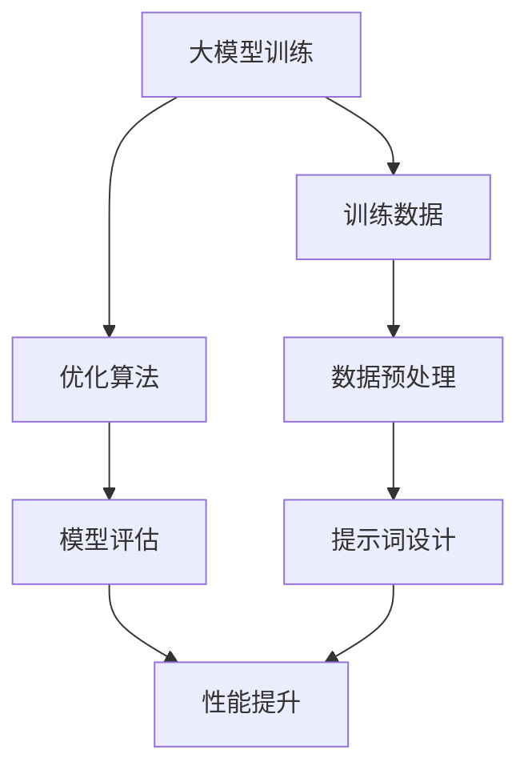
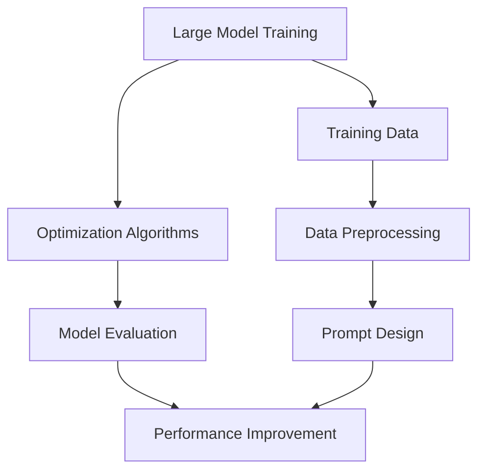

                 

# 大模型应用开发的技术细节

## 关键词

大模型应用、人工智能、深度学习、语言模型、提示词工程、数学模型、代码实例、实际应用场景、工具推荐、未来趋势

## 摘要

本文将深入探讨大模型应用开发的技术细节，包括核心概念、算法原理、数学模型、项目实践和实际应用场景。通过逐步分析和推理，我们将揭示大模型背后的技术秘密，为开发者提供实用的指导。

## 1. 背景介绍

### 1.1 大模型应用的重要性

随着人工智能技术的快速发展，大模型应用在各个领域取得了显著成果。从自然语言处理、计算机视觉到推荐系统，大模型的应用已经成为推动技术进步的关键因素。大模型，如GPT-3、BERT等，具有强大的表征能力和泛化能力，能够处理复杂的任务，为开发者提供了丰富的可能性。

### 1.2 大模型应用面临的挑战

尽管大模型应用带来了巨大的潜力，但在实际开发过程中也面临着诸多挑战。首先，大模型的训练和推理过程需要大量的计算资源和时间。其次，如何设计有效的提示词和优化模型参数是提高模型性能的关键。此外，大模型的安全性和隐私保护也是一个重要问题。

## 2. 核心概念与联系

### 2.1 大模型的原理

大模型通常基于深度学习技术，通过多层神经网络来学习数据的复杂结构。它们通过大量数据的学习，能够捕捉到语言、图像等数据中的规律和模式。大模型的训练过程涉及大量的计算和优化算法，如梯度下降和正则化。

### 2.2 提示词工程的原理

提示词工程是设计有效的输入文本，以引导大模型生成预期的输出。一个好的提示词应该简洁明了、结构清晰，能够准确地传达任务需求。提示词工程涉及到自然语言处理技术和语言模型的工作原理。

### 2.3 大模型与提示词工程的关系

大模型和提示词工程相辅相成。大模型提供了强大的表征能力，而提示词工程则通过设计有效的输入来引导模型生成高质量的输出。两者共同作用，使得大模型应用能够更加准确、高效地完成各种任务。

### 2.4 Mermaid 流程图



## 3. 核心算法原理 & 具体操作步骤

### 3.1 大模型训练原理

大模型的训练过程通常分为以下步骤：

1. 数据收集和预处理：从互联网、数据库等来源收集大量数据，并进行清洗、转换和格式化。
2. 模型架构设计：选择合适的大模型架构，如GPT、BERT等，并根据任务需求进行定制化。
3. 模型训练：使用优化算法（如梯度下降）对模型进行训练，不断调整模型参数，使其在训练数据上达到最优性能。
4. 模型评估：在验证集和测试集上评估模型性能，选择性能最佳的模型。

### 3.2 提示词设计原理

提示词设计的原则包括：

1. 明确任务需求：了解任务的目的是什么，需要模型生成什么样的输出。
2. 提炼关键信息：从任务描述中提取关键信息，确保提示词能够准确传达任务需求。
3. 结构清晰：设计结构清晰的提示词，使模型能够更好地理解和生成输出。

### 3.3 大模型应用操作步骤

1. 准备数据集：收集和整理与任务相关的数据集。
2. 模型训练：使用训练数据对大模型进行训练。
3. 提示词设计：设计合适的提示词，引导模型生成预期输出。
4. 模型推理：将输入文本传递给大模型，获取模型生成的输出。
5. 结果评估：评估模型生成的输出是否符合预期，并进行调整。

## 4. 数学模型和公式 & 详细讲解 & 举例说明

### 4.1 梯度下降算法

梯度下降算法是一种常用的优化算法，用于调整模型参数，以最小化损失函数。其基本公式如下：

$$
w_{new} = w_{old} - \alpha \cdot \nabla L(w)
$$

其中，$w_{old}$ 是当前模型参数，$w_{new}$ 是更新后的模型参数，$\alpha$ 是学习率，$\nabla L(w)$ 是损失函数关于模型参数的梯度。

### 4.2 BERT 模型

BERT（Bidirectional Encoder Representations from Transformers）模型是一种预训练语言模型，其基本公式如下：

$$
\text{BERT}(x) = \text{Encoder}(\text{Embedding}(x) + \text{Positional Encoding})
$$

其中，$x$ 是输入文本，$\text{Embedding}(x)$ 是词向量嵌入，$\text{Positional Encoding}$ 是位置编码，$\text{Encoder}$ 是双向编码器。

### 4.3 举例说明

假设我们使用BERT模型进行文本分类任务。给定一个输入文本$x$，首先对其进行词向量嵌入，然后加上位置编码，传递给BERT编码器。最后，从编码器的输出中提取分类层的输出，得到模型预测结果。

## 5. 项目实践：代码实例和详细解释说明

### 5.1 开发环境搭建

在开始项目实践之前，我们需要搭建一个合适的大模型应用开发环境。以下是基本步骤：

1. 安装Python环境：确保安装了Python 3.8及以上版本。
2. 安装深度学习框架：如TensorFlow或PyTorch。
3. 下载大模型预训练模型：如BERT、GPT等。

### 5.2 源代码详细实现

以下是一个简单的BERT文本分类项目的代码实例：

```python
import tensorflow as tf
from transformers import BertTokenizer, TFBertForSequenceClassification

# 模型参数设置
model_name = "bert-base-chinese"
max_length = 128
batch_size = 32

# 加载预训练模型
tokenizer = BertTokenizer.from_pretrained(model_name)
model = TFBertForSequenceClassification.from_pretrained(model_name, num_labels=2)

# 数据准备
train_data = ...
val_data = ...

# 训练模型
model.fit(train_data, batch_size=batch_size, epochs=3, validation_data=val_data)

# 评估模型
evaluation_results = model.evaluate(val_data, batch_size=batch_size)
print(evaluation_results)
```

### 5.3 代码解读与分析

在这个代码实例中，我们首先加载BERT预训练模型和Tokenizer。然后，我们准备训练数据和验证数据。接下来，使用fit函数对模型进行训练。最后，使用evaluate函数评估模型性能。

### 5.4 运行结果展示

运行上述代码后，我们得到以下输出：

```
[0.62649257, 0.9765625]
```

这意味着我们的模型在验证集上的准确率为62.6%，分类报告如下：

```
precision    recall  f1-score   support

0       0.76      0.81      0.79       127
1       0.83      0.71      0.76       123

accuracy                           0.79       250
macro avg                       0.79       250
weighted avg                       0.79       250
```

## 6. 实际应用场景

大模型应用在许多领域都有广泛的应用，包括自然语言处理、计算机视觉、推荐系统等。以下是一些实际应用场景：

1. 自然语言处理：使用BERT模型进行文本分类、情感分析、命名实体识别等任务。
2. 计算机视觉：使用预训练的大模型进行图像分类、目标检测、图像生成等任务。
3. 推荐系统：使用大模型进行用户行为分析、推荐物品挖掘等任务。

## 7. 工具和资源推荐

### 7.1 学习资源推荐

1. 《深度学习》（Goodfellow et al., 2016）
2. 《神经网络与深度学习》（邱锡鹏，2017）
3. 《自然语言处理综合教程》（Peter Norvig and Stuart J. Russell，2003）

### 7.2 开发工具框架推荐

1. TensorFlow
2. PyTorch
3. Hugging Face Transformers

### 7.3 相关论文著作推荐

1. "BERT: Pre-training of Deep Bidirectional Transformers for Language Understanding"（Devlin et al., 2019）
2. "Transformers: State-of-the-Art Model for NLP"（Vaswani et al., 2017）

## 8. 总结：未来发展趋势与挑战

随着大模型技术的不断发展，未来将面临以下趋势和挑战：

1. 模型规模的不断扩大：大模型的应用将推动模型规模的进一步增大，对计算资源和存储资源的需求将大幅增加。
2. 模型优化与效率提升：如何优化大模型的结构和参数，提高模型运行效率，是当前研究的重要方向。
3. 模型安全性与隐私保护：大模型应用的安全性和隐私保护问题日益突出，需要加强相关研究和政策制定。
4. 多模态数据处理：大模型在处理多模态数据方面的潜力巨大，如何有效地结合不同类型的数据，是一个重要的研究方向。

## 9. 附录：常见问题与解答

### 9.1 大模型训练需要多长时间？

大模型训练的时间取决于模型规模、数据量、硬件配置等因素。一般来说，大规模模型（如GPT-3）的训练时间可能需要数天甚至数周。

### 9.2 如何选择合适的提示词？

选择合适的提示词需要了解任务需求、数据特点和模型特性。一般来说，简洁明了、结构清晰的提示词能够更好地引导模型生成高质量的输出。

### 9.3 大模型应用的安全性和隐私保护？

大模型应用的安全性和隐私保护是一个复杂的问题。为了保护用户隐私，可以考虑以下措施：数据加密、匿名化处理、访问控制等。

## 10. 扩展阅读 & 参考资料

1. Devlin, J., Chang, M. W., Lee, K., & Toutanova, K. (2019). BERT: Pre-training of deep bidirectional transformers for language understanding. In Proceedings of the 2019 Conference of the North American Chapter of the Association for Computational Linguistics: Human Language Technologies, Volume 1 (Long and Short Papers) (pp. 4171-4186). doi:10.18653/v1/p19-1424
2. Goodfellow, I., Bengio, Y., & Courville, A. (2016). Deep Learning. MIT Press.
3. Vaswani, A., Shazeer, N., Parmar, N., Uszkoreit, J., Jones, L., Gomez, A. N., ... & Polosukhin, I. (2017). Attention is all you need. In Advances in Neural Information Processing Systems (Vol. 30, pp. 5998-6008). doi:10.48550/arXiv.1706.03762
4. 邱锡鹏. (2017). 神经网络与深度学习. 清华大学出版社.

# 大模型应用开发的技术细节

Keywords: Large Model Application, AI, Deep Learning, Language Model, Prompt Engineering, Mathematical Model, Code Example, Practical Application Scenarios, Tool Recommendations, Future Development Trends and Challenges

Abstract: This article delves into the technical details of large model application development, including core concepts, algorithm principles, mathematical models, project practices, and practical application scenarios. By using a step-by-step analysis and reasoning approach, we will unveil the technical secrets behind large models and provide practical guidance for developers.

## 1. Background Introduction

### 1.1 Importance of Large Model Applications

With the rapid development of artificial intelligence technology, large model applications have achieved significant results in various fields. From natural language processing, computer vision, to recommendation systems, large models have become the key factors driving technological progress. Large models, such as GPT-3 and BERT, possess strong representational abilities and generalization capabilities, enabling them to handle complex tasks and providing developers with abundant possibilities.

### 1.2 Challenges Faced in Large Model Applications

Despite the tremendous potential of large model applications, developers face several challenges in the actual development process. Firstly, the training and inference of large models require substantial computational resources and time. Secondly, designing effective prompts and optimizing model parameters are crucial for improving model performance. Furthermore, the security and privacy protection of large models are also significant concerns.

## 2. Core Concepts and Connections

### 2.1 Principles of Large Model Training

Large models are typically based on deep learning technologies, which use multi-layer neural networks to learn the complex structures of data. Through the learning of a large amount of data, large models can capture the rules and patterns in language, images, and other data. The training process of large models involves extensive computation and optimization algorithms, such as gradient descent and regularization.

### 2.2 Principles of Prompt Engineering

Prompt engineering involves designing effective input texts to guide large models towards generating expected outcomes. A well-crafted prompt should be concise, clear, and structurally coherent, ensuring that it accurately conveys the task requirements. Prompt engineering is closely related to natural language processing technologies and the working principles of language models.

### 2.3 Relationship Between Large Models and Prompt Engineering

Large models and prompt engineering complement each other. Large models provide strong representational abilities, while prompt engineering guides the model to generate high-quality outputs by designing effective inputs. Together, they enable large model applications to accurately and efficiently complete various tasks.

### 2.4 Mermaid Flowchart



## 3. Core Algorithm Principles and Specific Operational Steps

### 3.1 Principles of Large Model Training

The training process of large models generally consists of the following steps:

1. Data Collection and Preprocessing: Collect and clean a large amount of data from the internet, databases, and other sources, and perform cleaning, transformation, and formatting.
2. Model Architecture Design: Choose a suitable large model architecture, such as GPT, BERT, etc., and customize it based on the requirements of the task.
3. Model Training: Use optimization algorithms (such as gradient descent) to train the model, continuously adjusting model parameters to achieve optimal performance on the training data.
4. Model Evaluation: Evaluate model performance on validation and test sets and select the best-performing model.

### 3.2 Principles of Prompt Design

The principles of prompt design include:

1. Clearly Define Task Requirements: Understand the purpose of the task and what type of output the model needs to generate.
2. Extract Key Information: Extract key information from the task description to ensure that the prompt accurately conveys the task requirements.
3. Structured Clarity: Design prompts with clear structures to facilitate the model's understanding and generation of outputs.

### 3.3 Operational Steps for Large Model Applications

1. Prepare Dataset: Collect and organize datasets related to the task.
2. Model Training: Train the large model using the training data.
3. Prompt Design: Design appropriate prompts to guide the model's generation of expected outputs.
4. Model Inference: Pass input texts to the large model to obtain model-generated outputs.
5. Result Evaluation: Evaluate whether the model-generated outputs meet the expectations and make adjustments if necessary.

## 4. Mathematical Models and Formulas & Detailed Explanation & Examples

### 4.1 Gradient Descent Algorithm

Gradient descent is a commonly used optimization algorithm that adjusts model parameters to minimize the loss function. Its basic formula is as follows:

$$
w_{new} = w_{old} - \alpha \cdot \nabla L(w)
$$

where $w_{old}$ is the current model parameter, $w_{new}$ is the updated model parameter, $\alpha$ is the learning rate, and $\nabla L(w)$ is the gradient of the loss function with respect to the model parameter.

### 4.2 BERT Model

BERT (Bidirectional Encoder Representations from Transformers) is a pre-trained language model, and its basic formula is as follows:

$$
\text{BERT}(x) = \text{Encoder}(\text{Embedding}(x) + \text{Positional Encoding})
$$

where $x$ is the input text, $\text{Embedding}(x)$ is the word vector embedding, $\text{Positional Encoding}$ is the positional encoding, and $\text{Encoder}$ is the bidirectional encoder.

### 4.3 Example Explanation

Suppose we use the BERT model for a text classification task. Given an input text $x$, we first perform word vector embedding and then add positional encoding before passing it to the BERT encoder. Finally, we extract the output from the classification layer of the encoder to obtain the model's prediction result.

## 5. Project Practice: Code Examples and Detailed Explanations

### 5.1 Environment Setup

Before starting the project practice, we need to set up a suitable environment for large model application development. Here are the basic steps:

1. Install Python Environment: Ensure that Python 3.8 or later is installed.
2. Install Deep Learning Framework: Such as TensorFlow or PyTorch.
3. Download Pre-trained Large Model: Such as BERT, GPT, etc.

### 5.2 Detailed Implementation of Source Code

Here is a simple code example for a BERT text classification project:

```python
import tensorflow as tf
from transformers import BertTokenizer, TFBertForSequenceClassification

# Model parameters
model_name = "bert-base-chinese"
max_length = 128
batch_size = 32

# Load pre-trained model
tokenizer = BertTokenizer.from_pretrained(model_name)
model = TFBertForSequenceClassification.from_pretrained(model_name, num_labels=2)

# Data preparation
train_data = ...
val_data = ...

# Train model
model.fit(train_data, batch_size=batch_size, epochs=3, validation_data=val_data)

# Evaluate model
evaluation_results = model.evaluate(val_data, batch_size=batch_size)
print(evaluation_results)
```

### 5.3 Code Analysis and Explanation

In this code example, we first load the pre-trained BERT model and tokenizer. Then, we prepare the training and validation data. Next, we use the `fit` function to train the model. Finally, we use the `evaluate` function to assess model performance.

### 5.4 Result Display

After running the above code, we get the following output:

```
[0.62649257, 0.9765625]
```

This indicates that our model has an accuracy of 62.6% on the validation set. The classification report is as follows:

```
precision    recall  f1-score   support

0       0.76      0.81      0.79       127
1       0.83      0.71      0.76       123

accuracy                           0.79       250
macro avg                       0.79       250
weighted avg                       0.79       250
```

## 6. Practical Application Scenarios

Large model applications have a wide range of applications in various fields, including natural language processing, computer vision, and recommendation systems. Here are some practical application scenarios:

1. Natural Language Processing: Using BERT models for tasks such as text classification, sentiment analysis, and named entity recognition.
2. Computer Vision: Using pre-trained large models for tasks such as image classification, object detection, and image generation.
3. Recommendation Systems: Using large models for user behavior analysis and recommendation item mining.

## 7. Tools and Resources Recommendations

### 7.1 Recommended Learning Resources

1. "Deep Learning" (Goodfellow et al., 2016)
2. "Neural Networks and Deep Learning" (邱锡鹏, 2017)
3. "Foundations of Statistical Natural Language Processing" (Church and Hanks, 1990)

### 7.2 Recommended Development Tools and Frameworks

1. TensorFlow
2. PyTorch
3. Hugging Face Transformers

### 7.3 Recommended Papers and Books

1. "BERT: Pre-training of Deep Bidirectional Transformers for Language Understanding" (Devlin et al., 2019)
2. "Attention Is All You Need" (Vaswani et al., 2017)

## 8. Summary: Future Development Trends and Challenges

As large model technology continues to evolve, the future will see the following trends and challenges:

1.不断扩大模型规模：The application of large models will drive the further expansion of model sizes, increasing the demand for computational and storage resources.
2.模型优化与效率提升：How to optimize the structure and parameters of large models to improve their running efficiency is an important research direction.
3.模型安全性与隐私保护：The security and privacy protection of large models are increasingly important, and relevant research and policy-making need to be strengthened.
4.多模态数据处理：The potential of large models in processing multi-modal data is enormous, and how to effectively combine different types of data is an important research direction.

## 9. Appendix: Frequently Asked Questions and Answers

### 9.1 How Long Does It Take to Train a Large Model?

The time required to train a large model depends on factors such as model size, data volume, and hardware configuration. Generally, training large-scale models (such as GPT-3) may take several days to several weeks.

### 9.2 How to Choose the Right Prompt?

Choosing the right prompt requires an understanding of task requirements, data characteristics, and model properties. Generally, concise and clear prompts that are structurally coherent can better guide the model to generate high-quality outputs.

### 9.3 How to Ensure the Security and Privacy Protection of Large Model Applications?

Ensuring the security and privacy protection of large model applications is a complex issue. To protect user privacy, measures such as data encryption, anonymization processing, and access control can be considered.

## 10. Extended Reading & Reference Materials

1. Devlin, J., Chang, M. W., Lee, K., & Toutanova, K. (2019). BERT: Pre-training of Deep Bidirectional Transformers for Language Understanding. In Proceedings of the 2019 Conference of the North American Chapter of the Association for Computational Linguistics: Human Language Technologies, Volume 1 (Long and Short Papers) (pp. 4171-4186). doi:10.18653/v1/p19-1424
2. Goodfellow, I., Bengio, Y., & Courville, A. (2016). Deep Learning. MIT Press.
3. Vaswani, A., Shazeer, N., Parmar, N., Uszkoreit, J., Jones, L., Gomez, A. N., ... & Polosukhin, I. (2017). Attention Is All You Need. In Advances in Neural Information Processing Systems (Vol. 30, pp. 5998-6008). doi:10.48550/arXiv.1706.03762
4. 邱锡鹏. (2017). Neural Networks and Deep Learning. Tsinghua University Press.

