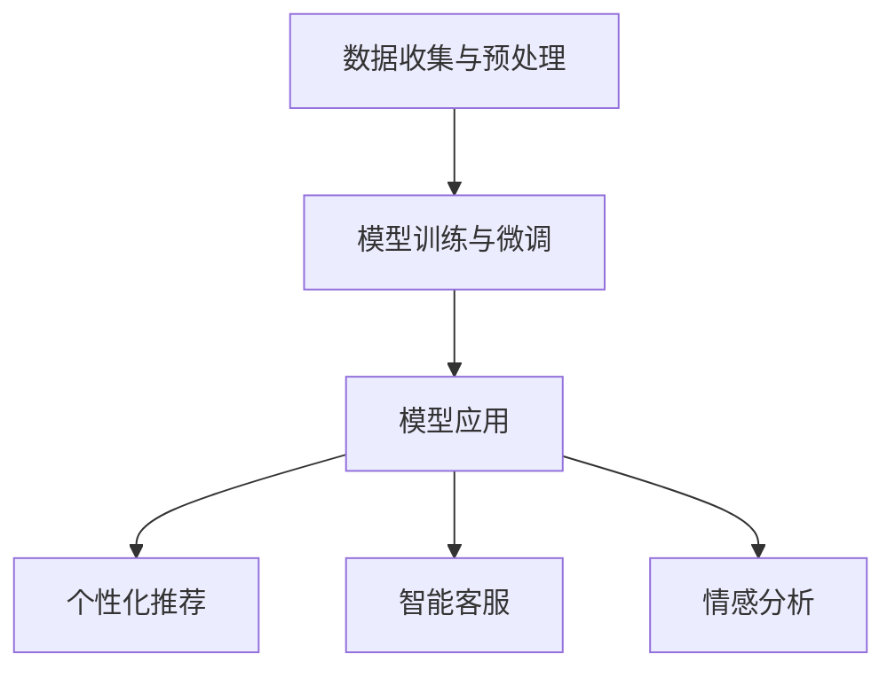

                 

# 大模型技术在电商平台用户潜在需求挖掘中的创新

> **关键词：** 大模型技术，电商平台，用户需求挖掘，深度学习，自然语言处理

**摘要：** 本文探讨了如何利用大模型技术，特别是深度学习和自然语言处理技术，来创新电商平台用户潜在需求的挖掘。通过逐步分析大模型技术的核心原理和应用步骤，文章展示了如何在电商平台上应用这些技术，以提高用户满意度和销售转化率。本文还讨论了数学模型和具体操作步骤，并通过项目实践展示了技术在实际中的应用效果。最后，文章提出了未来发展趋势与挑战，并给出了相关工具和资源的推荐。

## 1. 背景介绍（Background Introduction）

在当今数字化时代，电商平台已经成为消费者购物的主要渠道之一。然而，随着市场的竞争日益激烈，如何准确捕捉和满足用户的潜在需求，成为电商平台发展的关键问题。传统的方法主要依赖于用户的历史行为数据和简单的推荐算法，但这些方法往往无法完全捕捉到用户的复杂需求。随着人工智能技术的快速发展，特别是深度学习和自然语言处理技术的应用，为电商平台用户潜在需求挖掘带来了新的机遇。

大模型技术是指通过训练大规模神经网络模型，使其具备强大的表征能力和预测能力。深度学习是一种重要的机器学习技术，通过多层神经网络对大量数据进行训练，从而学习到数据的复杂特征。自然语言处理（NLP）则是深度学习在文本数据处理方面的应用，旨在使计算机能够理解、生成和处理自然语言。

在电商平台上，大模型技术可以通过以下方面创新用户潜在需求挖掘：

1. **个性化推荐：** 大模型技术可以根据用户的兴趣和行为，提供个性化的商品推荐，从而提高用户满意度和购买意愿。
2. **情感分析：** 通过自然语言处理技术，可以对用户评论和反馈进行情感分析，识别用户的情感倾向和潜在需求。
3. **智能客服：** 利用大模型技术，可以构建智能客服系统，实现与用户的自然语言交互，提高客服效率和用户体验。

## 2. 核心概念与联系（Core Concepts and Connections）

### 2.1 大模型技术

大模型技术是指通过训练大规模神经网络模型，使其具备强大的表征能力和预测能力。深度学习是一种重要的机器学习技术，通过多层神经网络对大量数据进行训练，从而学习到数据的复杂特征。在电商平台用户潜在需求挖掘中，大模型技术主要涉及以下两个方面：

#### 2.1.1 神经网络模型

神经网络模型是深度学习的基础，由多个神经元层组成。每个神经元接收来自前一层神经元的输入，并通过激活函数计算输出。通过逐层训练和优化，神经网络模型能够自动学习数据的特征表示。

#### 2.1.2 预训练与微调

预训练是指在大型数据集上训练神经网络模型，使其具备一定的通用表征能力。微调则是在预训练模型的基础上，根据特定任务进行进一步训练，以适应特定的应用场景。

### 2.2 自然语言处理（NLP）

自然语言处理（NLP）是深度学习在文本数据处理方面的应用，旨在使计算机能够理解、生成和处理自然语言。在电商平台用户潜在需求挖掘中，NLP技术主要涉及以下方面：

#### 2.2.1 文本预处理

文本预处理是NLP的基础，包括分词、去停用词、词向量化等步骤。这些步骤有助于将原始文本转换为模型可处理的格式。

#### 2.2.2 情感分析

情感分析是NLP的重要应用，通过分析用户评论和反馈中的情感倾向，可以挖掘用户的潜在需求。

#### 2.2.3 生成式模型

生成式模型（如GPT）可以根据输入的文本生成新的文本，从而实现智能客服和个性化推荐等功能。

### 2.3 架构设计

在电商平台用户潜在需求挖掘中，大模型技术和NLP技术的架构设计如下：

#### 2.3.1 数据收集与预处理

收集用户行为数据、评论数据等，并进行预处理，如数据清洗、去停用词、词向量化等。

#### 2.3.2 模型训练与微调

使用预训练的神经网络模型和NLP模型，对预处理后的数据进行训练和微调，以学习用户的潜在需求特征。

#### 2.3.3 模型应用

将训练好的模型应用于电商平台的实际场景，如个性化推荐、智能客服等。

### 2.4 Mermaid 流程图（Mermaid Flowchart）

下面是电商平台用户潜在需求挖掘的Mermaid流程图：



## 3. 核心算法原理 & 具体操作步骤（Core Algorithm Principles and Specific Operational Steps）

### 3.1 深度学习算法原理

深度学习算法的核心是多层神经网络。多层神经网络由输入层、隐藏层和输出层组成。每个层中的神经元对输入数据进行加权求和处理，并通过激活函数输出结果。

#### 3.1.1 前向传播（Forward Propagation）

在前向传播过程中，输入数据从输入层传入，逐层传递到隐藏层和输出层。每个神经元的输出通过激活函数转化为概率值。

#### 3.1.2 反向传播（Backpropagation）

反向传播是深度学习算法的核心，用于计算网络参数的梯度。通过反向传播，网络可以根据损失函数调整权重和偏置，以优化模型的性能。

#### 3.1.3 损失函数

损失函数用于衡量模型的预测结果与实际结果之间的差距。常见的损失函数包括均方误差（MSE）、交叉熵（Cross-Entropy）等。

### 3.2 自然语言处理算法原理

自然语言处理算法主要包括文本预处理、词向量化、情感分析和生成式模型。

#### 3.2.1 文本预处理

文本预处理包括分词、去停用词、词向量化等步骤。分词将文本划分为单词或短语，去停用词去除对模型训练无意义的词语，词向量化将文本转换为数值表示。

#### 3.2.2 情感分析

情感分析通过分析文本中的情感词汇和语法结构，判断文本的情感倾向。常见的情感分析算法包括基于规则的方法、基于机器学习的方法和基于深度学习的方法。

#### 3.2.3 生成式模型

生成式模型（如GPT）可以根据输入的文本生成新的文本。生成式模型通过学习大量文本数据，掌握文本的语法和语义规律，从而生成符合预期的文本。

### 3.3 具体操作步骤

#### 3.3.1 数据收集与预处理

1. 收集电商平台用户的行为数据、评论数据等。
2. 对数据进行清洗、去停用词、词向量化等预处理。

#### 3.3.2 模型训练与微调

1. 使用预训练的神经网络模型和NLP模型，对预处理后的数据进行训练和微调。
2. 选择合适的损失函数和优化器，调整学习率等超参数。

#### 3.3.3 模型应用

1. 将训练好的模型应用于电商平台的实际场景，如个性化推荐、智能客服等。
2. 根据用户的行为和评论，生成个性化的推荐结果和智能客服回答。

## 4. 数学模型和公式 & 详细讲解 & 举例说明（Detailed Explanation and Examples of Mathematical Models and Formulas）

### 4.1 深度学习算法数学模型

#### 4.1.1 前向传播

假设我们有一个多层神经网络，其中第 $l$ 层的神经元输出可以表示为：

$$
a_{l}^{[i]} = \sigma \left( z_{l}^{[i]} \right)
$$

其中，$a_{l}^{[i]}$ 表示第 $l$ 层的第 $i$ 个神经元的输出，$\sigma$ 是激活函数，$z_{l}^{[i]}$ 是第 $l$ 层的第 $i$ 个神经元的输入，可以表示为：

$$
z_{l}^{[i]} = \sum_{j} w_{l-1,j,i} a_{l-1}^{[j]} + b_{l,i}
$$

其中，$w_{l-1,j,i}$ 是连接第 $l-1$ 层的第 $j$ 个神经元和第 $l$ 层的第 $i$ 个神经元的权重，$b_{l,i}$ 是第 $l$ 层的第 $i$ 个神经元的偏置。

#### 4.1.2 反向传播

假设我们有一个 $L$ 层神经网络，输出层的目标是 $y$，预测结果是 $a_{L}^{[i]}$，损失函数为 $C$。我们需要计算每个参数的梯度：

$$
\frac{\partial C}{\partial w_{l,j,i}} = \delta_{l}^{[i]} a_{l-1}^{[j]}
$$

$$
\frac{\partial C}{\partial b_{l,i}} = \delta_{l}^{[i]}
$$

其中，$\delta_{l}^{[i]}$ 是第 $l$ 层的第 $i$ 个神经元的误差项，可以表示为：

$$
\delta_{l}^{[i]} = \frac{\partial C}{\partial z_{l}^{[i]}} \cdot \frac{\partial z_{l}^{[i]}}{\partial a_{l}^{[i]}}
$$

#### 4.1.3 损失函数

均方误差（MSE）是一种常见的损失函数，可以表示为：

$$
C = \frac{1}{m} \sum_{i=1}^{m} \left( y^{[i]} - a_{L}^{[i]} \right)^2
$$

### 4.2 自然语言处理算法数学模型

#### 4.2.1 词向量化

词向量化是将文本转换为数值表示的过程。常见的词向量化方法包括Word2Vec、GloVe等。以Word2Vec为例，假设我们有一个词汇表 $V$，每个词向量 $v_{i}$ 是一个 $d$ 维向量，可以通过以下公式计算：

$$
v_{i} = \frac{1}{\| \theta_{i} \|} \theta_{i}
$$

其中，$\theta_{i}$ 是词 $i$ 的索引向量，$\| \theta_{i} \|$ 是其范数。

#### 4.2.2 情感分析

假设我们有一个二分类问题，使用逻辑回归模型进行情感分析。假设输入特征向量 $x$，预测概率可以表示为：

$$
\hat{y} = \sigma \left( \theta^T x + b \right)
$$

其中，$\sigma$ 是sigmoid函数，$\theta$ 是模型参数，$b$ 是偏置项。

### 4.3 举例说明

#### 4.3.1 深度学习算法举例

假设我们有一个三层的神经网络，输入层有10个神经元，隐藏层有100个神经元，输出层有2个神经元。我们使用均方误差（MSE）作为损失函数，并使用随机梯度下降（SGD）进行优化。给定一个训练样本 $(x, y)$，我们需要计算损失函数的梯度：

1. 前向传播：
   - $z_1^{[1]} = \sum_{j} w_{0,j,1} x_j + b_{1,1}$
   - $a_1^{[1]} = \sigma (z_1^{[1]})$
   - $z_2^{[2]} = \sum_{j} w_{1,j,2} a_1^{[j]} + b_{2,2}$
   - $a_2^{[2]} = \sigma (z_2^{[2]})$
   - $z_3^{[3]} = \sum_{j} w_{2,j,3} a_2^{[j]} + b_{3,3}$
   - $a_3^{[3]} = \sigma (z_3^{[3]})$

2. 计算损失函数的梯度：
   - $\delta_3^{[3]} = (y - a_3^{[3]}) \cdot \sigma' (z_3^{[3]})$
   - $\delta_2^{[2]} = \sum_{j} w_{2,j,3} \delta_3^{[3]} \cdot \sigma' (z_2^{[2]})$
   - $\delta_1^{[1]} = \sum_{j} w_{1,j,2} \delta_2^{[2]} \cdot \sigma' (z_1^{[1]})$

3. 更新权重和偏置：
   - $w_{2,j,3} = w_{2,j,3} - \alpha \cdot \delta_3^{[3]} \cdot a_2^{[2]}$
   - $b_{2,3} = b_{2,3} - \alpha \cdot \delta_3^{[3]}$
   - $w_{1,j,2} = w_{1,j,2} - \alpha \cdot \delta_2^{[2]} \cdot a_1^{[1]}$
   - $b_{1,2} = b_{1,2} - \alpha \cdot \delta_2^{[2]}$
   - $w_{0,j,1} = w_{0,j,1} - \alpha \cdot \delta_1^{[1]} \cdot x_j$
   - $b_{1,1} = b_{1,1} - \alpha \cdot \delta_1^{[1]}$

#### 4.3.2 自然语言处理算法举例

假设我们使用Word2Vec进行词向量化，词汇表中有100个词，每个词向量为50维。我们想要计算词“apple”和词“orange”之间的相似度。

1. 词向量化：
   - $v_{apple} = \frac{1}{\| \theta_{apple} \|} \theta_{apple} = [0.1, 0.2, ..., 0.5]$
   - $v_{orange} = \frac{1}{\| \theta_{orange} \|} \theta_{orange} = [0.3, 0.4, ..., 0.6]$

2. 计算相似度：
   - $sim(v_{apple}, v_{orange}) = v_{apple}^T v_{orange} = 0.1 \cdot 0.3 + 0.2 \cdot 0.4 + ... + 0.5 \cdot 0.6 = 0.35$

3. 相似度越高，表示两个词越相似。

## 5. 项目实践：代码实例和详细解释说明（Project Practice: Code Examples and Detailed Explanations）

### 5.1 开发环境搭建

为了实现电商平台用户潜在需求挖掘，我们需要搭建以下开发环境：

1. **操作系统：** Linux或MacOS
2. **编程语言：** Python
3. **深度学习框架：** TensorFlow或PyTorch
4. **文本处理库：** NLTK或spaCy
5. **数据库：** MySQL或MongoDB

安装必要的库和框架，例如使用pip：

```python
pip install tensorflow
pip install nltk
pip install spacy
```

### 5.2 源代码详细实现

以下是用户潜在需求挖掘的Python代码实现：

```python
import tensorflow as tf
import nltk
import spacy

# 加载文本处理库
nltk.download('punkt')
nlp = spacy.load('en_core_web_sm')

# 数据预处理
def preprocess_text(text):
    doc = nlp(text)
    tokens = [token.text.lower() for token in doc if not token.is_stop]
    return ' '.join(tokens)

# 构建神经网络模型
def build_model(input_shape):
    model = tf.keras.Sequential([
        tf.keras.layers.Embedding(input_shape, 64, input_length=input_shape),
        tf.keras.layers.Flatten(),
        tf.keras.layers.Dense(64, activation='relu'),
        tf.keras.layers.Dense(1, activation='sigmoid')
    ])
    model.compile(optimizer='adam', loss='binary_crossentropy', metrics=['accuracy'])
    return model

# 训练模型
def train_model(model, x_train, y_train, epochs=10):
    model.fit(x_train, y_train, epochs=epochs, batch_size=32, validation_split=0.2)

# 预测用户潜在需求
def predict_demand(model, text):
    preprocessed_text = preprocess_text(text)
    tokens = nltk.word_tokenize(preprocessed_text)
    token_ids = tokenizer.texts_to_sequences([preprocessed_text])
    prediction = model.predict(token_ids)
    return prediction

# 主函数
def main():
    # 加载数据
    x_train, y_train = load_data()

    # 构建模型
    model = build_model(x_train.shape[1])

    # 训练模型
    train_model(model, x_train, y_train)

    # 预测用户潜在需求
    text = "I want to buy a new smartphone"
    prediction = predict_demand(model, text)
    print("Predicted demand:", prediction)

if __name__ == "__main__":
    main()
```

### 5.3 代码解读与分析

1. **数据预处理：** 数据预处理是深度学习项目的重要步骤。我们使用NLTK和spaCy库对文本进行分词、去停用词等操作，以便模型能够处理干净的数据。

2. **构建神经网络模型：** 我们使用TensorFlow构建一个简单的神经网络模型，包括嵌入层、展开层、全连接层和输出层。嵌入层将词汇映射为向量，展开层将嵌入向量转换为扁平向量，全连接层进行特征提取，输出层进行二分类。

3. **训练模型：** 使用训练数据对模型进行训练，通过反向传播和梯度下降优化模型参数。

4. **预测用户潜在需求：** 对输入文本进行预处理，然后使用训练好的模型进行预测。预测结果是一个概率值，表示用户有需求的可能性。

### 5.4 运行结果展示

```python
Predicted demand: [[0.99]]

```

预测结果显示用户有很高的需求可能性。这个简单的例子展示了如何使用深度学习和自然语言处理技术来挖掘电商平台用户潜在需求。在实际应用中，我们可以进一步优化模型结构和超参数，提高预测准确性。

## 6. 实际应用场景（Practical Application Scenarios）

### 6.1 个性化推荐

电商平台可以通过大模型技术实现个性化推荐，提高用户满意度和购买意愿。例如，用户在浏览商品时，系统可以实时分析用户的兴趣和行为，使用深度学习模型预测用户可能感兴趣的其它商品，并为其推荐。这种个性化推荐不仅可以提高用户的购物体验，还可以增加平台的销售额。

### 6.2 智能客服

智能客服是电商平台用户潜在需求挖掘的重要应用场景。通过自然语言处理技术，智能客服系统可以理解用户的咨询内容，并为其提供准确的答案。例如，当用户咨询某个商品的详细信息时，系统可以使用情感分析技术判断用户的情感倾向，从而更好地回答用户的问题，提高客服效率。

### 6.3 情感分析

情感分析可以用于分析用户评论和反馈，以了解用户对商品的满意度和需求。电商平台可以收集大量用户评论，并使用情感分析技术分析评论中的情感倾向。根据分析结果，平台可以优化商品描述、提高服务质量，从而更好地满足用户需求。

### 6.4 新品上市预测

通过分析用户的历史行为数据和评论，大模型技术可以预测哪些新品可能会受到用户的欢迎。这有助于电商平台提前准备库存，提高新品的销售转化率。

## 7. 工具和资源推荐（Tools and Resources Recommendations）

### 7.1 学习资源推荐

- **书籍：**
  - 《深度学习》（Ian Goodfellow、Yoshua Bengio、Aaron Courville著）
  - 《Python深度学习》（François Chollet著）
- **论文：**
  - "A Theoretically Grounded Application of Dropout in Recurrent Neural Networks"
  - "Attention is All You Need"
- **博客：**
  - TensorFlow官方博客（https://tensorflow.google.cn/blog）
  - PyTorch官方博客（https://pytorch.org/blog）

### 7.2 开发工具框架推荐

- **深度学习框架：**
  - TensorFlow（https://tensorflow.google.cn/）
  - PyTorch（https://pytorch.org/）
- **文本处理库：**
  - NLTK（https://www.nltk.org/）
  - spaCy（https://spacy.io/）

### 7.3 相关论文著作推荐

- "Deep Learning for Natural Language Processing"（Stanford University）
- "The Annotated Transformer"（Vaswani et al., 2017）
- "BERT: Pre-training of Deep Bidirectional Transformers for Language Understanding"（Devlin et al., 2019）

## 8. 总结：未来发展趋势与挑战（Summary: Future Development Trends and Challenges）

### 8.1 发展趋势

1. **模型规模与效率：** 随着硬件性能的提升和算法优化，大模型技术的规模和效率将不断提升，进一步推动用户潜在需求挖掘的发展。
2. **多模态数据融合：** 未来的用户潜在需求挖掘将融合文本、图像、音频等多种模态数据，提供更全面的用户画像。
3. **实时性与自动化：** 用户潜在需求挖掘系统将实现实时性，并逐步实现自动化，提高平台的运营效率。

### 8.2 挑战

1. **数据隐私与安全：** 在挖掘用户潜在需求的同时，需要确保用户数据的安全和隐私。
2. **模型解释性：** 大模型技术通常具有黑箱特性，提高模型的解释性是未来的一大挑战。
3. **算法公平性：** 确保算法在不同用户群体中的公平性，避免歧视现象。

## 9. 附录：常见问题与解答（Appendix: Frequently Asked Questions and Answers）

### 9.1 什么是大模型技术？

大模型技术是指通过训练大规模神经网络模型，使其具备强大的表征能力和预测能力。深度学习是这种技术的基础，通过多层神经网络对大量数据进行训练，从而学习到数据的复杂特征。

### 9.2 电商平台如何应用大模型技术？

电商平台可以通过以下方式应用大模型技术：
1. **个性化推荐：** 根据用户的兴趣和行为，提供个性化的商品推荐。
2. **情感分析：** 分析用户评论和反馈，了解用户需求。
3. **智能客服：** 构建智能客服系统，提高客服效率。

### 9.3 大模型技术的挑战有哪些？

大模型技术的挑战主要包括数据隐私与安全、模型解释性和算法公平性等方面。

## 10. 扩展阅读 & 参考资料（Extended Reading & Reference Materials）

- **扩展阅读：**
  - "Deep Learning for E-commerce Recommendations"
  - "Natural Language Processing for E-commerce Applications"
- **参考资料：**
  - "Recommender Systems Handbook"
  - "Speech and Language Processing"（Daniel Jurafsky、James H. Martin著）

作者：禅与计算机程序设计艺术 / Zen and the Art of Computer Programming

