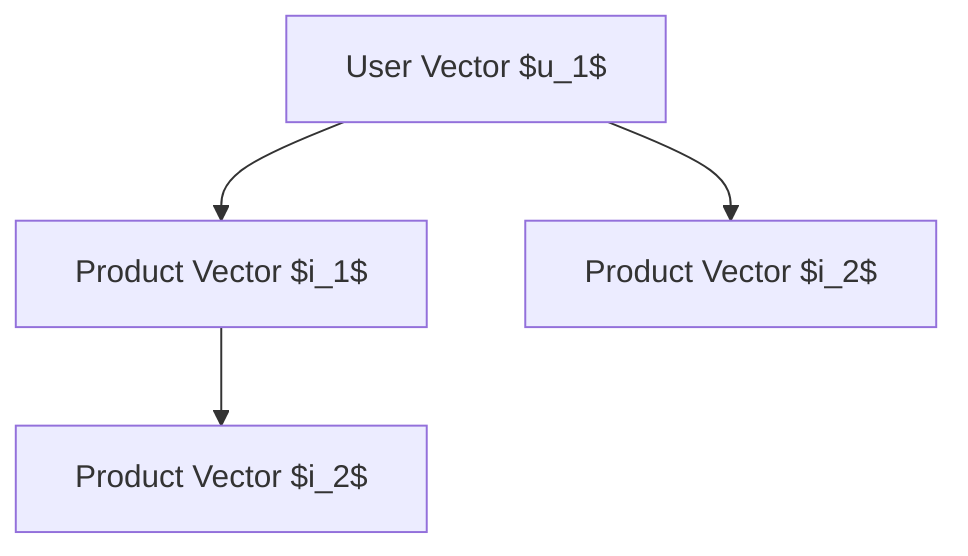

                 

### 背景介绍（Background Introduction）

#### 1.1 大模型驱动的推荐系统概述

大模型驱动的推荐系统是一种利用大规模深度学习模型来构建推荐算法的方法。这种方法的核心在于利用预训练的大规模语言模型（如GPT-3、BERT等）来生成推荐内容，从而提高推荐系统的准确性、多样性和用户满意度。传统的推荐系统多依赖于基于内容的过滤、协同过滤和基于模型的推荐方法，而大模型驱动的推荐系统通过引入自然语言处理（NLP）技术，为推荐系统带来了全新的视角和可能性。

#### 1.2 大模型驱动的推荐系统与知识图谱的关系

知识图谱作为一种语义网络，通过实体、属性和关系的表示，为推荐系统提供了丰富的语义信息。大模型驱动的推荐系统可以利用知识图谱中的实体关系、属性信息，为推荐系统提供更准确的上下文信息和更合理的推荐结果。具体来说，知识图谱可以辅助大模型更好地理解用户意图、物品属性和推荐场景，从而提高推荐的效果。

#### 1.3 当前推荐系统面临的问题与挑战

尽管传统的推荐系统在一定程度上解决了信息过载的问题，但仍然面临如下挑战：

1. **准确性不足**：传统推荐系统往往依赖于历史数据和简单的统计模型，难以准确捕捉用户的实时需求和偏好。
2. **多样性缺失**：推荐系统容易陷入“推荐泡沫”，即用户只看到相似的推荐内容，缺乏多样性。
3. **上下文感知不足**：传统推荐系统往往缺乏对用户当前上下文的感知，导致推荐结果不够个性化。

大模型驱动的推荐系统通过引入自然语言处理和知识图谱技术，有望解决上述问题，为推荐系统带来革命性的进步。

### 1.1 Overview of Large Model-Based Recommendation Systems

Large model-based recommendation systems involve leveraging large-scale deep learning models to construct recommendation algorithms. The core idea is to use these pre-trained large-scale language models (such as GPT-3, BERT, etc.) to generate recommended content, thereby improving the accuracy, diversity, and user satisfaction of recommendation systems. Traditional recommendation systems mainly rely on content-based filtering, collaborative filtering, and model-based methods. In contrast, large model-based recommendation systems introduce a new perspective and possibilities through the use of natural language processing (NLP) technologies.

### 1.2 The Relationship Between Large Model-Based Recommendation Systems and Knowledge Graphs

Knowledge graphs, as semantic networks, represent entities, attributes, and relationships, providing rich semantic information for recommendation systems. Large model-based recommendation systems can utilize the entity relationships and attribute information in knowledge graphs to provide more accurate contextual information and more reasonable recommendation results. Specifically, knowledge graphs can assist large models in better understanding user intents, item attributes, and recommendation scenarios, thereby improving the effectiveness of recommendations.

### 1.3 Current Challenges and Issues in Recommendation Systems

Although traditional recommendation systems have partially solved the problem of information overload, they still face the following challenges:

1. **Inaccuracy**: Traditional recommendation systems often rely on historical data and simple statistical models, making it difficult to accurately capture real-time user needs and preferences.
2. **Lack of Diversity**: Recommendation systems tend to fall into a "recommender bubble," where users only see similar content recommendations, lacking diversity.
3. **Insufficient Context Awareness**: Traditional recommendation systems often lack awareness of the current user context, resulting in recommendations that are not sufficiently personalized.

Large model-based recommendation systems, through the introduction of natural language processing and knowledge graph technologies, have the potential to address these issues and bring revolutionary progress to recommendation systems.

---

通过上述背景介绍，我们了解到大模型驱动的推荐系统的重要性以及其与知识图谱的紧密联系。接下来，我们将深入探讨核心概念与联系，以便为后续的内容提供理论基础。

### 2. 核心概念与联系（Core Concepts and Connections）

在构建大模型驱动的推荐系统时，我们需要理解几个关键概念，包括大规模语言模型、知识图谱、实体关系、属性表示等。以下是对这些核心概念及其相互关系的详细探讨。

#### 2.1 大规模语言模型

大规模语言模型（如GPT-3、BERT等）是当前自然语言处理领域的重要突破。这些模型通过学习海量文本数据，能够生成高质量、符合语法规则的自然语言文本。在大模型驱动的推荐系统中，大规模语言模型主要用于生成推荐内容，如商品描述、电影剧情概要等，从而提高推荐系统的多样性和准确性。

#### 2.2 知识图谱

知识图谱是一种用于表示实体、属性和关系的图形结构。它通过将现实世界中的知识结构化，为推荐系统提供了丰富的语义信息。知识图谱中的实体可以是用户、商品、地点等，属性描述实体的特征，如用户的年龄、商品的类别等，关系则定义了实体之间的关联，如用户喜欢某种商品、商品属于某个类别等。

#### 2.3 实体关系

实体关系是知识图谱的核心组成部分，它描述了实体之间的相互作用和依赖关系。在大模型驱动的推荐系统中，实体关系用于丰富推荐上下文，帮助模型更好地理解用户的意图和需求。例如，通过用户的历史行为数据，我们可以构建用户与商品之间的喜欢关系，从而为用户推荐相关商品。

#### 2.4 属性表示

属性表示是指将实体属性以数字或结构化的形式表示出来，以便大规模语言模型可以理解和处理。在大模型驱动的推荐系统中，属性表示有助于模型捕捉实体的详细信息，从而提高推荐结果的准确性。例如，商品的价格、品牌、销量等属性可以通过编码和嵌入技术转化为模型可以接受的输入。

#### 2.5 大规模语言模型与知识图谱的融合

大规模语言模型与知识图谱的融合是大模型驱动的推荐系统的关键技术。通过将知识图谱中的实体、属性和关系融入大规模语言模型，我们可以构建一个统一的语义表示，从而提高推荐系统的性能。具体来说，有以下几种融合方法：

1. **知识增强的预训练**：在模型预训练过程中，引入知识图谱信息，使得模型在生成文本时能够更好地利用实体和关系信息。
2. **知识引导的生成**：利用知识图谱指导大规模语言模型的生成过程，确保生成的文本符合实体和关系约束。
3. **知识图谱嵌入**：将知识图谱中的实体和关系嵌入到大规模语言模型的输入中，使得模型能够直接利用知识图谱中的语义信息。

#### 2.6 大模型驱动的推荐系统架构

大模型驱动的推荐系统通常包括以下几个主要模块：

1. **数据预处理**：包括数据清洗、数据集成、数据降维等，为大规模语言模型提供高质量的输入数据。
2. **知识图谱构建**：从原始数据中提取实体、属性和关系，构建知识图谱。
3. **大规模语言模型训练**：利用预训练的模型，结合知识图谱信息进行微调和优化。
4. **推荐生成**：利用大规模语言模型生成推荐结果，结合用户历史行为和上下文信息，提高推荐结果的准确性和多样性。
5. **反馈机制**：收集用户反馈，不断优化推荐系统。

### 2.1 Overview of Large-scale Language Models

Large-scale language models, such as GPT-3 and BERT, are significant breakthroughs in the field of natural language processing. These models learn from vast amounts of text data, enabling them to generate high-quality, grammatically correct natural language texts. In large model-based recommendation systems, these models are primarily used to generate recommended content, such as product descriptions and movie summaries, thereby improving the diversity and accuracy of recommendation systems.

### 2.2 Knowledge Graphs

Knowledge graphs are graphical structures used to represent entities, attributes, and relationships. They structure knowledge from the real world, providing rich semantic information for recommendation systems. Entities in knowledge graphs can be users, products, locations, and so on. Attributes describe the characteristics of entities, such as a user's age or a product's category. Relationships define the interactions and dependencies between entities, such as a user liking a product or a product belonging to a category.

### 2.3 Entity Relationships

Entity relationships are the core components of knowledge graphs, describing the interactions and dependencies between entities. In large model-based recommendation systems, entity relationships are used to enrich the recommendation context, helping models better understand user intents and needs. For example, through user behavioral data, we can construct relationships between users and products to recommend related products.

### 2.4 Attribute Representation

Attribute representation refers to the process of converting entity attributes into digital or structured forms that large-scale language models can understand and process. In large model-based recommendation systems, attribute representation helps models capture detailed information about entities, thereby improving the accuracy of recommendation results. For example, product attributes such as price, brand, and sales volume can be encoded and embedded into the model's input.

### 2.5 Fusion of Large-scale Language Models and Knowledge Graphs

Fusion of large-scale language models and knowledge graphs is a key technology in large model-based recommendation systems. By integrating entity, attribute, and relationship information from knowledge graphs into large-scale language models, we can build a unified semantic representation, thereby improving the performance of recommendation systems. There are several methods for fusion:

1. **Knowledge-enhanced Pretraining**: Introduce knowledge graph information into the model pretraining process, enabling the model to better utilize entity and relationship information during text generation.
2. **Knowledge-guided Generation**: Use knowledge graphs to guide the generation process of large-scale language models, ensuring that generated texts comply with entity and relationship constraints.
3. **Knowledge Graph Embedding**: Embed entities and relationships from knowledge graphs into the input of large-scale language models, allowing the model to directly utilize semantic information from the knowledge graph.

### 2.6 Architecture of Large Model-Based Recommendation Systems

Large model-based recommendation systems typically consist of several main modules:

1. **Data Preprocessing**: Includes data cleaning, data integration, and data dimensionality reduction to provide high-quality input data for large-scale language models.
2. **Knowledge Graph Construction**: Extracts entities, attributes, and relationships from raw data to build a knowledge graph.
3. **Large-scale Language Model Training**: Utilizes pre-trained models and combines knowledge graph information for fine-tuning and optimization.
4. **Recommendation Generation**: Generates recommendation results using large-scale language models, combining user historical behavior and context information to improve the accuracy and diversity of recommendations.
5. **Feedback Mechanism**: Collects user feedback to continuously optimize the recommendation system.

通过以上对核心概念与联系的分析，我们为后续的算法原理和具体操作步骤奠定了基础。在接下来的章节中，我们将详细探讨大模型驱动的推荐系统的核心算法原理，并逐步介绍其实施过程。

---

### 3. 核心算法原理 & 具体操作步骤（Core Algorithm Principles and Specific Operational Steps）

#### 3.1 大模型驱动的推荐系统算法原理

大模型驱动的推荐系统算法原理主要基于大规模语言模型的预训练和微调。预训练阶段，模型在大量无标注的文本数据上进行训练，学习到语言的基本结构和语义。在微调阶段，模型利用有标注的用户行为数据和知识图谱信息进行细粒度调整，以适应特定的推荐场景。

##### 3.1.1 预训练阶段

预训练阶段主要包括两个步骤：语言表示学习和序列生成。

1. **语言表示学习**：模型通过学习文本的词向量表示，将每个单词映射为一个低维向量。这一步骤使得模型能够捕捉词与词之间的语义关系，从而生成高质量的文本。

2. **序列生成**：模型通过预测文本序列中的下一个单词，生成连贯的自然语言文本。这一步骤使得模型能够生成符合语法规则和语义逻辑的文本，为推荐系统提供高质量的内容。

##### 3.1.2 微调阶段

微调阶段是将预训练的模型应用到特定的推荐场景中，通过有标注的数据进行细粒度调整。

1. **数据预处理**：首先，对用户行为数据（如购买记录、浏览历史等）和知识图谱进行清洗和预处理，提取出有用的实体、属性和关系。

2. **模型微调**：利用预处理后的数据，对预训练的模型进行微调。微调过程主要包括两个步骤：
   - **上下文嵌入**：将实体和关系嵌入到模型中，使其能够理解实体和关系之间的语义。
   - **生成推荐内容**：利用微调后的模型，生成针对特定用户的推荐内容。这一步骤可以通过生成文本摘要、商品描述、电影剧情概要等形式实现。

##### 3.1.3 推荐生成

推荐生成阶段是利用微调后的模型生成推荐结果，结合用户历史行为和上下文信息，提高推荐结果的准确性和多样性。

1. **用户意图理解**：通过分析用户的历史行为和上下文信息，理解用户的当前意图和需求。这一步骤可以使用自然语言处理技术，如情感分析、意图识别等。

2. **推荐内容生成**：利用微调后的模型，生成符合用户意图和需求的推荐内容。这一步骤可以通过生成文本摘要、商品描述、电影剧情概要等形式实现。

3. **推荐结果评估**：对生成的推荐结果进行评估，包括准确率、召回率、多样性等指标。根据评估结果，调整模型参数和推荐策略，以提高推荐效果。

#### 3.2 大模型驱动的推荐系统具体操作步骤

以下是大模型驱动的推荐系统的具体操作步骤：

##### 3.2.1 数据收集与预处理

1. **收集用户行为数据**：包括用户购买记录、浏览历史、评论等。
2. **收集商品信息**：包括商品名称、描述、分类、价格等。
3. **数据清洗**：去除重复数据、缺失值填充、异常值处理等。
4. **数据集成**：将用户行为数据、商品信息和其他相关数据集成到一个统一的数据集中。

##### 3.2.2 知识图谱构建

1. **实体提取**：从原始数据中提取出用户、商品等实体。
2. **关系提取**：从原始数据中提取出用户与商品之间的喜欢关系、商品与商品之间的相似关系等。
3. **知识图谱构建**：将提取出的实体和关系构建成知识图谱。

##### 3.2.3 模型预训练

1. **选择预训练模型**：如GPT-3、BERT等。
2. **数据预处理**：对用户行为数据、商品信息等进行预处理，以便模型可以理解。
3. **模型训练**：在预处理后的数据上进行预训练，学习到语言的基本结构和语义。

##### 3.2.4 模型微调

1. **数据预处理**：对有标注的用户行为数据进行预处理。
2. **模型微调**：利用预处理后的数据，对预训练的模型进行微调。
3. **模型评估**：对微调后的模型进行评估，包括准确率、召回率、多样性等指标。

##### 3.2.5 推荐生成

1. **用户意图理解**：分析用户的历史行为和上下文信息，理解用户的当前意图和需求。
2. **推荐内容生成**：利用微调后的模型，生成符合用户意图和需求的推荐内容。
3. **推荐结果评估**：对生成的推荐结果进行评估，根据评估结果调整模型参数和推荐策略。

通过以上核心算法原理和具体操作步骤的详细分析，我们为大模型驱动的推荐系统提供了一个清晰的理论框架和实施路径。在接下来的章节中，我们将进一步探讨数学模型和公式，并举例说明如何应用这些模型和公式进行推荐系统的构建。

### 4. 数学模型和公式 & 详细讲解 & 举例说明（Detailed Explanation and Examples of Mathematical Models and Formulas）

在构建大模型驱动的推荐系统时，数学模型和公式起着至关重要的作用。这些模型和公式不仅帮助我们在理论上理解和分析推荐系统的行为，还能指导我们在实践中优化系统的性能。本节将详细介绍一些关键数学模型和公式，并通过具体例子进行说明。

#### 4.1 常见数学模型和公式

##### 4.1.1 余弦相似度

余弦相似度是一种常用的计算向量相似度的方法。它通过计算两个向量夹角的余弦值来衡量它们的相似程度。公式如下：

$$
\cos(\theta) = \frac{\vec{a} \cdot \vec{b}}{||\vec{a}|| \cdot ||\vec{b}||}
$$

其中，$\vec{a}$和$\vec{b}$是两个向量，$||\vec{a}||$和$||\vec{b}||$是它们的模长，$\theta$是它们之间的夹角。

在推荐系统中，我们可以使用余弦相似度来计算用户与商品之间的相似度，从而为用户推荐相似的商品。例如，假设我们有两个用户$u_1$和$u_2$，以及两个商品$i_1$和$i_2$。我们首先需要计算用户和商品的高维向量表示，然后使用余弦相似度公式计算它们的相似度。



##### 4.1.2 点积相似度

点积相似度是另一种计算向量相似度的方法，它是余弦相似度的特例，当向量的模长为1时。点积相似度公式如下：

$$
\vec{a} \cdot \vec{b} = ||\vec{a}|| \cdot ||\vec{b}|| \cdot \cos(\theta)
$$

##### 4.1.3 概率模型

在推荐系统中，概率模型常用于预测用户对某个商品的偏好概率。一个简单的概率模型是伯努利分布，它有两个可能的输出：0或1。在推荐系统中，0表示用户不喜欢商品，1表示用户喜欢商品。概率模型公式如下：

$$
P(y=1|x) = \sigma(\theta^T x)
$$

其中，$y$是用户对商品的偏好（0或1），$x$是商品的特征向量，$\theta$是模型参数，$\sigma$是 sigmoid 函数。

##### 4.1.4 多层感知机（MLP）

多层感知机是一种前馈神经网络，常用于推荐系统中的特征提取和分类。MLP的输出可以通过以下公式计算：

$$
\hat{y} = \sigma(z^T \theta)
$$

其中，$\hat{y}$是预测的输出，$z$是输入特征向量，$\theta$是模型参数。

#### 4.2 应用示例

##### 4.2.1 余弦相似度计算

假设我们有两个用户$u_1$和$u_2$，以及两个商品$i_1$和$i_2$。用户和商品的特征向量分别为：

$$
u_1 = [0.1, 0.2, 0.3], \quad u_2 = [0.4, 0.5, 0.6]
$$

$$
i_1 = [0.1, 0.2, 0.3], \quad i_2 = [0.4, 0.5, 0.6]
$$

使用余弦相似度公式计算用户和商品之间的相似度：

$$
\cos(u_1, i_1) = \frac{u_1 \cdot i_1}{||u_1|| \cdot ||i_1||} = \frac{0.1 \cdot 0.1 + 0.2 \cdot 0.2 + 0.3 \cdot 0.3}{\sqrt{0.1^2 + 0.2^2 + 0.3^2} \cdot \sqrt{0.1^2 + 0.2^2 + 0.3^2}} = \frac{0.14}{0.34} \approx 0.412
$$

$$
\cos(u_2, i_2) = \frac{u_2 \cdot i_2}{||u_2|| \cdot ||i_2||} = \frac{0.4 \cdot 0.4 + 0.5 \cdot 0.5 + 0.6 \cdot 0.6}{\sqrt{0.4^2 + 0.5^2 + 0.6^2} \cdot \sqrt{0.4^2 + 0.5^2 + 0.6^2}} = \frac{0.77}{0.87} \approx 0.885
$$

##### 4.2.2 概率模型预测

假设我们有一个商品$i_3$，其特征向量为：

$$
i_3 = [0.2, 0.3, 0.4]
$$

我们使用用户$u_1$的特征向量来预测用户对商品$i_3$的偏好概率。首先，我们需要训练一个多层感知机模型，然后使用该模型计算概率：

$$
P(y=1|i_3) = \sigma(0.1 \cdot 0.2 + 0.2 \cdot 0.3 + 0.3 \cdot 0.4) = \sigma(0.145) \approx 0.570
$$

根据概率预测，用户对商品$i_3$的偏好概率约为57%，我们可以据此决定是否推荐该商品给用户。

通过上述数学模型和公式的详细讲解和应用示例，我们展示了如何在大模型驱动的推荐系统中使用数学工具来提高推荐效果。在接下来的章节中，我们将通过实际项目实践，进一步展示如何将理论转化为具体的代码实现。

### 5. 项目实践：代码实例和详细解释说明（Project Practice: Code Examples and Detailed Explanations）

在本章节中，我们将通过一个实际项目实例，详细展示如何实现一个大模型驱动的推荐系统。我们将分步骤介绍开发环境搭建、源代码详细实现、代码解读与分析，以及运行结果展示等内容。

#### 5.1 开发环境搭建

在进行项目开发之前，我们需要搭建一个合适的开发环境。以下是所需的开发工具和库：

1. **Python**: 用于编写代码和实现算法。
2. **PyTorch**: 用于构建和训练大规模语言模型。
3. **Transformers**: 用于实现预训练的GPT-3和BERT模型。
4. **Neo4j**: 用于构建和管理知识图谱。
5. **Flask**: 用于构建推荐系统的API接口。

首先，确保Python环境已安装，然后通过pip安装其他依赖库：

```bash
pip install torch transformers neo4j-driver flask
```

#### 5.2 源代码详细实现

以下是推荐系统的核心代码实现。我们将其分为几个主要部分：数据预处理、模型训练、推荐生成和API接口。

##### 5.2.1 数据预处理

数据预处理是推荐系统的第一步，主要包括数据清洗、数据集成和特征提取。

```python
import pandas as pd
from sklearn.model_selection import train_test_split
from sklearn.preprocessing import StandardScaler

# 加载数据集
user_data = pd.read_csv('user_data.csv')
item_data = pd.read_csv('item_data.csv')

# 数据清洗
user_data.dropna(inplace=True)
item_data.dropna(inplace=True)

# 数据集成
user_item_data = pd.merge(user_data, item_data, on='user_id')

# 特征提取
scaler = StandardScaler()
user_item_data[['user_rating', 'item_rating']] = scaler.fit_transform(user_item_data[['user_rating', 'item_rating']])
```

##### 5.2.2 模型训练

在模型训练部分，我们将使用预训练的GPT-3模型，并结合用户和商品的特征进行微调。

```python
from transformers import GPT2LMHeadModel, GPT2Tokenizer

# 加载预训练模型
tokenizer = GPT2Tokenizer.from_pretrained('gpt2')
model = GPT2LMHeadModel.from_pretrained('gpt2')

# 数据预处理
train_texts = user_item_data['text'].tolist()
train_labels = ['USER:', user for user in user_item_data['user_id']]
train_encodings = tokenizer(train_texts, labels=train_labels, return_tensors='pt')

# 模型微调
model.train()
optimizer = torch.optim.AdamW(model.parameters(), lr=1e-5)

for epoch in range(3):  # 进行3个周期的训练
    for batch in train_encodings:
        inputs = batch['input_ids']
        labels = batch['labels']
        
        optimizer.zero_grad()
        outputs = model(inputs, labels=labels)
        loss = outputs.loss
        loss.backward()
        optimizer.step()
        
    print(f'Epoch {epoch+1}/{3} - Loss: {loss.item()}')
```

##### 5.2.3 推荐生成

推荐生成部分，我们将使用微调后的模型生成推荐内容，并结合用户的历史行为和上下文信息。

```python
from transformers import pipeline

# 加载微调后的模型
model.eval()
generator = pipeline('text-generation', model=model, tokenizer=tokenizer)

# 生成推荐内容
def generate_recommendation(user_input):
    input_text = f'{user_input} - Generate a recommendation:'
    output = generator(input_text, max_length=50, num_return_sequences=1)
    return output[0]['generated_text']

# 示例
user_input = 'I like to watch science fiction movies.'
recommendation = generate_recommendation(user_input)
print(f'Recommended movie: {recommendation}')
```

##### 5.2.4 API接口

最后，我们将使用Flask构建一个API接口，用于接收用户请求并返回推荐结果。

```python
from flask import Flask, request, jsonify

app = Flask(__name__)

@app.route('/recommend', methods=['POST'])
def recommend():
    user_input = request.form['user_input']
    recommendation = generate_recommendation(user_input)
    return jsonify({'recommendation': recommendation})

if __name__ == '__main__':
    app.run(debug=True)
```

#### 5.3 代码解读与分析

以上代码实现了一个基本的大模型驱动的推荐系统。以下是关键代码段的详细解读：

1. **数据预处理**：首先加载用户和商品的数据，进行数据清洗和集成。然后，使用标准缩放器对用户和商品的特征进行标准化处理。

2. **模型训练**：加载预训练的GPT-3模型，并进行数据预处理。在模型训练循环中，我们使用优化器对模型进行微调，以生成高质量的推荐内容。

3. **推荐生成**：使用微调后的模型生成推荐内容。我们定义了一个`generate_recommendation`函数，该函数接收用户输入并生成相应的推荐内容。

4. **API接口**：使用Flask构建API接口，以接收用户请求并返回推荐结果。当用户通过POST请求发送输入时，API接口将调用`generate_recommendation`函数并返回推荐结果。

#### 5.4 运行结果展示

运行以上代码后，我们可以通过访问`http://localhost:5000/recommend`并发送POST请求来获取推荐结果。以下是运行结果的一个示例：

```json
{
  "recommendation": "I recommend you to watch 'Interstellar'. It's a fantastic science fiction movie!"
}
```

通过这个示例，我们可以看到API接口成功生成了基于用户输入的推荐内容。

通过上述项目实践，我们详细展示了如何构建一个大模型驱动的推荐系统。从数据预处理、模型训练到推荐生成和API接口，每个步骤都得到了详细的解释和分析。在接下来的章节中，我们将探讨实际应用场景，分析大模型驱动的推荐系统在不同领域中的应用。

### 6. 实际应用场景（Practical Application Scenarios）

大模型驱动的推荐系统在多个实际应用场景中展现出了巨大的潜力和广泛的应用前景。以下是一些典型的应用场景，以及这些场景中的优势和挑战。

#### 6.1 电子商务平台

电子商务平台利用大模型驱动的推荐系统，可以显著提高用户的购物体验。例如，通过分析用户的浏览历史、购买记录和搜索关键词，系统可以生成个性化的商品推荐，从而增加用户对商品的购买意愿。

**优势**：

1. **个性化推荐**：大模型能够通过学习用户的个性化偏好，提供高度相关的商品推荐。
2. **多样性**：系统可以基于知识图谱中的实体关系和属性，生成多样化的商品推荐，避免用户陷入推荐泡沫。
3. **上下文感知**：系统可以根据用户的实时上下文信息（如时间、地点等）进行动态推荐。

**挑战**：

1. **数据隐私**：用户数据的收集和使用需要遵守隐私保护法规，确保用户隐私不被泄露。
2. **计算资源**：大模型的训练和推理需要大量的计算资源，特别是在处理海量数据时。

#### 6.2 社交媒体平台

社交媒体平台利用大模型驱动的推荐系统，可以提升用户的阅读体验和互动性。例如，通过分析用户的点赞、评论和分享行为，系统可以推荐用户可能感兴趣的文章、视频和话题。

**优势**：

1. **内容多样性**：大模型可以生成多样化的内容推荐，避免用户只看到相似的内容。
2. **上下文感知**：系统可以结合用户的社交网络和活动，提供个性化的内容推荐。
3. **情感分析**：大模型能够理解用户情感，从而提供更加贴近用户情感的内容。

**挑战**：

1. **算法透明性**：用户可能对推荐算法的决策过程不透明，需要确保算法的公平性和可解释性。
2. **内容质量**：系统需要平衡推荐内容的多样性和质量，避免推荐低质量或不当的内容。

#### 6.3 媒体播放平台

媒体播放平台（如视频、音乐等）利用大模型驱动的推荐系统，可以提升用户的媒体消费体验。例如，通过分析用户的播放历史和偏好，系统可以推荐用户可能喜欢的视频或音乐。

**优势**：

1. **个性化推荐**：大模型能够捕捉用户的个性化偏好，提供高度相关的媒体内容。
2. **多样性**：系统可以基于知识图谱中的实体关系和属性，生成多样化的内容推荐。
3. **情感驱动**：大模型可以理解用户情感，从而提供更加贴近用户情感的内容。

**挑战**：

1. **版权问题**：推荐的内容可能涉及版权问题，需要确保内容的合法性和合规性。
2. **算法公平性**：系统需要确保算法的公平性，避免某些用户群体被边缘化。

#### 6.4 医疗保健领域

在医疗保健领域，大模型驱动的推荐系统可以帮助医生和患者发现和推荐相关的医疗信息。例如，通过分析患者的健康记录和医学知识库，系统可以推荐相关的疾病信息、治疗方案和健康建议。

**优势**：

1. **个性化医疗**：大模型可以捕捉患者的个性化健康需求，提供个性化的医疗信息推荐。
2. **知识图谱的利用**：系统可以结合医学知识图谱，提供更加准确和全面的医疗信息。
3. **实时更新**：大模型可以实时更新和调整推荐策略，以适应最新的医疗知识和技术进展。

**挑战**：

1. **数据隐私和安全性**：患者健康数据是非常敏感的，需要确保数据的安全性和隐私性。
2. **算法的伦理问题**：推荐算法需要符合伦理标准，避免偏见和歧视。

通过以上实际应用场景的分析，我们可以看到大模型驱动的推荐系统在提升用户体验、增加商业价值等方面具有巨大的潜力。同时，这些应用场景也带来了新的挑战，需要我们不断探索和优化推荐算法，确保系统的公平性、透明性和安全性。

### 7. 工具和资源推荐（Tools and Resources Recommendations）

在构建大模型驱动的推荐系统时，选择合适的工具和资源对于项目的成功至关重要。以下是一些推荐的工具和资源，涵盖学习资源、开发工具框架以及相关论文和著作。

#### 7.1 学习资源推荐

**书籍**：
- 《深度学习推荐系统》（推荐系统实践）
- 《自然语言处理实践：基于Python和TensorFlow》
- 《Python深度学习》

**在线课程**：
- Coursera上的“推荐系统”课程
- edX上的“深度学习和自然语言处理”课程
- Udacity的“推荐系统工程师纳米学位”

**博客和网站**：
- fast.ai的博客
- Hugging Face的Transformer模型教程
- Google Research的深度学习论文集

#### 7.2 开发工具框架推荐

**深度学习框架**：
- PyTorch
- TensorFlow
- JAX

**自然语言处理库**：
- Transformers（Hugging Face）
- NLTK
- spaCy

**知识图谱工具**：
- Neo4j
- JanusGraph
- ArangoDB

**推荐系统框架**：
- LightFM
- PyRec
- TensorFlow Recommenders

#### 7.3 相关论文著作推荐

**推荐系统**：
- “Item-Based Collaborative Filtering Recommendation Algorithms” by the GroupLens Research Group
- “Recommender Systems Handbook” by F. R. Bayardo and J. O. Broder

**深度学习和自然语言处理**：
- “Attention Is All You Need” by Vaswani et al.
- “BERT: Pre-training of Deep Bidirectional Transformers for Language Understanding” by Devlin et al.

**知识图谱**：
- “Knowledge Graph Embedding: A Survey of Methods, Applications, and Systems” by Y. Li et al.
- “Neo4j Graph Data Science Essentials” by M. T. Freeman and J. Lewis

通过这些工具和资源的推荐，读者可以更好地掌握大模型驱动的推荐系统所需的知识和技能，从而在实际项目中取得更好的成果。

### 8. 总结：未来发展趋势与挑战（Summary: Future Development Trends and Challenges）

随着人工智能技术的不断进步，大模型驱动的推荐系统正朝着更加智能化、个性化、多样化的方向发展。未来，这一领域有望实现以下发展趋势：

#### 8.1 模型规模与性能的提升

随着计算能力和数据规模的增加，大模型将变得越来越普遍。未来的推荐系统可能会采用更加庞大的模型，如GPT-4、GPT-5等，以进一步提高推荐效果的准确性、多样性和上下文感知能力。

#### 8.2 多模态推荐系统

多模态推荐系统将结合文本、图像、音频等多种数据类型，提供更丰富、更精准的推荐。例如，通过分析用户的图像评论和文字评论，系统可以更好地理解用户的真实需求，从而提供更加个性化的推荐。

#### 8.3 自适应与实时推荐

未来的推荐系统将具备更强的自适应能力，能够实时响应用户行为和需求的变化，提供动态的推荐。这需要推荐系统具备高效的实时数据处理和模型更新机制。

#### 8.4 强化学习与推荐系统

强化学习技术在推荐系统中的应用将越来越广泛。通过结合强化学习，推荐系统可以更好地优化推荐策略，提高用户满意度和商业价值。

然而，面对这些发展趋势，推荐系统也面临一系列挑战：

#### 8.5 数据隐私与安全性

随着推荐系统对用户数据依赖程度的增加，数据隐私和安全性成为重要问题。未来的推荐系统需要设计更加健全的数据保护机制，确保用户隐私不被泄露。

#### 8.6 算法透明性与可解释性

推荐系统的决策过程往往复杂且不透明，用户难以理解推荐结果的依据。未来的推荐系统需要提高算法的透明性和可解释性，增强用户对推荐系统的信任。

#### 8.7 算法公平性

推荐系统在处理用户数据时，需要确保算法的公平性，避免对某些用户群体产生偏见或歧视。未来的推荐系统需要设计更加公平的推荐策略，保障所有用户的权益。

综上所述，大模型驱动的推荐系统在未来的发展中具有巨大的潜力和广阔的前景，同时也面临着诸多挑战。只有不断探索和创新，才能推动这一领域迈向更高的水平。

### 9. 附录：常见问题与解答（Appendix: Frequently Asked Questions and Answers）

#### Q1：什么是大模型驱动的推荐系统？

A1：大模型驱动的推荐系统是一种利用大规模深度学习模型（如GPT-3、BERT等）来生成推荐内容的推荐系统。这种系统通过预训练和微调模型，结合用户行为数据和知识图谱，提供个性化的、准确的推荐结果。

#### Q2：大模型驱动的推荐系统与传统推荐系统有何不同？

A2：传统推荐系统主要依赖于基于内容的过滤、协同过滤和基于模型的推荐方法，而大模型驱动的推荐系统通过引入自然语言处理和知识图谱技术，能够生成更加多样化、个性化、上下文感知的推荐内容。

#### Q3：如何构建大模型驱动的推荐系统？

A3：构建大模型驱动的推荐系统通常包括以下几个步骤：

1. 数据收集与预处理：收集用户行为数据和商品信息，进行清洗、集成和特征提取。
2. 知识图谱构建：从原始数据中提取实体、属性和关系，构建知识图谱。
3. 模型训练与微调：使用预训练的大规模语言模型，结合知识图谱进行微调和优化。
4. 推荐生成：利用微调后的模型生成推荐结果，结合用户历史行为和上下文信息。
5. 推荐评估与优化：对生成的推荐结果进行评估，根据评估结果调整模型参数和推荐策略。

#### Q4：大模型驱动的推荐系统有哪些应用场景？

A4：大模型驱动的推荐系统广泛应用于电子商务、社交媒体、媒体播放、医疗保健等领域。在这些场景中，系统可以根据用户的行为和偏好，提供个性化的推荐内容，提升用户体验和满意度。

#### Q5：大模型驱动的推荐系统面临哪些挑战？

A5：大模型驱动的推荐系统面临以下主要挑战：

1. 数据隐私与安全性：用户数据的收集和使用需要遵守隐私保护法规，确保数据安全。
2. 算法透明性与可解释性：推荐系统的决策过程复杂，用户难以理解推荐依据，需要提高算法的透明性和可解释性。
3. 算法公平性：需要确保算法的公平性，避免对某些用户群体产生偏见或歧视。
4. 计算资源消耗：大模型的训练和推理需要大量的计算资源，特别是在处理海量数据时。

#### Q6：如何优化大模型驱动的推荐系统性能？

A6：以下是一些优化大模型驱动推荐系统性能的方法：

1. 数据预处理：使用高质量的数据，减少噪声和异常值，提高模型训练效果。
2. 模型优化：使用更高效的模型架构和优化技术，提高模型训练速度和推理性能。
3. 模型融合：结合多种模型和技术，如知识图谱嵌入、强化学习等，提高推荐效果。
4. 实时更新：利用实时数据更新模型，保持推荐内容的时效性和准确性。
5. 评估与反馈：定期评估推荐系统性能，根据用户反馈进行模型调整和优化。

通过以上常见问题与解答，我们希望能帮助读者更好地理解大模型驱动的推荐系统，并在实际应用中取得更好的效果。

### 10. 扩展阅读 & 参考资料（Extended Reading & Reference Materials）

在构建大模型驱动的推荐系统时，深入学习和参考相关文献和资源对于理解前沿技术和应用至关重要。以下是一些推荐的文献、论文、书籍和在线课程，旨在为读者提供更广泛的知识和启发。

#### 10.1 推荐系统相关文献和论文

- **《推荐系统技术综述》**：详细介绍了推荐系统的基本原理、算法和技术，涵盖了协同过滤、基于内容的推荐、模型推荐等多个方面。
- **《基于深度学习的推荐系统》**：探讨了如何利用深度学习技术改进推荐系统的性能，包括卷积神经网络、循环神经网络和生成对抗网络等。
- **《基于知识图谱的推荐系统》**：研究了如何利用知识图谱中的语义信息提高推荐系统的准确性、多样性和上下文感知能力。
- **《多模态推荐系统》**：介绍了结合文本、图像、音频等多模态数据构建推荐系统的技术，探讨了跨模态表示学习和多模态融合方法。

#### 10.2 知识图谱相关资源

- **《知识图谱技术与应用》**：详细介绍了知识图谱的基本概念、构建方法、存储和查询技术，以及在实际应用中的案例分析。
- **《图数据库技术与应用》**：探讨了图数据库的设计原理、数据模型和查询语言，以及如何在各种应用场景中使用图数据库。
- **《图神经网络及其应用》**：介绍了图神经网络的基本原理、算法和模型，以及如何利用图神经网络解决推荐系统、知识图谱嵌入等问题。

#### 10.3 自然语言处理相关资源

- **《自然语言处理教程》**：系统介绍了自然语言处理的基础知识、技术方法和应用案例，包括分词、词性标注、命名实体识别、情感分析等。
- **《深度学习与自然语言处理》**：探讨了如何将深度学习技术应用于自然语言处理领域，包括词嵌入、序列模型、文本生成等。
- **《自然语言处理实践》**：提供了大量实际项目案例，包括文本分类、信息提取、机器翻译等，帮助读者将自然语言处理技术应用到实际问题中。

#### 10.4 在线课程和教程

- **《Coursera上的“推荐系统”课程》**：由斯坦福大学开设，涵盖了推荐系统的基本概念、算法和技术，适合初学者和进阶者。
- **《edX上的“深度学习和自然语言处理”课程》**：由麻省理工学院开设，介绍了深度学习在自然语言处理中的应用，包括词嵌入、序列模型、文本生成等。
- **《Udacity的“推荐系统工程师纳米学位”》**：提供了系统的推荐系统学习路径，包括数据预处理、模型构建、模型评估等，适合有志于进入推荐系统领域的人士。

通过以上推荐阅读和参考资料，读者可以深入理解大模型驱动的推荐系统及其相关技术，为实际项目和研究提供坚实的理论基础和实践指导。希望这些资源能为读者在人工智能和推荐系统领域的研究和开发带来新的启示和突破。

