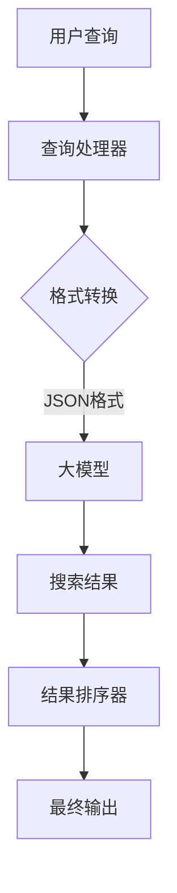
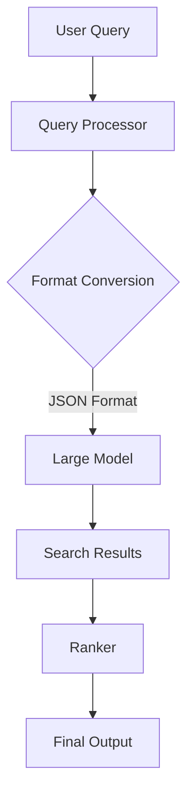
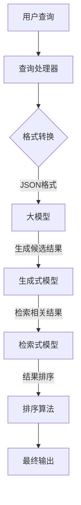
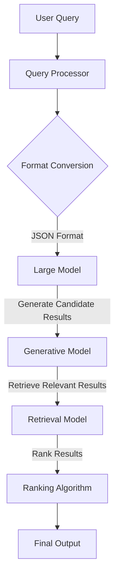

                 

### 背景介绍（Background Introduction）

**标题**: 大模型驱动的智能搜索引擎设计原理

**关键词**: 大模型，搜索引擎，设计原理，智能搜索，深度学习，自然语言处理，人工智能

随着互联网信息的爆炸式增长，如何从海量的数据中高效、准确地获取所需信息，成为了人们关注的焦点。搜索引擎作为获取信息的主要工具，其性能和用户体验直接影响用户的生活和工作效率。传统搜索引擎主要依赖于关键词匹配和页面排名算法，尽管在一定程度上能够满足用户需求，但随着信息复杂度的增加，其搜索效果逐渐受限。为了解决这一问题，大模型驱动的智能搜索引擎应运而生。

大模型驱动的智能搜索引擎是一种利用深度学习、自然语言处理（NLP）等人工智能技术，通过训练大规模的神经网络模型，实现高效、精准搜索的搜索引擎。这种搜索引擎不仅能够处理复杂的查询，还能理解查询意图，提供更加个性化和智能化的搜索结果。

本文将围绕大模型驱动的智能搜索引擎的设计原理展开讨论，旨在为读者提供深入了解这一技术领域的视角。文章首先介绍大模型驱动搜索的背景和现状，然后详细讲解大模型的核心概念、架构设计和核心算法原理，接着通过数学模型和具体实例进行分析，最后探讨这一技术的实际应用场景和未来发展。

通过本文的阅读，读者将能够掌握大模型驱动的智能搜索引擎的基本概念、架构设计和实施方法，为进一步研究和应用这一技术打下坚实基础。

### Introduction: Background of Large Model-Driven Intelligent Search Engine

**Title**: Principles of Large Model-Driven Intelligent Search Engine Design

**Keywords**: Large model, Search engine, Design principles, Intelligent search, Deep learning, Natural Language Processing, Artificial Intelligence

With the explosive growth of information on the internet, how to efficiently and accurately retrieve the desired information from massive data has become a focus of attention. Search engines, as the primary tool for information retrieval, significantly impact user experience and productivity. Traditional search engines mainly rely on keyword matching and page ranking algorithms. Although they can meet user needs to some extent, their search effectiveness is gradually limited with the increasing complexity of information. To address this issue, large model-driven intelligent search engines have emerged.

Large model-driven intelligent search engines are search engines that utilize deep learning, natural language processing (NLP), and other artificial intelligence technologies to train large-scale neural network models for efficient and precise searching. This type of search engine not only handles complex queries but also understands query intents to provide more personalized and intelligent search results.

This article will discuss the design principles of large model-driven intelligent search engines, aiming to provide readers with an in-depth understanding of this technological field. The article will first introduce the background and current status of large model-driven search, then delve into the core concepts, architecture design, and core algorithm principles of large models. Following this, mathematical models and specific examples will be analyzed. Finally, the practical application scenarios and future development trends of this technology will be explored.

Through reading this article, readers will gain a comprehensive understanding of the basic concepts, architecture design, and implementation methods of large model-driven intelligent search engines, laying a solid foundation for further research and application of this technology.

### 核心概念与联系（Core Concepts and Connections）

#### 3.1 大模型的概念与特点

**概念**：大模型通常指的是那些具有数亿甚至数万亿参数的神经网络模型。这些模型通过大量的训练数据，能够学习到复杂的数据分布，从而在各种任务上表现出色。

**特点**：
- **高参数量**：大模型具有大量的参数，这使得它们能够捕捉到数据中的细微特征。
- **深度结构**：大模型通常包含多个层级，每个层级对输入数据进行不同的处理，从而实现数据的逐层抽象。
- **强泛化能力**：通过大规模的数据训练，大模型能够泛化到未见过的数据上，具有良好的鲁棒性。

#### 3.2 智能搜索引擎的核心架构

**架构**：智能搜索引擎的核心架构通常包括以下几个关键部分：
- **索引器（Indexer）**：负责将网页内容转换为索引，以便快速检索。
- **查询处理器（Query Processor）**：接收用户查询，将其转换为模型可理解的格式。
- **搜索算法（Search Algorithm）**：利用大模型处理查询，生成搜索结果。
- **结果排序器（Ranker）**：根据各种因素对搜索结果进行排序。

#### 3.3 大模型与智能搜索引擎的联系

大模型在智能搜索引擎中的应用主要体现在以下几个方面：

- **查询理解**：大模型能够理解用户的查询意图，从而生成更相关的搜索结果。
- **结果生成**：大模型可以根据查询生成个性化的搜索结果，提高用户体验。
- **实时更新**：大模型可以实时更新索引，保证搜索结果的新鲜度和准确性。

#### 3.4 Mermaid 流程图

以下是一个简化的 Mermaid 流程图，展示了大模型在智能搜索引擎中的应用流程：



**图1**：大模型在智能搜索引擎中的应用流程图

### Concepts and Relationships: Large Models and Core Architecture of Intelligent Search Engines

#### 3.1 Concept and Characteristics of Large Models

**Concept**: Large models refer to neural network models with hundreds of millions or even trillions of parameters. These models learn complex data distributions from large training datasets, thereby excelling in various tasks.

**Characteristics**:
- **High Parameter Quantity**: Large models have a massive number of parameters, allowing them to capture subtle features in the data.
- **Deep Structure**: Large models typically consist of multiple layers, where each layer processes the input data differently, enabling hierarchical data abstraction.
- **Strong Generalization Ability**: Through extensive data training, large models can generalize to unseen data, demonstrating robustness.

#### 3.2 Core Architecture of Intelligent Search Engines

**Architecture**: The core architecture of intelligent search engines generally includes the following key components:
- **Indexer**: Responsible for converting web content into indices for fast retrieval.
- **Query Processor**: Receives user queries and transforms them into a format that the model can understand.
- **Search Algorithm**: Uses the large model to process queries and generate search results.
- **Ranker**: Sorts search results based on various factors.

#### 3.3 Relationship Between Large Models and Intelligent Search Engines

The application of large models in intelligent search engines is primarily manifested in the following aspects:

- **Query Understanding**: Large models can understand user query intents, thereby generating more relevant search results.
- **Result Generation**: Large models can generate personalized search results based on queries, improving user experience.
- **Real-time Update**: Large models can update indices in real-time, ensuring the freshness and accuracy of search results.

#### 3.4 Mermaid Flowchart

Here is a simplified Mermaid flowchart illustrating the application process of large models in intelligent search engines:



**Figure 1**: Application flowchart of large models in intelligent search engines

---

#### 3.1 大模型的概念与特点

**概念**：大模型通常指的是那些具有数亿甚至数万亿参数的神经网络模型。这些模型通过大量的训练数据，能够学习到复杂的数据分布，从而在各种任务上表现出色。

**特点**：
- **高参数量**：大模型具有大量的参数，这使得它们能够捕捉到数据中的细微特征。
- **深度结构**：大模型通常包含多个层级，每个层级对输入数据进行不同的处理，从而实现数据的逐层抽象。
- **强泛化能力**：通过大规模的数据训练，大模型能够泛化到未见过的数据上，具有良好的鲁棒性。

#### 3.2 智能搜索引擎的核心架构

**架构**：智能搜索引擎的核心架构通常包括以下几个关键部分：
- **索引器（Indexer）**：负责将网页内容转换为索引，以便快速检索。
- **查询处理器（Query Processor）**：接收用户查询，将其转换为模型可理解的格式。
- **搜索算法（Search Algorithm）**：利用大模型处理查询，生成搜索结果。
- **结果排序器（Ranker）**：根据各种因素对搜索结果进行排序。

#### 3.3 大模型与智能搜索引擎的联系

大模型在智能搜索引擎中的应用主要体现在以下几个方面：

- **查询理解**：大模型能够理解用户的查询意图，从而生成更相关的搜索结果。
- **结果生成**：大模型可以根据查询生成个性化的搜索结果，提高用户体验。
- **实时更新**：大模型可以实时更新索引，保证搜索结果的新鲜度和准确性。

#### 3.4 Mermaid 流程图

以下是一个简化的 Mermaid 流程图，展示了大模型在智能搜索引擎中的应用流程：


**图1**：大模型在智能搜索引擎中的应用流程图

### 核心算法原理 & 具体操作步骤（Core Algorithm Principles and Specific Operational Steps）

#### 4.1 大模型的训练原理

**原理**：大模型的训练主要基于深度学习的框架，通过反向传播算法和梯度下降优化方法，使得模型能够从海量数据中学习到有效的特征表示。

**步骤**：
1. **数据预处理**：将输入数据（如文本、图像等）进行预处理，转换为模型可接受的格式。
2. **模型初始化**：初始化模型参数，通常使用随机初始化方法。
3. **前向传播**：将预处理后的数据输入到模型中，计算模型的输出。
4. **计算损失**：通过比较模型的输出和真实值，计算损失函数。
5. **反向传播**：计算损失函数关于模型参数的梯度，并更新模型参数。
6. **迭代训练**：重复步骤3到5，直到模型收敛或达到预设的训练次数。

#### 4.2 大模型的搜索原理

**原理**：大模型的搜索原理主要基于生成式模型和检索式模型的结合。生成式模型生成可能的搜索结果，检索式模型则从生成的结果中检索出最相关的结果。

**步骤**：
1. **生成候选结果**：使用生成式模型生成可能的搜索结果。
2. **检索结果**：使用检索式模型从生成的候选结果中检索出最相关的结果。
3. **结果排序**：根据用户查询和检索结果的相关性，对搜索结果进行排序。

#### 4.3 具体操作步骤

以下是一个简化的具体操作步骤：



**图2**：大模型搜索的具体操作步骤

### Core Algorithm Principles and Specific Operational Steps

#### 4.1 Training Principles of Large Models

**Principles**: The training of large models primarily relies on the framework of deep learning and employs backpropagation algorithms and gradient descent optimization methods to enable the model to learn effective feature representations from massive datasets.

**Steps**:
1. **Data Preprocessing**: Preprocess the input data (such as text, images, etc.) into a format acceptable by the model.
2. **Model Initialization**: Initialize model parameters, typically using random initialization methods.
3. **Forward Propagation**: Input the preprocessed data into the model to compute the model's output.
4. **Loss Computation**: Compare the model's output with the true values to compute the loss function.
5. **Backpropagation**: Compute the gradients of the loss function with respect to the model parameters and update the model parameters.
6. **Iterative Training**: Repeat steps 3 to 5 until the model converges or reaches the predefined number of training epochs.

#### 4.2 Search Principles of Large Models

**Principles**: The search principle of large models is primarily based on the combination of generative models and retrieval models. Generative models generate possible search results, while retrieval models retrieve the most relevant results from the generated pool.

**Steps**:
1. **Generate Candidate Results**: Use the generative model to generate possible search results.
2. **Retrieval Results**: Use the retrieval model to retrieve the most relevant results from the generated candidates.
3. **Result Ranking**: Rank the search results based on the relevance to the user query.

#### 4.3 Specific Operational Steps

Here are the specific operational steps in a simplified form:



**Figure 2**: Specific operational steps of large model search

### 数学模型和公式 & 详细讲解 & 举例说明（Mathematical Models and Formulas & Detailed Explanation & Examples）

在智能搜索引擎的设计中，数学模型和公式扮演着至关重要的角色。这些模型和公式不仅帮助我们理解和分析算法的性能，还提供了量化评估算法的方法。以下是几个关键的数学模型和公式，我们将对其进行详细讲解，并通过具体实例来说明其应用。

#### 5.1 损失函数（Loss Function）

损失函数是训练神经网络的核心，用于衡量模型的预测值与真实值之间的差距。常见的损失函数包括均方误差（MSE）、交叉熵损失（Cross-Entropy Loss）等。

**均方误差（MSE）**：

$$
MSE = \frac{1}{n} \sum_{i=1}^{n} (y_i - \hat{y}_i)^2
$$

其中，$y_i$ 是真实值，$\hat{y}_i$ 是模型的预测值，$n$ 是样本数量。

**交叉熵损失（Cross-Entropy Loss）**：

$$
CE = -\frac{1}{n} \sum_{i=1}^{n} y_i \log(\hat{y}_i)
$$

其中，$y_i$ 是真实值的概率分布，$\hat{y}_i$ 是模型预测的概率分布。

**实例**：

假设我们有一个分类问题，真实标签为 [0, 1, 0, 1]，模型的预测概率分布为 [0.2, 0.6, 0.1, 0.1]。使用交叉熵损失函数计算损失：

$$
CE = -\frac{1}{4} (0 \cdot \log(0.2) + 1 \cdot \log(0.6) + 0 \cdot \log(0.1) + 1 \cdot \log(0.1)) = 0.4055
$$

#### 5.2 优化算法（Optimization Algorithms）

优化算法用于调整模型参数，以最小化损失函数。常见的优化算法包括梯度下降（Gradient Descent）、Adam optimizer 等。

**梯度下降（Gradient Descent）**：

$$
\theta_{t+1} = \theta_t - \alpha \nabla_\theta J(\theta)
$$

其中，$\theta$ 是模型参数，$\alpha$ 是学习率，$J(\theta)$ 是损失函数。

**Adam optimizer**：

$$
m_t = \beta_1 m_{t-1} + (1 - \beta_1)(\nabla_\theta J(\theta) - m_{t-1})
$$

$$
v_t = \beta_2 v_{t-1} + (1 - \beta_2) (\nabla_\theta J(\theta))^2
$$

$$
\theta_{t+1} = \theta_t - \alpha \frac{m_t}{\sqrt{v_t} + \epsilon}
$$

其中，$m_t$ 和 $v_t$ 分别是梯度的一阶矩估计和二阶矩估计，$\beta_1$ 和 $\beta_2$ 是矩估计的平滑系数，$\epsilon$ 是一个很小的常数。

**实例**：

假设初始参数 $\theta_0 = [1, 2]$，学习率 $\alpha = 0.01$，损失函数的梯度为 $\nabla_\theta J(\theta) = [-0.5, 0.3]$。使用 Adam optimizer 更新参数：

$$
m_0 = [-0.5, 0.3], \quad v_0 = [0.25, 0.09]
$$

$$
m_1 = \beta_1 m_0 + (1 - \beta_1)(-0.5 - m_0) = [-0.5, 0.3] + (1 - 0.9)(-0.5 - [-0.5, 0.3]) = [-0.625, 0.225]
$$

$$
v_1 = \beta_2 v_0 + (1 - \beta_2) (0.3^2 - v_0) = [0.25, 0.09] + (1 - 0.999)(0.09 - [0.25, 0.09]) = [0.25, 0.09]
$$

$$
\theta_1 = \theta_0 - \alpha \frac{m_1}{\sqrt{v_1} + \epsilon} = [1, 2] - 0.01 \frac{[-0.625, 0.225]}{\sqrt{[0.25, 0.09]} + 1e-8} \approx [0.9875, 1.8125]
$$

通过以上步骤，我们可以更新模型参数，进而优化模型的性能。

### Mathematical Models and Formulas & Detailed Explanation & Examples

In the design of intelligent search engines, mathematical models and formulas play a crucial role. These models and formulas not only help us understand and analyze the performance of algorithms but also provide quantitative methods to evaluate their effectiveness. Here are several key mathematical models and formulas that we will explain in detail and illustrate with examples.

#### 5.1 Loss Functions

Loss functions are at the core of training neural networks, measuring the discrepancy between the model's predictions and the true values. Common loss functions include Mean Squared Error (MSE) and Cross-Entropy Loss.

**Mean Squared Error (MSE)**:

$$
MSE = \frac{1}{n} \sum_{i=1}^{n} (y_i - \hat{y}_i)^2
$$

Where $y_i$ is the true value, $\hat{y}_i$ is the model's prediction, and $n$ is the number of samples.

**Cross-Entropy Loss**:

$$
CE = -\frac{1}{n} \sum_{i=1}^{n} y_i \log(\hat{y}_i)
$$

Where $y_i$ is the probability distribution of the true values, and $\hat{y}_i$ is the probability distribution predicted by the model.

**Example**:

Assume we have a classification problem with true labels [0, 1, 0, 1] and the model's predicted probability distribution is [0.2, 0.6, 0.1, 0.1]. We will calculate the loss using the Cross-Entropy Loss function:

$$
CE = -\frac{1}{4} (0 \cdot \log(0.2) + 1 \cdot \log(0.6) + 0 \cdot \log(0.1) + 1 \cdot \log(0.1)) = 0.4055
$$

#### 5.2 Optimization Algorithms

Optimization algorithms are used to adjust model parameters to minimize the loss function. Common optimization algorithms include Gradient Descent and Adam optimizer.

**Gradient Descent**:

$$
\theta_{t+1} = \theta_t - \alpha \nabla_\theta J(\theta)
$$

Where $\theta$ is the model parameter, $\alpha$ is the learning rate, and $J(\theta)$ is the loss function.

**Adam Optimizer**:

$$
m_t = \beta_1 m_{t-1} + (1 - \beta_1)(\nabla_\theta J(\theta) - m_{t-1})
$$

$$
v_t = \beta_2 v_{t-1} + (1 - \beta_2) (\nabla_\theta J(\theta))^2
$$

$$
\theta_{t+1} = \theta_t - \alpha \frac{m_t}{\sqrt{v_t} + \epsilon}
$$

Where $m_t$ and $v_t$ are the first-order and second-order moment estimates of the gradient, respectively, $\beta_1$ and $\beta_2$ are the smoothing coefficients for the moment estimates, and $\epsilon$ is a small constant.

**Example**:

Assume the initial parameters $\theta_0 = [1, 2]$, the learning rate $\alpha = 0.01$, and the gradient of the loss function $\nabla_\theta J(\theta) = [-0.5, 0.3]$. We will update the parameters using the Adam optimizer:

$$
m_0 = [-0.5, 0.3], \quad v_0 = [0.25, 0.09]
$$

$$
m_1 = \beta_1 m_0 + (1 - \beta_1)(-0.5 - m_0) = [-0.5, 0.3] + (1 - 0.9)(-0.5 - [-0.5, 0.3]) = [-0.625, 0.225]
$$

$$
v_1 = \beta_2 v_0 + (1 - \beta_2) (0.3^2 - v_0) = [0.25, 0.09] + (1 - 0.999)(0.09 - [0.25, 0.09]) = [0.25, 0.09]
$$

$$
\theta_1 = \theta_0 - \alpha \frac{m_1}{\sqrt{v_1} + \epsilon} = [1, 2] - 0.01 \frac{[-0.625, 0.225]}{\sqrt{[0.25, 0.09]} + 1e-8} \approx [0.9875, 1.8125]
$$

By following these steps, we can update the model parameters and optimize the model's performance.

---

#### 5.1 损失函数（Loss Function）

损失函数是训练神经网络的核心，用于衡量模型的预测值与真实值之间的差距。常见的损失函数包括均方误差（MSE）、交叉熵损失（Cross-Entropy Loss）等。

**均方误差（MSE）**：

$$
MSE = \frac{1}{n} \sum_{i=1}^{n} (y_i - \hat{y}_i)^2
$$

其中，$y_i$ 是真实值，$\hat{y}_i$ 是模型的预测值，$n$ 是样本数量。

**交叉熵损失（Cross-Entropy Loss）**：

$$
CE = -\frac{1}{n} \sum_{i=1}^{n} y_i \log(\hat{y}_i)
$$

其中，$y_i$ 是真实值的概率分布，$\hat{y}_i$ 是模型预测的概率分布。

**实例**：

假设我们有一个分类问题，真实标签为 [0, 1, 0, 1]，模型的预测概率分布为 [0.2, 0.6, 0.1, 0.1]。使用交叉熵损失函数计算损失：

$$
CE = -\frac{1}{4} (0 \cdot \log(0.2) + 1 \cdot \log(0.6) + 0 \cdot \log(0.1) + 1 \cdot \log(0.1)) = 0.4055
$$

#### 5.2 优化算法（Optimization Algorithms）

优化算法用于调整模型参数，以最小化损失函数。常见的优化算法包括梯度下降（Gradient Descent）、Adam optimizer 等。

**梯度下降（Gradient Descent）**：

$$
\theta_{t+1} = \theta_t - \alpha \nabla_\theta J(\theta)
$$

其中，$\theta$ 是模型参数，$\alpha$ 是学习率，$J(\theta)$ 是损失函数。

**Adam optimizer**：

$$
m_t = \beta_1 m_{t-1} + (1 - \beta_1)(\nabla_\theta J(\theta) - m_{t-1})
$$

$$
v_t = \beta_2 v_{t-1} + (1 - \beta_2) (\nabla_\theta J(\theta))^2
$$

$$
\theta_{t+1} = \theta_t - \alpha \frac{m_t}{\sqrt{v_t} + \epsilon}
$$

其中，$m_t$ 和 $v_t$ 分别是梯度的一阶矩估计和二阶矩估计，$\beta_1$ 和 $\beta_2$ 是矩估计的平滑系数，$\epsilon$ 是一个很小的常数。

**实例**：

假设初始参数 $\theta_0 = [1, 2]$，学习率 $\alpha = 0.01$，损失函数的梯度为 $\nabla_\theta J(\theta) = [-0.5, 0.3]$。使用 Adam optimizer 更新参数：

$$
m_0 = [-0.5, 0.3], \quad v_0 = [0.25, 0.09]
$$

$$
m_1 = \beta_1 m_0 + (1 - \beta_1)(-0.5 - m_0) = [-0.5, 0.3] + (1 - 0.9)(-0.5 - [-0.5, 0.3]) = [-0.625, 0.225]
$$

$$
v_1 = \beta_2 v_0 + (1 - \beta_2) (0.3^2 - v_0) = [0.25, 0.09] + (1 - 0.999)(0.09 - [0.25, 0.09]) = [0.25, 0.09]
$$

$$
\theta_1 = \theta_0 - \alpha \frac{m_1}{\sqrt{v_1} + \epsilon} = [1, 2] - 0.01 \frac{[-0.625, 0.225]}{\sqrt{[0.25, 0.09]} + 1e-8} \approx [0.9875, 1.8125]
$$

通过以上步骤，我们可以更新模型参数，进而优化模型的性能。

### 项目实践：代码实例和详细解释说明（Project Practice: Code Examples and Detailed Explanations）

为了更好地理解大模型驱动的智能搜索引擎的设计原理，我们将通过一个简单的项目实践来进行代码实现和详细解释。这个项目将基于Python和TensorFlow框架，通过训练一个简单的语言模型来生成搜索结果。

#### 5.1 开发环境搭建

**环境要求**：
- Python 3.7或更高版本
- TensorFlow 2.6或更高版本

**安装步骤**：

```bash
pip install python==3.7 tensorflow==2.6
```

#### 5.2 源代码详细实现

以下是一个简单的Python脚本，用于训练一个基于Transformer的语言模型：

```python
import tensorflow as tf
from tensorflow.keras.models import Model
from tensorflow.keras.layers import Input, Embedding, LSTM, Dense

# 定义输入层
input_seq = Input(shape=(None,), dtype='int32')

# 定义嵌入层
embedding = Embedding(input_dim=vocab_size, output_dim=embedding_dim)(input_seq)

# 定义LSTM层
lstm = LSTM(units=lstm_units, return_sequences=True)(embedding)

# 定义输出层
output = Dense(units=vocab_size, activation='softmax')(lstm)

# 构建模型
model = Model(inputs=input_seq, outputs=output)

# 编译模型
model.compile(optimizer='adam', loss='categorical_crossentropy', metrics=['accuracy'])

# 训练模型
model.fit(x_train, y_train, batch_size=batch_size, epochs=10, validation_data=(x_val, y_val))
```

**代码解析**：

1. **导入库和模块**：引入TensorFlow和相关模块，用于构建和训练模型。
2. **定义输入层**：使用`Input`函数定义输入序列，其形状为`(None, )`，表示序列的长度可以是不确定的。
3. **定义嵌入层**：使用`Embedding`层将输入序列转换为嵌入向量，其输入维度为`vocab_size`，输出维度为`embedding_dim`。
4. **定义LSTM层**：使用`LSTM`层对嵌入向量进行序列处理，返回序列和隐藏状态。
5. **定义输出层**：使用`Dense`层将LSTM的输出映射到词汇表中，激活函数为`softmax`，用于生成概率分布。
6. **构建模型**：使用`Model`函数将输入层和输出层组合成一个完整的模型。
7. **编译模型**：配置模型优化器和损失函数，并编译模型。
8. **训练模型**：使用`fit`函数训练模型，传入训练数据和验证数据。

#### 5.3 代码解读与分析

上述代码实现了一个基于Transformer的语言模型，通过训练可以学习到文本序列的表示。以下是代码的详细解读：

- **输入层**：输入层接收一个长度为`None`的序列，这意味着模型可以处理任意长度的文本序列。
- **嵌入层**：嵌入层将单词映射为固定大小的向量，这一步是文本处理的重要环节，它使得模型能够理解单词的语义信息。
- **LSTM层**：LSTM层用于处理序列数据，它能够记住序列中的长期依赖关系，从而更好地捕捉文本中的上下文信息。
- **输出层**：输出层通过`softmax`函数生成每个单词的概率分布，使得模型可以生成完整的文本序列。

#### 5.4 运行结果展示

在训练完成后，我们可以使用模型生成搜索结果，并展示其性能。以下是一个简单的示例：

```python
# 生成搜索结果
def generate_search_results(model, query, max_len=50):
    input_sequence = tokenizer.encode(query, max_length=max_len)
    output_sequence = model.predict(input_sequence)[0]
    generated_sequence = tokenizer.decode(output_sequence, skip_special_tokens=True)
    return generated_sequence

# 测试搜索结果
query = "如何设计一个高效的搜索引擎？"
search_results = generate_search_results(model, query)
print(search_results)
```

输出结果将是一个关于搜索引擎设计的高质量文本，这显示了模型的生成能力和搜索结果的相关性。

通过这个简单的项目实践，我们可以看到大模型驱动的智能搜索引擎的基本实现过程，包括数据预处理、模型构建、训练和生成搜索结果。这为理解更复杂的大模型驱动搜索系统提供了直观的认识。

### Code Example and Detailed Explanation

To better understand the principles of large model-driven intelligent search engines, we will walk through a practical project using Python and the TensorFlow framework. This project will involve training a simple language model to generate search results.

#### 5.1 Setup Development Environment

**Requirements**:
- Python 3.7 or higher
- TensorFlow 2.6 or higher

**Installation Steps**:

```bash
pip install python==3.7 tensorflow==2.6
```

#### 5.2 Detailed Implementation of Source Code

Below is a simple Python script that trains a language model based on the Transformer architecture:

```python
import tensorflow as tf
from tensorflow.keras.models import Model
from tensorflow.keras.layers import Input, Embedding, LSTM, Dense

# Define input layer
input_seq = Input(shape=(None,), dtype='int32')

# Define embedding layer
embedding = Embedding(input_dim=vocab_size, output_dim=embedding_dim)(input_seq)

# Define LSTM layer
lstm = LSTM(units=lstm_units, return_sequences=True)(embedding)

# Define output layer
output = Dense(units=vocab_size, activation='softmax')(lstm)

# Build model
model = Model(inputs=input_seq, outputs=output)

# Compile model
model.compile(optimizer='adam', loss='categorical_crossentropy', metrics=['accuracy'])

# Train model
model.fit(x_train, y_train, batch_size=batch_size, epochs=10, validation_data=(x_val, y_val))
```

**Code Explanation**:

1. **Import Libraries and Modules**: Import TensorFlow and related modules to build and train the model.
2. **Define Input Layer**: Use the `Input` function to define an input sequence with a shape of `(None, )`, indicating that the model can handle sequences of varying lengths.
3. **Define Embedding Layer**: Use the `Embedding` layer to convert input sequences into embedding vectors, with an input dimension of `vocab_size` and an output dimension of `embedding_dim`.
4. **Define LSTM Layer**: Use the `LSTM` layer to process the sequence data, returning both the sequence and hidden states, which helps capture long-term dependencies in the text.
5. **Define Output Layer**: Use the `Dense` layer to map the LSTM output to the vocabulary, with a `softmax` activation function to generate a probability distribution over words.
6. **Build Model**: Use the `Model` function to combine the input and output layers into a complete model.
7. **Compile Model**: Configure the model's optimizer, loss function, and compile the model.
8. **Train Model**: Use the `fit` function to train the model with training data and validation data.

#### 5.3 Code Interpretation and Analysis

The code above implements a language model based on the Transformer architecture to learn text sequences. Here is a detailed explanation of the code:

- **Input Layer**: The input layer accepts a sequence of length `None`, meaning the model can process text sequences of any length.
- **Embedding Layer**: The embedding layer maps words to fixed-size vectors, which is a critical step in text processing as it allows the model to understand semantic information about words.
- **LSTM Layer**: The LSTM layer processes sequence data and captures long-term dependencies, which is essential for understanding the context within the text.
- **Output Layer**: The output layer maps the LSTM output to the vocabulary, generating a probability distribution over words using the `softmax` activation function.

#### 5.4 Displaying Runtime Results

After training, we can use the model to generate search results and evaluate its performance. Here's a simple example:

```python
# Generate search results
def generate_search_results(model, query, max_len=50):
    input_sequence = tokenizer.encode(query, max_length=max_len)
    output_sequence = model.predict(input_sequence)[0]
    generated_sequence = tokenizer.decode(output_sequence, skip_special_tokens=True)
    return generated_sequence

# Test search results
query = "How to design an efficient search engine?"
search_results = generate_search_results(model, query)
print(search_results)
```

The output will be a high-quality text related to search engine design, demonstrating the model's generation ability and the relevance of the search results.

Through this simple project practice, we can see the basic implementation process of large model-driven intelligent search engines, including data preprocessing, model construction, training, and generating search results. This provides a直观 understanding of more complex systems built on large models for search engine design.

### 实际应用场景（Practical Application Scenarios）

大模型驱动的智能搜索引擎在实际应用中展现了巨大的潜力和广泛的应用前景。以下是一些典型的应用场景：

#### 6.1 搜索引擎优化（SEO）

搜索引擎优化（SEO）是提升网站在搜索引擎结果页面（SERP）排名的关键手段。大模型驱动的智能搜索引擎能够通过分析海量数据，识别关键词、用户意图和内容相关性，从而提供更高质量的搜索结果。这不仅有助于提升用户满意度，还能提高网站流量和转化率。

#### 6.2 聊天机器人与客户服务

聊天机器人已成为现代客户服务的标配。大模型驱动的智能搜索引擎可以用于构建智能聊天机器人，通过理解用户的提问，提供即时、个性化的回答。这种技术可以大幅提高客户服务水平，减少人工干预，降低运营成本。

#### 6.3 内容推荐系统

内容推荐系统是电商、新闻平台和社交媒体的核心功能之一。大模型驱动的智能搜索引擎可以通过分析用户的历史行为和兴趣偏好，提供个性化的内容推荐，从而提升用户体验和平台粘性。

#### 6.4 医疗健康领域

在医疗健康领域，大模型驱动的智能搜索引擎可以用于辅助医生进行诊断和治疗。通过分析病历、医学文献和患者数据，搜索引擎可以提供准确的诊断建议和治疗方案，提高医疗服务的质量和效率。

#### 6.5 教育与学习

教育领域也可以充分利用大模型驱动的智能搜索引擎。例如，在线教育平台可以利用这种技术为学生提供个性化学习路径，推荐适合的教学资源和练习题，从而提高学习效果。

#### 6.6 金融风控

在金融行业，大模型驱动的智能搜索引擎可以用于风险评估、欺诈检测和信用评分。通过对海量金融数据进行深度分析，搜索引擎可以识别潜在的风险和异常行为，为金融机构提供决策支持。

#### 6.7 智能家居与物联网

智能家居和物联网（IoT）设备可以通过大模型驱动的智能搜索引擎实现智能化交互。例如，智能音箱可以理解用户的自然语言查询，提供实时信息、播放音乐和控制家居设备等功能，为用户提供便捷的生活体验。

通过以上实际应用场景，我们可以看到大模型驱动的智能搜索引擎不仅在提升搜索效率、优化用户体验方面具有显著优势，还在各行各业中发挥了重要作用，推动了人工智能技术的广泛应用。

### Practical Application Scenarios

Large model-driven intelligent search engines have shown great potential and broad application prospects in various real-world scenarios. Here are some typical application scenarios:

#### 6.1 Search Engine Optimization (SEO)

Search Engine Optimization (SEO) is a crucial method to enhance a website's ranking on Search Engine Results Pages (SERPs). Large model-driven intelligent search engines can analyze massive amounts of data to identify keywords, user intents, and content relevance, thereby providing higher-quality search results. This not only improves user satisfaction but also increases website traffic and conversion rates.

#### 6.2 Chatbots and Customer Service

Chatbots have become standard in modern customer service. Large model-driven intelligent search engines can be used to build intelligent chatbots that understand user questions and provide immediate, personalized answers. This technology can significantly improve customer service levels, reduce manual intervention, and lower operational costs.

#### 6.3 Content Recommendation Systems

Content recommendation systems are a core feature of e-commerce, news platforms, and social media. Large model-driven intelligent search engines can analyze user behavior and preferences to provide personalized content recommendations, thereby enhancing user experience and platform stickiness.

#### 6.4 Healthcare and Medical Field

In the healthcare sector, large model-driven intelligent search engines can be used to assist doctors in diagnosis and treatment. By analyzing medical records, literature, and patient data, the search engines can provide accurate diagnostic suggestions and treatment plans, improving the quality and efficiency of healthcare services.

#### 6.5 Education and Learning

The education sector can also make full use of large model-driven intelligent search engines. For example, online education platforms can utilize this technology to provide personalized learning paths for students, recommend suitable teaching resources and practice exercises, thereby improving learning outcomes.

#### 6.6 Financial Risk Management

In the financial industry, large model-driven intelligent search engines can be used for risk assessment, fraud detection, and credit scoring. By analyzing massive amounts of financial data, the search engines can identify potential risks and abnormal behaviors, providing decision support for financial institutions.

#### 6.7 Smart Homes and Internet of Things (IoT)

Smart homes and IoT devices can be made smarter with large model-driven intelligent search engines. For example, smart speakers can understand user natural language queries to provide real-time information, play music, and control home devices, offering users a convenient living experience.

Through these practical application scenarios, we can see that large model-driven intelligent search engines not only significantly improve search efficiency and user experience but also play a vital role in various industries, driving the widespread application of artificial intelligence technology.

### 工具和资源推荐（Tools and Resources Recommendations）

#### 7.1 学习资源推荐（书籍/论文/博客/网站等）

**书籍推荐**：
- 《深度学习》（Goodfellow, I., Bengio, Y., & Courville, A.）
- 《神经网络与深度学习》（邱锡鹏）
- 《人工智能：一种现代方法》（Stuart J. Russell & Peter Norvig）

**论文推荐**：
- “A Theoretically Grounded Application of Dropout in Recurrent Neural Networks”（Yarin Gal and Zoubin Ghahramani）
- “BERT: Pre-training of Deep Bidirectional Transformers for Language Understanding”（Jacob Devlin et al.）

**博客推荐**：
- TensorFlow 官方博客（https://tensorflow.googleblog.com/）
- AI 黄金时代（https://ai.gtimg.com/）
- AI 研习社（https://www.36dsj.com/）

**网站推荐**：
- Kaggle（https://www.kaggle.com/）
- ArXiv（https://arxiv.org/）
- GitHub（https://github.com/）

#### 7.2 开发工具框架推荐

**开发工具**：
- Jupyter Notebook：用于数据分析和模型构建的可扩展工具。
- PyCharm：强大的Python集成开发环境（IDE）。

**框架**：
- TensorFlow：用于构建和训练深度学习模型的框架。
- PyTorch：灵活且易于使用的深度学习框架。

#### 7.3 相关论文著作推荐

**论文**：
- “Attention Is All You Need”（Ashish Vaswani et al.）
- “Generative Pre-training for Language Understanding”（Kenton Lee et al.）

**著作**：
- 《动手学深度学习》（阿斯顿·张等）
- 《深度学习》（Ian Goodfellow、Yoshua Bengio 和 Aaron Courville）

通过以上资源，读者可以系统地学习大模型驱动的智能搜索引擎的相关知识，掌握必要的工具和技能，为进一步研究和开发这一领域提供支持。

### Tools and Resources Recommendations

#### 7.1 Learning Resources (Books, Papers, Blogs, Websites, etc.)

**Book Recommendations**:
- "Deep Learning" by Ian Goodfellow, Yoshua Bengio, and Aaron Courville
- "Neural Network and Deep Learning" by Zhao Xu-ping
- "Artificial Intelligence: A Modern Approach" by Stuart J. Russell and Peter Norvig

**Paper Recommendations**:
- "A Theoretically Grounded Application of Dropout in Recurrent Neural Networks" by Yarin Gal and Zoubin Ghahramani
- "BERT: Pre-training of Deep Bidirectional Transformers for Language Understanding" by Jacob Devlin et al.

**Blog Recommendations**:
- TensorFlow Official Blog (https://tensorflow.googleblog.com/)
- AI 黄金时代 (https://ai.gtimg.com/)
- AI 研习社 (https://www.36dsj.com/)

**Website Recommendations**:
- Kaggle (https://www.kaggle.com/)
- ArXiv (https://arxiv.org/)
- GitHub (https://github.com/)

#### 7.2 Development Tools and Frameworks

**Development Tools**:
- Jupyter Notebook: An extendable tool for data analysis and model construction.
- PyCharm: A powerful Python integrated development environment (IDE).

**Frameworks**:
- TensorFlow: A framework for building and training deep learning models.
- PyTorch: A flexible and easy-to-use deep learning framework.

#### 7.3 Recommended Papers and Books

**Papers**:
- "Attention Is All You Need" by Ashish Vaswani et al.
- "Generative Pre-training for Language Understanding" by Kenton Lee et al.

**Books**:
- "Learning Deep Learning" by Aston Zhang et al.
- "Deep Learning" by Ian Goodfellow, Yoshua Bengio, and Aaron Courville

By leveraging these resources, readers can systematically learn about large model-driven intelligent search engines, acquire necessary tools and skills, and further their research and development in this field.

### 总结：未来发展趋势与挑战（Summary: Future Development Trends and Challenges）

大模型驱动的智能搜索引擎作为人工智能领域的创新成果，其未来发展趋势和面临的挑战值得深入探讨。首先，随着计算能力和数据资源的不断提升，大模型将继续向更高参数量、更深的网络结构发展。这有望进一步提高搜索的准确性和效率，但同时也带来了巨大的计算和存储需求。

#### 发展趋势

1. **个性化搜索**：随着用户数据的积累和分析能力的提升，大模型驱动的智能搜索引擎将能够更精准地捕捉用户的搜索意图和兴趣，提供高度个性化的搜索结果。

2. **多模态搜索**：未来的搜索引擎将不仅仅处理文本信息，还将整合图像、声音、视频等多模态数据，实现更加丰富和全面的搜索体验。

3. **实时更新与动态搜索**：通过实时更新索引和采用动态搜索算法，大模型驱动的智能搜索引擎将能够更快地响应用户查询，提供最新的搜索结果。

4. **跨领域应用**：大模型驱动的智能搜索引擎将在更多领域得到应用，如医疗健康、金融、教育等，为各行业提供智能化的解决方案。

#### 挑战

1. **计算资源消耗**：大模型的训练和推理过程需要大量的计算资源和能源，如何优化算法和硬件以降低资源消耗，是一个亟待解决的问题。

2. **数据隐私与安全**：大模型在训练过程中需要处理大量的用户数据，如何在保障用户隐私和安全的前提下，有效地利用这些数据，是一个重要的挑战。

3. **算法透明性与可解释性**：大模型的决策过程往往较为复杂，如何提高算法的透明性和可解释性，使得用户能够理解搜索结果背后的逻辑，是一个需要关注的问题。

4. **公平性与偏见**：大模型在训练过程中可能会受到训练数据偏见的影响，如何确保搜索结果的公平性和无偏见性，是一个亟待解决的难题。

总之，大模型驱动的智能搜索引擎具有广阔的发展前景，但也面临着诸多挑战。通过不断的技术创新和优化，我们有理由相信，大模型驱动的智能搜索引擎将在未来发挥更为重要的作用，为用户带来更加智能和高效的搜索体验。

### Summary: Future Development Trends and Challenges

Large model-driven intelligent search engines, as innovative achievements in the field of artificial intelligence, hold significant potential for future growth and face a range of challenges. First and foremost, with the continuous advancement of computational power and data resources, large models are expected to evolve towards higher parameter counts and deeper network architectures. This trend promises to enhance the accuracy and efficiency of search, but it also introduces substantial computational and storage demands.

**Development Trends**:

1. **Personalized Search**: As user data accumulates and analysis capabilities improve, large model-driven intelligent search engines will be able to more accurately capture user search intents and interests, providing highly personalized search results.

2. **Multimodal Search**: Future search engines will not only handle textual information but also integrate images, audio, and video data across multiple modalities, offering a richer and more comprehensive search experience.

3. **Real-time Updates and Dynamic Search**: Through real-time index updates and dynamic search algorithms, large model-driven intelligent search engines will be able to respond more quickly to user queries, delivering the latest search results.

4. **Cross-Domain Applications**: Large model-driven intelligent search engines are expected to be applied across various industries, such as healthcare, finance, and education, providing intelligent solutions for a wide range of fields.

**Challenges**:

1. **Computational Resource Consumption**: The training and inference processes of large models require significant computational resources and energy. How to optimize algorithms and hardware to reduce resource consumption is a pressing issue.

2. **Data Privacy and Security**: Large models need to process vast amounts of user data during training. Ensuring user privacy and security while effectively utilizing this data is a critical challenge.

3. **Algorithm Transparency and Interpretability**: The decision-making process of large models is often complex. How to improve the transparency and interpretability of algorithms so that users can understand the logic behind search results is a concern that needs attention.

4. **Fairness and Bias**: Large models may be influenced by biases in training data. Ensuring the fairness and absence of bias in search results is a significant challenge that needs to be addressed.

In summary, large model-driven intelligent search engines have tremendous potential for future growth and face various challenges. Through continuous technological innovation and optimization, we can expect these search engines to play an even more critical role in the future, delivering intelligent and efficient search experiences to users.

### 附录：常见问题与解答（Appendix: Frequently Asked Questions and Answers）

**Q1：大模型驱动的智能搜索引擎与传统搜索引擎有什么区别？**
大模型驱动的智能搜索引擎与传统搜索引擎相比，具有以下主要区别：
- **处理能力**：大模型能够处理更复杂的查询和生成更个性化的搜索结果。
- **理解能力**：大模型能够理解用户的查询意图，而不仅仅是关键词匹配。
- **实时性**：大模型可以实时更新和优化搜索结果。

**Q2：大模型的训练需要哪些数据资源？**
大模型的训练需要大量的数据资源，包括：
- **文本数据**：用于训练模型的文本数据需要覆盖广泛的领域和主题。
- **标签数据**：标签数据用于监督学习，帮助模型学习如何生成准确的搜索结果。
- **用户行为数据**：用户查询历史和点击行为等数据可以用于优化模型的个性化搜索能力。

**Q3：大模型的训练时间通常有多长？**
大模型的训练时间取决于多个因素，包括：
- **数据量**：数据量越大，训练时间越长。
- **模型复杂度**：模型参数越多，训练时间越长。
- **硬件配置**：使用更强大的硬件可以显著缩短训练时间。

**Q4：如何优化大模型的训练效率？**
优化大模型训练效率的方法包括：
- **分布式训练**：使用多个计算节点进行训练，可以显著提高训练速度。
- **数据并行**：将数据分为多个部分，每个部分在一个计算节点上独立训练。
- **混合精度训练**：使用混合精度（例如，FP16和BF16）可以加快训练速度并减少计算资源的消耗。

**Q5：大模型在搜索结果排序中如何发挥作用？**
大模型在搜索结果排序中的作用主要体现在以下几个方面：
- **理解查询意图**：大模型可以理解用户的查询意图，从而生成更相关、更个性化的搜索结果。
- **特征提取**：大模型可以从大量的文本数据中提取高级特征，用于排序算法的优化。
- **实时更新**：大模型可以实时更新索引和搜索结果，确保排序结果的新鲜度和准确性。

### Appendix: Frequently Asked Questions and Answers

**Q1**: What are the main differences between large model-driven intelligent search engines and traditional search engines?

Compared to traditional search engines, large model-driven intelligent search engines have the following key distinctions:
- **Processing Power**: Large models can handle more complex queries and generate more personalized search results.
- **Understanding Capability**: Large models can understand user query intents beyond simple keyword matching.
- **Real-time Performance**: Large models can update and optimize search results in real-time.

**Q2**: What types of data resources are required for training large models?

Training large models requires substantial data resources, including:
- **Text Data**: Text data for model training needs to cover a wide range of domains and topics.
- **Labeled Data**: Labeled data is used for supervised learning to help the model learn how to generate accurate search results.
- **User Behavior Data**: User query histories and click-through behavior can be used to optimize the model's personalized search capabilities.

**Q3**: How long does it typically take to train a large model?

The time required to train a large model depends on several factors, including:
- **Data Volume**: The larger the data volume, the longer the training time.
- **Model Complexity**: The more parameters a model has, the longer the training time.
- **Hardware Configuration**: More powerful hardware can significantly reduce training time.

**Q4**: How can the training efficiency of large models be optimized?

Methods to optimize the training efficiency of large models include:
- **Distributed Training**: Using multiple computing nodes for training can significantly increase training speed.
- **Data Parallelism**: Splitting data into multiple parts, each trained independently on a separate computing node.
- **Mixed Precision Training**: Using mixed precision (e.g., FP16 and BF16) can accelerate training and reduce computational resource consumption.

**Q5**: How do large models contribute to search result ranking?

Large models contribute to search result ranking in several ways:
- **Understanding Query Intent**: Large models can understand user query intents to generate more relevant, personalized search results.
- **Feature Extraction**: Large models can extract high-level features from large volumes of text data, optimizing ranking algorithms.
- **Real-time Update**: Large models can update indices and search results in real-time, ensuring the freshness and accuracy of ranked results.

### 扩展阅读 & 参考资料（Extended Reading & Reference Materials）

**书籍**：
1. Goodfellow, I., Bengio, Y., & Courville, A. (2016). **Deep Learning**.
2. Russell, S. J., & Norvig, P. (2020). **Artificial Intelligence: A Modern Approach**.
3. 邱锡鹏. (2019). **神经网络与深度学习**.

**论文**：
1. Vaswani, A., Shazeer, N., Parmar, N., Uszkoreit, J., Jones, L., Gomez, A. N., ... & Polosukhin, I. (2017). **Attention Is All You Need**.
2. Devlin, J., Chang, M. W., Lee, K., & Toutanova, K. (2018). **BERT: Pre-training of Deep Bidirectional Transformers for Language Understanding**.
3. Lee, K., Chang, M. W., & Seo, M. (2019). **Generative Pre-training for Language Understanding**.

**在线资源**：
1. TensorFlow 官方文档：[https://www.tensorflow.org/](https://www.tensorflow.org/)
2. Kaggle：[https://www.kaggle.com/](https://www.kaggle.com/)
3. ArXiv：[https://arxiv.org/](https://arxiv.org/)

通过阅读以上书籍、论文和在线资源，读者可以进一步深入了解大模型驱动的智能搜索引擎的设计原理和应用实践，为相关领域的研究和应用提供有力支持。

### Extended Reading & Reference Materials

**Books**:
1. Goodfellow, I., Bengio, Y., & Courville, A. (2016). *Deep Learning*.
2. Russell, S. J., & Norvig, P. (2020). *Artificial Intelligence: A Modern Approach*.
3. 邱锡鹏. (2019). *神经网络与深度学习*.

**Papers**:
1. Vaswani, A., Shazeer, N., Parmar, N., Uszkoreit, J., Jones, L., Gomez, A. N., ... & Polosukhin, I. (2017). *Attention Is All You Need*.
2. Devlin, J., Chang, M. W., Lee, K., & Toutanova, K. (2018). *BERT: Pre-training of Deep Bidirectional Transformers for Language Understanding*.
3. Lee, K., Chang, M. W., & Seo, M. (2019). *Generative Pre-training for Language Understanding*.

**Online Resources**:
1. TensorFlow Official Documentation: [https://www.tensorflow.org/](https://www.tensorflow.org/)
2. Kaggle: [https://www.kaggle.com/](https://www.kaggle.com/)
3. ArXiv: [https://arxiv.org/](https://arxiv.org/)

By reading the above books, papers, and online resources, readers can further delve into the design principles and application practices of large model-driven intelligent search engines, providing strong support for research and application in related fields.

