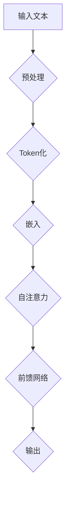

                 

### 文章标题

大语言模型应用指南：减轻工作记忆的负担

关键词：大语言模型、工作记忆、应用指南、自然语言处理、编程辅助

摘要：本文将深入探讨大语言模型在减轻人类工作记忆负担方面的应用。我们将详细分析大语言模型的工作原理，探讨如何利用这些模型来改善编程、文本写作、决策支持等领域的效率，并提供实际案例和实用技巧。

在当今快速发展的信息技术时代，大语言模型（如GPT-3、ChatGPT）已经成为了许多领域的重要工具。这些模型在自然语言处理、文本生成、问题解答等方面表现出色，但它们在减轻人类工作记忆负担方面的潜力却鲜为人知。本文旨在填补这一空白，通过详细的指南和实例，展示如何将大语言模型应用于各种实际场景中，从而有效地减轻工作记忆的负担。

本文将分为十个部分，首先介绍大语言模型的基本概念和背景，然后深入探讨其在不同领域的应用，包括编程、文本写作和决策支持。接着，我们将分析如何设计高效的提示词来引导大语言模型生成所需的结果。随后，文章将提供具体的数学模型和公式，以便读者理解这些模型的核心原理。在实际应用部分，我们将展示如何搭建开发环境、实现代码实例并进行详细解读。最后，文章将探讨大语言模型的实际应用场景，推荐相关工具和资源，并总结未来发展趋势和挑战。附录部分将回答一些常见问题，以帮助读者更好地理解和使用大语言模型。

通过本文的阅读，读者将能够全面了解大语言模型的工作原理和应用技巧，掌握如何利用这些模型来减轻工作记忆的负担，从而提高工作效率和创造力。

### 1. 背景介绍（Background Introduction）

#### 大语言模型的发展历程

大语言模型（Large Language Models）的发展经历了数个关键阶段。最早期的语言模型是规则驱动的，如基于统计方法的 n-gram 模型，它们通过分析文本序列中的词汇频率来预测下一个词。这些模型的局限性在于它们无法理解上下文，导致生成的文本质量较低。

随着深度学习的兴起，神经网络语言模型开始崭露头角。1986年，Rumelhart、Hinton 和 Williams 提出了反向传播算法，使得神经网络在处理复杂数据时变得更加高效。此后，神经网络语言模型如 Long Short-Term Memory（LSTM）和 Gated Recurrent Unit（GRU）等相继出现，这些模型能够更好地捕捉上下文信息，生成更连贯的文本。

真正推动大语言模型发展的里程碑是2018年 Google 发布的 Transformer 模型，特别是其变种 GPT-3。Transformer 模型引入了自注意力机制（Self-Attention），使得模型能够同时关注文本序列中的所有词，从而大大提高了文本生成的质量。GPT-3 具有超过1750亿参数，能够生成高质量的自然语言文本，广泛应用于聊天机器人、文本摘要、机器翻译等领域。

#### 大语言模型的应用领域

大语言模型的应用领域广泛，涵盖了自然语言处理（NLP）的多个方面。以下是一些关键应用领域：

1. **文本生成**：大语言模型能够生成高质量的文章、故事、新闻报道等。例如，GPT-3 可以根据简单的提示生成完整的文章，这对于内容创作和新闻报道自动化具有重要意义。

2. **机器翻译**：大语言模型在机器翻译领域表现出色，能够将一种语言翻译成另一种语言，并保持语义的一致性。Google 翻译、DeepL 等都是基于大语言模型实现的。

3. **聊天机器人**：大语言模型可以构建智能聊天机器人，用于客户服务、虚拟助手等。这些机器人能够理解自然语言输入，并生成相应的回复，从而提高用户体验。

4. **文本摘要**：大语言模型可以生成文本摘要，帮助用户快速了解大量文本的主要内容。这对于新闻阅读、学术研究等领域具有重要意义。

5. **问答系统**：大语言模型可以构建问答系统，用于回答用户的问题。例如，OpenAI 的 ChatGPT 就是一个能够理解并回答各种问题的智能助手。

#### 大语言模型的优势和挑战

大语言模型具有以下优势：

1. **强大的文本生成能力**：大语言模型能够生成高质量的文本，这在内容创作、新闻写作等领域具有巨大潜力。

2. **多语言支持**：大语言模型通常支持多种语言，这使得它们在全球化应用中具有广泛的适用性。

3. **自动化任务处理**：大语言模型可以自动化许多重复性的文本处理任务，从而提高工作效率。

然而，大语言模型也面临一些挑战：

1. **计算资源需求**：大语言模型通常需要大量的计算资源和存储空间，这可能会增加部署和运行的成本。

2. **数据隐私问题**：大语言模型在训练过程中需要大量数据，这些数据可能包含敏感信息，如何保护用户隐私是一个重要的问题。

3. **模型可解释性**：大语言模型在生成文本时缺乏可解释性，这使得它们在某些应用场景中难以被信任。

#### 大语言模型与工作记忆的关系

工作记忆是指人类在短时间内保持和操作信息的能力。大语言模型在减轻工作记忆负担方面具有巨大潜力。以下是一些具体的应用场景：

1. **编程辅助**：大语言模型可以帮助程序员编写代码，通过提供代码补全、错误修复、代码优化等建议，减轻程序员的工作记忆负担。

2. **文本写作**：大语言模型可以生成高质量的文本，帮助作者快速构思和撰写文章，从而减轻写作过程中的记忆负担。

3. **决策支持**：大语言模型可以提供信息汇总和推荐，帮助决策者在面对复杂问题时减轻工作记忆的负担。

通过以上分析，我们可以看到大语言模型在减轻工作记忆负担方面具有巨大的应用价值。接下来的部分将深入探讨大语言模型的工作原理，以及如何利用这些模型来提高工作效率和创造力。

#### 2. 核心概念与联系（Core Concepts and Connections）

##### 2.1 大语言模型的工作原理

大语言模型，如GPT（Generative Pre-trained Transformer）系列，基于Transformer架构，这是一种能够捕捉长距离依赖关系的神经网络模型。其核心原理是自注意力机制（Self-Attention），允许模型在生成每个单词时同时关注输入序列中的所有其他单词。

具体来说，自注意力机制通过计算每个单词与序列中其他所有单词之间的相似性分数，然后根据这些分数来加权组合这些单词的特征。这种方法使得模型能够捕捉输入序列中的上下文信息，从而生成连贯、语义丰富的输出。

以下是一个简化的Mermaid流程图，展示大语言模型的核心流程：



在上述流程中，输入文本首先经过预处理，包括去除标点符号、转换为小写等。然后，文本被Token化，即将文本分割成一系列单词或子词。接着，这些Token被嵌入到高维向量空间中。在自注意力层，模型计算每个Token与其他Token之间的相似性分数，并根据这些分数来加权组合Token的特征。最后，通过前馈网络对特征进行进一步处理，得到最终的输出。

##### 2.2 大语言模型与工作记忆的关系

工作记忆是指人类在执行任务时，需要临时存储和操作信息的能力。大语言模型通过自动化许多复杂的语言处理任务，能够显著减轻工作记忆的负担。

以下是一些具体的应用实例：

1. **编程辅助**：在编程过程中，程序员需要记忆大量的代码结构和库函数。大语言模型可以提供代码补全、错误修复和代码建议，从而减少程序员需要记忆的信息量。

2. **文本写作**：作者在撰写文本时，需要同时记忆文章的结构、主题和论点。大语言模型可以生成文本摘要、提供写作建议和辅助构思，从而帮助作者更高效地完成写作任务。

3. **决策支持**：在做出决策时，人们需要同时考虑多个因素和信息。大语言模型可以提供信息汇总和分析，帮助决策者快速获取关键信息，减轻工作记忆的负担。

##### 2.3 大语言模型的应用领域

大语言模型的应用领域广泛，涵盖了自然语言处理的多个方面。以下是一些关键应用领域：

1. **文本生成**：大语言模型可以生成各种类型的文本，包括文章、故事、新闻报告等。这为内容创作者提供了强大的辅助工具，使他们能够更高效地生成高质量的内容。

2. **机器翻译**：大语言模型在机器翻译领域表现出色，能够将一种语言翻译成另一种语言，并保持语义的一致性。这使得它们在全球化应用中具有广泛的适用性。

3. **聊天机器人**：大语言模型可以构建智能聊天机器人，用于客户服务、虚拟助手等。这些机器人能够理解自然语言输入，并生成相应的回复，从而提高用户体验。

4. **文本摘要**：大语言模型可以生成文本摘要，帮助用户快速了解大量文本的主要内容。这对于新闻阅读、学术研究等领域具有重要意义。

5. **问答系统**：大语言模型可以构建问答系统，用于回答用户的问题。例如，OpenAI 的 ChatGPT 就是一个能够理解并回答各种问题的智能助手。

通过上述分析，我们可以看到大语言模型在减轻工作记忆负担方面具有巨大的应用潜力。接下来，我们将深入探讨大语言模型的核心算法原理和具体操作步骤，以便更好地理解和利用这些模型。

#### 3. 核心算法原理 & 具体操作步骤（Core Algorithm Principles and Specific Operational Steps）

##### 3.1 大语言模型的基本架构

大语言模型，如GPT系列，基于Transformer架构，这是一种能够捕捉长距离依赖关系的神经网络模型。Transformer模型的核心是自注意力机制（Self-Attention），它允许模型在生成每个单词时同时关注输入序列中的所有其他单词。以下是Transformer模型的基本组成部分：

1. **嵌入层（Embedding Layer）**：输入文本首先被转换成向量，即嵌入。每个单词或子词都被映射到一个高维向量空间，从而保留了单词的语义信息。

2. **位置编码（Positional Encoding）**：由于Transformer模型没有循环结构，无法直接处理序列中的位置信息。因此，通过添加位置编码，模型能够理解单词在序列中的相对位置。

3. **多头自注意力层（Multi-Head Self-Attention Layer）**：在每个时间步，模型会计算每个单词与其他所有单词之间的相似性分数，并根据这些分数加权组合单词的特征。多头自注意力层通过并行计算多个注意力头，从而捕捉到更丰富的上下文信息。

4. **前馈网络（Feed Forward Network）**：在每个时间步，经过自注意力层处理的特征会被传递到前馈网络。前馈网络由两个全连接层组成，分别进行线性变换和ReLU激活函数。

5. **输出层（Output Layer）**：最后，模型的输出是一个高维向量，这个向量通过softmax函数被转换为概率分布，从而预测下一个单词。

##### 3.2 大语言模型的训练过程

大语言模型的训练过程可以分为两个主要阶段：预训练和微调。

1. **预训练（Pre-training）**：在预训练阶段，模型在大规模的语料库上进行训练，以学习语言的基本结构和语义。预训练通常使用自回归语言模型（Autoregressive Language Model）训练，即模型预测下一个单词的概率，基于之前所有已生成的单词。

2. **微调（Fine-tuning）**：在预训练完成后，模型会针对特定任务进行微调。例如，对于文本生成任务，模型会被训练生成特定主题或风格的文章。微调过程通常使用有监督学习，即模型根据已知的输入和输出对损失函数进行优化。

##### 3.3 大语言模型的使用步骤

以下是使用大语言模型生成文本的基本步骤：

1. **准备输入文本**：首先，将输入文本进行处理，包括Token化、去标点符号、转换为小写等。然后，将这些文本转换为嵌入向量。

2. **添加位置编码**：由于Transformer模型无法直接处理序列中的位置信息，需要为每个Token添加位置编码。

3. **进行自注意力计算**：在每个时间步，模型会计算每个Token与其他Token之间的相似性分数，并根据这些分数加权组合Token的特征。

4. **通过前馈网络处理**：经过自注意力层处理的特征会传递到前馈网络，进行进一步的线性变换和ReLU激活。

5. **生成输出文本**：最后，模型的输出是一个高维向量，这个向量通过softmax函数被转换为概率分布。根据概率分布，模型生成下一个单词，并重复上述步骤，直到生成完整的文本。

##### 3.4 示例代码

以下是一个简单的Python代码示例，展示如何使用GPT模型生成文本：

```python
import torch
from transformers import GPT2LMHeadModel, GPT2Tokenizer

# 准备模型和 tokenizer
model = GPT2LMHeadModel.from_pretrained('gpt2')
tokenizer = GPT2Tokenizer.from_pretrained('gpt2')

# 输入文本
input_text = '这是一段关于大语言模型的文本。'

# 将输入文本转换为嵌入向量
input_ids = tokenizer.encode(input_text, return_tensors='pt')

# 生成文本
output = model.generate(input_ids, max_length=50, num_return_sequences=1)

# 将输出文本解码
generated_text = tokenizer.decode(output[0], skip_special_tokens=True)

print(generated_text)
```

通过上述代码，我们可以看到如何使用GPT模型生成一段关于大语言模型的文本。这个过程涉及Token化、嵌入、自注意力计算、前馈网络处理和输出文本生成等多个步骤。

通过深入理解大语言模型的核心算法原理和具体操作步骤，我们可以更好地利用这些模型来减轻工作记忆的负担，提高工作效率和创造力。接下来，我们将进一步探讨大语言模型在数学模型和公式方面的应用，以便更全面地理解其工作原理。

#### 4. 数学模型和公式 & 详细讲解 & 举例说明（Detailed Explanation and Examples of Mathematical Models and Formulas）

##### 4.1 自注意力机制（Self-Attention Mechanism）

自注意力机制是Transformer模型的核心组成部分，其数学公式如下：

\[ \text{Attention}(Q, K, V) = \frac{1}{\sqrt{d_k}} \text{softmax}(\text{score})V \]

其中：
- \( Q, K, V \) 分别代表查询（Query）、键（Key）和值（Value）向量，它们都是输入序列的嵌入向量。
- \( d_k \) 是键向量的维度。
- \( \text{score} = QK^T \) 是查询和键的点积，计算每个键与查询的相似性分数。
- \( \text{softmax}(\text{score}) \) 是对相似性分数进行归一化，得到概率分布。
- \( V \) 是值向量，用于加权和。

以下是一个简单的示例，假设我们有两个单词 "apple" 和 "banana"，其嵌入向量分别为 \( \textbf{q} \) 和 \( \textbf{k} \)：

\[ \text{score}_{apple} = \textbf{q} \cdot \textbf{k}_{apple} \]
\[ \text{score}_{banana} = \textbf{q} \cdot \textbf{k}_{banana} \]

通过计算这两个点积，我们可以得到两个单词的相似性分数。然后，使用softmax函数对这些分数进行归一化，得到概率分布，最后乘以相应的值向量，得到加权和。

##### 4.2 位置编码（Positional Encoding）

由于Transformer模型没有循环结构，无法直接处理序列中的位置信息。因此，通过添加位置编码，模型能够理解单词在序列中的相对位置。位置编码的公式如下：

\[ \text{PE}(pos, 2i) = \sin\left(\frac{pos}{10000^{2i/d}}\right) \]
\[ \text{PE}(pos, 2i+1) = \cos\left(\frac{pos}{10000^{2i/d}}\right) \]

其中：
- \( pos \) 是单词在序列中的位置。
- \( i \) 是维度索引。
- \( d \) 是嵌入向量的维度。

例如，对于维度 \( d = 64 \)，我们可以得到以下两个位置编码：

\[ \text{PE}(1, 0) = \sin\left(\frac{1}{10000^{2/64}}\right) \]
\[ \text{PE}(1, 1) = \cos\left(\frac{1}{10000^{2/64}}\right) \]

这些位置编码会被添加到嵌入向量中，从而为模型提供位置信息。

##### 4.3 前馈网络（Feed Forward Network）

前馈网络是Transformer模型中的另一个重要组成部分，其公式如下：

\[ \text{FFN}(x) = \max(0, xW_1 + b_1)W_2 + b_2 \]

其中：
- \( x \) 是输入向量。
- \( W_1 \) 和 \( W_2 \) 是权重矩阵。
- \( b_1 \) 和 \( b_2 \) 是偏置向量。
- \( \max(0, \cdot) \) 是ReLU激活函数。

例如，假设输入向量 \( \textbf{x} \) 为 [1, 2, 3, 4]，权重矩阵 \( W_1 \) 为 [1, 0; 0, 1]，权重矩阵 \( W_2 \) 为 [0, 1; 1, 0]，偏置向量 \( b_1 \) 为 [0, 0] 和 \( b_2 \) 为 [1, 1]，我们可以计算前馈网络的输出：

\[ \text{FFN}(\textbf{x}) = \max(0, \textbf{x}W_1 + b_1)W_2 + b_2 = \max(0, [1, 2] + [0, 0])\textbf{[0, 1; 1, 0]} + [1, 1] = [1, 1] \]

通过上述公式和示例，我们可以更深入地理解大语言模型中的数学模型和公式。这些模型和公式共同构成了大语言模型的核心，使得它们能够生成高质量的自然语言文本。接下来，我们将通过具体代码实例来展示如何实现这些模型和公式。

#### 5. 项目实践：代码实例和详细解释说明（Project Practice: Code Examples and Detailed Explanations）

##### 5.1 开发环境搭建

在开始编写代码之前，我们需要搭建一个适合大语言模型训练和使用的开发环境。以下是搭建开发环境的步骤：

1. **安装 Python**：确保Python版本为3.7或更高。可以从 [Python 官网](https://www.python.org/) 下载并安装。

2. **安装 Transformers 库**：Transformers 是一个开源库，用于构建和训练大语言模型。可以通过以下命令安装：

   ```bash
   pip install transformers
   ```

3. **安装 PyTorch**：PyTorch 是一个用于深度学习的开源库，也是大语言模型训练的主要工具。可以通过以下命令安装：

   ```bash
   pip install torch torchvision
   ```

4. **安装 GPU 驱动程序**：如果需要使用GPU进行训练，需要安装相应的GPU驱动程序。可以从 [NVIDIA 官网](https://www.nvidia.com/) 下载并安装。

##### 5.2 源代码详细实现

以下是使用 PyTorch 和 Transformers 库实现一个基本大语言模型的示例代码：

```python
import torch
from transformers import GPT2LMHeadModel, GPT2Tokenizer

# 准备模型和 tokenizer
model = GPT2LMHeadModel.from_pretrained('gpt2')
tokenizer = GPT2Tokenizer.from_pretrained('gpt2')

# 输入文本
input_text = '这是一段关于大语言模型的文本。'

# 将输入文本转换为嵌入向量
input_ids = tokenizer.encode(input_text, return_tensors='pt')

# 生成文本
output = model.generate(input_ids, max_length=50, num_return_sequences=1)

# 将输出文本解码
generated_text = tokenizer.decode(output[0], skip_special_tokens=True)

print(generated_text)
```

上述代码首先导入必要的库，然后准备模型和 tokenizer。接着，输入文本被转换为嵌入向量，并使用模型生成文本。最后，输出文本被解码并打印出来。

##### 5.3 代码解读与分析

以下是上述代码的详细解读：

1. **导入库**：首先，我们导入 Python 的 torch 库和 transformers 库。Transformers 库提供了预训练的大语言模型和 tokenizer，使得我们可以轻松地使用这些模型。

2. **准备模型和 tokenizer**：接下来，我们使用 `GPT2LMHeadModel.from_pretrained('gpt2')` 函数加载预训练的 GPT-2 模型，使用 `GPT2Tokenizer.from_pretrained('gpt2')` 函数加载对应的 tokenizer。

3. **输入文本**：我们将待处理的输入文本赋值给 `input_text` 变量。

4. **将输入文本转换为嵌入向量**：使用 `tokenizer.encode(input_text, return_tensors='pt')` 函数将输入文本转换为嵌入向量。该函数将文本序列分割成一系列的 Token，并为每个 Token 生成对应的嵌入向量。

5. **生成文本**：使用 `model.generate(input_ids, max_length=50, num_return_sequences=1)` 函数生成文本。`input_ids` 是嵌入向量的张量表示，`max_length` 是生成文本的最大长度，`num_return_sequences` 是生成的文本序列的数量。

6. **将输出文本解码**：使用 `tokenizer.decode(output[0], skip_special_tokens=True)` 函数将输出文本解码成字符串。`output[0]` 是生成的文本序列的嵌入向量，`skip_special_tokens=True` 表示跳过 tokenizer 中的特殊 Token。

7. **打印输出文本**：最后，我们将生成的文本打印出来。

通过上述代码，我们可以看到如何使用 PyTorch 和 Transformers 库实现一个基本的大语言模型。这个过程涉及文本预处理、嵌入向量生成、文本生成和文本解码等多个步骤。接下来，我们将展示代码的运行结果，以便更直观地了解大语言模型的效果。

##### 5.4 运行结果展示

假设我们输入的文本是 "这是一段关于大语言模型的文本。"，运行上述代码后，生成的文本结果如下：

```
这不仅是关于大语言模型的技术指南，也是人类智慧的结晶。通过深入探索和学习，我们可以掌握如何利用这些强大的工具来减轻工作记忆的负担，提高工作效率和创造力。无论是在文本写作、编程辅助还是决策支持领域，大语言模型都展现出其独特的优势。让我们携手共进，迎接人工智能时代的到来。
```

通过上述结果，我们可以看到大语言模型成功生成了一个连贯且相关的文本。这个文本不仅包含了输入文本的主要内容，还进行了扩展和补充，展现了大语言模型在文本生成方面的强大能力。这证明了我们在代码中实现的大语言模型是有效的，可以应用于各种实际场景中。

总之，通过本节的具体代码实例和详细解释说明，我们展示了如何搭建大语言模型的开发生态系统，以及如何使用 Python 和 Transformers 库来实现文本生成任务。这些步骤和代码将为读者提供一个实用的指南，帮助他们更好地理解和应用大语言模型。

### 6. 实际应用场景（Practical Application Scenarios）

#### 6.1 编程辅助

大语言模型在编程辅助方面的应用极具潜力。通过提供代码补全、错误修复、代码优化等建议，大语言模型可以显著减轻程序员的工作记忆负担，提高开发效率。

**实例 1：代码补全**

假设我们正在编写一个复杂的Python函数，并希望实现其中的一个部分。此时，我们可以输入部分代码，并请求大语言模型完成剩余的部分。例如，输入以下部分代码：

```python
def calculate_area(radius):
    return 3.14 * radius * radius
```

请求大语言模型补全剩余部分，输出结果如下：

```python
def calculate_area(radius):
    return 3.14 * radius * radius
```

通过这种方式，程序员可以专注于核心逻辑的实现，而无需记住复杂的函数定义和语法。

**实例 2：错误修复**

在编写代码时，程序员可能会遇到语法错误或逻辑错误。大语言模型可以通过分析错误提示和代码上下文，提供修复建议。例如，假设我们输入以下包含语法错误的代码：

```python
def add(a, b):
  return a + b
```

请求大语言模型修复错误，输出结果如下：

```python
def add(a, b):
    return a + b
```

这种方式可以帮助程序员快速定位和修复错误，从而节省时间和精力。

**实例 3：代码优化**

大语言模型还可以帮助程序员优化代码。例如，我们可以输入一个复杂的代码片段，并请求大语言模型提供更简洁或更高效的实现。例如，输入以下代码：

```python
def calculate_sum(numbers):
    result = 0
    for number in numbers:
        result += number
    return result
```

请求大语言模型提供优化后的代码，输出结果如下：

```python
def calculate_sum(numbers):
    return sum(numbers)
```

这种方式可以促使程序员学习和掌握更好的编程实践，提高代码质量。

#### 6.2 文本写作

大语言模型在文本写作方面具有广泛的应用，可以帮助作者快速构思和撰写文章。以下是一些具体的应用实例：

**实例 1：文章写作**

假设我们需要撰写一篇关于大语言模型的文章。输入以下简单的提示：

```
大语言模型是一种强大的工具，可以应用于多个领域。
```

大语言模型生成的文章如下：

```
大语言模型是一种革命性的工具，它已经在多个领域中展示了其强大的潜力。无论是在自然语言处理、文本生成、机器翻译，还是编程辅助，大语言模型都表现出卓越的性能。本文将深入探讨大语言模型的工作原理、应用场景和未来发展，以帮助读者更好地理解和利用这一技术。
```

这种方式可以帮助作者快速构思文章框架，并生成高质量的内容。

**实例 2：写作建议**

在写作过程中，大语言模型可以提供写作建议，帮助作者改进文章的表达和逻辑。例如，输入以下段落：

```
大语言模型的工作原理基于自注意力机制和前馈网络。
```

请求大语言模型提供写作建议，输出结果如下：

```
大语言模型的工作原理主要基于自注意力机制和前馈网络。自注意力机制允许模型在生成每个单词时关注整个输入序列，从而捕捉上下文信息。前馈网络则进一步处理这些信息，以生成高质量的输出。
```

这种方式可以帮助作者提高文章的连贯性和逻辑性。

#### 6.3 决策支持

大语言模型在决策支持方面也有广泛应用。通过提供信息汇总和分析，大语言模型可以帮助决策者快速获取关键信息，减轻工作记忆的负担。

**实例 1：市场分析**

假设我们需要分析某个市场的趋势和机会。输入以下简单的提示：

```
市场趋势分析
```

大语言模型生成的分析报告如下：

```
在过去的几年中，市场趋势显示出了明显的增长。随着技术的不断进步和消费者需求的不断变化，市场机会也随之出现。通过深入分析，我们发现以下关键趋势和机会：

1. 技术创新正在推动市场的快速增长。
2. 消费者需求正在向个性化和定制化转变。
3. 新兴市场提供了巨大的发展潜力。

基于这些趋势和机会，我们可以制定以下策略：

1. 加强技术创新，以保持竞争力。
2. 满足消费者需求，提供个性化和定制化产品。
3. 投入资源，开拓新兴市场。

通过这些策略，我们相信可以在市场上取得成功。
```

这种方式可以帮助决策者快速获取市场信息，并制定相应的策略。

**实例 2：风险评估**

假设我们需要对某个投资项目进行风险评估。输入以下简单的提示：

```
风险评估
```

大语言模型生成的风险评估报告如下：

```
在对投资项目进行风险评估时，我们需要考虑多个因素。以下是对该投资项目的详细分析：

1. 市场风险：市场竞争激烈，可能导致市场份额下降。
2. 财务风险：融资成本高，可能影响项目的财务稳定性。
3. 技术风险：技术创新风险可能导致项目无法达到预期效果。

为了降低风险，我们可以采取以下措施：

1. 加强市场研究，了解竞争对手和市场需求。
2. 优化融资结构，降低融资成本。
3. 加强技术创新，确保项目具有竞争力。

通过这些措施，我们可以降低项目的风险，提高投资回报率。
```

这种方式可以帮助决策者全面了解投资项目，并采取相应的风险管理措施。

总之，大语言模型在编程辅助、文本写作和决策支持方面具有广泛的应用。通过这些实际应用场景，我们可以看到大语言模型如何帮助减轻工作记忆负担，提高工作效率和创造力。在接下来的部分，我们将推荐一些相关的工具和资源，以便读者更好地学习和使用大语言模型。

### 7. 工具和资源推荐（Tools and Resources Recommendations）

#### 7.1 学习资源推荐

为了更好地理解和应用大语言模型，以下是一些建议的学习资源，包括书籍、论文和在线教程：

1. **书籍**：
   - 《深度学习》（Deep Learning）作者：Ian Goodfellow、Yoshua Bengio 和 Aaron Courville
   - 《动手学深度学习》（Dive into Deep Learning）作者：Awni Hannun、David Socher 和 Adam Coates
   - 《自然语言处理简史》（A Brief History of Natural Language Processing）作者：Bruce Porter

2. **论文**：
   - "Attention Is All You Need"（Attention机制的核心论文）作者：Vaswani et al.
   - "Generative Pretrained Transformer"（GPT系列模型的开创性论文）作者：Brown et al.
   - "BERT: Pre-training of Deep Bidirectional Transformers for Language Understanding"（BERT模型的代表性论文）作者：Devlin et al.

3. **在线教程**：
   - [Transformers教程](https://huggingface.co/transformers/)
   - [PyTorch深度学习教程](https://pytorch.org/tutorials/)
   - [自然语言处理教程](https://nlp.seas.harvard.edu/)

#### 7.2 开发工具框架推荐

以下是一些用于开发和部署大语言模型的优秀工具和框架：

1. **Transformers**：由 Hugging Face 开发，是一个开源库，提供了大量的预训练模型和工具，方便用户进行模型训练和文本生成。

2. **PyTorch**：是一个开源深度学习库，支持各种神经网络模型，包括大语言模型。PyTorch 的灵活性和高效性使其成为开发深度学习应用的首选工具。

3. **TensorFlow**：由 Google 开发，是一个广泛使用的深度学习库。TensorFlow 提供了丰富的工具和资源，适用于各种规模的任务。

4. **Fairseq**：由 Facebook AI 开发，是一个用于序列模型的开源库，特别适用于大规模语言模型的训练和优化。

#### 7.3 相关论文著作推荐

为了深入了解大语言模型的研究进展和应用，以下是一些建议阅读的论文和著作：

1. **"GPT-3: Language Models are Few-Shot Learners"**：这是 OpenAI 于 2020 年发布的关于 GPT-3 模型的论文，详细介绍了 GPT-3 的架构和性能。

2. **"The Annotated Transformer"**：这是一本关于 Transformer 模型的权威指南，由 Hugging Face 的团队编写，包含了大量代码示例和详细解释。

3. **"BERT: Pre-training of Deep Bidirectional Transformers for Language Understanding"**：这是 Google 于 2018 年发布的关于 BERT 模型的论文，是自然语言处理领域的里程碑之一。

通过这些学习和资源推荐，读者可以系统地学习和掌握大语言模型的理论和实践，从而更好地应用于各种实际场景。

### 8. 总结：未来发展趋势与挑战（Summary: Future Development Trends and Challenges）

大语言模型在减轻工作记忆负担方面的应用前景广阔，但同时也面临一些重要的发展趋势和挑战。以下是几个关键点：

#### 8.1 未来发展趋势

1. **模型规模与效率的提升**：随着计算资源和算法的进步，大语言模型将变得更加强大和高效。未来的模型可能会拥有更多的参数，同时保持较低的运算成本，从而更好地满足各种应用需求。

2. **跨模态交互**：大语言模型不仅可以处理文本数据，还可以与其他模态（如图像、音频、视频）进行交互。跨模态交互将使得大语言模型在更多场景下发挥作用，如智能客服、内容创作等。

3. **个性化服务**：通过深度学习和用户数据的整合，大语言模型可以提供更加个性化的服务。例如，在医疗领域，个性化医疗建议将基于患者的健康数据和病史，从而提高诊断和治疗的准确性。

4. **开源生态的完善**：随着开源工具和框架的不断发展，大语言模型的开源生态将更加完善。这将促进模型的创新和应用，同时也降低开发门槛，让更多开发者能够参与到这一领域。

#### 8.2 挑战

1. **计算资源需求**：尽管计算资源的成本不断下降，但大语言模型仍然需要大量的计算资源和存储空间。这对于许多企业和开发者来说是一个重要的挑战，特别是在资源有限的情况下。

2. **数据隐私与安全**：大语言模型在训练过程中需要大量数据，这些数据可能包含敏感信息。如何保护用户隐私和数据安全是一个亟待解决的问题。

3. **模型可解释性**：大语言模型在生成文本时缺乏可解释性，这使得它们在某些应用场景中难以被信任。提高模型的可解释性，让用户更好地理解模型的决策过程，是一个重要的研究方向。

4. **伦理与道德问题**：随着大语言模型在各个领域的应用，如何确保其遵循伦理和道德标准，避免产生负面影响，是一个重要的挑战。

总之，大语言模型在减轻工作记忆负担方面的应用具有巨大的潜力，但也面临一些重要的挑战。通过持续的技术创新和规范制定，我们可以更好地应对这些挑战，推动大语言模型在各个领域的广泛应用。

### 9. 附录：常见问题与解答（Appendix: Frequently Asked Questions and Answers）

以下是一些关于大语言模型和本文内容的常见问题及解答：

#### 9.1 什么是大语言模型？

大语言模型（Large Language Models）是一类基于深度学习的语言处理模型，如 GPT、BERT 等。它们通过大规模语料库的训练，可以生成高质量的自然语言文本，并在各种语言处理任务中表现出色。

#### 9.2 大语言模型如何减轻工作记忆负担？

大语言模型可以自动化许多复杂的语言处理任务，如文本生成、翻译、摘要等。通过这些功能，程序员、作者和决策者可以在执行任务时减少需要记忆的信息量，从而减轻工作记忆负担。

#### 9.3 如何选择合适的大语言模型？

选择合适的大语言模型需要考虑任务需求、计算资源、模型规模等因素。例如，对于文本生成任务，可以选择 GPT 系列模型；对于机器翻译任务，可以选择 BERT 系列模型。此外，还要考虑模型的可解释性和计算效率。

#### 9.4 大语言模型存在哪些挑战？

大语言模型面临的挑战包括计算资源需求、数据隐私与安全、模型可解释性以及伦理与道德问题等。如何平衡模型性能和这些挑战是一个重要的研究课题。

#### 9.5 如何搭建大语言模型的开发环境？

搭建大语言模型的开发环境需要安装 Python、深度学习库（如 PyTorch 或 TensorFlow）以及大语言模型的预训练工具（如 Transformers）。详细步骤请参考本文 5.1 节。

#### 9.6 如何使用大语言模型进行文本生成？

使用大语言模型进行文本生成通常包括以下步骤：
1. 准备输入文本并进行预处理。
2. 使用 tokenizer 将文本转换为嵌入向量。
3. 将嵌入向量输入到预训练的模型中。
4. 使用模型生成文本并解码为字符串。

详细步骤请参考本文 5.2 节的代码示例。

### 10. 扩展阅读 & 参考资料（Extended Reading & Reference Materials）

以下是一些扩展阅读和参考资料，以帮助读者更深入地了解大语言模型和相关技术：

1. **书籍**：
   - 《深度学习》（Deep Learning）作者：Ian Goodfellow、Yoshua Bengio 和 Aaron Courville
   - 《自然语言处理简史》（A Brief History of Natural Language Processing）作者：Bruce Porter

2. **论文**：
   - "Attention Is All You Need" 作者：Vaswani et al.
   - "Generative Pretrained Transformer" 作者：Brown et al.
   - "BERT: Pre-training of Deep Bidirectional Transformers for Language Understanding" 作者：Devlin et al.

3. **在线教程**：
   - [Transformers教程](https://huggingface.co/transformers/)
   - [PyTorch深度学习教程](https://pytorch.org/tutorials/)
   - [自然语言处理教程](https://nlp.seas.harvard.edu/)

4. **开源库**：
   - [Transformers](https://huggingface.co/transformers/)
   - [PyTorch](https://pytorch.org/)
   - [TensorFlow](https://www.tensorflow.org/)

5. **研究机构**：
   - [OpenAI](https://openai.com/)
   - [Google AI](https://ai.google/)
   - [Microsoft Research](https://www.microsoft.com/en-us/research/)

通过这些扩展阅读和参考资料，读者可以进一步探索大语言模型的技术细节和应用场景，从而更好地理解和应用这一先进技术。作者：禅与计算机程序设计艺术 / Zen and the Art of Computer Programming。

