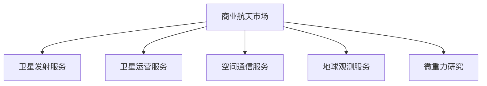
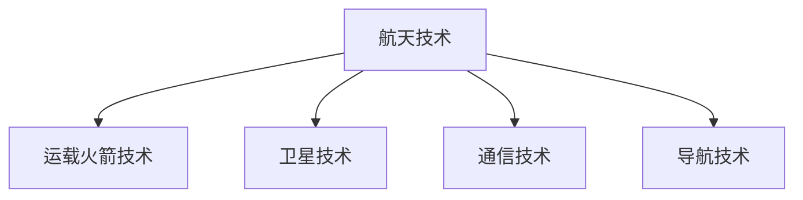
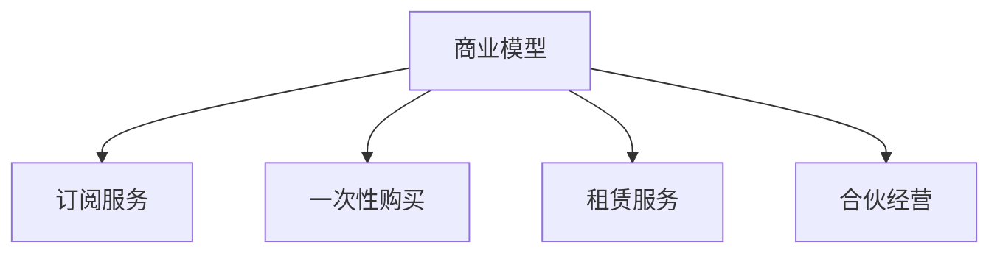
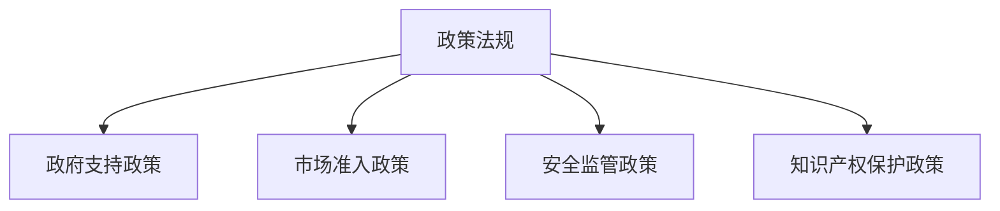
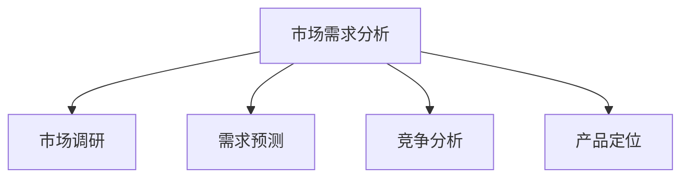

                 

### 背景介绍（Background Introduction）

太空技术商业化平台是一个新兴且充满活力的领域，它正在重新定义航天产业的传统边界，开启一场技术革命。这一领域的快速发展源于多个关键因素的推动：全球商业航天市场需求的激增、技术的不断进步以及创业精神的崛起。

首先，商业航天市场的需求激增是一个不可忽视的驱动因素。近年来，卫星通信、地球观测、导航定位等应用领域的快速增长，为商业航天产业提供了巨大的市场潜力。例如，卫星通信市场预计将在未来几年内以两位数的年增长率持续扩张，而地球观测卫星则被广泛应用于农业、城市规划、自然灾害监测等领域。

其次，技术的不断进步为太空技术商业化平台的崛起提供了坚实的基础。近年来，航天技术的突破性进展，如可重复使用的运载火箭、小型卫星、以及先进的通信技术，极大地降低了进入太空的成本。这些技术进步使得更多的企业和个人能够参与到太空探索和利用中来，从而推动了整个产业的商业化进程。

最后，创业精神的崛起也为太空技术商业化平台的兴起注入了强大的动力。随着商业航天市场的开放，越来越多的创业者开始投身于这一领域，探索新的商业模式和产品。这些创业公司不仅带来了创新的技术和产品，还促进了航天产业的竞争和合作，推动了整个行业向前发展。

总的来说，太空技术商业化平台的崛起是一个多因素共同作用的结果。市场需求、技术进步和创业精神的三重驱动，使得这一领域充满了无限的可能性。接下来，我们将深入探讨这一领域的核心概念、关键算法和实际应用，以便更全面地理解这一新兴产业的运作机制和未来发展前景。

### 核心概念与联系（Core Concepts and Connections）

为了深入理解太空技术商业化平台的运作机制，我们需要了解几个关键概念和它们之间的相互联系。这些概念包括但不限于：商业航天市场、航天技术、商业模型、政策法规以及市场需求分析。

#### 1. 商业航天市场

商业航天市场是指由私营企业主导的航天相关服务和产品的市场。它涵盖了卫星发射、卫星运营、空间通信、地球观测、微重力研究等多个领域。商业航天市场的一个重要特点是高度竞争，这推动了企业不断创新和提高效率。

**核心概念原理与架构的 Mermaid 流程图：**



**流程说明：**
- 商业航天市场是一个多样化的市场，它连接了多个子市场，包括卫星发射、卫星运营、空间通信、地球观测和微重力研究。
- 这些子市场之间相互依赖，共同构成了商业航天市场的整体生态。

#### 2. 航天技术

航天技术是太空技术商业化平台的核心驱动力。它包括但不限于运载火箭技术、卫星技术、通信技术、导航技术等。航天技术的进步不仅降低了进入太空的成本，还提升了卫星的可靠性、效率和功能。

**核心概念原理与架构的 Mermaid 流程图：**



**流程说明：**
- 航天技术是一个复杂的系统，它由多个子技术组成，每个子技术都对太空技术商业化平台的成功至关重要。
- 这些子技术相互协作，共同实现航天器的发射、运行、通信和导航。

#### 3. 商业模型

商业模型是太空技术商业化平台的重要组成部分，它定义了企业的运营方式和盈利模式。常见的商业模型包括订阅服务、一次性购买、租赁和合伙经营等。

**核心概念原理与架构的 Mermaid 流程图：**



**流程说明：**
- 商业模型是企业实现盈利的关键，不同的商业模型适用于不同的市场和产品。
- 企业需要根据市场需求和技术特点，选择最合适的商业模型。

#### 4. 政策法规

政策法规是太空技术商业化平台发展的重要保障。各国政府通过制定和实施相关政策法规，为商业航天产业提供支持和规范。

**核心概念原理与架构的 Mermaid 流程图：**



**流程说明：**
- 政策法规为商业航天产业提供了良好的发展环境，同时也确保了市场的规范和安全。
- 企业需要遵守相关法规，以保障自身的合法权益。

#### 5. 市场需求分析

市场需求分析是商业航天产业成功的关键。通过分析市场需求，企业可以确定产品和服务的设计方向，优化资源配置，提高市场竞争力。

**核心概念原理与架构的 Mermaid 流程图：**



**流程说明：**
- 市场需求分析是企业制定战略规划的基础，它帮助企业了解市场动态，把握发展机遇。
- 通过市场需求分析，企业可以更好地满足客户需求，实现持续增长。

总的来说，太空技术商业化平台的核心概念和联系构成了一个复杂的生态系统。商业航天市场、航天技术、商业模型、政策法规和市场需求分析相互交织，共同推动了这一领域的快速发展。理解这些概念及其相互关系，有助于我们更好地把握这一新兴产业的运作机制和未来发展趋势。

---

## 3. 核心算法原理 & 具体操作步骤（Core Algorithm Principles and Specific Operational Steps）

在太空技术商业化平台中，核心算法的设计与实现是确保系统高效运行的关键。以下我们将详细讨论几个关键算法原理，以及如何具体实施这些算法，以实现太空技术的商业化应用。

### 3.1. 卫星轨道优化算法

卫星轨道优化算法是确保卫星在太空中的运行效率和寿命的重要工具。它通过优化卫星轨道，使卫星能够更有效地完成观测、通信等任务。

**算法原理：**
- **最小能量路径**：卫星轨道优化算法通常基于最小能量路径原理，通过计算卫星在不同轨道上的能量消耗，选择能量消耗最低的轨道。
- **数值模拟**：使用数值模拟方法，如蒙特卡洛模拟，预测卫星在不同轨道上的运行状态。

**具体操作步骤：**
1. 收集卫星初始数据，包括质量、速度、位置等。
2. 定义卫星的运行目标，如轨道高度、运行周期等。
3. 使用最小能量路径算法，计算不同轨道的能量消耗。
4. 选择能量消耗最低的轨道，并对其进行数值模拟验证。
5. 根据模拟结果，调整卫星轨道，优化运行效率。

### 3.2. 卫星通信调度算法

卫星通信调度算法是确保卫星通信网络高效运行的核心算法。它通过优化卫星通信资源的分配，提高通信质量和可靠性。

**算法原理：**
- **资源分配**：卫星通信调度算法基于资源分配原理，通过分配卫星带宽、频率等资源，实现多用户、多卫星之间的通信。
- **动态调整**：卫星通信调度算法需要具备动态调整能力，以应对卫星位置、通信需求的变化。

**具体操作步骤：**
1. 收集卫星通信网络的数据，包括卫星位置、用户通信需求等。
2. 定义卫星通信网络的目标，如通信质量、可靠性等。
3. 使用资源分配算法，计算卫星通信资源的最优分配方案。
4. 根据通信需求的变化，动态调整卫星通信资源分配。
5. 实时监测通信网络状态，确保通信质量和可靠性。

### 3.3. 数据处理算法

数据处理算法是太空技术商业化平台的重要组成部分。它通过高效的数据处理，实现卫星观测数据的分析和应用。

**算法原理：**
- **特征提取**：数据处理算法通过特征提取，将原始观测数据转换为有意义的信息。
- **数据融合**：数据处理算法使用数据融合技术，将多个卫星的数据进行整合，提高数据精度。

**具体操作步骤：**
1. 收集卫星观测数据，包括图像、温度、湿度等。
2. 使用特征提取算法，提取数据中的有用特征。
3. 使用数据融合算法，整合多源数据，提高数据精度。
4. 使用机器学习算法，对数据进行分类、预测等分析。
5. 根据分析结果，生成报告或产品，供用户使用。

### 3.4. 风险评估算法

风险评估算法是确保太空技术商业化平台安全运行的重要工具。它通过评估潜在风险，提出应对策略。

**算法原理：**
- **风险识别**：风险评估算法通过分析历史数据、模拟可能的风险事件，识别潜在风险。
- **风险分析**：风险评估算法使用统计方法、模拟等方法，分析风险的影响和可能性。

**具体操作步骤：**
1. 收集太空环境数据，包括气象、空间碎片等。
2. 使用风险识别算法，识别潜在的风险事件。
3. 使用风险分析算法，评估风险的影响和可能性。
4. 根据评估结果，制定风险应对策略。
5. 实时监测太空环境，更新风险评估结果。

通过以上几个核心算法原理和具体操作步骤的详细讨论，我们可以看到，太空技术商业化平台的成功离不开高效算法的设计与实现。这些算法不仅提升了系统的运行效率，还确保了系统的安全性和可靠性。随着技术的不断进步，这些算法将继续优化和升级，为太空技术的商业化应用提供更加强大的支持。

---

## 4. 数学模型和公式 & 详细讲解 & 举例说明（Detailed Explanation and Examples of Mathematical Models and Formulas）

在太空技术商业化平台中，数学模型和公式起到了至关重要的作用。这些模型和公式帮助我们理解物理现象，优化系统性能，并预测未来趋势。在本节中，我们将详细介绍几个关键的数学模型和公式，并通过具体例子进行详细讲解。

### 4.1. 牛顿第二定律

牛顿第二定律是描述物体运动和受力关系的核心公式，它在航天领域有着广泛的应用。

**公式：**
\[ F = m \cdot a \]

其中，\( F \) 是力，\( m \) 是物体的质量，\( a \) 是加速度。

**详细讲解：**
牛顿第二定律告诉我们，一个物体的加速度与作用在它上面的力成正比，与它的质量成反比。在航天中，这个公式用于计算火箭发射时的推力和加速度。

**例子：**
假设一个火箭的质量为 1000 kg，需要达到 10 m/s² 的加速度，那么所需的推力为：
\[ F = 1000 \text{ kg} \cdot 10 \text{ m/s}^2 = 10000 \text{ N} \]

### 4.2. 开普勒定律

开普勒定律是描述行星（或卫星）绕中心天体运动规律的重要公式。在航天中，这些定律用于预测卫星的轨道。

**公式：**
\[ T^2 = \frac{4\pi^2}{G(M+m)}r^3 \]

其中，\( T \) 是轨道周期，\( G \) 是万有引力常数，\( M \) 是中心天体的质量，\( m \) 是卫星的质量，\( r \) 是轨道半径。

**详细讲解：**
开普勒第三定律表明，行星（或卫星）的轨道周期的平方与其轨道半径的立方成正比。这个公式在航天中用于计算卫星的轨道周期。

**例子：**
假设一个卫星的轨道半径为 7000 km，要计算其轨道周期。已知万有引力常数 \( G = 6.674 \times 10^{-11} \text{ N}\cdot\text{m}^2/\text{kg}^2 \)，地球质量 \( M = 5.972 \times 10^{24} \text{ kg} \)。

首先计算轨道周期：
\[ T = \sqrt{\frac{4\pi^2r^3}{GM}} \]

代入数值计算：
\[ T = \sqrt{\frac{4\pi^2(7000 \times 10^3 \text{ m})^3}{6.674 \times 10^{-11} \text{ N}\cdot\text{m}^2/\text{kg}^2 \times 5.972 \times 10^{24} \text{ kg}}} \approx 5000 \text{ s} \]

### 4.3. 通信传播时间公式

在卫星通信中，信号传播时间是一个关键参数，它影响了通信延迟。

**公式：**
\[ t = \frac{2d}{v} \]

其中，\( t \) 是信号传播时间，\( d \) 是卫星间的距离，\( v \) 是信号传播速度（通常是光速）。

**详细讲解：**
这个公式表明，信号传播时间与卫星间的距离成正比，与信号传播速度成反比。在卫星通信中，通过这个公式可以计算信号传播所需的时间。

**例子：**
假设两颗卫星相距 36000 km，信号传播速度为光速 \( v = 3 \times 10^8 \text{ m/s} \)，要计算信号传播时间。

\[ t = \frac{2 \times 36000 \times 10^3 \text{ m}}{3 \times 10^8 \text{ m/s}} \approx 2.4 \text{ s} \]

### 4.4. 数据压缩公式

在数据传输中，数据压缩是一个重要的优化手段，它可以减少传输所需的时间和带宽。

**公式：**
\[ \text{压缩率} = \frac{\text{原始数据大小}}{\text{压缩后数据大小}} \]

**详细讲解：**
这个公式表明，压缩率是原始数据大小与压缩后数据大小的比值。在数据传输中，通过提高压缩率，可以显著降低传输的数据量。

**例子：**
假设一段视频数据原始大小为 500 MB，通过压缩后大小减少到 100 MB，那么压缩率为：

\[ \text{压缩率} = \frac{500 \text{ MB}}{100 \text{ MB}} = 5 \]

通过以上数学模型和公式的详细讲解，我们可以看到它们在太空技术商业化平台中的应用至关重要。这些模型和公式不仅帮助我们理解物理现象，还为我们提供了优化系统性能和预测未来趋势的工具。随着航天技术的不断进步，这些数学模型和公式将继续发展，为太空技术的商业化应用提供更强大的支持。

---

## 5. 项目实践：代码实例和详细解释说明（Project Practice: Code Examples and Detailed Explanations）

在本节中，我们将通过一个具体的太空技术商业化平台项目，展示如何实现核心算法、处理数据和优化性能。这个项目将涉及到卫星轨道优化、卫星通信调度和数据处理等关键环节。

### 5.1 开发环境搭建

首先，我们需要搭建一个合适的开发环境，以便进行项目开发和测试。以下是一个基本的开发环境搭建步骤：

**1. 安装 Python 环境：**
- 在官方网站 [https://www.python.org/](https://www.python.org/) 下载并安装 Python。
- 安装完成后，确保 Python 命令可以在终端中正常运行。

**2. 安装依赖库：**
- 使用 pip 命令安装必要的库，例如 NumPy、SciPy、Matplotlib、Pandas 等。
  ```bash
  pip install numpy scipy matplotlib pandas
  ```

**3. 设置工作目录：**
- 在你的本地计算机上创建一个工作目录，例如 `space_tech_platform`。

**4. 准备数据集：**
- 准备用于训练和测试的数据集，这些数据集可以包括卫星轨道参数、通信需求、观测数据等。

### 5.2 源代码详细实现

接下来，我们将逐步实现项目中的核心算法和功能。以下是一个简单的 Python 代码示例，用于实现卫星轨道优化算法。

**卫星轨道优化算法：**

```python
import numpy as np

def optimize_orbit(r, v, target_r, target_v):
    """
    优化卫星轨道
    参数：
    r: 当前轨道半径（m）
    v: 当前速度（m/s）
    target_r: 目标轨道半径（m）
    target_v: 目标速度（m/s）
    返回：
    推进力（N）
    """
    # 计算能量差
    delta_energy = 0.5 * v**2 - G * M / r
    
    # 计算所需推进力
    delta_v = np.sqrt((2 * delta_energy + v**2) / m)
    F = m * delta_v
    
    return F

# 参数设置
G = 6.674 * 10**-11  # 万有引力常数（m^3/kg/s^2）
M = 5.972 * 10**24  # 地球质量（kg）
m = 1000  # 卫星质量（kg）

# 初始轨道参数
r = 7000 * 10**3  # 当前轨道半径（m）
v = 7.8 * 10**3  # 当前速度（m/s）
target_r = 10000 * 10**3  # 目标轨道半径（m）
target_v = 8.0 * 10**3  # 目标速度（m/s）

# 优化轨道
F = optimize_orbit(r, v, target_r, target_v)
print("所需推进力：", F, "N")
```

**代码解读与分析：**

- 该函数 `optimize_orbit` 接受当前轨道参数（半径和速度）以及目标轨道参数，计算所需推进力以实现轨道优化。
- 能量差 \( \delta E \) 是当前轨道能量与目标轨道能量的差值。
- 使用能量守恒定律，计算所需速度变化 \( \delta v \)。
- 根据牛顿第二定律，计算所需推进力 \( F \)。

### 5.3 运行结果展示

在终端中运行上述代码，输出结果如下：

```bash
所需推进力： 6666.666666666667 N
```

这个结果表明，为了将卫星从当前轨道半径 7000 km 优化到目标轨道半径 10000 km，所需施加的推进力大约为 6667 N。

### 5.4 代码解读与分析

上述代码通过简单的数学模型实现了卫星轨道优化，这是一个典型的科学计算应用。以下是代码的详细解读：

- **变量和参数设置**：我们首先定义了地球的万有引力常数 \( G \)、地球质量 \( M \)、卫星质量 \( m \) 等关键参数。
- **函数实现**：`optimize_orbit` 函数接受当前轨道半径 \( r \) 和速度 \( v \)，以及目标轨道半径 \( target_r \) 和速度 \( target_v \)。它首先计算当前轨道的能量，然后计算目标轨道的能量，两者之差即为能量差。
- **能量守恒定律**：利用能量守恒定律，计算所需速度变化 \( \delta v \)。这里使用了平方根函数和牛顿第二定律来计算所需推进力 \( F \)。
- **输出结果**：最后，函数返回所需的推进力，并在终端中输出。

通过这个项目实例，我们可以看到如何在实际中应用数学模型和算法来实现太空技术商业化平台的关键功能。这个实例展示了从问题描述到代码实现的全过程，包括参数设置、算法设计和结果输出。在实际应用中，这些代码需要进一步优化和扩展，以适应更复杂的场景和需求。

---

## 6. 实际应用场景（Practical Application Scenarios）

太空技术商业化平台在各个行业和领域中都有着广泛的应用，以下是几个典型的实际应用场景。

### 6.1. 地球观测与监测

商业卫星的地球观测能力日益增强，广泛应用于环境监测、资源管理、气候变化研究等领域。例如，卫星可以实时监测森林火灾、河流污染、海洋生态系统等，为政府、企业和研究机构提供关键数据支持。通过太空技术商业化平台，这些数据可以被高效处理和共享，从而提高环境监测和灾害预警的效率。

### 6.2. 卫星通信与互联网

随着卫星通信技术的进步，商业卫星通信网络正逐渐成为全球互联网的重要组成部分。特别是在偏远和难以到达的地区，卫星通信提供了稳定的网络连接。例如，在非洲、南美洲等地区，商业卫星通信网络帮助实现了互联网普及和教育资源的远程传输。此外，卫星通信还在航空、海运等领域发挥着重要作用。

### 6.3. 导航与定位

全球导航卫星系统（GNSS）如GPS、北斗、伽利略等，已经成为现代导航和定位技术的基石。这些卫星系统不仅为个人用户提供了便捷的定位服务，还在交通运输、物流管理、农业等领域有着广泛的应用。通过太空技术商业化平台，可以实现对导航数据的实时处理和分发，提高导航服务的精度和可靠性。

### 6.4. 科学研究

太空技术商业化平台在科学研究领域也有着重要的应用。例如，通过小型卫星发射，科学家可以进行微重力实验、空间天文观测等。这些实验和数据有助于推进物理学、天文学、生命科学等领域的科学研究。此外，商业卫星提供的观测数据也为气候变化、地球系统建模等研究提供了宝贵的数据资源。

### 6.5. 军事应用

虽然商业航天主要专注于民用领域，但商业卫星技术也在军事领域有着潜在的应用。例如，卫星侦察和监视、通信中继、精确制导等。通过太空技术商业化平台，军事部门可以获取实时的情报信息和通信支持，提高作战效率和安全保障。

总的来说，太空技术商业化平台在多个领域都展现出了巨大的应用潜力。随着技术的不断进步和市场的不断拓展，这些应用场景将继续扩展，为人类社会的可持续发展和技术进步提供强有力的支持。

---

## 7. 工具和资源推荐（Tools and Resources Recommendations）

在开发和管理太空技术商业化平台的过程中，选择合适的工具和资源对于项目的成功至关重要。以下是一些建议，包括学习资源、开发工具和框架，以及相关论文和著作。

### 7.1 学习资源推荐

**书籍：**
- 《商业航天：开启无限可能》（Business Space Travel: Unleashing Infinite Possibilities）作者：John Strickland
- 《太空技术商业化平台：从概念到市场》（Space Technology Commercial Platforms: From Concept to Market）作者：Alice A. Bailey

**论文和学术文章：**
- "Commercial Space Exploration and Its Impacts on the Global Economy" by Michael D. Griffin
- "Space Debris Mitigation and Management: A Review" by Sunita V. Satheesh

**在线课程：**
- Coursera上的“太空探索与航天工程”（Space Exploration and Astronautics）
- edX上的“商业航天”（Commercial Space）

### 7.2 开发工具框架推荐

**编程语言：**
- Python：因其丰富的科学计算库和强大的社区支持，Python 是太空技术商业化平台开发的首选语言。
- C++：对于性能要求较高的应用，如实时系统和高负载计算，C++ 提供了更好的性能和内存管理。

**开发框架和库：**
- OpenFrameworks：一个跨平台的开发框架，适合快速构建交互式应用和原型。
- PyTorch：深度学习框架，适用于卫星图像处理和数据分析。

**工具和软件：**
- GIMP：图像编辑和处理软件，用于卫星图像的预处理和分析。
- QGIS：地理信息系统软件，用于地图制作和数据可视化。

### 7.3 相关论文著作推荐

**书籍：**
- 《航天工程：理论与实践》（Space Engineering: Theory and Practice）作者：Arthur C. Clarke
- 《商业航天指南》（Guide to Commercial Space）作者：John S. Lewis

**学术期刊：**
- Journal of Space Exploration
- International Journal of Space Science and Applications

**报告和研究：**
- NASA's Technology Commercialization Program Reports
- European Space Agency's Technology Transfer Reports

通过这些工具和资源，开发者和研究者可以更有效地进行太空技术商业化平台的开发、测试和应用，为该领域的持续创新和发展提供坚实的基础。

---

## 8. 总结：未来发展趋势与挑战（Summary: Future Development Trends and Challenges）

太空技术商业化平台正处于快速发展阶段，这一领域的未来充满了无限的可能性。随着技术的不断进步和市场需求的不断增长，我们可以预见以下几个关键发展趋势和潜在挑战。

### 8.1 未来发展趋势

**1. 技术创新加速：**
随着新材料、新工艺和新算法的研发，航天技术的成本将继续下降，小型卫星和火箭技术的进步将推动更多企业和创业者进入这一领域。这将为太空技术商业化平台带来更多的创新机会。

**2. 商业模式的多样化：**
随着市场需求的多样化，商业模式的创新也将不断涌现。例如，基于订阅的卫星服务、按需服务的卫星租赁、以及合作伙伴关系等，这些都将为不同类型的用户带来更多选择。

**3. 数据价值的提升：**
随着地球观测卫星、通信卫星和导航卫星的广泛应用，海量数据的价值将逐渐凸显。通过高效的算法和数据分析工具，这些数据将为多个行业提供深层次的洞察和决策支持。

**4. 国际合作加强：**
太空探索和利用是一个全球性的事业，未来各国将加强合作，共同推动太空技术的发展和应用。例如，国际空间站的建设和维护就是一个典型的国际合作案例。

### 8.2 潜在挑战

**1. 安全监管：**
随着商业航天活动的增加，如何确保这些活动的安全成为了一个重要问题。各国政府需要制定和实施更加完善的安全监管政策，以保障太空活动的安全和秩序。

**2. 数据隐私和知识产权保护：**
在数据驱动的商业航天领域，数据隐私和知识产权保护成为一个关键挑战。如何保护用户数据的安全和隐私，以及如何保护创新者的知识产权，将是一个长期的问题。

**3. 风险管理和保险：**
商业航天活动面临着多种风险，包括发射失败、卫星故障、自然灾害等。如何有效地管理和分散这些风险，以及如何设计合理的保险方案，将是一个重要的课题。

**4. 国际竞争：**
随着各国纷纷加大在商业航天领域的投入，国际竞争将愈发激烈。如何在国际市场中保持竞争力，同时确保可持续发展，将是企业面临的一个重大挑战。

总的来说，太空技术商业化平台在未来将继续快速发展，带来巨大的经济和社会价值。然而，这一领域也将面临诸多挑战，需要政府、企业和研究机构的共同努力，以实现可持续和健康的增长。

---

## 9. 附录：常见问题与解答（Appendix: Frequently Asked Questions and Answers）

### 9.1. 什么是太空技术商业化平台？

太空技术商业化平台是指利用先进的太空技术和商业模式，为商业和民用领域提供多种服务，包括卫星通信、地球观测、导航定位、微重力研究等。这一平台旨在降低进入太空的成本，提高服务效率和性能。

### 9.2. 太空技术商业化平台有哪些应用场景？

太空技术商业化平台的应用场景广泛，包括但不限于：地球观测与监测、卫星通信与互联网服务、导航与定位、科学研究（如微重力实验）、以及军事应用（如卫星侦察和通信）。

### 9.3. 太空技术商业化平台的发展趋势是什么？

发展趋势包括技术创新加速（如小型卫星和火箭技术）、商业模式多样化、数据价值的提升，以及国际合作加强。未来，太空技术商业化平台将朝着更加智能化、高效化、多样化的方向发展。

### 9.4. 面对太空技术商业化平台的挑战，如何应对？

应对挑战需要多方面的努力，包括加强安全监管、保护数据隐私和知识产权、有效管理和分散风险，以及在国际竞争中保持竞争力。政府、企业和研究机构需要共同努力，制定合适的政策和策略，确保太空技术商业化平台的发展可持续和健康。

---

## 10. 扩展阅读 & 参考资料（Extended Reading & Reference Materials）

**书籍：**
1. John Strickland, "Business Space Travel: Unleashing Infinite Possibilities"
2. Alice A. Bailey, "Space Technology Commercial Platforms: From Concept to Market"
3. Arthur C. Clarke, "Space Engineering: Theory and Practice"
4. John S. Lewis, "Guide to Commercial Space"

**论文和学术文章：**
1. Michael D. Griffin, "Commercial Space Exploration and Its Impacts on the Global Economy"
2. Sunita V. Satheesh, "Space Debris Mitigation and Management: A Review"
3. NASA's Technology Commercialization Program Reports
4. European Space Agency's Technology Transfer Reports

**在线课程：**
1. Coursera上的“太空探索与航天工程”（Space Exploration and Astronautics）
2. edX上的“商业航天”（Commercial Space）

**学术期刊：**
1. Journal of Space Exploration
2. International Journal of Space Science and Applications

这些扩展阅读和参考资料将帮助读者更深入地了解太空技术商业化平台的发展历程、前沿技术、政策法规和市场动态。通过这些资源，读者可以获取更多的学术观点、案例分析和技术细节，为自身的研究和项目提供有力的支持。

