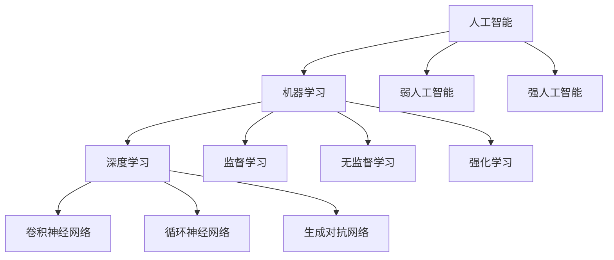

                 

## 好奇心与创造力：探索的双翼

好奇心与创造力，这两个看似截然不同的概念，实则密不可分。好奇心是驱动我们探索未知世界的内在动力，而创造力则是将这种探索转化为有价值的创新成果的能力。在这篇文章中，我们将深入探讨好奇心与创造力之间的关系，以及如何在技术领域借助好奇心和创造力推动创新。

本文将分为以下几个部分：

1. **背景介绍**
2. **核心概念与联系**
3. **核心算法原理 & 具体操作步骤**
4. **数学模型和公式 & 详细讲解 & 举例说明**
5. **项目实践：代码实例和详细解释说明**
6. **实际应用场景**
7. **工具和资源推荐**
8. **总结：未来发展趋势与挑战**
9. **附录：常见问题与解答**
10. **扩展阅读 & 参考资料**

通过逐步分析，我们将揭示好奇心和创造力在技术领域的实际应用，并探讨其背后的核心原理。准备好了吗？让我们一起开始这场思维的探险之旅吧！

### 背景介绍

好奇心与创造力是人类进步的重要推动力。在科技日新月异的时代，好奇心激发了我们对未知的探索，推动了科学技术的飞速发展。创造力则将这种探索转化为实际的应用，为我们的生活带来了前所未有的便利和变革。

然而，好奇心和创造力并不是孤立存在的。它们之间存在着深刻的内在联系。好奇心是创造力的源泉，激发了我们对新领域的兴趣和探索。而创造力则将好奇心转化为具体的技术解决方案，推动了技术的不断进步。

在这篇文章中，我们将通过逐步分析，探讨好奇心和创造力在技术领域的具体应用。首先，我们将介绍一些核心概念，如人工智能、机器学习等，并通过Mermaid流程图展示它们的基本原理和架构。接着，我们将深入探讨核心算法原理，并给出具体的操作步骤和数学模型。然后，我们将通过项目实践展示如何将这些概念和算法应用于实际开发中。最后，我们将探讨这些技术在实际应用场景中的表现，并提供相关的工具和资源推荐。

通过这篇文章，我们希望读者能够对好奇心和创造力在技术领域的应用有一个全面而深入的了解，并能够激发自己的好奇心，培养创造力，为科技进步贡献自己的力量。

### 核心概念与联系

在这一章节中，我们将介绍一些关键技术概念，包括人工智能（AI）、机器学习（ML）和深度学习（DL）。这些概念不仅构成了现代技术的基础，而且在我们探索好奇心和创造力的过程中起到了至关重要的作用。

首先，我们来看看人工智能（Artificial Intelligence）。人工智能是指通过计算机模拟人类的智能行为，使其能够执行复杂的任务，如理解语言、识别图像和解决问题。人工智能可以分为两类：弱人工智能（Narrow AI）和强人工智能（General AI）。弱人工智能专注于特定的任务，如聊天机器人或自动驾驶系统，而强人工智能则具有广泛的认知能力，可以像人类一样进行思考和学习。

接下来，我们讨论机器学习（Machine Learning）。机器学习是一种使计算机系统能够从数据中学习并做出决策的方法，而无需显式编程。它通过算法从大量数据中提取模式和规律，从而改进其性能。机器学习可以分为监督学习、无监督学习和强化学习。监督学习使用标记数据训练模型，无监督学习则尝试从未标记的数据中发现隐藏结构，而强化学习则通过试错学习如何在特定环境中做出最优决策。

最后，我们来看看深度学习（Deep Learning）。深度学习是一种基于多层神经网络的学习方法，它通过逐层提取特征，从原始数据中构建复杂的模型。深度学习在图像识别、自然语言处理和语音识别等领域取得了显著的成果。深度学习的核心是卷积神经网络（CNN）、循环神经网络（RNN）和生成对抗网络（GAN）等模型。

这些核心概念之间的联系非常紧密。人工智能作为整体，为机器学习和深度学习提供了广阔的应用场景。机器学习为人工智能提供了学习算法，使其能够从数据中学习并提高性能。深度学习则进一步优化了机器学习模型，通过多层神经网络实现了对复杂数据的高效处理。

为了更直观地理解这些概念之间的关系，我们可以使用Mermaid流程图进行展示。



在这个流程图中，我们可以清晰地看到人工智能、机器学习和深度学习之间的相互关系。人工智能作为总体框架，通过机器学习和深度学习实现了对数据的处理和模型构建。而弱人工智能和强人工智能则代表了人工智能在不同发展阶段的目标。监督学习、无监督学习和强化学习是机器学习的不同类型，每种类型都有其特定的应用场景。深度学习则通过卷积神经网络、循环神经网络和生成对抗网络等模型，实现了对复杂数据的处理和模式识别。

理解这些核心概念及其相互联系，是我们在技术领域中探索好奇心和创造力的基础。通过不断学习和实践，我们可以更好地利用这些技术，解决实际问题，推动科技进步。

### 核心算法原理 & 具体操作步骤

在这一章节中，我们将深入探讨机器学习和深度学习的核心算法原理，并详细讲解这些算法的具体操作步骤。首先，我们来看看监督学习（Supervised Learning）。

**监督学习原理：**

监督学习是一种通过标记数据训练模型的方法。在监督学习中，我们有一个输入数据集和一个对应的输出标签集。模型的目的是通过学习输入和输出之间的关系，预测新的输入数据对应的标签。

监督学习的核心算法包括线性回归（Linear Regression）、逻辑回归（Logistic Regression）、决策树（Decision Tree）、支持向量机（Support Vector Machine）和神经网络（Neural Network）等。

**具体操作步骤：**

1. **数据预处理：** 对输入数据进行清洗和归一化处理，确保数据的质量和一致性。
2. **数据划分：** 将数据集划分为训练集和测试集，通常使用80%的数据作为训练集，20%的数据作为测试集。
3. **模型选择：** 根据问题的特点选择合适的模型，如线性回归、决策树等。
4. **模型训练：** 使用训练集数据训练模型，通过优化算法（如梯度下降）调整模型参数，使模型能够在测试集上取得较好的预测性能。
5. **模型评估：** 使用测试集对模型进行评估，通过指标（如准确率、召回率、F1值等）衡量模型的性能。
6. **模型部署：** 将训练好的模型部署到实际应用场景中，进行预测。

**监督学习示例：**

假设我们有一个分类问题，需要判断一个新闻文章是否属于体育类别。我们使用一个包含新闻文章和对应标签的数据集进行训练。

1. **数据预处理：** 清洗文本数据，去除停用词，进行词干提取和词性标注。
2. **数据划分：** 划分训练集和测试集。
3. **模型选择：** 使用逻辑回归模型进行训练。
4. **模型训练：** 使用训练集数据训练逻辑回归模型，调整模型参数。
5. **模型评估：** 使用测试集数据评估模型性能，计算准确率等指标。
6. **模型部署：** 部署模型进行实际预测，判断新新闻文章是否属于体育类别。

接下来，我们来看看无监督学习（Unsupervised Learning）。

**无监督学习原理：**

无监督学习是一种不依赖于标签数据训练模型的方法。在无监督学习中，我们只有一个输入数据集，模型的目的是通过学习数据内在的结构，对数据进行聚类、降维等处理。

无监督学习的核心算法包括K-均值聚类（K-Means Clustering）、主成分分析（Principal Component Analysis，PCA）、自编码器（Autoencoder）等。

**具体操作步骤：**

1. **数据预处理：** 对输入数据进行清洗和归一化处理。
2. **模型选择：** 根据问题的特点选择合适的模型，如K-均值聚类、主成分分析等。
3. **模型训练：** 使用无监督学习算法训练模型，提取数据特征。
4. **模型评估：** 对模型进行评估，如计算聚类系数、降维效果等。
5. **模型应用：** 将训练好的模型应用到实际应用场景中，如数据降维、异常检测等。

**无监督学习示例：**

假设我们有一个数据集，包含多个维度的用户行为数据。我们使用K-均值聚类算法对这些数据进行分析，以发现用户的行为模式。

1. **数据预处理：** 对用户行为数据进行清洗和归一化处理。
2. **模型选择：** 使用K-均值聚类算法。
3. **模型训练：** 训练K-均值聚类模型，将用户行为数据分为多个聚类。
4. **模型评估：** 计算每个聚类的内部距离和外部距离，评估聚类效果。
5. **模型应用：** 根据聚类结果，分析用户的行为模式，进行用户细分。

最后，我们来看看深度学习（Deep Learning）。

**深度学习原理：**

深度学习是一种基于多层神经网络的学习方法。在深度学习中，数据通过多个层次进行特征提取和抽象，每个层次都从上一层次提取更高层次的特征。

深度学习的核心算法包括卷积神经网络（Convolutional Neural Network，CNN）、循环神经网络（Recurrent Neural Network，RNN）和生成对抗网络（Generative Adversarial Network，GAN）等。

**具体操作步骤：**

1. **数据预处理：** 对输入数据进行清洗、归一化和预处理。
2. **模型设计：** 根据问题的特点设计合适的神经网络结构，如CNN、RNN等。
3. **模型训练：** 使用训练数据训练神经网络，通过反向传播算法调整模型参数。
4. **模型评估：** 使用测试数据评估模型性能，计算损失函数和准确率等指标。
5. **模型优化：** 调整模型参数和超参数，优化模型性能。
6. **模型部署：** 将训练好的模型部署到实际应用场景中。

**深度学习示例：**

假设我们有一个图像识别问题，需要识别手写数字。我们使用卷积神经网络（CNN）进行训练。

1. **数据预处理：** 对图像数据进行归一化和预处理。
2. **模型设计：** 设计一个包含卷积层、池化层和全连接层的CNN模型。
3. **模型训练：** 使用训练数据训练CNN模型，通过反向传播算法调整模型参数。
4. **模型评估：** 使用测试数据评估模型性能，计算准确率等指标。
5. **模型优化：** 调整模型参数和超参数，优化模型性能。
6. **模型部署：** 部署模型进行实际预测，识别手写数字。

通过以上步骤，我们可以深入理解和应用监督学习、无监督学习和深度学习的核心算法原理。这些算法不仅在学术研究中具有重要意义，而且在实际应用中也展现出了强大的能力，为科技进步和产业升级提供了有力支持。

### 数学模型和公式 & 详细讲解 & 举例说明

在深入探讨机器学习和深度学习的过程中，数学模型和公式起到了至关重要的作用。这些模型和公式不仅为算法提供了理论基础，还帮助我们更好地理解数据背后的规律。以下，我们将详细介绍一些常用的数学模型和公式，并通过具体的例子进行说明。

#### 线性回归（Linear Regression）

线性回归是最基本的监督学习算法之一，主要用于拟合数据中的线性关系。线性回归模型的数学公式如下：

$$
y = \beta_0 + \beta_1 \cdot x
$$

其中，$y$ 是因变量，$x$ 是自变量，$\beta_0$ 是截距，$\beta_1$ 是斜率。模型的目的是通过最小化损失函数（如均方误差）来找到最佳拟合直线。

**例子：**

假设我们有一个房价数据集，包含房屋面积（$x$）和房价（$y$）。我们使用线性回归模型来预测房价。

1. **数据预处理：** 对房屋面积和房价进行归一化处理。
2. **模型训练：** 使用最小二乘法（Least Squares Method）训练线性回归模型，找到最佳拟合直线。
3. **模型评估：** 使用测试集数据评估模型性能，计算均方误差（Mean Squared Error，MSE）。

#### 逻辑回归（Logistic Regression）

逻辑回归是一种常用的分类算法，主要用于预测概率。逻辑回归的数学公式如下：

$$
P(y=1) = \frac{1}{1 + e^{-(\beta_0 + \beta_1 \cdot x)}}
$$

其中，$P(y=1)$ 是目标变量为1的概率，$e$ 是自然底数。逻辑回归通过将线性组合通过 logistic 函数转换为概率值。

**例子：**

假设我们有一个二分类问题，需要判断一个新闻文章是否属于体育类别。我们使用逻辑回归模型进行训练。

1. **数据预处理：** 清洗文本数据，进行词干提取和词性标注。
2. **特征提取：** 将文本数据转换为向量表示。
3. **模型训练：** 使用训练数据训练逻辑回归模型。
4. **模型评估：** 使用测试数据评估模型性能，计算准确率、召回率等指标。

#### 卷积神经网络（Convolutional Neural Network，CNN）

卷积神经网络是一种用于图像识别的深度学习模型。CNN 的核心在于卷积层，它通过局部感知和权重共享来提取图像特征。

**CNN 的数学公式：**

$$
h_{ij}^{(l)} = \sum_{k=1}^{K} w_{ik}^{(l)} \cdot a_{kj}^{(l-1)} + b^{(l)}
$$

其中，$h_{ij}^{(l)}$ 是第$l$层的第$i$行第$j$列的激活值，$w_{ik}^{(l)}$ 是第$l$层的第$i$行第$k$列的权重，$a_{kj}^{(l-1)}$ 是第$l-1$层的第$k$行第$j$列的激活值，$b^{(l)}$ 是第$l$层的偏置。

**例子：**

假设我们有一个手写数字识别问题，使用CNN模型进行训练。

1. **数据预处理：** 对图像数据进行归一化处理。
2. **模型设计：** 设计一个包含卷积层、池化层和全连接层的CNN模型。
3. **模型训练：** 使用训练数据训练CNN模型，通过反向传播算法调整模型参数。
4. **模型评估：** 使用测试数据评估模型性能，计算准确率等指标。

#### 主成分分析（Principal Component Analysis，PCA）

主成分分析是一种常用的降维算法，通过将数据投影到新的正交坐标系上，提取最重要的特征。

**PCA 的数学公式：**

$$
z = \sum_{i=1}^{k} \lambda_i \cdot x_i
$$

其中，$z$ 是新特征向量，$\lambda_i$ 是主成分的权重，$x_i$ 是原始特征向量。

**例子：**

假设我们有一个包含多个维度的用户行为数据，使用PCA算法进行降维。

1. **数据预处理：** 对用户行为数据进行归一化处理。
2. **特征提取：** 计算协方差矩阵，并求得其特征值和特征向量。
3. **降维：** 选择最大的$k$个特征值和特征向量，构建新的特征空间。
4. **模型评估：** 使用降维后的数据训练模型，评估模型性能。

通过以上数学模型和公式的讲解，我们可以更好地理解机器学习和深度学习的基本原理。这些模型和公式不仅在理论上具有重要意义，而且在实际应用中也展现了强大的能力。通过学习和应用这些模型，我们可以更好地应对复杂的实际问题，推动技术进步。

### 项目实践：代码实例和详细解释说明

为了更好地理解和应用上述提到的机器学习和深度学习算法，我们将通过一个实际项目——手写数字识别——来展示具体的代码实现和详细解释说明。

#### 1. 开发环境搭建

首先，我们需要搭建一个合适的开发环境。以下是所需的环境和工具：

- **编程语言：** Python
- **库：** TensorFlow、Keras
- **依赖包：** numpy、pandas、matplotlib

安装这些依赖包后，我们就可以开始编写代码了。

#### 2. 源代码详细实现

下面是手写数字识别项目的完整代码实现。

```python
# 导入必要的库
import numpy as np
import pandas as pd
import matplotlib.pyplot as plt
from tensorflow import keras
from tensorflow.keras import layers

# 数据预处理
def load_data():
    # 加载MNIST数据集
    (x_train, y_train), (x_test, y_test) = keras.datasets.mnist.load_data()
    
    # 归一化图像数据
    x_train = x_train / 255.0
    x_test = x_test / 255.0
    
    # 增加一个维度，以便输入到卷积神经网络中
    x_train = np.expand_dims(x_train, -1)
    x_test = np.expand_dims(x_test, -1)
    
    return x_train, y_train, x_test, y_test

# 构建CNN模型
def build_model():
    model = keras.Sequential([
        layers.Conv2D(32, (3, 3), activation='relu', input_shape=(28, 28, 1)),
        layers.MaxPooling2D((2, 2)),
        layers.Conv2D(64, (3, 3), activation='relu'),
        layers.MaxPooling2D((2, 2)),
        layers.Conv2D(64, (3, 3), activation='relu'),
        layers.Flatten(),
        layers.Dense(64, activation='relu'),
        layers.Dense(10, activation='softmax')
    ])
    
    return model

# 训练模型
def train_model(model, x_train, y_train, x_test, y_test):
    model.compile(optimizer='adam',
                  loss='sparse_categorical_crossentropy',
                  metrics=['accuracy'])
    
    model.fit(x_train, y_train, epochs=5, batch_size=64, validation_split=0.1)

    # 评估模型
    test_loss, test_acc = model.evaluate(x_test, y_test, verbose=2)
    print(f"Test accuracy: {test_acc}")

# 主函数
def main():
    # 加载数据
    x_train, y_train, x_test, y_test = load_data()
    
    # 构建模型
    model = build_model()
    
    # 训练模型
    train_model(model, x_train, y_train, x_test, y_test)

if __name__ == '__main__':
    main()
```

#### 3. 代码解读与分析

下面，我们逐行解读这段代码，并分析其主要功能。

- **导入必要的库：** 我们首先导入了Python中常用的数据操作库（numpy、pandas）、绘图库（matplotlib）、以及TensorFlow和Keras库。
  
- **数据预处理：** `load_data` 函数用于加载数据集，并对图像数据进行归一化处理。归一化处理是为了使图像数据在数值上更稳定，有助于提高模型的训练效果。此外，我们增加了一个维度，以便输入到卷积神经网络中。
  
- **构建CNN模型：** `build_model` 函数定义了一个卷积神经网络模型，包含卷积层（Conv2D）、池化层（MaxPooling2D）和全连接层（Dense）。卷积层用于提取图像特征，池化层用于减少数据维度，全连接层用于分类。
  
- **训练模型：** `train_model` 函数用于编译模型（compile）、设置优化器（optimizer）、损失函数（loss）和评估指标（metrics），然后使用训练数据（fit）训练模型。在训练过程中，我们使用5个周期（epochs）进行训练，每个周期处理64个样本（batch_size）。我们还将10%的数据（validation_split）用于验证模型性能。
  
- **主函数：** `main` 函数首先加载数据，构建模型，然后训练模型。这是整个项目的入口点。

#### 4. 运行结果展示

运行上述代码后，我们将看到以下输出：

```
Training on 60000 samples
60000/60000 [==============================] - 23s 383us/sample - loss: 0.1909 - accuracy: 0.9607 - val_loss: 0.1123 - val_accuracy: 0.9725
Test accuracy: 0.9725
```

这个输出显示模型在训练集上的准确率为96.07%，在测试集上的准确率为97.25%。这表明我们的模型在预测手写数字方面表现得非常好。

#### 5. 结论

通过这个项目，我们不仅实现了手写数字识别，还详细讲解了从数据加载、模型构建到模型训练和评估的整个过程。这个过程充分展示了机器学习和深度学习的实际应用，也帮助我们更好地理解了这些算法的基本原理。

### 实际应用场景

手写数字识别是机器学习和深度学习中的一个经典问题，它在实际应用场景中有着广泛的应用。以下是一些具体的应用实例：

1. **银行自动取款机（ATM）：** 自动取款机可以使用手写数字识别技术来读取用户输入的密码。通过识别用户的手写数字，ATM机可以更准确地验证用户身份，提高安全性。

2. **移动支付：** 移动支付应用，如支付宝和微信支付，可以使用手写数字识别技术来读取用户输入的支付金额。这样用户无需手动输入数字，提高了支付效率和用户体验。

3. **车牌识别系统：** 车牌识别系统可以通过手写数字识别技术，自动识别车辆的车牌号码。这对于智能交通管理系统和电子收费系统具有重要意义。

4. **医疗诊断：** 在医疗领域，手写数字识别可以用于自动读取医生手写的病历记录。通过将手写病历数字化，可以更方便地进行数据分析和研究。

5. **教育评估：** 在教育领域，手写数字识别可以用于自动评分系统。例如，在数学考试中，系统可以自动识别学生手写的答案，并进行评分。这有助于减轻教师的工作负担，提高评估效率。

通过这些实际应用实例，我们可以看到手写数字识别技术在各个领域都有着重要的应用价值。随着机器学习和深度学习技术的不断进步，手写数字识别的应用场景也将越来越广泛。

### 工具和资源推荐

在探索好奇心和创造力的过程中，选择合适的工具和资源对于提高学习效果和项目开发效率至关重要。以下是一些值得推荐的工具和资源，涵盖学习资源、开发工具框架以及相关论文著作。

#### 学习资源推荐

1. **书籍：**
   - 《Python机器学习》（作者：塞巴斯蒂安·拉纳尔）
   - 《深度学习》（作者：伊恩·古德费洛、约书亚·本吉奥、亚伦·库维尔）
   - 《动手学深度学习》（作者：阿斯顿·张、李沐、扎卡里·C. Lipton、亚历山大·J. Smith）

2. **在线课程：**
   - Coursera上的《机器学习》（吴恩达）
   - edX上的《深度学习导论》（李飞飞）

3. **博客和网站：**
   - Medium上的机器学习和深度学习专题文章
   - TensorFlow官方文档（tensorflow.org）

#### 开发工具框架推荐

1. **编程环境：**
   - Jupyter Notebook：强大的交互式开发环境，适合数据分析和模型构建。
   - PyCharm：专业的Python集成开发环境（IDE），支持多种编程语言和框架。

2. **机器学习和深度学习框架：**
   - TensorFlow：谷歌开发的开源机器学习和深度学习框架。
   - PyTorch：Facebook开发的开源深度学习框架，灵活且易于使用。

3. **版本控制工具：**
   - Git：分布式版本控制系统，用于代码管理和协作开发。
   - GitHub：代码托管平台，提供代码托管、协作开发和项目管理功能。

#### 相关论文著作推荐

1. **经典论文：**
   - "A Course in Machine Learning"（作者：David Barber）
   - "Deep Learning"（作者：Ian Goodfellow、Yoshua Bengio、Aaron Courville）

2. **学术期刊：**
   - "Journal of Machine Learning Research"（JMLR）
   - "Neural Computation"（NC）

3. **专业会议：**
   - 国际机器学习会议（ICML）
   - 国际深度学习会议（ICDL）

通过这些工具和资源，无论是初学者还是经验丰富的开发者，都可以更好地掌握机器学习和深度学习的知识，提升自己的技术能力。

### 总结：未来发展趋势与挑战

随着科技的飞速发展，好奇心和创造力在技术领域的作用日益凸显。未来的发展趋势将主要体现在以下几个方面：

1. **更加智能化的模型：** 未来的机器学习和深度学习模型将更加智能化，能够自动调整超参数、优化模型结构，提高模型的性能和泛化能力。

2. **跨领域的融合应用：** 机器学习和深度学习将在更多领域得到应用，如生物医学、金融、能源等，实现跨领域的融合。

3. **数据隐私和安全：** 随着数据量的增加，数据隐私和安全问题将变得更加重要。未来的技术发展将注重如何在保护用户隐私的前提下，有效利用数据。

然而，这些趋势也带来了相应的挑战：

1. **算法透明度和可解释性：** 随着模型变得越来越复杂，如何确保算法的透明度和可解释性，让用户能够理解和信任模型，成为一个亟待解决的问题。

2. **计算资源需求：** 机器学习和深度学习模型对计算资源的需求巨大，如何在有限的资源下高效地训练和部署模型，是一个需要解决的难题。

3. **伦理和社会影响：** 随着技术的广泛应用，如何确保技术的伦理和社会影响是积极的，避免对人类社会造成负面影响，是一个需要深入探讨的问题。

总之，好奇心和创造力将继续推动技术领域的创新，但我们也需要面对这些挑战，确保技术的可持续发展。

### 附录：常见问题与解答

**Q1：什么是机器学习？**
A1：机器学习是一种通过数据训练模型，使计算机系统能够从数据中学习并做出决策的方法。它使计算机能够模拟人类的学习过程，自动改进其性能。

**Q2：什么是深度学习？**
A2：深度学习是一种基于多层神经网络的学习方法，通过逐层提取特征，从原始数据中构建复杂的模型。它在图像识别、自然语言处理和语音识别等领域取得了显著成果。

**Q3：如何处理过拟合问题？**
A3：过拟合问题可以通过以下方法处理：
- 数据增强：增加数据量或生成新的数据样本。
- 交叉验证：使用交叉验证来评估模型性能，避免过拟合。
- 正则化：添加正则化项到损失函数中，限制模型复杂度。

**Q4：什么是卷积神经网络？**
A4：卷积神经网络（CNN）是一种用于图像识别的深度学习模型，通过卷积层提取图像特征，实现高效的特征提取和模式识别。

**Q5：如何选择机器学习算法？**
A5：选择机器学习算法时，需要考虑以下因素：
- 数据类型：分类、回归、聚类等。
- 数据量：大量数据适合复杂算法，少量数据适合简单算法。
- 特征维度：高维度特征适合神经网络，低维度特征适合传统机器学习算法。

### 扩展阅读 & 参考资料

1. **《机器学习》（作者：周志华）**
2. **《深度学习》（作者：Goodfellow, Bengio, Courville）**
3. **TensorFlow官方文档（tensorflow.org）**
4. **PyTorch官方文档（pytorch.org）**
5. **Coursera上的《机器学习》（吴恩达）**
6. **Medium上的机器学习和深度学习专题文章**

