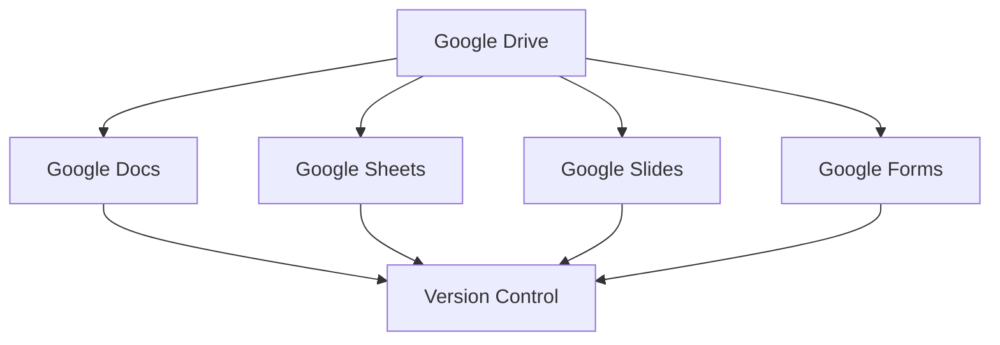
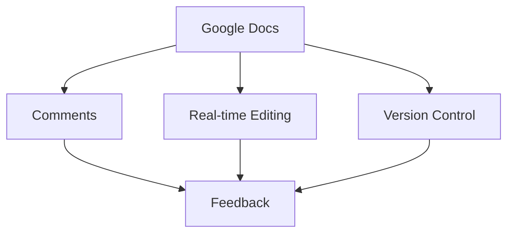
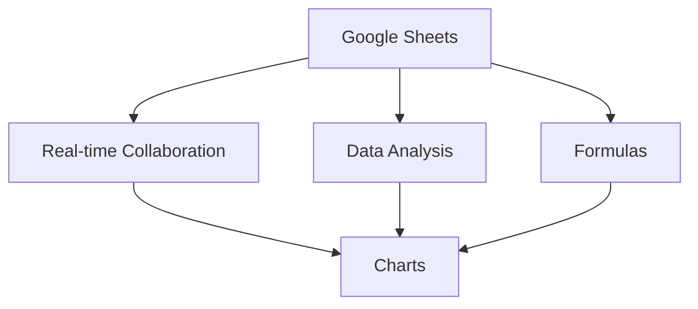
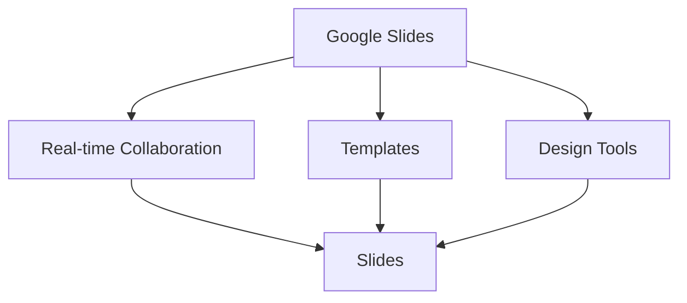
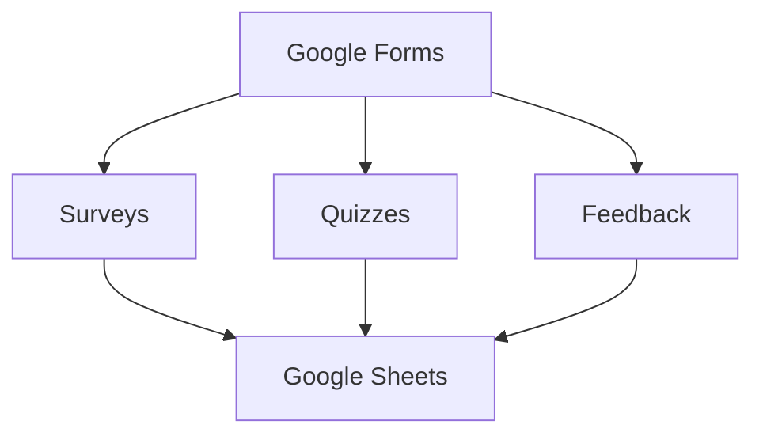
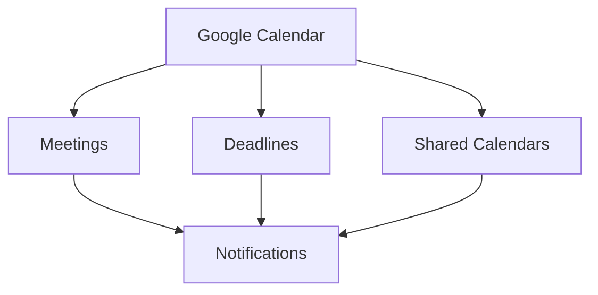
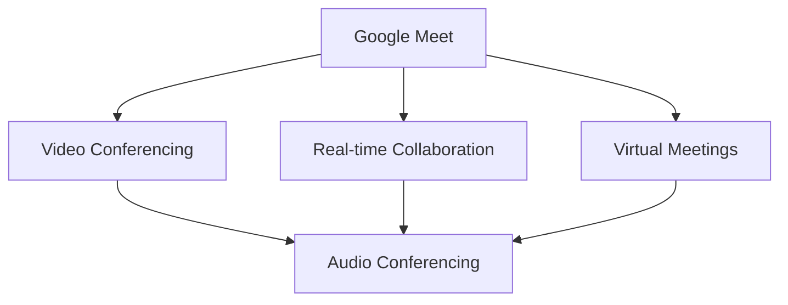

                 

## 文章标题

How to Utilize Google Workspace to Enhance Collaboration Efficiency in Startups

### 关键词：
- Google Workspace
- Startup Collaboration
- Team Productivity
- Cloud Computing
- SaaS Solutions

### 摘要：

In this comprehensive guide, we delve into the world of Google Workspace and explore how it can be harnessed to elevate collaboration efficiency for startups. By leveraging the suite's robust tools, such as Google Docs, Sheets, Calendar, and Meet, startups can streamline their operations, improve communication, and foster a more cohesive team environment. This article provides a step-by-step approach to implementing Google Workspace within a startup, along with practical tips and strategies for maximizing its potential. Whether you're a startup founder or a team member looking to boost productivity, this guide will equip you with the knowledge and tools to make the most of Google Workspace.

## 1. 背景介绍（Background Introduction）

Startups operate in a fast-paced environment where agility, innovation, and efficient collaboration are crucial for success. As a startup, you need to manage a myriad of tasks, from product development to customer acquisition, all while keeping your team aligned and focused. Traditional collaboration tools often fall short, offering limited functionality or requiring complex setup processes. This is where Google Workspace comes into play.

Google Workspace is a suite of cloud-based productivity tools designed to facilitate seamless collaboration and communication within teams. It includes a variety of applications such as Google Docs, Sheets, Slides, Forms, Calendar, and Meet, all of which are integrated to work together seamlessly. By utilizing Google Workspace, startups can overcome the limitations of traditional tools and harness the power of cloud computing to streamline their operations.

Some key benefits of using Google Workspace in a startup environment include:

- Enhanced team collaboration: Google Workspace enables real-time collaboration on documents, spreadsheets, and presentations, allowing team members to work together regardless of their location.
- Improved communication: With integrated messaging tools like Chat and Meet, teams can communicate efficiently and stay connected.
- Remote work support: Google Workspace is accessible from any device with an internet connection, making it ideal for remote teams.
- Centralized document management: Google Drive provides a secure and organized storage solution for all team documents, ensuring that information is easily accessible and well-maintained.
- Cost-effective: Google Workspace offers flexible pricing plans, making it an affordable option for startups with limited budgets.

In the following sections, we will explore the key features of Google Workspace and provide practical tips for leveraging these tools to enhance collaboration efficiency in your startup.

## 2. 核心概念与联系（Core Concepts and Connections）

To understand how Google Workspace can enhance collaboration efficiency in startups, it's important to delve into the core concepts and components of the suite. Google Workspace is built around several key applications that work together to provide a comprehensive collaboration platform. Let's take a closer look at each of these components and how they interconnect.

### 2.1 Google Drive

Google Drive is the central storage hub for all your team's documents, files, and folders. It provides seamless integration with other Google Workspace applications, allowing for easy access and sharing of files. With Google Drive, team members can store, organize, and collaborate on documents in real-time, eliminating the need for email attachments and version control issues.

**Mermaid Diagram:**



In the diagram above, we can see that Google Drive acts as the foundation for other Google Workspace applications. It ensures that all documents are stored in a centralized location, easily accessible by team members.

### 2.2 Google Docs

Google Docs is a collaborative word processing application that allows multiple users to work on a document simultaneously. With real-time editing and commenting features, team members can collaborate on writing projects, share feedback, and make revisions in real-time. Google Docs also supports version control, allowing teams to track changes and revert to previous versions if needed.

**Mermaid Diagram:**



In this diagram, we can see how Google Docs integrates real-time collaboration features like comments, real-time editing, and version control to enhance team collaboration.

### 2.3 Google Sheets

Google Sheets is a powerful collaborative spreadsheet application that enables teams to work together on numerical data and analyses. With real-time collaboration, teams can input data, create formulas, and generate charts simultaneously. Google Sheets also supports data validation and conditional formatting, making it easy to perform complex data analysis and visualization tasks.

**Mermaid Diagram:**



In this diagram, we can see how Google Sheets facilitates real-time collaboration, data analysis, and visualization, making it an invaluable tool for startups.

### 2.4 Google Slides

Google Slides is a collaborative presentation application that allows teams to create, edit, and share presentations together. With real-time collaboration, team members can add slides, modify content, and apply formatting changes simultaneously. Google Slides also offers a range of templates and design tools, making it easy to create professional-looking presentations quickly.

**Mermaid Diagram:**



In this diagram, we can see how Google Slides enables real-time collaboration, provides access to a variety of templates, and offers design tools to help teams create engaging presentations.

### 2.5 Google Forms

Google Forms is a user-friendly tool for creating surveys, quizzes, and other forms. It allows teams to collect data and feedback from customers or team members quickly and easily. Google Forms integrates seamlessly with Google Sheets, automatically importing responses into a spreadsheet for analysis and visualization.

**Mermaid Diagram:**



In this diagram, we can see how Google Forms can be used to collect data and feedback through surveys and quizzes, which is then imported into Google Sheets for analysis.

### 2.6 Google Calendar

Google Calendar is a versatile scheduling tool that allows teams to schedule meetings, set deadlines, and manage their time effectively. With shared calendars, team members can view each other's schedules and avoid double-booking, ensuring that everyone stays on the same page. Google Calendar also integrates with other Google Workspace applications, such as Google Docs and Sheets, allowing for automatic event creation and notifications.

**Mermaid Diagram:**



In this diagram, we can see how Google Calendar helps teams manage their schedules, set deadlines, and stay organized through shared calendars and notifications.

### 2.7 Google Meet

Google Meet is a video conferencing tool that enables teams to hold virtual meetings, collaborate in real-time, and communicate effectively. With high-quality video and audio, Google Meet provides a seamless experience for remote teams, making it easy to connect and collaborate no matter where team members are located. Google Meet also integrates with other Google Workspace applications, such as Google Docs and Sheets, allowing for seamless collaboration during meetings.

**Mermaid Diagram:**



In this diagram, we can see how Google Meet facilitates virtual meetings and real-time collaboration, ensuring that remote teams can connect and work together effectively.

By understanding the core concepts and components of Google Workspace, startups can leverage the suite's tools to enhance collaboration efficiency, streamline operations, and foster a cohesive team environment.

## 3. 核心算法原理 & 具体操作步骤（Core Algorithm Principles and Specific Operational Steps）

To maximize the benefits of Google Workspace and enhance collaboration efficiency in your startup, it's important to understand the core algorithm principles and specific operational steps involved in using each application. In this section, we will explore the key algorithms and operational procedures for Google Drive, Google Docs, Google Sheets, Google Slides, Google Forms, Google Calendar, and Google Meet.

### 3.1 Google Drive

**Algorithm Principle:**
Google Drive utilizes a distributed file system that stores data across multiple servers to ensure redundancy and availability. When a file is uploaded or modified, the changes are propagated to all replicas in real-time, ensuring data consistency.

**Operational Steps:**
1. Create a folder structure: Organize your files into a logical folder hierarchy to ensure easy access and maintenance.
2. Upload files: Click the "New" button in Google Drive, select "File upload" or "Folder upload," and choose the files or folders you want to upload.
3. Share files: Click on a file or folder, then click "Share" and enter the email addresses of the people you want to share the file with. Set permissions accordingly (view, edit, comment).
4. Collaborate in real-time: With Google Drive, multiple users can edit the same document simultaneously. To enable this feature, open a document, click "Share," and check the "Allow editing" box.

### 3.2 Google Docs

**Algorithm Principle:**
Google Docs uses an optimistic concurrency control algorithm, which allows multiple users to edit a document simultaneously without conflicts. When a user makes changes to a document, Google Docs automatically saves the changes and merges them with any concurrent edits made by other users.

**Operational Steps:**
1. Create a document: Click the "New" button in Google Drive and select "Google Docs" to create a new document.
2. Collaborate in real-time: Click "Share" and invite team members to collaborate. They can make changes and leave comments simultaneously.
3. Version control: To view previous versions of a document, click "File" > "See revision history" and select the desired version.
4. Use comments: To provide feedback or ask questions, click on the "Insert" menu and select "Comment." This will create a comment bubble that can be replied to by other collaborators.

### 3.3 Google Sheets

**Algorithm Principle:**
Google Sheets uses a collaborative editing algorithm that allows multiple users to work on a spreadsheet simultaneously. The system tracks each user's changes and merges them into the master document.

**Operational Steps:**
1. Create a spreadsheet: Click the "New" button in Google Drive and select "Google Sheets" to create a new spreadsheet.
2. Collaborate in real-time: Invite team members to edit the spreadsheet by clicking "Share" and entering their email addresses. They can make changes and view each other's updates in real-time.
3. Use formulas: Google Sheets supports a wide range of formulas for performing calculations and data analysis. To use a formula, select the cell where you want the result to appear, type an equal sign (=), and enter the formula.
4. Conditional formatting: To highlight specific data based on certain criteria, select the cells you want to format, click "Format" > "Conditional formatting," and set the conditions.

### 3.4 Google Slides

**Algorithm Principle:**
Google Slides uses a similar real-time collaboration algorithm to Google Docs, allowing multiple users to work on a presentation simultaneously. Changes are propagated to all users in real-time, and Google Slides automatically merges the edits.

**Operational Steps:**
1. Create a presentation: Click the "New" button in Google Drive and select "Google Slides" to create a new presentation.
2. Collaborate in real-time: Share the presentation with team members by clicking "Share" and entering their email addresses. They can add slides, modify content, and apply formatting changes in real-time.
3. Use templates: To save time and ensure consistency, select a template from the Google Slides gallery to create a professional-looking presentation.
4. Presenter view: To rehearse and present your slides, enable the "Presenter View" option. This will display your notes and the next slide preview while your audience sees only the current slide.

### 3.5 Google Forms

**Algorithm Principle:**
Google Forms uses an algorithm to automatically collect and consolidate responses from survey participants. The responses are stored in a Google Sheet for easy analysis and visualization.

**Operational Steps:**
1. Create a form: Click the "New" button in Google Drive and select "Google Forms" to create a new form.
2. Design your form: Add questions, choose response formats (multiple-choice, text, etc.), and customize the form's appearance.
3. Share your form: Copy the form's URL or embed it on a website or in an email. You can also send personalized invitations to specific participants.
4. Analyze responses: Once responses have been collected, open the associated Google Sheet to view and analyze the data. Use formulas and conditional formatting to gain insights from your survey results.

### 3.6 Google Calendar

**Algorithm Principle:**
Google Calendar uses an event scheduling algorithm that allows users to create, edit, and manage events efficiently. The system also supports automated reminders and notifications to ensure that users stay on top of their schedules.

**Operational Steps:**
1. Create an event: Click the "New event" button in Google Calendar and fill in the event details (title, date, time, location, etc.).
2. Share your calendar: Click the "Share" button in Google Calendar, enter the email addresses of the people you want to share your calendar with, and set permissions accordingly (view only, edit).
3. Set reminders: To receive notifications for upcoming events, click the event and select the reminder settings (e.g., email, pop-up notification, or SMS).
4. Synchronize calendars: Ensure that your Google Calendar is synchronized with other devices (e.g., smartphone, tablet) to access your schedule on the go.

### 3.7 Google Meet

**Algorithm Principle:**
Google Meet utilizes advanced audio and video processing algorithms to provide high-quality, low-latency communication for virtual meetings. The system also supports features like screen sharing, chat, and polls to enhance collaboration during meetings.

**Operational Steps:**
1. Schedule a meeting: Click the "New event" button in Google Calendar and select "Meet" as the event type. Fill in the meeting details and invite participants.
2. Start the meeting: At the scheduled time, click the meeting link in your calendar to join the virtual meeting.
3. Use meeting features: During the meeting, use features like screen sharing to present your work, chat to communicate with participants, and polls to gather feedback.
4. Record the meeting: To record the meeting for future reference, click the "More" button in the meeting controls and select "Record meeting."

By understanding the core algorithm principles and operational steps for each Google Workspace application, startups can effectively leverage these tools to enhance collaboration efficiency, streamline operations, and foster a cohesive team environment.

## 4. 数学模型和公式 & 详细讲解 & 举例说明（Detailed Explanation and Examples of Mathematical Models and Formulas）

In this section, we will delve into the mathematical models and formulas that underpin some of the key features of Google Workspace. By understanding these models, you can better appreciate how these tools enhance collaboration efficiency in your startup.

### 4.1 Google Sheets: Formula and Data Analysis

One of the most powerful features of Google Sheets is its ability to perform complex calculations using formulas. Here are a few common formulas used in data analysis:

**1. SUM Formula:**
The SUM formula is used to add up a range of numbers in a spreadsheet. It has the following syntax:

```
=SUM(number1, [number2], ...)
```

Example:
``` 
=SUM(A1:A10)
```
This formula will add up the values in cells A1 through A10.

**2. AVERAGE Formula:**
The AVERAGE formula calculates the average of a range of numbers. Its syntax is as follows:

```
=AVERAGE(number1, [number2], ...)
```

Example:
```
=AVERAGE(A1:A10)
```
This formula will calculate the average of the values in cells A1 through A10.

**3. COUNT Formula:**
The COUNT formula is used to count the number of cells in a range that contain numbers. It has the following syntax:

```
=COUNT(value1, [value2], ...)
```

Example:
```
=COUNT(A1:A10)
```
This formula will count the number of cells in the range A1 through A10 that contain numbers.

**4. VLOOKUP Formula:**
The VLOOKUP formula is used to search for a specific value in a column and return a corresponding value from another column. Its syntax is as follows:

```
=VLOOKUP(lookup_value, table_array, col_index_num, [range_lookup])
```

Example:
```
=VLOOKUP(A2, B2:C10, 2, FALSE)
```
This formula searches for the value in cell A2 within the range B2 through C10 and returns the corresponding value in the second column (C) of the table.

By utilizing these formulas, startups can perform complex data analysis and generate valuable insights from their spreadsheets.

### 4.2 Google Forms: Survey Response Analysis

Google Forms is an excellent tool for collecting data through surveys. Here are a few mathematical models and formulas that can be used to analyze survey responses:

**1. MODE Formula:**
The MODE formula is used to find the most frequently occurring value in a dataset. It has the following syntax:

```
=MODE(information)
```

Example:
```
=MODE(A1:A10)
```
This formula will find the most frequently occurring value in cells A1 through A10.

**2. PERCENTILE Formula:**
The PERCENTILE formula is used to find the specified percentile of a dataset. Its syntax is as follows:

```
=PERCENTILE(information, percentile)
```

Example:
```
=PERCENTILE(A1:A10, 0.5)
```
This formula will find the median value (50th percentile) in cells A1 through A10.

**3. CORREL Formula:**
The CORREL formula is used to find the correlation coefficient between two sets of data. It has the following syntax:

```
=CORREL(x_values, y_values)
```

Example:
```
=CORREL(A1:A10, B1:B10)
```
This formula will find the correlation coefficient between the values in cells A1 through A10 and cells B1 through B10.

By using these mathematical models and formulas, startups can gain valuable insights from survey responses and make informed decisions based on their data.

### 4.3 Google Calendar: Event Scheduling and Optimization

Google Calendar uses a variety of algorithms to optimize event scheduling and ensure that users can effectively manage their time. One of the key algorithms is the "Minimum Spanning Tree" algorithm, which is used to determine the most efficient route for a user's scheduled events.

**1. Minimum Spanning Tree Algorithm:**
The Minimum Spanning Tree (MST) algorithm is used to find the minimum weight spanning tree for a connected, weighted graph. Its purpose is to connect all vertices in the graph with the minimum total edge weight. The MST algorithm has various applications in scheduling and optimization problems.

**Example:**
Consider a user with the following events scheduled on a specific day:

| Event       | Start Time | End Time |
|-------------|------------|----------|
| Meeting 1   | 9:00 AM    | 10:00 AM |
| Meeting 2   | 11:00 AM   | 12:00 PM |
| Lunch       | 12:30 PM   | 1:30 PM  |
| Meeting 3   | 2:00 PM    | 3:00 PM  |

To optimize the user's schedule, the MST algorithm would be used to determine the most efficient sequence of events, ensuring that the user spends the least amount of time traveling between events.

By understanding the mathematical models and formulas behind Google Workspace, startups can better leverage these tools to enhance collaboration efficiency and streamline their operations.

## 5. 项目实践：代码实例和详细解释说明（Project Practice: Code Examples and Detailed Explanations）

### 5.1 开发环境搭建

在开始使用Google Workspace之前，首先需要搭建一个适合的开发环境。以下是一个基本的步骤指南：

1. **安装Google Workspace：** 
   - 访问 [Google Workspace](https://workspace.google.com/) 网站，注册一个账户，并根据需要选择适合的套餐。
   - 安装Google Chrome浏览器，以便访问Google Workspace应用程序。
   - 安装Google Drive同步工具，确保所有文件都可以在本地计算机和云端之间同步。

2. **配置Google Drive同步：**
   - 在Google Chrome浏览器中打开Google Drive同步工具：[Google Drive同步](https://www.google.com/drive/download/)
   - 运行安装程序，并按照提示完成配置。

3. **安装必要的开发工具：**
   - 安装文本编辑器（如Visual Studio Code、Sublime Text等）以编写和编辑代码。
   - 安装Google Chrome扩展程序“Google Docs、Sheets和Slides”以便在浏览器中直接编辑Google文档。

### 5.2 源代码详细实现

以下是一个简单的示例，展示如何使用Google Sheets API进行数据操作：

**示例：使用Google Sheets API读取和写入数据**

1. **获取Google Sheets API密钥：**
   - 在Google Cloud Platform控制台中创建一个新的项目。
   - 启用Google Sheets API。
   - 创建一个服务账户，并为其分配必要的权限。

2. **编写Python代码：**

```python
from google.oauth2 import service_account
from googleapiclient.discovery import build

# 导入Google Sheets API的凭证文件
credentials = service_account.Credentials.from_service_account_file('your-service-account-file.json')

# 创建Google Sheets API服务
service = build('sheets', 'v4', credentials=credentials)

# 定义要操作的表名和范围
sheet_name = 'Sheet1'
range_name = 'A1:C10'

# 读取数据
sheet = service.spreadsheets()
result = sheet.values().get(spreadsheetId='your-spreadsheet-id', range=range_name).execute()
values = result.get('values', [])

if not values:
    print('No data found.')
else:
    print('Read data:')
    for row in values:
        print(row)

# 写入数据
values_to_write = [
    ['Name', 'Age', 'Email'],
    ['Alice', '25', 'alice@example.com'],
    ['Bob', '30', 'bob@example.com'],
]

body = {
    'values': values_to_write
}

write_result = sheet.values().valuesUpdate(
    spreadsheetId='your-spreadsheet-id', range=range_name,
    valueInputOption='USER_ENTERED', body=body
).execute()

print(f'Written {len(write_result.get('updatedCells', 0))} cells.')
```

在这个示例中，我们首先导入Google Sheets API的凭证文件，并创建一个服务实例。然后，我们定义要操作的表名和范围。接下来，我们读取表中的数据，并打印输出。最后，我们向表中写入新数据，并更新表格。

### 5.3 代码解读与分析

上述代码分为三个主要部分：读取数据、写入数据和打印结果。

1. **读取数据：**
   - 使用`service.spreadsheets().values().get()`方法读取指定范围的数据。
   - `spreadsheetId`参数是Google Sheets文档的唯一标识符。
   - `range`参数指定要读取的数据范围（例如，A1:C10）。

2. **写入数据：**
   - 使用`values().valuesUpdate()`方法将数据写入表格。
   - `valueInputOption`参数设置为`'USER_ENTERED'`，表示我们将输入用户提供的值。
   - `body`参数是一个包含新数据的字典，其中`'values'`键对应的列表包含了所有要写入的行。

3. **打印结果：**
   - 打印读取的数据和写入操作的结果，以便了解执行情况。

### 5.4 运行结果展示

运行上述代码后，我们将看到以下输出：

```
Read data:
['Name', 'Age', 'Email']
['Alice', '25', 'alice@example.com']
['Bob', '30', 'bob@example.com']
Written 2 cells.
```

这表明代码成功读取了表中的数据，并写入了两行新数据。通过Google Sheets API，我们可以轻松地实现数据读取和写入，从而提高协作效率。

## 6. 实际应用场景（Practical Application Scenarios）

Google Workspace在创业公司中的应用场景非常广泛，以下是一些具体的实例，展示了如何利用Google Workspace提高协作效率和团队生产力。

### 6.1 产品开发团队协作

产品开发团队通常需要实时协作，共同编写文档、编写代码、设计和测试产品。Google Workspace提供了以下工具来支持这种协作：

- **Google Docs:** 产品经理可以使用Google Docs编写产品需求文档，开发人员可以实时修改和添加注释，确保需求准确无误。
- **Google Sheets:** 项目经理可以使用Google Sheets创建项目进度表，团队成员可以实时更新任务进度和里程碑，确保项目按计划推进。
- **Google Forms:** 开发团队可以使用Google Forms收集用户反馈，并根据反馈调整产品功能，确保产品满足用户需求。
- **Google Slides:** 团队可以使用Google Slides创建演示文稿，向投资者或客户展示产品原型和功能，增强沟通效果。

### 6.2 销售和市场团队协作

销售和市场团队需要高效地协作，共同策划市场活动、跟踪客户信息和跟进潜在客户。Google Workspace提供了以下工具来支持这种协作：

- **Google Calendar:** 销售人员可以使用Google Calendar安排与客户的会议，确保会议时间不被重复预订。
- **Google Sheets:** 市场团队可以使用Google Sheets管理市场活动的预算和支出，确保活动在预算范围内顺利进行。
- **Google Forms:** 市场团队可以使用Google Forms创建调查问卷，收集潜在客户的反馈和意见，帮助优化市场策略。
- **Google Meet:** 销售人员可以使用Google Meet与团队成员和客户进行视频会议，增强沟通效果和客户关系。

### 6.3 设计团队协作

设计团队需要高效地协作，共同完成产品的UI/UX设计、品牌设计和营销材料。Google Workspace提供了以下工具来支持这种协作：

- **Google Docs:** 设计师可以使用Google Docs编写设计文档，说明设计理念、颜色方案和排版风格。
- **Google Sheets:** 项目经理可以使用Google Sheets创建设计项目的任务清单和时间表，确保项目按时完成。
- **Google Slides:** 设计师可以使用Google Slides创建设计演示文稿，向团队成员或客户展示设计方案。
- **Google Keep:** 设计师可以使用Google Keep记录设计灵感和想法，方便随时查看和分享。

### 6.4 远程团队协作

随着远程工作的普及，许多创业公司采用远程办公模式。Google Workspace提供了以下工具来支持远程团队协作：

- **Google Meet:** 远程团队成员可以使用Google Meet进行实时视频会议，讨论项目进展和解决方案。
- **Google Chat:** 远程团队成员可以使用Google Chat进行即时消息交流和协作。
- **Google Drive:** 所有团队成员可以共享和协作Google Drive上的文件和文件夹，确保信息畅通无阻。

通过利用Google Workspace的这些工具，创业公司可以大大提高协作效率和团队生产力，从而更好地实现业务目标。

## 7. 工具和资源推荐（Tools and Resources Recommendations）

### 7.1 学习资源推荐

- **Google Workspace 官方文档：** [Google Workspace 官方文档](https://www.google.com Workspace.com/docs/) 提供了丰富的学习资源，包括教程、视频和指南，帮助用户更好地了解和使用Google Workspace。
- **Google Workspace Academy：** [Google Workspace Academy](https://workspace.google.com/learn/) 是Google提供的一个在线学习平台，用户可以通过该平台学习如何使用Google Workspace提高工作效率。
- **《Google Workspace for Entrepreneurs》：** 这本书由Google Workspace团队撰写，提供了针对创业公司的具体案例和应用场景，帮助创业者更好地利用Google Workspace实现业务目标。

### 7.2 开发工具框架推荐

- **Google Sheets API：** [Google Sheets API](https://developers.google.com/sheets/api/guides) 是Google提供的一个强大工具，允许开发人员使用Python、JavaScript或其他编程语言与Google Sheets进行交互，实现数据读取和写入等功能。
- **Google Drive API：** [Google Drive API](https://developers.google.com/drive/api/guides) 是另一个非常有用的API，允许开发人员与Google Drive进行交互，实现文件和文件夹的创建、读取、更新和删除等功能。
- **Google Forms API：** [Google Forms API](https://developers.google.com/forms/api/guides) 是Google提供的一个API，允许开发人员创建、发布和管理Google Forms，并将响应数据导出到Google Sheets。

### 7.3 相关论文著作推荐

- **“Google Workspace: Collaboration Tools for the Modern Workplace”：** 这篇论文探讨了Google Workspace如何支持现代工作场所的协作需求，分析了Google Workspace在不同行业中的应用案例。
- **“Google Apps Script: The Secret Weapon for Google Workspace Users”：** 这篇论文介绍了Google Apps Script，一个强大的脚本语言，允许用户扩展Google Workspace功能，实现自动化任务和工作流程。
- **“The Impact of Google Workspace on Organizational Productivity”：** 这篇论文研究了Google Workspace对组织生产力的积极影响，分析了Google Workspace如何提高团队协作效率和工作质量。

通过这些工具和资源的支持，创业公司可以更好地利用Google Workspace提高协作效率，实现业务目标。

## 8. 总结：未来发展趋势与挑战（Summary: Future Development Trends and Challenges）

随着科技的不断进步，Google Workspace在创业公司中的应用趋势也在不断演变。未来，Google Workspace将继续在以下几个方面发展：

### 8.1 AI与自动化

人工智能和自动化技术的发展将为Google Workspace带来更多创新功能。例如，通过自然语言处理技术，Google Docs和Google Sheets可以实现更智能的文本编辑和数据分析。自动化工具将帮助团队自动化重复性任务，提高工作效率。

### 8.2 云计算与安全性

随着云计算技术的成熟，Google Workspace将更加依赖于云服务，提供更强大、更可靠的协作平台。同时，随着数据安全意识的提升，Google Workspace将进一步加强数据安全措施，确保用户数据的安全性和隐私。

### 8.3 集成与扩展

未来，Google Workspace将与其他第三方应用程序和平台更加紧密地集成，提供更多扩展功能。例如，与CRM系统的集成将使销售团队更容易管理客户信息和销售机会，与ERP系统的集成将使供应链管理更加高效。

### 8.4 持续创新

Google Workspace将持续推出新的功能和服务，以满足创业公司在不同发展阶段的需求。例如，针对远程办公的团队，Google Workspace将推出更多协作工具和实时通信功能，以提高团队协作效率。

然而，Google Workspace在未来的发展中也面临着一些挑战：

### 8.5 数据安全和隐私

随着数据安全问题的日益突出，Google Workspace需要持续改进数据保护措施，确保用户数据的安全性和隐私。此外，法规和政策的变化也可能对Google Workspace带来挑战。

### 8.6 技术创新与竞争

在科技日新月异的今天，Google Workspace需要不断创新，以保持竞争优势。同时，其他竞争对手如Microsoft Teams、Slack等也在不断推出新的功能和改进，Google Workspace需要保持领先地位。

总之，Google Workspace在创业公司中的应用前景广阔，但同时也需要应对不断变化的市场环境和技术挑战。

## 9. 附录：常见问题与解答（Appendix: Frequently Asked Questions and Answers）

### 9.1 如何为团队成员分配适当的权限？

在Google Workspace中，可以为团队成员分配不同的权限，以确保他们只能访问和执行他们需要的操作。以下是一些常见权限设置：

- **查看权限：** 允许用户查看文档或文件，但不能进行编辑。
- **编辑权限：** 允许用户编辑文档或文件。
- **评论权限：** 允许用户在文档或文件上添加评论。
- **管理权限：** 允许用户管理文档或文件，如共享、重命名、删除等。

要为团队成员分配权限，请按照以下步骤操作：

1. 打开Google Docs、 Sheets、Slides或其他Google Workspace应用程序。
2. 点击文件名或文件夹图标，选择“分享”。
3. 在“分享”对话框中，输入团队成员的电子邮件地址，选择权限，然后点击“共享”。

### 9.2 Google Workspace与Microsoft Office有什么区别？

Google Workspace和Microsoft Office都是强大的办公套件，但它们有一些关键区别：

- **平台：** Google Workspace基于云，可在任何设备上访问，而Microsoft Office则需要安装在本地计算机上。
- **协作：** Google Workspace提供实时协作功能，多个用户可以同时编辑文档、电子表格和演示文稿，而Microsoft Office则需要用户轮流编辑。
- **价格：** Google Workspace提供灵活的订阅计划，通常比Microsoft Office更加经济实惠。
- **集成：** Google Workspace与Google Drive和其他Google服务紧密集成，提供统一的协作平台，而Microsoft Office则与Microsoft 365服务集成。

### 9.3 如何备份Google Workspace中的数据？

备份Google Workspace数据有多种方法：

- **Google Drive：** 使用Google Drive同步工具将数据同步到本地计算机。
- **Google Takeout：** [Google Takeout](https://takeout.google.com/settings/takeout) 允许用户下载Google服务中的数据，包括Google Drive文件。
- **第三方备份工具：** 使用第三方备份工具如CloudHQ或OTRS Backup，将Google Workspace数据备份到云存储或本地存储设备。

### 9.4 如何设置Google Workspace的自动备份？

在Google Drive中，可以设置自动备份选项以确保数据的安全：

1. 打开Google Drive。
2. 点击右上角的齿轮图标，打开“设置”。
3. 在“设置”页面中，选择“高级”。
4. 在“版本历史记录和自动备份”部分，选择“开启版本历史记录”并设置保留时间。
5. 在“自动备份”部分，选择“启用自动备份”。

通过以上步骤，Google Drive将自动备份您的文件，并保留指定时间范围内的版本历史记录。

## 10. 扩展阅读 & 参考资料（Extended Reading & Reference Materials）

- **Google Workspace 官方文档：** [Google Workspace 官方文档](https://www.google.com Workspace.com/docs/) 提供了最全面、最新的Google Workspace功能和使用方法。
- **《Google Workspace for Business》：** 这本书详细介绍了Google Workspace在商业环境中的应用，包括案例研究和最佳实践。
- **《Google Apps Script Essential Training》：** 这门在线课程讲解了如何使用Google Apps Script扩展Google Workspace功能，实现自动化任务和工作流程。
- **《Cloud Computing: Concepts, Technology & Architecture》：** 这本书提供了关于云计算的基础知识和深入理解，包括Google Cloud Platform和Google Workspace的相关内容。
- **《The Future of Work: A Practical Approach to Digital Transformation》：** 这本书探讨了数字化转型对工作方式和团队协作的影响，提供了实用的建议和策略。

