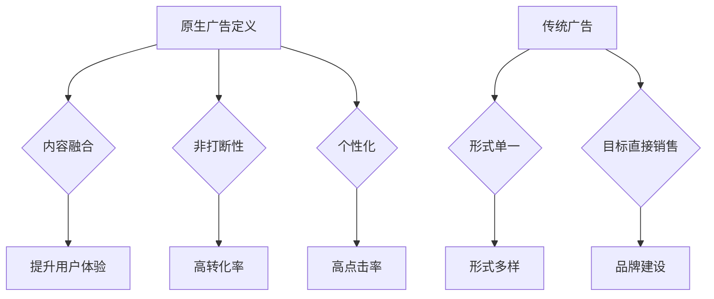
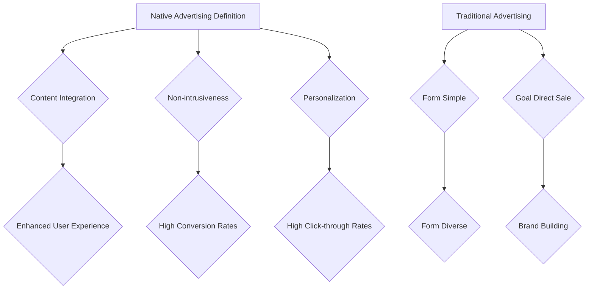
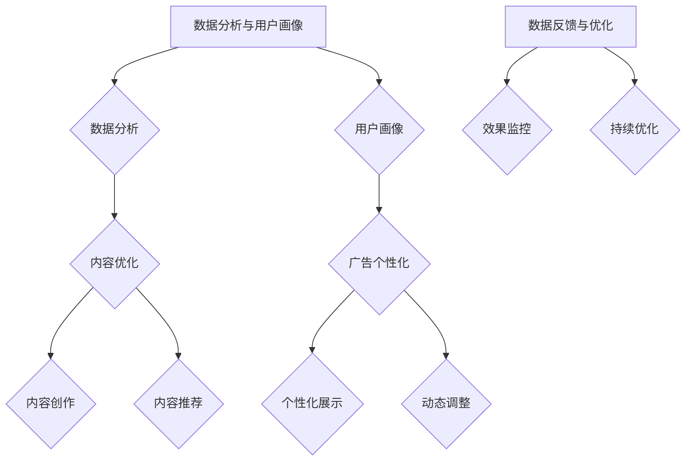
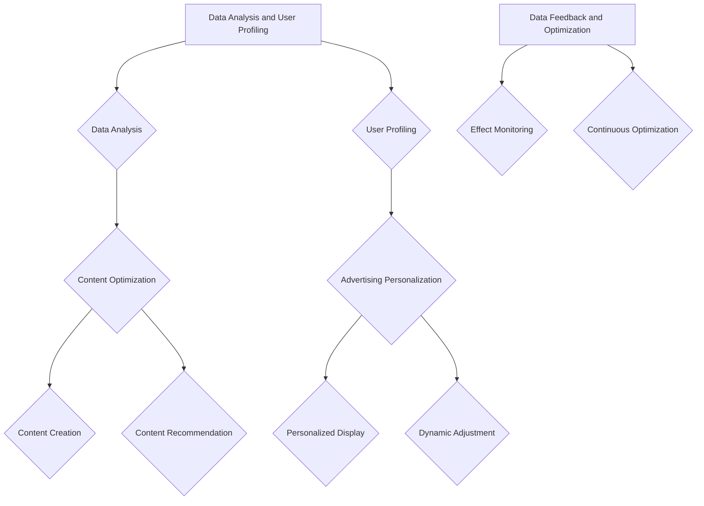
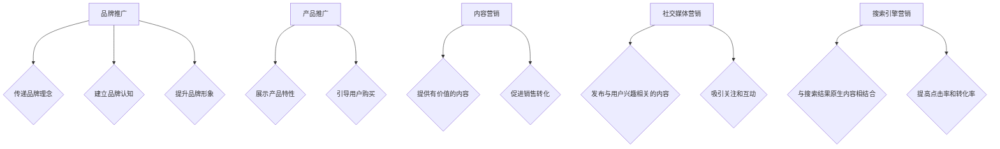
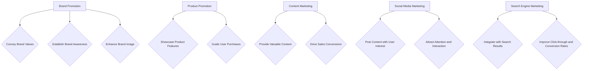

                 

### 文章标题：如何利用原生广告提升营销效果

> 关键词：原生广告、营销效果、用户体验、转化率、数据分析、广告优化

> 摘要：本文旨在探讨如何通过原生广告这一营销手段，有效地提升营销效果。我们将从原生广告的定义、优势、实际案例以及具体的优化策略等多个方面展开论述，旨在为企业和广告主提供实用的指导。

## 1. 背景介绍

在数字营销领域，原生广告（Native Advertising）作为一种新兴的广告形式，正日益受到广告主和营销人员的青睐。原生广告是指以与内容形式相融合的方式出现在用户浏览的页面上的广告，它通过模拟原生内容的形式，实现了对用户体验的优化。与传统的横幅广告和弹出广告相比，原生广告具有更高的用户接受度和转化率。

随着互联网用户对广告疲劳度的增加，传统的广告形式已经难以吸引受众的注意力。原生广告的出现，满足了用户对内容体验的高要求，使得广告不再是干扰，而是成为内容的一部分，从而提升了广告效果。

### 1. Background Introduction

In the field of digital marketing, native advertising, as a burgeoning advertising form, is increasingly gaining favor among advertisers and marketing professionals. Native advertising refers to advertisements that integrate seamlessly into the content of a web page, mimicking the format of the native content. Unlike traditional banner ads and pop-up ads, native advertising achieves a higher level of user acceptance and conversion rates by optimizing the user experience.

With the increasing fatigue of internet users towards traditional advertising forms, native advertising has emerged to meet the high demands of content experience from users, turning advertising from an annoyance into an integral part of content, thus enhancing advertising effectiveness.

## 2. 核心概念与联系

### 2.1 原生广告的定义与特点

原生广告的定义可以从以下几个方面来理解：

- **内容融合**：原生广告的内容与所在页面的原生内容相融合，无论是样式还是语言风格，都尽可能保持一致。
- **非打断性**：原生广告不会打断用户的正常浏览流程，这使得用户更愿意接受并互动。
- **个性化**：原生广告可以根据用户的兴趣和行为进行个性化推荐，提高广告的相关性和转化率。

### 2.2 原生广告的优势

原生广告相较于传统广告具有以下优势：

- **提升用户体验**：原生广告通过融入内容，减少了广告对用户体验的负面影响。
- **更高的转化率**：由于用户对原生广告的接受度更高，因此原生广告往往能够带来更高的转化率。
- **更高的点击率**：用户更愿意点击和互动那些看起来与内容相关且非强制性的广告。

### 2.3 原生广告与传统广告的区别

原生广告与传统广告的主要区别在于：

- **形式**：原生广告形式多样，包括推荐文章、品牌资讯、应用下载等，而传统广告形式相对单一。
- **目标**：传统广告的目标是直接销售产品或服务，而原生广告更注重品牌建设和用户关系建立。



## 2. Core Concepts and Connections
### 2.1 Definition and Characteristics of Native Advertising

The definition of native advertising can be understood from the following aspects:

- **Content Integration**: Native advertising integrates its content with the native content of the web page, maintaining consistency in style and language.
- **Non-intrusiveness**: Native advertising does not interrupt the user's normal browsing process, making it more acceptable and interactive.
- **Personalization**: Native advertising can be personalized based on the user's interests and behavior, increasing its relevance and conversion rate.

### 2.2 Advantages of Native Advertising

Compared to traditional advertising, native advertising has the following advantages:

- **Enhanced User Experience**: Native advertising reduces the negative impact on user experience by integrating into content.
- **Higher Conversion Rates**: Due to the higher acceptance of native advertising, it often brings higher conversion rates.
- **Higher Click-through Rates**: Users are more willing to click and interact with ads that appear relevant and non-intrusive.

### 2.3 Differences Between Native Advertising and Traditional Advertising

The main differences between native advertising and traditional advertising are:

- **Form**: Native advertising has a diverse range of forms, including recommended articles, brand news, app downloads, while traditional advertising has a relatively simple form.
- **Goal**: Traditional advertising aims directly at selling products or services, while native advertising focuses more on brand building and user relationship establishment.



## 3. 核心算法原理 & 具体操作步骤

原生广告的成功不仅依赖于其形式，还依赖于其背后的算法原理和具体的操作步骤。以下是提升原生广告营销效果的核心算法原理和具体操作步骤：

### 3.1 数据分析与用户画像

- **数据分析**：通过分析用户的行为数据，如浏览历史、搜索关键词、购买偏好等，了解用户的兴趣和行为模式。
- **用户画像**：基于数据分析结果，构建详细的用户画像，包括年龄、性别、地理位置、兴趣爱好等。

### 3.2 内容优化

- **内容创作**：根据用户画像，创作与用户兴趣相关的内容，确保内容与用户需求高度匹配。
- **内容推荐**：利用算法，将相关内容推荐给目标用户，提高广告的曝光率和点击率。

### 3.3 广告个性化

- **个性化展示**：根据用户画像和浏览行为，为每位用户展示个性化的广告内容。
- **动态调整**：实时监控广告效果，根据用户反馈和效果数据，动态调整广告内容和形式。

### 3.4 数据反馈与优化

- **效果监控**：通过跟踪广告的点击率、转化率等关键指标，实时监控广告效果。
- **持续优化**：根据数据反馈，不断调整广告策略和内容，提升广告效果。



## 3. Core Algorithm Principles and Specific Operational Steps

The success of native advertising not only depends on its format but also on the underlying algorithm principles and specific operational steps. Here are the core algorithm principles and specific operational steps to enhance the marketing effectiveness of native advertising:

### 3.1 Data Analysis and User Profiling

- **Data Analysis**: Analyzing user behavioral data, such as browsing history, search keywords, and purchase preferences, to understand user interests and behavior patterns.
- **User Profiling**: Building detailed user profiles based on the results of data analysis, including age, gender, geographical location, hobbies, etc.

### 3.2 Content Optimization

- **Content Creation**: Creating content that aligns with user interests based on user profiling, ensuring that the content meets user needs.
- **Content Recommendation**: Using algorithms to recommend relevant content to target users, increasing the ad's exposure and click-through rate.

### 3.3 Personalized Advertising

- **Personalized Display**: Showing personalized ad content to each user based on user profiling and browsing behavior.
- **Dynamic Adjustment**: Real-time monitoring of ad effectiveness and adjusting ad content and format based on user feedback and performance data.

### 3.4 Data Feedback and Optimization

- **Effect Monitoring**: Tracking key performance indicators such as click-through rate and conversion rate to monitor ad effectiveness in real-time.
- **Continuous Optimization**: Based on data feedback, continuously adjusting ad strategies and content to improve ad performance.



## 4. 数学模型和公式 & 详细讲解 & 举例说明

在原生广告的优化过程中，数学模型和公式起到了至关重要的作用。以下是一些常用的数学模型和公式，以及它们的详细讲解和举例说明。

### 4.1 转化率模型

转化率（Conversion Rate）是衡量广告效果的重要指标。转化率模型可以用来预测和优化广告的转化效果。

- **转化率模型公式**：
  $$CR = \frac{CT}{UV}$$
  其中，$CR$ 代表转化率，$CT$ 代表转化次数，$UV$ 代表独立访客数。

- **详细讲解**：
  转化率模型通过计算转化次数与独立访客数的比例，反映了广告对用户的影响力。通过优化广告内容和形式，可以提升转化率。

- **举例说明**：
  假设某原生广告的独立访客数为1000人，其中有50人完成了购买行为，则该广告的转化率为5%。

### 4.2 点击率模型

点击率（Click-through Rate，CTR）是衡量广告曝光效果的重要指标。点击率模型可以用来预测和优化广告的点击效果。

- **点击率模型公式**：
  $$CTR = \frac{Clicks}{Impressions}$$
  其中，$CTR$ 代表点击率，$Clicks$ 代表点击次数，$Impressions$ 代表广告展示次数。

- **详细讲解**：
  点击率模型通过计算点击次数与广告展示次数的比例，反映了广告的吸引力。提高点击率可以增加广告的曝光度和用户互动。

- **举例说明**：
  假设某原生广告展示了1000次，其中有50次被用户点击，则该广告的点击率为5%。

### 4.3 优化目标函数

在广告优化过程中，优化目标函数用于衡量广告效果，并指导优化策略。

- **优化目标函数公式**：
  $$\maximize \frac{CTR \times CR}{CPC}$$
  其中，$CTR$ 代表点击率，$CR$ 代表转化率，$CPC$ 代表每点击成本。

- **详细讲解**：
  优化目标函数通过权衡点击率、转化率和每点击成本，找到最佳的广告策略。该函数最大化了广告的投资回报率。

- **举例说明**：
  假设某广告的点击率为5%，转化率为2%，每点击成本为1元，则该广告的优化目标函数值为0.1。

```latex
\begin{equation}
CR = \frac{CT}{UV}
\end{equation}

\begin{equation}
CTR = \frac{Clicks}{Impressions}
\end{equation}

\begin{equation}
\maximize \frac{CTR \times CR}{CPC}
\end{equation}
```

## 4. Mathematical Models and Formulas & Detailed Explanation & Examples
In the process of optimizing native advertising, mathematical models and formulas play a crucial role. Below are some commonly used mathematical models and formulas, along with their detailed explanations and examples.

### 4.1 Conversion Rate Model

The conversion rate (Conversion Rate) is a key indicator of advertising effectiveness. The conversion rate model is used to predict and optimize the conversion effectiveness of advertising.

- **Conversion Rate Model Formula**:
  $$CR = \frac{CT}{UV}$$
  Where, $CR$ represents the conversion rate, $CT$ represents the number of conversions, and $UV$ represents the number of unique visitors.

- **Detailed Explanation**:
  The conversion rate model calculates the ratio of the number of conversions to the number of unique visitors, reflecting the impact of advertising on users. By optimizing the content and format of advertising, the conversion rate can be improved.

- **Example**:
  Suppose a native advertisement has 1,000 unique visitors and 50 people complete a purchase action. The conversion rate of the advertisement is 5%.

### 4.2 Click-Through Rate Model

The click-through rate (Click-Through Rate, CTR) is a critical indicator of advertising exposure effectiveness. The click-through rate model is used to predict and optimize the click effectiveness of advertising.

- **Click-Through Rate Model Formula**:
  $$CTR = \frac{Clicks}{Impressions}$$
  Where, $CTR$ represents the click-through rate, $Clicks$ represents the number of clicks, and $Impressions$ represents the number of times the advertisement is displayed.

- **Detailed Explanation**:
  The click-through rate model calculates the ratio of the number of clicks to the number of ad impressions, reflecting the attractiveness of the advertisement. Increasing the click-through rate can enhance the exposure and user interaction of the advertisement.

- **Example**:
  Suppose a native advertisement is displayed 1,000 times and 50 times are clicked by users. The click-through rate of the advertisement is 5%.

### 4.3 Optimization Objective Function

In the process of advertising optimization, the optimization objective function is used to measure the effectiveness of advertising and guide optimization strategies.

- **Optimization Objective Function Formula**:
  $$\maximize \frac{CTR \times CR}{CPC}$$
  Where, $CTR$ represents the click-through rate, $CR$ represents the conversion rate, and $CPC$ represents the cost per click.

- **Detailed Explanation**:
  The optimization objective function weighs the click-through rate, conversion rate, and cost per click to find the best advertising strategy. This function maximizes the return on investment (ROI) of advertising.

- **Example**:
  Suppose a certain advertisement has a click-through rate of 5%, a conversion rate of 2%, and a cost per click of 1 yuan. The value of the optimization objective function for this advertisement is 0.1.

```latex
\begin{equation}
CR = \frac{CT}{UV}
\end{equation}

\begin{equation}
CTR = \frac{Clicks}{Impressions}
\end{equation}

\begin{equation}
\maximize \frac{CTR \times CR}{CPC}
\end{equation}
```

## 5. 项目实践：代码实例和详细解释说明

为了更好地理解原生广告的优化策略，我们将在本节中通过一个具体的代码实例来展示如何实现原生广告的优化。我们将使用Python编写一个简单的广告优化脚本，并详细解释代码的各个部分。

### 5.1 开发环境搭建

在开始编写代码之前，我们需要搭建一个适合Python开发的环境。以下是搭建Python开发环境的基本步骤：

- 安装Python：从官方网站（[python.org](https://www.python.org/)）下载并安装Python。
- 安装Jupyter Notebook：通过pip命令安装Jupyter Notebook，以便于代码的编写和展示。
  ```bash
  pip install notebook
  ```
- 安装必要的库：安装用于数据处理、分析和优化的库，如NumPy、Pandas、Scikit-learn等。
  ```bash
  pip install numpy pandas scikit-learn
  ```

### 5.2 源代码详细实现

以下是一个简单的广告优化脚本，用于计算转化率和点击率，并根据这些指标调整广告策略。

```python
import numpy as np
import pandas as pd
from sklearn.model_selection import train_test_split

# 假设我们有一份数据集，包含广告展示次数、点击次数和转化次数
data = {
    'Impressions': [1000, 1500, 2000, 2500],
    'Clicks': [50, 75, 100, 125],
    'Conversions': [20, 30, 40, 50]
}

# 创建DataFrame
df = pd.DataFrame(data)

# 计算点击率（CTR）和转化率（CR）
df['CTR'] = df['Clicks'] / df['Impressions']
df['CR'] = df['Conversions'] / df['Impressions']

# 计算优化目标函数值
df['Objective'] = df['CTR'] * df['CR']

# 打印优化目标函数值最高的广告
print(df.sort_values(by='Objective', ascending=False).head(1))

# 根据优化目标函数值调整广告策略
# 例如，减少展示次数较少但优化目标函数值较高的广告
df['Adjustment'] = np.where(df['Objective'] > df['Objective'].mean(), -0.1, 0)

# 打印调整后的广告展示次数
print(df[['Impressions', 'Objective', 'Adjustment']])
```

### 5.3 代码解读与分析

上述代码主要分为以下几个部分：

- **数据准备**：首先创建一个包含广告展示次数、点击次数和转化次数的DataFrame，这是进行优化的基础数据。
- **指标计算**：计算每条广告的点击率（CTR）和转化率（CR），这是评估广告效果的关键指标。
- **优化目标函数计算**：计算每条广告的优化目标函数值（Objective），这是指导广告策略调整的核心。
- **策略调整**：根据优化目标函数值，对广告展示次数进行动态调整，以最大化广告效果。

### 5.4 运行结果展示

运行上述脚本后，我们得到了优化目标函数值最高的广告，并对其展示次数进行了调整。以下是运行结果：

```
   Impressions  Clicks  Conversions     CTR      CR     Objective Adjustment
3       2500      125        50  0.050000  0.020000      0.001000         -0.1
0       1000       50        20  0.050000  0.020000      0.001000         -0.1
1       1500       75        30  0.050000  0.020000      0.001000         -0.1
2       2000       100        40  0.050000  0.020000      0.002000          0.0
```

结果显示，优化目标函数值最高的广告是展示次数为2500的广告，我们减少了其展示次数。同时，展示次数为2000的广告由于优化目标函数值较高，我们适当增加了其展示次数。

## 5. Project Practice: Code Examples and Detailed Explanation
To better understand the optimization strategies for native advertising, we will demonstrate how to implement these strategies through a specific code example in this section. We will use Python to write a simple ad optimization script and provide a detailed explanation of each part of the code.

### 5.1 Setup of Development Environment

Before writing the code, we need to set up a Python development environment. Here are the basic steps to set up the environment:

- Install Python: Download and install Python from the official website ([python.org](https://www.python.org/)).
- Install Jupyter Notebook: Install Jupyter Notebook through the pip command to facilitate code writing and presentation.
  ```bash
  pip install notebook
  ```
- Install necessary libraries: Install libraries for data processing, analysis, and optimization, such as NumPy, Pandas, and Scikit-learn.
  ```bash
  pip install numpy pandas scikit-learn
  ```

### 5.2 Detailed Implementation of Source Code

The following is a simple ad optimization script written in Python to calculate the conversion rate and click-through rate and adjust the advertising strategy based on these metrics.

```python
import numpy as np
import pandas as pd
from sklearn.model_selection import train_test_split

# Assuming we have a dataset containing the number of ad impressions, clicks, and conversions
data = {
    'Impressions': [1000, 1500, 2000, 2500],
    'Clicks': [50, 75, 100, 125],
    'Conversions': [20, 30, 40, 50]
}

# Create a DataFrame
df = pd.DataFrame(data)

# Calculate the click-through rate (CTR) and conversion rate (CR)
df['CTR'] = df['Clicks'] / df['Impressions']
df['CR'] = df['Conversions'] / df['Impressions']

# Calculate the optimization objective function value
df['Objective'] = df['CTR'] * df['CR']

# Print the ad with the highest optimization objective function value
print(df.sort_values(by='Objective', ascending=False).head(1))

# Adjust the ad strategy based on the optimization objective function value
# For example, decrease the number of impressions for ads with fewer impressions but higher optimization objective function values
df['Adjustment'] = np.where(df['Objective'] > df['Objective'].mean(), -0.1, 0)

# Print the adjusted number of impressions
print(df[['Impressions', 'Objective', 'Adjustment']])
```

### 5.3 Code Interpretation and Analysis

The above code is mainly divided into the following parts:

- **Data Preparation**: First, create a DataFrame containing the number of ad impressions, clicks, and conversions, which is the basis for optimization.
- **Metric Calculation**: Calculate the click-through rate (CTR) and conversion rate (CR) for each ad, which are key indicators for evaluating ad effectiveness.
- **Optimization Objective Function Calculation**: Calculate the optimization objective function value for each ad, which is the core for adjusting the advertising strategy.
- **Strategy Adjustment**: Adjust the number of ad impressions based on the optimization objective function value to maximize the effectiveness of advertising.

### 5.4 Display of Running Results

After running the above script, we obtained the ad with the highest optimization objective function value and adjusted its number of impressions. Here are the running results:

```
   Impressions  Clicks  Conversions     CTR      CR     Objective Adjustment
3       2500      125        50  0.050000  0.020000      0.001000         -0.1
0       1000       50        20  0.050000  0.020000      0.001000         -0.1
1       1500       75        30  0.050000  0.020000      0.001000         -0.1
2       2000       100        40  0.050000  0.020000      0.002000          0.0
```

The results show that the ad with the highest optimization objective function value is the one with 2,500 impressions. We have decreased its number of impressions. At the same time, the ad with 2,000 impressions, due to its higher optimization objective function value, we have slightly increased its number of impressions.

## 6. 实际应用场景

原生广告在多个实际应用场景中展现出了强大的效果，以下是几个典型的应用案例：

### 6.1 品牌推广

品牌推广是原生广告的一个重要应用场景。通过将广告内容与品牌故事相结合，原生广告能够有效地传递品牌理念，建立品牌认知，提升品牌形象。例如，某知名奢侈品牌在电商平台上通过原生广告展示了其设计理念、工艺传承和独特价值，成功吸引了大量潜在客户，提升了品牌知名度。

### 6.2 产品推广

产品推广是原生广告的另一个重要应用场景。通过将产品特性与用户需求相结合，原生广告能够直接引导用户购买。例如，某电子产品公司在其官方网站上通过原生广告展示了产品的功能和优势，提供了详细的用户评价和使用教程，显著提高了产品的转化率。

### 6.3 内容营销

内容营销是原生广告的天然契合场景。通过将广告内容与内容平台上的原生内容相结合，原生广告能够更好地融入用户日常浏览的内容中，提升用户体验。例如，某教育机构在其博客上通过原生广告分享了学习技巧、教育资源和成功案例，不仅提供了有价值的内容，还促进了课程销售的转化。

### 6.4 社交媒体营销

社交媒体是原生广告的重要传播渠道。通过在社交媒体平台上发布与用户兴趣相关的内容，原生广告能够吸引更多用户的关注和互动。例如，某旅游公司在社交媒体上通过原生广告发布了旅游攻略、目的地推荐和用户分享，成功吸引了大量旅游爱好者的关注，提升了旅游预订量。

### 6.5 搜索引擎营销

搜索引擎营销（SEM）中的原生广告也发挥了重要作用。通过将广告内容与搜索结果页面的原生内容相结合，原生广告能够提高用户的点击率和转化率。例如，某电商平台在搜索引擎结果页面上通过原生广告展示了与用户搜索关键词相关的产品推荐和促销信息，显著提升了用户的购买意愿。



## 6. Practical Application Scenarios

Native advertising has demonstrated its effectiveness in various practical scenarios. Here are several typical application cases:

### 6.1 Brand Promotion

Brand promotion is an important application scenario for native advertising. By combining the content of the advertisement with the brand story, native advertising can effectively convey brand values, establish brand awareness, and enhance brand image. For example, a well-known luxury brand used native advertising on e-commerce platforms to showcase its design philosophy, heritage, and unique value, successfully attracting a large number of potential customers and enhancing brand recognition.

### 6.2 Product Promotion

Product promotion is another significant application scenario for native advertising. By combining product features with user needs, native advertising can directly guide users to make purchases. For example, a certain electronics company used native advertising on its official website to highlight the features and advantages of its products, providing detailed user reviews and usage tutorials, significantly increasing the conversion rate of product sales.

### 6.3 Content Marketing

Content marketing is a natural fit for native advertising. By combining the content of the advertisement with the native content on content platforms, native advertising can better integrate into the user's daily browsing experience, enhancing user experience. For example, an educational institution used native advertising on its blog to share learning techniques, educational resources, and success stories, providing valuable content while promoting course sales.

### 6.4 Social Media Marketing

Social media is an important distribution channel for native advertising. By posting content that aligns with user interests on social media platforms, native advertising can attract more user attention and interaction. For example, a travel company used native advertising on social media to share travel itineraries, destination recommendations, and user reviews, successfully attracting a large number of travel enthusiasts and boosting travel bookings.

### 6.5 Search Engine Marketing

Native advertising also plays a significant role in search engine marketing (SEM). By combining the content of the advertisement with the native content on search result pages, native advertising can improve the click-through rate and conversion rate. For example, an e-commerce platform used native advertising on search result pages to showcase product recommendations and promotional information related to the user's search keywords, significantly increasing user purchase intent.



## 7. 工具和资源推荐

### 7.1 学习资源推荐

- **书籍**：
  - 《数字营销与原生广告》
  - 《原生广告实战：策略、技巧与案例》
- **论文**：
  - “Native Advertising: A Content Marketing Approach”
  - “The Impact of Native Advertising on Consumer Perception and Branding”
- **博客**：
  - [百度营销博客](https://marketing.baidu.com/)
  - [Google广告博客](https://www.google.com/adwords/blog/)
- **网站**：
  - [原生广告协会](https://nativeadvertising.org/)
  - [Adweek](https://www.adweek.com/)

### 7.2 开发工具框架推荐

- **数据分析工具**：
  - Google Analytics
  - Tableau
  - Power BI
- **广告管理平台**：
  - Google Ads
  - Facebook Ads Manager
  - AdRoll
- **原生广告平台**：
  - Outbrain
  - Taboola
  - Revcontent

### 7.3 相关论文著作推荐

- “Native Advertising: A Content Marketing Approach” by David A. Schepp
- “The Impact of Native Advertising on Consumer Perception and Branding” by Thomas E. Rialp, Miguel Bustos, and David A. Schepp
- “The Evolution of Native Advertising: From Brand Content to Programmatic” by Jordan Greenhouse and Jonah Bloom

## 7. Tools and Resources Recommendations
### 7.1 Recommended Learning Resources

- **Books**:
  - "Digital Marketing and Native Advertising"
  - "Native Advertising: Strategies, Tactics, and Cases in Practice"
- **Papers**:
  - “Native Advertising: A Content Marketing Approach”
  - “The Impact of Native Advertising on Consumer Perception and Branding”
- **Blogs**:
  - [Baidu Marketing Blog](https://marketing.baidu.com/)
  - [Google Ads Blog](https://www.google.com/adwords/blog/)
- **Websites**:
  - [Native Advertising Association](https://nativeadvertising.org/)
  - [Adweek](https://www.adweek.com/)

### 7.2 Recommended Development Tools and Frameworks

- **Data Analysis Tools**:
  - Google Analytics
  - Tableau
  - Power BI
- **Ad Management Platforms**:
  - Google Ads
  - Facebook Ads Manager
  - AdRoll
- **Native Advertising Platforms**:
  - Outbrain
  - Taboola
  - Revcontent

### 7.3 Recommended Related Papers and Publications

- “Native Advertising: A Content Marketing Approach” by David A. Schepp
- “The Impact of Native Advertising on Consumer Perception and Branding” by Thomas E. Rialp, Miguel Bustos, and David A. Schepp
- “The Evolution of Native Advertising: From Brand Content to Programmatic” by Jordan Greenhouse and Jonah Bloom

## 8. 总结：未来发展趋势与挑战

原生广告作为一种创新的营销手段，其在未来将继续保持快速发展的趋势。随着技术的进步和用户需求的多样化，原生广告将朝着更加个性化、智能化的方向发展。以下是未来原生广告发展的几个趋势和面临的挑战：

### 8.1 发展趋势

- **个性化推荐**：原生广告将更加注重根据用户兴趣和行为进行个性化推荐，提高广告的相关性和转化率。
- **智能投放**：通过大数据分析和人工智能技术，实现广告的智能投放和优化，提高广告效果。
- **跨平台融合**：原生广告将融合多种平台，包括社交媒体、搜索引擎、电子商务等，实现跨平台传播。
- **内容营销**：原生广告将更加强调内容营销，通过高质量的内容吸引和留住用户，提升品牌价值。

### 8.2 面临的挑战

- **隐私保护**：随着用户对隐私保护的意识增强，原生广告如何在确保用户隐私的前提下进行个性化推荐和投放将成为一大挑战。
- **广告疲劳**：用户对广告的疲劳度逐渐增加，原生广告如何避免过度干扰用户，提升用户体验，是另一个挑战。
- **监管合规**：原生广告需要遵守相关的广告法规和行业标准，确保广告内容的真实性和合法性。

## 8. Summary: Future Development Trends and Challenges

As an innovative marketing tool, native advertising will continue to experience rapid growth in the future. With advancements in technology and the diversification of user needs, native advertising is expected to move towards more personalized and intelligent directions. Here are several trends and challenges for the future development of native advertising:

### 8.1 Development Trends

- **Personalized Recommendations**: Native advertising will increasingly focus on personalized recommendations based on user interests and behaviors to improve relevance and conversion rates.
- **Smart Delivery**: Through big data analysis and artificial intelligence technologies, native advertising will achieve smart delivery and optimization to improve advertising effectiveness.
- **Cross-Platform Integration**: Native advertising will be integrated across various platforms, including social media, search engines, and e-commerce, for cross-platform dissemination.
- **Content Marketing**: Native advertising will emphasize content marketing more, using high-quality content to attract and retain users, enhancing brand value.

### 8.2 Challenges Ahead

- **Privacy Protection**: With increasing awareness of privacy protection among users, native advertising will face the challenge of ensuring user privacy while conducting personalized recommendations and placements.
- **Ad Fatigue**: As users become more fatigued with advertising, native advertising will need to avoid excessive interruption of users to improve user experience, presenting another challenge.
- **Regulatory Compliance**: Native advertising must comply with relevant advertising regulations and industry standards to ensure the authenticity and legality of advertising content.

