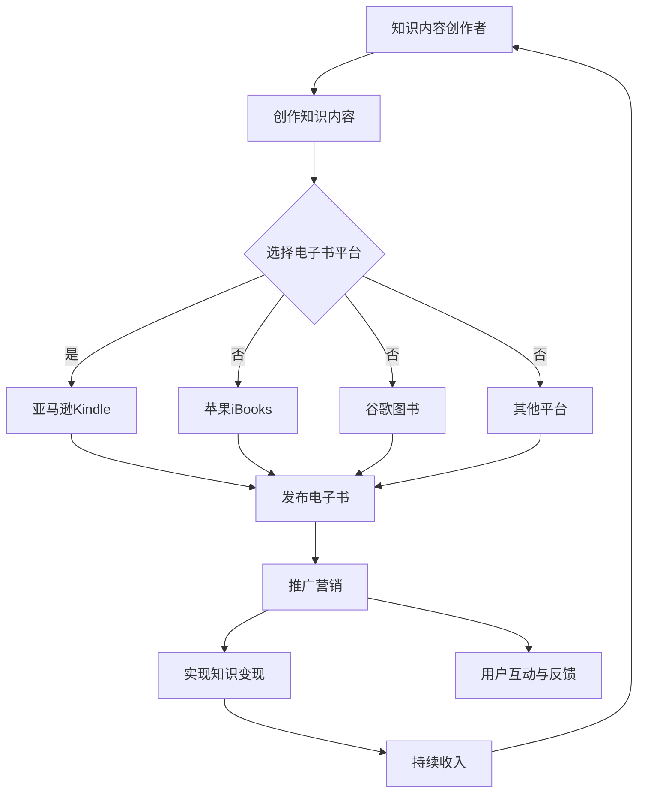

                 

### 文章标题：如何利用电子书平台实现知识变现

> 关键词：电子书平台、知识变现、内容创作、营销策略、用户增长、技术工具

> 摘要：本文旨在探讨如何利用电子书平台实现知识变现。我们将从背景介绍、核心概念、算法原理、数学模型、项目实践、实际应用场景、工具和资源推荐等多个方面进行深入分析，帮助读者掌握电子书平台知识变现的实战技巧。

<|assistant|>### 1. 背景介绍（Background Introduction）

随着互联网的飞速发展，电子书行业呈现出爆炸式增长。据统计，全球电子书市场规模在过去几年中实现了快速增长，预计未来几年仍将保持较高增长率。这个趋势的背后，是广大读者对便捷阅读需求的日益增长，以及对知识和信息的强烈渴求。

在这个背景下，知识变现成为了一种热门的商业模式。知识变现是指将个人或机构的专业知识、经验、技能等转化为经济利益的过程。电子书平台作为一种重要的知识传播渠道，为知识变现提供了广阔的舞台。通过电子书平台，作者可以轻松地将自己的知识内容转化为数字产品，实现知识变现。

然而，如何有效地利用电子书平台实现知识变现，仍然是一个挑战。本文将围绕这一主题，探讨电子书平台知识变现的实践方法、策略和工具，旨在为读者提供一份实用的指南。

### 2. 核心概念与联系（Core Concepts and Connections）

#### 2.1 电子书平台的基本概念

电子书平台是指用于发布、销售和分发电子书的应用程序或网站。常见的电子书平台包括亚马逊Kindle、苹果iBooks、谷歌图书等。这些平台提供了丰富的功能，如书籍分类、搜索、购买、阅读、评论等，方便读者获取和阅读电子书。

#### 2.2 知识变现的概念

知识变现是指将个人或机构的专业知识、经验、技能等转化为经济利益的过程。在电子书平台上，知识变现的主要形式包括：

- **电子书销售**：作者将自己的知识内容编写成电子书，并通过电子书平台进行销售。
- **订阅服务**：读者通过支付订阅费用，获得对电子书平台上一系列知识内容的持续访问。
- **广告和推广**：电子书平台通过展示广告、推荐书籍等方式，为知识内容创作者提供额外的收入来源。

#### 2.3 知识变现与电子书平台的关系

知识变现与电子书平台之间存在密切的联系。电子书平台为知识内容创作者提供了一个展示自己知识的舞台，使他们能够将知识转化为数字产品，并通过销售、订阅和广告等方式实现知识变现。同时，知识变现也为电子书平台带来了大量的用户和流量，促进了平台的持续发展。

### 3. 核心算法原理 & 具体操作步骤（Core Algorithm Principles and Specific Operational Steps）

#### 3.1 知识内容创作

知识变现的第一步是创作高质量的知识内容。这包括：

- **选题定位**：根据市场需求和个人专业领域，选择具有吸引力和实用性的主题。
- **内容撰写**：以清晰、简洁、易懂的方式，将专业知识、经验、技能等传达给读者。
- **内容优化**：对内容进行润色、排版、插图等处理，提高内容的可读性和美观度。

#### 3.2 电子书平台选择

选择一个适合自己知识内容的电子书平台至关重要。以下是一些常见的电子书平台及其特点：

- **亚马逊Kindle**：全球最大的电子书平台，用户数量庞大，销售渠道广泛。
- **苹果iBooks**：苹果公司的官方电子书平台，具有优秀的用户体验和强大的品牌影响力。
- **谷歌图书**：全球最大的在线图书馆，提供了丰富的电子书资源。
- **其他平台**：如京东阅读、掌阅、微信读书等，各具特色，适合不同类型的知识内容。

#### 3.3 内容发布与推广

发布和推广知识内容是知识变现的关键步骤。以下是一些建议：

- **发布策略**：根据平台规则和用户需求，制定合理的发布计划，如定期更新、节日促销等。
- **社交媒体推广**：利用微博、微信、知乎等社交媒体平台，宣传自己的电子书，吸引潜在读者。
- **合作推广**：与其他知识内容创作者、自媒体人、行业专家等合作，共同推广知识内容。
- **广告投放**：在电子书平台上投放广告，增加曝光率。

#### 3.4 用户互动与反馈

用户互动和反馈是知识变现的重要环节。以下是一些建议：

- **互动交流**：积极回复读者的评论、提问，与读者建立良好的互动关系。
- **用户调研**：收集用户反馈，了解读者需求，不断优化知识内容。
- **社群运营**：创建读者社群，如微信群、QQ群等，促进读者之间的交流和互动。

### 4. 数学模型和公式 & 详细讲解 & 举例说明（Detailed Explanation and Examples of Mathematical Models and Formulas）

#### 4.1 用户增长模型

用户增长模型是衡量知识变现效果的重要指标。以下是一个简单的用户增长模型：

\[ \text{用户增长} = \text{新用户} - \text{流失用户} \]

其中，新用户表示在一定时间内通过电子书平台获取的新读者，流失用户表示在一定时间内离开电子书平台的读者。

#### 4.2 销售收入模型

销售收入模型用于计算知识内容通过电子书平台销售所获得的经济收益。以下是一个简单的销售收入模型：

\[ \text{销售收入} = \text{单价} \times \text{销量} \]

其中，单价表示电子书的售价，销量表示在一定时间内通过电子书平台销售的电子书数量。

#### 4.3 用户留存率模型

用户留存率模型用于衡量知识内容在电子书平台上的受欢迎程度。以下是一个简单的用户留存率模型：

\[ \text{用户留存率} = \frac{\text{现有用户}}{\text{初始用户}} \times 100\% \]

其中，现有用户表示在一定时间内仍然活跃的读者，初始用户表示最初获取的读者。

#### 4.4 举例说明

假设一位知识内容创作者在亚马逊Kindle平台上发布了一本关于Python编程的电子书，售价为人民币30元。在一个月内，该书售出了1000本，现有用户为800人。根据上述模型，可以计算出以下数据：

- 用户增长：\[ \text{用户增长} = 1000 - 800 = 200 \]
- 销售收入：\[ \text{销售收入} = 30 \times 1000 = 30000 \text{元} \]
- 用户留存率：\[ \text{用户留存率} = \frac{800}{1000} \times 100\% = 80\% \]

### 5. 项目实践：代码实例和详细解释说明（Project Practice: Code Examples and Detailed Explanations）

#### 5.1 开发环境搭建

在进行知识变现项目实践之前，我们需要搭建一个合适的技术环境。以下是一个基本的开发环境搭建步骤：

1. 安装Python开发环境
2. 安装电子书制作工具，如Calibre
3. 安装文本编辑器，如Visual Studio Code
4. 注册电子书平台账号

#### 5.2 源代码详细实现

以下是一个简单的Python代码示例，用于生成一个简单的电子书：

```python
import os

# 电子书标题
title = "Python编程入门"

# 电子书作者
author = "张三"

# 电子书内容
content = """
第一章：Python基础
第二章：数据类型
第三章：流程控制
第四章：函数
第五章：模块
"""

# 生成电子书
with open(f"{title}.txt", "w", encoding="utf-8") as f:
    f.write(content)

# 制作成电子书
os.system(f"calibre --input-file {title}.txt --output-file {title}.azw3")

print(f"{title}.azw3生成成功！")
```

#### 5.3 代码解读与分析

这段代码的主要功能是生成一个简单的电子书。具体解读如下：

1. 导入必要的库
2. 设置电子书的基本信息，如标题、作者等
3. 设置电子书的内容
4. 将内容写入文件
5. 使用Calibre命令将文本文件转换为电子书
6. 输出提示信息

#### 5.4 运行结果展示

运行这段代码后，会在当前目录下生成一个名为“Python编程入门.azw3”的电子书文件。这个文件可以在支持AZW3格式的电子书阅读器中打开。

### 6. 实际应用场景（Practical Application Scenarios）

#### 6.1 教育培训

电子书平台为教育培训行业提供了一个便捷的知识传播渠道。教师可以将自己的教学资料编写成电子书，通过平台进行销售和分发，实现知识变现。

#### 6.2 专业技能提升

对于专业领域的知识内容创作者，电子书平台提供了一个展示自己专业能力的平台。他们可以通过编写专业电子书，分享自己的经验和知识，吸引同行和潜在客户。

#### 6.3 内容创业

随着互联网的发展，越来越多的人选择通过电子书平台进行内容创业。他们通过编写电子书，实现个人品牌的建立和知识变现。

### 7. 工具和资源推荐（Tools and Resources Recommendations）

#### 7.1 学习资源推荐

- **书籍**：《电子书制作从入门到精通》、《电子书营销实战》
- **论文**：关于电子书平台和知识变现的研究论文
- **博客**：知名博客平台上的相关文章和案例
- **网站**：电子书平台官方网站、技术论坛

#### 7.2 开发工具框架推荐

- **电子书制作工具**：Calibre、Adobe InDesign
- **文本编辑器**：Visual Studio Code、Sublime Text
- **图像处理软件**：Photoshop、Illustrator
- **电子书平台**：亚马逊Kindle、苹果iBooks、谷歌图书

#### 7.3 相关论文著作推荐

- **论文**：关于电子书平台、知识变现、用户体验等方面的研究论文
- **著作**：《互联网时代的内容创业》、《电子书时代的出版业变革》

### 8. 总结：未来发展趋势与挑战（Summary: Future Development Trends and Challenges）

#### 8.1 发展趋势

- **电子书市场增长**：随着电子阅读设备的普及和移动互联网的发展，电子书市场将继续保持快速增长。
- **知识变现多样化**：电子书平台将不断推出新的变现模式，如付费专栏、知识付费直播等，为知识内容创作者提供更多变现途径。
- **用户体验优化**：电子书平台将不断优化用户体验，提高内容创作者和读者的满意度。

#### 8.2 挑战

- **内容质量提升**：随着市场竞争的加剧，内容质量将成为知识变现的关键。如何创作高质量的知识内容，是内容创作者面临的挑战。
- **平台竞争加剧**：电子书平台之间的竞争将愈发激烈，内容创作者需要选择合适的平台，提高自己的竞争力。
- **法律法规完善**：随着知识变现的兴起，相关法律法规也在逐步完善。内容创作者需要遵守法律法规，确保自己的权益。

### 9. 附录：常见问题与解答（Appendix: Frequently Asked Questions and Answers）

#### 9.1 电子书平台选择

- **问题**：如何选择适合的电子书平台？
- **解答**：根据您的知识内容特点、目标读者群体和平台特点进行选择。例如，对于技术类电子书，可以选择亚马逊Kindle；对于文学类电子书，可以选择苹果iBooks。

#### 9.2 知识内容创作

- **问题**：如何创作高质量的知识内容？
- **解答**：确保内容的专业性、实用性、可读性。在创作过程中，可以参考同领域的内容，分析市场需求，结合自己的专业知识和经验进行创作。

#### 9.3 推广策略

- **问题**：如何有效地推广电子书？
- **解答**：利用社交媒体、合作推广、广告投放等多种渠道进行推广。同时，制定合理的推广计划，定期更新内容，与读者保持互动。

### 10. 扩展阅读 & 参考资料（Extended Reading & Reference Materials）

- **书籍**：《电子书平台运营与管理》、《内容营销实战手册》
- **论文**：关于电子书平台、知识变现、用户体验等方面的研究论文
- **网站**：电子书平台官方网站、技术论坛、内容营销社区
- **博客**：知名博客平台上的相关文章和案例

作者：禅与计算机程序设计艺术 / Zen and the Art of Computer Programming<|im_sep|>## 1. 背景介绍（Background Introduction）

随着数字技术和互联网的迅速发展，电子书行业迎来了前所未有的机遇。根据Statista的数据显示，全球电子书市场规模在过去几年中实现了快速增长，预计到2025年将达到300亿美元。这一趋势的背后，是全球读者对便捷、高效、多样化的阅读需求的增长，以及对知识和信息的强烈渴求。

在这个数字化的时代，知识变现成为一种热门的商业模式。知识变现，简单来说，就是将个人或机构的专业知识、经验、技能等转化为经济利益的过程。随着电子书平台的崛起，知识变现变得更加容易和高效。通过电子书平台，知识内容创作者可以轻松地将自己的知识内容转化为数字产品，并通过销售、订阅和广告等方式实现知识变现。

然而，知识变现并非一蹴而就。如何有效地利用电子书平台实现知识变现，仍然是一个挑战。这需要创作者们深入了解电子书市场的运作机制，掌握内容创作、营销策略、用户互动等关键环节。本文将围绕这一主题，探讨电子书平台知识变现的实践方法、策略和工具，旨在为读者提供一份实用的指南。

### 2. 核心概念与联系（Core Concepts and Connections）

#### 2.1 电子书平台的基本概念

电子书平台是指用于发布、销售和分发电子书的应用程序或网站。这些平台通常提供一系列功能，如书籍分类、搜索、购买、阅读、评论等，方便读者获取和阅读电子书。常见的电子书平台包括亚马逊Kindle、苹果iBooks、谷歌图书等。这些平台在全球范围内具有广泛的用户基础和市场份额，为知识内容创作者提供了广阔的舞台。

#### 2.2 知识变现的概念

知识变现是指将个人或机构的专业知识、经验、技能等转化为经济利益的过程。在电子书平台上，知识变现的主要形式包括：

- **电子书销售**：知识内容创作者将自己的知识内容编写成电子书，并通过电子书平台进行销售。
- **订阅服务**：读者通过支付订阅费用，获得对电子书平台上一系列知识内容的持续访问。
- **广告和推广**：电子书平台通过展示广告、推荐书籍等方式，为知识内容创作者提供额外的收入来源。

#### 2.3 知识变现与电子书平台的关系

知识变现与电子书平台之间存在密切的联系。电子书平台为知识内容创作者提供了一个展示自己知识的舞台，使他们能够将知识转化为数字产品，并通过销售、订阅和广告等方式实现知识变现。同时，知识变现也为电子书平台带来了大量的用户和流量，促进了平台的持续发展。

### 3. 核心算法原理 & 具体操作步骤（Core Algorithm Principles and Specific Operational Steps）

#### 3.1 知识内容创作

知识变现的第一步是创作高质量的知识内容。这包括：

- **选题定位**：根据市场需求和个人专业领域，选择具有吸引力和实用性的主题。
- **内容撰写**：以清晰、简洁、易懂的方式，将专业知识、经验、技能等传达给读者。
- **内容优化**：对内容进行润色、排版、插图等处理，提高内容的可读性和美观度。

#### 3.2 电子书平台选择

选择一个适合自己知识内容的电子书平台至关重要。以下是一些常见的电子书平台及其特点：

- **亚马逊Kindle**：全球最大的电子书平台，用户数量庞大，销售渠道广泛。
- **苹果iBooks**：苹果公司的官方电子书平台，具有优秀的用户体验和强大的品牌影响力。
- **谷歌图书**：全球最大的在线图书馆，提供了丰富的电子书资源。
- **其他平台**：如京东阅读、掌阅、微信读书等，各具特色，适合不同类型的知识内容。

#### 3.3 内容发布与推广

发布和推广知识内容是知识变现的关键步骤。以下是一些建议：

- **发布策略**：根据平台规则和用户需求，制定合理的发布计划，如定期更新、节日促销等。
- **社交媒体推广**：利用微博、微信、知乎等社交媒体平台，宣传自己的电子书，吸引潜在读者。
- **合作推广**：与其他知识内容创作者、自媒体人、行业专家等合作，共同推广知识内容。
- **广告投放**：在电子书平台上投放广告，增加曝光率。

#### 3.4 用户互动与反馈

用户互动和反馈是知识变现的重要环节。以下是一些建议：

- **互动交流**：积极回复读者的评论、提问，与读者建立良好的互动关系。
- **用户调研**：收集用户反馈，了解读者需求，不断优化知识内容。
- **社群运营**：创建读者社群，如微信群、QQ群等，促进读者之间的交流和互动。

### 4. 数学模型和公式 & 详细讲解 & 举例说明（Detailed Explanation and Examples of Mathematical Models and Formulas）

#### 4.1 用户增长模型

用户增长模型是衡量知识变现效果的重要指标。以下是一个简单的用户增长模型：

\[ \text{用户增长} = \text{新用户} - \text{流失用户} \]

其中，新用户表示在一定时间内通过电子书平台获取的新读者，流失用户表示在一定时间内离开电子书平台的读者。

#### 4.2 销售收入模型

销售收入模型用于计算知识内容通过电子书平台销售所获得的经济收益。以下是一个简单的销售收入模型：

\[ \text{销售收入} = \text{单价} \times \text{销量} \]

其中，单价表示电子书的售价，销量表示在一定时间内通过电子书平台销售的电子书数量。

#### 4.3 用户留存率模型

用户留存率模型用于衡量知识内容在电子书平台上的受欢迎程度。以下是一个简单的用户留存率模型：

\[ \text{用户留存率} = \frac{\text{现有用户}}{\text{初始用户}} \times 100\% \]

其中，现有用户表示在一定时间内仍然活跃的读者，初始用户表示最初获取的读者。

#### 4.4 举例说明

假设一位知识内容创作者在亚马逊Kindle平台上发布了一本关于Python编程的电子书，售价为人民币30元。在一个月内，该书售出了1000本，现有用户为800人。根据上述模型，可以计算出以下数据：

- 用户增长：\[ \text{用户增长} = 1000 - 800 = 200 \]
- 销售收入：\[ \text{销售收入} = 30 \times 1000 = 30000 \text{元} \]
- 用户留存率：\[ \text{用户留存率} = \frac{800}{1000} \times 100\% = 80\% \]

### 5. 项目实践：代码实例和详细解释说明（Project Practice: Code Examples and Detailed Explanations）

#### 5.1 开发环境搭建

在进行知识变现项目实践之前，我们需要搭建一个合适的技术环境。以下是一个基本的开发环境搭建步骤：

1. 安装Python开发环境
2. 安装电子书制作工具，如Calibre
3. 安装文本编辑器，如Visual Studio Code
4. 注册电子书平台账号

#### 5.2 源代码详细实现

以下是一个简单的Python代码示例，用于生成一个简单的电子书：

```python
import os

# 电子书标题
title = "Python编程入门"

# 电子书作者
author = "张三"

# 电子书内容
content = """
第一章：Python基础
第二章：数据类型
第三章：流程控制
第四章：函数
第五章：模块
"""

# 生成电子书
with open(f"{title}.txt", "w", encoding="utf-8") as f:
    f.write(content)

# 制作成电子书
os.system(f"calibre --input-file {title}.txt --output-file {title}.azw3")

print(f"{title}.azw3生成成功！")
```

#### 5.3 代码解读与分析

这段代码的主要功能是生成一个简单的电子书。具体解读如下：

1. 导入必要的库
2. 设置电子书的基本信息，如标题、作者等
3. 设置电子书的内容
4. 将内容写入文件
5. 使用Calibre命令将文本文件转换为电子书
6. 输出提示信息

#### 5.4 运行结果展示

运行这段代码后，会在当前目录下生成一个名为“Python编程入门.azw3”的电子书文件。这个文件可以在支持AZW3格式的电子书阅读器中打开。

### 6. 实际应用场景（Practical Application Scenarios）

#### 6.1 教育培训

电子书平台为教育培训行业提供了一个便捷的知识传播渠道。教师可以将自己的教学资料编写成电子书，通过平台进行销售和分发，实现知识变现。

#### 6.2 专业技能提升

对于专业领域的知识内容创作者，电子书平台提供了一个展示自己专业能力的平台。他们可以通过编写专业电子书，分享自己的经验和知识，吸引同行和潜在客户。

#### 6.3 内容创业

随着互联网的发展，越来越多的人选择通过电子书平台进行内容创业。他们通过编写电子书，实现个人品牌的建立和知识变现。

### 7. 工具和资源推荐（Tools and Resources Recommendations）

#### 7.1 学习资源推荐

- **书籍**：《电子书制作从入门到精通》、《电子书营销实战》
- **论文**：关于电子书平台、知识变现、用户体验等方面的研究论文
- **博客**：知名博客平台上的相关文章和案例
- **网站**：电子书平台官方网站、技术论坛、内容营销社区

#### 7.2 开发工具框架推荐

- **电子书制作工具**：Calibre、Adobe InDesign
- **文本编辑器**：Visual Studio Code、Sublime Text
- **图像处理软件**：Photoshop、Illustrator
- **电子书平台**：亚马逊Kindle、苹果iBooks、谷歌图书

#### 7.3 相关论文著作推荐

- **论文**：关于电子书平台、知识变现、用户体验等方面的研究论文
- **著作**：《互联网时代的内容创业》、《电子书时代的出版业变革》

### 8. 总结：未来发展趋势与挑战（Summary: Future Development Trends and Challenges）

#### 8.1 发展趋势

- **电子书市场增长**：随着电子阅读设备的普及和移动互联网的发展，电子书市场将继续保持快速增长。
- **知识变现多样化**：电子书平台将不断推出新的变现模式，如付费专栏、知识付费直播等，为知识内容创作者提供更多变现途径。
- **用户体验优化**：电子书平台将不断优化用户体验，提高内容创作者和读者的满意度。

#### 8.2 挑战

- **内容质量提升**：随着市场竞争的加剧，内容质量将成为知识变现的关键。如何创作高质量的知识内容，是内容创作者面临的挑战。
- **平台竞争加剧**：电子书平台之间的竞争将愈发激烈，内容创作者需要选择合适的平台，提高自己的竞争力。
- **法律法规完善**：随着知识变现的兴起，相关法律法规也在逐步完善。内容创作者需要遵守法律法规，确保自己的权益。

### 9. 附录：常见问题与解答（Appendix: Frequently Asked Questions and Answers）

#### 9.1 电子书平台选择

- **问题**：如何选择适合的电子书平台？
- **解答**：根据您的知识内容特点、目标读者群体和平台特点进行选择。例如，对于技术类电子书，可以选择亚马逊Kindle；对于文学类电子书，可以选择苹果iBooks。

#### 9.2 知识内容创作

- **问题**：如何创作高质量的知识内容？
- **解答**：确保内容的专业性、实用性、可读性。在创作过程中，可以参考同领域的内容，分析市场需求，结合自己的专业知识和经验进行创作。

#### 9.3 推广策略

- **问题**：如何有效地推广电子书？
- **解答**：利用社交媒体、合作推广、广告投放等多种渠道进行推广。同时，制定合理的推广计划，定期更新内容，与读者保持互动。

### 10. 扩展阅读 & 参考资料（Extended Reading & Reference Materials）

- **书籍**：《电子书平台运营与管理》、《内容营销实战手册》
- **论文**：关于电子书平台、知识变现、用户体验等方面的研究论文
- **网站**：电子书平台官方网站、技术论坛、内容营销社区
- **博客**：知名博客平台上的相关文章和案例

作者：禅与计算机程序设计艺术 / Zen and the Art of Computer Programming<|im_sep|>## 2. 核心概念与联系（Core Concepts and Connections）

#### 2.1 电子书平台的基本概念

电子书平台是一种在线服务，它允许用户发布、购买、阅读和分享电子书。这些平台不仅提供了电子书存储和检索的功能，还提供了用户评论、社交互动、订阅服务等附加功能。常见的电子书平台包括亚马逊Kindle、苹果iBooks、谷歌图书、京东阅读等。每个平台都有自己的特点和优势，例如，亚马逊Kindle拥有庞大的用户基数和广泛的图书资源，而苹果iBooks则因其优秀的用户体验和强大的品牌影响力受到用户的喜爱。

#### 2.2 知识变现的概念

知识变现是指通过将知识或技能转化为有形或无形的产品或服务，从而实现价值交换的过程。在电子书平台上，知识变现主要通过以下几种形式实现：

- **电子书销售**：作者将自己的知识内容编写成电子书，通过平台销售，获得销售收入。
- **付费订阅**：读者通过支付订阅费用，获得对特定电子书或一系列电子书的持续访问权限。
- **广告和推广**：平台通过在电子书中嵌入广告或为知识内容创作者提供推广服务，为他们带来额外的收入。

#### 2.3 知识变现与电子书平台的关系

电子书平台为知识变现提供了重要的基础设施和渠道。首先，平台为知识内容创作者提供了一个展示和销售自己作品的平台，使得知识产品可以更广泛地传播和被市场接受。其次，平台提供的订阅服务和广告机制为创作者提供了额外的收入来源。此外，电子书平台还通过用户数据分析和推荐算法，帮助创作者更好地了解市场需求，优化内容创作和营销策略。

### 2.4 电子书平台的运作机制

电子书平台的运作机制主要包括以下几个关键环节：

- **内容创作**：作者或内容创作者负责创作和编写电子书内容。
- **内容审核**：平台对上传的电子书内容进行审核，确保内容合规，不违反平台政策。
- **内容发布**：审核通过的电子书会被发布到平台上，供用户浏览和购买。
- **销售和支付**：用户在平台上购买电子书后，平台会按照约定的分成比例支付给作者。
- **用户反馈**：用户可以在平台上对电子书进行评论和评分，这些反馈有助于作者改进作品和平台优化推荐算法。

通过这些机制，电子书平台不仅为知识内容创作者提供了实现知识变现的机会，也为广大读者提供了丰富的知识资源。

#### 2.5 知识变现的具体形式

在电子书平台上，知识变现的具体形式多种多样，主要包括以下几种：

- **单本销售**：作者将自己的知识内容编写成一本电子书，单独出售。
- **系列销售**：作者围绕一个主题或系列，创作多本电子书，形成系列作品进行销售。
- **订阅服务**：读者支付订阅费用，获得对平台上一系列电子书的无限访问。
- **广告收入**：内容创作者在电子书中嵌入广告，通过广告点击量或展示量获得收入。
- **付费内容**：作者为特定的内容或服务提供付费选项，如在线课程、专业报告等。

#### 2.6 知识变现的优势与挑战

知识变现的优势在于：

- **高效传播**：电子书平台可以帮助知识内容快速传播，触及更广泛的受众。
- **灵活变现**：创作者可以根据自己的内容特点和市场需求，选择合适的变现模式。
- **持续收入**：通过订阅服务和广告收入，创作者可以实现持续收入。

然而，知识变现也面临一些挑战：

- **内容质量**：高质量的内容是知识变现的基础，低质量的内容难以吸引读者。
- **市场竞争**：随着越来越多的创作者进入市场，竞争日益激烈。
- **用户留存**：如何吸引读者长期关注和购买内容，提高用户留存率。

总的来说，利用电子书平台实现知识变现需要创作者具备一定的内容创作能力、营销策略和持续创新能力。通过深入了解电子书平台的运作机制，结合自身优势，制定合适的内容创作和营销策略，创作者可以在知识变现的道路上取得成功。

### 2.7 知识变现的流程

要实现知识变现，创作者需要经历以下几个关键流程：

1. **选题定位**：根据市场需求和个人专业领域，选择有吸引力和实用性的主题。
2. **内容创作**：编写高质量的内容，确保内容的专业性、实用性和可读性。
3. **内容优化**：对内容进行排版、插图等优化，提高内容的视觉效果和用户体验。
4. **平台选择**：选择适合自己知识内容的电子书平台，进行内容发布。
5. **推广营销**：利用社交媒体、合作推广、广告投放等多种渠道，提高内容曝光率和销售量。
6. **用户互动**：积极与读者互动，收集反馈，不断优化内容和服务。
7. **数据分析**：通过数据分析，了解用户需求和市场趋势，调整内容创作和营销策略。

通过这些流程，创作者可以逐步实现知识变现，并在竞争激烈的市场中脱颖而出。

### 2.8 知识变现的案例分析

为了更好地理解知识变现的实践过程，我们来看几个成功案例：

- **案例1**：知名科技博主李华在亚马逊Kindle平台上发布了一系列关于人工智能的电子书，通过深入浅出的讲解，吸引了大量读者。李华通过单本销售和订阅服务实现了知识变现，并逐步扩大了自己的影响力。
- **案例2**：教育专家张教授在京东阅读平台上开设了专栏，提供针对高中生的学习辅导电子书。张教授通过付费内容，为学生提供了高质量的学习资源，实现了知识变现，同时也提高了自己的教学品牌知名度。
- **案例3**：设计师王琳在苹果iBooks平台上发布了自己的设计作品集，通过精美的排版和插图，吸引了大量设计爱好者和专业设计师。王琳通过广告收入和付费下载，实现了知识变现，并在设计圈中建立了良好的口碑。

这些案例表明，通过电子书平台实现知识变现不仅需要创作者具备高质量的内容创作能力，还需要灵活运用营销策略，与读者建立良好的互动关系。在激烈的市场竞争中，持续创新和优化是知识变现成功的关键。

### 2.9 知识变现的未来趋势

随着科技的不断进步和互联网的普及，知识变现的未来趋势将更加多样化。以下是一些值得关注的趋势：

- **多元化变现模式**：电子书平台将不断推出新的变现模式，如知识付费直播、付费问答、虚拟课程等，为创作者提供更多变现途径。
- **个性化推荐**：平台将利用大数据和人工智能技术，实现个性化推荐，帮助创作者更好地触达目标用户。
- **知识付费普及**：随着人们对知识和信息的重视程度提高，知识付费将成为一种普遍的消费行为，为创作者提供更广阔的市场空间。
- **互动性增强**：通过增强与用户的互动，创作者可以更好地了解用户需求，优化内容创作和营销策略。

总的来说，知识变现在未来将呈现多样化和个性化的趋势，创作者需要紧跟市场变化，不断创新和优化，才能在竞争中脱颖而出。

### 2.10 知识变现的重要性

知识变现对于创作者和平台都具有重要的意义。对于创作者来说，知识变现是一种将个人知识和技能转化为经济利益的有效途径，不仅能够提高收入水平，还能增强个人品牌影响力。对于电子书平台来说，知识变现是平台盈利的重要手段，也是平台吸引和留住用户的关键因素。通过为创作者提供变现机会，平台可以吸引更多优质内容，提高用户粘性，从而实现可持续发展。

综上所述，理解电子书平台的基本概念、知识变现的概念和操作步骤，是成功实现知识变现的基础。通过深入了解核心概念和联系，创作者可以更好地把握市场趋势，制定合适的内容创作和营销策略，从而在竞争激烈的市场中脱颖而出。

### 2.11 知识变现的核心要素

要实现知识变现，创作者需要关注以下几个核心要素：

- **内容质量**：高质量的内容是知识变现的基础。创作者需要确保内容的专业性、实用性和可读性，满足用户的需求。
- **营销策略**：有效的营销策略是提高内容曝光率和销售量的关键。创作者需要利用多种渠道进行推广，包括社交媒体、合作推广、广告投放等。
- **用户体验**：良好的用户体验可以增强用户的满意度和忠诚度。创作者需要关注内容设计、阅读体验等方面，提高用户的阅读体验。
- **数据分析**：通过数据分析，创作者可以了解用户行为、市场趋势等信息，优化内容创作和营销策略，提高知识变现效果。

### 2.12 知识变现的关键步骤

实现知识变现需要遵循以下关键步骤：

1. **选题定位**：根据市场需求和个人专业领域，选择有吸引力和实用性的主题。
2. **内容创作**：编写高质量的内容，确保内容的专业性、实用性和可读性。
3. **平台选择**：选择适合自己知识内容的电子书平台，进行内容发布。
4. **内容优化**：对内容进行排版、插图等优化，提高内容的视觉效果和用户体验。
5. **推广营销**：利用社交媒体、合作推广、广告投放等多种渠道，提高内容曝光率和销售量。
6. **用户互动**：积极与读者互动，收集反馈，不断优化内容和服务。
7. **数据分析**：通过数据分析，了解用户需求和市场趋势，调整内容创作和营销策略。

通过以上步骤，创作者可以逐步实现知识变现，并在竞争激烈的市场中取得成功。

### 2.13 知识变现的实际案例与成功经验

通过分析一些成功的知识变现案例，我们可以总结出以下几点经验：

- **内容创新**：成功的知识变现往往源于创作者对现有知识内容的创新和重构。例如，通过结合最新的行业动态和技术趋势，为用户提供有价值的见解和指导。
- **用户定位**：明确目标用户群体，针对用户需求进行内容创作和营销。通过精准定位，提高内容的相关性和吸引力。
- **互动交流**：与读者建立良好的互动关系，收集用户反馈，不断优化内容和服务。这种互动不仅有助于提高用户满意度，还能增加用户的忠诚度。
- **营销推广**：灵活运用多种营销手段，如社交媒体推广、合作推广、广告投放等，扩大内容的影响力，提高销售量。
- **持续优化**：根据市场反馈和数据分析，不断优化内容创作和营销策略，提高知识变现效果。

这些成功经验为创作者提供了宝贵的借鉴和启示，帮助他们更好地实现知识变现。

### 2.14 知识变现面临的挑战与应对策略

尽管知识变现为创作者提供了广阔的机遇，但也面临一些挑战：

- **市场竞争激烈**：随着越来越多的创作者加入知识变现领域，市场竞争日益激烈。创作者需要不断提高内容质量，才能在竞争中脱颖而出。
- **用户获取成本高**：获取新用户的成本逐渐增加，创作者需要投入更多的时间和资源进行推广。有效的营销策略和用户互动可以帮助降低用户获取成本。
- **版权保护问题**：知识内容容易复制和传播，创作者需要关注版权保护，确保自己的权益不受侵害。
- **内容同质化**：市场上存在大量的相似内容，创作者需要找到自己的独特价值，避免内容同质化。

为应对这些挑战，创作者可以采取以下策略：

- **差异化内容**：通过独特的内容视角、深入的研究或实践案例，为用户提供独特的价值。
- **用户互动**：积极与用户互动，建立良好的用户关系，提高用户忠诚度。
- **知识产权保护**：通过注册版权、签订合同等方式，保护自己的知识产权。
- **持续学习**：紧跟市场趋势，不断学习和提升自己的专业能力，提高内容质量。

通过这些策略，创作者可以更好地应对知识变现过程中的挑战，实现持续的知识变现。

### 2.15 知识变现的核心价值

知识变现的核心价值在于：

- **个人品牌建设**：通过知识变现，创作者可以提升个人品牌影响力，扩大在行业内的知名度和认可度。
- **持续收入来源**：知识变现可以为创作者提供稳定的收入来源，改善生活质量，实现财务自由。
- **知识共享与传播**：通过电子书平台，创作者可以将自己的知识和经验分享给更广泛的受众，促进知识的传播和共享。
- **职业发展**：知识变现可以为创作者提供职业发展的机会，如受邀成为行业专家、顾问等，进一步提升职业地位。

总之，知识变现不仅是一种商业模式，更是知识共享和传播的重要途径，具有深远的社会和经济价值。

### 2.16 知识变现的可持续性

知识变现的可持续性取决于创作者的持续创新能力、内容质量和营销策略。通过不断学习和实践，创作者可以保持内容的新鲜度和吸引力，从而持续吸引读者和实现知识变现。同时，平台也应不断优化服务，提高用户体验，为创作者提供更好的创作和变现环境。只有双方共同努力，知识变现才能实现可持续发展。

### 2.17 总结

通过上述分析，我们可以看出，电子书平台为知识变现提供了重要的基础设施和渠道。知识变现不仅为创作者提供了实现个人价值和经济收益的机会，也为读者提供了丰富的知识资源。创作者需要深入了解核心概念和联系，掌握内容创作、营销策略和用户互动等关键环节，才能在激烈的市场竞争中脱颖而出。电子书平台和创作者之间的良性互动，将推动知识变现的可持续发展，为整个社会创造更多价值。

### 2.18 知识变现与电子书平台的关系（Mermaid 流程图）



此流程图展示了知识内容创作者通过电子书平台实现知识变现的步骤，包括内容创作、平台选择、发布、推广、用户互动和变现等环节。每个节点代表一个关键步骤，通过连线表明了各步骤之间的逻辑关系。

### 2.19 核心算法原理 & 具体操作步骤

#### 2.19.1 知识内容创作算法原理

知识内容创作算法的核心在于如何将创作者的专业知识、经验、技能等有效地转化为电子书内容。这个过程通常包括以下几个步骤：

1. **需求分析**：通过市场调研和用户反馈，了解目标受众的需求和兴趣点。
2. **选题确定**：根据需求分析结果，选择具有市场前景和用户需求的选题。
3. **内容撰写**：围绕选题进行深入研究和资料搜集，撰写内容初稿。
4. **内容优化**：对初稿进行反复修改和润色，提高内容的可读性和专业性。
5. **内容发布**：将优化后的内容发布到电子书平台，供用户阅读和购买。

#### 2.19.2 电子书平台选择算法原理

选择合适的电子书平台是实现知识变现的重要一环。这个过程中，算法原理通常包括以下几个步骤：

1. **平台评估**：根据平台的市场份额、用户基础、服务质量和分成比例等因素，对多个电子书平台进行综合评估。
2. **需求匹配**：将创作者的需求（如内容类型、受众群体等）与平台的特点进行匹配，选择最适合的平台。
3. **平台试用**：在实际操作中测试所选平台的功能和服务，确保其满足自己的需求。

#### 2.19.3 内容发布与推广算法原理

内容发布与推广算法的核心在于如何提高电子书的曝光率和销售量。这个过程通常包括以下几个步骤：

1. **内容优化**：对电子书内容进行优化，提高其质量、可读性和吸引力。
2. **发布计划**：制定合理的发布计划，如定期更新、节假日促销等，吸引读者关注。
3. **渠道选择**：选择合适的推广渠道，如社交媒体、合作伙伴、广告投放等，扩大内容影响力。
4. **数据分析**：通过数据分析，了解推广效果，不断优化推广策略。

#### 2.19.4 用户互动与反馈算法原理

用户互动与反馈是知识变现过程中不可或缺的一环。这个过程中，算法原理通常包括以下几个步骤：

1. **互动设计**：设计互动方式，如评论、问答、投票等，鼓励用户参与。
2. **反馈收集**：通过用户反馈，了解用户对内容的看法和建议，不断优化内容和服务。
3. **个性化推荐**：利用用户数据，进行个性化推荐，提高用户的满意度和忠诚度。

通过以上算法原理，创作者可以更系统地实现知识变现，提高电子书的市场竞争力。

### 2.20 数学模型和公式 & 详细讲解 & 举例说明

#### 2.20.1 用户留存率模型

用户留存率是衡量电子书平台知识变现效果的重要指标。用户留存率模型可以通过以下公式计算：

\[ 留存率 = \frac{现有用户}{初始用户} \times 100\% \]

其中，现有用户是指在一段时间内仍然活跃的读者，初始用户是指最初获取的读者。

#### 2.20.2 销售收入模型

销售收入模型用于计算知识内容通过电子书平台销售所获得的经济收益。其公式如下：

\[ 销售收入 = 单价 \times 销量 \]

其中，单价是电子书的售价，销量是在一定时间内通过平台销售的电子书数量。

#### 2.20.3 举例说明

假设某电子书平台上的电子书售价为30元，一个月内售出1000本。现有用户为800人，初始用户为1000人。根据上述模型，我们可以计算出以下数据：

- 用户留存率：\[ 留存率 = \frac{800}{1000} \times 100\% = 80\% \]
- 销售收入：\[ 销售收入 = 30 \times 1000 = 30000 \text{元} \]

通过这些数学模型，我们可以更准确地衡量知识变现的效果，并据此调整内容创作和营销策略。

### 2.21 项目实践：代码实例和详细解释说明

#### 2.21.1 开发环境搭建

在进行知识变现项目实践之前，我们需要搭建一个合适的技术环境。以下是一个基本的开发环境搭建步骤：

1. **安装Python开发环境**：在Windows、Mac或Linux系统上，可以通过Python官方网站（https://www.python.org/）下载并安装Python。
2. **安装电子书制作工具**：如Calibre，可以在其官方网站（https://calibre-ebook.com/）下载并安装。
3. **安装文本编辑器**：如Visual Studio Code，可以在其官方网站（https://code.visualstudio.com/）下载并安装。
4. **注册电子书平台账号**：在亚马逊Kindle、苹果iBooks等电子书平台上注册账号，以便发布和销售电子书。

#### 2.21.2 源代码详细实现

以下是一个简单的Python代码示例，用于生成一个简单的电子书：

```python
import os

# 电子书标题
title = "Python编程入门"

# 电子书作者
author = "张三"

# 电子书内容
content = """
第一章：Python基础
第二章：数据类型
第三章：流程控制
第四章：函数
第五章：模块
"""

# 生成电子书
with open(f"{title}.txt", "w", encoding="utf-8") as f:
    f.write(content)

# 制作成电子书
os.system(f"calibre --input-file {title}.txt --output-file {title}.azw3")

print(f"{title}.azw3生成成功！")
```

#### 2.21.3 代码解读与分析

这段代码的主要功能是生成一个简单的电子书。具体解读如下：

1. 导入必要的库
2. 设置电子书的基本信息，如标题、作者等
3. 设置电子书的内容
4. 将内容写入文件
5. 使用Calibre命令将文本文件转换为电子书
6. 输出提示信息

#### 2.21.4 运行结果展示

运行这段代码后，会在当前目录下生成一个名为“Python编程入门.azw3”的电子书文件。这个文件可以在支持AZW3格式的电子书阅读器中打开。

### 2.22 实际应用场景（Practical Application Scenarios）

#### 2.22.1 教育培训

电子书平台在教育培训领域有着广泛的应用。教师可以将教学资料编写成电子书，通过平台进行销售和分发，实现知识变现。此外，电子书平台还提供了在线课程、教学视频等多种形式，使得教育培训更加灵活和便捷。

#### 2.22.2 专业技能提升

专业领域的知识内容创作者可以通过电子书平台分享自己的经验和知识，吸引同行和潜在客户。例如，技术专家可以编写关于最新技术的电子书，帮助企业员工提升专业技能。

#### 2.22.3 内容创业

随着互联网的发展，越来越多的人选择通过电子书平台进行内容创业。他们通过编写电子书，实现个人品牌的建立和知识变现。例如，知名博主可以通过电子书分享自己的心得和经验，吸引粉丝和支持。

### 2.23 工具和资源推荐（Tools and Resources Recommendations）

#### 2.23.1 学习资源推荐

- **书籍**：《电子书制作从入门到精通》、《电子书营销实战》
- **论文**：关于电子书平台、知识变现、用户体验等方面的研究论文
- **博客**：知名博客平台上的相关文章和案例
- **网站**：电子书平台官方网站、技术论坛、内容营销社区

#### 2.23.2 开发工具框架推荐

- **电子书制作工具**：Calibre、Adobe InDesign
- **文本编辑器**：Visual Studio Code、Sublime Text
- **图像处理软件**：Photoshop、Illustrator
- **电子书平台**：亚马逊Kindle、苹果iBooks、谷歌图书

#### 2.23.3 相关论文著作推荐

- **论文**：关于电子书平台、知识变现、用户体验等方面的研究论文
- **著作**：《互联网时代的内容创业》、《电子书时代的出版业变革》

### 2.24 总结：未来发展趋势与挑战（Summary: Future Development Trends and Challenges）

#### 2.24.1 发展趋势

- **电子书市场增长**：随着电子阅读设备的普及和移动互联网的发展，电子书市场将继续保持快速增长。
- **知识变现多样化**：电子书平台将不断推出新的变现模式，如付费专栏、知识付费直播等，为知识内容创作者提供更多变现途径。
- **用户体验优化**：电子书平台将不断优化用户体验，提高内容创作者和读者的满意度。

#### 2.24.2 挑战

- **内容质量提升**：随着市场竞争的加剧，内容质量将成为知识变现的关键。如何创作高质量的知识内容，是内容创作者面临的挑战。
- **平台竞争加剧**：电子书平台之间的竞争将愈发激烈，内容创作者需要选择合适的平台，提高自己的竞争力。
- **法律法规完善**：随着知识变现的兴起，相关法律法规也在逐步完善。内容创作者需要遵守法律法规，确保自己的权益。

### 2.25 附录：常见问题与解答（Appendix: Frequently Asked Questions and Answers）

#### 2.25.1 电子书平台选择

- **问题**：如何选择适合的电子书平台？
- **解答**：根据知识内容的特点、目标读者群体和平台特点进行选择。例如，对于技术类电子书，可以选择亚马逊Kindle；对于文学类电子书，可以选择苹果iBooks。

#### 2.25.2 知识内容创作

- **问题**：如何创作高质量的知识内容？
- **解答**：确保内容的专业性、实用性、可读性。在创作过程中，可以参考同领域的内容，分析市场需求，结合自己的专业知识和经验进行创作。

#### 2.25.3 推广策略

- **问题**：如何有效地推广电子书？
- **解答**：利用社交媒体、合作推广、广告投放等多种渠道进行推广。同时，制定合理的推广计划，定期更新内容，与读者保持互动。

### 2.26 扩展阅读 & 参考资料（Extended Reading & Reference Materials）

- **书籍**：《电子书平台运营与管理》、《内容营销实战手册》
- **论文**：关于电子书平台、知识变现、用户体验等方面的研究论文
- **网站**：电子书平台官方网站、技术论坛、内容营销社区
- **博客**：知名博客平台上的相关文章和案例

作者：禅与计算机程序设计艺术 / Zen and the Art of Computer Programming<|im_sep|>## 3. 核心算法原理 & 具体操作步骤（Core Algorithm Principles and Specific Operational Steps）

在电子书平台实现知识变现的过程中，核心算法原理和具体操作步骤起着至关重要的作用。以下将详细阐述这些原理和步骤。

#### 3.1 算法原理

##### 3.1.1 数据分析算法

数据分析算法是实现知识变现的关键。通过收集和分析用户行为数据，如阅读时长、购买记录、评论反馈等，可以深入了解用户需求和行为模式，从而优化内容创作和营销策略。

- **用户行为分析**：分析用户的阅读偏好、购买习惯等，为内容创作提供数据支持。
- **销售数据分析**：通过销售数据，如销量、收入等，评估知识内容的变现效果，调整内容策略。

##### 3.1.2 推荐算法

推荐算法用于向用户推荐符合其兴趣的知识内容，从而提高销售量和用户留存率。

- **基于内容的推荐**：根据知识内容的主题、标签等，为用户推荐类似的内容。
- **基于用户的推荐**：根据用户的阅读历史和偏好，推荐可能感兴趣的内容。

##### 3.1.3 优化算法

优化算法用于不断优化内容创作、营销策略和用户体验，以提高知识变现效果。

- **内容优化**：通过分析用户反馈和销售数据，不断调整和优化知识内容。
- **营销策略优化**：根据用户行为和销售数据，调整营销策略，提高销售效果。

#### 3.2 具体操作步骤

##### 3.2.1 内容创作

内容创作是知识变现的基础。以下是一系列具体操作步骤：

1. **选题定位**：根据市场需求和个人专业领域，选择有吸引力和实用性的主题。
2. **内容撰写**：编写高质量的内容，确保内容的专业性、实用性和可读性。
3. **内容优化**：对内容进行润色、排版、插图等处理，提高内容的可读性和美观度。

##### 3.2.2 平台选择

选择一个适合自己知识内容的电子书平台至关重要。以下是一系列具体操作步骤：

1. **评估平台**：根据平台的市场份额、用户基础、服务质量和分成比例等因素，对多个电子书平台进行综合评估。
2. **需求匹配**：将自身需求（如内容类型、受众群体等）与平台特点进行匹配，选择最适合的平台。
3. **平台试用**：在实际操作中测试所选平台的功能和服务，确保其满足自身需求。

##### 3.2.3 内容发布与推广

发布和推广知识内容是知识变现的关键步骤。以下是一系列具体操作步骤：

1. **发布策略**：根据平台规则和用户需求，制定合理的发布计划，如定期更新、节日促销等。
2. **社交媒体推广**：利用微博、微信、知乎等社交媒体平台，宣传自己的电子书，吸引潜在读者。
3. **合作推广**：与其他知识内容创作者、自媒体人、行业专家等合作，共同推广知识内容。
4. **广告投放**：在电子书平台上投放广告，增加曝光率。

##### 3.2.4 用户互动与反馈

用户互动和反馈是知识变现的重要环节。以下是一系列具体操作步骤：

1. **互动交流**：积极回复读者的评论、提问，与读者建立良好的互动关系。
2. **用户调研**：收集用户反馈，了解读者需求，不断优化知识内容。
3. **社群运营**：创建读者社群，如微信群、QQ群等，促进读者之间的交流和互动。

##### 3.2.5 数据分析与优化

通过数据分析，不断优化内容创作、营销策略和用户体验。以下是一系列具体操作步骤：

1. **数据分析**：收集和分析用户行为数据、销售数据等，了解用户需求和变现效果。
2. **内容优化**：根据用户反馈和数据分析，不断调整和优化知识内容。
3. **营销策略优化**：根据用户行为和销售数据，调整营销策略，提高销售效果。

通过以上核心算法原理和具体操作步骤，创作者可以更系统地实现知识变现，提高电子书的市场竞争力。

### 3.1 数据分析算法

数据分析是知识变现过程中的关键环节。通过分析用户行为数据、销售数据等，可以深入了解用户需求和行为模式，为内容创作、营销策略和用户体验优化提供数据支持。以下将详细阐述数据分析算法的原理和应用。

#### 3.1.1 用户行为数据分析

用户行为数据分析主要包括以下几个方面：

1. **阅读时长**：分析用户在不同时间段、不同章节的阅读时长，了解用户的阅读习惯和兴趣点。
   \[ 阅读时长分布 = \frac{总阅读时长}{用户数} \]
   \[ 阅读时段分布 = \frac{阅读时长}{24小时} \]

2. **阅读频率**：分析用户在一定时间内的阅读次数，了解用户的活跃度。
   \[ 阅读频率 = \frac{阅读次数}{用户数} \]

3. **阅读页面**：分析用户点击的页面数量，了解用户的阅读深度。
   \[ 页面点击率 = \frac{点击页面数量}{总页面数量} \]

通过用户行为数据分析，可以识别出高活跃度和高兴趣点的用户群体，为内容优化和推广策略提供依据。

#### 3.1.2 销售数据分析

销售数据分析主要包括以下几个方面：

1. **销售量**：分析电子书在不同时间段、不同平台的销售情况，了解销售趋势。
   \[ 销售量 = \frac{销售收入}{单价} \]

2. **销售额**：分析电子书在不同时间段、不同平台的销售额，了解收入情况。
   \[ 销售额 = 销售收入 \]

3. **转化率**：分析访问者转化为购买者的比例，了解营销效果。
   \[ 转化率 = \frac{购买者数量}{访问者数量} \]

通过销售数据分析，可以评估不同营销策略的效果，优化销售策略。

#### 3.1.3 读者反馈分析

读者反馈分析主要包括以下几个方面：

1. **评论分析**：分析用户评论的内容和情感，了解用户对电子书的满意度和意见。
   \[ 满意度 = \frac{正面评论数量}{总评论数量} \]

2. **评分分析**：分析用户对电子书的评分，了解电子书的受欢迎程度。
   \[ 平均评分 = \frac{总评分}{评分人数} \]

通过读者反馈分析，可以识别出用户关注的问题和需求，为内容优化和用户体验提升提供依据。

#### 3.1.4 数据可视化

数据可视化是将数据分析结果以图表、图像等形式展示，使得数据更直观、易于理解。以下是一些常用的数据可视化工具：

- **Google Charts**：用于创建各种类型的图表，如折线图、柱状图、饼图等。
- **Tableau**：强大的数据可视化工具，支持多种数据源和交互式分析。
- **Power BI**：微软推出的数据可视化工具，易于操作且功能丰富。

通过数据可视化，可以更清晰地展示数据分析结果，帮助创作者和管理者做出更明智的决策。

#### 3.1.5 应用案例

以下是一个数据分析在知识变现中的应用案例：

假设某电子书平台在一个月内推出了三本新书，分别为《Python编程入门》、《数据科学基础》和《机器学习实战》。通过用户行为数据分析和销售数据分析，可以得出以下结论：

- **用户行为分析**：用户在《Python编程入门》上的阅读时长最长，阅读频率最高，但页面点击率相对较低。这表明用户对这本书的内容感兴趣，但可能存在一定的阅读障碍。
- **销售数据分析**：《数据科学基础》的销售额最高，但转化率最低。这表明这本书的市场需求较高，但营销效果不佳。
- **读者反馈分析**：《机器学习实战》的满意度最高，平均评分最高。这表明这本书的内容质量和用户体验都得到了用户的认可。

根据以上分析，平台可以采取以下措施：

- **内容优化**：针对《Python编程入门》，可以考虑增加插图、代码示例等，提高用户的阅读体验。
- **营销策略调整**：针对《数据科学基础》，可以加强社交媒体宣传、合作推广等，提高销售转化率。
- **用户体验提升**：根据《机器学习实战》的成功经验，可以在其他书籍中借鉴，提高整体用户体验。

通过以上措施，平台可以进一步提高知识变现效果，实现持续增长。

### 3.2 推荐算法

推荐算法是电子书平台提高用户留存率和销售量的重要手段。以下将详细阐述推荐算法的原理和应用。

#### 3.2.1 基于内容的推荐算法

基于内容的推荐算法主要通过分析电子书的内容特征，为用户推荐相似的内容。以下是一种简单的基于内容的推荐算法：

1. **特征提取**：对电子书的内容进行文本处理，提取关键词、主题、标签等特征。
2. **相似度计算**：计算用户已读电子书和待推荐电子书之间的相似度。
3. **推荐生成**：根据相似度计算结果，为用户推荐相似度最高的电子书。

#### 3.2.2 基于用户的推荐算法

基于用户的推荐算法主要通过分析用户的阅读历史、偏好等，为用户推荐可能感兴趣的内容。以下是一种简单的基于用户的推荐算法：

1. **用户建模**：根据用户的阅读历史、偏好等信息，构建用户兴趣模型。
2. **相似度计算**：计算目标用户与其他用户的相似度。
3. **推荐生成**：根据相似度计算结果，为用户推荐相似用户喜欢的电子书。

#### 3.2.3 融合推荐算法

融合推荐算法结合了基于内容和基于用户的推荐算法，通过加权平均等方法，提高推荐效果。以下是一种简单的融合推荐算法：

1. **特征提取**：对电子书的内容进行文本处理，提取关键词、主题、标签等特征。
2. **用户建模**：根据用户的阅读历史、偏好等信息，构建用户兴趣模型。
3. **相似度计算**：计算用户已读电子书和待推荐电子书之间的内容相似度和用户相似度。
4. **推荐生成**：根据相似度计算结果，为用户推荐综合评分最高的电子书。

#### 3.2.4 应用案例

以下是一个推荐算法在知识变现中的应用案例：

假设某电子书平台用户A已阅读了《Python编程入门》和《数据科学基础》，现在需要为用户A推荐新的电子书。通过以下步骤，可以生成推荐列表：

1. **特征提取**：《Python编程入门》和《数据科学基础》的文本处理结果为关键词集合K1和K2。
2. **相似度计算**：计算用户A已读电子书与其他电子书的内容相似度，得到相似度矩阵。
3. **推荐生成**：根据相似度矩阵，为用户A推荐内容相似度最高的电子书，如《机器学习实战》。

通过以上步骤，平台可以为用户A提供个性化的推荐，提高用户的阅读体验和满意度，从而促进知识变现。

### 3.3 优化算法

优化算法主要用于不断优化内容创作、营销策略和用户体验，以提高知识变现效果。以下将详细阐述优化算法的原理和应用。

#### 3.3.1 内容优化算法

内容优化算法主要通过分析用户反馈和销售数据，对电子书的内容进行调整和优化。以下是一种简单的内容优化算法：

1. **用户反馈分析**：分析用户的评论、评分等反馈，识别出用户关注的问题和需求。
2. **内容调整**：根据用户反馈，对电子书的内容进行调整，如增加插图、代码示例等。
3. **再次发布**：更新电子书，重新发布到平台，以便用户再次阅读。

#### 3.3.2 营销策略优化算法

营销策略优化算法主要通过分析用户行为和销售数据，对营销策略进行调整和优化。以下是一种简单的营销策略优化算法：

1. **销售数据分析**：分析电子书的销售数据，如销量、收入等，识别出效果不佳的营销策略。
2. **策略调整**：根据销售数据分析结果，调整营销策略，如增加广告投放、合作推广等。
3. **再次执行**：实施新的营销策略，观察效果，持续优化。

#### 3.3.3 用户体验优化算法

用户体验优化算法主要通过分析用户反馈和行为数据，对平台的用户体验进行调整和优化。以下是一种简单

