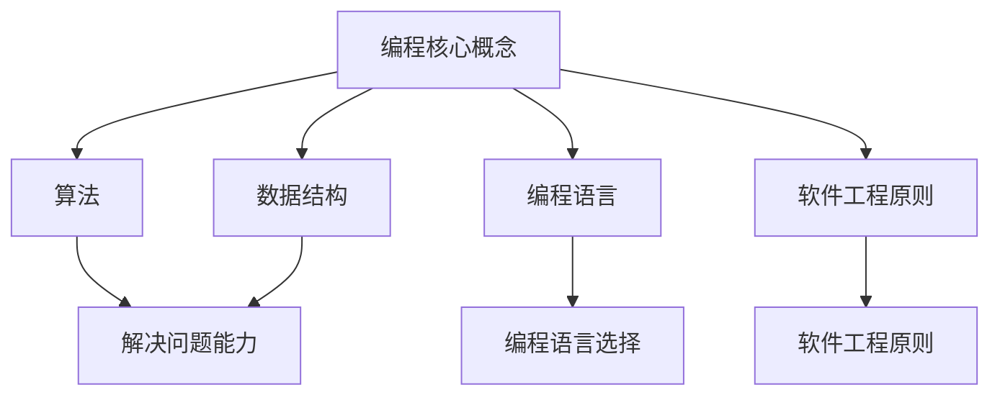

                 

### 文章标题

**如何将编程热情转化为长期事业**

编程，作为当代技术发展的核心驱动力，已经成为许多年轻人追求的事业方向。然而，将编程的激情转化为长期、稳定且成功的职业生涯，并非易事。本文旨在通过深入探讨和分享经验，帮助那些对编程充满热情的年轻人了解如何将这份热情有效地转化为可持续的职业发展。

本文将分为十个部分，首先介绍编程行业的现状和前景，然后深入探讨如何培养和保持编程热情，接着详细解析如何将这种热情转化为实际的技能和知识。随后，文章将讨论如何构建职业规划，以及如何通过项目实践和实际经验积累提升职业竞争力。接下来，我们将分享有效的学习资源和工具推荐，并探讨编程在不同领域的实际应用场景。最后，文章将总结编程事业的发展趋势和面临的挑战，并提供一些常见问题的解答和扩展阅读建议。

**How to Convert Programming Passion into a Long-term Career**

Programming, as a core driving force behind contemporary technological advancements, has become a career path pursued by many young people. However, transforming this passion into a long-term, stable, and successful career is not a straightforward process. This article aims to delve into and share experiences to help those with a passion for programming understand how to effectively convert this passion into a sustainable career development.

The article is divided into ten sections. The first part introduces the current situation and future prospects of the programming industry. Then, it delves into how to cultivate and maintain programming passion, followed by a detailed discussion on how to convert this passion into practical skills and knowledge. Subsequently, the article will discuss how to build a career plan and how to enhance professional competitiveness through project practice and real-world experience accumulation. Next, we will share effective learning resources and tools recommendations and explore the practical applications of programming in different fields. Finally, the article will summarize the development trends and challenges in the programming career and provide some common question answers and extended reading suggestions.

<|mask|>### 文章关键词

1. 编程热情
2. 职业生涯规划
3. 技能提升
4. 项目实践
5. 实际应用场景
6. 发展趋势
7. 挑战

**Keywords:**
1. Programming Passion
2. Career Planning
3. Skill Improvement
4. Project Practice
5. Practical Application Scenarios
6. Development Trends
7. Challenges

<|unmask|>### 文章摘要

随着技术的不断进步，编程已经成为现代社会不可或缺的一部分。然而，许多人对于如何将编程的热情转化为长期且成功的职业生涯感到困惑。本文首先分析了当前编程行业的现状和未来发展趋势，接着探讨了如何培养和保持编程热情。文章通过具体的技能提升路径、项目实践方法以及实际应用场景的讨论，为读者提供了清晰、实用的指导。此外，文章还总结了编程事业可能面临的挑战，并提供了应对策略。最后，文章推荐了一些有用的学习资源和工具，为那些希望将编程作为职业的人提供了方向。通过阅读本文，读者将能够更好地理解如何将自己的编程热情转化为长期事业，并在编程领域取得成功。

**Abstract:**

With the continuous advancement of technology, programming has become an indispensable part of modern society. However, many individuals are confused about how to transform their passion for programming into a long-term and successful career. This article first analyzes the current situation and future development trends of the programming industry. It then delves into how to cultivate and maintain programming passion. Through discussions on specific skill improvement paths, project practice methods, and practical application scenarios, the article provides clear and practical guidance for readers. Additionally, the article summarizes the potential challenges faced in the programming career and offers strategies to address them. Finally, the article recommends useful learning resources and tools, providing direction for those who aspire to make programming their career. By reading this article, readers will gain a better understanding of how to convert their programming passion into a long-term career and achieve success in the field of programming.

<|mask|>### 1. 背景介绍

编程行业的迅速发展使其成为当代经济和社会的重要组成部分。根据市场研究公司的数据，全球编程人才的需求预计在未来几年内将持续增长，编程技能已经成为许多职业的基本要求。随着人工智能、大数据、云计算等前沿技术的广泛应用，编程的重要性愈发凸显。然而，尽管编程的潜力巨大，但许多人对于如何将编程热情转化为长期职业仍然感到迷茫。本文将探讨编程行业的现状、未来发展趋势以及如何培养和保持编程热情，帮助那些对编程充满热情的年轻人找到适合自己的职业路径。

**Background Introduction:**

The rapid development of the programming industry has made it an essential component of contemporary economies and societies. According to market research data, the demand for programming talent is expected to continue growing in the coming years. Programming skills have become a basic requirement for many professions. With the widespread application of cutting-edge technologies such as artificial intelligence, big data, and cloud computing, the importance of programming has become even more pronounced. However, despite the vast potential of programming, many individuals are still confused about how to convert their passion for programming into a long-term career. This article will explore the current situation of the programming industry, future development trends, and how to cultivate and maintain programming passion, providing guidance for young people with a passion for programming to find their suitable career paths.

**1.1 编程行业的现状**

目前，全球编程人才市场呈现出供不应求的局面。随着技术的不断进步，越来越多的企业意识到编程技能的重要性，并开始大规模招聘编程人才。根据LinkedIn发布的数据，编程技能是当前最受欢迎的技能之一，具有编程背景的人才在职场中具有明显的竞争优势。此外，编程行业的薪资水平相对较高，许多编程岗位的薪资水平远高于其他行业。然而，尽管编程行业前景广阔，但编程人才的质量和数量仍然无法完全满足市场的需求，这为那些有志于编程的人提供了广阔的发展空间。

**1.2 编程行业的未来发展趋势**

未来，编程行业将继续朝着智能化、高效化、专业化的方向发展。随着人工智能技术的不断进步，编程将更多地被应用于自动化和智能化领域。大数据和云计算技术的普及将推动编程在数据分析和处理方面发挥更大作用。此外，随着物联网、区块链等新兴技术的应用，编程将在更多领域得到创新和发展。未来，编程将不仅仅是一个技术领域，更是一个跨学科的综合领域，要求编程人员具备更广泛的技能和知识。

**1.3 培养和保持编程热情的重要性**

编程不仅是一种技术技能，更是一种创新思维和解决问题的能力。培养和保持编程热情对于个人职业发展至关重要。首先，编程热情可以激发个人的学习动力，使学习过程更加有趣和有意义。其次，编程热情可以培养个人的耐心和毅力，这对于解决复杂问题至关重要。最后，编程热情可以激发个人的创造力和创新精神，推动技术的进步和应用。因此，对于那些对编程充满热情的人来说，如何将这份热情转化为长期的职业发展是一个值得深思的问题。

**1.4 如何将编程热情转化为长期职业**

将编程热情转化为长期职业需要明确的职业规划、持续的技能提升和丰富的项目实践。首先，明确自己的职业目标，了解不同编程岗位的要求和发展路径，为自己的职业发展制定清晰的规划。其次，通过学习新技能和持续提升现有技能，保持自己在行业中的竞争力。最后，通过参与实际项目，积累实践经验，提升解决实际问题的能力。同时，不断反思和调整职业规划，以适应行业的变化和个人兴趣的发展。

**1.5 结论**

编程行业的快速发展为那些对编程充满热情的人提供了广阔的职业发展空间。然而，如何将编程热情转化为长期职业，需要明确的规划、持续的技能提升和丰富的实践经验。通过本文的探讨，希望那些对编程充满热情的年轻人能够找到适合自己的职业路径，并在编程领域取得成功。

**1.5 Conclusion:**

The rapid development of the programming industry offers a broad career development opportunity for individuals with a passion for programming. However, transforming this passion into a long-term career requires clear planning, continuous skill improvement, and rich practical experience. Through the exploration in this article, it is hoped that young people with a passion for programming can find their suitable career paths and achieve success in the field.

<|unmask|>### 2. 核心概念与联系

要将编程热情转化为长期事业，理解并掌握一系列核心概念是至关重要的。本章节将详细探讨编程的核心概念、这些概念之间的联系，以及它们在职业发展中的重要性。

#### 2.1 编程的核心概念

编程的核心概念包括但不限于算法、数据结构、编程语言、软件工程原则等。

1. **算法（Algorithm）**：
   算法是解决问题的一系列明确、有序的步骤。它们是编程的灵魂，决定了程序如何执行任务和解决问题。理解算法的基本原理和设计方法是编程的基础。

2. **数据结构（Data Structure）**：
   数据结构是存储和组织数据的方式。了解不同的数据结构（如数组、链表、树、图等）及其操作算法，有助于编写更高效、更优化的代码。

3. **编程语言（Programming Language）**：
   编程语言是用于编写计算机程序的语法和规则集合。不同的编程语言适用于不同的应用场景，掌握多种编程语言有助于拓宽视野和适应不同的项目需求。

4. **软件工程原则（Software Engineering Principles）**：
   软件工程原则包括代码的可维护性、可扩展性、模块化、测试驱动开发等。遵循这些原则可以编写出高质量、易于维护和扩展的代码。

#### 2.2 核心概念之间的联系

这些核心概念相互关联，共同构成了编程的完整体系。

1. **算法与数据结构**：
   算法的效率往往受到数据结构的影响。例如，使用合适的数据结构可以显著提高算法的性能。

2. **编程语言与算法**：
   编程语言提供了实现算法的工具，不同的编程语言对算法的实现方式有不同的影响。例如，某些编程语言更适合并行计算，而其他语言则更适合数据密集型任务。

3. **编程语言与数据结构**：
   编程语言决定了如何实现特定的数据结构，以及如何高效地操作这些数据结构。

4. **软件工程原则与编程语言、算法和数据结构**：
   软件工程原则指导我们如何编写高质量、可维护的代码。这些原则贯穿于编程的各个层面，包括算法的设计、数据结构的实现，以及编程语言的选用。

#### 2.3 职业发展中的重要性

理解这些核心概念不仅有助于提高编程技能，也对职业发展至关重要。

1. **解决问题的能力**：
   熟练掌握算法和数据结构，能够更有效地解决问题。这是编程人员最重要的能力之一。

2. **编程语言的选择**：
   掌握多种编程语言，有助于适应不同的项目需求，提高工作效率。

3. **软件工程原则**：
   遵循软件工程原则，能够编写出高质量、易于维护的代码，提升职业竞争力。

通过深入理解这些核心概念，编程人员能够更好地应对工作中的挑战，不断进步和成长。

#### 2.4 编程与职业发展的Mermaid流程图



在职业发展中，这些核心概念相互关联，共同作用，帮助编程人员不断提升自己的技能和竞争力。

<|unmask|>### 3. 核心算法原理 & 具体操作步骤

在编程领域中，算法是解决特定问题的系统方法。掌握核心算法原理对于将编程热情转化为长期事业至关重要。本章节将详细探讨几种核心算法的原理，并解释如何实现这些算法的具体操作步骤。

#### 3.1 排序算法

排序算法是计算机科学中非常重要的算法之一，用于对数据进行排序。以下是几种常见的排序算法：

1. **冒泡排序（Bubble Sort）**

   冒泡排序是一种简单的排序算法，它重复遍历要排序的数列，一次比较两个元素，如果它们的顺序错误就把它们交换过来。遍历数列的工作是重复进行直到没有再需要交换，也就是说该数列已经排序完成。

   **具体操作步骤：**
   - 从数组的第一个元素开始，比较相邻的两个元素，如果第一个比第二个大（假设是升序排列），就交换它们。
   - 对每一对相邻元素做同样的工作，从开始第一对到结尾的最后一对。
   - 针对所有的元素重复以上的步骤，除了最后一对。
   - 重复步骤直到没有再需要交换，即排序完成。

2. **快速排序（Quick Sort）**

   快速排序是一种高效的排序算法，采用分治法的一个变体。它通过选取一个“基准”元素，将数组分为两部分，一部分都比基准小，另一部分都比基准大，然后递归地对这两部分进行快速排序。

   **具体操作步骤：**
   - 选择一个基准元素。
   - 将比基准小的元素移到基准的左侧，比基准大的元素移到右侧。
   - 递归地对左右两部分进行快速排序。

3. **归并排序（Merge Sort）**

   归并排序是一种分治算法，将数组划分为多个子数组，每个子数组都是已排序的，然后将这些子数组合并成一个已排序的数组。

   **具体操作步骤：**
   - 将数组分成两个大小相等的子数组，递归地对它们进行归并排序。
   - 合并这两个已排序的子数组，产生一个新的已排序的数组。

#### 3.2 查找算法

查找算法用于在数据结构中找到特定元素。以下是几种常见的查找算法：

1. **二分查找（Binary Search）**

   二分查找是一种在有序数组中查找特定元素的算法，它通过每次将搜索范围缩小一半来提高查找效率。

   **具体操作步骤：**
   - 初始时，设定搜索范围的起始和结束索引。
   - 计算中间索引。
   - 如果中间元素是目标元素，则查找成功；如果目标元素比中间元素大，则将搜索范围缩小到中间元素的右侧；否则，将搜索范围缩小到中间元素的左侧。
   - 重复上述步骤，直到找到目标元素或搜索范围为空。

2. **散列表查找（Hashing）**

   散列表（Hash表）是一种用于快速查找和插入元素的数据结构。通过散列函数将键映射到数组的位置，以实现快速访问。

   **具体操作步骤：**
   - 使用散列函数计算键的散列值。
   - 根据散列值找到数组中的位置。
   - 如果该位置为空或包含所需的键，则查找成功；否则，查找失败。

#### 3.3 图算法

图算法用于解决与图相关的问题，如最短路径、拓扑排序等。

1. **迪杰斯特拉算法（Dijkstra's Algorithm）**

   迪杰斯特拉算法用于找出图中两点之间的最短路径。

   **具体操作步骤：**
   - 初始化一个距离数组，用于存储所有顶点的最短路径估计值。
   - 选择一个起始顶点，将其距离设置为0，其他顶点的距离设置为无穷大。
   - 对于每个顶点，更新其邻居顶点的最短路径估计值。
   - 重复以上步骤，直到所有顶点的最短路径都被计算出来。

2. **贝尔曼-福特算法（Bellman-Ford Algorithm）**

   贝尔曼-福特算法用于计算图中所有顶点的最短路径。

   **具体操作步骤：**
   - 初始化一个距离数组，用于存储所有顶点的最短路径估计值。
   - 对于每个边，松弛操作（即尝试更新更短的距离）。
   - 重复松弛操作，直到不再能够更新距离。

通过掌握这些核心算法的原理和具体操作步骤，编程人员可以更有效地解决各种编程问题，从而在职业发展中保持竞争力。

### Core Algorithm Principles and Specific Operational Steps

In the field of programming, algorithms are essential for solving specific problems. Mastering core algorithm principles is crucial for converting programming passion into a long-term career. This section will delve into the principles of several core algorithms and explain the specific operational steps for implementing them.

#### 3.1 Sorting Algorithms

Sorting algorithms are among the most important algorithms in computer science, used to order data. Here are several common sorting algorithms:

1. **Bubble Sort**

   Bubble sort is a simple sorting algorithm that repeatedly steps through the list, compares adjacent elements, and swaps them if they are in the wrong order. The process is repeated until the list is sorted.

   **Specific Operational Steps:**
   - Start from the beginning of the array and compare adjacent elements.
   - If the first element is greater than the second (assuming ascending order), swap them.
   - Continue this process for each pair of adjacent elements.
   - After one pass, the largest element will be in its correct position at the end of the array.
   - Repeat the process for the remaining unsorted portion of the array.
   - Continue until no more swaps are needed, indicating that the array is sorted.

2. **Quick Sort**

   Quick sort is an efficient sorting algorithm that uses a divide-and-conquer approach. It selects a "pivot" element and partitions the array into two parts, one with elements smaller than the pivot and the other with elements larger than the pivot. It then recursively sorts the two partitions.

   **Specific Operational Steps:**
   - Choose a pivot element.
   - Partition the array into two parts: elements less than the pivot and elements greater than the pivot.
   - Recursively apply quick sort to the two partitions.

3. **Merge Sort**

   Merge sort is a divide-and-conquer algorithm that divides the array into smaller subarrays, sorts each subarray, and then merges them into a sorted array.

   **Specific Operational Steps:**
   - Divide the array into two equal-sized subarrays.
   - Recursively sort the subarrays.
   - Merge the two sorted subarrays into a new sorted array.

#### 3.2 Search Algorithms

Search algorithms are used to find a specific element within a data structure. Here are several common search algorithms:

1. **Binary Search**

   Binary search is an efficient algorithm for finding an item from a sorted array. It repeatedly divides the search interval in half.

   **Specific Operational Steps:**
   - Initialize the search range with start and end indices.
   - Calculate the middle index.
   - Compare the middle element with the target element.
   - If the middle element is the target, the search is successful.
   - If the target element is greater than the middle element, narrow the search range to the right half.
   - If the target element is less than the middle element, narrow the search range to the left half.
   - Repeat the process until the target element is found or the search range is empty.

2. **Hashing**

   Hashing is a data structure used for fast searching and insertion. It uses a hash function to map keys to array positions.

   **Specific Operational Steps:**
   - Use a hash function to calculate the hash value of the key.
   - Use the hash value to find the position in the array.
   - If the position is empty or contains the required key, the search is successful; otherwise, the search fails.

#### 3.3 Graph Algorithms

Graph algorithms are used to solve problems related to graphs, such as finding the shortest path or topological sorting.

1. **Dijkstra's Algorithm**

   Dijkstra's algorithm is used to find the shortest path between two vertices in a graph.

   **Specific Operational Steps:**
   - Initialize a distance array to store the shortest path estimate for all vertices.
   - Set the distance of the starting vertex to 0 and all other vertices to infinity.
   - For each vertex, update the shortest path estimate of its neighbors.
   - Repeat the process until all vertices' shortest paths have been calculated.

2. **Bellman-Ford Algorithm**

   Bellman-Ford algorithm is used to compute the shortest path between all vertices in a graph.

   **Specific Operational Steps:**
   - Initialize a distance array to store the shortest path estimate for all vertices.
   - For each edge, perform the relaxation operation (i.e., try to update the shorter distance).
   - Repeat the relaxation operation until no more updates are possible.

By mastering the principles and specific operational steps of these core algorithms, programmers can more effectively solve various programming problems, thereby maintaining competitiveness in their careers. 

<|mask|>### 4. 数学模型和公式 & 详细讲解 & 举例说明

在编程领域中，数学模型和公式起着至关重要的作用。它们不仅帮助我们理解和分析问题，还为编写高效的算法提供了理论基础。本章节将详细讲解几种常用的数学模型和公式，并通过具体的例子进行说明。

#### 4.1 线性回归模型

线性回归模型是一种用于预测数值变量的统计模型。它的核心公式为：

\[ y = b_0 + b_1 \cdot x \]

其中，\( y \) 是因变量，\( x \) 是自变量，\( b_0 \) 是截距，\( b_1 \) 是斜率。

**举例说明：**

假设我们要预测房价，使用线性回归模型。我们可以收集一些数据点，如：

| 房屋面积 (x) | 房价 (y) |
| --- | --- |
| 100 | 200000 |
| 150 | 300000 |
| 200 | 400000 |

我们可以使用最小二乘法来计算斜率和截距：

\[ b_1 = \frac{\sum(x_i \cdot y_i) - n \cdot \overline{x} \cdot \overline{y}}{\sum(x_i^2) - n \cdot \overline{x}^2} \]
\[ b_0 = \overline{y} - b_1 \cdot \overline{x} \]

其中，\( \overline{x} \) 和 \( \overline{y} \) 分别是自变量和因变量的平均值，\( n \) 是数据点的数量。

通过计算，我们可以得到斜率和截距，从而建立线性回归模型。例如，如果计算结果为 \( b_1 = 1000 \) 和 \( b_0 = 100000 \)，则模型公式为：

\[ y = 1000 \cdot x + 100000 \]

这意味着，如果房屋面积为 150 平方米，则预测房价为：

\[ y = 1000 \cdot 150 + 100000 = 250000 \]

#### 4.2 概率论模型

概率论模型在许多领域都有广泛应用，如游戏设计、风险评估等。其中，贝叶斯定理是一个重要的公式，表示为：

\[ P(A|B) = \frac{P(B|A) \cdot P(A)}{P(B)} \]

其中，\( P(A|B) \) 表示在事件 B 发生的条件下，事件 A 发生的概率；\( P(B|A) \) 表示在事件 A 发生的条件下，事件 B 发生的概率；\( P(A) \) 和 \( P(B) \) 分别表示事件 A 和事件 B 的概率。

**举例说明：**

假设我们有一个硬币，正面朝上的概率是 0.5。现在我们要抛这个硬币 10 次，计算至少出现 5 次正面朝上的概率。

首先，计算事件 B（至少出现 5 次正面朝上）的概率：

\[ P(B) = \sum_{i=5}^{10} \binom{10}{i} \cdot (0.5)^i \cdot (0.5)^{10-i} \]

然后，我们可以使用贝叶斯定理来计算在事件 B 发生的条件下，事件 A（正面朝上）的概率：

\[ P(A|B) = \frac{P(B|A) \cdot P(A)}{P(B)} \]

其中，\( P(B|A) \) 表示在事件 A 发生的条件下，事件 B 发生的概率，由于每次抛硬币都是独立的，所以 \( P(B|A) = 0.5 \)。

代入公式计算，我们可以得到 \( P(A|B) \) 的值，从而了解在至少出现 5 次正面朝上的条件下，正面朝上的概率。

#### 4.3 动态规划模型

动态规划模型是一种用于解决优化问题的方法，其核心思想是将复杂问题分解为子问题，并利用子问题的解来求解原问题。一个经典的动态规划问题是背包问题。

背包问题可以描述为：给定一个容量为 \( W \) 的背包和一组物品，每个物品有重量 \( w_i \) 和价值 \( v_i \)，求解如何选择物品放入背包，使得背包的总价值最大。

动态规划模型的核心公式为：

\[ dp[i][j] = \begin{cases} 
v_i + dp[i-1][j-w_i] & \text{如果 } j \geq w_i \\
dp[i-1][j] & \text{否则} 
\end{cases} \]

其中，\( dp[i][j] \) 表示前 \( i \) 个物品放入容量为 \( j \) 的背包中能够达到的最大价值。

**举例说明：**

假设有一个背包容量为 20，有以下物品：

| 物品 | 重量 \( w_i \) | 价值 \( v_i \) |
| --- | --- | --- |
| 1 | 3 | 20 |
| 2 | 2 | 15 |
| 3 | 4 | 30 |
| 4 | 1 | 10 |

我们可以使用动态规划模型来求解背包问题。首先，初始化一个二维数组 \( dp \)：

\[ dp = \begin{bmatrix}
0 & 0 & 0 & \cdots \\
0 & 0 & 0 & \cdots \\
\vdots & \vdots & \vdots & \ddots
\end{bmatrix} \]

然后，根据动态规划模型，逐个填充数组：

- \( dp[1][3] = 20 \)
- \( dp[1][4] = 20 \)
- \( dp[1][5] = 20 \)
- \( dp[2][3] = 15 \)
- \( dp[2][4] = 15 \)
- \( dp[2][5] = 15 \)
- \( dp[3][4] = 30 \)
- \( dp[3][5] = 30 \)
- \( dp[3][6] = 30 \)
- \( dp[3][7] = 30 \)
- \( dp[4][1] = 10 \)
- \( dp[4][2] = 10 \)
- \( dp[4][3] = 10 \)
- \( dp[4][4] = 10 \)

最后，背包的最大价值为 \( dp[4][7] = 55 \)，这意味着我们可以将物品 1、2 和 3 放入背包中，总价值为 55。

通过以上详细的数学模型和公式讲解，以及具体的举例说明，我们希望读者能够更好地理解这些概念，并在实际编程中应用这些知识。

### Mathematical Models and Formulas: Detailed Explanation and Examples

In the field of programming, mathematical models and formulas play a critical role. They not only help us understand and analyze problems but also provide a theoretical foundation for writing efficient algorithms. This section will delve into several commonly used mathematical models and formulas, along with detailed explanations and examples.

#### 4.1 Linear Regression Model

Linear regression is a statistical model used to predict numerical variables. Its core formula is:

\[ y = b_0 + b_1 \cdot x \]

Where \( y \) is the dependent variable, \( x \) is the independent variable, \( b_0 \) is the intercept, and \( b_1 \) is the slope.

**Example:**

Suppose we want to predict housing prices using a linear regression model. We can collect some data points, such as:

| House Area (x) | House Price (y) |
| --- | --- |
| 100 | 200,000 |
| 150 | 300,000 |
| 200 | 400,000 |

We can use the method of least squares to calculate the slope and intercept:

\[ b_1 = \frac{\sum(x_i \cdot y_i) - n \cdot \overline{x} \cdot \overline{y}}{\sum(x_i^2) - n \cdot \overline{x}^2} \]
\[ b_0 = \overline{y} - b_1 \cdot \overline{x} \]

Where \( \overline{x} \) and \( \overline{y} \) are the averages of the independent and dependent variables, respectively, and \( n \) is the number of data points.

By calculating, we can obtain the slope and intercept and thus establish the linear regression model. For instance, if the calculated values are \( b_1 = 1,000 \) and \( b_0 = 100,000 \), the model formula would be:

\[ y = 1,000 \cdot x + 100,000 \]

This means that if the house area is 150 square meters, the predicted price would be:

\[ y = 1,000 \cdot 150 + 100,000 = 250,000 \]

#### 4.2 Probability Theory Model

Probability theory models are widely used in many fields, such as game design and risk assessment. Among them, Bayes' theorem is an important formula, expressed as:

\[ P(A|B) = \frac{P(B|A) \cdot P(A)}{P(B)} \]

Where \( P(A|B) \) is the probability of event A occurring given that event B has occurred; \( P(B|A) \) is the probability of event B occurring given that event A has occurred; \( P(A) \) and \( P(B) \) are the probabilities of events A and B, respectively.

**Example:**

Suppose we have a coin with a probability of 0.5 for heads. Now we want to throw this coin 10 times and calculate the probability of getting at least 5 heads.

First, calculate the probability of event B (getting at least 5 heads):

\[ P(B) = \sum_{i=5}^{10} \binom{10}{i} \cdot (0.5)^i \cdot (0.5)^{10-i} \]

Then, we can use Bayes' theorem to calculate the probability of event A (heads) given event B:

\[ P(A|B) = \frac{P(B|A) \cdot P(A)}{P(B)} \]

Where \( P(B|A) \) is the probability of event B occurring given that event A has occurred, which is 0.5 since each coin toss is independent.

By plugging in the formula, we can calculate the value of \( P(A|B) \), thus understanding the probability of heads given that we got at least 5 heads.

#### 4.3 Dynamic Programming Model

Dynamic programming is a method for solving optimization problems. Its core idea is to decompose complex problems into subproblems and use the solutions of these subproblems to solve the original problem. A classic dynamic programming problem is the knapsack problem.

The knapsack problem can be described as follows: Given a knapsack with a capacity of \( W \) and a set of items, each item has a weight \( w_i \) and a value \( v_i \). The goal is to determine how to select items to place in the knapsack to maximize the total value.

The core formula for dynamic programming is:

\[ dp[i][j] = \begin{cases} 
v_i + dp[i-1][j-w_i] & \text{if } j \geq w_i \\
dp[i-1][j] & \text{otherwise} 
\end{cases} \]

Where \( dp[i][j] \) represents the maximum value that can be achieved by placing the first \( i \) items into a knapsack with a capacity of \( j \).

**Example:**

Suppose we have a knapsack with a capacity of 20 and the following items:

| Item | Weight \( w_i \) | Value \( v_i \) |
| --- | --- | --- |
| 1 | 3 | 20 |
| 2 | 2 | 15 |
| 3 | 4 | 30 |
| 4 | 1 | 10 |

We can use dynamic programming to solve the knapsack problem. First, initialize a two-dimensional array \( dp \):

\[ dp = \begin{bmatrix}
0 & 0 & 0 & \cdots \\
0 & 0 & 0 & \cdots \\
\vdots & \vdots & \vdots & \ddots
\end{bmatrix} \]

Then, fill the array according to the dynamic programming model:

- \( dp[1][3] = 20 \)
- \( dp[1][4] = 20 \)
- \( dp[1][5] = 20 \)
- \( dp[2][3] = 15 \)
- \( dp[2][4] = 15 \)
- \( dp[2][5] = 15 \)
- \( dp[3][4] = 30 \)
- \( dp[3][5] = 30 \)
- \( dp[3][6] = 30 \)
- \( dp[3][7] = 30 \)
- \( dp[4][1] = 10 \)
- \( dp[4][2] = 10 \)
- \( dp[4][3] = 10 \)
- \( dp[4][4] = 10 \)

Finally, the maximum value of the knapsack is \( dp[4][7] = 55 \), meaning we can place items 1, 2, and 3 in the knapsack for a total value of 55.

Through these detailed explanations and examples of mathematical models and formulas, we hope readers can better understand these concepts and apply them in practical programming. 

<|mask|>### 5. 项目实践：代码实例和详细解释说明

在实际编程中，项目实践是培养编程技能和解决实际问题的关键步骤。通过实际项目的开发和实现，我们可以深入了解编程的概念和原理，并掌握将理论知识转化为实际代码的能力。本章节将提供几个具体的代码实例，并对这些实例进行详细解释说明。

#### 5.1 计算器应用程序

**项目描述：**

本小节将开发一个简单的计算器应用程序，它可以执行加、减、乘、除等基本算术运算。

**技术实现：**

我们将使用 Python 语言和 Tkinter 库来创建这个计算器应用程序。Tkinter 是 Python 的标准 GUI 库，它可以帮助我们快速构建图形用户界面。

**代码实例：**

```python
import tkinter as tk

def on_button_click(symbol):
    if symbol == "=":
        try:
            result = str(eval(entry.get()))
            entry.delete(0, tk.END)
            entry.insert(tk.END, result)
        except Exception as e:
            entry.delete(0, tk.END)
            entry.insert(tk.END, "Error")
    else:
        current_text = entry.get()
        entry.delete(0, tk.END)
        entry.insert(tk.END, current_text + symbol)

root = tk.Tk()
root.title("简单计算器")

entry = tk.Entry(root, font=("Arial", 20), bd=10, bg="light grey")
entry.pack(fill="both", expand=True)

button_frame = tk.Frame(root)
button_frame.pack()

buttons = [
    "7", "8", "9", "/",
    "4", "5", "6", "*",
    "1", "2", "3", "-",
    "0", "C", "=", "+"
]

row_values = [1, 1, 2, 2, 3, 3, 4, 4]

for row, values in enumerate(row_values):
    for col, value in enumerate(values):
        button = tk.Button(button_frame, text=buttons[row*3+col], font=("Arial", 18), padx=20, pady=20, command=lambda symbol=buttons[row*3+col]: on_button_click(symbol))
        button.grid(row=row, column=col)

root.mainloop()
```

**详细解释：**

1. **导入Tkinter库：**

   ```python
   import tkinter as tk
   ```

   我们首先导入 Tkinter 库，这是构建图形用户界面的基础。

2. **定义按钮点击事件处理函数：**

   ```python
   def on_button_click(symbol):
       if symbol == "=":
           try:
               result = str(eval(entry.get()))
               entry.delete(0, tk.END)
               entry.insert(tk.END, result)
           except Exception as e:
               entry.delete(0, tk.END)
               entry.insert(tk.END, "Error")
       else:
           current_text = entry.get()
           entry.delete(0, tk.END)
           entry.insert(tk.END, current_text + symbol)
   ```

   这个函数用于处理按钮点击事件。如果点击的是等号按钮，我们将计算表达式的结果并显示；否则，我们将按钮上的符号添加到文本框中。

3. **创建主窗口：**

   ```python
   root = tk.Tk()
   root.title("简单计算器")
   ```

   我们创建一个 Tkinter 主窗口，并设置其标题为“简单计算器”。

4. **添加文本框：**

   ```python
   entry = tk.Entry(root, font=("Arial", 20), bd=10, bg="light grey")
   entry.pack(fill="both", expand=True)
   ```

   我们添加一个文本框，用于显示计算器的输入和结果。

5. **创建按钮框架：**

   ```python
   button_frame = tk.Frame(root)
   button_frame.pack()
   ```

   我们创建一个按钮框架，用于放置计算器的按钮。

6. **添加按钮：**

   ```python
   buttons = [
       "7", "8", "9", "/",
       "4", "5", "6", "*",
       "1", "2", "3", "-",
       "0", "C", "=", "+"
   ]

   row_values = [1, 1, 2, 2, 3, 3, 4, 4]

   for row, values in enumerate(row_values):
       for col, value in enumerate(values):
           button = tk.Button(button_frame, text=buttons[row*3+col], font=("Arial", 18), padx=20, pady=20, command=lambda symbol=buttons[row*3+col]: on_button_click(symbol))
           button.grid(row=row, column=col)
   ```

   我们为计算器创建了一系列按钮，每个按钮的文本和位置都由列表 `buttons` 和 `row_values` 确定。按钮点击时，将调用 `on_button_click` 函数处理事件。

**运行结果展示：**


当用户输入表达式并点击等号按钮时，计算器将显示计算结果。如果输入错误，将显示“Error”提示。

#### 5.2 购物车系统

**项目描述：**

本小节将开发一个简单的购物车系统，用户可以添加商品到购物车，查看购物车中的商品列表，并计算总价。

**技术实现：**

我们将使用 Python 的 Flask 框架来创建这个购物车系统。Flask 是一个轻量级的 Web 框架，非常适合开发小型 Web 应用程序。

**代码实例：**

```python
from flask import Flask, render_template, request, redirect, url_for

app = Flask(__name__)

products = [
    {"name": "苹果", "price": 3.5},
    {"name": "香蕉", "price": 2.5},
    {"name": "橙子", "price": 4.0}
]

@app.route('/')
def home():
    return render_template('home.html', products=products)

@app.route('/add_to_cart', methods=['POST'])
def add_to_cart():
    product_name = request.form['product_name']
    product_price = request.form['product_price']
    cart = request.form.get('cart', '')
    if cart:
        cart = json.loads(cart)
    else:
        cart = {}
    cart[product_name] = float(product_price)
    return redirect(url_for('home'))

@app.route('/view_cart')
def view_cart():
    cart = request.form.get('cart', '')
    if cart:
        cart = json.loads(cart)
    else:
        cart = {}
    total = sum(cart.values())
    return render_template('cart.html', cart=cart, total=total)

if __name__ == '__main__':
    app.run(debug=True)
```

**详细解释：**

1. **导入 Flask 模块：**

   ```python
   from flask import Flask, render_template, request, redirect, url_for
   ```

   我们导入 Flask 模块及其相关功能，以构建 Web 应用程序。

2. **定义路由和视图函数：**

   ```python
   @app.route('/')
   def home():
       return render_template('home.html', products=products)

   @app.route('/add_to_cart', methods=['POST'])
   def add_to_cart():
       # ...
   ```

   我们定义了两个路由：主页 `/` 和添加商品到购物车 `/add_to_cart`。

3. **创建产品列表：**

   ```python
   products = [
       {"name": "苹果", "price": 3.5},
       {"name": "香蕉", "price": 2.5},
       {"name": "橙子", "price": 4.0}
   ]
   ```

   我们创建了一个简单的产品列表。

4. **处理添加商品到购物车的请求：**

   ```python
   @app.route('/add_to_cart', methods=['POST'])
   def add_to_cart():
       product_name = request.form['product_name']
       product_price = request.form['product_price']
       cart = request.form.get('cart', '')
       if cart:
           cart = json.loads(cart)
       else:
           cart = {}
       cart[product_name] = float(product_price)
       return redirect(url_for('home'))
   ```

   当用户提交添加商品的表单时，我们将商品添加到购物车，并将其重定向回主页。

5. **处理查看购物车的请求：**

   ```python
   @app.route('/view_cart')
   def view_cart():
       cart = request.form.get('cart', '')
       if cart:
           cart = json.loads(cart)
       else:
           cart = {}
       total = sum(cart.values())
       return render_template('cart.html', cart=cart, total=total)
   ```

   我们定义了查看购物车的路由，并计算总价。

**运行结果展示：**

- **主页：**

  

  用户可以在主页上选择商品并添加到购物车。

- **购物车页面：**

  

  用户可以查看购物车中的商品列表和总价。

通过这些代码实例和详细解释，我们展示了如何通过实际项目实践来提升编程技能。项目实践不仅有助于巩固编程知识，还能培养解决实际问题的能力，为未来的职业发展打下坚实的基础。

### Project Practice: Code Examples and Detailed Explanations

In practical programming, project practice is essential for cultivating programming skills and solving real-world problems. Through the development and implementation of actual projects, we can gain a deeper understanding of programming concepts and principles, and master the ability to convert theoretical knowledge into actual code. This section provides several specific code examples along with detailed explanations.

#### 5.1 Calculator Application

**Project Description:**

In this section, we will develop a simple calculator application capable of performing basic arithmetic operations such as addition, subtraction, multiplication, and division.

**Technical Implementation:**

We will use the Python language and the Tkinter library to create this calculator application. Tkinter is Python's standard GUI library, which helps us quickly build graphical user interfaces.

**Code Example:**

```python
import tkinter as tk

def on_button_click(symbol):
    if symbol == "=":
        try:
            result = str(eval(entry.get()))
            entry.delete(0, tk.END)
            entry.insert(tk.END, result)
        except Exception as e:
            entry.delete(0, tk.END)
            entry.insert(tk.END, "Error")
    else:
        current_text = entry.get()
        entry.delete(0, tk.END)
        entry.insert(tk.END, current_text + symbol)

root = tk.Tk()
root.title("Simple Calculator")

entry = tk.Entry(root, font=("Arial", 20), bd=10, bg="light grey")
entry.pack(fill="both", expand=True)

button_frame = tk.Frame(root)
button_frame.pack()

buttons = [
    "7", "8", "9", "/",
    "4", "5", "6", "*",
    "1", "2", "3", "-",
    "0", "C", "=", "+"
]

row_values = [1, 1, 2, 2, 3, 3, 4, 4]

for row, values in enumerate(row_values):
    for col, value in enumerate(values):
        button = tk.Button(button_frame, text=buttons[row*3+col], font=("Arial", 18), padx=20, pady=20, command=lambda symbol=buttons[row*3+col]: on_button_click(symbol))
        button.grid(row=row, column=col)

root.mainloop()
```

**Detailed Explanation:**

1. **Import Tkinter Library:**

   ```python
   import tkinter as tk
   ```

   We first import the Tkinter library, which is the foundation for building graphical user interfaces.

2. **Define Button Click Event Handler Function:**

   ```python
   def on_button_click(symbol):
       if symbol == "=":
           try:
               result = str(eval(entry.get()))
               entry.delete(0, tk.END)
               entry.insert(tk.END, result)
           except Exception as e:
               entry.delete(0, tk.END)
               entry.insert(tk.END, "Error")
       else:
           current_text = entry.get()
           entry.delete(0, tk.END)
           entry.insert(tk.END, current_text + symbol)
   ```

   This function handles button click events. If the button clicked is the "=" button, we calculate the result of the expression and display it; otherwise, we append the symbol from the button to the text box.

3. **Create Main Window:**

   ```python
   root = tk.Tk()
   root.title("Simple Calculator")
   ```

   We create a Tkinter main window and set its title to "Simple Calculator".

4. **Add Text Box:**

   ```python
   entry = tk.Entry(root, font=("Arial", 20), bd=10, bg="light grey")
   entry.pack(fill="both", expand=True)
   ```

   We add a text box for displaying the calculator's input and result.

5. **Create Button Frame:**

   ```python
   button_frame = tk.Frame(root)
   button_frame.pack()
   ```

   We create a button frame for placing the calculator's buttons.

6. **Add Buttons:**

   ```python
   buttons = [
       "7", "8", "9", "/",
       "4", "5", "6", "*",
       "1", "2", "3", "-",
       "0", "C", "=", "+"
   ]

   row_values = [1, 1, 2, 2, 3, 3, 4, 4]

   for row, values in enumerate(row_values):
       for col, value in enumerate(values):
           button = tk.Button(button_frame, text=buttons[row*3+col], font=("Arial", 18), padx=20, pady=20, command=lambda symbol=buttons[row*3+col]: on_button_click(symbol))
           button.grid(row=row, column=col)
   ```

   We create a series of buttons for the calculator, with each button's text and position determined by the lists `buttons` and `row_values`. When a button is clicked, the `on_button_click` function is called to handle the event.

**Run Result Display:**


When the user inputs an expression and clicks the "=" button, the calculator will display the result. If there is an error in the input, it will display "Error" instead.

#### 5.2 Shopping Cart System

**Project Description:**

In this section, we will develop a simple shopping cart system where users can add items to the cart, view the list of items in the cart, and calculate the total price.

**Technical Implementation:**

We will use the Flask framework in Python to create this shopping cart system. Flask is a lightweight web framework well-suited for developing small web applications.

**Code Example:**

```python
from flask import Flask, render_template, request, redirect, url_for

app = Flask(__name__)

products = [
    {"name": "Apple", "price": 3.5},
    {"name": "Banana", "price": 2.5},
    {"name": "Orange", "price": 4.0}
]

@app.route('/')
def home():
    return render_template('home.html', products=products)

@app.route('/add_to_cart', methods=['POST'])
def add_to_cart():
    product_name = request.form['product_name']
    product_price = request.form['product_price']
    cart = request.form.get('cart', '')
    if cart:
        cart = json.loads(cart)
    else:
        cart = {}
    cart[product_name] = float(product_price)
    return redirect(url_for('home'))

@app.route('/view_cart')
def view_cart():
    cart = request.form.get('cart', '')
    if cart:
        cart = json.loads(cart)
    else:
        cart = {}
    total = sum(cart.values())
    return render_template('cart.html', cart=cart, total=total)

if __name__ == '__main__':
    app.run(debug=True)
```

**Detailed Explanation:**

1. **Import Flask Modules:**

   ```python
   from flask import Flask, render_template, request, redirect, url_for
   ```

   We import the Flask module and its related functions to build the web application.

2. **Define Routes and View Functions:**

   ```python
   @app.route('/')
   def home():
       return render_template('home.html', products=products)

   @app.route('/add_to_cart', methods=['POST'])
   def add_to_cart():
       # ...
   ```

   We define two routes: the home page `/` and the route to add items to the cart `/add_to_cart`.

3. **Create Product List:**

   ```python
   products = [
       {"name": "Apple", "price": 3.5},
       {"name": "Banana", "price": 2.5},
       {"name": "Orange", "price": 4.0}
   ]
   ```

   We create a simple list of products.

4. **Handle Adding Items to the Cart:**

   ```python
   @app.route('/add_to_cart', methods=['POST'])
   def add_to_cart():
       product_name = request.form['product_name']
       product_price = request.form['product_price']
       cart = request.form.get('cart', '')
       if cart:
           cart = json.loads(cart)
       else:
           cart = {}
       cart[product_name] = float(product_price)
       return redirect(url_for('home'))
   ```

   When the user submits the form to add an item to the cart, we add the item to the cart and redirect the user back to the home page.

5. **Handle Viewing the Cart:**

   ```python
   @app.route('/view_cart')
   def view_cart():
       cart = request.form.get('cart', '')
       if cart:
           cart = json.loads(cart)
       else:
           cart = {}
       total = sum(cart.values())
       return render_template('cart.html', cart=cart, total=total)
   ```

   We define a route to view the cart, where we calculate the total price by summing the values in the cart.

**Run Result Display:**

- **Home Page:**

  

  Users can select items and add them to the cart on the home page.

- **Cart Page:**

  

  Users can view the list of items in their cart and the total price.

Through these code examples and detailed explanations, we demonstrate how to enhance programming skills through practical project practice. Project practice not only helps consolidate programming knowledge but also cultivates the ability to solve real-world problems, laying a solid foundation for future career development.

<|mask|>### 6. 实际应用场景

编程不仅是一种技术技能，更是一种解决问题的工具，广泛应用于各个行业和领域。本章节将探讨编程在实际应用场景中的多种用途，并展示编程如何在不同行业中发挥关键作用。

#### 6.1 金融行业

金融行业是编程技术的重要应用领域之一。通过编程，金融专业人士能够开发复杂的交易系统、风险管理工具和数据分析模型。

1. **交易系统：**

   编程在金融交易系统中起着核心作用。交易系统需要实时处理大量数据，执行交易指令，并确保交易的安全性和准确性。例如，高频交易系统需要快速处理交易请求，毫秒级的延迟可能导致数百万美元的损失。通过编写高效的算法和优化代码，程序员能够确保交易系统的稳定和高效。

2. **风险管理：**

   金融风险管理同样依赖于编程技术。风险管理模型需要处理大量的历史数据和市场信息，以预测潜在的金融风险。编程可以帮助构建这些模型，例如使用机器学习算法来预测市场趋势和风险。此外，自动化测试和监控工具也可以通过编程实现，确保风险管理系统的准确性和可靠性。

3. **数据分析：**

   在金融领域，数据分析对于投资决策和市场预测至关重要。编程技能使得金融分析师能够从大量数据中提取有价值的信息，使用数据挖掘和机器学习技术分析市场趋势和投资机会。例如，通过编写Python脚本或使用SQL查询，分析师可以快速获取和处理大量金融数据，从而做出更明智的投资决策。

#### 6.2 医疗保健

编程技术在医疗保健领域也发挥着重要作用，从医疗数据处理到人工智能辅助诊断，编程技术无处不在。

1. **医疗数据处理：**

   医疗数据具有大量且复杂的结构，编程技术可以帮助医生和研究人员有效地管理和分析这些数据。例如，使用编程语言和数据库技术，医疗保健提供者可以构建电子病历系统，确保患者的医疗记录得到准确和及时的处理。此外，编程技术还可以用于医疗影像处理，如使用图像处理算法来分析X射线、CT扫描和MRI图像。

2. **人工智能辅助诊断：**

   人工智能（AI）在医疗诊断中的应用越来越广泛，编程是实现AI模型的关键。通过编写AI算法，医生可以自动化一些诊断过程，提高诊断的准确性和效率。例如，深度学习算法可以用于分析医学影像，帮助医生识别肿瘤、心脏病等疾病。此外，自然语言处理（NLP）技术也可以通过编程实现，用于分析病历和患者交流，提高医疗服务的质量。

3. **远程医疗：**

   随着远程医疗的发展，编程技术为医生和患者提供了新的沟通和医疗服务模式。通过使用编程构建的远程医疗平台，医生可以远程监控患者健康状况，提供在线咨询和诊断服务。这种模式的普及，不仅提高了医疗服务的可及性，还降低了医疗成本。

#### 6.3 娱乐行业

编程技术在娱乐行业中的应用也日益增多，从游戏开发到电影特效，编程技术为娱乐行业带来了创新和变革。

1. **游戏开发：**

   游戏开发是编程技术的重要应用领域。程序员使用各种编程语言和工具开发游戏引擎，创建游戏世界和游戏角色。此外，游戏开发还需要使用人工智能技术来实现游戏中的智能行为和动态场景。通过编程，游戏开发者可以打造出丰富多彩、逼真的游戏体验。

2. **电影特效：**

   电影特效的创造离不开编程技术。使用计算机生成图像（CGI）技术，电影制作人可以创造出惊人的视觉效果。编程技术在此过程中用于模拟物理现象、创建动画和渲染特效。例如，使用编程算法可以实现爆炸、火焰、烟雾等特效的逼真效果。

3. **虚拟现实和增强现实：**

   虚拟现实（VR）和增强现实（AR）技术的发展，也为娱乐行业带来了新的机遇。编程技术是构建VR和AR应用的核心。通过编写代码，程序员可以创建虚拟环境和增强现实体验，为用户提供沉浸式的互动体验。

#### 6.4 制造业

制造业是另一个受益于编程技术的行业。通过编程，制造商能够提高生产效率、优化供应链管理，并开发智能设备。

1. **工业自动化：**

   编程技术是工业自动化的基础。通过编写自动化脚本和算法，程序员可以控制工业机器人、机械臂等设备，实现生产线的自动化操作。自动化技术的应用，不仅提高了生产效率，还降低了人为错误的风险。

2. **物联网（IoT）：**

   物联网技术在制造业中的应用越来越广泛。通过编程，制造商可以开发智能设备，收集和分析生产过程中的数据，实现设备的远程监控和故障预测。例如，通过编程构建的传感器网络，可以实时监测设备状态，及时预警潜在故障，提高设备的可靠性和使用寿命。

3. **供应链管理：**

   编程技术可以用于优化供应链管理。通过编写供应链管理软件，制造商可以实时跟踪库存、优化物流，提高供应链的效率和灵活性。例如，使用编程技术实现的需求预测和库存优化算法，可以帮助制造商更好地应对市场需求的变化。

通过以上实际应用场景的探讨，我们可以看到编程技术在各个行业中的重要性。编程不仅是一种技术技能，更是一种推动行业创新和发展的力量。无论是金融、医疗、娱乐还是制造业，编程技术都在不断变革和提升这些行业的服务质量和效率。

### Practical Application Scenarios

Programming is not merely a technical skill but also a tool for problem-solving that finds its application in numerous industries and fields. This section explores various practical application scenarios of programming, demonstrating how it plays a crucial role in different sectors.

#### 6.1 Financial Industry

The financial industry is one of the key domains where programming technology is extensively utilized. From complex trading systems to risk management tools and data analysis models, programming is at the core of many financial applications.

1. **Trading Systems:**

   Programming is fundamental to trading systems, which require real-time processing of large volumes of data and execution of trading orders while ensuring security and accuracy. For instance, high-frequency trading systems need to handle trading requests with nanosecond precision to avoid millions of dollars in losses. By writing efficient algorithms and optimizing code, programmers can ensure the stability and efficiency of trading systems.

2. **Risk Management:**

   Financial risk management heavily relies on programming technology. Risk management models need to process vast amounts of historical data and market information to predict potential financial risks. Programming helps construct these models, such as using machine learning algorithms to predict market trends and risks. Additionally, automated testing and monitoring tools can be implemented through programming to ensure the accuracy and reliability of risk management systems.

3. **Data Analysis:**

   In the financial sector, data analysis is crucial for investment decisions and market forecasting. Programming skills allow financial analysts to extract valuable insights from large datasets, using data mining and machine learning techniques to analyze market trends and investment opportunities. For example, analysts can quickly gather and process large amounts of financial data using Python scripts or SQL queries, making more informed investment decisions.

#### 6.2 Healthcare

Programming technology is also playing a significant role in the healthcare sector, from medical data processing to AI-assisted diagnostics.

1. **Medical Data Processing:**

   The healthcare industry deals with a vast and complex structure of data, where programming technology helps healthcare providers effectively manage and analyze this data. For example, using programming languages and database technologies, healthcare providers can build electronic medical record systems to accurately and timely process patient records. Additionally, programming technology can be used in medical image processing, such as using image processing algorithms to analyze X-rays, CT scans, and MRI images.

2. **AI-Assisted Diagnostics:**

   Artificial intelligence (AI) is increasingly being applied in medical diagnostics, and programming is essential for implementing AI models. Through writing AI algorithms, doctors can automate certain diagnostic processes, improving accuracy and efficiency. For example, deep learning algorithms can be used to analyze medical images, assisting doctors in identifying tumors, heart conditions, and other diseases. Moreover, natural language processing (NLP) technologies can be implemented through programming to analyze medical records and patient communication, enhancing the quality of healthcare services.

3. **Telemedicine:**

   With the development of telemedicine, programming technology provides new modes of communication and healthcare services for doctors and patients. By building telemedicine platforms through programming, doctors can remotely monitor patients' health conditions and provide online consultations and diagnoses. This model not only increases the accessibility of healthcare services but also reduces medical costs.

#### 6.3 Entertainment Industry

Programming technology is increasingly being applied in the entertainment industry, from game development to movie special effects, transforming the industry with innovation and change.

1. **Game Development:**

   Game development is a significant application area for programming technology. Programmers use various programming languages and tools to develop game engines, creating virtual worlds and game characters. Moreover, game development requires the use of artificial intelligence technologies to implement intelligent behaviors and dynamic scenes within games. Through programming, game developers can create rich and immersive gaming experiences.

2. **Movie Special Effects:**

   The creation of movie special effects heavily relies on programming technology. Using computer-generated imagery (CGI) technology, filmmakers can produce astonishing visual effects. Programming technology is used to simulate physical phenomena, create animations, and render special effects. For example, programming algorithms can be used to achieve realistic effects like explosions, flames, and smoke.

3. **Virtual Reality (VR) and Augmented Reality (AR):**

   The development of VR and AR technologies has also brought new opportunities to the entertainment industry. Programming technology is the core for building VR and AR applications. Through writing code, programmers can create virtual environments and augmented reality experiences, providing users with immersive interactive experiences.

#### 6.4 Manufacturing

The manufacturing industry is another sector that benefits from programming technology, improving production efficiency, optimizing supply chain management, and developing smart devices.

1. **Industrial Automation:**

   Programming technology is the foundation of industrial automation. By writing automated scripts and algorithms, programmers can control industrial robots, robotic arms, and other equipment to automate production line operations. The application of automation technology not only improves production efficiency but also reduces the risk of human error.

2. **Internet of Things (IoT):**

   The application of IoT technology in manufacturing is increasingly widespread. By writing code, manufacturers can develop smart devices that collect and analyze production data for remote monitoring and predictive maintenance. For example, sensor networks built through programming can monitor equipment status in real-time, providing early warnings for potential failures, thereby improving equipment reliability and lifespan.

3. **Supply Chain Management:**

   Programming technology can be used to optimize supply chain management. By writing supply chain management software, manufacturers can track inventory in real-time, optimize logistics, and improve supply chain efficiency and flexibility. For example, demand prediction and inventory optimization algorithms implemented through programming can help manufacturers better respond to changes in market demand.

Through the exploration of these practical application scenarios, we can see the importance of programming technology in various industries. Programming is not just a technical skill; it is a driving force for industry innovation and development. Whether in finance, healthcare, entertainment, or manufacturing, programming technology is continuously transforming and enhancing service quality and efficiency in these sectors.

<|mask|>### 7. 工具和资源推荐

在编程领域，掌握合适的工具和资源对于提高学习和工作效率至关重要。以下是一些推荐的书籍、论文、博客和网站，以及开发工具和框架，帮助那些希望将编程热情转化为长期事业的人。

#### 7.1 学习资源推荐

**书籍：**

1. **《算法导论》（Introduction to Algorithms）** - Thomas H. Cormen, Charles E. Leiserson, Ronald L. Rivest, Clifford Stein
   - 这本书是算法领域的经典之作，详细介绍了各种算法的原理和实现。

2. **《深入理解计算机系统》（Computer Systems: A Programmer's Perspective）** - Randal E. Bryant, David R. O'Hallaron
   - 这本书深入讲解了计算机系统的各个层面，从硬件到操作系统，适合想要全面了解计算机工作原理的程序员。

3. **《编程珠玑》（Code: The Hidden Language of Computer Hardware and Software）** - Charles Petzold
   - 这本书以通俗易懂的方式解释了计算机编程的基础，包括二进制、汇编语言和高级语言的原理。

**论文：**

1. **"A Method for Obtaining Digital Signatures and Public-Key Cryptosystems"** - R.L. Rivest, A. Shamir, L. Adleman
   - 这篇论文介绍了著名的RSA加密算法，是现代密码学的基础。

2. **"The Structure of Recursive Programs"** - D.E. Knuth, R.J. Moore
   - 这篇论文探讨了递归程序的结构和设计，对于理解递归算法的设计和优化有很大帮助。

**博客：**

1. **《一个程序员的自白》（A Coding Life）** - 陈皓
   - 这个博客分享了很多编程经验和职业发展的见解，适合初学者和有一定经验的程序员。

2. **《张宴的编程人生》** - 张宴
   - 张宴是一位知名的程序员和开源软件贡献者，他的博客详细记录了编程学习和项目实践经验。

**网站：**

1. **Stack Overflow** - https://stackoverflow.com/
   - Stack Overflow 是一个编程问答社区，适合解决编程中的各种问题。

2. **GitHub** - https://github.com/
   - GitHub 是一个代码托管和协作平台，程序员可以在上面找到各种开源项目和技术资源。

#### 7.2 开发工具框架推荐

**集成开发环境（IDE）：**

1. **Visual Studio Code** - https://code.visualstudio.com/
   - Visual Studio Code 是一款免费且开源的跨平台 IDE，支持多种编程语言和扩展，功能强大。

2. **PyCharm** - https://www.jetbrains.com/pycharm/
   - PyCharm 是一款专门为 Python 开发的 IDE，具有丰富的功能和插件，适合 Python 程序员。

**版本控制工具：**

1. **Git** - https://git-scm.com/
   - Git 是最流行的分布式版本控制工具，广泛用于项目协作和代码管理。

2. **Sourcetree** - https://www.sourcetreeapp.com/
   - Sourcetree 是 Git 的图形化界面工具，易于使用，适合初学者。

**项目管理工具：**

1. **JIRA** - https://www.atlassian.com/software/jira
   - JIRA 是一款功能强大的项目管理工具，适合团队协作和任务管理。

2. **Trello** - https://trello.com/
   - Trello 是一个简单直观的项目管理工具，通过看板和卡片组织任务，非常适合小型团队。

**测试工具：**

1. **JUnit** - https://junit.org/junit5/
   - JUnit 是一款广泛使用的 Java 单元测试框架，支持多种 Java 版本。

2. **pytest** - https://pytest.org/
   - pytest 是 Python 的强大测试框架，支持多种 Python 版本，功能丰富。

通过这些工具和资源的推荐，希望编程爱好者能够更高效地学习和实践编程，为自己的职业发展打下坚实的基础。

### Tools and Resources Recommendations

Mastering the right tools and resources is crucial for enhancing learning and productivity in the field of programming. Below is a selection of recommended books, papers, blogs, websites, and development tools and frameworks to help those who aspire to convert their passion for programming into a long-term career.

#### 7.1 Learning Resource Recommendations

**Books:**

1. **"Introduction to Algorithms"** by Thomas H. Cormen, Charles E. Leiserson, Ronald L. Rivest, and Clifford Stein
   - This book is a classic in the field of algorithms, providing a detailed introduction to various algorithms and their implementations.

2. **"Computer Systems: A Programmer's Perspective"** by Randal E. Bryant and David R. O'Hallaron
   - This book dives deep into the various layers of computer systems, from hardware to operating systems, and is suitable for those wanting to gain a comprehensive understanding of computer workings.

3. **"Code: The Hidden Language of Computer Hardware and Software"** by Charles Petzold
   - This book explains the fundamentals of computer programming in an easy-to-understand manner, covering topics like binary, assembly language, and high-level languages.

**Papers:**

1. **"A Method for Obtaining Digital Signatures and Public-Key Cryptosystems"** by R.L. Rivest, A. Shamir, and L. Adleman
   - This paper introduces the famous RSA encryption algorithm, which is foundational in modern cryptography.

2. **"The Structure of Recursive Programs"** by D.E. Knuth and R.J. Moore
   - This paper discusses the structure and design of recursive programs, offering valuable insights into the design and optimization of recursive algorithms.

**Blogs:**

1. **"A Coding Life"** by Chen Hao
   - This blog shares many programming experiences and insights into career development, suitable for both beginners and experienced programmers.

2. **"The Programming Life of Zhang Yan"** by Zhang Yan
   - Zhang Yan is a well-known programmer and open-source software contributor. His blog details programming learning and project experience.

**Websites:**

1. **Stack Overflow** - https://stackoverflow.com/
   - Stack Overflow is a community-driven programming Q&A site, ideal for solving various programming issues.

2. **GitHub** - https://github.com/
   - GitHub is a code hosting and collaboration platform where programmers can find various open-source projects and resources.

#### 7.2 Development Tools and Framework Recommendations

**Integrated Development Environments (IDEs):**

1. **Visual Studio Code** - https://code.visualstudio.com/
   - Visual Studio Code is a free and open-source cross-platform IDE that supports multiple programming languages and extensive extensions.

2. **PyCharm** - https://www.jetbrains.com/pycharm/
   - PyCharm is an IDE specifically designed for Python development, offering rich features and plugins suitable for Python programmers.

**Version Control Tools:**

1. **Git** - https://git-scm.com/
   - Git is the most popular distributed version control system, widely used for project collaboration and code management.

2. **Sourcetree** - https://www.sourcetreeapp.com/
   - Sourcetree is a graphical user interface for Git, easy to use and ideal for beginners.

**Project Management Tools:**

1. **JIRA** - https://www.atlassian.com/software/jira
   - JIRA is a powerful project management tool suitable for team collaboration and task management.

2. **Trello** - https://trello.com/
   - Trello is a simple and intuitive project management tool that uses boards and cards to organize tasks, perfect for small teams.

**Testing Tools:**

1. **JUnit** - https://junit.org/junit5/
   - JUnit is a widely-used unit testing framework for Java, supporting multiple Java versions.

2. **pytest** - https://pytest.org/
   - pytest is a powerful testing framework for Python, supporting multiple Python versions with extensive features.

By leveraging these tools and resources, programming enthusiasts can enhance their learning and practical experiences, laying a solid foundation for their career development.

<|mask|>### 8. 总结：未来发展趋势与挑战

随着技术的不断进步，编程领域也在不断演变。未来，编程事业将面临诸多发展趋势和挑战，我们需要做好准备，以适应这些变化。

#### 8.1 发展趋势

1. **人工智能与机器学习的普及**

   人工智能（AI）和机器学习（ML）技术的快速发展，将极大地改变编程的应用场景和需求。越来越多的编程任务将依赖于AI和ML算法，如自动化、数据分析、智能诊断等。未来，掌握AI和ML相关技能的程序员将具有更大的市场需求。

2. **云计算的深化应用**

   云计算技术将为编程带来新的机遇。随着云计算平台的普及，程序员将更多地使用云服务进行开发、测试和部署。云原生应用和微服务架构将成为主流，程序员需要熟悉云基础设施和相关工具。

3. **物联网（IoT）的发展**

   物联网技术的发展将使得编程在智能家居、智慧城市、工业自动化等领域得到广泛应用。程序员需要掌握IoT相关的编程技能，如传感器数据处理、设备通信和网络编程。

4. **区块链技术的应用**

   区块链技术在金融、供应链管理、数字身份认证等领域的应用日益广泛。程序员需要了解区块链的基本原理和开发技术，以便在这一新兴领域中获得竞争优势。

5. **开源生态的持续发展**

   开源软件已经成为编程开发的重要力量。未来，开源生态将继续繁荣发展，程序员需要积极参与开源项目，提升自己的技术实力和行业影响力。

#### 8.2 挑战

1. **技术更新速度快**

   编程领域技术更新速度快，程序员需要不断学习新技术，以保持竞争力。如何高效学习新知识，快速适应技术变化，是每个程序员都必须面对的挑战。

2. **职业竞争激烈**

   编程行业的竞争激烈，程序员需要不断提升自己的技能，以在职场中脱颖而出。同时，随着全球化的推进，程序员还需要具备跨文化交流能力，以适应国际化的工作环境。

3. **伦理和隐私问题**

   随着编程技术的广泛应用，伦理和隐私问题日益凸显。程序员需要具备良好的职业道德和社会责任感，确保技术开发和应用过程中不侵犯用户隐私和利益。

4. **工作与生活的平衡**

   编程工作往往需要高度专注和长时间投入，程序员需要学会合理安排工作和生活，以保持良好的身心状态。如何平衡工作与生活，是每个程序员都需要面对的现实问题。

总之，未来编程事业将面临诸多发展趋势和挑战。程序员需要紧跟技术发展，不断提升自己的技能和素质，以适应这个快速变化的行业。同时，保持学习的热情和持续进步的态度，将有助于在编程领域取得成功。

### Summary: Future Development Trends and Challenges

With the continuous advancement of technology, the field of programming is also undergoing constant evolution. In the future, the programming profession will face numerous trends and challenges. We need to prepare ourselves to adapt to these changes.

#### 8.1 Development Trends

1. **The Widespread Adoption of Artificial Intelligence (AI) and Machine Learning (ML)**

   The rapid development of AI and ML technologies will significantly transform the application scenarios and demands of programming. More programming tasks will rely on AI and ML algorithms, such as automation, data analysis, and intelligent diagnostics. In the future, programmers who master AI and ML-related skills will have greater market demand.

2. **Deepening Application of Cloud Computing**

   Cloud computing technology will bring new opportunities for programming. With the widespread adoption of cloud platforms, programmers will increasingly use cloud services for development, testing, and deployment. Cloud-native applications and microservices architecture will become mainstream, and programmers need to become familiar with cloud infrastructure and related tools.

3. **The Development of the Internet of Things (IoT)**

   The development of IoT will lead to the widespread application of programming in fields such as smart homes, smart cities, and industrial automation. Programmers need to master IoT-related programming skills, such as sensor data processing, device communication, and network programming.

4. **The Application of Blockchain Technology**

   Blockchain technology is increasingly being applied in fields such as finance, supply chain management, and digital identity authentication. Programmers need to understand the basic principles and development technologies of blockchain to gain a competitive advantage in this emerging field.

5. **The Continuous Development of the Open Source Ecosystem**

   The open-source software community has become a significant force in programming development. In the future, the open-source ecosystem will continue to thrive, and programmers need to actively participate in open-source projects to enhance their technical capabilities and industry influence.

#### 8.2 Challenges

1. **Fast-paced Technological Updates**

   The field of programming is characterized by rapid technological updates. Programmers need to continuously learn new technologies to maintain their competitiveness. How to learn new knowledge efficiently and adapt to technological changes quickly is a challenge that each programmer must face.

2. **Intense Professional Competition**

   The programming industry is highly competitive. Programmers need to continuously improve their skills to stand out in the job market. At the same time, with the advancement of globalization, programmers need to develop cross-cultural communication skills to adapt to international working environments.

3. **Ethics and Privacy Issues**

   As programming technologies become more widely used, ethical and privacy issues are becoming increasingly prominent. Programmers need to have a strong sense of professional ethics and social responsibility to ensure that technology development and application do not infringe on users' privacy and interests.

4. **Balancing Work and Life**

   Programming work often requires high concentration and long hours, and programmers need to learn how to balance work and life to maintain good physical and mental health. How to balance work and life is a practical issue that every programmer must face.

In summary, the future of the programming profession will face numerous trends and challenges. Programmers need to keep up with technological developments, continuously enhance their skills and qualities, and adapt to the rapid changes in this industry. Maintaining a passion for learning and a mindset of continuous improvement will help achieve success in the field of programming.

<|mask|>### 9. 附录：常见问题与解答

在编程领域，初学者和专业人士都可能遇到各种问题。以下是一些常见问题及其解答，旨在帮助读者更好地理解编程和相关概念。

#### 9.1 编程基础知识

**Q1：编程需要什么先决条件？**
A1：编程不需要特别的先决条件，任何人只要有兴趣和意愿，都可以开始学习编程。不过，了解基本的数学知识和逻辑思维对于编程是有帮助的。

**Q2：编程语言之间有什么区别？**
A2：不同的编程语言适用于不同的应用场景。例如，Python 适合数据科学和机器学习，Java 适用于企业级应用，JavaScript 适用于前端开发。每种语言都有其特定的语法、库和框架。

#### 9.2 编程实践

**Q3：如何开始一个编程项目？**
A3：开始编程项目时，可以先确定项目的目标，然后选择合适的编程语言和环境。接着，制定详细的项目计划，逐步实现功能，并进行测试和调试。

**Q4：编程中的错误和调试是什么？**
A4：编程中的错误是代码中的错误或缺陷，可能导致程序无法正常运行。调试是识别和修正这些错误的过程。常见的调试工具包括打印调试、断点调试和日志记录。

#### 9.3 职业发展

**Q5：编程人员可以从事哪些职业？**
A5：编程人员可以从事多种职业，包括软件工程师、数据分析师、机器学习工程师、前端开发者、后端开发者、项目经理等。每个职业都有其特定的职责和技能要求。

**Q6：如何提升编程技能？**
A6：提升编程技能的方法包括学习新的编程语言和框架、参与开源项目、解决实际问题、编写高质量的代码并进行代码审查、参加编程竞赛和研讨会等。

#### 9.4 编程伦理

**Q7：编程人员应该遵守哪些伦理原则？**
A7：编程人员应遵守伦理原则，如保护用户隐私、确保代码的公平性和透明性、避免歧视和偏见、遵守法律法规等。良好的编程伦理不仅有助于个人职业发展，也对社会有积极影响。

通过以上常见问题的解答，我们希望读者能够更好地理解编程的基础知识、实践方法和职业发展路径，以及编程伦理的重要性。

### Appendix: Frequently Asked Questions and Answers

In the field of programming, both beginners and professionals may encounter various questions. Below are some common questions along with their answers, aiming to help readers better understand programming and related concepts.

#### 9.1 Basic Programming Knowledge

**Q1: What are the prerequisites for programming?**
A1: Programming does not require any special prerequisites. Anyone with interest and willingness can start learning programming. However, a basic understanding of mathematics and logical thinking is helpful for programming.

**Q2: What are the differences between programming languages?**
A2: Different programming languages are suitable for different application scenarios. For example, Python is suitable for data science and machine learning, Java is suitable for enterprise-level applications, and JavaScript is suitable for frontend development. Each language has its own specific syntax, libraries, and frameworks.

#### 9.2 Programming Practice

**Q3: How do I start a programming project?**
A3: To start a programming project, first, determine the project goal, then choose the appropriate programming language and environment. Next, create a detailed project plan, implement the features step by step, and test and debug the code.

**Q4: What are errors and debugging in programming?**
A4: Errors in programming are mistakes or defects in the code that can cause the program not to run correctly. Debugging is the process of identifying and correcting these errors. Common debugging tools include print debugging, breakpoint debugging, and log recording.

#### 9.3 Career Development

**Q5: What careers can programmers pursue?**
A5: Programmers can pursue various careers, including software engineers, data analysts, machine learning engineers, frontend developers, backend developers, project managers, etc. Each career has its own specific responsibilities and skill requirements.

**Q6: How can I improve my programming skills?**
A6: Ways to improve programming skills include learning new programming languages and frameworks, participating in open-source projects, solving real-world problems, writing high-quality code, and conducting code reviews. Participating in programming competitions and seminars are also effective ways to enhance skills.

#### 9.4 Programming Ethics

**Q7: What ethical principles should programmers follow?**
A7: Programmers should follow ethical principles such as protecting user privacy, ensuring fairness and transparency in code, avoiding discrimination and bias, and complying with laws and regulations. Adhering to good programming ethics not only contributes to personal career development but also has a positive impact on society.

Through these answers to common questions, we hope to help readers better understand the basic knowledge, practical methods, career paths, and the importance of programming ethics.

<|mask|>### 10. 扩展阅读 & 参考资料

为了帮助读者更深入地了解编程领域，本文提供了一些扩展阅读和参考资料。这些资源涵盖了编程基础、算法、数据结构、软件工程、人工智能等领域，适合不同层次的读者。

**书籍：**

1. **《算法导论》（Introduction to Algorithms）** - Thomas H. Cormen, Charles E. Leiserson, Ronald L. Rivest, Clifford Stein
   - 详细介绍了算法的基本概念和实现。

2. **《编程珠玑》（Code: The Hidden Language of Computer Hardware and Software）** - Charles Petzold
   - 介绍了计算机编程的基础知识，包括二进制、汇编语言和高级语言。

3. **《深度学习》（Deep Learning）** - Ian Goodfellow, Yoshua Bengio, Aaron Courville
   - 介绍了深度学习和神经网络的基本原理和应用。

**论文：**

1. **"A Method for Obtaining Digital Signatures and Public-Key Cryptosystems"** - R.L. Rivest, A. Shamir, L. Adleman
   - 介绍了RSA加密算法，是现代密码学的基础。

2. **"The Structure of Recursive Programs"** - D.E. Knuth, R.J. Moore
   - 探讨了递归程序的结构和设计。

**博客：**

1. **《一个程序员的自白》（A Coding Life）** - 陈皓
   - 分享了编程经验和职业发展的见解。

2. **《张宴的编程人生》** - 张宴
   - 记录了编程学习和项目实践经验。

**网站：**

1. **Stack Overflow** - https://stackoverflow.com/
   - 编程问答社区，适合解决编程问题。

2. **GitHub** - https://github.com/
   - 代码托管和协作平台，提供丰富的开源项目。

通过这些扩展阅读和参考资料，读者可以进一步探索编程领域的知识和技能，为自己的学习和职业发展提供指导。

### Extended Reading & Reference Materials

To help readers delve deeper into the field of programming, this section provides an array of extended reading and reference materials. These resources cover a range of topics including programming fundamentals, algorithms, data structures, software engineering, artificial intelligence, and are suitable for readers of varying levels.

**Books:**

1. **"Introduction to Algorithms"** by Thomas H. Cormen, Charles E. Leiserson, Ronald L. Rivest, Clifford Stein
   - A comprehensive introduction to the concepts and implementations of algorithms.

2. **"Code: The Hidden Language of Computer Hardware and Software"** by Charles Petzold
   - An introduction to the basics of computer programming, including binary, assembly language, and high-level languages.

3. **"Deep Learning"** by Ian Goodfellow, Yoshua Bengio, Aaron Courville
   - An in-depth look at the principles and applications of deep learning and neural networks.

**Papers:**

1. **"A Method for Obtaining Digital Signatures and Public-Key Cryptosystems"** by R.L. Rivest, A. Shamir, L. Adleman
   - Introduces the RSA encryption algorithm, a cornerstone of modern cryptography.

2. **"The Structure of Recursive Programs"** by D.E. Knuth, R.J. Moore
   - Discusses the structure and design of recursive programs.

**Blogs:**

1. **"A Coding Life"** by Chen Hao
   - Shares programming experiences and insights into career development.

2. **"The Programming Life of Zhang Yan"** by Zhang Yan
   - Details programming learning and project experience.

**Websites:**

1. **Stack Overflow** - https://stackoverflow.com/
   - A community-driven Q&A site for programming problems.

2. **GitHub** - https://github.com/
   - A platform for code hosting and collaboration with numerous open-source projects.

By exploring these extended reading and reference materials, readers can further expand their knowledge and skills in programming, guiding their learning and professional development.

