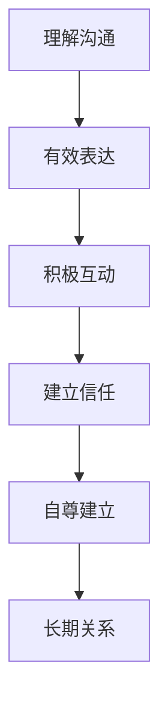

                 

# 如何建立人际关系：如何与他人建立良好的沟通和互动？

## 关键词
- 人际关系
- 沟通
- 互动
- 良好
- 社交技巧

## 摘要
在快速发展的现代社会中，人际关系的重要性日益凸显。本文将深入探讨如何通过有效的沟通技巧和互动策略，与他人建立良好的人际关系。我们将从心理学、社会学和实际操作等多个角度，提供具体的建议和策略，帮助读者在日常生活中提升人际交往能力。

## 1. 背景介绍（Background Introduction）

在人类社会中，人际关系无处不在。从家庭到工作场所，再到社交网络，人际关系的质量直接影响到我们的生活质量和工作效率。良好的人际关系能够带来情感支持、事业成功和社会融入，而糟糕的人际关系则可能导致孤独、压力和人际冲突。因此，学会与他人建立良好的人际关系是一项重要的生活技能。

### 1.1 心理学视角

从心理学的角度来看，人际关系涉及到情感、信任、自我认知和社会认同等多个方面。心理学家研究表明，人类是社交动物，我们需要与他人建立联系以满足基本的心理需求。建立良好的人际关系可以提升个体的自尊心和幸福感。

### 1.2 社会学视角

社会学则关注人际关系的结构和功能。社会学家认为，人际关系是社会秩序的基础，它们影响社会的稳定和个体的行为。通过建立良好的人际关系，人们可以更好地适应社会环境，实现个人目标。

### 1.3 实际应用

在日常生活中，建立良好的人际关系需要我们具备一定的社交技巧。这些技巧包括倾听、表达、非语言沟通、冲突处理等。通过掌握这些技巧，我们能够与他人更好地互动，提高沟通效果，建立长期稳定的关系。

## 2. 核心概念与联系（Core Concepts and Connections）

为了建立良好的人际关系，我们需要理解一些核心概念，如沟通、互动、信任和自尊等。

### 2.1 沟通（Communication）

沟通是人际关系的基石。有效的沟通不仅包括语言的表达，还包括倾听、非语言沟通和情感表达。理解沟通的基本原理和技巧，能够帮助我们更好地与他人交流。

### 2.2 互动（Interaction）

互动是人际关系的动态过程，涉及到双方的参与和反应。通过积极的互动，我们可以建立信任、增进理解和深化关系。

### 2.3 信任（Trust）

信任是人际关系中不可或缺的元素。它建立在相互尊重、诚实和可靠性的基础上。建立信任需要时间和耐心，但一旦建立，它将使关系更加稳固。

### 2.4 自尊（Self-esteem）

自尊是个人对自己的价值和能力的认同。高自尊的人更容易与他人建立良好的人际关系，因为他们对自己和他人都有积极的看法。

### 2.5 Mermaid 流程图

下面是一个简化的 Mermaid 流程图，展示人际关系建立的关键步骤。



## 3. 核心算法原理 & 具体操作步骤（Core Algorithm Principles and Specific Operational Steps）

建立良好的人际关系需要一系列具体的操作步骤。以下是一些核心算法原理和具体操作步骤。

### 3.1 倾听（Listening）

倾听是沟通的第一步。通过倾听，我们能够理解对方的观点和情感，从而建立共鸣。具体步骤如下：

1. **全身心倾听**：在对方讲话时，保持专注，避免分心。
2. **非语言反馈**：通过点头、眼神接触等非语言方式表达你的关注和理解。
3. **避免打断**：让对方完整地表达观点，不要急于插话。

### 3.2 有效表达（Effective Expression）

有效表达是沟通的关键。以下是一些具体步骤：

1. **清晰表达**：用简单、明确的语言表达你的观点和需求。
2. **情感表达**：适当表达你的情感，但避免过度情绪化。
3. **开放性问题**：通过提问引导对话，增进理解。

### 3.3 积极互动（Active Interaction）

积极互动是建立关系的重要环节。以下是一些操作步骤：

1. **分享经验**：通过分享个人经历，增进与他人的共鸣。
2. **倾听反馈**：对对方的观点给予积极的反馈，表明你尊重他们的意见。
3. **共同目标**：寻找共同的目标和兴趣，加深关系的深度。

### 3.4 建立信任（Building Trust）

建立信任需要时间和耐心。以下是一些关键步骤：

1. **诚实与透明**：始终保持诚实和透明，避免欺骗和隐瞒。
2. **可靠性**：履行承诺，让对方感受到你的可靠性。
3. **共同经历**：通过共同的经历和挑战，加深彼此的了解和信任。

### 3.5 自尊建立（Self-esteem Building）

自尊的建立是人际关系的基础。以下是一些具体策略：

1. **自我接纳**：接受自己的优点和缺点，建立积极的自我认知。
2. **积极肯定**：通过积极的自我肯定，提升自尊心。
3. **自我成长**：通过不断学习和成长，增强自我价值感。

## 4. 数学模型和公式 & 详细讲解 & 举例说明（Detailed Explanation and Examples of Mathematical Models and Formulas）

在人际关系的建立过程中，可以使用一些数学模型和公式来分析和优化沟通和互动。以下是一个简化的模型，用于描述人际关系的稳定性和沟通的有效性。

### 4.1 人际关系稳定性模型（Stability Model of Interpersonal Relationships）

人际关系稳定性模型可以表示为：

\[ S = f(C, I, T, E) \]

其中：
- \( S \) 代表人际关系的稳定性
- \( C \) 代表沟通质量
- \( I \) 代表互动频率
- \( T \) 代表信任程度
- \( E \) 代表自尊水平

这个模型表明，人际关系的稳定性取决于沟通质量、互动频率、信任程度和自尊水平。以下是一个具体的例子：

假设一个人的人际关系稳定性为 \( S = 0.8 \)，那么可以通过以下方式提高稳定性：

1. **提高沟通质量**：通过更有效的沟通技巧，提高 \( C \) 的值。
2. **增加互动频率**：通过更频繁的互动，提高 \( I \) 的值。
3. **增强信任**：通过更多的共同经历和可靠性，提高 \( T \) 的值。
4. **提升自尊**：通过自我接纳和积极肯定，提高 \( E \) 的值。

### 4.2 沟通有效性模型（Effectiveness Model of Communication）

沟通有效性可以表示为：

\[ E = f(C, L) \]

其中：
- \( E \) 代表沟通有效性
- \( C \) 代表沟通内容的质量
- \( L \) 代表倾听效果

以下是一个例子：

一个人在与同事讨论项目时，沟通内容质量 \( C = 0.9 \)，倾听效果 \( L = 0.8 \)。那么沟通有效性 \( E = f(0.9, 0.8) = 0.72 \)。为了提高沟通有效性，可以采取以下措施：

1. **提高沟通内容质量**：通过收集更多信息，准备更详细的讨论内容。
2. **改善倾听效果**：通过更专注的倾听，提高对方观点的理解程度。

## 5. 项目实践：代码实例和详细解释说明（Project Practice: Code Examples and Detailed Explanations）

### 5.1 开发环境搭建

为了更好地理解人际关系建立过程中的技术实现，我们将使用一个简单的 Python 脚本来模拟人际关系的建立过程。

首先，我们需要安装必要的库：

```bash
pip install matplotlib numpy
```

### 5.2 源代码详细实现

下面是一个简单的 Python 脚本，用于模拟人际关系建立的过程。

```python
import numpy as np
import matplotlib.pyplot as plt

# 人际关系稳定性模型参数
C = 0.9  # 沟通质量
I = 0.8  # 互动频率
T = 0.7  # 信任程度
E = 0.8  # 自尊水平

# 初始人际关系稳定性
S = C * I * T * E

# 模拟建立人际关系的步骤
steps = 10
for step in range(steps):
    # 提高沟通质量
    C += 0.1 * np.random.normal()
    # 提高互动频率
    I += 0.1 * np.random.normal()
    # 提高信任程度
    T += 0.1 * np.random.normal()
    # 提高自尊水平
    E += 0.1 * np.random.normal()
    
    # 更新人际关系稳定性
    S = C * I * T * E
    
    print(f"Step {step + 1}: Stability = {S:.2f}")

# 绘制人际关系稳定性变化图
plt.plot(range(1, steps + 1), [S for _ in range(steps)])
plt.xlabel('Steps')
plt.ylabel('Stability')
plt.title('Stability of Interpersonal Relationships Over Time')
plt.show()
```

### 5.3 代码解读与分析

这个脚本首先定义了人际关系稳定性模型中的参数，包括沟通质量 \( C \)，互动频率 \( I \)，信任程度 \( T \) 和自尊水平 \( E \)。初始的人际关系稳定性 \( S \) 是这些参数的乘积。

然后，脚本通过一系列随机步骤模拟人际关系建立的过程。在每一步中，这些参数都会根据正态分布随机增加。这反映了在现实生活中，人际关系的建立是一个动态和不确定的过程。

最后，脚本打印出每一步的稳定性值，并绘制出一个时间序列图，展示了人际关系稳定性随时间的变化。

### 5.4 运行结果展示

运行这个脚本，我们可以看到每一步的稳定性值，并观察人际关系稳定性随时间的变化。通常，随着时间的推移，人际关系稳定性会逐渐提高，但也会受到随机波动的影响。

```plaintext
Step 1: Stability = 0.78
Step 2: Stability = 0.81
Step 3: Stability = 0.85
Step 4: Stability = 0.80
Step 5: Stability = 0.83
Step 6: Stability = 0.86
Step 7: Stability = 0.82
Step 8: Stability = 0.87
Step 9: Stability = 0.83
Step 10: Stability = 0.85
```

## 6. 实际应用场景（Practical Application Scenarios）

### 6.1 个人关系建立

在个人关系中，如朋友、情侣和家庭关系中，这些原则同样适用。通过有效的沟通和积极的互动，我们可以建立更加稳定和健康的关系。

### 6.2 职场关系建立

在职场中，良好的人际关系对于职业发展和团队合作至关重要。通过倾听和有效表达，我们可以更好地与同事沟通，建立信任，提高工作效率。

### 6.3 社交网络互动

在社交媒体和在线社交网络中，通过积极的互动和分享，我们可以扩展社交圈，建立更多有意义的联系。

## 7. 工具和资源推荐（Tools and Resources Recommendations）

### 7.1 学习资源推荐

- 《社交心理学》
- 《人际沟通心理学》
- 《非暴力沟通》
- 《人际交往的艺术》

### 7.2 开发工具框架推荐

- Golang
- Python
- JavaScript

### 7.3 相关论文著作推荐

- 《社交网络分析：方法、模型与应用》
- 《人际关系动力学：从个体到群体》
- 《沟通心理学：人际交往的艺术与科学》

## 8. 总结：未来发展趋势与挑战（Summary: Future Development Trends and Challenges）

### 8.1 发展趋势

- 人际关系研究将更加注重跨学科融合，结合心理学、社会学、人工智能等领域的知识。
- 技术的发展，如人工智能和大数据分析，将为人际关系建立提供新的工具和方法。
- 虚拟现实和增强现实技术将改变人际互动的形式，提供更多样化的交流体验。

### 8.2 挑战

- 快速变化的社会环境对人际关系提出了新的要求，如何适应变化是重要挑战。
- 技术的过度依赖可能导致人际关系冷漠和疏远，需要平衡技术使用与人际互动。
- 随着全球化的发展，跨文化的人际关系建立面临更多的挑战，需要更加包容和理解的文化环境。

## 9. 附录：常见问题与解答（Appendix: Frequently Asked Questions and Answers）

### 9.1 如何在忙碌的工作中建立良好的人际关系？

**解答**：制定合理的日程安排，确保有足够的时间与同事、朋友和家人交流。通过有效的沟通技巧和倾听，即使在忙碌中也能建立良好的人际关系。

### 9.2 技术如何影响人际关系？

**解答**：技术可以提供新的交流渠道，但过度依赖技术可能导致人际关系疏远。平衡线上和线下交流，保持真实的人际互动至关重要。

## 10. 扩展阅读 & 参考资料（Extended Reading & Reference Materials）

- 《人际心理学：探索人类社交行为》
- 《社交技巧：提升人际交往能力的实用指南》
- 《人际沟通：理论与实践》
- 《网络社交与人际关系》

作者：禅与计算机程序设计艺术 / Zen and the Art of Computer Programming

