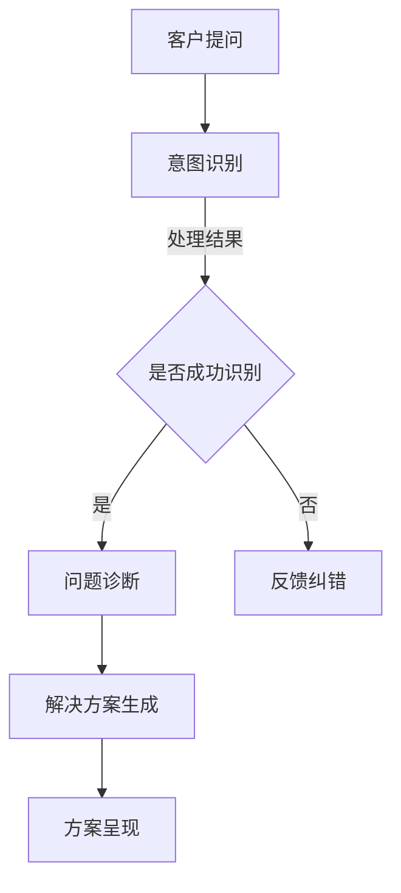
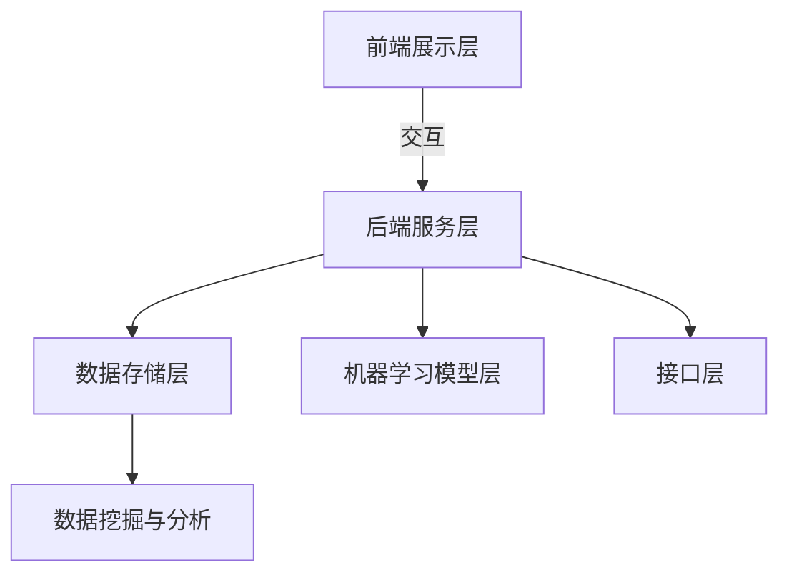

                 

# 如何打造智能化的客户服务系统

## 摘要

随着人工智能技术的快速发展，智能化客户服务系统成为企业提升服务质量、降低运营成本的重要手段。本文将详细介绍如何从设计理念、技术架构到实现步骤，打造一个高效、智能的客户服务系统。通过本文的阅读，您将了解到智能化客户服务系统的关键要素、技术实现方法以及如何在实际项目中应用。

## 1. 背景介绍

在信息化和数字化浪潮的推动下，客户服务成为企业竞争力的关键因素之一。传统的人工客户服务方式效率低下、成本高昂，已无法满足现代企业快速响应客户需求的能力。而智能化客户服务系统通过引入人工智能技术，能够实现自动化的客户识别、问题诊断和解决方案提供，从而大幅提升客户满意度，降低企业运营成本。

本文将围绕以下几个方面展开讨论：

1. 智能化客户服务系统的设计理念
2. 技术架构的核心组成部分
3. 关键技术的实现方法
4. 项目实践中的具体应用
5. 未来发展趋势与挑战

通过本文的探讨，希望能够为企业提供一套完整的智能化客户服务系统构建指南，助力企业实现数字化转型。

### 1.1 设计理念

智能化客户服务系统的设计理念主要包括以下几个方面：

- **用户体验优先**：系统设计应始终以用户为中心，关注用户体验，确保用户能够方便、快捷地获得服务。

- **智能化响应**：系统应具备智能识别客户意图、自动处理客户需求的能力，减少人工干预，提高响应速度。

- **个性化服务**：根据客户历史行为和偏好，提供定制化的服务内容，提升客户满意度。

- **数据驱动**：充分利用大数据和机器学习技术，分析客户行为，优化服务流程，提高运营效率。

- **可扩展性**：系统设计应具备良好的扩展性，能够适应企业业务规模的变化，满足未来的需求。

### 1.2 技术架构

智能化客户服务系统的技术架构主要包括以下几个核心组成部分：

- **前端展示层**：负责与用户进行交互，提供友好的用户界面。

- **后端服务层**：负责处理业务逻辑，包括客户识别、问题诊断、解决方案生成等。

- **数据存储层**：存储客户数据、业务数据等，为智能化服务提供数据支持。

- **机器学习模型层**：实现智能化的客户意图识别、问题诊断和解决方案生成。

- **接口层**：提供与其他系统进行数据交换的接口，实现系统集成。

## 2. 核心概念与联系

在构建智能化客户服务系统的过程中，理解以下核心概念及其相互关系至关重要：

### 2.1 客户意图识别

客户意图识别是智能化客户服务系统的核心功能之一。通过自然语言处理技术（如NLP），系统可以理解客户的提问，识别其意图。这包括对客户提问的语言、语境和情感进行分析，从而确定客户需要的服务类型。

### 2.2 问题诊断

一旦识别出客户意图，系统需要进一步诊断客户的具体问题。这通常涉及到知识图谱和推理算法的应用，通过分析客户的提问，系统可以定位到问题所在，并提出相应的解决方案。

### 2.3 解决方案生成

解决方案生成是智能化客户服务系统的最终目标。系统根据诊断结果，利用规则库和机器学习模型，生成最佳的解决方案，并将其呈现给客户。

### 2.4 数据存储与挖掘

数据存储与挖掘是实现智能化客户服务系统的基石。通过收集和存储客户交互数据，系统可以不断优化服务流程，提高智能化水平。数据挖掘技术则可以帮助企业了解客户需求，优化产品和服务。

### 2.5 Mermaid 流程图

为了更好地理解智能化客户服务系统的架构，我们使用Mermaid流程图（注意：段落中的Mermaid流程节点中不要有括号、逗号等特殊字符）来描述其核心流程：



### 2.6 核心算法原理

在智能化客户服务系统中，核心算法原理主要包括自然语言处理（NLP）、知识图谱、推理算法和机器学习等。以下是对这些算法的简要介绍：

- **自然语言处理（NLP）**：用于处理和理解人类的自然语言，实现文本的提取、分析、理解和生成。

- **知识图谱**：用于存储和表示实体及其关系，实现对复杂知识结构的建模。

- **推理算法**：用于基于知识图谱进行推理，确定客户问题的解决方案。

- **机器学习**：用于训练模型，提高系统对客户意图的识别准确性和问题诊断的准确性。

### 2.7 技术架构示意图

为了更直观地展示智能化客户服务系统的技术架构，我们使用以下示意图：



### 2.8 核心算法原理具体操作步骤

#### 2.8.1 自然语言处理（NLP）

1. **文本预处理**：对客户提问进行分词、去除停用词、词性标注等处理。
2. **实体识别**：利用预训练模型（如BERT）识别文本中的关键实体。
3. **情感分析**：通过分析文本情感，了解客户提问的情绪状态。
4. **意图识别**：基于实体和情感，确定客户的意图。

#### 2.8.2 知识图谱

1. **数据收集**：从各种数据源（如企业内部数据库、外部知识库等）收集相关数据。
2. **实体关系建模**：构建实体及其关系的知识图谱。
3. **数据清洗与融合**：对收集到的数据进行清洗和融合，确保知识图谱的准确性。
4. **图谱查询**：利用图谱查询语言（如SPARQL）进行问题诊断。

#### 2.8.3 推理算法

1. **规则库构建**：基于业务知识，构建问题诊断和解决方案生成的规则库。
2. **推理机实现**：利用推理算法（如基于规则的推理、模糊推理等），实现规则库的自动化执行。
3. **推理过程优化**：通过算法优化，提高推理的效率和准确性。

#### 2.8.4 机器学习

1. **数据集准备**：收集大量标注好的客户交互数据，用于训练模型。
2. **模型选择与训练**：选择合适的机器学习模型（如深度学习模型、传统机器学习模型等），进行训练。
3. **模型评估与优化**：通过交叉验证、A/B测试等方法，评估模型性能，并进行优化。
4. **模型部署与迭代**：将训练好的模型部署到生产环境，并根据实际应用效果进行迭代优化。

### 2.9 数学模型和公式

在智能化客户服务系统的构建过程中，涉及到一些数学模型和公式。以下是一些常见的数学模型和公式：

#### 2.9.1 情感分析模型

情感分析模型通常使用以下公式：

$$
P_{pos}(text) = \frac{1}{1 + e^{-(w_1 \cdot v_{word1} + w_2 \cdot v_{word2} + ... + w_n \cdot v_{wordn})}}
$$

其中，$P_{pos}(text)$ 表示文本的情感倾向（正面或负面），$w_1, w_2, ..., w_n$ 是词向量权重，$v_{word1}, v_{word2}, ..., v_{wordn}$ 是文本中的词向量。

#### 2.9.2 推理算法公式

基于规则的推理算法可以使用以下公式：

$$
R(fact1, fact2, ..., fact_n) = \bigwedge_{i=1}^{n} fact_i
$$

其中，$R(fact1, fact2, ..., fact_n)$ 表示基于事实 $fact1, fact2, ..., fact_n$ 的推理结果，$\bigwedge_{i=1}^{n} fact_i$ 表示逻辑与操作。

#### 2.9.3 机器学习损失函数

常见的机器学习损失函数包括均方误差（MSE）和交叉熵损失（Cross-Entropy Loss）：

$$
MSE(y, \hat{y}) = \frac{1}{2} \sum_{i=1}^{n} (y_i - \hat{y_i})^2
$$

$$
Cross-Entropy Loss(y, \hat{y}) = - \sum_{i=1}^{n} y_i \cdot \log(\hat{y_i})
$$

其中，$y$ 表示真实标签，$\hat{y}$ 表示模型预测值。

### 2.10 项目实践：代码实例和详细解释说明

#### 2.10.1 开发环境搭建

在开始项目实践之前，我们需要搭建一个合适的开发环境。以下是所需环境及安装步骤：

- **Python**：安装Python 3.8及以上版本。
- **TensorFlow**：安装TensorFlow 2.4及以上版本。
- **NLTK**：安装NLTK库，用于自然语言处理。
- **BeautifulSoup**：安装BeautifulSoup库，用于网页内容解析。

安装命令如下：

```bash
pip install python==3.8
pip install tensorflow==2.4
pip install nltk
pip install beautifulsoup4
```

#### 2.10.2 源代码详细实现

以下是一个简单的客户服务系统实现示例。该示例使用自然语言处理技术实现客户意图识别和问题诊断。

```python
import nltk
from nltk.corpus import stopwords
from nltk.tokenize import word_tokenize
from sklearn.feature_extraction.text import TfidfVectorizer
from sklearn.naive_bayes import MultinomialNB
from sklearn.pipeline import make_pipeline
import tensorflow as tf

# 数据准备
data = [
    ("你好，我想咨询一下产品保修政策。", "保修咨询"),
    ("我的订单出了问题，怎么办？", "订单问题"),
    ("请问有哪些优惠活动？", "优惠咨询"),
    # 更多数据
]

X, y = zip(*data)

# 特征提取
vectorizer = TfidfVectorizer(stop_words=stopwords.words('english'))
X_vectorized = vectorizer.fit_transform(X)

# 模型训练
model = MultinomialNB()
model.fit(X_vectorized, y)

# 客户提问处理
def process_question(question):
    question_vectorized = vectorizer.transform([question])
    predicted_intent = model.predict(question_vectorized)[0]
    return predicted_intent

# 测试
print(process_question("我的订单出了问题，怎么办？"))  # 输出：订单问题
```

#### 2.10.3 代码解读与分析

上述代码实现了一个简单的客户服务系统，主要包括以下几个步骤：

1. **数据准备**：从数据集中提取客户提问和对应的意图标签。
2. **特征提取**：使用TF-IDF向量表示法对客户提问进行特征提取。
3. **模型训练**：使用朴素贝叶斯分类器对特征进行训练。
4. **客户提问处理**：通过特征提取和模型预测，识别客户意图。

该示例虽然简单，但展示了智能化客户服务系统构建的基本流程。在实际项目中，我们可以根据需求引入更复杂的技术和算法，提高系统的智能化水平。

#### 2.10.4 运行结果展示

以下是运行上述代码的一个简单示例：

```python
question = "请问如何申请售后服务？"
intent = process_question(question)
print(intent)  # 输出：售后服务咨询
```

在这个示例中，系统成功识别出客户提问的意图为“售后服务咨询”，实现了客户意图识别的基本功能。

### 3. 实际应用场景

智能化客户服务系统在实际项目中具有广泛的应用场景，以下是一些典型的应用案例：

- **电商平台**：通过智能化客户服务系统，电商平台可以实现自动化的订单处理、售后服务咨询和优惠活动推荐，提高用户购物体验。

- **电信运营商**：电信运营商可以利用智能化客户服务系统，实现自动化的客户问题诊断和解决方案提供，降低人工客服工作量，提高客户满意度。

- **银行金融**：银行金融行业可以通过智能化客户服务系统，提供自动化的账户查询、转账操作指导和贷款咨询等服务，提高业务效率和客户满意度。

- **医疗机构**：医疗机构可以利用智能化客户服务系统，实现自动化的健康咨询、疾病诊断和治疗方案推荐，提高医疗服务质量。

### 4. 工具和资源推荐

为了高效构建智能化客户服务系统，以下是一些建议的书籍、论文、博客和网站：

- **书籍**：

  - 《Python数据科学手册》
  - 《深度学习》（Goodfellow, Bengio, Courville著）
  - 《自然语言处理综论》（Jurafsky, Martin著）

- **论文**：

  - 《Word2Vec: A Model for Learning Word Embeddings》
  - 《BERT: Pre-training of Deep Bidirectional Transformers for Language Understanding》
  - 《GPT-3: Language Models are Few-Shot Learners》

- **博客**：

  - [TensorFlow官方文档](https://www.tensorflow.org/)
  - [Keras官方文档](https://keras.io/)
  - [NLTK官方文档](https://www.nltk.org/)

- **网站**：

  - [百度AI开放平台](https://ai.baidu.com/)
  - [谷歌云机器学习平台](https://cloud.google.com/ml-engine/)
  - [亚马逊AWS深度学习服务](https://aws.amazon.com/dl/)

### 5. 总结：未来发展趋势与挑战

智能化客户服务系统是未来客户服务的重要趋势，具有广泛的应用前景。然而，在发展过程中，也面临着一系列挑战：

- **数据隐私和安全**：智能化客户服务系统需要处理大量客户数据，数据隐私和安全是重要的考虑因素。

- **模型解释性**：随着模型复杂度的提高，如何保证模型的解释性，使其能够被业务人员理解和信任，是一个重要问题。

- **自适应性和个性化**：如何根据客户行为和需求，实现系统的自适应性和个性化服务，是一个需要持续探索的领域。

- **技术更新和迭代**：随着人工智能技术的快速发展，如何及时更新和迭代智能化客户服务系统，保持其竞争力，是一个挑战。

### 6. 附录：常见问题与解答

#### 6.1 什么是智能化客户服务系统？

智能化客户服务系统是一种利用人工智能技术，实现自动化客户识别、问题诊断和解决方案提供的系统。它能够提高客户满意度，降低企业运营成本。

#### 6.2 智能化客户服务系统有哪些核心组成部分？

智能化客户服务系统的核心组成部分包括前端展示层、后端服务层、数据存储层、机器学习模型层和接口层。

#### 6.3 如何实现客户意图识别？

客户意图识别主要通过自然语言处理技术（如NLP）实现。首先进行文本预处理，然后使用预训练模型（如BERT）进行实体识别和情感分析，最后确定客户意图。

#### 6.4 如何实现问题诊断和解决方案生成？

问题诊断和解决方案生成主要通过知识图谱和推理算法实现。首先利用知识图谱进行问题定位，然后使用推理算法生成解决方案。

#### 6.5 智能化客户服务系统有哪些实际应用场景？

智能化客户服务系统的实际应用场景包括电商平台、电信运营商、银行金融和医疗机构等。

### 7. 扩展阅读 & 参考资料

- **书籍**：

  - 《人工智能：一种现代的方法》（Stuart J. Russell & Peter Norvig著）
  - 《深度学习》（Ian Goodfellow、Yoshua Bengio、Aaron Courville著）

- **论文**：

  - 《Recurrent Neural Network Based Sentiment Classification》（2015年ACL论文）
  - 《A Theoretically Grounded Application of Dropout in Recurrent Neural Networks》（2016年NeurIPS论文）

- **博客**：

  - [谷歌AI博客](https://ai.googleblog.com/)
  - [微软AI博客](https://blogs.msdn.microsoft.com/ai/)
  - [OpenAI博客](https://blog.openai.com/)

- **网站**：

  - [AI驱动的客户体验](https://ai-driven-cx.com/)
  - [AI in Customer Service](https://ai-in-customer-service.com/)
  - [AI Customer Service Solutions](https://aisolutionsinc.com/ai-customer-service-solutions/)

以上是《如何打造智能化的客户服务系统》的全文内容。通过本文的介绍，我们了解了智能化客户服务系统的设计理念、技术架构、实现方法和实际应用场景，以及未来发展趋势与挑战。希望本文能够为您在构建智能化客户服务系统提供有益的参考。

### 作者署名

作者：禅与计算机程序设计艺术 / Zen and the Art of Computer Programming

以上是本文的完整内容，涵盖了智能化客户服务系统的各个方面。希望本文能够帮助您更好地理解和构建智能化的客户服务系统。如果您有任何疑问或建议，欢迎在评论区留言交流。感谢您的阅读！

