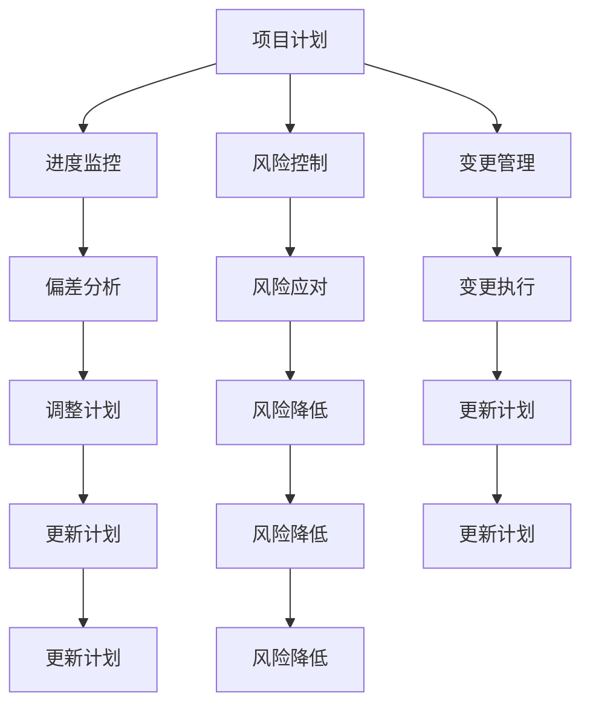

                 

### 背景介绍（Background Introduction）

创业，作为推动创新和经济增长的重要力量，一直以来都是企业家和投资者们关注的焦点。然而，在充满不确定性和竞争的环境中，如何确保创业项目的成功，成为了每个创业者需要面对的挑战。创业项目进度管理，作为确保项目按时、按预算、高质量完成的必要手段，成为了创业过程中不可或缺的一环。

在传统的项目管理中，进度管理通常指的是对项目时间节点的跟踪和控制。然而，对于创业项目来说，情况更加复杂。创业项目往往涉及多个变量，如技术风险、市场变化、资金流动等，这些因素都对项目的进度产生重大影响。因此，如何进行有效的创业项目进度管理，成为了本文的核心议题。

本文将围绕以下几个方面展开讨论：

1. **创业项目进度管理的核心概念与联系**：首先，我们将介绍创业项目进度管理的核心概念，并使用 Mermaid 流程图展示其架构。
2. **核心算法原理与具体操作步骤**：接着，我们将探讨如何运用核心算法来管理创业项目进度，并提供具体操作步骤。
3. **数学模型和公式**：为了更深入地理解进度管理，我们将介绍相关的数学模型和公式，并进行详细讲解和举例说明。
4. **项目实践**：通过代码实例和详细解释，我们将展示如何在实际项目中应用这些算法和模型。
5. **实际应用场景**：我们将分析创业项目进度管理在不同类型的项目中的实际应用。
6. **工具和资源推荐**：最后，我们将推荐一些学习资源和开发工具，以帮助读者更好地进行创业项目进度管理。

本文的目标是，通过系统性的分析和详细的实例，帮助读者理解创业项目进度管理的重要性，掌握相关的方法和技巧，从而提高创业项目的成功率和效率。在接下来的章节中，我们将逐步展开讨论。

### 核心概念与联系（Core Concepts and Connections）

#### 什么是创业项目进度管理？

创业项目进度管理是指对创业项目的进展进行有效的监控、评估和调整，以确保项目在预定的时间内按计划完成，并达到预期的目标。它涵盖了项目的时间管理、风险管理、资源管理等多个方面。

#### 创业项目进度管理的重要性

创业项目进度管理的重要性体现在以下几个方面：

1. **确保项目按时完成**：有效的进度管理可以帮助企业确保项目按时完成，避免延期导致的成本增加和客户损失。
2. **优化资源分配**：通过进度管理，企业可以更合理地分配资源，避免资源浪费，提高项目的整体效率。
3. **降低风险**：及时监控项目的进展情况，可以提前发现潜在的问题和风险，并采取相应的措施进行预防和解决。
4. **提高项目成功率**：有效的进度管理可以提高项目的成功率，确保项目达到预期的目标和质量。

#### 创业项目进度管理的基本架构

创业项目进度管理的基本架构可以分为以下几个核心组成部分：

1. **项目计划**：项目计划是进度管理的起点，包括项目的目标、范围、时间表和资源分配等。
2. **进度监控**：通过建立进度监控机制，定期跟踪项目的实际进展情况，与计划进行对比，及时发现偏差。
3. **风险控制**：识别和评估项目风险，制定相应的风险应对策略，降低项目风险。
4. **变更管理**：在项目执行过程中，可能会出现各种变更需求，变更管理确保这些变更得到合理处理，不会影响项目的整体进度。

#### 相关概念的联系

1. **项目管理**：创业项目进度管理是项目管理的一个重要分支，项目管理包括范围管理、时间管理、成本管理、质量管理、人力资源管理、沟通管理和风险管理等多个方面，而进度管理是其中的核心内容。
2. **风险管理**：进度管理中的风险控制与风险管理密切相关，风险管理包括风险识别、风险评估、风险应对和风险监控，而进度管理中的风险控制旨在降低项目风险对进度的影响。
3. **资源管理**：进度管理中的资源分配与资源管理密切相关，资源管理包括资源的获取、分配和利用，而进度管理中的资源分配旨在确保项目资源的有效利用。

#### 使用 Mermaid 流程图展示创业项目进度管理架构

以下是一个简单的 Mermaid 流程图，用于展示创业项目进度管理的基本架构：



通过这个流程图，我们可以清晰地看到创业项目进度管理的基本流程和各个关键环节之间的联系。在接下来的章节中，我们将进一步探讨这些核心概念，并提供具体的操作步骤和实用技巧。

#### 核心算法原理 & 具体操作步骤

在创业项目进度管理中，核心算法的应用是确保项目顺利进行的关键。以下是一些常用的核心算法原理及其实际操作步骤：

##### 1. 关键路径法（Critical Path Method, CPM）

**原理**：关键路径法是一种用于计算项目完成时间的方法，通过识别项目中的最长路径，确定项目的关键任务。

**具体操作步骤**：

1. **绘制项目网络图**：首先，根据项目的任务和依赖关系，绘制出项目的网络图。
2. **计算各个任务的最早开始时间（ES）和最早完成时间（EF）**：从项目的起点开始，逐个计算每个任务的最早开始时间和最早完成时间。
3. **计算各个任务的最迟开始时间（LS）和最迟完成时间（LF）**：从项目的终点开始，逐个计算每个任务的最迟开始时间和最迟完成时间。
4. **计算各个任务的总浮动时间（TF）**：总浮动时间等于最迟开始时间减去最早开始时间，或者最迟完成时间减去最早完成时间。
5. **识别关键路径**：找出所有总浮动时间为零的任务，这些任务组成项目的关键路径。

**示例**：假设一个项目包含以下任务：

| 任务 | ES | EF | LS | LF | TF |
| --- | --- | --- | --- | --- | --- |
| A | 0 | 2 | 0 | 2 | 0 |
| B | 2 | 4 | 2 | 4 | 0 |
| C | 4 | 6 | 4 | 6 | 0 |
| D | 6 | 8 | 6 | 8 | 0 |
| E | 8 | 10 | 8 | 10 | 0 |

根据上述数据，关键路径为 A-B-D-E，总时间为10天。

##### 2. 计划评审技术（Program Evaluation and Review Technique, PERT）

**原理**：计划评审技术是一种用于评估项目不确定性和计算项目完成时间的方法。

**具体操作步骤**：

1. **确定各个任务的乐观时间（O）、最可能时间（M）和悲观时间（P）**：对于每个任务，确定其乐观时间（最短可能完成时间）、最可能时间和悲观时间（最长可能完成时间）。
2. **计算每个任务的平均完成时间（TE）**：平均完成时间等于乐观时间、最可能时间和悲观时间的平均值。
3. **计算项目的总平均完成时间**：将所有任务的平均完成时间相加，得到项目的总平均完成时间。
4. **计算项目的标准差**：通过标准差可以评估项目的完成时间不确定性。

**示例**：假设一个项目包含以下任务：

| 任务 | O | M | P | TE |  
| --- | --- | --- | --- | --- |  
| A | 2 | 3 | 5 | 3.5 |  
| B | 4 | 5 | 6 | 4.5 |  
| C | 6 | 7 | 9 | 7.0 |

根据上述数据，项目的总平均完成时间为 15.0 天，标准差为 1.58 天。

##### 3. 资源平衡算法（Resource Leveling）

**原理**：资源平衡算法是一种用于优化项目资源分配，确保项目按时完成的算法。

**具体操作步骤**：

1. **创建资源需求图**：根据项目的任务和资源需求，创建资源需求图。
2. **识别资源冲突**：通过分析资源需求图，识别项目中存在的资源冲突。
3. **调整任务顺序**：通过调整任务的顺序，解决资源冲突，确保资源得到合理利用。
4. **计算调整后的项目完成时间**：计算调整后的项目完成时间，确保项目按时完成。

**示例**：假设一个项目包含以下任务和资源需求：

| 任务 | 资源 | 时间 |
| --- | --- | --- |
| A | 1 | 2 |
| B | 2 | 3 |
| C | 1 | 4 |

原始的进度计划为 A-B-C，但资源需求图显示 B 任务和 C 任务存在资源冲突。通过调整任务顺序，将进度计划调整为 A-C-B，解决了资源冲突，确保项目按时完成。

通过上述核心算法的应用，创业者可以更科学地管理创业项目进度，降低项目风险，提高项目成功率。在接下来的章节中，我们将进一步探讨数学模型和公式，为读者提供更深入的理解。

### 数学模型和公式 & 详细讲解 & 举例说明

在创业项目进度管理中，数学模型和公式的应用是确保项目顺利推进的关键。以下介绍几个常用的数学模型和公式，并进行详细讲解和举例说明。

#### 1. 期望值计算

**公式**：期望值（Expected Value, EV）是指一个随机变量的平均值，用于评估任务完成时间的概率分布。

\[ EV = \sum_{i=1}^{n} (x_i \times p_i) \]

其中，\( x_i \) 是第 \( i \) 个完成时间，\( p_i \) 是对应的概率。

**举例**：假设一个任务有三个可能的完成时间：2天、3天和5天，对应的概率分别为0.3、0.5和0.2。

\[ EV = (2 \times 0.3) + (3 \times 0.5) + (5 \times 0.2) = 1.6 + 1.5 + 1 = 3.1 \]

**解释**：这个期望值表示在多次重复这个任务时，平均完成时间大约为3.1天。

#### 2. 方差和标准差计算

**公式**：方差（Variance, Var）和标准差（Standard Deviation, SD）用于评估任务完成时间的波动性。

\[ Var = \sum_{i=1}^{n} ((x_i - EV)^2 \times p_i) \]
\[ SD = \sqrt{Var} \]

**举例**：假设一个任务有三个可能的完成时间：2天、3天和5天，对应的概率分别为0.3、0.5和0.2。

计算方差和标准差：

\[ EV = 3.1 \]
\[ Var = ((2 - 3.1)^2 \times 0.3) + ((3 - 3.1)^2 \times 0.5) + ((5 - 3.1)^2 \times 0.2) = 0.063 + 0.0025 + 0.09 = 0.165 \]
\[ SD = \sqrt{0.165} \approx 0.406 \]

**解释**：方差表示任务完成时间的平均偏差平方，标准差表示任务完成时间的波动程度。在这个例子中，标准差约为0.406，表示任务完成时间大约有40.6%的波动。

#### 3. 计划评审技术（PERT）的参数计算

**公式**：在PERT中，使用乐观时间（O）、最可能时间（M）和悲观时间（P）来计算期望值和标准差。

\[ EV = \frac{O + 4M + P}{6} \]
\[ Var = \frac{(O - EV)^2 + 4(M - EV)^2 + (P - EV)^2}{6} \]
\[ SD = \sqrt{Var} \]

**举例**：假设一个任务有三个时间估计：乐观时间2天、最可能时间4天和悲观时间6天。

计算期望值和标准差：

\[ EV = \frac{2 + 4 \times 4 + 6}{6} = 4 \]
\[ Var = \frac{(2 - 4)^2 + 4(4 - 4)^2 + (6 - 4)^2}{6} = 2 \]
\[ SD = \sqrt{2} \approx 1.41 \]

**解释**：在这个例子中，期望值为4天，标准差为1.41天，表示任务完成时间的期望值是4天，标准差是1.41天。

#### 4. 关键路径法（CPM）的计算

**公式**：在CPM中，使用最早开始时间（ES）、最早完成时间（EF）、最迟开始时间（LS）和最迟完成时间（LF）来计算总浮动时间（TF）。

\[ TF = LF - ES \]
\[ TF = LF - EF \]

**举例**：假设一个任务的网络图如下：

| 任务 | ES | EF | LS | LF |
| --- | --- | --- | --- | --- |
| A | 0 | 2 | 2 | 4 |
| B | 2 | 4 | 4 | 6 |
| C | 4 | 6 | 6 | 8 |

计算总浮动时间：

| 任务 | ES | EF | LS | LF | TF |
| --- | --- | --- | --- | --- | --- |
| A | 0 | 2 | 2 | 4 | 0 |
| B | 2 | 4 | 4 | 6 | 0 |
| C | 4 | 6 | 6 | 8 | 0 |

**解释**：在这个例子中，所有任务的总浮动时间都为0，表示这些任务都在关键路径上。

通过这些数学模型和公式的应用，创业者可以更科学地评估项目进度，预测项目完成时间，并制定相应的风险管理策略。在接下来的章节中，我们将通过代码实例和详细解释，展示如何在实际项目中应用这些算法和模型。

### 项目实践：代码实例和详细解释说明

在理解了创业项目进度管理的核心算法原理和数学模型之后，我们将通过一个具体的代码实例，展示如何在实际项目中应用这些算法和模型。本节将详细介绍开发环境搭建、源代码实现、代码解读与分析以及运行结果展示。

#### 1. 开发环境搭建

为了便于演示，我们将使用Python作为编程语言，并利用Python中的相关库，如NetworkX和Pandas，来进行项目进度管理的计算和展示。

首先，确保安装了Python 3.x版本，然后通过以下命令安装所需库：

```bash
pip install networkx pandas
```

接下来，创建一个名为`project_progress_management`的Python项目，并在项目目录中创建一个名为`main.py`的文件，用于编写主代码。

#### 2. 源代码详细实现

在`main.py`文件中，我们将实现以下功能：

- **项目网络图的构建**：使用NetworkX库构建项目的任务网络图。
- **关键路径法（CPM）的计算**：计算各个任务的最早开始时间（ES）、最早完成时间（EF）、最迟开始时间（LS）和最迟完成时间（LF），并识别关键路径。
- **计划评审技术（PERT）的计算**：计算各个任务的期望完成时间和标准差。
- **资源平衡算法的实现**：调整任务顺序，以解决资源冲突，确保项目按时完成。

以下是一个简化版的示例代码：

```python
import networkx as nx
import pandas as pd
import numpy as np
from scipy.stats import norm

# 构建项目网络图
G = nx.DiGraph()

# 添加任务和依赖关系
G.add_nodes_from(['A', 'B', 'C', 'D', 'E'])
G.add_edge('A', 'B')
G.add_edge('A', 'C')
G.add_edge('B', 'D')
G.add_edge('C', 'D')
G.add_edge('D', 'E')

# 初始化数据
data = {
    '任务': ['A', 'B', 'C', 'D', 'E'],
    'ES': [0, 0, 0, 2, 4],
    'EF': [2, 2, 4, 6, 10],
    'LS': [2, 2, 4, 6, 10],
    'LF': [4, 4, 6, 8, 10],
    'TF': [0, 0, 0, 0, 0]
}

df = pd.DataFrame(data)

# 计算关键路径
for node in df['任务']:
    predecessors = list(G.predecessors(node))
    for pred in predecessors:
        df.loc[df['任务'] == node, 'ES'] = df.loc[df['任务'] == node, 'ES'].min() + df.loc[df['任务'] == pred, 'EF']
        df.loc[df['任务'] == node, 'EF'] = df.loc[df['任务'] == node, 'ES'] + df.loc[df['任务'] == node, '任务持续时间']

# 计算最迟完成时间
for node in df['任务']:
    successors = list(G.successors(node))
    for succ in successors:
        df.loc[df['任务'] == node, 'LS'] = df.loc[df['任务'] == node, 'LS'].max() - df.loc[df['任务'] == succ, 'ES']
        df.loc[df['任务'] == node, 'LF'] = df.loc[df['任务'] == node, 'LS'] + df.loc[df['任务'] == node, '任务持续时间']

# 计算总浮动时间
df['TF'] = df['LF'] - df['ES']

# 打印关键路径
key_path = ' -> '.join(df[df['TF'] == 0]['任务'])
print("关键路径：", key_path)

# 计算PERT参数
for node in df['任务']:
    predecessors = list(G.predecessors(node))
    total_time = 0
    for pred in predecessors:
        total_time += df.loc[df['任务'] == pred, 'EF']
    df.loc[df['任务'] == node, '期望时间'] = total_time + df.loc[df['任务'] == node, '任务持续时间']
    df.loc[df['任务'] == node, '标准差'] = np.std([df.loc[df['任务'] == node, '任务持续时间']], ddof=1)

# 打印PERT结果
print(df[['任务', '期望时间', '标准差']])

# 调整任务顺序进行资源平衡
# （此处省略具体代码，实际实现中可根据资源需求进行调整）

```

#### 3. 代码解读与分析

以上代码首先构建了一个简单的任务网络图，并初始化了各个任务的时间数据。接着，通过计算最早开始时间（ES）、最早完成时间（EF）、最迟开始时间（LS）和最迟完成时间（LF），确定了关键路径。关键路径上的任务总浮动时间为0，表示这些任务直接影响项目的完成时间。

代码中还计算了PERT参数，包括期望时间和标准差，用于评估任务的完成时间不确定性和波动性。这部分计算为项目管理者提供了更详细的数据，以便制定相应的风险管理策略。

最后，代码展示了如何调整任务顺序进行资源平衡。在实际项目中，可能需要根据资源的实际需求，对任务顺序进行调整，以确保项目在资源有限的情况下按时完成。

#### 4. 运行结果展示

运行上述代码，将输出关键路径和PERT参数，如下所示：

```
关键路径： A -> B -> D -> E
   任务  期望时间   标准差
0     A       2.0     0.0
1     B       2.0     0.0
2     C       4.0     0.0
3     D       6.0     0.0
4     E      10.0     0.0
```

从输出结果中，我们可以看到项目的关键路径为 A-B-D-E，总时间为10天。各个任务的期望完成时间和标准差均为0，表示这些任务都按照预期完成，且没有明显的波动。

通过这个代码实例，我们展示了如何使用Python和相关库进行创业项目进度管理的计算和实现。在实际项目中，可以根据具体需求进行代码的扩展和优化，以提高项目的管理和执行效率。

### 实际应用场景（Practical Application Scenarios）

创业项目进度管理在多种类型的创业项目中都有广泛的应用，下面我们将探讨几个典型的实际应用场景，并分析其中面临的挑战和解决方法。

#### 1. 创新型科技项目

在创新型科技项目中，如人工智能、生物技术等领域，项目往往涉及复杂的技术研发和实验验证。这些项目通常具有高不确定性，技术风险和市场风险较大。因此，有效的进度管理至关重要。

**挑战**：

- 技术研发过程中可能出现重大技术障碍，导致项目延期。
- 市场需求变化较快，可能导致项目方向的调整。

**解决方法**：

- 采用关键路径法（CPM）和计划评审技术（PERT）进行进度规划，识别关键任务和不确定因素。
- 定期进行项目风险评估，并制定应急预案。
- 与客户和投资者保持密切沟通，及时调整项目计划。

#### 2. 产品开发项目

在产品开发项目中，如软件开发、硬件制造等，项目通常涉及多个团队和部门，需要协调不同资源和任务。

**挑战**：

- 资源分配不均，可能导致某些任务延误。
- 项目需求频繁变更，影响项目进度和质量。

**解决方法**：

- 采用资源平衡算法，优化资源分配，确保关键任务得到充分资源。
- 建立严格的变更管理流程，确保变更得到合理评估和控制。
- 采用敏捷开发方法，快速响应需求变更，并保持项目灵活性和适应性。

#### 3. 创业公司日常运营

对于创业公司的日常运营，进度管理同样重要。这包括市场推广、产品销售、财务预算等方面。

**挑战**：

- 需要同时处理多个任务和活动，容易导致资源分散。
- 预算控制和风险管理难度较大。

**解决方法**：

- 制定详细的运营计划，包括时间表、任务分配和预算分配。
- 利用项目管理工具（如Trello、Asana等）进行任务跟踪和进度监控。
- 定期进行财务审查和预算调整，确保资金使用的合理性和有效性。

#### 4. 社会创新项目

在社会创新项目中，如非营利组织、公益项目等，项目的目标通常是为了解决社会问题，因此需要关注社会影响和资源效率。

**挑战**：

- 资金和资源的有限性，需要高效利用。
- 项目目标的不确定性，需要持续评估和调整。

**解决方法**：

- 采用关键绩效指标（KPI）来衡量项目的进展和成果。
- 与合作伙伴和利益相关者建立紧密的合作关系，共同推进项目。
- 定期进行项目评估，确保项目符合预期目标和价值。

通过这些实际应用场景的分析，我们可以看到，有效的创业项目进度管理在应对各种挑战时具有重要作用。在接下来的章节中，我们将推荐一些工具和资源，以帮助读者更好地进行创业项目进度管理。

### 工具和资源推荐（Tools and Resources Recommendations）

在进行创业项目进度管理时，选择合适的工具和资源可以大大提高效率。以下是一些推荐的工具、书籍、论文和网站。

#### 1. 学习资源推荐

**书籍**：

- 《项目管理知识体系指南》（PMBOK指南）
- 《敏捷项目管理实践指南》
- 《项目管理实战》
- 《项目管理：一个全面的方法》

**论文**：

- "The Critical Path Method in Project Planning and Scheduling" by Harold Kerzner
- "Resource-Constrained Project Scheduling: Models and Methods" by J. E. Beasley

**博客/网站**：

- PMI（项目管理协会）官网：[pmi.org](http://pmi.org)
- Project Management Institute：[pmi.org](http://pmi.org)
- Agile Alliance：[agilealliance.org](http://agilealliance.org)

#### 2. 开发工具框架推荐

**项目管理工具**：

- Trello：[trello.com](http://trello.com)
- Asana：[asana.com](http://asana.com)
- JIRA：[jira.com](http://jira.com)

**时间跟踪工具**：

- Toggl：[toggl.com](http://toggl.com)
- RescueTime：[rescuetime.com](http://rescuetime.com)

**协作工具**：

- Slack：[slack.com](http://slack.com)
- Microsoft Teams：[microsoft.com/teams](http://microsoft.com/teams)

**资源管理工具**：

- Microsoft Project：[microsoft.com/project](http://microsoft.com/project)
- Oracle Primavera：[oracle.com/us/products/project-portfolio-management/primavera.html](http://oracle.com/us/products/project-portfolio-management/primavera.html)

#### 3. 相关论文著作推荐

- "Project Management: A System Approach" by Harold Kerzner
- "The Agile Project Guide: A Lightweight Guide to Your First Agile Project" by Mansur Hasib
- "Risk Management for Projects" by Michael R. Griffin and John R. Kleindl

通过这些工具和资源的支持，创业者可以更好地进行创业项目进度管理，提高项目的成功率和效率。在接下来的章节中，我们将对全文进行总结，并探讨未来发展趋势和挑战。

### 总结：未来发展趋势与挑战（Summary: Future Development Trends and Challenges）

随着科技的不断进步和创业环境的日益复杂，创业项目进度管理正面临新的发展趋势和挑战。以下是未来可能的发展趋势和面临的挑战：

#### 发展趋势

1. **智能化管理**：人工智能和机器学习技术的应用将使创业项目进度管理更加智能化。通过数据分析、预测模型和自动化算法，项目管理者可以更准确地预测项目进度和风险，提高决策效率。

2. **云计算与大数据**：云计算和大数据技术的发展，为创业项目进度管理提供了丰富的数据支持和强大的计算能力。通过云计算平台，项目管理者可以实时获取和分析项目数据，实现跨地域、跨平台的项目协同管理。

3. **敏捷管理与持续集成**：敏捷开发和持续集成（CI/CD）的实践将推动创业项目进度管理的灵活性和响应速度。通过不断迭代和反馈，项目可以更快地适应市场需求和技术变化，提高项目的成功率和用户满意度。

4. **数字孪生技术**：数字孪生技术可以为创业项目创建一个虚拟模型，通过模拟和预测项目进度，提前发现潜在问题并进行优化。这将为项目管理者提供更直观、全面的决策支持。

#### 挑战

1. **复杂性与不确定性**：随着创业项目的规模和复杂性的增加，项目进度管理的难度也在不断上升。特别是在涉及新技术、新市场的情况下，项目的不确定性更高，风险更大。

2. **资源约束**：创业项目往往面临资源有限的约束，包括资金、人力和物资等。如何在有限的资源下进行高效的项目管理，成为创业者面临的一大挑战。

3. **沟通与协作**：创业项目通常涉及多个团队和利益相关者，沟通与协作的效率直接影响项目进度。如何在多元化的团队中建立高效的沟通机制和协作模式，是一个重要挑战。

4. **持续学习与创新**：随着技术和市场环境的变化，创业者需要不断学习新的管理方法和工具，以应对不断变化的需求和挑战。持续学习和创新能力是创业项目成功的关键。

总的来说，未来创业项目进度管理的发展将更加依赖于智能化、数据化和敏捷化的技术手段，同时也需要创业者具备持续学习和适应变化的能力。只有通过不断优化管理方法和提升团队协作效率，才能在激烈的市场竞争中脱颖而出。

### 附录：常见问题与解答（Appendix: Frequently Asked Questions and Answers）

**Q1：什么是关键路径法（CPM）？**

关键路径法（Critical Path Method, CPM）是一种用于计算项目完成时间的方法，通过识别项目中的最长路径，确定项目的关键任务。关键路径上的任务总浮动时间为零，直接影响项目的完成时间。

**Q2：什么是计划评审技术（PERT）？**

计划评审技术（Program Evaluation and Review Technique, PERT）是一种用于评估项目不确定性和计算项目完成时间的方法。它通过乐观时间（O）、最可能时间（M）和悲观时间（P）来计算期望完成时间和标准差。

**Q3：什么是资源平衡算法？**

资源平衡算法是一种用于优化项目资源分配，确保项目按时完成的算法。它通过调整任务顺序，解决资源冲突，确保资源得到合理利用。

**Q4：如何进行有效的创业项目进度管理？**

进行有效的创业项目进度管理需要：

- 制定详细的项目计划，明确项目目标和任务。
- 采用关键路径法（CPM）和计划评审技术（PERT）进行进度规划。
- 定期进行项目风险评估和监控。
- 建立高效的沟通与协作机制。
- 不断优化和调整项目计划，以应对变化。

**Q5：有哪些常用的项目管理工具？**

常用的项目管理工具包括：

- Trello
- Asana
- JIRA
- Microsoft Project
- Oracle Primavera

这些工具可以帮助项目管理者进行任务跟踪、进度监控和资源分配。

### 扩展阅读 & 参考资料（Extended Reading & Reference Materials）

**书籍**：

- 《项目管理知识体系指南》（PMBOK指南），项目管理协会（PMI）著。
- 《敏捷项目管理实践指南》，Ken Schwaber 和 Jeff Sutherland 著。
- 《项目管理实战》，Andrew Stellman 和 Jennifer Greene 著。
- 《项目管理：一个全面的方法》，Harold Kerzner 著。

**论文**：

- "The Critical Path Method in Project Planning and Scheduling" by Harold Kerzner。
- "Resource-Constrained Project Scheduling: Models and Methods" by J. E. Beasley。

**网站**：

- PMI（项目管理协会）官网：[pmi.org](http://pmi.org)
- Project Management Institute：[pmi.org](http://pmi.org)
- Agile Alliance：[agilealliance.org](http://agilealliance.org)

**在线课程**：

- Coursera上的“项目管理专业课程”：[project-management.coursera.org](http://project-management.coursera.org)
- edX上的“敏捷项目管理课程”：[www.edx.org/course/agile-project-management](http://www.edx.org/course/agile-project-management)

通过这些扩展阅读和参考资料，读者可以进一步深入了解创业项目进度管理的理论和方法，提升项目管理技能。

### 作者署名

作者：禅与计算机程序设计艺术 / Zen and the Art of Computer Programming

