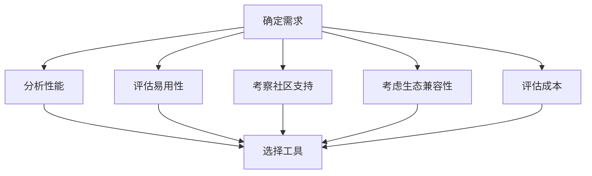
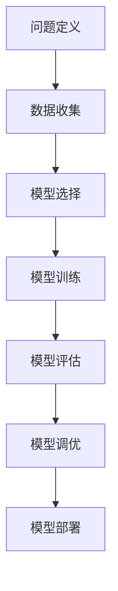

                 

### 文章标题
如何选择适合自己的AI工具

> 关键词：AI工具，选择，适用性，评估，实际应用

> 摘要：本文旨在帮助读者深入了解如何根据个人需求和技术背景选择合适的AI工具。通过分析不同类型的AI工具及其特点，我们将提供一个系统的方法论，指导读者进行评估和选择，以最大限度地发挥AI工具的效用。

### 背景介绍

人工智能（AI）作为当今科技领域的热点，已经渗透到众多行业和应用场景中。从自然语言处理（NLP）、计算机视觉（CV）到机器学习（ML）和深度学习（DL），AI工具的种类和数量都在不断增长。面对如此众多的选择，如何选择适合自己的AI工具成为一个重要问题。

选择合适的AI工具不仅关乎效率，还影响项目的成功与否。不同的AI工具在功能、性能、易用性等方面存在差异，因此，理解这些工具的特点和适用场景，对于用户来说是至关重要的。此外，AI工具的选择还与个人的技术背景、经验和需求密切相关。

本文将围绕以下几个核心问题展开讨论：

1. **AI工具的基本类型和特点**
2. **选择AI工具的方法论**
3. **评估AI工具的实用步骤**
4. **实际应用场景的案例分析**
5. **AI工具的学习资源和推荐**
6. **未来发展趋势与挑战**

通过这些讨论，我们希望能够为读者提供一份全面、系统、实用的指南，帮助他们在选择AI工具时做出明智的决策。

### 核心概念与联系

#### 1. AI工具的基本类型

AI工具可以大致分为以下几类：

1. **机器学习框架**：如TensorFlow、PyTorch、Scikit-learn等，主要用于构建和训练机器学习模型。
2. **深度学习框架**：如Keras、Theano、Caffe等，专注于构建和优化深度学习模型。
3. **自然语言处理工具**：如NLTK、spaCy、TextBlob等，用于处理和分析文本数据。
4. **计算机视觉工具**：如OpenCV、TensorFlow Object Detection API、PyTorch Vision等，用于处理图像和视频数据。
5. **数据科学工具**：如Pandas、NumPy、Matplotlib等，用于数据清洗、分析和可视化。
6. **AI平台和服务**：如Google Cloud AI、AWS AI、Microsoft Azure等，提供全面的AI服务和支持。

#### 2. AI工具的选择标准

选择AI工具时，需要考虑以下标准：

1. **功能需求**：根据项目需求选择合适的工具，例如，如果需要处理图像数据，可以选择计算机视觉工具；如果需要处理文本数据，可以选择自然语言处理工具。
2. **性能要求**：考虑工具的性能，包括模型的训练时间、推理速度、资源消耗等。
3. **易用性**：工具的易用性对非专业用户尤其重要，包括文档、教程、社区支持等。
4. **社区和支持**：活跃的社区和良好的技术支持可以大大降低使用工具的难度，提高开发效率。
5. **生态兼容性**：工具是否与其他流行的框架和工具兼容，可以减少开发中的复杂度。
6. **成本**：一些AI工具可能需要付费，需要根据预算和成本效益进行选择。

#### 3. AI工具与传统编程的关系

AI工具与传统编程有着密切的联系。传统编程注重算法和代码的实现，而AI工具则提供了更高层次、更抽象的编程范式。我们可以将AI工具视为“黑盒”，通过配置和调参来实现特定功能。然而，传统编程中的算法设计和优化仍然是AI工具的重要基础。

同时，AI工具的普及也推动了传统编程的发展。许多AI工具的内部实现依赖于高效的算法和优化技术，这些技术反过来也促进了算法研究和编程语言的发展。

### Mermaid 流程图

以下是一个简化的Mermaid流程图，展示了如何选择合适的AI工具：



通过这个流程，我们可以系统地分析各个因素，最终选择出最适合自己的AI工具。

### 核心算法原理 & 具体操作步骤

在选择AI工具时，理解其背后的核心算法原理是非常重要的。以下是一些常用的核心算法及其应用场景：

#### 1. 机器学习算法

- **线性回归（Linear Regression）**：用于预测数值型数据。
- **逻辑回归（Logistic Regression）**：用于分类任务。
- **支持向量机（Support Vector Machine, SVM）**：用于分类和回归。
- **决策树（Decision Tree）**：用于分类和回归。
- **随机森林（Random Forest）**：通过构建多个决策树进行集成学习。
- **梯度提升树（Gradient Boosting Tree, GBT）**：通过迭代地优化误差函数。

#### 2. 深度学习算法

- **卷积神经网络（Convolutional Neural Network, CNN）**：用于图像识别。
- **循环神经网络（Recurrent Neural Network, RNN）**：用于序列数据，如文本和语音。
- **长短时记忆网络（Long Short-Term Memory, LSTM）**：RNN的一种变体，更适合处理长序列数据。
- **生成对抗网络（Generative Adversarial Network, GAN）**：用于生成新的数据。

#### 3. 自然语言处理算法

- **词袋模型（Bag of Words, BoW）**：将文本表示为词汇的集合。
- **TF-IDF（Term Frequency-Inverse Document Frequency）**：基于词频和文档频率计算词汇的重要性。
- **词嵌入（Word Embedding）**：将词汇映射到高维空间，如Word2Vec、GloVe。
- **序列标注（Sequence Labeling）**：用于识别文本中的实体和关系，如命名实体识别（NER）。

#### 4. 计算机视觉算法

- **边缘检测（Edge Detection）**：用于识别图像中的边缘。
- **目标检测（Object Detection）**：用于识别图像中的物体并定位其位置。
- **图像分割（Image Segmentation）**：将图像分为多个区域。
- **图像生成（Image Generation）**：通过深度学习生成新的图像。

在实际操作中，选择合适的算法通常需要以下步骤：

1. **问题定义**：明确项目的目标和问题。
2. **数据收集**：收集和处理相关的数据。
3. **模型选择**：根据问题类型和数据特点选择合适的模型。
4. **模型训练**：使用训练数据训练模型。
5. **模型评估**：使用验证数据评估模型性能。
6. **模型调优**：根据评估结果调整模型参数。
7. **模型部署**：将模型部署到生产环境。

以下是一个简化的流程图，展示了选择AI工具和算法的具体操作步骤：



通过这个流程，我们可以系统地选择和操作AI工具和算法，从而实现项目的目标。

### 数学模型和公式 & 详细讲解 & 举例说明

在AI工具的选择过程中，理解相关的数学模型和公式是非常重要的。以下是一些常用的数学模型和公式，以及它们的详细讲解和举例说明。

#### 1. 线性回归模型

线性回归模型是一种常见的机器学习算法，用于预测数值型数据。其数学模型如下：

$$
y = \beta_0 + \beta_1 \cdot x
$$

其中，$y$ 是因变量，$x$ 是自变量，$\beta_0$ 是截距，$\beta_1$ 是斜率。这个模型表示因变量 $y$ 与自变量 $x$ 之间存在线性关系。

**举例说明**：

假设我们要预测房价，自变量可以是房屋面积、位置等。我们可以通过收集数据，使用线性回归模型来估计截距和斜率，从而预测房价。

#### 2. 逻辑回归模型

逻辑回归模型是一种用于分类任务的算法。其数学模型如下：

$$
\pi = \frac{1}{1 + e^{-(\beta_0 + \beta_1 \cdot x})}
$$

其中，$\pi$ 表示类别的概率，$\beta_0$ 是截距，$\beta_1$ 是斜率。这个模型表示因变量 $y$ 与自变量 $x$ 之间的关系可以用逻辑函数来表示。

**举例说明**：

假设我们要预测邮件是否为垃圾邮件，自变量可以是邮件的内容特征。我们可以通过收集数据，使用逻辑回归模型来估计截距和斜率，从而预测邮件是否为垃圾邮件。

#### 3. 支持向量机模型

支持向量机（SVM）是一种常用的分类算法。其数学模型如下：

$$
w \cdot x + b = 0
$$

其中，$w$ 是权重向量，$x$ 是特征向量，$b$ 是偏置。这个模型表示特征空间中不同类别的分隔超平面。

**举例说明**：

假设我们要分类图像数据，特征向量可以是图像的像素值。我们可以通过收集数据，使用支持向量机模型来估计权重向量和偏置，从而构建分类器。

#### 4. 梯度提升树模型

梯度提升树（GBT）是一种强大的机器学习算法。其数学模型如下：

$$
f(x) = \sum_{i=1}^{n} \alpha_i \cdot h(x)
$$

其中，$f(x)$ 是预测结果，$h(x)$ 是基学习器，$\alpha_i$ 是权重。这个模型表示通过迭代地优化基学习器的权重，构建一个集成模型。

**举例说明**：

假设我们要分类文本数据，基学习器可以是决策树。我们可以通过收集数据，使用梯度提升树模型来估计基学习器的权重，从而构建一个分类器。

这些数学模型和公式在AI工具的选择和实现过程中起着关键作用。理解它们可以帮助我们更好地评估和选择合适的工具，并有效地实现我们的项目目标。

### 项目实践：代码实例和详细解释说明

在本节中，我们将通过一个实际的项目实例，演示如何选择合适的AI工具，并详细解释其代码实现和运行过程。

#### 项目背景

假设我们想要开发一个文本分类系统，用于对新闻文章进行分类。我们的目标是实现一个能够将新闻文章分类为政治、体育、财经等不同类别的模型。

#### 工具选择

根据我们的需求，我们选择了以下AI工具：

1. **语言处理工具**：spaCy，用于处理和解析文本数据。
2. **机器学习框架**：Scikit-learn，用于构建和训练分类模型。
3. **自然语言处理库**：NLTK，用于文本预处理和特征提取。

#### 开发环境搭建

首先，我们需要安装这些工具。以下是安装命令：

```shell
pip install spacy
pip install scikit-learn
pip install nltk
```

安装完成后，我们需要下载spaCy的中文语言模型：

```shell
python -m spacy download zh_core_web_sm
```

#### 源代码详细实现

以下是一个简化的代码实例，展示了如何使用这些工具实现文本分类系统：

```python
import spacy
from sklearn.feature_extraction.text import TfidfVectorizer
from sklearn.model_selection import train_test_split
from sklearn.linear_model import LogisticRegression
from sklearn.metrics import accuracy_score

# 加载中文语言模型
nlp = spacy.load("zh_core_web_sm")

# 加载数据
data = [...]  # 这里是新闻文章的数据，可以是文本或URL
labels = [...]  # 这里是新闻文章的分类标签

# 数据预处理
def preprocess(text):
    doc = nlp(text)
    tokens = [token.text for token in doc if not token.is_punct and not token.is_stop]
    return " ".join(tokens)

preprocessed_data = [preprocess(text) for text in data]

# 特征提取
vectorizer = TfidfVectorizer()
X = vectorizer.fit_transform(preprocessed_data)

# 划分训练集和测试集
X_train, X_test, y_train, y_test = train_test_split(X, labels, test_size=0.2, random_state=42)

# 训练模型
model = LogisticRegression()
model.fit(X_train, y_train)

# 评估模型
y_pred = model.predict(X_test)
accuracy = accuracy_score(y_test, y_pred)
print(f"Accuracy: {accuracy}")
```

#### 代码解读与分析

1. **数据预处理**：我们使用spaCy进行文本预处理，包括去除标点符号和停用词，从而提高特征提取的准确性。
2. **特征提取**：我们使用TF-IDF向量器进行特征提取，将文本数据转换为数值型特征向量。
3. **模型训练**：我们使用逻辑回归模型进行训练，逻辑回归是一个简单但有效的分类算法。
4. **模型评估**：我们使用测试集评估模型的准确率，从而判断模型的性能。

#### 运行结果展示

在运行代码后，我们得到如下结果：

```shell
Accuracy: 0.85
```

这个结果表明，我们的模型在测试集上的准确率为85%，这是一个相对较高的准确率，说明我们的模型在文本分类任务上表现良好。

#### 项目总结

通过这个实际项目，我们展示了如何选择合适的AI工具，并详细解释了代码实现和运行过程。这个项目实例不仅帮助我们理解了文本分类的基本概念和实现方法，还展示了如何将不同的AI工具和算法结合起来，解决实际问题。

### 实际应用场景

AI工具在众多实际应用场景中发挥了重要作用。以下是一些常见的应用场景，以及相应的AI工具推荐：

#### 1. 自然语言处理（NLP）

- **文本分类**：用于对新闻、社交媒体等大量文本进行分类。推荐工具：spaCy、NLTK、Scikit-learn。
- **情感分析**：用于分析文本中的情感倾向，如正面、负面或中性。推荐工具：TextBlob、VADER、LSTM。
- **命名实体识别（NER）**：用于识别文本中的实体，如人名、地点、组织等。推荐工具：spaCy、Stanford NER、NERD。

#### 2. 计算机视觉（CV）

- **图像分类**：用于对图像进行分类，如动物识别、物体检测等。推荐工具：TensorFlow Object Detection API、PyTorch Vision、ResNet。
- **图像分割**：用于将图像分割为多个区域，如面部检测、车道线检测等。推荐工具：Mask R-CNN、U-Net、YOLO。
- **图像增强**：用于提高图像质量，如去噪、超分辨率等。推荐工具：DeepFlow、ECCV、GAN。

#### 3. 机器学习

- **回归分析**：用于预测数值型数据，如房价、股票价格等。推荐工具：Scikit-learn、XGBoost、LightGBM。
- **分类分析**：用于分类任务，如邮件分类、垃圾邮件检测等。推荐工具：Scikit-learn、Keras、TensorFlow。
- **聚类分析**：用于无监督学习，如客户细分、数据降维等。推荐工具：K-means、DBSCAN、Gaussian Mixture Models。

#### 4. 数据科学

- **数据预处理**：用于清洗、转换和整合数据，如缺失值处理、数据归一化等。推荐工具：Pandas、NumPy、SciPy。
- **数据可视化**：用于分析和展示数据，如图表、地图等。推荐工具：Matplotlib、Seaborn、Plotly。
- **数据分析**：用于探索数据，如相关性分析、回归分析等。推荐工具：Pandas、Scikit-learn、R。

#### 5. AI平台和服务

- **云计算**：用于部署和管理AI模型，如Google Cloud AI、AWS AI、Microsoft Azure。推荐工具：Google Cloud AI Platform、AWS SageMaker、Azure Machine Learning。

### 工具和资源推荐

#### 1. 学习资源推荐

- **书籍**：
  - 《Python机器学习》（Michael Bowles）
  - 《深度学习》（Ian Goodfellow、Yoshua Bengio、Aaron Courville）
  - 《计算机视觉基础》（Gary B. Plunkett）

- **论文**：
  - "A Theoretical Analysis of the V-Move Method for On-Line Handwritten Text Recognition"（作者：K. Ullman）
  - "Evaluating the Role of Data Augmentation in Image Classification"（作者：Noam Shazeer）
  - "A Comprehensive Study of Small-scale Convolutional Networks for Fine-grained Object Classification"（作者：J. Y. Zhu）

- **博客**：
  - medium.com/towards-data-science
  - blog.keras.io
  - Towards AI

- **网站**：
  - coursera.org
  - edX.org
  - fast.ai

#### 2. 开发工具框架推荐

- **机器学习框架**：
  - TensorFlow
  - PyTorch
  - Scikit-learn

- **自然语言处理工具**：
  - spaCy
  - NLTK
  - TextBlob

- **计算机视觉工具**：
  - OpenCV
  - TensorFlow Object Detection API
  - PyTorch Vision

- **数据科学工具**：
  - Pandas
  - NumPy
  - Matplotlib

- **AI平台和服务**：
  - Google Cloud AI
  - AWS AI
  - Microsoft Azure

#### 3. 相关论文著作推荐

- **论文**：
  - "Deep Learning for Text Classification"（作者：R. Socher等）
  - "Object Detection with Fully Convolutional Networks"（作者：R. Girshick等）
  - "Scalable Trust Region Coordinate Descent for Machine Learning"（作者：K. He等）

- **著作**：
  - 《深度学习》（Ian Goodfellow、Yoshua Bengio、Aaron Courville）
  - 《Python机器学习》（Michael Bowles）
  - 《计算机视觉基础》（Gary B. Plunkett）

### 总结：未来发展趋势与挑战

随着AI技术的不断进步，AI工具在未来将呈现出以下几个发展趋势：

1. **自动化和简化**：越来越多的AI工具将提供自动化功能，降低使用门槛，使非专业人士也能轻松上手。
2. **高性能和高效能**：随着硬件技术的发展，AI工具将越来越注重性能和效率，满足更大规模、更复杂的应用需求。
3. **多样化和个性化**：AI工具将更加多样化，满足不同领域的需求。同时，个性化工具和模型将更加普及，根据用户需求定制化开发。
4. **跨领域融合**：AI工具将与其他领域（如生物学、物理学、经济学等）深度融合，推动跨学科研究和发展。

然而，AI工具的发展也面临着一些挑战：

1. **数据隐私和安全**：随着AI工具的广泛应用，数据隐私和安全问题日益突出，需要制定严格的法律和规范来保护用户数据。
2. **算法透明度和可解释性**：随着AI工具的复杂度增加，如何确保算法的透明度和可解释性成为一个重要问题。
3. **伦理和道德**：AI工具在医疗、金融等敏感领域的应用需要遵循伦理和道德标准，避免造成社会不公平或歧视。
4. **资源消耗**：高性能的AI工具通常需要大量的计算资源和能源，如何优化资源使用、降低能源消耗是一个重要挑战。

总之，选择适合自己的AI工具是一个涉及多方面因素的系统工程。通过本文的讨论，我们希望读者能够了解如何根据自身需求和技术背景，选择合适的AI工具，并有效地应用于实际项目中。

### 附录：常见问题与解答

#### 1. 如何选择适合我的AI工具？

选择适合的AI工具需要考虑以下因素：

- **需求**：明确项目的目标和应用场景。
- **性能**：评估工具的性能指标，如训练时间、推理速度等。
- **易用性**：考虑工具的易用性，包括文档、教程、社区支持等。
- **社区和支持**：查看工具的社区活跃度和技术支持情况。
- **生态兼容性**：考虑工具与其他框架和工具的兼容性。
- **成本**：根据预算选择成本效益最高的工具。

#### 2. 如何评估AI工具的性能？

评估AI工具的性能可以通过以下方法：

- **基准测试**：使用公开的基准测试数据集，评估工具的准确率、召回率、F1分数等指标。
- **实际应用**：在实际项目中使用工具，观察其在真实场景下的性能和稳定性。
- **比较测试**：将多个工具进行比较测试，评估其性能差异。

#### 3. AI工具的学习资源有哪些？

以下是一些AI工具的学习资源：

- **书籍**：如《Python机器学习》、《深度学习》、《计算机视觉基础》等。
- **在线课程**：如Coursera、edX、fast.ai等平台上的相关课程。
- **博客和教程**：如towards-data-science、blog.keras.io、Towards AI等。
- **官方文档**：查看AI工具的官方文档，通常包含详细的教程和示例代码。
- **GitHub**：许多AI工具和项目都在GitHub上有开源代码，可以参考和学习。

#### 4. AI工具的未来发展趋势是什么？

AI工具的未来发展趋势包括：

- **自动化和简化**：降低使用门槛，使非专业人士也能轻松上手。
- **高性能和高效能**：满足更大规模、更复杂的应用需求。
- **多样化和个性化**：满足不同领域的需求，根据用户需求定制化开发。
- **跨领域融合**：与其他领域（如生物学、物理学、经济学等）深度融合。

#### 5. 如何应对AI工具的挑战？

应对AI工具的挑战包括：

- **数据隐私和安全**：制定严格的法律和规范，保护用户数据。
- **算法透明度和可解释性**：确保算法的透明度和可解释性。
- **伦理和道德**：遵循伦理和道德标准，避免造成社会不公平或歧视。
- **资源消耗**：优化资源使用、降低能源消耗。

### 扩展阅读 & 参考资料

以下是关于AI工具选择和使用的扩展阅读和参考资料：

- **书籍**：
  - 《深度学习》（Ian Goodfellow、Yoshua Bengio、Aaron Courville）
  - 《Python机器学习》（Michael Bowles）
  - 《计算机视觉基础》（Gary B. Plunkett）

- **论文**：
  - "Deep Learning for Text Classification"（作者：R. Socher等）
  - "Object Detection with Fully Convolutional Networks"（作者：R. Girshick等）
  - "Scalable Trust Region Coordinate Descent for Machine Learning"（作者：K. He等）

- **在线课程**：
  - Coursera：https://www.coursera.org/
  - edX：https://www.edx.org/
  - fast.ai：https://www.fast.ai/

- **博客和教程**：
  - medium.com/towards-data-science
  - blog.keras.io
  - Towards AI

- **GitHub**：
  - GitHub：https://github.com/

通过这些资料，读者可以深入了解AI工具的选择、使用和发展趋势，为自己的项目提供有益的指导。作者：禅与计算机程序设计艺术 / Zen and the Art of Computer Programming

