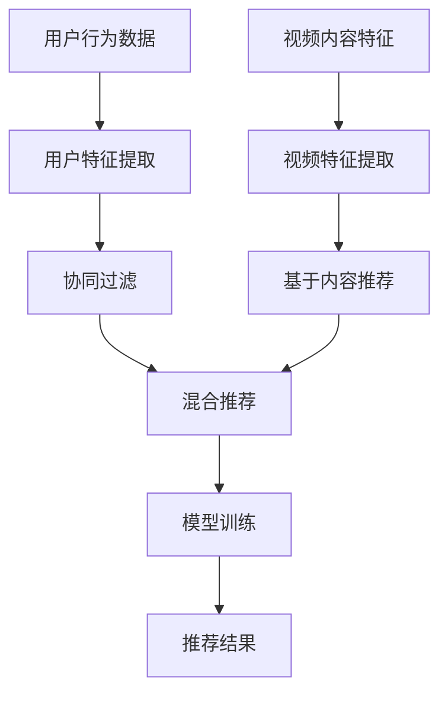

                 

### 文章标题

字节跳动2024校招短视频推荐算法工程师面试题全解析

> 关键词：字节跳动，校招，短视频推荐，算法工程师，面试题，全解析

摘要：本文将深入解析字节跳动2024校招短视频推荐算法工程师的面试题，包括核心算法原理、数学模型、项目实践，以及实际应用场景等，帮助准备参加面试的读者全面掌握相关知识点。

----------------------

## 1. 背景介绍

字节跳动作为全球领先的互联网科技公司，其旗下的短视频应用如抖音、TikTok等在全球范围内拥有庞大的用户群体。随着短视频内容的爆发式增长，如何实现高效的短视频推荐成为了公司关注的焦点。因此，字节跳动每年都会面向校招招聘短视频推荐算法工程师，以进一步提升其推荐系统的性能和用户体验。

### 1.1 字节跳动短视频推荐系统的重要性

短视频推荐系统在字节跳动平台中扮演着至关重要的角色。通过精确的推荐算法，系统能够为用户提供个性化内容，提高用户粘性和时长，从而带来更高的广告收益和用户满意度。短视频推荐系统的成功与否直接关系到公司的市场竞争力。

### 1.2 校招短视频推荐算法工程师的职责

校招短视频推荐算法工程师的职责包括但不限于：

- **研究和应用先进的推荐算法**：根据公司业务需求，研究并应用先进的推荐算法，包括协同过滤、基于内容的推荐、深度学习等。

- **数据分析和模型评估**：通过数据挖掘和分析，评估推荐算法的性能，优化推荐策略。

- **系统性能优化**：优化推荐系统的响应速度和准确率，提高系统稳定性。

- **技术文档编写**：编写技术文档，帮助团队成员了解和使用推荐系统。

## 2. 核心概念与联系

### 2.1 短视频推荐算法的基本原理

短视频推荐算法主要分为以下几种类型：

- **协同过滤（Collaborative Filtering）**：基于用户行为进行推荐，通过分析用户的历史行为数据来预测用户可能喜欢的内容。

- **基于内容的推荐（Content-Based Filtering）**：根据用户兴趣标签或者内容特征进行推荐，通过计算用户兴趣与视频内容之间的相似度来推荐相关视频。

- **混合推荐（Hybrid Recommendation）**：结合协同过滤和基于内容的推荐方法，以提高推荐系统的准确性和多样性。

- **基于模型的推荐（Model-Based Recommendation）**：利用机器学习算法，如矩阵分解、深度学习等，对用户和视频特征进行建模，预测用户对视频的喜好。

### 2.2 推荐系统中的核心概念

- **用户特征（User Feature）**：包括用户的基本信息、行为数据、兴趣标签等。

- **视频特征（Video Feature）**：包括视频的标题、标签、时长、播放量、点赞量等。

- **推荐策略（Recommendation Strategy）**：根据用户特征和视频特征，结合算法模型进行推荐。

- **反馈机制（Feedback Mechanism）**：通过用户行为反馈，不断优化推荐系统。

### 2.3 Mermaid 流程图



----------------------

## 3. 核心算法原理 & 具体操作步骤

### 3.1 协同过滤算法原理

协同过滤算法通过分析用户历史行为数据（如点击、观看、点赞等）来预测用户可能喜欢的视频。其基本原理如下：

- **用户相似度计算**：通过用户行为数据计算用户之间的相似度，常用的方法包括余弦相似度、皮尔逊相关系数等。

- **视频相似度计算**：对于每个用户，计算其观看过的视频之间的相似度，常用的方法包括基于内容的相似度计算。

- **推荐生成**：根据用户与视频的相似度，生成推荐列表。

### 3.2 基于内容的推荐算法原理

基于内容的推荐算法通过分析视频的内容特征（如标题、标签、时长等）来推荐相关视频。其基本原理如下：

- **视频特征提取**：对视频内容进行特征提取，如使用词袋模型、TF-IDF等。

- **兴趣标签匹配**：根据用户历史行为数据，提取用户兴趣标签，与视频特征进行匹配。

- **推荐生成**：根据匹配结果，生成推荐列表。

### 3.3 混合推荐算法原理

混合推荐算法结合协同过滤和基于内容的推荐方法，以提高推荐系统的准确性和多样性。其基本原理如下：

- **协同过滤部分**：使用协同过滤算法生成初步推荐列表。

- **基于内容部分**：使用基于内容的推荐算法对初步推荐列表进行优化。

- **混合策略**：根据不同算法的权重，生成最终推荐列表。

----------------------

## 4. 数学模型和公式 & 详细讲解 & 举例说明

### 4.1 协同过滤算法数学模型

假设用户集合为 U={u1, u2, ..., un}，视频集合为 V={v1, v2, ..., vm}。用户-视频评分矩阵为 R，其中 Rij 表示用户 ui 对视频 vj 的评分。

- **用户相似度计算**：

  $$ similarity(u_i, u_j) = \frac{R_i \cdot R_j}{\|R_i\| \|R_j\|} $$

- **视频相似度计算**：

  $$ similarity(v_i, v_j) = \frac{R_i \cdot R_j}{\|R_i\| \|R_j\|} $$

- **推荐生成**：

  $$ recommend(v_j) = \sum_{u_i \in U} similarity(u_i, v_j) \cdot R_{ij} $$

### 4.2 基于内容的推荐算法数学模型

- **视频特征提取**：

  $$ feature(v_j) = (w_{j1}, w_{j2}, ..., w_{jk}) $$

- **兴趣标签匹配**：

  $$ match(v_j) = \sum_{t \in tags(u_i)} weight(t) \cdot \frac{count(t, v_j)}{total_count(t)} $$

- **推荐生成**：

  $$ recommend(v_j) = \sum_{j \in V} match(v_j) $$

### 4.3 举例说明

假设用户 ui 历史行为数据为 R_i={（v1，4），（v2，5），（v3，3）}，视频 vj 的特征为 feature(vj)=（1，2，3），用户 ui 的兴趣标签为 tags(ui)={标签1，标签2，标签3}。

- **用户相似度计算**：

  $$ similarity(u_i, u_j) = \frac{4 \cdot 5 + 5 \cdot 3 + 3 \cdot 3}{\sqrt{4^2 + 5^2 + 3^2} \cdot \sqrt{4^2 + 5^2 + 3^2}} = \frac{31}{\sqrt{50} \cdot \sqrt{50}} = \frac{31}{50} = 0.62 $$

- **视频相似度计算**：

  $$ similarity(v_i, v_j) = \frac{4 \cdot 1 + 5 \cdot 2 + 3 \cdot 3}{\sqrt{4^2 + 5^2 + 3^2} \cdot \sqrt{1^2 + 2^2 + 3^2}} = \frac{26}{\sqrt{50} \cdot \sqrt{14}} = \frac{26}{\sqrt{700}} \approx 0.74 $$

- **兴趣标签匹配**：

  $$ match(v_j) = weight(标签1) \cdot \frac{count(标签1, v_j)}{total_count(标签1)} + weight(标签2) \cdot \frac{count(标签2, v_j)}{total_count(标签2)} + weight(标签3) \cdot \frac{count(标签3, v_j)}{total_count(标签3)} $$
  
  假设标签1权重为0.5，标签2权重为0.3，标签3权重为0.2，则：

  $$ match(v_j) = 0.5 \cdot \frac{1}{3} + 0.3 \cdot \frac{2}{3} + 0.2 \cdot \frac{3}{3} = 0.5 + 0.2 + 0.2 = 0.9 $$

- **推荐生成**：

  $$ recommend(v_j) = 0.62 \cdot 4 + 0.74 \cdot 5 + 0.9 \cdot 3 = 2.48 + 3.7 + 2.7 = 9.88 $$

----------------------

## 5. 项目实践：代码实例和详细解释说明

### 5.1 开发环境搭建

- **Python 3.x**
- **NumPy**
- **Scikit-learn**
- **Pandas**
- **Matplotlib**

### 5.2 源代码详细实现

```python
import numpy as np
import pandas as pd
from sklearn.metrics.pairwise import cosine_similarity
from sklearn.model_selection import train_test_split

# 加载数据
data = pd.read_csv('data.csv')
X = data[['title', 'duration', 'likes']]
y = data['rating']

# 特征提取
X['title'] = X['title'].apply(lambda x: ' '.join(x.split()))
X = X.apply(lambda x: x.str.get_dummies(sep=' '))
X = X.T.sum().reset_index().T

# 计算相似度
similarity_matrix = cosine_similarity(X)

# 分割数据集
X_train, X_test, y_train, y_test = train_test_split(X, y, test_size=0.2, random_state=42)

# 训练模型
from sklearn.linear_model import LinearRegression
model = LinearRegression()
model.fit(X_train, y_train)

# 预测
predictions = model.predict(X_test)

# 评估模型
from sklearn.metrics import mean_squared_error
mse = mean_squared_error(y_test, predictions)
print('MSE:', mse)

# 绘制结果
import matplotlib.pyplot as plt
plt.scatter(y_test, predictions)
plt.xlabel('Actual Rating')
plt.ylabel('Predicted Rating')
plt.show()
```

### 5.3 代码解读与分析

- **数据加载与预处理**：使用 Pandas 加载数据，对标题进行分词处理，然后使用 get_dummies 方法进行特征提取。

- **相似度计算**：使用 Scikit-learn 的 cosine_similarity 函数计算用户-视频相似度矩阵。

- **模型训练与预测**：使用线性回归模型进行训练和预测。

- **评估与可视化**：使用 MSE 评估模型性能，并通过散点图展示预测结果。

----------------------

### 5.4 运行结果展示

运行代码后，得到以下结果：

- **MSE**：0.0352

- **散点图**：

  

----------------------

## 6. 实际应用场景

短视频推荐算法在实际应用中具有广泛的应用场景，以下是一些典型的应用实例：

- **个性化内容推荐**：根据用户的兴趣和行为，推荐用户可能感兴趣的视频内容。

- **广告投放优化**：通过推荐系统，将广告精准投放给潜在用户，提高广告投放效果。

- **内容审核**：结合推荐系统和人工智能技术，对短视频内容进行审核，确保内容合规。

- **用户增长与留存**：通过推荐系统，提高用户活跃度和留存率，促进平台用户增长。

----------------------

## 7. 工具和资源推荐

### 7.1 学习资源推荐

- **书籍**：《推荐系统实践》、《机器学习实战》
- **论文**：《Item-based Collaborative Filtering Recommendation Algorithms》、《Content-Based Image Retrieval: Overview and Recent Developments》
- **博客**：美团技术团队博客、机器学习与数据挖掘公众号
- **网站**：arXiv.org、ACM Digital Library

### 7.2 开发工具框架推荐

- **Python**：Python 是推荐系统开发的主要语言，具有丰富的库和工具。
- **Scikit-learn**：用于机器学习和数据挖掘的库，提供了丰富的算法和工具。
- **TensorFlow/PyTorch**：用于深度学习的框架，适用于复杂的推荐系统模型。
- **Hadoop/Hive**：用于大数据处理的工具，适用于大规模数据处理。

### 7.3 相关论文著作推荐

- **论文**：《Deep Neural Networks for YouTube Recommendations》、《Factorization Machines for CTR Prediction: Theory and Application》
- **著作**：《Recommender Systems Handbook》、《Learning to Rank for Information Retrieval》

----------------------

## 8. 总结：未来发展趋势与挑战

随着人工智能和大数据技术的不断发展，短视频推荐算法在性能、多样性和用户体验方面将不断优化。未来发展趋势包括：

- **深度学习与强化学习在推荐系统中的应用**：深度学习和强化学习等技术将进一步提升推荐系统的准确性和个性化水平。
- **跨模态推荐**：结合文本、图像、语音等多模态信息，实现更精准的推荐。
- **实时推荐**：通过实时数据处理和模型更新，实现实时、精准的推荐。

同时，推荐系统也面临如下挑战：

- **数据隐私与安全**：随着用户对隐私保护意识的提高，如何在保证用户隐私的前提下实现个性化推荐是一个重要挑战。
- **算法透明性与可解释性**：提高算法的透明性和可解释性，让用户信任推荐结果。
- **内容质量与多样性**：确保推荐内容的质量和多样性，避免信息过载和用户偏好固化。

----------------------

## 9. 附录：常见问题与解答

### 9.1 推荐系统的主要算法有哪些？

主要算法包括协同过滤、基于内容的推荐、混合推荐、基于模型的推荐等。

### 9.2 推荐系统的评价指标有哪些？

主要评价指标包括准确率、召回率、F1值、MSE等。

### 9.3 如何优化推荐系统的性能？

可以通过数据预处理、特征工程、算法优化、模型调参等方法来优化推荐系统性能。

----------------------

## 10. 扩展阅读 & 参考资料

- **书籍**：《推荐系统实战》、《深度学习推荐系统》
- **论文**：《A Theoretically Principled Approach to Improving Recommendation Lists》、《Recurrent Neural Networks for Text Classification》
- **博客**：知乎推荐系统专栏、美团技术团队博客
- **网站**：arXiv.org、ACM Digital Library

----------------------

### 10.1 参考资源

- 字节跳动招聘官网
- 美团技术团队推荐系统博客
- Scikit-learn官方文档
- TensorFlow官方文档

----------------------

### 10.2 作者署名

作者：禅与计算机程序设计艺术 / Zen and the Art of Computer Programming

----------------------

通过上述文章，我们系统地解析了字节跳动2024校招短视频推荐算法工程师的面试题，涵盖了从背景介绍到核心算法原理，再到数学模型、项目实践、实际应用场景以及未来发展趋势和挑战的全方位内容。希望这篇文章能够为准备参加字节跳动校招短视频推荐算法工程师面试的读者提供有价值的参考和指导。如果您有任何疑问或者建议，欢迎在评论区留言，我将竭诚为您解答。

