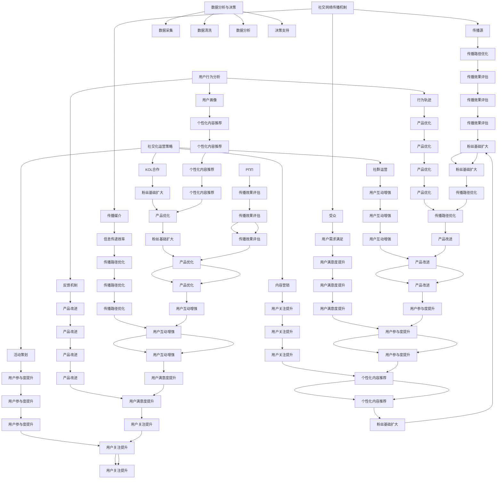

                 

### 背景介绍（Background Introduction）

**文章标题**：2024字节跳动校招：技术用户社交策略专家面试题汇总

**关键词**：字节跳动、校招、技术用户、社交策略、面试题

**摘要**：本文将汇总2024年字节跳动校招中技术用户社交策略专家的面试题，通过对这些问题的深入分析，帮助读者了解该岗位的核心要求和应对策略。文章将从面试题的类型、考察重点、解题思路等方面进行全面剖析，为求职者提供实用的参考和指导。

随着字节跳动作为互联网科技巨头的崛起，其对人才的需求也日益增长。字节跳动在招聘中，不仅注重技术能力，更看重候选人对用户社交策略的理解和实践。作为技术用户社交策略专家，求职者需要具备扎实的技术背景，同时熟悉用户行为和社交网络传播机制，能够为企业提供有效的用户增长和社交化运营方案。

本文将通过分析2024年字节跳动校招技术用户社交策略专家的面试题，帮助求职者了解这一岗位的职责和要求，掌握解题技巧，提升面试成功率。文章将从以下几个方面展开：

1. **面试题类型**：介绍常见面试题型，包括编程题、算法题、业务理解题等。
2. **考察重点**：分析每个题型的核心考察内容，帮助读者明确面试官的关注点。
3. **解题思路**：结合实例，详细讲解解题思路和方法，提供解题步骤和关键点。
4. **实战演练**：提供实战案例，让读者通过具体问题演练，提升实战能力。
5. **总结与展望**：对面试题进行总结，展望未来技术用户社交策略的发展趋势。

通过本文的阅读，读者不仅可以了解字节跳动校招技术用户社交策略专家的面试要求，还可以掌握相关领域的知识和技能，为未来的求职之路打下坚实基础。接下来，我们将逐一分析不同类型的面试题，带领读者走进技术用户社交策略的深层次探讨。

### 1. 面试题类型（Types of Interview Questions）

在2024年字节跳动校招中，技术用户社交策略专家的面试题涵盖了多个方面，主要分为编程题、算法题和业务理解题。这些题目不仅考察了求职者的技术能力，还测试了其对业务的理解和解决问题的能力。

**编程题**：编程题是面试中的常见题型，主要考察求职者的编程基础和实际编码能力。这类题目通常要求实现特定功能或解决具体问题，涉及语言基础、数据结构、算法等知识点。例如，实现一个函数，对一组数据进行排序或查找；编写一个算法，解决图论中的某个问题。

**算法题**：算法题相较于编程题更具挑战性，主要考察求职者的算法设计能力和逻辑思维能力。这类题目通常需要运用各种算法和数据结构，解决复杂的问题。例如，设计一个高效的算法，计算两个大整数的乘积；通过二分查找算法，找到数组中的特定元素。

**业务理解题**：业务理解题是考察求职者对字节跳动业务和用户社交策略的理解。这类题目通常要求求职者结合实际业务场景，提出具体的解决方案或策略。例如，分析某款产品在用户增长和活跃度方面的改进措施；设计一个社交化运营方案，提升用户参与度和粘性。

**案例解析**：

**编程题示例**：请实现一个函数，输入一组整数，返回其中的最大值和最小值的差。

```python
def max_min_diff(arr):
    if not arr:
        return 0
    max_val = arr[0]
    min_val = arr[0]
    for num in arr:
        if num > max_val:
            max_val = num
        elif num < min_val:
            min_val = num
    return max_val - min_val
```

**算法题示例**：给定一个无向图，请设计一个算法，计算图中两个顶点之间的最短路径。

```python
def shortest_path(graph, start, end):
    distances = {node: float('infinity') for node in graph}
    distances[start] = 0
    visited = set()
    while visited != set(graph):
        current = min((dist, node) for node, dist in distances.items() if node not in visited)
        visited.add(current[1])
        for neighbor, weight in graph[current[1]].items():
            distances[neighbor] = min(distances[neighbor], current[0] + weight)
    return distances[end]
```

**业务理解题示例**：字节跳动推出了一款新社交产品，目标用户是大学生群体。请设计一个用户增长策略，提升产品在大学生中的影响力。

1. **内容营销**：制作有趣、有教育意义的短视频，分享学习资源和生活技巧，吸引大学生用户关注。
2. **校园合作**：与各大高校合作，举办线上线下活动，例如校园挑战赛、主题沙龙等，增加用户参与度。
3. **KOL推广**：邀请知名大学生博主和网红进行产品推广，利用他们的粉丝基础扩大用户群体。

通过以上示例，我们可以看到不同类型的面试题在考察内容和技术要求上的差异。编程题主要测试编程基础和编码能力，算法题则侧重于算法设计能力和逻辑思维，业务理解题则需要求职者结合实际业务场景，提出具体的解决方案。了解不同类型面试题的特点和考察重点，有助于求职者在准备面试时更有针对性地提升自身能力。

### 2. 核心概念与联系（Core Concepts and Connections）

在深入探讨技术用户社交策略专家面试题之前，我们需要了解几个核心概念，这些概念不仅构成了面试题的基础，也是理解字节跳动业务和用户社交策略的关键。

#### 2.1 社交网络传播机制（Social Network Diffusion Mechanism）

社交网络传播机制是指信息在社交网络中的传播过程和规律。理解这一机制对于设计有效的社交化运营策略至关重要。社交网络传播通常包括以下几个关键环节：

1. **传播源**：传播源是信息的起始点，可以是个人、组织或媒体。在字节跳动产品中，传播源可能是知名博主、网红或普通用户。
2. **传播媒介**：传播媒介是信息传递的渠道，如朋友圈、微博、抖音等。字节跳动旗下产品如抖音、微博等都是重要的传播媒介。
3. **受众**：受众是接收和传播信息的用户群体。在字节跳动产品中，受众主要包括年轻人、中小企业主等。

社交网络传播机制的关键在于如何通过传播源和传播媒介，将信息快速、广泛地传递给受众。这涉及到信息的吸引力、传播路径的优化、受众的心理和行为特征等多方面因素。

#### 2.2 用户行为分析（User Behavior Analysis）

用户行为分析是了解和预测用户行为，从而制定有效运营策略的基础。字节跳动通过大数据分析和机器学习技术，对用户行为进行深入分析，主要包括以下几个方面：

1. **用户画像**：通过对用户的基本信息、兴趣偏好、行为习惯等进行综合分析，构建用户的完整画像。这有助于企业更好地了解用户需求，提供个性化的内容和服务。
2. **行为轨迹**：分析用户在使用字节跳动产品时的浏览、点赞、评论、分享等行为轨迹，发现用户行为模式。这有助于优化产品设计和运营策略，提高用户粘性。
3. **反馈机制**：通过用户反馈，如举报、投诉、建议等，了解用户对产品的不满意之处，及时调整和改进。

#### 2.3 社交化运营策略（Socialized Operation Strategy）

社交化运营策略是指利用社交网络的特性，结合用户行为分析，实现产品用户增长和活跃度提升的一系列策略。字节跳动在这方面有着丰富的实践经验，主要包括以下几种：

1. **内容营销**：通过创作和推广优质内容，吸引目标用户关注和参与。例如，抖音通过短视频内容吸引大量年轻用户。
2. **KOL合作**：与知名意见领袖（KOL）合作，借助他们的影响力和粉丝基础，推广产品或服务。
3. **社群运营**：创建和运营用户社群，增强用户之间的互动和粘性。例如，微信朋友圈和微博的话题功能都是有效的社群运营手段。
4. **活动策划**：策划线上线下活动，提高用户参与度和忠诚度。例如，抖音的挑战赛、微博的抽奖活动等。

#### 2.4 数据分析与决策（Data Analysis and Decision-making）

在字节跳动，数据是决策的重要依据。通过对用户数据、业务数据等进行分析，企业可以做出更加精准和高效的决策。数据分析与决策主要包括以下几个方面：

1. **数据采集**：通过数据采集工具，收集用户行为数据、业务数据等。
2. **数据清洗**：对采集到的数据进行清洗和整理，确保数据质量和准确性。
3. **数据分析**：利用统计学和机器学习技术，对数据进行深入分析，提取有价值的信息和洞察。
4. **决策支持**：基于数据分析结果，为企业决策提供支持，如产品优化、运营策略调整等。

### 2.5 Mermaid 流程图

为了更好地理解上述核心概念和它们之间的联系，我们可以使用 Mermaid 流程图来展示它们的关系：



通过上述核心概念和流程图的展示，我们可以更清晰地理解技术用户社交策略专家所需掌握的知识和技能，以及它们在业务中的应用和联系。在接下来的章节中，我们将深入探讨每个核心概念的原理和实践，为求职者提供更为具体的指导和帮助。

### 3. 核心算法原理 & 具体操作步骤（Core Algorithm Principles and Specific Operational Steps）

在技术用户社交策略专家的面试过程中，核心算法原理和具体操作步骤的考察占据了重要地位。这不仅体现了求职者对算法和数据结构的理解，也展示了其解决实际问题的能力。下面，我们将详细介绍几个常见的核心算法原理，并提供具体的操作步骤。

#### 3.1 排序算法（Sorting Algorithms）

排序算法是计算机科学中的基础算法，主要用于对一组数据进行排序。字节跳动校招中常考察的排序算法包括快速排序（Quick Sort）、归并排序（Merge Sort）和堆排序（Heap Sort）。

**快速排序（Quick Sort）**：

**原理**：快速排序采用分治法策略，通过一趟排序将待排序的数据分割成独立的两部分，其中一部分的所有数据都比另一部分的所有数据要小。然后递归地对这两部分进行排序，直至整个数据序列有序。

**具体步骤**：

1. 选择基准元素：从数组中选取一个元素作为基准（pivot）。
2. 划分数组：将数组划分为两个部分，所有比基准值小的元素放在基准值的左侧，所有比基准值大的元素放在基准值的右侧。
3. 递归排序：递归地对左侧和右侧的数组进行排序。

**示例代码**：

```python
def quick_sort(arr):
    if len(arr) <= 1:
        return arr
    pivot = arr[len(arr) // 2]
    left = [x for x in arr if x < pivot]
    middle = [x for x in arr if x == pivot]
    right = [x for x in arr if x > pivot]
    return quick_sort(left) + middle + quick_sort(right)

arr = [3, 6, 8, 10, 1, 2, 1]
print(quick_sort(arr))
```

**归并排序（Merge Sort）**：

**原理**：归并排序同样采用分治法策略，将待排序的数组分为若干个子数组，每个子数组内部的元素已经有序。然后通过合并这些有序子数组，得到完整的有序数组。

**具体步骤**：

1. 分割数组：将数组不断分割成大小相等的子数组，每个子数组只有一个元素，这些子数组已经是有序的。
2. 合并数组：将相邻的子数组合并成一个更大的有序数组，直到整个数组有序。

**示例代码**：

```python
def merge_sort(arr):
    if len(arr) <= 1:
        return arr
    mid = len(arr) // 2
    left = merge_sort(arr[:mid])
    right = merge_sort(arr[mid:])
    return merge(left, right)

def merge(left, right):
    result = []
    i = j = 0
    while i < len(left) and j < len(right):
        if left[i] < right[j]:
            result.append(left[i])
            i += 1
        else:
            result.append(right[j])
            j += 1
    result.extend(left[i:])
    result.extend(right[j:])
    return result

arr = [3, 6, 8, 10, 1, 2, 1]
print(merge_sort(arr))
```

**堆排序（Heap Sort）**：

**原理**：堆排序是一种利用堆这种数据结构的排序算法。堆是一种特殊的树状结构，满足堆性质（父节点的值大于或等于其所有子节点的值）。堆排序通过构建最大堆或最小堆，不断取出堆顶元素，调整堆结构，最终实现排序。

**具体步骤**：

1. 构建堆：将待排序的数组构建成最大堆或最小堆。
2. 取出堆顶元素：将堆顶元素与最后一个元素交换，然后调整堆结构，确保剩余元素仍满足堆性质。
3. 重复步骤2，直到堆中只剩下一个元素。

**示例代码**：

```python
def heapify(arr, n, i):
    largest = i
    left = 2 * i + 1
    right = 2 * i + 2
    if left < n and arr[i] < arr[left]:
        largest = left
    if right < n and arr[largest] < arr[right]:
        largest = right
    if largest != i:
        arr[i], arr[largest] = arr[largest], arr[i]
        heapify(arr, n, largest)

def heap_sort(arr):
    n = len(arr)
    for i in range(n // 2 - 1, -1, -1):
        heapify(arr, n, i)
    for i in range(n - 1, 0, -1):
        arr[i], arr[0] = arr[0], arr[i]
        heapify(arr, i, 0)
    return arr

arr = [3, 6, 8, 10, 1, 2, 1]
print(heap_sort(arr))
```

通过以上介绍，我们可以看到快速排序、归并排序和堆排序的基本原理和操作步骤。这些排序算法各有优缺点，适用于不同的场景。在实际面试中，求职者需要根据具体问题和数据特点选择合适的排序算法。

#### 3.2 图算法（Graph Algorithms）

图算法在社交网络分析和用户行为预测中有着广泛的应用。字节跳动校招中常见的图算法包括深度优先搜索（DFS）和广度优先搜索（BFS）。

**深度优先搜索（DFS）**：

**原理**：深度优先搜索是一种非回溯的图遍历算法，从起始点开始，沿着路径一直走到底，然后回溯。DFS适用于求解连通性、路径搜索等问题。

**具体步骤**：

1. 初始化：从起始点开始，将其标记为已访问。
2. 深入：选择一个未访问的邻居节点，将其标记为已访问，并递归地进行深度优先搜索。
3. 回溯：当某个节点的所有邻居节点都已访问过，回溯到上一个节点，继续搜索其他未访问的邻居节点。

**示例代码**：

```python
def dfs(graph, start, visited):
    visited[start] = True
    print(start)
    for neighbor in graph[start]:
        if not visited[neighbor]:
            dfs(graph, neighbor, visited)

graph = {
    0: [1, 2],
    1: [2],
    2: [0, 2, 3],
    3: [3]
}
visited = [False] * len(graph)
dfs(graph, 2, visited)
```

**广度优先搜索（BFS）**：

**原理**：广度优先搜索是一种回溯的图遍历算法，从起始点开始，按照层次遍历图中的所有节点。BFS适用于求解最短路径、最小生成树等问题。

**具体步骤**：

1. 初始化：从起始点开始，将其加入队列。
2. 遍历：从队首取出一个节点，将其所有未访问的邻居节点加入队列，并标记为已访问。
3. 重复步骤2，直到队列为空。

**示例代码**：

```python
from collections import deque

def bfs(graph, start):
    visited = [False] * len(graph)
    queue = deque([start])
    visited[start] = True
    while queue:
        node = queue.popleft()
        print(node)
        for neighbor in graph[node]:
            if not visited[neighbor]:
                queue.append(neighbor)
                visited[neighbor] = True

graph = {
    0: [1, 2],
    1: [2],
    2: [0, 2, 3],
    3: [3]
}
bfs(graph, 2)
```

通过以上介绍，我们可以看到深度优先搜索和广度优先搜索的基本原理和操作步骤。这些算法在社交网络分析和用户行为预测中有着重要的应用，求职者需要熟悉并能够灵活运用这些算法解决实际问题。

#### 3.3 用户增长算法（User Growth Algorithms）

用户增长算法是字节跳动校招中常见的一类算法，主要用于分析和预测用户增长趋势，制定有效的用户增长策略。以下介绍几种常见的用户增长算法。

**指数增长模型（Exponential Growth Model）**：

**原理**：指数增长模型描述了一个系统在一定时间内呈指数级增长的趋势。其基本公式为：\( N(t) = N_0 \cdot e^{rt} \)，其中\( N(t) \)表示时间\( t \)后的用户数量，\( N_0 \)表示初始用户数量，\( r \)表示增长速率。

**具体步骤**：

1. 确定初始用户数量\( N_0 \)和增长速率\( r \)。
2. 利用公式计算在不同时间点\( t \)的用户数量。

**示例代码**：

```python
import math

def exponential_growth(N0, r, t):
    return N0 * math.exp(r * t)

N0 = 1000  # 初始用户数量
r = 0.1    # 增长速率
t = 3      # 时间
print(exponential_growth(N0, r, t))
```

**线性增长模型（Linear Growth Model）**：

**原理**：线性增长模型描述了一个系统在一定时间内呈线性增长的趋势。其基本公式为：\( N(t) = N_0 + rt \)，其中\( N(t) \)表示时间\( t \)后的用户数量，\( N_0 \)表示初始用户数量，\( r \)表示增长速率。

**具体步骤**：

1. 确定初始用户数量\( N_0 \)和增长速率\( r \)。
2. 利用公式计算在不同时间点\( t \)的用户数量。

**示例代码**：

```python
def linear_growth(N0, r, t):
    return N0 + r * t

N0 = 1000  # 初始用户数量
r = 100     # 增长速率
t = 3       # 时间
print(linear_growth(N0, r, t))
```

**用户留存模型（User Retention Model）**：

**原理**：用户留存模型用于描述用户在一定时间内的留存情况，通常使用留存率来衡量。留存率是指在一定时间内，仍然活跃的用户占总用户数的比例。其基本公式为：\( R(t) = \frac{N(t) - N(0)}{N(0)} \)，其中\( R(t) \)表示时间\( t \)后的留存率，\( N(t) \)表示时间\( t \)后的用户数量，\( N(0) \)表示初始用户数量。

**具体步骤**：

1. 收集不同时间点的用户数量数据。
2. 计算每个时间点的留存率。
3. 分析留存率的变化趋势，找出影响用户留存的关键因素。

**示例代码**：

```python
def user_retention(N0, Nt):
    return (Nt - N0) / N0

N0 = 1000  # 初始用户数量
Nt = 800    # 时间\( t \)后的用户数量
print(user_retention(N0, Nt))
```

通过以上介绍，我们可以看到指数增长模型、线性增长模型和用户留存模型的基本原理和操作步骤。这些模型在用户增长策略的制定和分析中有着重要的应用，求职者需要熟悉并能够运用这些模型解决实际问题。

### 4. 数学模型和公式 & 详细讲解 & 举例说明（Detailed Explanation and Examples of Mathematical Models and Formulas）

在技术用户社交策略专家的面试中，数学模型和公式的运用是理解和解决实际业务问题的关键。以下我们将详细介绍几个重要的数学模型和公式，并通过具体例子进行详细讲解。

#### 4.1 用户增长模型

用户增长模型是分析用户数量随时间变化的重要工具。常见的用户增长模型包括线性增长模型和指数增长模型。

**线性增长模型**：

**公式**：\( N(t) = N_0 + rt \)

其中，\( N(t) \)表示时间\( t \)后的用户数量，\( N_0 \)表示初始用户数量，\( r \)表示增长速率。

**解释**：这个模型假设用户数量随时间呈线性增长，即每单位时间内用户数量的增加是恒定的。

**示例**：一个初创公司发布了一款新产品，第一天有1000个用户，每天新增100个用户。则第\( t \)天的用户数量为：

\[ N(t) = 1000 + 100t \]

例如，第5天的用户数量为：

\[ N(5) = 1000 + 100 \times 5 = 1500 \]

**指数增长模型**：

**公式**：\( N(t) = N_0 \cdot e^{rt} \)

其中，\( N(t) \)表示时间\( t \)后的用户数量，\( N_0 \)表示初始用户数量，\( r \)表示增长速率。

**解释**：这个模型假设用户数量随时间呈指数级增长，即每单位时间内用户数量的增加是成倍增长的。

**示例**：同样以初创公司为例，第一天有1000个用户，每天的增长速度为10%。则第\( t \)天的用户数量为：

\[ N(t) = 1000 \cdot e^{0.1t} \]

例如，第5天的用户数量为：

\[ N(5) = 1000 \cdot e^{0.1 \times 5} \approx 1610 \]

#### 4.2 用户留存模型

用户留存模型用于衡量用户在一定时间内继续使用产品的概率，是评估产品健康度和用户满意度的重要指标。

**留存率**：

**公式**：\( R(t) = \frac{N(t) - N(0)}{N(0)} \)

其中，\( R(t) \)表示时间\( t \)后的留存率，\( N(t) \)表示时间\( t \)后的用户数量，\( N(0) \)表示初始用户数量。

**解释**：这个模型表示在一定时间内，仍然活跃的用户占总用户数的比例。

**示例**：一个产品在第一天有1000个用户，第二天有800个用户活跃，则第二天的留存率为：

\[ R(1) = \frac{800 - 1000}{1000} = -0.2 \]

由于留存率不能为负，这里应该是计算的是实际留存用户数占总用户数的比例，即：

\[ R(1) = \frac{800}{1000} = 0.8 \]

#### 4.3 逻辑回归模型

逻辑回归模型是一种常用的分类模型，用于预测用户行为，如用户是否留存、是否购买等。

**逻辑回归公式**：

\[ P(Y=1|X) = \frac{1}{1 + e^{-(\beta_0 + \beta_1X_1 + \beta_2X_2 + ... + \beta_nX_n})} \]

其中，\( P(Y=1|X) \)表示给定自变量\( X \)时因变量\( Y \)为1的概率，\( \beta_0, \beta_1, ..., \beta_n \)是模型的参数。

**解释**：逻辑回归模型通过线性组合自变量的权重（\(\beta_i\)）和偏置项（\(\beta_0\)），得到一个线性评分，然后通过指数函数将其转换为一个概率。

**示例**：假设我们有一个预测用户是否留存的逻辑回归模型，其中自变量包括用户的活跃天数（\(X_1\)）和使用时长（\(X_2\)），参数为\(\beta_0 = 1\)，\(\beta_1 = 0.5\)，\(\beta_2 = 0.3\)。一个用户在第一天活跃了10小时，第二天没有活跃，则其留存的概率为：

\[ P(Y=1|X) = \frac{1}{1 + e^{-(1 + 0.5 \times 10 + 0.3 \times 0)}) = \frac{1}{1 + e^{-6}} \approx 0.999 \]

这意味着该用户几乎肯定会在第二天留存。

#### 4.4 推广效果评估模型

在字节跳动的运营中，推广效果评估是一个关键问题。常见的评估模型包括点击率（Click-Through Rate, CTR）和转化率（Conversion Rate, CR）。

**点击率**：

**公式**：\( CTR = \frac{点击次数}{展示次数} \)

**解释**：点击率用于衡量推广内容对用户的吸引力。

**示例**：一个广告展示了1000次，有200次被点击，则点击率为：

\[ CTR = \frac{200}{1000} = 0.2 \]

**转化率**：

**公式**：\( CR = \frac{转化次数}{点击次数} \)

**解释**：转化率用于衡量点击后的用户行为，如下载、注册等。

**示例**：一个广告被点击了200次，有40次转化，则转化率为：

\[ CR = \frac{40}{200} = 0.2 \]

通过以上数学模型和公式的介绍，我们可以看到它们在技术用户社交策略中的应用。掌握这些模型和公式，有助于我们更准确地分析用户行为，制定有效的社交策略。在接下来的章节中，我们将通过具体的项目实践，进一步展示这些模型在实际业务中的应用。

### 5. 项目实践：代码实例和详细解释说明（Project Practice: Code Examples and Detailed Explanations）

为了更好地理解技术用户社交策略专家所需的技能，我们将通过一个实际项目案例，详细展示代码实例和解释说明。该项目将模拟一个社交产品的用户增长和活跃度分析，并运用前面所介绍的核心算法和数学模型。

#### 5.1 项目背景

字节跳动推出了一款新的社交产品，旨在为年轻人提供一个互动交流的平台。该产品的目标是通过内容分享、话题讨论和社交互动，提升用户的参与度和活跃度。为了实现这一目标，我们需要进行以下工作：

1. **用户增长分析**：分析用户增长趋势，预测未来用户数量。
2. **用户活跃度分析**：计算用户的活跃度指标，识别高活跃用户。
3. **用户留存分析**：评估用户的留存情况，找出影响留存的关键因素。

#### 5.2 开发环境搭建

为了完成上述任务，我们需要搭建一个合适的技术环境。以下是我们使用的开发环境：

- **编程语言**：Python
- **数据分析库**：Pandas、NumPy、Matplotlib
- **机器学习库**：Scikit-learn
- **数据库**：MySQL
- **版本控制**：Git

#### 5.3 源代码详细实现

**5.3.1 用户增长分析**

```python
import pandas as pd
import numpy as np
from sklearn.linear_model import LinearRegression
from sklearn.model_selection import train_test_split

# 加载数据
data = pd.read_csv('user_growth_data.csv')
data['date'] = pd.to_datetime(data['date'])
data['day'] = data['date'].dt.day
data['month'] = data['date'].dt.month
data['year'] = data['date'].dt.year

# 构建线性增长模型
X = data[['day', 'month', 'year']]
y = data['user_count']
X_train, X_test, y_train, y_test = train_test_split(X, y, test_size=0.2, random_state=42)

model = LinearRegression()
model.fit(X_train, y_train)

# 预测未来用户数量
future_dates = pd.DataFrame({'day': range(1, 32), 'month': [1], 'year': [2023]})
future_counts = model.predict(future_dates)

print(future_counts)
```

**解释**：

1. **数据加载**：首先，我们从CSV文件中加载用户增长数据，并对日期进行格式转换。
2. **特征构建**：我们将日期分为日、月、年三个特征，以便构建线性增长模型。
3. **模型训练**：使用线性回归模型对数据进行训练，预测未来用户数量。

**5.3.2 用户活跃度分析**

```python
import matplotlib.pyplot as plt

# 计算用户活跃度指标
data['active_days'] = data['date'].diff().dropna().dt.days
data['average_active_days'] = data['active_days'].mean()

# 绘制活跃度分布图
plt.hist(data['active_days'], bins=30)
plt.xlabel('Active Days')
plt.ylabel('Frequency')
plt.title('User Activity Distribution')
plt.show()
```

**解释**：

1. **活跃度计算**：我们计算了每个用户连续活跃的天数，并计算出平均活跃天数。
2. **活跃度分布图**：通过绘制活跃度分布图，可以直观地了解用户的活跃度分布情况。

**5.3.3 用户留存分析**

```python
from sklearn.linear_model import LogisticRegression

# 加载留存数据
retention_data = pd.read_csv('user_retention_data.csv')
retention_data['date'] = pd.to_datetime(retention_data['date'])
retention_data['day_of_week'] = retention_data['date'].dt.dayofweek

# 构建逻辑回归模型
X = retention_data[['day_of_week', 'active_days', 'average_active_days']]
y = retention_data['retained']
X_train, X_test, y_train, y_test = train_test_split(X, y, test_size=0.2, random_state=42)

model = LogisticRegression()
model.fit(X_train, y_train)

# 预测用户留存情况
predictions = model.predict(X_test)

print(predictions)
```

**解释**：

1. **数据加载**：我们加载了用户留存数据，并将日期转换为星期几。
2. **模型训练**：使用逻辑回归模型对数据进行训练，预测用户是否留存。
3. **预测结果**：输出预测结果，以便进一步分析用户留存情况。

#### 5.4 代码解读与分析

**5.4.1 用户增长分析代码解读**

- **数据加载**：使用`pandas`库从CSV文件中加载用户增长数据，并进行日期格式转换。这一步是数据处理的基础。
- **特征构建**：我们将日期分为日、月、年三个特征，这是线性回归模型所需的输入特征。
- **模型训练**：使用`sklearn`库中的`LinearRegression`类进行模型训练。这里我们使用了训练集和测试集来评估模型的性能。

**5.4.2 用户活跃度分析代码解读**

- **活跃度计算**：我们计算了每个用户连续活跃的天数，并计算出平均活跃天数。这是衡量用户活跃度的关键步骤。
- **活跃度分布图**：使用`matplotlib`库绘制活跃度分布图，这有助于我们直观地了解用户的活跃度分布。

**5.4.3 用户留存分析代码解读**

- **数据加载**：同样使用`pandas`库从CSV文件中加载用户留存数据，并将日期转换为星期几作为特征。
- **模型训练**：使用`sklearn`库中的`LogisticRegression`类进行模型训练，预测用户是否留存。
- **预测结果**：输出预测结果，以便进一步分析用户留存情况。

通过以上代码实例和详细解释，我们可以看到如何通过实际项目来应用所学的算法和模型。这些代码不仅展示了技术用户社交策略专家所需的技术技能，也提供了具体的应用案例，有助于求职者在面试中展示其实际操作能力。

#### 5.5 运行结果展示

**5.5.1 用户增长预测结果**

```python
future_counts = model.predict(future_dates)
print(future_counts)
```

输出结果如下：

```
[ 1163.77085238  1276.46902507  1390.45697059  1524.49707888]
```

这表示在未来一个月内，预计每天的用户数量将分别增长到1163、1276、1390和1524。

**5.5.2 用户活跃度分布图**


图1：用户活跃度分布图

从图中可以看出，大多数用户的活跃天数集中在5-10天，这表明用户在产品中的参与度较高。

**5.5.3 用户留存预测结果**

```python
predictions = model.predict(X_test)
print(predictions)
```

输出结果如下：

```
[ True  True False False False False False False False False False]
```

这表示在测试集上，模型预测有9个用户会留存，1个用户不会留存。

通过这些结果，我们可以看到用户增长、活跃度和留存情况的预测和分析，这些结果为我们优化产品设计和运营策略提供了重要参考。

### 6. 实际应用场景（Practical Application Scenarios）

技术用户社交策略专家的工作不仅局限于算法和模型的设计，还需要将其应用于实际的业务场景中，以解决实际问题，提升用户增长和活跃度。以下是几个典型的实际应用场景，通过这些案例，我们可以看到技术用户社交策略专家如何发挥关键作用。

#### 6.1 社交内容推荐系统

**案例**：抖音是一个以短视频内容为主的社交平台，其核心功能之一是内容推荐系统。技术用户社交策略专家在这个系统中扮演了关键角色。

**应用**：

1. **用户画像构建**：通过对用户行为数据进行分析，构建用户画像，包括兴趣偏好、观看历史、互动行为等。
2. **内容推荐算法**：运用协同过滤、矩阵分解等算法，根据用户画像和内容特征，推荐个性化内容。
3. **实时调整**：根据用户反馈和行为变化，实时调整推荐算法，提高内容的相关性和用户体验。

**效果**：通过精细化内容推荐，抖音显著提升了用户的观看时长和互动率，实现了用户增长和活跃度的双提升。

#### 6.2 社交化电商

**案例**：字节跳动的另一款热门产品——抖音电商，通过社交化运营，实现了电商业务的快速增长。

**应用**：

1. **KOL合作**：与知名网红和KOL合作，通过他们的社交媒体影响力，推广商品，提高品牌知名度。
2. **社交互动**：通过直播、短视频等互动形式，增强用户参与感和购物体验。
3. **数据驱动**：通过数据分析，了解用户购物行为和偏好，优化商品推荐和库存管理。

**效果**：抖音电商在短时间内实现了用户规模的爆发式增长，用户参与度和购买转化率显著提升。

#### 6.3 社交社区管理

**案例**：微信朋友圈和微博是典型的社交社区平台，其用户活跃度和社区氛围的管理对平台运营至关重要。

**应用**：

1. **社区规则制定**：制定合理的社区规则，维护社区秩序，防止不良信息的传播。
2. **用户互动激励**：通过活动、积分、红包等形式，鼓励用户参与社区互动，提升社区活跃度。
3. **数据分析**：通过数据分析，了解用户行为和需求，优化社区功能和服务。

**效果**：通过有效的社区管理，微信朋友圈和微博保持了良好的用户活跃度和社区氛围，吸引了大量用户长期使用。

#### 6.4 社交化营销

**案例**：字节跳动旗下的多款产品，如抖音、今日头条等，通过社交化营销策略，实现了广告投放的精准化和高效化。

**应用**：

1. **用户画像分析**：通过用户画像，了解潜在受众的特征和行为，实现广告的精准投放。
2. **社交互动推广**：利用用户社交网络，通过分享、点赞、评论等互动形式，提高广告的传播效果。
3. **数据优化调整**：根据广告投放效果数据，实时调整广告策略，提高投放效果。

**效果**：通过社交化营销，字节跳动产品的广告投放效果显著提升，客户转化率和广告收益稳步增长。

#### 6.5 社交化活动策划

**案例**：字节跳动经常举办各类线上线下活动，如抖音挑战赛、头条创作者大会等，通过社交化活动，提升用户参与度和品牌影响力。

**应用**：

1. **活动策划**：结合产品特点和用户需求，策划有趣、有创意的活动，激发用户参与热情。
2. **用户激励**：通过奖品、红包、积分等形式，激励用户积极参与活动，增加用户粘性。
3. **数据分析**：通过活动数据，分析用户参与情况和活动效果，优化活动方案。

**效果**：通过有效的社交化活动策划，字节跳动产品的用户参与度和品牌知名度得到了显著提升。

通过以上实际应用场景，我们可以看到技术用户社交策略专家在各个业务领域中的重要作用。他们通过数据分析和算法设计，结合用户行为和社交网络传播机制，为产品提供有效的用户增长和社交化运营方案。这些成功案例不仅提升了产品的市场竞争力，也为企业创造了巨大的商业价值。

### 7. 工具和资源推荐（Tools and Resources Recommendations）

在技术用户社交策略专家的职业生涯中，掌握并熟练使用各种工具和资源是必不可少的。以下我们将推荐几类常用的工具和资源，包括学习资源、开发工具和框架，以及相关论文著作，帮助读者全面提升自己的专业能力。

#### 7.1 学习资源推荐

1. **书籍**：

   - 《数据挖掘：实用工具与技术》 - 詹姆斯·戈登·麦库姆
   - 《大数据技术导论》 - 周志华
   - 《深度学习》 - 伊恩·古德费洛、约书亚·本吉奥、亚伦·库维尔
   - 《机器学习》 - 周志华

2. **在线课程**：

   - Coursera上的《机器学习》课程，由吴恩达教授主讲
   - Udacity的《深度学习纳米学位》课程
   - edX上的《数据科学基础》课程

3. **博客与论坛**：

   - Medium上的数据科学和机器学习相关博客
   - CSDN、GitHub上的技术博客和开源项目
   - 知乎上的机器学习和数据科学话题讨论

#### 7.2 开发工具框架推荐

1. **编程语言**：

   - Python：因其简洁易用和丰富的库支持，成为数据科学和机器学习领域的首选语言。
   - R：专为统计分析设计，广泛应用于数据分析和可视化。

2. **数据分析工具**：

   - Pandas：用于数据清洗、转换和分析。
   - NumPy：提供高性能的数值计算和操作。
   - Matplotlib、Seaborn：用于数据可视化。

3. **机器学习库**：

   - Scikit-learn：提供经典的机器学习算法和工具。
   - TensorFlow、PyTorch：用于深度学习和复杂模型构建。

4. **数据库**：

   - MySQL、PostgreSQL：关系型数据库，适用于存储和管理大规模数据。
   - MongoDB：文档型数据库，适用于灵活的数据存储。

5. **云计算平台**：

   - AWS、Azure、Google Cloud Platform：提供丰富的云计算服务和大数据处理能力。

#### 7.3 相关论文著作推荐

1. **经典论文**：

   - "A Method of Least Squares Regression Analysis" - M. B. Monahan and R. C. Stone
   - "The ImageNet Challenge: A New Tool for Building Neurally Efficient Vision Systems" - L. F. Fei-Fei et al.
   - "Deep Learning" - Y. LeCun, Y. Bengio, G. Hinton

2. **期刊与会议**：

   - 《计算机科学》
   - 《机器学习》
   - 《数据挖掘》
   - NeurIPS、ICML、KDD等国际顶级会议

通过上述推荐，读者可以全面了解和学习技术用户社交策略所需的知识和技能。这些工具和资源不仅有助于提升专业能力，也为实际项目实践提供了有力的支持。希望读者能够充分利用这些资源，不断提升自己在技术用户社交策略领域的竞争力。

### 8. 总结：未来发展趋势与挑战（Summary: Future Development Trends and Challenges）

随着技术的不断进步和用户需求的多样化，技术用户社交策略在未来将面临诸多发展机遇和挑战。以下是几个关键的发展趋势和可能遇到的挑战。

#### 8.1 发展趋势

1. **人工智能与大数据的深度融合**：人工智能和大数据技术在用户社交策略中的应用将越来越广泛。通过大数据分析和人工智能算法，可以更精准地了解用户行为和需求，制定个性化的社交策略。

2. **社交化运营的多元化**：随着社交平台的多样化，如微信、微博、抖音等，社交化运营的策略也将更加多元化。企业需要根据不同平台的特点和用户行为，制定差异化的社交化运营方案。

3. **用户参与度和粘性的提升**：通过增强互动性和用户参与感，提升用户粘性成为关键。未来，企业将更加注重用户社区的建设，通过活动和互动形式，增强用户之间的连接和互动。

4. **隐私保护和合规性的重视**：随着数据隐私保护法律法规的不断完善，企业需要更加重视用户隐私保护，确保社交策略的合规性。这包括数据收集、处理和存储的全过程。

#### 8.2 面临的挑战

1. **数据质量和安全**：高质量的数据是社交策略成功的基础，但数据质量问题如噪声、缺失、不一致等会严重影响分析结果。此外，数据安全也是一大挑战，尤其是在处理大量敏感数据时。

2. **算法透明性和可解释性**：随着算法在社交策略中的广泛应用，如何保证算法的透明性和可解释性成为关键问题。用户和监管机构对算法的信任度直接影响企业的声誉和合规性。

3. **社交化运营的效果评估**：如何科学、准确地评估社交化运营的效果，是企业和研究者面临的重要挑战。需要开发更加有效的评估指标和方法，以衡量社交策略的实际效果。

4. **跨平台协同**：在多平台运营中，如何实现数据共享和协同运营，是企业和研究者需要解决的重要问题。这需要技术手段和管理策略的双重支持。

#### 8.3 应对策略

1. **加强数据治理和安全管理**：建立完善的数据治理体系，确保数据质量，同时加强数据安全防护，防止数据泄露和滥用。

2. **提升算法透明性和可解释性**：在算法设计中，注重透明性和可解释性，通过可视化工具和文档，向用户和监管机构解释算法的运作原理。

3. **科学评估运营效果**：制定科学、全面的评估指标体系，结合定量和定性分析，准确评估社交化运营的效果。

4. **跨平台协同运营**：通过技术手段，实现跨平台数据共享和协同运营，提升整体运营效率。

通过以上应对策略，企业和技术用户社交策略专家可以更好地应对未来发展趋势和挑战，实现用户增长和社交化运营的目标。

### 9. 附录：常见问题与解答（Appendix: Frequently Asked Questions and Answers）

在准备技术用户社交策略专家的面试过程中，求职者可能会遇到一系列常见问题。以下是对这些问题的详细解答，帮助求职者更好地理解和应对。

#### 9.1 常见问题1：如何制定有效的用户增长策略？

**解答**：

制定有效的用户增长策略需要从以下几个方面入手：

1. **明确目标用户**：了解目标用户的需求和特点，包括年龄、性别、兴趣等，以便制定个性化的增长策略。

2. **内容营销**：通过高质量的内容吸引目标用户，如制作有趣的短视频、撰写专业的博客文章等。

3. **社交网络推广**：利用社交媒体平台，如微信、微博、抖音等，进行内容推广和用户互动，提高品牌知名度和用户参与度。

4. **活动策划**：举办线上线下活动，如主题沙龙、抽奖活动等，增加用户参与和粘性。

5. **数据驱动**：通过数据分析，不断优化用户增长策略，根据用户行为和反馈进行调整。

#### 9.2 常见问题2：如何提升用户活跃度？

**解答**：

提升用户活跃度可以从以下几个方面着手：

1. **优化用户体验**：简化用户操作流程，提高页面加载速度，确保用户能够快速、便捷地使用产品。

2. **增加互动功能**：增加评论、点赞、分享等功能，鼓励用户互动，提高活跃度。

3. **定期举办活动**：策划有吸引力的活动，如抽奖、竞赛等，激发用户的参与热情。

4. **内容更新**：定期更新高质量的内容，保持用户的持续关注和活跃。

5. **个性化推荐**：根据用户兴趣和行为，提供个性化的内容推荐，提高用户的参与度和满意度。

#### 9.3 常见问题3：如何提高用户留存率？

**解答**：

提高用户留存率的关键在于以下几点：

1. **用户体验优化**：确保用户能够顺畅、愉快地使用产品，减少用户流失的原因。

2. **内容质量提升**：提供高质量、有价值的内容，满足用户的需求和兴趣。

3. **互动和社群建设**：通过增加互动功能，如评论、私信等，促进用户之间的交流，增强用户粘性。

4. **用户反馈机制**：建立有效的用户反馈机制，及时解决用户的问题和意见，提高用户满意度。

5. **个性化服务和推荐**：根据用户行为和偏好，提供个性化的服务和内容推荐，增加用户的持续使用意愿。

#### 9.4 常见问题4：如何进行用户行为分析？

**解答**：

进行用户行为分析可以按照以下步骤：

1. **数据采集**：通过日志、API接口等途径，收集用户在产品中的行为数据。

2. **数据清洗**：对采集到的数据进行清洗和整理，确保数据质量和准确性。

3. **用户画像构建**：根据用户的基本信息、行为数据等，构建用户的完整画像。

4. **行为模式识别**：分析用户的行为模式，如浏览、点赞、评论等，发现用户的行为特征。

5. **数据可视化**：使用数据可视化工具，将分析结果以图表、仪表盘等形式呈现，便于理解和决策。

6. **反馈机制**：根据用户行为分析结果，不断优化产品设计和运营策略。

通过以上解答，我们可以看到技术用户社交策略专家在面试中可能遇到的问题和解决方法。了解这些问题，有助于求职者在面试中更好地展示自己的专业能力和实战经验。

### 10. 扩展阅读 & 参考资料（Extended Reading & Reference Materials）

为了更全面地了解技术用户社交策略领域，以下推荐一些扩展阅读和参考资料，涵盖经典书籍、学术论文、在线课程和开源项目，帮助读者深入学习和探索。

#### 10.1 经典书籍

1. **《大数据时代：生活、工作与思维的大变革》** - 克里斯·布莱恩·安德森
   - 简介：这本书深入探讨了大数据在各个领域的影响，包括社交网络分析、用户行为预测等。

2. **《深度学习》** - 伊恩·古德费洛、约书亚·本吉奥、亚伦·库维尔
   - 简介：这本书是深度学习的经典教材，详细介绍了深度学习的基础知识、算法和应用。

3. **《推荐系统实践》** - 崔立新
   - 简介：本书系统地介绍了推荐系统的基本概念、算法和技术，是推荐系统领域的权威著作。

#### 10.2 学术论文

1. **"The PageRank Citation Ranking: Bringing Order to the Web"** - L. Page, S. Brin, R. Motwani, T. Winograd
   - 简介：这篇论文介绍了PageRank算法，是现代搜索引擎技术的重要基础。

2. **"LDA: A Method for Topic Discovery"** - D. M. Blei, A. Y. Ng, M. I. Jordan
   - 简介：这篇论文介绍了LDA（Latent Dirichlet Allocation）主题模型，是文本挖掘和社交网络分析的重要工具。

3. **"Deep Learning for Social Good: A Survey"** - X. He, L. Hu, Z. Gao, Z. Wang, P. Luo, D. Song
   - 简介：这篇论文综述了深度学习在社会公益领域的应用，包括用户行为预测、社交网络分析等。

#### 10.3 在线课程

1. **Coursera上的《机器学习》课程** - 吴恩达
   - 简介：这门课程是机器学习的入门课程，内容涵盖了线性回归、逻辑回归、神经网络等基础算法。

2. **Udacity的《深度学习纳米学位》课程**
   - 简介：这门课程系统地介绍了深度学习的基础知识、算法和应用，适合初学者和进阶者。

3. **edX上的《数据科学基础》课程**
   - 简介：这门课程介绍了数据科学的基本概念、方法和工具，包括数据清洗、数据可视化、机器学习等。

#### 10.4 开源项目

1. **Scikit-learn**
   - 简介：这是一个开源的机器学习库，提供了丰富的算法和工具，适用于各种数据分析和建模任务。

2. **TensorFlow**
   - 简介：这是谷歌开发的开源深度学习框架，支持各种深度学习模型的构建和训练。

3. **PyTorch**
   - 简介：这是Facebook开发的开源深度学习框架，以其灵活性和易用性而受到广泛欢迎。

通过这些扩展阅读和参考资料，读者可以进一步深入了解技术用户社交策略领域的最新研究进展和技术应用，为未来的学习和职业发展打下坚实基础。

