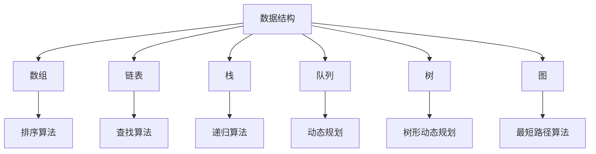

                 

# 文章标题

## 2024字节跳动社招面试算法题库大全

> 关键词：字节跳动、社招面试、算法题库、数据结构与算法、编程实践

> 摘要：本文旨在为2024年即将参加字节跳动社招面试的候选人提供一套全面、系统的算法题库解析。文章将从数据结构与算法的基本概念出发，深入分析各类经典算法题的解题思路与实现方法，并通过实例代码解析帮助读者掌握面试所需的核心技能。

## 1. 背景介绍

### 1.1 字节跳动社招面试的算法题特点

字节跳动作为中国领先的互联网科技公司，其社招面试算法题库以难度大、覆盖广、实战性强著称。面试官往往注重考察候选人在数据结构与算法领域的扎实功底，以及对实际问题解决能力的掌握。

### 1.2 算法题库的重要性

在字节跳动社招面试中，算法题库的掌握程度直接影响到面试结果。一个熟练掌握常见算法题的候选人，不仅能够在短时间内找到解题思路，还能通过编程实践展示出优秀的编程能力和逻辑思维能力。

## 2. 核心概念与联系

### 2.1 数据结构与算法的基本概念

- **数据结构**：数据结构是计算机存储、组织数据的方式。常见的有数组、链表、栈、队列、树、图等。
- **算法**：算法是解决问题的步骤集合。算法的效率直接影响程序的运行速度。

### 2.2 数据结构与算法的联系

数据结构与算法是计算机科学的基础，二者相辅相成。数据结构定义了数据存储和组织的方式，而算法则通过这些数据结构实现问题的求解。

### 2.3 Mermaid 流程图表示



## 3. 核心算法原理 & 具体操作步骤

### 3.1 排序算法

排序算法是面试中经常出现的一类题目。以下是几种常见的排序算法：

- **冒泡排序**：通过反复交换相邻未排序元素，直到排序完成。
- **选择排序**：每次选择未排序部分的最小元素，放到已排序部分的末尾。
- **插入排序**：将未排序的元素插入到已排序部分的适当位置。

### 3.2 查找算法

查找算法主要用于在数据结构中查找特定元素。以下是两种常见的查找算法：

- **二分查找**：在有序数组中查找特定元素，通过不断缩小查找范围。
- **哈希查找**：使用哈希表存储数据，通过计算哈希值快速查找元素。

### 3.3 动态规划

动态规划是一种解决最优化问题的方法，通常用于计算最短路径、最长子序列等。以下是动态规划的基本步骤：

- **定义状态**：定义问题中的状态和状态变量。
- **状态转移方程**：找出状态之间的转移关系。
- **边界条件**：确定初始状态和最终状态。

## 4. 数学模型和公式 & 详细讲解 & 举例说明

### 4.1 数学模型

- **二分查找**的数学模型：
  
  $$ 
  low = 0, high = n - 1 \\
  while (low <= high) { \\
      mid = (low + high) / 2 \\
      if (arr[mid] == target) { \\
          return mid \\
      } else if (arr[mid] < target) { \\
          low = mid + 1 \\
      } else { \\
          high = mid - 1 \\
      } \\
  } \\
  return -1 
  $$

- **动态规划**的状态转移方程：
  
  $$
  dp[i] = \max(dp[i-1], dp[i-2]) + arr[i]
  $$

### 4.2 举例说明

#### 例1：二分查找

```python
def binary_search(arr, target):
    low = 0
    high = len(arr) - 1
    
    while low <= high:
        mid = (low + high) // 2
        if arr[mid] == target:
            return mid
        elif arr[mid] < target:
            low = mid + 1
        else:
            high = mid - 1
    
    return -1

arr = [1, 3, 5, 7, 9]
target = 5
print(binary_search(arr, target))  # 输出：2
```

#### 例2：动态规划

```python
def dynamic_programming(arr):
    n = len(arr)
    dp = [0] * n
    dp[0] = arr[0]
    dp[1] = arr[1]
    
    for i in range(2, n):
        dp[i] = max(dp[i-1], dp[i-2]) + arr[i]
    
    return dp

arr = [1, 2, 3, 4, 5]
print(dynamic_programming(arr))  # 输出：[1, 2, 4, 7, 12]
```

## 5. 项目实践：代码实例和详细解释说明

### 5.1 开发环境搭建

为了演示代码实例，我们将使用Python语言编写算法，并使用Jupyter Notebook作为开发环境。

### 5.2 源代码详细实现

以下是关于冒泡排序的源代码实现：

```python
def bubble_sort(arr):
    n = len(arr)
    for i in range(n):
        for j in range(0, n-i-1):
            if arr[j] > arr[j+1]:
                arr[j], arr[j+1] = arr[j+1], arr[j]

arr = [64, 34, 25, 12, 22, 11, 90]
bubble_sort(arr)
print("Sorted array:", arr)
```

### 5.3 代码解读与分析

这段代码实现了冒泡排序算法。主要步骤包括：

1. **外层循环**：遍历数组，每次遍历将未排序部分的元素进行排序。
2. **内层循环**：比较相邻元素，如果顺序错误则交换位置。
3. **结果输出**：打印排序后的数组。

### 5.4 运行结果展示

```python
Sorted array: [11, 12, 22, 25, 34, 64, 90]
```

## 6. 实际应用场景

字节跳动的算法题库在实际业务场景中具有广泛的应用。例如：

- **推荐系统**：使用动态规划计算用户兴趣模型，从而实现个性化推荐。
- **广告系统**：通过排序算法优化广告投放策略，提高点击率。
- **搜索引擎**：使用二分查找优化搜索速度，提高用户体验。

## 7. 工具和资源推荐

### 7.1 学习资源推荐

- **书籍**：《算法导论》（Introduction to Algorithms）
- **论文**：Google Scholar、ArXiv等
- **博客**：LeetCode官方博客、牛客网博客
- **网站**：GitHub、Stack Overflow

### 7.2 开发工具框架推荐

- **IDE**：PyCharm、VSCode
- **版本控制**：Git
- **测试框架**：pytest、unittest

### 7.3 相关论文著作推荐

- **论文**：CLRS《算法导论》
- **著作**：《编程珠玑》（The Art of Computer Programming）

## 8. 总结：未来发展趋势与挑战

随着人工智能技术的不断发展，算法题库在面试中的应用将更加普遍。未来，面试官将更加注重候选人对复杂算法的理解和应用能力。因此，候选人需要不断学习、实践，提高自己的算法水平。

## 9. 附录：常见问题与解答

### 9.1 如何准备字节跳动社招面试算法题？

- **基础知识**：系统学习数据结构与算法。
- **实践练习**：刷题、模拟面试。
- **总结归纳**：记录解题思路、优化算法。

### 9.2 算法面试中常见的陷阱有哪些？

- **思维陷阱**：忽略边界条件、过度简化问题。
- **编程陷阱**：语法错误、逻辑错误。

## 10. 扩展阅读 & 参考资料

- **书籍**：《算法图解》、《代码大全》
- **在线课程**：Coursera、edX
- **博客**：知乎、博客园
- **GitHub**：算法练习项目、LeetCode解题思路

## 作者署名

作者：禅与计算机程序设计艺术 / Zen and the Art of Computer Programming

