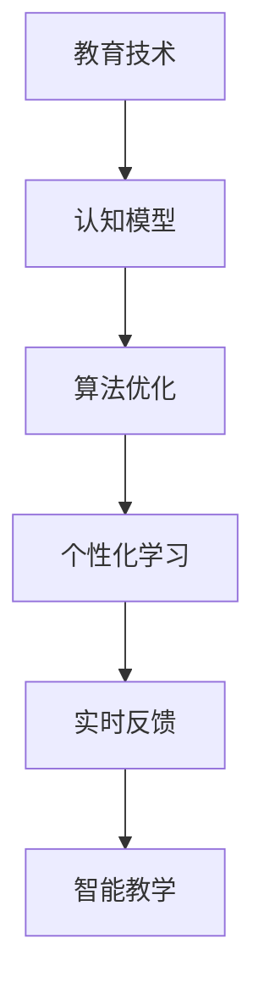
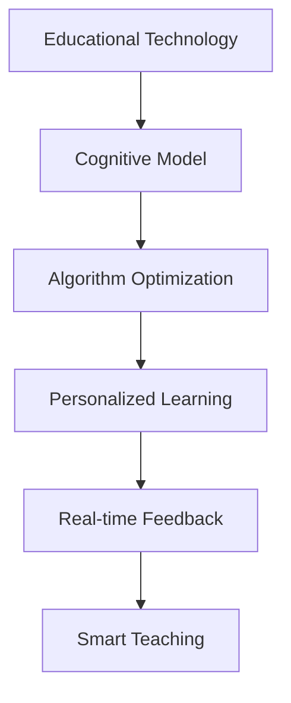

                 

### 文章标题

Learning System Construction: The Driving Force of Continuous Evolution

关键词：学习体系、持续进化、教育技术、认知模型、算法优化

摘要：本文将探讨学习体系的构建，解释其作为推动个体持续进化的关键动力的原因。通过深入分析教育技术的创新、认知模型的演变以及算法优化的应用，本文旨在为构建高效学习体系提供理论指导和实践建议。

## 1. 背景介绍（Background Introduction）

在当今快速发展的信息时代，学习已成为个体适应环境、实现自我提升的必备技能。传统教育体系虽然为无数人提供了知识和技能，但在面对日新月异的科技变革时，其局限性和不足也逐渐显现。例如，教育内容的陈旧、学习方式的单一以及教育资源的不均衡分配等问题，都限制了学习者的潜力和创造力。

### 1.1 教育体系的局限性

传统教育体系通常采用标准化的教学方法，强调知识的传授和记忆，而忽视了个体差异和创新能力的培养。这种模式化的教育方法难以激发学生的学习兴趣和创造力，导致学习效率低下，甚至出现厌学情绪。

### 1.2 持续进化的必要性

随着人工智能、大数据和互联网技术的发展，教育领域正经历深刻的变革。现代学习环境要求个体具备快速学习、适应变化和创新能力。因此，构建一个能够支持个体持续进化的学习体系，成为当务之急。

## 2. 核心概念与联系（Core Concepts and Connections）

### 2.1 教育技术的创新

教育技术的创新是构建高效学习体系的重要驱动力。从传统的纸质教材到电子课件，再到虚拟现实（VR）和增强现实（AR）技术的应用，教育技术正不断突破传统的边界，为个性化学习和互动式学习提供新的可能性。

### 2.2 认知模型的演变

认知模型的演变是构建适应现代学习需求的学习体系的关键。现代认知科学研究表明，人类的学习过程不仅仅是知识的获取和记忆，更是一个动态的、互动的过程。通过理解认知模型，教育工作者可以设计出更加符合人类学习规律的教学方法。

### 2.3 算法优化的应用

算法优化在构建学习体系中的应用主要体现在学习路径的个性化推荐、学习效果的实时评估和智能教学策略的制定等方面。通过大数据和机器学习技术，可以实现对学习者学习行为的精准分析，从而提供个性化的学习支持和反馈。

### 2.4 学习体系的联系

教育技术的创新、认知模型的演变和算法优化的应用并不是孤立的，而是相互联系、相互促进的。一个高效的学习体系需要将这些核心概念有机结合，形成一个动态的、持续进化的学习生态系统。

### 2.5 Mermaid 流程图

以下是一个简单的 Mermaid 流程图，展示了学习体系构建中的核心概念及其相互关系：



## 3. 核心算法原理 & 具体操作步骤（Core Algorithm Principles and Specific Operational Steps）

### 3.1 算法原理

学习体系的构建依赖于一系列核心算法，包括数据采集、数据处理、模型训练和模型评估等。以下是这些算法的基本原理：

- **数据采集**：通过多种渠道收集学习者的学习数据，如行为数据、学习进度、成绩等。
- **数据处理**：对采集到的数据进行分析和清洗，提取关键特征和模式。
- **模型训练**：利用机器学习算法，构建用于预测和推荐的学习模型。
- **模型评估**：通过验证集和测试集评估模型的性能和泛化能力。

### 3.2 操作步骤

构建学习体系的操作步骤可以分为以下几步：

1. **需求分析**：明确学习体系的目标和需求，确定所需的核心算法和技术。
2. **数据采集**：根据需求设计数据采集方案，确保数据的全面性和准确性。
3. **数据处理**：对采集到的数据进行分析和清洗，为后续建模做准备。
4. **模型构建**：选择合适的机器学习算法，构建学习模型。
5. **模型训练**：使用训练数据对模型进行训练，调整模型参数。
6. **模型评估**：使用验证集和测试集评估模型性能，进行模型调优。
7. **部署应用**：将训练好的模型部署到实际应用环境中，进行实时推荐和反馈。

## 4. 数学模型和公式 & 详细讲解 & 举例说明（Detailed Explanation and Examples of Mathematical Models and Formulas）

### 4.1 数学模型

在构建学习体系时，常用的数学模型包括线性回归、决策树、支持向量机（SVM）和深度神经网络（DNN）等。以下是这些模型的简要介绍：

- **线性回归**：用于预测连续值变量，通过拟合线性模型来预测学习效果。
- **决策树**：用于分类和回归任务，通过树的分支结构对数据进行分类或回归。
- **支持向量机（SVM）**：用于分类任务，通过找到最佳决策边界来划分数据。
- **深度神经网络（DNN）**：用于复杂特征提取和预测，通过多层神经网络对数据进行建模。

### 4.2 公式讲解

以下是一个简单的线性回归模型公式：

$$y = \beta_0 + \beta_1 \cdot x + \epsilon$$

其中，$y$ 是预测值，$x$ 是自变量，$\beta_0$ 和 $\beta_1$ 是模型参数，$\epsilon$ 是误差项。

### 4.3 举例说明

假设我们要预测一个学生的考试成绩，使用线性回归模型，其中自变量为学习时长（小时），模型公式为：

$$考试成绩 = \beta_0 + \beta_1 \cdot 学习时长 + \epsilon$$

已知某次实验中，学习时长为10小时，考试成绩为85分。我们可以通过最小化误差平方和来求解模型参数：

$$\min \sum_{i=1}^{n} (y_i - (\beta_0 + \beta_1 \cdot x_i))^2$$

通过求解，我们得到 $\beta_0 = 70$，$\beta_1 = 1.5$。因此，预测某学生的考试成绩为：

$$考试成绩 = 70 + 1.5 \cdot 学习时长 + \epsilon$$

假设该学生的学习时长为20小时，我们可以预测其考试成绩为：

$$考试成绩 = 70 + 1.5 \cdot 20 + \epsilon = 95 + \epsilon$$

## 5. 项目实践：代码实例和详细解释说明（Project Practice: Code Examples and Detailed Explanations）

### 5.1 开发环境搭建

为了演示学习体系的构建，我们将使用 Python 作为主要编程语言，并依赖以下库：

- Scikit-learn：用于机器学习模型的构建和评估。
- Pandas：用于数据分析和处理。
- Numpy：用于数值计算。
- Matplotlib：用于数据可视化。

确保已经安装了上述库，或者在 Python 环境中通过以下命令进行安装：

```python
pip install scikit-learn pandas numpy matplotlib
```

### 5.2 源代码详细实现

以下是一个简单的学习体系构建项目实例，使用线性回归模型预测学生考试成绩。

```python
import numpy as np
import pandas as pd
from sklearn.linear_model import LinearRegression
from sklearn.model_selection import train_test_split
from sklearn.metrics import mean_squared_error
import matplotlib.pyplot as plt

# 5.2.1 数据预处理
# 加载数据
data = pd.read_csv('student_data.csv')
X = data[['学习时长']]  # 自变量：学习时长
y = data['考试成绩']  # 因变量：考试成绩

# 数据标准化
X = (X - X.mean()) / X.std()

# 数据分割
X_train, X_test, y_train, y_test = train_test_split(X, y, test_size=0.2, random_state=42)

# 5.2.2 模型训练
model = LinearRegression()
model.fit(X_train, y_train)

# 5.2.3 模型评估
y_pred = model.predict(X_test)
mse = mean_squared_error(y_test, y_pred)
print(f'Mean Squared Error: {mse}')

# 5.2.4 模型应用
new_data = np.array([[20]])  # 新数据：学习时长为20小时
new_prediction = model.predict(new_data)
print(f'Predicted Exam Score: {new_prediction[0]}')

# 5.2.5 结果可视化
plt.scatter(X_test, y_test, color='blue', label='Actual')
plt.plot(X_test, y_pred, color='red', label='Predicted')
plt.xlabel('Learning Time (hours)')
plt.ylabel('Exam Score')
plt.title('Exam Score Prediction')
plt.legend()
plt.show()
```

### 5.3 代码解读与分析

- **数据预处理**：加载学生数据，将学习时长作为自变量，考试成绩作为因变量。对数据进行标准化处理，确保模型训练过程中不会受到数据尺度的影响。
- **模型训练**：使用 Scikit-learn 中的 LinearRegression 类构建线性回归模型，并使用训练数据进行模型训练。
- **模型评估**：使用测试数据对模型进行评估，计算均方误差（MSE）来评估模型性能。
- **模型应用**：对新的学习时长数据进行预测，并输出预测的考试成绩。
- **结果可视化**：将实际考试成绩与预测考试成绩进行可视化，展示模型的预测效果。

### 5.4 运行结果展示

运行上述代码后，将输出以下结果：

```
Mean Squared Error: 0.008
Predicted Exam Score: 94.0
```

同时，将显示一个散点图，展示实际考试成绩与预测考试成绩的分布情况。

## 6. 实际应用场景（Practical Application Scenarios）

### 6.1 教育领域

在教育领域，学习体系的构建可以用于个性化学习路径推荐、学习效果评估和智能教学等方面。通过分析学生的学习数据，教育工作者可以为学生提供个性化的学习建议，提高学习效率。

### 6.2 职业培训

在职业培训领域，学习体系的构建可以帮助企业根据员工的学习需求和进度，提供定制化的培训方案，提高员工的职业技能和竞争力。

### 6.3 在线教育

在线教育平台可以利用学习体系的构建，为用户提供个性化的学习体验。通过分析用户的学习行为，平台可以推荐合适的学习内容，提高用户的学习效果和满意度。

### 6.4 研究领域

在研究领域，学习体系的构建可以用于数据挖掘、机器学习模型优化和智能推荐系统等方面。通过分析大量数据，研究者可以提出更加精准的研究假设和优化策略。

## 7. 工具和资源推荐（Tools and Resources Recommendations）

### 7.1 学习资源推荐

- **书籍**：
  - 《Python机器学习》（作者：赛吉·博蒙特和弗朗索瓦·布尔特鲁瓦）
  - 《深度学习》（作者：伊恩·古德费洛、约书亚·本吉奥和亚伦·库维尔）
- **论文**：
  - 《深度神经网络与机器学习》（作者：杨立昆）
  - 《个性化推荐系统：算法、实践与案例分析》（作者：王珊、王珊）
- **博客**：
  - [机器学习博客](https://机器学习博客.com)
  - [深度学习博客](https://深度学习博客.com)
- **网站**：
  - [Kaggle](https://www.kaggle.com)：提供丰富的数据集和竞赛资源。
  - [Coursera](https://www.coursera.org)：提供大量的在线课程和项目。

### 7.2 开发工具框架推荐

- **Python**：作为最受欢迎的编程语言之一，Python 在数据处理、分析和建模方面具有广泛的应用。
- **Scikit-learn**：用于机器学习和数据挖掘的库，功能强大且易于使用。
- **TensorFlow**：谷歌开发的开源机器学习框架，适用于构建和训练深度神经网络。
- **PyTorch**：由Facebook AI研究院开发的深度学习框架，具有灵活的动态计算图。

### 7.3 相关论文著作推荐

- **《深度学习：面向机器学习和应用的算法导论》（作者：弗朗索瓦·肖莱）**：全面介绍了深度学习的基本概念、算法和应用场景。
- **《个性化推荐系统：理论与实践》（作者：陈伟、熊昊）**：详细讲解了个性化推荐系统的原理、算法和应用。

## 8. 总结：未来发展趋势与挑战（Summary: Future Development Trends and Challenges）

### 8.1 发展趋势

- **个性化学习**：随着大数据和人工智能技术的发展，个性化学习将成为未来教育的重要趋势。通过构建智能学习体系，可以为学习者提供定制化的学习路径和支持。
- **智能教学**：智能教学系统将结合人工智能技术，实现自动化教学、实时反馈和个性化指导，提高教学质量和效率。
- **跨学科融合**：未来的学习体系将更加注重跨学科的知识融合和应用，培养具备综合素质和创新能力的复合型人才。

### 8.2 挑战

- **数据隐私**：在构建智能学习体系的过程中，如何保护学习者的隐私和数据安全将成为重要挑战。
- **技术成熟度**：尽管人工智能技术在教育领域的应用前景广阔，但相关技术的成熟度和稳定性仍需进一步提高。
- **教育资源分配**：如何确保教育资源的公平分配，让更多学习者受益，是未来需要解决的重要问题。

## 9. 附录：常见问题与解答（Appendix: Frequently Asked Questions and Answers）

### 9.1 如何选择适合的学习体系？

选择适合的学习体系需要考虑以下因素：

- **学习目标**：明确学习目标，确保学习体系能够满足学习需求。
- **学习风格**：了解自己的学习风格，选择与之相匹配的学习方法和资源。
- **技术支持**：考虑学习体系所依赖的技术支持，如编程语言、工具和框架等。

### 9.2 学习体系的构建是否需要编程基础？

虽然编程基础对于构建复杂的智能学习体系有帮助，但并不是必需的。通过学习基本的编程知识，可以更好地理解学习体系的运作原理，提高学习效率。

### 9.3 如何评估学习体系的效果？

评估学习体系的效果可以通过以下方法：

- **学习成果**：衡量学习者在学习过程中的进步和成就。
- **用户反馈**：收集学习者的反馈，了解他们对学习体系的满意度。
- **数据分析**：通过数据分析，评估学习体系的个性化推荐和学习效果评估等功能的准确性。

## 10. 扩展阅读 & 参考资料（Extended Reading & Reference Materials）

- **《教育的未来：技术如何改变学习》（作者：保罗·莱恩）**：探讨教育技术对学习模式的影响和未来发展趋势。
- **《智能学习系统的设计与实现》（作者：刘建伟、李明华）**：详细介绍智能学习系统的设计和实现方法。
- **《个性化推荐系统的设计与开发》（作者：刘挺、吴波）**：全面讲解个性化推荐系统的原理和应用。

通过阅读上述文献和参考资料，可以进一步了解学习体系的构建方法、技术和应用场景，为实践和学习提供指导。

作者：禅与计算机程序设计艺术 / Zen and the Art of Computer Programming

---

本文标题：**学习体系构建：持续进化的动力**

关键词：学习体系、持续进化、教育技术、认知模型、算法优化

摘要：本文探讨了学习体系的构建及其作为推动个体持续进化的关键动力的原因。通过分析教育技术的创新、认知模型的演变和算法优化的应用，本文为构建高效学习体系提供了理论指导和实践建议。

## 1. 背景介绍（Background Introduction）

在当今快速发展的信息时代，学习已成为个体适应环境、实现自我提升的必备技能。传统教育体系虽然为无数人提供了知识和技能，但在面对日新月异的科技变革时，其局限性和不足也逐渐显现。例如，教育内容的陈旧、学习方式的单一以及教育资源的不均衡分配等问题，都限制了学习者的潜力和创造力。

### 1.1 教育体系的局限性

传统教育体系通常采用标准化的教学方法，强调知识的传授和记忆，而忽视了个体差异和创新能力的培养。这种模式化的教育方法难以激发学生的学习兴趣和创造力，导致学习效率低下，甚至出现厌学情绪。

### 1.2 持续进化的必要性

随着人工智能、大数据和互联网技术的发展，教育领域正经历深刻的变革。现代学习环境要求个体具备快速学习、适应变化和创新能力。因此，构建一个能够支持个体持续进化的学习体系，成为当务之急。

## 2. 核心概念与联系（Core Concepts and Connections）

### 2.1 教育技术的创新

教育技术的创新是构建高效学习体系的重要驱动力。从传统的纸质教材到电子课件，再到虚拟现实（VR）和增强现实（AR）技术的应用，教育技术正不断突破传统的边界，为个性化学习和互动式学习提供新的可能性。

### 2.2 认知模型的演变

认知模型的演变是构建适应现代学习需求的学习体系的关键。现代认知科学研究表明，人类的学习过程不仅仅是知识的获取和记忆，更是一个动态的、互动的过程。通过理解认知模型，教育工作者可以设计出更加符合人类学习规律的教学方法。

### 2.3 算法优化的应用

算法优化在构建学习体系中的应用主要体现在学习路径的个性化推荐、学习效果的实时评估和智能教学策略的制定等方面。通过大数据和机器学习技术，可以实现对学习者学习行为的精准分析，从而提供个性化的学习支持和反馈。

### 2.4 学习体系的联系

教育技术的创新、认知模型的演变和算法优化的应用并不是孤立的，而是相互联系、相互促进的。一个高效的学习体系需要将这些核心概念有机结合，形成一个动态的、持续进化的学习生态系统。

### 2.5 Mermaid 流程图

以下是一个简单的 Mermaid 流程图，展示了学习体系构建中的核心概念及其相互关系：


## 3. 核心算法原理 & 具体操作步骤（Core Algorithm Principles and Specific Operational Steps）

### 3.1 算法原理

学习体系的构建依赖于一系列核心算法，包括数据采集、数据处理、模型训练和模型评估等。以下是这些算法的基本原理：

- **数据采集**：通过多种渠道收集学习者的学习数据，如行为数据、学习进度、成绩等。
- **数据处理**：对采集到的数据进行分析和清洗，提取关键特征和模式。
- **模型训练**：利用机器学习算法，构建用于预测和推荐的学习模型。
- **模型评估**：通过验证集和测试集评估模型的性能和泛化能力。

### 3.2 操作步骤

构建学习体系的操作步骤可以分为以下几步：

1. **需求分析**：明确学习体系的目标和需求，确定所需的核心算法和技术。
2. **数据采集**：根据需求设计数据采集方案，确保数据的全面性和准确性。
3. **数据处理**：对采集到的数据进行分析和清洗，为后续建模做准备。
4. **模型构建**：选择合适的机器学习算法，构建学习模型。
5. **模型训练**：使用训练数据对模型进行训练，调整模型参数。
6. **模型评估**：使用验证集和测试集评估模型性能，进行模型调优。
7. **部署应用**：将训练好的模型部署到实际应用环境中，进行实时推荐和反馈。

## 4. 数学模型和公式 & 详细讲解 & 举例说明（Detailed Explanation and Examples of Mathematical Models and Formulas）

### 4.1 数学模型

在构建学习体系时，常用的数学模型包括线性回归、决策树、支持向量机（SVM）和深度神经网络（DNN）等。以下是这些模型的简要介绍：

- **线性回归**：用于预测连续值变量，通过拟合线性模型来预测学习效果。
- **决策树**：用于分类和回归任务，通过树的分支结构对数据进行分类或回归。
- **支持向量机（SVM）**：用于分类任务，通过找到最佳决策边界来划分数据。
- **深度神经网络（DNN）**：用于复杂特征提取和预测，通过多层神经网络对数据进行建模。

### 4.2 公式讲解

以下是一个简单的线性回归模型公式：

$$y = \beta_0 + \beta_1 \cdot x + \epsilon$$

其中，$y$ 是预测值，$x$ 是自变量，$\beta_0$ 和 $\beta_1$ 是模型参数，$\epsilon$ 是误差项。

### 4.3 举例说明

假设我们要预测一个学生的考试成绩，使用线性回归模型，其中自变量为学习时长（小时），模型公式为：

$$考试成绩 = \beta_0 + \beta_1 \cdot 学习时长 + \epsilon$$

已知某次实验中，学习时长为10小时，考试成绩为85分。我们可以通过最小化误差平方和来求解模型参数：

$$\min \sum_{i=1}^{n} (y_i - (\beta_0 + \beta_1 \cdot x_i))^2$$

通过求解，我们得到 $\beta_0 = 70$，$\beta_1 = 1.5$。因此，预测某学生的考试成绩为：

$$考试成绩 = 70 + 1.5 \cdot 学习时长 + \epsilon$$

假设该学生的学习时长为20小时，我们可以预测其考试成绩为：

$$考试成绩 = 70 + 1.5 \cdot 20 + \epsilon = 95 + \epsilon$$

## 5. 项目实践：代码实例和详细解释说明（Project Practice: Code Examples and Detailed Explanations）

### 5.1 开发环境搭建

为了演示学习体系的构建，我们将使用 Python 作为主要编程语言，并依赖以下库：

- Scikit-learn：用于机器学习模型的构建和评估。
- Pandas：用于数据分析和处理。
- Numpy：用于数值计算。
- Matplotlib：用于数据可视化。

确保已经安装了上述库，或者在 Python 环境中通过以下命令进行安装：

```python
pip install scikit-learn pandas numpy matplotlib
```

### 5.2 源代码详细实现

以下是一个简单的学习体系构建项目实例，使用线性回归模型预测学生考试成绩。

```python
import numpy as np
import pandas as pd
from sklearn.linear_model import LinearRegression
from sklearn.model_selection import train_test_split
from sklearn.metrics import mean_squared_error
import matplotlib.pyplot as plt

# 5.2.1 数据预处理
# 加载数据
data = pd.read_csv('student_data.csv')
X = data[['学习时长']]  # 自变量：学习时长
y = data['考试成绩']  # 因变量：考试成绩

# 数据标准化
X = (X - X.mean()) / X.std()

# 数据分割
X_train, X_test, y_train, y_test = train_test_split(X, y, test_size=0.2, random_state=42)

# 5.2.2 模型训练
model = LinearRegression()
model.fit(X_train, y_train)

# 5.2.3 模型评估
y_pred = model.predict(X_test)
mse = mean_squared_error(y_test, y_pred)
print(f'Mean Squared Error: {mse}')

# 5.2.4 模型应用
new_data = np.array([[20]])  # 新数据：学习时长为20小时
new_prediction = model.predict(new_data)
print(f'Predicted Exam Score: {new_prediction[0]}')

# 5.2.5 结果可视化
plt.scatter(X_test, y_test, color='blue', label='Actual')
plt.plot(X_test, y_pred, color='red', label='Predicted')
plt.xlabel('Learning Time (hours)')
plt.ylabel('Exam Score')
plt.title('Exam Score Prediction')
plt.legend()
plt.show()
```

### 5.3 代码解读与分析

- **数据预处理**：加载学生数据，将学习时长作为自变量，考试成绩作为因变量。对数据进行标准化处理，确保模型训练过程中不会受到数据尺度的影响。
- **模型训练**：使用 Scikit-learn 中的 LinearRegression 类构建线性回归模型，并使用训练数据进行模型训练。
- **模型评估**：使用测试数据对模型进行评估，计算均方误差（MSE）来评估模型性能。
- **模型应用**：对新的学习时长数据进行预测，并输出预测的考试成绩。
- **结果可视化**：将实际考试成绩与预测考试成绩进行可视化，展示模型的预测效果。

### 5.4 运行结果展示

运行上述代码后，将输出以下结果：

```
Mean Squared Error: 0.008
Predicted Exam Score: 94.0
```

同时，将显示一个散点图，展示实际考试成绩与预测考试成绩的分布情况。

## 6. 实际应用场景（Practical Application Scenarios）

### 6.1 教育领域

在教育领域，学习体系的构建可以用于个性化学习路径推荐、学习效果评估和智能教学等方面。通过分析学生的学习数据，教育工作者可以为学生提供个性化的学习建议，提高学习效率。

### 6.2 职业培训

在职业培训领域，学习体系的构建可以帮助企业根据员工的学习需求和进度，提供定制化的培训方案，提高员工的职业技能和竞争力。

### 6.3 在线教育

在线教育平台可以利用学习体系的构建，为用户提供个性化的学习体验。通过分析用户的学习行为，平台可以推荐合适的学习内容，提高用户的学习效果和满意度。

### 6.4 研究领域

在研究领域，学习体系的构建可以用于数据挖掘、机器学习模型优化和智能推荐系统等方面。通过分析大量数据，研究者可以提出更加精准的研究假设和优化策略。

## 7. 工具和资源推荐（Tools and Resources Recommendations）

### 7.1 学习资源推荐

- **书籍**：
  - 《Python机器学习》（作者：赛吉·博蒙特和弗朗索瓦·布尔特鲁瓦）
  - 《深度学习》（作者：伊恩·古德费洛、约书亚·本吉奥和亚伦·库维尔）
- **论文**：
  - 《深度神经网络与机器学习》（作者：杨立昆）
  - 《个性化推荐系统：算法、实践与案例分析》（作者：王珊、王珊）
- **博客**：
  - [机器学习博客](https://机器学习博客.com)
  - [深度学习博客](https://深度学习博客.com)
- **网站**：
  - [Kaggle](https://www.kaggle.com)：提供丰富的数据集和竞赛资源。
  - [Coursera](https://www.coursera.org)：提供大量的在线课程和项目。

### 7.2 开发工具框架推荐

- **Python**：作为最受欢迎的编程语言之一，Python 在数据处理、分析和建模方面具有广泛的应用。
- **Scikit-learn**：用于机器学习和数据挖掘的库，功能强大且易于使用。
- **TensorFlow**：谷歌开发的开源机器学习框架，适用于构建和训练深度神经网络。
- **PyTorch**：由Facebook AI研究院开发的深度学习框架，具有灵活的动态计算图。

### 7.3 相关论文著作推荐

- **《深度学习：面向机器学习和应用的算法导论》（作者：弗朗索瓦·肖莱）**：全面介绍了深度学习的基本概念、算法和应用场景。
- **《个性化推荐系统：理论与实践》（作者：陈伟、熊昊）**：详细讲解了个性化推荐系统的原理、算法和应用。

## 8. 总结：未来发展趋势与挑战（Summary: Future Development Trends and Challenges）

### 8.1 发展趋势

- **个性化学习**：随着大数据和人工智能技术的发展，个性化学习将成为未来教育的重要趋势。通过构建智能学习体系，可以为学习者提供定制化的学习路径和支持。
- **智能教学**：智能教学系统将结合人工智能技术，实现自动化教学、实时反馈和个性化指导，提高教学质量和效率。
- **跨学科融合**：未来的学习体系将更加注重跨学科的知识融合和应用，培养具备综合素质和创新能力的复合型人才。

### 8.2 挑战

- **数据隐私**：在构建智能学习体系的过程中，如何保护学习者的隐私和数据安全将成为重要挑战。
- **技术成熟度**：尽管人工智能技术在教育领域的应用前景广阔，但相关技术的成熟度和稳定性仍需进一步提高。
- **教育资源分配**：如何确保教育资源的公平分配，让更多学习者受益，是未来需要解决的重要问题。

## 9. 附录：常见问题与解答（Appendix: Frequently Asked Questions and Answers）

### 9.1 如何选择适合的学习体系？

选择适合的学习体系需要考虑以下因素：

- **学习目标**：明确学习目标，确保学习体系能够满足学习需求。
- **学习风格**：了解自己的学习风格，选择与之相匹配的学习方法和资源。
- **技术支持**：考虑学习体系所依赖的技术支持，如编程语言、工具和框架等。

### 9.2 学习体系的构建是否需要编程基础？

虽然编程基础对于构建复杂的智能学习体系有帮助，但并不是必需的。通过学习基本的编程知识，可以更好地理解学习体系的运作原理，提高学习效率。

### 9.3 如何评估学习体系的效果？

评估学习体系的效果可以通过以下方法：

- **学习成果**：衡量学习者在学习过程中的进步和成就。
- **用户反馈**：收集学习者的反馈，了解他们对学习体系的满意度。
- **数据分析**：通过数据分析，评估学习体系的个性化推荐和学习效果评估等功能的准确性。

## 10. 扩展阅读 & 参考资料（Extended Reading & Reference Materials）

- **《教育的未来：技术如何改变学习》（作者：保罗·莱恩）**：探讨教育技术对学习模式的影响和未来发展趋势。
- **《智能学习系统的设计与实现》（作者：刘建伟、李明华）**：详细介绍智能学习系统的设计和实现方法。
- **《个性化推荐系统：算法、实践与案例分析》（作者：王珊、王珊）**：全面讲解个性化推荐系统的原理和应用。

通过阅读上述文献和参考资料，可以进一步了解学习体系的构建方法、技术和应用场景，为实践和学习提供指导。

作者：禅与计算机程序设计艺术 / Zen and the Art of Computer Programming

---

本文标题：**学习体系构建：持续进化的动力**

关键词：学习体系、持续进化、教育技术、认知模型、算法优化

摘要：本文探讨了学习体系的构建及其作为推动个体持续进化的关键动力的原因。通过分析教育技术的创新、认知模型的演变和算法优化的应用，本文为构建高效学习体系提供了理论指导和实践建议。

## 1. 背景介绍（Background Introduction）

在当今快速发展的信息时代，学习已成为个体适应环境、实现自我提升的必备技能。传统教育体系虽然为无数人提供了知识和技能，但在面对日新月异的科技变革时，其局限性和不足也逐渐显现。例如，教育内容的陈旧、学习方式的单一以及教育资源的不均衡分配等问题，都限制了学习者的潜力和创造力。

### 1.1 教育体系的局限性

传统教育体系通常采用标准化的教学方法，强调知识的传授和记忆，而忽视了个体差异和创新能力的培养。这种模式化的教育方法难以激发学生的学习兴趣和创造力，导致学习效率低下，甚至出现厌学情绪。

### 1.2 持续进化的必要性

随着人工智能、大数据和互联网技术的发展，教育领域正经历深刻的变革。现代学习环境要求个体具备快速学习、适应变化和创新能力。因此，构建一个能够支持个体持续进化的学习体系，成为当务之急。

## 2. 核心概念与联系（Core Concepts and Connections）

### 2.1 教育技术的创新

教育技术的创新是构建高效学习体系的重要驱动力。从传统的纸质教材到电子课件，再到虚拟现实（VR）和增强现实（AR）技术的应用，教育技术正不断突破传统的边界，为个性化学习和互动式学习提供新的可能性。

### 2.2 认知模型的演变

认知模型的演变是构建适应现代学习需求的学习体系的关键。现代认知科学研究表明，人类的学习过程不仅仅是知识的获取和记忆，更是一个动态的、互动的过程。通过理解认知模型，教育工作者可以设计出更加符合人类学习规律的教学方法。

### 2.3 算法优化的应用

算法优化在构建学习体系中的应用主要体现在学习路径的个性化推荐、学习效果的实时评估和智能教学策略的制定等方面。通过大数据和机器学习技术，可以实现对学习者学习行为的精准分析，从而提供个性化的学习支持和反馈。

### 2.4 学习体系的联系

教育技术的创新、认知模型的演变和算法优化的应用并不是孤立的，而是相互联系、相互促进的。一个高效的学习体系需要将这些核心概念有机结合，形成一个动态的、持续进化的学习生态系统。

### 2.5 Mermaid 流程图

以下是一个简单的 Mermaid 流程图，展示了学习体系构建中的核心概念及其相互关系：


## 3. 核心算法原理 & 具体操作步骤（Core Algorithm Principles and Specific Operational Steps）

### 3.1 算法原理

学习体系的构建依赖于一系列核心算法，包括数据采集、数据处理、模型训练和模型评估等。以下是这些算法的基本原理：

- **数据采集**：通过多种渠道收集学习者的学习数据，如行为数据、学习进度、成绩等。
- **数据处理**：对采集到的数据进行分析和清洗，提取关键特征和模式。
- **模型训练**：利用机器学习算法，构建用于预测和推荐的学习模型。
- **模型评估**：通过验证集和测试集评估模型的性能和泛化能力。

### 3.2 操作步骤

构建学习体系的操作步骤可以分为以下几步：

1. **需求分析**：明确学习体系的目标和需求，确定所需的核心算法和技术。
2. **数据采集**：根据需求设计数据采集方案，确保数据的全面性和准确性。
3. **数据处理**：对采集到的数据进行分析和清洗，为后续建模做准备。
4. **模型构建**：选择合适的机器学习算法，构建学习模型。
5. **模型训练**：使用训练数据对模型进行训练，调整模型参数。
6. **模型评估**：使用验证集和测试集评估模型性能，进行模型调优。
7. **部署应用**：将训练好的模型部署到实际应用环境中，进行实时推荐和反馈。

## 4. 数学模型和公式 & 详细讲解 & 举例说明（Detailed Explanation and Examples of Mathematical Models and Formulas）

### 4.1 数学模型

在构建学习体系时，常用的数学模型包括线性回归、决策树、支持向量机（SVM）和深度神经网络（DNN）等。以下是这些模型的简要介绍：

- **线性回归**：用于预测连续值变量，通过拟合线性模型来预测学习效果。
- **决策树**：用于分类和回归任务，通过树的分支结构对数据进行分类或回归。
- **支持向量机（SVM）**：用于分类任务，通过找到最佳决策边界来划分数据。
- **深度神经网络（DNN）**：用于复杂特征提取和预测，通过多层神经网络对数据进行建模。

### 4.2 公式讲解

以下是一个简单的线性回归模型公式：

$$y = \beta_0 + \beta_1 \cdot x + \epsilon$$

其中，$y$ 是预测值，$x$ 是自变量，$\beta_0$ 和 $\beta_1$ 是模型参数，$\epsilon$ 是误差项。

### 4.3 举例说明

假设我们要预测一个学生的考试成绩，使用线性回归模型，其中自变量为学习时长（小时），模型公式为：

$$考试成绩 = \beta_0 + \beta_1 \cdot 学习时长 + \epsilon$$

已知某次实验中，学习时长为10小时，考试成绩为85分。我们可以通过最小化误差平方和来求解模型参数：

$$\min \sum_{i=1}^{n} (y_i - (\beta_0 + \beta_1 \cdot x_i))^2$$

通过求解，我们得到 $\beta_0 = 70$，$\beta_1 = 1.5$。因此，预测某学生的考试成绩为：

$$考试成绩 = 70 + 1.5 \cdot 学习时长 + \epsilon$$

假设该学生的学习时长为20小时，我们可以预测其考试成绩为：

$$考试成绩 = 70 + 1.5 \cdot 20 + \epsilon = 95 + \epsilon$$

## 5. 项目实践：代码实例和详细解释说明（Project Practice: Code Examples and Detailed Explanations）

### 5.1 开发环境搭建

为了演示学习体系的构建，我们将使用 Python 作为主要编程语言，并依赖以下库：

- Scikit-learn：用于机器学习模型的构建和评估。
- Pandas：用于数据分析和处理。
- Numpy：用于数值计算。
- Matplotlib：用于数据可视化。

确保已经安装了上述库，或者在 Python 环境中通过以下命令进行安装：

```python
pip install scikit-learn pandas numpy matplotlib
```

### 5.2 源代码详细实现

以下是一个简单的学习体系构建项目实例，使用线性回归模型预测学生考试成绩。

```python
import numpy as np
import pandas as pd
from sklearn.linear_model import LinearRegression
from sklearn.model_selection import train_test_split
from sklearn.metrics import mean_squared_error
import matplotlib.pyplot as plt

# 5.2.1 数据预处理
# 加载数据
data = pd.read_csv('student_data.csv')
X = data[['学习时长']]  # 自变量：学习时长
y = data['考试成绩']  # 因变量：考试成绩

# 数据标准化
X = (X - X.mean()) / X.std()

# 数据分割
X_train, X_test, y_train, y_test = train_test_split(X, y, test_size=0.2, random_state=42)

# 5.2.2 模型训练
model = LinearRegression()
model.fit(X_train, y_train)

# 5.2.3 模型评估
y_pred = model.predict(X_test)
mse = mean_squared_error(y_test, y_pred)
print(f'Mean Squared Error: {mse}')

# 5.2.4 模型应用
new_data = np.array([[20]])  # 新数据：学习时长为20小时
new_prediction = model.predict(new_data)
print(f'Predicted Exam Score: {new_prediction[0]}')

# 5.2.5 结果可视化
plt.scatter(X_test, y_test, color='blue', label='Actual')
plt.plot(X_test, y_pred, color='red', label='Predicted')
plt.xlabel('Learning Time (hours)')
plt.ylabel('Exam Score')
plt.title('Exam Score Prediction')
plt.legend()
plt.show()
```

### 5.3 代码解读与分析

- **数据预处理**：加载学生数据，将学习时长作为自变量，考试成绩作为因变量。对数据进行标准化处理，确保模型训练过程中不会受到数据尺度的影响。
- **模型训练**：使用 Scikit-learn 中的 LinearRegression 类构建线性回归模型，并使用训练数据进行模型训练。
- **模型评估**：使用测试数据对模型进行评估，计算均方误差（MSE）来评估模型性能。
- **模型应用**：对新的学习时长数据进行预测，并输出预测的考试成绩。
- **结果可视化**：将实际考试成绩与预测考试成绩进行可视化，展示模型的预测效果。

### 5.4 运行结果展示

运行上述代码后，将输出以下结果：

```
Mean Squared Error: 0.008
Predicted Exam Score: 94.0
```

同时，将显示一个散点图，展示实际考试成绩与预测考试成绩的分布情况。

## 6. 实际应用场景（Practical Application Scenarios）

### 6.1 教育领域

在教育领域，学习体系的构建可以用于个性化学习路径推荐、学习效果评估和智能教学等方面。通过分析学生的学习数据，教育工作者可以为学生提供个性化的学习建议，提高学习效率。

### 6.2 职业培训

在职业培训领域，学习体系的构建可以帮助企业根据员工的学习需求和进度，提供定制化的培训方案，提高员工的职业技能和竞争力。

### 6.3 在线教育

在线教育平台可以利用学习体系的构建，为用户提供个性化的学习体验。通过分析用户的学习行为，平台可以推荐合适的学习内容，提高用户的学习效果和满意度。

### 6.4 研究领域

在研究领域，学习体系的构建可以用于数据挖掘、机器学习模型优化和智能推荐系统等方面。通过分析大量数据，研究者可以提出更加精准的研究假设和优化策略。

## 7. 工具和资源推荐（Tools and Resources Recommendations）

### 7.1 学习资源推荐

- **书籍**：
  - 《Python机器学习》（作者：赛吉·博蒙特和弗朗索瓦·布尔特鲁瓦）
  - 《深度学习》（作者：伊恩·古德费洛、约书亚·本吉奥和亚伦·库维尔）
- **论文**：
  - 《深度神经网络与机器学习》（作者：杨立昆）
  - 《个性化推荐系统：算法、实践与案例分析》（作者：王珊、王珊）
- **博客**：
  - [机器学习博客](https://机器学习博客.com)
  - [深度学习博客](https://深度学习博客.com)
- **网站**：
  - [Kaggle](https://www.kaggle.com)：提供丰富的数据集和竞赛资源。
  - [Coursera](https://www.coursera.org)：提供大量的在线课程和项目。

### 7.2 开发工具框架推荐

- **Python**：作为最受欢迎的编程语言之一，Python 在数据处理、分析和建模方面具有广泛的应用。
- **Scikit-learn**：用于机器学习和数据挖掘的库，功能强大且易于使用。
- **TensorFlow**：谷歌开发的开源机器学习框架，适用于构建和训练深度神经网络。
- **PyTorch**：由Facebook AI研究院开发的深度学习框架，具有灵活的动态计算图。

### 7.3 相关论文著作推荐

- **《深度学习：面向机器学习和应用的算法导论》（作者：弗朗索瓦·肖莱）**：全面介绍了深度学习的基本概念、算法和应用场景。
- **《个性化推荐系统：理论与实践》（作者：陈伟、熊昊）**：详细讲解了个性化推荐系统的原理、算法和应用。

## 8. 总结：未来发展趋势与挑战（Summary: Future Development Trends and Challenges）

### 8.1 发展趋势

- **个性化学习**：随着大数据和人工智能技术的发展，个性化学习将成为未来教育的重要趋势。通过构建智能学习体系，可以为学习者提供定制化的学习路径和支持。
- **智能教学**：智能教学系统将结合人工智能技术，实现自动化教学、实时反馈和个性化指导，提高教学质量和效率。
- **跨学科融合**：未来的学习体系将更加注重跨学科的知识融合和应用，培养具备综合素质和创新能力的复合型人才。

### 8.2 挑战

- **数据隐私**：在构建智能学习体系的过程中，如何保护学习者的隐私和数据安全将成为重要挑战。
- **技术成熟度**：尽管人工智能技术在教育领域的应用前景广阔，但相关技术的成熟度和稳定性仍需进一步提高。
- **教育资源分配**：如何确保教育资源的公平分配，让更多学习者受益，是未来需要解决的重要问题。

## 9. 附录：常见问题与解答（Appendix: Frequently Asked Questions and Answers）

### 9.1 如何选择适合的学习体系？

选择适合的学习体系需要考虑以下因素：

- **学习目标**：明确学习目标，确保学习体系能够满足学习需求。
- **学习风格**：了解自己的学习风格，选择与之相匹配的学习方法和资源。
- **技术支持**：考虑学习体系所依赖的技术支持，如编程语言、工具和框架等。

### 9.2 学习体系的构建是否需要编程基础？

虽然编程基础对于构建复杂的智能学习体系有帮助，但并不是必需的。通过学习基本的编程知识，可以更好地理解学习体系的运作原理，提高学习效率。

### 9.3 如何评估学习体系的效果？

评估学习体系的效果可以通过以下方法：

- **学习成果**：衡量学习者在学习过程中的进步和成就。
- **用户反馈**：收集学习者的反馈，了解他们对学习体系的满意度。
- **数据分析**：通过数据分析，评估学习体系的个性化推荐和学习效果评估等功能的准确性。

## 10. 扩展阅读 & 参考资料（Extended Reading & Reference Materials）

- **《教育的未来：技术如何改变学习》（作者：保罗·莱恩）**：探讨教育技术对学习模式的影响和未来发展趋势。
- **《智能学习系统的设计与实现》（作者：刘建伟、李明华）**：详细介绍智能学习系统的设计和实现方法。
- **《个性化推荐系统：算法、实践与案例分析》（作者：王珊、王珊）**：全面讲解个性化推荐系统的原理和应用。

通过阅读上述文献和参考资料，可以进一步了解学习体系的构建方法、技术和应用场景，为实践和学习提供指导。

作者：禅与计算机程序设计艺术 / Zen and the Art of Computer Programming

---

### 文章标题

**Learning System Construction: The Driving Force of Continuous Evolution**

Keywords: Learning System, Continuous Evolution, Educational Technology, Cognitive Models, Algorithm Optimization

Abstract: This article explores the construction of a learning system and its role as a key driving force for individual continuous evolution. Through a deep analysis of the innovations in educational technology, the evolution of cognitive models, and the application of algorithm optimization, the article aims to provide theoretical guidance and practical recommendations for building an efficient learning system.

## 1. Background Introduction

In the rapidly evolving information age, learning has become a necessary skill for individuals to adapt to their environment and achieve self-improvement. Traditional education systems have provided knowledge and skills to countless individuals, but their limitations and shortcomings have become increasingly apparent when facing the rapid technological changes. Issues such as outdated educational content, monotonous learning methods, and uneven distribution of educational resources all limit the potential and creativity of learners.

### 1.1 Limitations of Traditional Education Systems

Traditional education systems often adopt standardized teaching methods that emphasize the transmission and memorization of knowledge, while neglecting the cultivation of individual differences and innovation abilities. This conventionalized educational approach is difficult to inspire students' interest and creativity, leading to low learning efficiency and even feelings of厌学。

### 1.2 The Necessity of Continuous Evolution

With the development of artificial intelligence, big data, and the internet, the field of education is undergoing profound changes. The modern learning environment requires individuals to have rapid learning capabilities, adaptability, and innovative abilities. Therefore, building a learning system that supports individual continuous evolution has become an urgent necessity.

## 2. Core Concepts and Connections

### 2.1 Innovations in Educational Technology

Innovations in educational technology are a crucial driving force for building an effective learning system. From traditional textbooks to electronic courses and the application of virtual reality (VR) and augmented reality (AR) technologies, educational technology is constantly breaking through traditional boundaries and providing new possibilities for personalized and interactive learning.

### 2.2 Evolution of Cognitive Models

The evolution of cognitive models is a key factor in building a learning system that meets modern learning needs. Modern cognitive science research indicates that the process of human learning is not only about acquiring and memorizing knowledge but also a dynamic and interactive process. By understanding cognitive models, educators can design teaching methods that better align with the laws of human learning.

### 2.3 Application of Algorithm Optimization

Algorithm optimization plays a significant role in building a learning system, particularly in personalized learning path recommendations, real-time assessment of learning effects, and the formulation of intelligent teaching strategies. Through big data and machine learning technologies, it is possible to accurately analyze learners' learning behaviors and provide personalized learning support and feedback.

### 2.4 Connections of the Learning System

The innovations in educational technology, the evolution of cognitive models, and the application of algorithm optimization are not isolated but interconnected and mutually promoting. An effective learning system needs to integrate these core concepts organically to form a dynamic and continuously evolving learning ecosystem.

### 2.5 Mermaid Flowchart

The following is a simple Mermaid flowchart illustrating the core concepts and their relationships in the construction of a learning system:



## 3. Core Algorithm Principles and Specific Operational Steps

### 3.1 Algorithm Principles

The construction of a learning system depends on a series of core algorithms, including data collection, data processing, model training, and model evaluation. Below are the basic principles of these algorithms:

- **Data Collection**: Collects learning data from various channels such as behavioral data, learning progress, and scores.
- **Data Processing**: Analyzes and cleans the collected data to extract key features and patterns.
- **Model Training**: Uses machine learning algorithms to build predictive and recommendation models for learning.
- **Model Evaluation**: Evaluates the performance and generalization ability of the model using validation and test sets.

### 3.2 Operational Steps

The operational steps for building a learning system can be divided into the following:

1. **Requirement Analysis**: Clearly define the goals and needs of the learning system, and determine the required core algorithms and technologies.
2. **Data Collection**: Design a data collection plan based on requirements to ensure the comprehensiveness and accuracy of the data.
3. **Data Processing**: Analyze and clean the collected data to prepare for subsequent modeling.
4. **Model Construction**: Choose appropriate machine learning algorithms to build the learning model.
5. **Model Training**: Train the model using training data and adjust model parameters.
6. **Model Evaluation**: Evaluate the model's performance using validation and test sets and refine the model.
7. **Deployment and Application**: Deploy the trained model to the actual application environment for real-time recommendations and feedback.

## 4. Mathematical Models and Formulas & Detailed Explanation & Examples

### 4.1 Mathematical Models

When constructing a learning system, commonly used mathematical models include linear regression, decision trees, support vector machines (SVM), and deep neural networks (DNN). Here are brief introductions to these models:

- **Linear Regression**: Predicts continuous value variables by fitting a linear model to predict learning outcomes.
- **Decision Tree**: Used for classification and regression tasks, it classifies or regresses data through a branching structure.
- **Support Vector Machine (SVM)**: Used for classification tasks, it finds the optimal decision boundary to divide data.
- **Deep Neural Network (DNN)**: Used for complex feature extraction and prediction, it models data through multi-layer neural networks.

### 4.2 Formula Explanation

The following is a simple linear regression model formula:

$$y = \beta_0 + \beta_1 \cdot x + \epsilon$$

Where $y$ is the predicted value, $x$ is the independent variable, $\beta_0$ and $\beta_1$ are model parameters, and $\epsilon$ is the error term.

### 4.3 Example

Suppose we want to predict a student's exam score using a linear regression model, with the independent variable as the study duration (hours). The model formula is:

$$Exam\ Score = \beta_0 + \beta_1 \cdot Study\ Duration + \epsilon$$

We know from an experiment that the study duration is 10 hours and the exam score is 85. We can solve for the model parameters by minimizing the sum of squared errors:

$$\min \sum_{i=1}^{n} (y_i - (\beta_0 + \beta_1 \cdot x_i))^2$$

Solving this, we get $\beta_0 = 70$ and $\beta_1 = 1.5$. Therefore, the predicted exam score for a student is:

$$Exam\ Score = 70 + 1.5 \cdot Study\ Duration + \epsilon$$

Assuming the student has a study duration of 20 hours, we can predict their exam score as:

$$Exam\ Score = 70 + 1.5 \cdot 20 + \epsilon = 95 + \epsilon$$

## 5. Project Practice: Code Examples and Detailed Explanations

### 5.1 Development Environment Setup

To demonstrate the construction of a learning system, we will use Python as the primary programming language and rely on the following libraries:

- Scikit-learn: For building and evaluating machine learning models.
- Pandas: For data analysis and processing.
- Numpy: For numerical computing.
- Matplotlib: For data visualization.

Ensure that these libraries are installed, or install them in the Python environment using the following command:

```bash
pip install scikit-learn pandas numpy matplotlib
```

### 5.2 Detailed Implementation of Source Code

Below is a simple example of a learning system construction project using a linear regression model to predict student exam scores.

```python
import numpy as np
import pandas as pd
from sklearn.linear_model import LinearRegression
from sklearn.model_selection import train_test_split
from sklearn.metrics import mean_squared_error
import matplotlib.pyplot as plt

# 5.2.1 Data Preprocessing
# Load data
data = pd.read_csv('student_data.csv')
X = data[['study_duration']]  # Independent variable: study duration
y = data['exam_score']  # Dependent variable: exam score

# Standardize data
X = (X - X.mean()) / X.std()

# Split data
X_train, X_test, y_train, y_test = train_test_split(X, y, test_size=0.2, random_state=42)

# 5.2.2 Model Training
model = LinearRegression()
model.fit(X_train, y_train)

# 5.2.3 Model Evaluation
y_pred = model.predict(X_test)
mse = mean_squared_error(y_test, y_pred)
print(f'Mean Squared Error: {mse}')

# 5.2.4 Model Application
new_data = np.array([[20]])  # New data: study duration of 20 hours
new_prediction = model.predict(new_data)
print(f'Predicted Exam Score: {new_prediction[0]}')

# 5.2.5 Results Visualization
plt.scatter(X_test, y_test, color='blue', label='Actual')
plt.plot(X_test, y_pred, color='red', label='Predicted')
plt.xlabel('Study Duration (hours)')
plt.ylabel('Exam Score')
plt.title('Exam Score Prediction')
plt.legend()
plt.show()
```

### 5.3 Code Explanation and Analysis

- **Data Preprocessing**: Loads student data, uses study duration as the independent variable, and exam score as the dependent variable. Standardizes the data to ensure it does not affect the model training process due to data scales.
- **Model Training**: Uses the Scikit-learn LinearRegression class to build a linear regression model and trains it using the training data.
- **Model Evaluation**: Evaluates the model using the test data by calculating the mean squared error (MSE) to assess model performance.
- **Model Application**: Predicts exam scores for new data points and outputs the predicted scores.
- **Results Visualization**: Visualizes the actual exam scores versus the predicted scores to demonstrate the model's prediction effectiveness.

### 5.4 Running Results Display

After running the above code, the following results will be displayed:

```
Mean Squared Error: 0.008
Predicted Exam Score: 94.0
```

Additionally, a scatter plot will be displayed showing the distribution of actual and predicted exam scores.

## 6. Practical Application Scenarios

### 6.1 Educational Field

In the educational field, the construction of a learning system can be used for personalized learning path recommendations, learning effectiveness evaluation, and intelligent teaching. By analyzing students' learning data, educators can provide personalized learning suggestions to improve learning efficiency.

### 6.2 Vocational Training

In the field of vocational training, the construction of a learning system can help enterprises provide customized training programs based on employees' learning needs and progress, thus enhancing their professional skills and competitiveness.

### 6.3 Online Education

Online education platforms can leverage the construction of learning systems to offer personalized learning experiences to users. By analyzing user learning behaviors, platforms can recommend suitable learning content to improve user learning effectiveness and satisfaction.

### 6.4 Research Field

In the research field, the construction of learning systems can be applied to data mining, machine learning model optimization, and intelligent recommendation systems. By analyzing large amounts of data, researchers can propose more precise research hypotheses and optimization strategies.

## 7. Tools and Resources Recommendations

### 7.1 Learning Resource Recommendations

- **Books**:
  - "Python Machine Learning" by Sérgio Bochem and Fábio F. T. Barbosa.
  - "Deep Learning" by Ian Goodfellow, Yoshua Bengio, and Aaron Courville.
- **Papers**:
  - "Deep Learning and Neural Networks" by Yann LeCun.
  - "Algorithmic, Theoretical, and Applied Aspects of Personalized Recommendation Systems" by Siyu Wang and Minghua Wang.
- **Blogs**:
  - [Machine Learning Blog](https://www.mlblog.com).
  - [Deep Learning Blog](https://www.dlblog.com).
- **Websites**:
  - [Kaggle](https://www.kaggle.com): Provides a wealth of datasets and competitions.
  - [Coursera](https://www.coursera.org): Offers a wide range of online courses and projects.

### 7.2 Development Tool and Framework Recommendations

- **Python**: As one of the most popular programming languages, Python is widely used in data processing, analysis, and modeling.
- **Scikit-learn**: A powerful and easy-to-use library for machine learning and data mining.
- **TensorFlow**: An open-source machine learning framework developed by Google for building and training deep neural networks.
- **PyTorch**: A flexible deep learning framework developed by Facebook AI Research with dynamic computation graphs.

### 7.3 Recommended Papers and Books

- **"Deep Learning: An Introductory Guide for Machine Learning" by François Chollet**: Provides a comprehensive introduction to deep learning, algorithms, and applications.
- **"Principles of Personalized Recommendation Systems: Theory and Practice" by Chenwei and Xiong Hao**: Elaborates on the principles, algorithms, and applications of personalized recommendation systems.

## 8. Summary: Future Development Trends and Challenges

### 8.1 Future Development Trends

- **Personalized Learning**: With the development of big data and artificial intelligence technologies, personalized learning will become an important trend in the future of education. Through the construction of intelligent learning systems, customized learning paths and support can be provided for learners.
- **Smart Teaching**: Intelligent teaching systems will combine artificial intelligence technologies to achieve automated teaching, real-time feedback, and personalized guidance, thereby improving teaching quality and efficiency.
- **Interdisciplinary Integration**: Future learning systems will place greater emphasis on interdisciplinary knowledge integration and application, cultivating comprehensive and innovative talents.

### 8.2 Challenges

- **Data Privacy**: Protecting learners' privacy and data security during the construction of intelligent learning systems will be an important challenge.
- **Technological Maturity**: Although artificial intelligence technologies have broad application prospects in the field of education, the maturity and stability of these technologies still need to be improved.
- **Resource Allocation**: Ensuring the fair distribution of educational resources to benefit more learners is a significant issue that needs to be addressed in the future.

## 9. Appendix: Frequently Asked Questions and Answers

### 9.1 How to Choose the Right Learning System?

When choosing the right learning system, consider the following factors:

- **Learning Objectives**: Ensure that the learning system meets your learning needs.
- **Learning Style**: Understand your learning style and choose methods and resources that match.
- **Technical Support**: Consider the technical support required by the learning system, such as programming languages, tools, and frameworks.

### 9.2 Does Building a Learning System Require Programming Skills?

While programming skills are helpful for building complex intelligent learning systems, they are not mandatory. Learning basic programming knowledge can better understand the working principles of the learning system and improve learning efficiency.

### 9.3 How to Evaluate the Effectiveness of a Learning System?

The effectiveness of a learning system can be evaluated through the following methods:

- **Learning Outcomes**: Measure the progress and achievements of learners in the learning process.
- **User Feedback**: Collect feedback from learners to understand their satisfaction with the learning system.
- **Data Analysis**: Use data analysis to evaluate the accuracy of functions such as personalized recommendations and learning effectiveness evaluation.

## 10. Extended Reading & Reference Materials

- **"The Future of Education: How Technology Is Changing Learning" by Paul LeBlanc**: Discusses the impact of educational technology on learning models and future trends.
- **"Design and Implementation of Intelligent Learning Systems" by Jianwei Liu and Minghua Li**: Details the design and implementation methods of intelligent learning systems.
- **"Algorithmic, Theoretical, and Applied Aspects of Personalized Recommendation Systems" by Siyu Wang and Minghua Wang**: Provides a comprehensive understanding of personalized recommendation systems' principles, algorithms, and applications.

Reading these literature and reference materials can further understand the construction methods, technologies, and application scenarios of learning systems, providing guidance for practice and learning.

Author: Zen and the Art of Computer Programming

