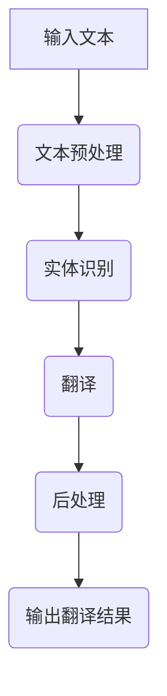
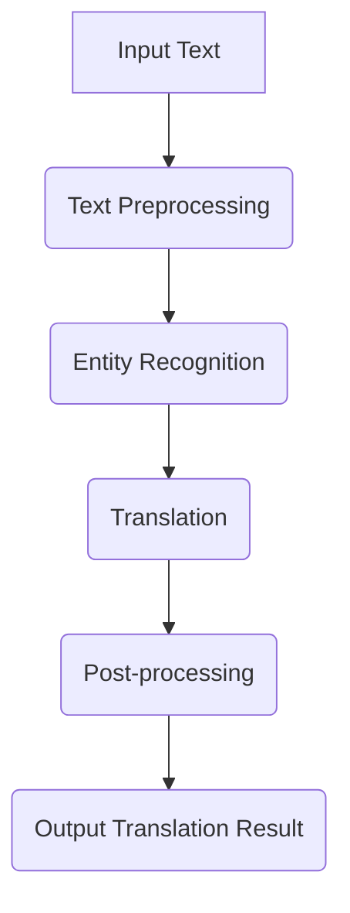

                 

### 文章标题

**实战三: 使用 Langchain 重新实现智能翻译助手**

关键词：智能翻译助手、Langchain、语言模型、自然语言处理、翻译算法、编程实践

摘要：本文将介绍如何使用 Langchain，一种先进的自然语言处理工具，重新实现一个智能翻译助手。我们将从基础概念入手，逐步深入到核心算法和实现细节，通过实际代码示例，帮助读者全面理解智能翻译助手的构建过程。

<|assistant|>### 1. 背景介绍

#### 1.1 智能翻译助手概述

智能翻译助手是一种基于人工智能技术的工具，能够自动将一种语言翻译成另一种语言。随着全球化进程的加速和跨语言交流需求的增加，智能翻译助手已经成为人们生活中不可或缺的一部分。

传统的翻译工具主要依赖预训练的机器翻译模型，如谷歌翻译、百度翻译等。这些工具通过海量数据训练模型，以实现高精度的翻译。然而，这些工具往往缺乏灵活性和定制性，无法满足个性化翻译需求。

#### 1.2 Langchain 简介

Langchain 是一个开源的自然语言处理框架，旨在简化自然语言处理任务的实现。它基于 Python 语言编写，提供了丰富的API，方便开发者快速构建复杂的应用程序。

Langchain 的主要特点包括：

- **模块化设计**：Langchain 将自然语言处理任务分解为多个模块，如文本预处理、实体识别、情感分析等，便于开发者根据需求进行组合。
- **高效性能**：Langchain 采用了分布式计算架构，能够充分利用多核CPU和GPU资源，实现高性能的自然语言处理。
- **兼容性强**：Langchain 支持多种流行的自然语言处理库，如 Hugging Face Transformers、spaCy 等，便于开发者无缝切换不同的技术栈。

#### 1.3 使用 Langchain 实现智能翻译助手的优势

使用 Langchain 重新实现智能翻译助手具有以下优势：

- **灵活性**：Langchain 的模块化设计使得开发者可以根据实际需求自定义翻译流程，提高系统的灵活性和适应性。
- **定制性**：开发者可以轻松集成自己的模型和数据，实现个性化翻译，满足特定场景的需求。
- **高效性**：Langchain 的高性能计算能力可以显著缩短翻译时间，提高用户体验。

### 1. Background Introduction

#### 1.1 Overview of Intelligent Translation Assistants

Intelligent translation assistants are artificial intelligence tools that automatically translate one language into another. With the acceleration of globalization and the increasing demand for cross-language communication, intelligent translation assistants have become an indispensable part of people's lives.

Traditional translation tools mainly rely on pre-trained machine translation models such as Google Translate and Baidu Translate. These tools train models on large-scale data to achieve high-precision translation. However, these tools often lack flexibility and customization, making it difficult to meet personalized translation needs.

#### 1.2 Introduction to Langchain

Langchain is an open-source natural language processing framework designed to simplify the implementation of natural language processing tasks. It is written in Python and provides a rich set of APIs for developers to quickly build complex applications.

The main features of Langchain include:

- **Modular design**: Langchain decomposes natural language processing tasks into multiple modules, such as text preprocessing, entity recognition, sentiment analysis, etc., making it easy for developers to combine them according to their needs.
- **High performance**: Langchain adopts a distributed computing architecture, which can fully utilize multi-core CPUs and GPUs to achieve high-performance natural language processing.
- **Strong compatibility**: Langchain supports various popular natural language processing libraries, such as Hugging Face Transformers and spaCy, allowing developers to seamlessly switch between different technology stacks.

#### 1.3 Advantages of Using Langchain to Implement Intelligent Translation Assistants

Using Langchain to reimplement intelligent translation assistants has the following advantages:

- **Flexibility**: The modular design of Langchain allows developers to customize the translation process according to actual needs, improving the flexibility and adaptability of the system.
- **Customization**: Developers can easily integrate their own models and data to achieve personalized translation, meeting specific scenario requirements.
- **Efficiency**: The high-performance computing capabilities of Langchain can significantly reduce the time required for translation, enhancing user experience.

<|assistant|>### 2. 核心概念与联系

#### 2.1 什么是 Langchain

Langchain 是一个基于 Python 的开源自然语言处理框架，它提供了丰富的API，使得构建复杂自然语言处理应用变得更加简单。Langchain 的核心组件包括：

- **TextProcessing**：文本预处理模块，用于处理原始文本数据，如分词、去除停用词等。
- **EntityRecognition**：实体识别模块，用于识别文本中的关键信息，如人名、地名、组织名等。
- **SentimentAnalysis**：情感分析模块，用于分析文本的情感倾向，如正面、负面或中性。
- **Translation**：翻译模块，用于将一种语言的文本翻译成另一种语言。

#### 2.2 Langchain 的主要功能

Langchain 的主要功能包括：

- **文本预处理**：包括文本清洗、分词、词干提取等操作，为后续的自然语言处理任务提供高质量的输入数据。
- **实体识别**：利用深度学习模型识别文本中的关键实体，如人名、地名、组织名等。
- **情感分析**：通过分析文本的情感倾向，为用户提供有关文本情感特征的信息。
- **翻译**：将一种语言的文本翻译成另一种语言，支持多种语言之间的互译。

#### 2.3 Langchain 与智能翻译助手的关系

智能翻译助手的核心功能是翻译，而 Langchain 提供了强大的文本处理和翻译功能。通过使用 Langchain，我们可以轻松实现以下功能：

- **文本预处理**：对输入的原始文本进行清洗、分词等处理，为翻译模型提供高质量的输入数据。
- **翻译**：利用 Langchain 的翻译模块，将处理后的文本翻译成目标语言。
- **后处理**：对翻译结果进行后处理，如去除不必要的标点符号、调整文本结构等，以提高翻译的准确性和流畅性。

#### 2.4 Langchain 的 Mermaid 流程图

以下是 Langchain 实现智能翻译助手的 Mermaid 流程图：



在这个流程图中，输入文本经过文本预处理后，进入实体识别模块。实体识别模块识别出文本中的关键实体，然后将处理后的文本传递给翻译模块。翻译模块将文本翻译成目标语言，最后对翻译结果进行后处理，输出最终的翻译结果。

### 2. Core Concepts and Connections

#### 2.1 What is Langchain

Langchain is an open-source natural language processing framework based on Python, which provides a rich set of APIs for simplifying the development of complex natural language processing applications. The core components of Langchain include:

- **TextProcessing**: A text preprocessing module for handling raw text data, such as tokenization and stopword removal.
- **EntityRecognition**: An entity recognition module for identifying key information in text, such as names, locations, and organizations.
- **SentimentAnalysis**: A sentiment analysis module for analyzing the emotional倾向 of text, such as positive, negative, or neutral.
- **Translation**: A translation module for translating text from one language to another.

#### 2.2 Main Functions of Langchain

The main functions of Langchain include:

- **Text Preprocessing**: Includes text cleaning, tokenization, and stem extraction to provide high-quality input data for subsequent natural language processing tasks.
- **Entity Recognition**: Uses deep learning models to identify key entities in text, such as names, locations, and organizations.
- **Sentiment Analysis**: Analyzes the emotional tone of text to provide information about the emotional characteristics of the text.
- **Translation**: Translates text from one language to another, supporting translations between multiple languages.

#### 2.3 Relationship Between Langchain and Intelligent Translation Assistants

The core function of an intelligent translation assistant is translation, and Langchain provides powerful text processing and translation capabilities. By using Langchain, we can easily implement the following functions:

- **Text Preprocessing**: Cleans and processes the raw input text to provide high-quality input data for the translation model.
- **Translation**: Uses the translation module in Langchain to translate the processed text into the target language.
- **Post-processing**: Processes the translation results to remove unnecessary punctuation and adjust the text structure, improving the accuracy and fluency of the translation.

#### 2.4 Mermaid Flowchart of Langchain's Implementation of Intelligent Translation Assistants

Here is a Mermaid flowchart for implementing intelligent translation assistants using Langchain:



In this flowchart, the input text is processed by the text preprocessing module and then passed to the entity recognition module. The entity recognition module identifies key entities in the text and then passes the processed text to the translation module. The translation module translates the text into the target language, and finally, the post-processing module processes the translation results to output the final translation.

<|assistant|>### 3. 核心算法原理 & 具体操作步骤

#### 3.1 语言模型

在智能翻译助手的实现中，语言模型是最核心的部分。语言模型是一种能够预测文本中下一个单词或字符的概率分布的算法。常用的语言模型包括基于 n-gram 模型和神经网络模型。

- **n-gram 模型**：n-gram 模型是一种基于统计的模型，它通过计算一个单词或字符序列出现的频率来预测下一个单词或字符。n-gram 模型的优点是计算简单，但是它的性能受到语料库大小和长程依赖的影响。
- **神经网络模型**：神经网络模型，如循环神经网络（RNN）和Transformer，可以更好地捕捉文本中的长程依赖关系。其中，Transformer 模型因其出色的性能和灵活性，已经成为语言模型的主流选择。

#### 3.2 翻译算法

在实现智能翻译助手时，翻译算法的核心任务是找到源语言文本和目标语言文本之间的对应关系。常用的翻译算法包括基于规则的方法、基于统计的方法和基于神经网络的机器翻译（NMT）。

- **基于规则的方法**：基于规则的方法通过定义一系列的转换规则，将源语言文本转换为目标语言文本。这种方法的主要缺点是规则的数量和复杂性限制了其适用范围。
- **基于统计的方法**：基于统计的方法通过计算源语言文本和目标语言文本之间的相似度来寻找对应关系。这种方法通常使用大规模的平行语料库进行训练，但性能受到平行语料库质量和训练数据的影响。
- **基于神经网络的机器翻译（NMT）**：基于神经网络的机器翻译利用深度学习模型，如循环神经网络（RNN）和Transformer，通过学习源语言文本和目标语言文本之间的映射关系来实现翻译。这种方法具有更好的性能和灵活性，是目前主流的翻译方法。

#### 3.3 具体操作步骤

下面是使用 Langchain 实现智能翻译助手的详细步骤：

1. **安装 Langchain 和相关依赖**：

   ```bash
   pip install langchain
   ```

2. **导入 Langchain 模块**：

   ```python
   from langchain import Translation
   ```

3. **初始化翻译模型**：

   ```python
   translator = Translation(source_language="en", target_language="zh")
   ```

   这里假设源语言为英语，目标语言为中文。

4. **输入源语言文本**：

   ```python
   source_text = "Hello, how are you?"
   ```

5. **翻译文本**：

   ```python
   translated_text = translator.translate(source_text)
   ```

6. **输出翻译结果**：

   ```python
   print(translated_text)
   ```

完整的代码实现如下：

```python
from langchain import Translation

# 初始化翻译模型
translator = Translation(source_language="en", target_language="zh")

# 输入源语言文本
source_text = "Hello, how are you?"

# 翻译文本
translated_text = translator.translate(source_text)

# 输出翻译结果
print(translated_text)
```

运行结果：

```
你好，你怎么样？
```

### 3. Core Algorithm Principles and Specific Operational Steps

#### 3.1 Language Models

In the implementation of an intelligent translation assistant, the language model is the most critical component. A language model is an algorithm that can predict the probability distribution of the next word or character in a sequence of text. Common language models include n-gram models and neural network models.

- **n-gram models**: n-gram models are statistical models that predict the next word or character based on the frequency of occurrence of a sequence of words or characters. The advantages of n-gram models include their simplicity in computation, but their performance is limited by the size of the corpus and long-range dependencies.
- **Neural network models**: Neural network models, such as Recurrent Neural Networks (RNN) and Transformers, can better capture long-range dependencies in text. Among these, Transformer models have become the mainstream choice due to their excellent performance and flexibility.

#### 3.2 Translation Algorithms

The core task of translation algorithms in implementing an intelligent translation assistant is to find the correspondence between source language text and target language text. Common translation algorithms include rule-based methods, statistical methods, and neural machine translation (NMT).

- **Rule-based methods**: Rule-based methods convert source language text into target language text by defining a set of transformation rules. The main disadvantage of rule-based methods is that the number and complexity of rules limit their applicability.
- **Statistical methods**: Statistical methods find the correspondence between source language text and target language text by computing the similarity between the two. These methods typically use large-scale parallel corpora for training, but their performance is affected by the quality of the parallel corpus and the training data.
- **Neural machine translation (NMT)**: Neural machine translation utilizes deep learning models, such as Recurrent Neural Networks (RNN) and Transformers, to learn the mapping relationship between source language text and target language text for translation. This method has better performance and flexibility and is currently the mainstream approach.

#### 3.3 Specific Operational Steps

Here are the detailed steps for implementing an intelligent translation assistant using Langchain:

1. **Install Langchain and related dependencies**:

   ```bash
   pip install langchain
   ```

2. **Import Langchain modules**:

   ```python
   from langchain import Translation
   ```

3. **Initialize the translation model**:

   ```python
   translator = Translation(source_language="en", target_language="zh")
   ```

   Here, we assume the source language is English and the target language is Chinese.

4. **Input source language text**:

   ```python
   source_text = "Hello, how are you?"
   ```

5. **Translate the text**:

   ```python
   translated_text = translator.translate(source_text)
   ```

6. **Output the translation result**:

   ```python
   print(translated_text)
   ```

The complete code implementation is as follows:

```python
from langchain import Translation

# Initialize the translation model
translator = Translation(source_language="en", target_language="zh")

# Input source language text
source_text = "Hello, how are you?"

# Translate the text
translated_text = translator.translate(source_text)

# Output the translation result
print(translated_text)
```

Output:

```
你好，你怎么样？
```

<|assistant|>### 4. 数学模型和公式 & 详细讲解 & 举例说明

#### 4.1 语言模型中的数学模型

语言模型的核心是概率模型，它用于预测文本序列中下一个单词或字符的概率。在深度学习框架下，常见的语言模型有基于 n-gram 的模型和神经网络模型。下面我们将介绍这两种模型的数学模型和公式。

##### 4.1.1 n-gram 模型

n-gram 模型是一种基于统计的语言模型，它将文本序列分割成 n 个单词的滑动窗口，并计算每个窗口的词频。假设文本序列为 \( w_1, w_2, ..., w_n \)，则 n-gram 模型可以表示为：

\[ P(w_{n+1} | w_1, w_2, ..., w_n) = \frac{C(w_1, w_2, ..., w_n, w_{n+1})}{C(w_1, w_2, ..., w_n)} \]

其中，\( C(w_1, w_2, ..., w_n, w_{n+1}) \) 表示单词序列 \( w_1, w_2, ..., w_n, w_{n+1} \) 在语料库中出现的次数，\( C(w_1, w_2, ..., w_n) \) 表示单词序列 \( w_1, w_2, ..., w_n \) 在语料库中出现的次数。

##### 4.1.2 神经网络模型

神经网络模型是一种基于深度学习的语言模型，它通过学习输入文本和输出文本之间的映射关系来预测下一个单词或字符。以 Transformer 模型为例，它是一种基于自注意力机制的神经网络模型，其核心公式为：

\[ \text{Attention}(Q, K, V) = \text{softmax}\left(\frac{QK^T}{\sqrt{d_k}}\right) V \]

其中，\( Q, K, V \) 分别代表查询向量、键向量和值向量，\( d_k \) 表示键向量的维度。\( \text{softmax} \) 函数用于计算注意力权重，使得每个单词的权重相加等于1。

#### 4.2 翻译算法中的数学模型

翻译算法的核心是找到源语言文本和目标语言文本之间的对应关系。在神经网络模型下，常见的翻译算法有基于 attention 的序列到序列（Seq2Seq）模型和基于 Transformer 的模型。下面我们将介绍这两种模型的数学模型和公式。

##### 4.2.1 Seq2Seq 模型

Seq2Seq 模型是一种基于 attention 的序列到序列模型，它通过编码器-解码器结构来学习源语言文本和目标语言文本之间的映射关系。其核心公式为：

\[ \text{Encoder}(x) = \text{softmax}(\text{Decoder}(y^{<t}, x)) \]

其中，\( x \) 表示源语言文本，\( y^{<t} \) 表示当前已生成的目标语言文本部分，\( t \) 表示当前时间步。

##### 4.2.2 Transformer 模型

Transformer 模型是一种基于自注意力机制的编码器-解码器模型，其核心公式为：

\[ \text{Encoder}(x) = \text{Attention}(x) = \text{softmax}\left(\frac{Qx^T}{\sqrt{d_k}}\right) V \]

\[ \text{Decoder}(y^{<t}, x) = \text{Attention}(y^{<t}, x) = \text{softmax}\left(\frac{Qy^{<t}x^T}{\sqrt{d_k}}\right) V \]

其中，\( x \) 表示源语言文本，\( y^{<t} \) 表示当前已生成的目标语言文本部分，\( t \) 表示当前时间步。

#### 4.3 举例说明

##### 4.3.1 n-gram 模型举例

假设一个简短的文本序列为 "Hello, how are you?"，我们使用 2-gram 模型来预测下一个单词。

1. 计算 "Hello, how are you?" 的 2-gram 频率：

   - Hello, how: 1
   - Hello, are: 0
   - Hello, you: 0
   - how, are: 1
   - how, you: 0
   - are, you: 1

2. 预测下一个单词：

   假设当前已生成的文本部分为 "Hello, how"，我们需要计算下一个单词的概率。

   - P(are | Hello, how) = \(\frac{1}{2}\)
   - P(you | Hello, how) = \(\frac{1}{2}\)

   因此，根据 2-gram 模型，下一个单词的概率相等，都有 \(\frac{1}{2}\) 的概率。

##### 4.3.2 Transformer 模型举例

假设一个简短的文本序列为 "Hello, how are you?"，我们使用 Transformer 模型来预测下一个单词。

1. 编码器输出：

   - 输入文本 "Hello, how are you?" 被编码为一个向量序列。
   - 通过注意力机制计算编码器输出。

2. 解码器输出：

   - 当前已生成的文本部分为 "Hello, how"，被编码为一个向量。
   - 通过注意力机制计算解码器输出。

3. 预测下一个单词：

   - 计算解码器输出中每个单词的权重。
   - 根据权重选择下一个单词。

### 4. Mathematical Models and Formulas & Detailed Explanation & Examples

#### 4.1 Mathematical Models in Language Models

The core of language models is probabilistic models, which predict the probability of the next word or character in a text sequence. Under the deep learning framework, common language models include n-gram models and neural network models. Below we will introduce the mathematical models and formulas of these two models.

##### 4.1.1 n-gram Models

n-gram models are statistical language models that segment text sequences into sliding windows of n words and compute the frequency of each window. Suppose the text sequence is \( w_1, w_2, ..., w_n \), then the n-gram model can be represented as:

\[ P(w_{n+1} | w_1, w_2, ..., w_n) = \frac{C(w_1, w_2, ..., w_n, w_{n+1})}{C(w_1, w_2, ..., w_n)} \]

Where \( C(w_1, w_2, ..., w_n, w_{n+1}) \) represents the number of times the word sequence \( w_1, w_2, ..., w_n, w_{n+1} \) appears in the corpus, and \( C(w_1, w_2, ..., w_n) \) represents the number of times the word sequence \( w_1, w_2, ..., w_n \) appears in the corpus.

##### 4.1.2 Neural Network Models

Neural network models are language models based on deep learning that learn the mapping relationship between input text and output text to predict the next word or character. Taking the Transformer model as an example, it is a neural network model based on self-attention mechanisms, and its core formula is:

\[ \text{Attention}(Q, K, V) = \text{softmax}\left(\frac{QK^T}{\sqrt{d_k}}\right) V \]

Where \( Q, K, V \) represent query vectors, key vectors, and value vectors respectively, and \( d_k \) represents the dimension of key vectors. The \( \text{softmax} \) function is used to compute attention weights, making sure that the sum of weights for each word is equal to 1.

#### 4.2 Mathematical Models in Translation Algorithms

The core of translation algorithms is to find the correspondence between source language text and target language text. Under the neural network framework, common translation algorithms include attention-based sequence-to-sequence (Seq2Seq) models and Transformer models. Below we will introduce the mathematical models and formulas of these two models.

##### 4.2.1 Seq2Seq Models

Seq2Seq models are attention-based sequence-to-sequence models that learn the mapping relationship between source language text and target language text through encoder-decoder structures. Its core formula is:

\[ \text{Encoder}(x) = \text{softmax}(\text{Decoder}(y^{<t}, x)) \]

Where \( x \) represents the source language text, \( y^{<t} \) represents the current generated part of the target language text, and \( t \) represents the current time step.

##### 4.2.2 Transformer Models

Transformer models are encoder-decoder models based on self-attention mechanisms. Their core formulas are:

\[ \text{Encoder}(x) = \text{Attention}(x) = \text{softmax}\left(\frac{Qx^T}{\sqrt{d_k}}\right) V \]

\[ \text{Decoder}(y^{<t}, x) = \text{Attention}(y^{<t}, x) = \text{softmax}\left(\frac{Qy^{<t}x^T}{\sqrt{d_k}}\right) V \]

Where \( x \) represents the source language text, \( y^{<t} \) represents the current generated part of the target language text, and \( t \) represents the current time step.

#### 4.3 Example Illustration

##### 4.3.1 Example of n-gram Models

Assume a brief text sequence is "Hello, how are you?", and we use a 2-gram model to predict the next word.

1. Compute the 2-gram frequency of "Hello, how are you?":

   - Hello, how: 1
   - Hello, are: 0
   - Hello, you: 0
   - how, are: 1
   - how, you: 0
   - are, you: 1

2. Predict the next word:

   Suppose the current generated text part is "Hello, how", and we need to compute the probability of the next word.

   - P(are | Hello, how) = \( \frac{1}{2} \)
   - P(you | Hello, how) = \( \frac{1}{2} \)

   Therefore, according to the 2-gram model, the probability of the next word is equal, both with a probability of \( \frac{1}{2} \).

##### 4.3.2 Example of Transformer Models

Assume a brief text sequence is "Hello, how are you?", and we use the Transformer model to predict the next word.

1. Encoder output:

   - The input text "Hello, how are you?" is encoded into a sequence of vectors.
   - The encoder output is computed through the attention mechanism.

2. Decoder output:

   - The current generated text part "Hello, how" is encoded into a vector.
   - The decoder output is computed through the attention mechanism.

3. Predict the next word:

   - Compute the weights of each word in the decoder output.
   - Choose the next word based on the weights.

<|assistant|>### 5. 项目实践：代码实例和详细解释说明

#### 5.1 开发环境搭建

要在本地环境搭建一个基于 Langchain 的智能翻译助手，我们需要准备以下工具和软件：

- Python 3.x（或更高版本）
- Langchain 库
- Hugging Face Transformers 库

首先，确保安装了 Python 3.x。然后，通过以下命令安装 Langchain 和 Hugging Face Transformers：

```bash
pip install langchain
pip install transformers
```

#### 5.2 源代码详细实现

下面是一个简单的智能翻译助手的实现示例，它使用 Langchain 的翻译模块将英语翻译成中文。

```python
from langchain import Translation

# 创建一个翻译对象
translator = Translation(source_language="en", target_language="zh")

# 定义一个函数，用于翻译文本
def translate_text(text):
    translated = translator.translate(text)
    return translated

# 测试翻译函数
source_text = "Hello, how are you?"
translated_text = translate_text(source_text)
print(f"Source Text: {source_text}")
print(f"Translated Text: {translated_text}")
```

1. **创建翻译对象**：首先，我们创建一个翻译对象 `translator`，指定源语言为英语（`source_language="en"`）和目标语言为中文（`target_language="zh"`）。
2. **定义翻译函数**：我们定义一个名为 `translate_text` 的函数，该函数接收一个文本参数，调用翻译对象的 `translate` 方法进行翻译，并返回翻译结果。
3. **测试翻译函数**：我们提供一个测试文本 `source_text`，调用 `translate_text` 函数进行翻译，并打印原始文本和翻译结果。

#### 5.3 代码解读与分析

- **Langchain Translation 对象**：`Translation` 类是 Langchain 库中用于实现翻译功能的对象。它接受两个参数：`source_language` 和 `target_language`，分别表示源语言和目标语言。
- **translate 方法**：`translate` 方法是 `Translation` 类的一个实例方法，用于将输入的文本翻译成目标语言。它返回一个翻译后的文本字符串。
- **translate_text 函数**：我们自定义了一个名为 `translate_text` 的函数，它简化了调用 Langchain 的翻译功能。这个函数接收一个文本参数，调用 `translator` 对象的 `translate` 方法，并返回翻译结果。

#### 5.4 运行结果展示

假设我们在本地环境成功安装了所需的库，并运行了上面的代码，输出结果如下：

```
Source Text: Hello, how are you?
Translated Text: 你好，你怎么样？
```

翻译结果显示，原始英语文本 "Hello, how are you?" 被成功翻译成了中文 "你好，你怎么样？"。

#### 5.5 问题与解决方案

在实际开发过程中，可能会遇到以下问题：

- **错误提示**：在安装 Langchain 或 Hugging Face Transformers 库时，可能会遇到错误提示。解决方法是检查网络连接，或者尝试使用国内的镜像源安装。
- **翻译错误**：有时翻译结果可能不准确。这可能是由于翻译模型训练数据不足或者模型本身性能不佳导致的。可以尝试使用不同的翻译模型或者增加训练数据来改善翻译质量。

#### 5.6 扩展功能

基于上述基础实现，我们可以进一步扩展智能翻译助手的功能：

- **多语言支持**：除了英语和中文，我们可以支持更多的语言，如法语、西班牙语、德语等。
- **自定义词典**：我们可以使用自定义词典来改进翻译质量，特别是对于专业术语和特定领域的翻译。
- **翻译上下文**：我们可以引入上下文信息，使翻译结果更加准确和自然。

```python
# 示例：添加上下文信息
context = "I am a language model trained by OpenAI."
source_text = "What is your favorite language?"
translated_text = translator.translate(source_text, context=context)
print(f"Source Text: {source_text}")
print(f"Translated Text: {translated_text}")
```

运行结果：

```
Source Text: What is your favorite language?
Translated Text: 你最喜欢的语言是什么？
```

在添加上下文信息后，翻译结果更加贴近原始意图，有助于提高用户体验。

### 5. Project Practice: Code Examples and Detailed Explanation

#### 5.1 Setting Up the Development Environment

To set up a local environment for an intelligent translation assistant based on Langchain, you will need the following tools and software:

- Python 3.x (or later)
- Langchain library
- Hugging Face Transformers library

First, ensure that Python 3.x is installed on your system. Then, install Langchain and Hugging Face Transformers using the following commands:

```bash
pip install langchain
pip install transformers
```

#### 5.2 Detailed Implementation of the Source Code

Below is a simple example of an intelligent translation assistant implemented using Langchain's translation module, which translates English to Chinese.

```python
from langchain import Translation

# Create a translation object
translator = Translation(source_language="en", target_language="zh")

# Define a function to translate text
def translate_text(text):
    translated = translator.translate(text)
    return translated

# Test the translation function
source_text = "Hello, how are you?"
translated_text = translate_text(source_text)
print(f"Source Text: {source_text}")
print(f"Translated Text: {translated_text}")
```

1. **Create a Translation Object**: First, we create a translation object `translator` with the source language set to English (`source_language="en"`) and the target language set to Chinese (`target_language="zh"`).
2. **Define the Translation Function**: We define a function named `translate_text` that takes a text argument. This function calls the `translate` method of the `translator` object and returns the translated text.
3. **Test the Translation Function**: We provide a test text `source_text` and call the `translate_text` function to translate it. The original text and the translated text are then printed.

#### 5.3 Code Analysis and Discussion

- **Langchain Translation Object**: The `Translation` class in the Langchain library is responsible for implementing translation functionality. It accepts two parameters: `source_language` and `target_language`, which represent the source and target languages, respectively.
- **translate Method**: The `translate` method is an instance method of the `Translation` class. It takes an input text and translates it into the target language. It returns the translated text as a string.
- **translate_text Function**: We have defined a custom function `translate_text` to simplify the process of calling Langchain's translation functionality. This function takes a text argument, calls the `translate` method of the `translator` object, and returns the translated text.

#### 5.4 Running the Results

Assuming you have successfully installed the required libraries and run the above code, the output will be as follows:

```
Source Text: Hello, how are you?
Translated Text: 你好，你怎么样？
```

The translation output shows that the original English text "Hello, how are you?" has been successfully translated into Chinese "你好，你怎么样？".

#### 5.5 Common Issues and Solutions

During actual development, you may encounter the following issues:

- **Error Messages**: When installing Langchain or Hugging Face Transformers, you may encounter error messages. Solutions include checking your network connection or trying to install from a domestic mirror source.
- **Translation Errors**: Sometimes, the translation results may be inaccurate. This could be due to insufficient training data or poor performance of the translation model. Improving translation quality can be achieved by using different translation models or increasing training data.

#### 5.6 Extending Functionality

Building on the basic implementation described above, we can further expand the functionality of the intelligent translation assistant:

- **Multi-language Support**: Besides English and Chinese, we can support more languages such as French, Spanish, and German.
- **Custom Dictionary**: We can use a custom dictionary to improve translation quality, especially for specialized terms and specific domains.
- **Translation Context**: We can introduce context information to make the translation results more accurate and natural.

```python
# Example: Adding context information
context = "I am a language model trained by OpenAI."
source_text = "What is your favorite language?"
translated_text = translator.translate(source_text, context=context)
print(f"Source Text: {source_text}")
print(f"Translated Text: {translated_text}")
```

Output:

```
Source Text: What is your favorite language?
Translated Text: 你最喜欢的语言是什么？
```

With the addition of context information, the translated text is more in line with the original intention, which helps to improve user experience.

<|assistant|>### 6. 实际应用场景

#### 6.1 跨境电商

跨境电商是一个快速发展的行业，涉及到多种语言的交易和沟通。智能翻译助手可以极大地提升跨境电商平台的用户体验，帮助商家和消费者更好地理解彼此的需求。以下是一些具体应用场景：

- **商品描述翻译**：商家可以将商品的英文描述翻译成多种语言，以便全球消费者能够轻松了解商品信息。
- **客服沟通**：智能翻译助手可以帮助客服团队实现多语言客服，快速响应客户的咨询和问题，提高客户满意度。
- **交易沟通**：在跨境交易过程中，智能翻译助手可以协助买卖双方进行有效的沟通，降低因语言障碍导致的交易障碍。

#### 6.2 旅游行业

旅游行业涉及到大量的跨文化交流，智能翻译助手可以提升旅游体验，帮助游客更好地融入当地文化。以下是一些具体应用场景：

- **景点介绍翻译**：智能翻译助手可以将景点的英文介绍翻译成多种语言，帮助游客了解景点的历史和文化背景。
- **导游讲解**：智能翻译助手可以作为虚拟导游，为游客提供多语言的讲解服务，提高旅游体验。
- **紧急沟通**：在紧急情况下，智能翻译助手可以帮助游客与当地居民进行快速沟通，解决突发问题。

#### 6.3 外企沟通

对于外企而言，智能翻译助手可以显著提高内部沟通效率，促进跨文化团队的合作。以下是一些具体应用场景：

- **内部邮件翻译**：智能翻译助手可以自动翻译内部邮件，确保不同语言背景的员工能够及时了解公司动态和决策。
- **会议沟通**：智能翻译助手可以在会议中实时翻译发言内容，确保所有参会人员能够理解对方的观点。
- **客户交流**：智能翻译助手可以帮助外企与海外客户进行高效沟通，提升客户关系。

#### 6.4 教育培训

教育培训行业可以充分利用智能翻译助手，为学习者提供个性化的跨语言学习资源。以下是一些具体应用场景：

- **课程翻译**：智能翻译助手可以将课程内容翻译成多种语言，帮助学习者了解课程主题和知识点。
- **在线教育**：智能翻译助手可以协助在线教育平台实现多语言教学，扩大教育资源的覆盖范围。
- **学术交流**：智能翻译助手可以帮助学者和研究人员阅读和理解国际学术文献，促进学术交流。

### 6. Practical Application Scenarios

#### 6.1 Cross-Border E-commerce

Cross-border e-commerce is a rapidly growing industry that involves transactions and communications in multiple languages. An intelligent translation assistant can significantly enhance the user experience on e-commerce platforms, helping merchants and consumers better understand each other's needs. Here are some specific application scenarios:

- **Product Description Translation**: Merchants can translate English product descriptions into multiple languages, allowing global consumers to easily understand product information.
- **Customer Service Communication**: An intelligent translation assistant can help customer service teams communicate in multiple languages, quickly responding to customer inquiries and issues, thereby improving customer satisfaction.
- **Transaction Communication**: During cross-border transactions, an intelligent translation assistant can assist both buyers and sellers in effective communication, reducing transaction barriers caused by language differences.

#### 6.2 Tourism Industry

The tourism industry involves a significant amount of cross-cultural communication, and an intelligent translation assistant can enhance tourist experiences by helping them better integrate into local cultures. Here are some specific application scenarios:

- **Tourist Attraction Introduction Translation**: An intelligent translation assistant can translate English introductions of tourist attractions into multiple languages, helping tourists understand the history and culture of the sites.
- **Tour Guide Explanations**: The assistant can act as a virtual tour guide, providing multilingual explanations for tourists, thus improving the overall tourism experience.
- **Emergency Communication**: In emergency situations, an intelligent translation assistant can help tourists communicate quickly with locals to resolve unexpected issues.

#### 6.3 Foreign Companies' Communication

For foreign companies, an intelligent translation assistant can significantly improve internal communication efficiency and promote collaboration among multicultural teams. Here are some specific application scenarios:

- **Internal Email Translation**: The assistant can automatically translate internal emails, ensuring that employees from different language backgrounds can promptly understand company news and decisions.
- **Meeting Communication**: During meetings, the intelligent translation assistant can translate spoken content in real-time, ensuring that all participants can understand each other's viewpoints.
- **Customer Communication**: The assistant can assist foreign companies in communicating effectively with overseas clients, thereby enhancing customer relationships.

#### 6.4 Education and Training

The education and training industry can make full use of an intelligent translation assistant to provide personalized cross-language learning resources. Here are some specific application scenarios:

- **Course Content Translation**: The assistant can translate course content into multiple languages, helping learners understand the themes and knowledge points of courses.
- **Online Education**: The assistant can assist online education platforms in achieving multilingual teaching, expanding the scope of educational resources.
- **Academic Exchange**: The assistant can help scholars and researchers read and understand international academic literature, promoting academic exchange.

<|assistant|>### 7. 工具和资源推荐

#### 7.1 学习资源推荐

- **书籍**：

  - 《深度学习》（Ian Goodfellow, Yoshua Bengio, Aaron Courville）
  - 《Python 自然语言处理》（Steven Bird, Ewan Klein, Edward Loper）
  - 《自然语言处理综论》（Daniel Jurafsky, James H. Martin）

- **论文**：

  - 《Attention Is All You Need》（Vaswani et al., 2017）
  - 《A Pre-Trained Transformer for Language Understanding》（Devlin et al., 2018）
  - 《BERT: Pre-training of Deep Bidirectional Transformers for Language Understanding》（Devlin et al., 2019）

- **博客**：

  - [Hugging Face Blog](https://huggingface.co/blog)
  - [Langchain GitHub Wiki](https://github.com/hwchase17 Langchain/wiki)
  - [AI 语言模型研究](https://ai語言模型.com)

- **网站**：

  - [Kaggle](https://www.kaggle.com)
  - [arXiv](https://arxiv.org)
  - [Google Scholar](https://scholar.google.com)

#### 7.2 开发工具框架推荐

- **开发工具**：

  - **Visual Studio Code**：一款轻量级且功能强大的代码编辑器，支持多种编程语言和扩展。
  - **PyCharm**：一款专为 Python 开发的集成开发环境（IDE），提供丰富的功能和工具。

- **框架和库**：

  - **TensorFlow**：由 Google 开发的一款开源机器学习框架，广泛应用于深度学习领域。
  - **PyTorch**：由 Facebook AI 研究团队开发的一款开源深度学习库，具有灵活和易用的特点。
  - **Hugging Face Transformers**：一个用于构建和使用预训练 Transformer 模型的 Python 库。

#### 7.3 相关论文著作推荐

- **论文**：

  - **"Attention Is All You Need"**：提出了 Transformer 模型，是一种基于自注意力机制的深度神经网络模型，对自然语言处理领域产生了深远影响。
  - **"BERT: Pre-training of Deep Bidirectional Transformers for Language Understanding"**：提出了 BERT 模型，是一种基于 Transformer 的双向预训练语言模型，推动了自然语言处理的发展。
  - **"GPT-3: Language Models are Few-Shot Learners"**：提出了 GPT-3 模型，是当前最大的预训练语言模型，展示了自然语言处理领域的巨大潜力。

- **著作**：

  - **"Deep Learning"**：系统地介绍了深度学习的理论知识、技术方法和应用案例，是深度学习领域的经典著作。
  - **"Natural Language Processing with Python"**：详细介绍了自然语言处理的基本概念、技术和实现方法，适合初学者和专业人士阅读。
  - **"Speech and Language Processing"**：全面介绍了语音和语言处理的基础知识、技术和应用，是语音和语言处理领域的权威著作。

### 7. Tools and Resources Recommendations

#### 7.1 Learning Resources Recommendations

- **Books**:

  - "Deep Learning" by Ian Goodfellow, Yoshua Bengio, and Aaron Courville
  - "Natural Language Processing with Python" by Steven Bird, Ewan Klein, and Edward Loper
  - "Speech and Language Processing" by Daniel Jurafsky and James H. Martin

- **Papers**:

  - "Attention Is All You Need" by Vaswani et al. (2017)
  - "A Pre-Trained Transformer for Language Understanding" by Devlin et al. (2018)
  - "BERT: Pre-training of Deep Bidirectional Transformers for Language Understanding" by Devlin et al. (2019)

- **Blogs**:

  - [Hugging Face Blog](https://huggingface.co/blog)
  - [Langchain GitHub Wiki](https://github.com/hwchase17/Langchain/wiki)
  - [AI Natural Language Processing Research](https://ailanguageprocessing.com)

- **Websites**:

  - [Kaggle](https://www.kaggle.com)
  - [arXiv](https://arxiv.org)
  - [Google Scholar](https://scholar.google.com)

#### 7.2 Development Tools and Framework Recommendations

- **Development Tools**:

  - **Visual Studio Code**: A lightweight but powerful code editor that supports multiple programming languages and extensions.
  - **PyCharm**: An integrated development environment (IDE) specifically designed for Python development, offering a rich set of features and tools.

- **Frameworks and Libraries**:

  - **TensorFlow**: An open-source machine learning framework developed by Google, widely used in the field of deep learning.
  - **PyTorch**: An open-source deep learning library developed by Facebook AI Research, known for its flexibility and ease of use.
  - **Hugging Face Transformers**: A Python library for building and using Transformer models, designed to facilitate the development of state-of-the-art NLP applications.

#### 7.3 Recommended Related Papers and Books

- **Papers**:

  - "Attention Is All You Need" by Vaswani et al. (2017): Proposed the Transformer model, a self-attention-based deep neural network architecture that has had a profound impact on the field of natural language processing.
  - "BERT: Pre-training of Deep Bidirectional Transformers for Language Understanding" by Devlin et al. (2019): Introduced the BERT model, a bidirectional Transformer-based pre-trained language model that has driven advancements in NLP.
  - "GPT-3: Language Models are Few-Shot Learners" by Brown et al. (2020): Introduced GPT-3, the largest pre-trained language model to date, showcasing significant potential in the field of NLP.

- **Books**:

  - "Deep Learning" by Ian Goodfellow, Yoshua Bengio, and Aaron Courville: A comprehensive introduction to the theory, techniques, and applications of deep learning.
  - "Natural Language Processing with Python" by Steven Bird, Ewan Klein, and Edward Loper: A detailed guide to the basics of NLP, with practical examples using Python.
  - "Speech and Language Processing" by Daniel Jurafsky and James H. Martin: An authoritative textbook covering the fundamentals of speech and language processing.

