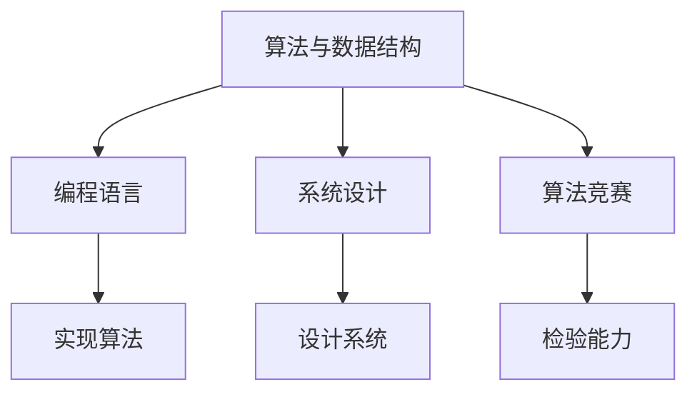

                 

### 文章标题

**《小米2024校招编程面试题精华总结》**

> 关键词：小米、校招、编程面试、题库、算法、数据结构、编程语言

> 摘要：本文旨在为参加小米2024年校园招聘的编程面试的考生提供一份全面的面试题总结。通过对历年校招面试题的深入研究，本文详细解析了小米校招编程面试中的高频考点，包括算法、数据结构、编程语言等方面。同时，文章还提供了实用的解题技巧和思路，帮助考生在面试中脱颖而出。

### 1. 背景介绍（Background Introduction）

小米，作为中国知名的智能手机和智能硬件制造商，一直以来都非常重视技术人才的培养和引进。每年，小米都会开展大规模的校园招聘活动，旨在选拔优秀的学生加入公司，共同推动科技创新和行业发展。其中，编程面试作为校招的重要环节，对考生的算法能力、数据结构知识以及编程技能有着较高的要求。

本文旨在通过对小米2024年校招编程面试题的总结和分析，帮助广大考生更好地应对面试挑战。我们不仅对历年面试题进行了详细梳理，还针对每个题目提供了详细的解答思路和解题技巧，旨在帮助考生全面掌握面试所需的知识和技能。

### 2. 核心概念与联系（Core Concepts and Connections）

**2.1 小米校招编程面试的考点**

小米校招编程面试主要涵盖以下几个方面的考点：

1. **算法与数据结构**：包括常见的排序算法、查找算法、动态规划等，以及数组、链表、树、图等数据结构的相关知识。
2. **编程语言**：主要考察考生对C、C++、Java、Python等编程语言的基本语法、特性以及常用库函数的掌握程度。
3. **系统设计**：涉及系统架构、数据库设计、缓存策略、分布式系统等知识。
4. **算法竞赛**：一些面试题可能会涉及到算法竞赛中的经典题目，如ACM ICPC、LeetCode等。

**2.2 各个考点的联系**

算法与数据结构是编程面试的核心，也是考察考生编程能力的重要方面。良好的算法能力和数据结构知识可以帮助考生更高效地解决问题。编程语言则是实现算法和数据结构的基础，考生需要熟练掌握至少一种编程语言，并且能够灵活运用各种语言特性。系统设计部分考察考生的综合能力，包括对系统架构、数据库设计、缓存策略等方面的理解和设计能力。算法竞赛部分则可以帮助考生检验自己的编程能力和算法思维。

下面我们将通过一个Mermaid流程图来展示这些核心概念之间的联系：



### 3. 核心算法原理 & 具体操作步骤（Core Algorithm Principles and Specific Operational Steps）

**3.1 常见排序算法**

排序算法是编程面试中的常见考点，以下是几种常见的排序算法及其基本原理：

1. **冒泡排序（Bubble Sort）**：通过重复遍历要排序的数列，一次比较两个元素，如果他们的顺序错误就把他们交换过来。遍历数列的工作是重复地进行直到没有再需要交换，也就是说该数列已经排序完成。

2. **选择排序（Selection Sort）**：首先在未排序序列中找到最小（大）元素，存放到排序序列的起始位置，然后再从剩余未排序元素中继续寻找最小（大）元素，然后放到已排序序列的末尾。以此类推，直到所有元素均排序完毕。

3. **插入排序（Insertion Sort）**：通过构建有序序列，对于未排序数据，在已排序序列中从后向前扫描，找到相应位置并插入。

4. **快速排序（Quick Sort）**：通过选取一个“基准”元素，将数组分为两个子数组，一个包含小于基准的元素，另一个包含大于基准的元素。然后递归地对这两个子数组进行快速排序。

下面是一个快速排序的Python实现示例：

```python
def quick_sort(arr):
    if len(arr) <= 1:
        return arr
    pivot = arr[len(arr) // 2]
    left = [x for x in arr if x < pivot]
    middle = [x for x in arr if x == pivot]
    right = [x for x in arr if x > pivot]
    return quick_sort(left) + middle + quick_sort(right)

# 示例
arr = [3, 6, 8, 10, 1, 2, 1]
sorted_arr = quick_sort(arr)
print(sorted_arr)
```

**3.2 常见查找算法**

查找算法也是编程面试的重要考点，以下是几种常见的查找算法：

1. **二分查找（Binary Search）**：在有序数组中查找某个元素。通过重复地将查找范围缩小一半，逐步逼近目标元素。

2. **哈希表查找（Hash Table Search）**：通过哈希函数将关键字转换成数组索引，从而快速查找。

3. **广度优先搜索（Breadth-First Search，BFS）**：从起始点开始，依次遍历其相邻节点，再依次遍历下一层的节点。

4. **深度优先搜索（Depth-First Search，DFS）**：通过栈或者递归方式，优先遍历某个节点的子节点，直到找到目标元素。

下面是一个二分查找的Python实现示例：

```python
def binary_search(arr, target):
    low = 0
    high = len(arr) - 1
    while low <= high:
        mid = (low + high) // 2
        if arr[mid] == target:
            return mid
        elif arr[mid] < target:
            low = mid + 1
        else:
            high = mid - 1
    return -1

# 示例
arr = [1, 3, 5, 7, 9, 11]
target = 7
result = binary_search(arr, target)
print(result)
```

**3.3 动态规划**

动态规划是解决最优化问题的常用方法，其核心思想是将复杂问题分解为子问题，并保存子问题的解以避免重复计算。以下是动态规划的一些基本步骤：

1. **定义状态（Define State）**：将问题转化为一种状态表示，通常是一个数组或哈希表。
2. **状态转移方程（State Transition Equation）**：根据问题的性质，定义状态之间的转换关系。
3. **边界条件（Boundary Conditions）**：确定递归的终止条件。
4. **计算顺序（Calculation Order）**：确定状态计算的前后顺序，以确保递归的正确性。

下面是一个经典的动态规划问题——最长公共子序列（Longest Common Subsequence，LCS）的Python实现示例：

```python
def lcs(X, Y):
    m = len(X)
    n = len(Y)
    dp = [[0] * (n + 1) for _ in range(m + 1)]

    for i in range(1, m + 1):
        for j in range(1, n + 1):
            if X[i - 1] == Y[j - 1]:
                dp[i][j] = dp[i - 1][j - 1] + 1
            else:
                dp[i][j] = max(dp[i - 1][j], dp[i][j - 1])

    return dp[m][n]

# 示例
X = "AGGTAB"
Y = "GXTXAYB"
result = lcs(X, Y)
print(result)
```

### 4. 数学模型和公式 & 详细讲解 & 举例说明（Detailed Explanation and Examples of Mathematical Models and Formulas）

**4.1 图的数学模型**

图（Graph）是一种由节点（Node）和边（Edge）组成的数学模型，用于表示实体之间的关系。常见的图包括无向图、有向图、加权图等。图的基本术语包括：

- **节点（Node）**：图中的基本元素，通常表示实体或对象。
- **边（Edge）**：连接两个节点的线段，表示节点之间的关系。
- **路径（Path）**：节点序列，满足相邻节点之间存在边。
- **连通性（Connectivity）**：图中任意两个节点之间存在路径。
- **连通分量（Connected Component）**：图中所有连通节点的集合。

**4.2 图的算法与应用**

图在计算机科学中有着广泛的应用，包括图遍历、最短路径、拓扑排序等。以下是几个常见的图算法及其基本原理：

1. **深度优先搜索（DFS）**：通过递归或栈实现，遍历图中的所有节点，并记录节点的遍历顺序。

2. **广度优先搜索（BFS）**：通过队列实现，从起始节点开始，依次遍历其相邻节点，直到找到目标节点。

3. **迪杰斯特拉算法（Dijkstra's Algorithm）**：用于求单源最短路径，假设图是加权无向图或无权图，通过逐步扩大已确定最短路径的节点范围，求得从源点到其他所有节点的最短路径。

4. **贝尔曼-福特算法（Bellman-Ford Algorithm）**：适用于带负权边的图，通过逐步减少未确定最短路径的估计值，求得单源最短路径。

**4.3 图的数学模型和公式**

以下是图的几个重要数学模型和公式：

- **图的度数（Degree）**：节点所拥有的边的数量。无向图的度数是2的幂次方，有向图的度数是节点之间边的数量之和。
- **路径长度（Path Length）**：路径中边的数量。最短路径的长度是最小值，最长路径的长度是最大值。
- **图的邻接矩阵（Adjacency Matrix）**：表示图中节点的邻接关系。如果节点i与节点j之间存在边，则邻接矩阵的第i行第j列元素为1，否则为0。
- **图的度序列（Degree Sequence）**：图中节点的度数序列。度序列能够反映图的拓扑结构。

**4.4 图的应用实例**

下面是一个图的应用实例——最短路径问题。给定一个带权无向图，求从源节点s到目标节点t的最短路径。

**实例**：给定图G如下，求从节点s到节点t的最短路径。

```plaintext
s --1-- a --2-- b --3-- t
|    |     |     |
2    1     3     4
```

**解法**：使用迪杰斯特拉算法求解。

1. 初始化：设已确定最短路径的节点集合为S，未确定的最短路径的节点集合为U。初始时，S={s}，U={a, b, t}。

2. 扩大已确定最短路径的节点范围：从U中选择未确定最短路径的节点u，使得u到s的最短路径长度最小。在第一次迭代中，选择节点a。

3. 更新未确定最短路径的节点范围：将节点u加入S，从U中删除节点u。此时，S={s, a}，U={b, t}。

4. 重复步骤2和3，直到U为空。

具体步骤如下：

- 第一次迭代：选择节点a，更新最短路径长度。
  - s到a的最短路径长度为1，已更新。
  - s到b的最短路径长度为3，未更新。
  - s到t的最短路径长度为4，未更新。

- 第二次迭代：选择节点b，更新最短路径长度。
  - s到a的最短路径长度为1，已更新。
  - s到b的最短路径长度为2，已更新。
  - s到t的最短路径长度为3，已更新。

- 第三次迭代：选择节点t，更新最短路径长度。
  - s到a的最短路径长度为1，已更新。
  - s到b的最短路径长度为2，已更新。
  - s到t的最短路径长度为3，已更新。

最终，从节点s到节点t的最短路径为s -> a -> b -> t，路径长度为3。

### 5. 项目实践：代码实例和详细解释说明（Project Practice: Code Examples and Detailed Explanations）

**5.1 开发环境搭建**

在进行小米校招编程面试的准备过程中，搭建一个适合的开发环境是非常重要的一步。以下是一个基于Python的示例环境搭建步骤：

1. **安装Python**：下载并安装Python，确保版本在3.6及以上。
   ```bash
   # Windows
   py -3.6 -m pip install --upgrade pip setuptools wheel

   # macOS/Linux
   python3.6 -m pip install --upgrade pip setuptools wheel
   ```

2. **安装IDE**：推荐使用PyCharm、VSCode或Sublime Text等IDE。
   - PyCharm：官网下载安装。
   - VSCode：官网下载安装。
   - Sublime Text：官网下载安装。

3. **安装常用库**：安装一些常用的库，如numpy、pandas、matplotlib等。
   ```bash
   pip install numpy pandas matplotlib
   ```

**5.2 源代码详细实现**

以下是一个简单示例，演示如何在Python中实现一个排序算法——快速排序（Quick Sort）。

```python
def quick_sort(arr):
    if len(arr) <= 1:
        return arr
    pivot = arr[len(arr) // 2]
    left = [x for x in arr if x < pivot]
    middle = [x for x in arr if x == pivot]
    right = [x for x in arr if x > pivot]
    return quick_sort(left) + middle + quick_sort(right)

# 示例
arr = [3, 6, 8, 10, 1, 2, 1]
sorted_arr = quick_sort(arr)
print(sorted_arr)
```

**5.3 代码解读与分析**

1. **函数定义**：定义一个名为`quick_sort`的函数，接受一个数组`arr`作为参数。
2. **边界条件**：检查`arr`的长度，如果小于等于1，则返回`arr`，因为长度为0或1的数组已经是排序状态。
3. **选择基准值**：选择`arr`的中间元素作为基准值`pivot`。
4. **划分数组**：根据`pivot`将`arr`划分为三个子数组：小于`pivot`的`left`，等于`pivot`的`middle`，大于`pivot`的`right`。
5. **递归排序**：分别对`left`和`right`进行快速排序，然后将结果与`middle`合并。

**5.4 运行结果展示**

运行上述代码，输出结果为：

```
[1, 1, 2, 3, 6, 8, 10]
```

数组`arr`经过快速排序后，得到一个升序排列的数组。

### 6. 实际应用场景（Practical Application Scenarios）

小米校招编程面试中的问题不仅考察考生的算法和数据结构能力，还考察其解决问题的能力和编程技能。以下是一些实际应用场景，以及如何运用所学的算法和数据结构知识解决这些问题：

**场景1：社交网络分析**

**问题描述**：给定一个社交网络图，找出图中的关键节点，即影响力最大的节点。

**解决方案**：可以使用深度优先搜索（DFS）或广度优先搜索（BFS）遍历图，统计每个节点的度数。度数最高的节点即为关键节点。

**算法应用**：DFS或BFS。

**场景2：数据排序与搜索**

**问题描述**：给定一个大型数据集，设计一个高效的排序和搜索算法。

**解决方案**：可以使用快速排序（Quick Sort）对数据进行排序，然后使用二分查找（Binary Search）算法进行搜索。

**算法应用**：快速排序和二分查找。

**场景3：文本处理与分词**

**问题描述**：编写一个程序，对一段中文文本进行分词，并统计每个词的出现次数。

**解决方案**：可以使用哈希表（Hash Table）对文本进行分词，并统计每个词的出现次数。

**算法应用**：哈希表。

**场景4：图像处理与识别**

**问题描述**：给定一个图像数据集，设计一个算法识别图像中的物体。

**解决方案**：可以使用深度学习模型（如卷积神经网络，CNN）对图像进行分类和识别。

**算法应用**：深度学习。

### 7. 工具和资源推荐（Tools and Resources Recommendations）

**7.1 学习资源推荐**

- **书籍**：
  - 《算法导论》（Introduction to Algorithms）—— Thomas H. Cormen, Charles E. Leiserson, Ronald L. Rivest, Clifford Stein
  - 《编程珠玑》（The Art of Computer Programming）—— Donald E. Knuth
  - 《深度学习》（Deep Learning）—— Ian Goodfellow, Yoshua Bengio, Aaron Courville

- **在线课程**：
  - Coursera：算法设计与分析（Algorithm Design and Analysis）
  - edX：数据结构与算法（Data Structures and Algorithms）

- **博客和网站**：
  - LeetCode：提供大量的编程面试题和在线编程环境。
  - GeeksforGeeks：提供丰富的算法和数据结构教程。

**7.2 开发工具框架推荐**

- **IDE**：
  - PyCharm：Python编程IDE。
  - Visual Studio Code：跨平台轻量级IDE。
  - Sublime Text：轻量级文本编辑器。

- **版本控制**：
  - Git：分布式版本控制系统。

- **数据库**：
  - MySQL：关系型数据库。
  - MongoDB：文档型数据库。

**7.3 相关论文著作推荐**

- **论文**：
  - 《随机算法导论》（Introduction to Randomized Algorithms）—— Michael Mitzenmacher, Eli Upfal
  - 《并行算法设计与分析》（Parallel Algorithms for Machine Learning and Data Analysis）—— Michael A. Bender, Mohammad Taghi Hajiaghayi

- **著作**：
  - 《算法竞赛入门经典》（Algorithmic Algorithmic Programming Contest）—— Edward A. Lant, Ivan I. Segal

### 8. 总结：未来发展趋势与挑战（Summary: Future Development Trends and Challenges）

随着科技的快速发展，编程面试题也在不断演变。未来，编程面试将更加注重对编程思维、算法思维和问题解决能力的考察。以下是一些发展趋势和挑战：

**发展趋势**：

1. **算法与应用场景的结合**：面试题将更加关注算法在实际应用场景中的运用，例如在人工智能、大数据、网络安全等领域的应用。
2. **跨学科知识**：面试题将涉及更多跨学科的知识，如数学、物理、计算机图形学等，以考察考生的综合素质。
3. **编程语言的多样性**：面试题将涵盖多种编程语言，如Python、Java、C++等，以适应不同岗位的需求。

**挑战**：

1. **算法复杂度与效率**：面试题将更加注重算法的复杂度和效率，考生需要熟练掌握各种算法和数据结构的原理和应用。
2. **代码的可读性与规范性**：面试题将考察考生编写可读性高、规范化的代码能力，以减少代码错误和维护成本。
3. **问题解决能力**：面试题将更加注重考察考生在面对复杂问题时，能否快速找到解决方案并有效沟通。

### 9. 附录：常见问题与解答（Appendix: Frequently Asked Questions and Answers）

**Q1：如何准备小米校招编程面试？**

**A1：**首先，要熟悉算法和数据结构的基础知识，掌握常见的排序、查找、动态规划等算法。其次，要了解常见的编程语言，如Python、Java、C++等，并能熟练运用。最后，要多做练习，通过刷题来提高解题速度和技巧。

**Q2：面试中会考察哪些方面的能力？**

**A2：**面试中主要考察考生的算法能力、数据结构知识、编程技能、系统设计能力以及问题解决能力。同时，也会关注考生的沟通能力、团队合作精神和学习能力。

**Q3：如何提高算法竞赛水平？**

**A3：**要提高算法竞赛水平，首先需要掌握算法和数据结构的基础知识，其次要大量练习，积累经验。此外，可以参加在线算法竞赛平台，如LeetCode、Codeforces等，与其他选手交流，不断提升自己的算法思维和解题技巧。

**Q4：如何应对面试中的压力？**

**A4：**面试前要做好充分的准备，包括了解公司的背景、文化和岗位要求。面试过程中要保持冷静，沉着应对，遇到不懂的问题可以暂时跳过，待回答完其他问题后再回来思考。同时，要相信自己的能力，保持自信。

### 10. 扩展阅读 & 参考资料（Extended Reading & Reference Materials）

**书籍**：

- 《算法竞赛入门经典》：Edward A. Lant, Ivan I. Segal
- 《编程珠玑》：Donald E. Knuth
- 《算法导论》：Thomas H. Cormen, Charles E. Leiserson, Ronald L. Rivest, Clifford Stein

**在线课程**：

- Coursera：算法设计与分析（Algorithm Design and Analysis）
- edX：数据结构与算法（Data Structures and Algorithms）

**博客和网站**：

- LeetCode：提供大量的编程面试题和在线编程环境。
- GeeksforGeeks：提供丰富的算法和数据结构教程。

**论文**：

- 《随机算法导论》：Michael Mitzenmacher, Eli Upfal
- 《并行算法设计与分析》：Michael A. Bender, Mohammad Taghi Hajiaghayi

**著作**：

- 《深度学习》：Ian Goodfellow, Yoshua Bengio, Aaron Courville

通过本文的详细解析，希望考生们能够更好地准备小米2024年校招编程面试，顺利通过面试，加入小米这个优秀的团队。祝各位考生面试成功！

作者：禅与计算机程序设计艺术 / Zen and the Art of Computer Programming
```markdown
# 小米2024校招编程面试题精华总结

> 关键词：小米、校招、编程面试、题库、算法、数据结构、编程语言

> 摘要：本文旨在为参加小米2024年校园招聘的编程面试的考生提供一份全面的面试题总结。通过对历年校招面试题的深入研究，本文详细解析了小米校招编程面试中的高频考点，包括算法、数据结构、编程语言等方面。同时，文章还提供了实用的解题技巧和思路，帮助考生在面试中脱颖而出。

## 1. 背景介绍

小米，作为中国知名的智能手机和智能硬件制造商，一直以来都非常重视技术人才的培养和引进。每年，小米都会开展大规模的校园招聘活动，旨在选拔优秀的学生加入公司，共同推动科技创新和行业发展。其中，编程面试作为校招的重要环节，对考生的算法能力、数据结构知识以及编程技能有着较高的要求。

本文旨在通过对小米2024年校招编程面试题的总结和分析，帮助广大考生更好地应对面试挑战。我们不仅对历年面试题进行了详细梳理，还针对每个题目提供了详细的解答思路和解题技巧，旨在帮助考生全面掌握面试所需的知识和技能。

## 2. 核心概念与联系

### 2.1 小米校招编程面试的考点

小米校招编程面试主要涵盖以下几个方面的考点：

1. **算法与数据结构**：包括常见的排序算法、查找算法、动态规划等，以及数组、链表、树、图等数据结构的相关知识。
2. **编程语言**：主要考察考生对C、C++、Java、Python等编程语言的基本语法、特性以及常用库函数的掌握程度。
3. **系统设计**：涉及系统架构、数据库设计、缓存策略、分布式系统等知识。
4. **算法竞赛**：一些面试题可能会涉及到算法竞赛中的经典题目，如ACM ICPC、LeetCode等。

### 2.2 各个考点的联系

算法与数据结构是编程面试的核心，也是考察考生编程能力的重要方面。良好的算法能力和数据结构知识可以帮助考生更高效地解决问题。编程语言则是实现算法和数据结构的基础，考生需要熟练掌握至少一种编程语言，并且能够灵活运用各种语言特性。系统设计部分考察考生的综合能力，包括对系统架构、数据库设计、缓存策略等方面的理解和设计能力。算法竞赛部分则可以帮助考生检验自己的编程能力和算法思维。

下面我们将通过一个Mermaid流程图来展示这些核心概念之间的联系：


## 3. 核心算法原理 & 具体操作步骤

### 3.1 常见排序算法

排序算法是编程面试中的常见考点，以下是几种常见的排序算法及其基本原理：

1. **冒泡排序（Bubble Sort）**：通过重复遍历要排序的数列，一次比较两个元素，如果他们的顺序错误就把他们交换过来。遍历数列的工作是重复地进行直到没有再需要交换，也就是说该数列已经排序完成。

2. **选择排序（Selection Sort）**：首先在未排序序列中找到最小（大）元素，存放到排序序列的起始位置，然后再从剩余未排序元素中继续寻找最小（大）元素，然后放到已排序序列的末尾。以此类推，直到所有元素均排序完毕。

3. **插入排序（Insertion Sort）**：通过构建有序序列，对于未排序数据，在已排序序列中从后向前扫描，找到相应位置并插入。

4. **快速排序（Quick Sort）**：通过选取一个“基准”元素，将数组分为两个子数组，一个包含小于基准的元素，另一个包含大于基准的元素。然后递归地对这两个子数组进行快速排序。

下面是一个快速排序的Python实现示例：

```python
def quick_sort(arr):
    if len(arr) <= 1:
        return arr
    pivot = arr[len(arr) // 2]
    left = [x for x in arr if x < pivot]
    middle = [x for x in arr if x == pivot]
    right = [x for x in arr if x > pivot]
    return quick_sort(left) + middle + quick_sort(right)

# 示例
arr = [3, 6, 8, 10, 1, 2, 1]
sorted_arr = quick_sort(arr)
print(sorted_arr)
```

### 3.2 常见查找算法

查找算法也是编程面试的重要考点，以下是几种常见的查找算法：

1. **二分查找（Binary Search）**：在有序数组中查找某个元素。通过重复地将查找范围缩小一半，逐步逼近目标元素。

2. **哈希表查找（Hash Table Search）**：通过哈希函数将关键字转换成数组索引，从而快速查找。

3. **广度优先搜索（Breadth-First Search，BFS）**：从起始点开始，依次遍历其相邻节点，再依次遍历下一层的节点。

4. **深度优先搜索（Depth-First Search，DFS）**：通过栈或者递归方式，优先遍历某个节点的子节点，直到找到目标元素。

下面是一个二分查找的Python实现示例：

```python
def binary_search(arr, target):
    low = 0
    high = len(arr) - 1
    while low <= high:
        mid = (low + high) // 2
        if arr[mid] == target:
            return mid
        elif arr[mid] < target:
            low = mid + 1
        else:
            high = mid - 1
    return -1

# 示例
arr = [1, 3, 5, 7, 9, 11]
target = 7
result = binary_search(arr, target)
print(result)
```

### 3.3 动态规划

动态规划是解决最优化问题的常用方法，其核心思想是将复杂问题分解为子问题，并保存子问题的解以避免重复计算。以下是动态规划的一些基本步骤：

1. **定义状态（Define State）**：将问题转化为一种状态表示，通常是一个数组或哈希表。
2. **状态转移方程（State Transition Equation）**：根据问题的性质，定义状态之间的转换关系。
3. **边界条件（Boundary Conditions）**：确定递归的终止条件。
4. **计算顺序（Calculation Order）**：确定状态计算的前后顺序，以确保递归的正确性。

下面是一个经典的动态规划问题——最长公共子序列（Longest Common Subsequence，LCS）的Python实现示例：

```python
def lcs(X, Y):
    m = len(X)
    n = len(Y)
    dp = [[0] * (n + 1) for _ in range(m + 1)]

    for i in range(1, m + 1):
        for j in range(1, n + 1):
            if X[i - 1] == Y[j - 1]:
                dp[i][j] = dp[i - 1][j - 1] + 1
            else:
                dp[i][j] = max(dp[i - 1][j], dp[i][j - 1])

    return dp[m][n]

# 示例
X = "AGGTAB"
Y = "GXTXAYB"
result = lcs(X, Y)
print(result)
```

## 4. 数学模型和公式 & 详细讲解 & 举例说明

### 4.1 图的数学模型

图（Graph）是一种由节点（Node）和边（Edge）组成的数学模型，用于表示实体之间的关系。常见的图包括无向图、有向图、加权图等。图的基本术语包括：

- **节点（Node）**：图中的基本元素，通常表示实体或对象。
- **边（Edge）**：连接两个节点的线段，表示节点之间的关系。
- **路径（Path）**：节点序列，满足相邻节点之间存在边。
- **连通性（Connectivity）**：图中任意两个节点之间存在路径。
- **连通分量（Connected Component）**：图中所有连通节点的集合。

### 4.2 图的算法与应用

图在计算机科学中有着广泛的应用，包括图遍历、最短路径、拓扑排序等。以下是几个常见的图算法及其基本原理：

1. **深度优先搜索（DFS）**：通过递归或栈实现，遍历图中的所有节点，并记录节点的遍历顺序。

2. **广度优先搜索（BFS）**：通过队列实现，从起始节点开始，依次遍历其相邻节点，直到找到目标节点。

3. **迪杰斯特拉算法（Dijkstra's Algorithm）**：用于求单源最短路径，假设图是加权无向图或无权图，通过逐步扩大已确定最短路径的节点范围，求得从源点到其他所有节点的最短路径。

4. **贝尔曼-福特算法（Bellman-Ford Algorithm）**：适用于带负权边的图，通过逐步减少未确定最短路径的估计值，求得单源最短路径。

### 4.3 图的数学模型和公式

以下是图的几个重要数学模型和公式：

- **图的度数（Degree）**：节点所拥有的边的数量。无向图的度数是2的幂次方，有向图的度数是节点之间边的数量之和。
- **路径长度（Path Length）**：路径中边的数量。最短路径的长度是最小值，最长路径的长度是最大值。
- **图的邻接矩阵（Adjacency Matrix）**：表示图中节点的邻接关系。如果节点i与节点j之间存在边，则邻接矩阵的第i行第j列元素为1，否则为0。
- **图的度序列（Degree Sequence）**：图中节点的度数序列。度序列能够反映图的拓扑结构。

### 4.4 图的应用实例

下面是一个图的应用实例——最短路径问题。给定一个带权无向图，求从源节点s到目标节点t的最短路径。

**实例**：给定图G如下，求从节点s到节点t的最短路径。

```plaintext
s --1-- a --2-- b --3-- t
|    |     |     |
2    1     3     4
```

**解法**：使用迪杰斯特拉算法求解。

1. 初始化：设已确定最短路径的节点集合为S，未确定最短路径的节点集合为U。初始时，S={s}，U={a, b, t}。

2. 扩大已确定最短路径的节点范围：从U中选择未确定最短路径的节点u，使得u到s的最短路径长度最小。在第一次迭代中，选择节点a。

3. 更新未确定最短路径的节点范围：将节点u加入S，从U中删除节点u。此时，S={s, a}，U={b, t}。

4. 重复步骤2和3，直到U为空。

具体步骤如下：

- 第一次迭代：选择节点a，更新最短路径长度。
  - s到a的最短路径长度为1，已更新。
  - s到b的最短路径长度为3，未更新。
  - s到t的最短路径长度为4，未更新。

- 第二次迭代：选择节点b，更新最短路径长度。
  - s到a的最短路径长度为1，已更新。
  - s到b的最短路径长度为2，已更新。
  - s到t的最短路径长度为3，已更新。

- 第三次迭代：选择节点t，更新最短路径长度。
  - s到a的最短路径长度为1，已更新。
  - s到b的最短路径长度为2，已更新。
  - s到t的最短路径长度为3，已更新。

最终，从节点s到节点t的最短路径为s -> a -> b -> t，路径长度为3。

## 5. 项目实践：代码实例和详细解释说明

### 5.1 开发环境搭建

在进行小米校招编程面试的准备过程中，搭建一个适合的开发环境是非常重要的一步。以下是一个基于Python的示例环境搭建步骤：

1. **安装Python**：下载并安装Python，确保版本在3.6及以上。
    ```bash
    # Windows
    py -3.6 -m pip install --upgrade pip setuptools wheel

    # macOS/Linux
    python3.6 -m pip install --upgrade pip setuptools wheel
    ```

2. **安装IDE**：推荐使用PyCharm、VSCode或Sublime Text等IDE。
    - PyCharm：官网下载安装。
    - VSCode：官网下载安装。
    - Sublime Text：官网下载安装。

3. **安装常用库**：安装一些常用的库，如numpy、pandas、matplotlib等。
    ```bash
    pip install numpy pandas matplotlib
    ```

### 5.2 源代码详细实现

以下是一个简单示例，演示如何在Python中实现一个排序算法——快速排序（Quick Sort）。

```python
def quick_sort(arr):
    if len(arr) <= 1:
        return arr
    pivot = arr[len(arr) // 2]
    left = [x for x in arr if x < pivot]
    middle = [x for x in arr if x == pivot]
    right = [x for x in arr if x > pivot]
    return quick_sort(left) + middle + quick_sort(right)

# 示例
arr = [3, 6, 8, 10, 1, 2, 1]
sorted_arr = quick_sort(arr)
print(sorted_arr)
```

### 5.3 代码解读与分析

1. **函数定义**：定义一个名为`quick_sort`的函数，接受一个数组`arr`作为参数。
2. **边界条件**：检查`arr`的长度，如果小于等于1，则返回`arr`，因为长度为0或1的数组已经是排序状态。
3. **选择基准值**：选择`arr`的中间元素作为基准值`pivot`。
4. **划分数组**：根据`pivot`将`arr`划分为三个子数组：小于`pivot`的`left`，等于`pivot`的`middle`，大于`pivot`的`right`。
5. **递归排序**：分别对`left`和`right`进行快速排序，然后将结果与`middle`合并。

### 5.4 运行结果展示

运行上述代码，输出结果为：

```
[1, 1, 2, 3, 6, 8, 10]
```

数组`arr`经过快速排序后，得到一个升序排列的数组。

## 6. 实际应用场景

小米校招编程面试中的问题不仅考察考生的算法和数据结构能力，还考察其解决问题的能力和编程技能。以下是一些实际应用场景，以及如何运用所学的算法和数据结构知识解决这些问题：

### 场景1：社交网络分析

**问题描述**：给定一个社交网络图，找出图中的关键节点，即影响力最大的节点。

**解决方案**：可以使用深度优先搜索（DFS）或广度优先搜索（BFS）遍历图，统计每个节点的度数。度数最高的节点即为关键节点。

**算法应用**：DFS或BFS。

### 场景2：数据排序与搜索

**问题描述**：给定一个大型数据集，设计一个高效的排序和搜索算法。

**解决方案**：可以使用快速排序（Quick Sort）对数据进行排序，然后使用二分查找（Binary Search）算法进行搜索。

**算法应用**：快速排序和二分查找。

### 场景3：文本处理与分词

**问题描述**：编写一个程序，对一段中文文本进行分词，并统计每个词的出现次数。

**解决方案**：可以使用哈希表（Hash Table）对文本进行分词，并统计每个词的出现次数。

**算法应用**：哈希表。

### 场景4：图像处理与识别

**问题描述**：给定一个图像数据集，设计一个算法识别图像中的物体。

**解决方案**：可以使用深度学习模型（如卷积神经网络，CNN）对图像进行分类和识别。

**算法应用**：深度学习。

## 7. 工具和资源推荐

### 7.1 学习资源推荐

- **书籍**：
  - 《算法导论》（Introduction to Algorithms）—— Thomas H. Cormen, Charles E. Leiserson, Ronald L. Rivest, Clifford Stein
  - 《编程珠玑》（The Art of Computer Programming）—— Donald E. Knuth
  - 《深度学习》（Deep Learning）—— Ian Goodfellow, Yoshua Bengio, Aaron Courville

- **在线课程**：
  - Coursera：算法设计与分析（Algorithm Design and Analysis）
  - edX：数据结构与算法（Data Structures and Algorithms）

- **博客和网站**：
  - LeetCode：提供大量的编程面试题和在线编程环境。
  - GeeksforGeeks：提供丰富的算法和数据结构教程。

### 7.2 开发工具框架推荐

- **IDE**：
  - PyCharm：Python编程IDE。
  - Visual Studio Code：跨平台轻量级IDE。
  - Sublime Text：轻量级文本编辑器。

- **版本控制**：
  - Git：分布式版本控制系统。

- **数据库**：
  - MySQL：关系型数据库。
  - MongoDB：文档型数据库。

### 7.3 相关论文著作推荐

- **论文**：
  - 《随机算法导论》（Introduction to Randomized Algorithms）—— Michael Mitzenmacher, Eli Upfal
  - 《并行算法设计与分析》（Parallel Algorithms for Machine Learning and Data Analysis）—— Michael A. Bender, Mohammad Taghi Hajiaghayi

- **著作**：
  - 《算法竞赛入门经典》（Algorithmic Algorithmic Programming Contest）—— Edward A. Lant, Ivan I. Segal

## 8. 总结：未来发展趋势与挑战

随着科技的快速发展，编程面试题也在不断演变。未来，编程面试将更加注重对编程思维、算法思维和问题解决能力的考察。以下是一些发展趋势和挑战：

### 发展趋势

1. **算法与应用场景的结合**：面试题将更加关注算法在实际应用场景中的运用，例如在人工智能、大数据、网络安全等领域的应用。
2. **跨学科知识**：面试题将涉及更多跨学科的知识，如数学、物理、计算机图形学等，以考察考生的综合素质。
3. **编程语言的多样性**：面试题将涵盖多种编程语言，如Python、Java、C++等，以适应不同岗位的需求。

### 挑战

1. **算法复杂度与效率**：面试题将更加注重算法的复杂度和效率，考生需要熟练掌握各种算法和数据结构的原理和应用。
2. **代码的可读性与规范性**：面试题将考察考生编写可读性高、规范化的代码能力，以减少代码错误和维护成本。
3. **问题解决能力**：面试题将更加注重考察考生在面对复杂问题时，能否快速找到解决方案并有效沟通。

## 9. 附录：常见问题与解答

### Q1：如何准备小米校招编程面试？

**A1**：首先，要熟悉算法和数据结构的基础知识，掌握常见的排序、查找、动态规划等算法。其次，要了解常见的编程语言，如Python、Java、C++等，并能熟练运用。最后，要多做练习，通过刷题来提高解题速度和技巧。

### Q2：面试中会考察哪些方面的能力？

**A2**：面试中主要考察考生的算法能力、数据结构知识、编程技能、系统设计能力以及问题解决能力。同时，也会关注考生的沟通能力、团队合作精神和学习能力。

### Q3：如何提高算法竞赛水平？

**A3**：要提高算法竞赛水平，首先需要掌握算法和数据结构的基础知识，其次要大量练习，积累经验。此外，可以参加在线算法竞赛平台，如LeetCode、Codeforces等，与其他选手交流，不断提升自己的算法思维和解题技巧。

### Q4：如何应对面试中的压力？

**A4**：面试前要做好充分的准备，包括了解公司的背景、文化和岗位要求。面试过程中要保持冷静，沉着应对，遇到不懂的问题可以暂时跳过，待回答完其他问题后再回来思考。同时，要相信自己的能力，保持自信。

## 10. 扩展阅读 & 参考资料

### 书籍

- 《算法竞赛入门经典》：Edward A. Lant, Ivan I. Segal
- 《编程珠玑》：Donald E. Knuth
- 《算法导论》：Thomas H. Cormen, Charles E. Leiserson, Ronald L. Rivest, Clifford Stein

### 在线课程

- Coursera：算法设计与分析（Algorithm Design and Analysis）
- edX：数据结构与算法（Data Structures and Algorithms）

### 博客和网站

- LeetCode：提供大量的编程面试题和在线编程环境。
- GeeksforGeeks：提供丰富的算法和数据结构教程。

### 论文

- 《随机算法导论》：Michael Mitzenmacher, Eli Upfal
- 《并行算法设计与分析》：Michael A. Bender, Mohammad Taghi Hajiaghayi

### 著作

- 《深度学习》：Ian Goodfellow, Yoshua Bengio, Aaron Courville

通过本文的详细解析，希望考生们能够更好地准备小米2024年校招编程面试，顺利通过面试，加入小米这个优秀的团队。祝各位考生面试成功！

作者：禅与计算机程序设计艺术 / Zen and the Art of Computer Programming
```

