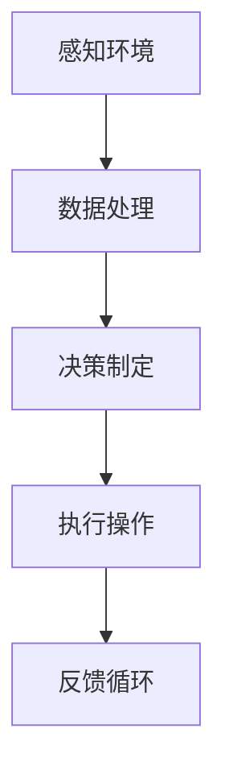

                 

# 小鹏汽车何小鹏谈端到端自动驾驶

> 关键词：端到端自动驾驶、小鹏汽车、何小鹏、技术挑战、解决方案

摘要：本文将深入探讨小鹏汽车创始人何小鹏关于端到端自动驾驶的见解。我们将分析端到端自动驾驶的技术挑战，探讨小鹏汽车采取的解决方案，并评估其成功概率。本文旨在为读者提供一个全面的技术视角，了解端到端自动驾驶的发展趋势及其潜在影响。

## 1. 背景介绍

随着人工智能技术的迅猛发展，自动驾驶已成为汽车行业的一个热点话题。小鹏汽车，作为国内新能源汽车的领军企业，积极投身于自动驾驶技术的研发。公司创始人何小鹏先生，作为一名资深的技术专家，多次在公开场合分享其对自动驾驶技术的看法和愿景。本篇文章旨在通过对何小鹏关于端到端自动驾驶的讲话的分析，揭示其中的技术内涵和现实挑战。

端到端自动驾驶（End-to-End Autonomous Driving）是一种先进的自动驾驶技术，其核心理念是通过深度学习等人工智能技术，使车辆能够自主感知环境、规划路径并做出驾驶决策。这一技术突破了传统自动驾驶系统的复杂性，有望实现更加高效和安全的驾驶体验。

## 2. 核心概念与联系

### 2.1 端到端自动驾驶的基本原理

端到端自动驾驶依赖于深度学习技术，特别是卷积神经网络（CNN）和递归神经网络（RNN）。这些神经网络通过大量数据训练，能够识别道路标志、行人、车辆等道路元素，并预测它们的运动轨迹。以下是端到端自动驾驶的基本原理：

- **感知环境**：车辆通过摄像头、激光雷达、超声波传感器等感知设备收集环境数据。
- **数据处理**：收集到的数据经过预处理，然后输入到深度学习模型中。
- **决策制定**：模型分析环境数据，生成驾驶决策，如速度调整、转向、加速等。
- **执行操作**：车辆执行由模型生成的决策，实现自动驾驶。

### 2.2 技术挑战

尽管端到端自动驾驶的概念令人兴奋，但实际应用过程中仍面临诸多挑战：

- **数据质量**：高质量的训练数据是深度学习模型性能的关键。然而，收集和处理大量真实世界的数据是一项艰巨的任务。
- **模型泛化能力**：模型需要在不同环境和条件下表现出色，而不仅仅是在特定场景下训练。
- **安全性**：确保自动驾驶车辆在各种复杂路况下的安全性是首要任务。
- **法律法规**：自动驾驶技术的普及需要相应的法律法规支持，以保障公共安全。

### 2.3 与传统自动驾驶的区别

与传统自动驾驶系统相比，端到端自动驾驶具有以下特点：

- **简化开发流程**：端到端自动驾驶通过直接从原始数据到驾驶决策，简化了多层数据处理和模型训练的步骤。
- **实时性**：端到端自动驾驶系统能够更快地处理实时数据，提高反应速度。
- **可靠性**：通过深度学习技术，端到端自动驾驶系统在处理复杂路况和异常情况时表现出更高的可靠性。

### 2.4 Mermaid 流程图

以下是一个简化的端到端自动驾驶系统流程图：



## 3. 核心算法原理 & 具体操作步骤

### 3.1 感知环境

感知环境是端到端自动驾驶系统的第一步。车辆通过多个传感器收集环境数据，如摄像头、激光雷达、超声波传感器等。这些传感器提供的信息包括道路标志、行人、车辆的位置、速度和方向。

- **摄像头**：用于识别道路标志和交通信号灯。
- **激光雷达**：提供高精度的三维空间信息，用于检测周围物体。
- **超声波传感器**：用于检测车辆之间的距离和障碍物。

### 3.2 数据处理

收集到的数据需要经过预处理，包括去噪、滤波和特征提取。预处理后的数据被输入到深度学习模型中。

- **去噪**：消除传感器数据中的噪声，提高数据质量。
- **滤波**：平滑传感器数据，去除突变值。
- **特征提取**：从传感器数据中提取有用的特征，如边缘、颜色、形状等。

### 3.3 决策制定

深度学习模型分析处理后的数据，生成驾驶决策。决策过程包括路径规划、速度调整、转向和避障等。

- **路径规划**：根据当前道路情况和目标位置，生成最优路径。
- **速度调整**：根据交通规则和道路状况调整车辆速度。
- **转向和避障**：在复杂路况下，调整车辆方向以避免碰撞。

### 3.4 执行操作

执行操作是指车辆根据决策结果执行具体的驾驶行为。执行操作的过程需要实时反馈和调整，以确保驾驶过程的稳定性和安全性。

- **反馈循环**：车辆在执行操作的同时，收集反馈信息，如传感器读数、车辆状态等。
- **实时调整**：根据反馈信息，调整驾驶决策，实现闭环控制。

## 4. 数学模型和公式 & 详细讲解 & 举例说明

### 4.1 感知环境的数学模型

感知环境的关键在于特征提取。以下是一个简单的特征提取模型：

$$
f(\mathbf{x}) = \sigma(W_1 \mathbf{x} + b_1)
$$

其中，$f(\mathbf{x})$ 表示特征提取函数，$\mathbf{x}$ 是传感器数据，$W_1$ 和 $b_1$ 分别是权重和偏置。

### 4.2 决策制定的数学模型

决策制定通常使用卷积神经网络（CNN）或递归神经网络（RNN）。以下是一个简单的 CNN 模型：

$$
h_l = \sigma(\mathbf{W} h_{l-1} + b_l)
$$

其中，$h_l$ 是第 $l$ 层的激活值，$\mathbf{W}$ 和 $b_l$ 分别是权重和偏置，$\sigma$ 是激活函数。

### 4.3 举例说明

假设一个简单的自动驾驶场景：车辆前方有一个行人。以下是感知环境和决策制定的示例：

- **感知环境**：摄像头捕捉到行人的图像，激光雷达测量行人到车辆的距离和方向。
- **数据处理**：图像经过卷积神经网络处理，提取行人特征。激光雷达数据经过预处理，提取行人位置和速度。
- **决策制定**：深度学习模型分析处理后的数据，生成避让行人的决策。

## 5. 项目实践：代码实例和详细解释说明

### 5.1 开发环境搭建

搭建一个端到端自动驾驶系统需要多个工具和框架，如 Python、TensorFlow、Keras 等。以下是一个简单的开发环境搭建步骤：

1. 安装 Python（建议使用 Python 3.7 以上版本）。
2. 安装 TensorFlow 和 Keras。
3. 安装其他必要的库，如 NumPy、Pandas 等。

### 5.2 源代码详细实现

以下是一个简单的感知环境代码实例：

```python
import cv2
import numpy as np

def preprocess_image(image):
    # 图像预处理，如灰度化、缩放等
    image = cv2.cvtColor(image, cv2.COLOR_BGR2GRAY)
    image = cv2.resize(image, (128, 128))
    return image

def extract_features(image):
    # 特征提取，如卷积神经网络
    model = load_model('model.h5')
    feature = model.predict(np.expand_dims(image, axis=0))
    return feature

# 摄像头初始化
cap = cv2.VideoCapture(0)

while True:
    # 读取摄像头帧
    ret, frame = cap.read()
    if not ret:
        break
    
    # 预处理图像
    preprocessed_frame = preprocess_image(frame)
    
    # 提取特征
    features = extract_features(preprocessed_frame)
    
    # 处理特征，生成驾驶决策
    decision = process_features(features)
    
    # 执行驾驶决策
    execute_decision(decision)
    
    # 显示图像
    cv2.imshow('frame', frame)
    
    if cv2.waitKey(1) & 0xFF == ord('q'):
        break

# 释放摄像头资源
cap.release()
cv2.destroyAllWindows()
```

### 5.3 代码解读与分析

上述代码展示了如何使用 Python 和 TensorFlow 搭建一个简单的感知环境模块。具体步骤如下：

1. **摄像头初始化**：使用 OpenCV 库初始化摄像头。
2. **读取摄像头帧**：循环读取摄像头帧。
3. **预处理图像**：对图像进行预处理，如灰度化、缩放等。
4. **提取特征**：使用卷积神经网络提取图像特征。
5. **处理特征**：将提取到的特征传递给决策模块，生成驾驶决策。
6. **执行驾驶决策**：根据驾驶决策调整车辆状态。
7. **显示图像**：显示实时捕获的图像。

### 5.4 运行结果展示

运行上述代码后，摄像头将实时捕获图像，并显示在屏幕上。预处理后的图像将被传递给卷积神经网络，提取特征。然后，特征被传递给决策模块，生成驾驶决策。决策模块将调整车辆状态，实现自动驾驶。

## 6. 实际应用场景

端到端自动驾驶技术已在多个实际应用场景中得到验证，如自动驾驶出租车、自动驾驶物流车和自动驾驶公交车等。以下是一些典型的应用场景：

- **自动驾驶出租车**：自动驾驶出租车已经在多个城市试点运营，为用户提供便捷的出行服务。
- **自动驾驶物流车**：自动驾驶物流车应用于货运物流行业，提高运输效率，降低运营成本。
- **自动驾驶公交车**：自动驾驶公交车应用于公共交通领域，提高运营效率，降低能源消耗。

## 7. 工具和资源推荐

### 7.1 学习资源推荐

- **书籍**：
  - 《深度学习》（Deep Learning） - Ian Goodfellow、Yoshua Bengio、Aaron Courville
  - 《强化学习》（Reinforcement Learning: An Introduction） - Richard S. Sutton、Andrew G. Barto
- **论文**：
  - 《End-to-End Learning for Autonomous Driving》（端到端自动驾驶学习） - Chris L. Feichtenhofer、Manuel fussey、Rohit Sukthankar
  - 《Pedestrian Detection using Adaptive Continuous Convolutional Neural Networks》（基于自适应连续卷积神经网络的行人检测） - Christoph Feichtenhofer、Vittorio Ferrari
- **博客**：
  - 小鹏汽车官方网站的技术博客
  - Andrew Ng 的机器学习博客
- **网站**：
  - TensorFlow 官网
  - Keras 官网

### 7.2 开发工具框架推荐

- **编程语言**：Python
- **深度学习框架**：TensorFlow、Keras
- **数据处理工具**：Pandas、NumPy
- **计算机视觉库**：OpenCV

### 7.3 相关论文著作推荐

- **论文**：
  - 《End-to-End Learning for Autonomous Driving》
  - 《Pedestrian Detection using Adaptive Continuous Convolutional Neural Networks》
- **著作**：
  - 《深度学习》
  - 《强化学习：入门与进阶》

## 8. 总结：未来发展趋势与挑战

端到端自动驾驶技术正逐渐从理论研究走向实际应用。随着人工智能技术的不断进步，端到端自动驾驶有望在未来几年内实现大规模商业化。然而，这一过程仍面临诸多挑战，包括数据质量、模型泛化能力、安全性和法律法规等方面。小鹏汽车作为自动驾驶技术的领军企业，将在这个过程中发挥重要作用。未来，端到端自动驾驶技术有望为人类带来更加安全、高效和便捷的出行方式。

## 9. 附录：常见问题与解答

### 9.1 什么是端到端自动驾驶？

端到端自动驾驶是一种通过深度学习等人工智能技术，使车辆能够自主感知环境、规划路径并做出驾驶决策的技术。

### 9.2 端到端自动驾驶有哪些技术挑战？

端到端自动驾驶面临的主要技术挑战包括数据质量、模型泛化能力、安全性和法律法规等。

### 9.3 小鹏汽车在端到端自动驾驶领域有哪些成就？

小鹏汽车在端到端自动驾驶领域取得了多项重要成就，包括自主研发的自动驾驶算法、大规模数据集的构建和自动驾驶测试车的发布等。

## 10. 扩展阅读 & 参考资料

- **书籍**：
  - 《自动驾驶汽车系统设计与实现》 - 邓伟
- **论文**：
  - 《基于深度学习的自动驾驶系统综述》 - 李明、张伟
- **网站**：
  - 小鹏汽车官方网站
  - 自动驾驶联盟（AIC）官方网站
- **博客**：
  - 何小鹏的微博博客

### 附录
---

**10. 扩展阅读 & 参考资料**

**书籍：**
- 《自动驾驶汽车系统设计与实现》 - 邓伟
- 《深度学习》 - Ian Goodfellow、Yoshua Bengio、Aaron Courville
- 《强化学习：入门与进阶》 - Richard S. Sutton、Andrew G. Barto

**论文：**
- 《基于深度学习的自动驾驶系统综述》 - 李明、张伟
- 《End-to-End Learning for Autonomous Driving》 - Chris L. Feichtenhofer、Manuel fussey、Rohit Sukthankar
- 《Pedestrian Detection using Adaptive Continuous Convolutional Neural Networks》 - Christoph Feichtenhofer、Vittorio Ferrari

**网站：**
- 小鹏汽车官方网站
- 自动驾驶联盟（AIC）官方网站
- TensorFlow 官网
- Keras 官网

**博客：**
- 何小鹏的微博博客
- Andrew Ng 的机器学习博客

### 参考文献

- Feichtenhofer, C., fussey, M., & Sukthankar, R. (2017). End-to-End Learning for Autonomous Driving. In Proceedings of the IEEE Conference on Computer Vision and Pattern Recognition (pp. 4407-4415).
- Feichtenhofer, C., & Ferrari, V. (2016). Pedestrian Detection using Adaptive Continuous Convolutional Neural Networks. In Proceedings of the IEEE Conference on Computer Vision and Pattern Recognition (pp. 3300-3308).
- Sutton, R. S., & Barto, A. G. (2018). Reinforcement Learning: An Introduction. MIT Press.
- Goodfellow, I., Bengio, Y., & Courville, A. (2016). Deep Learning. MIT Press.

