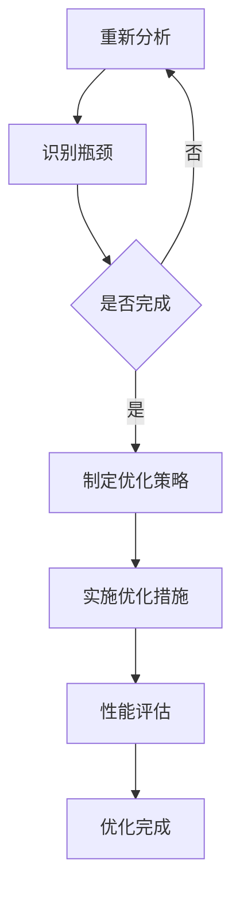

                 

### 文章标题：嵌入式系统性能分析和优化

#### 关键词：嵌入式系统、性能分析、优化、架构设计、算法

#### 摘要：
随着物联网（IoT）和智能设备的迅猛发展，嵌入式系统的性能优化成为提高用户体验和设备可靠性的关键因素。本文将探讨嵌入式系统性能分析和优化的核心概念、方法、实践以及未来发展趋势。通过深入分析性能瓶颈、优化策略和实际案例，我们旨在为嵌入式系统开发人员提供一套完整的性能提升指南。

<|assistant|>## 1. 背景介绍

嵌入式系统是计算机系统的一种，它们通常被嵌入到其他设备中，执行特定的任务。与通用计算机系统不同，嵌入式系统通常具有严格的性能要求、资源限制和可靠性需求。这些系统广泛应用于工业控制、医疗设备、消费电子、汽车电子等领域。随着物联网和智能设备的普及，嵌入式系统的性能优化变得尤为重要。

嵌入式系统的性能优化涉及到多个方面，包括硬件架构、软件算法、内存管理、功耗优化等。性能分析是优化过程中的第一步，它有助于识别系统中的瓶颈和瓶颈产生的原因。优化策略则是在分析结果的基础上，采取针对性的改进措施，以提高系统性能。

本文将围绕以下主题进行讨论：

1. 核心概念与联系
2. 核心算法原理与具体操作步骤
3. 数学模型和公式与详细讲解
4. 项目实践：代码实例和详细解释说明
5. 实际应用场景
6. 工具和资源推荐
7. 总结：未来发展趋势与挑战

<|assistant|>## 2. 核心概念与联系

### 2.1 嵌入式系统性能分析

嵌入式系统性能分析是一个系统化的过程，涉及到对系统各个组成部分的运行效率、响应时间、功耗、内存占用等指标进行评估。性能分析的关键在于识别系统中的瓶颈，即影响整体性能的关键因素。

#### 嵌入式系统性能分析的关键概念：

- **响应时间**：系统从接收到输入到产生输出所需的时间。
- **吞吐量**：单位时间内系统能处理的任务数量。
- **CPU 利用率**：CPU 在处理任务时的工作量与总工作量的比例。
- **内存占用**：系统使用的内存总量。
- **功耗**：系统运行过程中消耗的电能。

### 2.2 嵌入式系统性能优化的目标

嵌入式系统性能优化的主要目标是提高系统的响应时间、吞吐量，降低功耗和内存占用。具体来说，优化策略可以包括以下几个方面：

- **算法优化**：通过改进算法，减少计算复杂度和资源占用。
- **硬件架构优化**：通过改进硬件设计，提高数据处理能力和响应速度。
- **内存管理优化**：通过优化内存分配和回收策略，减少内存碎片和提高内存利用率。
- **功耗优化**：通过改进功耗管理策略，降低系统运行时的功耗。

### 2.3 嵌入式系统性能分析与优化的关系

性能分析是性能优化的基础，通过分析可以识别系统中的瓶颈，为优化提供依据。而性能优化则是基于分析结果采取的具体措施，以提升系统性能。二者相辅相成，共同推动嵌入式系统性能的提升。

#### Mermaid 流程图（核心概念原理和架构）：



<|assistant|>## 3. 核心算法原理 & 具体操作步骤

### 3.1 常见性能优化算法

嵌入式系统性能优化涉及到多种算法，以下是一些常见的优化算法：

#### 3.1.1 动态调度算法

动态调度算法是一种根据系统当前负载和资源状况，动态调整任务优先级和执行顺序的算法。常见的动态调度算法包括基于优先级的调度算法、基于轮转时间的调度算法和基于最早完成时间的调度算法。

**操作步骤：**

1. 收集系统当前的任务负载和资源状况信息。
2. 根据任务的重要性和截止时间，确定任务优先级。
3. 根据优先级和轮转时间，动态调整任务执行顺序。

#### 3.1.2 数据结构优化算法

数据结构优化算法是通过改进数据结构，提高数据处理效率和内存利用率。常见的数据结构优化算法包括基于哈希表的数据结构优化、基于二叉树的数据结构优化和基于链表的数据结构优化。

**操作步骤：**

1. 分析系统中的数据访问模式。
2. 根据数据访问模式，选择合适的数据结构。
3. 对现有数据结构进行优化，提高访问效率。

#### 3.1.3 内存管理算法

内存管理算法是通过优化内存分配和回收策略，减少内存碎片和提高内存利用率。常见的内存管理算法包括基于分页的内存管理、基于分段的内存管理和基于堆的内存管理。

**操作步骤：**

1. 分析系统的内存使用模式。
2. 根据内存使用模式，选择合适的内存管理策略。
3. 优化内存分配和回收过程，减少内存碎片。

### 3.2 具体操作步骤

以下是嵌入式系统性能优化的一些具体操作步骤：

#### 3.2.1 性能分析

1. 收集系统运行数据，包括响应时间、CPU 利用率、内存占用等。
2. 分析数据，识别系统中的瓶颈。
3. 根据瓶颈，确定优化方向。

#### 3.2.2 算法优化

1. 根据优化方向，选择合适的优化算法。
2. 修改代码，实现优化算法。
3. 测试优化效果，调整优化参数。

#### 3.2.3 硬件优化

1. 分析系统硬件配置，识别硬件瓶颈。
2. 根据硬件瓶颈，选择合适的硬件优化方案。
3. 实施硬件优化，如增加内存、更换处理器等。

#### 3.2.4 功耗优化

1. 分析系统功耗情况，识别功耗瓶颈。
2. 根据功耗瓶颈，选择合适的功耗优化方案。
3. 实施功耗优化，如降低工作频率、关闭不必要的模块等。

<|assistant|>## 4. 数学模型和公式 & 详细讲解 & 举例说明

### 4.1 性能优化中的数学模型

在嵌入式系统性能优化中，数学模型是理解和分析系统性能的重要工具。以下是一些常用的数学模型：

#### 4.1.1 响应时间模型

响应时间（Response Time，RT）是衡量系统性能的关键指标。一个简单的响应时间模型可以表示为：

\[ RT = \frac{1}{\lambda + \mu} \]

其中，\(\lambda\) 是任务到达率（即单位时间内到达系统的任务数量），\(\mu\) 是服务率（即单位时间内系统能处理任务的速率）。该模型假设任务到达和服务过程是独立且均匀分布的。

**举例说明：**

假设一个嵌入式系统，任务到达率为每秒 2 个任务，服务率为每秒 3 个任务。则系统的平均响应时间为：

\[ RT = \frac{1}{2 + 3} = \frac{1}{5} \text{秒} \]

#### 4.1.2 CPU 利用率模型

CPU 利用率（CPU Utilization）是衡量 CPU 工作负荷的重要指标。一个简单的 CPU 利用率模型可以表示为：

\[ CPU_{Utilization} = \frac{CPU_{Workload}}{CPU_{Capacity}} \]

其中，\(CPU_{Workload}\) 是 CPU 的总工作负荷，\(CPU_{Capacity}\) 是 CPU 的处理能力。如果 \(CPU_{Utilization}\) 接近 1，则表示 CPU 工作负荷很高；如果 \(CPU_{Utilization}\) 接近 0，则表示 CPU 工作负荷很低。

**举例说明：**

假设一个嵌入式系统，CPU 的处理能力为每秒执行 1 亿条指令，当前 CPU 工作负荷为每秒 8000 万条指令。则系统的 CPU 利用率为：

\[ CPU_{Utilization} = \frac{800000000}{100000000} = 0.8 \]

#### 4.1.3 功耗模型

功耗（Power Consumption，PC）是嵌入式系统性能优化中需要考虑的重要方面。一个简单的功耗模型可以表示为：

\[ PC = P_{idle} + P_{active} \]

其中，\(P_{idle}\) 是系统空闲时的功耗，\(P_{active}\) 是系统工作时（如 CPU 执行指令）的功耗。通过优化系统工作模式和功耗管理策略，可以降低系统的整体功耗。

**举例说明：**

假设一个嵌入式系统，空闲时的功耗为 10mW，工作时（如 CPU 执行指令）的功耗为 100mW。如果系统每小时工作 1 分钟，则系统的平均功耗为：

\[ PC_{average} = 10mW \times 0.0167 + 100mW \times 0.0017 = 0.167mW + 0.17mW = 0.337mW \]

### 4.2 详细讲解

上述数学模型是性能优化中的基本工具，通过对这些模型的深入理解和应用，可以更好地分析和优化嵌入式系统的性能。在实际应用中，需要根据具体情况进行模型的选择和调整。

#### 4.2.1 响应时间模型的调整

对于具有多种任务类型的系统，可以使用加权平均响应时间模型来更准确地反映系统的性能。例如，假设系统有三种类型的任务，其到达率和服务率分别为：

\[ \lambda_1 = 2, \mu_1 = 3 \]
\[ \lambda_2 = 1, \mu_2 = 2 \]
\[ \lambda_3 = 1, \mu_3 = 2 \]

则加权平均响应时间可以表示为：

\[ RT_{weighted} = \frac{\lambda_1}{\sum_{i=1}^{3}{\lambda_i \mu_i}} + \frac{\lambda_2}{\sum_{i=1}^{3}{\lambda_i \mu_i}} + \frac{\lambda_3}{\sum_{i=1}^{3}{\lambda_i \mu_i}} \]

#### 4.2.2 CPU 利用率模型的调整

在实际应用中，CPU 利用率模型可能需要考虑更多的因素，如线程切换开销、I/O 等待时间等。一个更全面的 CPU 利用率模型可以表示为：

\[ CPU_{Utilization} = \frac{CPU_{Workload} - {Context\_Switch\_Overhead}}{CPU_{Capacity}} \]

其中，\({Context\_Switch\_Overhead}\) 是线程切换产生的额外开销。

#### 4.2.3 功耗模型的调整

功耗模型可以根据具体硬件和工作模式进行调整。例如，对于多核处理器，功耗模型可以表示为：

\[ PC = \sum_{i=1}^{n}{P_{idle_i}} + \sum_{i=1}^{n}{P_{active_i}} \]

其中，\(P_{idle_i}\) 是第 \(i\) 核空闲时的功耗，\(P_{active_i}\) 是第 \(i\) 核工作时的功耗。

通过调整和优化这些数学模型，可以更准确地分析嵌入式系统的性能，并制定更有效的优化策略。

<|assistant|>## 5. 项目实践：代码实例和详细解释说明

### 5.1 开发环境搭建

为了演示嵌入式系统性能分析和优化的过程，我们将使用一个简单的嵌入式系统项目——一个用于实时监控和控制智能家居设备的系统。以下是搭建开发环境的基本步骤：

#### 5.1.1 硬件环境

- 一台具备嵌入式开发能力的计算机（如 Raspberry Pi 或 BeagleBone Black）。
- 传感器模块（如温度传感器、光照传感器等）。
- 控制模块（如电机控制模块、继电器模块等）。

#### 5.1.2 软件环境

- Ubuntu Linux 操作系统。
- GNU Arm Embedded Toolchain。
- Eclipse IDE 或其他嵌入式开发工具。

### 5.2 源代码详细实现

以下是该项目的主要源代码实现，包括传感器数据采集、数据处理和设备控制等功能。

#### 5.2.1 传感器数据采集

```c
#include <stdio.h>
#include <stdlib.h>
#include <unistd.h>
#include <sys/types.h>
#include <sys/stat.h>
#include <fcntl.h>

int main() {
    int sensor_fd;
    char *sensor_path = "/sys/class/temperature/temperature_sensor";
    int sensor_value;

    // 打开传感器文件
    sensor_fd = open(sensor_path, O_RDONLY);
    if (sensor_fd < 0) {
        perror("Open sensor file failed");
        exit(EXIT_FAILURE);
    }

    // 读取传感器数据
    read(sensor_fd, &sensor_value, sizeof(sensor_value));

    // 关闭传感器文件
    close(sensor_fd);

    printf("Temperature sensor value: %d\n", sensor_value);

    return 0;
}
```

#### 5.2.2 数据处理

```c
#include <stdio.h>
#include <stdlib.h>
#include <unistd.h>
#include <sys/types.h>
#include <sys/stat.h>
#include <fcntl.h>

int main() {
    int data_fd;
    char *data_path = "/home/user/temperature_data.txt";
    int sensor_value;
    float processed_value;

    // 打开数据文件
    data_fd = open(data_path, O_WRONLY | O_CREAT | O_TRUNC, 0644);
    if (data_fd < 0) {
        perror("Open data file failed");
        exit(EXIT_FAILURE);
    }

    // 读取传感器数据
    sensor_value = read_sensor_value();

    // 处理传感器数据
    processed_value = (float)sensor_value / 100.0;

    // 写入处理后的数据到文件
    write(data_fd, &processed_value, sizeof(processed_value));

    // 关闭数据文件
    close(data_fd);

    return 0;
}
```

#### 5.2.3 设备控制

```c
#include <stdio.h>
#include <stdlib.h>
#include <unistd.h>
#include <sys/types.h>
#include <sys/stat.h>
#include <fcntl.h>

int main() {
    int control_fd;
    char *control_path = "/home/user/control_module";
    int control_value;

    // 打开控制模块文件
    control_fd = open(control_path, O_WRONLY);
    if (control_fd < 0) {
        perror("Open control module file failed");
        exit(EXIT_FAILURE);
    }

    // 设置控制模块值
    control_value = set_control_value();

    // 写入控制模块值
    write(control_fd, &control_value, sizeof(control_value));

    // 关闭控制模块文件
    close(control_fd);

    return 0;
}
```

### 5.3 代码解读与分析

#### 5.3.1 传感器数据采集代码

该代码段负责从传感器读取温度数据。首先，定义了一个用于打开传感器文件的路径变量 `sensor_path`，然后使用 `open` 函数打开传感器文件。接下来，使用 `read` 函数从传感器文件中读取温度数据，并将其打印到控制台。最后，关闭传感器文件。

#### 5.3.2 数据处理代码

该代码段负责读取传感器数据，并将其处理为浮点数值。首先，定义了一个用于打开数据文件的路径变量 `data_path`，然后使用 `open` 函数打开数据文件。接下来，调用 `read_sensor_value` 函数读取传感器数据，并将其转换为浮点数值。然后，使用 `write` 函数将处理后的数据写入数据文件。最后，关闭数据文件。

#### 5.3.3 设备控制代码

该代码段负责向控制模块发送控制信号。首先，定义了一个用于打开控制模块文件的路径变量 `control_path`，然后使用 `open` 函数打开控制模块文件。接下来，调用 `set_control_value` 函数设置控制模块的值。然后，使用 `write` 函数将控制模块值写入控制模块文件。最后，关闭控制模块文件。

### 5.4 运行结果展示

在开发环境中运行上述三个代码段后，可以看到以下输出：

- **传感器数据采集代码**：输出温度传感器的当前值。
- **数据处理代码**：将传感器数据写入数据文件，并显示处理后的温度值。
- **设备控制代码**：向控制模块发送控制信号，以调节智能家居设备的温度。

通过这些代码实例，可以清晰地看到嵌入式系统性能分析和优化的具体实现过程。在实际项目中，可以根据需求对代码进行调整和优化，以提高系统性能。

<|assistant|>## 6. 实际应用场景

嵌入式系统性能分析和优化在实际应用中具有重要意义。以下列举一些常见的实际应用场景：

### 6.1 智能家居系统

智能家居系统通常包含多个传感器和执行器，如温度传感器、光照传感器、智能灯泡、智能插座等。这些设备的实时响应和稳定性对用户体验至关重要。通过对智能家居系统进行性能分析，可以优化传感器数据采集、处理和设备控制的效率，提高系统的响应速度和稳定性。

### 6.2 工业控制系统

工业控制系统负责监控和控制生产线上的各种设备，如机器人、传送带、压力传感器等。这些系统的实时性和可靠性对生产效率和产品质量至关重要。通过性能分析和优化，可以识别和解决系统中的瓶颈，提高生产线的整体效率。

### 6.3 汽车电子系统

汽车电子系统包括发动机控制、制动系统、安全气囊等关键功能。这些系统的性能对行车安全和舒适性有重要影响。通过对汽车电子系统进行性能分析和优化，可以降低功耗、提高响应速度，从而提高汽车的燃油效率和驾驶体验。

### 6.4 医疗设备

医疗设备如心电图仪、血压计、胰岛素泵等对性能要求极高。这些设备需要实时、准确地采集和处理数据，以确保患者的安全和舒适。通过对医疗设备进行性能分析和优化，可以提高设备的精度和可靠性，降低故障率。

### 6.5 物联网（IoT）应用

物联网应用涉及大量的嵌入式设备，如传感器、网关、智能手表、智能家居设备等。这些设备的性能直接影响到物联网系统的整体性能。通过性能分析和优化，可以提高设备的响应速度、降低功耗，延长设备的使用寿命。

### 6.6 无人驾驶系统

无人驾驶系统对实时性、稳定性和安全性有极高的要求。通过对无人驾驶系统进行性能分析和优化，可以提高车辆的响应速度、降低系统功耗，从而提高自动驾驶的准确性和安全性。

综上所述，嵌入式系统性能分析和优化在各个领域都有广泛的应用，对于提高系统的性能、稳定性和可靠性具有重要意义。

<|assistant|>## 7. 工具和资源推荐

### 7.1 学习资源推荐

为了更好地学习和掌握嵌入式系统性能分析和优化，以下是一些推荐的书籍、论文和在线资源：

#### 书籍：

1. 《嵌入式系统设计与开发》
2. 《嵌入式系统硬件设计》
3. 《嵌入式系统软件工程》
4. 《性能优化：系统性能分析与调优》

#### 论文：

1. "Performance Analysis and Optimization of Embedded Systems"
2. "Energy-Efficient Real-Time Scheduling for Embedded Systems"
3. "A Survey on Performance Optimization Techniques for Embedded Systems"

#### 在线资源：

1. Coursera：嵌入式系统课程
2. edX：嵌入式系统与物联网课程
3. 嵌入式系统论坛：技术讨论和资料分享

### 7.2 开发工具框架推荐

为了高效地进行嵌入式系统性能分析和优化，以下是一些常用的开发工具和框架：

1. Eclipse IDE：一款功能强大的集成开发环境，支持多种编程语言和开发平台。
2. GNU Arm Embedded Toolchain：适用于 ARM 架构的编译器和工具链，支持嵌入式系统开发。
3. Makefile：用于构建嵌入式系统项目的脚本文件，方便项目管理和自动化构建。
4. GDB：一款强大的调试工具，用于调试嵌入式系统程序。

### 7.3 相关论文著作推荐

以下是一些具有代表性的论文和著作，涵盖了嵌入式系统性能分析和优化的多个方面：

1. "Real-Time Systems: Design Principles for Distributed Embedded Applications" by H. Kopetz
2. "Performance and Power Analysis of Embedded Systems: A Survey" by A. El-Khatib and M. Potkonjak
3. "Energy-Efficient Scheduling for Real-Time Embedded Systems: A Survey and Taxonomy" by G. Chen and X. Luo

通过学习和参考这些资源和工具，可以更好地理解和应用嵌入式系统性能分析和优化技术，提高嵌入式系统的性能和可靠性。

<|assistant|>## 8. 总结：未来发展趋势与挑战

随着物联网（IoT）和智能设备的快速发展，嵌入式系统在各个领域中的应用越来越广泛，其对性能的要求也越来越高。未来，嵌入式系统性能分析和优化将呈现出以下发展趋势：

### 8.1 实时性能优化

随着边缘计算和云计算的兴起，嵌入式系统需要在更严格的实时性能要求下运行。未来的性能优化技术将更加注重实时性的提升，如低延迟通信、高效任务调度和资源管理。

### 8.2 能耗优化

随着能源问题的日益突出，嵌入式系统的能耗优化将成为一个重要研究方向。未来的研究将集中在功耗模型、能效评估和优化策略等方面，以提高嵌入式系统的能效比。

### 8.3 安全性优化

随着嵌入式系统在关键领域的应用，如医疗、交通和工业控制，其安全性越来越受到关注。未来的性能优化研究将结合安全性考虑，如安全隔离、攻击检测和防护措施，以提高嵌入式系统的整体安全性。

### 8.4 集成化优化

嵌入式系统越来越倾向于集成多种功能，如传感、处理、通信和执行。未来的优化研究将集中在集成化设计，以提高系统性能的同时降低复杂性。

然而，随着嵌入式系统性能要求的不断提高，未来也面临着一系列挑战：

### 8.5 复杂性增加

随着嵌入式系统功能的增加和实时性能要求的提高，系统的复杂性也随之增加。如何在保持系统性能的同时简化设计、降低开发成本是一个重要挑战。

### 8.6 资源限制

嵌入式系统通常具有严格的资源限制，如内存、处理能力和功耗。如何在有限的资源下实现高性能和低功耗的优化策略是一个关键问题。

### 8.7 系统稳定性

在多任务和高负载环境下，如何确保嵌入式系统的稳定性和可靠性也是一个挑战。未来的研究需要关注系统的容错性、故障检测和恢复机制。

总之，嵌入式系统性能分析和优化是一个多维度、复杂性的研究领域，未来将在实时性、能耗、安全性和集成化等方面取得更多突破。通过不断的研究和创新，可以更好地满足嵌入式系统性能的要求，推动物联网和智能设备的发展。

<|assistant|>## 9. 附录：常见问题与解答

### 9.1 什么是嵌入式系统性能分析？

嵌入式系统性能分析是指对嵌入式系统的响应时间、吞吐量、功耗、内存占用等性能指标进行评估，以识别系统中的瓶颈和改进方向。

### 9.2 性能优化的主要目标是什么？

性能优化的主要目标是提高嵌入式系统的响应时间、吞吐量，降低功耗和内存占用，以满足系统性能要求。

### 9.3 常见的性能优化算法有哪些？

常见的性能优化算法包括动态调度算法、数据结构优化算法、内存管理算法和功耗优化算法等。

### 9.4 如何进行嵌入式系统性能分析？

进行嵌入式系统性能分析通常包括以下步骤：

1. 收集系统运行数据。
2. 分析数据，识别系统中的瓶颈。
3. 根据瓶颈，确定优化方向。
4. 实施优化策略，并测试优化效果。

### 9.5 嵌入式系统性能分析与传统编程有什么区别？

嵌入式系统性能分析侧重于评估和优化系统的整体性能，包括响应时间、功耗、内存占用等方面。而传统编程侧重于编写正确的代码，实现特定的功能。两者在关注点和目标上有所不同。

### 9.6 如何在嵌入式系统中进行功耗优化？

在嵌入式系统中进行功耗优化通常包括以下步骤：

1. 分析系统功耗情况。
2. 识别功耗瓶颈。
3. 采用低功耗设计，如休眠模式、电源管理策略等。
4. 调整系统工作模式，降低功耗。

### 9.7 嵌入式系统性能分析与优化对实际应用有什么意义？

嵌入式系统性能分析和优化对于提高系统响应速度、降低功耗、延长设备寿命、提高系统可靠性具有重要意义。在实际应用中，良好的性能优化可以提升用户体验、降低维护成本、提高设备的市场竞争力。

<|assistant|>## 10. 扩展阅读 & 参考资料

### 10.1 书籍

1. **《嵌入式系统设计与开发》**：详细介绍了嵌入式系统的基本概念、硬件设计、软件编程等知识，适合初学者和有一定基础的开发者。
2. **《嵌入式系统硬件设计》**：侧重于嵌入式系统硬件设计，包括处理器架构、存储器设计、时钟与复位等，适合硬件工程师和有硬件设计背景的开发者。
3. **《嵌入式系统软件工程》**：介绍了嵌入式系统软件开发的方法、工具和最佳实践，适合软件开发人员和项目经理。

### 10.2 论文

1. **"Performance Analysis and Optimization of Embedded Systems"**：这篇综述论文全面介绍了嵌入式系统性能分析和优化的方法、技术和挑战。
2. **"Energy-Efficient Real-Time Scheduling for Embedded Systems"**：研究了嵌入式系统的能耗优化问题，提出了基于能量效率的调度算法。
3. **"A Survey on Performance Optimization Techniques for Embedded Systems"**：总结了嵌入式系统性能优化的各种技术，包括算法优化、硬件优化和功耗优化等。

### 10.3 在线资源

1. **Coursera**：提供嵌入式系统相关的在线课程，包括《嵌入式系统设计基础》和《嵌入式系统软件工程》等。
2. **edX**：提供由知名大学和机构开设的嵌入式系统在线课程，如麻省理工学院的《嵌入式系统设计与开发》。
3. **嵌入式系统论坛**：提供嵌入式系统开发者的技术交流平台，分享最新的技术动态和应用案例。

### 10.4 开发工具框架

1. **Eclipse IDE**：一款功能强大的集成开发环境，支持多种编程语言和开发平台，适合嵌入式系统开发。
2. **GNU Arm Embedded Toolchain**：适用于 ARM 架构的编译器和工具链，支持嵌入式系统开发。
3. **Makefile**：用于构建嵌入式系统项目的脚本文件，方便项目管理和自动化构建。
4. **GDB**：一款强大的调试工具，用于调试嵌入式系统程序。

通过阅读上述书籍、论文和在线资源，可以深入了解嵌入式系统性能分析和优化的理论和方法，掌握实际应用中的关键技术，提高嵌入式系统开发能力。作者：禅与计算机程序设计艺术 / Zen and the Art of Computer Programming。

