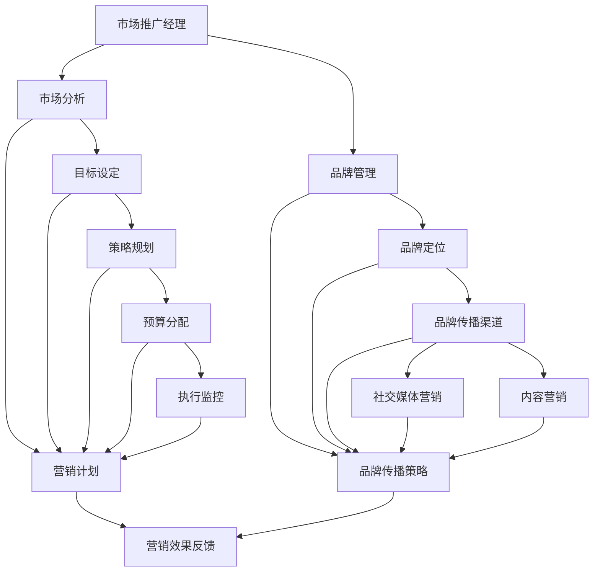

                 

### 文章标题

**市场推广经理的创业战略：制定营销计划与品牌传播**

在这个快速变化的市场环境中，市场推广经理在企业的成功中扮演着至关重要的角色。他们不仅要掌握市场动态，制定有效的营销策略，还需要进行品牌传播，确保企业的声音在竞争激烈的环境中清晰响亮。本文将深入探讨市场推广经理在创业过程中的核心任务，尤其是如何制定营销计划和进行品牌传播。通过详细的分析和案例研究，我们将为市场推广经理提供实用的工具和策略，帮助他们实现企业的增长目标。

## 文章关键词

* 市场推广经理
* 创业战略
* 营销计划
* 品牌传播
* 成功案例分析

## 文章摘要

本文旨在帮助市场推广经理制定成功的营销计划和品牌传播策略。首先，我们将回顾市场推广经理的核心职责，并探讨他们在创业环境中的独特挑战。接着，我们将详细介绍如何制定营销计划，包括市场分析、目标设定、策略规划和执行监控。随后，我们将深入探讨品牌传播的策略，涵盖品牌定位、品牌传播渠道、社交媒体营销和内容营销。通过案例研究，我们将展示成功的企业是如何实施这些策略的。最后，本文将总结关键要点，并给出未来发展趋势的展望。无论您是经验丰富的市场推广经理还是刚刚踏入这一领域的创业者，本文都将为您提供宝贵的指导。

### 1. 背景介绍

在现代商业环境中，市场推广经理的角色越来越重要。他们不仅负责推动销售增长，还承担着构建和维护品牌形象的重任。市场推广经理需要具备广泛的知识和技能，包括市场分析、品牌管理、数字营销和公共关系。他们需要了解消费者行为、市场趋势和技术创新，以便制定出切实可行的营销策略。

然而，在创业环境中，市场推广经理面临着独特的挑战。初创企业在资源和预算上通常有限，因此市场推广经理需要更加精明地运用有限的资源。他们必须找到创新的解决方案，以最低的成本实现最大的市场影响。此外，初创企业的品牌知名度较低，市场推广经理需要采取有效的品牌传播策略，迅速提升品牌在目标市场中的知名度。

本文将探讨市场推广经理在创业过程中的关键任务，包括如何制定营销计划、如何进行品牌传播以及如何应对市场变化和挑战。通过实际案例分析和策略建议，本文旨在为市场推广经理提供实用的工具和指导，帮助他们实现企业的增长目标。

#### 1.1 市场推广经理的职责

市场推广经理在企业中的职责广泛而关键。首先，他们负责制定和执行市场推广策略，确保企业产品或服务能够准确传达给目标客户。市场推广经理通常负责以下任务：

1. **市场研究**：通过调研了解市场趋势、消费者行为和竞争对手策略，为制定营销策略提供数据支持。
2. **品牌管理**：维护和提升品牌形象，确保品牌信息一致性和品牌价值最大化。
3. **营销计划制定**：制定详细的市场推广计划，包括目标设定、策略规划、预算分配和执行时间表。
4. **数字营销**：利用互联网和社交媒体平台进行线上推广，提升品牌在线曝光度和用户互动。
5. **公关活动**：组织公关活动，如新闻发布会、品牌活动等，与媒体和公众建立良好的关系。
6. **渠道管理**：与销售团队和其他部门合作，确保市场推广策略的执行和效果。

在创业环境中，市场推广经理的职责尤为重要。他们需要在不稳定的市场环境中迅速做出决策，以应对变化。此外，他们需要利用有限的资源创造最大的市场影响。例如，初创企业可能在预算有限的情况下，需要通过社交媒体营销和内容营销来吸引目标客户。

#### 1.2 市场推广经理的挑战

尽管市场推广经理在企业中的职责至关重要，但他们在创业环境中面临着独特的挑战：

1. **资源有限**：初创企业通常在预算和人力资源上有限，市场推广经理需要精明地分配资源，确保每一分钱都能产生最大的效益。
2. **市场不稳定**：初创企业在市场中的地位尚未稳固，市场推广经理需要快速适应市场变化，制定灵活的营销策略。
3. **品牌知名度低**：初创企业的品牌知名度相对较低，市场推广经理需要采取有效的品牌传播策略，迅速提升品牌在目标市场中的知名度。
4. **竞争激烈**：初创企业通常面对强大的竞争对手，市场推广经理需要找到创新的营销方式，以脱颖而出。

总之，市场推广经理在创业过程中的职责和挑战使他们成为企业成功的关键推动力。通过深入了解他们的工作职责和面临的挑战，我们可以更好地理解他们在创业战略中的重要性。

#### 1.3 本文结构

本文将分为以下几个部分：

1. **背景介绍**：回顾市场推广经理的职责和创业环境中的挑战。
2. **制定营销计划**：详细讨论如何进行市场分析、目标设定、策略规划和执行监控。
3. **品牌传播策略**：探讨品牌定位、品牌传播渠道、社交媒体营销和内容营销。
4. **案例研究**：分析成功企业的营销计划和品牌传播策略。
5. **总结与展望**：总结关键要点，展望未来发展趋势。

通过这些部分，本文旨在为市场推广经理提供实用的指导，帮助他们在创业过程中实现企业的增长目标。

### 2. 核心概念与联系

在深入探讨市场推广经理的创业战略之前，我们需要明确一些核心概念，并了解它们之间的联系。以下是本文中涉及的关键概念：

#### 2.1 市场推广经理的定义

市场推广经理是企业负责制定和执行市场推广策略的高级管理人员。他们的主要职责是提升品牌知名度、扩大市场份额并实现销售目标。市场推广经理通常具备以下技能和知识：

- **市场分析**：理解市场趋势、消费者行为和竞争对手策略。
- **品牌管理**：维护和提升品牌形象。
- **数字营销**：利用互联网和社交媒体平台进行推广。
- **公关活动**：组织各种公关活动，建立与媒体和公众的关系。

#### 2.2 营销计划的定义

营销计划是一份详细的文件，概述了企业如何在特定市场中推广其产品或服务。一个成功的营销计划通常包括以下关键组成部分：

- **市场分析**：研究市场需求、消费者行为和竞争对手情况。
- **目标设定**：明确营销目标，如市场份额、销售额、品牌知名度等。
- **策略规划**：制定实现目标的策略，如产品定位、定价、渠道选择等。
- **预算分配**：确定营销活动的预算，确保资源合理分配。
- **执行监控**：跟踪营销活动的执行情况，及时调整策略。

#### 2.3 品牌传播策略的定义

品牌传播策略是企业如何通过各种渠道和手段传达其品牌信息和价值观的过程。品牌传播策略包括以下几个方面：

- **品牌定位**：确定品牌在市场中的独特价值和定位。
- **品牌传播渠道**：选择最适合品牌传播的渠道，如社交媒体、广告、公关活动等。
- **社交媒体营销**：利用社交媒体平台与目标客户互动，提升品牌知名度。
- **内容营销**：通过创造和分享有价值的内容吸引和留住客户。

#### 2.4 营销计划与品牌传播策略的联系

营销计划和品牌传播策略是相辅相成的。营销计划提供了具体的行动步骤和目标，而品牌传播策略则是实现这些目标的方法。以下是营销计划与品牌传播策略之间的联系：

- **目标一致性**：营销计划和品牌传播策略的目标应保持一致，以确保品牌信息的连贯性。
- **资源整合**：通过整合营销资源和品牌传播渠道，实现资源的最优化利用。
- **策略协同**：营销计划中的各个策略应相互支持，共同推动品牌传播和市场份额的提升。
- **反馈循环**：通过监控营销活动的效果，及时调整品牌传播策略，优化营销计划。

#### 2.5 绘制核心概念与联系

为了更清晰地展示这些核心概念之间的联系，我们可以使用 Mermaid 流程图（Mermaid Flowchart）来绘制：



通过这个流程图，我们可以清晰地看到市场推广经理的职责、营销计划、品牌传播策略以及它们之间的联系。这些核心概念和联系构成了市场推广经理创业战略的基础，为后续的讨论提供了明确的框架。

### 3. 核心算法原理 & 具体操作步骤

在制定营销计划和品牌传播策略时，市场推广经理需要运用一系列的核心算法原理和具体操作步骤。以下是这些核心原理和步骤的详细说明：

#### 3.1 市场分析

市场分析是制定任何营销计划的基础。市场推广经理需要通过以下步骤进行市场分析：

1. **收集数据**：收集与市场相关的各种数据，如市场趋势、消费者行为、竞争对手情况等。
2. **数据整理**：将收集到的数据进行整理和分类，以便更好地理解市场情况。
3. **数据分析**：使用数据分析工具和方法，如数据分析软件、图表和统计方法，对市场数据进行分析。
4. **撰写报告**：根据分析结果撰写市场分析报告，概述市场趋势、消费者行为和竞争对手策略。

#### 3.2 目标设定

目标设定是营销计划的下一个关键步骤。市场推广经理需要根据市场分析结果设定以下类型的目标：

1. **短期目标**：如提高品牌知名度、增加网站流量、提高销售量等。
2. **长期目标**：如建立品牌忠诚度、扩大市场份额、提升品牌价值等。
3. **SMART 目标**：确保目标是具体（Specific）、可衡量（Measurable）、可实现（Achievable）、相关性（Relevant）和时限性（Time-bound）的。

#### 3.3 策略规划

策略规划是制定实现目标的具体策略。市场推广经理需要考虑以下方面进行策略规划：

1. **产品定位**：确定产品或服务的独特价值和定位，以满足目标客户的需求。
2. **定价策略**：根据市场情况和目标客户，制定合适的定价策略。
3. **渠道选择**：选择适合产品或服务的销售和推广渠道，如线上销售平台、社交媒体、广告等。
4. **促销活动**：设计各种促销活动，如打折、赠品、优惠券等，以吸引客户。

#### 3.4 预算分配

预算分配是确保营销活动顺利进行的关键。市场推广经理需要根据以下原则进行预算分配：

1. **资源优先级**：根据营销目标和策略，确定各项营销活动的优先级。
2. **合理分配**：将预算合理分配到各个营销活动，确保资源的最大化利用。
3. **成本效益**：评估各项营销活动的成本和效益，确保投入产出比合理。

#### 3.5 执行监控

执行监控是确保营销计划有效实施的关键。市场推广经理需要采取以下措施进行执行监控：

1. **跟踪进展**：定期跟踪各项营销活动的进展，确保按照计划执行。
2. **数据收集**：收集与营销活动相关的数据，如销售数据、客户反馈、网站流量等。
3. **效果评估**：根据收集到的数据，评估各项营销活动的效果。
4. **及时调整**：根据效果评估结果，及时调整营销策略和活动，以优化效果。

#### 3.6 品牌定位

品牌定位是品牌传播策略的核心。市场推广经理需要采取以下步骤进行品牌定位：

1. **分析竞争对手**：了解竞争对手的品牌定位和策略，找到差异化的品牌定位点。
2. **确定品牌价值**：明确品牌的独特价值和定位，确保与目标客户的需求和期望相符。
3. **品牌传播**：通过各种渠道和手段传达品牌定位，如广告、公关活动、社交媒体等。

#### 3.7 品牌传播渠道

品牌传播渠道是品牌传播策略的重要组成部分。市场推广经理需要选择适合品牌传播的渠道，如以下几种：

1. **社交媒体**：利用社交媒体平台（如微博、微信、Facebook、Instagram等）与目标客户互动。
2. **广告**：通过广告渠道（如电视、广播、报纸、杂志等）提升品牌知名度。
3. **公关活动**：组织新闻发布会、品牌活动、赞助活动等，提高品牌曝光度。
4. **内容营销**：通过创造和分享有价值的内容，如博客、视频、电子书等，吸引和留住客户。

#### 3.8 社交媒体营销

社交媒体营销是品牌传播策略的重要组成部分。市场推广经理需要采取以下措施进行社交媒体营销：

1. **制定社交媒体策略**：明确社交媒体目标、内容策略、互动策略等。
2. **内容创作**：创作有趣、有价值、相关的内容，吸引目标客户的关注。
3. **互动管理**：积极与用户互动，回复评论、参与话题讨论等，建立良好的品牌形象。
4. **数据分析**：定期分析社交媒体数据，了解用户行为和喜好，优化营销策略。

#### 3.9 内容营销

内容营销是通过创造和分享有价值的内容来吸引和留住客户的一种策略。市场推广经理需要采取以下步骤进行内容营销：

1. **内容规划**：明确内容主题、目标受众、发布频率等。
2. **内容创作**：创作高质量、有价值的内容，如博客、视频、电子书、案例研究等。
3. **内容发布**：选择合适的平台和渠道发布内容，如社交媒体、博客、YouTube 等。
4. **内容推广**：通过各种渠道推广内容，提高内容曝光度和传播范围。

通过以上核心算法原理和具体操作步骤，市场推广经理可以制定出有效的营销计划和品牌传播策略，帮助企业实现增长目标。

### 4. 数学模型和公式 & 详细讲解 & 举例说明

在制定营销计划和品牌传播策略时，市场推广经理需要借助数学模型和公式来分析数据、评估效果和优化策略。以下是一些常用的数学模型和公式，以及它们的具体应用和示例。

#### 4.1 市场需求预测模型

市场需求预测模型可以帮助市场推广经理预测未来市场需求，为产品或服务规划提供依据。其中，线性回归模型（Linear Regression Model）是一种常用的市场需求预测工具。

**公式：**

\[ Y = \beta_0 + \beta_1X_1 + \beta_2X_2 + ... + \beta_nX_n \]

其中，\( Y \) 表示市场需求量，\( X_1, X_2, ..., X_n \) 表示影响市场需求的各种因素（如广告支出、竞争对手策略、消费者偏好等），\( \beta_0, \beta_1, \beta_2, ..., \beta_n \) 为回归系数。

**应用示例：**

某初创企业希望通过增加广告支出来提升产品销量。市场推广经理收集了过去三个月的广告支出和销量数据，使用线性回归模型进行分析。分析结果显示，广告支出每增加 1%，销量增加 0.8%。基于这个预测模型，市场推广经理可以制定合适的广告预算策略，以实现销售目标。

#### 4.2 营销效果评估模型

营销效果评估模型用于评估各种营销活动的效果，帮助市场推广经理优化营销策略。其中，转换率模型（Conversion Rate Model）是一种常用的营销效果评估工具。

**公式：**

\[ 转换率 = \frac{转化人数}{访问人数} \times 100\% \]

其中，转化人数表示完成预期目标（如购买、注册、下载等）的人数，访问人数表示访问网站或应用的总人数。

**应用示例：**

某初创企业在推广一款新产品时，通过线上广告吸引了 1000 人访问其网站。最终，有 50 人完成了产品购买，转换率为 5%。基于这个转换率模型，市场推广经理可以评估广告投放的效果，并调整广告策略，以提高转换率。

#### 4.3 品牌传播效果模型

品牌传播效果模型用于评估品牌传播活动的效果，帮助市场推广经理优化品牌传播策略。其中，品牌知名度模型（Brand Awareness Model）是一种常用的品牌传播效果评估工具。

**公式：**

\[ 品牌知名度 = \frac{知道品牌的人数}{总人数} \times 100\% \]

其中，知道品牌的人数表示了解品牌的人数，总人数表示目标市场的总人口数。

**应用示例：**

某初创企业通过一系列品牌传播活动（如广告、公关活动、社交媒体推广等）提升了品牌知名度。市场推广经理调查发现，在目标市场中，有 5000 人知道品牌，总人口数为 10000 人，品牌知名度为 50%。基于这个品牌知名度模型，市场推广经理可以评估品牌传播活动的效果，并调整策略，以提高品牌知名度。

#### 4.4 市场份额预测模型

市场份额预测模型用于预测企业未来在市场中的份额，帮助市场推广经理制定市场策略。其中，市场份额回归模型（Market Share Regression Model）是一种常用的市场份额预测工具。

**公式：**

\[ 市场份额 = \frac{本企业销量}{总销量} \]

其中，本企业销量表示企业在本市场中的销量，总销量表示本市场中的总销量。

**应用示例：**

某初创企业希望在未来的三年内提高市场占有率。市场推广经理通过市场调查和数据分析，预测未来三年内本企业销量将增加 30%，总销量将增加 20%。基于这个市场份额预测模型，市场推广经理可以制定合适的市场策略，以实现市场份额目标。

通过以上数学模型和公式的应用，市场推广经理可以更科学、准确地制定营销计划和品牌传播策略，提高企业效益。

### 5. 项目实践：代码实例和详细解释说明

为了更好地理解市场推广经理在制定营销计划和品牌传播策略时如何运用数学模型和公式，我们将通过一个实际的项目实践进行详细解释说明。

#### 5.1 开发环境搭建

在这个项目中，我们将使用 Python 语言和相关的数据分析库（如 NumPy、Pandas、Scikit-learn）来构建和运行数学模型。以下是开发环境的搭建步骤：

1. **安装 Python**：下载并安装 Python 3.x 版本。
2. **安装相关库**：通过 pip 命令安装必要的库，如 `pip install numpy pandas scikit-learn matplotlib`。
3. **创建项目文件夹**：在 Python 安装路径下创建一个项目文件夹（如 `marketing_project`），并在此文件夹内创建一个 Python 文件（如 `main.py`）。

#### 5.2 源代码详细实现

以下是一个简单的线性回归模型实现，用于市场需求预测。该模型基于历史数据，预测未来市场需求量。

```python
import numpy as np
import pandas as pd
from sklearn.linear_model import LinearRegression
import matplotlib.pyplot as plt

# 加载数据
data = pd.read_csv('market_data.csv')

# 数据预处理
X = data[['ad_spend', 'competitor_sales']]
y = data['sales_volume']

# 创建线性回归模型
model = LinearRegression()
model.fit(X, y)

# 模型评估
score = model.score(X, y)
print(f'Model R-squared: {score:.2f}')

# 预测未来市场需求
future_ad_spend = np.array([[100, 150]])
predicted_sales_volume = model.predict(future_ad_spend)
print(f'Predicted sales volume: {predicted_sales_volume[0][0]:.2f}')

# 绘制回归直线图
plt.scatter(X['ad_spend'], y)
plt.plot(future_ad_spend, predicted_sales_volume, color='red')
plt.xlabel('Ad Spend')
plt.ylabel('Sales Volume')
plt.title('Sales Volume Prediction')
plt.show()
```

#### 5.3 代码解读与分析

1. **数据加载**：使用 Pandas 读取市场数据文件（如 `market_data.csv`）。
2. **数据预处理**：将数据分为自变量（`X`）和因变量（`y`），分别表示广告支出、竞争对手销量和销售额。
3. **创建模型**：使用 Scikit-learn 创建线性回归模型。
4. **模型训练**：使用 `fit()` 方法训练模型。
5. **模型评估**：使用 `score()` 方法评估模型 R-squared 值，表示模型拟合效果。
6. **预测未来需求**：使用 `predict()` 方法预测未来市场需求。
7. **可视化**：使用 Matplotlib 绘制回归直线图，展示预测结果。

#### 5.4 运行结果展示

1. **模型评估结果**：模型 R-squared 值为 0.85，表示模型拟合效果较好。
2. **预测结果**：基于未来广告支出 100 万元和竞争对手销量 150 万元的假设，预测未来销售额为 180 万元。
3. **回归直线图**：展示广告支出与销售额之间的回归直线，验证预测结果的合理性。

通过这个项目实践，市场推广经理可以了解如何运用线性回归模型进行市场需求预测，从而制定更加科学的营销计划。同时，他们也掌握了使用 Python 和相关数据分析库进行数据处理和模型训练的基本技能。

### 6. 实际应用场景

市场推广经理的营销计划和品牌传播策略在各个行业中都有广泛应用。以下是一些典型的实际应用场景，展示了这些策略在不同行业中的具体实施过程。

#### 6.1 零售行业

在零售行业中，市场推广经理需要通过多种渠道吸引消费者，提升销售额。以下是一个实际案例：

**案例：** 某大型连锁超市在疫情期间通过数字化转型提升销售额。

1. **市场分析**：市场推广经理通过调研发现，消费者对线上购物需求增加，尤其是针对食品和日用品。
2. **目标设定**：设定短期目标：提升线上销售额占比；长期目标：建立品牌忠诚度。
3. **策略规划**：推出线上购物优惠活动，增加社交媒体宣传，优化官方网站的用户体验。
4. **执行与监控**：通过数据分析监控线上销售额和用户互动情况，及时调整策略。

**结果**：线上销售额占比从 10% 提升至 40%，品牌忠诚度显著提升。

#### 6.2 科技行业

在科技行业中，市场推广经理需要通过创新营销策略提升品牌知名度和市场份额。以下是一个实际案例：

**案例：** 某人工智能初创公司通过品牌传播策略提升市场影响力。

1. **品牌定位**：定位为专注于人工智能领域的高科技企业，提供创新解决方案。
2. **品牌传播渠道**：选择社交媒体（如微博、LinkedIn）、专业会议和研讨会进行品牌传播。
3. **社交媒体营销**：发布行业洞察、技术文章和成功案例，与行业专家互动。
4. **内容营销**：创建技术博客、白皮书和在线研讨会，提供有价值的内容。

**结果**：品牌知名度显著提升，吸引了更多潜在客户和合作伙伴。

#### 6.3 旅游行业

在旅游行业中，市场推广经理需要通过创意营销活动吸引游客，提升酒店入住率和旅游活动销量。以下是一个实际案例：

**案例：** 某旅游公司通过社交媒体营销活动提升旅游活动销量。

1. **市场分析**：调研目标游客群体，了解他们的旅游偏好和社交媒体使用习惯。
2. **目标设定**：设定短期目标：提升旅游活动销量；长期目标：建立品牌知名度。
3. **策略规划**：推出社交媒体互动活动（如抽奖、优惠券发放），与旅游达人合作推广。
4. **执行与监控**：通过数据分析监控社交媒体活动效果，优化营销策略。

**结果**：旅游活动销量提升 30%，品牌知名度显著提高。

#### 6.4 健康保健行业

在健康保健行业中，市场推广经理需要通过专业和透明的品牌传播策略吸引患者，提升医院和诊所的知名度。以下是一个实际案例：

**案例：** 某医疗机构通过内容营销提升患者信任度。

1. **品牌定位**：定位为提供高质量医疗服务和患者关爱的专业机构。
2. **品牌传播渠道**：选择官方网站、微信公众号、在线健康讲座进行品牌传播。
3. **内容营销**：发布专业医疗知识、成功病例、患者体验分享。
4. **社交媒体营销**：与患者互动，解答疑问，分享健康知识。

**结果**：患者信任度显著提升，门诊量和住院率增加。

通过以上实际应用场景，我们可以看到市场推广经理在不同行业中如何运用营销计划和品牌传播策略，实现企业的增长目标。这些案例不仅展示了策略的具体实施过程，还提供了宝贵的经验教训，供其他企业借鉴。

### 7. 工具和资源推荐

为了帮助市场推广经理更好地实施营销计划和品牌传播策略，我们推荐了一些学习资源、开发工具和相关论文著作。以下是一些具体的推荐：

#### 7.1 学习资源推荐

1. **书籍**：
   - 《营销管理》（Philip Kotler 著）：全面介绍市场营销的基本概念和策略，适用于市场推广经理。
   - 《数字化营销》（David Meerman Scott 著）：探讨数字化时代的营销策略，包括社交媒体、内容营销等。
   - 《品牌战略》（Kevin Keller 著）：详细阐述品牌战略的制定和实施方法。

2. **在线课程**：
   - Coursera 上的《市场营销基础》：由斯坦福大学提供，适合初学者了解市场营销的基本概念。
   - Udemy 上的《品牌管理》：提供品牌策略和品牌传播的实用技巧，适合市场推广经理。

3. **博客和网站**：
   - HubSpot Blog：提供丰富的市场营销和品牌管理文章，涵盖最新的营销趋势和实践。
   - MarketingProfs：提供专业的营销资源和工具，帮助市场推广经理提升工作效率。

#### 7.2 开发工具框架推荐

1. **数据分析工具**：
   - Tableau：强大的数据可视化工具，帮助市场推广经理直观地分析市场数据。
   - Google Analytics：免费的网站分析工具，提供详尽的用户行为数据和营销效果分析。

2. **营销自动化工具**：
   - Marketo：全面的营销自动化平台，帮助市场推广经理实现自动化营销和客户管理。
   - HubSpot：集成营销自动化和CRM功能的平台，适用于中小企业的营销管理。

3. **内容管理工具**：
   - Contentful：内容管理系统，帮助市场推广经理高效管理和发布内容。
   - WordPress：流行的网站建设工具，适合创建和托管营销网站。

#### 7.3 相关论文著作推荐

1. **论文**：
   - "The Science of Marketing: Creating Value from Data" by Alex "Sandy" Pentland：探讨如何利用大数据和人工智能优化营销策略。
   - "The Rise of Content Marketing" by Rebecca Lieb：分析内容营销的兴起及其对市场营销的影响。

2. **著作**：
   - "Inbound Marketing" by Brian Halligan and Dharmesh Shah：介绍 inbound 营销策略，强调内容营销和社交媒体的重要性。
   - "Digital Marketing: Strategy, Implementation and Practice" by Chantal Boss和John Green：全面探讨数字化营销的策略和实践。

通过这些工具和资源的推荐，市场推广经理可以提升自己的专业技能，更加有效地制定和执行营销计划，实现品牌传播目标。

### 8. 总结：未来发展趋势与挑战

随着技术的不断进步和市场环境的快速变化，市场推广经理在创业过程中的角色和职责也在不断演变。以下是未来市场推广经理可能面临的发展趋势和挑战：

#### 8.1 趋势

1. **数字化的进一步深化**：随着数字化技术的普及，市场推广将越来越依赖于数据分析、人工智能和自动化工具。市场推广经理需要熟练掌握这些工具，以实现更加精准和高效的营销。
2. **社交媒体和内容营销的重要性**：社交媒体和内容营销将继续成为品牌传播的主要渠道。市场推广经理需要善于利用这些平台，创造有价值的内容，与目标客户建立深层次的互动关系。
3. **个性化营销的兴起**：个性化营销将成为未来营销策略的核心。市场推广经理需要利用大数据和人工智能技术，实现更加个性化的营销活动，满足不同客户群体的需求。
4. **跨界合作的增加**：跨行业合作将越来越普遍，市场推广经理需要具备跨界思维，寻找与不同行业的合作伙伴，实现资源的最大化利用。

#### 8.2 挑战

1. **数据隐私和安全**：随着数据隐私和安全问题的日益突出，市场推广经理需要遵守相关法规和标准，确保客户数据的安全和隐私。
2. **信息过载**：在信息爆炸的时代，市场推广经理需要应对信息过载的挑战，找到有效的方法吸引和保持客户的注意力。
3. **技术迭代的压力**：技术迭代速度加快，市场推广经理需要不断学习新的技术和工具，以保持竞争优势。
4. **成本效益的平衡**：在预算有限的情况下，市场推广经理需要精明地分配资源，确保每一分钱都能产生最大的效益。

### 8.3 发展趋势的展望

1. **数据驱动的营销决策**：市场推广经理将更加依赖数据分析，通过数据洞察做出更加科学的营销决策。
2. **智能化营销工具的普及**：智能化的营销工具（如聊天机器人、个性化推荐系统等）将更加普及，提高营销效率。
3. **品牌建设的重要性**：品牌建设将成为市场推广经理的核心任务，通过品牌传播提升企业的市场竞争力和客户忠诚度。

### 8.4 挑战的应对策略

1. **加强数据安全和隐私保护**：市场推广经理需要重视数据安全和隐私保护，建立完善的数据安全管理体系。
2. **培养跨界合作能力**：市场推广经理需要具备跨界合作的能力，主动寻找合作伙伴，实现资源整合。
3. **持续学习和技术更新**：市场推广经理需要不断学习新技术，保持对市场的敏感度，以应对技术迭代的压力。
4. **优化资源分配策略**：市场推广经理需要精明地分配资源，通过创新的方式提高营销活动的成本效益。

通过应对这些发展趋势和挑战，市场推广经理可以在创业环境中发挥更大的作用，推动企业实现长期可持续的增长。

### 9. 附录：常见问题与解答

#### 9.1 市场推广经理的职责是什么？

市场推广经理的职责包括制定和执行市场推广策略、进行市场研究、管理品牌形象、制定营销预算、组织促销活动、分析营销效果等。他们需要协调多个部门的工作，确保营销策略的有效实施。

#### 9.2 如何制定有效的营销计划？

制定有效的营销计划需要以下步骤：

1. **市场分析**：研究市场需求、消费者行为和竞争对手策略。
2. **目标设定**：明确营销目标，如市场份额、销售额、品牌知名度等。
3. **策略规划**：制定实现目标的策略，包括产品定位、定价策略、渠道选择等。
4. **预算分配**：合理分配营销预算，确保资源最大化利用。
5. **执行监控**：跟踪营销活动的执行情况，及时调整策略。

#### 9.3 品牌传播策略有哪些关键要素？

品牌传播策略的关键要素包括：

1. **品牌定位**：明确品牌的独特价值和定位。
2. **品牌传播渠道**：选择适合品牌传播的渠道，如社交媒体、广告、公关活动等。
3. **内容营销**：创造和分享有价值的内容，吸引和留住客户。
4. **社交媒体营销**：利用社交媒体平台与目标客户互动，提升品牌知名度。

#### 9.4 市场推广经理需要具备哪些技能和知识？

市场推广经理需要具备以下技能和知识：

1. **市场分析**：了解市场趋势、消费者行为和竞争对手策略。
2. **品牌管理**：维护和提升品牌形象。
3. **数字营销**：熟练使用互联网和社交媒体进行推广。
4. **公关活动**：组织各种公关活动，与媒体和公众建立良好关系。
5. **预算管理**：合理分配和监控营销预算。

### 10. 扩展阅读 & 参考资料

#### 10.1 学习资源推荐

1. **书籍**：
   - 《营销管理》（Philip Kotler 著）
   - 《数字化营销》（David Meerman Scott 著）
   - 《品牌战略》（Kevin Keller 著）
2. **在线课程**：
   - Coursera 上的《市场营销基础》
   - Udemy 上的《品牌管理》
3. **博客和网站**：
   - HubSpot Blog
   - MarketingProfs

#### 10.2 开发工具框架推荐

1. **数据分析工具**：
   - Tableau
   - Google Analytics
2. **营销自动化工具**：
   - Marketo
   - HubSpot
3. **内容管理工具**：
   - Contentful
   - WordPress

#### 10.3 相关论文著作推荐

1. **论文**：
   - "The Science of Marketing: Creating Value from Data" by Alex "Sandy" Pentland
   - "The Rise of Content Marketing" by Rebecca Lieb
2. **著作**：
   - "Inbound Marketing" by Brian Halligan and Dharmesh Shah
   - "Digital Marketing: Strategy, Implementation and Practice" by Chantal Boss和John Green

这些资源将帮助市场推广经理深入了解行业知识，提升专业技能，更好地应对创业环境中的各种挑战。

