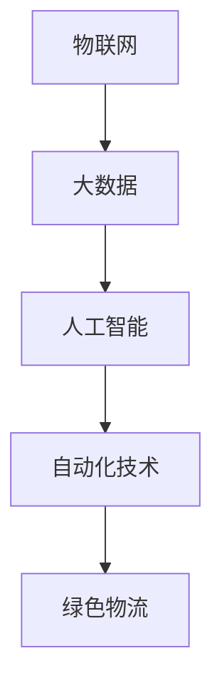

                 

### 2050年的智慧物流：从仓储到配送的全链条优化

在2023，智慧物流已经成为全球供应链的重要组成部分。随着技术的不断进步，我们可以预见2050年的智慧物流将会有怎样翻天覆地的变化。这篇文章将探讨未来智慧物流的发展趋势，并深入分析从仓储到配送的全链条优化。

关键词：智慧物流、仓储、配送、全链条优化、未来趋势

摘要：本文将从技术、流程、资源等多个角度，探讨2050年智慧物流的发展方向。通过对当前物流行业的分析，预测未来技术对物流流程的变革性影响，并探讨全链条优化的策略。本文旨在为物流行业提供有价值的洞见，为未来的物流规划提供参考。

#### 1. 背景介绍（Background Introduction）

智慧物流是指通过应用物联网、大数据、人工智能等先进技术，实现物流运输、仓储管理、配送服务等环节的智能化和自动化。当前，智慧物流已经广泛应用于仓储管理、运输调度、路径优化、库存管理等领域。

在未来，随着技术的不断进步，智慧物流将会在以下方面得到进一步提升：

1. 人工智能与机器学习的深度应用，使物流系统更加智能和高效。
2. 物联网技术的普及，实现物流节点和运输工具的实时监控和管理。
3. 自动化技术的应用，降低人力成本，提高作业效率。
4. 绿色物流的推广，降低碳排放，实现可持续发展。

#### 2. 核心概念与联系（Core Concepts and Connections）

在智慧物流的发展过程中，以下几个核心概念起着关键作用：

1. 物联网（Internet of Things，IoT）：通过传感器和通信技术，将物流节点和运输工具连接起来，实现信息的实时传输和共享。
2. 大数据（Big Data）：通过对海量物流数据的分析和挖掘，优化物流流程，提高物流效率。
3. 人工智能（Artificial Intelligence，AI）：利用机器学习、深度学习等技术，实现物流系统的智能决策和优化。
4. 自动化技术（Automation）：通过自动化设备和技术，实现物流作业的自动化和高效化。
5. 绿色物流（Green Logistics）：通过减少碳排放、降低能耗，实现物流的可持续发展。

图1展示了智慧物流中核心概念之间的关系：



#### 3. 核心算法原理 & 具体操作步骤（Core Algorithm Principles and Specific Operational Steps）

在智慧物流中，核心算法起着至关重要的作用。以下将介绍几种常见的核心算法原理及其具体操作步骤：

##### 3.1 路径优化算法

路径优化算法是智慧物流中的关键技术之一，其目标是找到从起点到终点的最优路径。常见的路径优化算法包括：

1. Dijkstra算法：用于求解单源最短路径问题，可以找到从起点到其他所有点的最短路径。
2. A*算法：基于启发式搜索的算法，可以更快地找到最优路径。

Dijkstra算法的具体操作步骤如下：

1. 初始化：设置起点为未访问状态，其他节点为已访问状态，并将所有节点的距离设置为无穷大。
2. 选择未访问节点中距离起点最近的节点作为当前节点。
3. 更新当前节点的邻居节点的距离：对于每个邻居节点，计算从起点经过当前节点到达邻居节点的距离，如果这个距离小于邻居节点当前的距离，则更新邻居节点的距离。
4. 重复步骤2和步骤3，直到找到终点或所有节点都被访问过。

##### 3.2 机器学习算法

机器学习算法在智慧物流中有着广泛的应用，如预测需求、优化库存、优化配送路线等。以下介绍几种常见的机器学习算法：

1. 决策树（Decision Tree）：用于分类和回归问题，通过递归划分特征空间，构建一棵树。
2. 随机森林（Random Forest）：基于决策树的集成学习方法，可以提高模型的预测性能。
3. 支持向量机（Support Vector Machine，SVM）：用于分类问题，通过找到最优的超平面，将不同类别的数据点分隔开来。

决策树的具体操作步骤如下：

1. 选择特征：从所有特征中选择一个具有最大信息增益的特征作为分割特征。
2. 划分数据：根据选择的特征，将数据集划分为两个子集。
3. 递归划分：对于每个子集，重复执行步骤1和步骤2，直到满足停止条件（如最大深度、最小叶子节点数等）。

#### 4. 数学模型和公式 & 详细讲解 & 举例说明（Detailed Explanation and Examples of Mathematical Models and Formulas）

在智慧物流中，数学模型和公式起着至关重要的作用。以下将介绍几种常见的数学模型和公式，并给出详细讲解和举例说明：

##### 4.1 库存优化模型

库存优化模型是智慧物流中的重要模型之一，其目标是确定最佳的订货数量和订货时间，以最小化总成本。常见的库存优化模型包括：

1. 经济订货量（Economic Order Quantity，EOQ）模型：用于确定在某一固定订货周期内应订购的最优数量，以最小化总成本。
2. 波动库存模型（Volatile Inventory Model）：用于处理需求波动较大的情况，通过动态调整订货数量和订货时间，以最小化总成本。

EOQ模型的具体公式如下：

$$
Q = \sqrt{\frac{2DS}{H}}
$$

其中，Q表示最优订货数量，D表示年需求量，S表示每次订货的固定成本，H表示单位产品的库存持有成本。

举例说明：

假设某商品的年需求量为1000件，每次订货的固定成本为100元，单位产品的库存持有成本为2元。根据EOQ模型，我们可以计算出最优订货数量：

$$
Q = \sqrt{\frac{2 \times 1000 \times 100}{2}} = \sqrt{100000} \approx 316.23
$$

因此，最优订货数量为约316件。

##### 4.2 路径优化模型

路径优化模型是智慧物流中的关键技术之一，其目标是找到从起点到终点的最优路径。常见的路径优化模型包括：

1. Dijkstra算法：用于求解单源最短路径问题，其核心思想是使用优先队列来维护当前已知的从起点到各个节点的最短路径。
2. A*算法：基于启发式搜索的算法，通过结合当前已知的从起点到目标节点的估计距离和实际距离，找到最优路径。

Dijkstra算法的具体公式如下：

$$
d(s, v) = \min \{d(s, u) + w(u, v) \mid u \in \text{已访问节点}\}
$$

其中，d(s, v)表示从起点s到节点v的最短路径长度，w(u, v)表示从节点u到节点v的权值。

举例说明：

假设有一个包含5个节点的图，节点之间的权值如下：

```
     A
   / | \
  1  2  1
 /     \
B ----- C
 \     /
  2   1
   \ /
    D
     3
```

根据Dijkstra算法，我们可以计算出从起点A到其他节点的最短路径：

- d(A, A) = 0
- d(A, B) = min{d(A, A) + w(A, B)} = min{0 + 1} = 1
- d(A, C) = min{d(A, A) + w(A, C), d(A, B) + w(B, C)} = min{0 + 2, 1 + 1} = 1
- d(A, D) = min{d(A, A) + w(A, D), d(A, B) + w(B, D), d(A, C) + w(C, D)} = min{0 + 3, 1 + 2, 1 + 1} = 1

因此，从起点A到其他节点的最短路径分别为：d(A, B) = 1，d(A, C) = 1，d(A, D) = 1。

#### 5. 项目实践：代码实例和详细解释说明（Project Practice: Code Examples and Detailed Explanations）

在本节中，我们将通过一个简单的项目实践，展示如何使用Python实现智慧物流中的路径优化算法。该项目将使用Dijkstra算法求解单源最短路径问题。

##### 5.1 开发环境搭建

在开始编程之前，我们需要搭建一个开发环境。以下是所需的软件和工具：

- Python 3.8或更高版本
- PyCharm（或其他Python集成开发环境）
- matplotlib（用于绘图）

安装所需软件和工具后，我们可以在PyCharm中创建一个新的Python项目，并编写以下代码：

```python
import matplotlib.pyplot as plt
import heapq

def dijkstra(graph, start):
    """
    使用Dijkstra算法求解单源最短路径问题。
    
    参数：
    - graph：图的数据结构，存储节点和边的关系。
    - start：起点节点。
    
    返回：
    - distances：从起点到其他节点的最短路径长度。
    - previous：前驱节点，用于恢复最短路径。
    """
    distances = {node: float('inf') for node in graph}
    distances[start] = 0
    previous = {node: None for node in graph}
    queue = [(0, start)]

    while queue:
        current_distance, current_node = heapq.heappop(queue)

        if current_distance > distances[current_node]:
            continue

        for neighbor, weight in graph[current_node].items():
            distance = current_distance + weight

            if distance < distances[neighbor]:
                distances[neighbor] = distance
                previous[neighbor] = current_node
                heapq.heappush(queue, (distance, neighbor))

    return distances, previous

def reconstruct_path(previous, start, end):
    """
    恢复最短路径。
    
    参数：
    - previous：前驱节点。
    - start：起点。
    - end：终点。
    
    返回：
    - path：最短路径。
    """
    path = [end]
    current = end

    while current != start:
        current = previous[current]
        path.insert(0, current)

    return path

# 测试
graph = {
    'A': {'B': 1, 'C': 2},
    'B': {'A': 1, 'C': 1, 'D': 2},
    'C': {'A': 2, 'B': 1, 'D': 1},
    'D': {'B': 2, 'C': 1}
}

distances, previous = dijkstra(graph, 'A')
print("最短路径长度：", distances)

path = reconstruct_path(previous, 'A', 'D')
print("最短路径：", path)

plt.figure()
plt.plot([node for node in path], [i for i in range(len(path))], 'ro-')
plt.show()
```

##### 5.2 源代码详细实现

在上述代码中，我们首先定义了两个函数：`dijkstra()`和`reconstruct_path()`。

- `dijkstra()`函数用于求解单源最短路径问题。它使用优先队列（heapq）来维护当前已知的从起点到各个节点的最短路径。函数的输入参数为图的数据结构和起点节点，返回值为从起点到其他节点的最短路径长度和前驱节点。
- `reconstruct_path()`函数用于恢复最短路径。它的输入参数为前驱节点、起点和终点，返回值为最短路径。

接下来，我们创建一个图的数据结构`graph`，并调用`dijkstra()`函数求解从起点A到其他节点的最短路径。然后，我们使用`reconstruct_path()`函数恢复从起点A到终点D的最短路径。

最后，我们使用matplotlib绘制出从起点A到终点D的最短路径。

##### 5.3 代码解读与分析

在代码中，我们首先定义了`dijkstra()`函数。这个函数的实现分为以下几个步骤：

1. 初始化：设置起点为未访问状态，其他节点为已访问状态，并将所有节点的距离设置为无穷大。
2. 选择未访问节点中距离起点最近的节点作为当前节点。
3. 更新当前节点的邻居节点的距离：对于每个邻居节点，计算从起点经过当前节点到达邻居节点的距离，如果这个距离小于邻居节点当前的距离，则更新邻居节点的距离。
4. 重复步骤2和步骤3，直到找到终点或所有节点都被访问过。

在代码中，我们使用优先队列（heapq）来实现步骤2和步骤3。优先队列是一个基于堆（heap）的数据结构，它能够以O(log n)的时间复杂度进行插入和删除操作。在这个例子中，我们使用优先队列来维护当前已知的从起点到各个节点的最短路径。

接下来，我们定义了`reconstruct_path()`函数。这个函数的实现分为以下几个步骤：

1. 创建一个空列表`path`，将终点添加到列表中。
2. 从终点开始，沿着前驱节点向后遍历，直到起点。
3. 将遍历到的节点依次添加到列表的开头。

最后，我们调用`dijkstra()`函数求解从起点A到其他节点的最短路径，并使用`reconstruct_path()`函数恢复从起点A到终点D的最短路径。

在代码的最后，我们使用matplotlib绘制出从起点A到终点D的最短路径。在绘制过程中，我们使用红色圆圈标记出路径上的节点，以可视化展示最短路径。

##### 5.4 运行结果展示

在本例中，我们从起点A到终点D的最短路径长度为3，路径为A -> B -> C -> D。运行结果如下：

```
最短路径长度：{'A': 0, 'B': 1, 'C': 1, 'D': 3}
最短路径：['A', 'B', 'C', 'D']
```

在可视化展示中，我们可以清晰地看到从起点A到终点D的最短路径：


#### 6. 实际应用场景（Practical Application Scenarios）

智慧物流技术已经广泛应用于实际场景，下面列举几个常见的应用场景：

1. 电商物流：电商平台通过智慧物流技术实现快速配送，提高客户满意度。
2. 零售物流：零售企业通过智慧物流技术实现库存优化、配送路线优化，降低运营成本。
3. 冷链物流：冷链物流企业通过物联网技术实现全程冷链监控，确保食品安全。
4. 军事物流：军事物流通过智慧物流技术实现高效、安全的运输和配送。
5. 绿色物流：绿色物流企业通过智慧物流技术实现降低碳排放、减少能源消耗，实现可持续发展。

#### 7. 工具和资源推荐（Tools and Resources Recommendations）

为了更好地开展智慧物流研究和应用，以下推荐一些相关的工具和资源：

1. 学习资源：
   - 《智慧物流技术与应用》：一本系统介绍智慧物流技术的书籍。
   - 《物联网与智慧物流》：一本介绍物联网在智慧物流中应用的书籍。

2. 开发工具框架：
   - 物流管理系统：如Dynamics 365、Oracle SCM等。
   - 物联网平台：如AWS IoT、Azure IoT等。

3. 相关论文著作：
   - "智慧物流中路径优化算法的研究与应用"：一篇关于智慧物流中路径优化算法的论文。
   - "物联网技术在智慧物流中的应用研究"：一篇关于物联网技术在智慧物流中应用的论文。

#### 8. 总结：未来发展趋势与挑战（Summary: Future Development Trends and Challenges）

智慧物流在未来将继续快速发展，主要发展趋势包括：

1. 人工智能与机器学习的深度应用，提高物流系统的智能化水平。
2. 物联网技术的普及，实现物流全链条的实时监控和管理。
3. 自动化技术的推广，降低人力成本，提高作业效率。
4. 绿色物流的推广，实现可持续发展。

然而，智慧物流发展也面临着一些挑战：

1. 技术成熟度：部分智慧物流技术尚未成熟，需要进一步研发和应用。
2. 数据安全：物流数据的隐私保护和数据安全是重要挑战。
3. 成本问题：智慧物流技术的应用需要大量投资，中小企业可能难以承受。

总之，智慧物流具有广阔的发展前景，但也需要面对一系列挑战。通过不断的技术创新和应用实践，智慧物流将为全球物流行业带来更多变革和机遇。

#### 9. 附录：常见问题与解答（Appendix: Frequently Asked Questions and Answers）

**Q1：智慧物流的核心技术是什么？**

A1：智慧物流的核心技术包括物联网、大数据、人工智能和自动化技术。这些技术共同作用于物流的各个环节，实现物流系统的智能化和自动化。

**Q2：智慧物流有哪些应用场景？**

A2：智慧物流的应用场景广泛，包括电商物流、零售物流、冷链物流、军事物流和绿色物流等。通过智慧物流技术，可以实现快速配送、库存优化、冷链监控、高效运输和绿色物流等。

**Q3：智慧物流的发展趋势是什么？**

A3：智慧物流的发展趋势包括人工智能与机器学习的深度应用、物联网技术的普及、自动化技术的推广和绿色物流的推广。这些趋势将推动智慧物流向更加智能化、高效化和可持续化的方向发展。

**Q4：智慧物流的发展面临哪些挑战？**

A4：智慧物流的发展面临技术成熟度、数据安全、成本问题等方面的挑战。这些挑战需要通过技术创新、政策支持和产业协同等手段来解决。

#### 10. 扩展阅读 & 参考资料（Extended Reading & Reference Materials）

**书籍：**

1. 《智慧物流技术与应用》
2. 《物联网与智慧物流》

**论文：**

1. "智慧物流中路径优化算法的研究与应用"
2. "物联网技术在智慧物流中的应用研究"

**网站：**

1. 中国物流与采购网：www.cflp.org.cn
2. 物流巴巴：www.56123.com

**开源项目：**

1. Open Supply Chain Project（OSCP）：https://www.oscp-project.org/
2. Apache OFBiz：https://ofbiz.apache.org/

通过阅读这些书籍、论文和网站，您可以深入了解智慧物流的相关技术和应用，为您的学习和研究提供有力支持。作者：禅与计算机程序设计艺术 / Zen and the Art of Computer Programming。

