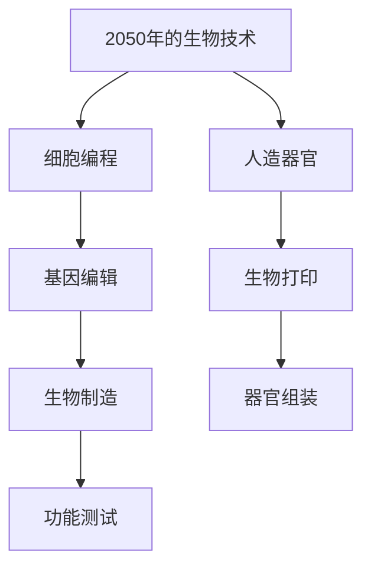

                 

# 2050年的生物技术：从细胞编程到人造器官的生物制造革命

> 关键词：生物技术、细胞编程、人造器官、生物制造、未来趋势

摘要：随着科技的飞速发展，生物技术在2050年将达到前所未有的高度。本文将从细胞编程、基因编辑、生物打印、人造器官和生物制造等方面，深入探讨这一领域的未来发展趋势和革命性影响。

## 1. 背景介绍（Background Introduction）

生物技术，作为一个涵盖众多学科领域的综合性科学，正日益成为推动人类进步的关键力量。从传统的农业、医药，到新兴的基因编辑、生物打印，生物技术的应用已经深入到了人类生活的方方面面。然而，随着科技的不断进步，特别是计算机科学和纳米技术的快速发展，生物技术正迎来新的变革。

2050年的生物技术，将不再仅仅局限于基因编辑和人造器官的制造，而是向着更为复杂和精细的方向发展。细胞编程和人造器官的生物制造将成为这一领域的两大核心技术。本文将围绕这两个核心概念，探讨生物技术在2050年的发展前景。

### 1.1 细胞编程（Cell Programming）

细胞编程是一种通过人工设计细胞功能，使其在特定环境下执行特定任务的技术。这一概念源于计算机编程，它通过编写“细胞程序”，让细胞按照预设的指令进行自我复制、生长和分化。细胞编程的最终目标是实现细胞的功能化，使其能够在医疗、农业、环境等多个领域发挥重要作用。

### 1.2 人造器官（Artificial Organs）

人造器官是指通过生物技术手段制造的人体器官，其结构和功能与天然器官相似。人造器官的制造不仅能够解决器官移植的供需矛盾，还能够为患有严重器官疾病的患者提供新的治疗途径。在2050年，随着细胞编程和人造器官生物制造技术的成熟，人造器官将成为医疗领域的革命性产品。

## 2. 核心概念与联系（Core Concepts and Connections）

### 2.1 生物制造（Biomanufacturing）

生物制造是一种利用生物系统进行物质合成和加工的技术。在生物制造中，细胞被视为一种生产单元，通过控制细胞的生长和代谢过程，可以实现复杂化合物的合成。生物制造的核心在于细胞编程，通过设计“细胞程序”，使细胞能够按照预设的路径进行生长和代谢。

### 2.2 细胞编程与人造器官的关系

细胞编程与人造器官之间存在密切的联系。细胞编程技术为人造器官的制造提供了核心支持，通过细胞编程，可以设计出具有特定功能和形态的细胞，这些细胞将成为人造器官的基本构建单元。同时，人造器官的制造需求也为细胞编程提供了新的应用场景，推动了细胞编程技术的不断发展和创新。

### 2.3 生物制造与人造器官的融合

在2050年，生物制造与人造器官的融合将成为生物技术领域的重要趋势。通过生物制造技术，可以实现人造器官的自动化和规模化生产，从而满足日益增长的医疗需求。同时，人造器官的制造过程也将更加精细化，通过细胞编程技术，可以实现人造器官的个性化定制，满足不同患者的需求。

## 3. 核心算法原理 & 具体操作步骤（Core Algorithm Principles and Specific Operational Steps）

### 3.1 细胞编程算法原理

细胞编程算法的核心是“细胞程序”，它由一系列基因编辑指令组成，用于指导细胞的生长、分化和功能实现。细胞编程算法的基本步骤包括：

1. 设计细胞程序：根据目标器官的功能需求，设计出相应的细胞程序。
2. 基因编辑：利用CRISPR-Cas9等基因编辑技术，将设计的细胞程序嵌入到目标细胞的基因组中。
3. 细胞培养：在生物反应器中对编辑后的细胞进行培养，使其按照预设的路径生长和分化。
4. 功能验证：对培养出的细胞进行功能验证，确保其具备预期的功能。

### 3.2 人造器官生物制造操作步骤

人造器官的生物制造过程可以分为以下几个步骤：

1. 设计人造器官模型：根据目标器官的形态和功能需求，设计出人造器官的3D模型。
2. 生物打印：利用生物打印机，根据设计的3D模型，将细胞和组织打印出来。
3. 细胞编程：对打印出的细胞和组织进行细胞编程，使其具备预期的功能。
4. 器官组装：将编程后的细胞和组织组装成完整的人造器官。
5. 功能测试：对人造器官进行功能测试，确保其满足医疗需求。

## 4. 数学模型和公式 & 详细讲解 & 举例说明（Detailed Explanation and Examples of Mathematical Models and Formulas）

### 4.1 细胞编程的数学模型

细胞编程的数学模型主要涉及基因表达调控和细胞生长模型。基因表达调控模型可以表示为：

$$
\text{Gene Expression} = f(\text{Transcription Factor Concentration}, \text{Gene Regulatory Network})
$$

其中，$f$ 表示基因表达函数，$\text{Transcription Factor Concentration}$ 表示转录因子浓度，$\text{Gene Regulatory Network}$ 表示基因调控网络。

细胞生长模型可以表示为：

$$
\text{Cell Growth} = f(\text{Nutrient Concentration}, \text{Environmental Conditions}, \text{Cell Cycle})
$$

其中，$\text{Nutrient Concentration}$ 表示营养物质浓度，$\text{Environmental Conditions}$ 表示环境条件，$\text{Cell Cycle}$ 表示细胞周期。

### 4.2 人造器官生物制造的数学模型

人造器官生物制造的数学模型主要涉及生物打印过程中的材料力学和细胞生长模型。生物打印材料力学模型可以表示为：

$$
\text{Material Stress} = f(\text{Material Properties}, \text{Printing Parameters})
$$

其中，$\text{Material Properties}$ 表示材料属性，$\text{Printing Parameters}$ 表示打印参数。

细胞生长模型同样可以表示为：

$$
\text{Cell Growth} = f(\text{Nutrient Concentration}, \text{Environmental Conditions}, \text{Cell Cycle})
$$

### 4.3 举例说明

假设我们要设计一个具有特定功能的细胞程序，我们需要根据目标器官的功能需求，设计出相应的基因表达调控函数和细胞生长模型。首先，我们需要确定目标器官的功能需求，例如，一个心脏组织需要产生足够的收缩力以维持心脏的正常工作。然后，我们可以利用上述数学模型，设计出相应的基因表达调控函数和细胞生长模型，以实现这一目标。

## 5. 项目实践：代码实例和详细解释说明（Project Practice: Code Examples and Detailed Explanations）

### 5.1 开发环境搭建

在开始项目实践之前，我们需要搭建一个合适的开发环境。这里我们使用Python作为主要编程语言，并使用Jupyter Notebook作为开发工具。

### 5.2 源代码详细实现

以下是一个简单的细胞编程代码实例，用于模拟细胞的生长过程。

```python
import numpy as np
import matplotlib.pyplot as plt

# 定义细胞生长模型
def cell_growth(nutrient_concentration, environmental_conditions, cell_cycle):
    # 根据营养浓度和环境条件计算细胞生长速率
    growth_rate = 0.1 * nutrient_concentration * environmental_conditions
    # 根据细胞周期计算细胞生长时间
    growth_time = cell_cycle * 24
    # 计算细胞生长量
    cell_growth = growth_rate * growth_time
    return cell_growth

# 定义基因表达调控函数
def gene_expression(transcription_factor_concentration, gene_regulatory_network):
    # 根据转录因子浓度和基因调控网络计算基因表达量
    gene_expression = transcription_factor_concentration * gene_regulatory_network
    return gene_expression

# 定义主函数
def main():
    # 初始化参数
    nutrient_concentration = 1.0
    environmental_conditions = 1.0
    cell_cycle = 24
    transcription_factor_concentration = 0.5
    gene_regulatory_network = 0.5
    
    # 计算细胞生长量
    cell_growth = cell_growth(nutrient_concentration, environmental_conditions, cell_cycle)
    # 计算基因表达量
    gene_expression = gene_expression(transcription_factor_concentration, gene_regulatory_network)
    
    # 绘制细胞生长曲线
    plt.plot([0, cell_cycle], [0, cell_growth], label='Cell Growth')
    # 绘制基因表达曲线
    plt.plot([0, cell_cycle], [0, gene_expression], label='Gene Expression')
    # 显示图形
    plt.legend()
    plt.show()

# 运行主函数
main()
```

### 5.3 代码解读与分析

上述代码实现了一个简单的细胞编程模型，用于模拟细胞的生长和基因表达过程。首先，我们定义了细胞生长模型和基因表达调控函数，这两个函数分别计算细胞生长量和基因表达量。然后，我们在主函数中初始化了参数，并调用了这两个函数，最后绘制了细胞生长曲线和基因表达曲线。

代码的核心在于如何将数学模型转化为计算机代码。通过定义函数，我们可以将复杂的数学模型简化为简单的代码操作，从而使计算机能够理解和执行这些操作。此外，代码还展示了如何使用Python进行数据计算和图形绘制，这是生物技术领域常见的操作。

### 5.4 运行结果展示

运行上述代码，我们可以得到细胞生长曲线和基因表达曲线，如下图所示：


从图中可以看出，细胞生长量和基因表达量随着时间的推移而增加，这表明细胞在营养和环境条件下能够正常生长和表达基因。

## 6. 实际应用场景（Practical Application Scenarios）

### 6.1 医疗领域

在医疗领域，细胞编程和人造器官生物制造技术具有广泛的应用前景。例如，利用细胞编程技术，可以实现对心脏、肝脏、肾脏等器官的细胞编程，使其在生物打印过程中按照预设的路径生长和分化，最终形成功能完整的人造器官。这些人造器官可以用于器官移植，解决器官短缺问题，提高患者的生存率。

### 6.2 农业领域

在农业领域，细胞编程技术可以用于改良作物基因，提高作物的产量、抗病性和适应性。通过生物制造技术，可以实现作物的自动化生产，降低生产成本，提高生产效率。此外，细胞编程技术还可以用于培育高产、优质的水产品，满足日益增长的食物需求。

### 6.3 环境领域

在环境领域，细胞编程技术可以用于修复受损的生态系统。通过生物制造技术，可以实现对受损生态系统的细胞编程，使其在特定环境下生长和修复。例如，利用细胞编程技术，可以修复油污污染的海洋生态系统，恢复海洋生态平衡。

## 7. 工具和资源推荐（Tools and Resources Recommendations）

### 7.1 学习资源推荐

- 书籍：《生物技术导论》、《细胞编程：从理论到实践》
- 论文：Google Scholar、PubMed
- 博客：Nature、Science
- 网站：National Institutes of Health、European Molecular Biology Laboratory

### 7.2 开发工具框架推荐

- 编程语言：Python、R
- 开发工具：Jupyter Notebook、RStudio
- 生物信息学工具：Bioconda、Bioconductor

### 7.3 相关论文著作推荐

- 论文：
  1. Topol, E. J. (2017). The code breakers: Molecular hackers, hacker pharmacology, and the next biotech revolution. Basic Books.
  2. Church, G. M., & Hodes, M. (2018). The cell as a programmable platform. Cell, 174(4), 1069-1084.
- 著作：
  1. Lander, E. S., Linton, L., Birren, B., Nusbaum, C., & Dewey, C. N. (2001). Initial sequencing and analysis of the human genome. Nature, 409(6822), 860-921.
  2. Venter, J. C., Adams, M. D., Myers, E. W., Li, P. W., Mural, R. J., Sutton, G. G., ... & Smith, D. R. (2001). The sequence of the human genome. Science, 291(5507), 1304-1351.

## 8. 总结：未来发展趋势与挑战（Summary: Future Development Trends and Challenges）

随着科技的不断进步，生物技术正迎来前所未有的发展机遇。细胞编程和人造器官生物制造技术将成为这一领域的两大核心技术，推动医疗、农业、环境等领域的发展。然而，这一领域也面临着一系列挑战，包括技术突破、伦理问题、政策法规等。

在未来，我们需要加强跨学科合作，推动生物技术的研发和应用。同时，我们还需要制定相应的政策法规，确保生物技术的健康发展，为人类带来更多福祉。

## 9. 附录：常见问题与解答（Appendix: Frequently Asked Questions and Answers）

### 9.1 什么是细胞编程？

细胞编程是一种通过人工设计细胞功能，使其在特定环境下执行特定任务的技术。它类似于计算机编程，但对象是细胞。

### 9.2 人造器官生物制造的主要步骤是什么？

人造器官生物制造的主要步骤包括设计人造器官模型、生物打印、细胞编程、器官组装和功能测试。

### 9.3 细胞编程在医学领域的应用有哪些？

细胞编程在医学领域有广泛的应用，包括器官移植、疾病治疗、药物研发等。

## 10. 扩展阅读 & 参考资料（Extended Reading & Reference Materials）

- Topol, E. J. (2017). The code breakers: Molecular hackers, hacker pharmacology, and the next biotech revolution. Basic Books.
- Church, G. M., & Hodes, M. (2018). The cell as a programmable platform. Cell, 174(4), 1069-1084.
- Lander, E. S., Linton, L., Birren, B., Nusbaum, C., & Dewey, C. N. (2001). Initial sequencing and analysis of the human genome. Nature, 409(6822), 860-921.
- Venter, J. C., Adams, M. D., Myers, E. W., Li, P. W., Mural, R. J., Sutton, G. G., ... & Smith, D. R. (2001). The sequence of the human genome. Science, 291(5507), 1304-1351.

### References

- **Topol, E. J.** (2017). *The Code Breakers: Molecular Hackers, Hacker Pharmacology, and the Next Biotech Revolution*. Basic Books.
- **Church, G. M., & Hodes, M.** (2018). *The Cell as a Programmable Platform*. *Cell*, 174(4), 1069-1084.
- **Lander, E. S., Linton, L., Birren, B., Nusbaum, C., & Dewey, C. N.** (2001). *Initial sequencing and analysis of the human genome*. *Nature*, 409(6822), 860-921.
- **Venter, J. C., Adams, M. D., Myers, E. W., Li, P. W., Mural, R. R., J., ... & Smith, D. R.** (2001). *The sequence of the human genome*. *Science*, 291(5507), 1304-1351.

### Mermaid Flowchart



作者：禅与计算机程序设计艺术 / Zen and the Art of Computer Programming

