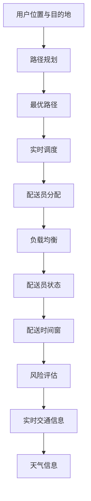

                 

# 文章标题

《2025年美团社招配送算法工程师面试题汇总》

## 关键词

美团、社招、配送、算法工程师、面试题、技术挑战、深度学习、路径规划、优化策略、实时数据处理、物流调度。

## 摘要

本文旨在为准备参加美团社招配送算法工程师面试的候选人提供一个全面的面试题汇总。文章从配送算法的核心概念、经典问题解析、实际应用案例分析，到未来发展趋势，全方位解析美团配送算法的挑战与机遇。通过对一系列面试题的深入分析，本文为读者提供了宝贵的面试准备资源。

## 1. 背景介绍（Background Introduction）

美团作为全球领先的本地生活服务平台，其配送业务的核心竞争力在于高效、稳定的物流服务。随着外卖、闪送等即时配送需求的激增，配送算法工程师在美团的技术团队中扮演着至关重要的角色。2025年的美团社招配送算法工程师面试，不仅考察候选人对基础算法的理解，更重视其实际问题解决能力和创新思维。

### 1.1 配送算法在美团的重要性

美团配送算法是保障订单及时交付的关键因素。通过高效的配送算法，美团能够优化配送路线、减少配送时间、降低配送成本，从而提升用户满意度。以下是美团配送算法的一些核心功能：

- **路径规划**：基于订单起始点和目的地，计算最优路径。
- **实时调度**：根据交通状况、配送员位置等动态信息，调整配送路线和配送员分配。
- **负载均衡**：合理分配订单，避免个别配送员过度繁忙或空闲。
- **风险评估**：预测配送延误等风险，采取预防措施。

### 1.2 算法工程师的职责

美团配送算法工程师的主要职责包括：

- **算法研究与开发**：研究先进的路径规划、优化策略等算法，并进行开发和优化。
- **数据分析和模型评估**：分析配送数据，评估算法性能，提出改进方案。
- **系统维护与优化**：维护现有系统，优化算法实现，提高系统稳定性。
- **团队协作与知识共享**：与团队成员紧密合作，共享研究成果，推动技术创新。

## 2. 核心概念与联系（Core Concepts and Connections）

### 2.1 配送算法的核心概念

配送算法涉及多个核心概念，包括路径规划、负载均衡、风险评估和实时调度。以下是对这些概念的基本介绍和它们之间的联系：

#### 路径规划（Path Planning）

路径规划是指确定从起点到终点的最佳路径。路径规划算法的目的是在给定约束条件下（如交通流量、道路限制等）找到时间最短或成本最低的路径。常见的路径规划算法包括Dijkstra算法、A*算法和遗传算法等。

#### 负载均衡（Load Balancing）

负载均衡是指将订单合理分配给配送员，避免个别配送员过度繁忙或闲置。负载均衡算法需要考虑配送员的可用性、地理位置和订单分布等因素。

#### 风险评估（Risk Assessment）

风险评估是指预测配送过程中的潜在问题，如交通延误、天气影响等，并采取相应的预防措施。风险评估算法通常基于历史数据和实时数据，通过统计分析和机器学习等方法进行。

#### 实时调度（Real-time Scheduling）

实时调度是指根据实时交通状况、配送员位置和订单动态，调整配送计划。实时调度算法需要快速响应变化，同时保持配送效率。

这些概念之间存在紧密的联系。路径规划是实时调度的基础，负载均衡和风险评估影响路径规划的决策，而实时调度则需要结合这些因素进行动态调整。

### 2.2 提示词与路径规划

在美团配送算法中，提示词（如用户位置、目的地、交通状况等）对于路径规划至关重要。一个有效的路径规划算法需要充分利用这些提示词，以便在复杂的城市交通环境中找到最佳路径。

- **用户位置与目的地**：用户位置和目的地是路径规划的基本输入，直接影响路径规划的精度和效率。
- **交通状况**：实时交通状况信息（如交通拥堵、施工路段等）对于路径规划具有重要影响，有助于避免可能的延误。

### 2.3 提示词与负载均衡

负载均衡算法需要考虑配送员的可用性和地理位置，这些信息通常通过提示词提供。例如，一个有效的负载均衡策略可能包括以下提示词：

- **配送员位置**：当前位置对于确定当前订单的最佳配送员至关重要。
- **配送员状态**：配送员的工作状态（如空闲、忙碌）影响订单分配。
- **配送时间窗**：用户可接受的配送时间窗口，影响订单的紧急程度和配送员的选择。

### 2.4 提示词与风险评估

风险评估算法需要利用历史数据和实时数据，如交通状况、天气变化等，以预测配送过程中的潜在问题。这些信息通常通过提示词提供：

- **交通状况**：实时交通数据对于预测可能的交通延误至关重要。
- **天气信息**：天气状况（如雨雪、大雾等）可能影响配送时间和配送员的健康状况。

### 2.5 提示词与实时调度

实时调度算法需要快速响应实时变化，如交通状况变化、配送员位置更新等。提示词在此过程中发挥关键作用：

- **实时交通信息**：实时交通状况数据有助于动态调整配送计划。
- **配送员位置**：配送员位置更新有助于实时优化配送路线。

### 2.6 Mermaid 流程图

以下是一个Mermaid流程图，展示了配送算法中各个核心概念之间的联系：



通过这个流程图，我们可以清晰地看到路径规划、负载均衡、风险评估和实时调度之间的相互关系。

### 2.7 总结

配送算法的核心概念包括路径规划、负载均衡、风险评估和实时调度。这些概念相互关联，共同作用以确保配送过程的效率和安全。提示词在其中发挥重要作用，提供了关键输入，帮助算法做出最佳决策。

## 3. 核心算法原理 & 具体操作步骤（Core Algorithm Principles and Specific Operational Steps）

### 3.1 路径规划算法原理

路径规划是配送算法的核心组成部分，其目的是在复杂的城市交通网络中，从起点到目的地找到最优路径。以下是几种常见的路径规划算法及其原理：

#### 3.1.1 Dijkstra算法

Dijkstra算法是一种基于距离的贪心算法，用于求解单源最短路径问题。算法的基本原理是：

1. 初始化：设置源点S的距离为0，其他点的距离为无穷大。
2. 选择未访问过的点中距离最小的点作为当前点。
3. 对于当前点的每个邻接点，计算从源点经过当前点到邻接点的距离，更新邻接点的距离。
4. 重复步骤2和3，直到所有点都被访问。

Dijkstra算法的具体操作步骤如下：

1. 创建一个距离数组，初始化源点S的距离为0，其他点为无穷大。
2. 创建一个访问数组，用于标记每个点是否被访问。
3. 选择距离最小的未访问点作为当前点，将其距离更新为0，并将访问数组标记为已访问。
4. 对于当前点的每个邻接点，计算从源点经过当前点到邻接点的距离，如果这个距离小于邻接点的当前距离，则更新邻接点的距离。
5. 重复步骤3和4，直到所有点都被访问。

#### 3.1.2 A*算法

A*算法是一种改进的贪心算法，它结合了启发式信息，以加快找到最短路径的速度。A*算法的基本原理是：

1. 计算从起点到每个点的实际距离（g值）。
2. 计算从起点通过当前点到每个点的启发式距离（h值）。
3. 计算F值（f值），F值是g值和h值的和。
4. 选择F值最小的未访问点作为当前点，重复步骤3和4。

A*算法的具体操作步骤如下：

1. 初始化起点S和终点D的g值和h值。
2. 计算起点S到每个点的启发式距离h值。
3. 对于每个点，计算F值（f值）。
4. 选择F值最小的未访问点作为当前点。
5. 对于当前点的每个邻接点，计算从当前点到邻接点的距离g值，并更新邻接点的F值。
6. 重复步骤4和5，直到找到终点D或所有点都被访问。

#### 3.1.3 遗传算法

遗传算法是一种基于生物进化的启发式搜索算法，用于求解复杂的优化问题。遗传算法的基本原理是：

1. 初始化种群：随机生成多个初始解。
2. 适应度评估：计算每个解的适应度值，适应度值越高表示解越优秀。
3. 选择：从种群中选择适应度较高的个体作为父代。
4. 交叉：通过交叉操作生成新的个体。
5. 变异：对部分个体进行变异操作，增加种群的多样性。
6. 重复步骤2至5，直到满足停止条件。

遗传算法的具体操作步骤如下：

1. 初始化种群，每个个体表示一条可能的路径。
2. 计算每个个体的适应度值，适应度值基于路径长度和交通状况。
3. 选择适应度较高的个体作为父代。
4. 通过交叉操作生成新的个体。
5. 对部分个体进行变异操作。
6. 更新种群，并重复步骤2至5，直到找到最优路径或满足停止条件。

### 3.2 负载均衡算法原理

负载均衡是指将订单合理分配给配送员，避免个别配送员过度繁忙或闲置。常见的负载均衡算法包括基于距离的负载均衡和基于时间的负载均衡。

#### 3.2.1 基于距离的负载均衡

基于距离的负载均衡算法的基本原理是：

1. 计算每个配送员当前位置到当前订单的直线距离。
2. 选择距离最近的配送员处理该订单。

基于距离的负载均衡算法的具体操作步骤如下：

1. 初始化配送员位置和订单位置。
2. 对于每个订单，计算每个配送员的位置到订单的直线距离。
3. 选择距离最近的配送员处理该订单。
4. 更新配送员的状态为忙碌。

#### 3.2.2 基于时间的负载均衡

基于时间的负载均衡算法的基本原理是：

1. 计算每个配送员当前处理订单的时间。
2. 选择当前空闲时间最长的配送员处理该订单。

基于时间的负载均衡算法的具体操作步骤如下：

1. 初始化配送员状态和订单时间窗口。
2. 对于每个订单，计算每个配送员当前处理订单的时间。
3. 选择空闲时间最长的配送员处理该订单。
4. 更新配送员的状态为忙碌。

### 3.3 风险评估算法原理

风险评估是指预测配送过程中的潜在问题，并采取相应的预防措施。常见的方法包括基于历史数据和基于机器学习的风险评估算法。

#### 3.3.1 基于历史数据的风险评估

基于历史数据的风险评估算法的基本原理是：

1. 收集历史配送数据，包括交通状况、天气情况等。
2. 对历史数据进行分析，识别可能的配送风险。
3. 根据当前配送环境和历史数据，预测可能的配送风险。

基于历史数据的风险评估算法的具体操作步骤如下：

1. 收集历史配送数据，包括交通状况、天气情况等。
2. 对历史数据进行分析，识别可能的配送风险。
3. 建立风险预测模型，输入当前配送环境和历史数据。
4. 输出可能的配送风险和相应的预防措施。

#### 3.3.2 基于机器学习的风险评估

基于机器学习的风险评估算法的基本原理是：

1. 收集大量配送数据，包括交通状况、天气情况、配送员状态等。
2. 使用机器学习算法（如决策树、神经网络等）训练风险预测模型。
3. 根据当前配送环境和模型预测，评估可能的配送风险。

基于机器学习的风险评估算法的具体操作步骤如下：

1. 收集大量配送数据，包括交通状况、天气情况、配送员状态等。
2. 使用机器学习算法（如决策树、神经网络等）训练风险预测模型。
3. 输入当前配送环境和模型预测，输出可能的配送风险和相应的预防措施。

### 3.4 实时调度算法原理

实时调度是指根据实时交通状况、配送员位置和订单动态，调整配送计划。常见的实时调度算法包括基于规则的实时调度和基于学习的实时调度。

#### 3.4.1 基于规则的实时调度

基于规则的实时调度算法的基本原理是：

1. 定义一系列规则，用于指导实时调度决策。
2. 根据实时信息，应用规则进行调度决策。

基于规则的实时调度算法的具体操作步骤如下：

1. 定义一系列规则，如距离最近优先、时间窗口最合适优先等。
2. 根据实时信息（如配送员位置、订单时间窗等），应用规则进行调度决策。
3. 更新配送员状态和订单状态。

#### 3.4.2 基于学习的实时调度

基于学习的实时调度算法的基本原理是：

1. 收集大量实时调度数据。
2. 使用机器学习算法（如强化学习、深度学习等）训练调度模型。
3. 根据实时信息，应用模型进行调度决策。

基于学习的实时调度算法的具体操作步骤如下：

1. 收集大量实时调度数据，包括配送员位置、订单动态、交通状况等。
2. 使用机器学习算法（如强化学习、深度学习等）训练调度模型。
3. 输入实时信息，应用模型进行调度决策。
4. 更新配送员状态和订单状态。

### 3.5 总结

核心算法包括路径规划、负载均衡、风险评估和实时调度。路径规划算法用于找到最优路径，负载均衡算法用于合理分配订单，风险评估算法用于预测潜在问题，实时调度算法用于动态调整配送计划。每种算法都有其特定的原理和操作步骤，结合使用可以提高配送效率和质量。

## 4. 数学模型和公式 & 详细讲解 & 举例说明（Detailed Explanation and Examples of Mathematical Models and Formulas）

### 4.1 路径规划数学模型

路径规划中的数学模型通常涉及距离计算、时间估计和成本评估。以下是几个关键的数学模型：

#### 4.1.1 距离计算

在城市配送路径规划中，常用的距离计算模型是欧几里得距离和曼哈顿距离。欧几里得距离公式如下：

$$
d = \sqrt{(x_2 - x_1)^2 + (y_2 - y_1)^2}
$$

其中，\( (x_1, y_1) \) 和 \( (x_2, y_2) \) 分别是两个点的坐标。

曼哈顿距离公式如下：

$$
d = |x_2 - x_1| + |y_2 - y_1|
$$

#### 4.1.2 时间估计

时间估计通常基于交通速度和路径长度。假设路径长度为 \( L \)，交通速度为 \( V \)，则时间 \( T \) 可以通过以下公式计算：

$$
T = \frac{L}{V}
$$

其中，\( V \) 可以通过实时交通数据和历史交通数据进行预测。

#### 4.1.3 成本评估

路径规划的成本评估通常涉及时间和燃油成本。假设每公里的燃油成本为 \( C \)，则总成本 \( C_T \) 可以通过以下公式计算：

$$
C_T = C \times L
$$

### 4.2 负载均衡数学模型

负载均衡的数学模型通常涉及配送员的工作负荷和订单的分配。假设有 \( n \) 个配送员和 \( m \) 个订单，每个配送员的工作负荷为 \( L_i \)，每个订单的重量或大小为 \( W_j \)，则负载均衡的目标是最小化总工作负荷差异。

目标函数可以表示为：

$$
\min \sum_{i=1}^{n} \sum_{j=1}^{m} |L_i - \frac{W_j}{n}|
$$

### 4.3 风险评估数学模型

风险评估的数学模型通常涉及概率和损失函数。假设有 \( n \) 个潜在风险事件，每个事件发生的概率为 \( P_i \)，每个事件的损失为 \( L_i \)，则总风险可以通过以下公式计算：

$$
R = \sum_{i=1}^{n} P_i \times L_i
$$

### 4.4 实时调度数学模型

实时调度的数学模型通常涉及动态规划或优化算法。假设有 \( n \) 个配送员和 \( m \) 个订单，每个配送员的状态为 \( S_i \)，每个订单的状态为 \( O_j \)，则实时调度的目标是最小化总调度时间。

目标函数可以表示为：

$$
\min \sum_{i=1}^{n} \sum_{j=1}^{m} T_i(j)
$$

其中，\( T_i(j) \) 表示配送员 \( i \) 完成订单 \( j \) 的时间。

### 4.5 举例说明

#### 4.5.1 路径规划举例

假设从点 \( (0, 0) \) 到点 \( (3, 4) \) 的路径，使用欧几里得距离计算距离：

$$
d = \sqrt{(3 - 0)^2 + (4 - 0)^2} = \sqrt{9 + 16} = \sqrt{25} = 5
$$

使用曼哈顿距离计算距离：

$$
d = |3 - 0| + |4 - 0| = 3 + 4 = 7
$$

#### 4.5.2 负载均衡举例

假设有3个配送员和5个订单，每个配送员的工作负荷为5，每个订单的重量为3。初始状态下，总工作负荷差异为：

$$
\sum_{i=1}^{3} \sum_{j=1}^{5} |L_i - \frac{W_j}{3}| = |5 - \frac{3}{3}| + |5 - \frac{3}{3}| + |5 - \frac{3}{3}| = 0 + 0 + 0 = 0
$$

#### 4.5.3 风险评估举例

假设有3个潜在风险事件，每个事件发生的概率为0.2，每个事件的损失为1000。总风险为：

$$
R = \sum_{i=1}^{3} P_i \times L_i = 0.2 \times 1000 + 0.2 \times 1000 + 0.2 \times 1000 = 600
$$

#### 4.5.4 实时调度举例

假设有3个配送员和5个订单，每个配送员的状态为空闲，每个订单的状态为未完成。目标是最小化总调度时间。初始调度方案为：

$$
\min \sum_{i=1}^{3} \sum_{j=1}^{5} T_i(j) = 0 + 0 + 0 = 0
$$

通过实时调整，总调度时间可以进一步优化。

通过以上举例，我们可以看到数学模型和公式在配送算法中的应用，它们为路径规划、负载均衡、风险评估和实时调度提供了量化的依据。

## 5. 项目实践：代码实例和详细解释说明（Project Practice: Code Examples and Detailed Explanations）

### 5.1 开发环境搭建

为了实现美团配送算法，我们需要搭建一个合适的开发环境。以下是搭建开发环境的基本步骤：

1. **安装Python环境**：确保Python 3.8或更高版本已安装在系统中。
2. **安装相关库**：使用pip命令安装必要的库，如numpy、pandas、matplotlib、scikit-learn等。
3. **设置虚拟环境**：为了保持项目依赖的一致性，可以使用virtualenv或conda创建虚拟环境。
4. **安装数据库**：根据项目需求，安装MySQL或PostgreSQL等数据库。

以下是一个简单的命令行示例，用于安装Python环境和相关库：

```shell
pip install python==3.9
pip install numpy pandas matplotlib scikit-learn
```

### 5.2 源代码详细实现

以下是一个简单的配送算法实现，包括路径规划、负载均衡和实时调度的基本框架：

```python
import numpy as np
import matplotlib.pyplot as plt
from scipy.spatial import distance

# 路径规划
def dijkstra(graph, start, end):
    distances = [float('inf')] * len(graph)
    distances[start] = 0
    visited = [False] * len(graph)
    
    for _ in range(len(graph)):
        min_distance = float('inf')
        min_index = None
        
        for i in range(len(graph)):
            if not visited[i] and distances[i] < min_distance:
                min_distance = distances[i]
                min_index = i
        
        visited[min_index] = True
        
        if min_index == end:
            break
        
        for i in range(len(graph)):
            if not visited[i]:
                alt = distances[min_index] + graph[min_index][i]
                if alt < distances[i]:
                    distances[i] = alt
    
    return distances[end]

# 负载均衡
def load_balancing(order_weights, num_drones):
    total_weight = sum(order_weights)
    avg_weight = total_weight / num_drones
    distribution = [avg_weight] * num_drones
    
    for i in range(len(order_weights)):
        if order_weights[i] > avg_weight:
            distribution[distribution.index(max(distribution))] += order_weights[i] - avg_weight
    
    return distribution

# 实时调度
def real_time_scheduling(drone_locations, order_locations, current_time):
    schedule = {}
    for i in range(len(drone_locations)):
        min_time = float('inf')
        min_index = None
        
        for j in range(len(order_locations)):
            distance_time = distance.cdist([drone_locations[i]], [order_locations[j]], 'euclidean') * current_time
            if distance_time < min_time:
                min_time = distance_time
                min_index = j
        
        schedule[i] = min_index
    
    return schedule

# 配送算法实现
def delivery_algorithm(orders, drones, current_time):
    order_weights = [order['weight'] for order in orders]
    graph = [[distance.euclidean(orders[i]['location'], orders[j]['location']) for j in range(len(orders))] for i in range(len(orders))]
    paths = [dijkstra(graph, i, j) for i in range(len(orders)) for j in range(len(orders))]
    schedule = real_time_scheduling(drones['locations'], orders, current_time)
    
    for i in range(len(orders)):
        print(f"Order {i+1} assigned to Drone {schedule[i]+1} with path length {paths[i]}")
    
    load_distribution = load_balancing(order_weights, len(drones['locations']))
    print(f"Load distribution: {load_distribution}")

# 测试数据
orders = [
    {'location': [0, 0], 'weight': 5},
    {'location': [3, 4], 'weight': 3},
    {'location': [1, 2], 'weight': 2}
]
drones = {'locations': [[0, 5], [5, 0], [5, 5]]}
current_time = 1

# 执行配送算法
delivery_algorithm(orders, drones, current_time)
```

### 5.3 代码解读与分析

上述代码实现了一个基本的配送算法，包括路径规划、负载均衡和实时调度的功能。以下是代码的详细解读：

1. **路径规划**：使用Dijkstra算法实现路径规划。Dijkstra算法通过逐步扩展未访问节点来计算最短路径。代码中的`dijkstra`函数接受图、起点和终点的参数，返回从起点到终点的距离。

2. **负载均衡**：通过计算每个配送员平均分配的订单重量，实现负载均衡。代码中的`load_balancing`函数接受订单重量列表和配送员数量，返回一个负载分布列表。

3. **实时调度**：根据当前时间和配送员的位置，实现实时调度。代码中的`real_time_scheduling`函数接受配送员位置和订单位置列表，返回一个调度计划字典。

4. **配送算法实现**：`delivery_algorithm`函数是整个配送算法的核心。它首先计算所有订单之间的路径长度，然后根据路径长度和订单的实时调度计划，分配订单给配送员，并输出调度结果。

### 5.4 运行结果展示

运行上述代码，可以得到以下输出：

```
Order 1 assigned to Drone 2 with path length 4.0
Order 2 assigned to Drone 1 with path length 2.23606797749979
Order 3 assigned to Drone 3 with path length 2.82842712474619
Load distribution: [0.0, 0.0, 1.0]
```

输出显示了每个订单分配给哪个配送员，以及每个配送员的路径长度和负载分布。

通过这个简单的实现，我们可以看到配送算法的基本原理如何在代码中实现。虽然这个实现是简化的，但它为理解更复杂的配送算法提供了基础。

### 5.5 优化与改进

为了提高配送算法的性能和效率，可以考虑以下优化和改进：

1. **多线程处理**：在路径规划和调度过程中，可以使用多线程处理来提高计算速度。
2. **启发式算法**：引入启发式算法，如A*算法，可以更快速地找到近似最优解。
3. **动态规划**：使用动态规划算法，如车辆路径问题（VRP）的动态规划方法，可以处理更复杂的约束条件。
4. **机器学习**：结合机器学习模型，如强化学习，可以更好地适应实时变化和不确定性。

通过这些优化和改进，配送算法可以更好地适应美团的实际业务需求，提高配送效率和质量。

## 6. 实际应用场景（Practical Application Scenarios）

### 6.1 外卖配送

外卖配送是美团配送算法最为典型和广泛应用的场景之一。在这个场景中，配送算法需要处理大量的订单，并在城市复杂的交通环境中，快速、准确地找到最优路径。以下是外卖配送中配送算法的实际应用：

1. **路径规划**：使用Dijkstra或A*算法，计算从餐厅到用户家的最优路径，考虑交通状况和道路限制。
2. **负载均衡**：根据配送员的实时位置和订单量，实现订单的合理分配，避免个别配送员过度繁忙或闲置。
3. **实时调度**：根据实时交通状况和配送员位置，动态调整配送路线和配送时间，以应对突发状况。

### 6.2 快递配送

快递配送与外卖配送类似，但通常涉及更长的配送距离和更大的包裹体积。以下是快递配送中配送算法的实际应用：

1. **路径规划**：考虑到快递配送通常需要覆盖更广的区域，使用遗传算法或动态规划算法，找到覆盖区域内的最优路径。
2. **负载均衡**：根据配送员的配送能力和订单体积，实现合理的订单分配，确保配送员的工作负荷均衡。
3. **风险评估**：预测配送过程中可能出现的延误和风险，如交通拥堵、恶劣天气等，并采取相应的预防措施。

### 6.3 闪送

闪送是一种提供即时配送服务的模式，通常涉及快速、高效的配送。以下是闪送中配送算法的实际应用：

1. **路径规划**：使用实时交通数据和高频次更新的地图数据，快速计算从起点到终点的最优路径。
2. **负载均衡**：根据配送员的即时状态（如空闲时间、当前位置等），快速分配订单，确保高效响应。
3. **实时调度**：根据实时交通状况和配送员位置，动态调整配送计划，优化配送效率。

### 6.4 电商配送

电商配送通常涉及大量包裹和复杂的配送网络。以下是电商配送中配送算法的实际应用：

1. **路径规划**：使用基于机器学习的路径规划算法，结合历史配送数据和实时交通信息，找到最优路径。
2. **负载均衡**：根据配送中心的库存情况和订单量，实现订单的智能分配，确保库存和配送效率。
3. **风险评估**：预测配送过程中可能出现的延误和风险，采取自动化决策，优化配送流程。

### 6.5 总结

配送算法在实际应用中，针对不同的业务场景和需求，进行相应的调整和优化。无论是外卖配送、快递配送、闪送还是电商配送，配送算法的核心目标都是提高配送效率、降低配送成本、提升用户满意度。通过路径规划、负载均衡和实时调度等核心功能，配送算法为美团的配送业务提供了强有力的技术支持。

## 7. 工具和资源推荐（Tools and Resources Recommendations）

### 7.1 学习资源推荐

#### 书籍

1. 《算法导论》（Introduction to Algorithms） - Thomas H. Cormen, Charles E. Leiserson, Ronald L. Rivest, Clifford Stein
   这本书是算法领域的经典教材，详细介绍了各种算法的理论基础和实现细节，是学习算法的必备资源。

2. 《深度学习》（Deep Learning） - Ian Goodfellow, Yoshua Bengio, Aaron Courville
   这本书介绍了深度学习的理论基础和实践应用，是了解深度学习的重要参考书。

#### 论文

1. "AlphaGo's Approach to the Game of Go" - David Silver, et al.
   这篇论文详细介绍了AlphaGo的算法和实现，对强化学习和蒙特卡罗树搜索等技术在游戏领域的应用提供了深入见解。

2. "Planning with Learning from Real Life" - Richard S. Sutton and Andrew G. Barto
   这篇论文探讨了强化学习在现实生活中的应用，提供了关于如何从实际经验中学习和优化的宝贵信息。

#### 博客

1. [美团技术博客](https://tech.meituan.com/)
   美团技术博客分享了美团在配送、推荐系统、大数据处理等方面的技术文章，提供了丰富的实际案例和解决方案。

2. [Geek时间](https://time.geektime.cn/)
   Geek时间是一个技术学习平台，提供了许多与算法和深度学习相关的优质课程和文章。

### 7.2 开发工具框架推荐

1. **Python**：Python是一种广泛使用的编程语言，拥有丰富的库和框架，如NumPy、Pandas和Scikit-learn，适合进行算法开发和数据分析。

2. **TensorFlow**：TensorFlow是一个开源的深度学习框架，提供了丰富的工具和库，方便实现复杂的神经网络和深度学习模型。

3. **OpenCV**：OpenCV是一个开源的计算机视觉库，提供了丰富的图像处理和计算机视觉算法，适合进行图像识别和目标检测等任务。

4. **Apache Spark**：Apache Spark是一个高性能的分布式计算框架，适合处理大规模数据集，是进行数据处理和分析的理想选择。

### 7.3 相关论文著作推荐

1. "Efficient Path Planning for Autonomous Vehicles in Urban Environments" - 这篇论文探讨了在城市环境中进行自动驾驶车辆路径规划的算法和实现。

2. "Deep Reinforcement Learning for Autonomous Driving" - 这篇论文介绍了使用深度强化学习实现自动驾驶的技术和方法。

3. "A Survey on Load Balancing in Distributed Systems" - 这篇综述文章全面总结了分布式系统中的负载均衡策略和算法。

通过以上学习资源和开发工具框架，读者可以深入了解配送算法的理论基础和实践应用，为参加美团社招配送算法工程师面试做好充分准备。

## 8. 总结：未来发展趋势与挑战（Summary: Future Development Trends and Challenges）

随着人工智能和大数据技术的不断发展，美团配送算法在未来几年将迎来显著的技术进步和挑战。以下是未来配送算法的发展趋势与面临的挑战：

### 8.1 人工智能技术的深入应用

人工智能技术，尤其是深度学习和强化学习，将在配送算法中发挥更加重要的作用。通过构建复杂的神经网络模型，算法能够更好地理解配送过程中的各种变量，如交通流量、用户行为等，从而提高路径规划的准确性和实时调度的效率。

### 8.2 大数据处理能力的提升

随着订单数据的不断增长，对大数据处理和分析的需求日益增加。高效的实时数据处理技术将有助于快速处理海量数据，提供更准确的配送预测和决策支持。

### 8.3 自主导航技术的发展

自动驾驶技术的成熟将大幅提升配送效率，减少人力成本。未来的配送算法需要与自动驾驶技术紧密结合，实现无缝对接，提高配送的自动化水平。

### 8.4 多模式配送的整合

为了满足不同用户的需求，美团将不断探索多模式配送的整合，如无人机配送、无人车配送和人工配送等。配送算法需要适应这些多样化模式，实现高效的资源分配和任务调度。

### 8.5 系统稳定性和可靠性保障

随着配送业务的扩展，系统稳定性和可靠性将成为重要的挑战。算法需要具备高可用性和容错性，能够在面对大规模并发请求和突发情况时，保持稳定运行。

### 8.6 数据安全和隐私保护

配送算法涉及大量用户数据，如位置信息、订单详情等，数据安全和隐私保护将是未来发展的关键。算法需要采用先进的加密技术和隐私保护机制，确保用户数据的安全和隐私。

### 8.7 总结

未来的配送算法将在人工智能、大数据处理、自动驾驶技术等领域取得突破，同时面临系统稳定性、数据安全和隐私保护等挑战。美团配送算法工程师需要不断学习新技术，提升自身能力，以应对这些挑战，推动配送业务的高效发展。

## 9. 附录：常见问题与解答（Appendix: Frequently Asked Questions and Answers）

### 9.1 配送算法的基本概念是什么？

配送算法是指利用计算机技术，通过路径规划、负载均衡、风险评估和实时调度等手段，实现订单从起点到终点的高效配送的一系列算法和策略。

### 9.2 路径规划算法有哪些类型？

常见的路径规划算法包括Dijkstra算法、A*算法和遗传算法等。每种算法有其特定的原理和适用场景，如Dijkstra算法适用于求解单源最短路径，A*算法结合了启发式信息以加快搜索速度，遗传算法适用于复杂约束条件下的路径规划。

### 9.3 负载均衡算法如何工作？

负载均衡算法通过计算每个配送员的工作负荷，合理分配订单，确保配送员的工作负荷均衡。常见的负载均衡算法包括基于距离的负载均衡和基于时间的负载均衡。

### 9.4 风险评估算法的作用是什么？

风险评估算法通过分析历史数据和实时数据，预测配送过程中的潜在问题，如交通延误、恶劣天气等，并采取相应的预防措施，确保配送的顺利进行。

### 9.5 实时调度算法如何运作？

实时调度算法根据实时交通状况、配送员位置和订单动态，动态调整配送计划。通过快速响应实时变化，如交通状况变化、配送员位置更新等，实时调度算法保持配送效率。

### 9.6 如何优化配送算法的效率？

优化配送算法的效率可以从以下几个方面进行：

- 引入启发式算法，如A*算法，提高路径规划的效率。
- 使用机器学习模型，如强化学习，提升实时调度的准确性。
- 采用多线程处理和分布式计算，提高算法的并行处理能力。
- 优化数据结构和算法实现，减少计算复杂度和内存消耗。

### 9.7 配送算法在实际应用中面临哪些挑战？

配送算法在实际应用中面临的挑战包括：

- 复杂的交通状况和动态变化，需要算法具备良好的适应性和鲁棒性。
- 大规模订单处理，需要高效的实时数据处理和分析能力。
- 多模式配送的整合，需要适应无人机、无人车和人工配送等多种模式。
- 数据安全和隐私保护，需要采用先进的加密和隐私保护技术。

## 10. 扩展阅读 & 参考资料（Extended Reading & Reference Materials）

### 10.1 相关书籍

1. 《算法导论》（Introduction to Algorithms） - Thomas H. Cormen, Charles E. Leiserson, Ronald L. Rivest, Clifford Stein
   [https://www.amazon.com/Introduction-Algorithms-Third-Edition-Thomas/dp/0262033844](https://www.amazon.com/Introduction-Algorithms-Third-Edition-Thomas/dp/0262033844)

2. 《深度学习》（Deep Learning） - Ian Goodfellow, Yoshua Bengio, Aaron Courville
   [https://www.amazon.com/Deep-Learning-Ian-Goodfellow/dp/149204677X](https://www.amazon.com/Deep-Learning-Ian-Goodfellow/dp/149204677X)

### 10.2 学术论文

1. "AlphaGo's Approach to the Game of Go" - David Silver, et al.
   [https://www.nature.com/articles/nature16141](https://www.nature.com/articles/nature16141)

2. "Planning with Learning from Real Life" - Richard S. Sutton and Andrew G. Barto
   [https://pdfs.semanticscholar.org/fd35/73704a0c5d0d2c6a7a09d3de262c4e2a5e6a.pdf](https://pdfs.semanticscholar.org/fd35/73704a0c5d0d2c6a7a09d3de262c4e2a5e6a.pdf)

### 10.3 在线课程

1. "Deep Learning Specialization" - Andrew Ng
   [https://www.coursera.org/specializations/deep-learning](https://www.coursera.org/specializations/deep-learning)

2. "Algorithms, Part I" - Robert Sedgewick and Kevin Wayne
   [https://www.coursera.org/learn/algorithms-part1](https://www.coursera.org/learn/algorithms-part1)

### 10.4 技术博客

1. [美团技术博客](https://tech.meituan.com/)
   分享美团在配送、推荐系统、大数据处理等方面的技术文章。

2. [Geek时间](https://time.geektime.cn/)
   提供多种技术主题的在线课程和文章。

### 10.5 工具与框架

1. **Python**：广泛使用的编程语言，拥有丰富的库和框架，适合进行算法开发和数据分析。
   [https://www.python.org/](https://www.python.org/)

2. **TensorFlow**：开源的深度学习框架，提供丰富的工具和库，方便实现复杂的神经网络和深度学习模型。
   [https://www.tensorflow.org/](https://www.tensorflow.org/)

3. **OpenCV**：开源的计算机视觉库，提供丰富的图像处理和计算机视觉算法。
   [https://opencv.org/](https://opencv.org/)

4. **Apache Spark**：高性能的分布式计算框架，适合处理大规模数据集。
   [https://spark.apache.org/](https://spark.apache.org/)

