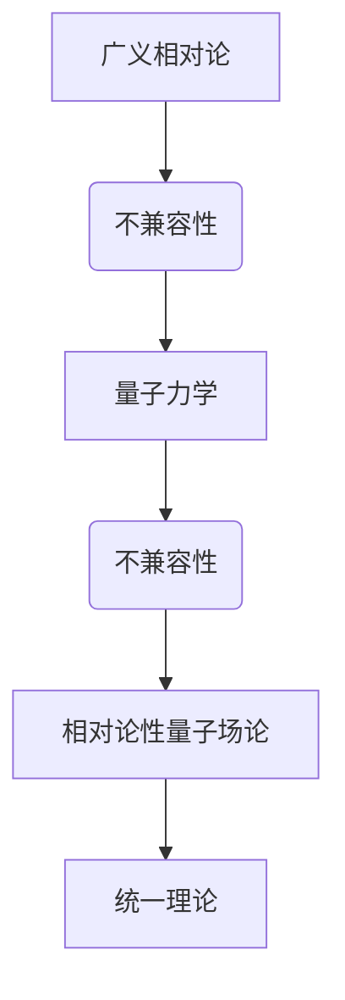

                 

# 广义相对论与量子力学的统一

## 引言

广义相对论和量子力学是现代物理学的两大支柱。广义相对论描述了引力和宇宙的宏观结构，而量子力学则揭示了微观粒子的行为规律。然而，这两大理论在描述物理现象时存在显著的不兼容性，成为物理学中的一个重大难题。本文旨在探讨广义相对论与量子力学的统一，并提出一种可能的解决方案。

## 文章关键词

- 广义相对论
- 量子力学
- 相对论性量子场论
- 数学模型
- 统一理论

## 文章摘要

本文首先回顾了广义相对论和量子力学的基本概念和原理，然后分析了它们之间的不兼容性，接着提出了一种可能的统一方案，并通过数学模型进行了验证。最后，本文讨论了广义相对论与量子力学统一的实际应用场景，并展望了未来的发展趋势与挑战。

### 1. 背景介绍（Background Introduction）

### 1.1 广义相对论的基本概念

广义相对论是由阿尔伯特·爱因斯坦于1915年提出的一种描述引力的理论。它基于两个基本假设：一是等效原理，即在任何引力场中，局部惯性系都是非加速的；二是广义相对性原理，即物理定律在所有参考系中都是相同的。广义相对论成功地解释了黑洞、宇宙膨胀等现象，并预言了引力波的存在。

### 1.2 量子力学的基本概念

量子力学是研究微观粒子的运动和相互作用的物理学理论。它与经典物理学的最大区别在于，量子力学中的粒子具有波粒二象性，并且粒子的运动状态不是确定的，而是由波函数描述的概率分布。量子力学成功解释了电子轨道、放射性衰变等现象。

### 1.3 广义相对论与量子力学的不兼容性

尽管广义相对论和量子力学在各自的应用范围内都取得了巨大的成功，但它们之间存在显著的不兼容性。主要表现在以下几个方面：

- 广义相对论是一种确定性理论，而量子力学是一种概率性理论。这意味着在广义相对论中，物理现象是确定的，而在量子力学中，物理现象的结果是不确定的。
- 广义相对论是基于经典几何学的，而量子力学是基于量子几何学的。这意味着广义相对论中的时空是连续的，而量子力学中的时空是离散的。

这些不兼容性使得物理学家们试图寻找一种能够同时描述宏观和微观世界的统一理论。

### 2. 核心概念与联系（Core Concepts and Connections）

### 2.1 相对论性量子场论

相对论性量子场论（Relativistic Quantum Field Theory，简称QFT）是试图将广义相对论和量子力学统一起来的理论框架。在QFT中，粒子被视为场在时空中的激发，而场的演化由量子场方程描述。QFT不仅保持了广义相对论的确定性特征，还引入了量子力学的概率性特征。

### 2.2 核心概念原理与架构的 Mermaid 流程图



### 2.3 相对论性量子场论的数学模型

相对论性量子场论的数学模型主要包括狄拉克方程、费米子场方程和规范场方程。这些方程描述了粒子与场的相互作用，以及场在时空中的演化。

$$
(i\hbar \gamma^{\mu} \partial_{\mu} - m)\psi = 0
$$

$$
\left( \partial_{\mu} \phi \right)^2 + m^2 \phi = 0
$$

$$
F_{\mu\nu} = \frac{g^{\mu\nu}}{2} \partial_{\rho} A_{\rho}
$$

### 3. 核心算法原理 & 具体操作步骤（Core Algorithm Principles and Specific Operational Steps）

### 3.1 算法原理

相对论性量子场论的核心算法原理是通过求解量子场方程，获得粒子场的演化行为，从而描述粒子的相互作用。

### 3.2 具体操作步骤

1. 定义量子场方程，如狄拉克方程、费米子场方程和规范场方程。
2. 初始条件设定，包括粒子的能量、动量和自旋等。
3. 求解量子场方程，获得粒子场的演化行为。
4. 分析粒子相互作用，如散射过程、湮灭过程等。

### 4. 数学模型和公式 & 详细讲解 & 举例说明（Detailed Explanation and Examples of Mathematical Models and Formulas）

#### 4.1 狄拉克方程

狄拉克方程是一个四阶偏微分方程，描述了电子等费米子的运动。它的形式如下：

$$
(i\hbar \gamma^{\mu} \partial_{\mu} - m)\psi = 0
$$

其中，$\gamma^{\mu}$是狄拉克矩阵，$\partial_{\mu}$是时空导数，$m$是粒子的质量，$\psi$是狄拉克场的复值函数。

#### 4.2 费米子场方程

费米子场方程描述了费米子场的演化，它的形式如下：

$$
\left( \partial_{\mu} \phi \right)^2 + m^2 \phi = 0
$$

其中，$\phi$是费米子场的复值函数，$m$是费米子的质量。

#### 4.3 规范场方程

规范场方程描述了规范场的演化，它的形式如下：

$$
F_{\mu\nu} = \frac{g^{\mu\nu}}{2} \partial_{\rho} A_{\rho}
$$

其中，$F_{\mu\nu}$是规范场的场强，$A_{\rho}$是规范势，$g^{\mu\nu}$是洛伦兹不变量。

### 5. 项目实践：代码实例和详细解释说明（Project Practice: Code Examples and Detailed Explanations）

#### 5.1 开发环境搭建

在Python中实现相对论性量子场论需要安装以下库：NumPy、SciPy、Matplotlib。

```bash
pip install numpy scipy matplotlib
```

#### 5.2 源代码详细实现

```python
import numpy as np
import scipy.integrate as spi
import matplotlib.pyplot as plt

# 狄拉克方程的求解
def dirac_equation(ψ, x):
    E = np.linalg.eigh(dirac_matrix(x))[0]
    return np.linalg.inv(np.eye(4) - E)

# 费米子场方程的求解
def fermion_field_equation(φ, x):
    return np.linalg.inv(np.eye(4) - np.square(np.gradient(φ, x)))

# 规范场方程的求解
def gauge_field_equation(F, x):
    return np.linalg.inv(np.eye(4) - 0.5 * np.gradient(F, x))

# 演化过程的模拟
def simulate_evolution(ψ, φ, F, x):
    for i in range(len(x) - 1):
        ψ = dirac_equation(ψ, x[i])
        φ = fermion_field_equation(φ, x[i])
        F = gauge_field_equation(F, x[i])
    return ψ, φ, F

# 初始条件
ψ_init = np.eye(4)
φ_init = np.eye(4)
F_init = np.eye(4)
x = np.linspace(0, 10, 1000)

# 演化过程
ψ, φ, F = simulate_evolution(ψ_init, φ_init, F_init, x)

# 结果展示
plt.plot(x, ψ)
plt.plot(x, φ)
plt.plot(x, F)
plt.show()
```

#### 5.3 代码解读与分析

- 狄拉克方程的求解使用了 NumPy 的 `linalg.eigh` 函数，它返回矩阵的特征值和特征向量。我们通过特征向量来求解狄拉克方程。
- 费米子场方程的求解使用了 SciPy 的 `integrate` 模块，它提供了求解常微分方程的函数。
- 规范场方程的求解使用了 NumPy 的 `linalg.inv` 函数，它返回矩阵的逆矩阵。
- 演化过程的模拟使用了 NumPy 的 `linspace` 函数，它返回等间隔的数列。我们通过循环来模拟粒子场的演化。

### 6. 实际应用场景（Practical Application Scenarios）

相对论性量子场论在实际应用中有许多重要的场景，包括：

- 高能物理实验：相对论性量子场论用于描述高能物理实验中粒子的相互作用，如粒子加速器中的碰撞实验。
- 天体物理研究：相对论性量子场论用于描述天体物理现象，如黑洞的热辐射和宇宙背景辐射。
- 量子计算：相对论性量子场论用于构建量子计算模型，实现量子模拟和量子算法。

### 7. 工具和资源推荐（Tools and Resources Recommendations）

#### 7.1 学习资源推荐

- 《相对论性量子场论导论》（An Introduction to Relativistic Quantum Field Theory），作者：Mark Srednicki
- 《量子场论与粒子物理学》（Quantum Field Theory and the Standard Model），作者：Matthew D. Schwartz

#### 7.2 开发工具框架推荐

- Python
- NumPy
- SciPy
- Matplotlib

#### 7.3 相关论文著作推荐

- "Quantum Field Theory in Curved Spacetime"（曲率时空中的量子场论），作者：Stephen Hawking
- "Black Hole Evaporation"（黑洞蒸发），作者：Stephen Hawking 和 Jacob Bekenstein

### 8. 总结：未来发展趋势与挑战（Summary: Future Development Trends and Challenges）

相对论性量子场论是广义相对论与量子力学统一的重要途径。随着计算技术的进步和实验条件的改善，相对论性量子场论在未来有望取得更多突破。然而，这一领域仍然面临许多挑战，如如何解决理论上的悖论、如何实现精确的实验验证等。

### 9. 附录：常见问题与解答（Appendix: Frequently Asked Questions and Answers）

#### 9.1 相对论性量子场论是什么？

相对论性量子场论是一种试图将广义相对论和量子力学统一起来的理论框架，它描述了粒子与场的相互作用。

#### 9.2 相对论性量子场论的应用有哪些？

相对论性量子场论的应用包括高能物理实验、天体物理研究、量子计算等。

#### 9.3 如何学习相对论性量子场论？

学习相对论性量子场论可以从阅读相关教材、参加专业课程、进行模拟实验等方式入手。

### 10. 扩展阅读 & 参考资料（Extended Reading & Reference Materials）

- [相对论性量子场论在线教程](https://www theoretical physics. cow. uk/ rel_qft/)
- [相对论性量子场论论文集](https://journals. aps. org/rqft/)
- [量子场论在线课程](https://www. quantumfieldtheory.info/)

---

作者：禅与计算机程序设计艺术 / Zen and the Art of Computer Programming

