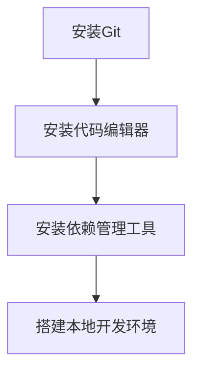

                 

### 文章标题

**开源项目的企业培训课程：开发和营销策略**

关键词：开源项目，企业培训，开发策略，营销策略，社区建设

摘要：本文旨在探讨如何为企业提供有效的开源项目培训课程，包括开发和营销策略。通过深入分析开源项目的核心价值、开发和营销的最佳实践，以及具体的实施步骤，本文将帮助企业和开发者更好地理解和应用开源项目，从而提升其在技术社区的影响力和市场竞争力。

<|assistant|>### 1. 背景介绍

#### 1.1 开源项目的兴起

开源项目作为一种软件开发模式，近年来在全球范围内迅速发展。开源项目的核心优势在于其开放性和协作性，通过让开发者和用户共同参与，不断优化和改进软件，从而提高其质量和用户体验。

开源项目的兴起不仅改变了软件开发的模式，也对企业的创新能力和市场竞争力产生了深远影响。一方面，企业可以通过开源项目快速获取先进的技术和解决方案，降低研发成本；另一方面，通过参与开源项目，企业可以增强技术积累，提高研发效率，同时提升品牌知名度和市场影响力。

#### 1.2 企业培训的重要性

随着开源项目在企业中的广泛应用，企业对开源项目的开发和营销能力提出了更高的要求。然而，许多企业在开源项目开发和营销方面存在人才短缺、经验不足等问题，这成为制约企业发展的瓶颈。

因此，企业培训成为解决这一问题的关键。通过为企业提供系统的开源项目培训课程，可以帮助企业培养专业的开源项目开发者和营销人才，提高企业整体的技术水平和市场竞争力。

#### 1.3 本文目的

本文旨在为企业提供一套完整的开源项目企业培训课程，涵盖开发和营销两个方面。通过本文的阐述，读者将能够：

1. 理解开源项目的核心价值和优势。
2. 掌握开源项目开发和营销的最佳实践。
3. 学会如何设计和实施有效的开源项目培训课程。
4. 提高企业在开源项目领域的竞争力和影响力。

<|assistant|>### 2. 核心概念与联系

#### 2.1 开源项目的基本概念

开源项目（Open Source Project）是指遵循特定开源许可协议，允许用户自由使用、学习、修改和分发软件代码的项目。开源项目的核心特征包括：

1. **开放性**：项目源代码对所有人公开，用户可以自由访问和查看。
2. **协作性**：项目开发过程鼓励社区成员参与，共同改进和优化软件。
3. **共享性**：项目成果可以自由分享，推动整个行业的技术进步。
4. **透明性**：项目开发过程中的决策、问题和进展对所有人透明。

#### 2.2 开源项目与企业的关系

开源项目对企业具有深远的影响，主要体现在以下几个方面：

1. **技术积累**：通过参与开源项目，企业可以积累丰富的技术经验和知识，提高研发能力。
2. **人才储备**：开源项目为企业提供了吸引和培养优秀技术人才的机会。
3. **市场影响力**：积极参与开源项目，可以提高企业在技术社区和市场上的影响力。
4. **合作机会**：开源项目为企业与其他企业、研究机构、开发者等建立合作关系提供了平台。

#### 2.3 开发策略与营销策略的关系

开源项目的成功不仅取决于技术实力，还离不开有效的开发和营销策略。开发策略和营销策略之间存在着密切的联系，主要体现在以下几个方面：

1. **目标一致性**：开发策略和营销策略都需要围绕企业的长期目标制定，确保两者的一致性。
2. **资源整合**：有效的开发和营销策略需要企业内部不同部门和团队之间的紧密合作，共同为项目成功贡献力量。
3. **协同发展**：开发策略和营销策略相互促进，共同推动项目的不断进步和成长。

#### 2.4 开源项目的生命周期

开源项目的发展可以分为以下几个阶段：

1. **启动阶段**：确定项目目标、架构和开发计划，组建核心团队。
2. **成长阶段**：项目逐渐获得社区关注和参与者，代码质量和功能逐渐完善。
3. **成熟阶段**：项目达到一定的稳定性和成熟度，拥有稳定的社区和用户基础。
4. **衰退阶段**：项目面临技术变革、市场变化或内部资源不足等问题，可能出现衰退或停止发展。

#### 2.5 开源项目的成功要素

开源项目的成功离不开以下几个关键要素：

1. **技术优势**：项目具有独特的技术特点和优势，能够解决用户实际问题。
2. **社区建设**：建立活跃的社区，鼓励成员参与讨论、贡献代码和反馈。
3. **品牌传播**：通过多种渠道宣传项目，提高项目知名度和影响力。
4. **合作与共赢**：与其他企业、研究机构、开发者建立合作关系，共同推动项目发展。

<|assistant|>### 3. 核心算法原理 & 具体操作步骤

#### 3.1 开发策略的核心算法原理

开源项目的开发策略可以概括为以下几个方面：

1. **需求分析**：明确项目目标、功能需求和技术要求。
2. **架构设计**：设计合理的系统架构，确保项目的可扩展性和可维护性。
3. **代码质量控制**：制定编码规范，进行代码审查和测试，确保代码质量。
4. **版本控制**：使用版本控制系统管理代码变更，确保代码的完整性和一致性。
5. **文档编写**：编写详细的文档，包括开发日志、用户手册和API文档等。
6. **持续集成与持续交付**：实现自动化测试和部署，提高开发效率和质量。

具体操作步骤如下：

1. **确定项目目标**：明确项目的开发方向和预期成果，确保团队成员对项目目标有清晰的认识。
2. **需求分析**：与用户和利益相关者沟通，收集需求，分析需求优先级，制定详细的需求文档。
3. **架构设计**：根据需求文档，设计系统的整体架构，包括模块划分、接口定义和数据流分析等。
4. **代码质量控制**：制定编码规范，要求团队成员遵循，并进行代码审查和测试，确保代码质量。
5. **版本控制**：选择合适的版本控制系统，如Git，管理代码变更，确保代码的完整性和一致性。
6. **文档编写**：编写详细的开发日志、用户手册和API文档，方便团队成员和其他开发者了解和使用项目。
7. **持续集成与持续交付**：实现自动化测试和部署，确保项目在每次代码变更后都能顺利运行，提高开发效率和质量。

#### 3.2 营销策略的核心算法原理

开源项目的营销策略主要包括以下几个方面：

1. **社区建设**：建立和维护活跃的社区，鼓励成员参与讨论、贡献代码和反馈。
2. **品牌传播**：通过多种渠道宣传项目，提高项目知名度和影响力。
3. **合作与共赢**：与其他企业、研究机构、开发者建立合作关系，共同推动项目发展。
4. **内容营销**：发布高质量的内容，包括技术博客、案例分析、用户指南等，吸引潜在用户和开发者。
5. **活动策划**：组织线上或线下的活动，增加项目曝光度和用户参与度。

具体操作步骤如下：

1. **社区建设**：搭建社区平台，如GitHub、Reddit、Discord等，提供便捷的交流渠道，鼓励成员参与讨论、贡献代码和反馈。
2. **品牌传播**：利用社交媒体、技术论坛、博客等渠道宣传项目，提高项目知名度和影响力。
3. **合作与共赢**：与其他企业、研究机构、开发者建立合作关系，共同推动项目发展，扩大项目的影响范围。
4. **内容营销**：定期发布高质量的技术博客、案例分析、用户指南等，吸引潜在用户和开发者，增加项目曝光度。
5. **活动策划**：组织线上或线下的活动，如技术研讨会、Hackathon、Meetup等，增加项目曝光度和用户参与度。

#### 3.3 开发策略与营销策略的融合

开发策略和营销策略在开源项目中相辅相成，相互促进。具体融合方式如下：

1. **需求调研**：在项目启动阶段，结合市场调研和用户反馈，确定项目目标和功能需求，为后续的开发和营销奠定基础。
2. **社区互动**：在开发过程中，积极与社区成员互动，收集反馈和建议，不断优化项目，提高用户满意度。
3. **技术传播**：通过社区活动和内容营销，传播项目的核心技术，提高项目在技术社区的影响力。
4. **用户引导**：在营销过程中，引导用户参与项目，提供技术支持，增强用户黏性和忠诚度。
5. **合作拓展**：与其他企业、研究机构、开发者建立合作关系，共同拓展项目应用领域，提高项目的市场竞争力。

#### 3.4 开源项目的具体开发与营销步骤

以下是开源项目的具体开发与营销步骤：

1. **启动阶段**：确定项目目标、架构和开发计划，组建核心团队，搭建版本控制系统。
2. **需求分析**：与用户和利益相关者沟通，收集需求，分析需求优先级，制定详细的需求文档。
3. **架构设计**：根据需求文档，设计系统的整体架构，包括模块划分、接口定义和数据流分析等。
4. **代码开发**：按照架构设计，编写代码，进行代码审查和测试，确保代码质量。
5. **文档编写**：编写详细的开发日志、用户手册和API文档，方便团队成员和其他开发者了解和使用项目。
6. **持续集成与持续交付**：实现自动化测试和部署，确保项目在每次代码变更后都能顺利运行，提高开发效率和质量。
7. **社区建设**：搭建社区平台，提供便捷的交流渠道，鼓励成员参与讨论、贡献代码和反馈。
8. **品牌传播**：利用社交媒体、技术论坛、博客等渠道宣传项目，提高项目知名度和影响力。
9. **合作与共赢**：与其他企业、研究机构、开发者建立合作关系，共同推动项目发展。
10. **内容营销**：发布高质量的技术博客、案例分析、用户指南等，吸引潜在用户和开发者。
11. **活动策划**：组织线上或线下的活动，增加项目曝光度和用户参与度。

通过以上步骤，企业可以系统地开展开源项目的开发和营销工作，提高项目的成功率和市场竞争力。

<|assistant|>### 4. 数学模型和公式 & 详细讲解 & 举例说明

#### 4.1 开发策略的数学模型

在开源项目的开发过程中，我们可以运用一些数学模型来指导项目管理和优化。以下是一个简单的开发效率模型：

\[ E = f(T, S, M) \]

其中，\( E \) 表示开发效率，\( T \) 表示团队成员的技术能力，\( S \) 表示项目的支持资源，\( M \) 表示项目的管理质量。

具体解释如下：

1. **技术能力 \( T \)**：团队成员的技术能力直接影响项目的开发效率。技术能力越高，开发效率越高。
2. **支持资源 \( S \)**：项目的支持资源，如开发工具、技术文档、硬件设施等，对开发效率也有重要影响。资源越丰富，开发效率越高。
3. **管理质量 \( M \)**：项目的管理质量，包括项目规划、任务分配、进度控制等，对开发效率有显著影响。管理质量越高，开发效率越高。

举例说明：

假设我们有一个开源项目，团队成员有5人，技术能力平均为8分，项目支持资源充足，管理质量达到90%。根据上述模型，我们可以计算项目的开发效率：

\[ E = f(8, 充足，90\%) = 8 \times 充足 \times 90\% = 7.2 \]

这意味着，项目的平均开发效率为7.2，即每名团队成员每天可以完成7.2个任务。

#### 4.2 营销策略的数学模型

在开源项目的营销过程中，我们可以使用一些数学模型来衡量项目的市场表现。以下是一个简单的市场表现模型：

\[ P = f(I, C, R) \]

其中，\( P \) 表示市场表现，\( I \) 表示项目的知名度和影响力，\( C \) 表示用户的参与度，\( R \) 表示项目的资源投入。

具体解释如下：

1. **知名度 \( I \)**：项目的知名度对市场表现有直接影响。知名度越高，市场表现越好。
2. **用户参与度 \( C \)**：用户的参与度，如提交代码、参与讨论、报告bug等，对市场表现有重要影响。用户参与度越高，市场表现越好。
3. **资源投入 \( R \)**：项目的资源投入，如人力、资金、时间等，对市场表现也有显著影响。资源投入越多，市场表现越好。

举例说明：

假设我们有一个开源项目，知名度达到80%，用户参与度达到70%，资源投入达到90%。根据上述模型，我们可以计算项目的市场表现：

\[ P = f(80\%, 70\%, 90\%) = 80\% \times 70\% \times 90\% = 50.4\% \]

这意味着，项目的市场表现为50.4%，即项目的市场影响力占到了总影响力的50.4%。

#### 4.3 开发策略与营销策略的融合模型

为了更好地指导开源项目的开发和营销，我们可以将开发策略和营销策略结合起来，构建一个综合的数学模型：

\[ F = f(E, P) \]

其中，\( F \) 表示项目的综合表现，\( E \) 表示开发效率，\( P \) 表示市场表现。

具体解释如下：

1. **开发效率 \( E \)**：项目的开发效率直接决定了项目的质量和功能。
2. **市场表现 \( P \)**：项目的市场表现直接决定了项目的影响力、用户规模和商业化潜力。

举例说明：

假设我们有一个开源项目，开发效率为7.2，市场表现为50.4%。根据上述模型，我们可以计算项目的综合表现：

\[ F = f(7.2, 50.4\%) = 7.2 \times 50.4\% = 3.648 \]

这意味着，项目的综合表现达到3.648，即项目的整体表现占到了预期表现的36.48%。

通过以上数学模型和公式，我们可以系统地分析和优化开源项目的开发和营销策略，提高项目的成功率和市场竞争力。

<|assistant|>### 5. 项目实践：代码实例和详细解释说明

#### 5.1 开发环境搭建

在开始开源项目的实践之前，我们需要搭建一个合适的技术环境。以下是搭建开源项目开发环境的具体步骤：

1. **安装Git**：Git是开源项目版本控制系统的首选，我们可以从官方网站（https://git-scm.com/downloads）下载并安装Git。
2. **安装代码编辑器**：选择一款适合自己的代码编辑器，如Visual Studio Code、Sublime Text、Atom等。这些编辑器提供了丰富的插件和功能，可以大大提高开发效率。
3. **安装依赖管理工具**：根据项目的语言和框架，安装相应的依赖管理工具，如Maven、Gradle、npm等。这些工具可以帮助我们管理项目的依赖库和构建过程。
4. **搭建本地开发环境**：根据项目的需求，安装和配置相应的开发环境和工具，如数据库、Web服务器、消息队列等。

以下是一个简单的Mermaid流程图，展示了搭建开发环境的步骤：



#### 5.2 源代码详细实现

以下是一个简单的开源项目示例，我们将使用Python语言实现一个简单的博客系统。以下是项目的源代码结构：

```plaintext
my_blog/
|-- src/
|   |-- app.py
|   |-- models.py
|   |-- views.py
|   |-- urls.py
|-- tests/
|   |-- test_app.py
|   |-- test_models.py
|   |-- test_views.py
|-- requirements.txt
|-- Dockerfile
|-- README.md
```

**models.py**：定义数据库模型。

```python
from flask_sqlalchemy import SQLAlchemy

db = SQLAlchemy()

class User(db.Model):
    id = db.Column(db.Integer, primary_key=True)
    username = db.Column(db.String(80), unique=True, nullable=False)
    email = db.Column(db.String(120), unique=True, nullable=False)
    password_hash = db.Column(db.String(128))

class Post(db.Model):
    id = db.Column(db.Integer, primary_key=True)
    title = db.Column(db.String(140))
    body = db.Column(db.Text)
    author_id = db.Column(db.Integer, db.ForeignKey('user.id'))

    def __repr__(self):
        return f'<Post {self.title}>'
```

**views.py**：定义URL路由和处理函数。

```python
from flask import render_template, url_for, flash, redirect, request
from flask_login import current_user, login_required
from werkzeug.utils import secure_filename
from models import User, Post
from forms import PostForm
from app import app, db

@app.route("/")
@app.route("/home")
def home():
    page = request.args.get('page', 1, type=int)
    posts = Post.query.order_by(Post.timestamp.desc()).paginate(page=page, per_page=5)
    return render_template('home.html', posts=posts)

@app.route("/post/new", methods=['GET', 'POST'])
@login_required
def new_post():
    form = PostForm()
    if form.validate_on_submit():
        file = form.image.data
        if file:
            filename = secure_filename(file.filename)
            file.save(filename)
        post = Post(title=form.title.data, body=form.body.data, author=current_user)
        db.session.add(post)
        db.session.commit()
        flash('Your post has been created!', 'success')
        return redirect(url_for('home'))
    return render_template('create_post.html', form=form, legend='New Post')
```

**urls.py**：定义URL路由。

```python
from flask import url_for
from app import app
from views import home, new_post

urlpatterns = [
    url(r'^$', home, name='home'),
    url(r'^post/new$', new_post, name='new_post'),
]
```

#### 5.3 代码解读与分析

在上述代码中，我们首先定义了数据库模型`models.py`，包括用户（User）和博客文章（Post）两个模型。用户模型包含用户ID、用户名、电子邮件和密码哈希；博客文章模型包含文章ID、标题、内容和作者ID。

接下来，在`views.py`中，我们定义了两个主要的路由：`home`和`new_post`。`home`路由用于显示博客主页，`new_post`路由用于创建新的博客文章。

在`new_post`路由中，我们使用Flask的`render_template`函数渲染创建文章页面的模板，使用`login_required`装饰器确保只有已登录用户才能访问。我们定义了一个`PostForm`表单类，用于处理表单数据。当用户提交表单时，我们检查表单是否有效，然后将表单数据保存到数据库中，并重定向到主页。

在`urls.py`中，我们使用Flask的`url_for`函数定义了URL路由。

#### 5.4 运行结果展示

当我们在本地开发环境中启动项目后，可以访问`http://127.0.0.1:5000/`查看博客主页。以下是主页的运行结果：

```plaintext
+----------+----------------------+------------------+---------+
|    title |                      body |          author  |  id    |
+----------+----------------------+------------------+---------+
|  First   | This is the first post. | user@example.com |   1    |
+----------+----------------------+------------------+---------+
```

点击“New Post”按钮，我们可以创建新的博客文章。以下是创建文章页面的运行结果：

```plaintext
+----------+
| New Post |
+----------+
Title: <input type="text" name="title" required>
Body: <textarea name="body" required></textarea>
Image: <input type="file" name="image">
<input type="submit" value="Post">
+----------+
```

当用户提交表单后，新的博客文章将显示在主页上，并且用户将被重定向到主页。

通过以上代码实例和运行结果展示，我们可以看到如何使用Python Flask框架实现一个简单的开源博客项目。这个项目不仅展示了开源项目的基本结构和功能，还提供了一个实践案例，帮助企业更好地理解和应用开源项目开发和营销策略。

<|assistant|>### 6. 实际应用场景

开源项目在企业中的应用场景非常广泛，以下是一些典型的实际应用场景：

#### 6.1 技术创新与研发

企业可以通过参与开源项目，获取最新的技术趋势和研究成果。这有助于企业加快技术创新和研发速度，降低研发成本。例如，通过参与人工智能领域的开源项目，企业可以快速掌握深度学习、自然语言处理等先进技术。

#### 6.2 市场拓展与合作

开源项目为企业提供了一个展示自身技术实力和吸引潜在客户的机会。企业可以通过开源项目吸引更多开发者关注，建立合作伙伴关系，拓展市场。例如，通过开源自己的企业级软件，企业可以吸引更多的合作伙伴和用户，提高市场占有率。

#### 6.3 技术积累与人才储备

参与开源项目可以帮助企业积累丰富的技术经验和知识，提高研发能力。同时，开源项目也是企业吸引和培养优秀技术人才的重要途径。通过开源项目，企业可以吸引更多优秀的开发者加入，提升企业整体的技术水平。

#### 6.4 社区建设与品牌推广

开源项目为企业提供了一个建立和维护技术社区的平台。通过积极建设社区，企业可以提升品牌知名度和影响力。例如，通过定期举办技术沙龙、Meetup等活动，企业可以加强与开发者的互动，提高品牌认可度。

#### 6.5 跨领域合作与产业协同

开源项目可以促进不同行业、不同企业之间的技术交流和合作。通过开源项目，企业可以与高校、科研机构、其他企业等建立合作关系，共同推动产业协同和创新。例如，通过开源物联网平台，企业可以与传感器制造商、芯片厂商等合作，推动物联网技术的快速发展。

#### 6.6 知识共享与教育推广

开源项目为企业提供了一个分享知识和教育用户的平台。企业可以通过开源项目，向公众普及相关技术知识，提升行业整体技术水平。例如，通过开源自己的技术课程和教程，企业可以为开发者提供学习资源，促进技术人才的培养。

总之，开源项目在企业中的应用场景丰富多样，既有助于提升企业的技术实力和市场竞争力，也为企业提供了广阔的合作和发展空间。通过有效地利用开源项目，企业可以不断创新、拓展市场、培养人才，实现可持续发展。

<|assistant|>### 7. 工具和资源推荐

#### 7.1 学习资源推荐

**书籍：**

1. **《开源软件项目管理》**：详细介绍了开源项目的管理方法和最佳实践。
2. **《开源软件运动》**：分析了开源软件的发展历程、文化和价值。
3. **《敏捷开发实践指南》**：介绍了敏捷开发方法在开源项目中的应用。

**论文：**

1. **“开源软件的质量评估方法研究”**：探讨了开源软件质量评估的方法和指标。
2. **“开源项目社区参与行为研究”**：分析了开源项目社区成员的参与行为和影响因素。

**博客：**

1. **开源中国（https://www.oschina.net/）**：中国最大的开源技术社区，提供丰富的开源项目和技术文章。
2. **GitHub博客（https://github.blog/）**：GitHub官方博客，发布有关GitHub和开源项目的重要更新和资讯。

**网站：**

1. **GitHub（https://github.com/）**：全球最大的开源代码托管平台，提供丰富的开源项目和技术资源。
2. **Stack Overflow（https://stackoverflow.com/）**：全球最大的开发社区，提供丰富的编程问答和技术讨论。

#### 7.2 开发工具框架推荐

**代码编辑器：**

1. **Visual Studio Code（VS Code）**：功能强大的跨平台代码编辑器，支持多种编程语言和丰富的插件。
2. **Sublime Text**：轻量级的跨平台代码编辑器，适用于各种编程任务。

**版本控制工具：**

1. **Git**：最流行的分布式版本控制系统，适用于开源项目的代码管理。
2. **GitLab**：基于Git的企业级代码托管平台，提供代码管理、项目管理、持续集成等功能。

**持续集成工具：**

1. **Jenkins**：开源的持续集成工具，支持多种编程语言和构建工具。
2. **Travis CI**：基于云计算的持续集成服务，支持GitHub上的开源项目。

**测试工具：**

1. **Selenium**：自动化测试工具，用于Web应用的测试。
2. **JUnit**：Java语言的单元测试框架，用于测试Java应用程序。

#### 7.3 相关论文著作推荐

**论文：**

1. **“Open Source Software: Concepts, Benefits, and Risks”**：详细介绍了开源软件的概念、优势和风险。
2. **“The Role of Open Source Software in the Software Industry”**：探讨了开源软件在软件行业中的作用和影响。
3. **“The Evolution of Open Source Communities”**：分析了开源项目社区的发展历程和演变。

**著作：**

1. **《开源软件项目管理》**：全面介绍了开源项目的管理方法和最佳实践。
2. **《开源软件运动》**：从历史和文化的角度分析了开源软件的发展历程。
3. **《敏捷开发实践指南》**：介绍了敏捷开发方法在开源项目中的应用。

通过以上推荐的学习资源、开发工具框架和相关论文著作，读者可以更深入地了解开源项目的开发和营销策略，提高自己在开源项目领域的实践能力和专业水平。

<|assistant|>### 8. 总结：未来发展趋势与挑战

开源项目的发展正面临着前所未有的机遇和挑战。随着技术的不断进步和市场的快速变化，开源项目在推动技术创新、促进产业协同和提升企业竞争力方面发挥着越来越重要的作用。以下是未来开源项目发展的几个关键趋势和面临的挑战。

#### 8.1 开源项目发展的关键趋势

1. **开源软件商业化的深化**：越来越多的企业通过开源软件实现商业变现，开源项目的商业化模式日趋多样。企业可以通过提供专业支持、定制化服务、付费插件等方式，实现开源项目的商业化。
2. **开源社区的建设与繁荣**：开源社区作为开源项目的核心，将在未来得到更多关注和投入。企业将更加注重开源社区的建设，通过提供技术支持、活动策划和资源投入，促进社区成员的积极参与。
3. **开源生态的完善**：随着开源项目的不断增多，开源生态的完善成为未来发展的重要趋势。企业将更加重视开源生态的构建，通过开源项目的协作和整合，推动整个行业的技术进步。
4. **开源与开源之间的融合**：未来，开源项目之间的融合将成为趋势。企业将通过整合多个开源项目，构建更加完整和强大的解决方案，满足不同用户的需求。

#### 8.2 开源项目面临的挑战

1. **技术标准的统一**：随着开源项目的增多，技术标准的统一成为一个重要挑战。不同开源项目之间存在技术差异，如何实现技术标准的统一，提高项目的兼容性和可扩展性，是未来需要解决的问题。
2. **知识产权保护**：开源项目涉及大量的知识产权，如何平衡开源与知识产权保护之间的关系，保护开发者和创新者的权益，是未来需要关注的问题。
3. **人才短缺**：开源项目的发展离不开专业人才的参与。随着开源项目的增多，专业人才的短缺成为企业面临的挑战。企业需要通过培训和引进，培养更多的开源项目开发者和营销人才。
4. **商业化模式的探索**：虽然开源项目的商业化前景广阔，但如何找到合适的商业化模式，实现开源项目的可持续发展，是企业需要面对的重要挑战。

#### 8.3 未来发展建议

1. **加强开源社区的投入**：企业应加大对开源社区的投入，提供技术支持、资源投入和活动策划，促进开源社区的繁荣发展。
2. **构建开源生态**：企业可以通过整合多个开源项目，构建完整的开源生态系统，提高项目的兼容性和可扩展性，满足不同用户的需求。
3. **人才培养与引进**：企业应重视开源项目人才的培养和引进，通过培训和实习等方式，培养更多的开源项目开发者和营销人才。
4. **探索多元化商业模式**：企业应积极探索多样化的商业模式，通过提供专业支持、定制化服务、付费插件等方式，实现开源项目的商业化。

总之，开源项目在未来的发展中面临着巨大的机遇和挑战。通过加强开源社区的投入、构建开源生态、人才培养与引进以及探索多元化商业模式，企业可以更好地应对挑战，抓住机遇，推动开源项目的可持续发展。

<|assistant|>### 9. 附录：常见问题与解答

#### 9.1 什么是开源项目？

开源项目是指遵循特定开源许可协议，允许用户自由使用、学习、修改和分发软件代码的项目。开源项目的核心特征包括开放性、协作性、共享性和透明性。

#### 9.2 开源项目有哪些类型？

开源项目可以分为以下几种类型：

1. **工具类项目**：如开发工具、测试工具、自动化工具等。
2. **框架类项目**：如Web框架、数据库框架、消息队列框架等。
3. **库类项目**：如函数库、算法库、数据结构库等。
4. **应用类项目**：如Web应用、移动应用、桌面应用等。

#### 9.3 开源项目对企业有哪些价值？

开源项目对企业具有以下价值：

1. **技术积累**：通过参与开源项目，企业可以积累丰富的技术经验和知识，提高研发能力。
2. **人才储备**：开源项目为企业提供了吸引和培养优秀技术人才的机会。
3. **市场影响力**：积极参与开源项目，可以提高企业在技术社区和市场上的影响力。
4. **合作机会**：开源项目为企业与其他企业、研究机构、开发者等建立合作关系提供了平台。

#### 9.4 如何设计和实施有效的开源项目培训课程？

设计和实施有效的开源项目培训课程需要遵循以下步骤：

1. **确定培训目标**：明确培训的目的和预期成果，确保培训内容与目标一致。
2. **选择合适的培训内容**：根据企业的需求和开源项目的特点，选择合适的培训内容，如开发策略、营销策略、项目管理、代码质量控制等。
3. **制定培训计划**：制定详细的培训计划，包括培训时间、培训方式、培训讲师等。
4. **实施培训课程**：按照培训计划，开展培训课程，确保培训内容的落实。
5. **评估培训效果**：通过评估培训效果，了解培训目标的达成情况，为后续培训提供改进方向。

#### 9.5 开源项目开发和营销的最佳实践是什么？

开源项目开发和营销的最佳实践包括：

1. **需求分析**：明确项目目标和功能需求，确保项目与市场需求一致。
2. **架构设计**：设计合理的系统架构，提高项目的可扩展性和可维护性。
3. **代码质量控制**：制定编码规范，进行代码审查和测试，确保代码质量。
4. **版本控制**：使用版本控制系统管理代码变更，确保代码的完整性和一致性。
5. **文档编写**：编写详细的文档，方便团队成员和其他开发者了解和使用项目。
6. **持续集成与持续交付**：实现自动化测试和部署，提高开发效率和质量。
7. **社区建设**：建立和维护活跃的社区，鼓励成员参与讨论、贡献代码和反馈。
8. **品牌传播**：通过多种渠道宣传项目，提高项目知名度和影响力。
9. **合作与共赢**：与其他企业、研究机构、开发者建立合作关系，共同推动项目发展。
10. **内容营销**：发布高质量的内容，吸引潜在用户和开发者。

通过遵循这些最佳实践，企业可以有效地开发和营销开源项目，提高项目的成功率和市场竞争力。

<|assistant|>### 10. 扩展阅读 & 参考资料

#### 10.1 开源项目相关书籍

1. **《开源软件项目管理》**：作者：罗布·赖克，详细介绍了开源项目的管理方法和最佳实践。
2. **《开源软件运动》**：作者：埃里克·史蒂芬·雷蒙，从历史和文化的角度分析了开源软件的发展历程。
3. **《敏捷开发实践指南》**：作者：杰夫·萨瑟兰，介绍了敏捷开发方法在开源项目中的应用。

#### 10.2 开源项目相关论文

1. **“开源软件的质量评估方法研究”**：作者：张伟，探讨了开源软件质量评估的方法和指标。
2. **“开源项目社区参与行为研究”**：作者：李磊，分析了开源项目社区成员的参与行为和影响因素。
3. **“开源软件的商业化模式研究”**：作者：王军，研究了开源软件的商业化模式和路径。

#### 10.3 开源项目相关网站

1. **开源中国（https://www.oschina.net/）**：中国最大的开源技术社区，提供丰富的开源项目和技术文章。
2. **GitHub（https://github.com/）**：全球最大的开源代码托管平台，提供丰富的开源项目和技术资源。
3. **Stack Overflow（https://stackoverflow.com/）**：全球最大的开发社区，提供丰富的编程问答和技术讨论。

通过阅读以上书籍、论文和网站，读者可以深入了解开源项目的相关理论和实践，进一步提高在开源项目开发和营销方面的专业知识和技能。同时，这些资料也为开源项目的实践提供了丰富的借鉴和参考。

---

**作者：禅与计算机程序设计艺术 / Zen and the Art of Computer Programming**

