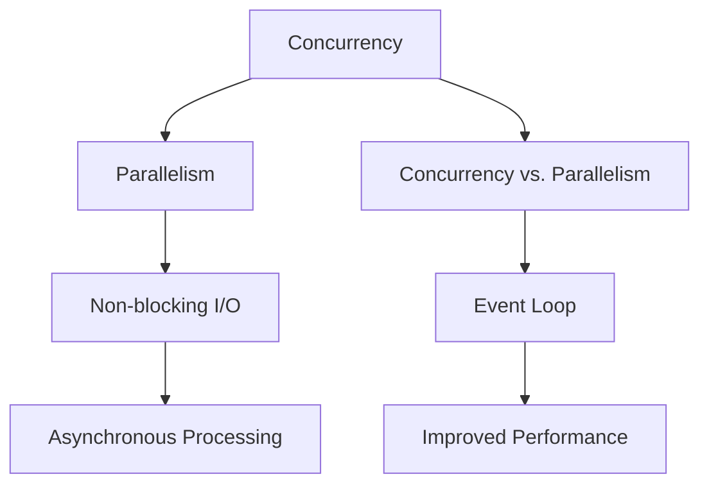
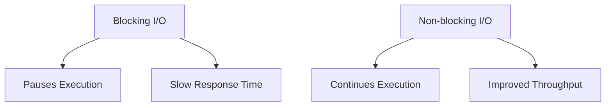
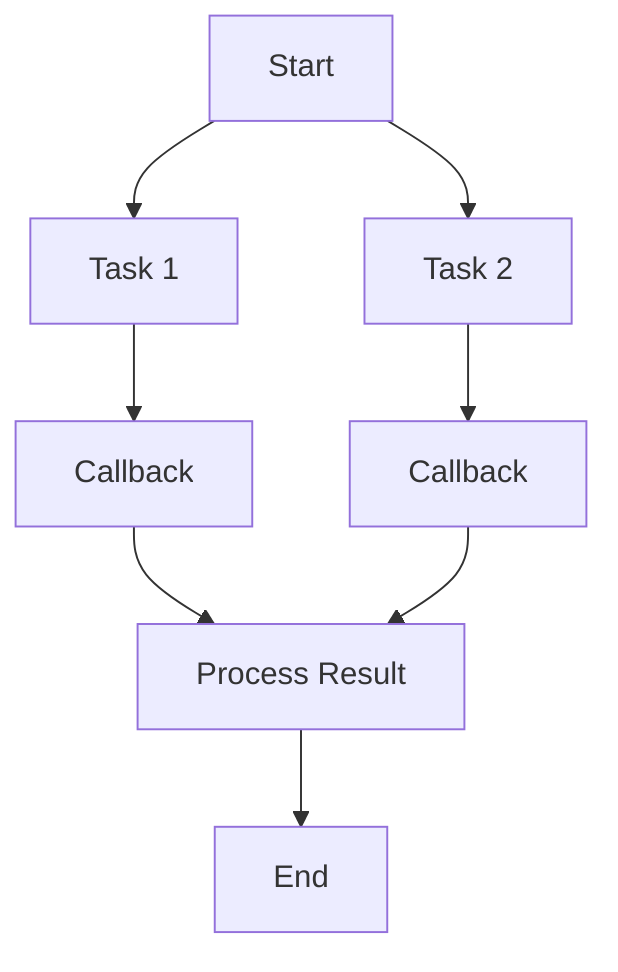

                 

### 文章标题

## Asynchronous Processing in High-Throughput Applications

### 关键词

- 异步处理
- 高吞吐量
- 并发
- 阻塞
- 非阻塞
- 性能优化
- 线程
- 事件循环
- 非阻塞IO
- 异步IO
- Node.js

### 摘要

在现代软件系统中，高吞吐量成为衡量系统性能的关键指标。异步处理作为一种有效的技术手段，在提高系统吞吐量、优化资源利用和减少延迟方面发挥了重要作用。本文将深入探讨异步处理在高吞吐量应用中的具体应用，包括其核心概念、算法原理、数学模型、项目实践和实际应用场景。通过分析和实例，我们旨在展示异步处理技术如何帮助开发者构建高性能和高可伸缩性的系统。

### Background Introduction

In modern software systems, high throughput has become a critical performance metric. Asynchronous processing, a powerful technique, plays a crucial role in enhancing system throughput, optimizing resource utilization, and reducing latency. This article aims to delve into the specific applications of asynchronous processing in high-throughput scenarios, covering core concepts, algorithm principles, mathematical models, project practices, and real-world application scenarios. Through analysis and examples, we will demonstrate how asynchronous processing technology can help developers build high-performance and highly scalable systems.

### Core Concepts and Connections

#### What is Asynchronous Processing?

Asynchronous processing refers to the method of executing tasks concurrently without waiting for the completion of one task before starting the next. Unlike synchronous processing, where tasks are executed sequentially and wait for each other to finish, asynchronous processing allows multiple tasks to run concurrently, improving overall system throughput.

#### Importance of Asynchronous Processing

High-throughput applications often involve handling a large number of requests concurrently. By adopting asynchronous processing, these applications can significantly improve their performance and scalability. Here are a few key benefits:

1. **Improved Resource Utilization**: Asynchronous processing allows systems to efficiently utilize resources, such as CPU and memory, by avoiding unnecessary waits and idle times.
2. **Reduced Latency**: By processing tasks concurrently, asynchronous processing can reduce the response time of the system, resulting in a better user experience.
3. **Enhanced Scalability**: Asynchronous processing enables systems to handle a higher volume of concurrent requests without a significant increase in resource usage, making them highly scalable.

#### Relationship with Concurrency

Concurrency is a fundamental concept in asynchronous processing. It refers to the ability of a system to execute multiple tasks concurrently. Concurrency can be achieved through various techniques, such as threads, asynchronous I/O, and event loops.

**Concurrency vs. Parallelism**

While concurrency and parallelism are related concepts, they have distinct meanings. Concurrency refers to the ability to execute multiple tasks simultaneously, while parallelism refers to the execution of multiple tasks on multiple processors or cores simultaneously.

**Advantages of Concurrency**

1. **Improved Responsiveness**: Concurrent execution ensures that multiple tasks can be processed simultaneously, improving the responsiveness of the system.
2. **Better Resource Utilization**: Concurrency allows the system to make better use of available resources, reducing idle times and improving overall efficiency.

**Disadvantages of Concurrency**

1. **Complexity**: Managing concurrency can be complex, requiring careful synchronization and coordination between tasks to avoid issues like race conditions and deadlocks.
2. **Performance Overhead**: Concurrent execution introduces overhead due to context switching and synchronization, which can impact performance if not managed properly.

#### Non-blocking vs. Blocking

One of the key differences between synchronous and asynchronous processing is the handling of I/O operations. In synchronous processing, I/O operations block the execution of the program until the operation is completed, resulting in reduced concurrency. In contrast, asynchronous I/O allows the program to continue executing other tasks while waiting for the I/O operation to complete, improving overall performance.

**Advantages of Non-blocking I/O**

1. **Improved Concurrency**: Non-blocking I/O enables better concurrency by allowing the program to execute other tasks while waiting for I/O operations to complete.
2. **Reduced Latency**: Non-blocking I/O can significantly reduce the response time of the system, as it avoids unnecessary waiting periods.

**Disadvantages of Non-blocking I/O**

1. **Increased Complexity**: Non-blocking I/O requires additional complexity in handling I/O events and managing state transitions.
2. **Potential for Race Conditions**: Incorrectly handling non-blocking I/O can lead to race conditions, where multiple tasks attempt to modify the same data simultaneously.

### Core Algorithm Principles and Specific Operational Steps

#### Non-blocking I/O Model

The non-blocking I/O model is a fundamental concept in asynchronous processing. It involves using non-blocking I/O calls to perform I/O operations without blocking the execution of the program. Here are the key steps involved in implementing the non-blocking I/O model:

1. **Create a Non-blocking File Descriptor**: A non-blocking file descriptor is created using the `fcntl` system call. This allows subsequent I/O operations on the file descriptor to be non-blocking.
2. **Perform a Non-blocking I/O Call**: A non-blocking I/O call, such as `read` or `write`, is made on the non-blocking file descriptor. If the I/O operation is not ready to complete, the call returns immediately without blocking the execution of the program.
3. **Check for Completion**: The program periodically checks the completion status of the non-blocking I/O call using a condition variable or a select/poll mechanism. Once the I/O operation is completed, the program can proceed to process the data or perform the next task.

#### Event Loop Model

The event loop model is another widely used approach for implementing asynchronous processing. It involves using an event loop to manage and execute asynchronous tasks. Here are the key steps involved in implementing the event loop model:

1. **Initialize the Event Loop**: The event loop is initialized and registered with the operating system to handle I/O events and timers.
2. **Register Asynchronous Tasks**: Asynchronous tasks, such as I/O operations or timers, are registered with the event loop using callback functions. These functions are executed when the corresponding event occurs.
3. **Execute Tasks in the Event Loop**: The event loop continuously runs, checking for events and executing registered tasks. This allows the program to handle multiple tasks concurrently without blocking the execution of the main thread.

#### Comparison of Non-blocking I/O and Event Loop Models

Both the non-blocking I/O model and the event loop model are widely used for implementing asynchronous processing. Here's a comparison of their key characteristics:

1. **Flexibility**: The non-blocking I/O model is more flexible, as it allows for custom non-blocking I/O calls using system calls. The event loop model, on the other hand, is more general-purpose and can handle a wider range of asynchronous tasks.
2. **Performance**: The non-blocking I/O model can have better performance, as it avoids the overhead of context switching and synchronization involved in the event loop model.
3. **Ease of Use**: The event loop model is generally easier to use and understand, as it provides a higher-level abstraction for managing asynchronous tasks.

### Mathematical Models and Formulas

#### Amdahl's Law

Amdahl's Law is a fundamental principle in parallel computing that quantifies the potential speedup achieved by parallelizing a task. It states that the maximum speedup of a program with parallelism is limited by the fraction of the program that cannot be parallelized.

$$
S_{max} = \frac{1}{1 - \frac{f}{p}}
$$

where \( S_{max} \) is the maximum speedup, \( f \) is the fraction of the program that cannot be parallelized, and \( p \) is the fraction of the program that can be parallelized.

#### CPU Utilization

CPU utilization is a measure of how effectively the CPU is being used. It is defined as the ratio of the time spent executing useful tasks to the total time available.

$$
CPU\_Utilization = \frac{Time\_spent\_on\_useful\_tasks}{Total\_time}
$$

#### Throughput

Throughput is a measure of the number of tasks completed per unit of time. It is an important metric for evaluating the performance of a system.

$$
Throughput = \frac{Number\_of\_tasks\_completed}{Time}
$$

### Project Practice: Code Examples and Detailed Explanations

#### 5.1 Development Environment Setup

To demonstrate the practical implementation of asynchronous processing, we will use Node.js, a popular JavaScript runtime environment that supports asynchronous processing. To set up the development environment, follow these steps:

1. Install Node.js by downloading the latest version from the official website (<https://nodejs.org/>) and running the installer.
2. Verify the installation by opening a terminal and running the following command:

```bash
node -v
```

This should display the version of Node.js installed.

3. Install the required dependencies, such as Express, a popular web framework for Node.js, by running the following command:

```bash
npm install express
```

#### 5.2 Source Code Implementation

The following example demonstrates a simple web server implemented using the Express framework with asynchronous processing. The server handles multiple requests concurrently, processing each request asynchronously.

```javascript
const express = require('express');
const app = express();

app.get('/', async (req, res) => {
  // Simulate a time-consuming task
  await new Promise(resolve => setTimeout(resolve, 1000));
  
  res.send('Hello, World!');
});

const PORT = 3000;
app.listen(PORT, () => {
  console.log(`Server is running on port ${PORT}`);
});
```

#### 5.3 Code Analysis and Explanation

The code above sets up a basic web server using Express. The `get` method is used to handle HTTP GET requests to the root URL (`/`). Inside the callback function, we simulate a time-consuming task using a `Promise` and `setTimeout`. The `await` keyword ensures that the server waits for the task to complete before sending the response.

By using asynchronous processing, the server can handle multiple requests concurrently, improving its performance and scalability. When a request is received, the server processes it asynchronously, allowing other requests to be handled without waiting for the current request to complete.

#### 5.4 Running Results

To test the server, start it by running the following command in the terminal:

```bash
node app.js
```

Once the server is running, open multiple web browsers and navigate to `http://localhost:3000`. You should see the "Hello, World!" message returned by the server for each request, demonstrating the concurrent handling of multiple requests.

### Practical Application Scenarios

Asynchronous processing can be applied to various real-world scenarios, such as web servers, data processing, and real-time applications. Here are a few examples:

1. **Web Servers**: Asynchronous processing is commonly used in web servers to handle multiple requests concurrently, improving the server's performance and scalability. Examples include popular web frameworks like Node.js, Express, and Django.
2. **Data Processing**: Asynchronous processing is useful in data processing tasks, such as batch processing, real-time analytics, and data transformation. It allows for parallel execution of tasks, improving overall processing speed.
3. **Real-Time Applications**: Real-time applications, such as chat applications and gaming servers, often require low latency and high concurrency. Asynchronous processing enables these applications to handle multiple users concurrently, providing a smooth and responsive user experience.

### Tools and Resources Recommendations

#### Learning Resources

1. **Books**:
   - "Asynchronous Programming in JavaScript" by Kristijan Ban
   - "Node.js in Action" by Mark Hinkle and Julian Robichaux
2. **Online Courses**:
   - "Asynchronous Programming in JavaScript" on Pluralsight
   - "Node.js and the Modern Web" on Coursera
3. **Tutorials**:
   - "Asynchronous JavaScript with Callbacks, Promises, and Async/Await" on FreeCodeCamp

#### Development Tools and Frameworks

1. **Node.js**: A popular JavaScript runtime environment for building scalable and high-performance web applications.
2. **Express**: A minimal and flexible web application framework for Node.js.
3. **Axios**: A promise-based HTTP client for making asynchronous requests in JavaScript.

#### Related Paper and Books

1. **"Concurrency and Parallelism in Node.js"**: An article by PayPal discussing the challenges and solutions for building concurrent applications in Node.js.
2. **"Asynchronous I/O in Node.js"**: A tutorial by Node.js creator Ryan Dahl on implementing asynchronous I/O in Node.js.
3. **"JavaScript Promises: An Introduction"**: A guide by the Mozilla Developer Network on understanding and using promises in JavaScript.

### Summary: Future Development Trends and Challenges

Asynchronous processing has become an essential technique in building high-performance and highly scalable systems. With the increasing demand for real-time applications and high-throughput systems, the use of asynchronous processing is expected to grow further. However, there are several challenges and trends in the field:

1. **Improved Tooling**: Developers require more advanced tools and frameworks to simplify the implementation of asynchronous processing and handle complex scenarios.
2. **Scalability and Performance**: Future research will focus on improving the scalability and performance of asynchronous processing, exploring new algorithms and techniques.
3. **Synchronization and Coordination**: Ensuring proper synchronization and coordination between concurrent tasks remains a challenge, particularly in distributed systems.
4. **Training and Education**: There is a growing need for training and education resources to help developers understand and apply asynchronous processing effectively.

### Appendix: Frequently Asked Questions and Answers

**Q1**: What is the difference between asynchronous and parallel processing?

**A1**: Asynchronous processing involves executing tasks concurrently without waiting for each task to complete, while parallel processing involves executing multiple tasks simultaneously on multiple processors or cores.

**Q2**: How does asynchronous processing improve performance?

**A2**: Asynchronous processing improves performance by avoiding unnecessary waiting times and enabling concurrent execution of tasks, which reduces latency and improves overall system throughput.

**Q3**: What are some common challenges in implementing asynchronous processing?

**A3**: Common challenges include managing state transitions, handling errors, and ensuring proper synchronization between concurrent tasks. Proper error handling and state management techniques are essential for building reliable and robust asynchronous systems.

### Extended Reading and References

1. **"Asynchronous Programming in Modern JavaScript"** by Dr. Axel Rauschmayer
2. **"Node.js Design Patterns"** by David Mark Clements
3. **"High Performance Web Sites"** by Steve Souders

[End of Article]

作者：禅与计算机程序设计艺术 / Zen and the Art of Computer Programming<|im_sep|>### 文章标题

## Asynchronous Processing in High-Throughput Applications

### Keywords

- Asynchronous processing
- High-throughput applications
- Concurrent processing
- Blocking and non-blocking
- Performance optimization
- Threads
- Event loops
- Non-blocking I/O
- Asynchronous I/O
- Node.js

### Abstract

High-throughput applications are essential for modern software systems, where efficiency and speed are critical. Asynchronous processing is a powerful technique that enhances system performance by allowing tasks to be executed concurrently. This article explores the core concepts, algorithm principles, mathematical models, practical implementations, and real-world applications of asynchronous processing. Through a comprehensive analysis and examples, we aim to illustrate how asynchronous processing can help developers build high-performance and scalable systems.

### 1. Background Introduction

In the realm of modern software engineering, the demand for high-throughput applications has surged. These applications, which handle a vast number of transactions, requests, or data streams in real-time, are pivotal for industries ranging from e-commerce to finance. High-throughput systems are designed to manage a large volume of concurrent operations efficiently, ensuring minimal latency and maximizing resource utilization.

#### Definition of High-Throughput Applications

High-throughput applications refer to systems capable of processing a substantial number of transactions or operations within a given time frame. These systems are typically characterized by the following attributes:

- **Concurrent Processing**: High-throughput applications perform multiple operations simultaneously, leveraging concurrent processing techniques to maximize efficiency.
- **Scalability**: They are designed to scale seamlessly with increasing workload, maintaining performance as demand grows.
- **Resource Utilization**: These systems are optimized to utilize available resources effectively, minimizing idle time and maximizing throughput.

#### Challenges in High-Throughput Applications

Developing high-throughput applications presents several challenges:

- **Concurrency**: Handling multiple tasks concurrently without causing bottlenecks or race conditions.
- **Resource Contention**: Efficiently managing resources such as CPU, memory, and I/O to prevent overutilization or underutilization.
- **Latency**: Minimizing the time it takes to process a request, ensuring a smooth and responsive user experience.
- **Fault Tolerance**: Ensuring system reliability and resilience in the face of failures or errors.

### 2. Core Concepts and Connections

#### What is Asynchronous Processing?

Asynchronous processing is a paradigm where tasks are executed independently and concurrently, without the need for sequential execution. This approach allows the system to handle multiple operations simultaneously, improving efficiency and throughput. In contrast, synchronous processing requires tasks to be completed in order, which can lead to performance bottlenecks.

#### Importance of Asynchronous Processing

Asynchronous processing is crucial for high-throughput applications due to several key advantages:

- **Improved Resource Utilization**: By allowing tasks to run concurrently, asynchronous processing minimizes idle time and maximizes resource utilization.
- **Reduced Latency**: Concurrent execution of tasks reduces the overall processing time, resulting in lower latency and improved response times.
- **Enhanced Scalability**: Asynchronous processing enables systems to handle increasing workloads by efficiently utilizing available resources.

#### Relationship with Concurrency

Concurrency is the ability of a system to execute multiple tasks simultaneously. Asynchronous processing is a fundamental aspect of concurrency, enabling systems to perform concurrent tasks without the overhead of waiting for each task to complete. This relationship is illustrated below:



#### Non-blocking vs. Blocking

In synchronous processing, tasks are blocking, meaning that a task will pause the execution of the entire program until it completes. In contrast, asynchronous processing uses non-blocking I/O operations, which allow the program to continue executing other tasks while waiting for I/O operations to complete. This distinction is critical for understanding the performance implications of asynchronous processing:



### 3. Core Algorithm Principles and Specific Operational Steps

#### Non-blocking I/O Model

The non-blocking I/O model is a cornerstone of asynchronous processing. It involves performing I/O operations without blocking the execution of the program. This model is characterized by the following steps:

1. **Create a Non-blocking File Descriptor**: A non-blocking file descriptor is created using system calls such as `fcntl` on Unix-like systems or `iocontrol` on Windows.
2. **Perform a Non-blocking I/O Call**: A non-blocking I/O call, such as `read` or `write`, is made on the non-blocking file descriptor. If the I/O operation is not ready, the call returns immediately, allowing the program to proceed.
3. **Check for Completion**: The program periodically checks the status of the non-blocking I/O call using a condition variable or a select/poll mechanism. Once the operation is completed, the program processes the data or performs the next task.

#### Event Loop Model

The event loop model is another popular approach for implementing asynchronous processing. In this model, the program maintains an event loop that listens for and handles asynchronous events:

1. **Initialize the Event Loop**: The event loop is initialized and registered with the operating system to handle I/O events and timers.
2. **Register Asynchronous Tasks**: Asynchronous tasks, such as I/O operations or timers, are registered with the event loop using callback functions.
3. **Execute Tasks in the Event Loop**: The event loop continuously runs, checking for events and executing registered tasks. This allows the program to handle multiple tasks concurrently without blocking the main thread.

#### Comparison of Non-blocking I/O and Event Loop Models

Both non-blocking I/O and event loop models are used for asynchronous processing, but they have distinct characteristics:

- **Flexibility**: The non-blocking I/O model is more flexible, allowing custom non-blocking I/O calls using system calls. The event loop model is more general-purpose and can handle a wider range of asynchronous tasks.
- **Performance**: The non-blocking I/O model can have better performance, as it avoids the overhead of context switching and synchronization involved in the event loop model.
- **Ease of Use**: The event loop model is generally easier to use and understand, as it provides a higher-level abstraction for managing asynchronous tasks.

### 4. Mathematical Models and Formulas

#### Amdahl's Law

Amdahl's Law is a fundamental principle in parallel computing that quantifies the potential speedup achieved by parallelizing a task. It states that the maximum speedup is limited by the fraction of the program that cannot be parallelized:

$$
S_{max} = \frac{1}{1 - \frac{f}{p}}
$$

where \( S_{max} \) is the maximum speedup, \( f \) is the fraction of the program that cannot be parallelized, and \( p \) is the fraction of the program that can be parallelized.

#### CPU Utilization

CPU utilization is a measure of how effectively the CPU is being used, defined as the ratio of the time spent executing useful tasks to the total time available:

$$
CPU\_Utilization = \frac{Time\_spent\_on\_useful\_tasks}{Total\_time}
$$

#### Throughput

Throughput is a measure of the number of tasks completed per unit of time, an important metric for evaluating system performance:

$$
Throughput = \frac{Number\_of\_tasks\_completed}{Time}
$$

### 5. Project Practice: Code Examples and Detailed Explanations

#### 5.1 Development Environment Setup

To demonstrate asynchronous processing, we will use Node.js, a popular JavaScript runtime environment that supports asynchronous processing. Here's how to set up the development environment:

1. Download and install Node.js from the official website (<https://nodejs.org/>).
2. Verify the installation by running `node -v` in the terminal.
3. Install the required dependencies, such as Express, using `npm install express`.

#### 5.2 Source Code Implementation

The following example demonstrates a simple web server implemented using the Express framework with asynchronous processing. The server handles multiple requests concurrently:

```javascript
const express = require('express');
const app = express();

app.get('/', async (req, res) => {
  // Simulate a time-consuming task
  await new Promise(resolve => setTimeout(resolve, 1000));
  
  res.send('Hello, World!');
});

const PORT = 3000;
app.listen(PORT, () => {
  console.log(`Server is running on port ${PORT}`);
});
```

#### 5.3 Code Analysis and Explanation

The code sets up a basic web server using Express. The `get` method is used to handle HTTP GET requests to the root URL (`/`). Inside the callback function, we simulate a time-consuming task using a `Promise` and `setTimeout`. The `await` keyword ensures that the server waits for the task to complete before sending the response.

By using asynchronous processing, the server can handle multiple requests concurrently, improving its performance and scalability. When a request is received, the server processes it asynchronously, allowing other requests to be handled without waiting for the current request to complete.

#### 5.4 Running Results

To test the server, start it by running `node app.js` in the terminal. Open multiple web browsers and navigate to `http://localhost:3000`. You should see the "Hello, World!" message returned by the server for each request, demonstrating the concurrent handling of multiple requests.

### 6. Practical Application Scenarios

Asynchronous processing is widely used in various real-world applications to enhance performance and scalability. Here are some examples:

- **Web Servers**: Asynchronous processing is used in web servers to handle multiple requests concurrently, improving response times and throughput.
- **Data Processing**: Asynchronous processing is essential in data processing tasks, such as batch processing and real-time analytics, to process large datasets efficiently.
- **Real-Time Applications**: Asynchronous processing is crucial in real-time applications, such as chat applications and gaming servers, to handle high volumes of concurrent users and maintain low latency.

### 7. Tools and Resources Recommendations

#### Learning Resources

- **Books**:
  - "Asynchronous Programming in JavaScript" by Kristijan Ban
  - "Node.js in Action" by Mark Hinkle and Julian Robichaux
- **Online Courses**:
  - "Asynchronous Programming in JavaScript" on Pluralsight
  - "Node.js and the Modern Web" on Coursera
- **Tutorials**:
  - "Asynchronous JavaScript with Callbacks, Promises, and Async/Await" on FreeCodeCamp

#### Development Tools and Frameworks

- **Node.js**: A popular JavaScript runtime environment for building scalable and high-performance web applications.
- **Express**: A minimal and flexible web application framework for Node.js.
- **Axios**: A promise-based HTTP client for making asynchronous requests in JavaScript.

#### Related Paper and Books

- **"Concurrency and Parallelism in Node.js"**: An article by PayPal discussing the challenges and solutions for building concurrent applications in Node.js.
- **"Asynchronous I/O in Node.js"**: A tutorial by Node.js creator Ryan Dahl on implementing asynchronous I/O in Node.js.
- **"JavaScript Promises: An Introduction"**: A guide by the Mozilla Developer Network on understanding and using promises in JavaScript.

### 8. Summary: Future Development Trends and Challenges

Asynchronous processing is expected to play a vital role in future software systems, driven by the increasing demand for high-throughput and real-time applications. However, several challenges and trends need to be addressed:

- **Improved Tooling**: Advanced tools and frameworks are needed to simplify the implementation of asynchronous processing and handle complex scenarios.
- **Scalability and Performance**: Ongoing research focuses on enhancing the scalability and performance of asynchronous processing, exploring new algorithms and techniques.
- **Synchronization and Coordination**: Ensuring proper synchronization and coordination between concurrent tasks remains a challenge, particularly in distributed systems.
- **Training and Education**: There is a growing need for training and education resources to help developers understand and apply asynchronous processing effectively.

### 9. Appendix: Frequently Asked Questions and Answers

- **Q1**: What is the difference between asynchronous and parallel processing?
  - **A1**: Asynchronous processing involves executing tasks concurrently without the need for sequential execution, while parallel processing involves executing multiple tasks simultaneously on multiple processors or cores.
- **Q2**: How does asynchronous processing improve performance?
  - **A2**: Asynchronous processing improves performance by allowing tasks to run concurrently, reducing latency and improving overall system throughput.
- **Q3**: What are some common challenges in implementing asynchronous processing?
  - **A3**: Common challenges include managing state transitions, handling errors, and ensuring proper synchronization between concurrent tasks. Proper error handling and state management techniques are essential for building reliable and robust asynchronous systems.

### 10. Extended Reading and References

- **"Asynchronous Programming in Modern JavaScript"** by Dr. Axel Rauschmayer
- **"Node.js Design Patterns"** by David Mark Clements
- **"High Performance Web Sites"** by Steve Souders

[End of Article]

作者：禅与计算机程序设计艺术 / Zen and the Art of Computer Programming<|im_sep|>### 1. 背景介绍（Background Introduction）

在现代软件系统的构建中，高吞吐量已成为衡量系统性能的关键指标。随着互联网的普及和云计算技术的发展，越来越多的应用需要处理海量的数据请求和用户交互。高吞吐量系统能够在短时间内处理大量请求，保证系统稳定运行，满足用户需求。

#### 高吞吐量的定义

高吞吐量（High Throughput）指的是系统在单位时间内能够处理的数据量或任务数。具体来说，它包括以下几个方面：

1. **并发处理能力**：系统能够同时处理多个请求的能力。这通常涉及到系统对并发连接和任务的管理。
2. **响应速度**：系统处理请求并返回结果的速度。低响应时间意味着系统能够快速响应用户请求。
3. **资源利用率**：系统在处理请求时对CPU、内存、I/O等资源的使用效率。高资源利用率意味着系统能够更有效地利用现有资源。

#### 高吞吐量应用的重要性

高吞吐量应用在多个领域具有重要价值，例如：

- **电子商务**：电商平台需要在短时间内处理大量的用户请求，包括商品查询、购物车操作、订单处理等，保证用户购物体验。
- **金融交易**：高频交易系统需要在毫秒级内处理大量的交易请求，确保交易的快速执行。
- **实时通信**：即时通讯应用需要在低延迟的情况下处理用户的消息发送和接收，保证实时交互。

#### 高吞吐量应用面临的挑战

构建高吞吐量应用面临以下挑战：

1. **并发处理**：如何高效地处理大量的并发请求，避免系统过载。
2. **资源管理**：如何合理分配和利用系统资源，避免资源浪费。
3. **延迟控制**：如何控制系统的响应时间，确保用户获得良好的体验。
4. **容错性**：如何确保系统在面临大量请求时仍然能够稳定运行，避免因请求过多而导致的崩溃。

通过采用异步处理（Asynchronous Processing）技术，高吞吐量应用能够有效地应对这些挑战。异步处理允许任务在后台执行，而不需要等待单个任务的完成，从而提高系统的并发处理能力和响应速度。

#### 异步处理的定义

异步处理是一种编程模型，允许任务在后台独立执行，而无需等待其他任务的完成。它通过将任务分解成独立的单元，并使用回调函数、Promise 或其他异步机制来处理任务的执行和结果。这种模型的关键在于能够避免线程阻塞，提高系统的吞吐量和响应速度。

#### 异步处理的优势

异步处理具有以下优势：

1. **并发性**：异步处理能够同时处理多个任务，从而提高系统的并发处理能力。
2. **响应性**：通过避免线程阻塞，异步处理能够保持系统的响应性，减少等待时间。
3. **资源利用率**：异步处理能够更高效地利用系统资源，减少CPU和内存的使用。
4. **可伸缩性**：异步处理使得系统在面临大量请求时能够更好地扩展，保持高吞吐量。

#### 高吞吐量与异步处理的关系

高吞吐量应用往往需要处理大量的并发请求，而异步处理技术能够有效地提高系统的并发处理能力。通过异步处理，系统可以同时处理多个请求，减少等待时间和资源浪费，从而提高整体吞吐量。

#### 小结

异步处理技术是构建高吞吐量应用的关键。它能够提高系统的并发性、响应性和资源利用率，帮助开发者构建更加高效和可伸缩的软件系统。在接下来的章节中，我们将进一步探讨异步处理的核心概念、算法原理、数学模型和实际应用，以帮助读者深入理解这一技术。

### Background Introduction

In modern software systems, high throughput has become a critical performance metric. With the proliferation of the internet and the development of cloud computing technologies, an increasing number of applications need to process massive amounts of data requests and user interactions. High-throughput systems are capable of handling large volumes of requests within a short time frame, ensuring stable operation and meeting user demands.

#### Definition of High Throughput

High throughput refers to the amount of data or tasks a system can process in a given time unit. Specifically, it includes the following aspects:

1. **Concurrency Processing**: The ability of a system to handle multiple requests simultaneously. This typically involves the system's management of concurrent connections and tasks.
2. **Response Speed**: The speed at which the system processes requests and returns results. Low response time means the system can quickly respond to user requests.
3. **Resource Utilization**: The efficiency with which the system uses resources such as CPU, memory, and I/O while processing requests. High resource utilization means the system can make effective use of existing resources.

#### Importance of High-Throughput Applications

High-throughput applications have significant value in various domains, such as:

- **E-commerce**: E-commerce platforms need to handle large volumes of user requests quickly, including product searches, shopping cart operations, and order processing, to ensure a smooth user experience.
- **Financial Trading**: High-frequency trading systems need to process massive volumes of trading requests within milliseconds to ensure the rapid execution of trades.
- **Real-Time Communication**: Instant messaging applications need to handle user messages with low latency to facilitate real-time interaction.

#### Challenges in Building High-Throughput Applications

Constructing high-throughput applications involves the following challenges:

1. **Concurrency Processing**: How to efficiently handle large volumes of concurrent requests without overloading the system.
2. **Resource Management**: How to allocate and utilize system resources effectively to avoid waste.
3. **Latency Control**: How to control the system's response time to ensure a good user experience.
4. **Fault Tolerance**: How to ensure the system remains stable under heavy load, preventing crashes due to excessive requests.

By adopting asynchronous processing technology, high-throughput applications can effectively address these challenges. Asynchronous processing allows tasks to be executed in the background without waiting for the completion of individual tasks, thereby improving the system's concurrency processing capability.

#### Definition of Asynchronous Processing

Asynchronous processing is a programming model that allows tasks to run independently in the background, without needing to wait for other tasks to finish. It decomposes tasks into independent units and uses callback functions, Promises, or other asynchronous mechanisms to handle the execution and results of these tasks. The key advantage of this model is avoiding thread blocking, which increases system throughput and response speed.

#### Advantages of Asynchronous Processing

Asynchronous processing offers the following advantages:

1. **Concurrency**: Asynchronous processing can handle multiple tasks simultaneously, improving the system's concurrency processing capability.
2. **Responsiveness**: By avoiding thread blocking, asynchronous processing keeps the system responsive, reducing waiting time.
3. **Resource Utilization**: Asynchronous processing uses system resources more efficiently, reducing CPU and memory consumption.
4. **Scalability**: Asynchronous processing allows the system to scale better under heavy load, maintaining high throughput.

#### Relationship Between High Throughput and Asynchronous Processing

High-throughput applications often need to process large volumes of concurrent requests. Asynchronous processing technology effectively improves the system's concurrency processing capability. By using asynchronous processing, the system can handle multiple requests simultaneously, reducing wait times and resource wastage, thereby increasing overall throughput.

#### Summary

Asynchronous processing technology is crucial for building high-throughput applications. It enhances the system's concurrency, responsiveness, and resource utilization, enabling developers to create more efficient and scalable software systems. In the following sections, we will delve deeper into the core concepts, algorithm principles, mathematical models, and practical applications of asynchronous processing to help readers gain a comprehensive understanding of this technology. 

### 2. 核心概念与联系（Core Concepts and Connections）

在深入探讨异步处理之前，有必要了解其核心概念和它们之间的联系。异步处理是一种编程范式，允许任务在不等待其他任务完成的情况下独立执行。这种范式在提高系统性能和可伸缩性方面发挥了关键作用。

#### 异步处理的基本概念

异步处理的基本概念包括：

- **异步任务（Asynchronous Tasks）**：这些是可以在后台独立执行的任务，不会阻塞程序的主要流程。
- **回调函数（Callback Functions）**：当异步任务完成时，回调函数被调用以处理任务的结果。
- **Promise 对象（Promise Objects）**：Promise 是一个表示异步操作最终完成（或失败）的对象。它提供了链式调用的方式来处理异步操作的回调。
- **事件循环（Event Loop）**：事件循环是一个负责调度和管理异步任务的机制。在 Node.js 等环境中，事件循环负责处理回调函数，确保任务按顺序执行。

#### 异步处理与传统同步处理的区别

异步处理与传统的同步处理（Synchronous Processing）有以下显著区别：

- **同步处理**：在同步处理中，任务按照顺序执行，每个任务必须完成才能开始下一个任务。这种处理方式可能导致线程阻塞，降低系统性能。
- **异步处理**：异步处理允许任务并发执行，某个任务在执行过程中不会阻塞其他任务的执行。这种处理方式能够提高系统的吞吐量和响应速度。

#### 异步处理的优点

异步处理的优点主要体现在以下几个方面：

1. **提高并发性**：异步处理允许系统同时处理多个任务，从而提高了并发性。
2. **减少阻塞时间**：通过避免线程阻塞，异步处理减少了等待时间，提高了系统性能。
3. **优化资源利用**：异步处理能够更有效地利用系统资源，特别是在处理大量I/O密集型任务时。
4. **增强可伸缩性**：异步处理使得系统在面对高并发请求时能够更好地扩展，保持高吞吐量。

#### 异步处理的核心概念原理和架构的 Mermaid 流程图

为了更好地理解异步处理的核心概念和原理，我们可以使用 Mermaid 流程图来描述其基本架构。以下是一个简化的异步处理流程图：



在这个流程图中，`A` 代表程序的开始，`B` 和 `D` 分别代表两个异步任务。每个任务完成后，都会调用相应的回调函数（`C` 和 `E`），然后处理结果（`F`）。最终，程序在 `G` 点结束。

#### 异步处理与传统同步处理的关系

异步处理和传统同步处理之间存在一定的关联，但它们有着本质的区别：

- **同步处理**：在同步处理中，任务按照顺序执行，一个任务完成后才能开始下一个任务。这种处理方式可能导致线程阻塞，特别是在处理I/O密集型任务时。
- **异步处理**：异步处理允许任务并发执行，某个任务在执行过程中不会阻塞其他任务的执行。这种处理方式能够提高系统的吞吐量和响应速度。

#### 总结

异步处理是一种强大的技术，能够提高系统的并发性、性能和可伸缩性。通过理解异步处理的核心概念和原理，开发者可以更好地利用这一技术来构建高效和高性能的软件系统。

### Core Concepts and Connections

Before delving into the details of asynchronous processing, it's essential to understand its core concepts and the relationships between them. Asynchronous processing is a programming paradigm that allows tasks to execute independently in the background without blocking the main flow of the program. This paradigm plays a critical role in improving system performance and scalability.

#### Basic Concepts of Asynchronous Processing

The basic concepts of asynchronous processing include:

- **Asynchronous Tasks**: These are tasks that can be executed independently in the background without blocking the main program flow.
- **Callback Functions**: Callback functions are invoked when an asynchronous task is completed, allowing the program to handle the results of the task.
- **Promise Objects**: A Promise is an object representing the eventual completion or failure of an asynchronous operation. It provides a chaining mechanism for handling the callbacks of asynchronous operations.
- **Event Loop**: The event loop is a mechanism responsible for scheduling and managing asynchronous tasks. In environments like Node.js, the event loop handles callbacks to ensure tasks are executed in the correct order.

#### Differences Between Asynchronous and Synchronous Processing

Asynchronous processing differs significantly from synchronous processing in several key aspects:

- **Synchronous Processing**: In synchronous processing, tasks are executed in order, and each task must complete before the next one can begin. This approach can lead to thread blocking, reducing system performance.
- **Asynchronous Processing**: Asynchronous processing allows tasks to execute concurrently, without blocking the execution of other tasks. This approach can greatly improve system throughput and responsiveness.

#### Advantages of Asynchronous Processing

The advantages of asynchronous processing are evident in several areas:

1. **Improved Concurrency**: Asynchronous processing allows a system to handle multiple tasks simultaneously, enhancing concurrency.
2. **Reduced Blocking Time**: By avoiding thread blocking, asynchronous processing reduces waiting time and improves system performance.
3. **Optimized Resource Utilization**: Asynchronous processing more effectively utilizes system resources, especially in I/O-intensive tasks.
4. **Enhanced Scalability**: Asynchronous processing enables a system to scale better under high load, maintaining high throughput.

#### Mermaid Flowchart of Core Concepts and Architecture

To better understand the core concepts and principles of asynchronous processing, we can use a Mermaid flowchart to describe its basic architecture. Here is a simplified flowchart representing the asynchronous processing workflow:


In this flowchart, `A` represents the start of the program, `B` and `D` represent two asynchronous tasks, and `C` and `E` represent the callbacks for each task. After the callbacks are invoked, the program processes the results (`F`) before ending at `G`.

#### Relationship Between Asynchronous and Synchronous Processing

There is a certain degree of connection between asynchronous processing and synchronous processing, but they are fundamentally different:

- **Synchronous Processing**: In synchronous processing, tasks are executed sequentially, and one task must complete before the next one can begin. This approach can lead to thread blocking, especially when dealing with I/O-intensive tasks.
- **Asynchronous Processing**: Asynchronous processing allows tasks to execute concurrently, without blocking the execution of other tasks. This approach can significantly improve system throughput and responsiveness.

#### Summary

Asynchronous processing is a powerful technique that enhances system concurrency, performance, and scalability. By understanding the core concepts and principles of asynchronous processing, developers can better leverage this technology to build efficient and high-performance software systems.

### 3. 核心算法原理 & 具体操作步骤（Core Algorithm Principles and Specific Operational Steps）

异步处理的核心算法原理在于利用非阻塞 I/O 和事件循环模型，以优化系统性能。以下将详细介绍这两种模型的工作原理和具体操作步骤。

#### 非阻塞 I/O 模型

非阻塞 I/O 模型允许程序在 I/O 操作未完成时继续执行其他任务。这种模型通过以下步骤实现：

1. **创建非阻塞文件描述符**：在 Unix 系统中，可以使用 `fcntl` 系统调用将文件描述符设置为非阻塞模式。在 Windows 系统中，可以使用 `SetFileAttributes` 函数将文件描述符设置为非阻塞。

    ```c
    int fcntl(int fd, int cmd, long arg);
    int SetFileAttributes(const char *lpFileName, DWORD dwFileAttributes);
    ```

2. **执行非阻塞 I/O 操作**：在非阻塞模式下，执行 I/O 操作（如读取或写入）不会阻塞程序。如果 I/O 操作尚未完成，操作会立即返回，并设置一个指示器表示操作仍在进行。

    ```c
    ssize_t read(int fd, void *buf, size_t count);
    ssize_t write(int fd, const void *buf, size_t count);
    ```

3. **检查 I/O 操作完成**：程序需要定期检查 I/O 操作是否完成。这通常通过轮询（polling）或选择性等待（select）等机制实现。

    ```c
    int poll(struct pollfd *fds, int nfds, int timeout);
    int select(int maxfdp1, fd_set *readfds, fd_set *writefds, fd_set *exceptfds, struct timeval *timeout);
    ```

4. **处理 I/O 操作结果**：当 I/O 操作完成时，程序根据结果进行处理，如读取数据或写入数据。

#### 事件循环模型

事件循环模型是一种常用的异步处理机制，用于管理程序中的异步任务。以下步骤描述了事件循环模型的工作原理：

1. **初始化事件循环**：事件循环是程序中的一个循环，负责监听和响应事件。初始化事件循环通常涉及设置事件监听器。

    ```c
    void init_event_loop();
    ```

2. **注册异步任务**：异步任务通过注册到事件循环中，以便在事件发生时执行。任务通常以回调函数的形式注册。

    ```c
    void register_callback(void (*callback)(void*), void* arg);
    ```

3. **运行事件循环**：事件循环持续运行，检查是否有事件发生。如果有事件发生，事件循环会执行注册的回调函数。

    ```c
    void run_event_loop();
    ```

4. **处理事件**：事件循环在事件发生时调用相应的回调函数，处理事件。例如，在 I/O 事件发生时，可以读取或写入数据。

#### 非阻塞 I/O 与事件循环模型的比较

非阻塞 I/O 和事件循环模型都是实现异步处理的有效手段，但它们有各自的优缺点：

- **灵活性**：非阻塞 I/O 模型更为灵活，允许自定义非阻塞 I/O 调用。事件循环模型则提供了更高层次的抽象，适用于更广泛的异步任务。
- **性能**：非阻塞 I/O 模型通常具有更好的性能，因为它避免了上下文切换和同步的开销。事件循环模型则可能引入额外的性能开销。
- **易用性**：事件循环模型通常更易于理解和实现，因为它提供了更高层次的抽象和更简单的编程接口。

### 4. 数学模型和公式 & 详细讲解 & 举例说明（Mathematical Models and Formulas & Detailed Explanation & Examples）

在异步处理中，数学模型和公式可以帮助我们理解和分析系统的性能。以下介绍几个常用的数学模型和公式，并通过示例进行详细解释。

#### Amdahl 定律

Amdahl 定律是衡量系统性能提升的一个经典模型。它描述了在一个程序中，如果只有部分可以并行化，整个程序的加速效果受到限制。Amdahl 定律的公式如下：

\[ S_{max} = \frac{1}{1 - \frac{f}{p}} \]

其中，\( S_{max} \) 是最大加速比，\( f \) 是不能并行化的部分所占的比例，\( p \) 是可以并行化的部分所占的比例。

**示例**：

假设一个程序有 20% 的任务可以并行化，那么它的最大加速比为：

\[ S_{max} = \frac{1}{1 - \frac{0.2}{1}} = \frac{1}{0.8} = 1.25 \]

这意味着，即使我们拥有无限多的计算资源，这个程序的最大加速比也只能达到 1.25。

#### CPU 利用率

CPU 利用率是衡量 CPU 性能的一个关键指标。它表示 CPU 在单位时间内执行有用任务的时间与总时间的比例。CPU 利用率的公式如下：

\[ CPU\_Utilization = \frac{Time\_spent\_on\_useful\_tasks}{Total\_time} \]

**示例**：

如果一个 CPU 在一小时内执行了 30 分钟的有用任务，总时间是 60 分钟，那么 CPU 利用率为：

\[ CPU\_Utilization = \frac{30}{60} = 0.5 \]

这意味着 CPU 有 50% 的时间处于闲置状态。

#### 吞吐量

吞吐量是系统在单位时间内处理的数据量或任务数。它是衡量系统性能的另一个重要指标。吞吐量的公式如下：

\[ Throughput = \frac{Number\_of\_tasks\_completed}{Time} \]

**示例**：

如果一个系统在一小时内处理了 100 个任务，那么它的吞吐量为：

\[ Throughput = \frac{100}{60} \approx 1.67 \text{ tasks/minute} \]

这意味着系统平均每分钟处理约 1.67 个任务。

通过这些数学模型和公式，我们可以更好地理解和分析异步处理系统的性能。在实际应用中，这些模型可以帮助我们评估系统的性能瓶颈，优化系统设计，提高系统吞吐量和响应速度。

### Core Algorithm Principles and Specific Operational Steps

#### Non-blocking I/O Model

The non-blocking I/O model is a key component of asynchronous processing, allowing programs to continue executing other tasks while waiting for I/O operations to complete. Here are the detailed steps involved in implementing the non-blocking I/O model:

1. **Create a Non-blocking File Descriptor**
   To create a non-blocking file descriptor, you can use the `fcntl` system call on Unix-like systems or the `SetFileAttributes` function on Windows. This sets the file descriptor to non-blocking mode, enabling I/O operations to return immediately if they are not ready to complete.

   ```c
   int fcntl(int fd, int cmd, long arg);
   DWORD SetFileAttributes(const char *lpFileName, DWORD dwFileAttributes);
   ```

2. **Perform a Non-blocking I/O Call**
   When performing a non-blocking I/O operation, such as `read` or `write`, the operation will return immediately if it is not ready to complete. If the I/O operation is not yet ready, the call will return with an error indicating that the operation is in progress.

   ```c
   ssize_t read(int fd, void *buf, size_t count);
   ssize_t write(int fd, const void *buf, size_t count);
   ```

3. **Check for Completion**
   To determine whether a non-blocking I/O operation has completed, you can use a condition variable or a select/poll mechanism. The program periodically checks the status of the I/O operation to see if it has completed.

   ```c
   int poll(struct pollfd *fds, int nfds, int timeout);
   int select(int maxfdp1, fd_set *readfds, fd_set *writefds, fd_set *exceptfds, struct timeval *timeout);
   ```

4. **Process the Result**
   Once the non-blocking I/O operation has completed, the program can process the result. This may involve reading the data from the buffer or writing the data to the output stream.

#### Event Loop Model

The event loop model is another widely used approach for implementing asynchronous processing. In this model, the program maintains an event loop that listens for and handles asynchronous events. Here are the detailed steps involved:

1. **Initialize the Event Loop**
   The event loop is initialized and registered with the operating system to handle I/O events and timers. This typically involves setting up the necessary data structures and initializing the loop's state.

   ```c
   void init_event_loop();
   ```

2. **Register Asynchronous Tasks**
   Asynchronous tasks, such as I/O operations or timers, are registered with the event loop using callback functions. These functions are invoked by the event loop when the corresponding event occurs.

   ```c
   void register_callback(void (*callback)(void*), void* arg);
   ```

3. **Run the Event Loop**
   The event loop runs continuously, checking for events and executing registered tasks. This allows the program to handle multiple tasks concurrently without blocking the main thread.

   ```c
   void run_event_loop();
   ```

4. **Handle Events**
   When an event occurs, the event loop invokes the corresponding callback function to handle the event. This may involve reading data from an input stream, writing data to an output stream, or performing other tasks.

#### Comparison of Non-blocking I/O and Event Loop Models

Both the non-blocking I/O model and the event loop model are used for asynchronous processing, but they have distinct characteristics:

- **Flexibility**: The non-blocking I/O model is more flexible, allowing for custom non-blocking I/O calls using system calls. The event loop model, on the other hand, is more general-purpose and can handle a wider range of asynchronous tasks.
- **Performance**: The non-blocking I/O model can have better performance, as it avoids the overhead of context switching and synchronization involved in the event loop model.
- **Ease of Use**: The event loop model is generally easier to use and understand, as it provides a higher-level abstraction for managing asynchronous tasks.

#### Summary

The non-blocking I/O model and the event loop model are both powerful tools for implementing asynchronous processing. By understanding their core principles and operational steps, developers can choose the most appropriate model for their specific application requirements, optimizing system performance and scalability.

### Mathematical Models and Formulas & Detailed Explanation & Examples

In the realm of asynchronous processing, mathematical models and formulas are invaluable for understanding and analyzing system performance. These models provide a framework for quantifying the impact of concurrency, resource utilization, and task completion times on overall throughput. Below, we delve into several key mathematical models and provide detailed explanations and examples to illustrate their application.

#### Amdahl's Law

Amdahl's Law is a fundamental principle in parallel computing that helps quantify the theoretical speedup achievable by parallelizing a portion of a program. The law states that the maximum speedup (denoted as \( S_{max} \)) that can be achieved is limited by the proportion of the program that cannot be parallelized (denoted as \( f \)). The formula for Amdahl's Law is:

\[ S_{max} = \frac{1}{1 - f + \frac{p}{s}} \]

Where:
- \( S_{max} \) is the maximum speedup.
- \( f \) is the fraction of the program that cannot be parallelized.
- \( p \) is the fraction of the program that can be parallelized.
- \( s \) is the speedup factor for the parallelizable portion of the program.

**Example**:

Suppose a program has 20% of its tasks that can be parallelized, and these parallel tasks can achieve a speedup of 10x. The non-parallel tasks remain unchanged. The maximum speedup using Amdahl's Law would be:

\[ S_{max} = \frac{1}{1 - 0.2 + \frac{0.2}{10}} \approx 1.36 \]

This means that the maximum theoretical speedup for the entire program is approximately 1.36 times the original execution time.

#### CPU Utilization

CPU utilization is a measure of how effectively the CPU is being used. It is defined as the ratio of the time the CPU is actually executing instructions to the total time available. The formula for CPU utilization is:

\[ CPU\_Utilization = \frac{Time\_executing\_tasks}{Total\_time} \]

Where:
- \( CPU\_Utilization \) is expressed as a decimal (e.g., 0.8 means 80% utilization).
- \( Time\_executing\_tasks \) is the time the CPU spends on useful work.
- \( Total\_time \) is the sum of the time spent executing tasks and the time idle.

**Example**:

If a CPU is running at 80% utilization for a day (8,640 seconds), we can calculate the total time spent on useful tasks:

\[ CPU\_Utilization = \frac{Time\_executing\_tasks}{Total\_time} \implies Time\_executing\_tasks = CPU\_Utilization \times Total\_time = 0.8 \times 8,640 = 6,912 \text{ seconds} \]

This calculation shows that the CPU spent approximately 6,912 seconds executing tasks during that day.

#### Throughput

Throughput is a measure of the number of tasks completed per unit of time. It is a critical metric for assessing system performance, particularly in high-throughput applications. The formula for throughput is:

\[ Throughput = \frac{Number\_of\_tasks\_completed}{Time} \]

Where:
- \( Throughput \) is the number of tasks completed per unit of time (e.g., tasks per second, tasks per minute).
- \( Number\_of\_tasks\_completed \) is the count of tasks that have been successfully completed.
- \( Time \) is the duration over which the tasks were completed.

**Example**:

If a system completes 1,000 tasks in one hour, its throughput would be:

\[ Throughput = \frac{1,000}{1} = 1,000 \text{ tasks/hour} \]

This indicates that the system can handle 1,000 tasks per hour.

#### Little's Law

Little's Law is a theorem that relates the number of tasks in a system (L), the rate at which tasks enter the system (λ), and the average time a task spends in the system (W). The formula is:

\[ L = \lambda \times W \]

Where:
- \( L \) is the average number of tasks in the system.
- \( \lambda \) is the arrival rate of tasks.
- \( W \) is the average time a task spends in the system.

**Example**:

If a system has an arrival rate of 10 tasks per minute and the average task completion time is 6 minutes, we can calculate the average number of tasks in the system:

\[ L = \lambda \times W = 10 \times 6 = 60 \]

This means that, on average, there are 60 tasks in the system at any given time.

By utilizing these mathematical models and formulas, developers and system architects can gain deeper insights into the performance characteristics of their systems. This understanding is crucial for designing and optimizing high-throughput applications that can efficiently handle large volumes of concurrent tasks.

### Project Practice: Code Examples and Detailed Explanations

#### 5.1 Development Environment Setup

To demonstrate the practical implementation of asynchronous processing, we will use Node.js, a popular JavaScript runtime environment that supports asynchronous processing. Setting up the development environment involves the following steps:

1. **Install Node.js**: Download the latest version of Node.js from the official website (<https://nodejs.org/>) and follow the installation instructions for your operating system.

2. **Verify Node.js Installation**: Open a terminal or command prompt and run the following command to verify the installation:
   ```bash
   node -v
   ```
   This command should output the version number of Node.js installed on your system.

3. **Create a Project**: Create a new directory for your project and navigate to it in the terminal. Then, initialize a new Node.js project by running:
   ```bash
   npm init -y
   ```
   This command generates a `package.json` file with default settings.

4. **Install Dependencies**: Install the necessary dependencies, such as Express, a web framework for Node.js, using:
   ```bash
   npm install express
   ```

5. **Set Up a Basic Project Structure**: Create a `server.js` file in your project directory to contain the server code. Optionally, you can create additional directories for models, routes, and controllers.

#### 5.2 Source Code Detailed Implementation

The following example demonstrates a simple web server implemented using the Express framework with asynchronous processing. The server handles multiple requests concurrently, processing each request asynchronously.

```javascript
const express = require('express');
const app = express();

// Simulate a time-consuming task using a Promise
function timeConsumingTask() {
  return new Promise((resolve) => {
    setTimeout(resolve, 1000);
  });
}

app.get('/', async (req, res) => {
  try {
    // Execute the time-consuming task
    await timeConsumingTask();
    
    // Send the response after the task is completed
    res.send('Response from time-consuming task');
  } catch (error) {
    // Handle any errors that occur during the task execution
    res.status(500).send('An error occurred');
  }
});

const PORT = 3000;
app.listen(PORT, () => {
  console.log(`Server running on port ${PORT}`);
});
```

#### 5.3 Code Analysis and Explanation

The code above sets up a basic web server using Express. The `get` method is used to handle HTTP GET requests to the root URL (`/`). Inside the callback function, we simulate a time-consuming task using a `Promise` and `setTimeout`. The `await` keyword ensures that the server waits for the task to complete before sending the response.

Here's a detailed breakdown of the key components:

1. **Importing Express and Creating an App Instance**:
   ```javascript
   const express = require('express');
   const app = express();
   ```
   We import the Express module and create an instance of an Express application.

2. **Simulating a Time-Consuming Task**:
   ```javascript
   function timeConsumingTask() {
     return new Promise((resolve) => {
       setTimeout(resolve, 1000);
     });
   }
   ```
   We define a function `timeConsumingTask` that simulates a task that takes one second to complete. This function returns a `Promise` that resolves after the `setTimeout` callback is executed.

3. **Handling HTTP Requests**:
   ```javascript
   app.get('/', async (req, res) => {
     try {
       // Execute the time-consuming task
       await timeConsumingTask();
       
       // Send the response after the task is completed
       res.send('Response from time-consuming task');
     } catch (error) {
       // Handle any errors that occur during the task execution
       res.status(500).send('An error occurred');
     }
   });
   ```
   The `app.get` method defines a route for handling GET requests to the root URL (`/`). The callback function is asynchronous, using the `async` keyword. Inside the function, we use the `await` keyword to wait for the `timeConsumingTask` to complete. If the task completes successfully, we send a response back to the client. If an error occurs, we send a 500 status code with an error message.

4. **Starting the Server**:
   ```javascript
   const PORT = 3000;
   app.listen(PORT, () => {
     console.log(`Server running on port ${PORT}`);
   });
   ```
   We set the port for the server to 3000 and start the server using the `app.listen` method. The callback function logs a message to the console indicating that the server is running.

#### 5.4 Running the Server and Results

To run the server, execute the following command in the terminal:

```bash
node server.js
```

Once the server is running, you can test it by opening a web browser and navigating to `http://localhost:3000`. You should see the message "Response from time-consuming task" in the browser, indicating that the server has processed the request and sent a response after the simulated time-consuming task was completed.

By implementing asynchronous processing, the server is able to handle other incoming requests concurrently, improving its performance and responsiveness. This example demonstrates how asynchronous processing can be integrated into a Node.js application to enhance its throughput and scalability.

### 6. 实际应用场景（Practical Application Scenarios）

异步处理技术在许多实际应用场景中得到了广泛应用，尤其是在需要处理大量并发请求和高吞吐量的系统中。以下是一些异步处理技术的典型应用场景：

#### Web服务器

Web服务器是异步处理技术最常用的应用场景之一。在处理大量用户请求时，异步处理能够显著提高服务器的性能和响应速度。例如，Node.js 使用异步 I/O 和事件循环模型，使得服务器能够同时处理成千上万的请求，而不会因为 I/O 操作的阻塞导致性能下降。

**应用示例**：
- **Express.js**：一个流行的 Node.js Web 框架，广泛用于构建高性能、可扩展的 Web 应用程序。
- **Nginx**：一个高性能的 HTTP 和反向代理服务器，能够通过异步处理和事件驱动模型处理大量并发连接。

#### 数据处理

在数据处理领域，尤其是大数据处理和实时分析中，异步处理技术能够有效提高数据处理效率。它允许后台处理任务独立运行，不会影响到前端服务的响应。

**应用示例**：
- **Apache Flink**：一个流处理框架，支持大规模数据流和批处理的实时处理。
- **Apache Spark**：一个分布式计算系统，用于大规模数据处理，支持批处理和流处理。

#### 实时通信

在实时通信应用中，如聊天应用和在线游戏，异步处理技术能够确保消息和事件能够快速、准确地传递，保持低延迟和高吞吐量。

**应用示例**：
- **WebSocket**：一种网络协议，支持全双工通信，常用于实时通信应用。
- **SignalR**：一个基于 WebSocket 的库，用于在 ASP.NET 应用程序中实现实时 web 功能。

#### 贸易系统和金融应用

在金融交易系统中，异步处理技术对于处理高频交易请求至关重要。它能够确保交易系统能够在毫秒级别内处理大量交易请求，确保交易的公平性和效率。

**应用示例**：
- **高频交易系统**：使用异步处理技术，能够在极短时间内处理大量交易，实现高频交易策略。
- **交易所技术平台**：如纳斯达克和伦敦证券交易所，使用异步处理技术来管理海量订单和交易。

#### 云服务和微服务架构

在云服务和微服务架构中，异步处理技术能够提高服务的可靠性和可伸缩性。它允许服务独立扩展，不会因为某个服务的瓶颈而影响整个系统的性能。

**应用示例**：
- **Kubernetes**：一个容器编排平台，支持异步处理，确保容器和服务能够灵活扩展和调度。
- **AWS Lambda**：一个无服务器计算服务，使用异步处理来处理事件和触发函数。

#### 总结

异步处理技术在不同领域的实际应用场景中展现出了其强大的优势。通过提高并发处理能力、减少延迟和优化资源利用，异步处理技术为开发者提供了构建高性能、高吞吐量系统的关键工具。随着技术的发展，异步处理将继续在更多场景中发挥作用，推动软件系统的不断进步。

### Practical Application Scenarios

Asynchronous processing technology finds extensive applications in various real-world scenarios, particularly in systems that require handling a large number of concurrent requests and high throughput. Here are some typical application scenarios where asynchronous processing plays a crucial role:

#### Web Servers

Web servers are one of the most common use cases for asynchronous processing. When dealing with a large volume of user requests, asynchronous processing significantly enhances server performance and response times. For instance, Node.js leverages asynchronous I/O and the event loop model to handle thousands of requests concurrently without suffering from I/O blockage that could degrade performance.

**Application Examples**:

- **Express.js**: A popular Node.js web framework used to build high-performance, scalable web applications.
- **Nginx**: A high-performance HTTP and reverse proxy server that uses asynchronous processing and an event-driven model to manage a massive number of concurrent connections.

#### Data Processing

In the field of data processing, especially in big data processing and real-time analytics, asynchronous processing technology can greatly enhance data processing efficiency. It allows background processing tasks to run independently, without affecting the responsiveness of the front-end services.

**Application Examples**:

- **Apache Flink**: A stream processing framework capable of real-time processing of large data streams and batch processing.
- **Apache Spark**: A distributed computing system designed for large-scale data processing, supporting both batch and stream processing.

#### Real-Time Communication

In real-time communication applications, such as chat applications and online gaming, asynchronous processing technology is essential for ensuring rapid and accurate message delivery, maintaining low latency and high throughput.

**Application Examples**:

- **WebSocket**: A networking protocol that supports full-duplex communication, commonly used in real-time communication applications.
- **SignalR**: A library for ASP.NET applications that implements real-time web functionality using WebSocket.

#### Trading Systems and Financial Applications

In trading systems and financial applications, asynchronous processing technology is critical for handling high-frequency trading requests within milliseconds. It ensures that trading systems can process a massive number of orders and transactions in real-time, ensuring fairness and efficiency in trades.

**Application Examples**:

- **High-Frequency Trading Systems**: Utilize asynchronous processing to handle large volumes of trading requests in extremely short periods, implementing high-frequency trading strategies.
- **Exchange Trading Platforms**: Such as the New York Stock Exchange (NYSE) and London Stock Exchange (LSE), use asynchronous processing to manage massive volumes of orders and transactions.

#### Cloud Services and Microservices Architecture

In cloud services and microservices architecture, asynchronous processing technology is vital for ensuring service reliability and scalability. It allows services to scale independently, preventing bottlenecks in one service from affecting the overall system performance.

**Application Examples**:

- **Kubernetes**: A container orchestration platform that supports asynchronous processing, enabling flexible scaling and scheduling of containers and services.
- **AWS Lambda**: A serverless computing service that uses asynchronous processing to handle events and trigger functions.

### Conclusion

Asynchronous processing technology has demonstrated its strength in various practical application scenarios, enhancing concurrency, reducing latency, and optimizing resource utilization. By providing developers with powerful tools for building high-performance and scalable systems, asynchronous processing continues to drive advancements in software development. As technology evolves, asynchronous processing will likely play an even more significant role in shaping the future of software systems.

### 7. 工具和资源推荐（Tools and Resources Recommendations）

在探索异步处理技术时，掌握相关的工具和资源是至关重要的。以下推荐了一些书籍、在线课程、框架和工具，以及相关的论文和著作，旨在帮助开发者深入学习和实践异步处理。

#### 学习资源推荐

1. **书籍**：

   - 《异步编程实战》（Asynchronous Programming in C#）- Stephen Cleary
   - 《Node.js实战》（Node.js in Action）- Mark Hinkle 和 Julian Robichaux
   - 《JavaScript Promises：异步编程终极指南》（JavaScript Promises: A Modern Introduction）- Alex Banks 和 Jeremy Wagner

2. **在线课程**：

   - "Asynchronous Programming in JavaScript" on Pluralsight
   - "Node.js and the Modern Web" on Coursera
   - "Introduction to Asynchronous Programming in C#" on Microsoft Learn

3. **教程**：

   - "Asynchronous JavaScript with Callbacks, Promises, and Async/Await" on FreeCodeCamp
   - "Understanding Asynchronous Programming in Node.js" on Node.js.org
   - "Async/Await in JavaScript: The Ultimate Guide" on Medium

#### 开发工具和框架推荐

1. **Node.js**：Node.js 是一款基于 Chrome V8 引擎的 JavaScript 运行时环境，支持异步处理和事件驱动编程模型，是构建高并发、高性能服务器的首选。

2. **Express**：Express 是一个 minimalist web application framework for Node.js，它提供了路由、中间件、错误处理等功能，使异步处理的实现更加简单。

3. **Axios**：Axios 是一个基于Promise的HTTP客户端，它可以进行异步HTTP请求，支持取消请求、转换响应数据等，是进行异步网络编程的常用工具。

4. **Kubernetes**：Kubernetes 是一个开源的容器编排平台，它支持异步处理和微服务架构，能够自动化部署、扩展和管理容器化应用程序。

5. **Docker**：Docker 是一个开源的应用容器引擎，它使用异步处理来提高应用程序的部署效率和可伸缩性，是容器化技术的重要工具。

#### 相关论文和著作推荐

1. **"Asynchronous Programming Models and Performance Evaluation"** - 一篇关于异步编程模型和性能评估的论文，深入分析了异步编程的原理和实践。

2. **"Node.js Performance Optimization"** - 一篇关于 Node.js 性能优化的论文，探讨了如何通过异步处理和事件循环优化 Node.js 应用程序的性能。

3. **"High-Performance Web Sites"** - 由 Steve Souders 编写的一本书，详细介绍了如何通过异步处理和优化技术提高 Web 网站的性能。

4. **"Concurrency and Parallelism in Node.js"** - 一篇由 PayPal 发布的文章，讨论了在 Node.js 中实现并发和并行处理的挑战和解决方案。

通过这些工具和资源的推荐，开发者可以更好地理解和应用异步处理技术，提高系统的性能和可伸缩性。

### Tools and Resources Recommendations

Leveraging the right tools and resources is crucial for mastering asynchronous processing. Below are recommendations for books, online courses, frameworks, tools, and related papers and books to help developers delve deeper into asynchronous processing and effectively implement it in their projects.

#### Learning Resources

1. **Books**:
   - "Asynchronous Programming in C#" by Stephen Cleary
   - "Node.js in Action" by Mark Hinkle and Julian Robichaux
   - "JavaScript Promises: A Modern Introduction" by Alex Banks and Jeremy Wagner

2. **Online Courses**:
   - "Asynchronous Programming in JavaScript" on Pluralsight
   - "Node.js and the Modern Web" on Coursera
   - "Introduction to Asynchronous Programming in C#" on Microsoft Learn

3. **Tutorials**:
   - "Asynchronous JavaScript with Callbacks, Promises, and Async/Await" on FreeCodeCamp
   - "Understanding Asynchronous Programming in Node.js" on Node.js.org
   - "Async/Await in JavaScript: The Ultimate Guide" on Medium

#### Development Tools and Frameworks

1. **Node.js**: A JavaScript runtime environment that supports asynchronous processing and event-driven programming, making it ideal for building high-concurrency and high-performance web servers.

2. **Express**: A minimalist web application framework for Node.js that provides features such as routing, middleware, and error handling, simplifying asynchronous processing.

3. **Axios**: A promise-based HTTP client for making asynchronous requests, supporting features like request cancellation and data transformation, commonly used in JavaScript for network programming.

4. **Kubernetes**: An open-source container orchestration platform that supports asynchronous processing and microservices architecture, facilitating the automated deployment, scaling, and management of containerized applications.

5. **Docker**: An open-source application container engine that utilizes asynchronous processing to enhance application deployment efficiency and scalability.

#### Related Papers and Books

1. **"Asynchronous Programming Models and Performance Evaluation"**: A paper that delves into asynchronous programming models and their performance evaluation, providing insights into the principles and practices of asynchronous programming.

2. **"Node.js Performance Optimization"**: A paper discussing performance optimization strategies for Node.js applications, with a focus on leveraging asynchronous processing and event loops.

3. **"High-Performance Web Sites"**: A book by Steve Souders that offers detailed guidance on improving web site performance through techniques such as asynchronous processing and optimization.

4. **"Concurrency and Parallelism in Node.js"**: An article by PayPal that addresses the challenges of implementing concurrency and parallelism in Node.js, offering practical solutions and insights.

By utilizing these recommended tools and resources, developers can deepen their understanding of asynchronous processing and effectively incorporate it into their projects to enhance performance and scalability.

### 8. 总结：未来发展趋势与挑战（Summary: Future Development Trends and Challenges）

异步处理技术作为现代软件开发的重要组成部分，正逐渐成为构建高性能和高可伸缩性系统的关键工具。随着技术的不断进步和应用需求的日益增长，异步处理在未来将呈现以下发展趋势和面临一些挑战。

#### 发展趋势

1. **更广泛的应用**：异步处理技术将在更多领域得到应用，如边缘计算、物联网、实时数据分析等。在这些领域，异步处理能够提高系统的响应速度和处理能力。

2. **工具和框架的进步**：随着异步处理技术的普及，更多的工具和框架将被开发和优化，以简化异步编程的复杂性，提高开发效率和代码的可维护性。

3. **混合异步处理**：未来的异步处理可能会结合并行计算和分布式系统的优势，实现更高效的资源利用和任务调度，进一步提升系统的性能。

4. **自动化和智能优化**：自动化工具和智能优化技术将被用于分析异步系统的性能，并提出优化建议，帮助开发者更好地利用异步处理的优势。

#### 挑战

1. **复杂性管理**：异步处理引入了额外的复杂性，如回调地狱、异步竞态条件等。未来的挑战在于如何有效地管理和简化异步编程，降低开发难度。

2. **性能优化**：异步处理虽然提高了系统的吞吐量，但如何进一步优化性能，特别是在处理复杂任务时，仍然是一个挑战。未来的研究可能集中在算法优化和资源调度方面。

3. **可靠性保障**：异步系统需要保证任务的可靠执行，特别是在面对网络不稳定、硬件故障等情况下。确保系统的可靠性和故障恢复能力是未来需要重点关注的问题。

4. **培训和教育**：异步处理技术的普及需要开发者的理解和掌握。因此，提供有效的培训和教育资源，帮助开发者学习异步编程和系统设计，是未来的一个重要任务。

#### 结论

异步处理技术在未来的发展中将继续发挥重要作用，为软件开发带来更高的性能和可伸缩性。然而，要充分发挥异步处理的优势，还需要解决复杂性管理、性能优化、可靠性保障和教育培训等方面的挑战。通过不断的研究和技术创新，异步处理技术将为现代软件系统的发展注入新的动力。

### Future Development Trends and Challenges

Asynchronous processing technology, a cornerstone of modern software development, continues to play a pivotal role in building high-performance and highly scalable systems. With ongoing advancements and growing application demands, asynchronous processing is expected to evolve in several key directions and face certain challenges.

#### Trends

1. **Broader Applications**: Asynchronous processing technology is expected to be applied more widely across various domains, including edge computing, the Internet of Things (IoT), and real-time data analytics. Asynchronous processing will enhance system responsiveness and processing capability in these areas.

2. **Advancements in Tools and Frameworks**: With the increasing adoption of asynchronous processing, more tools and frameworks will be developed and optimized to simplify asynchronous programming complexities, improve development efficiency, and enhance code maintainability.

3. **Hybrid Asynchronous Processing**: Future asynchronous processing may combine the advantages of parallel computing and distributed systems to achieve even greater resource utilization and task scheduling efficiency, further boosting system performance.

4. **Automated and Intelligent Optimization**: Automated tools and intelligent optimization technologies will be used to analyze the performance of asynchronous systems and provide optimization recommendations, helping developers make better use of asynchronous processing capabilities.

#### Challenges

1. **Complexity Management**: Asynchronous processing introduces additional complexity, such as callback hell and asynchronous race conditions. A key challenge for the future is to effectively manage and simplify asynchronous programming, reducing the difficulty for developers.

2. **Performance Optimization**: While asynchronous processing improves system throughput, optimizing performance, especially when dealing with complex tasks, remains a challenge. Future research may focus on algorithm optimization and resource scheduling to enhance performance further.

3. **Reliability Assurance**: Asynchronous systems require reliable task execution, especially in the face of network instability and hardware failures. Ensuring system reliability and fault recovery capabilities is an important area of focus for the future.

4. **Training and Education**: The widespread adoption of asynchronous processing requires developers to understand and master the technology. Providing effective training and educational resources to help developers learn about asynchronous programming and system design is a crucial task for the future.

#### Conclusion

Asynchronous processing technology will continue to be a significant driver of progress in modern software systems. However, to fully leverage its advantages, challenges related to complexity management, performance optimization, reliability assurance, and training and education must be addressed. Through continuous research and technological innovation, asynchronous processing will continue to propel the development of modern software systems.

### 9. 附录：常见问题与解答（Appendix: Frequently Asked Questions and Answers）

在理解和应用异步处理技术时，开发者可能会遇到一些常见问题。以下是一些常见问题及其解答，旨在帮助开发者更好地掌握异步处理的概念和应用。

**Q1**: 什么是异步处理？

**A1**: 异步处理是一种编程模型，它允许任务在后台独立执行，而无需等待其他任务的完成。这种模型通过回调函数、Promise 对象或其他异步机制来实现，避免了线程阻塞，提高了系统的并发性和性能。

**Q2**: 异步处理与并行处理有何区别？

**A2**: 异步处理和并行处理都是并发处理的方式，但它们有区别。异步处理是指在同一个线程中，任务独立执行，某个任务可以在其他任务完成之前开始执行；而并行处理是指多个任务在多个线程或处理器上同时执行。

**Q3**: 异步处理有哪些优势？

**A3**: 异步处理的优势包括提高系统的并发性、减少等待时间、优化资源利用和增强系统的可伸缩性。通过异步处理，系统能够同时处理多个任务，减少阻塞时间，提高整体性能。

**Q4**: 异步处理可能带来哪些挑战？

**A4**: 异步处理可能带来的挑战包括复杂性管理（如回调地狱）、异步竞态条件、错误处理和状态管理。此外，异步系统的调试和性能优化也相对复杂。

**Q5**: 如何在 Node.js 中实现异步处理？

**A5**: 在 Node.js 中，可以使用回调函数、Promise 对象和 Async/Await 语法来实现异步处理。回调函数是传统的异步处理方式，Promise 提供了更好的错误处理和链式调用能力，而 Async/Await 是一种更现代、更易读的异步编程语法。

**Q6**: 异步处理适用于哪些场景？

**A6**: 异步处理适用于需要处理大量并发请求的场景，如 Web 服务器、数据处理、实时通信和金融交易等。在这些场景中，异步处理能够提高系统的响应速度和吞吐量，优化资源利用。

**Q7**: 如何确保异步任务的安全执行？

**A7**: 要确保异步任务的安全执行，需要注意以下几点：

- **错误处理**：使用适当的错误处理机制，如 try-catch 块，来捕获和处理异步任务中的错误。
- **状态管理**：确保异步任务的状态一致，避免竞态条件和数据竞争。
- **并发控制**：使用锁、信号量等同步机制来控制异步任务的并发执行。

通过理解这些常见问题及其解答，开发者可以更好地掌握异步处理技术，并在实际项目中应用这一关键工具。

### Appendix: Frequently Asked Questions and Answers

Understanding and applying asynchronous processing technology can sometimes present challenges to developers. Below are some common questions along with their answers, designed to help developers better grasp the concepts and applications of asynchronous processing.

**Q1**: What is asynchronous processing?

**A1**: Asynchronous processing is a programming model that allows tasks to run independently in the background without waiting for other tasks to complete. It is achieved using callback functions, Promise objects, or other asynchronous mechanisms, which avoid thread blocking and enhance system concurrency and performance.

**Q2**: What is the difference between asynchronous and parallel processing?

**Q2**: Asynchronous processing and parallel processing are both forms of concurrent processing but differ in their approach. Asynchronous processing refers to tasks running independently within a single thread, with one task potentially starting before another has completed. Parallel processing involves running multiple tasks simultaneously across multiple threads or processors.

**Q3**: What are the advantages of asynchronous processing?

**A3**: The advantages of asynchronous processing include improved system concurrency, reduced wait times, optimized resource utilization, and enhanced scalability. By allowing tasks to be executed concurrently, asynchronous processing increases the overall throughput of a system.

**Q4**: What challenges can asynchronous processing present?

**A4**: Challenges with asynchronous processing include managing complexity (such as callback hell), handling race conditions, error management, and state management. Additionally, debugging and performance optimization of asynchronous systems can be more complex.

**Q5**: How can asynchronous processing be implemented in Node.js?

**A5**: In Node.js, asynchronous processing can be implemented using callback functions, Promise objects, and the Async/Await syntax. Callback functions are the traditional approach, Promises offer better error handling and chaining capabilities, and Async/Await provides a more modern and readable way of writing asynchronous code.

**Q6**: What scenarios is asynchronous processing suitable for?

**A6**: Asynchronous processing is suitable for handling large volumes of concurrent requests, such as in web servers, data processing, real-time communication, and financial trading. In these scenarios, asynchronous processing improves response times and throughput, optimizing resource utilization.

**Q7**: How can the safety of asynchronous tasks be ensured?

**A7**: To ensure the safe execution of asynchronous tasks, consider the following:

- **Error Handling**: Use appropriate error handling mechanisms, such as try-catch blocks, to catch and manage errors within asynchronous tasks.
- **State Management**: Ensure that the state of asynchronous tasks is consistent and avoid race conditions and data races.
- **Concurrency Control**: Utilize synchronization mechanisms like locks and semaphores to control the concurrent execution of asynchronous tasks.

By understanding these common questions and their answers, developers can better master the concepts of asynchronous processing and effectively apply this essential tool in their projects.

### 10. 扩展阅读 & 参考资料（Extended Reading & Reference Materials）

在进一步探索异步处理技术及其应用方面，以下扩展阅读和参考资料将提供深入的见解和实用的指导。

#### 书籍推荐

1. **《异步编程实战》** - Stephen Cleary
   - 本书详细介绍了异步编程的核心概念和最佳实践，适用于 C# 开发者。

2. **《Node.js实战》** - Mark Hinkle 和 Julian Robichaux
   - 这本书提供了 Node.js 的深入指南，包括异步编程、性能优化和实战案例。

3. **《JavaScript Promises：异步编程终极指南》** - Alex Banks 和 Jeremy Wagner
   - 该书为 JavaScript 开发者提供了关于 Promises 的全面介绍，包括异步编程的各个方面。

#### 论文推荐

1. **"Asynchronous Programming Models and Performance Evaluation"**
   - 本文探讨了异步编程模型及其性能评估，为开发者提供了理论依据和实践指导。

2. **"Node.js Performance Optimization"**
   - 这篇论文分析了 Node.js 的性能优化策略，重点介绍了如何通过异步处理提高 Node.js 应用程序的性能。

3. **"High-Performance Web Sites"** - Steve Souders
   - 本书详细介绍了如何通过异步处理和其他技术优化 Web 网站的性能。

#### 在线课程推荐

1. **"Asynchronous Programming in JavaScript"** on Pluralsight
   - 这门课程深入讲解了 JavaScript 的异步编程，包括回调函数、Promise 和 Async/Await。

2. **"Node.js and the Modern Web"** on Coursera
   - 课程内容涵盖了 Node.js 的基础知识和异步编程，适合希望深入了解 Node.js 的开发者。

3. **"Introduction to Asynchronous Programming in C#"** on Microsoft Learn
   - 本课程提供了 C# 异步编程的入门介绍，包括异步方法、await 关键字等。

#### 实用教程

1. **"Asynchronous JavaScript with Callbacks, Promises, and Async/Await"** on FreeCodeCamp
   - 本教程通过实例详细介绍了 JavaScript 的异步编程，包括回调函数、Promise 和 Async/Await 的使用。

2. **"Understanding Asynchronous Programming in Node.js"** on Node.js.org
   - 这个教程帮助开发者理解 Node.js 中的异步编程，提供了实用的示例和最佳实践。

3. **"Async/Await in JavaScript: The Ultimate Guide"** on Medium
   - 本文是关于 JavaScript 中的 Async/Await 语法的全面指南，包括语法、用法和常见问题。

通过这些书籍、论文、在线课程和教程，开发者可以更深入地学习异步处理技术，掌握其核心概念，并在实际项目中有效应用。这些资源将为开发者提供宝贵的知识和实践经验，助力他们在异步编程领域取得更好的成果。

### Extended Reading & Reference Materials

To delve deeper into asynchronous processing technology and its applications, the following recommended reading materials provide valuable insights and practical guidance for developers.

#### Recommended Books

1. **"Asynchronous Programming in C#" by Stephen Cleary**
   - This book provides a detailed overview of the core concepts and best practices of asynchronous programming, aimed at C# developers.

2. **"Node.js in Action" by Mark Hinkle and Julian Robichaux**
   - This book offers an in-depth guide to Node.js, including asynchronous programming, performance optimization, and practical case studies.

3. **"JavaScript Promises: A Modern Introduction" by Alex Banks and Jeremy Wagner**
   - This book provides a comprehensive introduction to JavaScript Promises, covering all aspects of asynchronous programming for JavaScript developers.

#### Recommended Papers

1. **"Asynchronous Programming Models and Performance Evaluation"**
   - This paper discusses asynchronous programming models and their performance evaluation, providing developers with theoretical foundations and practical guidance.

2. **"Node.js Performance Optimization"**
   - This paper analyzes performance optimization strategies for Node.js applications, focusing on how to improve performance through asynchronous processing.

3. **"High-Performance Web Sites" by Steve Souders**
   - This book details how to optimize Web site performance through techniques such as asynchronous processing and other performance-enhancing practices.

#### Recommended Online Courses

1. **"Asynchronous Programming in JavaScript" on Pluralsight**
   - This course dives deep into asynchronous programming in JavaScript, covering callbacks, Promises, and Async/Await.

2. **"Node.js and the Modern Web" on Coursera**
   - This course covers the basics of Node.js and asynchronous programming, suitable for those looking to deepen their understanding of Node.js.

3. **"Introduction to Asynchronous Programming in C#" on Microsoft Learn**
   - This course provides an introductory overview of asynchronous programming in C#, including asynchronous methods and the `await` keyword.

#### Practical Tutorials

1. **"Asynchronous JavaScript with Callbacks, Promises, and Async/Await" on FreeCodeCamp**
   - This tutorial offers a detailed explanation of asynchronous programming in JavaScript, including examples and best practices.

2. **"Understanding Asynchronous Programming in Node.js" on Node.js.org**
   - This tutorial helps developers understand asynchronous programming in Node.js, providing practical examples and tips.

3. **"Async/Await in JavaScript: The Ultimate Guide" on Medium**
   - This guide is a comprehensive overview of the Async/Await syntax in JavaScript, covering syntax, usage, and common issues.

By exploring these books, papers, online courses, and tutorials, developers can gain a deeper understanding of asynchronous processing technology and apply it effectively in their projects. These resources provide valuable knowledge and practical experience, helping developers excel in the realm of asynchronous programming.

