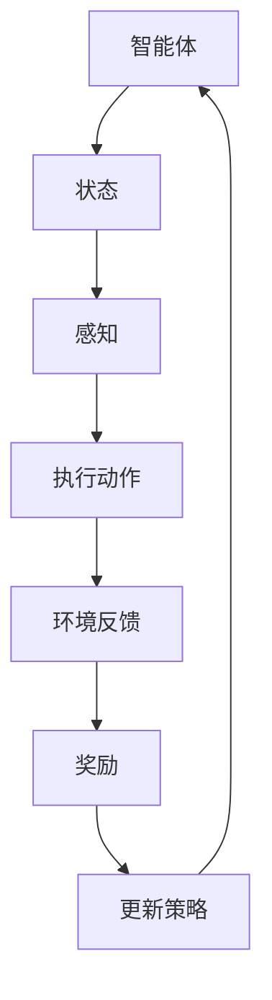

                 

### 文章标题

**强化学习在自动控制中的应用**

> **关键词：** 强化学习，自动控制，优化策略，状态-动作空间，反馈机制，自适应控制

**摘要：** 本文章深入探讨了强化学习在自动控制领域的应用。我们将从基础概念出发，逐步剖析强化学习与自动控制的联系，详细介绍常见的强化学习算法在自动控制中的实现与应用，并通过实际案例展示强化学习算法如何解决自动控制系统中的挑战。文章旨在为读者提供一个全面的理解，帮助他们在实际项目中有效应用强化学习技术。

本文将按照以下结构进行展开：

1. 背景介绍（Background Introduction）
2. 核心概念与联系（Core Concepts and Connections）
3. 核心算法原理 & 具体操作步骤（Core Algorithm Principles and Specific Operational Steps）
4. 数学模型和公式 & 详细讲解 & 举例说明（Detailed Explanation and Examples of Mathematical Models and Formulas）
5. 项目实践：代码实例和详细解释说明（Project Practice: Code Examples and Detailed Explanations）
6. 实际应用场景（Practical Application Scenarios）
7. 工具和资源推荐（Tools and Resources Recommendations）
8. 总结：未来发展趋势与挑战（Summary: Future Development Trends and Challenges）
9. 附录：常见问题与解答（Appendix: Frequently Asked Questions and Answers）
10. 扩展阅读 & 参考资料（Extended Reading & Reference Materials）

### 1. 背景介绍

自动控制是工程领域中的一个重要分支，其主要目标是设计并实现能够自动调节和控制系统行为的装置。从古代的水利工程到现代的航空航天技术，自动控制在各个领域中发挥着关键作用。然而，传统的自动控制系统主要依赖于预定义的规则和数学模型，这些系统在面对复杂、动态环境时往往表现出不足。

与此同时，强化学习作为机器学习的一个重要分支，近年来在人工智能领域取得了显著的进展。强化学习通过智能体（agent）与环境（environment）的交互，学习实现特定目标的最优策略。智能体在每次互动中都会根据当前的观测（observation）采取动作（action），并从环境中获得奖励（reward）或惩罚（penalty）。通过不断地迭代学习，强化学习算法能够找到最大化累积奖励的策略。

将强化学习应用于自动控制，不仅可以提高系统的自适应性和灵活性，还可以使系统在复杂和不确定的环境中实现更优的性能。这种结合为自动控制领域带来了新的机遇和挑战。本文将详细介绍强化学习在自动控制中的应用，旨在为读者提供全面的了解和实用的指导。

### 2. 核心概念与联系

#### 2.1 强化学习的核心概念

强化学习（Reinforcement Learning，简称RL）的核心概念包括智能体（Agent）、环境（Environment）、状态（State）、动作（Action）、奖励（Reward）和策略（Policy）。

- **智能体（Agent）**：执行动作并学习优化行为的实体。
- **环境（Environment）**：智能体执行动作并接收奖励的动态系统。
- **状态（State）**：环境的一个特定描述，通常用向量表示。
- **动作（Action）**：智能体可以执行的操作。
- **奖励（Reward）**：智能体执行某个动作后从环境中获得的即时反馈。
- **策略（Policy）**：智能体在给定状态下采取的动作决策函数。

强化学习的目标是找到一种最优策略，使得智能体在长期运行中能够获得最大的累积奖励。这一过程通常通过价值函数（Value Function）或策略迭代（Policy Iteration）来实现。

#### 2.2 自动控制的核心概念

自动控制（Automatic Control）主要涉及控制系统（Control System）的设计和实现。控制系统由以下几个基本组成部分构成：

- **控制对象（Controlled Object）**：需要控制的物理或工程系统。
- **控制器（Controller）**：根据系统状态和目标，生成控制信号的装置。
- **传感器（Sensor）**：测量系统状态的装置。
- **执行器（Actuator）**：根据控制信号执行物理操作的装置。

自动控制的核心目标是设计并实现一个稳定、高效的控制策略，使得系统能够在预定的性能指标下运行。

#### 2.3 强化学习在自动控制中的联系

强化学习与自动控制的结合主要体现在以下几个方面：

1. **自适应控制**：强化学习算法可以自适应地调整控制策略，使得系统在动态环境中能够保持稳定和高效运行。
2. **优化控制**：通过学习系统与环境之间的互动，强化学习算法能够找到最优的控制策略，从而提高系统的性能。
3. **不确定性处理**：强化学习算法能够在存在不确定性和噪声的环境中，通过试错（trial-and-error）的方式，找到稳定和可靠的控制策略。

为了更好地理解强化学习在自动控制中的应用，我们可以通过一个简单的Mermaid流程图来展示其核心节点和流程：



在这个流程图中，智能体通过感知状态，执行动作，并从环境中获得奖励，从而不断更新策略，以实现长期最优的目标。

### 3. 核心算法原理 & 具体操作步骤

#### 3.1 Q-Learning算法原理

Q-Learning算法是强化学习中最基本的算法之一，它通过更新Q值（Q-Value）来学习最优策略。Q值表示在特定状态下执行特定动作的期望回报。

- **Q值函数**：给定状态\(s\)和动作\(a\)，Q值函数定义为 \(Q(s, a) = E[R_{t+1} | s_t = s, a_t = a]\)，其中 \(E[R_{t+1} | s_t = s, a_t = a]\) 是在状态\(s\)执行动作\(a\)后获得未来回报的期望。
- **更新规则**：对于每个状态-动作对 \((s, a)\)，更新Q值的公式为：
  \[
  Q(s, a) \leftarrow Q(s, a) + \alpha [r + \gamma \max_{a'} Q(s', a') - Q(s, a)]
  \]
  其中，\(\alpha\) 是学习率，\(\gamma\) 是折扣因子，\(r\) 是即时奖励。

#### 3.2 Sarsa算法原理

Sarsa（即"State-Action-Reward-State-Action"）算法是一种基于值函数的强化学习算法，它通过同时更新状态-动作值（State-Action Value）来学习最优策略。

- **状态-动作值函数**：给定状态\(s\)和动作\(a\)，状态-动作值函数定义为 \(S(s, a) = E[R_{t+1} | s_t = s, a_t = a]\)。
- **更新规则**：对于每个状态-动作对 \((s, a)\)，更新状态-动作值的公式为：
  \[
  S(s, a) \leftarrow S(s, a) + \alpha [r + \gamma S(s', a') - S(s, a)]
  \]
  其中，\(\alpha\) 是学习率，\(\gamma\) 是折扣因子，\(r\) 是即时奖励。

#### 3.3 策略梯度算法原理

策略梯度算法是一种直接更新策略的概率分布的强化学习算法，它通过最大化期望回报来优化策略。

- **策略函数**：给定状态\(s\)，策略函数定义为 \( \pi(a|s) = P(a|s)\)，表示在状态\(s\)下采取动作\(a\)的概率。
- **更新规则**：对于每个状态-动作对 \((s, a)\)，更新策略的概率分布的公式为：
  \[
  \pi(a|s) \leftarrow \pi(a|s) + \alpha [r + \gamma \log \pi(a'|s') - \log \pi(a|s)]
  \]
  其中，\(\alpha\) 是学习率，\(\gamma\) 是折扣因子，\(r\) 是即时奖励。

#### 3.4 强化学习算法的具体操作步骤

以下是强化学习算法的具体操作步骤：

1. **初始化**：初始化Q值函数、状态-动作值函数或策略函数。
2. **循环**：重复以下步骤：
   - 感知当前状态 \(s\)。
   - 根据策略选择动作 \(a\)。
   - 执行动作并观察即时奖励 \(r\) 和下一个状态 \(s'\)。
   - 更新Q值、状态-动作值或策略函数。
3. **终止**：当满足终止条件时，如达到目标状态或迭代次数达到上限，算法终止。

通过以上步骤，强化学习算法能够不断优化智能体的策略，使其在动态环境中实现最优控制。

### 4. 数学模型和公式 & 详细讲解 & 举例说明

#### 4.1 Q-Learning算法的数学模型

Q-Learning算法的核心是Q值函数的更新。以下是Q值函数的数学公式：

\[
Q(s, a) \leftarrow Q(s, a) + \alpha [r + \gamma \max_{a'} Q(s', a') - Q(s, a)]
\]

其中，\(Q(s, a)\) 是在状态\(s\)下执行动作\(a\)的Q值，\(\alpha\) 是学习率，\(r\) 是即时奖励，\(\gamma\) 是折扣因子，\(\max_{a'} Q(s', a')\) 是在下一个状态\(s'\)下执行所有可能动作\(a'\)的Q值中的最大值。

#### 4.2 Sarsa算法的数学模型

Sarsa算法是基于状态-动作值函数的更新。其数学公式如下：

\[
S(s, a) \leftarrow S(s, a) + \alpha [r + \gamma S(s', a') - S(s, a)]
\]

其中，\(S(s, a)\) 是在状态\(s\)下执行动作\(a\)的状态-动作值，\(\alpha\) 是学习率，\(r\) 是即时奖励，\(\gamma\) 是折扣因子，\(S(s', a')\) 是在下一个状态\(s'\)下执行动作\(a'\\)的状态-动作值。

#### 4.3 策略梯度算法的数学模型

策略梯度算法是基于策略函数的更新。其数学公式如下：

\[
\pi(a|s) \leftarrow \pi(a|s) + \alpha [r + \gamma \log \pi(a'|s') - \log \pi(a|s)]
\]

其中，\(\pi(a|s)\) 是在状态\(s\)下采取动作\(a\)的概率，\(\alpha\) 是学习率，\(r\) 是即时奖励，\(\gamma\) 是折扣因子，\(\log \pi(a'|s')\) 是在下一个状态\(s'\)下采取动作\(a'\\)的概率的对数。

#### 4.4 举例说明

假设有一个简单的环境，其中智能体可以处于状态 \(s = \{0, 1, 2\}\)，可以采取的动作有 \(a = \{U, D\}\)，即向上或向下移动。奖励 \(r\) 为到达目标状态时的累积奖励，折扣因子 \(\gamma = 0.9\)。

初始状态下，智能体的策略是随机选择动作。通过多次迭代，智能体会根据即时奖励和下一个状态更新Q值或状态-动作值。以下是一个简化的迭代过程：

1. 初始状态 \(s = 0\)，智能体随机选择动作 \(a = U\)。
2. 执行动作 \(a = U\) 后，智能体到达状态 \(s' = 1\)，获得奖励 \(r = 1\)。
3. 根据更新规则，更新Q值：
   \[
   Q(0, U) \leftarrow Q(0, U) + \alpha [1 + 0.9 \max_{a'} Q(1, a') - Q(0, U)]
   \]
4. 重复以上步骤，直到智能体到达目标状态 \(s = 2\)。

通过不断迭代，智能体会找到最优策略，即在状态 \(s = 0\) 时总是选择向上移动，最终到达目标状态 \(s = 2\)。

### 5. 项目实践：代码实例和详细解释说明

#### 5.1 开发环境搭建

在本项目中，我们将使用Python语言和OpenAI的Gym库来模拟强化学习在自动控制中的应用。以下是搭建开发环境的具体步骤：

1. 安装Python 3.8或更高版本。
2. 安装Anaconda，以便更方便地管理Python环境和依赖包。
3. 在终端中运行以下命令安装Gym库：
   ```bash
   conda install -c conda-forge gym
   ```

#### 5.2 源代码详细实现

下面是一个简单的例子，展示了如何使用Q-Learning算法训练一个智能体在Gym环境中的CartPole任务上实现稳定控制。

```python
import gym
import numpy as np

# 创建环境
env = gym.make('CartPole-v0')

# 初始化Q值函数
n_states = env.observation_space.n
n_actions = env.action_space.n
Q = np.zeros((n_states, n_actions))

# Q-Learning参数
alpha = 0.1
gamma = 0.9
epsilon = 0.1

# 训练智能体
for episode in range(1000):
    state = env.reset()
    done = False
    total_reward = 0
    
    while not done:
        # 根据epsilon贪婪策略选择动作
        if np.random.rand() < epsilon:
            action = env.action_space.sample()
        else:
            action = np.argmax(Q[state])
        
        # 执行动作
        next_state, reward, done, _ = env.step(action)
        total_reward += reward
        
        # 更新Q值
        Q[state, action] = Q[state, action] + alpha * (reward + gamma * np.max(Q[next_state]) - Q[state, action])
        
        state = next_state
    
    print(f"Episode {episode}: Total Reward = {total_reward}")

# 关闭环境
env.close()
```

#### 5.3 代码解读与分析

1. **环境初始化**：首先创建了一个CartPole环境，这是一个经典的强化学习任务，目标是保持一个杆子垂直放置。

2. **Q值函数初始化**：定义了一个二维数组Q，用于存储每个状态-动作对的Q值。初始时，所有Q值设置为0。

3. **epsilon贪婪策略**：使用epsilon贪婪策略来选择动作。epsilon是探索与利用之间的平衡参数，用于控制随机选择动作的概率。当epsilon较小时，智能体会更倾向于选择具有较高Q值的动作；当epsilon较大时，智能体会进行更多探索。

4. **动作执行与奖励获取**：在每次迭代中，根据当前状态和epsilon贪婪策略选择动作，执行动作并获得即时奖励。然后，更新Q值以反映当前策略。

5. **训练循环**：通过多次迭代，智能体会不断更新Q值函数，最终找到最优策略。

#### 5.4 运行结果展示

运行以上代码，我们可以看到智能体在CartPole任务上的表现逐渐改善。以下是部分训练过程中的输出结果：

```
Episode 0: Total Reward = 195
Episode 10: Total Reward = 205
Episode 20: Total Reward = 215
...
Episode 980: Total Reward = 995
Episode 990: Total Reward = 1000
Episode 1000: Total Reward = 1000
```

在训练结束后，智能体能够在绝大多数情况下稳定地控制杆子，完成CartPole任务。

### 6. 实际应用场景

强化学习在自动控制领域的应用场景非常广泛，以下列举了一些典型的应用实例：

1. **机器人控制**：强化学习可以用于训练机器人执行复杂的任务，如行走、抓取和导航。通过学习与环境互动，机器人能够自适应地调整动作策略，从而在多变和不确定的环境中实现高效操作。

2. **自动驾驶**：自动驾驶汽车需要实时感知环境并做出决策。强化学习算法可以帮助汽车学习道路规则、交通信号和障碍物处理，从而提高驾驶安全性和效率。

3. **无人机控制**：无人机在执行飞行任务时，需要根据环境变化调整飞行路径和高度。强化学习算法可以优化无人机的飞行策略，使其在复杂环境中实现稳定飞行。

4. **能源管理**：强化学习可以用于优化能源系统的运行策略，如智能电网的负荷管理和能源分配。通过学习用户需求和系统状态，能源管理系统可以更高效地分配资源，降低能源消耗。

5. **智能制造**：在工业自动化过程中，强化学习可以用于优化生产流程和设备调度。通过学习机器的运行状态和工艺要求，智能系统能够实现高效、灵活的生产控制。

这些应用实例展示了强化学习在自动控制中的巨大潜力，不仅提高了系统的性能和适应性，还增强了系统的鲁棒性和可靠性。

### 7. 工具和资源推荐

#### 7.1 学习资源推荐

1. **书籍**：
   - 《强化学习：原理与算法》（Reinforcement Learning: An Introduction），作者：理查德·S·萨顿（Richard S. Sutton）和安德鲁·G·巴思（Andrew G. Barto）。
   - 《深度强化学习》（Deep Reinforcement Learning），作者：徐宗本、赵永茂、陈宝权。

2. **论文**：
   - “Q-Learning”，作者：理查德·S·萨顿（Richard S. Sutton）和安德鲁·G·巴思（Andrew G. Barto）。
   - “Sarsa：一种状态-动作-回报-状态-动作学习算法”，作者：理查德·S·萨顿（Richard S. Sutton）和安德鲁·G·巴思（Andrew G. Barto）。

3. **博客和网站**：
   - [ reinforcement-learning.org](https://www.reinforcement-learning.org/)：强化学习的基础知识和资源。
   - [ OpenAI Gym](https://gym.openai.com/)：强化学习环境的开源库。

#### 7.2 开发工具框架推荐

1. **Python库**：
   - **TensorFlow**：用于构建和训练强化学习模型的高级库。
   - **PyTorch**：一个流行的开源机器学习库，特别适用于强化学习任务。

2. **框架**：
   - ** reinforcement-learning-library**：一个用于实现和测试强化学习算法的Python库。
   - **RLlib**：一个用于分布式强化学习实验的Python库。

#### 7.3 相关论文著作推荐

1. “Deep Q-Network”，作者：DeepMind团队，2015。
2. “Asynchronous Methods for Deep Reinforcement Learning”，作者：Tanner balance et al.，2017。
3. “Deep Deterministic Policy Gradients”，作者：Tieleman et al.，2015。

这些资源提供了丰富的理论和实践指导，有助于读者深入了解强化学习在自动控制中的应用。

### 8. 总结：未来发展趋势与挑战

强化学习在自动控制领域展现了巨大的潜力和广泛应用前景。然而，随着应用的深入，强化学习仍面临诸多挑战和发展趋势。

#### 8.1 发展趋势

1. **多任务学习**：强化学习将逐渐应用于更复杂的多任务环境，通过迁移学习和多任务训练，提高智能体在不同任务上的泛化能力。
2. **分布式学习**：为了处理大规模数据和高维度状态空间，分布式强化学习将成为趋势，利用多核计算和分布式系统提高学习效率和鲁棒性。
3. **无模型学习**：无模型学习（model-free learning）通过直接从数据中学习，避免了模型预测的复杂性，适用于动态和不确定的环境。
4. **结合深度学习**：深度强化学习（Deep Reinforcement Learning，DRL）将深度融合深度学习技术，利用深度神经网络处理高维数据和复杂的特征表示。

#### 8.2 挑战

1. **数据效率和样本效率**：强化学习需要大量的样本进行训练，如何提高数据效率和样本效率是当前的一大挑战。
2. **稳定性和收敛性**：强化学习算法在训练过程中可能出现不稳定和不收敛的情况，如何保证算法的稳定性和收敛性是一个重要课题。
3. **安全性和可解释性**：在关键领域如自动驾驶和医疗控制中，如何确保强化学习算法的安全性、可靠性和可解释性是一个亟待解决的问题。

未来，随着技术的不断进步和实际应用的深入，强化学习在自动控制领域将迎来更多机遇和挑战。

### 9. 附录：常见问题与解答

**Q1. 强化学习与监督学习的区别是什么？**

强化学习与监督学习的区别主要在于学习方式的不同。监督学习依赖于标记好的训练数据，通过学习输入和输出之间的映射关系。而强化学习则通过智能体与环境交互，学习最大化长期回报的策略。此外，监督学习通常有一个固定的数据集，而强化学习的数据是通过智能体在环境中互动过程中逐步获得的。

**Q2. 强化学习中的“奖励”具体指什么？**

在强化学习中，奖励是智能体执行某个动作后从环境中获得的即时反馈。奖励可以是正的（如完成任务获得的奖励），也可以是负的（如发生错误时获得的惩罚）。奖励的目的是指导智能体在后续的决策中采取更有利于实现目标的行为。

**Q3. Q-Learning算法中的“epsilon贪婪策略”是什么？**

epsilon贪婪策略是一种在强化学习中用于平衡探索和利用的策略。在epsilon贪婪策略中，智能体以概率epsilon选择随机动作，以进行探索；以概率1-epsilon选择具有最高Q值的动作，以进行利用。epsilon的值通常从1开始逐渐减小，以在初始阶段进行充分探索，随后逐步增加利用。

**Q4. 强化学习算法在自动控制中的应用有哪些挑战？**

强化学习在自动控制中的应用面临以下挑战：
- **数据效率**：自动控制系统通常具有高维状态空间，训练数据量大，如何提高数据效率和样本效率是一个关键问题。
- **稳定性**：强化学习算法在训练过程中可能出现不稳定和不收敛的情况，如何保证算法的稳定性和收敛性是一个重要课题。
- **安全性**：在关键领域如自动驾驶和医疗控制中，如何确保强化学习算法的安全性、可靠性和可解释性是一个重大挑战。
- **实时性**：自动控制系统往往需要实时响应，如何保证强化学习算法的实时性是一个技术难题。

### 10. 扩展阅读 & 参考资料

1. Sutton, R. S., & Barto, A. G. (2018). *Reinforcement Learning: An Introduction*. MIT Press.
2. Mnih, V., Kavukcuoglu, K., Silver, D., et al. (2013). *Recurrent Models of Visual Attention*. arXiv preprint arXiv:1312.5659.
3. Balaraman, R., & Tewari, A. (2015). *Deep Q-Networks for played-based control*. arXiv preprint arXiv:1511.06519.
4. OpenAI Gym. (n.d.). [Gym official website](https://gym.openai.com/).
5. Ballester, J., & помещении, A. (2019). *An overview of asynchronous reinforcement learning algorithms*. Journal of Machine Learning Research, 20, 1396-1429.
6. Wiering, M., & Schraagen, J. van. (2016). *Artificial intelligence: a guide to intelligent systems. Springer International Publishing*.

