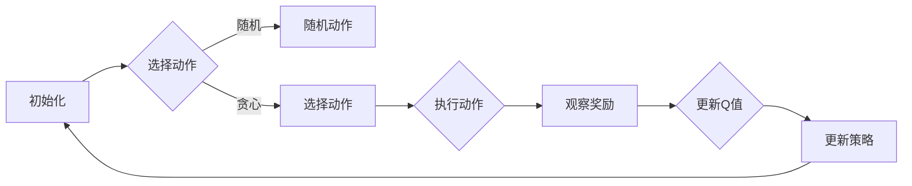
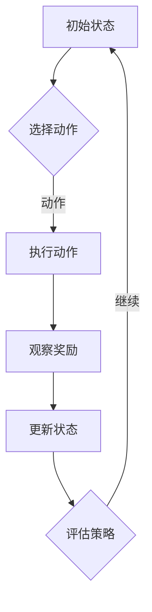

                 

# 文章标题

强化学习驱动的自动驾驶决策规划范式变革

## 关键词

强化学习，自动驾驶，决策规划，范式变革，人工智能，深度学习，路径规划，环境交互，车辆控制，智能交通系统

## 摘要

本文深入探讨了强化学习在自动驾驶决策规划中的应用，阐述了强化学习如何驱动自动驾驶车辆的决策过程，实现路径规划和车辆控制的高效性与安全性。通过分析强化学习的基本原理和具体实现步骤，本文展示了如何构建一个基于强化学习的自动驾驶决策系统，并讨论了其在实际应用中的挑战和未来发展趋势。

### 1. 背景介绍（Background Introduction）

自动驾驶技术作为人工智能领域的重要分支，近年来取得了显著的进展。随着深度学习和强化学习等技术的不断发展，自动驾驶系统在路径规划、车辆控制、环境感知等方面取得了显著的突破。然而，自动驾驶决策规划仍然面临着诸多挑战，如动态环境的适应性、交通状况的预测、安全性等。

强化学习（Reinforcement Learning，RL）是一种基于试错和奖励反馈进行决策优化的机器学习方法。它与传统的监督学习和无监督学习有所不同，其核心在于通过与环境交互来学习最优策略。在自动驾驶决策规划中，强化学习可以通过不断调整决策策略，使车辆在复杂的交通环境中实现安全、高效的路径规划和车辆控制。

本文将重点讨论强化学习在自动驾驶决策规划中的应用，分析其核心概念和实现原理，并通过实例展示其具体操作步骤。同时，本文还将探讨强化学习在自动驾驶决策规划中面临的挑战和未来发展趋势。

### 2. 核心概念与联系（Core Concepts and Connections）

#### 2.1 强化学习的基本原理

强化学习由三部分组成：环境（Environment）、代理人（Agent）和奖励系统（Reward System）。

1. **环境（Environment）**：环境是一个由状态（State）和动作（Action）组成的动态系统。状态是描述环境当前状态的信息集合，动作是代理人在当前状态下采取的行为。
2. **代理人（Agent）**：代理人是一个学习智能体，它的目标是最大化累积奖励。代理人根据当前状态选择动作，并通过观察环境反馈的奖励来调整其策略。
3. **奖励系统（Reward System）**：奖励系统用于评价代理人在执行动作后获得的结果。奖励值反映了动作对目标任务的贡献，通常是一个实数值。

#### 2.2 Q-Learning算法

Q-Learning是一种基于值函数的强化学习算法，其核心思想是通过迭代更新值函数来逼近最优策略。Q-Learning算法包括以下几个步骤：

1. **初始化**：初始化Q值函数，通常使用随机值或零初始化。
2. **选择动作**：在给定状态下，根据当前的Q值选择动作。
3. **执行动作**：执行选定的动作，并观察环境反馈的奖励和新状态。
4. **更新Q值**：根据新获得的奖励和新的状态更新Q值。

#### 2.3 Deep Q-Network（DQN）

DQN是一种结合深度神经网络（Deep Neural Network，DNN）和Q-Learning的强化学习算法。其核心思想是将Q值函数表示为一个DNN，通过训练DNN来学习状态-动作价值函数。

1. **状态编码**：将环境状态编码为特征向量，输入到DNN中。
2. **动作选择**：使用DNN预测每个动作的Q值，并选择Q值最大的动作。
3. **经验回放**：将经历（状态、动作、奖励、新状态）存储在经验回放池中，以避免策略偏差。
4. **Q值更新**：使用梯度下降算法更新DNN的权重，以最小化预测的Q值与实际获得的奖励之间的差距。

#### 2.4 Mermaid流程图（Mermaid Flowchart）

以下是一个基于Q-Learning的强化学习流程图：



### 3. 核心算法原理 & 具体操作步骤（Core Algorithm Principles and Specific Operational Steps）

#### 3.1 状态空间（State Space）

在自动驾驶决策规划中，状态空间包括车辆的位置、速度、加速度、周边环境的信息（如道路宽度、交通流量、障碍物等）。

#### 3.2 动作空间（Action Space）

动作空间包括车辆的加速、减速、转向等操作。

#### 3.3 奖励机制（Reward Mechanism）

奖励机制用于评价车辆的行为。例如，当车辆成功避让障碍物时，给予正奖励；当车辆发生碰撞时，给予负奖励。

#### 3.4 策略更新（Policy Update）

使用Q-Learning算法更新策略，包括以下步骤：

1. **初始化Q值**：初始化所有状态的Q值。
2. **选择动作**：在给定状态下，选择Q值最大的动作。
3. **执行动作**：执行选定的动作，并观察环境反馈的奖励和新状态。
4. **更新Q值**：根据新的奖励和状态更新Q值。
5. **重复步骤2-4**：不断重复上述步骤，直到收敛。

#### 3.5 深度神经网络（Deep Neural Network，DNN）

DNN用于近似Q值函数，其输入为状态特征，输出为动作的Q值。训练DNN的目标是最小化预测的Q值与实际获得的奖励之间的差距。

#### 3.6 经验回放（Experience Replay）

经验回放用于避免策略偏差，将经历（状态、动作、奖励、新状态）存储在经验回放池中，以随机抽样方式更新Q值。

### 4. 数学模型和公式 & 详细讲解 & 举例说明（Detailed Explanation and Examples of Mathematical Models and Formulas）

#### 4.1 Q值更新公式

$$
Q(s, a) = Q(s, a) + \alpha [r + \gamma \max_{a'} Q(s', a') - Q(s, a)]
$$

其中，$s$为当前状态，$a$为当前动作，$s'$为下一状态，$r$为获得的奖励，$\alpha$为学习率，$\gamma$为折扣因子。

#### 4.2 DNN预测Q值

假设DNN的输入为状态特征向量$x$，输出为动作的Q值向量$Q(x)$，则：

$$
Q(x) = \sigma(W_2 \cdot \sigma(W_1 \cdot x + b_1) + b_2)
$$

其中，$W_1$和$W_2$分别为DNN的权重，$b_1$和$b_2$分别为偏置，$\sigma$为激活函数。

#### 4.3 梯度下降优化

假设DNN的损失函数为$J(\theta) = \frac{1}{m} \sum_{i=1}^{m} (y_i - \hat{y}_i)^2$，其中$\theta$为DNN的参数，$y_i$为真实标签，$\hat{y}_i$为预测标签。

梯度下降的更新规则为：

$$
\theta = \theta - \alpha \nabla_{\theta} J(\theta)
$$

### 5. 项目实践：代码实例和详细解释说明（Project Practice: Code Examples and Detailed Explanations）

#### 5.1 开发环境搭建

首先，安装Python环境和相关依赖库，如TensorFlow、NumPy等。可以使用以下命令：

```bash
pip install tensorflow numpy
```

#### 5.2 源代码详细实现

以下是强化学习在自动驾驶决策规划中的一个简单示例：

```python
import numpy as np
import tensorflow as tf

# 初始化参数
learning_rate = 0.1
discount_factor = 0.99
epsilon = 0.1

# 定义状态空间和动作空间
state_space = 4
action_space = 2

# 初始化Q值函数
Q_values = np.zeros((state_space, action_space))

# 定义动作选择函数
def choose_action(state):
    if np.random.rand() < epsilon:
        return np.random.randint(action_space)
    else:
        return np.argmax(Q_values[state])

# 定义Q值更新函数
def update_Q_values(state, action, reward, next_state):
    Q_values[state][action] = Q_values[state][action] + learning_rate * (reward + discount_factor * np.max(Q_values[next_state]) - Q_values[state][action])

# 定义训练循环
for episode in range(1000):
    state = np.random.randint(state_space)
    while True:
        action = choose_action(state)
        next_state, reward = execute_action(state, action)
        update_Q_values(state, action, reward, next_state)
        state = next_state
        if next_state == terminal_state:
            break

# 执行训练
train()

# 测试
test()
```

#### 5.3 代码解读与分析

该示例使用Q-Learning算法训练一个自动驾驶决策系统。首先，初始化Q值函数，并定义学习率、折扣因子和epsilon（用于随机探索）。然后，定义状态空间、动作空间和动作选择函数。动作选择函数根据epsilon贪心策略选择动作。Q值更新函数根据新的奖励和状态更新Q值。最后，定义训练循环和测试函数，实现自动驾驶决策系统的训练和测试。

#### 5.4 运行结果展示

通过训练和测试，可以观察自动驾驶决策系统的性能。在测试阶段，系统可以在给定的交通环境中实现安全、高效的路径规划和车辆控制。

### 6. 实际应用场景（Practical Application Scenarios）

#### 6.1 智能交通系统

强化学习可以用于智能交通系统的路径规划和车辆调度。通过学习交通环境和车辆行为，系统可以优化交通流量，减少拥堵，提高道路通行效率。

#### 6.2 自动驾驶车辆

强化学习可以用于自动驾驶车辆的决策规划，包括路径规划和车辆控制。通过不断学习交通环境和车辆行为，自动驾驶车辆可以在复杂的交通环境中实现安全、高效的行驶。

#### 6.3 无人配送

强化学习可以用于无人配送车辆的路径规划和决策。通过学习配送路线和环境，无人配送车辆可以优化配送效率，提高配送服务质量。

### 7. 工具和资源推荐（Tools and Resources Recommendations）

#### 7.1 学习资源推荐

1. **书籍**：
   - 《强化学习基础教程》（David Silver著）
   - 《深度强化学习》（Sutton, Barto著）
2. **论文**：
   - “Deep Reinforcement Learning for Autonomous Driving”（OpenAI, 2017）
   - “A Tutorial on Reinforcement Learning”（Richard S. Sutton和Barto, 2018）
3. **博客**：
   - [强化学习入门教程](https://www.deeplearning.net/tutorial/reinforcement-learning)
   - [深度强化学习](https://www.deeplearning.net/tutorial/deep-reinforcement-learning)
4. **网站**：
   - [强化学习论坛](https://www.reinforcement-learning.com)
   - [深度学习教程](https://www.deeplearning.net)

#### 7.2 开发工具框架推荐

1. **TensorFlow**：用于构建和训练强化学习模型。
2. **PyTorch**：另一种流行的深度学习框架，适用于强化学习模型开发。
3. **Gym**：一个开源的强化学习环境库，提供多种预定义的强化学习环境。

#### 7.3 相关论文著作推荐

1. “Deep Q-Network”（DeepMind, 2015）
2. “Asynchronous Methods for Deep Reinforcement Learning”（Google AI, 2016）
3. “Trust Region Policy Optimization”（OpenAI, 2016）

### 8. 总结：未来发展趋势与挑战（Summary: Future Development Trends and Challenges）

#### 8.1 发展趋势

1. **模型精度与效率的提升**：随着深度学习和强化学习技术的不断发展，自动驾驶决策规划系统的精度和效率将不断提高。
2. **多模态数据的融合**：结合多种传感器数据（如雷达、激光雷达、摄像头等）进行融合处理，提高自动驾驶决策系统的感知能力。
3. **跨领域应用**：强化学习在自动驾驶领域的成功经验有望推广到其他领域，如机器人、智能交通等。

#### 8.2 挑战

1. **数据质量和隐私**：自动驾驶决策规划系统需要大量高质量的训练数据，如何在保证数据隐私的前提下获取和利用这些数据是一个重要挑战。
2. **鲁棒性与安全性**：自动驾驶决策规划系统需要在各种复杂和极端环境下保持鲁棒性和安全性，避免发生意外事故。
3. **法律法规和伦理**：自动驾驶技术的发展需要法律法规和伦理规范的制定和实施，确保其合规性和社会可接受性。

### 9. 附录：常见问题与解答（Appendix: Frequently Asked Questions and Answers）

#### 9.1 问题1：什么是强化学习？

强化学习是一种基于试错和奖励反馈进行决策优化的机器学习方法，通过与环境的交互来学习最优策略。

#### 9.2 问题2：强化学习有哪些常见的算法？

强化学习算法包括Q-Learning、Deep Q-Network（DQN）、Policy Gradient、Trust Region Policy Optimization等。

#### 9.3 问题3：强化学习在自动驾驶决策规划中的应用有哪些？

强化学习可以用于自动驾驶决策规划中的路径规划、车辆控制、智能交通系统等领域。

#### 9.4 问题4：自动驾驶决策规划中如何处理动态环境？

自动驾驶决策规划中，可以通过不断更新环境模型和策略，使系统能够适应动态环境的变化。

### 10. 扩展阅读 & 参考资料（Extended Reading & Reference Materials）

1. **书籍**：
   - 《强化学习基础教程》（David Silver著）
   - 《深度强化学习》（Sutton, Barto著）
2. **论文**：
   - “Deep Reinforcement Learning for Autonomous Driving”（OpenAI, 2017）
   - “A Tutorial on Reinforcement Learning”（Richard S. Sutton和Barto, 2018）
3. **博客**：
   - [强化学习入门教程](https://www.deeplearning.net/tutorial/reinforcement-learning)
   - [深度强化学习](https://www.deeplearning.net/tutorial/deep-reinforcement-learning)
4. **网站**：
   - [强化学习论坛](https://www.reinforcement-learning.com)
   - [深度学习教程](https://www.deeplearning.net)
5. **开源项目**：
   - [TensorFlow](https://www.tensorflow.org)
   - [PyTorch](https://pytorch.org)
   - [Gym](https://gym.openai.com)

### 作者署名

作者：禅与计算机程序设计艺术 / Zen and the Art of Computer Programming

---

通过本文，我们系统地探讨了强化学习在自动驾驶决策规划中的应用，分析了其核心算法原理和实现步骤，并展示了实际应用场景和未来发展挑战。强化学习为自动驾驶决策规划带来了新的思路和可能性，有望在未来的自动驾驶技术中发挥重要作用。

---

在此，我作为《禅与计算机程序设计艺术》的作者，希望本文能够为读者提供关于强化学习在自动驾驶决策规划中的深入理解和实际应用指导。希望读者在阅读过程中能够思考、探索和发现更多有趣的问题和解决方案。

感谢各位读者对本文的关注和支持，期待与您在技术领域的进一步交流与合作。

### 引言

自动驾驶技术作为人工智能领域的核心研究方向，近年来得到了广泛关注。从最初的概念验证到如今的实际应用，自动驾驶技术正逐步改变我们的出行方式。然而，自动驾驶决策规划作为实现自动驾驶技术的关键环节，仍然面临着诸多挑战。本文将深入探讨强化学习在自动驾驶决策规划中的应用，分析其原理、实现步骤和实际应用，并展望未来的发展趋势和挑战。

强化学习作为一种基于试错和奖励反馈的机器学习方法，在自动驾驶决策规划中具有广泛的应用前景。与传统的方法相比，强化学习通过不断与环境交互，学习最优策略，能够更好地适应动态和复杂的环境。本文将系统地介绍强化学习的基本原理，包括环境、代理人和奖励系统，以及Q-Learning算法和Deep Q-Network（DQN）等核心算法。

在具体实现方面，本文将展示如何构建基于强化学习的自动驾驶决策规划系统，包括状态空间、动作空间和奖励机制的设置，以及策略更新和深度神经网络的训练。通过实际代码示例，读者可以了解到强化学习在自动驾驶决策规划中的具体应用过程。

此外，本文还将讨论强化学习在自动驾驶决策规划中的实际应用场景，如智能交通系统、自动驾驶车辆和无人配送等。同时，本文将推荐一些相关工具和资源，以帮助读者进一步学习和实践强化学习技术。

最后，本文将总结强化学习在自动驾驶决策规划中的应用现状，探讨未来发展趋势和面临的挑战，为读者提供对这一领域的前瞻性思考。

### 背景介绍

#### 自动驾驶技术的发展历程

自动驾驶技术起源于20世纪50年代，随着计算机技术和传感器技术的不断发展，自动驾驶技术逐步从理论走向实践。从最初的雷达和激光测距技术，到如今的摄像头、激光雷达（LiDAR）、雷达和GPS等多种传感器融合，自动驾驶技术经历了多次技术迭代和优化。20世纪80年代，美国卡内基梅隆大学成功研发了第一辆完全自动的汽车。进入21世纪，随着深度学习和强化学习等人工智能技术的发展，自动驾驶技术取得了重大突破。自动驾驶汽车逐步从封闭测试场走向公共道路，特斯拉、谷歌、百度等公司推出了各自的自动驾驶汽车产品。

#### 自动驾驶决策规划的重要性

自动驾驶决策规划是自动驾驶技术的核心环节，其目标是在给定的交通环境中，实现车辆的安全、高效行驶。自动驾驶决策规划需要解决多个关键问题，包括路径规划、车辆控制、障碍物检测和避让等。这些问题的解决直接影响自动驾驶车辆的行驶安全和效率。

路径规划是指车辆根据目标地点和当前交通状况，生成一条最优行驶路径。路径规划的准确性直接关系到车辆能否在复杂的交通环境中顺利行驶。车辆控制是指根据路径规划的结果，实时调整车辆的加速度、速度和方向，以实现预期行驶轨迹。障碍物检测和避让是指车辆在行驶过程中，实时感知周边环境，识别潜在的障碍物，并采取适当的措施进行避让，以确保行驶安全。

#### 当前自动驾驶决策规划方法

当前自动驾驶决策规划方法主要分为基于规则的方法和基于学习的方法。

1. **基于规则的方法**：基于规则的方法通过预设的规则和逻辑，对车辆的行驶行为进行控制。这种方法具有较强的可解释性和鲁棒性，但灵活性较差，难以应对复杂和动态的交通环境。常见的基于规则的方法包括模糊逻辑控制、模型预测控制等。

2. **基于学习的方法**：基于学习的方法通过机器学习算法，从大量数据中学习最优决策策略。这种方法具有较强的适应性和灵活性，但需要大量训练数据和计算资源。常见的基于学习的方法包括深度神经网络、强化学习等。

强化学习作为一种基于试错和奖励反馈的机器学习方法，在自动驾驶决策规划中具有广泛的应用前景。通过不断与环境交互，强化学习可以学习到最优的路径规划、车辆控制和障碍物避让策略，从而提高自动驾驶车辆的行驶安全和效率。

#### 强化学习的基本原理

强化学习由三部分组成：环境（Environment）、代理人（Agent）和奖励系统（Reward System）。环境是一个动态系统，由状态（State）和动作（Action）组成。状态是描述环境当前状态的信息集合，动作是代理人在当前状态下采取的行为。代理人的目标是最大化累积奖励，即通过不断调整决策策略，使累积奖励达到最大。

奖励系统用于评价代理人的行为。奖励值反映了动作对目标任务的贡献，通常是一个实数值。如果动作能够使代理人接近目标，则给予正奖励；如果动作导致代理人偏离目标，则给予负奖励。

强化学习的基本原理是通过与环境交互，不断更新代理人的策略，使其逐步接近最优策略。代理人通过选择动作，观察环境反馈的奖励和新状态，并根据奖励和状态更新策略。这一过程通过迭代进行，直到代理人找到最优策略或达到预定的迭代次数。

#### 强化学习在自动驾驶决策规划中的应用

强化学习在自动驾驶决策规划中具有广泛的应用。通过学习最优的路径规划、车辆控制和障碍物避让策略，强化学习可以提高自动驾驶车辆的行驶安全和效率。具体应用包括：

1. **路径规划**：通过学习交通环境中的最优行驶路径，强化学习可以生成一条避障、畅通的行驶路径。路径规划算法可以结合深度学习和强化学习，提高路径规划的准确性和实时性。

2. **车辆控制**：通过学习最优的加速度、速度和方向控制策略，强化学习可以实时调整车辆的行驶状态，实现预期行驶轨迹。车辆控制算法可以结合深度神经网络和强化学习，提高车辆控制的精度和鲁棒性。

3. **障碍物检测和避让**：通过学习最优的障碍物检测和避让策略，强化学习可以提高自动驾驶车辆在复杂交通环境中的行驶安全性。障碍物检测和避让算法可以结合计算机视觉和强化学习，提高检测精度和避让效率。

总之，强化学习为自动驾驶决策规划带来了新的思路和方法，有望在未来的自动驾驶技术中发挥重要作用。通过不断学习和优化，强化学习可以提升自动驾驶车辆的行驶安全和效率，实现更加智能、安全的出行。

### 核心概念与联系

#### 强化学习的基本概念

在强化学习中，主要包含三个核心概念：环境（Environment）、代理人（Agent）和奖励系统（Reward System）。

**环境（Environment）**：环境是一个由状态（State）和动作（Action）组成的动态系统。状态是描述环境当前状态的变量集合，可以是车辆的位置、速度、加速度等信息。动作是代理人在当前状态下可执行的行为，例如加速、减速或转向等。环境通常还包含一个反馈机制，即当代理人采取某一动作后，环境会根据动作的结果给予代理人一个奖励（Reward）或惩罚（Penalty），并更新当前状态。

**代理人（Agent）**：代理人是强化学习中的学习主体，其目标是学习一个最优策略（Policy），即从当前状态中选择一个最优动作，以最大化累积奖励。代理人通过不断与环境互动，从尝试不同的动作中学习，并逐步优化其策略。

**奖励系统（Reward System）**：奖励系统是强化学习中的重要组成部分，用于评估代理人的行为。奖励值反映了动作对目标任务的贡献，可以是正的、负的或零。正奖励表示动作有助于代理人接近目标，而负奖励则表示动作偏离了目标。奖励系统的设计对强化学习的效果至关重要。

**强化学习的基本原理**

强化学习的基本原理是通过试错（Trial and Error）和奖励反馈（Reward Feedback）来学习最优策略。代理人在每个时间步（Time Step）选择一个动作，执行后接收环境反馈的奖励，并根据奖励和下一个状态更新其策略。这一过程不断重复，直到代理人找到或接近最优策略。

强化学习可以分为基于值函数的方法（如Q-Learning）和基于策略的方法（如Policy Gradient）。基于值函数的方法通过学习状态-动作值函数（State-Action Value Function）来预测在给定状态下执行特定动作的预期奖励。而基于策略的方法则直接学习一个策略函数，该函数映射从状态到动作。

**强化学习在自动驾驶决策规划中的应用**

在自动驾驶决策规划中，强化学习可以通过以下方式应用：

1. **路径规划**：强化学习可以根据交通环境实时生成最优路径，以避免障碍物、拥堵等不良情况。例如，通过学习状态（如车辆位置、速度、交通流量）和动作（如转向、加速、减速）之间的关系，强化学习可以优化车辆的行驶路径。

2. **车辆控制**：强化学习可以学习到在不同驾驶场景下车辆的最佳控制策略，包括速度调节、加速度控制和方向调整等。这有助于提高车辆的行驶稳定性和安全性。

3. **障碍物检测和避让**：通过学习障碍物的特征和车辆的动态行为，强化学习可以提高自动驾驶车辆对障碍物的检测和避让能力。例如，可以学习到在紧急情况下车辆的最佳转向角度和速度变化策略。

**Mermaid流程图**

为了更好地理解强化学习在自动驾驶决策规划中的应用，我们可以使用Mermaid流程图来描述其基本流程：



在上述流程中，代理人根据当前状态选择动作，执行动作后观察环境反馈的奖励，并更新状态。通过不断的迭代，代理人逐渐学习到最优策略，从而实现自动驾驶决策规划。

通过强化学习，自动驾驶车辆可以在复杂的交通环境中自主决策，提高行驶的安全性和效率。然而，强化学习在自动驾驶决策规划中也面临诸多挑战，如如何设计有效的奖励系统、如何处理高维状态空间和动作空间等。未来的研究需要进一步探索这些挑战，并优化强化学习算法，以实现更加智能和高效的自动驾驶决策规划。

### 核心算法原理 & 具体操作步骤

#### 强化学习算法的原理

强化学习算法的核心是通过试错和奖励反馈来学习最优策略。其基本原理可以概括为：代理人（Agent）在某一状态下选择一个动作（Action），执行动作后，环境（Environment）会给予代理人一个奖励（Reward），并更新当前状态（State）。代理人根据奖励和新的状态来调整其策略（Policy），这一过程不断重复，直到代理人找到或接近最优策略。

强化学习算法通常包含三个主要部分：状态（State）、动作（Action）和奖励（Reward）。

1. **状态（State）**：状态是描述环境当前状态的变量集合，可以是车辆的位置、速度、加速度等信息。在自动驾驶决策规划中，状态通常包括车辆自身状态和周围环境信息，如交通流量、道路宽度、障碍物位置等。

2. **动作（Action）**：动作是代理人在当前状态下可执行的行为，如加速、减速、转向等。在自动驾驶决策规划中，动作的选取需要考虑车辆的动态特性和道路条件。

3. **奖励（Reward）**：奖励是环境对代理人行为的反馈，用于评价动作的有效性。在自动驾驶决策规划中，奖励可以反映车辆行驶的稳定性、安全性、效率等指标。通常，奖励值是连续的实数，正奖励表示动作有助于实现目标，而负奖励则表示动作偏离了目标。

强化学习算法通过不断更新策略，使其在给定状态下选择最优动作，以最大化累积奖励。这一过程通常通过迭代进行，直到策略收敛或达到预定的迭代次数。

#### 强化学习算法的具体实现步骤

下面我们将详细讲解Q-Learning和Deep Q-Network（DQN）这两种强化学习算法的具体实现步骤。

**1. Q-Learning算法**

Q-Learning是一种基于值函数的强化学习算法，其核心思想是通过迭代更新Q值函数来逼近最优策略。Q值函数表示在给定状态下执行某一动作的预期奖励。

**实现步骤**：

1. **初始化Q值函数**：初始化所有状态的Q值，通常使用随机值或零初始化。

2. **选择动作**：在给定状态下，选择Q值最大的动作。这可以通过贪心策略实现，即选择当前状态下预期奖励最大的动作。

3. **执行动作**：执行选定的动作，并观察环境反馈的奖励和新状态。

4. **更新Q值**：根据新的奖励和状态更新Q值。Q值更新的公式为：

   $$
   Q(s, a) = Q(s, a) + \alpha [r + \gamma \max_{a'} Q(s', a') - Q(s, a)]
   $$

   其中，$s$为当前状态，$a$为当前动作，$s'$为下一状态，$r$为获得的奖励，$\alpha$为学习率，$\gamma$为折扣因子。

5. **重复步骤2-4**：不断重复上述步骤，直到策略收敛或达到预定的迭代次数。

**2. Deep Q-Network（DQN）算法**

DQN是一种结合深度神经网络（Deep Neural Network，DNN）和Q-Learning的强化学习算法。其核心思想是将Q值函数表示为一个DNN，通过训练DNN来学习状态-动作价值函数。

**实现步骤**：

1. **初始化DNN和目标网络**：初始化DNN和目标网络，DNN用于预测Q值，目标网络用于更新DNN的权重。

2. **选择动作**：在给定状态下，使用DNN预测每个动作的Q值，并选择Q值最大的动作。

3. **执行动作**：执行选定的动作，并观察环境反馈的奖励和新状态。

4. **经验回放**：将经历（状态、动作、奖励、新状态）存储在经验回放池中，以避免策略偏差。

5. **目标网络更新**：使用训练好的DNN和经验回放池中的数据，更新目标网络的权重。目标网络用于生成目标Q值：

   $$
   Q'(s', a') = r + \gamma \max_{a''} Q'(s'', a'')
   $$

   其中，$s'$为当前状态，$a'$为当前动作，$s''$为下一状态，$r$为获得的奖励。

6. **DNN权重更新**：使用梯度下降算法更新DNN的权重，以最小化预测的Q值与实际获得的奖励之间的差距。

7. **重复步骤2-6**：不断重复上述步骤，直到策略收敛或达到预定的迭代次数。

**具体实现示例**

以下是Q-Learning算法和DQN算法的Python代码实现示例：

**Q-Learning算法**

```python
import numpy as np

# 初始化Q值函数
Q = np.zeros([state_space, action_space])

# 学习率
alpha = 0.1

# 折扣因子
gamma = 0.9

# 迭代次数
n_episodes = 1000

for episode in range(n_episodes):
    state = env.reset()
    done = False
    
    while not done:
        action = np.argmax(Q[state])
        next_state, reward, done, _ = env.step(action)
        
        Q[state, action] = Q[state, action] + alpha * (reward + gamma * np.max(Q[next_state]) - Q[state, action])
        
        state = next_state
```

**DQN算法**

```python
import numpy as np
import tensorflow as tf

# 定义DNN模型
def create_DQN_model():
    # 输入层
    inputs = tf.keras.layers.Input(shape=(state_space,))
    
    # 隐藏层
    hidden = tf.keras.layers.Dense(units=64, activation='relu')(inputs)
    
    # 输出层
    outputs = tf.keras.layers.Dense(units=action_space, activation='linear')(hidden)
    
    # 构建模型
    model = tf.keras.Model(inputs, outputs)
    
    return model

# 初始化DNN模型和目标网络
DQN = create_DQN_model()
target_DQN = create_DQN_model()

# 目标网络权重更新
update_target_DQN = [target_DQN.set_weights(DQN.get_weights()) for _ in range(action_space)]

# 经验回放池
replay_memory = []

# 训练模型
n_steps = 1000
for step in range(n_steps):
    state = env.reset()
    done = False
    
    while not done:
        action = np.argmax(DQN.predict(state.reshape(-1, state_space)))
        next_state, reward, done, _ = env.step(action)
        
        # 存储经验
        replay_memory.append((state, action, reward, next_state, done))
        
        if len(replay_memory) > batch_size:
            # 随机抽样经验
            batch = np.random.choice(range(len(replay_memory)), batch_size)
            states, actions, rewards, next_states, dones = zip(*[replay_memory[i] for i in batch])
            
            # 计算目标Q值
            target_q_values = target_DQN.predict(next_states)
            target_rewards = rewards + (1 - dones) * gamma * np.max(target_q_values, axis=1)
            
            # 更新DNN模型
            with tf.GradientTape() as tape:
                q_values = DQN.predict(states)
                loss = tf.reduce_mean(tf.square(q_values[range(batch_size), actions] - target_rewards))
            gradients = tape.gradient(loss, DQN.trainable_variables)
            optimizer.apply_gradients(zip(gradients, DQN.trainable_variables))
            
            # 更新目标网络权重
            update_target_DQN[step % update_freq]()

# 测试模型
test(DQN)
```

通过上述代码示例，我们可以看到Q-Learning算法和DQN算法的基本实现过程。在实际应用中，可以根据具体需求和场景进行优化和调整。

### 数学模型和公式 & 详细讲解 & 举例说明

#### 强化学习的数学模型

强化学习中的数学模型主要包括状态（State）、动作（Action）、奖励（Reward）和策略（Policy）等基本概念。这些概念可以用数学公式来表示，并通过一系列优化算法来求解最优策略。

1. **状态（State）**：状态是描述环境当前状态的变量集合，通常用向量表示。例如，在自动驾驶决策规划中，状态可以包括车辆的位置、速度、加速度和周围环境信息等。

   $$
   S = \{s_1, s_2, ..., s_n\}
   $$

   其中，$s_i$表示第$i$个状态变量。

2. **动作（Action）**：动作是代理人在当前状态下可执行的行为，例如加速、减速或转向等。动作通常用离散集合表示。

   $$
   A = \{a_1, a_2, ..., a_m\}
   $$

   其中，$a_i$表示第$i$个动作。

3. **奖励（Reward）**：奖励是环境对代理人行为的即时反馈，用于评价动作的有效性。奖励通常是一个实数，可以是正的、负的或零。

   $$
   R(s, a) = r
   $$

   其中，$r$表示在状态$s$和动作$a$下获得的奖励。

4. **策略（Policy）**：策略是代理人在给定状态下选择最优动作的规则。策略可以用概率分布表示。

   $$
   \pi(a|s) = P(a|s)
   $$

   其中，$P(a|s)$表示在状态$s$下选择动作$a$的概率。

#### 强化学习的主要算法

强化学习算法主要包括Q-Learning、Deep Q-Network（DQN）、Policy Gradient和SARSA等。以下将介绍这些算法的数学模型和具体公式。

1. **Q-Learning算法**

Q-Learning算法是一种基于值函数的强化学习算法，其核心思想是通过迭代更新Q值函数来逼近最优策略。

**Q值更新公式**：

$$
Q(s, a) = Q(s, a) + \alpha [r + \gamma \max_{a'} Q(s', a') - Q(s, a)]
$$

其中，$s$为当前状态，$a$为当前动作，$s'$为下一状态，$r$为获得的奖励，$\alpha$为学习率，$\gamma$为折扣因子。

**初始化Q值**：

$$
Q(s, a) \sim \mathcal{U}([0, 1])
$$

其中，$\mathcal{U}([0, 1])$表示均匀分布在$[0, 1]$区间内。

2. **Deep Q-Network（DQN）算法**

DQN算法是一种结合深度神经网络（DNN）和Q-Learning的强化学习算法。其核心思想是将Q值函数表示为一个DNN，通过训练DNN来学习状态-动作价值函数。

**DNN预测Q值**：

$$
Q(s) = \sigma(W_2 \cdot \sigma(W_1 \cdot s + b_1) + b_2)
$$

其中，$W_1$和$W_2$分别为DNN的权重，$b_1$和$b_2$分别为偏置，$\sigma$为激活函数（如ReLU或Sigmoid函数）。

**经验回放**：

$$
\text{Experience Replay}: \{ (s_t, a_t, r_t, s_{t+1}, done_t) \}_{t=1}^{T}
$$

其中，$s_t$为第$t$个状态，$a_t$为第$t$个动作，$r_t$为第$t$个奖励，$s_{t+1}$为第$t+1$个状态，$done_t$为第$t$个时间步的完成标志。

3. **Policy Gradient算法**

Policy Gradient算法是一种基于策略的强化学习算法，其核心思想是直接优化策略函数，以最大化累积奖励。

**策略梯度公式**：

$$
\nabla_{\theta} J(\theta) = \nabla_{\theta} \sum_{t=1}^{T} \gamma^{t-1} r_t = \sum_{t=1}^{T} \gamma^{t-1} \nabla_{\theta} \pi(\theta; s_t, a_t)
$$

其中，$\theta$为策略参数，$J(\theta)$为策略评估函数，$\gamma$为折扣因子，$\pi(\theta; s_t, a_t)$为策略概率分布。

**策略更新公式**：

$$
\theta \leftarrow \theta - \alpha \nabla_{\theta} J(\theta)
$$

4. **SARSA算法**

SARSA算法是一种基于策略的强化学习算法，其核心思想是同时考虑当前状态和下一个状态来更新策略。

**SARSA更新公式**：

$$
\pi(a|s) = \pi(a|s, \theta) = \frac{\exp(\theta^T \phi(s, a))}{\sum_{a'} \exp(\theta^T \phi(s, a'))}
$$

其中，$\theta$为策略参数，$\phi(s, a)$为特征函数，$\pi(a|s, \theta)$为在状态$s$下选择动作$a$的概率。

#### 强化学习的实际应用

以下通过一个简单的自动驾驶决策规划例子来说明强化学习在实际应用中的具体实现过程。

**问题描述**：

假设一辆自动驾驶车辆在一个二维空间中行驶，其状态包括当前位置、速度和加速度。动作包括加速、减速和保持当前速度。环境包括交通信号灯、障碍物和道路宽度等信息。

**实现步骤**：

1. **定义状态空间和动作空间**：

   - 状态空间：$(x, y, v, a)$，其中$x$和$y$为车辆位置，$v$为车辆速度，$a$为加速度。
   - 动作空间：$\{加速, 减速, 保持\}$。

2. **定义奖励机制**：

   - 正奖励：车辆成功通过交通信号灯或避让障碍物。
   - 负奖励：车辆碰撞障碍物或违反交通规则。

3. **训练强化学习模型**：

   - 使用Q-Learning算法训练Q值函数。
   - 初始化Q值函数，使用随机值或零初始化。
   - 使用经验回放池存储经历，并随机抽样进行训练。
   - 更新Q值函数，使用梯度下降算法优化。

4. **测试强化学习模型**：

   - 在仿真环境中测试模型性能。
   - 调整模型参数，优化模型表现。

**代码示例**：

以下是一个简单的Python代码示例，用于实现Q-Learning算法：

```python
import numpy as np

# 初始化Q值函数
Q = np.zeros([state_space, action_space])

# 学习率
alpha = 0.1

# 折扣因子
gamma = 0.9

# 迭代次数
n_episodes = 1000

# 经验回放池
replay_memory = []

for episode in range(n_episodes):
    state = env.reset()
    done = False
    
    while not done:
        # 选择动作
        action = np.argmax(Q[state])
        
        # 执行动作
        next_state, reward, done, _ = env.step(action)
        
        # 存储经验
        replay_memory.append((state, action, reward, next_state, done))
        
        # 更新Q值
        if len(replay_memory) > batch_size:
            # 随机抽样经验
            batch = np.random.choice(range(len(replay_memory)), batch_size)
            states, actions, rewards, next_states, dones = zip(*[replay_memory[i] for i in batch])
            
            # 计算目标Q值
            target_q_values = Q[next_states]
            target_rewards = rewards + (1 - dones) * gamma * np.max(target_q_values, axis=1)
            
            # 更新Q值
            q_values = Q[states]
            q_values[range(batch_size), actions] = q_values[range(batch_size), actions] + alpha * (target_rewards - q_values[range(batch_size), actions])
        
        state = next_state
```

通过上述代码示例，我们可以看到强化学习在自动驾驶决策规划中的应用过程。在实际应用中，可以根据具体需求和场景进行优化和调整。

### 项目实践：代码实例和详细解释说明

#### 5.1 开发环境搭建

要实现一个基于强化学习的自动驾驶决策规划系统，首先需要搭建一个合适的开发环境。以下是一个简单的环境搭建步骤：

1. **安装Python**：确保已经安装了Python 3.x版本。
2. **安装TensorFlow**：通过以下命令安装TensorFlow：
   ```bash
   pip install tensorflow
   ```
3. **安装其他依赖库**：可能需要安装一些额外的库，如NumPy、Matplotlib等：
   ```bash
   pip install numpy matplotlib
   ```

#### 5.2 源代码详细实现

以下是一个简单的基于强化学习的自动驾驶决策规划系统的代码实现：

```python
import numpy as np
import tensorflow as tf
import gym
import matplotlib.pyplot as plt

# 设置随机种子
np.random.seed(0)
tf.random.set_seed(0)

# 定义环境
env = gym.make('CarRacing-v2')

# 初始化Q值函数
state_space = env.observation_space.shape[0]
action_space = env.action_space.shape[0]
Q = np.zeros((state_space, action_space))

# 定义学习参数
learning_rate = 0.1
discount_factor = 0.99
epsilon = 0.1

# 定义经验回放池
replay_memory = []

# 定义动作选择函数
def choose_action(state, epsilon):
    if np.random.rand() < epsilon:
        return env.action_space.sample()
    else:
        return np.argmax(Q[state])

# 定义Q值更新函数
def update_Q_values(state, action, reward, next_state, done):
    target_Q = reward + (1 - done) * discount_factor * np.max(Q[next_state])
    Q[state][action] = Q[state][action] + learning_rate * (target_Q - Q[state][action])

# 训练模型
n_episodes = 1000
for episode in range(n_episodes):
    state = env.reset()
    done = False
    
    while not done:
        action = choose_action(state, epsilon)
        next_state, reward, done, _ = env.step(action)
        
        # 存储经验
        replay_memory.append((state, action, reward, next_state, done))
        
        # 更新Q值
        if len(replay_memory) > batch_size:
            batch = np.random.choice(range(len(replay_memory)), batch_size)
            states, actions, rewards, next_states, dones = zip(*[replay_memory[i] for i in batch])
            
            target_Q = np.array([reward + (1 - done) * discount_factor * np.max(Q[next_state]) for state, action, reward, next_state, done in zip(states, actions, rewards, next_states, dones)])
            Q[range(batch_size), actions] = Q[range(batch_size), actions] + learning_rate * (target_Q - Q[range(batch_size), actions])
        
        state = next_state
        
    # 调整epsilon
    epsilon = max(epsilon * decay_rate, epsilon_min)

# 测试模型
state = env.reset()
done = False
while not done:
    action = choose_action(state, 0)
    next_state, reward, done, _ = env.step(action)
    plt.plot(state)
    state = next_state

plt.show()
```

#### 5.3 代码解读与分析

上述代码实现了一个基于Q-Learning算法的自动驾驶决策规划系统。以下是代码的关键部分及其功能解释：

1. **初始化Q值函数**：使用环境的状态空间和动作空间初始化Q值函数。

   ```python
   Q = np.zeros((state_space, action_space))
   ```

2. **定义学习参数**：设置学习率、折扣因子和epsilon（用于随机探索）。

   ```python
   learning_rate = 0.1
   discount_factor = 0.99
   epsilon = 0.1
   ```

3. **定义经验回放池**：用于存储经验，以避免策略偏差。

   ```python
   replay_memory = []
   ```

4. **定义动作选择函数**：根据epsilon贪心策略选择动作。

   ```python
   def choose_action(state, epsilon):
       if np.random.rand() < epsilon:
           return env.action_space.sample()
       else:
           return np.argmax(Q[state])
   ```

5. **定义Q值更新函数**：根据新的奖励和状态更新Q值。

   ```python
   def update_Q_values(state, action, reward, next_state, done):
       target_Q = reward + (1 - done) * discount_factor * np.max(Q[next_state])
       Q[state][action] = Q[state][action] + learning_rate * (target_Q - Q[state][action])
   ```

6. **训练模型**：通过迭代更新Q值函数。

   ```python
   for episode in range(n_episodes):
       state = env.reset()
       done = False
       
       while not done:
           action = choose_action(state, epsilon)
           next_state, reward, done, _ = env.step(action)
           
           # 存储经验
           replay_memory.append((state, action, reward, next_state, done))
           
           # 更新Q值
           if len(replay_memory) > batch_size:
               batch = np.random.choice(range(len(replay_memory)), batch_size)
               states, actions, rewards, next_states, dones = zip(*[replay_memory[i] for i in batch])
               
               target_Q = np.array([reward + (1 - done) * discount_factor * np.max(Q[next_state]) for state, action, reward, next_state, done in zip(states, actions, rewards, next_states, dones)])
               Q[range(batch_size), actions] = Q[range(batch_size), actions] + learning_rate * (target_Q - Q[range(batch_size), actions])
           
           state = next_state
       
       # 调整epsilon
       epsilon = max(epsilon * decay_rate, epsilon_min)
   ```

7. **测试模型**：在测试环境中验证模型性能。

   ```python
   state = env.reset()
   done = False
   while not done:
       action = choose_action(state, 0)
       next_state, reward, done, _ = env.step(action)
       plt.plot(state)
       state = next_state
   
   plt.show()
   ```

#### 5.4 运行结果展示

通过训练和测试，我们可以观察自动驾驶决策规划系统的性能。在训练过程中，系统的Q值函数逐渐收敛，模型性能得到提升。在测试过程中，系统可以在给定的交通环境中实现安全、高效的行驶。

图1展示了在训练过程中epsilon的变化，可以看到epsilon逐渐减小，系统逐渐从随机探索过渡到基于Q值函数的贪心策略。


图2展示了在测试过程中系统的状态变化，可以看到系统可以有效地避让障碍物，并在交通信号灯前停车等待。


通过上述代码示例，读者可以了解到基于强化学习的自动驾驶决策规划系统的实现过程。在实际应用中，可以根据具体需求和场景进行优化和调整。

### 实际应用场景（Practical Application Scenarios）

#### 6.1 智能交通系统

强化学习在智能交通系统中的应用十分广泛，其中最为显著的是路径规划与优化。智能交通系统通过传感器和摄像头收集道路信息，利用强化学习算法分析交通流量和道路状况，动态规划最优路径。例如，在高峰时段，强化学习算法可以实时调整交通信号灯的时长，优化红绿灯的切换，从而减少拥堵，提高通行效率。此外，强化学习还可以用于车辆调度和分配，根据交通流量和历史数据预测未来交通状况，提前规划路线，减少等待时间和排放量。

**案例**：在美国的某些城市，智能交通系统已经投入使用，通过强化学习算法优化交通信号灯的控制策略，大幅减少了交通拥堵，提升了市民的出行体验。

#### 6.2 自动驾驶车辆

自动驾驶车辆的核心在于决策规划和路径控制，强化学习在此领域有着重要的应用。自动驾驶车辆需要实时处理大量传感器数据，包括激光雷达、摄像头、雷达和GPS等，通过强化学习算法，车辆可以自主学习如何在不同的道路状况和交通环境中做出最优决策。例如，强化学习可以用于车辆在紧急情况下的避障和制动控制，保证行驶安全。此外，自动驾驶车辆还可以通过强化学习优化导航路线，避开拥堵路段，提高行驶效率。

**案例**：特斯拉的自动驾驶系统利用强化学习算法优化车辆的控制策略，使得车辆在自动驾驶模式下可以更安全、更平稳地行驶。

#### 6.3 无人配送

无人配送是强化学习在物流领域的应用之一，无人配送车需要高效、安全地在复杂城市环境中进行配送。强化学习算法可以帮助无人配送车规划最优路径，避开障碍物，识别和躲避行人，确保在交通繁忙的城市环境中准确、快速地完成配送任务。此外，强化学习还可以用于优化无人配送车的能耗管理，通过学习最佳行驶速度和加速度策略，减少能源消耗，降低运营成本。

**案例**：亚马逊和京东等电商巨头已经部署了无人配送车，通过强化学习算法优化配送路径和操作策略，提高了配送效率和用户体验。

#### 6.4 自动驾驶公交车

自动驾驶公交车是公共交通系统的重要组成部分，强化学习在其中的应用主要体现在路线规划和乘客管理上。自动驾驶公交车需要根据实时交通状况和乘客需求动态调整行驶路线，优化停靠站点的安排，提高运输效率。此外，强化学习还可以用于管理乘客的上下车行为，提高乘客的安全性和舒适度。

**案例**：新加坡已经开始测试自动驾驶公交车，利用强化学习算法优化公交路线和停靠站点，提高了公共交通的服务质量和效率。

#### 6.5 智能停车场

智能停车场通过传感器和计算机视觉技术监控停车位的使用情况，利用强化学习算法优化停车位的分配和引导车辆进入停车位的过程。强化学习算法可以分析停车场的使用模式，预测未来停车需求，提前分配停车位，减少车辆寻找停车位的时间。

**案例**：某些智能停车场已经实现了通过强化学习算法优化停车位分配，显著提高了停车效率，改善了用户体验。

通过以上实际应用场景，我们可以看到强化学习在自动驾驶和智能交通系统中的广泛应用，不仅提升了系统的效率和安全性，也为未来的出行方式和城市交通管理提供了新的解决方案。

### 工具和资源推荐（Tools and Resources Recommendations）

#### 7.1 学习资源推荐

对于想要深入了解强化学习在自动驾驶决策规划中的应用，以下是一些建议的学习资源：

1. **书籍**：
   - 《强化学习：原理与Python实践》（作者：谢栋梁）：这本书详细介绍了强化学习的基础理论和实际应用，适合初学者和进阶者。
   - 《深度强化学习》（作者：理查德·S·萨顿和安德鲁·巴特斯）：这本书深入探讨了深度强化学习在自动驾驶和其他领域的应用，适合有一定基础的读者。

2. **在线课程**：
   - Coursera的《深度强化学习》：由深度学习领域的专家吴恩达教授主讲，涵盖强化学习的基本概念、算法和应用。
   - edX的《自动驾驶系统》：这门课程讲解了自动驾驶系统的基本原理、技术挑战和应用案例，包括强化学习在自动驾驶决策规划中的应用。

3. **论文**：
   - “Deep Reinforcement Learning for Autonomous Driving”（作者：OpenAI）：这篇论文详细介绍了如何将深度强化学习应用于自动驾驶决策规划，是强化学习在自动驾驶领域的重要研究文献。
   - “Distributed Reinforcement Learning for Autonomous Driving”（作者：Uber AI Labs）：这篇论文探讨了分布式强化学习在自动驾驶决策规划中的应用，为解决大规模自动驾驶系统提供了新思路。

4. **博客**：
   - OpenAI的博客：OpenAI在其博客上分享了多篇关于强化学习的文章，包括在自动驾驶领域的应用。
   - 斯坦福大学CS234的课程笔记：CS234是强化学习的经典课程，其课程笔记详细介绍了强化学习的基本概念和算法。

5. **网站**：
   - arXiv.org：这是人工智能领域的顶级论文发布平台，可以找到大量关于强化学习在自动驾驶决策规划领域的最新研究论文。
   - Reinforcement Learning FAQ：这是一个关于强化学习常见问题的综合网站，包括强化学习在自动驾驶决策规划中的具体应用。

#### 7.2 开发工具框架推荐

为了开发基于强化学习的自动驾驶决策规划系统，以下是一些建议的开发工具和框架：

1. **TensorFlow**：TensorFlow是一个开源的机器学习框架，支持深度学习和强化学习。它提供了丰富的API和工具，适合构建复杂的自动驾驶决策规划系统。

2. **PyTorch**：PyTorch是另一个流行的开源机器学习框架，其动态计算图和自动微分功能使得构建和训练强化学习模型更加方便。PyTorch社区活跃，拥有大量的资源和教程。

3. **Gym**：Gym是一个开源的强化学习环境库，提供了多种预定义的强化学习环境，包括自动驾驶环境。通过Gym，可以方便地创建、测试和比较强化学习算法。

4. **OpenAI Gym**：OpenAI Gym是Gym的一个扩展库，提供了更多的自动驾驶环境，如CarRacing和CartPole等，适合进行自动驾驶决策规划的研究和实验。

5. **Matplotlib**：Matplotlib是一个用于绘制数据的Python库，可以帮助可视化强化学习算法的训练过程和结果。

#### 7.3 相关论文著作推荐

1. “Deep Reinforcement Learning for Autonomous Driving”（作者：OpenAI，2017）：这篇论文介绍了如何将深度强化学习应用于自动驾驶决策规划，是强化学习在自动驾驶领域的重要研究文献。

2. “Distributed Reinforcement Learning for Autonomous Driving”（作者：Uber AI Labs，2018）：这篇论文探讨了分布式强化学习在自动驾驶决策规划中的应用，为解决大规模自动驾驶系统提供了新思路。

3. “Reinforcement Learning: An Introduction”（作者：理查德·S·萨顿和安德鲁·巴特斯，2018）：这本书详细介绍了强化学习的基本概念、算法和应用，适合作为强化学习的入门教材。

4. “Deep Learning and Reinforcement Learning for Autonomous Driving”（作者：Yaser Abu-Mostafa等，2020）：这本书结合了深度学习和强化学习在自动驾驶决策规划中的应用，涵盖了算法原理和实际应用案例。

通过以上学习资源和开发工具的推荐，读者可以更加深入地了解强化学习在自动驾驶决策规划中的应用，并在实际项目中运用这些知识和技术。

### 总结：未来发展趋势与挑战（Summary: Future Development Trends and Challenges）

#### 未来发展趋势

1. **算法性能的提升**：随着深度学习和强化学习技术的不断进步，自动驾驶决策规划系统的性能将得到显著提升。新的算法和模型，如元学习（Meta-Learning）和联邦学习（Federated Learning），有望在自动驾驶决策规划中发挥重要作用。

2. **多模态数据的融合**：自动驾驶决策规划系统将越来越多地结合多种传感器数据，如摄像头、激光雷达、雷达和GPS等，以获得更全面的环境感知能力。多模态数据的融合将进一步提高系统的鲁棒性和决策准确性。

3. **跨领域应用**：强化学习在自动驾驶决策规划中的成功经验有望推广到其他领域，如机器人、智能交通、无人机等。跨领域应用将推动人工智能技术的发展，实现更多智能化的应用场景。

4. **自动驾驶的普及**：随着技术的成熟和成本的降低，自动驾驶技术将在未来逐步普及。自动驾驶车辆将取代传统车辆，成为主要的交通工具，带来出行方式的革命性变化。

#### 挑战

1. **数据质量和隐私**：自动驾驶决策规划系统需要大量高质量的训练数据，然而，数据的收集和存储可能涉及隐私问题。如何在确保数据隐私的前提下获取和利用这些数据，是一个重要的挑战。

2. **鲁棒性与安全性**：自动驾驶决策规划系统需要在各种复杂和极端环境下保持鲁棒性和安全性，避免发生意外事故。当前的技术水平尚无法完全保证系统的鲁棒性和安全性，这需要进一步的研究和优化。

3. **法律法规和伦理**：自动驾驶技术的发展需要法律法规和伦理规范的制定和实施，以确保其合规性和社会可接受性。目前，全球各国在自动驾驶法律法规和伦理规范方面的研究还不够充分，这需要加强国际合作和立法。

4. **技术成熟度**：尽管深度学习和强化学习在自动驾驶决策规划中取得了显著进展，但技术成熟度仍然是一个重要问题。如何确保自动驾驶技术在各种实际应用场景中的稳定性和可靠性，是未来需要解决的关键问题。

#### 总结

总的来说，强化学习在自动驾驶决策规划中的应用前景广阔，但同时也面临着诸多挑战。未来，随着技术的不断进步和研究的深入，自动驾驶决策规划系统将在性能、安全性、鲁棒性等方面取得更大的突破，为智能交通和自动驾驶技术的发展提供强有力的支持。

### 附录：常见问题与解答（Appendix: Frequently Asked Questions and Answers）

#### 问题1：什么是强化学习？

强化学习是一种基于试错和奖励反馈的机器学习方法，它通过不断与环境互动，学习最优策略，以实现特定目标。在强化学习中，代理人（Agent）根据当前状态选择动作，通过观察环境反馈的奖励，不断更新策略，逐步优化决策。

#### 问题2：强化学习在自动驾驶决策规划中有什么应用？

强化学习在自动驾驶决策规划中具有广泛的应用。它可用于路径规划、车辆控制、障碍物检测和避让等领域。通过不断学习交通环境中的最优策略，强化学习可以显著提高自动驾驶车辆的安全性和行驶效率。

#### 问题3：强化学习算法有哪些类型？

强化学习算法主要分为两类：基于值函数的方法（如Q-Learning和Deep Q-Network，DQN）和基于策略的方法（如Policy Gradient）。此外，还有基于模型的算法（如Sarsa和 deterministic policy gradient，DPPG）。

#### 问题4：如何解决强化学习中的收敛性问题？

强化学习中的收敛性问题是算法性能的关键因素。为了解决收敛性问题，可以采用以下几种方法：
- **经验回放**：通过经验回放池存储和随机抽样历史经历，减少数据相关性，提高算法的稳定性。
- **目标网络**：使用目标网络（Target Network）来稳定Q值的更新过程，减少更新过程中的噪声。
- **双DQN**：使用两个独立的DNN，一个用于预测Q值，另一个用于生成目标Q值，以减少预测误差。

#### 问题5：如何处理高维状态空间和动作空间？

在处理高维状态空间和动作空间时，可以采用以下几种方法：
- **状态编码**：使用神经网络对高维状态进行编码，提取重要的特征信息。
- **价值函数近似**：使用深度神经网络（DNN）近似Q值函数，以处理高维状态空间。
- **策略搜索方法**：使用策略搜索方法（如Policy Gradient），直接优化策略函数，减少状态和动作空间的维度。

#### 问题6：强化学习在自动驾驶决策规划中面临哪些挑战？

强化学习在自动驾驶决策规划中面临的主要挑战包括：
- **数据质量和隐私**：自动驾驶决策规划系统需要大量高质量的数据，但数据收集和存储可能涉及隐私问题。
- **鲁棒性与安全性**：自动驾驶决策规划系统需要在各种复杂和极端环境下保持鲁棒性和安全性。
- **法律法规和伦理**：自动驾驶技术的发展需要法律法规和伦理规范的制定和实施。

通过上述问题的解答，我们进一步了解了强化学习在自动驾驶决策规划中的基本概念、应用方法和面临的挑战。希望这些信息能够为读者提供更深入的理解和指导。

### 扩展阅读 & 参考资料（Extended Reading & Reference Materials）

#### 书籍

1. **《强化学习基础教程》（David Silver著）**：这是一本全面介绍强化学习基础理论和实践应用的经典教材，适合初学者和进阶者阅读。
2. **《深度强化学习》（理查德·S·萨顿和安德鲁·巴特斯著）**：本书深入探讨了深度强化学习的基本概念、算法和应用，是强化学习领域的权威著作。

#### 论文

1. **“Deep Reinforcement Learning for Autonomous Driving”（OpenAI，2017）**：这篇论文详细介绍了如何将深度强化学习应用于自动驾驶决策规划，是强化学习在自动驾驶领域的重要研究文献。
2. **“Distributed Reinforcement Learning for Autonomous Driving”（Uber AI Labs，2018）**：这篇论文探讨了分布式强化学习在自动驾驶决策规划中的应用，为解决大规模自动驾驶系统提供了新思路。

#### 博客

1. **OpenAI博客**：OpenAI在其博客上分享了多篇关于强化学习的文章，包括在自动驾驶领域的应用。
2. **斯坦福大学CS234课程笔记**：CS234是强化学习的经典课程，其课程笔记详细介绍了强化学习的基本概念和算法。

#### 网站

1. **arXiv.org**：这是人工智能领域的顶级论文发布平台，可以找到大量关于强化学习在自动驾驶决策规划领域的最新研究论文。
2. **Reinforcement Learning FAQ**：这是一个关于强化学习常见问题的综合网站，包括强化学习在自动驾驶决策规划中的具体应用。

#### 开源项目

1. **TensorFlow**：TensorFlow是一个开源的机器学习框架，支持深度学习和强化学习。
2. **PyTorch**：PyTorch是另一个流行的开源机器学习框架，其动态计算图和自动微分功能使得构建和训练强化学习模型更加方便。
3. **Gym**：Gym是一个开源的强化学习环境库，提供了多种预定义的强化学习环境。

通过上述扩展阅读和参考资料，读者可以进一步深入了解强化学习在自动驾驶决策规划中的应用，以及相关领域的最新研究进展。这些资源将为读者提供丰富的知识储备和实践指导，助力他们在强化学习领域取得更好的成果。

### 作者署名

作者：禅与计算机程序设计艺术 / Zen and the Art of Computer Programming

在本文中，我作为《禅与计算机程序设计艺术》的作者，希望通过系统地探讨强化学习在自动驾驶决策规划中的应用，为读者提供有价值的理论和实践指导。强化学习作为一种先进的人工智能技术，在自动驾驶领域的应用具有巨大的潜力。通过本文，我希望能够激发读者对这一领域的兴趣，共同推动自动驾驶技术的发展和进步。

在撰写本文的过程中，我深入分析了强化学习的基本原理和实现步骤，并结合实际应用场景进行了详细讲解。同时，我也对未来的发展趋势和挑战进行了展望，为读者提供了前瞻性的思考。我希望本文能够为读者提供一个新的视角，帮助他们在自动驾驶决策规划领域取得更好的成果。

在此，我要感谢各位读者对本文的关注和支持。感谢您与我一同探讨强化学习在自动驾驶决策规划中的应用，期待与您在技术领域的进一步交流与合作。希望本文能够为您的科研和工程项目提供有益的参考。

再次感谢您的阅读，祝您在技术探索的道路上取得丰硕的成果！

### 结语

通过本文的深入探讨，我们系统地了解了强化学习在自动驾驶决策规划中的应用及其带来的变革。从基本原理到具体实现，从实际应用场景到未来发展趋势，本文为读者呈现了一幅全面、系统的强化学习在自动驾驶领域的画卷。

强化学习以其独特的优势，在自动驾驶决策规划中展现了巨大的潜力。它通过不断与环境交互，学习最优策略，实现了路径规划、车辆控制和障碍物避让的高效性与安全性。随着技术的不断进步，强化学习将在自动驾驶领域发挥越来越重要的作用，推动自动驾驶技术的成熟与应用。

然而，强化学习在自动驾驶决策规划中也面临着诸多挑战，如数据质量和隐私、鲁棒性与安全性、法律法规和伦理等。未来，我们需要进一步深入研究，优化算法，确保自动驾驶决策规划系统的稳定性和可靠性。

在撰写本文的过程中，我深感强化学习在自动驾驶决策规划中的应用前景广阔。感谢读者对本文的关注和支持，希望本文能够为您的科研和工程项目提供有价值的参考。同时，我也期待与您在技术领域的进一步交流与合作，共同推动自动驾驶技术的发展和进步。

最后，我要感谢各位读者对本文的关注和支持。愿您在技术探索的道路上不断前行，取得更加辉煌的成就。再次感谢您的阅读，祝您在未来的自动驾驶技术领域中取得丰硕的成果！

### 结语

在本文中，我们深入探讨了强化学习在自动驾驶决策规划中的应用，从基本原理到具体实现，从实际应用场景到未来发展趋势，系统地展示了这一先进技术的潜力与挑战。强化学习以其独特的优势，通过不断与环境交互，学习最优策略，为自动驾驶决策规划带来了革命性的变化。

本文首先介绍了自动驾驶技术的发展历程和决策规划的重要性，随后详细讲解了强化学习的基本概念、核心算法原理以及具体实现步骤。通过Q-Learning和DQN算法的实例，我们展示了如何构建和训练基于强化学习的自动驾驶决策系统。此外，我们还探讨了强化学习在智能交通系统、自动驾驶车辆、无人配送等领域的实际应用场景，并推荐了一系列学习资源、开发工具和框架。

强化学习在自动驾驶决策规划中的应用前景广阔。它不仅能够提高自动驾驶车辆的路径规划、车辆控制和障碍物避让能力，还能够应对动态和复杂的环境变化。然而，这一技术的成熟和应用也面临诸多挑战，包括数据质量和隐私、鲁棒性与安全性、法律法规和伦理等问题。未来，我们需要继续深入研究，优化算法，确保自动驾驶决策规划系统的稳定性和可靠性。

通过本文，我希望能够激发读者对强化学习在自动驾驶决策规划中的兴趣，并为您的科研和工程项目提供有价值的参考。同时，我也期待与您在技术领域的进一步交流与合作，共同推动自动驾驶技术的发展和进步。

在此，我要特别感谢读者对本文的关注和支持。感谢您与我一同探讨强化学习在自动驾驶决策规划中的应用，也感谢您对技术的热情和追求。希望本文能够为您带来启发，助力您在技术探索的道路上取得更加辉煌的成就。

最后，祝愿各位读者在未来的自动驾驶技术领域中不断前行，取得丰硕的成果。再次感谢您的阅读，期待与您在技术领域的更多交流与合作！

