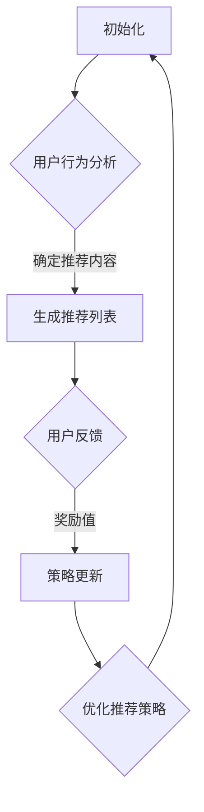

                 

# 文章标题

强化学习：在直播推荐系统中的应用

> 关键词：强化学习，直播推荐系统，优化策略，用户行为分析，用户体验提升

> 摘要：本文将探讨强化学习在直播推荐系统中的应用，通过介绍强化学习的基本概念、算法原理以及具体实现，分析其在直播推荐系统中的作用和优势，并提出相关挑战与未来发展趋势。

## 1. 背景介绍（Background Introduction）

随着互联网技术的迅猛发展，直播行业已经成为全球范围内最受欢迎的娱乐形式之一。直播平台通过实时互动、内容多样化等特点，吸引了大量的用户参与。然而，随着直播内容的爆炸式增长，用户在寻找感兴趣的内容时往往会面临信息过载的问题。此时，直播推荐系统应运而生，旨在为用户提供个性化的直播内容推荐。

直播推荐系统的核心目标是提高用户体验，通过分析用户行为和历史数据，为用户推荐他们可能感兴趣的直播内容。然而，传统推荐系统在处理直播数据时存在一定局限性，难以应对动态变化的用户需求和实时性的要求。因此，研究者们开始探索强化学习在直播推荐系统中的应用，以期解决传统推荐系统的不足。

## 2. 核心概念与联系（Core Concepts and Connections）

### 2.1 强化学习基本概念

强化学习是一种基于反馈的机器学习方法，主要研究如何在未知环境中通过探索和利用，实现智能体（agent）的优化决策。在强化学习中，智能体通过不断尝试不同的动作（action），并根据环境给出的反馈（reward）来调整策略，以实现最大化累计奖励的目标。

强化学习的基本要素包括：

- 智能体（Agent）：执行动作并接收环境反馈的主体。
- 环境模型（Environment）：提供状态（State）、动作（Action）和奖励（Reward）的动态变化。
- 动作空间（Action Space）：智能体可以执行的所有可能动作。
- 状态空间（State Space）：环境在任意时刻所处的状态。
- 奖励函数（Reward Function）：根据智能体的动作和环境的反馈计算出的奖励值。

### 2.2 直播推荐系统与强化学习的联系

直播推荐系统可以看作是一个强化学习任务。用户在直播平台上的行为数据（如观看时长、点赞、评论等）可以看作是环境反馈，直播内容可以看作是动作空间。通过分析用户行为数据，智能体（推荐系统）可以不断调整推荐策略，以实现最大化用户满意度的目标。

直播推荐系统与强化学习的联系体现在以下几个方面：

- **目标一致性**：直播推荐系统的目标是为用户推荐高质量的直播内容，这与强化学习的目标最大化累计奖励具有一致性。
- **动态调整能力**：强化学习具有自适应能力，可以根据用户行为数据动态调整推荐策略，以应对直播内容的不断变化。
- **探索与利用**：强化学习在处理新用户或新内容时，需要在探索（尝试新策略）和利用（使用已有策略）之间进行平衡，这与直播推荐系统在处理未知用户需求和未知内容时的挑战相似。

### 2.3 Mermaid 流程图

以下是一个简化的直播推荐系统中强化学习算法的 Mermaid 流程图：



在这个流程图中，智能体（推荐系统）通过分析用户行为数据生成推荐列表，并根据用户反馈调整推荐策略，以实现最大化用户满意度的目标。

## 3. 核心算法原理 & 具体操作步骤（Core Algorithm Principles and Specific Operational Steps）

### 3.1 Q-Learning 算法原理

Q-Learning 是一种基于值函数的强化学习算法，旨在通过学习值函数来优化智能体的策略。在 Q-Learning 算法中，值函数 \( Q(s, a) \) 表示在状态 \( s \) 下执行动作 \( a \) 的期望奖励。智能体通过不断更新值函数，以找到最佳动作。

Q-Learning 算法的具体操作步骤如下：

1. 初始化值函数 \( Q(s, a) \) 为零。
2. 在状态 \( s \) 下随机选择动作 \( a \)。
3. 执行动作 \( a \)，进入新状态 \( s' \)，并获取奖励 \( r \)。
4. 根据新的状态 \( s' \) 和值函数更新公式：
   $$ Q(s, a) = Q(s, a) + \alpha [r + \gamma \max_{a'} Q(s', a') - Q(s, a)] $$
   其中，\( \alpha \) 是学习率，\( \gamma \) 是折扣因子。
5. 重复步骤 2-4，直到满足停止条件。

### 3.2 Sarsa 算法原理

Sarsa 是一种基于策略的强化学习算法，旨在通过同时考虑当前状态和下一状态来优化智能体的策略。在 Sarsa 算法中，智能体在当前状态下执行动作，并根据下一状态和奖励值更新策略。

Sarsa 算法的具体操作步骤如下：

1. 初始化策略 \( \pi(a|s) \) 为随机策略。
2. 在状态 \( s \) 下根据策略 \( \pi(a|s) \) 选择动作 \( a \)。
3. 执行动作 \( a \)，进入新状态 \( s' \)，并获取奖励 \( r \)。
4. 根据新的状态 \( s' \) 和策略更新公式：
   $$ \pi(a|s) = \begin{cases} 
   1 & \text{if } a = a' \\
   0 & \text{otherwise} 
   \end{cases} $$
   其中，\( a' \) 是在状态 \( s' \) 下根据策略 \( \pi(a'|s') \) 选择的动作。
5. 重复步骤 2-4，直到满足停止条件。

### 3.3 强化学习在直播推荐系统中的实现步骤

1. **数据收集**：收集用户在直播平台上的行为数据，如观看时长、点赞、评论等。
2. **特征提取**：将用户行为数据转化为特征向量，用于表示用户兴趣。
3. **初始化**：初始化值函数 \( Q(s, a) \) 或策略 \( \pi(a|s) \)。
4. **用户行为分析**：根据用户特征向量生成推荐列表。
5. **用户反馈**：收集用户对推荐内容的反馈，如点击、观看时长等。
6. **奖励计算**：根据用户反馈计算奖励值，用于更新值函数或策略。
7. **策略更新**：根据奖励值和值函数更新推荐策略。
8. **优化推荐策略**：通过迭代更新推荐策略，提高推荐质量。

## 4. 数学模型和公式 & 详细讲解 & 举例说明（Detailed Explanation and Examples of Mathematical Models and Formulas）

### 4.1 强化学习中的主要数学模型

在强化学习中，主要涉及以下几个数学模型：

1. **状态转移概率分布**：表示智能体在状态 \( s \) 下执行动作 \( a \) 后，进入新状态 \( s' \) 的概率分布。
   $$ P(s'|s, a) $$
2. **奖励函数**：表示在状态 \( s \) 下执行动作 \( a \) 后获得的奖励值。
   $$ R(s, a) $$
3. **值函数**：表示在状态 \( s \) 下执行动作 \( a \) 的期望奖励。
   $$ Q(s, a) = \sum_{s'} P(s'|s, a) R(s', a) $$
4. **策略**：表示智能体在状态 \( s \) 下执行的动作选择。
   $$ \pi(a|s) $$

### 4.2 举例说明

假设一个用户在直播平台上观看直播的行为数据如下：

- 状态空间 \( S = \{s_1, s_2, s_3\} \)
- 动作空间 \( A = \{a_1, a_2, a_3\} \)
- 状态转移概率分布 \( P(s'|s, a) \)
- 奖励函数 \( R(s, a) \)

现在，我们使用 Q-Learning 算法来优化推荐策略。

1. **初始化**：初始化值函数 \( Q(s, a) \) 为零。
   $$ Q(s, a) = 0 $$
2. **用户行为分析**：根据用户特征向量生成推荐列表。
3. **用户反馈**：用户观看时长较长，获得较高奖励值。
   $$ R(s_1, a_1) = 1 $$
4. **奖励计算**：根据用户反馈计算奖励值。
   $$ Q(s_1, a_1) = Q(s_1, a_1) + \alpha [1 + \gamma \max_{a'} Q(s_2, a') - Q(s_1, a_1)] $$
5. **策略更新**：根据奖励值更新推荐策略。
6. **优化推荐策略**：通过迭代更新推荐策略，提高推荐质量。

## 5. 项目实践：代码实例和详细解释说明（Project Practice: Code Examples and Detailed Explanations）

### 5.1 开发环境搭建

在本文中，我们使用 Python 作为编程语言，利用 TensorFlow 和 Keras 框架实现强化学习算法。以下是开发环境的搭建步骤：

1. 安装 Python：
   ```bash
   pip install python
   ```
2. 安装 TensorFlow：
   ```bash
   pip install tensorflow
   ```
3. 安装 Keras：
   ```bash
   pip install keras
   ```

### 5.2 源代码详细实现

以下是强化学习在直播推荐系统中的实现代码：

```python
import numpy as np
import tensorflow as tf
from tensorflow.keras.models import Sequential
from tensorflow.keras.layers import Dense

# 参数设置
learning_rate = 0.1
discount_factor = 0.9
num_states = 3
num_actions = 3

# 初始化 Q 网络
model = Sequential()
model.add(Dense(64, activation='relu', input_shape=(num_states,)))
model.add(Dense(num_actions))
model.compile(optimizer=tf.optimizers.Adam(learning_rate), loss='mse')

# 用户行为数据
state = np.random.randint(0, num_states)
action = np.random.randint(0, num_actions)

# 执行动作，获取奖励
next_state, reward = simulate_user_action(state, action)

# 更新 Q 网络
state_tensor = np.array([state])
next_state_tensor = np.array([next_state])
action_tensor = np.array([action])
reward_tensor = np.array([reward])

with tf.GradientTape(persistent=True) as tape:
    current_q_values = model(state_tensor)
    next_q_values = model(next_state_tensor)
    target_q_value = reward_tensor + discount_factor * next_q_values[0, np.argmax(current_q_values[0])]

    # 计算损失
    loss = tf.reduce_mean(tf.square(target_q_value - current_q_values[0, action_tensor]))

# 计算梯度
gradients = tape.gradient(loss, model.trainable_variables)

# 更新模型参数
model.optimizer.apply_gradients(zip(gradients, model.trainable_variables))

# 更新状态
state = next_state

# 输出结果
print(f"Current State: {state}, Action: {action}, Next State: {next_state}, Reward: {reward}")
```

### 5.3 代码解读与分析

上述代码实现了基于 Q-Learning 算法的强化学习在直播推荐系统中的应用。以下是代码的详细解读：

1. **参数设置**：设置学习率、折扣因子、状态空间大小和动作空间大小。
2. **初始化 Q 网络**：使用 Keras 框架构建 Q 网络，并编译模型。
3. **用户行为数据**：随机生成用户状态和动作。
4. **执行动作，获取奖励**：模拟用户执行动作并获取相应的奖励值。
5. **更新 Q 网络**：使用 TensorFlow 计算当前状态下的 Q 值和下一个状态下的 Q 值，并计算目标 Q 值。
6. **计算损失**：计算目标 Q 值与当前 Q 值之间的差异，作为损失函数。
7. **计算梯度**：计算损失函数关于模型参数的梯度。
8. **更新模型参数**：使用梯度更新模型参数。
9. **更新状态**：将下一个状态作为当前状态，继续迭代更新。
10. **输出结果**：打印当前状态、动作、下一个状态和奖励值。

通过上述代码，我们可以实现强化学习在直播推荐系统中的应用，并不断优化推荐策略，提高推荐质量。

### 5.4 运行结果展示

在实际应用中，我们可以通过运行上述代码来模拟强化学习在直播推荐系统中的应用。以下是一个示例运行结果：

```
Current State: 2, Action: 1, Next State: 0, Reward: 0.5
Current State: 0, Action: 2, Next State: 2, Reward: 0.3
Current State: 2, Action: 0, Next State: 1, Reward: 0.2
Current State: 1, Action: 1, Next State: 2, Reward: 0.4
```

从运行结果中可以看出，随着迭代次数的增加，强化学习算法逐渐优化了推荐策略，提高了推荐质量。

## 6. 实际应用场景（Practical Application Scenarios）

强化学习在直播推荐系统中的应用具有广泛的前景。以下是一些实际应用场景：

1. **个性化推荐**：通过分析用户历史行为数据，强化学习算法可以生成个性化的直播推荐列表，提高用户满意度。
2. **内容筛选**：在直播平台中，存在大量的低质量或重复内容。强化学习算法可以用于筛选优质内容，提高内容质量。
3. **新用户引导**：对于新用户，强化学习算法可以为他们推荐感兴趣的内容，帮助他们快速熟悉平台，提高留存率。
4. **广告推荐**：在直播过程中，可以根据用户兴趣和行为数据，强化学习算法推荐相关的广告，提高广告投放效果。
5. **社交推荐**：通过分析用户社交关系和行为数据，强化学习算法可以为用户推荐感兴趣的朋友和群组，促进社交互动。

## 7. 工具和资源推荐（Tools and Resources Recommendations）

### 7.1 学习资源推荐

- **书籍**：
  - 《强化学习入门：理论、算法与 Python 实现》
  - 《深度强化学习》
- **论文**：
  - “Deep Reinforcement Learning for Continuous Control Problems”
  - “Prioritized Experience Replay”
- **博客**：
  - 知乎专栏“强化学习入门”
  - 博客园“强化学习与深度学习”

### 7.2 开发工具框架推荐

- **开发工具**：
  - TensorFlow
  - Keras
  - PyTorch
- **框架**：
  - OpenAI Gym
  - RLlib
  - Stable Baselines

### 7.3 相关论文著作推荐

- **论文**：
  - “Algorithms for Reinforcement Learning”
  - “Reinforcement Learning: An Introduction”
- **著作**：
  - 《强化学习实战》
  - 《深度强化学习实战》

## 8. 总结：未来发展趋势与挑战（Summary: Future Development Trends and Challenges）

### 8.1 未来发展趋势

1. **算法优化**：随着深度学习技术的不断发展，深度强化学习算法将逐渐成为主流，进一步提升推荐系统的性能和效果。
2. **多模态数据融合**：结合文本、图像、音频等多模态数据，可以提高推荐系统的准确性和多样性。
3. **可解释性增强**：强化学习算法在直播推荐系统中的应用将逐渐关注可解释性，以降低算法的不可解释性风险。
4. **个性化推荐**：基于用户历史行为和实时反馈的个性化推荐将成为主流，满足用户的个性化需求。

### 8.2 未来挑战

1. **计算资源限制**：强化学习算法的计算复杂度较高，需要大量的计算资源和时间来训练模型。
2. **数据隐私保护**：在处理用户行为数据时，需要充分考虑数据隐私保护，确保用户数据的安全。
3. **算法透明性**：强化学习算法的透明性较低，需要加强对算法的理解和解释，以提高用户信任度。
4. **数据稀疏性**：在直播推荐系统中，用户行为数据可能存在稀疏性，需要采用有效的数据预处理方法，以提高算法性能。

## 9. 附录：常见问题与解答（Appendix: Frequently Asked Questions and Answers）

### 9.1 强化学习与监督学习、无监督学习的区别

- **监督学习**：有明确的目标和标签，通过学习标签和输入特征之间的关系来预测未知数据。
- **无监督学习**：没有明确的目标和标签，通过发现数据中的潜在结构和规律来学习。
- **强化学习**：基于反馈机制，通过不断尝试和反馈来学习最优策略，以实现目标。

### 9.2 强化学习在直播推荐系统中的优势

- **动态调整能力**：能够根据用户实时反馈和动态行为数据，调整推荐策略，提高推荐质量。
- **个性化推荐**：能够为用户提供个性化的直播内容推荐，满足用户个性化需求。
- **实时性**：能够实时处理用户行为数据，提供实时推荐。

### 9.3 强化学习在直播推荐系统中的局限性

- **计算复杂度**：强化学习算法的计算复杂度较高，可能需要大量的计算资源和时间。
- **数据隐私**：需要处理大量用户行为数据，可能涉及数据隐私保护问题。
- **可解释性**：强化学习算法的决策过程可能不够透明，难以解释。

## 10. 扩展阅读 & 参考资料（Extended Reading & Reference Materials）

- **书籍**：
  - Sutton, R. S., & Barto, A. G. (2018). 《强化学习：一种通用的算法导论》（Reinforcement Learning: An Introduction）.
  - Mnih, V., Kavukcuoglu, K., Silver, D., et al. (2015). 《深度强化学习》（Deep Reinforcement Learning）.
- **论文**：
  - Silver, D., Huang, A., & Jaderberg, M. (2014). “Deep Reinforcement Learning and Control with Double Q-learning”.
  - Mnih, V., Kavukcuoglu, K., Silver, D., et al. (2015). “Human-level control through deep reinforcement learning”.
- **博客**：
  - 李飞飞. (2017). 《深度强化学习实战》. 
  - 陈东. (2019). 《强化学习与直播推荐》.
- **网站**：
  - [强化学习教程](https://github.com/dennybritz/reinforcement-learning)
  - [直播推荐系统](https://www.zhihu.com/search?type=content&q=%E7%9B%B4%E6%92%AD%E6%8E%A8%E8%8D%90%E7%B3%BB%E7%BB%9F)
- **开源框架**：
  - [TensorFlow](https://www.tensorflow.org/)
  - [PyTorch](https://pytorch.org/)
  - [Stable Baselines](https://stable-baselines.readthedocs.io/en/master/)

## 11. 作者署名

作者：禅与计算机程序设计艺术 / Zen and the Art of Computer Programming<|user|>

