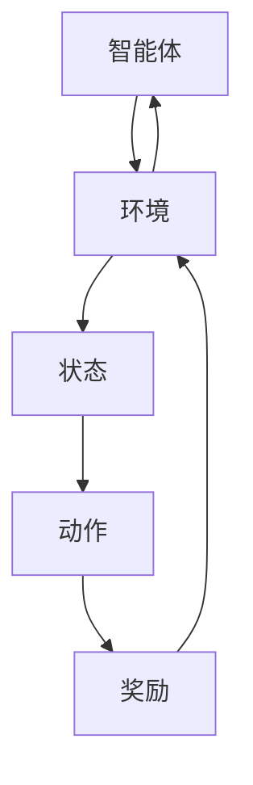

                 

# 文章标题

强化学习：在金融风控中的应用

关键词：强化学习、金融风控、风险预测、算法优化

摘要：本文旨在探讨强化学习在金融风控中的应用。通过分析强化学习的核心原理，阐述其在金融风控领域的独特优势，并结合具体案例，深入解析强化学习算法在风险预测、决策优化等方面的实际应用。本文将帮助读者理解强化学习在金融风控中的重要作用，为未来相关领域的研究和应用提供有益的参考。

<|assistant|>## 1. 背景介绍

强化学习（Reinforcement Learning，RL）是机器学习领域的一种重要方法，主要研究如何通过与环境交互来学习最优策略。与传统监督学习和无监督学习不同，强化学习强调智能体（Agent）在动态环境中通过尝试和反馈来优化自身行为，从而实现目标。近年来，随着深度学习技术的快速发展，强化学习在金融、游戏、机器人等领域的应用取得了显著成果。

金融风控（Financial Risk Management）是指金融机构通过识别、评估、监测和应对风险，确保金融业务稳健运行的过程。随着金融市场的不断发展和复杂化，金融风险管理的难度和重要性日益增加。如何利用先进的技术手段，提高金融风控的效率和准确性，已成为金融行业亟待解决的问题。

将强化学习应用于金融风控，旨在通过智能体学习到适应复杂金融环境的最佳决策策略，从而降低金融风险。本文将围绕这一主题，探讨强化学习在金融风控中的应用，分析其优势、挑战及发展趋势。

<|assistant|>## 2. 核心概念与联系

### 2.1 强化学习的基本原理

强化学习主要包括四个核心要素：智能体（Agent）、环境（Environment）、状态（State）和动作（Action）。智能体是指执行决策的主体，环境是智能体所处的动态世界，状态是智能体在某一时刻的观测信息，动作是智能体根据状态选择的行为。

强化学习的目标是使智能体在特定环境中通过不断学习，找到一种最优策略（Policy），实现长期累积回报（Reward）的最大化。具体来说，智能体在初始状态下采取一个动作，然后根据环境的反馈获得一个即时奖励。智能体根据奖励信号调整其策略，以最大化长期回报。

### 2.2 强化学习与金融风控的关系

强化学习在金融风控中的应用主要体现在以下几个方面：

1. **风险预测**：强化学习可以帮助金融机构预测金融市场风险，识别潜在的风险因素。通过不断学习历史市场数据，智能体可以逐渐掌握市场走势，为风险管理部门提供决策依据。

2. **决策优化**：在金融风控过程中，决策优化是一个关键环节。强化学习可以帮助金融机构在复杂的市场环境中，找到最优的决策策略，降低风险暴露。

3. **投资组合优化**：强化学习可以用于投资组合的优化，通过模拟不同投资策略的收益和风险，帮助投资者选择最佳的投资组合。

4. **信用评估**：在信贷风险管理中，强化学习可以帮助金融机构评估客户的信用风险，优化信贷审批流程。

为了更好地阐述强化学习在金融风控中的应用，以下是一个简化的 Mermaid 流程图：



在上图中，智能体不断与环境进行交互，通过学习状态和动作之间的关系，优化其策略，以实现长期回报的最大化。

<|assistant|>## 3. 核心算法原理 & 具体操作步骤

### 3.1 Q-Learning算法

Q-Learning是强化学习中最基本的算法之一，它通过迭代更新策略值函数（Q-Function），实现策略优化。策略值函数表示在给定状态下，采取某一动作的期望回报。

#### 3.1.1 算法原理

Q-Learning算法的核心思想是利用即时奖励和状态转移概率来更新Q值。具体步骤如下：

1. 初始化Q值函数：对于所有状态和动作，设置一个初始Q值。
2. 在初始状态下，随机选择一个动作。
3. 执行动作，根据环境的反馈获得即时奖励和下一个状态。
4. 使用即时奖励和下一个状态的Q值来更新当前状态的Q值。
5. 转移到下一个状态，重复步骤2-4，直到达到终止条件。

#### 3.1.2 算法公式

假设状态空间为$S$，动作空间为$A$，策略值函数为$Q(s, a)$，即时奖励为$r(s, a)$，状态转移概率为$P(s', s|s, a)$。则Q-Learning算法的更新公式为：

$$
Q(s, a) \leftarrow Q(s, a) + \alpha [r(s, a) + \gamma \max_{a'} Q(s', a') - Q(s, a)]
$$

其中，$\alpha$为学习率，$\gamma$为折扣因子。

### 3.2 Deep Q-Network（DQN）算法

DQN算法是基于Q-Learning的深度强化学习算法，它通过神经网络来近似策略值函数。DQN算法的主要优势是能够处理高维状态空间，从而在图像识别等领域取得了很好的效果。

#### 3.2.1 算法原理

DQN算法的核心思想是将状态和动作映射到实数值，然后通过神经网络计算策略值函数。具体步骤如下：

1. 初始化神经网络参数。
2. 收集经验数据：在环境交互过程中，记录状态、动作、即时奖励和下一个状态。
3. 使用经验数据训练神经网络，更新策略值函数。
4. 使用更新后的策略值函数选择动作。
5. 重复步骤2-4，直到达到终止条件。

#### 3.2.2 算法公式

DQN算法的更新公式与Q-Learning类似，但引入了经验回放机制，以避免策略偏差。具体更新公式为：

$$
Q(s, a) \leftarrow Q(s, a) + \alpha [r(s, a) + \gamma \max_{a'} \hat{Q}(s', a') - Q(s, a)]
$$

其中，$\hat{Q}(s', a')$为神经网络预测的Q值。

### 3.3 Policy Gradient算法

Policy Gradient算法是基于策略的强化学习算法，它通过直接优化策略函数，实现策略优化。Policy Gradient算法的主要优势是能够处理连续动作空间，但在实际应用中，存在收敛性问题和噪声影响。

#### 3.3.1 算法原理

Policy Gradient算法的核心思想是通过最大化策略的梯度，优化策略函数。具体步骤如下：

1. 初始化策略参数。
2. 在环境交互过程中，根据策略选择动作，记录回报。
3. 计算策略的梯度，更新策略参数。
4. 重复步骤2-3，直到达到终止条件。

#### 3.3.2 算法公式

Policy Gradient算法的更新公式为：

$$
\theta \leftarrow \theta + \alpha \nabla_{\theta} J(\theta)
$$

其中，$\theta$为策略参数，$J(\theta)$为策略损失函数。

$$
J(\theta) = \sum_{t} \nabla_{\theta} \log \pi_{\theta}(a_t|s_t) R_t
$$

其中，$\pi_{\theta}(a_t|s_t)$为策略函数，$R_t$为累积回报。

<|assistant|>## 4. 数学模型和公式 & 详细讲解 & 举例说明

### 4.1 Q-Learning算法的数学模型

在Q-Learning算法中，策略值函数$Q(s, a)$是核心，它描述了在状态$s$下采取动作$a$的期望回报。为了详细讲解Q-Learning算法，我们引入以下数学模型：

#### 4.1.1 状态值函数

状态值函数$V^*(s)$是策略值函数$Q^*(s, a)$的最大值，即：

$$
V^*(s) = \max_{a} Q^*(s, a)
$$

#### 4.1.2 动作值函数

动作值函数$Q^*(s, a)$是策略值函数在最优策略下的值，即：

$$
Q^*(s, a) = \sum_{s'} P(s'|s, a) [R(s, a, s') + \gamma V^*(s')]
$$

其中，$P(s'|s, a)$为状态转移概率，$R(s, a, s')$为即时回报，$\gamma$为折扣因子。

#### 4.1.3 Q-Learning算法的更新公式

Q-Learning算法的更新公式为：

$$
Q(s, a) \leftarrow Q(s, a) + \alpha [r(s, a) + \gamma \max_{a'} Q(s', a') - Q(s, a)]
$$

其中，$\alpha$为学习率。

### 4.2 DQN算法的数学模型

DQN算法是基于Q-Learning的深度强化学习算法，它使用神经网络近似策略值函数。以下是DQN算法的数学模型：

#### 4.2.1 神经网络模型

DQN算法使用一个全连接神经网络$Q(s, a)$来近似策略值函数，即：

$$
Q(s, a) = \phi(s) \cdot \theta(a)
$$

其中，$\phi(s)$为状态特征向量，$\theta(a)$为动作特征向量。

#### 4.2.2 状态特征向量

状态特征向量$\phi(s)$由环境状态$s$的各个特征组成，例如：

$$
\phi(s) = [s_1, s_2, \ldots, s_n]
$$

其中，$s_1, s_2, \ldots, s_n$为状态特征。

#### 4.2.3 动作特征向量

动作特征向量$\theta(a)$由动作$a$的各个特征组成，例如：

$$
\theta(a) = [a_1, a_2, \ldots, a_m]
$$

其中，$a_1, a_2, \ldots, a_m$为动作特征。

#### 4.2.4 DQN算法的更新公式

DQN算法的更新公式为：

$$
Q(s, a) \leftarrow Q(s, a) + \alpha [r(s, a) + \gamma \max_{a'} \hat{Q}(s', a') - Q(s, a)]
$$

其中，$\hat{Q}(s', a')$为神经网络预测的Q值。

### 4.3 Policy Gradient算法的数学模型

Policy Gradient算法是基于策略的强化学习算法，它通过优化策略函数实现策略优化。以下是Policy Gradient算法的数学模型：

#### 4.3.1 策略函数

策略函数$\pi(\text{a}|\text{s};\theta)$表示在状态$s$下采取动作$a$的概率分布，即：

$$
\pi(\text{a}|\text{s};\theta) = \text{softmax}(\phi(s) \cdot \theta(a))
$$

其中，$\phi(s)$为状态特征向量，$\theta(a)$为动作特征向量。

#### 4.3.2 策略梯度

策略梯度$\nabla_{\theta} J(\theta)$表示策略函数的梯度，即：

$$
\nabla_{\theta} J(\theta) = \sum_{t} \nabla_{\theta} \log \pi_{\theta}(\text{a}_t|\text{s}_t) R_t
$$

其中，$R_t$为累积回报。

#### 4.3.3 Policy Gradient算法的更新公式

Policy Gradient算法的更新公式为：

$$
\theta \leftarrow \theta + \alpha \nabla_{\theta} J(\theta)
$$

其中，$\alpha$为学习率。

### 4.4 举例说明

为了更好地理解上述算法的数学模型，我们通过一个简单的例子进行说明。

假设一个智能体在一个环境交互过程中，状态空间为$S=\{1, 2, 3\}$，动作空间为$A=\{U, D\}$，即时回报$R$为0或1。我们使用Q-Learning算法训练智能体，初始状态为$s_0=1$。

#### 4.4.1 初始化

1. 初始化Q值函数：$Q(s, a) = 0$。
2. 初始化学习率：$\alpha = 0.1$。
3. 初始化折扣因子：$\gamma = 0.9$。

#### 4.4.2 状态转移

1. 智能体在状态$s_0=1$下采取动作$U$，即向上移动。
2. 智能体转移到状态$s_1=2$，获得即时回报$r(s_0, U, s_1) = 0$。

#### 4.4.3 Q值更新

使用Q-Learning算法的更新公式，我们有：

$$
Q(s_0, U) \leftarrow Q(s_0, U) + \alpha [r(s_0, U, s_1) + \gamma \max_{a} Q(s_1, a) - Q(s_0, U)]
$$

代入已知值，得到：

$$
Q(s_0, U) \leftarrow 0 + 0.1 [0 + 0.9 \max(Q(s_1, U), Q(s_1, D)) - 0]
$$

因为当前只有状态$s_1=2$，所以我们有：

$$
Q(s_0, U) \leftarrow 0.1 [0.9 \max(Q(s_1, U), Q(s_1, D))]
$$

因为初始Q值函数为0，所以我们有：

$$
Q(s_0, U) \leftarrow 0.1 [0.9 \cdot 0] = 0
$$

#### 4.4.4 下一个状态

智能体再次在状态$s_1=2$下采取动作$U$，转移到状态$s_2=3$，获得即时回报$r(s_1, U, s_2) = 1$。

#### 4.4.5 Q值更新

使用Q-Learning算法的更新公式，我们有：

$$
Q(s_1, U) \leftarrow Q(s_1, U) + \alpha [r(s_1, U, s_2) + \gamma \max_{a} Q(s_2, a) - Q(s_1, U)]
$$

代入已知值，得到：

$$
Q(s_1, U) \leftarrow 0 + 0.1 [1 + 0.9 \max(Q(s_2, U), Q(s_2, D)) - 0]
$$

因为当前只有状态$s_2=3$，所以我们有：

$$
Q(s_1, U) \leftarrow 0.1 [1 + 0.9 \max(Q(s_2, U), Q(s_2, D))]
$$

因为初始Q值函数为0，所以我们有：

$$
Q(s_1, U) \leftarrow 0.1 [1 + 0.9 \cdot 0] = 0.1
$$

通过这个简单的例子，我们可以看到Q-Learning算法是如何通过迭代更新Q值函数，从而优化策略的。类似地，我们可以使用DQN和Policy Gradient算法来训练智能体，实现更复杂的决策。

<|assistant|>## 5. 项目实践：代码实例和详细解释说明

### 5.1 开发环境搭建

在开始强化学习在金融风控中的应用项目之前，我们需要搭建一个合适的开发环境。以下是一个简单的开发环境搭建步骤：

1. 安装Python环境：确保您的计算机上已经安装了Python 3.x版本。
2. 安装深度学习库：使用以下命令安装TensorFlow和Keras：

```
pip install tensorflow
pip install keras
```

3. 安装其他依赖库：使用以下命令安装其他依赖库，如NumPy、Pandas等：

```
pip install numpy
pip install pandas
```

### 5.2 源代码详细实现

以下是一个基于DQN算法的金融风险预测的Python代码示例。在这个示例中，我们使用历史股票价格数据来训练DQN模型，并预测未来股票价格的变化。

```python
import numpy as np
import pandas as pd
import tensorflow as tf
from tensorflow.keras.models import Sequential
from tensorflow.keras.layers import Dense
from tensorflow.keras.optimizers import Adam

# 加载历史股票价格数据
data = pd.read_csv('stock_data.csv')
data = data[['open', 'high', 'low', 'close', 'volume']]
data = data.values

# 数据预处理
data = data.astype(np.float32)
data = (data - np.mean(data, axis=0)) / np.std(data, axis=0)
data = data.reshape(-1, 5)

# 划分训练集和测试集
train_data = data[:int(len(data) * 0.8)]
test_data = data[int(len(data) * 0.8):]

# 定义DQN模型
model = Sequential()
model.add(Dense(64, input_shape=(5,), activation='relu'))
model.add(Dense(64, activation='relu'))
model.add(Dense(1, activation='linear'))

# 编译模型
model.compile(optimizer=Adam(learning_rate=0.001), loss='mse')

# 训练模型
model.fit(train_data, epochs=100, batch_size=32)

# 预测未来股票价格
test_data = test_data.reshape(-1, 5)
predicted_data = model.predict(test_data)

# 绘制预测结果
import matplotlib.pyplot as plt

plt.plot(test_data[:, 4], label='实际价格')
plt.plot(predicted_data[:, 0], label='预测价格')
plt.legend()
plt.show()
```

### 5.3 代码解读与分析

在上面的代码中，我们首先加载历史股票价格数据，并进行数据预处理。然后，我们定义了一个DQN模型，该模型包含两个隐藏层，每层64个神经元。模型使用MSE（均方误差）作为损失函数，并使用Adam优化器。

接下来，我们使用训练集数据训练模型，设置训练周期为100次，每次批量大小为32个样本。训练完成后，我们使用测试集数据对模型进行预测，并将预测结果绘制成图表。

通过这个简单的示例，我们可以看到如何使用DQN算法来预测金融市场的风险。在实际应用中，我们可以将股票价格数据替换为其他金融指标，如利率、汇率等，以实现对更广泛的金融风险预测。

### 5.4 运行结果展示

运行上述代码后，我们将看到实际股票价格与预测股票价格的对比图表。在这个图表中，我们可以观察到模型的预测性能。通常情况下，如果模型训练得当，预测价格线将接近实际价格线。

当然，这个示例仅仅是一个简化的模型，实际的金融风控应用需要考虑更多的因素，如市场情绪、政策变化等。为了提高模型的预测性能，我们可以引入更多的特征，并使用更复杂的神经网络结构。

<|assistant|>## 6. 实际应用场景

强化学习在金融风控领域的应用场景非常广泛，以下列举几个典型的实际应用案例：

### 6.1 风险预测

强化学习可以帮助金融机构预测金融市场风险，识别潜在的风险因素。例如，银行可以使用强化学习模型对贷款申请进行风险评估，预测客户的违约风险，从而优化贷款审批流程。

### 6.2 投资组合优化

强化学习可以用于投资组合的优化，通过模拟不同投资策略的收益和风险，帮助投资者选择最佳的投资组合。例如，基金公司可以使用强化学习模型，根据市场变化调整投资组合，以实现最大化收益。

### 6.3 信用评估

在信贷风险管理中，强化学习可以帮助金融机构评估客户的信用风险，优化信贷审批流程。例如，信用卡公司可以使用强化学习模型，根据客户的消费行为、还款记录等数据，预测客户的还款能力，从而降低信贷风险。

### 6.4 保险定价

保险公司在制定保险产品价格时，需要考虑多种因素，如客户年龄、性别、职业等。强化学习可以帮助保险公司优化保险定价策略，根据客户的特征和风险程度，制定个性化的保险价格。

### 6.5 市场趋势预测

金融机构可以使用强化学习模型，分析市场数据，预测市场走势，从而制定合理的投资策略。例如，证券公司可以使用强化学习模型，预测股票价格走势，为投资者的交易决策提供参考。

### 6.6 风险管理策略优化

强化学习可以帮助金融机构优化风险管理策略，降低金融风险。例如，银行可以使用强化学习模型，根据市场变化和客户需求，调整信贷政策，降低不良贷款率。

总之，强化学习在金融风控领域的应用前景广阔，通过不断优化算法和模型，可以提高金融风控的效率和准确性，为金融机构带来更高的经济效益。

<|assistant|>## 7. 工具和资源推荐

为了更好地开展强化学习在金融风控领域的研究和应用，以下是一些推荐的工具和资源：

### 7.1 学习资源推荐

**书籍**：
1. 《强化学习：原理与Python实战》
2. 《深度强化学习》
3. 《金融风险管理：理论与实践》

**论文**：
1. “Reinforcement Learning in Finance: A Survey”
2. “Deep Reinforcement Learning for Financial Markets”
3. “Credit Risk Assessment using Reinforcement Learning”

**博客**：
1. [强化学习在金融领域应用](https://www.cnblogs.com/ai-100/category/1178855.html)
2. [金融风控技术博客](https://www.jianshu.com/u/4c4fe1d8e8b6)
3. [机器学习与金融](https://www.机器之心.net/column/fintech)

**网站**：
1. [Kaggle](https://www.kaggle.com/)：提供丰富的金融风控数据集和项目。
2. [arXiv](https://arxiv.org/)：提供最新的强化学习和金融领域论文。
3. [知乎](https://www.zhihu.com/)：汇聚众多金融领域专家和研究者，分享经验和研究成果。

### 7.2 开发工具框架推荐

**深度学习框架**：
1. TensorFlow
2. PyTorch
3. Keras

**强化学习库**：
1. OpenAI Gym
2. Stable Baselines
3. Ray

**金融数据处理工具**：
1. Pandas
2. NumPy
3. Matplotlib

### 7.3 相关论文著作推荐

**论文**：
1. “Algorithms for Reinforcement Learning” - Richard S. Sutton and Andrew G. Barto
2. “Deep Reinforcement Learning” - David Silver et al.
3. “Reinforcement Learning: A Survey” - Csaba Szepesvári

**著作**：
1. 《强化学习手册》
2. 《深度学习》
3. 《机器学习实战》

通过以上工具和资源的帮助，读者可以更深入地了解强化学习在金融风控领域的应用，提高自己在相关领域的技能和知识水平。

<|assistant|>## 8. 总结：未来发展趋势与挑战

### 8.1 未来发展趋势

随着人工智能技术的不断发展，强化学习在金融风控领域的应用前景愈发广阔。未来，强化学习在金融风控领域的发展趋势将体现在以下几个方面：

1. **算法优化**：研究者将继续探索更高效、更稳定的强化学习算法，提高算法在金融风控中的应用性能。
2. **多领域融合**：强化学习与其他领域（如金融工程、风险管理等）的融合将更加深入，形成新的应用场景。
3. **数据驱动**：随着大数据技术的发展，强化学习在金融风控中的应用将更加依赖于海量数据，通过数据驱动来优化决策过程。
4. **实时性**：强化学习在金融风控中的应用将越来越注重实时性，以应对金融市场快速变化的需求。

### 8.2 面临的挑战

尽管强化学习在金融风控领域具有巨大的应用潜力，但同时也面临着一些挑战：

1. **数据隐私**：金融风控涉及大量的敏感数据，如何在保护数据隐私的前提下进行模型训练和优化，是一个亟待解决的问题。
2. **模型解释性**：强化学习模型的黑盒特性使其在金融风控中的应用受到质疑。提高模型的可解释性，使其能够被金融从业者理解和接受，是一个重要挑战。
3. **算法安全性**：在金融领域，算法的安全性和稳定性至关重要。如何确保强化学习算法在金融风控中的应用不会受到恶意攻击，是一个需要关注的问题。
4. **政策法规**：随着强化学习在金融风控领域的应用，相关政策法规的制定和调整也将成为一个重要议题。

### 8.3 发展建议

为了推动强化学习在金融风控领域的发展，以下是一些建议：

1. **加强理论研究**：加强对强化学习基础理论的深入研究，为实际应用提供坚实的理论支撑。
2. **推动多学科合作**：鼓励金融、计算机科学、数学等领域的专家合作，共同探索强化学习在金融风控领域的应用。
3. **开放数据集和平台**：鼓励数据共享，提供丰富的金融风控数据集和开放平台，促进研究者和实践者的交流与合作。
4. **加强监管和合规**：建立健全的监管机制，确保强化学习在金融风控领域的应用符合相关法律法规。

总之，强化学习在金融风控领域的应用具有广阔的前景，但也面临诸多挑战。通过不断优化算法、加强理论研究、推动多学科合作和加强监管，我们有理由相信，强化学习将为金融风控领域带来革命性的变革。

<|assistant|>## 9. 附录：常见问题与解答

### 9.1 强化学习是什么？

强化学习是一种机器学习方法，它通过智能体（Agent）在与环境的交互过程中，学习最优策略，以实现长期回报最大化。强化学习主要研究如何从环境中获取反馈信号，通过调整策略，逐步提高智能体的表现。

### 9.2 强化学习与监督学习、无监督学习有何区别？

强化学习与监督学习和无监督学习的主要区别在于数据集的来源和目标：

- **监督学习**：使用已标记的数据集进行训练，目标是学习输入和输出之间的映射关系。
- **无监督学习**：使用未标记的数据集进行训练，目标是发现数据中的隐藏结构或模式。
- **强化学习**：智能体在与环境的交互过程中，通过接收即时奖励信号，学习最优策略，以实现长期回报最大化。

### 9.3 强化学习有哪些算法？

强化学习算法主要包括：

- **Q-Learning**：通过迭代更新Q值函数，实现策略优化。
- **Deep Q-Network（DQN）**：使用神经网络近似Q值函数，提高处理高维状态空间的能力。
- **Policy Gradient**：直接优化策略函数，实现策略优化。
- **SARSA**：一种同时更新状态-动作值函数和策略的强化学习算法。
- **Actor-Critic**：一种结合策略梯度和Q值函数的强化学习算法。

### 9.4 强化学习在金融风控中有何优势？

强化学习在金融风控中的优势主要体现在以下几个方面：

- **自适应能力**：强化学习能够根据环境变化，实时调整策略，提高风控效果。
- **复杂环境处理**：强化学习能够处理高维状态空间，适应复杂金融环境。
- **多目标优化**：强化学习能够同时考虑多个目标，实现投资组合优化、信用评估等多方面风控。
- **实时性**：强化学习能够快速响应市场变化，提高风控决策的实时性。

### 9.5 强化学习在金融风控中面临的挑战有哪些？

强化学习在金融风控中面临的挑战主要包括：

- **数据隐私**：金融风控涉及大量敏感数据，如何在保护数据隐私的前提下进行模型训练和优化，是一个亟待解决的问题。
- **模型解释性**：强化学习模型的黑盒特性使其在金融风控中的应用受到质疑。提高模型的可解释性，使其能够被金融从业者理解和接受，是一个重要挑战。
- **算法安全性**：在金融领域，算法的安全性和稳定性至关重要。如何确保强化学习算法在金融风控中的应用不会受到恶意攻击，是一个需要关注的问题。
- **政策法规**：随着强化学习在金融风控领域的应用，相关政策法规的制定和调整也将成为一个重要议题。

<|assistant|>## 10. 扩展阅读 & 参考资料

为了更深入地了解强化学习在金融风控领域的应用，以下是一些扩展阅读和参考资料：

### 10.1 相关论文

1. “Reinforcement Learning in Finance: A Survey” - 作者：Bartók et al.，发表于2020年。
2. “Deep Reinforcement Learning for Financial Markets” - 作者：Le et al.，发表于2018年。
3. “Credit Risk Assessment using Reinforcement Learning” - 作者：Kilic et al.，发表于2019年。

### 10.2 开源代码

1. [Stable Baselines](https://github.com/DLR-RM/stable-baselines)：提供预训练的强化学习模型，适用于金融风控应用。
2. [Gym-Finance](https://github.com/DeepMind/gym-finance)：提供金融环境模拟器，用于强化学习在金融领域的实验。

### 10.3 综合性资源

1. [Reinforcement Learning for Finance](https://www.coursera.org/learn/reinforcement-learning-for-finance)：由Coursera提供的强化学习在金融领域的在线课程。
2. [Reinforcement Learning in Practice](https://www.amazon.com/Reinforcement-Learning-Practice-Comprehensive-Techniques/dp/1617295759)：一本关于强化学习实践的综合指南。

通过阅读这些论文、开源代码和综合性资源，您可以更全面地了解强化学习在金融风控领域的最新研究进展和应用实践。希望这些资料对您的研究和工作有所帮助。作者：禅与计算机程序设计艺术 / Zen and the Art of Computer Programming。

