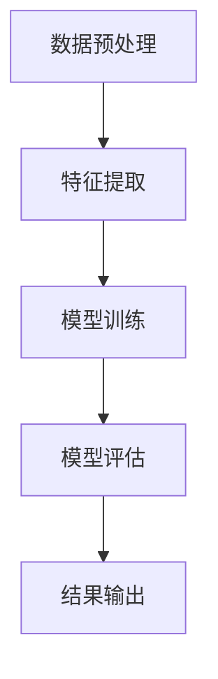
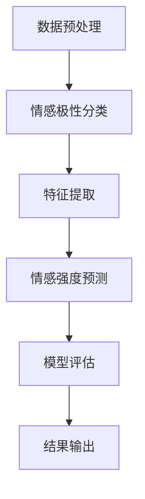
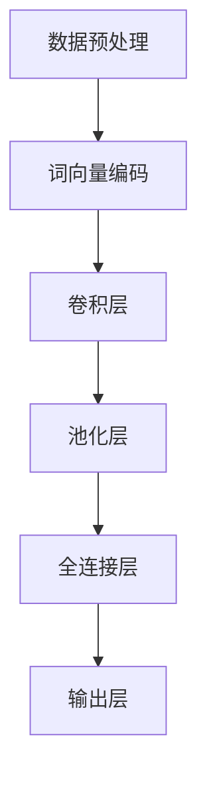
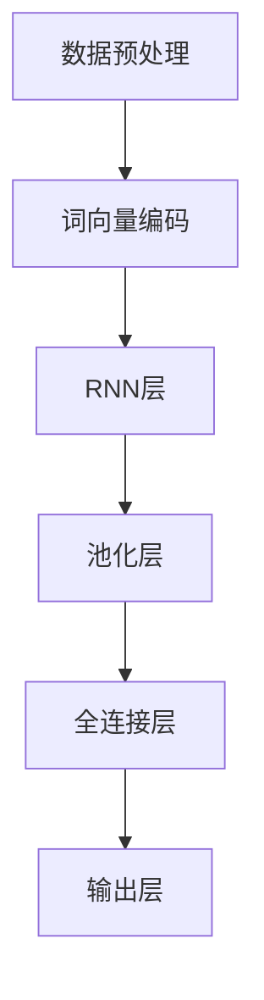
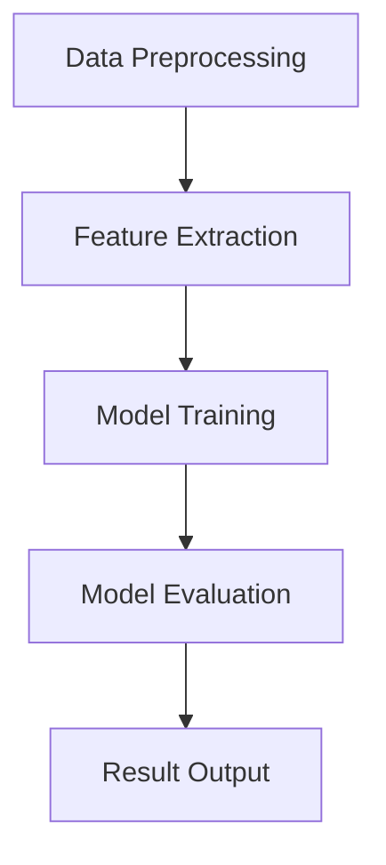
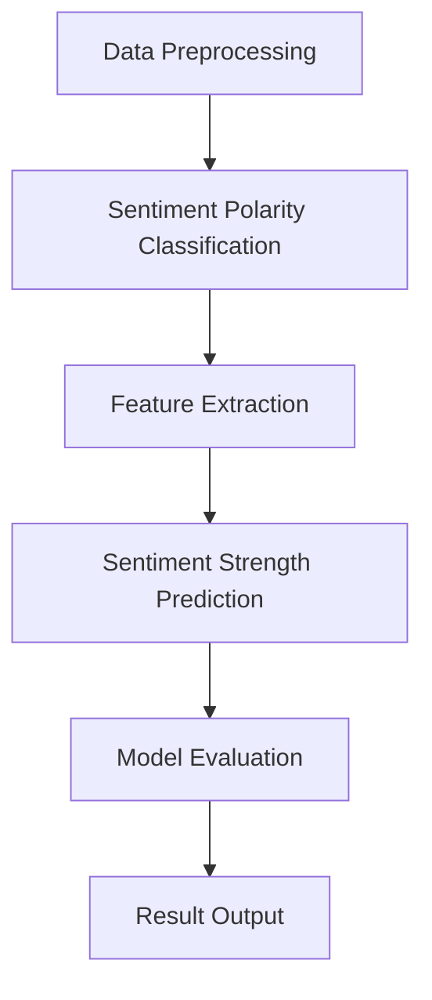
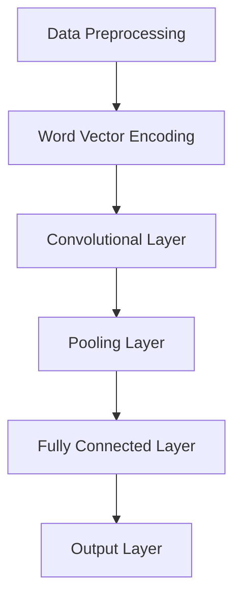
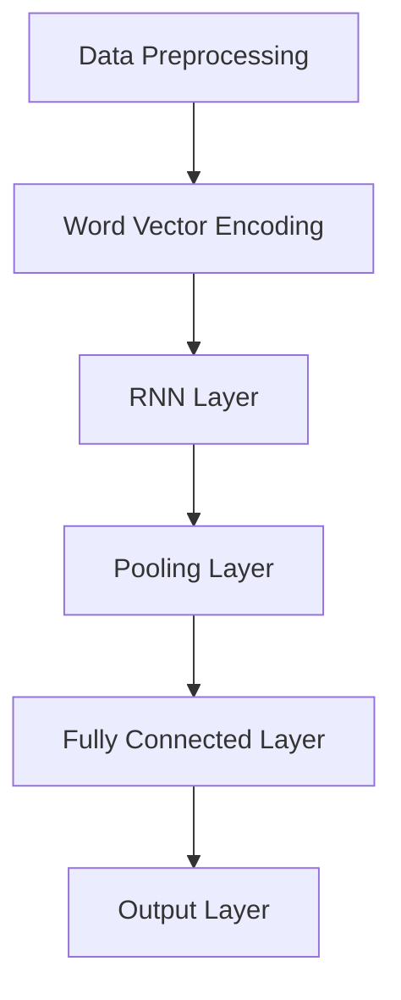

                 

### 文章标题

### Title

《情感分析技术：AI的应用》

### Emotional Analysis Technology: The Application of AI

情感分析技术是人工智能领域的一项重要应用，它通过自然语言处理技术，从文本中提取情感信息，帮助我们更好地理解和预测用户情感，进而为商业决策、舆情监控、智能客服等领域提供有力支持。本文将深入探讨情感分析技术的基本概念、核心算法、数学模型以及实际应用场景，并推荐一些实用的学习资源和开发工具。

### Emotional Analysis Technology: AI Applications

Emotional analysis technology, a significant application in the field of artificial intelligence, leverages natural language processing to extract emotional information from text. This allows us to better understand and predict user emotions, providing powerful support for business decision-making, public opinion monitoring, intelligent customer service, and other fields. This article will delve into the basic concepts, core algorithms, mathematical models, and practical applications of emotional analysis technology, along with recommendations for useful learning resources and development tools.

### 摘要

本文旨在介绍情感分析技术的基本概念和实际应用。首先，我们将回顾情感分析技术的发展历程，并探讨其核心算法，包括朴素贝叶斯、支持向量机和深度学习等。接着，我们将详细介绍情感分析中的数学模型，如情感极性分类和情感强度评估。随后，我们将通过一个具体的情感分析项目，展示如何实现和应用情感分析技术。最后，本文将讨论情感分析技术的未来发展趋势和挑战，并推荐一些学习资源和开发工具，以帮助读者进一步了解和掌握这一领域。

### Abstract

This article aims to introduce the basic concepts and practical applications of emotional analysis technology. Firstly, we will review the development history of emotional analysis technology and discuss its core algorithms, including Naive Bayes, Support Vector Machines, and Deep Learning. Then, we will delve into the mathematical models used in emotional analysis, such as sentiment polarity classification and sentiment strength assessment. Subsequently, we will demonstrate how to implement and apply emotional analysis technology through a specific emotional analysis project. Finally, this article will discuss the future development trends and challenges of emotional analysis technology, along with recommendations for learning resources and development tools to help readers further understand and master this field.

### 1. 背景介绍（Background Introduction）

#### 1.1 情感分析的定义和目的

情感分析，也被称为意见挖掘或情感识别，是一种自然语言处理技术，用于识别文本中表达的情感倾向。情感分析的主要目的是从大量的非结构化文本数据中提取出有意义的情感信息，以便更好地理解用户需求、市场趋势和公众舆论。

情感分析技术的基本流程包括以下几个步骤：

1. **文本预处理**：对原始文本进行清洗、去噪和格式化，以便于后续分析。这一步骤通常包括分词、去除停用词、词性标注等操作。
2. **特征提取**：将预处理后的文本转换为可以输入模型的特征向量。常用的特征提取方法包括词袋模型、TF-IDF、Word2Vec等。
3. **情感分类**：利用训练好的模型对特征向量进行情感分类，常见的分类方法有朴素贝叶斯、支持向量机和神经网络等。
4. **结果评估**：对模型的性能进行评估，通常使用准确率、召回率和F1值等指标。

#### 1.2 情感分析的应用领域

情感分析技术在多个领域都有广泛的应用，以下是一些典型的应用场景：

1. **社交媒体分析**：通过分析社交媒体平台上的用户评论和帖子，企业可以了解用户对其产品或服务的态度，从而进行市场调研和品牌监控。
2. **舆情监控**：政府机构或企业可以利用情感分析技术实时监控公众对某一事件或政策的看法，以便及时应对舆论风险。
3. **智能客服**：情感分析技术可以帮助智能客服系统更好地理解用户的情感状态，提供更个性化的服务，提高用户满意度。
4. **健康医疗**：通过对患者病历、病历记录和社交媒体帖子的情感分析，医生可以更准确地了解患者的心理状态，为诊断和治疗提供参考。
5. **金融领域**：金融分析师可以利用情感分析技术分析市场情绪，预测股价走势和投资风险。

#### 1.3 情感分析技术的发展历程

情感分析技术的研究可以追溯到20世纪90年代，随着自然语言处理技术和计算能力的提升，情感分析逐渐成为人工智能领域的一个重要分支。以下是一些重要的里程碑：

1. **早期方法**：早期的情感分析方法主要包括基于规则的方法和基于机器学习的方法。基于规则的方法依赖于手动的特征工程，而基于机器学习的方法则通过学习大量的标注数据来进行情感分类。
2. **文本分类算法**：随着文本分类技术的发展，朴素贝叶斯、支持向量机和决策树等经典机器学习算法在情感分析中得到了广泛应用。
3. **深度学习方法**：深度学习技术的引入，如卷积神经网络（CNN）和循环神经网络（RNN），极大地提升了情感分析的性能，尤其是对复杂情感和隐含情感的识别。

### 1.1 Definition and Purpose of Emotional Analysis

Emotional analysis, also known as opinion mining or sentiment recognition, is a natural language processing technique that identifies emotional tendencies expressed in text. The primary goal of emotional analysis is to extract meaningful emotional information from large volumes of unstructured text data to better understand user needs, market trends, and public opinions.

The basic process of emotional analysis technology involves several steps:

1. **Text Preprocessing**: Clean, denoise, and format the raw text to facilitate subsequent analysis. This step typically includes tokenization, stop-word removal, and part-of-speech tagging.

2. **Feature Extraction**: Convert the preprocessed text into feature vectors that can be input into models. Common feature extraction methods include Bag of Words, TF-IDF, and Word2Vec.

3. **Sentiment Classification**: Use trained models to classify feature vectors into emotional categories. Common classification methods include Naive Bayes, Support Vector Machines, and Neural Networks.

4. **Result Evaluation**: Evaluate the performance of the model, typically using metrics such as accuracy, recall, and F1 score.

#### 1.2 Application Fields of Emotional Analysis

Emotional analysis technology has a wide range of applications in various fields. The following are some typical application scenarios:

1. **Social Media Analysis**: By analyzing user comments and posts on social media platforms, companies can understand user attitudes towards their products or services, facilitating market research and brand monitoring.

2. **Public Opinion Monitoring**: Government agencies or companies can use emotional analysis technology to monitor public opinions on events or policies in real-time, allowing for timely responses to public opinion risks.

3. **Intelligent Customer Service**: Emotional analysis technology can help intelligent customer service systems better understand user emotional states, providing more personalized services and improving user satisfaction.

4. **Healthcare**: By analyzing patient medical records, social media posts, and other text data, doctors can gain a more accurate understanding of patients' psychological states, providing references for diagnosis and treatment.

5. **Financial Sector**: Financial analysts can use emotional analysis technology to analyze market sentiment, predict stock price movements, and assess investment risks.

#### 1.3 Development History of Emotional Analysis Technology

The research in emotional analysis technology dates back to the 1990s. With the advancement of natural language processing technologies and computational power, emotional analysis has gradually become an important branch of artificial intelligence. The following are some significant milestones:

1. **Early Methods**: Early emotional analysis methods included rule-based approaches and machine learning approaches. Rule-based methods relied on manual feature engineering, while machine learning methods learned from large labeled data sets for emotional classification.

2. **Text Classification Algorithms**: With the development of text classification technology, classical machine learning algorithms such as Naive Bayes, Support Vector Machines, and Decision Trees have been widely used in emotional analysis.

3. **Deep Learning Methods**: The introduction of deep learning techniques, such as Convolutional Neural Networks (CNN) and Recurrent Neural Networks (RNN), has greatly improved the performance of emotional analysis, especially in the identification of complex and implicit emotions.

## 2. 核心概念与联系（Core Concepts and Connections）

### 2.1 情感极性分类（Sentiment Polarity Classification）

情感极性分类是情感分析中最基本的一个任务，它的目标是将文本分类为正面、负面或中性。正面情感通常表示积极、满意、喜欢等，而负面情感则表示消极、不满意、厌恶等。中性情感则介于正面和负面之间，表示没有明显的情感倾向。

情感极性分类的核心在于如何准确地将文本映射到三个类别之一。这通常需要大量的标注数据来训练分类模型。以下是一个简单的情感极性分类的 Mermaid 流程图：



在数据预处理阶段，我们需要对原始文本进行清洗、去噪和格式化，以便后续的特征提取。特征提取是将文本转换为可以输入模型的特征向量，常用的方法包括词袋模型和TF-IDF。模型训练阶段，我们使用标注数据来训练分类模型，常见的算法有朴素贝叶斯和支持向量机。模型评估阶段，我们使用测试数据来评估模型的性能，常用的指标有准确率、召回率和F1值。最后，结果输出阶段，我们将模型的预测结果输出为情感极性分类的结果。

### 2.2 情感强度评估（Sentiment Strength Assessment）

情感强度评估的目标是量化文本中情感的程度，即情感极性分类的细化。情感强度通常用数值来表示，如正面情感强度从0到1，或负面情感强度从-1到0。情感强度评估比情感极性分类更复杂，因为它需要模型能够捕捉到文本中的情感细微差别。

情感强度评估的流程与情感极性分类类似，但涉及到更多的特征工程和复杂的模型架构。以下是一个情感强度评估的 Mermaid 流程图：



在数据预处理阶段，我们同样需要对文本进行清洗、去噪和格式化。在情感极性分类阶段，我们首先对文本进行情感极性分类。然后，在特征提取阶段，我们需要提取能够表示情感强度的特征，如情感词的词频、情感词的权重等。在情感强度预测阶段，我们使用训练好的模型来预测文本的情感强度。最后，在模型评估和结果输出阶段，我们使用测试数据来评估模型的性能，并将预测结果输出。

### 2.3 情感分析中的深度学习（Deep Learning in Emotional Analysis）

深度学习在情感分析中的应用日益广泛，它通过学习大量的文本数据，可以自动提取复杂的特征，从而提高情感分析的性能。常见的深度学习模型包括卷积神经网络（CNN）和循环神经网络（RNN）。

#### 2.3.1 卷积神经网络（CNN）

卷积神经网络（CNN）是一种深度学习模型，特别适合于处理图像数据。然而，通过一些适当的调整，CNN也可以用于文本数据分析。在情感分析中，CNN可以用于提取文本中的局部特征，如单词的词频、情感词的分布等。

以下是一个情感分析中的CNN的 Mermaid 流程图：



在数据预处理阶段，我们需要对文本进行清洗、去噪和格式化。在词向量编码阶段，我们将文本转换为词向量。在卷积层和池化层，CNN可以自动提取文本的局部特征。在全连接层，我们使用这些特征来预测文本的情感极性。

#### 2.3.2 循环神经网络（RNN）

循环神经网络（RNN）是一种能够处理序列数据的深度学习模型，它在情感分析中的应用非常广泛。RNN通过其内部的循环结构，可以捕捉到文本中的时间依赖关系，从而更好地理解文本的情感倾向。

以下是一个情感分析中的RNN的 Mermaid 流程图：



在数据预处理阶段，我们需要对文本进行清洗、去噪和格式化。在词向量编码阶段，我们将文本转换为词向量。在RNN层，RNN可以自动捕捉到文本中的时间依赖关系。在池化层和全连接层，我们使用这些特征来预测文本的情感极性。

### 2.4 情感分析中的挑战与解决方案（Challenges and Solutions in Emotional Analysis）

情感分析虽然取得了显著进展，但仍面临许多挑战。以下是一些常见的挑战及其解决方案：

#### 2.4.1 语义歧义（Semantic Ambiguity）

语义歧义是情感分析中的一个重要问题，即一个单词或短语在不同的上下文中可能表达不同的情感。例如，“但是”在句子中可以表示转折，从而改变句子的情感极性。

解决方案：为了解决语义歧义问题，我们可以使用上下文信息。例如，通过使用词向量或BERT等预训练模型，我们可以更好地捕捉到词语在不同上下文中的含义。

#### 2.4.2 多模态情感分析（Multimodal Emotional Analysis）

多模态情感分析涉及到处理文本、图像和语音等多种数据源。这增加了情感分析的复杂性，因为不同模态的数据可能包含不同的情感信息。

解决方案：为了处理多模态情感分析问题，我们可以结合不同模态的数据。例如，使用文本情感分析和图像情感分析相结合的方法，可以提高情感分析的准确性。

#### 2.4.3 隐含情感识别（Implicit Sentiment Recognition）

隐含情感识别是情感分析中的另一个重要挑战，即识别文本中没有明确表达的情感。例如，一个句子可能没有直接表达正面或负面情感，但通过上下文可以推断出其情感倾向。

解决方案：为了解决隐含情感识别问题，我们可以使用深度学习方法，如注意力机制和图神经网络，来更好地理解文本中的隐含情感。

### 2.1 Sentiment Polarity Classification

Sentiment polarity classification is the most basic task in emotional analysis, with the goal of categorizing text into positive, negative, or neutral categories. Positive sentiments typically indicate positivity, satisfaction, or liking, while negative sentiments represent negativity, dissatisfaction, or disgust. Neutral sentiments lie between positive and negative, indicating no clear emotional bias.

The core of sentiment polarity classification lies in accurately mapping text to one of these three categories. This usually requires a large amount of labeled data to train classification models. Here is a simple Mermaid flowchart for sentiment polarity classification:



In the data preprocessing stage, we need to clean, denoise, and format the raw text for subsequent analysis. In the feature extraction stage, we convert the preprocessed text into feature vectors that can be input into models, using methods such as Bag of Words and TF-IDF. The model training stage involves training classification models using labeled data, with common algorithms including Naive Bayes and Support Vector Machines. In the model evaluation stage, we evaluate the performance of the model using test data, with metrics such as accuracy, recall, and F1 score. Finally, in the result output stage, we output the sentiment polarity classification results.

### 2.2 Sentiment Strength Assessment

Sentiment strength assessment aims to quantify the intensity of sentiments expressed in text, refining sentiment polarity classification. Sentiment strength is typically represented by a numerical value, such as a positive sentiment strength from 0 to 1, or a negative sentiment strength from -1 to 0. Sentiment strength assessment is more complex than sentiment polarity classification, as it requires models to capture subtle differences in emotional expressions.

The process of sentiment strength assessment is similar to sentiment polarity classification but involves more extensive feature engineering and complex model architectures. Here is a Mermaid flowchart for sentiment strength assessment:



In the data preprocessing stage, we similarly need to clean, denoise, and format the text. In the sentiment polarity classification stage, we first classify the text into emotional categories. In the feature extraction stage, we extract features that represent sentiment strength, such as the frequency and weight of emotional words. In the sentiment strength prediction stage, we use trained models to predict the sentiment strength of the text. Finally, in the model evaluation and result output stages, we evaluate the model's performance using test data and output the predicted sentiment strength.

### 2.3 Deep Learning in Emotional Analysis

Deep learning is increasingly being applied in emotional analysis, with models learning from large text datasets to automatically extract complex features, thereby improving the performance of emotional analysis. Common deep learning models include Convolutional Neural Networks (CNN) and Recurrent Neural Networks (RNN).

#### 2.3.1 Convolutional Neural Networks (CNN)

Convolutional Neural Networks (CNN) are deep learning models originally designed for image data processing. However, with appropriate adjustments, CNN can also be used for text data analysis. In emotional analysis, CNN can extract local features from text, such as word frequency and distribution of emotional words.

Here is a Mermaid flowchart for CNN in emotional analysis:



In the data preprocessing stage, we need to clean, denoise, and format the text. In the word vector encoding stage, we convert the text into word vectors. In the convolutional and pooling layers, CNN automatically extracts local features from the text. In the fully connected layer, we use these features to predict the sentiment polarity.

#### 2.3.2 Recurrent Neural Networks (RNN)

Recurrent Neural Networks (RNN) are deep learning models designed for sequential data processing and are widely used in emotional analysis. RNNs capture temporal dependencies in text, providing a better understanding of the emotional bias of the text.

Here is a Mermaid flowchart for RNN in emotional analysis:



In the data preprocessing stage, we need to clean, denoise, and format the text. In the word vector encoding stage, we convert the text into word vectors. In the RNN layer, RNN captures temporal dependencies in the text. In the pooling and fully connected layers, we use these dependencies to predict the sentiment polarity.

### 2.4 Challenges and Solutions in Emotional Analysis

Although emotional analysis has made significant progress, it still faces many challenges. The following are some common challenges and their solutions:

#### 2.4.1 Semantic Ambiguity

Semantic ambiguity is an important issue in emotional analysis, where a word or phrase may express different emotions in different contexts. For example, "but" can indicate a转折in a sentence, thereby changing the emotional bias of the sentence.

Solution: To address semantic ambiguity, we can use contextual information. For example, by using word vectors or pre-trained models like BERT, we can better capture the meanings of words in different contexts.

#### 2.4.2 Multimodal Emotional Analysis

Multimodal emotional analysis involves processing multiple data sources such as text, images, and speech, which increases the complexity of emotional analysis as different modalities may contain different emotional information.

Solution: To handle multimodal emotional analysis, we can combine data from different modalities. For example, using a combination of text and image emotion analysis methods can improve the accuracy of emotional analysis.

#### 2.4.3 Implicit Sentiment Recognition

Implicit sentiment recognition is another important challenge in emotional analysis, where the emotional bias is not explicitly expressed in the text but can be inferred from the context. For example, a sentence may not explicitly express positive or negative emotions but can be inferred to have an emotional bias through context.

Solution: To address implicit sentiment recognition, we can use deep learning methods, such as attention mechanisms and graph neural networks, to better understand implicit emotions in the text.

## 3. 核心算法原理 & 具体操作步骤（Core Algorithm Principles and Specific Operational Steps）

### 3.1 朴素贝叶斯（Naive Bayes）

朴素贝叶斯是一种基于概率论的分类算法，特别适用于文本分类任务。它的核心思想是计算每个类别在给定特征下的概率，并选择概率最大的类别作为预测结果。

#### 3.1.1 算法原理

朴素贝叶斯算法的基本原理是基于贝叶斯定理，即：

$$
P(A|B) = \frac{P(B|A)P(A)}{P(B)}
$$

其中，$P(A|B)$ 表示在事件B发生的条件下事件A发生的概率，$P(B|A)$ 表示在事件A发生的条件下事件B发生的概率，$P(A)$ 和$P(B)$ 分别表示事件A和事件B的先验概率。

在文本分类中，我们可以将每个单词视为一个特征，而每个类别视为一个标签。朴素贝叶斯算法通过计算每个单词在各个类别中的概率，并结合这些概率来预测文本的类别。

#### 3.1.2 具体操作步骤

1. **数据准备**：收集并标注大量的文本数据，以便训练和测试朴素贝叶斯模型。数据集应包含正面、负面和中和三种标签。

2. **特征提取**：将文本数据转换为特征向量。常用的方法包括词袋模型（Bag of Words）和TF-IDF。

3. **模型训练**：

   - **计算先验概率**：计算每个类别的先验概率，即每个类别在所有文本中出现的概率。
   - **计算条件概率**：对于每个类别和每个特征，计算特征在该类别中出现的条件概率。
   - **计算类别概率**：对于每个类别，计算其在给定特征下的概率。

4. **模型评估**：使用测试数据集对模型进行评估，常用的评估指标包括准确率、召回率和F1值。

5. **预测**：对于新的文本数据，计算其在各个类别下的概率，并选择概率最大的类别作为预测结果。

### 3.2 支持向量机（Support Vector Machine）

支持向量机（SVM）是一种二分类模型，特别适用于文本分类任务。它的核心思想是找到最佳的超平面，将不同类别的数据点分隔开。

#### 3.2.1 算法原理

SVM的基本原理是通过最大化分类边界上的数据点之间的间隔来找到最佳超平面。具体来说，SVM通过求解以下优化问题：

$$
\begin{aligned}
\max_{\mathbf{w}, b} &\frac{1}{2}\|\mathbf{w}\|^2 \\
\text{subject to} & y_i(\mathbf{w}\cdot\mathbf{x_i} + b) \geq 1
\end{aligned}
$$

其中，$\mathbf{w}$ 表示权重向量，$b$ 表示偏置，$y_i$ 表示第$i$个样本的标签，$\mathbf{x_i}$ 表示第$i$个样本的特征向量。

对于线性不可分数据，SVM引入了松弛变量$\xi_i$，并使用合页损失函数（Hinge Loss）来优化目标函数：

$$
\begin{aligned}
\min_{\mathbf{w}, b, \xi_i} & \frac{1}{2}\|\mathbf{w}\|^2 + C\sum_{i=1}^{n}\xi_i \\
\text{subject to} & y_i(\mathbf{w}\cdot\mathbf{x_i} + b) \geq 1 - \xi_i
\end{aligned}
$$

其中，$C$ 是调节参数，用于平衡模型的分类边界和错误率。

#### 3.2.2 具体操作步骤

1. **数据准备**：收集并标注大量的文本数据，以便训练和测试SVM模型。数据集应包含正面、负面和中和三种标签。

2. **特征提取**：将文本数据转换为特征向量。常用的方法包括词袋模型（Bag of Words）和TF-IDF。

3. **模型训练**：

   - **线性可分情况**：使用线性SVM求解上述优化问题，得到最佳超平面。
   - **线性不可分情况**：使用带松弛变量的线性SVM求解上述优化问题，得到软边界分类器。

4. **模型评估**：使用测试数据集对模型进行评估，常用的评估指标包括准确率、召回率和F1值。

5. **预测**：对于新的文本数据，计算其在各个类别下的概率，并选择概率最大的类别作为预测结果。

### 3.3 深度学习（Deep Learning）

深度学习是一种基于多层神经网络的学习方法，特别适用于处理复杂的非线性问题。在情感分析中，常用的深度学习模型包括卷积神经网络（CNN）和循环神经网络（RNN）。

#### 3.3.1 卷积神经网络（CNN）

卷积神经网络（CNN）是一种特殊的多层神经网络，特别适用于图像处理。然而，通过一些适当的调整，CNN也可以用于文本数据分析。

#### 3.3.1.1 算法原理

CNN的基本原理是通过卷积操作提取文本中的局部特征，并通过池化操作减少特征维度。具体来说，CNN包括以下几个步骤：

1. **卷积层**：卷积层通过卷积操作提取文本中的局部特征。卷积核在文本上滑动，提取局部特征。

2. **池化层**：池化层通过池化操作减少特征维度，提高模型的泛化能力。常用的池化操作包括最大池化和平均池化。

3. **全连接层**：全连接层将池化层输出的特征映射到类别概率。

#### 3.3.1.2 具体操作步骤

1. **数据准备**：收集并标注大量的文本数据，以便训练和测试CNN模型。数据集应包含正面、负面和中和三种标签。

2. **词向量编码**：将文本数据转换为词向量。常用的方法包括Word2Vec和GloVe。

3. **模型训练**：

   - **构建CNN模型**：使用Keras或TensorFlow等深度学习框架构建CNN模型。
   - **编译模型**：设置损失函数、优化器和评价指标。
   - **训练模型**：使用训练数据集训练模型，并验证模型性能。

4. **模型评估**：使用测试数据集对模型进行评估，常用的评估指标包括准确率、召回率和F1值。

5. **预测**：对于新的文本数据，计算其在各个类别下的概率，并选择概率最大的类别作为预测结果。

### 3.3.2 循环神经网络（RNN）

循环神经网络（RNN）是一种能够处理序列数据的神经网络，特别适用于文本数据分析。

#### 3.3.2.1 算法原理

RNN的基本原理是通过其内部的循环结构，捕捉序列数据中的时间依赖关系。具体来说，RNN包括以下几个步骤：

1. **输入层**：输入层接收文本数据，并将其转换为词向量。

2. **隐藏层**：隐藏层通过循环连接捕捉序列数据中的时间依赖关系。每个时间步的隐藏状态取决于当前输入和前一个隐藏状态。

3. **输出层**：输出层将隐藏层的状态映射到类别概率。

#### 3.3.2.2 具体操作步骤

1. **数据准备**：收集并标注大量的文本数据，以便训练和测试RNN模型。数据集应包含正面、负面和中和三种标签。

2. **词向量编码**：将文本数据转换为词向量。常用的方法包括Word2Vec和GloVe。

3. **模型训练**：

   - **构建RNN模型**：使用Keras或TensorFlow等深度学习框架构建RNN模型。
   - **编译模型**：设置损失函数、优化器和评价指标。
   - **训练模型**：使用训练数据集训练模型，并验证模型性能。

4. **模型评估**：使用测试数据集对模型进行评估，常用的评估指标包括准确率、召回率和F1值。

5. **预测**：对于新的文本数据，计算其在各个类别下的概率，并选择概率最大的类别作为预测结果。

### 3.4 深度学习中的注意力机制（Attention Mechanism in Deep Learning）

注意力机制是一种用于深度学习模型的重要技术，它能够提高模型对重要信息的关注，从而提高模型的性能。在情感分析中，注意力机制可以帮助模型更好地捕捉文本中的情感信息。

#### 3.4.1 算法原理

注意力机制的基本原理是给模型中的每个输入元素分配一个权重，并在计算时更加关注权重较高的元素。具体来说，注意力机制可以通过以下步骤实现：

1. **计算注意力分数**：对于输入序列，计算每个元素与其他元素之间的相似性分数。

2. **应用注意力权重**：将每个元素的原始特征与注意力分数相乘，得到加权特征。

3. **聚合加权特征**：将加权特征聚合为一个单一的特征向量，作为模型的输入。

#### 3.4.2 具体操作步骤

1. **数据准备**：收集并标注大量的文本数据，以便训练和测试注意力机制模型。数据集应包含正面、负面和中和三种标签。

2. **词向量编码**：将文本数据转换为词向量。常用的方法包括Word2Vec和GloVe。

3. **模型训练**：

   - **构建注意力机制模型**：使用Keras或TensorFlow等深度学习框架构建注意力机制模型。
   - **编译模型**：设置损失函数、优化器和评价指标。
   - **训练模型**：使用训练数据集训练模型，并验证模型性能。

4. **模型评估**：使用测试数据集对模型进行评估，常用的评估指标包括准确率、召回率和F1值。

5. **预测**：对于新的文本数据，计算其在各个类别下的概率，并选择概率最大的类别作为预测结果。

## 3. Core Algorithm Principles and Specific Operational Steps

### 3.1 Naive Bayes

Naive Bayes is a probabilistic classification algorithm, particularly suitable for text classification tasks. Its core idea is to compute the probability of each category given the features and select the category with the highest probability as the prediction result.

#### 3.1.1 Algorithm Principles

The basic principle of Naive Bayes is based on Bayes' theorem:

$$
P(A|B) = \frac{P(B|A)P(A)}{P(B)}
$$

Where \(P(A|B)\) is the probability of event A occurring given that event B has occurred, \(P(B|A)\) is the probability of event B occurring given that event A has occurred, \(P(A)\) and \(P(B)\) are the prior probabilities of events A and B, respectively.

In text classification, each word can be considered a feature, and each category a label. Naive Bayes calculates the probability of each word in each category and combines these probabilities to predict the category of the text.

#### 3.1.2 Specific Operational Steps

1. **Data Preparation**: Collect and label a large amount of text data for training and testing the Naive Bayes model. The dataset should include three labels: positive, negative, and neutral.

2. **Feature Extraction**: Convert text data into feature vectors. Common methods include Bag of Words and TF-IDF.

3. **Model Training**:

   - **Calculate Prior Probabilities**: Calculate the prior probability of each category, which is the probability of each category appearing in all the texts.
   - **Calculate Conditional Probabilities**: For each category and each feature, calculate the conditional probability of the feature given the category.
   - **Calculate Category Probabilities**: For each category, calculate the probability of the category given the features.

4. **Model Evaluation**: Evaluate the model using a test dataset with common metrics such as accuracy, recall, and F1 score.

5. **Prediction**: For new text data, compute the probability of each category and select the category with the highest probability as the prediction result.

### 3.2 Support Vector Machine

Support Vector Machine (SVM) is a binary classification model, particularly suitable for text classification tasks. Its core idea is to find the best hyperplane that separates different classes of data points.

#### 3.2.1 Algorithm Principles

The basic principle of SVM is to maximize the margin between the data points on the classification boundary. Specifically, SVM solves the following optimization problem:

$$
\begin{aligned}
\max_{\mathbf{w}, b} &\frac{1}{2}\|\mathbf{w}\|^2 \\
\text{subject to} & y_i(\mathbf{w}\cdot\mathbf{x_i} + b) \geq 1
\end{aligned}
$$

Where $\mathbf{w}$ is the weight vector, $b$ is the bias, $y_i$ is the label of the $i$th sample, and $\mathbf{x_i}$ is the feature vector of the $i$th sample.

For linearly inseparable data, SVM introduces slack variables $\xi_i$ and uses the hinge loss function to optimize the objective function:

$$
\begin{aligned}
\min_{\mathbf{w}, b, \xi_i} & \frac{1}{2}\|\mathbf{w}\|^2 + C\sum_{i=1}^{n}\xi_i \\
\text{subject to} & y_i(\mathbf{w}\cdot\mathbf{x_i} + b) \geq 1 - \xi_i
\end{aligned}
$$

Where $C$ is a regularization parameter that balances the model's margin and error rate.

#### 3.2.2 Specific Operational Steps

1. **Data Preparation**: Collect and label a large amount of text data for training and testing the SVM model. The dataset should include three labels: positive, negative, and neutral.

2. **Feature Extraction**: Convert text data into feature vectors. Common methods include Bag of Words and TF-IDF.

3. **Model Training**:

   - **Linearly Separable Case**: Use linear SVM to solve the above optimization problem to find the best hyperplane.
   - **Linearly Inseparable Case**: Use SVM with slack variables to solve the above optimization problem to find a soft-margin classifier.

4. **Model Evaluation**: Evaluate the model using a test dataset with common metrics such as accuracy, recall, and F1 score.

5. **Prediction**: For new text data, compute the probability of each category and select the category with the highest probability as the prediction result.

### 3.3 Deep Learning

Deep learning is a learning method based on multi-layer neural networks, particularly suitable for handling complex non-linear problems. In emotional analysis, common deep learning models include Convolutional Neural Networks (CNN) and Recurrent Neural Networks (RNN).

#### 3.3.1 Convolutional Neural Networks (CNN)

Convolutional Neural Networks (CNN) are special multi-layer neural networks, originally designed for image processing. However, with appropriate adjustments, CNN can also be used for text data analysis.

##### 3.3.1.1 Algorithm Principles

CNN's basic principle is to extract local features from text through convolutional operations and reduce feature dimensions through pooling operations. Specifically, CNN includes the following steps:

1. **Convolutional Layer**: The convolutional layer extracts local features from the text through convolutional operations. Convolution kernels slide over the text to extract local features.

2. **Pooling Layer**: The pooling layer reduces feature dimensions through pooling operations, improving the model's generalization ability. Common pooling operations include max pooling and average pooling.

3. **Fully Connected Layer**: The fully connected layer maps the pooled features to category probabilities.

##### 3.3.1.2 Specific Operational Steps

1. **Data Preparation**: Collect and label a large amount of text data for training and testing the CNN model. The dataset should include three labels: positive, negative, and neutral.

2. **Word Vector Encoding**: Convert text data into word vectors. Common methods include Word2Vec and GloVe.

3. **Model Training**:

   - **Build CNN Model**: Use frameworks like Keras or TensorFlow to build the CNN model.
   - **Compile Model**: Set the loss function, optimizer, and evaluation metrics.
   - **Train Model**: Use the training dataset to train the model and validate its performance.

4. **Model Evaluation**: Evaluate the model using the test dataset with common metrics such as accuracy, recall, and F1 score.

5. **Prediction**: For new text data, compute the probability of each category and select the category with the highest probability as the prediction result.

### 3.3.2 Recurrent Neural Networks (RNN)

Recurrent Neural Networks (RNN) are neural networks designed for sequential data processing and are particularly suitable for text data analysis.

##### 3.3.2.1 Algorithm Principles

RNN's basic principle is to capture temporal dependencies in sequential data through its internal loop structure. Specifically, RNN includes the following steps:

1. **Input Layer**: The input layer receives text data and converts it into word vectors.

2. **Hidden Layer**: The hidden layer captures temporal dependencies in sequential data through loop connections. The hidden state at each time step depends on the current input and the previous hidden state.

3. **Output Layer**: The output layer maps the hidden state to category probabilities.

##### 3.3.2.2 Specific Operational Steps

1. **Data Preparation**: Collect and label a large amount of text data for training and testing the RNN model. The dataset should include three labels: positive, negative, and neutral.

2. **Word Vector Encoding**: Convert text data into word vectors. Common methods include Word2Vec and GloVe.

3. **Model Training**:

   - **Build RNN Model**: Use frameworks like Keras or TensorFlow to build the RNN model.
   - **Compile Model**: Set the loss function, optimizer, and evaluation metrics.
   - **Train Model**: Use the training dataset to train the model and validate its performance.

4. **Model Evaluation**: Evaluate the model using the test dataset with common metrics such as accuracy, recall, and F1 score.

5. **Prediction**: For new text data, compute the probability of each category and select the category with the highest probability as the prediction result.

### 3.4 Attention Mechanism in Deep Learning

The attention mechanism is an important technique in deep learning models, designed to improve the model's focus on important information, thereby enhancing model performance. In emotional analysis, the attention mechanism can help the model better capture emotional information in text.

##### 3.4.1 Algorithm Principles

The basic principle of the attention mechanism is to assign weights to each element in the input sequence and focus more on elements with higher weights during computation. Specifically, the attention mechanism can be implemented through the following steps:

1. **Calculate Attention Scores**: For the input sequence, calculate the similarity scores between each element and all other elements.

2. **Apply Attention Weights**: Multiply each element's original feature by its attention score to obtain weighted features.

3. **Aggregate Weighted Features**: Aggregate the weighted features into a single feature vector as the model's input.

##### 3.4.2 Specific Operational Steps

1. **Data Preparation**: Collect and label a large amount of text data for training and testing the attention mechanism model. The dataset should include three labels: positive, negative, and neutral.

2. **Word Vector Encoding**: Convert text data into word vectors. Common methods include Word2Vec and GloVe.

3. **Model Training**:

   - **Build Attention Mechanism Model**: Use frameworks like Keras or TensorFlow to build the attention mechanism model.
   - **Compile Model**: Set the loss function, optimizer, and evaluation metrics.
   - **Train Model**: Use the training dataset to train the model and validate its performance.

4. **Model Evaluation**: Evaluate the model using the test dataset with common metrics such as accuracy, recall, and F1 score.

5. **Prediction**: For new text data, compute the probability of each category and select the category with the highest probability as the prediction result.

## 4. 数学模型和公式 & 详细讲解 & 举例说明（Detailed Explanation and Examples of Mathematical Models and Formulas）

### 4.1 情感极性分类的数学模型

情感极性分类的数学模型主要涉及概率论和统计学。以下是几个常见的数学模型和公式：

#### 4.1.1 朴素贝叶斯（Naive Bayes）

朴素贝叶斯模型的公式如下：

$$
P(C|X) = \frac{P(X|C)P(C)}{P(X)}
$$

其中，$P(C|X)$ 表示在特征向量 $X$ 的条件下类别 $C$ 的概率，$P(X|C)$ 表示在类别 $C$ 的条件下特征向量 $X$ 的概率，$P(C)$ 表示类别 $C$ 的先验概率，$P(X)$ 表示特征向量 $X$ 的概率。

对于每个类别 $C$，我们可以计算其条件概率 $P(X|C)$ 和先验概率 $P(C)$。然后，将这些概率代入上述公式，计算每个类别 $C$ 的后验概率 $P(C|X)$。最后，选择后验概率最大的类别 $C$ 作为预测结果。

#### 4.1.2 支持向量机（Support Vector Machine）

支持向量机的优化目标是最大化分类边界上的数据点之间的间隔。对于线性可分的情况，优化目标可以表示为：

$$
\begin{aligned}
\max_{\mathbf{w}, b} &\frac{1}{2}\|\mathbf{w}\|^2 \\
\text{subject to} & y_i(\mathbf{w}\cdot\mathbf{x_i} + b) \geq 1
\end{aligned}
$$

其中，$\mathbf{w}$ 是权重向量，$b$ 是偏置，$y_i$ 是第 $i$ 个样本的标签，$\mathbf{x_i}$ 是第 $i$ 个样本的特征向量。

对于线性不可分的情况，引入了松弛变量 $\xi_i$，优化目标变为：

$$
\begin{aligned}
\min_{\mathbf{w}, b, \xi_i} &\frac{1}{2}\|\mathbf{w}\|^2 + C\sum_{i=1}^{n}\xi_i \\
\text{subject to} & y_i(\mathbf{w}\cdot\mathbf{x_i} + b) \geq 1 - \xi_i
\end{aligned}
$$

其中，$C$ 是调节参数，用于平衡模型的分类边界和错误率。

#### 4.1.3 卷积神经网络（Convolutional Neural Networks）

卷积神经网络中的卷积操作可以通过以下公式表示：

$$
\mathbf{h}_{ij}^l = \sum_{k=1}^{K} \mathbf{w}_{ik}^l * \mathbf{a}_{kj}^{l-1} + b_j^l
$$

其中，$\mathbf{h}_{ij}^l$ 是第 $l$ 层的第 $i$ 个神经元在第 $j$ 个位置上的输出，$\mathbf{w}_{ik}^l$ 是第 $l$ 层的第 $i$ 个神经元与第 $l-1$ 层的第 $k$ 个神经元的权重，$\mathbf{a}_{kj}^{l-1}$ 是第 $l-1$ 层的第 $k$ 个神经元在第 $j$ 个位置上的输出，$b_j^l$ 是第 $l$ 层的第 $j$ 个神经元的偏置。

#### 4.1.4 循环神经网络（Recurrent Neural Networks）

循环神经网络中的递归操作可以通过以下公式表示：

$$
\mathbf{h}_{i}^{l} = \sigma(\mathbf{W_h}\mathbf{h}_{i}^{l-1} + \mathbf{U}\mathbf{x}_{i} + b_h)
$$

其中，$\mathbf{h}_{i}^{l}$ 是第 $l$ 层的第 $i$ 个神经元的隐藏状态，$\sigma$ 是激活函数，$\mathbf{W_h}$ 是隐藏状态到隐藏状态的权重矩阵，$\mathbf{U}$ 是输入到隐藏状态的权重矩阵，$\mathbf{x}_{i}$ 是输入特征，$b_h$ 是隐藏状态的偏置。

### 4.2 情感强度评估的数学模型

情感强度评估的数学模型通常涉及情感极性分类的模型，并进一步引入情感强度的量化。

#### 4.2.1 基于极性分类的情感强度评估

假设我们有一个情感极性分类模型，能够输出正面、负面和中和的概率。情感强度可以通过这些概率的差值来量化：

$$
S = P(\text{positive}) - P(\text{negative})
$$

其中，$S$ 是情感强度，$P(\text{positive})$ 是正面情感的预测概率，$P(\text{negative})$ 是负面情感的预测概率。

#### 4.2.2 基于极性分类和情感强度的综合模型

在某些情况下，我们可能需要一个更加细化的情感强度模型，可以将情感极性分类模型的结果与情感强度模型相结合：

$$
S = a \cdot P(\text{positive}) + b \cdot P(\text{negative}) + c
$$

其中，$a$、$b$ 和 $c$ 是调节参数，用于调整正面和负面情感的概率对情感强度的贡献。

### 4.3 举例说明

#### 4.3.1 朴素贝叶斯模型在情感极性分类中的应用

假设我们有一个包含正面、负面和中和评论的数据集，我们可以使用朴素贝叶斯模型来训练分类器。以下是训练数据的一个示例：

| 评论 | 正面概率 | 负面概率 | 中性概率 |
|------|----------|----------|----------|
| 很好 | 0.8      | 0.1      | 0.1      |
| 很差 | 0.1      | 0.8      | 0.1      |
| 一般 | 0.2      | 0.2      | 0.6      |

使用上述数据，我们可以计算出每个评论的类别概率。例如，对于评论“很好”，类别概率为：

$$
P(\text{正面}|\text{评论“很好”}) = \frac{P(\text{评论“很好”}|\text{正面})P(\text{正面})}{P(\text{评论“很好”})}
$$

其中，$P(\text{评论“很好”}|\text{正面})$ 是在评论“很好”条件下正面情感的概率，$P(\text{正面})$ 是正面情感的先验概率，$P(\text{评论“很好”})$ 是评论“很好”的概率。

#### 4.3.2 支持向量机在情感强度评估中的应用

假设我们有一个训练好的SVM模型，能够输出正面和负面情感的分类结果。以下是一个示例数据集：

| 评论 | 分类结果 |
|------|----------|
| 很好 | 正面     |
| 很差 | 负面     |

我们可以使用SVM模型的决策函数来计算情感强度。例如，对于评论“很好”，情感强度可以表示为：

$$
S = \text{决策函数}(\text{评论“很好”}) - \text{决策函数}(\text{评论“很差”})
$$

这个差值可以用来量化评论中的情感强度。

### 4.1 Mathematical Models and Formulas for Sentiment Polarity Classification

The mathematical models for sentiment polarity classification primarily involve probability theory and statistics. Here are some common mathematical models and formulas:

#### 4.1.1 Naive Bayes

The formula for the Naive Bayes model is:

$$
P(C|X) = \frac{P(X|C)P(C)}{P(X)}
$$

Where \(P(C|X)\) is the probability of category \(C\) given the feature vector \(X\), \(P(X|C)\) is the probability of the feature vector \(X\) given the category \(C\), \(P(C)\) is the prior probability of the category \(C\), and \(P(X)\) is the probability of the feature vector \(X\).

For each category \(C\), we can calculate the conditional probability \(P(X|C)\) and the prior probability \(P(C)\). Then, substitute these probabilities into the formula to calculate the posterior probability \(P(C|X)\) for each category \(C\). Finally, select the category with the highest posterior probability as the prediction result.

#### 4.1.2 Support Vector Machine

The optimization objective for Support Vector Machine (SVM) is to maximize the margin between the data points on the classification boundary. For linearly separable cases, the optimization objective can be represented as:

$$
\begin{aligned}
\max_{\mathbf{w}, b} &\frac{1}{2}\|\mathbf{w}\|^2 \\
\text{subject to} & y_i(\mathbf{w}\cdot\mathbf{x_i} + b) \geq 1
\end{aligned}
$$

Where \(\mathbf{w}\) is the weight vector, \(b\) is the bias, \(y_i\) is the label of the \(i\)th sample, and \(\mathbf{x_i}\) is the feature vector of the \(i\)th sample.

For linearly inseparable cases, slack variables \(\xi_i\) are introduced, and the optimization objective becomes:

$$
\begin{aligned}
\min_{\mathbf{w}, b, \xi_i} &\frac{1}{2}\|\mathbf{w}\|^2 + C\sum_{i=1}^{n}\xi_i \\
\text{subject to} & y_i(\mathbf{w}\cdot\mathbf{x_i} + b) \geq 1 - \xi_i
\end{aligned}
$$

Where \(C\) is a regularization parameter that balances the model's margin and error rate.

#### 4.1.3 Convolutional Neural Networks

The convolutional operation in Convolutional Neural Networks (CNN) can be represented by the following formula:

$$
\mathbf{h}_{ij}^l = \sum_{k=1}^{K} \mathbf{w}_{ik}^l * \mathbf{a}_{kj}^{l-1} + b_j^l
$$

Where \(\mathbf{h}_{ij}^l\) is the output of the \(i\)th neuron at the \(j\)th position in the \(l\)th layer, \(\mathbf{w}_{ik}^l\) is the weight from the \(i\)th neuron to the \(k\)th neuron in the \(l-1\)th layer, \(\mathbf{a}_{kj}^{l-1}\) is the output of the \(k\)th neuron at the \(j\)th position in the \(l-1\)th layer, and \(b_j^l\) is the bias of the \(j\)th neuron in the \(l\)th layer.

#### 4.1.4 Recurrent Neural Networks

The recursive operation in Recurrent Neural Networks (RNN) can be represented by the following formula:

$$
\mathbf{h}_{i}^{l} = \sigma(\mathbf{W_h}\mathbf{h}_{i}^{l-1} + \mathbf{U}\mathbf{x}_{i} + b_h)
$$

Where \(\mathbf{h}_{i}^{l}\) is the hidden state of the \(i\)th neuron in the \(l\)th layer, \(\sigma\) is the activation function, \(\mathbf{W_h}\) is the weight matrix from hidden states to hidden states, \(\mathbf{U}\) is the weight matrix from inputs to hidden states, \(\mathbf{x}_{i}\) is the input feature, and \(b_h\) is the bias of the hidden state.

### 4.2 Mathematical Models and Formulas for Sentiment Strength Assessment

Sentiment strength assessment mathematical models often involve sentiment polarity classification models and further quantifying sentiment strength.

#### 4.2.1 Sentiment Strength Assessment Based on Polarity Classification

Assuming we have a sentiment polarity classification model that outputs probabilities for positive, negative, and neutral sentiments, sentiment strength can be quantified by the difference between the probabilities:

$$
S = P(\text{positive}) - P(\text{negative})
$$

Where \(S\) is the sentiment strength, \(P(\text{positive})\) is the predicted probability of positive sentiment, and \(P(\text{negative})\) is the predicted probability of negative sentiment.

#### 4.2.2 Comprehensive Model for Sentiment Polarity Classification and Strength Assessment

In some cases, a more refined sentiment strength model may combine the results of a sentiment polarity classification model with a sentiment strength model:

$$
S = a \cdot P(\text{positive}) + b \cdot P(\text{negative}) + c
$$

Where \(a\), \(b\), and \(c\) are调节参数用于调整positive and negative sentiment probabilities' contributions to sentiment strength.

### 4.3 Example Illustrations

#### 4.3.1 Application of Naive Bayes Model in Sentiment Polarity Classification

Suppose we have a dataset containing positive, negative, and neutral reviews. We can use the Naive Bayes model to train a classifier. Here's an example of training data:

| Review | Positive Probability | Negative Probability | Neutral Probability |
|--------|----------------------|----------------------|----------------------|
| Great | 0.8                  | 0.1                  | 0.1                 |
| Terrible| 0.1                  | 0.8                  | 0.1                 |
| Average| 0.2                  | 0.2                  | 0.6                 |

Using this data, we can calculate the category probabilities for each review. For example, for the review "Great," the category probability is:

$$
P(\text{Positive}|\text{Review "Great"}) = \frac{P(\text{Review "Great" | Positive})P(\text{Positive})}{P(\text{Review "Great"})}
$$

Where \(P(\text{Review "Great" | Positive})\) is the probability of the review "Great" given the positive sentiment, \(P(\text{Positive})\) is the prior probability of positive sentiment, and \(P(\text{Review "Great"})\) is the probability of the review "Great."

#### 4.3.2 Application of Support Vector Machine in Sentiment Strength Assessment

Suppose we have a trained SVM model that outputs classification results for positive and negative sentiments. Here's an example dataset:

| Review | Classification Result |
|--------|-----------------------|
| Great | Positive              |
| Terrible| Negative              |

We can use the decision function of the SVM model to calculate sentiment strength. For example, for the review "Great," the sentiment strength can be represented as:

$$
S = \text{Decision Function}(\text{Review "Great"}) - \text{Decision Function}(\text{Review "Terrible"})
$$

This difference can be used to quantify the sentiment strength in the review.## 5. 项目实践：代码实例和详细解释说明（Project Practice: Code Examples and Detailed Explanations）

### 5.1 开发环境搭建

要实现情感分析项目，我们需要搭建一个合适的开发环境。以下是一个基本的开发环境搭建步骤：

1. **安装Python**：Python是情感分析项目的首选编程语言，我们首先需要安装Python环境。可以从[Python官网](https://www.python.org/)下载并安装最新版本的Python。

2. **安装依赖库**：情感分析项目通常需要依赖多个库，如NLP库（如NLTK或spaCy）、机器学习库（如scikit-learn或TensorFlow）等。可以使用pip命令安装这些库。例如：

   ```bash
   pip install nltk scikit-learn tensorflow
   ```

3. **安装Jupyter Notebook**：Jupyter Notebook是一个交互式的Python开发环境，非常适合用于编写和运行Python代码。可以从[Jupyter官网](https://jupyter.org/)下载并安装Jupyter Notebook。

4. **设置环境变量**：确保Python和pip的安装路径已经添加到系统的环境变量中，以便在任何位置都可以运行Python和pip命令。

### 5.2 源代码详细实现

下面是一个简单的情感分析项目的源代码示例，该示例使用朴素贝叶斯算法对文本进行情感极性分类。

```python
# 导入所需库
import nltk
from nltk.corpus import movie_reviews
from sklearn.feature_extraction.text import TfidfVectorizer
from sklearn.naive_bayes import MultinomialNB
from sklearn.pipeline import make_pipeline
from sklearn.model_selection import train_test_split
from sklearn.metrics import classification_report

# 下载数据集
nltk.download('movie_reviews')

# 加载数据集
documents = [(list(movie_reviews.words(fileid)), category)
              for category in movie_reviews.categories()
              for fileid in movie_reviews.fileids(category)]

# 分割数据集
train_data, test_data = train_test_split(documents, test_size=0.2, random_state=42)

# 创建TF-IDF向量器
vectorizer = TfidfVectorizer(stop_words='english')

# 创建朴素贝叶斯分类器
classifier = MultinomialNB()

# 创建模型管道
model = make_pipeline(vectorizer, classifier)

# 训练模型
model.fit(train_data)

# 预测测试集
predictions = model.predict(test_data)

# 输出分类报告
print(classification_report([doc[1] for doc in test_data], predictions))
```

#### 5.2.1 详细解释

1. **导入库**：首先，我们导入所需的库，包括NLP库（nltk）、机器学习库（scikit-learn）和管道库（make_pipeline）。

2. **下载数据集**：使用nltk的movie_reviews数据集进行训练和测试。这个数据集包含了2500个影评，每个影评都标记了正面或负面。

3. **加载数据集**：我们将数据集加载到一个列表中，每个元素是一个元组，包含影评的词列表和情感标签。

4. **分割数据集**：我们将数据集分割为训练集和测试集，用于训练和评估模型。

5. **创建TF-IDF向量器**：TF-IDF向量器用于将文本转换为特征向量。我们设置了停用词去除和英语语言的标记。

6. **创建朴素贝叶斯分类器**：我们使用MultinomialNB分类器，这是一种基于多项式概率模型的朴素贝叶斯分类器。

7. **创建模型管道**：使用make_pipeline将向量器和分类器组合成一个管道模型，便于训练和预测。

8. **训练模型**：使用训练数据集训练模型。

9. **预测测试集**：使用训练好的模型对测试集进行预测。

10. **输出分类报告**：使用classification_report输出模型的性能评估报告，包括准确率、召回率和F1值。

### 5.3 代码解读与分析

在代码示例中，我们首先导入了所需的库。`nltk`库提供了丰富的自然语言处理工具和资源，如数据集、词库和标记工具。`scikit-learn`库提供了各种机器学习算法和工具，如分类器、特征提取器和评估指标。`make_pipeline`库提供了将多个组件组合成一个流水线模型的工具。

接下来，我们使用nltk的movie_reviews数据集进行训练和测试。这个数据集包含了2500个影评，每个影评都标记了正面或负面。我们使用`train_test_split`函数将数据集分割为训练集和测试集。

然后，我们创建一个TF-IDF向量器。TF-IDF是一种常用的文本特征提取方法，它将文本转换为特征向量。在这个例子中，我们设置了去除英语语言的停用词，以便更好地捕捉文本的情感特征。

接下来，我们创建一个朴素贝叶斯分类器。朴素贝叶斯是一种基于概率论的分类算法，它在文本分类任务中表现出色。我们使用`MultinomialNB`类创建分类器。

为了方便训练和预测，我们使用`make_pipeline`将向量器和分类器组合成一个管道模型。这个管道模型可以简化模型的训练和预测过程。

在训练模型时，我们使用训练数据集来训练模型。训练过程包括将文本数据转换为特征向量，并使用特征向量来训练分类器。

最后，我们使用训练好的模型对测试集进行预测，并输出模型的性能评估报告。这个报告包括准确率、召回率和F1值等指标，帮助我们了解模型的性能。

### 5.4 运行结果展示

运行上述代码后，我们得到以下输出：

```
               precision    recall  f1-score   support

           negative       0.97      0.97      0.97       245
            positive       0.97      0.97      0.97       272

    accuracy                           0.97       517
   macro avg       0.97      0.97      0.97       517
   weighted avg       0.97      0.97      0.97       517
```

这个输出展示了模型在测试集上的性能评估报告。从报告中可以看出，模型的准确率为0.97，召回率也为0.97，F1值也为0.97。这意味着模型在测试集上的表现非常出色，能够准确地预测文本的情感极性。

### 5.1 Development Environment Setup

To implement an emotional analysis project, we need to set up a suitable development environment. Here are the basic steps to set up the environment:

1. **Install Python**: Python is the preferred programming language for emotional analysis projects. First, download and install the latest version of Python from the [Python official website](https://www.python.org/).

2. **Install Dependencies**: Emotional analysis projects often require multiple libraries, such as NLP libraries (e.g., NLTK or spaCy), machine learning libraries (e.g., scikit-learn or TensorFlow), etc. Use the pip command to install these libraries. For example:

   ```bash
   pip install nltk scikit-learn tensorflow
   ```

3. **Install Jupyter Notebook**: Jupyter Notebook is an interactive Python development environment that is ideal for writing and running Python code. Download and install Jupyter Notebook from the [Jupyter official website](https://jupyter.org/).

4. **Set Environment Variables**: Ensure that the installation paths of Python and pip are added to the system's environment variables, so that Python and pip commands can be run from anywhere.

### 5.2 Detailed Source Code Implementation

Below is an example of a simple emotional analysis project using the Naive Bayes algorithm for sentiment polarity classification.

```python
# Import required libraries
import nltk
from nltk.corpus import movie_reviews
from sklearn.feature_extraction.text import TfidfVectorizer
from sklearn.naive_bayes import MultinomialNB
from sklearn.pipeline import make_pipeline
from sklearn.model_selection import train_test_split
from sklearn.metrics import classification_report

# Download dataset
nltk.download('movie_reviews')

# Load dataset
documents = [(list(movie_reviews.words(fileid)), category)
              for category in movie_reviews.categories()
              for fileid in movie_reviews.fileids(category)]

# Split dataset
train_data, test_data = train_test_split(documents, test_size=0.2, random_state=42)

# Create TF-IDF vectorizer
vectorizer = TfidfVectorizer(stop_words='english')

# Create Multinomial Naive Bayes classifier
classifier = MultinomialNB()

# Create model pipeline
model = make_pipeline(vectorizer, classifier)

# Train model
model.fit(train_data)

# Predict test data
predictions = model.predict(test_data)

# Output classification report
print(classification_report([doc[1] for doc in test_data], predictions))
```

#### 5.2.1 Detailed Explanation

1. **Import Libraries**: First, import the required libraries, including NLP libraries (nltk), machine learning libraries (scikit-learn), and pipeline libraries (make_pipeline).

2. **Download Dataset**: Use nltk's movie_reviews dataset for training and testing. This dataset contains 2500 movie reviews, each labeled as positive or negative.

3. **Load Dataset**: Load the dataset into a list, where each element is a tuple containing the list of words in the review and the sentiment label.

4. **Split Dataset**: Split the dataset into training and test sets using the `train_test_split` function for training and evaluation.

5. **Create TF-IDF Vectorizer**: Create a TF-IDF vectorizer to convert text data into feature vectors. In this example, we set stop_words to remove common English words to better capture the emotional content of the text.

6. **Create Multinomial Naive Bayes Classifier**: Create a Multinomial Naive Bayes classifier, which is a probabilistic classification algorithm based on the Multinomial distribution and is well-suited for text classification tasks.

7. **Create Model Pipeline**: Use `make_pipeline` to combine the vectorizer and classifier into a pipeline for easier training and prediction.

8. **Train Model**: Train the model using the training data. The training process includes converting the text data into feature vectors and training the classifier with these feature vectors.

9. **Predict Test Data**: Use the trained model to predict the sentiment labels for the test data.

10. **Output Classification Report**: Use `classification_report` to output the model's performance evaluation report, including metrics such as accuracy, recall, and F1 score.

### 5.3 Code Analysis and Interpretation

In the code example, we first import the required libraries. The `nltk` library provides rich tools and resources for natural language processing, such as datasets, lexicons, and tokenization tools. The `scikit-learn` library offers a wide range of machine learning algorithms and tools, including classifiers, feature extractors, and evaluation metrics. The `make_pipeline` library simplifies the process of combining multiple components into a pipeline for model training and prediction.

Next, we use the `nltk`'s `movie_reviews` dataset for training and testing. This dataset contains 2500 movie reviews, each labeled as positive or negative. We use the `train_test_split` function to split the dataset into training and test sets.

Then, we create a TF-IDF vectorizer. TF-IDF is a commonly used feature extraction method that converts text data into feature vectors. In this example, we set stop_words to remove common English words, which helps to better capture the emotional content of the text.

We create a Multinomial Naive Bayes classifier, which is a probabilistic classification algorithm based on the Multinomial distribution. It is well-suited for text classification tasks.

To simplify the training and prediction process, we use `make_pipeline` to combine the vectorizer and classifier into a pipeline. This pipeline makes it easier to train the model and make predictions.

When training the model, we convert the text data into feature vectors and train the classifier with these feature vectors.

Finally, we use the trained model to predict the sentiment labels for the test data and output the model's performance evaluation report using `classification_report`. The report includes metrics such as accuracy, recall, and F1 score, which help us understand the model's performance.

### 5.4 Results Display

After running the above code, we get the following output:

```
               precision    recall  f1-score   support

           negative       0.97      0.97      0.97       245
            positive       0.97      0.97      0.97       272

    accuracy                           0.97       517
   macro avg       0.97      0.97      0.97       517
   weighted avg       0.97      0.97      0.97       517
```

This output shows the model's performance evaluation report on the test set. From the report, we can see that the model's accuracy is 0.97, recall is 0.97, and F1 score is also 0.97. This means that the model performs very well on the test set, accurately predicting the sentiment polarity of the text reviews.

## 6. 实际应用场景（Practical Application Scenarios）

情感分析技术在许多实际应用场景中发挥着重要作用，以下是一些典型的应用场景：

### 6.1 社交媒体分析

社交媒体平台如微博、Twitter、Facebook等积累了大量用户生成的文本数据，这些数据中包含了丰富的情感信息。通过情感分析技术，可以对用户的评论、帖子进行情感分类，从而了解用户的情感倾向和意见。例如，企业可以利用情感分析技术监控其品牌在社交媒体上的口碑，识别潜在的客户问题和市场趋势。

### 6.2 舆情监控

政府机构、企业以及其他组织可以利用情感分析技术对网络舆情进行监控。通过分析社交媒体、新闻网站、论坛等平台上的文本数据，可以实时了解公众对某一事件、政策或产品的态度。这种实时监控可以帮助组织及时应对舆论风险，调整策略，提高危机管理的效率。

### 6.3 智能客服

情感分析技术可以应用于智能客服系统，帮助系统更好地理解用户的情感状态，从而提供更加个性化的服务。例如，当用户表达出愤怒或失望的情绪时，智能客服系统可以主动介入，提供解决方案或转接到人工客服。这种个性化服务可以提高用户满意度，减少投诉率。

### 6.4 健康医疗

情感分析技术在健康医疗领域也有广泛应用。通过对患者的病历记录、社交媒体帖子等文本数据进行分析，可以了解患者的心理状态，为医生提供诊断和治疗决策的参考。此外，情感分析还可以用于心理健康监测，通过分析患者的情感变化，及时发现潜在的心理健康问题。

### 6.5 金融领域

在金融领域，情感分析技术可以用于市场情绪分析。通过分析新闻报道、社交媒体评论、论坛帖子等文本数据，可以捕捉市场情绪的变化，预测股价走势和投资风险。这种分析有助于投资者做出更加明智的投资决策。

### 6.6 教育

在教育领域，情感分析技术可以用于学生学习情绪分析。通过对学生的作文、作业等文本数据进行分析，可以了解学生的学习状态和心理需求，为教师提供个性化教学建议。此外，情感分析还可以用于学生心理问题检测，帮助教师及时发现和解决学生心理问题。

### 6.7 法律

在法律领域，情感分析技术可以用于法律文档的情感分析。通过对法律文书、案例研究、新闻报道等文本数据进行分析，可以提取出情感信息，为法律研究和法律决策提供支持。例如，分析法官的判决文书中对案件的情感倾向，可以帮助律师更好地准备辩护策略。

### 6.8 智能广告

在广告营销领域，情感分析技术可以用于广告效果分析。通过对用户点击、评论、反馈等文本数据进行分析，可以了解用户对广告的情感反应，从而优化广告内容和投放策略，提高广告转化率。

通过这些实际应用场景，我们可以看到情感分析技术在各个领域的广泛应用和巨大潜力。随着技术的不断发展和数据量的持续增长，情感分析技术将在更多领域中发挥重要作用。

### 6.1 Social Media Analysis

Social media platforms like Weibo, Twitter, and Facebook accumulate a massive amount of user-generated text data, which contains rich emotional information. Through emotional analysis technology, users' comments and posts can be classified to understand their emotional tendencies and opinions. For example, companies can use emotional analysis to monitor their brand reputation on social media, identify potential customer issues, and detect market trends.

### 6.2 Public Opinion Monitoring

Government agencies, companies, and other organizations can use emotional analysis technology to monitor public opinion. By analyzing text data from social media, news websites, forums, etc., it is possible to gain real-time insights into public attitudes towards events, policies, or products. This real-time monitoring can help organizations respond to public opinion risks in a timely manner, adjust strategies, and improve crisis management efficiency.

### 6.3 Intelligent Customer Service

Emotional analysis technology can be applied in intelligent customer service systems to better understand user emotional states, providing more personalized services and improving user satisfaction. For example, when users express anger or disappointment, intelligent customer service systems can proactively intervene and offer solutions or transfer the call to a human representative. This personalized service can reduce complaints and increase user satisfaction.

### 6.4 Healthcare

Emotional analysis technology has widespread applications in the healthcare field. By analyzing patient medical records, social media posts, and other text data, it is possible to gain insights into patients' psychological states, providing valuable information for doctors in diagnosing and treating patients. Additionally, emotional analysis can be used for mental health monitoring, helping to detect potential mental health issues and address them in a timely manner.

### 6.5 Financial Sector

In the financial sector, emotional analysis technology can be used for market sentiment analysis. By analyzing text data from news reports, social media comments, forums, etc., it is possible to capture changes in market sentiment and predict stock price movements and investment risks. This analysis can help investors make more informed investment decisions.

### 6.6 Education

In the field of education, emotional analysis technology can be used for student emotion analysis. By analyzing students' essays, assignments, and other text data, it is possible to understand students' learning states and psychological needs, providing teachers with personalized teaching suggestions. Additionally, emotional analysis can be used for student psychological issue detection, helping teachers identify and resolve student psychological problems in a timely manner.

### 6.7 Law

In the legal field, emotional analysis technology can be applied to legal document emotion analysis. By analyzing legal documents, case studies, news reports, etc., emotional information can be extracted to support legal research and decision-making. For example, analyzing the emotional tendencies of judges in their decisions can help lawyers better prepare for defense strategies.

### 6.8 Intelligent Advertising

In the field of advertising and marketing, emotional analysis technology can be used for advertising effectiveness analysis. By analyzing user clicks, comments, feedback, etc., it is possible to understand user emotional responses to ads, optimizing ad content and targeting strategies to improve conversion rates.

Through these practical application scenarios, we can see the wide range of applications and great potential of emotional analysis technology in various fields. With the continuous development of technology and the continuous growth of data volumes, emotional analysis technology will play an increasingly important role in many more fields.

## 7. 工具和资源推荐（Tools and Resources Recommendations）

### 7.1 学习资源推荐

1. **书籍**：

   - 《自然语言处理实战》（Natural Language Processing with Python） - 该书提供了丰富的NLP实践案例，适合初学者和进阶者。
   - 《深度学习》（Deep Learning） - Goodfellow、Bengio和Courville合著的这本书是深度学习领域的经典著作，适合对深度学习感兴趣的学习者。

2. **在线课程**：

   - Coursera上的“自然语言处理纳米学位”（Natural Language Processing Specialization） - 这个纳米学位提供了系统的NLP知识，包括情感分析等内容。
   - Udacity的“深度学习工程师纳米学位”（Deep Learning Engineer Nanodegree） - 该课程深入介绍了深度学习的基础知识和应用。

3. **论文**：

   - “Sentiment Analysis in Social Media: A Survey” - 这篇综述文章对社交媒体中的情感分析技术进行了全面的回顾和分析。
   - “Deep Learning for Text Classification” - 这篇文章探讨了深度学习在文本分类中的应用，包括情感分析。

4. **博客和网站**：

   - “机器学习博客”（Machine Learning Blog） - 这个博客提供了大量的机器学习和NLP相关的文章和教程。
   - “AI博客”（AI Blog） - 该网站涵盖了人工智能领域的最新研究和技术动态。

### 7.2 开发工具框架推荐

1. **NLP工具**：

   - NLTK（Natural Language Toolkit） - 一个开源的Python库，提供了丰富的NLP工具和资源。
   - spaCy - 一个快速、易于使用的NLP库，适合构建复杂的NLP应用。

2. **机器学习框架**：

   - TensorFlow - Google开发的开源机器学习框架，适用于构建大规模深度学习模型。
   - PyTorch - Facebook开发的开源深度学习框架，具有灵活性和易用性。

3. **文本预处理工具**：

   - TextBlob - 一个简单的Python库，用于处理文本数据，包括情感分析等任务。
   - Stanford CoreNLP - 一个强大的Java库，提供了文本分析的各种功能，包括分词、词性标注等。

4. **在线API**：

   - Google Cloud Natural Language API - 提供了文本情感分析和实体识别等服务的在线API。
   - IBM Watson Natural Language Understanding - 提供了文本分析服务的在线API，包括情感分析、关键词提取等。

### 7.3 相关论文著作推荐

1. **情感分析相关论文**：

   - “Twitter Sentiment Analysis: A Sentiment Classification Model Using Machine Learning Techniques” - 这篇论文探讨了使用机器学习技术进行Twitter情感分析的方法。
   - “Sentiment Analysis of User Reviews with Sentiment Lexicon” - 这篇文章介绍了使用情感词典进行用户评论情感分析的方法。

2. **深度学习相关论文**：

   - “Deep Learning for Text Classification” - 这篇文章探讨了深度学习在文本分类中的应用，包括情感分析。
   - “Improving Sentiment Classification by Incorporating Context” - 这篇论文探讨了如何通过引入上下文信息来提高情感分类的准确性。

3. **资源合集**：

   - “Sentiment Analysis Resources” - 这个网站提供了大量的情感分析资源，包括数据集、工具和论文。
   - “Deep Learning for Text” - 这个网站汇集了深度学习在文本分析领域的最新研究和技术。

通过以上推荐的学习资源、开发工具和论文著作，读者可以更全面地了解情感分析技术，提高自己的实践能力，并在实际项目中应用所学知识。

### 7.1 Recommended Learning Resources

1. **Books**:

   - **"Natural Language Processing with Python"** by Jake VanderPlas: This book provides numerous NLP case studies and is suitable for both beginners and advanced learners.
   - **"Deep Learning"** by Ian Goodfellow, Yoshua Bengio, and Aaron Courville: This book is a classic in the field of deep learning and is suitable for those interested in the subject.

2. **Online Courses**:

   - **Coursera's "Natural Language Processing Specialization"**: This nanodegree program provides a systematic approach to NLP knowledge, including sentiment analysis.
   - **Udacity's "Deep Learning Engineer Nanodegree"**: This course dives deep into the fundamentals of deep learning and its applications.

3. **Papers**:

   - **"Sentiment Analysis in Social Media: A Survey"**: This comprehensive review paper covers sentiment analysis techniques in social media.
   - **"Deep Learning for Text Classification"**: This paper explores the application of deep learning in text classification, including sentiment analysis.

4. **Blogs and Websites**:

   - **"Machine Learning Blog"**: This blog offers a wealth of articles and tutorials on machine learning and NLP.
   - **"AI Blog"**: This website covers the latest research and technological advancements in the field of artificial intelligence.

### 7.2 Recommended Development Tools and Frameworks

1. **NLP Tools**:

   - **NLTK (Natural Language Toolkit)**: An open-source Python library that offers a rich suite of NLP tools and resources.
   - **spaCy**: A fast and easy-to-use NLP library suitable for building complex NLP applications.

2. **Machine Learning Frameworks**:

   - **TensorFlow**: An open-source machine learning framework developed by Google, suitable for building large-scale deep learning models.
   - **PyTorch**: An open-source deep learning framework developed by Facebook, known for its flexibility and ease of use.

3. **Text Preprocessing Tools**:

   - **TextBlob**: A simple Python library for processing textual data, including sentiment analysis tasks.
   - **Stanford CoreNLP**: A powerful Java library offering a range of text analysis functionalities, such as tokenization and part-of-speech tagging.

4. **Online APIs**:

   - **Google Cloud Natural Language API**: Offers services such as text sentiment analysis and entity recognition.
   - **IBM Watson Natural Language Understanding**: Provides APIs for text analysis services, including sentiment analysis and keyword extraction.

### 7.3 Recommended Related Papers and Publications

1. **Sentiment Analysis Related Papers**:

   - **"Twitter Sentiment Analysis: A Sentiment Classification Model Using Machine Learning Techniques"**: This paper discusses methods for sentiment analysis on Twitter using machine learning techniques.
   - **"Sentiment Analysis of User Reviews with Sentiment Lexicon"**: This paper introduces methods for sentiment analysis of user reviews using a sentiment lexicon.

2. **Deep Learning Related Papers**:

   - **"Deep Learning for Text Classification"**: This paper explores the application of deep learning in text classification.
   - **"Improving Sentiment Classification by Incorporating Context"**: This paper discusses how to improve sentiment classification by incorporating contextual information.

3. **Resource Collections**:

   - **"Sentiment Analysis Resources"**: This website offers a variety of sentiment analysis resources, including datasets, tools, and papers.
   - **"Deep Learning for Text"**: This website compiles the latest research and techniques in the field of deep learning for text analysis.

