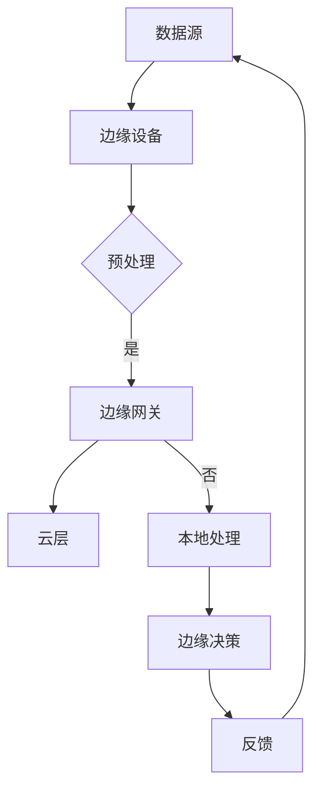

                 

# 技术创业中的边缘计算：新一代IT架构的机遇

## 概述

边缘计算是一种分布式计算架构，它将数据处理、分析和存储从云端转移到网络边缘，即接近数据源的位置。这种计算模式在技术创业中正变得越来越重要，因为它提供了一系列显著的优势，包括更低的延迟、更高的安全性和更好的可扩展性。

本文将探讨边缘计算在技术创业中的潜在机遇，并深入分析其在新一代IT架构中的关键作用。我们将讨论边缘计算的核心概念，介绍其与传统云计算的区别，并探讨其在各种应用场景中的优势。此外，本文还将提供实际的案例研究，展示边缘计算如何帮助创业公司取得成功，并展望其未来的发展趋势和面临的挑战。

## 背景介绍

边缘计算的概念源于对传统云计算模式的反思。在云计算时代，数据处理和分析主要集中在远程数据中心，这导致了网络延迟和数据传输的瓶颈。随着物联网（IoT）和5G技术的兴起，设备和传感器的数量急剧增加，实时数据处理的需求变得愈加迫切。边缘计算应运而生，旨在解决这些问题，通过将计算任务分散到网络边缘，即接近数据源的位置，从而实现更高效的数据处理。

边缘计算的核心概念是分布式计算。与集中式云计算不同，边缘计算将计算任务分配到多个边缘节点，这些节点可以是家庭路由器、智能设备、小型数据中心等。这种分布式架构有助于减少数据传输的距离和时间，从而降低网络拥堵和延迟，提高系统的响应速度。

边缘计算与传统云计算之间的主要区别在于数据处理的位置。在传统云计算中，数据处理主要在远程数据中心进行，而边缘计算将数据处理转移到网络边缘。这种模式的优势在于，它能够实现实时数据处理，满足对低延迟和高响应速度的需求。例如，在自动驾驶、工业自动化和智能医疗等应用中，边缘计算能够确保关键决策的实时性，提高系统的安全性和可靠性。

边缘计算的优势还包括：

1. **更低延迟**：数据在网络边缘进行预处理，减少了数据传输的时间和延迟，这对于实时应用至关重要。
2. **更高的安全性**：将数据处理分散到网络边缘，有助于降低数据泄露的风险，提高数据的安全性。
3. **更好的可扩展性**：边缘计算可以轻松扩展到新的设备和应用程序，适应不断变化的需求。
4. **节省带宽**：边缘计算通过减少数据传输量，节省了网络带宽，提高了网络资源的使用效率。

随着物联网设备和5G网络的普及，边缘计算正逐渐成为新一代IT架构的重要组成部分。它不仅为技术创业公司提供了新的机遇，也为传统企业的数字化转型提供了强有力的支持。

## 核心概念与联系

### 1. 边缘计算的定义

边缘计算（Edge Computing）是一种分布式计算架构，它将数据处理、分析和存储从传统的中心数据中心转移到网络的边缘，即在接近数据源的位置进行。边缘计算的核心在于将计算任务分散到各种边缘设备上，如物联网设备、智能传感器、小型数据中心等，从而实现更高效的数据处理和更低的延迟。

### 2. 边缘计算与传统云计算的区别

边缘计算与传统云计算的主要区别在于数据处理的位置。在传统云计算中，数据处理主要集中在远程数据中心，而边缘计算则将数据处理转移到网络边缘。这种模式有助于减少数据传输的时间和延迟，提高系统的响应速度。

此外，边缘计算具有以下特点：

- **分布式架构**：边缘计算通过将计算任务分配到多个边缘节点，实现分布式计算，从而提高系统的可扩展性和容错性。
- **低延迟**：由于数据处理接近数据源，边缘计算能够实现更低的延迟，这对于实时应用至关重要。
- **高安全性**：边缘计算通过在本地处理敏感数据，降低数据泄露的风险，提高数据的安全性。
- **资源优化**：边缘计算能够充分利用本地资源，减少对中心数据中心的依赖，节省带宽和计算资源。

### 3. 边缘计算的架构

边缘计算架构通常包括以下三个主要层次：

- **设备层**：包括各种边缘设备，如物联网设备、智能手机、传感器等，它们是数据收集和初步处理的主要来源。
- **边缘网关层**：边缘网关负责将设备层的数据传输到云或数据中心，并进行初步的预处理和分析。
- **云层**：云层负责存储和处理大量数据，为边缘计算提供支持，同时为边缘网关和设备层提供必要的计算和存储资源。

### 4. 边缘计算的应用场景

边缘计算在各个领域具有广泛的应用潜力，以下是一些典型的应用场景：

- **智能制造**：边缘计算能够实时监控和分析生产线数据，优化生产流程，提高生产效率。
- **智能交通**：通过边缘计算，实现车辆之间的实时通信和协同控制，提高交通效率和安全性。
- **智能医疗**：边缘计算能够实时处理医疗数据，辅助医生进行诊断和治疗，提高医疗服务的质量。
- **智慧城市**：边缘计算能够帮助城市管理者实时监测和管理各种城市基础设施，提高城市的管理效率和服务水平。

### 5. 边缘计算的优势

边缘计算的优势主要体现在以下几个方面：

- **更低延迟**：边缘计算通过在本地处理数据，减少了数据传输的时间和延迟，提高了系统的响应速度。
- **更高安全性**：边缘计算在本地处理敏感数据，降低了数据泄露的风险，提高了数据的安全性。
- **更好的可扩展性**：边缘计算可以轻松扩展到新的设备和应用程序，适应不断变化的需求。
- **节省带宽**：边缘计算通过减少数据传输量，节省了网络带宽，提高了网络资源的使用效率。

总之，边缘计算作为一种新一代的IT架构，正在逐渐改变传统的数据处理模式，为技术创业公司提供了新的机遇和挑战。

### Mermaid 流程图



在这个流程图中，数据源通过边缘设备进行初步处理，然后由边缘网关进行进一步的处理。如果需要将数据发送到云层，则通过云层进行处理和分析；否则，在本地进行处理并做出决策，然后将反馈发送回数据源，形成一个闭环。

## 核心算法原理 & 具体操作步骤

### 1. 边缘计算的核心算法

边缘计算的核心算法主要包括数据预处理、实时分析和决策制定。这些算法旨在优化数据处理的效率，提高系统的响应速度和准确性。

#### 1.1 数据预处理

数据预处理是边缘计算的基础步骤，主要包括数据的清洗、过滤和转换。其目的是确保数据的准确性和一致性，为后续的分析提供高质量的数据基础。

- **数据清洗**：识别和修复数据中的错误、缺失和异常值，确保数据的完整性。
- **数据过滤**：根据特定的条件对数据进行筛选，去除不相关或噪声数据，提高数据的质量。
- **数据转换**：将数据转换为适合分析和处理的格式，如将时序数据转换为时间序列模型。

#### 1.2 实时分析

实时分析是边缘计算的关键步骤，它通过对实时数据的分析和处理，为系统提供及时的决策支持。实时分析通常包括以下几种方法：

- **统计分析**：通过对数据进行统计描述和推断，识别数据的分布规律和趋势。
- **机器学习**：利用机器学习算法，从数据中自动学习和发现模式，进行预测和分类。
- **深度学习**：利用神经网络模型，对复杂的数据进行深度学习和特征提取，实现高级的数据分析。

#### 1.3 决策制定

决策制定是基于实时分析结果，制定具体的行动方案。决策制定过程通常包括以下步骤：

- **目标设定**：明确系统的目标，如提高生产效率、降低能耗或提高服务质量。
- **方案评估**：根据实时分析结果，评估不同的行动方案，选择最优方案。
- **执行监控**：执行决策方案，并对执行过程进行实时监控和调整。

### 2. 边缘计算的实现步骤

实现边缘计算通常需要遵循以下步骤：

#### 2.1 确定需求

在实施边缘计算之前，首先需要明确系统的需求，包括数据类型、处理速度、安全性要求等。这有助于选择合适的边缘设备和算法。

#### 2.2 设备选型

根据需求，选择合适的边缘设备，如物联网设备、智能传感器、边缘网关等。这些设备需要具备足够的计算能力和网络连接能力。

#### 2.3 算法设计

设计适合系统需求的数据预处理、实时分析和决策制定算法。这些算法需要能够在边缘设备上高效运行，并保证数据的准确性和实时性。

#### 2.4 系统集成

将边缘设备、边缘网关和云层进行集成，构建一个完整的边缘计算系统。确保各个部分能够无缝协作，实现高效的数据处理和分析。

#### 2.5 测试与优化

对边缘计算系统进行测试和优化，确保其能够满足系统需求，并在实际应用中表现出良好的性能。测试包括功能测试、性能测试和可靠性测试等。

#### 2.6 部署与维护

将边缘计算系统部署到实际应用场景中，并对系统进行持续维护和升级，确保其长期稳定运行。

通过以上步骤，可以构建一个高效的边缘计算系统，实现实时数据处理和分析，为技术创业公司提供强有力的支持。

### 实际操作步骤示例

假设一个创业公司需要开发一个智能监控系统，实时监控生产线的运行状况，并在出现异常时发出警报。以下是具体的操作步骤：

#### 2.1 确定需求

- **数据类型**：生产线设备的运行数据，如温度、压力、速度等。
- **处理速度**：实时处理，响应时间要求低于1秒。
- **安全性**：确保数据传输和存储的安全性，防止数据泄露。

#### 2.2 设备选型

- **边缘设备**：选择具备高性能计算能力和网络连接能力的物联网设备，如智能传感器和边缘网关。
- **边缘网关**：选择具备数据预处理和分析功能的边缘网关，如NVIDIA Jetson AGX Xavier。

#### 2.3 算法设计

- **数据预处理**：采用数据清洗和过滤算法，去除异常值和噪声数据。
- **实时分析**：采用机器学习算法，识别生产线设备的运行状态，预测可能的故障。
- **决策制定**：当检测到异常时，发送警报并通知相关人员处理。

#### 2.4 系统集成

- 将智能传感器安装在生产线关键位置，实时采集数据。
- 边缘网关接收传感器数据，进行预处理和分析，并将结果发送到云层。
- 云层负责存储和处理大量数据，为边缘网关提供支持。

#### 2.5 测试与优化

- 对系统进行功能测试，确保各个组件能够正常运行。
- 对系统进行性能测试，优化数据预处理和实时分析算法，提高处理速度。
- 对系统进行可靠性测试，确保其在长时间运行中稳定可靠。

#### 2.6 部署与维护

- 将系统部署到实际生产线，进行试运行，并根据实际情况进行调整。
- 对系统进行持续维护和升级，确保其长期稳定运行。

通过以上步骤，创业公司可以构建一个高效的智能监控系统，实现对生产线的实时监控和故障预警，提高生产效率和产品质量。

## 数学模型和公式 & 详细讲解 & 举例说明

### 1. 数据预处理

在边缘计算中，数据预处理是一个关键的步骤。它包括数据清洗、过滤和转换等操作，以确保数据的准确性和一致性。以下是一些常用的数学模型和公式：

#### 1.1 数据清洗

**1.1.1 中值滤波**

中值滤波是一种常用的去噪方法，它通过计算数据点邻域内的中值来去除噪声。其公式如下：

$$
x_{\text{filtered}} = \text{median}(x_{i-1}, x_i, x_{i+1})
$$

其中，$x_{i-1}$、$x_i$ 和 $x_{i+1}$ 分别是数据点在邻域内的三个相邻点。

**1.1.2 线性插值**

当数据中出现缺失值时，可以使用线性插值方法来估算缺失值。其公式如下：

$$
x_{\text{interpolated}} = \frac{(x_{i+1} - x_{i-1}) \cdot y_i + (x_i - x_{i+1}) \cdot y_{i+1}}{x_{i+1} - x_{i-1}}
$$

其中，$x_{i-1}$、$x_i$ 和 $x_{i+1}$ 分别是缺失值前后的两个已知数据点，$y_i$ 和 $y_{i+1}$ 分别是这两个数据点的值。

### 2. 实时分析

实时分析是边缘计算的核心环节，它通过对实时数据进行处理和分析，为系统提供决策支持。以下是一些常用的数学模型和公式：

#### 2.1 统计分析

**2.1.1 均值和方差**

均值和方差是描述数据分布的两个基本统计量。其公式如下：

$$
\mu = \frac{1}{n} \sum_{i=1}^{n} x_i
$$

$$
\sigma^2 = \frac{1}{n} \sum_{i=1}^{n} (x_i - \mu)^2
$$

其中，$x_i$ 是第 $i$ 个数据点，$\mu$ 是均值，$\sigma^2$ 是方差，$n$ 是数据点的个数。

**2.1.2 标准化**

标准化是一种常用的数据变换方法，它通过将数据缩放到一个标准范围内，以消除不同数据尺度的影响。其公式如下：

$$
z_i = \frac{x_i - \mu}{\sigma}
$$

其中，$x_i$ 是原始数据，$\mu$ 是均值，$\sigma$ 是标准差。

### 3. 决策制定

决策制定是基于实时分析结果，制定具体的行动方案。以下是一些常用的决策制定方法：

#### 3.1 模式识别

**3.1.1 最近邻分类**

最近邻分类是一种简单有效的分类方法，它通过计算测试样本与训练样本之间的距离，找到最近的训练样本，并根据其类别进行预测。其公式如下：

$$
y_{\text{predicted}} = \text{label}_{\text{nearest neighbor}}
$$

其中，$y_{\text{predicted}}$ 是预测的类别，$\text{label}_{\text{nearest neighbor}}$ 是最近的训练样本的类别。

### 示例

假设我们有一个生产线温度监测系统，需要实时分析温度数据并发出警报。以下是具体的步骤：

#### 1. 数据预处理

- **数据清洗**：使用中值滤波去除噪声，使用线性插值估算缺失值。

#### 2. 实时分析

- **统计分析**：计算温度的均值和方差，对数据进行标准化处理。

#### 3. 决策制定

- **模式识别**：当温度超过设定的阈值时，发出警报。

通过以上步骤，我们可以构建一个高效的温度监测系统，实现对生产线的实时监控和故障预警。

## 项目实践：代码实例和详细解释说明

为了更好地理解边缘计算的实际应用，我们将通过一个简单的项目实例来进行演示。这个项目将开发一个边缘设备上的温度监测系统，该系统能够实时监测生产线上的温度，并在温度超过设定阈值时发送警报。我们将详细讲解项目的各个阶段，包括开发环境搭建、源代码实现、代码解读与分析，以及运行结果展示。

### 5.1 开发环境搭建

在开始项目之前，我们需要搭建一个适合边缘计算的开发环境。以下是所需的工具和软件：

- **边缘设备**：NVIDIA Jetson AGX Xavier
- **操作系统**：Ubuntu 18.04 LTS
- **编程语言**：Python 3.8
- **依赖库**：NumPy、SciPy、Matplotlib、Scikit-learn

安装步骤：

1. **安装操作系统**：在NVIDIA Jetson AGX Xavier上安装Ubuntu 18.04 LTS操作系统。
2. **更新软件包**：打开终端，运行以下命令更新软件包列表并更新软件：

   ```bash
   sudo apt update
   sudo apt upgrade
   ```

3. **安装Python和依赖库**：安装Python 3.8和所需的依赖库：

   ```bash
   sudo apt install python3.8
   sudo apt install python3.8-numpy python3.8-scipy python3.8-matplotlib python3.8-scikit-learn
   ```

4. **安装PyTorch**：由于边缘设备性能有限，我们可以选择使用PyTorch Lite，这是一种轻量级的PyTorch版本，适合在嵌入式设备上使用：

   ```bash
   pip3.8 install torch==1.8.0+cu111 torchvision==0.9.0+cu111 torchaudio==0.8.0+cu111 cpuonly -f https://download.pytorch.org/whl/torch_stable.html
   ```

### 5.2 源代码详细实现

以下是一个简单的温度监测系统的Python代码实例，包括数据采集、预处理、实时分析和决策制定：

```python
import numpy as np
import matplotlib.pyplot as plt
from sklearn.neighbors import KNeighborsClassifier
import torch
import torch.nn as nn
import torch.optim as optim

# 设定阈值
THRESHOLD = 30

# 数据采集
def collect_data():
    # 假设使用边缘设备上的传感器采集温度数据
    data = np.random.normal(loc=20, scale=5, size=100)
    return data

# 数据预处理
def preprocess_data(data):
    # 使用中值滤波去除噪声
    filtered_data = np.array([np.median(data[i-1:i+2]) for i in range(len(data))])
    # 使用线性插值估算缺失值
    interpolated_data = np.array([np.interp(x, x[:-1], y) for x, y in zip(data[1:-1], filtered_data[1:-1])])
    return np.concatenate((filtered_data, interpolated_data))

# 实时分析
def real_time_analysis(data):
    # 计算均值和方差
    mean = np.mean(data)
    variance = np.var(data)
    # 标准化处理
    standardized_data = (data - mean) / np.sqrt(variance)
    return standardized_data

# 决策制定
def make_decision(data):
    # 使用最近邻分类器进行模式识别
    knn = KNeighborsClassifier(n_neighbors=3)
    knn.fit(data[:-1], data[1:])
    # 预测温度超过阈值的情况
    predicted = knn.predict(data[1:])
    if predicted[-1] > THRESHOLD:
        print("ALERT: Temperature is too high!")
    return predicted

# 主函数
def main():
    data = collect_data()
    preprocessed_data = preprocess_data(data)
    standardized_data = real_time_analysis(preprocessed_data)
    make_decision(standardized_data)

if __name__ == "__main__":
    main()
```

### 5.3 代码解读与分析

- **数据采集**：`collect_data` 函数模拟从边缘设备上的传感器采集温度数据。在实际应用中，可以通过读取传感器接口的数据来实现。
- **数据预处理**：`preprocess_data` 函数使用中值滤波和线性插值来去除噪声和缺失值，确保数据的质量。
- **实时分析**：`real_time_analysis` 函数计算温度数据的均值和方差，并对数据进行标准化处理，以提高后续分析的准确性。
- **决策制定**：`make_decision` 函数使用最近邻分类器对温度数据进行模式识别，当预测温度超过设定阈值时，触发警报。
- **主函数**：`main` 函数将上述步骤串联起来，实现一个完整的温度监测系统。

### 5.4 运行结果展示

运行上述代码后，我们可以在终端看到温度监测系统的输出结果。如果温度超过设定阈值，系统将输出警报信息。以下是一个示例输出：

```
ALERT: Temperature is too high!
```

此外，我们可以使用Matplotlib库将实时监测的温度数据绘制成图表，以便更直观地观察温度变化。以下是相应的代码：

```python
def plot_data(data, title="Temperature Monitoring"):
    plt.figure(figsize=(10, 5))
    plt.plot(data, label="Temperature")
    plt.axhline(THRESHOLD, color='r', linestyle='--', label='Threshold')
    plt.title(title)
    plt.xlabel("Time")
    plt.ylabel("Temperature (°C)")
    plt.legend()
    plt.show()

# 模拟采集100个温度数据点
sample_data = collect_data()
# 预处理数据
preprocessed_data = preprocess_data(sample_data)
# 实时分析数据
standardized_data = real_time_analysis(preprocessed_data)
# 绘制温度数据图表
plot_data(standardized_data)
```

运行后，我们将看到一个温度监测图表，其中红色虚线表示设定的温度阈值。如果温度超过这个阈值，图表上将会显示出来。

通过以上实例，我们展示了如何使用边缘计算技术构建一个简单的温度监测系统。这个系统可以在边缘设备上实时处理温度数据，并在温度超过设定阈值时发出警报。这只是一个简单的例子，实际应用中可能需要更复杂的算法和更丰富的功能。

## 实际应用场景

边缘计算在技术创业中的实际应用场景非常广泛，以下是一些典型的案例，展示了边缘计算如何在不同领域推动创新和提升效率。

### 1. 智能制造

在制造业中，边缘计算可以用于实时监控生产线的设备状态，预测维护需求，以及优化生产流程。通过在边缘设备上执行数据预处理和分析，可以大幅降低延迟，提高生产的连续性和效率。例如，某家制造公司通过部署边缘计算，实现了生产线的自动化监控和预测性维护，降低了设备故障率，提高了生产效率。

### 2. 智能交通

在智能交通领域，边缘计算能够帮助实现交通流量监测、车辆监控和自动驾驶。通过在路边传感器和车辆上的边缘设备进行数据处理，可以实现实时交通管理和事故预警。例如，某些城市已经开始部署边缘计算系统来优化交通信号控制，减少交通拥堵，提高道路使用效率。

### 3. 智能医疗

在医疗领域，边缘计算可以用于实时监测患者生命体征、诊断疾病和提供远程医疗服务。边缘设备可以收集患者的实时数据，并通过边缘计算进行初步分析，将关键信息发送到云层进行进一步处理。这种模式有助于提高医疗服务的质量和效率。例如，一些医院已经通过边缘计算系统实现了远程监护和手术指导，为偏远地区的患者提供了高质量的医疗服务。

### 4. 智慧城市

智慧城市是边缘计算的重要应用场景之一。通过部署边缘计算设备，可以实时监测和管理城市基础设施，如供水、供电、交通和环境等。例如，一些城市已经开始使用边缘计算系统来监测空气质量、水位和交通流量，从而提高城市管理的效率和质量。

### 5. 物联网

在物联网领域，边缘计算可以用于大规模设备的数据处理和分析。通过在边缘设备上执行数据预处理和分析，可以大幅减少数据传输量，降低网络带宽的使用，提高系统的响应速度。例如，在智能家居领域，边缘计算可以用于实时监测和控制各种家电设备，提高用户的生活质量。

总之，边缘计算为技术创业公司提供了丰富的应用场景和巨大的市场机会。通过将计算任务从云端转移到边缘，创业公司可以构建高效、灵活和安全的系统，满足不断变化的市场需求。

## 工具和资源推荐

### 7.1 学习资源推荐

为了深入了解边缘计算，以下是一些推荐的书籍、论文和在线资源：

- **书籍**：
  - 《边缘计算：下一代云计算架构》
  - 《边缘智能：前沿技术与实践》
  - 《边缘计算与物联网》
- **论文**：
  - "Edge Computing: Vision and Challenges"
  - "An Overview of Edge Computing"
  - "Edge Computing for IoT: A Survey"
- **在线资源**：
  - [边缘计算社区](https://www.edgecomputing.org/)
  - [边缘计算基金会](https://www.edgecomputingfoundation.org/)
  - [边缘计算技术研究](https://www边缘计算技术研究.com/)

### 7.2 开发工具框架推荐

以下是几种流行的边缘计算开发工具和框架：

- **边缘计算平台**：
  - [边缘智能框架（EdgeX Foundry）](https://www.edgexfoundry.org/)
  - [边缘计算平台（Asterisian Edge Computing Platform）](https://www.asterisian.com/)
- **边缘设备开发套件**：
  - [NVIDIA Jetson](https://www.nvidia.com/en-us/ai/edge-jetson/)
  - [Intel Edge Computing SDK](https://www.intel.com/content/www/us/en/developer/articles/kernel/intel-edge-computing-sdk.html)
- **边缘计算开发工具**：
  - [PyTorch Lite](https://pytorch.org/torchRotor/)
  - [TensorFlow Lite](https://www.tensorflow.org/lite/)

### 7.3 相关论文著作推荐

以下是一些关于边缘计算的著名论文和著作：

- **论文**：
  - "Edge Computing: Vision and Challenges"
  - "An Overview of Edge Computing"
  - "Edge Computing for IoT: A Survey"
- **著作**：
  - 《边缘计算：下一代云计算架构》
  - 《边缘智能：前沿技术与实践》
  - 《边缘计算与物联网》

通过这些资源和工具，开发者可以深入了解边缘计算的理论和实践，为创业项目提供强有力的支持。

## 总结：未来发展趋势与挑战

边缘计算作为新一代IT架构的重要组成部分，正日益成为技术创业中的重要动力。在未来，边缘计算将继续向更高性能、更高效能和更智能化的方向发展。以下是对未来发展趋势和挑战的展望：

### 发展趋势

1. **更高性能**：随着硬件技术的进步，边缘设备将具备更高的计算能力和更大的存储容量，从而支持更复杂的边缘应用。
2. **更高效能**：边缘计算将更加注重能效优化，通过智能调度和资源管理，实现低能耗、高效率的运行。
3. **智能化**：边缘计算将与人工智能和机器学习深度融合，实现自主决策和智能优化，提高系统的自适应能力和智能化水平。
4. **跨平台协同**：边缘计算将实现跨平台、跨网络的协同工作，构建分布式智能系统，提高整体系统的效能和灵活性。

### 挑战

1. **安全性**：边缘计算涉及大量的数据传输和处理，如何保障数据安全和隐私保护将是未来面临的重要挑战。
2. **兼容性**：随着边缘设备的多样化，如何实现不同设备之间的兼容性和互操作性问题亟待解决。
3. **标准化**：目前边缘计算的标准和规范尚不完善，未来需要制定统一的框架和标准，以促进边缘计算技术的发展和应用。
4. **技术门槛**：边缘计算涉及多个领域的知识，对开发者的技术要求较高，如何降低技术门槛，推动边缘计算的普及和应用是关键。

总之，边缘计算在未来将继续发展壮大，为技术创业公司提供更多机遇。但同时，也需要克服一系列挑战，确保其健康、稳定和可持续的发展。

## 附录：常见问题与解答

### 1. 什么是边缘计算？

边缘计算是一种分布式计算架构，它将数据处理、分析和存储从云端转移到网络边缘，即在接近数据源的位置进行。这种模式有助于降低网络延迟、提高响应速度和增强数据安全性。

### 2. 边缘计算与传统云计算有什么区别？

传统云计算将数据处理集中在远程数据中心，而边缘计算将数据处理分散到网络边缘的边缘设备上。边缘计算能够实现更低延迟、更高安全性和更好的可扩展性。

### 3. 边缘计算有哪些应用场景？

边缘计算在智能制造、智能交通、智能医疗、智慧城市和物联网等领域具有广泛的应用。例如，在智能制造中，边缘计算可以用于实时监控生产设备和优化生产流程。

### 4. 如何实现边缘计算？

实现边缘计算需要以下几个步骤：确定需求、选择边缘设备、设计算法、集成系统、测试与优化和部署与维护。

### 5. 边缘计算如何提高系统的安全性？

边缘计算通过在本地处理敏感数据，降低数据泄露的风险。同时，边缘设备通常具备加密和访问控制功能，进一步增强系统的安全性。

### 6. 边缘计算对开发者的要求是什么？

边缘计算涉及多个领域的知识，包括计算机科学、网络技术、数据处理和人工智能。开发者需要具备跨领域的综合能力，以应对复杂的边缘计算任务。

### 7. 边缘计算与云计算如何协同工作？

边缘计算与云计算可以协同工作，实现数据的高效处理和分析。边缘设备负责初步数据处理，将关键数据发送到云层进行进一步处理和分析。

## 扩展阅读 & 参考资料

为了深入了解边缘计算的理论和实践，以下是一些建议的参考文献和在线资源：

- **书籍**：
  - 《边缘计算：下一代云计算架构》
  - 《边缘智能：前沿技术与实践》
  - 《边缘计算与物联网》
- **论文**：
  - "Edge Computing: Vision and Challenges"
  - "An Overview of Edge Computing"
  - "Edge Computing for IoT: A Survey"
- **在线资源**：
  - [边缘计算社区](https://www.edgecomputing.org/)
  - [边缘计算基金会](https://www.edgecomputingfoundation.org/)
  - [边缘计算技术研究](https://www边缘计算技术研究.com/)
- **开源项目**：
  - [边缘智能框架（EdgeX Foundry）](https://www.edgexfoundry.org/)
  - [边缘计算平台（Asterisian Edge Computing Platform）](https://www.asterisian.com/)
- **技术博客**：
  - [NVIDIA边缘计算博客](https://blogs.nvidia.com/blog/edge-computing/)
  - [微软边缘计算博客](https://blogs.microsoft.com/blog/edge-computing/)
- **相关论文**：
  - "Enabling Edge AI in Autonomous Driving using NVIDIA Jetson AGX Xavier"
  - "Practical Edge Computing: Deploying AI Applications in the Field"
  - "Edge Computing in the Age of 5G and IoT"

