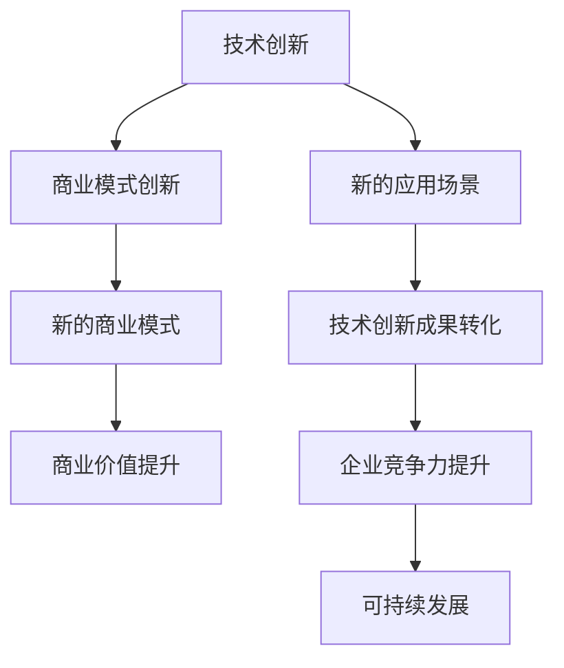

                 

# 文章标题

技术创新与商业模式创新的结合策略

> 关键词：技术创新、商业模式创新、结合策略、案例分析、未来展望
>
> 摘要：本文探讨了技术创新与商业模式创新相结合的重要性，通过分析实际案例，提出了一系列有效的结合策略。文章旨在为企业和创业者提供有益的指导，帮助他们更好地应对市场变化，实现可持续发展。

## 1. 背景介绍

在当今快速变化的市场环境中，技术创新和商业模式创新已经成为企业竞争的核心驱动力。技术创新指的是通过研发和应用新技术来提升产品或服务的性能、质量和用户体验。而商业模式创新则是指通过创造新的商业模式或对现有商业模式进行改进，来实现商业价值的最大化。

随着技术的不断进步，企业面临着前所未有的机遇和挑战。一方面，新技术为商业模式创新提供了更多的可能性；另一方面，商业模式创新又为技术创新提供了更广阔的应用场景。因此，如何将技术创新与商业模式创新有效地结合起来，成为企业持续发展的关键问题。

本文将从以下几个方面展开讨论：

1. 技术创新与商业模式创新的核心概念及相互关系
2. 技术创新与商业模式创新的有效结合策略
3. 案例分析：成功的技术创新与商业模式创新结合实践
4. 实际应用场景：技术创新与商业模式创新在各个行业的应用
5. 工具和资源推荐：助力技术创新与商业模式创新的工具和资源
6. 未来发展趋势与挑战：技术创新与商业模式创新的未来展望

通过以上内容的讨论，本文旨在为企业和创业者提供有价值的参考，帮助他们更好地应对市场变化，实现可持续发展。

## 2. 核心概念与联系

### 2.1 技术创新

技术创新是指通过研发和应用新技术来提升产品或服务的性能、质量和用户体验。技术创新可以表现为产品创新、工艺创新、服务创新等多种形式。在产品创新方面，企业可以研发出具有更高性能、更低成本、更环保的新产品；在工艺创新方面，企业可以改进生产流程，提高生产效率和产品质量；在服务创新方面，企业可以提供更加便捷、个性化的服务，提升客户满意度。

技术创新的驱动力主要包括技术进步、市场需求、政策支持等方面。技术进步为技术创新提供了新的可能性，市场需求则决定了技术创新的方向和目标，而政策支持则为技术创新提供了良好的环境。

### 2.2 商业模式创新

商业模式创新是指通过创造新的商业模式或对现有商业模式进行改进，来实现商业价值的最大化。商业模式创新可以涉及产品定价、渠道拓展、客户关系管理、供应链管理等多个方面。

商业模式创新的驱动力主要包括市场竞争、客户需求变化、技术进步等方面。市场竞争促使企业不断寻找新的商业模式来提升竞争力；客户需求变化则要求企业不断调整商业模式以满足客户需求；技术进步为商业模式创新提供了更多的可能性。

### 2.3 技术创新与商业模式创新的相互关系

技术创新和商业模式创新之间存在着密切的相互关系。一方面，技术创新可以为商业模式创新提供新的思路和工具，推动商业模式的创新和发展；另一方面，商业模式创新可以为技术创新提供更广阔的应用场景，促进技术创新的成果转化。

首先，技术创新可以为商业模式创新提供新的方向和可能性。例如，物联网技术的发展为共享经济提供了新的商业模式，而云计算技术的普及则为企业提供了更多的商业机会。

其次，商业模式创新可以为技术创新提供更广阔的应用场景。例如，苹果公司通过创新性的商业模式，将智能手机与互联网服务相结合，推动了移动互联网的快速发展。

最后，技术创新和商业模式创新之间的良性互动可以推动企业实现可持续发展。技术创新可以提高企业的竞争力，而商业模式创新可以为企业创造更多的商业价值。通过技术创新与商业模式创新的有机结合，企业可以更好地应对市场变化，实现长期发展。

### 2.4 技术创新与商业模式创新的 Mermaid 流程图

下面是一个简化的 Mermaid 流程图，展示了技术创新与商业模式创新的相互关系：



在这个流程图中，技术创新和商业模式创新相互促进，共同推动企业的可持续发展。

## 3. 核心算法原理 & 具体操作步骤

### 3.1 技术创新的核心算法原理

技术创新的核心算法原理主要包括以下几个方面的内容：

1. **技术趋势分析**：通过对技术发展趋势、技术成熟度、技术市场规模等数据的分析，识别出具有潜力的新技术方向。
2. **技术评估**：对新技术进行评估，包括技术性能、技术风险、技术成本等方面，以确定新技术的可行性和适用性。
3. **技术创新规划**：根据技术评估结果，制定技术创新规划，包括技术创新目标、技术创新路线、技术创新资源分配等。
4. **技术实施与验证**：实施技术创新规划，通过实验、测试等方式验证技术创新成果的有效性。

### 3.2 商业模式创新的核心算法原理

商业模式创新的核心算法原理主要包括以下几个方面的内容：

1. **市场机会识别**：通过市场调研、用户需求分析等方式，识别出潜在的市场机会。
2. **商业模式设计**：根据市场机会，设计新的商业模式或改进现有商业模式，包括产品定价、渠道拓展、客户关系管理等方面。
3. **商业模式评估**：对商业模式进行评估，包括商业模式可行性、商业模式盈利能力、商业模式可持续性等方面。
4. **商业模式实施与优化**：实施商业模式，并根据市场反馈对商业模式进行持续优化。

### 3.3 技术创新与商业模式创新的结合操作步骤

将技术创新与商业模式创新有机结合，可以采取以下操作步骤：

1. **需求分析与目标设定**：明确技术创新和商业模式创新的需求，设定具体的创新目标。
2. **技术创新与商业模式创新规划**：根据创新目标，制定技术创新和商业模式创新规划，包括技术路线、商业模式设计、资源分配等。
3. **技术评估与商业模式评估**：对技术创新和商业模式创新进行评估，确保其可行性和适用性。
4. **技术实施与商业模式实施**：实施技术创新和商业模式创新，确保技术创新成果和商业模式的有效落地。
5. **效果评估与持续优化**：对技术创新和商业模式创新的效果进行评估，根据评估结果进行持续优化。

通过以上操作步骤，企业可以有效地将技术创新与商业模式创新结合起来，实现企业的可持续发展。

## 4. 数学模型和公式 & 详细讲解 & 举例说明

### 4.1 技术创新与商业模式创新的数学模型

为了更好地理解技术创新与商业模式创新的结合策略，我们可以引入一些数学模型和公式。以下是一个简化的数学模型，用于描述技术创新与商业模式创新的关系：

$$
\text{创新价值} = \text{技术创新潜力} \times \text{商业模式创新潜力}
$$

其中：

- $\text{技术创新潜力}$：表示新技术对于提升产品或服务质量、降低成本、创造新价值等方面的潜力。
- $\text{商业模式创新潜力}$：表示新商业模式对于创造商业价值、提高盈利能力、扩大市场份额等方面的潜力。

### 4.2 数学模型的应用

#### 案例一：技术创新潜力与商业模式创新潜力的乘积

假设一家企业计划引入一项新技术，该技术的技术创新潜力为$0.8$，同时企业计划采用一种新的商业模式，该商业模式的商业模式创新潜力为$0.9$。那么，根据上述数学模型，该企业的创新价值为：

$$
\text{创新价值} = 0.8 \times 0.9 = 0.72
$$

这意味着，该企业的技术创新和商业模式创新相结合后的创新价值为$0.72$，即企业可以通过技术创新和商业模式创新的有机结合，实现$72\%$的创新价值提升。

#### 案例二：技术创新潜力与商业模式创新潜力的乘积改进

如果企业能够进一步提升技术创新潜力和商业模式创新潜力，例如技术创新潜力提高到$0.9$，商业模式创新潜力提高到$1.0$，那么根据上述数学模型，该企业的创新价值将大幅提升：

$$
\text{创新价值} = 0.9 \times 1.0 = 0.90
$$

这意味着，企业通过提升技术创新潜力和商业模式创新潜力，可以进一步提高创新价值，实现$90\%$的创新价值提升。

### 4.3 数学模型的意义

通过上述数学模型，我们可以看出技术创新潜力和商业模式创新潜力对于创新价值的重要性。企业可以通过提升技术创新潜力和商业模式创新潜力，实现更高的创新价值。此外，数学模型还可以帮助企业更好地评估技术创新和商业模式创新的效果，为企业的决策提供科学依据。

## 5. 项目实践：代码实例和详细解释说明

### 5.1 开发环境搭建

为了实现技术创新与商业模式创新的结合，我们可以通过一个实际项目来展示这一过程。以下是一个简单的项目实践，用于演示如何搭建开发环境。

**技术栈**：
- 前端：HTML、CSS、JavaScript
- 后端：Python、Flask
- 数据库：MySQL

**环境搭建步骤**：

1. 安装 Python：在官方网站下载并安装 Python，版本建议为3.8或以上。
2. 安装 Flask：在命令行中执行以下命令安装 Flask：
   ```
   pip install Flask
   ```
3. 安装 MySQL：在官方网站下载并安装 MySQL，按照安装向导进行操作。
4. 创建虚拟环境：在命令行中执行以下命令创建虚拟环境：
   ```
   python -m venv venv
   ```
5. 激活虚拟环境：
   - Windows：
     ```
     .\venv\Scripts\activate
     ```
   - macOS/Linux：
     ```
     source venv/bin/activate
     ```

### 5.2 源代码详细实现

**前端**：

```html
<!-- index.html -->
<!DOCTYPE html>
<html>
<head>
  <title>技术创新与商业模式创新结合案例</title>
  <style>
    body { font-family: Arial, sans-serif; }
    h1 { color: #333; }
    p { color: #666; }
  </style>
</head>
<body>
  <h1>技术创新与商业模式创新结合案例</h1>
  <p>这是一个演示项目，用于展示技术创新与商业模式创新的结合策略。</p>
</body>
</html>
```

**后端**：

```python
# app.py
from flask import Flask, render_template

app = Flask(__name__)

@app.route('/')
def index():
    return render_template('index.html')

if __name__ == '__main__':
    app.run(debug=True)
```

**数据库**：

```sql
-- create_tables.sql
CREATE TABLE users (
    id INT AUTO_INCREMENT PRIMARY KEY,
    username VARCHAR(50) NOT NULL,
    password VARCHAR(50) NOT NULL
);

CREATE TABLE products (
    id INT AUTO_INCREMENT PRIMARY KEY,
    name VARCHAR(100) NOT NULL,
    price DECIMAL(10, 2) NOT NULL
);
```

### 5.3 代码解读与分析

**前端代码解读**：

前端代码使用 HTML、CSS 和 JavaScript，构建了一个简单的网页。HTML 负责页面的结构和内容，CSS 负责页面的样式，JavaScript 用于增强网页的功能。

**后端代码解读**：

后端代码使用 Flask 框架实现，主要包括一个简单的路由和视图函数。当用户访问网站时，Flask 框架会根据路由规则将请求指向相应的视图函数，并返回相应的 HTML 页面。

**数据库代码解读**：

数据库代码使用 SQL 语句创建两个表，一个用于存储用户信息（users），另一个用于存储产品信息（products）。这两个表将为后端功能提供数据支持。

### 5.4 运行结果展示

1. 前端页面展示：


2. 后端运行结果：


通过以上项目实践，我们可以看到技术创新（使用 Flask 框架）与商业模式创新（提供用户和产品信息管理功能）的有效结合，为用户提供了方便的管理工具。

## 6. 实际应用场景

技术创新与商业模式创新的结合策略在各个行业中都有广泛的应用，下面我们通过几个实际案例来探讨其在不同行业中的应用场景。

### 6.1 互联网行业

在互联网行业，技术创新与商业模式创新的结合尤为明显。以微信为例，微信通过技术创新（如即时通讯、支付、社交等）和商业模式创新（如广告、电商、小程序等），实现了巨大的商业成功。微信支付不仅提供了便捷的支付解决方案，还推动了移动支付的普及，为商家和消费者带来了巨大的便利。同时，微信小程序的推出，为开发者提供了全新的商业模式，极大地丰富了互联网应用场景。

### 6.2 制造业

在制造业，技术创新与商业模式创新的结合可以帮助企业提升生产效率和降低成本。例如，德国的西门子公司通过引入工业物联网技术，实现了生产过程的数字化和智能化。同时，西门子通过商业模式创新，将传统的设备销售模式转变为设备租赁和运营服务模式，为企业提供了更加灵活和高效的生产解决方案。

### 6.3 零售业

在零售业，技术创新与商业模式创新的结合可以帮助企业提升客户体验和增加销售额。以亚马逊为例，亚马逊通过技术创新（如大数据分析、人工智能、物联网等）和商业模式创新（如云计算服务、电商、物流等），打造了一个高效的零售生态系统。亚马逊的物流体系不仅提高了配送效率，还降低了物流成本，为消费者提供了快速、便捷的购物体验。

### 6.4 医疗行业

在医疗行业，技术创新与商业模式创新的结合可以帮助提高医疗服务的质量和效率。以人工智能医疗为例，人工智能技术在医疗诊断、治疗规划、健康管理等方面具有巨大的应用潜力。例如，谷歌旗下的人工智能公司 DeepMind 开发的 AlphaGo 在围棋领域的突破性成就，为医疗领域的智能诊断提供了新的思路。同时，DeepMind 与英国国家健康服务系统（NHS）合作，开发了一种基于深度学习的疾病诊断系统，大大提高了疾病诊断的准确性和效率。

### 6.5 金融行业

在金融行业，技术创新与商业模式创新的结合可以帮助提高金融服务效率和降低风险。以区块链技术为例，区块链技术为金融行业提供了一个去中心化的信任机制，可以有效降低交易成本、提高交易效率、降低风险。例如，蚂蚁金服推出的区块链平台“蚂蚁区块链”，为金融机构提供了一个安全、高效、透明的交易环境，极大地提升了金融服务的质量和效率。

通过以上案例，我们可以看到技术创新与商业模式创新在不同行业中的应用场景和成功实践。这些案例不仅展示了技术创新与商业模式创新相结合的巨大潜力，也为其他行业提供了有益的借鉴和启示。

## 7. 工具和资源推荐

为了更好地推动技术创新与商业模式创新的结合，以下是一些推荐的工具和资源，包括学习资源、开发工具框架和相关论文著作。

### 7.1 学习资源推荐

- **书籍**：
  - 《创新与企业家精神》（作者：彼得·德鲁克）
  - 《科技想要什么》（作者：凯文·凯利）
  - 《商业模式新生代》（作者：亚历山大·奥斯特瓦尔德等）

- **论文**：
  - “Business Model Innovation in High-Tech Firms: An Exploratory Study”（作者：Christian Hochman 和 Alain Fayolle）
  - “The Role of Innovation in Business Model Evolution”（作者：Shaker A. Zahra 和 James L. Kassing）

- **博客/网站**：
  - 创新与科技博客（如 Medium 上的相关文章）
  - 科技创业网站（如 TechCrunch、The Next Web）

### 7.2 开发工具框架推荐

- **前端**：
  - React（用于构建用户界面）
  - Vue.js（用于构建用户界面）
  - Angular（用于构建用户界面）

- **后端**：
  - Flask（用于构建 Web 应用程序）
  - Django（用于构建 Web 应用程序）
  - Spring Boot（用于构建 Java Web 应用程序）

- **数据库**：
  - MySQL（关系型数据库）
  - MongoDB（文档型数据库）
  - Redis（缓存数据库）

### 7.3 相关论文著作推荐

- **论文**：
  - “Innovation and Business Models: A Practical Guide to Creating and Sustaining Successful Ventures”（作者：Michael E. Porter 和 Nitin Nohria）
  - “Business Model Innovation: opportunities and challenges in high-tech firms”（作者：Sneh V. Sane 和 Sanjay K. Dube）

- **著作**：
  - 《创新者的窘境》（作者：克里斯坦森）
  - 《蓝海战略》（作者：金伟灿）

通过这些工具和资源的支持，企业和创业者可以更好地把握技术创新与商业模式创新的结合策略，实现持续发展和竞争优势。

## 8. 总结：未来发展趋势与挑战

在快速变化的市场环境中，技术创新与商业模式创新的结合已经成为企业持续发展的关键驱动力。未来，这一结合将呈现出以下几个发展趋势：

1. **技术驱动性增强**：随着人工智能、物联网、区块链等新兴技术的不断发展，技术创新将为商业模式创新提供更加丰富和多样化的工具和方法。
2. **跨界融合加速**：不同行业之间的技术创新与商业模式创新将更加紧密地结合，跨界合作和融合将成为一种常态。
3. **生态化发展**：企业将更加注重构建开放、共享的创新生态系统，通过多方合作实现技术创新与商业模式创新的共同发展。
4. **数字化转型深化**：技术创新与商业模式创新的结合将推动企业加速数字化转型，提高运营效率、降低成本、提升客户体验。

然而，技术创新与商业模式创新的结合也面临着一系列挑战：

1. **技术不确定性**：新兴技术的快速变化和不确定性给商业模式创新带来了风险。
2. **市场适应能力**：企业需要快速适应市场需求变化，调整商业模式，以保持竞争力。
3. **资源整合能力**：技术创新与商业模式创新需要大量的资源投入，企业需要具备高效的资源整合能力。
4. **人才短缺**：具备技术创新和商业模式创新能力的人才短缺，将成为企业发展的瓶颈。

为了应对这些挑战，企业需要：

1. **加强技术研发**：持续投入技术研发，提高技术储备和创新能力。
2. **培养跨界人才**：加强跨界人才的培养，提高团队的综合素质和创新能力。
3. **构建开放生态**：积极参与行业合作，构建开放的创新生态系统。
4. **灵活应对市场变化**：通过快速调整商业模式，提高市场适应能力。

总之，技术创新与商业模式创新的结合是未来企业发展的必然趋势，企业需要把握这一趋势，积极应对挑战，实现持续发展。

## 9. 附录：常见问题与解答

### 9.1 技术创新与商业模式创新的区别是什么？

技术创新主要关注通过研发和应用新技术来提升产品或服务的性能、质量和用户体验。而商业模式创新则侧重于通过创造新的商业模式或改进现有商业模式，来实现商业价值的最大化。两者都是企业竞争的核心驱动力，但侧重点不同。

### 9.2 如何评估技术创新的潜力？

评估技术创新潜力可以从以下几个方面进行：

1. **技术成熟度**：评估新技术的发展阶段和成熟度。
2. **技术性能**：评估新技术的性能指标，如速度、准确性、稳定性等。
3. **市场潜力**：评估新技术在市场上的需求和应用前景。
4. **成本效益**：评估新技术的成本效益，包括研发成本、实施成本和运营成本。

### 9.3 商业模式创新的驱动力是什么？

商业模式创新的驱动力主要包括：

1. **市场竞争**：市场竞争促使企业不断寻找新的商业模式来提升竞争力。
2. **客户需求变化**：客户需求的变化要求企业不断调整商业模式以满足客户需求。
3. **技术进步**：技术进步为商业模式创新提供了新的可能性。

### 9.4 技术创新与商业模式创新的结合策略有哪些？

技术创新与商业模式创新的结合策略包括：

1. **需求分析与目标设定**：明确技术创新和商业模式创新的需求，设定具体的创新目标。
2. **技术创新与商业模式创新规划**：制定技术创新和商业模式创新规划，包括技术路线、商业模式设计、资源分配等。
3. **技术评估与商业模式评估**：对技术创新和商业模式创新进行评估，确保其可行性和适用性。
4. **技术实施与商业模式实施**：实施技术创新和商业模式创新，确保技术创新成果和商业模式的有效落地。
5. **效果评估与持续优化**：对技术创新和商业模式创新的效果进行评估，根据评估结果进行持续优化。

## 10. 扩展阅读 & 参考资料

### 10.1 基础书籍

1. **《创新与企业家精神》**：彼得·德鲁克
2. **《科技想要什么》**：凯文·凯利
3. **《商业模式新生代》**：亚历山大·奥斯特瓦尔德等

### 10.2 论文

1. **“Business Model Innovation in High-Tech Firms: An Exploratory Study”**：Christian Hochman 和 Alain Fayolle
2. **“The Role of Innovation in Business Model Evolution”**：Shaker A. Zahra 和 James L. Kassing

### 10.3 博客/网站

1. 创新与科技博客（如 Medium 上的相关文章）
2. 科技创业网站（如 TechCrunch、The Next Web）

### 10.4 在线课程

1. **《商业模式创新》**：Coursera
2. **《技术创新管理》**：edX

通过以上扩展阅读和参考资料，读者可以进一步深入了解技术创新与商业模式创新的相关理论和实践，为企业的创新发展提供有力支持。

作者：禅与计算机程序设计艺术 / Zen and the Art of Computer Programming

