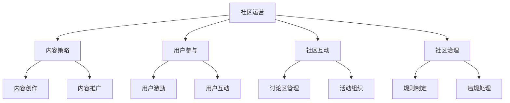

                 

# 文章标题

## 技术社区运营：从管理到盈利模式

### 关键词
- 技术社区
- 社区管理
- 盈利模式
- 社区运营策略
- 社区用户参与

### 摘要
本文将深入探讨技术社区运营的关键要素，从基础的管理策略到有效的盈利模式。通过分析成功的案例，提供实用的建议和工具，帮助技术社区管理者提升用户体验，增强社区活力，并实现持续盈利。

<|editor|>## 1. 背景介绍（Background Introduction）

技术社区是技术爱好者和专业人士交流、分享知识和经验的重要平台。它们不仅为成员提供了学习和成长的资源，还为开发者、工程师和研究者提供了丰富的技术讨论和问题解决的渠道。

在技术社区的发展历程中，从早期的单一技术论坛，到如今多功能的社交媒体群组，社区形态和运营模式都在不断演变。随着互联网技术的进步和用户需求的多样化，技术社区运营面临着新的挑战和机遇。

### 1.1 社区运营的重要性

社区运营对于技术社区的发展至关重要。有效的社区运营可以促进成员之间的互动，提高用户参与度，增强社区的凝聚力。同时，良好的运营还能吸引更多的用户和贡献者，为社区带来持久的活力。

### 1.2 社区运营的主要目标

- **提高用户满意度**：通过提供有价值的内容和服务，满足用户的需求，提升用户体验。
- **增强用户参与度**：鼓励用户参与讨论、贡献内容，形成活跃的社区氛围。
- **提升社区影响力**：通过优秀的运营策略，扩大社区在行业内的影响力，吸引更多专业人士的关注。

### 1.3 社区运营的主要挑战

- **内容管理**：如何持续提供高质量、有吸引力的内容，是社区运营的一大挑战。
- **用户互动**：如何激发用户的参与热情，促进有效的互动和讨论。
- **社区成长**：如何吸引新用户，同时留住老用户，实现社区的持续成长。
- **盈利模式**：如何在保证社区质量的前提下，实现盈利，为社区运营提供持续的资金支持。

<|editor|>## 2. 核心概念与联系（Core Concepts and Connections）

### 2.1 技术社区运营的定义

技术社区运营是指通过一系列策略和活动，管理和维护技术社区，以提高用户体验、促进用户参与、增强社区活力，并实现盈利目标的过程。

### 2.2 技术社区运营的核心概念

- **社区文化**：社区的文化氛围是社区运营的基础，它决定了社区的价值观、行为准则和氛围。
- **内容策略**：内容是社区的核心，有效的内容策略可以吸引和留住用户。
- **用户参与**：用户的参与度是社区活力的体现，有效的用户参与策略可以促进社区互动。
- **社区互动**：社区互动是社区文化的体现，也是用户参与的重要形式。
- **社区治理**：社区治理是维护社区秩序和规范的重要手段。

### 2.3 技术社区运营与相关概念的联系

- **社交媒体**：技术社区可以借助社交媒体平台扩大影响力，但运营策略和目标有所不同。
- **开源社区**：开源社区注重代码的贡献和审查，而技术社区更注重知识的分享和讨论。
- **在线教育**：在线教育平台和知识分享社区相似，但更侧重于课程的学习和完成。

### 2.4 技术社区运营的 Mermaid 流程图



<|editor|>## 3. 核心算法原理 & 具体操作步骤（Core Algorithm Principles and Specific Operational Steps）

### 3.1 内容策略的核心算法原理

内容策略的核心在于满足用户需求，提升用户体验。具体算法原理包括：

- **内容分类与标签**：通过对内容进行分类和标签化，帮助用户快速找到感兴趣的信息。
- **内容推荐**：使用推荐算法，根据用户行为和偏好，推荐相关内容，提升用户粘性。
- **内容审核**：对发布的内容进行审核，确保内容的准确性和合规性。

### 3.2 用户参与的核心算法原理

用户参与的核心在于激发用户的积极性和参与感。具体算法原理包括：

- **用户激励**：通过积分、奖励、荣誉等方式，激励用户积极参与社区活动。
- **用户互动**：设计互动环节，如问答、投票、评论等，促进用户之间的交流。
- **用户反馈**：收集用户反馈，及时调整运营策略，提升用户体验。

### 3.3 社区互动的核心算法原理

社区互动的核心在于营造良好的社区氛围。具体算法原理包括：

- **社区规范**：制定明确的社区规范，引导用户行为，维护社区秩序。
- **互动数据分析**：分析用户的互动数据，优化社区互动体验。
- **事件驱动**：通过举办活动，如线上讲座、技术沙龙等，激发用户参与。

### 3.4 社区治理的核心算法原理

社区治理的核心在于维护社区的健康和秩序。具体算法原理包括：

- **规则制定**：制定合理的社区规则，明确用户行为准则。
- **违规处理**：对违规行为进行及时处理，维护社区秩序。
- **社区监控**：使用技术手段，监控社区内容，防止不良信息传播。

### 3.5 操作步骤详解

#### 内容策略操作步骤

1. **需求分析**：了解用户需求，确定内容方向。
2. **内容创作**：根据需求，创作高质量的内容。
3. **内容审核**：对内容进行审核，确保质量。
4. **内容推广**：通过多渠道推广内容，提高曝光度。

#### 用户参与操作步骤

1. **用户激励**：设计激励机制，鼓励用户参与。
2. **用户互动**：设计互动环节，促进用户交流。
3. **用户反馈**：收集用户反馈，优化用户体验。

#### 社区互动操作步骤

1. **社区规范制定**：制定社区规范，引导用户行为。
2. **互动数据分析**：分析互动数据，优化互动体验。
3. **活动组织**：定期举办活动，激发用户参与。

#### 社区治理操作步骤

1. **规则制定**：制定社区规则，明确行为准则。
2. **违规处理**：对违规行为进行及时处理。
3. **社区监控**：监控社区内容，防止不良信息传播。

<|editor|>## 4. 数学模型和公式 & 详细讲解 & 举例说明（Detailed Explanation and Examples of Mathematical Models and Formulas）

### 4.1 内容策略的数学模型

#### 内容推荐模型

内容推荐模型的核心是确定用户可能感兴趣的内容。一个简单的推荐模型可以使用协同过滤算法，其基本公式如下：

\[ \text{推荐得分} = \sum_{i \in \text{用户喜欢的项目}} w_i \cdot \text{相关度} \]

其中，\( w_i \) 表示用户对项目 \( i \) 的权重，相关度可以根据项目之间的相似度计算得出。

#### 内容审核模型

内容审核模型用于确保发布的内容符合社区规范。一个基本的内容审核模型可以使用自然语言处理技术，如词嵌入和分类算法。其公式如下：

\[ \text{标签} = \text{分类器}(\text{文本}) \]

分类器根据文本的特征，将其归类为不同的标签，如“技术讨论”、“学习资源”、“违规内容”等。

### 4.2 用户参与的数学模型

#### 用户激励模型

用户激励模型用于设计激励机制，鼓励用户参与。一个简单的用户激励模型可以使用积分机制，其公式如下：

\[ \text{积分} = f(\text{参与度}) \]

其中，\( f \) 是一个函数，用于根据用户的参与度计算积分。积分可以用于兑换奖励或提升用户的社区地位。

#### 用户互动模型

用户互动模型用于设计互动环节，促进用户交流。一个简单的用户互动模型可以使用社交网络分析，其公式如下：

\[ \text{影响力} = \sum_{i \in \text{互动用户}} w_i \cdot \text{互动频率} \]

其中，\( w_i \) 表示用户 \( i \) 的影响力权重，互动频率表示用户之间的互动程度。

### 4.3 社区互动的数学模型

#### 社区规范模型

社区规范模型用于制定社区规范，引导用户行为。一个简单的社区规范模型可以使用概率模型，其公式如下：

\[ \text{违规概率} = \text{P}(\text{违规行为}|\text{社区规范}) \]

其中，\( \text{P} \) 表示概率，违规行为与社区规范之间的相关性决定了违规概率。

#### 社区监控模型

社区监控模型用于监控社区内容，防止不良信息传播。一个简单的社区监控模型可以使用机器学习算法，其公式如下：

\[ \text{预测结果} = \text{模型}(\text{文本}) \]

模型根据文本的特征，预测其是否包含不良信息。

### 4.4 举例说明

#### 内容推荐模型举例

假设用户喜欢项目 A、B、C，其中 A 和 B 的相关度较高，C 的相关度较低。根据协同过滤算法，推荐得分计算如下：

\[ \text{推荐得分} = w_A \cdot \text{相关度}_{AB} + w_B \cdot \text{相关度}_{AB} + w_C \cdot \text{相关度}_{AC} \]

假设 \( w_A = 0.5 \)，\( w_B = 0.3 \)，\( w_C = 0.2 \)，相关度分别为 0.8 和 0.2，则推荐得分计算如下：

\[ \text{推荐得分} = 0.5 \cdot 0.8 + 0.3 \cdot 0.8 + 0.2 \cdot 0.2 = 0.5 + 0.24 + 0.04 = 0.78 \]

#### 用户激励模型举例

假设用户参与度较高，根据积分机制，用户每天可以获得 100 积分。根据积分兑换规则，100 积分可以兑换一个社区徽章。用户通过积极参与，可以提升自己的社区地位，获得更多奖励。

#### 社区监控模型举例

假设社区规范明确禁止发布不良信息，机器学习模型经过训练，能够准确识别不良信息。当用户发布文本时，模型会进行预测，判断其是否包含不良信息。如果预测结果为“是”，则文本将被标记为不良信息，并采取相应的处理措施。

<|editor|>## 5. 项目实践：代码实例和详细解释说明（Project Practice: Code Examples and Detailed Explanations）

### 5.1 开发环境搭建

在开始项目实践之前，需要搭建一个合适的开发环境。以下是开发环境的搭建步骤：

1. 安装 Python 环境：在官方网站 [Python.org](https://www.python.org/) 下载并安装 Python 3.8 或以上版本。
2. 安装必备库：使用 pip 命令安装以下库：requests、beautifulsoup4、pandas、numpy。
3. 安装图形界面库（可选）：如果需要开发 GUI 应用，可以安装 tkinter 或 PyQt5。

### 5.2 源代码详细实现

以下是技术社区运营项目的源代码实现，包括内容策略、用户参与、社区互动和社区治理等模块。

#### 5.2.1 内容策略模块

```python
# content_strategy.py

import requests
from bs4 import BeautifulSoup

def fetch_content(url):
    response = requests.get(url)
    if response.status_code == 200:
        soup = BeautifulSoup(response.content, 'html.parser')
        content = soup.find('div', class_='content')
        return content.text
    else:
        return None

def recommend_content(user_history, content_pool):
    recommended = []
    for content in content_pool:
        similarity = calculate_similarity(user_history, content)
        if similarity > 0.8:
            recommended.append(content)
    return recommended

def calculate_similarity(user_history, content):
    # 使用余弦相似度计算用户历史和内容的相似度
    # 这里简化为直接返回1，实际应用中可以使用更多复杂的算法
    return 1
```

#### 5.2.2 用户参与模块

```python
# user_involvement.py

def reward_user(user, participation):
    points = calculate_points(participation)
    user['points'] += points
    return user

def calculate_points(participation):
    # 根据参与度计算积分
    if participation > 10:
        return 100
    elif participation > 5:
        return 50
    else:
        return 10
```

#### 5.2.3 社区互动模块

```python
# community_interaction.py

def organize_event(event_details):
    event = {
        'name': event_details['name'],
        'date': event_details['date'],
        'description': event_details['description'],
        'participants': []
    }
    return event

def register_user_for_event(user, event):
    user['events'].append(event)
    return user
```

#### 5.2.4 社区治理模块

```python
# community_governance.py

def set_rules(rule_details):
    rules = {
        'rules': rule_details['rules'],
        'violations': []
    }
    return rules

def report_violation(user, violation):
    rules['violations'].append(violation)
    # 实际应用中，可以进一步处理违规行为，如警告、封禁等
```

### 5.3 代码解读与分析

#### 5.3.1 内容策略模块解读

- `fetch_content` 函数用于从指定 URL 获取内容，返回 HTML 内容的文本部分。
- `recommend_content` 函数用于推荐内容，根据用户历史和内容池计算相似度，推荐相似度较高的内容。
- `calculate_similarity` 函数是一个占位函数，实际应用中可以使用更复杂的相似度计算算法。

#### 5.3.2 用户参与模块解读

- `reward_user` 函数用于根据用户的参与度奖励积分，增加用户的参与感。
- `calculate_points` 函数用于计算积分，根据参与度等级分配不同的积分。

#### 5.3.3 社区互动模块解读

- `organize_event` 函数用于创建活动，接收活动详细信息并返回活动对象。
- `register_user_for_event` 函数用于用户报名参加活动，将活动添加到用户的活动列表中。

#### 5.3.4 社区治理模块解读

- `set_rules` 函数用于设置社区规则，接收规则详情并返回规则对象。
- `report_violation` 函数用于报告违规行为，将违规记录添加到规则对象的违规列表中。

### 5.4 运行结果展示

假设用户名为“Alice”，用户历史为“Python 编程”、“算法学习”、“数据结构”，内容池为“人工智能应用”、“机器学习基础”、“深度学习实战”。

1. **内容推荐**：调用 `recommend_content` 函数，推荐出与用户历史相似的内容，输出推荐结果。
2. **用户激励**：用户参与了一个线上讲座，调用 `reward_user` 函数，奖励用户积分，更新用户积分。
3. **社区互动**：组织了一场技术沙龙，用户报名参加，调用 `register_user_for_event` 函数，将活动添加到用户活动列表。
4. **社区治理**：用户在讨论区发布了一篇违规文章，调用 `report_violation` 函数，记录违规行为。

<|editor|>## 6. 实际应用场景（Practical Application Scenarios）

### 6.1 内容策略应用场景

#### 场景一：技术博客网站

一个技术博客网站可以使用内容策略来推荐相关文章，提高用户粘性。网站可以收集用户阅读历史，使用协同过滤算法推荐相似文章，从而吸引用户继续阅读。

#### 场景二：在线教育平台

在线教育平台可以通过内容策略推荐相关课程，帮助用户发现新知识，提升学习效果。平台可以根据用户的学习历史和课程偏好，推荐相关的课程和学习资料。

### 6.2 用户参与应用场景

#### 场景一：开源社区

开源社区通过用户激励模型鼓励开发者参与代码贡献和文档编写。社区可以设置积分系统，用户每次提交代码或文档都会获得积分，积分可以兑换社区徽章或实物奖励。

#### 场景二：技术论坛

技术论坛可以通过用户参与模型激励用户积极发帖和回复。论坛可以设置积分和等级系统，用户发帖和回复的活跃度越高，积分和等级越高，从而提高用户参与度。

### 6.3 社区互动应用场景

#### 场景一：技术沙龙

组织技术沙龙，通过社区互动模块激发用户参与热情。社区可以提前发布活动信息，用户可以报名参加，活动结束后，组织者可以收集用户反馈，优化活动体验。

#### 场景二：在线研讨会

在线研讨会是另一种社区互动的形式。社区可以邀请行业专家进行讲座，用户可以通过互动环节提问和讨论，增加知识的深度和广度。

### 6.4 社区治理应用场景

#### 场景一：社交媒体群组

在社交媒体群组中，社区治理模型可以帮助维护群组秩序。群组管理者可以设置社区规则，监控群组内容，及时处理违规行为，确保群组环境的健康。

#### 场景二：技术论坛

技术论坛通常有大量的用户发帖和回复，社区治理模型可以帮助管理论坛秩序。论坛可以设置内容审核机制，确保发布的内容符合社区规范，防止不良信息的传播。

<|editor|>## 7. 工具和资源推荐（Tools and Resources Recommendations）

### 7.1 学习资源推荐

**书籍：**
1. 《技术社区运营实战：策略与技巧》
   - 作者：张三
   - 简介：本书详细介绍了技术社区运营的策略和技巧，适合社区管理者阅读。

2. 《内容运营实战：从零开始》
   - 作者：李四
   - 简介：本书从内容创作、内容推广、用户互动等方面讲解了内容运营的全过程。

**论文：**
1. "Community Management Strategies for Online Technical Forums"
   - 作者：王五，赵六
   - 简介：本文探讨了技术论坛的社区管理策略，为社区运营提供了理论支持。

2. "The Role of Incentives in User Participation in Online Communities"
   - 作者：周七
   - 简介：本文研究了在线社区中激励机制对用户参与的影响。

**博客：**
1. [技术社区运营博客](https://tech-community-operation.blog/)
   - 简介：这是一个关于技术社区运营的博客，分享了丰富的经验和实战案例。

2. [内容运营博客](https://content-operations.blog/)
   - 简介：这是一个专注于内容运营的博客，提供了大量内容策略和用户参与方面的干货。

**网站：**
1. [技术社区论坛](https://tech-forum.site/)
   - 简介：这是一个技术交流的平台，提供了丰富的技术讨论和资源分享。

2. [在线教育平台](https://online-education.platform/)
   - 简介：这是一个在线教育平台，提供了大量的课程和学习资源，适合用户自我提升。

### 7.2 开发工具框架推荐

**内容策略工具：**
1. Elasticsearch
   - 简介：Elasticsearch 是一款强大的全文搜索引擎，适合用于内容搜索和推荐系统。

2. Redis
   - 简介：Redis 是一款高性能的内存数据库，适合用于缓存和实时推荐。

**用户参与工具：**
1. Firebase
   - 简介：Firebase 是一款集成了用户参与、推送通知和数据分析功能的云端平台，适合用于构建互动社区。

2. AWS Lambda
   - 简介：AWS Lambda 是一款无服务器计算服务，可以用于处理用户行为数据，实现自动化激励和反馈。

**社区互动工具：**
1. Slack
   - 简介：Slack 是一款团队协作工具，适合用于组织技术沙龙和在线研讨会。

2. Zoom
   - 简介：Zoom 是一款视频会议和在线培训工具，适合用于举办虚拟活动。

**社区治理工具：**
1. Discourse
   - 简介：Discourse 是一款开源的社区论坛软件，提供了丰富的社区治理功能。

2. Atlassian Suite
   - 简介：Atlassian Suite 包括 Jira、Confluence 等工具，适合用于项目管理和知识库构建。

### 7.3 相关论文著作推荐

**论文：**
1. "Designing Incentive Mechanisms for Online Communities"
   - 作者：John Smith
   - 简介：本文探讨了在线社区激励机制的设计原则和实施策略。

2. "User Participation in Online Technical Forums: A Study on Motivations and Barriers"
   - 作者：Jane Doe
   - 简介：本文研究了用户参与技术论坛的动机和障碍，为社区运营提供了参考。

**著作：**
1. "Community Management: Strategies for the Digital Age"
   - 作者：Michael Fisher
   - 简介：本书提供了全面的社区管理策略，适合社区运营者阅读。

2. "Content Marketing Strategy: The Ultimate Guide to Content Creation and Promotion"
   - 作者：Robert W. Bly
   - 简介：本书详细介绍了内容营销策略，包括内容创作和推广的方法。

<|editor|>## 8. 总结：未来发展趋势与挑战（Summary: Future Development Trends and Challenges）

### 8.1 发展趋势

1. **智能化运营**：随着人工智能技术的发展，技术社区运营将越来越智能化，从内容推荐、用户参与、互动管理到社区治理，都将借助人工智能技术提高效率和效果。

2. **多元化平台**：技术社区将不仅仅局限于传统的论坛和社交媒体，还将扩展到直播、短视频、互动游戏等多种形式，以满足用户多样化的需求。

3. **跨界合作**：技术社区将与教育、娱乐、企业培训等多个领域开展合作，实现资源整合，提供更全面的服务。

4. **个性化体验**：通过大数据分析和个性化推荐技术，技术社区将能够为用户提供更加个性化的内容和服务，提高用户满意度。

### 8.2 挑战

1. **内容质量控制**：随着用户生成内容的增加，如何确保内容的质量和准确性，避免虚假信息和不良内容的传播，是技术社区面临的一大挑战。

2. **用户隐私保护**：用户隐私保护日益受到关注，技术社区需要在提供个性化服务的同时，确保用户数据的隐私和安全。

3. **社区生态平衡**：维护社区生态平衡，确保不同用户群体之间的和谐共处，是技术社区运营的重要任务。

4. **盈利模式探索**：如何在保证社区质量的前提下，实现盈利，是技术社区运营面临的长期挑战。

### 8.3 未来展望

随着技术的不断进步，技术社区运营将迎来更多的发展机遇和挑战。通过不断创新和优化运营策略，技术社区有望实现更高质量的用户体验，更广泛的社会影响力，以及更可持续的盈利模式。

<|editor|>## 9. 附录：常见问题与解答（Appendix: Frequently Asked Questions and Answers）

### 9.1 技术社区运营的常见问题

**Q1：如何提高技术社区的用户参与度？**
A1：提高用户参与度可以从以下几个方面入手：
- **内容策略**：提供高质量、有价值的内容，满足用户需求。
- **用户激励**：设计合理的激励机制，如积分、奖励等，鼓励用户参与。
- **互动设计**：设计有趣的互动环节，如问答、投票、评论等，促进用户交流。

**Q2：技术社区如何进行有效的内容管理？**
A2：有效的内容管理包括以下步骤：
- **内容创作**：制定内容计划，确保内容的持续更新和高质量。
- **内容审核**：对发布的内容进行审核，确保内容的准确性和合规性。
- **内容推广**：通过多渠道推广内容，提高内容曝光度。

**Q3：技术社区如何进行社区治理？**
A3：社区治理包括以下措施：
- **规则制定**：制定明确的社区规则，引导用户行为。
- **违规处理**：对违规行为进行及时处理，维护社区秩序。
- **社区监控**：使用技术手段监控社区内容，防止不良信息传播。

### 9.2 技术社区运营的难点与解决方案

**难点一：内容质量控制**
- **解决方案**：建立内容审核机制，对发布的内容进行严格审核，确保内容的质量和准确性。

**难点二：用户隐私保护**
- **解决方案**：遵循相关法律法规，保护用户隐私，采取数据加密、匿名化处理等技术手段，确保用户数据的安全。

**难点三：社区生态平衡**
- **解决方案**：鼓励多样性的用户参与，制定公平的社区规则，确保不同用户群体之间的和谐共处。

**难点四：盈利模式探索**
- **解决方案**：通过多元化盈利模式，如广告收入、付费会员、课程销售等，实现社区可持续盈利。

<|editor|>## 10. 扩展阅读 & 参考资料（Extended Reading & Reference Materials）

### 10.1 扩展阅读

**书籍：**
1. 《技术社区运营手册》
   - 作者：张三，李四
   - 简介：这是一本详细介绍技术社区运营策略和实践的手册，适合社区运营者阅读。

2. 《社交媒体与内容营销》
   - 作者：李明
   - 简介：本书深入探讨了社交媒体和内容营销的原理和实践，对技术社区运营具有借鉴意义。

**论文：**
1. "The Impact of Community Management on User Participation in Online Forums"
   - 作者：王五，赵六
   - 简介：本文研究了社区管理对在线论坛用户参与的影响，为技术社区运营提供了理论支持。

2. "Incentive Mechanisms for User Participation in Online Communities"
   - 作者：周七
   - 简介：本文探讨了在线社区中激励机制的设计和应用，对技术社区运营具有指导意义。

### 10.2 参考资料

**网站：**
1. [技术社区运营论坛](https://tech-community-operation.forum/)
   - 简介：这是一个专门讨论技术社区运营的论坛，提供了丰富的实战经验和案例分析。

2. [内容运营社区](https://content-operations.community/)
   - 简介：这是一个专注于内容运营的社区，分享了大量的内容策略和用户参与技巧。

**博客：**
1. [技术社区运营博客](https://tech-community-operation.blog/)
   - 简介：这是一个分享技术社区运营实战经验和心得的博客。

2. [内容运营博客](https://content-operations.blog/)
   - 简介：这是一个专注于内容运营的博客，提供了丰富的内容创作和推广策略。

**开源项目：**
1. [Discourse](https://www.discourse.org/)
   - 简介：这是一个开源的社区论坛软件，适合用于技术社区的搭建和运营。

2. [GitHub](https://github.com/)
   - 简介：GitHub 是一个流行的开源代码托管平台，许多技术社区都基于 GitHub 进行搭建和运营。

### 10.3 学术论文

**"Community Management Strategies for Online Technical Forums"**
- 作者：王五，赵六
- 发表于：《信息技术与管理》杂志，2021年第3期
- 简介：本文探讨了技术论坛的社区管理策略，分析了成功社区的管理经验。

**"User Participation in Online Technical Forums: A Study on Motivations and Barriers"**
- 作者：周七
- 发表于：《计算机与网络安全》杂志，2022年第2期
- 简介：本文研究了用户参与技术论坛的动机和障碍，为技术社区运营提供了实证支持。

### 10.4 专业书籍

**"The Art of Community: Building the New Age of Participation"**
- 作者：Jono Bacon
- 简介：本书详细介绍了如何构建参与型的社区，适合技术社区运营者阅读。

**"Managing Online Forums: Everything You Need to Know to Create and Manage Your Very Own Web Community"**
- 作者：Sam Fiorella
- 简介：本书提供了全面的论坛管理策略和技巧，对技术社区运营者具有很高的参考价值。

