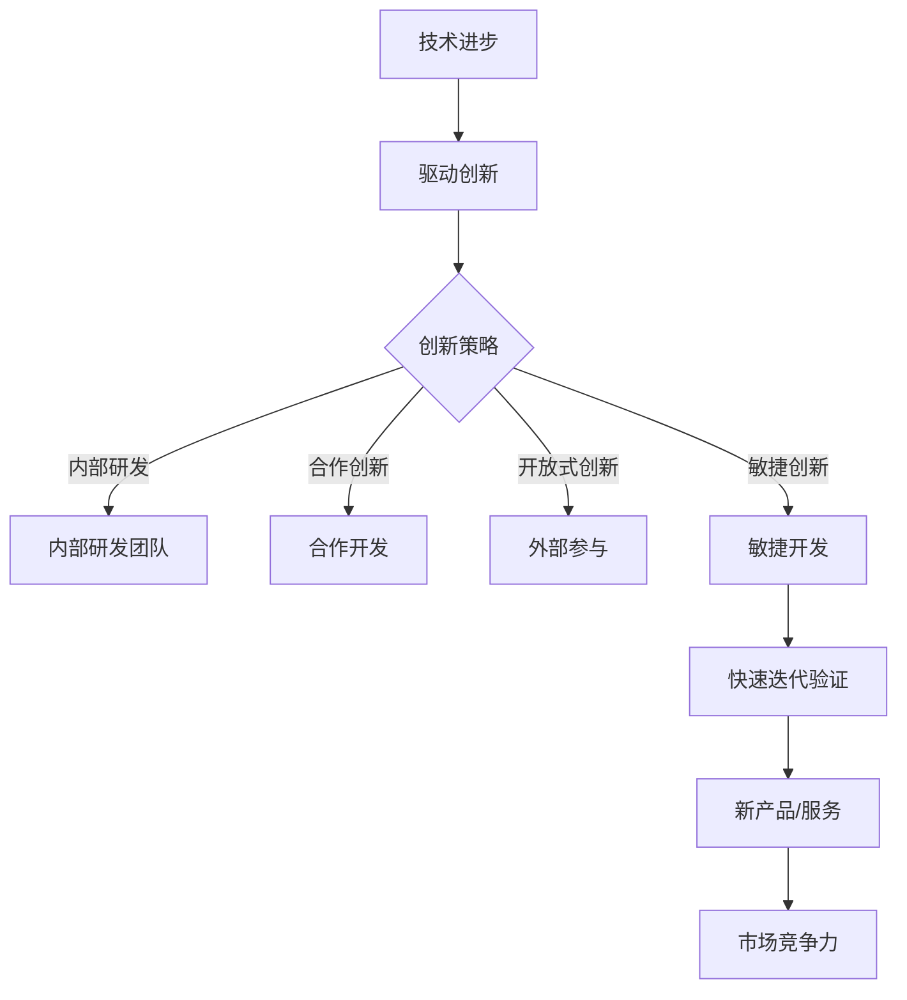

                 

# 持续创新：保持竞争力的关键

## 关键词

- 持续创新
- 竞争力
- 企业发展
- 技术进步
- 创新策略

## 摘要

在当今快速变化的技术环境中，持续创新是企业保持竞争力、实现长期发展的关键。本文将探讨持续创新的定义、重要性，以及如何通过技术进步、创新策略和实践来保持竞争力。我们将结合实际案例，分析成功企业如何在创新中取得优势，并展望未来持续创新的发展趋势和挑战。

## 1. 背景介绍

在全球化和数字化的大背景下，企业面临的竞争压力前所未有。技术进步的速度不断加快，新的商业模式和产品层出不穷。为了在激烈的市场竞争中立于不败之地，企业必须具备持续创新能力。持续创新不仅仅是指开发新产品或服务，更包括改进现有产品、优化业务流程、探索新的市场机会等多个方面。

### 1.1 创新的定义与分类

创新是指在现有基础上引入新的想法、方法或实践，从而创造价值的过程。根据创新的来源和性质，可以分为以下几种类型：

- **产品创新**：开发全新的产品或服务。
- **过程创新**：改进生产或服务流程，提高效率和质量。
- **市场创新**：开拓新的市场或客户群体。
- **业务模式创新**：重新定义企业的运营方式，创造新的盈利模式。

### 1.2 创新的重要性

创新对企业的影响是多方面的。首先，它能够帮助企业获取竞争优势，提升市场份额。其次，创新有助于企业适应市场变化，应对外部环境的不确定性。此外，创新还能够提高企业的灵活性和适应性，使其能够迅速响应客户需求和市场动态。

## 2. 核心概念与联系

### 2.1 技术进步与创新的关系

技术进步是推动创新的重要驱动力。新技术的出现往往能够改变传统产业模式，催生新的商业模式和企业。例如，互联网技术的兴起推动了电子商务的快速发展，大数据和人工智能技术的应用则改变了传统的数据分析方式。

### 2.2 创新策略的类型

企业可以选择不同的创新策略来保持竞争力：

- **内部研发**：通过内部研发团队不断探索新技术和新产品。
- **合作创新**：与其他企业或机构合作，共同开发新产品或服务。
- **开放式创新**：鼓励外部创新者参与企业的创新过程，共同创造价值。
- **敏捷创新**：采用敏捷开发方法，快速迭代和验证新产品或服务。

### 2.3 创新与竞争力的关系

创新能够提高企业的竞争力，使其在市场中占据有利地位。通过创新，企业可以：

- 提高产品质量和服务水平，满足客户需求。
- 开拓新市场，扩大业务范围。
- 降低成本，提高运营效率。
- 建立品牌形象，提升品牌价值。

### 2.4 Mermaid 流程图

以下是关于创新过程的一个简化的 Mermaid 流程图：



## 3. 核心算法原理 & 具体操作步骤

### 3.1 创新算法原理

持续创新不是偶然的结果，而是一种可以通过算法和流程优化的系统性工作。以下是一个简化的创新算法原理框架：

1. **需求识别**：通过市场调研、客户反馈等手段，识别潜在的创新需求。
2. **创意生成**：利用头脑风暴、设计思维等方法，产生多个创新创意。
3. **创意筛选**：通过评估创意的可行性、市场潜力等，筛选出最具潜力的创意。
4. **原型开发**：快速构建原型，验证创意的可行性。
5. **测试与迭代**：通过用户测试和反馈，不断优化和迭代产品或服务。
6. **商业化推广**：将创新产品或服务推向市场，实现商业化。

### 3.2 操作步骤

1. **需求识别**：

   - **市场调研**：通过调查问卷、访谈等方式，收集市场数据。
   - **客户反馈**：分析客户反馈，了解客户需求和痛点。

2. **创意生成**：

   - **头脑风暴**：组织团队成员进行头脑风暴，提出创新点子。
   - **设计思维**：运用设计思维方法，从用户角度出发，提出解决方案。

3. **创意筛选**：

   - **可行性评估**：评估每个创意的可行性，包括技术、市场、成本等。
   - **市场潜力分析**：分析每个创意的市场潜力，确定优先级。

4. **原型开发**：

   - **快速原型**：使用敏捷开发方法，快速构建原型。
   - **用户测试**：邀请用户参与测试，收集反馈。

5. **测试与迭代**：

   - **反馈循环**：根据用户反馈，进行产品或服务的迭代优化。
   - **数据驱动**：使用数据分析和机器学习技术，持续优化产品或服务。

6. **商业化推广**：

   - **市场调研**：了解市场需求，确定推广策略。
   - **渠道建设**：建立销售渠道，推广产品或服务。
   - **品牌塑造**：通过营销活动，提升品牌知名度。

## 4. 数学模型和公式 & 详细讲解 & 举例说明

### 4.1 创新收益模型

创新收益模型是衡量创新对企业经济效益的一种方法。以下是一个简化的创新收益模型公式：

$$
\text{创新收益} = \text{新市场收入} - \text{新市场成本} + \text{现有市场优化收益}
$$

其中：

- 新市场收入：通过创新产品或服务开拓的新市场带来的收入。
- 新市场成本：开拓新市场所需的成本。
- 现有市场优化收益：通过改进现有产品或服务，提高效率和质量，带来的收益。

### 4.2 举例说明

假设某公司通过创新，推出了一款具有革命性功能的新产品，开拓了一个全新的市场。以下是一个简化的例子：

- 新市场收入：$1,000,000
- 新市场成本：$500,000
- 现有市场优化收益：$200,000

$$
\text{创新收益} = 1,000,000 - 500,000 + 200,000 = 700,000
$$

### 4.3 详细讲解

创新收益模型可以帮助企业评估创新的潜在经济效益。通过分析新市场收入、成本以及现有市场优化收益，企业可以更好地决策哪些创新项目值得投入。

此外，企业还可以使用其他数学模型，如成本效益分析（CBA）、内部收益率（IRR）等，来评估创新项目的经济效益。

## 5. 项目实践：代码实例和详细解释说明

### 5.1 开发环境搭建

为了更好地展示创新过程，我们以一个简单的软件开发项目为例。首先，我们需要搭建一个开发环境。

- 开发语言：Python
- 开发工具：PyCharm
- 依赖库：Pandas、Numpy、Matplotlib

### 5.2 源代码详细实现

以下是该项目的一个简化的代码实例：

```python
import pandas as pd
import numpy as np
import matplotlib.pyplot as plt

# 读取数据
data = pd.read_csv('sales_data.csv')

# 数据预处理
data['Month'] = pd.to_datetime(data['Date']).dt.month
monthly_sales = data.groupby('Month')['Sale'].sum()

# 可视化
plt.plot(monthly_sales)
plt.title('Monthly Sales')
plt.xlabel('Month')
plt.ylabel('Sales')
plt.show()
```

### 5.3 代码解读与分析

1. **数据读取与预处理**：首先，从CSV文件中读取销售数据，并提取月份信息。然后，根据月份对销售额进行分组求和。
2. **可视化**：使用Matplotlib库，绘制月度销售额折线图，帮助分析销售趋势。

### 5.4 运行结果展示

运行上述代码后，将生成一个月度销售额折线图，展示不同月份的销售额变化情况。通过分析图表，企业可以识别销售高峰期和低谷期，从而制定相应的营销策略。

## 6. 实际应用场景

持续创新在实际应用中具有广泛的意义。以下是一些实际应用场景：

- **产品创新**：通过不断改进产品功能，满足客户需求，提升用户体验。
- **过程创新**：通过优化生产流程，提高生产效率，降低成本。
- **市场创新**：通过开拓新市场，扩大业务范围，提升企业竞争力。
- **业务模式创新**：通过重新定义企业的运营方式，创造新的盈利模式。

### 6.1 产品创新

以苹果公司为例，其通过持续的产品创新，如iPhone、iPad等，引领了智能手机和平板电脑市场的发展。苹果公司通过不断推出具有创新功能的新产品，满足了消费者对科技产品的需求，保持了市场领先地位。

### 6.2 过程创新

以丰田汽车公司为例，其通过精益生产方式，优化生产流程，提高了生产效率，降低了成本。丰田公司通过持续的过程创新，实现了卓越的运营效率，成为了汽车行业的领导者。

### 6.3 市场创新

以亚马逊公司为例，其通过电子商务模式，开拓了全球市场。亚马逊公司通过不断探索新的市场机会，如云计算、人工智能等，实现了业务的多元化和全球化。

### 6.4 业务模式创新

以阿里巴巴公司为例，其通过电子商务平台，改变了传统的商业模式。阿里巴巴公司通过搭建电子商务生态系统，为中小企业提供全方位的在线服务，创造了新的商业价值。

## 7. 工具和资源推荐

### 7.1 学习资源推荐

- **书籍**：
  - 《创新者的窘境》
  - 《创新者的基因》
  - 《精益创业》

- **论文**：
  - 《技术进步与创新的关系研究》
  - 《创新策略对企业竞争力的影响》
  - 《开放式创新的实践与挑战》

- **博客**：
  - 知乎上的创新专栏
  - Medium上的创新主题博客
  - 创新者社区的博客

- **网站**：
  - 创新管理网站
  - 企业创新论坛
  - 知识产权保护网站

### 7.2 开发工具框架推荐

- **开发工具**：
  - PyCharm
  - VS Code
  - Eclipse

- **框架**：
  - Flask
  - Django
  - Spring Boot

- **库**：
  - Pandas
  - Numpy
  - Matplotlib

### 7.3 相关论文著作推荐

- **论文**：
  - 《技术进步与创新的关系研究》
  - 《创新策略对企业竞争力的影响》
  - 《开放式创新的实践与挑战》

- **著作**：
  - 《创新者的窘境》
  - 《创新者的基因》
  - 《精益创业》

## 8. 总结：未来发展趋势与挑战

### 8.1 未来发展趋势

- **技术融合**：人工智能、大数据、物联网等技术的融合，将推动新兴产业的快速发展。
- **可持续发展**：企业将更加注重环保和社会责任，实现可持续发展。
- **个性化定制**：基于大数据和人工智能的个性化服务将成为主流。
- **全球化**：全球化进程将继续加快，企业将面临更多的市场机会和竞争挑战。

### 8.2 未来挑战

- **技术竞争**：企业将面临激烈的技术竞争，技术创新速度将成为关键优势。
- **人才短缺**：随着技术的发展，对高技能人才的需求将不断增加，人才短缺将成为一大挑战。
- **法律法规**：随着技术的进步，相关法律法规将不断完善，企业需要遵守相关法律法规。
- **商业模式**：企业需要不断调整和优化商业模式，以适应市场变化。

## 9. 附录：常见问题与解答

### 9.1 创新的定义是什么？

创新是指在现有基础上引入新的想法、方法或实践，从而创造价值的过程。它可以是产品创新、过程创新、市场创新或业务模式创新。

### 9.2 创新对企业有什么好处？

创新能够帮助企业提高竞争力、适应市场变化、降低成本、提高效率、开拓新市场等。它能够为企业带来长期的发展机遇和竞争优势。

### 9.3 如何进行创新？

进行创新的过程包括需求识别、创意生成、创意筛选、原型开发、测试与迭代、商业化推广等步骤。每个步骤都需要充分考虑市场需求、技术可行性、成本效益等因素。

### 9.4 创新策略有哪些？

创新策略包括内部研发、合作创新、开放式创新、敏捷创新等。企业可以根据自身情况和市场需求，选择合适的创新策略。

## 10. 扩展阅读 & 参考资料

- 《创新者的窘境》[美] 克莱顿·克里斯坦森
- 《创新者的基因》[美] 约瑟夫·巴达拉克
- 《精益创业》[美] 埃里克·莱斯
- 《技术进步与创新的关系研究》
- 《创新策略对企业竞争力的影响》
- 《开放式创新的实践与挑战》

[作者：禅与计算机程序设计艺术 / Zen and the Art of Computer Programming]

