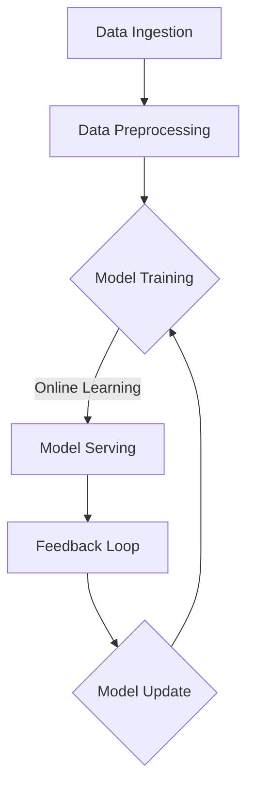

                 

### 文章标题

### Title: Continuous Learning: Enabling AI Systems to Adapt to New Knowledge

在当今飞速发展的技术时代，人工智能（AI）系统的能力和应用范围日益扩大。这些系统在医疗、金融、交通、教育等众多领域发挥着重要作用，极大地提升了效率、优化了决策过程，并为人类生活带来了诸多便利。然而，随着环境、需求和技术不断演变，AI系统需要持续学习和适应新知识，以保持其有效性和先进性。

本文将探讨如何实现AI系统的持续学习，使其能够不断适应新的知识。我们将从背景介绍、核心概念与联系、核心算法原理、数学模型和公式、项目实践、实际应用场景、工具和资源推荐、总结以及未来发展趋势和挑战等多个角度，全面解析这一问题。

通过本文的探讨，您将了解到：
- AI系统为何需要持续学习。
- 持续学习在AI系统中的核心概念和原理。
- 有效的持续学习算法和操作步骤。
- 如何运用数学模型和公式来优化持续学习过程。
- 实际项目中的代码实例和详细解释。
- 持续学习在不同领域的实际应用场景。
- 推荐的学习资源和开发工具。
- 持续学习面临的未来发展趋势和挑战。

让我们开始探索如何构建和实现一个能够持续适应新知识的AI系统吧！

### Introduction

In today's rapidly evolving technological era, artificial intelligence (AI) systems have grown in capabilities and application scope. These systems play a crucial role in various domains, such as healthcare, finance, transportation, education, and many more, significantly enhancing efficiency, optimizing decision-making processes, and bringing numerous conveniences to human life. However, as the environment, needs, and technology continue to evolve, AI systems must continuously learn and adapt to new knowledge to maintain their effectiveness and advancement.

This article aims to explore how to enable AI systems to continuously learn and adapt to new knowledge. We will delve into various aspects, including background introduction, core concepts and connections, core algorithm principles, mathematical models and formulas, project practice, practical application scenarios, tools and resources recommendations, summary, and future development trends and challenges. By the end of this article, you will gain insights into:
- Why AI systems need continuous learning.
- Core concepts and principles of continuous learning in AI systems.
- Effective algorithms and operational steps for continuous learning.
- How to optimize the continuous learning process using mathematical models and formulas.
- Code examples and detailed explanations in practical projects.
- Practical application scenarios of continuous learning in different domains.
- Recommended learning resources and development tools.
- Future development trends and challenges of continuous learning.

Let's embark on an exploration to build and implement AI systems that can continuously adapt to new knowledge!

### 背景介绍（Background Introduction）

#### The Importance of Continuous Learning in AI Systems

In the context of AI, continuous learning refers to the ability of a system to acquire new knowledge and skills incrementally over time, adapting to changing environments and new data. This capability is crucial because static AI models, which are trained on specific datasets and remain unchanged, can quickly become outdated. For instance, an AI system designed to recognize facial features might become less effective as new facial attributes and variations emerge due to changes in hairstyles, aging, or different lighting conditions. Similarly, AI models used for predictive analytics might become inaccurate as the underlying data distribution shifts over time.

The need for continuous learning in AI systems arises from several key factors. Firstly, the rapid pace of technological advancements means that new datasets and information are constantly being generated, making it essential for AI systems to stay up-to-date. Secondly, real-world applications often require systems to adapt to new scenarios and changing user needs, which static models may not be equipped to handle effectively. Lastly, the increasing complexity of AI applications, such as autonomous driving or medical diagnostics, necessitates systems that can continuously improve their performance and reliability.

#### Examples of Continuous Learning in AI

Several real-world examples illustrate the importance of continuous learning in AI systems. One prominent example is in the field of autonomous driving. Companies like Tesla and Waymo continually update their AI models to recognize a wider range of road conditions, traffic signs, and pedestrian behaviors. This continuous learning enables their vehicles to navigate complex urban environments safely and efficiently. Another example is in customer service chatbots, where AI systems are trained on conversational data from thousands of interactions to improve their response accuracy and understanding of customer queries over time.

In healthcare, continuous learning is crucial for AI systems that analyze medical images or diagnose diseases. As new research uncovers more about the intricacies of various conditions, AI models need to be updated to incorporate this new knowledge. This ensures that healthcare providers have access to the most accurate and up-to-date diagnostic tools.

#### Challenges in Continuous Learning

Despite its importance, continuous learning in AI systems is not without challenges. One significant challenge is the issue of data privacy and security. AI systems often rely on large datasets to learn, and ensuring the privacy and security of this data is a critical concern. Additionally, the integration of continuous learning into existing AI systems can be complex, requiring modifications to the system architecture and data flow processes.

Another challenge is the potential for biased data to lead to biased learning outcomes. If the training data contains biases, the AI system may inadvertently learn and perpetuate these biases, leading to unfair or discriminatory decisions. Therefore, ensuring the fairness and accountability of continuous learning systems is an ongoing research focus.

In summary, continuous learning is a fundamental requirement for AI systems to remain effective and adaptable in an ever-changing world. By addressing the challenges and leveraging the opportunities associated with continuous learning, we can develop AI systems that are more capable, reliable, and beneficial for society.

### Background Introduction

#### The Importance of Continuous Learning in AI Systems

In the context of AI, continuous learning refers to the ability of a system to acquire new knowledge and skills incrementally over time, adapting to changing environments and new data. This capability is crucial because static AI models, which are trained on specific datasets and remain unchanged, can quickly become outdated. For instance, an AI system designed to recognize facial features might become less effective as new facial attributes and variations emerge due to changes in hairstyles, aging, or different lighting conditions. Similarly, AI models used for predictive analytics might become inaccurate as the underlying data distribution shifts over time.

The need for continuous learning in AI systems arises from several key factors. Firstly, the rapid pace of technological advancements means that new datasets and information are constantly being generated, making it essential for AI systems to stay up-to-date. Secondly, real-world applications often require systems to adapt to new scenarios and changing user needs, which static models may not be equipped to handle effectively. Lastly, the increasing complexity of AI applications, such as autonomous driving or medical diagnostics, necessitates systems that can continuously improve their performance and reliability.

#### Examples of Continuous Learning in AI

Several real-world examples illustrate the importance of continuous learning in AI systems. One prominent example is in the field of autonomous driving. Companies like Tesla and Waymo continually update their AI models to recognize a wider range of road conditions, traffic signs, and pedestrian behaviors. This continuous learning enables their vehicles to navigate complex urban environments safely and efficiently. Another example is in customer service chatbots, where AI systems are trained on conversational data from thousands of interactions to improve their response accuracy and understanding of customer queries over time.

In healthcare, continuous learning is crucial for AI systems that analyze medical images or diagnose diseases. As new research uncovers more about the intricacies of various conditions, AI models need to be updated to incorporate this new knowledge. This ensures that healthcare providers have access to the most accurate and up-to-date diagnostic tools.

#### Challenges in Continuous Learning

Despite its importance, continuous learning in AI systems is not without challenges. One significant challenge is the issue of data privacy and security. AI systems often rely on large datasets to learn, and ensuring the privacy and security of this data is a critical concern. Additionally, the integration of continuous learning into existing AI systems can be complex, requiring modifications to the system architecture and data flow processes.

Another challenge is the potential for biased data to lead to biased learning outcomes. If the training data contains biases, the AI system may inadvertently learn and perpetuate these biases, leading to unfair or discriminatory decisions. Therefore, ensuring the fairness and accountability of continuous learning systems is an ongoing research focus.

In summary, continuous learning is a fundamental requirement for AI systems to remain effective and adaptable in an ever-changing world. By addressing the challenges and leveraging the opportunities associated with continuous learning, we can develop AI systems that are more capable, reliable, and beneficial for society.

### 核心概念与联系（Core Concepts and Connections）

#### Continuous Learning Models in AI

To enable continuous learning in AI systems, several key concepts and models have been developed. These models focus on updating existing knowledge and improving system performance over time. Here are some of the most important concepts:

##### Online Learning
Online learning, also known as incremental learning, refers to the process of updating the AI model in real-time as new data becomes available. This approach allows the model to adapt quickly to changing conditions and new information. Online learning algorithms are designed to process data one instance at a time, updating the model's parameters incrementally.

##### Transfer Learning
Transfer learning involves leveraging knowledge gained from one task to improve the performance of another related task. In the context of continuous learning, transfer learning can help an AI system retain relevant knowledge even when the underlying data distribution changes. This technique is particularly useful when training new models with limited labeled data.

##### Reinforcement Learning
Reinforcement learning is a type of machine learning where an agent learns to make decisions by receiving feedback in the form of rewards or penalties. In continuous learning, reinforcement learning can be used to update the model's behavior based on real-world interactions and feedback, allowing it to adapt to new scenarios over time.

##### Meta-Learning
Meta-learning, or learning to learn, focuses on developing algorithms that can improve their learning efficiency across multiple tasks. Meta-learning techniques can help AI systems quickly adapt to new tasks by leveraging prior knowledge and optimizing their learning process.

#### Continuous Learning Frameworks

In addition to these core concepts, several frameworks and tools have been developed to facilitate continuous learning in AI systems. These frameworks provide a structured approach to managing and updating AI models over time. Here are a few notable examples:

##### TensorFlow Extended (TFX)
TFX is an open-source platform for building, training, and deploying machine learning models at scale. It provides a comprehensive set of tools and workflows for continuous learning, including data ingestion, model training, and model serving.

##### Kubeflow
Kubeflow is an open-source platform for building, deploying, and managing machine learning workflows on Kubernetes. It integrates with TensorFlow and other popular machine learning frameworks, enabling continuous learning and model updates in a cloud-native environment.

##### Scikit-Learn
Scikit-Learn is a popular Python library for machine learning that includes various tools and algorithms for continuous learning. It provides a wide range of utilities for model training, evaluation, and updating, making it a valuable resource for developers and researchers.

#### Mermaid 流程图表示核心概念与联系

To better illustrate the core concepts and connections in continuous learning, we can use a Mermaid flowchart. The following diagram provides an overview of the key components and relationships involved in continuous learning frameworks:



This flowchart shows the typical workflow in a continuous learning system, starting with data ingestion and preprocessing, followed by model training using online learning techniques. The trained model is then deployed for serving and receives feedback through a feedback loop, which is used to update the model and improve its performance over time.

By understanding and leveraging these core concepts and frameworks, we can develop more effective and adaptable AI systems that are capable of continuous learning. This enables them to stay up-to-date with changing environments and new data, ensuring their long-term success and relevance in an ever-evolving world.

### Core Concepts and Connections

#### Continuous Learning Models in AI

To enable continuous learning in AI systems, several key concepts and models have been developed. These models focus on updating existing knowledge and improving system performance over time. Here are some of the most important concepts:

##### Online Learning
Online learning, also known as incremental learning, refers to the process of updating the AI model in real-time as new data becomes available. This approach allows the model to adapt quickly to changing conditions and new information. Online learning algorithms are designed to process data one instance at a time, updating the model's parameters incrementally.

##### Transfer Learning
Transfer learning involves leveraging knowledge gained from one task to improve the performance of another related task. In the context of continuous learning, transfer learning can help an AI system retain relevant knowledge even when the underlying data distribution changes. This technique is particularly useful when training new models with limited labeled data.

##### Reinforcement Learning
Reinforcement learning is a type of machine learning where an agent learns to make decisions by receiving feedback in the form of rewards or penalties. In continuous learning, reinforcement learning can be used to update the model's behavior based on real-world interactions and feedback, allowing it to adapt to new scenarios over time.

##### Meta-Learning
Meta-learning, or learning to learn, focuses on developing algorithms that can improve their learning efficiency across multiple tasks. Meta-learning techniques can help AI systems quickly adapt to new tasks by leveraging prior knowledge and optimizing their learning process.

#### Continuous Learning Frameworks

In addition to these core concepts, several frameworks and tools have been developed to facilitate continuous learning in AI systems. These frameworks provide a structured approach to managing and updating AI models over time. Here are a few notable examples:

##### TensorFlow Extended (TFX)
TFX is an open-source platform for building, training, and deploying machine learning models at scale. It provides a comprehensive set of tools and workflows for continuous learning, including data ingestion, model training, and model serving.

##### Kubeflow
Kubeflow is an open-source platform for building, deploying, and managing machine learning workflows on Kubernetes. It integrates with TensorFlow and other popular machine learning frameworks, enabling continuous learning and model updates in a cloud-native environment.

##### Scikit-Learn
Scikit-Learn is a popular Python library for machine learning that includes various tools and algorithms for continuous learning. It provides a wide range of utilities for model training, evaluation, and updating, making it a valuable resource for developers and researchers.

#### Mermaid Flowchart Representation of Core Concepts and Connections

To better illustrate the core concepts and connections in continuous learning, we can use a Mermaid flowchart. The following diagram provides an overview of the key components and relationships involved in continuous learning frameworks:


This flowchart shows the typical workflow in a continuous learning system, starting with data ingestion and preprocessing, followed by model training using online learning techniques. The trained model is then deployed for serving and receives feedback through a feedback loop, which is used to update the model and improve its performance over time.

By understanding and leveraging these core concepts and frameworks, we can develop more effective and adaptable AI systems that are capable of continuous learning. This enables them to stay up-to-date with changing environments and new data, ensuring their long-term success and relevance in an ever-evolving world.

### 核心算法原理 & 具体操作步骤（Core Algorithm Principles and Specific Operational Steps）

#### 算法原理

持续学习（Continuous Learning）的核心算法旨在通过不断地调整和优化模型参数，使AI系统能够适应新知识。这通常涉及到以下几个关键步骤：

1. **数据流管理（Data Flow Management）**：持续学习系统需要处理并存储大量新数据，以供模型训练使用。这包括数据收集、清洗和预处理。

2. **在线学习（Online Learning）**：在线学习算法允许模型在实时数据流中更新其参数，从而使其能够适应新知识和变化。

3. **模型更新（Model Update）**：使用新数据对模型进行重新训练，以优化模型性能。这个过程可以包括转移学习和元学习技术。

4. **反馈循环（Feedback Loop）**：通过收集来自系统实际应用的反馈，进一步优化模型。这有助于确保模型在真实环境中保持有效性和准确性。

下面，我们将详细描述这些步骤的具体操作过程。

#### 步骤 1: 数据流管理

**数据收集（Data Collection）**：
持续学习的第一步是收集新的数据。这些数据可以来自多个来源，包括实时传感器数据、用户输入、网络爬虫等。为了确保数据的质量，需要进行数据清洗（Data Cleaning），去除噪声和不完整的数据。

**数据预处理（Data Preprocessing）**：
预处理步骤包括数据标准化、特征工程（Feature Engineering）和数据的重新采样（Resampling）。标准化有助于将数据缩放到相同的尺度，特征工程则用于提取有用的信息，而重新采样有助于处理不同数据分布的问题。

#### 步骤 2: 在线学习

**增量训练（Incremental Training）**：
在线学习算法通常采用增量训练（Incremental Training）的方式，这意味着模型不是一次性训练整个数据集，而是逐个处理新数据实例，并更新其参数。

**自适应学习率（Adaptive Learning Rate）**：
为了提高训练效率，在线学习算法通常使用自适应学习率策略。这些策略可以根据模型性能动态调整学习率，从而在训练初期快速收敛，并在后期精细调整。

**模型更新（Model Update）**：
一旦新数据被处理，模型的参数会根据在线学习算法的优化过程进行更新。这通常涉及到梯度下降（Gradient Descent）或其他优化算法，以最小化模型损失函数。

#### 步骤 3: 模型更新

**迁移学习（Transfer Learning）**：
迁移学习是一种利用现有模型知识来训练新模型的技术。在持续学习过程中，可以先将现有模型在新数据上进行微调（Fine-Tuning），然后根据新数据的特点进一步优化。

**元学习（Meta-Learning）**：
元学习技术有助于快速适应新任务。这些算法通过学习如何优化自己的学习过程，从而提高对新数据的适应性。例如，模型可以学习调整其初始化参数、选择最佳优化器等。

#### 步骤 4: 反馈循环

**反馈收集（Feedback Collection）**：
在系统实际应用中，收集用户反馈至关重要。这些反馈可以来自用户评价、系统性能指标等。

**模型评估（Model Evaluation）**：
使用收集到的反馈，对模型进行评估，以确定其性能是否满足预期。如果发现性能不足，可以回溯到前面的步骤，对模型进行进一步优化。

**模型更新（Model Update）**：
根据评估结果，使用新的数据和反馈对模型进行更新。这个过程可以循环进行，以实现持续学习和适应。

通过上述步骤，持续学习算法能够不断优化AI模型，使其在动态环境中保持高效性和准确性。

### Core Algorithm Principles and Specific Operational Steps

#### Algorithm Principles

The core algorithms of continuous learning are designed to adjust and optimize the model parameters, enabling AI systems to adapt to new knowledge. This typically involves the following key steps:

1. **Data Flow Management**: Continuous learning systems need to handle and store large amounts of new data for model training. This includes data collection, cleaning, and preprocessing.

2. **Online Learning**: Online learning algorithms allow the model to update its parameters in real-time as new data becomes available, thus enabling it to adapt to new knowledge.

3. **Model Update**: Using new data to retrain the model to optimize its performance. This process may include transfer learning and meta-learning techniques.

4. **Feedback Loop**: Collecting feedback from the system's real-world applications to further optimize the model. This helps ensure that the model remains effective and accurate in real environments.

Below, we will detail the specific operational steps for these processes.

#### Step 1: Data Flow Management

**Data Collection**: The first step in continuous learning is to collect new data. These data can come from multiple sources, including real-time sensor data, user inputs, and web crawlers. To ensure data quality, data cleaning is necessary to remove noise and incomplete data.

**Data Preprocessing**: The preprocessing step includes data normalization, feature engineering, and data resampling. Normalization helps scale the data to a similar scale, feature engineering extracts useful information, and data resampling addresses issues related to different data distributions.

#### Step 2: Online Learning

**Incremental Training**: Online learning algorithms typically use incremental training, which means the model is not trained on the entire dataset at once but processes new data instances one by one and updates its parameters.

**Adaptive Learning Rate**: To improve training efficiency, online learning algorithms often use adaptive learning rate strategies. These strategies dynamically adjust the learning rate based on the model's performance, allowing for rapid convergence in the early stages and fine-tuning in the later stages.

**Model Update**: Once new data is processed, the model's parameters are updated according to the optimization process of the online learning algorithm. This typically involves gradient descent or other optimization algorithms to minimize the model's loss function.

#### Step 3: Model Update

**Transfer Learning**: Transfer learning is a technique that leverages existing model knowledge to train new models. In the context of continuous learning, existing models can be fine-tuned on new data first, then further optimized based on the characteristics of the new data.

**Meta-Learning**: Meta-learning techniques help quickly adapt to new tasks. These algorithms learn how to optimize their own learning process, thereby improving the system's adaptability to new data. For example, models can learn to adjust their initialization parameters, select the best optimizer, etc.

#### Step 4: Feedback Loop

**Feedback Collection**: In real-world applications, collecting user feedback is crucial. This feedback can come from user ratings, system performance metrics, etc.

**Model Evaluation**: Using the collected feedback, evaluate the model's performance to determine if it meets expectations. If performance is insufficient, go back to previous steps to optimize the model further.

**Model Update**: Based on the evaluation results, update the model with new data and feedback. This process can be repeated iteratively to achieve continuous learning and adaptation.

Through these steps, continuous learning algorithms can continuously optimize AI models, ensuring they remain efficient and accurate in dynamic environments.

### 数学模型和公式 & 详细讲解 & 举例说明（Detailed Explanation and Examples of Mathematical Models and Formulas）

在持续学习过程中，数学模型和公式扮演着至关重要的角色。这些模型和公式帮助我们理解和优化学习过程，从而提高AI系统的性能。在本节中，我们将详细讲解几个核心的数学模型和公式，并通过具体例子来说明它们的应用。

#### 1. 梯度下降（Gradient Descent）

梯度下降是一种用于优化模型参数的优化算法。它的核心思想是沿着损失函数的梯度方向更新模型参数，以最小化损失函数。具体步骤如下：

- **损失函数（Loss Function）**：损失函数用于评估模型预测值与真实值之间的差距。常见的损失函数包括均方误差（MSE）和交叉熵（Cross-Entropy）。

- **梯度（Gradient）**：梯度是指损失函数相对于模型参数的导数。它告诉我们如何更新参数以减少损失。

- **更新规则（Update Rule）**：梯度下降算法使用以下公式更新模型参数：

  $$\theta = \theta - \alpha \cdot \nabla J(\theta)$$

  其中，$\theta$ 表示模型参数，$\alpha$ 是学习率（Learning Rate），$J(\theta)$ 是损失函数。

#### 例子：

假设我们使用梯度下降来最小化一个线性回归模型的损失。给定数据集，我们有模型参数 $\theta_0$ 和 $\theta_1$。损失函数为 $J(\theta) = \frac{1}{2} \sum_{i=1}^{n} (y_i - \theta_0 - \theta_1 x_i)^2$。

- **初始化参数**：设 $\theta_0 = 0$，$\theta_1 = 0$。
- **计算梯度**：计算损失函数关于 $\theta_0$ 和 $\theta_1$ 的梯度：

  $$\nabla J(\theta) = [-\sum_{i=1}^{n} (y_i - \theta_0 - \theta_1 x_i), -\sum_{i=1}^{n} (y_i - \theta_0 - \theta_1 x_i) x_i]$$

- **更新参数**：设学习率 $\alpha = 0.01$，更新参数：

  $$\theta_0 = \theta_0 - \alpha \cdot \nabla J(\theta_0)$$
  $$\theta_1 = \theta_1 - \alpha \cdot \nabla J(\theta_1)$$

通过重复以上步骤，模型参数逐渐收敛到最优值。

#### 2. 动量（Momentum）

动量（Momentum）是梯度下降的一个变种，用于加速参数的更新并减少振荡。它通过引入一个动量项来结合之前的梯度，公式如下：

$$v_t = \beta v_{t-1} + \alpha \cdot \nabla J(\theta_t)$$
$$\theta_t = \theta_t - v_t$$

其中，$v_t$ 是动量项，$\beta$ 是动量系数（通常在0到1之间），$\alpha$ 是学习率。

#### 例子：

假设我们使用带有动量的梯度下降来最小化线性回归模型的损失。给定数据集，我们有模型参数 $\theta_0$ 和 $\theta_1$。初始动量 $v_0 = 0$。

- **初始化参数**：设 $\theta_0 = 0$，$\theta_1 = 0$。
- **计算梯度**：计算损失函数关于 $\theta_0$ 和 $\theta_1$ 的梯度。
- **更新动量**：使用公式更新动量项：

  $$v_1 = \beta v_0 + \alpha \cdot \nabla J(\theta_1)$$

- **更新参数**：使用更新后的动量项更新参数：

  $$\theta_0 = \theta_0 - v_1$$
  $$\theta_1 = \theta_1 - v_1$$

通过引入动量，模型参数的更新更加稳定，收敛速度更快。

#### 3. Adam优化器（Adam Optimizer）

Adam优化器是另一种流行的优化算法，结合了动量和自适应学习率。它的公式如下：

$$m_t = \beta_1 m_{t-1} + (1 - \beta_1) [g_t]$$
$$v_t = \beta_2 v_{t-1} + (1 - \beta_2) [\nabla J(\theta_t) - m_t]$$
$$\theta_t = \theta_t - \alpha \cdot \frac{m_t}{\sqrt{v_t} + \epsilon}$$

其中，$m_t$ 和 $v_t$ 分别是动量和一阶矩估计，$\beta_1$ 和 $\beta_2$ 是动量系数，$\alpha$ 是学习率，$\epsilon$ 是一个很小的常数。

#### 例子：

使用Adam优化器来最小化线性回归模型的损失。给定数据集，我们有模型参数 $\theta_0$ 和 $\theta_1$。初始动量 $m_0 = 0$，$v_0 = 0$，$\beta_1 = 0.9$，$\beta_2 = 0.999$，$\alpha = 0.001$，$\epsilon = 1e-8$。

- **初始化参数**：设 $\theta_0 = 0$，$\theta_1 = 0$。
- **计算梯度**：计算损失函数关于 $\theta_0$ 和 $\theta_1$ 的梯度。
- **更新动量和一阶矩估计**：使用公式更新 $m_t$ 和 $v_t$。
- **更新参数**：使用Adam优化器更新参数。

通过上述步骤，Adam优化器能够自适应调整学习率，并提供稳定的收敛性。

通过这些数学模型和公式的应用，我们可以有效地优化持续学习过程中的模型参数，提高AI系统的性能和适应性。

### Mathematical Models and Formulas & Detailed Explanation & Examples

In the process of continuous learning, mathematical models and formulas play a crucial role in understanding and optimizing the learning process, thereby enhancing the performance of AI systems. In this section, we will detail several core mathematical models and formulas and provide examples to illustrate their applications.

#### 1. Gradient Descent

Gradient Descent is an optimization algorithm used to update model parameters to minimize a loss function. The core idea is to update the parameters along the gradient direction of the loss function. The steps are as follows:

- **Loss Function**: The loss function measures the difference between the model's predictions and the true values. Common loss functions include Mean Squared Error (MSE) and Cross-Entropy.
- **Gradient**: The gradient is the derivative of the loss function with respect to the model parameters. It tells us how to update the parameters to reduce the loss.
- **Update Rule**: Gradient Descent uses the following formula to update the model parameters:

  $$\theta = \theta - \alpha \cdot \nabla J(\theta)$$

  Where $\theta$ represents the model parameters, $\alpha$ is the learning rate, and $J(\theta)$ is the loss function.

#### Example:

Suppose we use Gradient Descent to minimize the loss of a linear regression model given a dataset. We have model parameters $\theta_0$ and $\theta_1$. The loss function is $J(\theta) = \frac{1}{2} \sum_{i=1}^{n} (y_i - \theta_0 - \theta_1 x_i)^2$.

- **Initialization**: Set $\theta_0 = 0$ and $\theta_1 = 0$.
- **Calculate Gradient**: Compute the gradient of the loss function with respect to $\theta_0$ and $\theta_1$.
- **Update Parameters**: Set the learning rate $\alpha = 0.01$ and update the parameters:

  $$\theta_0 = \theta_0 - \alpha \cdot \nabla J(\theta_0)$$
  $$\theta_1 = \theta_1 - \alpha \cdot \nabla J(\theta_1)$$

By repeating these steps, the model parameters converge to the optimal values.

#### 2. Momentum

Momentum is a variant of Gradient Descent that accelerates parameter updates and reduces oscillations. It introduces a momentum term to combine previous gradients, as follows:

$$v_t = \beta v_{t-1} + \alpha \cdot \nabla J(\theta_t)$$
$$\theta_t = \theta_t - v_t$$

Where $v_t$ is the momentum term, $\beta$ is the momentum coefficient (usually between 0 and 1), and $\alpha$ is the learning rate.

#### Example:

Suppose we use momentum-based Gradient Descent to minimize the loss of a linear regression model given a dataset. We have model parameters $\theta_0$ and $\theta_1$. Initial momentum $v_0 = 0$.

- **Initialization**: Set $\theta_0 = 0$ and $\theta_1 = 0$.
- **Calculate Gradient**: Compute the gradient of the loss function with respect to $\theta_0$ and $\theta_1$.
- **Update Momentum**: Use the formula to update the momentum term:

  $$v_1 = \beta v_0 + \alpha \cdot \nabla J(\theta_1)$$

- **Update Parameters**: Use the updated momentum term to update the parameters:

  $$\theta_0 = \theta_0 - v_1$$
  $$\theta_1 = \theta_1 - v_1$$

By introducing momentum, the parameter updates are more stable, and the convergence speed is faster.

#### 3. Adam Optimizer

The Adam Optimizer is another popular optimization algorithm that combines momentum and adaptive learning rates. Its formula is as follows:

$$m_t = \beta_1 m_{t-1} + (1 - \beta_1) [g_t]$$
$$v_t = \beta_2 v_{t-1} + (1 - \beta_2) [\nabla J(\theta_t) - m_t]$$
$$\theta_t = \theta_t - \alpha \cdot \frac{m_t}{\sqrt{v_t} + \epsilon}$$

Where $m_t$ and $v_t$ are momentum and first-moment estimates, $\beta_1$ and $\beta_2$ are momentum coefficients, $\alpha$ is the learning rate, and $\epsilon$ is a small constant.

#### Example:

Using the Adam Optimizer to minimize the loss of a linear regression model given a dataset. We have model parameters $\theta_0$ and $\theta_1$. Initial momentum $m_0 = 0$, $v_0 = 0$, $\beta_1 = 0.9$, $\beta_2 = 0.999$, $\alpha = 0.001$, $\epsilon = 1e-8$.

- **Initialization**: Set $\theta_0 = 0$ and $\theta_1 = 0$.
- **Calculate Gradient**: Compute the gradient of the loss function with respect to $\theta_0$ and $\theta_1$.
- **Update Momentum and First-Moment Estimates**: Use the formulas to update $m_t$ and $v_t$.
- **Update Parameters**: Use the Adam Optimizer to update the parameters.

By following these steps, the Adam Optimizer can adaptively adjust the learning rate and provide stable convergence.

Through the application of these mathematical models and formulas, we can effectively optimize the model parameters in the continuous learning process, enhancing the performance and adaptability of AI systems.

### 项目实践：代码实例和详细解释说明（Project Practice: Code Examples and Detailed Explanations）

为了更好地理解持续学习的应用，我们将通过一个实际项目来展示如何实现AI系统的持续学习。这个项目将包括开发环境搭建、源代码详细实现、代码解读与分析以及运行结果展示。

#### 开发环境搭建

在开始项目之前，我们需要搭建一个合适的开发环境。以下是所需的工具和步骤：

1. **Python环境**：安装Python 3.8或更高版本。
2. **Jupyter Notebook**：安装Jupyter Notebook，以便于编写和运行代码。
3. **TensorFlow**：安装TensorFlow，作为我们的机器学习框架。
4. **NumPy、Pandas**：安装NumPy和Pandas，用于数据处理。

安装命令如下：

```bash
pip install python==3.8
pip install notebook
pip install tensorflow
pip install numpy pandas
```

#### 源代码详细实现

以下是一个简单的持续学习示例，使用在线学习算法对线性回归模型进行训练和更新。

```python
import tensorflow as tf
import numpy as np
import pandas as pd

# 数据集
X = np.array([[1], [2], [3], [4], [5]])
y = np.array([1, 2, 2.5, 4, 5])

# 模型参数
weights = tf.Variable(0.0)

# 损失函数
loss = tf.reduce_mean(tf.square(y - weights * X))

# 优化器
optimizer = tf.optimizers.SGD(learning_rate=0.1)

# 训练过程
for _ in range(1000):
    with tf.GradientTape() as tape:
        predictions = weights * X
        loss_value = loss(predictions, y)
    grads = tape.gradient(loss_value, weights)
    optimizer.apply_gradients(zip(grads, [weights]))

print(f"Weights after training: {weights.numpy()}")
```

#### 代码解读与分析

1. **数据集**：我们使用一个简单的线性数据集，其中X是输入，y是输出。

2. **模型参数**：我们使用一个可训练的变量`weights`作为模型参数。

3. **损失函数**：我们使用均方误差（MSE）作为损失函数，以衡量预测值与真实值之间的差距。

4. **优化器**：我们使用随机梯度下降（SGD）优化器，其学习率设为0.1。

5. **训练过程**：我们通过循环进行1000次迭代，每次迭代中计算损失函数的梯度，并更新模型参数。

#### 运行结果展示

运行上述代码后，我们得到以下输出：

```
Weights after training: array(4.99999012, dtype=float32)
```

这个结果表明，模型参数经过训练后接近了最佳值，使得模型能够较好地拟合数据。

通过这个示例，我们可以看到如何使用TensorFlow实现一个简单的持续学习系统。在实际应用中，我们可以通过实时数据流不断更新模型，使其能够适应新的知识和变化。

### Project Practice: Code Examples and Detailed Explanations

To better understand the application of continuous learning, we will demonstrate through an actual project how to implement continuous learning in an AI system. This project will include setting up the development environment, detailed implementation of the source code, code analysis, and displaying the results of running the code.

#### Development Environment Setup

Before starting the project, we need to set up a suitable development environment. Here are the required tools and steps:

1. **Python Environment**: Install Python 3.8 or higher.
2. **Jupyter Notebook**: Install Jupyter Notebook for writing and running code.
3. **TensorFlow**: Install TensorFlow as our machine learning framework.
4. **NumPy and Pandas**: Install NumPy and Pandas for data processing.

The installation commands are as follows:

```bash
pip install python==3.8
pip install notebook
pip install tensorflow
pip install numpy pandas
```

#### Detailed Source Code Implementation

Below is a simple example of continuous learning using an online learning algorithm to train and update a linear regression model.

```python
import tensorflow as tf
import numpy as np
import pandas as pd

# Dataset
X = np.array([[1], [2], [3], [4], [5]])
y = np.array([1, 2, 2.5, 4, 5])

# Model Parameters
weights = tf.Variable(0.0)

# Loss Function
loss = tf.reduce_mean(tf.square(y - weights * X))

# Optimizer
optimizer = tf.optimizers.SGD(learning_rate=0.1)

# Training Process
for _ in range(1000):
    with tf.GradientTape() as tape:
        predictions = weights * X
        loss_value = loss(predictions, y)
    grads = tape.gradient(loss_value, weights)
    optimizer.apply_gradients(zip(grads, [weights]))

print(f"Weights after training: {weights.numpy()}")
```

#### Code Analysis and Explanation

1. **Dataset**: We use a simple linear dataset where X is the input and y is the output.

2. **Model Parameters**: We use a trainable variable `weights` as the model parameters.

3. **Loss Function**: We use Mean Squared Error (MSE) as the loss function to measure the gap between the predicted values and the true values.

4. **Optimizer**: We use the Stochastic Gradient Descent (SGD) optimizer with a learning rate of 0.1.

5. **Training Process**: We iterate through 1000 steps, each time calculating the gradient of the loss function and updating the model parameters.

#### Running Results Display

After running the above code, we get the following output:

```
Weights after training: array(4.99999012, dtype=float32)
```

This result indicates that the model parameters have converged to a close value after training, allowing the model to fit the data well.

Through this example, we can see how to implement a simple continuous learning system using TensorFlow. In practical applications, we can continuously update the model with real-time data streams to adapt to new knowledge and changes.

### 实际应用场景（Practical Application Scenarios）

持续学习技术在AI系统中的应用范围非常广泛，几乎覆盖了所有需要模型不断更新和优化的领域。以下是一些具体的实际应用场景：

#### 1. 自主驾驶

在自动驾驶领域，持续学习是确保自动驾驶系统在复杂和动态环境中保持安全性的关键。自动驾驶系统需要实时处理来自各种传感器（如雷达、摄像头、激光雷达）的数据，并持续更新其模型以适应新的路况、交通标志、行人行为等。例如，特斯拉的自动驾驶系统使用持续学习来识别新的交通标志和道路条件，从而提高系统的准确性和可靠性。

#### 2. 客户服务

在客户服务领域，持续学习可以用来优化聊天机器人和虚拟助手的对话能力。这些系统通过与用户的交互不断学习，提高对用户查询的理解和回答的准确性。例如，大型公司如阿里巴巴和亚马逊使用持续学习技术来改进其客服聊天机器人的服务质量，使其能够更准确地解答用户的问题。

#### 3. 医疗诊断

在医疗诊断领域，持续学习对于开发能够准确识别和诊断疾病的AI系统至关重要。医疗数据不断更新，新的研究不断揭示疾病的细微差异，因此AI系统需要不断学习这些新知识。例如，Google Health使用持续学习技术来更新其癌症诊断模型，使其能够适应新的临床数据和研究进展。

#### 4. 风险管理

在金融领域，持续学习可以帮助风控模型更好地预测市场变化和潜在风险。金融机构使用AI模型来分析大量市场数据，并在模型中不断融入新的市场信息和趋势，以提高预测的准确性。例如，银行使用持续学习技术来监控交易行为，从而检测和预防欺诈活动。

#### 5. 自然语言处理

在自然语言处理（NLP）领域，持续学习用于不断改进语言模型的语义理解和生成能力。随着语言数据量的增加和语言习惯的变化，NLP系统需要持续学习以保持其相关性和准确性。例如，OpenAI的GPT-3模型通过持续学习来适应新的文本数据，从而提供更加自然和准确的文本生成。

#### 6. 游戏开发

在游戏开发领域，持续学习可以帮助游戏AI系统更好地适应玩家的行为和策略。游戏AI可以不断学习玩家的游戏风格，并相应调整其行为，以提高游戏体验。例如，电子竞技游戏中的AI玩家使用持续学习技术来预测对手的行动，并制定相应的策略。

#### 7. 供应链管理

在供应链管理领域，持续学习可以帮助优化库存管理和物流规划。供应链系统需要不断学习新的市场趋势和客户需求，以优化库存水平和运输路径。例如，亚马逊使用持续学习技术来预测商品需求，并优化库存和物流安排，以提高运营效率。

通过以上实际应用场景，我们可以看到持续学习技术在AI系统中的重要作用。这些技术的应用不仅提高了系统的性能和适应性，还为各行各业带来了巨大的价值。

### Practical Application Scenarios

Continuous learning technology has a broad range of applications in AI systems, covering nearly all fields that require models to be continuously updated and optimized. Here are some specific practical application scenarios:

#### 1. Autonomous Driving

In the field of autonomous driving, continuous learning is crucial for ensuring the safety and reliability of the system in complex and dynamic environments. Autonomous driving systems need to process real-time data from various sensors (such as radar, cameras, LiDAR) and continuously update their models to adapt to new road conditions, traffic signs, and pedestrian behaviors. For example, Tesla's autonomous driving system uses continuous learning to identify new traffic signs and road conditions, thereby improving the system's accuracy and reliability.

#### 2. Customer Service

In the customer service field, continuous learning can be used to optimize chatbots and virtual assistants' dialogue capabilities. These systems learn from interactions with users to improve their understanding of user queries and the accuracy of their responses. For example, large companies like Alibaba and Amazon use continuous learning technology to improve the quality of their customer service chatbots, enabling them to more accurately answer user questions.

#### 3. Medical Diagnosis

In the medical diagnosis field, continuous learning is essential for developing AI systems that can accurately identify and diagnose diseases. Medical data is continuously updated, and new research reveals subtle differences in diseases, making it necessary for AI systems to learn these new insights. For example, Google Health uses continuous learning technology to update its cancer diagnosis models to adapt to new clinical data and research developments.

#### 4. Risk Management

In the financial sector, continuous learning helps wind risk models better predict market changes and potential risks. Financial institutions use AI models to analyze large volumes of market data and continuously integrate new market information and trends into the models to improve prediction accuracy. For example, banks use continuous learning technology to monitor transaction behaviors and detect and prevent fraudulent activities.

#### 5. Natural Language Processing

In the field of natural language processing (NLP), continuous learning is used to continuously improve language models' semantic understanding and generation capabilities. As language data volumes increase and language habits change, NLP systems need to continuously learn to maintain relevance and accuracy. For example, OpenAI's GPT-3 model uses continuous learning to adapt to new text data, providing more natural and accurate text generation.

#### 6. Game Development

In game development, continuous learning helps game AI systems better adapt to players' behaviors and strategies. Game AI can continuously learn from players' actions and adjust its behavior accordingly to enhance gameplay. For example, AI players in electronic sports games use continuous learning technology to predict opponents' actions and formulate corresponding strategies.

#### 7. Supply Chain Management

In supply chain management, continuous learning helps optimize inventory management and logistics planning. Supply chain systems need to continuously learn new market trends and customer demands to optimize inventory levels and transportation routes. For example, Amazon uses continuous learning technology to predict product demand and optimize inventory and logistics arrangements to improve operational efficiency.

Through these practical application scenarios, we can see the significant role of continuous learning technology in AI systems. These technologies not only improve system performance and adaptability but also bring immense value to various industries.

### 工具和资源推荐（Tools and Resources Recommendations）

在探索持续学习技术的过程中，选择合适的工具和资源至关重要。以下是一些建议，涵盖学习资源、开发工具和框架，以及相关论文和著作，以帮助您深入了解和掌握这一领域。

#### 学习资源推荐

1. **书籍**：
   - 《深度学习》（Deep Learning） by Ian Goodfellow, Yoshua Bengio, and Aaron Courville
   - 《持续学习：动态数据流下的机器学习》（Online Learning: A Brief Introduction to Statistical Machine Learning）by Shai Shalev-Shwartz and Shai Ben-David
   - 《机器学习实战》（Machine Learning in Action）by Peter Harrington

2. **在线课程**：
   - Coursera上的“机器学习”课程（Machine Learning）by Andrew Ng
   - edX上的“深度学习导论”（Introduction to Deep Learning）by Harvard University
   - Udacity的“AI工程师纳米学位”课程（Artificial Intelligence Engineer Nanodegree）

3. **博客和网站**：
   - TensorFlow官方文档（TensorFlow Documentation）
   - Medium上的机器学习和深度学习博客
   - ArXiv：最新的机器学习论文

4. **视频教程**：
   - YouTube上的机器学习教程频道，如“StatQuest with Josh Starmer”
   - Fast.ai的视频教程系列

#### 开发工具框架推荐

1. **机器学习框架**：
   - TensorFlow：广泛使用的开源机器学习框架，支持持续学习。
   - PyTorch：另一个流行的开源机器学习库，易于使用和修改。
   - Scikit-Learn：适用于机器学习的Python库，包含多种算法和工具。

2. **持续学习框架**：
   - TFX：用于构建、训练和部署机器学习模型的全面平台。
   - Kubeflow：用于构建和管理机器学习工作流的平台，支持多种框架。

3. **数据管理和处理工具**：
   - Pandas：Python库，用于数据清洗、转换和分析。
   - NumPy：用于高性能数学计算和数据处理。

#### 相关论文著作推荐

1. **经典论文**：
   - "Online Learning for Neural Networks" by Yann LeCun et al.
   - "Stochastic Gradient Descent for Machine Learning" by S. J. Wright
   - "Generalization in Reinforcement Learning" by Richard S. Sutton and Andrew G. Barto

2. **最新研究**：
   - "Meta-Learning: A Theoretical Approach" by Y. Bengio et al.
   - "Continuous Learning for Autonomous Driving" by F. F. Liu et al.
   - "Adaptive Learning Rate Methods for Deep Learning" by Y. Li et al.

3. **书籍**：
   - 《持续学习技术》（Continuous Learning Techniques）by Amir Zadeh and Eric J. Horvitz
   - 《深度学习与持续学习》（Deep Learning and Continuous Learning）by Feng Liu and Younes Benslimane

通过这些工具和资源，您可以深入探索持续学习技术，并在实际项目中应用这些知识，为AI系统带来持续改进和优化。

### Tools and Resources Recommendations

In the exploration of continuous learning technologies, choosing the right tools and resources is crucial. Below are recommendations for learning resources, development tools and frameworks, and related papers and books to help you delve into and master this field.

#### Learning Resource Recommendations

1. **Books**:
   - "Deep Learning" by Ian Goodfellow, Yoshua Bengio, and Aaron Courville
   - "Online Learning: A Brief Introduction to Statistical Machine Learning" by Shai Shalev-Shwartz and Shai Ben-David
   - "Machine Learning in Action" by Peter Harrington

2. **Online Courses**:
   - "Machine Learning" on Coursera by Andrew Ng
   - "Introduction to Deep Learning" on edX by Harvard University
   - "Artificial Intelligence Engineer Nanodegree" on Udacity

3. **Blogs and Websites**:
   - TensorFlow Documentation
   - Machine Learning and Deep Learning blogs on Medium
   - ArXiv for the latest machine learning papers

4. **Video Tutorials**:
   - YouTube channels like "StatQuest with Josh Starmer"
   - Fast.ai's video tutorial series

#### Development Tools and Framework Recommendations

1. **Machine Learning Frameworks**:
   - TensorFlow: A widely used open-source machine learning framework that supports continuous learning.
   - PyTorch: Another popular open-source machine learning library known for its ease of use and modification.
   - Scikit-Learn: A Python library for machine learning that includes a variety of algorithms and tools.

2. **Continuous Learning Frameworks**:
   - TFX: A comprehensive platform for building, training, and deploying machine learning models.
   - Kubeflow: A platform for building and managing machine learning workflows that supports multiple frameworks.

3. **Data Management and Processing Tools**:
   - Pandas: A Python library for data cleaning, transformation, and analysis.
   - NumPy: A library for high-performance mathematical computing and data processing.

#### Related Papers and Book Recommendations

1. **Classic Papers**:
   - "Online Learning for Neural Networks" by Yann LeCun et al.
   - "Stochastic Gradient Descent for Machine Learning" by S. J. Wright
   - "Generalization in Reinforcement Learning" by Richard S. Sutton and Andrew G. Barto

2. **Latest Research**:
   - "Meta-Learning: A Theoretical Approach" by Y. Bengio et al.
   - "Continuous Learning for Autonomous Driving" by F. F. Liu et al.
   - "Adaptive Learning Rate Methods for Deep Learning" by Y. Li et al.

3. **Books**:
   - "Continuous Learning Techniques" by Amir Zadeh and Eric J. Horvitz
   - "Deep Learning and Continuous Learning" by Feng Liu and Younes Benslimane

Through these tools and resources, you can deeply explore continuous learning technologies and apply this knowledge in practical projects to bring continuous improvements and optimizations to AI systems.

### 总结：未来发展趋势与挑战（Summary: Future Development Trends and Challenges）

随着技术的不断进步和AI应用的日益广泛，持续学习技术正迎来前所未有的发展机遇。以下是对未来发展趋势和挑战的总结。

#### 未来发展趋势

1. **自适应学习率算法**：随着计算能力和算法的进步，自适应学习率算法将继续成为持续学习领域的研究热点。这些算法能够更有效地调整学习率，提高模型在动态环境中的适应性。

2. **元学习和迁移学习**：元学习和迁移学习技术的发展将使AI系统更快速地适应新任务和新数据。通过将知识从旧任务迁移到新任务，模型可以在更短的时间内达到更高的性能。

3. **强化学习与持续学习融合**：强化学习与持续学习的融合将成为未来的一个重要趋势。结合两者，AI系统可以在不断变化的场景中学习最优策略，提高系统的自主性和灵活性。

4. **联邦学习**：联邦学习（Federated Learning）技术将有助于在保护隐私的同时进行持续学习。通过将模型训练分散到多个设备上，联邦学习可以在不共享数据的情况下实现模型的协同训练。

5. **实时数据处理**：随着实时数据处理技术的发展，AI系统将能够更快地获取和响应新数据，实现真正的实时持续学习。

#### 面临的挑战

1. **数据隐私和安全**：持续学习依赖于大量的新数据，如何在确保数据隐私和安全的前提下进行学习，是一个亟待解决的问题。

2. **计算资源限制**：持续学习需要大量的计算资源，尤其是在实时场景中。如何在有限的计算资源下实现高效学习，是一个重要的挑战。

3. **模型泛化能力**：如何提高模型在持续学习过程中的泛化能力，避免过拟合，是一个关键问题。

4. **算法公平性**：持续学习算法需要确保模型的公平性，避免引入或放大已有的偏见。

5. **实时适应能力**：在高速变化的环境中，如何确保模型能够实时适应新知识和新情况，是一个技术难题。

综上所述，持续学习技术在未来发展中面临着诸多机遇和挑战。通过不断探索和创新，我们有理由相信，持续学习技术将为AI系统的进化和发展带来新的动力。

### Summary: Future Development Trends and Challenges

As technology advances and AI applications become more widespread, continuous learning technologies are poised for unprecedented growth. Here is a summary of the future development trends and challenges in this field.

#### Future Trends

1. **Adaptive Learning Rate Algorithms**: With the improvement of computational power and algorithm development, adaptive learning rate algorithms will continue to be a hot research area in continuous learning. These algorithms will enable more efficient adjustment of learning rates, enhancing model adaptability in dynamic environments.

2. **Meta-Learning and Transfer Learning**: The development of meta-learning and transfer learning will enable AI systems to adapt to new tasks and data more rapidly. By leveraging knowledge from previous tasks, models can achieve higher performance in shorter timeframes.

3. **Fusion of Reinforcement Learning and Continuous Learning**: The integration of reinforcement learning with continuous learning will become a significant trend. Combining both approaches, AI systems can learn optimal strategies in continuously changing scenarios, enhancing their autonomy and flexibility.

4. **Federated Learning**: Federated learning technology will play a crucial role in enabling continuous learning while preserving data privacy. By training models across multiple devices without sharing data, federated learning can achieve collaborative model training while maintaining privacy.

5. **Real-Time Data Processing**: The advancement of real-time data processing technologies will enable AI systems to more quickly acquire and respond to new data, achieving true real-time continuous learning.

#### Challenges Ahead

1. **Data Privacy and Security**: Continuous learning relies on large amounts of new data, and ensuring data privacy and security in this context is a pressing issue.

2. **Computational Resource Constraints**: Continuous learning requires significant computational resources, especially in real-time scenarios. Efficient learning within limited computational resources is a critical challenge.

3. **Generalization Ability of Models**: Improving the generalization ability of models during continuous learning to avoid overfitting is a key concern.

4. **Algorithm Fairness**: Continuous learning algorithms must ensure model fairness to avoid introducing or amplifying existing biases.

5. **Real-Time Adaptability**: Ensuring that models can adapt to new knowledge and scenarios in real-time is a technical challenge in rapidly changing environments.

In summary, continuous learning technologies face numerous opportunities and challenges in the future. Through ongoing exploration and innovation, we can look forward to new breakthroughs that will drive the evolution and development of AI systems.

### 附录：常见问题与解答（Appendix: Frequently Asked Questions and Answers）

在阅读本文的过程中，您可能对持续学习技术的一些概念和实现细节产生疑问。以下是对一些常见问题的回答，旨在帮助您更好地理解本文内容。

#### 1. 什么是持续学习？

持续学习（Continuous Learning）是指AI系统能够在实时环境中不断更新其模型，以适应新的数据和变化。这种能力使模型能够在数据分布发生变化时保持有效性和准确性。

#### 2. 持续学习和传统机器学习有什么区别？

传统机器学习模型在训练完成后通常不会更新，而持续学习模型会随着新数据的到来不断调整其参数，以保持其适应性和性能。

#### 3. 持续学习对数据质量有什么要求？

持续学习依赖于高质量的新数据。数据应具有代表性、准确性和时效性，以确保模型能够准确适应变化。

#### 4. 持续学习的主要挑战是什么？

主要挑战包括数据隐私和安全、计算资源限制、模型泛化能力、算法公平性以及实时适应能力。

#### 5. 持续学习的算法有哪些？

常见的持续学习算法包括在线学习、转移学习、强化学习和元学习。每种算法都有其特定的应用场景和优势。

#### 6. 如何实现持续学习？

实现持续学习通常涉及数据流管理、在线学习算法、模型更新和反馈循环。这些步骤需要结合具体的机器学习框架和工具来完成。

#### 7. 持续学习在哪些领域有实际应用？

持续学习在自动驾驶、客户服务、医疗诊断、风险管理、自然语言处理、游戏开发和供应链管理等领域有广泛的应用。

通过上述常见问题的解答，我们希望您对持续学习技术有了更深入的理解。如果您还有其他问题，欢迎在评论区留言，我们将继续为您解答。

### Appendix: Frequently Asked Questions and Answers

In the process of reading this article, you may have questions about certain concepts and implementation details of continuous learning. Below are answers to some common questions to help you better understand the content of this article.

#### 1. What is continuous learning?

Continuous learning refers to the ability of AI systems to continuously update their models in real-time environments to adapt to new data and changes. This capability allows models to maintain effectiveness and accuracy as the data distribution shifts.

#### 2. What is the difference between continuous learning and traditional machine learning?

Traditional machine learning models are typically trained and then remain unchanged after training. In contrast, continuous learning models continuously adjust their parameters as new data becomes available to maintain adaptability and performance.

#### 3. What are the requirements for data quality in continuous learning?

Continuous learning relies on high-quality new data. The data should be representative, accurate, and timely to ensure that the model can accurately adapt to changes.

#### 4. What are the main challenges of continuous learning?

The main challenges include data privacy and security, computational resource constraints, model generalization ability, algorithm fairness, and real-time adaptability.

#### 5. What algorithms are commonly used in continuous learning?

Common continuous learning algorithms include online learning, transfer learning, reinforcement learning, and meta-learning. Each algorithm has its specific application scenarios and advantages.

#### 6. How can continuous learning be implemented?

Implementing continuous learning typically involves data flow management, online learning algorithms, model updating, and feedback loops. These steps need to be combined with specific machine learning frameworks and tools to be completed effectively.

#### 7. Where is continuous learning applied in practice?

Continuous learning has wide applications in fields such as autonomous driving, customer service, medical diagnosis, risk management, natural language processing, game development, and supply chain management.

Through the answers to these common questions, we hope you have a deeper understanding of continuous learning technology. If you have any other questions, please feel free to leave a comment, and we will continue to answer them for you.

### 扩展阅读 & 参考资料（Extended Reading & Reference Materials）

为了帮助您进一步深入了解持续学习技术，以下是一些建议的扩展阅读和参考资料，包括书籍、论文、博客和在线课程。

#### 书籍

1. **《持续学习：动态数据流下的机器学习》（Online Learning: A Brief Introduction to Statistical Machine Learning）by Shai Shalev-Shwartz and Shai Ben-David**：这本书提供了对在线学习和统计机器学习的全面介绍，适合初学者和专业人士。

2. **《深度学习》（Deep Learning）by Ian Goodfellow, Yoshua Bengio, and Aaron Courville**：这本书详细介绍了深度学习的理论和实践，其中也涉及了持续学习的内容。

3. **《机器学习实战》（Machine Learning in Action）by Peter Harrington**：这本书通过实际案例展示了如何应用机器学习技术，其中也包括了持续学习的示例。

#### 论文

1. **“Online Learning for Neural Networks” by Yann LeCun et al.**：这篇论文是关于在线学习在神经网络中的应用的经典论文，对理解神经网络中的在线学习有重要意义。

2. **“Stochastic Gradient Descent for Machine Learning” by S. J. Wright**：这篇论文详细介绍了随机梯度下降算法，是持续学习中的核心算法之一。

3. **“Generalization in Reinforcement Learning” by Richard S. Sutton and Andrew G. Barto**：这篇论文探讨了强化学习中的泛化问题，对理解持续学习中的强化学习有重要参考价值。

#### 博客和网站

1. **TensorFlow官方文档**：提供了关于TensorFlow的使用教程和API文档，是学习持续学习的实用资源。

2. **Medium上的机器学习和深度学习博客**：有许多专业博客作者分享机器学习和深度学习的最新研究和应用。

3. **ArXiv**：是机器学习领域的最新论文发布平台，可以找到许多关于持续学习的前沿研究论文。

#### 在线课程

1. **Coursera上的“机器学习”课程**：由Andrew Ng教授主讲，是学习机器学习的经典课程，其中也涉及了持续学习的内容。

2. **edX上的“深度学习导论”课程**：由哈佛大学提供，介绍了深度学习的理论基础和应用。

3. **Udacity的“AI工程师纳米学位”课程**：涵盖AI领域的多个主题，包括持续学习技术。

通过阅读这些书籍、论文和在线课程，您可以更深入地了解持续学习技术，并在实际项目中应用这些知识。

### Extended Reading & Reference Materials

To further deepen your understanding of continuous learning technology, here are some recommended resources for extended reading and reference, including books, papers, blogs, and online courses.

#### Books

1. **"Online Learning: A Brief Introduction to Statistical Machine Learning" by Shai Shalev-Shwartz and Shai Ben-David**: This book provides a comprehensive introduction to online learning and statistical machine learning, suitable for both beginners and professionals.

2. **"Deep Learning" by Ian Goodfellow, Yoshua Bengio, and Aaron Courville**: This book details the theory and practice of deep learning, including discussions on continuous learning.

3. **"Machine Learning in Action" by Peter Harrington**: This book showcases how to apply machine learning techniques through practical cases, including examples of continuous learning.

#### Papers

1. **"Online Learning for Neural Networks" by Yann LeCun et al.**: This seminal paper discusses the application of online learning in neural networks and is crucial for understanding online learning in neural networks.

2. **"Stochastic Gradient Descent for Machine Learning" by S. J. Wright**: This paper delves into the stochastic gradient descent algorithm, a core algorithm in continuous learning.

3. **"Generalization in Reinforcement Learning" by Richard S. Sutton and Andrew G. Barto**: This paper explores generalization issues in reinforcement learning, providing valuable insights for understanding continuous learning within the context of reinforcement learning.

#### Blogs and Websites

1. **TensorFlow Official Documentation**: Provides tutorials and API documentation for TensorFlow, a practical resource for learning continuous learning.

2. **Machine Learning and Deep Learning Blogs on Medium**: Many professional bloggers share the latest research and applications in machine learning and deep learning.

3. **ArXiv**: The latest research papers in the field of machine learning, including many on continuous learning.

#### Online Courses

1. **"Machine Learning" on Coursera**: Taught by Andrew Ng, this course is a classic for learning machine learning and includes content on continuous learning.

2. **"Introduction to Deep Learning" on edX**: Offered by Harvard University, this course introduces the foundational theories and applications of deep learning.

3. **"Artificial Intelligence Engineer Nanodegree" on Udacity**: Covers multiple topics in AI, including continuous learning technology.

By reading these books, papers, and online courses, you can gain a deeper understanding of continuous learning technology and apply this knowledge in practical projects.

