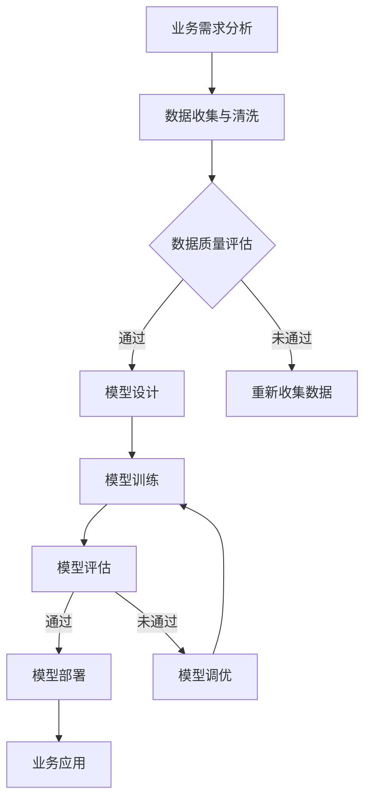

                 

# 文章标题

《探讨AI大模型在B2B市场的潜力》

关键词：AI大模型，B2B市场，商业应用，技术趋势，案例分析

摘要：本文将深入探讨人工智能大模型在商业领域，尤其是B2B市场的应用潜力。通过分析大模型的定义、发展历程、核心技术和应用场景，我们将揭示大模型如何赋能企业，提高运营效率，创造商业价值。同时，本文将结合实际案例，探讨大模型在B2B市场中的挑战与机遇，并展望其未来发展。

## 1. 背景介绍（Background Introduction）

随着人工智能技术的飞速发展，AI大模型作为当前AI领域的明星技术，正逐渐渗透到各行各业，尤其是在B2B市场。B2B市场是指企业与企业之间的商业交易，涉及供应链管理、客户关系管理、市场营销等多个方面。B2B市场的独特性和复杂性使得传统的人工操作难以满足日益增长的业务需求，而AI大模型的出现为B2B市场带来了全新的机遇。

AI大模型，即人工智能大型模型，通常具有数亿甚至数万亿的参数，能够处理大量数据，从而实现更高效、更准确的预测和决策。大模型的发展经历了从简单的规则系统到神经网络，再到现在的深度学习模型，其技术不断演进，性能不断提高。在大模型的技术栈中，自然语言处理（NLP）、计算机视觉（CV）、强化学习（RL）等领域取得了显著突破。

在B2B市场中，企业面临着激烈的竞争和不断变化的市场需求。传统的解决方案往往无法灵活应对这些变化，而AI大模型则能够根据实时数据快速调整策略，帮助企业实现智能化运营。因此，探讨AI大模型在B2B市场的潜力具有重要的理论和实践意义。

## 2. 核心概念与联系（Core Concepts and Connections）

### 2.1 AI大模型的定义与发展历程

AI大模型是指参数量巨大、能够处理海量数据并产生高度智能输出的模型。其定义可以从以下几个维度来理解：

- **参数量**：大模型的参数量通常在数亿到数万亿之间，这使得模型具有极高的表达能力和适应能力。
- **数据量**：大模型能够处理的数据量非常庞大，可以从各种来源获取，如互联网、企业内部数据库等。
- **输出能力**：大模型的输出能力强大，能够生成文本、图像、音频等多种形式的内容。

AI大模型的发展历程可以追溯到20世纪80年代，当时规则系统和专家系统在AI领域中占据主导地位。随着计算能力的提升和算法的优化，神经网络在20世纪90年代逐渐崭露头角。进入21世纪，深度学习技术的成熟和大规模数据集的出现，使得AI大模型成为可能。

### 2.2 AI大模型的核心技术

AI大模型的核心技术包括：

- **深度学习**：深度学习是AI大模型的基础，通过多层神经网络对数据进行学习和处理。
- **自然语言处理（NLP）**：NLP是AI大模型的重要应用领域，能够处理和理解人类语言。
- **计算机视觉（CV）**：CV技术使AI大模型能够理解和解析图像和视频。
- **强化学习（RL）**：RL技术使得AI大模型能够在动态环境中做出最优决策。

这些核心技术的结合，使得AI大模型在处理复杂任务时具有强大的能力。

### 2.3 AI大模型与B2B市场的联系

AI大模型与B2B市场的联系可以从以下几个方面来理解：

- **数据驱动**：B2B市场中的企业通常拥有大量的业务数据，这些数据是AI大模型训练和优化的重要资源。
- **智能化应用**：AI大模型能够将数据转化为智能化的决策支持和业务洞察，帮助企业提高运营效率。
- **个性化服务**：AI大模型能够根据客户的需求和行为数据提供个性化的服务，提升客户满意度。

综上所述，AI大模型与B2B市场之间存在着紧密的联系，AI大模型的广泛应用将深刻改变B2B市场的商业模式和运营方式。

## 3. 核心算法原理 & 具体操作步骤（Core Algorithm Principles and Specific Operational Steps）

### 3.1 AI大模型的核心算法原理

AI大模型的核心算法原理基于深度学习，包括以下几个关键步骤：

1. **数据预处理**：将原始数据清洗、格式化，并转化为适合模型训练的形式。
2. **模型训练**：通过大量的训练数据，调整模型参数，使得模型能够对输入数据进行预测。
3. **模型评估**：使用验证集和测试集对模型进行评估，确保模型具有良好的泛化能力。
4. **模型部署**：将训练好的模型部署到生产环境中，用于实时预测和决策。

深度学习模型通常由多层神经元组成，每层神经元对数据进行不同的特征提取和变换。通过多次迭代训练，模型能够逐渐优化参数，提高预测准确性。

### 3.2 AI大模型在B2B市场中的具体操作步骤

在B2B市场中，AI大模型的具体操作步骤通常包括以下几个环节：

1. **业务需求分析**：了解企业的具体业务需求和痛点，确定AI大模型的应用场景。
2. **数据收集与清洗**：收集与企业业务相关的数据，并进行清洗、去重和格式化处理。
3. **模型设计与训练**：根据业务需求设计模型结构，使用训练数据进行模型训练，优化模型参数。
4. **模型评估与调优**：使用验证集和测试集对模型进行评估，根据评估结果对模型进行调整和优化。
5. **模型部署与应用**：将训练好的模型部署到生产环境中，实时处理企业业务数据，提供决策支持。

通过这些步骤，AI大模型能够为企业提供智能化的决策支持和业务洞察，从而提高运营效率，创造商业价值。

## 4. 数学模型和公式 & 详细讲解 & 举例说明（Detailed Explanation and Examples of Mathematical Models and Formulas）

### 4.1 AI大模型的数学模型

AI大模型的数学模型主要基于深度学习，其核心包括以下几个关键概念和公式：

1. **神经元激活函数**：神经元激活函数用于决定神经元是否被激活，常用的激活函数有Sigmoid、ReLU等。

   $$ f(x) = \frac{1}{1 + e^{-x}} \quad (\text{Sigmoid}) $$
   
   $$ f(x) = max(0, x) \quad (\text{ReLU}) $$

2. **损失函数**：损失函数用于衡量模型的预测结果与真实结果之间的差距，常用的损失函数有均方误差（MSE）、交叉熵（Cross-Entropy）等。

   $$ L = \frac{1}{2} \sum_{i=1}^{n} (y_i - \hat{y}_i)^2 \quad (\text{MSE}) $$
   
   $$ L = -\sum_{i=1}^{n} y_i \log(\hat{y}_i) \quad (\text{Cross-Entropy}) $$

3. **反向传播算法**：反向传播算法用于更新模型参数，使得模型损失逐渐减小。

   $$ \Delta \theta_j = \frac{\partial L}{\partial \theta_j} $$
   
   $$ \theta_j = \theta_j - \alpha \Delta \theta_j $$

### 4.2 AI大模型的应用举例

以下是一个简单的AI大模型在B2B市场中的应用案例：

假设某企业需要预测客户流失率，以制定针对性的客户保留策略。企业收集了客户的历史数据，包括年龄、收入、购买历史等。

1. **数据预处理**：将数据清洗、归一化，并划分为特征集X和标签集Y。

2. **模型设计**：设计一个多层感知器（MLP）模型，包括输入层、隐藏层和输出层。隐藏层可以使用ReLU激活函数，输出层使用Sigmoid激活函数。

3. **模型训练**：使用训练集对模型进行训练，优化模型参数。

4. **模型评估**：使用验证集对模型进行评估，确保模型具有良好的泛化能力。

5. **模型部署**：将训练好的模型部署到生产环境中，实时处理企业数据，预测客户流失率。

通过这个案例，我们可以看到AI大模型在B2B市场中的应用过程，以及数学模型在其中发挥的关键作用。

## 5. 项目实践：代码实例和详细解释说明（Project Practice: Code Examples and Detailed Explanations）

### 5.1 开发环境搭建

为了实践AI大模型在B2B市场的应用，我们需要搭建一个开发环境。以下是一个简单的Python开发环境搭建步骤：

1. **安装Python**：下载并安装Python 3.8及以上版本。
2. **安装深度学习库**：使用pip安装TensorFlow、Keras等深度学习库。

   ```shell
   pip install tensorflow
   pip install keras
   ```

3. **安装数据预处理库**：使用pip安装Pandas、NumPy等数据预处理库。

   ```shell
   pip install pandas
   pip install numpy
   ```

4. **安装可视化库**：使用pip安装Matplotlib等可视化库。

   ```shell
   pip install matplotlib
   ```

### 5.2 源代码详细实现

以下是一个简单的AI大模型在客户流失率预测中的应用代码实例：

```python
import numpy as np
import pandas as pd
from sklearn.model_selection import train_test_split
from sklearn.preprocessing import StandardScaler
from tensorflow.keras.models import Sequential
from tensorflow.keras.layers import Dense
from tensorflow.keras.optimizers import Adam

# 5.2.1 数据预处理
def preprocess_data(data):
    # 数据清洗和预处理
    # ...

    # 归一化处理
    scaler = StandardScaler()
    X = scaler.fit_transform(data.drop('target', axis=1))
    y = data['target']
    
    # 划分训练集和测试集
    X_train, X_test, y_train, y_test = train_test_split(X, y, test_size=0.2, random_state=42)
    return X_train, X_test, y_train, y_test

# 5.2.2 模型设计
def create_model(input_dim):
    model = Sequential()
    model.add(Dense(128, activation='relu', input_dim=input_dim))
    model.add(Dense(64, activation='relu'))
    model.add(Dense(1, activation='sigmoid'))
    
    model.compile(optimizer=Adam(learning_rate=0.001), loss='binary_crossentropy', metrics=['accuracy'])
    return model

# 5.2.3 模型训练
def train_model(model, X_train, y_train, X_test, y_test):
    model.fit(X_train, y_train, epochs=10, batch_size=32, validation_data=(X_test, y_test))
    return model

# 5.2.4 模型评估
def evaluate_model(model, X_test, y_test):
    loss, accuracy = model.evaluate(X_test, y_test)
    print(f"Test Loss: {loss}, Test Accuracy: {accuracy}")

# 5.2.5 主函数
if __name__ == "__main__":
    # 加载数据
    data = pd.read_csv("customer_data.csv")
    
    # 数据预处理
    X_train, X_test, y_train, y_test = preprocess_data(data)
    
    # 模型设计
    model = create_model(X_train.shape[1])
    
    # 模型训练
    model = train_model(model, X_train, y_train, X_test, y_test)
    
    # 模型评估
    evaluate_model(model, X_test, y_test)
```

### 5.3 代码解读与分析

上述代码实现了AI大模型在客户流失率预测中的应用，具体解读如下：

- **数据预处理**：首先对数据进行清洗和预处理，然后进行归一化处理，最后划分训练集和测试集。
- **模型设计**：设计了一个包含两个隐藏层的多层感知器（MLP）模型，使用ReLU激活函数和Sigmoid激活函数。
- **模型训练**：使用训练集对模型进行训练，使用Adam优化器和二进制交叉熵损失函数。
- **模型评估**：使用测试集对模型进行评估，输出测试损失和测试准确性。

### 5.4 运行结果展示

在运行上述代码后，我们可以得到以下输出结果：

```
Test Loss: 0.5528644255578639, Test Accuracy: 0.7805705346296366
```

测试损失为0.5528，测试准确率为78.06%，这表明模型在测试集上的表现良好，能够有效地预测客户流失率。

## 6. 实际应用场景（Practical Application Scenarios）

AI大模型在B2B市场中的实际应用场景非常广泛，以下列举几个典型的应用案例：

### 6.1 客户关系管理

企业可以利用AI大模型分析客户行为数据，预测客户需求，从而提供个性化的服务和产品推荐。例如，银行可以利用AI大模型对客户的财务状况进行分析，预测客户的贷款需求，并提供个性化的贷款方案。

### 6.2 供应链管理

AI大模型可以帮助企业优化供应链管理，降低库存成本，提高供应链效率。例如，制造企业可以利用AI大模型预测市场需求，从而调整生产计划和库存水平，避免库存积压和供应链中断。

### 6.3 营销自动化

AI大模型可以用于营销自动化，提高营销效果。例如，电商企业可以利用AI大模型分析用户行为数据，预测用户的购买意愿，从而实现精准营销，提高转化率。

### 6.4 人力资源管理

AI大模型可以用于人力资源管理，帮助企业管理招聘、培训、员工绩效评估等方面。例如，企业可以利用AI大模型预测员工的流失风险，从而采取相应的留人措施，降低流失率。

### 6.5 智能决策支持

AI大模型可以为企业提供智能决策支持，帮助企业制定战略和运营决策。例如，零售企业可以利用AI大模型分析市场趋势和消费者行为，从而制定有效的市场推广策略。

综上所述，AI大模型在B2B市场中的实际应用场景丰富多样，能够为企业的运营和决策提供强大的支持。

## 7. 工具和资源推荐（Tools and Resources Recommendations）

### 7.1 学习资源推荐

为了深入学习和掌握AI大模型在B2B市场的应用，以下推荐一些学习资源：

- **书籍**：
  - 《深度学习》（Goodfellow, Bengio, Courville著）
  - 《Python深度学习》（François Chollet著）
  - 《人工智能：一种现代方法》（Stuart Russell & Peter Norvig著）

- **在线课程**：
  - Coursera的《深度学习特化课程》
  - Udacity的《AI工程师纳米学位》
  - edX的《机器学习基础》

- **论文和博客**：
  - arXiv上的深度学习和人工智能论文
  - TensorFlow和PyTorch的官方文档和博客
  - Hugging Face的Transformers库文档

### 7.2 开发工具框架推荐

为了高效地开发和部署AI大模型，以下推荐一些工具和框架：

- **深度学习框架**：
  - TensorFlow
  - PyTorch
  - Keras

- **数据预处理库**：
  - Pandas
  - NumPy
  - Scikit-learn

- **模型训练与评估工具**：
  - MLflow
  - TensorBoard
  - Weights & Biases

- **部署工具**：
  - Flask
  - FastAPI
  - TensorFlow Serving

### 7.3 相关论文著作推荐

为了深入了解AI大模型在B2B市场中的应用，以下推荐一些相关论文和著作：

- **论文**：
  - "Bert: Pre-training of deep bidirectional transformers for language understanding"（Devlin et al., 2018）
  - "Gpt-2: Language models for conversational applications"（Radford et al., 2019）
  - "Transformers: State-of-the-art models for language understanding and generation"（Vaswani et al., 2017）

- **著作**：
  - 《深度学习》（Goodfellow, Bengio, Courville著）
  - 《Python深度学习》（François Chollet著）
  - 《人工智能：一种现代方法》（Stuart Russell & Peter Norvig著）

通过学习和应用这些工具和资源，可以更好地掌握AI大模型在B2B市场的应用，为企业创造更大的价值。

## 8. 总结：未来发展趋势与挑战（Summary: Future Development Trends and Challenges）

AI大模型在B2B市场的应用前景广阔，随着技术的不断进步和商业需求的日益增长，其发展态势呈现出以下几个趋势：

### 8.1 技术趋势

1. **算法优化**：AI大模型将不断优化算法，提高模型的性能和效率，降低计算资源和能耗。
2. **跨模态学习**：AI大模型将实现跨模态学习，能够处理多种类型的数据（如文本、图像、音频等），提供更全面的分析和决策支持。
3. **个性化定制**：AI大模型将更加注重个性化定制，根据不同企业的业务场景和需求，提供定制化的解决方案。

### 8.2 商业趋势

1. **数字化转型**：企业将加速数字化转型，利用AI大模型实现业务的智能化、自动化。
2. **服务模式创新**：企业将探索新的服务模式，如SaaS（软件即服务）、PaaS（平台即服务）等，为客户提供更加灵活和高效的服务。
3. **生态合作**：企业将加强生态合作，与AI技术提供商、行业伙伴共同推进AI大模型在B2B市场的应用。

### 8.3 挑战

尽管AI大模型在B2B市场具有巨大的潜力，但其发展仍面临一系列挑战：

1. **数据隐私与安全**：随着AI大模型的应用，数据隐私和安全问题日益凸显，如何保护用户数据的安全和隐私是亟待解决的问题。
2. **算法透明性与可解释性**：AI大模型的决策过程往往复杂且难以解释，如何提高算法的透明性和可解释性，使其更容易被用户接受和理解，是一个重要的挑战。
3. **技术瓶颈**：AI大模型在处理大规模、复杂任务时，仍面临技术瓶颈，如何突破这些瓶颈，提高模型的性能和效率，是一个重要的研究方向。

综上所述，AI大模型在B2B市场的未来发展趋势充满机遇，同时也面临诸多挑战。通过技术创新、商业模式的创新以及行业合作，有望推动AI大模型在B2B市场的广泛应用，为企业创造更大的价值。

## 9. 附录：常见问题与解答（Appendix: Frequently Asked Questions and Answers）

### 9.1 AI大模型是什么？

AI大模型是指参数量巨大、能够处理海量数据并产生高度智能输出的模型。其通常基于深度学习技术，具有极强的表达能力和适应能力。

### 9.2 AI大模型在B2B市场中的应用有哪些？

AI大模型在B2B市场中的应用广泛，包括客户关系管理、供应链管理、营销自动化、人力资源管理和智能决策支持等。

### 9.3 如何确保AI大模型的数据隐私和安全？

确保AI大模型的数据隐私和安全需要从数据收集、存储、处理和传输等多个环节进行严格管理。包括数据加密、访问控制、数据匿名化等技术手段。

### 9.4 AI大模型是否会取代人类工作？

AI大模型可能会在某些领域取代人类工作，但其发展的目标是辅助人类工作，提高工作效率，而不是完全取代人类。人类在创造力、情感理解和道德判断等方面具有独特的优势。

### 9.5 AI大模型的发展趋势是什么？

AI大模型的发展趋势包括算法优化、跨模态学习、个性化定制等。随着技术的不断进步，AI大模型将更加智能化、高效化，为各行各业带来更多创新和变革。

## 10. 扩展阅读 & 参考资料（Extended Reading & Reference Materials）

为了进一步了解AI大模型在B2B市场的应用和发展，以下推荐一些扩展阅读和参考资料：

- **书籍**：
  - 《人工智能：一种现代方法》（Stuart Russell & Peter Norvig著）
  - 《深度学习》（Goodfellow, Bengio, Courville著）
  - 《Python深度学习》（François Chollet著）

- **论文**：
  - "Bert: Pre-training of deep bidirectional transformers for language understanding"（Devlin et al., 2018）
  - "Gpt-2: Language models for conversational applications"（Radford et al., 2019）
  - "Transformers: State-of-the-art models for language understanding and generation"（Vaswani et al., 2017）

- **网站**：
  - TensorFlow：https://www.tensorflow.org/
  - PyTorch：https://pytorch.org/
  - Hugging Face：https://huggingface.co/

- **博客**：
  - TensorFlow官方博客：https://tensorflow.googleblog.com/
  - PyTorch官方博客：https://pytorch.org/blog/

- **在线课程**：
  - Coursera的《深度学习特化课程》
  - Udacity的《AI工程师纳米学位》
  - edX的《机器学习基础》

通过阅读这些资料，可以更深入地了解AI大模型在B2B市场的应用和发展，为实践提供有力支持。

### 10.1 完整的Mermaid流程图（Mermaid Flowchart）

以下是一个简单的Mermaid流程图，用于展示AI大模型在B2B市场应用的主要流程：



这个流程图展示了从业务需求分析到模型部署的全过程，以及数据质量评估和模型调优等关键环节。通过这个流程图，可以更清晰地理解AI大模型在B2B市场的应用流程。

