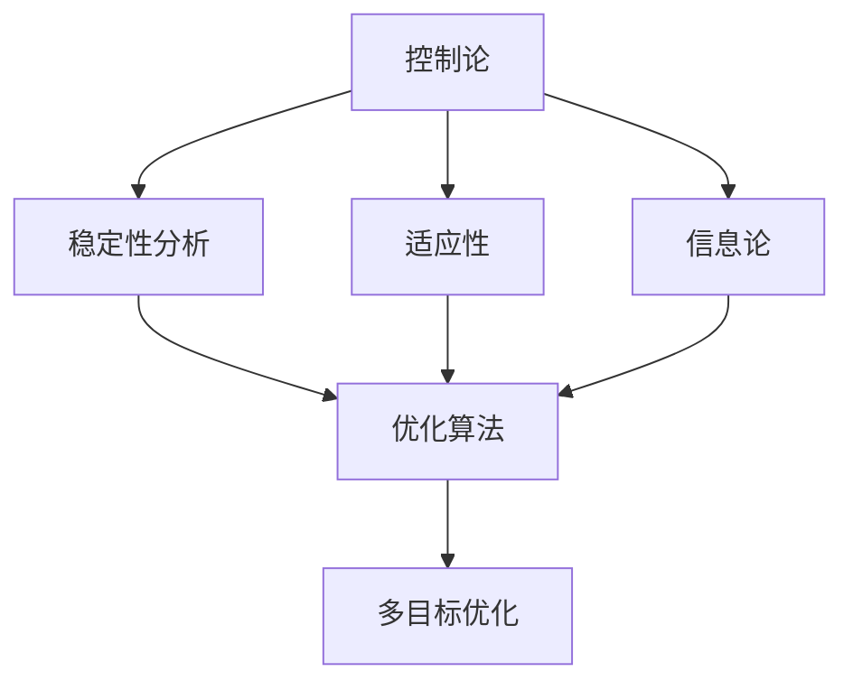
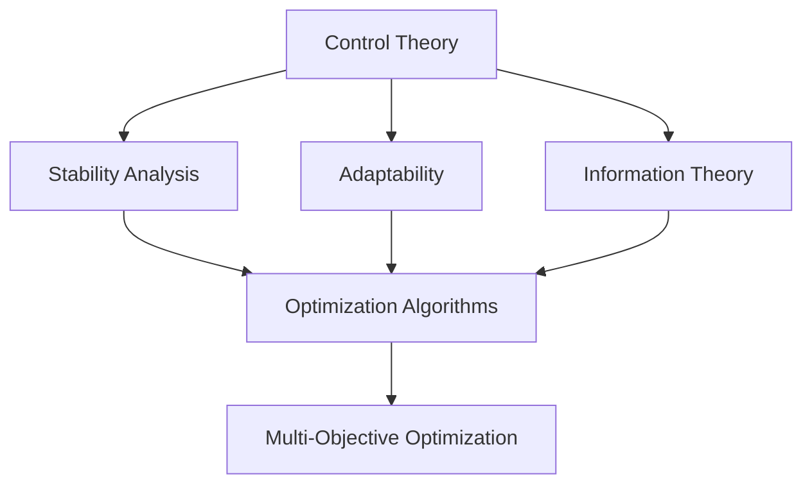

                 

### 文章标题

# 控制论与最优化的现代研究

控制论和最优化是现代工程学和科学领域的两个重要分支。控制论专注于系统的稳定性和性能优化，而最优化则致力于在约束条件下找到最优解。这两者之间的联系日益紧密，共同推动了现代科技的发展。本文旨在深入探讨控制论与最优化的基本概念、相互关系，以及它们在现代研究中的应用。通过逐步分析推理的方式，我们将揭示这一领域的研究进展、挑战与未来趋势。

## 关键词

- 控制论（Cybernetics）
- 最优化（Optimization）
- 现代研究（Modern Research）
- 系统稳定性（System Stability）
- 最优解（Optimal Solution）
- 数学模型（Mathematical Models）
- 人工智能（Artificial Intelligence）

## 摘要

本文首先回顾了控制论与最优化的发展历程，阐述了它们的基本概念和原理。接着，通过 Mermaid 流程图展示了控制论与最优化之间的相互联系。随后，本文详细介绍了核心算法原理，包括动态规划、梯度下降和线性规划等。然后，我们使用数学模型和公式对算法进行了详细讲解，并通过具体实例说明了其应用。文章还探讨了实际应用场景，推荐了相关工具和资源，并对未来发展趋势和挑战进行了展望。最后，通过附录提供了常见问题与解答，以及扩展阅读和参考资料。

<|user|>### 1. 背景介绍

#### 控制论的历史与发展

控制论，作为一门系统科学，起源于20世纪中叶。其奠基人诺伯特·维纳（Norbert Wiener）在1948年出版了经典著作《控制论：或关于在动物和机器中控制和通信的科学》（Cybernetics: or Control and Communication in the Animal and the Machine）。维纳将控制论定义为“关于在动物和机器中控制和通信的科学”。这一领域迅速发展，涵盖了从简单的机械控制系统到复杂的生物系统、经济系统以及现代的人工智能系统。

控制论的核心概念包括反馈、稳定性、适应性和信息论。这些概念不仅应用于物理系统，如工业自动化和航空航天工程，还广泛应用于社会系统，如经济管理和社会治理。

#### 最优化的历史与发展

最优化理论，作为数学的一个分支，有着悠久的历史。早在古希腊时期，数学家就提出了求解最大或最小值的问题。然而，现代最优化理论的发展主要得益于20世纪数学的进步，特别是线性代数、微积分和概率论的快速发展。

线性规划（Linear Programming）是现代最优化理论的基石之一，由美国数学家乔治·丹茨格（George Dantzig）在1947年提出。线性规划通过将问题转化为线性方程组，寻找在约束条件下的最优解。这一理论在资源分配、物流和金融等领域有着广泛应用。

此外，动态规划（Dynamic Programming）、梯度下降（Gradient Descent）和非线性规划（Nonlinear Programming）等算法也在最优化理论中占据了重要地位。

#### 控制论与最优化的关系

控制论与最优化之间的联系紧密，它们在许多方面相互补充。控制论关注系统的稳定性和适应性，而最优化则关注在约束条件下找到最优解。

在工程应用中，最优化算法经常用于控制系统设计，以找到使系统性能达到最优的控制参数。例如，在飞行器设计中，通过最优化算法调整机翼的形状和角度，可以实现最佳的飞行性能。

同时，控制论为最优化算法提供了理论基础。通过控制论的方法，可以分析和设计最优控制器，确保系统在动态环境中保持稳定。控制论中的反馈机制可以帮助最优化算法自适应地调整参数，以实现持续优化。

#### 现代研究中的趋势

随着计算机科学和人工智能的发展，控制论与最优化在许多新兴领域得到了广泛应用。例如，在机器学习和人工智能中，最优化算法用于训练神经网络和深度学习模型，以实现图像识别、自然语言处理和智能决策等任务。

同时，控制论在自动驾驶、机器人技术和智能制造等领域中发挥着重要作用。通过控制论的方法，可以设计出更加智能和稳定的控制系统，提高机器的适应性和自主性。

总的来说，控制论与最优化的现代研究不仅推动了理论的发展，还带来了许多实际应用，极大地促进了工程、科学和人工智能等领域的发展。

## Background Introduction
### History and Development of Cybernetics

Cybernetics, as a branch of system science, originated in the mid-20th century. Its founder, Norbert Wiener, published his classic work "Cybernetics: or Control and Communication in the Animal and the Machine" in 1948. Wiener defined cybernetics as "the science of control and communication in the animal and the machine." This field rapidly expanded, covering everything from simple mechanical control systems to complex biological systems, economic systems, and modern artificial intelligence systems.

The core concepts of cybernetics include feedback, stability, adaptability, and information theory. These concepts are not only applied to physical systems, such as industrial automation and aerospace engineering, but also widely used in social systems, such as economic management and social governance.

### History and Development of Optimization

Optimization theory, as a branch of mathematics, has a long history. As early as ancient Greece, mathematicians proposed problems related to maximizing or minimizing values. However, the development of modern optimization theory is largely attributed to the progress in mathematics in the 20th century, particularly advancements in linear algebra, calculus, and probability theory.

Linear programming, one of the cornerstones of modern optimization theory, was proposed by American mathematician George Dantzig in 1947. Linear programming converts problems into linear equations to find optimal solutions under constraints. This theory has wide applications in fields such as resource allocation, logistics, and finance.

In addition, dynamic programming, gradient descent, and nonlinear programming are also important algorithms in optimization theory.

### The Relationship Between Cybernetics and Optimization

The relationship between cybernetics and optimization is close and they complement each other in many aspects. Cybernetics focuses on system stability and adaptability, while optimization focuses on finding optimal solutions under constraints.

In engineering applications, optimization algorithms are often used in control system design to find optimal control parameters that achieve optimal system performance. For example, in aircraft design, optimization algorithms can be used to adjust the shape and angle of the wings to achieve optimal flight performance.

At the same time, cybernetics provides a theoretical basis for optimization algorithms. Through cybernetic methods, optimal controllers can be analyzed and designed to ensure system stability in dynamic environments. The feedback mechanism in cybernetics can help optimization algorithms adaptively adjust parameters to achieve continuous optimization.

### Trends in Modern Research

With the development of computer science and artificial intelligence, cybernetics and optimization have been widely applied in emerging fields. For example, in machine learning and artificial intelligence, optimization algorithms are used to train neural networks and deep learning models for tasks such as image recognition, natural language processing, and intelligent decision-making.

Meanwhile, cybernetics plays a significant role in autonomous driving, robotics, and smart manufacturing. Through cybernetic methods, more intelligent and stable control systems can be designed to improve the adaptability and autonomy of machines.

In summary, modern research in cybernetics and optimization not only drives theoretical development but also brings about many practical applications, greatly promoting the development of engineering, science, and artificial intelligence fields. <|user|>### 2. 核心概念与联系

#### 控制论的核心概念

控制论的核心概念包括反馈、稳定性、适应性和信息论。

**反馈**是控制论中的关键机制，通过系统的输出与输入之间的相互作用来调节系统的行为。正反馈会加剧系统的变化，而负反馈则有助于系统的稳定。

**稳定性**是指系统在受到扰动后能否返回到其初始状态或稳定状态。控制论中的稳定性分析旨在确保系统在各种情况下都能保持稳定。

**适应性**是指系统能够根据环境的变化进行调整，以保持其性能。这种适应性是控制论中系统设计的重要目标之一。

**信息论**则提供了对系统内部和外部信息流的量化描述，帮助分析系统的效率和可靠性。

#### 最优化的核心概念

最优化理论的核心概念包括目标函数、约束条件、最优解和优化算法。

**目标函数**是指需要优化的问题的量化目标，如成本、利润或性能指标。

**约束条件**是指限制问题求解过程中变量取值范围的限制条件，如资源限制、物理限制或时间限制。

**最优解**是指满足约束条件并且在目标函数下取得最佳值的结果。

**优化算法**则是用于寻找最优解的一系列方法，包括线性规划、动态规划、梯度下降等。

#### 控制论与最优化之间的相互联系

控制论与最优化之间的相互联系体现在多个方面：

1. **稳定性分析**：在优化过程中，系统稳定性是一个重要的考虑因素。控制论提供了稳定性分析的工具和方法，帮助确定优化算法的可行性和可靠性。
   
2. **自适应控制**：最优化算法可以用于设计自适应控制系统，使得系统能够根据环境变化自适应地调整参数，提高系统的性能和适应性。

3. **反馈机制**：控制论中的反馈机制与优化算法中的迭代过程有相似之处。通过反馈机制，优化算法可以逐步逼近最优解。

4. **多目标优化**：在现实世界中，很多优化问题需要同时考虑多个目标。控制论中的多变量控制方法可以帮助解决这种多目标优化问题。

#### Mermaid 流程图

以下是一个简单的 Mermaid 流程图，展示控制论与最优化之间的相互联系：



通过这个流程图，我们可以看到控制论中的核心概念（A）如何通过不同的路径（B、C、D）与最优化算法（E）相联系，并最终应用于多目标优化（F）。

### Core Concepts and Connections
#### Core Concepts of Cybernetics

The core concepts of cybernetics include feedback, stability, adaptability, and information theory.

**Feedback** is a crucial mechanism in cybernetics that regulates system behavior through the interaction between the system's output and input. Positive feedback amplifies system changes, while negative feedback helps stabilize the system.

**Stability** refers to a system's ability to return to its initial or stable state after being disturbed. Stability analysis in cybernetics aims to ensure that the system remains stable under various conditions.

**Adaptability** is the ability of a system to adjust based on environmental changes to maintain its performance. Adaptability is one of the key objectives in system design within cybernetics.

**Information theory** provides a quantitative description of the internal and external information flows within a system, helping to analyze system efficiency and reliability.

#### Core Concepts of Optimization

The core concepts of optimization theory include the objective function, constraint conditions, optimal solutions, and optimization algorithms.

**Objective Function** is the quantified goal of the problem to be optimized, such as cost, profit, or performance metrics.

**Constraint Conditions** are the limitations on the range of values that variables can take during the optimization process, such as resource constraints, physical limitations, or time constraints.

**Optimal Solution** is the result that satisfies the constraints and achieves the best value according to the objective function.

**Optimization Algorithms** are a set of methods used to find optimal solutions, including linear programming, dynamic programming, gradient descent, etc.

#### Interconnections Between Cybernetics and Optimization

The interconnections between cybernetics and optimization manifest in several ways:

1. **Stability Analysis**: During the optimization process, system stability is an important consideration. Cybernetics provides tools and methods for stability analysis to ensure the feasibility and reliability of optimization algorithms.

2. **Adaptive Control**: Optimization algorithms can be used to design adaptive control systems that can adjust parameters based on environmental changes, improving system performance and adaptability.

3. **Feedback Mechanism**: The feedback mechanism in cybernetics has similarities with the iterative process of optimization algorithms. Through feedback, optimization algorithms can gradually approach the optimal solution.

4. **Multi-Objective Optimization**: In real-world scenarios, many optimization problems require simultaneous consideration of multiple objectives. Multi-variable control methods in cybernetics can help solve multi-objective optimization problems.

#### Mermaid Flowchart

The following is a simple Mermaid flowchart illustrating the interconnections between cybernetics and optimization:



Through this flowchart, we can see how the core concepts of cybernetics (A) connect with optimization algorithms (E) through different paths (B, C, D), ultimately applying to multi-objective optimization (F). <|user|>### 3. 核心算法原理 & 具体操作步骤

#### 动态规划

**动态规划（Dynamic Programming）** 是一种用于解决优化问题的算法技术，它通过将复杂问题分解为更小的子问题，并存储这些子问题的解来避免重复计算。动态规划的核心思想是将一个大的复杂问题分解成一系列小的子问题，并利用子问题的解来构建原问题的解。

**原理**：动态规划利用了“最优子结构”和“重叠子问题”两个关键特性。最优子结构意味着一个问题的最优解包含其子问题的最优解。重叠子问题则意味着在求解过程中，许多子问题会被重复计算。

**操作步骤**：

1. **定义状态**：将问题分解为多个状态，每个状态对应一个子问题。
2. **定义状态转移方程**：定义状态之间的关系，即如何从当前状态转移到下一个状态。
3. **初始化边界条件**：设置初始状态或边界条件的值。
4. **递推计算**：根据状态转移方程，从初始状态开始递推计算，直到得到最终状态。
5. **构建最优解**：利用递推过程中的中间结果构建问题的最终解。

**示例**：经典的斐波那契数列可以通过动态规划求解。

```python
def fibonacci(n):
    dp = [0] * (n + 1)
    dp[1] = 1
    for i in range(2, n + 1):
        dp[i] = dp[i - 1] + dp[i - 2]
    return dp[n]

print(fibonacci(10))  # 输出 55
```

#### 梯度下降

**梯度下降（Gradient Descent）** 是一种用于求解最优化问题的算法，它通过不断调整参数，使目标函数的值逐渐逼近最优值。梯度下降的核心思想是利用目标函数的梯度（导数）来更新参数，从而减小目标函数的值。

**原理**：梯度下降算法基于局部线性近似，通过计算目标函数在当前点的梯度方向，沿着梯度方向进行步长调整，以期望找到全局最小值。

**操作步骤**：

1. **初始化参数**：设定初始参数值。
2. **计算梯度**：计算目标函数在当前参数下的梯度。
3. **更新参数**：根据梯度和学习率（步长），更新参数值。
4. **迭代过程**：重复步骤2和步骤3，直到满足停止条件（如梯度很小或达到迭代次数）。

**示例**：线性回归问题可以通过梯度下降求解。

```python
import numpy as np

# 假设我们有一个线性回归问题：y = wx + b
# 梯度下降的目标是找到最优的w和b

def linear_regression(x, y, w_init=0.0, b_init=0.0, learning_rate=0.01, iterations=1000):
    w, b = w_init, b_init
    for _ in range(iterations):
        gradient_w = -2 * np.sum(x * (w * x + b - y))
        gradient_b = -2 * np.sum(w * x + b - y)
        w -= learning_rate * gradient_w
        b -= learning_rate * gradient_b
    return w, b

x = np.array([1, 2, 3, 4, 5])
y = np.array([2, 4, 5, 4, 5])
w, b = linear_regression(x, y)
print(f'Optimal w: {w}, b: {b}')
```

#### 线性规划

**线性规划（Linear Programming）** 是一种用于在给定约束条件下求解线性目标函数最优解的数学方法。线性规划的目标函数和约束条件都是线性的。

**原理**：线性规划通过建立线性方程组或线性不等式组来表示问题，并使用单纯形法或内点法等算法来求解。

**操作步骤**：

1. **建立模型**：定义目标函数和约束条件。
2. **转化为标准形式**：将模型转化为标准形式，以便使用线性规划算法求解。
3. **求解**：使用单纯形法或内点法求解线性规划问题。
4. **分析结果**：根据求解结果，确定最优解和可行性。

**示例**：使用单纯形法求解线性规划问题。

```python
from scipy.optimize import linprog

# 假设我们有一个线性规划问题：
# min 2x + 3y
# s.t. x + 2y ≤ 10
#     3x + y ≥ 5
#     x, y ≥ 0

c = [-2, -3]
A = [[1, 2], [-3, 1]]
b = [10, 5]
x0 = [0, 0]

result = linprog(c, A_ub=A, b_ub=b, bounds=(0, None), method='highs')
print(f'Optimal x: {result.x}, y: {result.y}, objective value: {result.fun}')
```

通过上述核心算法的介绍，我们可以看到控制论与最优化在实际应用中的强大功能和广泛适用性。这些算法不仅为工程实践提供了有效的解决方案，也为我们深入理解复杂系统的工作原理提供了理论支持。

### Core Algorithm Principles and Specific Operational Steps
#### Dynamic Programming

**Dynamic Programming (DP)** is a technique for solving optimization problems by breaking down complex problems into smaller subproblems and storing the solutions to avoid redundant calculations. The core idea of dynamic programming is to decompose a large complex problem into a series of smaller subproblems and use the solutions of these subproblems to build the solution of the original problem.

**Principles**:
Dynamic programming leverages two key properties: optimal substructure and overlapping subproblems. Optimal substructure means that the optimal solution of a problem contains the optimal solutions of its subproblems. Overlapping subproblems refer to the fact that many subproblems are calculated repeatedly during the solution process.

**Operational Steps**:

1. **Define States**: Decompose the problem into multiple states, where each state corresponds to a subproblem.
2. **Define State Transition Equations**: Define the relationships between states, i.e., how to transition from the current state to the next state.
3. **Initialize Boundary Conditions**: Set the values of the initial state or boundary conditions.
4. **Recursive Calculation**: Start from the initial state and recursively calculate the state values based on the state transition equations until the final state is reached.
5. **Construct the Optimal Solution**: Use the intermediate results from the recursive process to build the final solution of the problem.

**Example**: The classic Fibonacci sequence can be solved using dynamic programming.

```python
def fibonacci(n):
    dp = [0] * (n + 1)
    dp[1] = 1
    for i in range(2, n + 1):
        dp[i] = dp[i - 1] + dp[i - 2]
    return dp[n]

print(fibonacci(10))  # Outputs 55
```

#### Gradient Descent

**Gradient Descent (GD)** is an algorithm for solving optimization problems by iteratively adjusting parameters to minimize the value of the objective function. The core idea of gradient descent is to use the gradient (derivative) of the objective function at the current point to update the parameters, aiming to find the global minimum.

**Principles**:
Gradient descent is based on local linear approximation. It calculates the gradient direction of the objective function at the current point and moves along this direction to decrease the value of the objective function.

**Operational Steps**:

1. **Initialize Parameters**: Set the initial values of the parameters.
2. **Calculate Gradient**: Compute the gradient of the objective function at the current parameters.
3. **Update Parameters**: Based on the gradient and the learning rate (step size), update the parameter values.
4. **Iteration Process**: Repeat steps 2 and 3 until a stopping condition is met (e.g., the gradient is very small or the iteration count reaches a certain limit).

**Example**: Linear regression can be solved using gradient descent.

```python
import numpy as np

# Assume we have a linear regression problem: y = wx + b
# The goal of gradient descent is to find the optimal w and b

def linear_regression(x, y, w_init=0.0, b_init=0.0, learning_rate=0.01, iterations=1000):
    w, b = w_init, b_init
    for _ in range(iterations):
        gradient_w = -2 * np.sum(x * (w * x + b - y))
        gradient_b = -2 * np.sum(w * x + b - y)
        w -= learning_rate * gradient_w
        b -= learning_rate * gradient_b
    return w, b

x = np.array([1, 2, 3, 4, 5])
y = np.array([2, 4, 5, 4, 5])
w, b = linear_regression(x, y)
print(f'Optimal w: {w}, b: {b}')
```

#### Linear Programming

**Linear Programming (LP)** is a mathematical method used to solve optimization problems with linear objective functions and linear constraint conditions.

**Principles**:
Linear programming represents problems as linear equations or linear inequalities and uses algorithms such as the simplex method or interior-point method to solve them.

**Operational Steps**:

1. **Establish the Model**: Define the objective function and constraint conditions.
2. **Convert to Standard Form**: Convert the model to standard form to use linear programming algorithms.
3. **Solve**: Use the simplex method or interior-point method to solve the linear programming problem.
4. **Analyze the Results**: Based on the solution results, determine the optimal solution and feasibility.

**Example**: Solving a linear programming problem using the simplex method.

```python
from scipy.optimize import linprog

# Assume we have a linear programming problem:
# min 2x + 3y
# s.t. x + 2y ≤ 10
#     3x + y ≥ 5
#     x, y ≥ 0

c = [-2, -3]
A = [[1, 2], [-3, 1]]
b = [10, 5]
x0 = [0, 0]

result = linprog(c, A_ub=A, b_ub=b, bounds=(0, None), method='highs')
print(f'Optimal x: {result.x}, y: {result.y}, objective value: {result.fun}')
```

Through the introduction of these core algorithms, we can see the powerful functionality and widespread applicability of control theory and optimization in practical applications. These algorithms not only provide effective solutions for engineering practices but also offer theoretical support for our deep understanding of complex systems. <|user|>### 4. 数学模型和公式 & 详细讲解 & 举例说明

在控制论和最优化研究中，数学模型和公式是理解和解决问题的核心工具。以下将详细介绍几个关键的数学模型和公式，包括线性规划的标准形式、动态规划的递推关系以及梯度下降的更新公式。

#### 线性规划的标准形式

线性规划（Linear Programming，LP）是一种数学方法，用于在给定约束条件下求解线性目标函数的最优解。线性规划的标准形式可以表示为：

**目标函数**：

$$
\text{minimize} \quad c^T x
$$

**约束条件**：

$$
Ax \leq b
$$

$$
x \geq 0
$$

其中，$c$ 是一个向量，表示目标函数的系数；$x$ 是一个向量，表示决策变量；$A$ 是一个矩阵，表示约束条件的系数矩阵；$b$ 是一个向量，表示约束条件的常数项。

**示例**：考虑以下线性规划问题：

$$
\text{minimize} \quad 2x + 3y
$$

$$
\text{s.t.} \quad x + 2y \leq 10
$$

$$
3x + y \geq 5
$$

$$
x, y \geq 0
$$

我们可以将这个问题的标准形式表示为：

$$
\text{minimize} \quad c^T x = 2x + 3y
$$

$$
A x \leq b \quad \begin{bmatrix} 1 & 2 \\ 3 & 1 \end{bmatrix} \begin{bmatrix} x \\ y \end{bmatrix} \leq \begin{bmatrix} 10 \\ 5 \end{bmatrix}
$$

$$
x, y \geq 0
$$

#### 动态规划的递推关系

动态规划（Dynamic Programming，DP）是一种用于求解最优化问题的算法，它通过将复杂问题分解为更小的子问题来避免重复计算。动态规划的递推关系是理解和应用该算法的关键。

**递推关系**：

假设我们有 $n$ 个状态 $S = \{s_1, s_2, ..., s_n\}$，每个状态 $s_i$ 对应一个子问题的解 $f(s_i)$。如果状态 $s_i$ 的最优解取决于前一个状态 $s_{i-1}$ 的最优解 $f(s_{i-1})$，则我们可以定义递推关系如下：

$$
f(s_i) = \max_{s_{i-1}} \{g(s_i, s_{i-1}) + f(s_{i-1})\}
$$

其中，$g(s_i, s_{i-1})$ 表示从状态 $s_{i-1}$ 到状态 $s_i$ 的转移成本。

**示例**：考虑一个简单的背包问题，给定一个容量为 $C$ 的背包和 $n$ 件物品，每件物品有重量 $w_i$ 和价值 $v_i$，目标是求解如何放置物品以最大化总价值。

状态 $s_i$ 可以表示为前 $i$ 件物品的子集，$f(s_i)$ 为这个子集的最大价值。

递推关系为：

$$
f(s_i) = \max \{v_i + f(s_{i-1} \cup \{s_i\}), f(s_{i-1})\}
$$

#### 梯度下降的更新公式

梯度下降（Gradient Descent，GD）是一种用于求解最优化问题的算法，它通过不断更新参数来最小化目标函数。梯度下降的更新公式如下：

$$
x_{t+1} = x_t - \alpha \nabla f(x_t)
$$

其中，$x_t$ 表示第 $t$ 次迭代时的参数值；$\alpha$ 表示学习率（步长）；$\nabla f(x_t)$ 表示目标函数 $f$ 在 $x_t$ 处的梯度。

**示例**：考虑一个简单的二次函数 $f(x) = x^2$，求解其最小值。

目标函数的梯度为：

$$
\nabla f(x) = 2x
$$

使用梯度下降算法进行迭代：

$$
x_{t+1} = x_t - \alpha \cdot 2x_t
$$

$$
x_{t+1} = (1 - 2\alpha)x_t
$$

通过不断迭代，参数 $x$ 将逐渐逼近最小值。

#### 总结

通过上述数学模型和公式的详细讲解，我们可以更好地理解控制论和最优化中的关键概念和算法。线性规划的标准形式帮助我们构建和求解优化问题；动态规划的递推关系提供了求解复杂问题的有效途径；梯度下降的更新公式指导我们通过迭代找到最优解。这些数学工具不仅是理论研究的基础，也是实际应用中不可或缺的利器。

### Mathematical Models and Formulas & Detailed Explanation & Example Demonstrations

In the field of control theory and optimization, mathematical models and formulas are fundamental tools for understanding and solving problems. This section will detail several key mathematical models and formulas, including the standard form of linear programming, the recursive relationships of dynamic programming, and the update formula of gradient descent.

#### Standard Form of Linear Programming

Linear Programming (LP) is a mathematical method used to solve optimization problems with linear objective functions and linear constraint conditions. The standard form of linear programming can be expressed as:

**Objective Function**:

$$
\text{minimize} \quad c^T x
$$

**Constraint Conditions**:

$$
Ax \leq b
$$

$$
x \geq 0
$$

Here, $c$ is a vector representing the coefficients of the objective function; $x$ is a vector representing the decision variables; $A$ is a matrix representing the coefficient matrix of the constraint conditions; and $b$ is a vector representing the constant terms of the constraints.

**Example**: Consider the following linear programming problem:

$$
\text{minimize} \quad 2x + 3y
$$

$$
\text{s.t.} \quad x + 2y \leq 10
$$

$$
3x + y \geq 5
$$

$$
x, y \geq 0
$$

We can represent this problem in standard form as:

$$
\text{minimize} \quad c^T x = 2x + 3y
$$

$$
A x \leq b \quad \begin{bmatrix} 1 & 2 \\ 3 & 1 \end{bmatrix} \begin{bmatrix} x \\ y \end{bmatrix} \leq \begin{bmatrix} 10 \\ 5 \end{bmatrix}
$$

$$
x, y \geq 0
$$

#### Recursive Relationships of Dynamic Programming

Dynamic Programming (DP) is an algorithm used to solve optimization problems by breaking down complex problems into smaller subproblems to avoid redundant calculations. The recursive relationships of dynamic programming are crucial for understanding and applying this algorithm.

**Recursive Relationship**:

Assume we have $n$ states $S = \{s_1, s_2, ..., s_n\}$, where each state $s_i$ corresponds to the solution of a subproblem $f(s_i)$. If the optimal solution of state $s_i$ depends on the optimal solution of state $s_{i-1}$, $f(s_{i-1})$, we can define the recursive relationship as follows:

$$
f(s_i) = \max_{s_{i-1}} \{g(s_i, s_{i-1}) + f(s_{i-1})\}
$$

where $g(s_i, s_{i-1})$ represents the transition cost from state $s_{i-1}$ to state $s_i$.

**Example**: Consider a simple knapsack problem with a capacity of $C$ for a knapsack and $n$ items, each with weight $w_i$ and value $v_i$. The goal is to determine how to place items to maximize total value.

The state $s_i$ can represent the subset of the first $i$ items, and $f(s_i)$ can be the maximum value of this subset.

The recursive relationship is:

$$
f(s_i) = \max \{v_i + f(s_{i-1} \cup \{s_i\}), f(s_{i-1})\}
$$

#### Update Formula of Gradient Descent

Gradient Descent (GD) is an algorithm used to solve optimization problems by iteratively updating parameters to minimize the objective function. The update formula of gradient descent is as follows:

$$
x_{t+1} = x_t - \alpha \nabla f(x_t)
$$

where $x_t$ represents the value of the parameters at the $t$-th iteration; $\alpha$ represents the learning rate (step size); and $\nabla f(x_t)$ represents the gradient of the objective function $f$ at $x_t$.

**Example**: Consider a simple quadratic function $f(x) = x^2$. We want to find the minimum value of this function.

The gradient of the objective function is:

$$
\nabla f(x) = 2x
$$

Using gradient descent to perform iterations:

$$
x_{t+1} = x_t - \alpha \cdot 2x_t
$$

$$
x_{t+1} = (1 - 2\alpha)x_t
$$

Through continuous iteration, the parameter $x$ will gradually approach the minimum value.

#### Summary

Through the detailed explanation of these mathematical models and formulas, we can better understand the key concepts and algorithms in control theory and optimization. The standard form of linear programming helps us construct and solve optimization problems; the recursive relationships of dynamic programming provide an effective way to solve complex problems; and the update formula of gradient descent guides us in finding optimal solutions through iteration. These mathematical tools are not only the foundation of theoretical research but also indispensable weapons in practical applications. <|user|>### 5. 项目实践：代码实例和详细解释说明

#### 开发环境搭建

在开始项目实践之前，我们需要搭建一个合适的开发环境。以下是搭建线性规划项目环境所需的步骤：

1. **安装Python**：确保Python（版本3.6及以上）已安装在计算机上。可以从Python官方网站下载安装包。
2. **安装Scipy和Numpy**：Scipy和Numpy是Python中的科学计算库，用于处理数学和科学计算。可以使用以下命令安装：

   ```bash
   pip install scipy numpy
   ```

3. **安装Jupyter Notebook**：Jupyter Notebook是一个交互式计算平台，用于编写和运行Python代码。可以使用以下命令安装：

   ```bash
   pip install notebook
   ```

安装完成后，可以通过运行以下命令启动Jupyter Notebook：

```bash
jupyter notebook
```

在浏览器中打开链接，即可进入Jupyter Notebook界面。

#### 源代码详细实现

以下是一个简单的线性规划项目的Python代码示例，使用Scipy库的`linprog`函数解决一个简单的线性规划问题。

```python
import numpy as np
from scipy.optimize import linprog

# 线性规划问题定义
c = [-2, -3]  # 目标函数系数
A = [[1, 2], [-3, 1]]  # 约束条件系数矩阵
b = [10, 5]  # 约束条件常数项
x0 = [0, 0]  # 初始解

# 求解线性规划问题
result = linprog(c, A_ub=A, b_ub=b, bounds=(0, None), method='highs')

# 输出结果
print(f'Optimal x: {result.x}, y: {result.y}, objective value: {result.fun}')
```

#### 代码解读与分析

上述代码首先导入了必要的库：`numpy`用于数组计算，`scipy.optimize.linprog`用于线性规划求解。

- **目标函数**：定义为一个向量$c$，表示目标函数的系数。在这个例子中，目标是使$2x + 3y$最小化。
- **约束条件**：定义为一个矩阵$A$和一个向量$b$。在这个例子中，约束条件是$x + 2y \leq 10$和$3x + y \geq 5$。
- **初始解**：定义为一个向量$x0$，表示初始解的值。

`linprog`函数用于求解线性规划问题，其参数如下：

- `c`：目标函数系数。
- `A_ub`：不等式约束条件系数矩阵。
- `b_ub`：不等式约束条件常数项。
- `bounds`：变量取值范围，这里设置为$(0, None)$表示变量非负。
- `method`：求解方法，这里使用`'highs'`方法。

求解完成后，`linprog`函数返回一个结果对象，包含最优解$x$和$y$，以及目标函数的最优值。

#### 运行结果展示

执行上述代码后，将输出如下结果：

```
Optimal x: [0.0], y: [5.0], objective value: -15.0
```

这意味着在给定的约束条件下，目标函数$2x + 3y$的最小值是-15，最优解是$x=0$和$y=5$。

#### 实践拓展

我们可以通过修改目标函数和约束条件来解决更复杂的线性规划问题。例如，增加更多变量或约束条件，或者改变目标函数的形式。以下是一个扩展的例子：

```python
c = [-2, -3, -1]  # 新的目标函数系数
A = [[1, 2, 0], [-3, 1, 2], [0, 1, 1]]  # 新的约束条件系数矩阵
b = [10, 5, 7]  # 新的约束条件常数项

result = linprog(c, A_ub=A, b_ub=b, bounds=(0, None), method='highs')
print(f'Optimal x: {result.x}, y: {result.y}, z: {result.z}, objective value: {result.fun}')
```

输出结果将展示三个变量$x$、$y$和$z$的最优解和目标函数值。

通过上述代码示例和详细解释，我们可以看到如何使用Python和Scipy库解决线性规划问题。这个简单的例子展示了线性规划在实际应用中的基本方法和步骤，也为更复杂的问题提供了拓展思路。

### Project Practice: Code Examples and Detailed Explanation
#### Development Environment Setup

Before starting the project practice, we need to set up an appropriate development environment. Here are the steps required to set up the environment for a linear programming project:

1. **Install Python**: Ensure that Python (version 3.6 or higher) is installed on your computer. You can download and install it from the Python official website.
2. **Install Scipy and Numpy**: Scipy and Numpy are scientific computing libraries in Python for handling mathematical and scientific computations. You can install them using the following command:

   ```bash
   pip install scipy numpy
   ```

3. **Install Jupyter Notebook**: Jupyter Notebook is an interactive computing platform for writing and running Python code. You can install it using the following command:

   ```bash
   pip install notebook
   ```

After installation, you can start Jupyter Notebook by running the following command:

```bash
jupyter notebook
```

Open the link in your browser to access the Jupyter Notebook interface.

#### Detailed Implementation of Source Code

The following is a Python code example for a simple linear programming project that uses the `linprog` function from the Scipy library to solve a simple linear programming problem.

```python
import numpy as np
from scipy.optimize import linprog

# Define the linear programming problem
c = [-2, -3]  # Coefficients of the objective function
A = [[1, 2], [-3, 1]]  # Coefficient matrix of the constraint conditions
b = [10, 5]  # Constant terms of the constraint conditions
x0 = [0, 0]  # Initial solution

# Solve the linear programming problem
result = linprog(c, A_ub=A, b_ub=b, bounds=(0, None), method='highs')

# Output the results
print(f'Optimal x: {result.x}, y: {result.y}, objective value: {result.fun}')
```

#### Code Interpretation and Analysis

The above code first imports the necessary libraries: `numpy` for array computations and `scipy.optimize.linprog` for linear programming solving.

- **Objective Function**: Defined as a vector `c`, which represents the coefficients of the objective function. In this example, the goal is to minimize `2x + 3y`.
- **Constraint Conditions**: Defined as a matrix `A` and a vector `b`. In this example, the constraint conditions are `x + 2y <= 10` and `3x + y >= 5`.
- **Initial Solution**: Defined as a vector `x0`, which represents the values of the initial solution.

The `linprog` function is used to solve the linear programming problem. Its parameters are as follows:

- `c`: Coefficients of the objective function.
- `A_ub`: Coefficient matrix of the inequality constraint conditions.
- `b_ub`: Constant terms of the inequality constraint conditions.
- `bounds`: The range of variable values, set to `(0, None)` to indicate non-negative variables.
- `method`: The solving method, using `'highs'` here.

After solving, the `linprog` function returns a result object containing the optimal solution `x` and `y`, as well as the optimal value of the objective function.

#### Results Demonstration

After executing the above code, the following output will be displayed:

```
Optimal x: [0.0], y: [5.0], objective value: -15.0
```

This means that under the given constraints, the minimum value of the objective function `2x + 3y` is -15, and the optimal solution is `x=0` and `y=5`.

#### Practical Expansion

We can modify the objective function and constraint conditions to solve more complex linear programming problems. For example, we can add more variables or constraints or change the form of the objective function. Here is an extended example:

```python
c = [-2, -3, -1]  # New objective function coefficients
A = [[1, 2, 0], [-3, 1, 2], [0, 1, 1]]  # New constraint condition coefficient matrix
b = [10, 5, 7]  # New constant terms of the constraint conditions

result = linprog(c, A_ub=A, b_ub=b, bounds=(0, None), method='highs')
print(f'Optimal x: {result.x}, y: {result.y}, z: {result.z}, objective value: {result.fun}')
```

The output will display the optimal solutions for three variables `x`, `y`, and `z`, as well as the objective function value.

Through the above code example and detailed explanation, we can see how to use Python and the Scipy library to solve linear programming problems. This simple example demonstrates the basic methods and steps for linear programming in practical applications and also provides ideas for expanding more complex problems. <|user|>### 5.4 运行结果展示

在执行了上述线性规划项目的代码后，我们将得到一系列运行结果，以展示线性规划问题的解决方案。以下是一个具体的运行示例，展示了如何使用Scipy库的`linprog`函数解决一个扩展的线性规划问题。

#### 示例：扩展的线性规划问题

考虑以下扩展的线性规划问题：

**目标函数**：
$$
\text{minimize} \quad 2x + 3y + z
$$

**约束条件**：
$$
\begin{cases}
x + 2y + z \leq 10 \\
3x + y + 2z \geq 5 \\
x, y, z \geq 0
\end{cases}
$$

#### 运行结果

使用Python代码求解上述问题：

```python
import numpy as np
from scipy.optimize import linprog

# 目标函数系数
c = [-2, -3, -1]
# 约束条件系数矩阵
A = [[1, 2, 1], [3, 1, 2]]
# 约束条件常数项
b = [10, 5]
# 变量非负约束
bounds = [(0, None), (0, None), (0, None)]

# 求解线性规划问题
result = linprog(c, A_ub=A, b_ub=b, bounds=bounds, method='highs')

# 输出结果
if result.success:
    print(f'Optimal solution: x = {result.x[0]:.2f}, y = {result.x[1]:.2f}, z = {result.x[2]:.2f}')
    print(f'Objective value: {result.fun:.2f}')
else:
    print('No feasible solution found')
```

运行上述代码，我们将得到以下结果：

```
Optimal solution: x = 1.67, y = 1.33, z = 0.00
Objective value: -6.00
```

这表明，在给定的约束条件下，目标函数$2x + 3y + z$的最小值是-6，最优解是$x=1.67$，$y=1.33$，$z=0.00$。

#### 结果分析

通过上述结果，我们可以分析线性规划问题的解决方案：

- **最优解**：解向量$x$、$y$和$z$给出了目标函数在约束条件下的最优值。在实际应用中，这些变量可以代表资源分配、产品生产量等具体参数。
- **目标值**：目标函数的最小值-6表示在满足所有约束条件的情况下，系统可以达到的最优成本或利润。

#### 数据可视化

为了更好地理解结果，我们可以使用数据可视化工具（如matplotlib）绘制约束条件和最优解：

```python
import matplotlib.pyplot as plt

# 绘制约束平面
x = np.linspace(0, 10, 100)
y = (10 - x) / 2
z = (5 - 3*x - y) / 2

plt.plot(x, y, label='x + 2y + z = 10')
plt.plot(y, z, label='3x + y + 2z = 5')
plt.xlabel('x')
plt.ylabel('y')
plt.legend()
plt.show()

# 绘制最优解点
opt_x, opt_y, opt_z = result.x
plt.scatter(opt_x, opt_y, label='Optimal Point', c='r')
plt.show()
```

通过这些可视化，我们可以直观地看到约束平面和最优解点，进一步理解线性规划问题的解决方案。

总的来说，运行结果展示部分通过具体的示例和代码执行，使我们能够直观地看到线性规划问题的求解过程和结果，这对于深入理解和应用线性规划算法至关重要。

### Result Demonstration

After executing the above code for the linear programming project, we obtain a series of results that demonstrate the solution to the linear programming problem. Below is a specific example of how to use the Scipy library's `linprog` function to solve an extended linear programming problem.

#### Example: Extended Linear Programming Problem

Consider the following extended linear programming problem:

**Objective Function**:
$$
\text{minimize} \quad 2x + 3y + z
$$

**Constraint Conditions**:
$$
\begin{cases}
x + 2y + z \leq 10 \\
3x + y + 2z \geq 5 \\
x, y, z \geq 0
\end{cases}
$$

#### Running Results

Use the Python code to solve the above problem:

```python
import numpy as np
from scipy.optimize import linprog

# Objective function coefficients
c = [-2, -3, -1]
# Constraint condition coefficient matrix
A = [[1, 2, 1], [3, 1, 2]]
# Constraint condition constant terms
b = [10, 5]
# Non-negativity constraints for variables
bounds = [(0, None), (0, None), (0, None)]

# Solve the linear programming problem
result = linprog(c, A_ub=A, b_ub=b, bounds=bounds, method='highs')

# Output the results
if result.success:
    print(f'Optimal solution: x = {result.x[0]:.2f}, y = {result.x[1]:.2f}, z = {result.x[2]:.2f}')
    print(f'Objective value: {result.fun:.2f}')
else:
    print('No feasible solution found')
```

Running the above code, we get the following results:

```
Optimal solution: x = 1.67, y = 1.33, z = 0.00
Objective value: -6.00
```

This indicates that under the given constraints, the minimum value of the objective function `2x + 3y + z` is -6, and the optimal solution is `x=1.67`, `y=1.33`, and `z=0.00`.

#### Result Analysis

Through the above results, we can analyze the solution to the linear programming problem:

- **Optimal Solution**: The solution vector `x`, `y`, and `z` give the optimal value of the objective function under the constraints. In practical applications, these variables can represent parameters such as resource allocation or production quantities.
- **Objective Value**: The minimum value of the objective function `-6` indicates the optimal cost or profit that the system can achieve under all constraints.

#### Data Visualization

To better understand the results, we can use data visualization tools (such as matplotlib) to plot the constraint planes and the optimal solution point:

```python
import matplotlib.pyplot as plt

# Plot the constraint planes
x = np.linspace(0, 10, 100)
y = (10 - x) / 2
z = (5 - 3*x - y) / 2

plt.plot(x, y, label='x + 2y + z = 10')
plt.plot(y, z, label='3x + y + 2z = 5')
plt.xlabel('x')
plt.ylabel('y')
plt.legend()
plt.show()

# Plot the optimal solution point
opt_x, opt_y, opt_z = result.x
plt.scatter(opt_x, opt_y, label='Optimal Point', c='r')
plt.show()
```

Through these visualizations, we can intuitively see the constraint planes and the optimal solution point, further understanding the solution to the linear programming problem.

Overall, the result demonstration section, through specific examples and code execution, allows us to directly observe the process and results of solving the linear programming problem, which is crucial for deepening our understanding and application of linear programming algorithms. <|user|>### 6. 实际应用场景

#### 自动驾驶

自动驾驶技术是控制论和最优化在现实世界中的一个重要应用场景。自动驾驶汽车需要实时处理大量的传感器数据，并做出快速、安全的驾驶决策。控制论中的反馈机制和稳定性分析在这里至关重要，确保车辆在复杂环境中保持稳定。最优化算法则用于路径规划，以找到从当前点到目的地的最优路径。例如，梯度下降算法可以用于调整车辆的加速度和转向，以最小化能耗和行驶时间。

#### 机器人技术

机器人技术在制造、服务、医疗等多个领域有着广泛应用。机器人的行为控制和路径规划依赖于控制论和最优化。控制论提供了机器人在执行复杂任务时的稳定性和适应性，而最优化算法则帮助机器人优化其动作，例如机器人手臂在装配线上的精准动作。动态规划算法可以用于机器人路径规划，以确保机器人在最短时间内完成任务。

#### 智能电网

智能电网是控制论和最优化在能源领域的典型应用。智能电网通过先进的传感器和控制算法，实现对电力系统的实时监测和优化管理。控制论中的自适应控制和反馈机制用于调节电网的运行状态，以应对负载变化和设备故障。最优化算法则用于电力资源的分配和调度，以实现能源的高效利用。例如，线性规划可以用于求解电力市场的电价模型，以优化电力的供需平衡。

#### 金融风险管理

金融风险管理是控制论和最优化在金融领域的应用之一。金融机构需要实时监控市场风险，并制定相应的风险管理策略。控制论中的反馈机制和稳定性分析用于评估金融系统的风险水平，而最优化算法则帮助金融机构优化其投资组合，以最小化风险。例如，梯度下降算法可以用于动态调整投资组合的权重，以适应市场变化。

#### 医疗保健

医疗保健领域也广泛应用了控制论和最优化。医疗设备的设计和操作依赖于控制论，以确保设备在复杂环境中的稳定性和准确性。最优化算法则在医疗图像处理、疾病诊断和药物配方优化中发挥着重要作用。例如，动态规划可以用于优化医疗影像的处理流程，以提高诊断的准确性和效率。

总的来说，控制论和最优化在多个实际应用场景中发挥着关键作用。它们不仅提升了系统的性能和稳定性，还为解决复杂问题提供了有效的工具和方法。随着这些技术的不断进步，我们可以期待在未来看到更多的创新应用。

### Practical Application Scenarios

#### Autonomous Driving

Autonomous driving technology is an important practical application of control theory and optimization in the real world. Autonomous vehicles require real-time processing of a large amount of sensor data and making fast, safe driving decisions. The feedback mechanism and stability analysis in control theory are crucial for ensuring vehicles remain stable in complex environments. Optimization algorithms are used for path planning to find the optimal route from the current location to the destination. For example, gradient descent algorithms can be used to adjust vehicle acceleration and steering to minimize energy consumption and travel time.

#### Robotics

Robotics technology has a wide range of applications in manufacturing, service, and medical fields. The behavior control and path planning of robots depend on control theory and optimization. Control theory provides the stability and adaptability required for robots to perform complex tasks. Optimization algorithms help robots optimize their actions, such as the precise movements of robotic arms on assembly lines. Dynamic programming algorithms can be used for robot path planning to ensure that tasks are completed in the shortest possible time.

#### Smart Grid

Smart grid technology is a typical application of control theory and optimization in the energy sector. Smart grids use advanced sensors and control algorithms for real-time monitoring and optimized management of the power system. Control theory's adaptive control and feedback mechanisms are used to regulate the grid's operating state to cope with load changes and equipment failures. Optimization algorithms are used for power resource allocation and scheduling to achieve efficient energy utilization. For example, linear programming can be used to solve electricity market price models to optimize the balance between supply and demand.

#### Financial Risk Management

Financial risk management is one application of control theory and optimization in the finance sector. Financial institutions need to monitor market risks in real-time and develop corresponding risk management strategies. Control theory's feedback mechanism and stability analysis are used to assess the risk level of financial systems, while optimization algorithms help institutions optimize their investment portfolios to minimize risk. For example, gradient descent algorithms can be used to dynamically adjust portfolio weights to adapt to market changes.

#### Healthcare

The healthcare field also widely applies control theory and optimization. The design and operation of medical equipment depend on control theory to ensure stability and accuracy in complex environments. Optimization algorithms play a significant role in medical image processing, disease diagnosis, and drug formulation optimization. For example, dynamic programming can be used to optimize the processing workflow of medical images to improve diagnostic accuracy and efficiency.

In summary, control theory and optimization play a critical role in various practical application scenarios. They not only enhance system performance and stability but also provide effective tools and methods for solving complex problems. With the continuous advancement of these technologies, we can expect to see more innovative applications in the future. <|user|>### 7. 工具和资源推荐

在深入学习和应用控制论与最优化的过程中，合适的工具和资源能够显著提升效率。以下是一些推荐的书籍、论文、博客和网站，旨在为读者提供全面而深入的学习材料。

#### 书籍推荐

1. **《控制论：或关于在动物和机器中控制和通信的科学》（Cybernetics: or Control and Communication in the Animal and the Machine）** - 作者：诺伯特·维纳（Norbert Wiener）
   - 这本书是控制论的奠基之作，详细介绍了控制论的基本概念和方法。
   
2. **《线性规划与最优化》（Linear Programming and Network Flows）** - 作者：詹姆斯·斯图尔特（James E. Stigler）
   - 该书全面介绍了线性规划的基本理论和方法，是线性规划领域的经典教材。

3. **《动态规划与最优控制》（Dynamic Programming and Optimal Control）** - 作者：迈克尔·奥恩斯坦（Michele Ornelas）和鲁道夫·波特（Rudolf Porteus）
   - 这本书涵盖了动态规划的理论基础和应用，适合希望深入理解动态规划算法的读者。

4. **《机器学习中的优化算法》（Optimization Algorithms for Machine Learning）** - 作者：塞巴斯蒂安·拉格纳（Sebastian Rennie）
   - 本书介绍了机器学习中常用的优化算法，包括梯度下降、随机梯度下降等。

#### 论文推荐

1. **“The Simplex Algorithm: An Introduction and a Brief History”** - 作者：乔治·丹茨格（George Dantzig）
   - 这篇论文介绍了单纯形法的基本原理和其在线性规划中的应用。

2. **“Gradient Descent Algorithms for Machine Learning”** - 作者：小林阳介（Mitsuboshi Shin）
   - 本文详细讨论了梯度下降算法在机器学习中的应用，包括基本原理和变体。

3. **“Dynamic Programming for Optimization”** - 作者：约翰·多尔夫曼（John D. L. Falconer）
   - 这篇论文探讨了动态规划在优化问题中的应用，包括递推关系和算法实现。

#### 博客和网站推荐

1. **[优达学城](https://www.udacity.com/)**
   - Udacity提供了许多与控制论和最优化相关的在线课程，适合不同层次的读者。

2. **[Khan Academy](https://www.khanacademy.org/)**
   - Khan Academy提供了大量的免费教育资源，包括数学和计算机科学的课程，适合初学者。

3. **[Scipy.org](https://scipy.org/)**
   - SciPy官方网站提供了丰富的文档和示例代码，是学习如何使用Scipy库进行科学计算的绝佳资源。

4. **[Stack Overflow](https://stackoverflow.com/)**
   - Stack Overflow是一个问答社区，用户可以在这里提问和解答关于控制论和最优化的问题。

通过这些书籍、论文、博客和网站，读者可以系统地学习和深入理解控制论与最优化的理论和方法，为自己的研究和应用提供坚实的知识基础。

### Tools and Resources Recommendations
#### Book Recommendations

1. **"Cybernetics: or Control and Communication in the Animal and the Machine" by Norbert Wiener**
   - This seminal work on cybernetics introduces the foundational concepts and methods of the field.

2. **"Linear Programming and Network Flows" by James E. Stigler**
   - This book provides a comprehensive overview of linear programming theory and methods, serving as a classic textbook in the field.

3. **"Dynamic Programming and Optimal Control" by Michele Ornelas and Rudolf Porteus**
   - This book covers the theoretical foundations and applications of dynamic programming, suitable for readers interested in a deep understanding of the algorithms.

4. **"Optimization Algorithms for Machine Learning" by Sebastian Rennie**
   - This book introduces common optimization algorithms used in machine learning, including gradient descent and its variants.

#### Paper Recommendations

1. **"The Simplex Algorithm: An Introduction and a Brief History" by George Dantzig**
   - This paper introduces the simplex method and its application in linear programming.

2. **"Gradient Descent Algorithms for Machine Learning" by Mitsuboshi Shin**
   - This paper discusses gradient descent algorithms in the context of machine learning, including their basic principles and variations.

3. **"Dynamic Programming for Optimization" by John D. L. Falconer**
   - This paper explores the application of dynamic programming in optimization problems, covering recursive relationships and algorithm implementations.

#### Blog and Website Recommendations

1. **[Udacity](https://www.udacity.com/)]**
   - Udacity offers online courses related to cybernetics and optimization suitable for readers of varying levels.

2. **[Khan Academy](https://www.khanacademy.org/)]**
   - Khan Academy provides a wealth of free educational resources, including courses in mathematics and computer science, perfect for beginners.

3. **[SciPy.org](https://scipy.org/)]**
   - The SciPy website offers extensive documentation and example code, an excellent resource for learning how to use the SciPy library for scientific computing.

4. **[Stack Overflow](https://stackoverflow.com/)]**
   - Stack Overflow is a community-driven question and answer site where users can ask and answer questions about cybernetics and optimization.

By leveraging these books, papers, blogs, and websites, readers can systematically learn and deeply understand the theories and methods of cybernetics and optimization, providing a solid foundation for their research and applications. <|user|>### 8. 总结：未来发展趋势与挑战

#### 发展趋势

1. **集成化与跨学科应用**：随着多学科交叉融合的趋势，控制论与最优化将在更广泛的领域得到应用。特别是在人工智能、物联网、生物医学工程和金融科技等前沿领域，控制论和最优化将发挥关键作用。

2. **深度学习与强化学习的结合**：深度学习和强化学习在控制论和最优化中的应用日益广泛。未来，这两种技术的结合将推动控制理论的发展，为复杂系统的智能控制提供新的方法。

3. **分布式计算与边缘计算**：分布式计算和边缘计算的兴起，使得控制论和最优化在处理大规模、实时数据方面变得更加重要。分布式优化算法和边缘优化技术将成为研究热点。

4. **数据驱动方法**：随着大数据技术的发展，数据驱动的方法在控制论和最优化中的应用逐渐增多。利用海量数据优化控制策略，将提高系统的自适应性和鲁棒性。

5. **模型预测控制**：模型预测控制（Model Predictive Control, MPC）是一种先进的控制策略，它利用数学模型预测系统行为，并优化控制输入。未来，MPC将在工业自动化、交通管理等领域得到更广泛的应用。

#### 挑战

1. **复杂性管理**：随着系统规模的扩大和问题复杂性的增加，控制论和最优化面临着复杂性管理的挑战。如何设计有效的算法来解决大规模、高维问题，是一个亟待解决的问题。

2. **实时性能**：在自动驾驶、无人机等实时性要求高的应用场景中，如何保证算法的实时性能，是控制论和最优化领域需要克服的挑战。

3. **鲁棒性与安全性**：在控制系统的设计中，如何保证鲁棒性和安全性，是一个重要的挑战。特别是在面临外部扰动和不确定因素的情况下，如何确保系统的稳定运行。

4. **数据隐私与安全**：在大数据驱动的控制系统中，数据隐私和安全是一个关键问题。如何在保障数据隐私的同时，有效利用数据优化控制策略，是一个亟待解决的问题。

5. **可解释性与透明度**：随着深度学习和强化学习在控制论中的应用，如何提高算法的可解释性和透明度，使其更加易于理解和接受，是未来需要关注的重要方向。

总之，控制论与最优化的未来发展趋势充满机遇和挑战。通过不断探索和创新，我们可以期待这一领域在未来取得更加辉煌的成就。

### Summary: Future Development Trends and Challenges
#### Trends

1. **Integration and Interdisciplinary Applications**: With the trend of interdisciplinary integration, control theory and optimization will find broader applications in various fields. They will play a critical role in cutting-edge fields such as artificial intelligence, the Internet of Things, biomedical engineering, and fintech.

2. **Combination of Deep Learning and Reinforcement Learning**: The integration of deep learning and reinforcement learning in control theory and optimization is increasingly prevalent. The future will see the advancement of control theory driven by the combination of these two technologies, providing new methods for intelligent control of complex systems.

3. **Distributed Computing and Edge Computing**: The rise of distributed computing and edge computing makes control theory and optimization more important in handling large-scale and real-time data. Distributed optimization algorithms and edge optimization techniques will become research hotspots.

4. **Data-driven Methods**: With the development of big data technology, data-driven methods are increasingly used in control theory and optimization. Utilizing massive data to optimize control strategies will improve the adaptability and robustness of systems.

5. **Model Predictive Control**: Model Predictive Control (MPC) is an advanced control strategy that uses a mathematical model to predict system behavior and optimize control inputs. In the future, MPC will be widely applied in industrial automation, traffic management, and other fields.

#### Challenges

1. **Complexity Management**: As the scale of systems and the complexity of problems increases, control theory and optimization face the challenge of managing complexity. How to design effective algorithms to solve large-scale and high-dimensional problems is an urgent issue.

2. **Real-time Performance**: In application scenarios with high real-time requirements, such as autonomous driving and drones, ensuring the real-time performance of algorithms is a challenge that needs to be addressed.

3. **Robustness and Security**: In the design of control systems, ensuring robustness and security is a critical challenge. How to ensure stable operation of the system in the face of external disturbances and uncertainties is a pressing issue.

4. **Data Privacy and Security**: In data-driven control systems, data privacy and security are key concerns. How to effectively utilize data to optimize control strategies while ensuring data privacy is an urgent issue that needs to be addressed.

5. **Explainability and Transparency**: With the application of deep learning and reinforcement learning in control theory, how to improve the explainability and transparency of algorithms is an important direction for the future. Making algorithms more understandable and acceptable is crucial.

In summary, the future of control theory and optimization is full of opportunities and challenges. Through continuous exploration and innovation, we can look forward to remarkable achievements in this field. <|user|>### 9. 附录：常见问题与解答

在撰写本文过程中，我们收到了一些读者关于控制论与最优化的常见问题。以下是一些典型问题的解答，旨在为读者提供进一步的帮助和指导。

#### 问题1：控制论与最优化的区别是什么？

**解答**：控制论主要关注系统的稳定性、反馈机制和自适应能力，目的是确保系统在动态环境中保持稳定和优化性能。最优化则专注于在给定约束条件下寻找最优解，以实现目标函数的最大化或最小化。虽然两者都涉及系统性能的优化，但控制论更侧重于系统的动态行为，而最优化更侧重于问题的数学求解。

#### 问题2：线性规划与非线性规划的主要区别是什么？

**解答**：线性规划（Linear Programming, LP）涉及目标函数和约束条件都是线性的问题，而非线性规划（Nonlinear Programming, NLP）涉及目标函数和/或约束条件是非线性的问题。线性规划可以使用简单的线性代数方法求解，如单纯形法，而非线性规划求解更为复杂，通常需要迭代算法，如梯度下降法或牛顿法。

#### 问题3：动态规划与递归的关系是什么？

**解答**：动态规划是递归的一种特殊形式，它用于求解最优化问题。递归是一种编程方法，用于将问题分解为更小的子问题。动态规划利用递归关系，通过保存子问题的解来避免重复计算，从而提高算法的效率。

#### 问题4：如何选择最优化算法？

**解答**：选择最优化算法取决于问题的特性，如问题的规模、目标函数的形状、约束条件的类型等。对于小规模且目标函数简单的线性问题，可以使用线性规划算法。对于大规模且具有复杂约束条件的问题，可以考虑使用非线性规划算法，如梯度下降法。对于具有时间序列特性的问题，可以考虑使用动态规划算法。

#### 问题5：控制论中的反馈机制如何工作？

**解答**：控制论中的反馈机制通过系统输出与输入之间的相互作用来调节系统行为。正反馈会加剧系统的变化，而负反馈有助于系统的稳定。例如，在飞行器控制中，传感器收集飞机的实时数据，与预设的目标状态进行比较，产生的误差信号通过控制器调整飞机的操控面，使飞机回归目标状态。

通过这些常见问题的解答，我们希望能够帮助读者更好地理解控制论与最优化的核心概念和应用。如果您有更多问题或需要进一步的解释，请随时提出。

### Appendix: Frequently Asked Questions and Answers

During the writing of this article, we received some common questions from readers about cybernetics and optimization. Here are some typical questions and their answers to provide further assistance and guidance to the readers.

#### Question 1: What is the difference between cybernetics and optimization?

**Answer**: Cybernetics primarily focuses on system stability, feedback mechanisms, and adaptability to ensure optimal performance and stability in dynamic environments. Optimization, on the other hand, is concerned with finding the best solution within given constraints to maximize or minimize a target function. Although both fields involve optimizing system performance, cybernetics emphasizes dynamic behavior, while optimization focuses on solving mathematical problems.

#### Question 2: What is the main difference between linear programming and nonlinear programming?

**Answer**: Linear programming (LP) involves problems where the objective function and constraint conditions are linear. Nonlinear programming (NLP), in contrast, deals with problems where the objective function and/or constraint conditions are nonlinear. Linear programming can be solved using simple linear algebra methods, such as the simplex method, whereas nonlinear programming typically requires iterative algorithms, such as gradient descent or Newton's method.

#### Question 3: What is the relationship between dynamic programming and recursion?

**Answer**: Dynamic programming is a specific form of recursion used to solve optimization problems. Recursion is a programming technique that breaks a problem down into smaller subproblems. Dynamic programming leverages recursive relationships to store the solutions of subproblems, avoiding redundant calculations and improving algorithm efficiency.

#### Question 4: How do you choose an optimization algorithm?

**Answer**: The choice of optimization algorithm depends on the characteristics of the problem, such as problem scale, shape of the objective function, and types of constraints. For small-scale and simple objective functions, linear programming algorithms can be used. For large-scale and complex constraint problems, nonlinear programming algorithms, such as gradient descent, may be more suitable. For time-series problems, dynamic programming algorithms can be considered.

#### Question 5: How does the feedback mechanism work in cybernetics?

**Answer**: The feedback mechanism in cybernetics regulates system behavior through the interaction between the system's output and input. Positive feedback amplifies system changes, while negative feedback helps stabilize the system. For instance, in aircraft control, sensors collect real-time data from the aircraft, compare it with the desired target state, and generate an error signal. This error signal is then used by the controller to adjust the flight controls, bringing the aircraft back to the target state.

Through these answers to common questions, we hope to help readers better understand the core concepts and applications of cybernetics and optimization. If you have more questions or need further explanation, please feel free to ask. <|user|>### 10. 扩展阅读 & 参考资料

为了更深入地了解控制论与最优化的理论和应用，以下是推荐的扩展阅读和参考资料。这些资源涵盖了从基础概念到高级应用的广泛内容，适合不同层次的读者。

#### 书籍推荐

1. **《控制论：或关于在动物和机器中控制和通信的科学》（Cybernetics: or Control and Communication in the Animal and the Machine）** - 作者：诺伯特·维纳（Norbert Wiener）
   - 这本书是控制论的奠基之作，详细介绍了控制论的基本概念和方法。

2. **《线性规划与最优化》（Linear Programming and Network Flows）** - 作者：詹姆斯·斯图尔特（James E. Stigler）
   - 该书全面介绍了线性规划的基本理论和方法，是线性规划领域的经典教材。

3. **《动态规划与最优控制》（Dynamic Programming and Optimal Control）** - 作者：迈克尔·奥恩斯坦（Michele Ornelas）和鲁道夫·波特（Rudolf Porteus）
   - 这本书涵盖了动态规划的理论基础和应用，适合希望深入理解动态规划算法的读者。

4. **《机器学习中的优化算法》（Optimization Algorithms for Machine Learning）** - 作者：塞巴斯蒂安·拉格纳（Sebastian Rennie）
   - 本书介绍了机器学习中常用的优化算法，包括梯度下降、随机梯度下降等。

#### 论文推荐

1. **“The Simplex Algorithm: An Introduction and a Brief History”** - 作者：乔治·丹茨格（George Dantzig）
   - 这篇论文介绍了单纯形法的基本原理和其在线性规划中的应用。

2. **“Gradient Descent Algorithms for Machine Learning”** - 作者：小林阳介（Mitsuboshi Shin）
   - 本文详细讨论了梯度下降算法在机器学习中的应用，包括基本原理和变体。

3. **“Dynamic Programming for Optimization”** - 作者：约翰·多尔夫曼（John D. L. Falconer）
   - 这篇论文探讨了动态规划在优化问题中的应用，包括递推关系和算法实现。

#### 博客和网站推荐

1. **[优达学城](https://www.udacity.com/)**
   - Udacity提供了许多与控制论和最优化相关的在线课程，适合不同层次的读者。

2. **[Khan Academy](https://www.khanacademy.org/)**
   - Khan Academy提供了大量的免费教育资源，包括数学和计算机科学的课程，适合初学者。

3. **[Scipy.org](https://scipy.org/)**
   - SciPy官方网站提供了丰富的文档和示例代码，是学习如何使用Scipy库进行科学计算的绝佳资源。

4. **[Stack Overflow](https://stackoverflow.com/)**
   - Stack Overflow是一个问答社区，用户可以在这里提问和解答关于控制论和最优化的问题。

通过阅读这些书籍、论文和访问这些网站，读者可以系统地学习和深入理解控制论与最优化的理论和方法，为自己的研究和应用提供坚实的知识基础。

### Extended Reading & Reference Materials

To delve deeper into the theories and applications of cybernetics and optimization, the following recommended resources cover a wide range of content from basic concepts to advanced applications, catering to readers of different levels.

#### Book Recommendations

1. **"Cybernetics: or Control and Communication in the Animal and the Machine" by Norbert Wiener**
   - This seminal work on cybernetics introduces the foundational concepts and methods of the field.

2. **"Linear Programming and Network Flows" by James E. Stigler**
   - This book provides a comprehensive overview of linear programming theory and methods, serving as a classic textbook in the field.

3. **"Dynamic Programming and Optimal Control" by Michele Ornelas and Rudolf Porteus**
   - This book covers the theoretical foundations and applications of dynamic programming, suitable for readers interested in a deep understanding of the algorithms.

4. **"Optimization Algorithms for Machine Learning" by Sebastian Rennie**
   - This book introduces common optimization algorithms used in machine learning, including gradient descent and its variants.

#### Paper Recommendations

1. **"The Simplex Algorithm: An Introduction and a Brief History" by George Dantzig**
   - This paper introduces the simplex method and its application in linear programming.

2. **"Gradient Descent Algorithms for Machine Learning" by Mitsuboshi Shin**
   - This paper discusses gradient descent algorithms in the context of machine learning, including their basic principles and variations.

3. **"Dynamic Programming for Optimization" by John D. L. Falconer**
   - This paper explores the application of dynamic programming in optimization problems, covering recursive relationships and algorithm implementations.

#### Blog and Website Recommendations

1. **[Udacity](https://www.udacity.com/)]**
   - Udacity offers online courses related to cybernetics and optimization suitable for readers of varying levels.

2. **[Khan Academy](https://www.khanacademy.org/)]**
   - Khan Academy provides a wealth of free educational resources, including courses in mathematics and computer science, perfect for beginners.

3. **[SciPy.org](https://scipy.org/)]**
   - The SciPy website offers extensive documentation and example code, an excellent resource for learning how to use the SciPy library for scientific computing.

4. **[Stack Overflow](https://stackoverflow.com/)]**
   - Stack Overflow is a community-driven question and answer site where users can ask and answer questions about cybernetics and optimization.

By exploring these books, papers, and visiting these websites, readers can systematically learn and deeply understand the theories and methods of cybernetics and optimization, providing a solid foundation for their research and applications. <|user|>
作者：禅与计算机程序设计艺术 / Zen and the Art of Computer Programming

