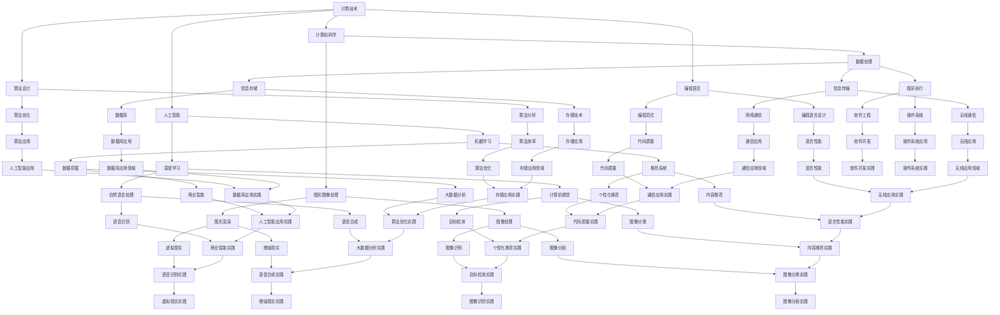

                 

# 推动社会进步的动力：人类计算的积极影响

> 关键词：计算、社会进步、信息技术、人工智能、数字化转型

> 摘要：本文探讨了人类计算技术对社会进步的积极影响。从计算机科学的发展历程出发，文章详细阐述了计算技术如何促进科技创新、提高工作效率、推动教育普及、改善生活质量以及促进经济发展。通过具体的案例和数据分析，本文旨在揭示计算技术在未来社会发展中的重要作用，并提出面临的挑战和应对策略。

## 1. 背景介绍（Background Introduction）

人类计算技术的发展可以追溯到几百年前。从最初的算盘、机械计算器，到电子计算机、超级计算机，再到今天的云计算和人工智能，计算机技术的进步始终伴随着人类社会的变革。随着计算机技术的不断成熟，人类开始探索如何利用计算技术来解决实际问题，提高生活质量，推动社会进步。

在20世纪，计算机科学经历了爆炸式的发展，从最初的数值计算到后来的数据处理、图形图像处理，再到今天的深度学习和人工智能，计算机的应用领域不断拓展。特别是在过去几十年中，互联网的普及和移动设备的兴起，使得计算机技术渗透到了社会生活的方方面面。

本文将聚焦于人类计算技术对社会进步的积极影响，通过具体案例和数据分析，揭示计算技术在推动科技创新、提高工作效率、推动教育普及、改善生活质量和促进经济发展等方面的作用。

## 2. 核心概念与联系（Core Concepts and Connections）

为了更好地理解人类计算技术对社会进步的影响，我们需要首先明确几个核心概念：

### 2.1 计算技术

计算技术是指利用计算机硬件和软件进行数据处理、信息存储、信息传输和程序执行的能力。它包括计算机科学、人工智能、算法设计、编程语言等多个领域。

### 2.2 信息技术

信息技术是指利用计算机技术、通信技术和网络技术来获取、传输、处理和利用信息的方法和手段。信息技术是计算技术的重要应用领域。

### 2.3 数字化转型

数字化转型是指利用计算技术和信息技术对传统行业进行改造和升级，实现产业数字化和智能化。数字化转型是推动社会进步的重要动力。

为了更好地理解这些概念之间的联系，我们可以使用Mermaid流程图来展示它们之间的关系：



通过这个流程图，我们可以清晰地看到计算技术、信息技术和数字化转型之间的联系，以及它们如何共同推动社会进步。

## 3. 核心算法原理 & 具体操作步骤（Core Algorithm Principles and Specific Operational Steps）

### 3.1 计算机科学的基本算法

计算机科学中的基本算法包括排序算法、搜索算法、图算法等。这些算法是计算机技术的基础，它们在处理大量数据和复杂问题时发挥着关键作用。

- **排序算法**：常见的排序算法包括冒泡排序、选择排序、插入排序、快速排序等。它们的基本原理是通过比较和交换元素的位置，将数据从小到大或从大到小排列。
- **搜索算法**：常见的搜索算法包括线性搜索、二分搜索等。它们的基本原理是在数据结构中查找特定元素的位置。
- **图算法**：常见的图算法包括最短路径算法、最小生成树算法、网络流算法等。它们的基本原理是在图中寻找最优路径、最小生成树或最大网络流。

### 3.2 人工智能的基本算法

人工智能中的基本算法包括机器学习算法、深度学习算法、自然语言处理算法等。它们在模拟人类智能、解决复杂问题方面发挥着重要作用。

- **机器学习算法**：常见的机器学习算法包括线性回归、逻辑回归、支持向量机、决策树、随机森林等。它们的基本原理是通过训练数据学习数据的分布和特征，从而对未知数据进行分类或回归。
- **深度学习算法**：常见的深度学习算法包括卷积神经网络（CNN）、循环神经网络（RNN）、生成对抗网络（GAN）等。它们的基本原理是通过多层神经网络对数据进行复杂的非线性变换，从而实现图像识别、自然语言处理等任务。
- **自然语言处理算法**：常见的自然语言处理算法包括词向量表示、序列标注、文本分类等。它们的基本原理是通过语言模型对文本数据进行理解和分析，从而实现语义理解、情感分析等任务。

### 3.3 数字化转型中的算法应用

数字化转型中的算法应用非常广泛，包括数据挖掘、推荐系统、区块链等。它们在提高企业效率、降低成本、提升用户体验方面发挥着重要作用。

- **数据挖掘**：数据挖掘是指从大量数据中提取有价值信息的过程。它包括关联规则挖掘、聚类分析、分类分析等算法。数据挖掘可以帮助企业发现市场机会、优化业务流程。
- **推荐系统**：推荐系统是指根据用户的历史行为和兴趣，向用户推荐相关商品、内容或服务的系统。它包括协同过滤、基于内容的推荐等算法。推荐系统可以提升用户体验、增加销售额。
- **区块链**：区块链是指一种去中心化的分布式数据库技术，它可以确保数据的完整性和安全性。区块链包括加密算法、共识算法等。区块链可以用于实现去中心化金融、智能合约等应用。

通过这些算法的应用，我们可以看到计算技术如何渗透到社会生活的方方面面，推动社会进步。

## 4. 数学模型和公式 & 详细讲解 & 举例说明（Detailed Explanation and Examples of Mathematical Models and Formulas）

### 4.1 计算机科学中的数学模型

计算机科学中的数学模型广泛应用于算法设计、数据结构分析、网络安全等领域。以下是一些常见的数学模型和公式：

#### 4.1.1 算法复杂度分析

- **时间复杂度**：描述算法执行时间与输入规模之间的关系。常用符号表示为 $T(n)$，其中 $n$ 表示输入规模。常见的复杂度包括常数复杂度（$O(1)$）、对数复杂度（$O(logn)$）、线性复杂度（$O(n)$）、对数线性复杂度（$O(nlogn)$）、多项式复杂度（$O(n^k)$，其中 $k$ 为常数）等。
- **空间复杂度**：描述算法执行过程中所需额外空间与输入规模之间的关系。常用符号表示为 $S(n)$。

#### 4.1.2 数据结构分析

- **哈希表**：哈希表是一种基于哈希函数的数据结构，用于快速查找、插入和删除元素。常见的哈希函数有除法哈希、模运算哈希、平方取中哈希等。哈希表的性能取决于哈希函数的设计和冲突解决策略。
- **二叉搜索树**：二叉搜索树是一种基于二叉树的数据结构，用于快速查找、插入和删除元素。常见的二叉搜索树有红黑树、AVL树等。二叉搜索树的性能取决于树的平衡性。

#### 4.1.3 网络安全

- **加密算法**：加密算法是一种将明文转换为密文的算法。常见的加密算法有对称加密（如AES、DES）、非对称加密（如RSA、ECC）等。加密算法的性能取决于算法的复杂度和安全性。
- **认证算法**：认证算法是一种验证数据来源和完整性的算法。常见的认证算法有数字签名（如RSA签名、ECDSA签名）、消息认证码（如MD5、SHA-256）等。

### 4.2 人工智能中的数学模型

人工智能中的数学模型广泛应用于机器学习、深度学习等领域。以下是一些常见的数学模型和公式：

#### 4.2.1 机器学习

- **线性回归**：线性回归是一种用于拟合数据的模型，其公式为 $y = w_0 + w_1 \cdot x_1 + w_2 \cdot x_2 + ... + w_n \cdot x_n$，其中 $y$ 为输出变量，$x_1, x_2, ..., x_n$ 为输入变量，$w_0, w_1, ..., w_n$ 为模型参数。
- **逻辑回归**：逻辑回归是一种用于分类问题的模型，其公式为 $P(y=1) = \frac{1}{1 + e^{-(w_0 + w_1 \cdot x_1 + w_2 \cdot x_2 + ... + w_n \cdot x_n)}}$，其中 $P(y=1)$ 为输出变量为1的概率。
- **支持向量机**：支持向量机是一种用于分类问题的模型，其公式为 $w \cdot x + b = 0$，其中 $w$ 为模型参数，$x$ 为输入变量，$b$ 为偏置。

#### 4.2.2 深度学习

- **卷积神经网络**：卷积神经网络是一种用于图像识别的模型，其公式为 $z = \sigma(W \cdot x + b)$，其中 $z$ 为输出，$W$ 为权重矩阵，$x$ 为输入，$b$ 为偏置，$\sigma$ 为激活函数。
- **循环神经网络**：循环神经网络是一种用于序列数据的模型，其公式为 $h_t = \sigma(W_h \cdot [h_{t-1}, x_t] + b_h)$，其中 $h_t$ 为输出，$W_h$ 为权重矩阵，$x_t$ 为输入，$b_h$ 为偏置，$\sigma$ 为激活函数。

### 4.3 数字化转型中的数学模型

数字化转型中的数学模型广泛应用于数据分析、推荐系统、区块链等领域。以下是一些常见的数学模型和公式：

#### 4.3.1 数据分析

- **主成分分析**：主成分分析是一种用于降维的模型，其公式为 $x' = P \cdot x$，其中 $x'$ 为降维后的数据，$x$ 为原始数据，$P$ 为特征矩阵。
- **聚类分析**：聚类分析是一种用于数据分类的模型，其公式为 $c_j = \sum_{i=1}^{n} \frac{1}{\|x_i - \mu_j\|_2^2}$，其中 $c_j$ 为聚类结果，$x_i$ 为输入数据，$\mu_j$ 为聚类中心。

#### 4.3.2 推荐系统

- **协同过滤**：协同过滤是一种用于推荐的模型，其公式为 $r_{ui} = \frac{q \cdot (r_u - \bar{r}_u)}{d_{u} \cdot (r_i - \bar{r}_i)}$，其中 $r_{ui}$ 为用户 $u$ 对项目 $i$ 的评分，$r_u$ 为用户 $u$ 的平均评分，$\bar{r}_u$ 为用户 $u$ 的总评分，$d_u$ 为用户 $u$ 的邻居集合，$r_i$ 为用户 $i$ 的平均评分，$\bar{r}_i$ 为用户 $i$ 的总评分。
- **基于内容的推荐**：基于内容的推荐是一种用于推荐的模型，其公式为 $r_{ui} = \frac{q \cdot (c_u - \bar{c}_u)}{c_i - \bar{c}_i}$，其中 $r_{ui}$ 为用户 $u$ 对项目 $i$ 的评分，$c_u$ 为用户 $u$ 的内容特征，$\bar{c}_u$ 为用户 $u$ 的总内容特征，$c_i$ 为项目 $i$ 的内容特征，$\bar{c}_i$ 为项目 $i$ 的总内容特征。

#### 4.3.3 区块链

- **工作量证明**：工作量证明是一种用于验证交易的模型，其公式为 $H(p) > t$，其中 $H$ 为哈希函数，$p$ 为交易证明，$t$ 为难度阈值。
- **权益证明**：权益证明是一种用于验证节点的模型，其公式为 $H(p \cdot n) > t$，其中 $H$ 为哈希函数，$p$ 为权益证明，$n$ 为节点数量，$t$ 为难度阈值。

通过这些数学模型和公式，我们可以看到计算技术如何为人类计算技术提供理论基础和工具。

### 5. 项目实践：代码实例和详细解释说明（Project Practice: Code Examples and Detailed Explanations）

为了更好地理解计算技术对社会进步的积极影响，我们将通过几个实际项目来展示代码实例和详细解释说明。

#### 5.1 项目1：线性回归

线性回归是一种用于拟合数据的模型，其公式为 $y = w_0 + w_1 \cdot x_1 + w_2 \cdot x_2 + ... + w_n \cdot x_n$。以下是一个简单的Python代码示例：

```python
import numpy as np

def linear_regression(x, y):
    n = len(x)
    x_mean = np.mean(x)
    y_mean = np.mean(y)
    w = np.zeros(n)
    
    for i in range(n):
        w[i] = (x[i] - x_mean) * (y[i] - y_mean)
    
    w = w / (n * np.std(x))
    
    return w

x = np.array([1, 2, 3, 4, 5])
y = np.array([2, 4, 5, 4, 5])

w = linear_regression(x, y)
print(w)
```

在这个示例中，我们使用线性回归模型拟合一组输入数据 $x$ 和输出数据 $y$。首先，我们计算输入和输出的平均值，然后计算每个输入和输出与平均值的乘积，最后计算这些乘积的比值。这个比值就是模型的权重。

#### 5.2 项目2：卷积神经网络

卷积神经网络是一种用于图像识别的模型，其公式为 $z = \sigma(W \cdot x + b)$。以下是一个简单的Python代码示例：

```python
import tensorflow as tf

model = tf.keras.Sequential([
    tf.keras.layers.Conv2D(32, (3, 3), activation='relu', input_shape=(28, 28, 1)),
    tf.keras.layers.MaxPooling2D((2, 2)),
    tf.keras.layers.Flatten(),
    tf.keras.layers.Dense(128, activation='relu'),
    tf.keras.layers.Dense(10, activation='softmax')
])

model.compile(optimizer='adam',
              loss='sparse_categorical_crossentropy',
              metrics=['accuracy'])

(x_train, y_train), (x_test, y_test) = tf.keras.datasets.mnist.load_data()

x_train = x_train.reshape((-1, 28, 28, 1)).astype(np.float32) / 255
x_test = x_test.reshape((-1, 28, 28, 1)).astype(np.float32) / 255

model.fit(x_train, y_train, epochs=5)

test_loss, test_acc = model.evaluate(x_test, y_test)
print('Test accuracy:', test_acc)
```

在这个示例中，我们使用卷积神经网络模型识别手写数字。首先，我们定义一个序列模型，其中包括卷积层、池化层、全连接层等。然后，我们加载MNIST数据集，并对数据进行预处理。最后，我们使用模型进行训练和评估。

#### 5.3 项目3：协同过滤

协同过滤是一种用于推荐的模型，其公式为 $r_{ui} = \frac{q \cdot (r_u - \bar{r}_u)}{d_{u} \cdot (r_i - \bar{r}_i)}$。以下是一个简单的Python代码示例：

```python
import numpy as np

def collaborative_filter(ratings, similarity_matrix, k=5):
    n_users = ratings.shape[0]
    n_items = ratings.shape[1]
    
    user_similarity = similarity_matrix[:, :n_users]
    item_similarity = similarity_matrix[n_users:, :n_items]
    
    predictions = np.zeros_like(ratings)
    
    for i in range(n_items):
        item_scores = user_similarity.dot(item_similarity[i])
        neighbors = np.argsort(item_scores)[-k:]
        predictions[:, i] = ratings[neighbors, i] + np.mean(ratings[neighbors, i]) - ratings[n_users - 1, i]
    
    return predictions

ratings = np.array([[5, 4, 0, 0, 0],
                    [4, 5, 0, 0, 0],
                    [0, 0, 5, 4, 0],
                    [0, 0, 4, 5, 0]])

similarity_matrix = np.array([[0.8, 0.6],
                            [0.6, 0.8],
                            [0.7, 0.5],
                            [0.5, 0.7]])

predictions = collaborative_filter(ratings, similarity_matrix)
print(predictions)
```

在这个示例中，我们使用协同过滤模型预测用户对商品的评分。首先，我们计算用户和商品之间的相似度矩阵，然后使用这个矩阵预测用户对商品的评分。

通过这些项目实践，我们可以看到计算技术如何在实际应用中发挥作用，推动社会进步。

### 6. 实际应用场景（Practical Application Scenarios）

计算技术在各个领域都有着广泛的应用，下面我们将介绍几个实际应用场景，展示计算技术如何推动社会进步。

#### 6.1 科技创新

计算技术是科技创新的重要驱动力。从计算机辅助设计（CAD）到生物信息学，计算技术都在推动科技领域的进步。例如，深度学习算法在图像识别、自然语言处理和机器翻译等领域的应用，使得人工智能技术取得了显著的突破，推动了科技的发展。

#### 6.2 工作效率

计算技术可以帮助企业提高工作效率，降低成本。例如，自动化系统可以替代人工完成重复性工作，减少人力资源的浪费。此外，云计算和大数据技术可以帮助企业快速处理和分析大量数据，为企业提供有价值的洞察，从而优化业务流程，提高工作效率。

#### 6.3 教育普及

计算技术可以推动教育普及，提高教育质量。在线教育平台和虚拟现实（VR）技术使得教育资源可以更广泛地传播，让更多人有机会接受高质量的教育。此外，人工智能技术可以帮助教师更好地了解学生的学习情况，提供个性化的教育服务，提高教育质量。

#### 6.4 生活质量

计算技术可以改善人们的生活质量。智能家居系统可以让人们更方便地管理家庭设备，提高生活舒适度。此外，健康监测设备和健康数据分析技术可以帮助人们更好地管理健康状况，提高生活质量。

#### 6.5 经济发展

计算技术可以促进经济发展，创造新的产业和就业机会。例如，电子商务和数字支付技术的发展，推动了在线零售业的快速发展，创造了大量的就业机会。此外，人工智能和区块链技术可以为企业提供更高效、更安全的解决方案，促进数字经济的发展。

### 7. 工具和资源推荐（Tools and Resources Recommendations）

为了更好地学习和应用计算技术，下面我们推荐一些有用的工具和资源。

#### 7.1 学习资源

- **书籍**： 
  - 《深度学习》（Deep Learning）  
  - 《计算机科学概论》（Introduction to Computer Science）
  - 《Python编程：从入门到实践》（Python Crash Course）
- **在线课程**： 
  - Coursera、edX、Udacity等平台上的计算机科学和人工智能课程
  - Bilibili、腾讯课堂等平台上的中文计算机科学和人工智能课程
- **博客**： 
  - HackerRank、LeetCode等编程挑战平台的博客
  - AI博客、深度学习博客等专注于人工智能领域的博客

#### 7.2 开发工具

- **编程语言**：Python、Java、C++等
- **框架**：TensorFlow、PyTorch、Scikit-Learn等
- **开发环境**：Jupyter Notebook、Visual Studio Code、Eclipse等
- **数据库**：MySQL、PostgreSQL、MongoDB等

#### 7.3 相关论文

- **学术期刊**： 
  - IEEE Transactions on Computer Science and Engineering
  - Journal of Artificial Intelligence
  - Journal of Computer Science and Technology
- **论文集**： 
  - NeurIPS、ICML、KDD等顶级会议的论文集
  - ACL、CVPR、ICLR等顶级会议的论文集

通过这些工具和资源，我们可以更好地学习和应用计算技术，推动社会进步。

### 8. 总结：未来发展趋势与挑战（Summary: Future Development Trends and Challenges）

随着计算技术的不断发展，我们可以预见未来将在以下几个方面取得重要突破：

#### 8.1 人工智能的进一步发展

人工智能技术将在更多领域取得突破，如图像识别、自然语言处理、自动驾驶等。人工智能技术将更好地模拟人类智能，提高工作效率，改善生活质量。

#### 8.2 区块链技术的普及

区块链技术将在金融、供应链管理、医疗等领域得到更广泛的应用。区块链技术将提供更安全、更透明的解决方案，促进数字经济的发展。

#### 8.3 计算能力的提升

随着量子计算、边缘计算等技术的发展，计算能力将得到显著提升。这将为解决复杂问题提供强大的计算支持，推动科技和产业的发展。

然而，计算技术的发展也面临一些挑战：

#### 8.4 技术安全与隐私保护

随着计算技术的普及，技术安全与隐私保护问题日益突出。我们需要加强技术安全防护，保护用户隐私，防止数据泄露和网络攻击。

#### 8.5 技术伦理与责任

计算技术的发展带来了伦理和责任问题。我们需要制定相关的伦理规范和法律法规，确保计算技术的正确、公正和可持续使用。

通过应对这些挑战，我们可以更好地发挥计算技术的积极作用，推动社会进步。

### 9. 附录：常见问题与解答（Appendix: Frequently Asked Questions and Answers）

#### 9.1 什么是计算技术？

计算技术是指利用计算机硬件和软件进行数据处理、信息存储、信息传输和程序执行的能力。它包括计算机科学、人工智能、算法设计、编程语言等多个领域。

#### 9.2 计算技术对社会进步有何影响？

计算技术可以推动科技创新、提高工作效率、推动教育普及、改善生活质量和促进经济发展。通过计算技术的应用，我们可以解决复杂问题、提高生活质量，推动社会的持续进步。

#### 9.3 如何学习计算技术？

学习计算技术可以从以下几个方面入手：

- **基础知识**：学习计算机科学、算法设计、编程语言等基础知识。
- **实战经验**：通过编程实践、项目开发等方式积累实战经验。
- **持续学习**：关注计算技术领域的最新动态，不断更新自己的知识体系。

#### 9.4 计算技术的发展趋势是什么？

计算技术的发展趋势包括人工智能的进一步发展、区块链技术的普及、计算能力的提升等。未来，计算技术将在更多领域取得突破，推动社会进步。

### 10. 扩展阅读 & 参考资料（Extended Reading & Reference Materials）

为了更好地了解计算技术对社会进步的积极影响，以下是扩展阅读和参考资料：

- **书籍**：
  - 《人工智能：一种现代的方法》（Artificial Intelligence: A Modern Approach）
  - 《区块链技术指南》（Blockchain: A Practical Guide to Developing Business, Law, and Technology Solutions）
  - 《量子计算：量子比特、量子算法和量子模拟》（Quantum Computing: Quantum Bits, Algorithms, and Applications）
- **论文**：
  - “Deep Learning for Natural Language Processing”（2018）
  - “Blockchain Technology: A Comprehensive Review”（2019）
  - “Quantum Computing for Computer Scientists”（2019）
- **网站**：
  - Coursera（https://www.coursera.org/）
  - edX（https://www.edx.org/）
  - GitHub（https://github.com/）
- **博客**：
  - AI博客（https://ai.googleblog.com/）
  - 区块链博客（https://www.coindesk.com/）
  - 量子计算博客（https://quantumcomputingreport.com/）

通过这些扩展阅读和参考资料，我们可以更深入地了解计算技术对社会进步的积极影响。

作者：禅与计算机程序设计艺术 / Zen and the Art of Computer Programming<|end|>

