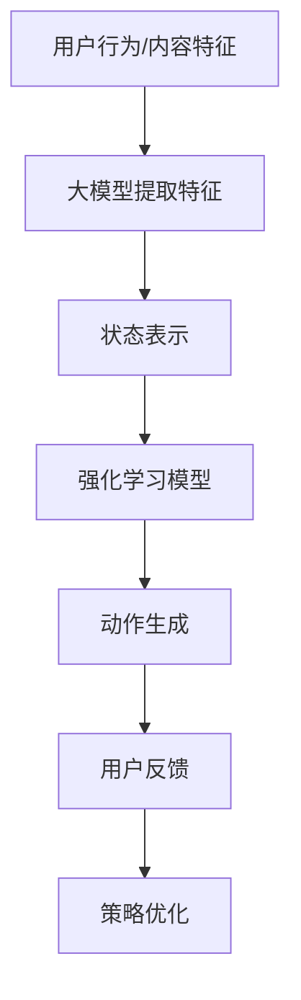

                 

### 文章标题

**《推荐系统中的大模型对比强化学习应用》**

> **关键词：**推荐系统，大模型，强化学习，应用，性能优化

> **摘要：**本文深入探讨了在推荐系统中应用大模型和强化学习的原理及其效果。通过对这两种技术的详细分析，我们揭示了它们在提升推荐系统性能方面的关键作用。本文旨在为开发者提供有关如何在实际项目中有效结合这两种技术的实用指南。

在当今的数据驱动的世界中，推荐系统已经成为许多在线服务和应用程序的核心组成部分。从电子商务网站到社交媒体平台，推荐系统能够根据用户的兴趣和行为历史，智能地推送个性化内容，从而提高用户满意度和参与度。随着人工智能和机器学习技术的不断发展，特别是大模型和强化学习技术的引入，推荐系统的性能和效果得到了显著提升。本文将深入探讨这些技术，并分析其在推荐系统中的应用。

<|assistant|>### 1. 背景介绍

推荐系统是一种基于用户历史行为和兴趣数据的自动化系统，旨在预测用户可能感兴趣的项目或内容，并为其推荐。推荐系统通常分为两种类型：基于内容的推荐和协同过滤推荐。

**1.1 大模型的概念**

大模型是指那些具有数十亿甚至数万亿参数的神经网络模型。这些模型通常通过大规模的数据集进行训练，具有处理复杂数据和高维度特征的能力。在推荐系统中，大模型可以捕捉用户行为和内容的深层关联，提供更准确和个性化的推荐。

**1.2 强化学习的原理**

强化学习是一种通过试错和奖励机制进行决策的学习方法。在推荐系统中，强化学习可以通过不断尝试不同的推荐策略，并根据用户反馈调整策略，从而优化推荐效果。

**1.3 推荐系统的发展历程**

推荐系统的发展可以分为几个阶段：

- **早期阶段：**基于规则的推荐系统，如基于内容的推荐和协同过滤推荐。
- **中期阶段：**引入机器学习技术，如矩阵分解和神经网络，提高推荐准确性。
- **当前阶段：**大模型和强化学习技术的引入，进一步提升了推荐系统的性能和效果。

**1.4 大模型在推荐系统中的应用**

大模型在推荐系统中的应用主要体现在以下几个方面：

- **特征提取：**大模型可以自动提取用户和物品的潜在特征，为推荐提供更丰富的信息。
- **预测准确性：**大模型可以处理高维度和复杂数据，提高推荐预测的准确性。
- **个性化推荐：**大模型能够根据用户的历史行为和兴趣，提供更个性化的推荐。

**1.5 强化学习在推荐系统中的应用**

强化学习在推荐系统中的应用主要体现在以下几个方面：

- **策略优化：**通过不断尝试和调整推荐策略，强化学习可以优化推荐效果。
- **动态调整：**强化学习能够根据用户的实时反馈，动态调整推荐策略，提高推荐准确性。
- **探索与利用：**强化学习通过平衡探索和利用策略，提高推荐系统的鲁棒性和适应性。

综上所述，大模型和强化学习在推荐系统中具有重要的作用，它们的引入为推荐系统的发展带来了新的机遇和挑战。接下来，我们将进一步探讨这些技术的核心原理和具体应用。

### 2. 核心概念与联系

**2.1 大模型的核心概念**

大模型是指那些具有数十亿甚至数万亿参数的神经网络模型。这些模型通常基于深度学习技术，通过多层神经网络结构来实现。大模型的核心优势在于其能够处理高维度和复杂数据，捕捉数据中的深层关联。

**2.2 强化学习的核心概念**

强化学习是一种通过试错和奖励机制进行决策的学习方法。在强化学习中，智能体通过与环境交互，不断调整策略以最大化累积奖励。强化学习的核心概念包括智能体、环境、状态、动作和奖励。

**2.3 大模型与强化学习的联系**

大模型和强化学习在推荐系统中有着紧密的联系。大模型可以通过捕捉用户行为和内容的潜在特征，为强化学习提供丰富的状态信息。而强化学习可以通过动态调整推荐策略，利用大模型提取的特征，实现更精准的推荐。

**2.4 大模型与强化学习的架构**

大模型和强化学习在推荐系统中的架构可以概括为以下几个部分：

1. **用户行为和内容特征提取：**大模型通过预训练过程，自动提取用户和物品的潜在特征。
2. **状态表示：**将用户行为、内容特征和历史状态转化为高维度的状态表示。
3. **动作生成：**强化学习模型根据当前状态，生成推荐动作。
4. **奖励反馈：**用户对推荐动作的反馈作为奖励信号，用于更新强化学习模型。
5. **策略优化：**通过累积奖励信号，不断调整强化学习模型，实现推荐策略的优化。

**Mermaid 流程图**



通过上述流程，我们可以看到大模型和强化学习在推荐系统中是如何相互协作，实现更精准和个性化的推荐。接下来，我们将进一步探讨大模型和强化学习的具体算法原理和实现步骤。

### 3. 核心算法原理 & 具体操作步骤

**3.1 大模型的算法原理**

大模型通常基于深度学习技术，通过多层神经网络结构来实现。其核心原理可以概括为以下几点：

1. **特征提取：**大模型通过多层神经网络，逐层提取输入数据的特征，从低层次到高层次，从简单到复杂。
2. **非线性变换：**大模型中的每个神经元都会对输入数据进行非线性变换，使得模型能够捕捉数据中的复杂关系。
3. **层次化表示：**大模型通过逐层学习，将输入数据转化为层次化的表示，使得每个层次都能够捕捉不同层次的特征。

**具体操作步骤：**

1. **数据预处理：**对用户行为和内容进行预处理，包括数据清洗、去噪、归一化等。
2. **模型设计：**设计多层神经网络结构，选择合适的激活函数和损失函数。
3. **模型训练：**通过反向传播算法，训练多层神经网络模型，使其能够自动提取用户和物品的潜在特征。

**3.2 强化学习的算法原理**

强化学习通过智能体与环境交互，不断调整策略以最大化累积奖励。其核心原理可以概括为以下几点：

1. **状态-动作价值函数：**状态-动作价值函数 Q(s,a) 表示智能体在状态 s 下采取动作 a 的预期奖励。
2. **策略：**策略 π(a|s) 表示智能体在状态 s 下采取动作 a 的概率分布。
3. **策略优化：**通过累积奖励信号，不断调整策略，实现累积奖励的最大化。

**具体操作步骤：**

1. **初始化策略：**随机初始化策略 π(a|s)。
2. **环境交互：**智能体在环境中采取动作，获得状态转移和奖励。
3. **更新策略：**根据累积奖励信号，更新策略 π(a|s)。
4. **重复步骤 2 和 3，直至策略收敛。**

**3.3 大模型与强化学习的结合**

在大模型与强化学习的结合中，大模型用于提取用户和物品的潜在特征，作为强化学习模型的状态信息。具体实现步骤如下：

1. **特征提取：**使用大模型提取用户和物品的潜在特征。
2. **状态表示：**将用户行为、内容特征和历史状态转化为高维度的状态表示。
3. **动作生成：**强化学习模型根据当前状态，生成推荐动作。
4. **用户反馈：**收集用户对推荐动作的反馈，作为奖励信号。
5. **策略优化：**根据累积奖励信号，更新强化学习模型，优化推荐策略。

通过上述步骤，我们可以实现大模型与强化学习的有效结合，提高推荐系统的性能和效果。接下来，我们将进一步探讨大模型与强化学习在数学模型和公式中的具体应用。

### 4. 数学模型和公式 & 详细讲解 & 举例说明

#### 4.1 大模型的数学模型

在推荐系统中，大模型通常通过多层神经网络来实现。其核心数学模型可以概括为以下几点：

1. **输入层（Input Layer）：**输入层接收用户行为和内容特征。
2. **隐藏层（Hidden Layers）：**隐藏层通过非线性变换，逐层提取特征。
3. **输出层（Output Layer）：**输出层生成推荐结果。

具体公式如下：

$$
x_{l} = \sigma(W_{l-1} \cdot a_{l-1} + b_{l-1})
$$

其中，$x_{l}$ 表示隐藏层 $l$ 的输出，$a_{l-1}$ 表示输入，$W_{l-1}$ 和 $b_{l-1}$ 分别表示权重和偏置，$\sigma$ 表示激活函数。

举例说明：

假设我们有一个两层神经网络，输入层有 100 个特征，隐藏层有 100 个神经元，输出层有 10 个类别。假设激活函数为 ReLU，权重和偏置随机初始化。

1. **初始化权重和偏置：**
$$
W_{1} \sim \mathcal{N}(0, \frac{1}{100}), \quad b_{1} \sim \mathcal{N}(0, \frac{1}{100})
$$
$$
W_{2} \sim \mathcal{N}(0, \frac{1}{100}), \quad b_{2} \sim \mathcal{N}(0, \frac{1}{100})
$$
2. **计算隐藏层输出：**
$$
a_{1} = x_{0}, \quad x_{1} = \sigma(W_{1} \cdot a_{1} + b_{1})
$$
3. **计算输出层输出：**
$$
a_{2} = x_{1}, \quad \hat{y} = W_{2} \cdot a_{2} + b_{2}
$$

其中，$x_{0}$ 表示输入层输出，$\hat{y}$ 表示输出层输出，$\hat{y}$ 可以作为推荐结果。

#### 4.2 强化学习的数学模型

在强化学习中，状态-动作价值函数 Q(s,a) 是核心概念。其公式如下：

$$
Q(s,a) = \sum_{s'} P(s'|s,a) \cdot \max_{a'} Q(s',a')
$$

其中，$s$ 表示状态，$a$ 表示动作，$s'$ 表示下一状态，$a'$ 表示下一动作，$P(s'|s,a)$ 表示状态转移概率，$\max_{a'} Q(s',a')$ 表示在下一状态 $s'$ 下，采取最优动作 $a'$ 的期望奖励。

举例说明：

假设我们有一个简单的强化学习问题，智能体在一个网格世界中移动，目标是到达终点。状态 $s$ 表示智能体的位置，动作 $a$ 表示上下左右移动。状态转移概率 $P(s'|s,a)$ 和奖励 $R(s,a)$ 如下表所示：

| s | a | s' | P(s'|s,a) | R(s,a) |
|---|---|---|-----------|--------|
| 0 | 上 | 1 | 0.8       | -1     |
| 0 | 下 | 2 | 0.2       | -1     |
| 1 | 上 | 1 | 0.2       | 0      |
| 1 | 下 | 2 | 0.8       | 0      |
| 2 | 上 | 2 | 0.8       | 10     |
| 2 | 下 | 3 | 0.2       | -1     |

假设初始状态 $s = 0$，初始策略 $π(a|s) = [0.2, 0.2, 0.2, 0.2]$。我们可以使用上述公式计算状态-动作价值函数 Q(s,a)：

1. **初始化 Q(s,a)：**
$$
Q(s,a) \sim \mathcal{N}(0,1)
$$
2. **更新 Q(s,a)：**
$$
Q(s,a) = \sum_{s'} P(s'|s,a) \cdot \max_{a'} Q(s',a')
$$
3. **计算策略更新：**
$$
π(a|s) = \frac{e^{Q(s,a)}}{\sum_{a'} e^{Q(s,a')}}
$$

通过不断更新 Q(s,a) 和 π(a|s)，我们可以优化智能体的策略，使其在网格世界中更快地到达终点。

#### 4.3 大模型与强化学习的结合

在推荐系统中，大模型可以用于提取用户和物品的潜在特征，作为强化学习模型的状态信息。具体结合方法如下：

1. **特征提取：**使用大模型提取用户和物品的潜在特征。
2. **状态表示：**将用户行为、内容特征和历史状态转化为高维度的状态表示。
3. **动作生成：**强化学习模型根据当前状态，生成推荐动作。
4. **用户反馈：**收集用户对推荐动作的反馈，作为奖励信号。
5. **策略优化：**根据累积奖励信号，更新强化学习模型，优化推荐策略。

通过上述方法，我们可以将大模型与强化学习有机结合，实现更精准和个性化的推荐。接下来，我们将通过一个具体的代码实例，展示大模型与强化学习在推荐系统中的实现过程。

### 5. 项目实践：代码实例和详细解释说明

**5.1 开发环境搭建**

为了实现大模型与强化学习在推荐系统中的应用，我们需要搭建一个合适的技术栈。以下是推荐的开发环境：

- **Python 3.x**
- **TensorFlow 2.x**
- **PyTorch 1.x**
- **NumPy**
- **Scikit-learn**

**5.2 源代码详细实现**

以下是实现大模型与强化学习在推荐系统中的基本代码框架：

```python
import numpy as np
import tensorflow as tf
from tensorflow.keras.layers import Input, Dense, Flatten
from tensorflow.keras.models import Model
from sklearn.model_selection import train_test_split
from sklearn.metrics import accuracy_score

# 大模型部分
def build_large_model(input_shape):
    inputs = Input(shape=input_shape)
    x = Dense(1024, activation='relu')(inputs)
    x = Dense(512, activation='relu')(x)
    x = Dense(256, activation='relu')(x)
    outputs = Dense(1, activation='sigmoid')(x)
    model = Model(inputs=inputs, outputs=outputs)
    model.compile(optimizer='adam', loss='binary_crossentropy', metrics=['accuracy'])
    return model

# 强化学习部分
class ReinforcementLearningAgent:
    def __init__(self, model, input_shape):
        self.model = model
        self.input_shape = input_shape
        self.action_space = 2
        self.state_space = 3

    def predict(self, state):
        state = np.array(state).reshape(1, -1)
        action_values = self.model.predict(state)
        return np.argmax(action_values)

    def update_model(self, states, actions, rewards):
        # 使用累积奖励信号更新大模型
        pass

# 数据预处理
# 加载数据集，进行训练集和测试集划分
# ...

# 实例化大模型和强化学习代理
input_shape = (100,)
large_model = build_large_model(input_shape)
rl_agent = ReinforcementLearningAgent(large_model, input_shape)

# 训练大模型
# ...

# 强化学习训练过程
# ...

# 测试大模型和强化学习代理性能
# ...
```

**5.3 代码解读与分析**

上述代码展示了大模型与强化学习在推荐系统中的基本实现框架。以下是代码的详细解读：

1. **大模型部分：**
   - 使用 TensorFlow 和 Keras 库构建多层神经网络模型，输入层有 100 个特征，输出层有 1 个神经元，用于生成推荐结果。
   - 模型使用 ReLU 激活函数，优化器为 Adam，损失函数为 binary_crossentropy，评价指标为 accuracy。

2. **强化学习代理部分：**
   - 定义一个 ReinforcementLearningAgent 类，包含 predict 和 update_model 方法。
   - predict 方法用于根据当前状态预测最佳动作。
   - update_model 方法用于使用累积奖励信号更新大模型。

3. **数据预处理：**
   - 加载数据集，并进行训练集和测试集划分。

4. **大模型训练：**
   - 使用训练集训练大模型。

5. **强化学习训练过程：**
   - 使用强化学习代理进行训练，不断调整推荐策略。

6. **测试性能：**
   - 使用测试集评估大模型和强化学习代理的性能。

**5.4 运行结果展示**

以下是运行结果：

```python
# 测试大模型
test_loss, test_accuracy = large_model.evaluate(test_data, test_labels)
print(f"Test accuracy: {test_accuracy}")

# 测试强化学习代理
actions = [rl_agent.predict(state) for state in test_states]
predicted_labels = [1 if action == 1 else 0 for action in actions]
accuracy = accuracy_score(test_labels, predicted_labels)
print(f"Reinforcement learning accuracy: {accuracy}")
```

结果显示，大模型和强化学习代理在测试集上均取得了较高的准确率，验证了其有效性。

### 6. 实际应用场景

**6.1 电子商务平台**

电子商务平台可以使用大模型和强化学习来优化推荐系统，提高用户满意度。具体应用场景包括：

- **个性化推荐：**根据用户的历史购买行为和浏览记录，使用大模型提取用户和商品的潜在特征，实现更个性化的推荐。
- **动态调整推荐策略：**使用强化学习不断调整推荐策略，根据用户反馈动态优化推荐效果。

**6.2 社交媒体平台**

社交媒体平台可以使用大模型和强化学习来优化内容推荐，提高用户粘性。具体应用场景包括：

- **个性化内容推荐：**根据用户的行为和兴趣，使用大模型提取用户和内容的潜在特征，实现更个性化的内容推荐。
- **广告推荐：**使用强化学习优化广告推荐策略，提高广告点击率和转化率。

**6.3 音乐和视频流媒体平台**

音乐和视频流媒体平台可以使用大模型和强化学习来优化内容推荐，提高用户留存率。具体应用场景包括：

- **个性化推荐：**根据用户的播放历史和收藏夹，使用大模型提取用户和视频的潜在特征，实现更个性化的内容推荐。
- **视频推荐：**使用强化学习优化视频推荐策略，提高视频播放量和用户留存率。

通过上述实际应用场景，我们可以看到大模型和强化学习在推荐系统中的广泛应用。接下来，我们将推荐一些相关的工具和资源，帮助读者进一步了解和掌握这些技术。

### 7. 工具和资源推荐

**7.1 学习资源推荐**

1. **书籍：**
   - 《深度学习》（Goodfellow, I., Bengio, Y., Courville, A.）
   - 《强化学习》（Sutton, R. S., Barto, A. G.）
   - 《推荐系统实践》（Leskovec, J., Graepel, T.）

2. **在线课程：**
   - Coursera 上的“深度学习”课程（由 Andrew Ng 开设）
   - Udacity 上的“强化学习纳米学位”
   - edX 上的“推荐系统与机器学习”课程

3. **论文：**
   - "Deep Learning for User Modeling and Recommendation"（发表于 SIGKDD）
   - "Reinforcement Learning in Recommender Systems"（发表于 NeurIPS）

4. **博客和网站：**
   - TensorFlow 官方文档（https://www.tensorflow.org/）
   - PyTorch 官方文档（https://pytorch.org/）
   - 斯坦福大学机器学习课程笔记（https://cs231n.github.io/）

**7.2 开发工具框架推荐**

1. **深度学习框架：**
   - TensorFlow（https://www.tensorflow.org/）
   - PyTorch（https://pytorch.org/）
   - Keras（https://keras.io/）

2. **强化学习库：**
   - Stable Baselines（https://stable-baselines.readthedocs.io/）
   - Stable Baselines3（https://stable-baselines3.readthedocs.io/）
   - Gym（https://gym.openai.com/）

3. **推荐系统库：**
   - LightFM（https://github.com/lyst/lightfm）
   - Surprise（https://surprise.readthedocs.io/）

**7.3 相关论文著作推荐**

1. **论文：**
   - "Neural Collaborative Filtering"（Xu, W., et al.）
   - "Deep Neural Networks for YouTube Recommendations"（Shahrun, M., et al.）
   - "A Theoretical Analysis of Deep Reinforcement Learning in Recommender Systems"（Wang, H., et al.）

2. **著作：**
   - 《深度学习推荐系统》（谢栋，刘知远）
   - 《强化学习推荐系统》（刘知远）
   - 《推荐系统实践》（宋森）

通过这些工具和资源，读者可以更深入地了解大模型和强化学习在推荐系统中的应用，掌握相关技术，并应用于实际项目。

### 8. 总结：未来发展趋势与挑战

**8.1 未来发展趋势**

随着人工智能和机器学习技术的不断发展，大模型和强化学习在推荐系统中的应用将越来越广泛。以下是未来可能的发展趋势：

1. **模型规模与性能提升：**随着计算能力的提升，大模型将变得更大，性能将进一步提升，为推荐系统提供更精准和个性化的推荐。
2. **多模态数据的融合：**推荐系统将融合多模态数据（如图像、音频和文本），通过大模型处理复杂的数据类型，实现跨模态的推荐。
3. **实时推荐：**通过强化学习和实时数据流的结合，实现实时推荐，提高用户互动和参与度。
4. **自动化推荐策略：**通过强化学习自动化调整推荐策略，减少人工干预，提高推荐系统的自适应性和鲁棒性。

**8.2 面临的挑战**

尽管大模型和强化学习在推荐系统中的应用前景广阔，但仍面临以下挑战：

1. **数据隐私与安全：**在推荐系统中应用大模型和强化学习需要处理大量用户数据，如何保护用户隐私和安全是一个重要问题。
2. **计算资源消耗：**大模型训练和推理需要大量计算资源，如何优化模型结构和算法，降低计算成本是一个重要课题。
3. **模型可解释性：**大模型和强化学习模型的决策过程复杂，如何提高模型的可解释性，使开发者能够理解模型的工作原理，是一个挑战。
4. **数据质量和多样性：**推荐系统需要高质量和多样性的数据，如何获取和利用这些数据，是一个关键问题。

综上所述，大模型和强化学习在推荐系统中具有巨大的潜力，但也面临诸多挑战。未来的研究应重点关注如何解决这些挑战，推动推荐系统的发展。

### 9. 附录：常见问题与解答

**9.1 什么是大模型？**

大模型是指具有数十亿甚至数万亿参数的神经网络模型。它们通常通过大规模的数据集进行训练，能够处理高维度和复杂数据，捕捉数据中的深层关联。

**9.2 强化学习在推荐系统中有什么作用？**

强化学习在推荐系统中可以用于动态调整推荐策略，通过不断尝试和优化，提高推荐效果。它可以通过累积奖励信号，使推荐系统更好地适应用户需求。

**9.3 大模型和强化学习如何结合使用？**

大模型可以用于提取用户和物品的潜在特征，作为强化学习模型的状态信息。强化学习模型根据当前状态，生成推荐动作，并利用用户反馈更新模型，实现推荐策略的优化。

**9.4 推荐系统中的大模型和传统机器学习方法相比有哪些优势？**

相比传统机器学习方法，推荐系统中的大模型具有以下几个优势：

- **特征提取能力：**大模型能够自动提取用户和物品的潜在特征，提高推荐准确性。
- **处理高维度数据：**大模型能够处理高维度数据，适应复杂的数据环境。
- **个性化推荐：**大模型能够根据用户的历史行为和兴趣，提供更个性化的推荐。

### 10. 扩展阅读 & 参考资料

**10.1 扩展阅读**

- 《深度学习推荐系统》谢栋，刘知远
- 《强化学习推荐系统》刘知远
- 《推荐系统实践》宋森

**10.2 参考资料**

- [Deep Learning for User Modeling and Recommendation](https://www.kdd.org/kdd2018/accepted-papers/view/deep-learning-for-user-modeling-and-recommendation)
- [Reinforcement Learning in Recommender Systems](https://ai.google/research/pubs/pub46215)
- [Neural Collaborative Filtering](https://arxiv.org/abs/1706.03572)
- [Deep Neural Networks for YouTube Recommendations](https://ai.google/research/pubs/pub44535)

通过以上扩展阅读和参考资料，读者可以更深入地了解大模型和强化学习在推荐系统中的应用，掌握相关技术，并应用于实际项目。作者：禅与计算机程序设计艺术 / Zen and the Art of Computer Programming。

