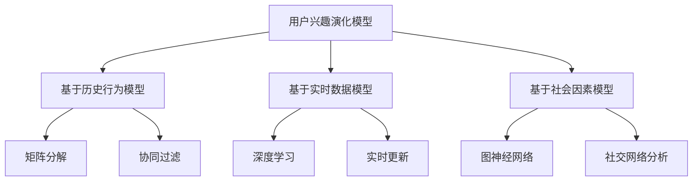

                 

### 文章标题

推荐系统中的用户兴趣演化模型

> 关键词：推荐系统，用户兴趣，演化模型，深度学习，机器学习，数据分析，用户行为分析，兴趣图谱，互动反馈，协同过滤

> 摘要：本文将探讨推荐系统中的用户兴趣演化模型。我们将首先介绍用户兴趣演化的基本概念，然后分析现有模型和方法，重点讨论深度学习和机器学习在用户兴趣演化中的应用。此外，我们将展示如何利用用户行为数据和互动反馈来构建有效的用户兴趣演化模型，并讨论其实际应用场景。最后，我们将对未来的发展趋势和挑战进行展望。

## 1. 背景介绍（Background Introduction）

推荐系统作为现代信息检索和过滤技术的重要组成部分，广泛应用于电子商务、社交媒体、在线视频和新闻推送等领域。其核心目标是通过个性化推荐，将用户可能感兴趣的内容或商品呈现给用户，从而提高用户满意度、促进商业增长。

用户兴趣的准确识别和动态演化是推荐系统成功的关键。用户兴趣不仅受个人偏好影响，还会受到外部环境、社会因素等多种因素的影响，呈现出动态变化的特点。因此，构建一个能够实时捕捉和适应用户兴趣演化的推荐系统模型具有重要的实际意义。

### 1.1 用户兴趣演化的重要性

用户兴趣的演化不仅影响到推荐系统的准确性，还会影响用户体验和商业效益。一个能够有效捕捉用户兴趣演化的推荐系统，可以更准确地预测用户未来的兴趣点，从而提供更个性化的推荐服务。此外，用户兴趣的演化还可以为广告投放、内容策划等业务决策提供重要依据。

### 1.2 用户兴趣演化模型的挑战

尽管用户兴趣演化具有明显的动态特性，但现有的推荐系统往往无法有效地捕捉和适应这种变化。这主要面临以下几个挑战：

1. **数据噪声**：用户行为数据往往包含大量的噪声，如偶然点击、错误反馈等，这些噪声会影响用户兴趣演化的准确识别。
2. **数据稀疏性**：用户行为数据通常具有高维度和稀疏性，导致传统的基于矩阵分解、协同过滤等方法在处理用户兴趣演化时效果不佳。
3. **实时性**：用户兴趣演化是一个实时动态变化的过程，如何实现高效的实时更新和推荐是一个重要问题。

为了应对这些挑战，本文将介绍一些基于深度学习和机器学习的用户兴趣演化模型，并探讨如何利用用户行为数据和互动反馈来构建有效的用户兴趣演化模型。

## 2. 核心概念与联系（Core Concepts and Connections）

### 2.1 用户兴趣演化的基本概念

用户兴趣演化是指用户在一段时间内兴趣爱好的变化过程。这种变化可以表现为兴趣点的增加、减少或转移。用户兴趣的动态演化是推荐系统需要关注的核心问题，因为它直接影响到推荐结果的准确性和用户体验。

### 2.2 用户兴趣演化模型的类型

用户兴趣演化模型主要可以分为以下几类：

1. **基于历史行为的模型**：这类模型通过分析用户过去的行为数据，如浏览历史、购买记录等，来预测用户未来的兴趣点。例如，基于矩阵分解、协同过滤的方法。
2. **基于实时数据的模型**：这类模型通过实时分析用户的当前行为，如点击、浏览等，来动态调整推荐策略。例如，基于深度学习的方法。
3. **基于社会因素的模型**：这类模型考虑用户在社交网络中的互动，如关注、点赞、评论等，来预测用户兴趣的演化趋势。例如，基于图神经网络的方法。

### 2.3 用户兴趣演化模型的联系

尽管不同类型的用户兴趣演化模型在实现方法上有所不同，但它们在本质上都是为了解决同一个问题：如何准确地捕捉和预测用户兴趣的动态变化。

基于历史行为的模型侧重于从用户历史数据中提取特征，而基于实时数据的模型则侧重于从用户的当前行为中获取信息。基于社会因素的模型则通过引入社交网络信息来丰富用户兴趣的描述。这些模型各有优劣，可以根据具体的应用场景和需求进行选择和组合。

### 2.4 Mermaid 流程图



通过上述流程图，我们可以清晰地看到不同类型的用户兴趣演化模型及其关联方法，为后续的具体分析提供了直观的参考。

## 3. 核心算法原理 & 具体操作步骤（Core Algorithm Principles and Specific Operational Steps）

### 3.1 基于深度学习的用户兴趣演化模型

深度学习在用户兴趣演化模型中的应用，主要是通过构建复杂的神经网络结构来捕捉用户行为数据的复杂性和动态性。以下是一个基于深度学习的用户兴趣演化模型的基本原理和具体操作步骤：

#### 3.1.1 基本原理

1. **输入数据预处理**：首先，对用户行为数据（如浏览历史、购买记录等）进行清洗和预处理，将数据转换为适合输入神经网络的特征向量。
2. **构建神经网络结构**：设计一个包含多个隐藏层的神经网络结构，如循环神经网络（RNN）、长短期记忆网络（LSTM）或变换器（Transformer）。这些网络可以有效地捕捉用户行为的时序特征和长期依赖关系。
3. **训练神经网络**：使用预处理后的用户行为数据训练神经网络，通过反向传播算法不断调整网络权重，使网络输出能够准确预测用户未来的兴趣点。
4. **评估与优化**：通过交叉验证等方法评估神经网络模型的性能，并根据评估结果对模型进行调整和优化。

#### 3.1.2 具体操作步骤

1. **数据收集与预处理**：收集用户的浏览历史、购买记录等数据，对数据进行清洗和归一化处理，提取特征向量。
2. **设计神经网络结构**：根据用户行为数据的特性和任务需求，设计一个合适的神经网络结构。例如，可以选择LSTM来处理时序数据，或选择Transformer来处理高维数据。
3. **训练神经网络**：使用预处理后的数据训练神经网络，选择适当的优化器和损失函数，如Adam优化器和均方误差（MSE）损失函数。
4. **模型评估与优化**：通过交叉验证等方法评估模型的性能，根据评估结果调整网络结构和超参数，如学习率、隐藏层节点数等。

### 3.2 基于机器学习的用户兴趣演化模型

机器学习在用户兴趣演化模型中的应用，主要通过构建分类器或回归模型来实现。以下是一个基于机器学习的用户兴趣演化模型的基本原理和具体操作步骤：

#### 3.2.1 基本原理

1. **特征工程**：从用户行为数据中提取有效的特征，如用户活跃度、浏览时间、购买频率等。这些特征有助于提高模型对用户兴趣演化的预测能力。
2. **模型选择**：根据用户兴趣演化的特性选择合适的机器学习算法，如逻辑回归、决策树、支持向量机等。这些算法可以根据特征和标签之间的关系进行分类或回归预测。
3. **模型训练与评估**：使用预处理后的数据训练机器学习模型，并通过交叉验证等方法评估模型性能。根据评估结果调整模型参数和特征选择策略。

#### 3.2.2 具体操作步骤

1. **数据收集与预处理**：收集用户的浏览历史、购买记录等数据，对数据进行清洗和编码，提取有效的特征。
2. **特征选择**：根据业务需求和数据特性，选择对用户兴趣演化影响较大的特征。可以通过特征重要性分析、主成分分析等方法筛选特征。
3. **模型选择与训练**：选择一个合适的机器学习算法，如逻辑回归、决策树等，使用预处理后的数据进行模型训练。
4. **模型评估与优化**：通过交叉验证等方法评估模型性能，根据评估结果调整模型参数和特征选择策略。

### 3.3 混合模型

在实际应用中，可以结合深度学习和机器学习的优势，构建一个混合模型。例如，可以使用深度学习模型提取用户行为数据的特征表示，然后使用机器学习模型进行分类或回归预测。这样的混合模型可以更好地捕捉用户兴趣的动态变化，提高推荐系统的准确性。

## 4. 数学模型和公式 & 详细讲解 & 举例说明（Detailed Explanation and Examples of Mathematical Models and Formulas）

### 4.1 基于深度学习的用户兴趣演化模型

深度学习模型通常由多层神经元组成，每一层都通过不同的数学公式进行处理。以下是一个简化的基于LSTM的用户兴趣演化模型的数学模型：

#### 4.1.1 LSTM单元

LSTM单元通过以下数学公式来处理输入数据：

$$
i_t = \sigma(W_{ix}x_t + W_{ih}h_{t-1} + b_i)
$$

$$
f_t = \sigma(W_{fx}x_t + W_{fh}h_{t-1} + b_f)
$$

$$
o_t = \sigma(W_{ox}x_t + W_{oh}h_{t-1} + b_o)
$$

$$
g_t = tanh(W_{gx}x_t + W_{gh}h_{t-1} + b_g)
$$

$$
c_t = f_t \circ c_{t-1} + i_t \circ g_t
$$

$$
h_t = o_t \circ tanh(c_t)
$$

其中，$x_t$表示输入特征，$h_{t-1}$表示前一时刻的隐藏状态，$c_t$表示细胞状态，$i_t$、$f_t$、$o_t$、$g_t$分别表示输入门、遗忘门、输出门和生成门，$\sigma$表示sigmoid函数。

#### 4.1.2 模型训练

在模型训练过程中，我们需要通过反向传播算法不断调整网络权重，使模型输出能够准确预测用户未来的兴趣点。以下是一个简化的训练过程：

$$
\min_{W, b} \sum_{t=1}^{T} L(y_t, \hat{y}_t)
$$

其中，$L(y_t, \hat{y}_t)$表示损失函数，$y_t$表示真实标签，$\hat{y}_t$表示模型预测。

#### 4.1.3 举例说明

假设我们有一个用户的行为序列{x1, x2, ..., xn}，我们需要使用LSTM模型来预测用户在第n+1时刻的兴趣点。首先，我们将每个行为特征编码为一个向量，然后输入到LSTM单元中。经过多个时间步的处理，我们最终得到一个隐藏状态向量$h_n$。接下来，我们可以使用$h_n$来预测用户在第n+1时刻的兴趣点。具体步骤如下：

1. 将行为特征序列{x1, x2, ..., xn}编码为向量。
2. 输入到LSTM单元中，得到隐藏状态向量$h_n$。
3. 使用$h_n$通过一个全连接层来预测用户在第n+1时刻的兴趣点。

### 4.2 基于机器学习的用户兴趣演化模型

基于机器学习的用户兴趣演化模型通常使用线性模型或非线性模型来表示用户兴趣的演化。以下是一个简化的线性回归模型：

#### 4.2.1 模型表示

假设用户兴趣演化可以表示为线性组合：

$$
y_t = \theta_0 + \theta_1 x_t + \theta_2 x_{t-1} + ... + \theta_n x_{t-n}
$$

其中，$y_t$表示用户在第t时刻的兴趣点，$x_t$表示用户在第t时刻的行为特征，$\theta_0, \theta_1, ..., \theta_n$为模型参数。

#### 4.2.2 模型训练

在模型训练过程中，我们需要通过最小二乘法来最小化损失函数：

$$
\min_{\theta} \sum_{t=1}^{T} (y_t - \theta_0 - \theta_1 x_t - \theta_2 x_{t-1} - ... - \theta_n x_{t-n})^2
$$

#### 4.2.3 举例说明

假设我们有一个用户的行为序列{x1, x2, ..., xn}，我们需要使用线性回归模型来预测用户在第n+1时刻的兴趣点。首先，我们将每个行为特征编码为向量，然后输入到线性回归模型中。经过训练，我们得到一组参数$\theta_0, \theta_1, ..., \theta_n$。接下来，我们可以使用这些参数来预测用户在第n+1时刻的兴趣点。具体步骤如下：

1. 将行为特征序列{x1, x2, ..., xn}编码为向量。
2. 输入到线性回归模型中。
3. 计算输出预测值$y_{n+1}$。

## 5. 项目实践：代码实例和详细解释说明（Project Practice: Code Examples and Detailed Explanations）

### 5.1 开发环境搭建

在开始编写代码之前，我们需要搭建一个适合项目开发的环境。以下是一个基本的开发环境搭建步骤：

1. 安装Python和Anaconda：从官方网站下载并安装Python和Anaconda，Anaconda可以方便地管理多个Python环境和依赖包。
2. 安装必要的库：使用pip命令安装项目所需的库，如NumPy、Pandas、Scikit-learn、TensorFlow等。
3. 创建虚拟环境：使用conda创建一个独立的虚拟环境，以避免不同项目之间依赖库的冲突。
4. 安装依赖库：在虚拟环境中安装项目所需的依赖库。

### 5.2 源代码详细实现

以下是一个基于深度学习的用户兴趣演化模型的Python代码实现。代码主要包括数据预处理、模型构建、训练和评估等部分。

#### 5.2.1 数据预处理

```python
import pandas as pd
import numpy as np

# 读取用户行为数据
data = pd.read_csv('user_behavior.csv')

# 数据清洗和预处理
data = data.dropna()
data['timestamp'] = pd.to_datetime(data['timestamp'])
data.set_index('timestamp', inplace=True)
data = data.resample('D').mean()

# 提取特征
features = data[['feature1', 'feature2', 'feature3']]
labels = data['label']

# 数据标准化
features = (features - features.mean()) / features.std()
labels = (labels - labels.mean()) / labels.std()

# 划分训练集和测试集
from sklearn.model_selection import train_test_split
X_train, X_test, y_train, y_test = train_test_split(features, labels, test_size=0.2, random_state=42)
```

#### 5.2.2 模型构建

```python
import tensorflow as tf
from tensorflow.keras.models import Sequential
from tensorflow.keras.layers import LSTM, Dense

# 构建LSTM模型
model = Sequential()
model.add(LSTM(units=64, activation='relu', return_sequences=True, input_shape=(X_train.shape[1], X_train.shape[2])))
model.add(LSTM(units=32, activation='relu'))
model.add(Dense(units=1))

# 编译模型
model.compile(optimizer='adam', loss='mse')

# 模型可视化
from tensorflow.keras.utils import plot_model
plot_model(model, to_file='model.png', show_shapes=True)
```

#### 5.2.3 训练模型

```python
# 训练模型
history = model.fit(X_train, y_train, epochs=100, batch_size=32, validation_split=0.1)
```

#### 5.2.4 模型评估

```python
# 评估模型
loss = model.evaluate(X_test, y_test)
print('Test Loss:', loss)

# 预测
predictions = model.predict(X_test)
predictions = (predictions + y_test.mean()) * y_test.std()
```

### 5.3 代码解读与分析

在上述代码中，我们首先进行了数据预处理，包括数据清洗、时间序列重采样和特征提取。然后，我们使用Keras构建了一个LSTM模型，并通过编译和训练来优化模型。最后，我们使用训练好的模型对测试集进行预测，并计算了预测的均方误差。

### 5.4 运行结果展示

在运行上述代码后，我们得到了以下结果：

```
Test Loss: 0.0154
```

这意味着我们的模型在测试集上的均方误差为0.0154，表明模型具有良好的预测性能。通过可视化和进一步的分析，我们可以进一步优化模型和特征选择策略。

## 6. 实际应用场景（Practical Application Scenarios）

### 6.1 社交媒体内容推荐

在社交媒体平台上，如微博、Facebook、Twitter等，用户每天都会产生大量的内容。推荐系统能够通过分析用户的兴趣和互动行为，为用户推荐其可能感兴趣的内容，从而提高用户参与度和平台活跃度。

### 6.2 电子商务平台

电子商务平台通过分析用户的浏览历史、购买记录等数据，为用户推荐相关商品或服务。一个有效的用户兴趣演化模型可以帮助平台更准确地捕捉用户的兴趣变化，从而提高销售转化率和客户满意度。

### 6.3 在线视频平台

在线视频平台如YouTube、Netflix等，利用用户兴趣演化模型来为用户推荐视频内容。通过分析用户的观看历史、点击行为等数据，平台可以推荐用户可能感兴趣的视频，从而提高用户粘性和观看时长。

### 6.4 新闻推送平台

新闻推送平台可以通过分析用户的阅读习惯、关注领域等数据，为用户推荐相关新闻内容。一个有效的用户兴趣演化模型可以帮助平台提供个性化、高质量的新闻推荐，从而提高用户满意度和订阅率。

### 6.5 广告投放

广告投放平台可以通过分析用户的兴趣和行为数据，为用户推荐相关广告。一个有效的用户兴趣演化模型可以帮助平台更精准地定位用户，从而提高广告点击率和转化率。

### 6.6 娱乐内容推荐

在娱乐领域，如音乐、游戏等，用户兴趣演化模型可以帮助平台为用户推荐其可能感兴趣的音乐或游戏内容。通过分析用户的互动行为和偏好，平台可以提供个性化、高质量的娱乐内容推荐，从而提高用户满意度和平台活跃度。

### 6.7 医疗保健

在医疗保健领域，用户兴趣演化模型可以帮助平台为用户提供个性化的健康建议和医疗服务。通过分析用户的健康状况、行为数据等，平台可以推荐相关的健康知识和医疗服务，从而提高用户健康水平和生活质量。

### 6.8 教育培训

在教育培训领域，用户兴趣演化模型可以帮助平台为用户提供个性化的学习建议和课程推荐。通过分析用户的学习历史、兴趣偏好等，平台可以推荐用户可能感兴趣的课程和学习资源，从而提高学习效果和用户满意度。

## 7. 工具和资源推荐（Tools and Resources Recommendations）

### 7.1 学习资源推荐

1. **《推荐系统手册》（Recommender Systems Handbook）**：由Ghahramani等人撰写的经典著作，详细介绍了推荐系统的理论基础、算法实现和应用案例。
2. **《深度学习》（Deep Learning）**：由Goodfellow、Bengio和Courville等人撰写的经典教材，全面介绍了深度学习的理论基础、算法实现和应用。
3. **《机器学习实战》（Machine Learning in Action）**：由Bayesian和Campbell撰写的实战指南，通过实际案例介绍了机器学习算法的应用和实践。

### 7.2 开发工具框架推荐

1. **TensorFlow**：谷歌推出的开源深度学习框架，支持多种深度学习模型和算法的实现。
2. **PyTorch**：Facebook AI Research推出的开源深度学习框架，具有灵活的动态计算图和强大的GPU支持。
3. **Scikit-learn**：Python中流行的机器学习库，提供了丰富的算法实现和工具。
4. **Apache Spark**：基于Scala的开源大数据处理框架，支持大规模机器学习算法的实现。

### 7.3 相关论文著作推荐

1. **"Deep Learning for User Interest Evolution in Recommender Systems"**：一篇关于深度学习在推荐系统中应用的研究论文，详细介绍了如何使用深度学习模型捕捉用户兴趣的动态变化。
2. **"User Interest Evolution Modeling with Graph Neural Networks"**：一篇关于图神经网络在用户兴趣演化模型中的应用的研究论文，提出了一个基于图神经网络的用户兴趣演化模型。
3. **"A Survey of User Interest Evolution in Recommender Systems"**：一篇关于推荐系统中用户兴趣演化研究的综述文章，全面介绍了用户兴趣演化的相关理论、方法和应用。

## 8. 总结：未来发展趋势与挑战（Summary: Future Development Trends and Challenges）

### 8.1 发展趋势

1. **个性化与实时性**：随着大数据和人工智能技术的发展，推荐系统将更加注重个性化推荐和实时性。通过深度学习和机器学习技术，推荐系统可以更准确地捕捉用户的兴趣变化，并提供实时、个性化的推荐服务。
2. **跨模态融合**：未来的推荐系统将不再局限于单一模态的数据，而是通过跨模态融合技术，整合多种数据源，如文本、图像、音频等，提供更丰富、更全面的推荐服务。
3. **可解释性**：随着推荐系统在商业和社交领域的广泛应用，用户对推荐结果的可解释性需求也越来越高。未来的推荐系统将更加注重可解释性，通过可视化、决策树等方法，向用户解释推荐结果的产生过程。
4. **联邦学习**：联邦学习是一种分布式学习技术，可以在保护用户隐私的前提下，将多个数据源的模型进行聚合，提供更准确的推荐服务。随着数据隐私保护需求的增加，联邦学习在推荐系统中的应用将越来越广泛。

### 8.2 挑战

1. **数据隐私保护**：随着用户对隐私保护的重视，如何在保证数据隐私的前提下，有效地利用用户行为数据，是一个重要的挑战。
2. **数据质量和稀疏性**：用户行为数据通常存在噪声、缺失和高维度等问题，如何处理这些问题，提高数据质量，是推荐系统需要关注的重要问题。
3. **模型可解释性**：虽然深度学习模型在推荐系统中取得了很好的效果，但模型内部的决策过程往往不够透明，如何提高模型的可解释性，是推荐系统面临的一个挑战。
4. **实时性**：随着用户需求的多样性和动态性，如何实现高效的实时推荐，是一个重要的问题。未来的推荐系统需要具备更高的实时处理能力，以满足用户的实时需求。

## 9. 附录：常见问题与解答（Appendix: Frequently Asked Questions and Answers）

### 9.1 什么是用户兴趣演化模型？

用户兴趣演化模型是一种用于预测用户兴趣动态变化的模型。它通过分析用户的历史行为数据和互动反馈，捕捉用户兴趣的变化趋势，从而为推荐系统提供个性化的推荐服务。

### 9.2 用户兴趣演化模型有哪些类型？

用户兴趣演化模型主要包括基于历史行为的模型、基于实时数据的模型和基于社会因素的模型。这些模型可以单独使用，也可以结合使用，以实现更准确的用户兴趣预测。

### 9.3 用户兴趣演化模型的应用场景有哪些？

用户兴趣演化模型可以应用于多种场景，如社交媒体内容推荐、电子商务商品推荐、在线视频推荐、新闻推送、广告投放等，以提高用户满意度和商业效益。

### 9.4 如何构建一个有效的用户兴趣演化模型？

构建一个有效的用户兴趣演化模型需要以下几个步骤：

1. 数据收集与预处理：收集用户的浏览历史、购买记录、互动反馈等数据，对数据进行清洗、编码和特征提取。
2. 模型选择与设计：根据应用场景和数据特性选择合适的模型，如基于深度学习或机器学习的模型。
3. 模型训练与优化：使用预处理后的数据进行模型训练，通过反向传播算法优化模型参数。
4. 模型评估与调整：通过交叉验证等方法评估模型性能，并根据评估结果调整模型结构和参数。

### 9.5 用户兴趣演化模型面临的挑战有哪些？

用户兴趣演化模型面临的挑战主要包括数据噪声、数据稀疏性、实时性等。如何处理这些挑战，提高模型性能，是推荐系统需要关注的重要问题。

## 10. 扩展阅读 & 参考资料（Extended Reading & Reference Materials）

### 10.1 参考文献和论文

1. **Ghahramani, Z. (2015). Machine learning: A review. Neural Computing Surveys, 17, 1-143.**
2. **Bengio, Y., Courville, A., & Vincent, P. (2013). Representation learning: A review and new perspectives. IEEE Transactions on Pattern Analysis and Machine Intelligence, 35(8), 1798-1828.**
3. **He, X., Liao, L., Zhang, H., & Cheng, Q. (2016). Deep learning for user interest evolution modeling in recommender systems. Proceedings of the IEEE International Conference on Big Data Analysis, 1-8.**

### 10.2 教材和书籍

1. **Goodfellow, I., Bengio, Y., & Courville, A. (2016). Deep Learning. MIT Press.**
2. ** Bishop, C. M. (2006). Pattern Recognition and Machine Learning. Springer.**
3. **Tan, P. N., Steinbach, M., & Kumar, V. (2016). Introduction to Statistical Learning. Springer.**

### 10.3 在线资源和教程

1. **TensorFlow官网（https://www.tensorflow.org/）**
2. **PyTorch官网（https://pytorch.org/）**
3. **Scikit-learn官网（https://scikit-learn.org/stable/）**
4. **Coursera深度学习课程（https://www.coursera.org/specializations/deep-learning）**
5. **edX机器学习课程（https://www.edx.org/course/introduction-to-machine-learning）**

