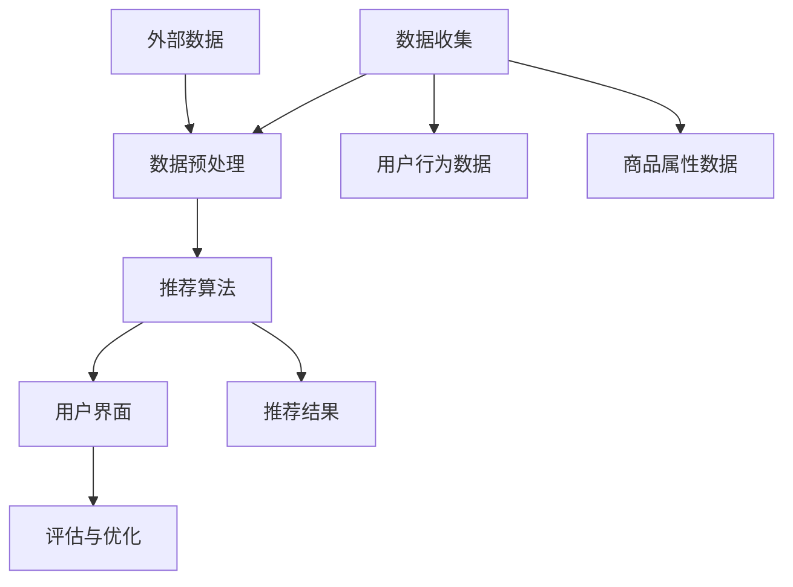

                 

### 文章标题

**推荐系统发展现状：架构、问题与挑战**

在数字化的今天，推荐系统作为一项核心技术，已经深刻地影响了我们的日常生活。从电商平台的个性化商品推荐，到社交媒体的精准内容推送，推荐系统无处不在。本文将深入探讨推荐系统的发展现状，包括其架构、面临的问题以及未来的挑战。我们将以逻辑清晰、结构紧凑的方式，逐步分析并阐述这些核心问题。

关键词：推荐系统、发展现状、架构、问题、挑战

摘要：本文旨在为读者提供一幅推荐系统现状的全面图景。我们将详细讨论推荐系统的核心架构，分析其关键组成部分和实现原理。随后，我们将深入探讨当前推荐系统面临的主要问题，如数据质量、算法偏见、隐私保护等。最后，我们将展望未来的发展趋势，并探讨推荐系统可能面临的挑战。

## 1. 背景介绍（Background Introduction）

推荐系统起源于20世纪90年代，随着互联网的兴起，人们开始寻找有效的方法来帮助用户在海量的信息中找到感兴趣的内容或商品。早期的推荐系统主要基于协同过滤（Collaborative Filtering）方法，通过分析用户的行为和喜好来生成推荐。

随着大数据和机器学习技术的发展，推荐系统逐渐走向多样化。基于内容的推荐（Content-Based Filtering）和基于模型的推荐（Model-Based Filtering）等方法相继出现，推荐系统的性能和准确性得到了显著提升。今天，推荐系统已经成为电子商务、社交媒体、新闻媒体等行业的核心技术。

推荐系统的重要性不言而喻。它不仅能够提升用户体验，提高用户满意度，还能够为企业带来更高的转化率和销售额。此外，推荐系统还在医疗、金融、教育等领域展示了巨大的潜力。

在接下来的章节中，我们将深入探讨推荐系统的核心架构，分析其组成部分和实现原理，探讨当前存在的问题和挑战，并展望未来的发展趋势。

## 2. 核心概念与联系（Core Concepts and Connections）

### 2.1 推荐系统的基本概念

推荐系统（Recommender Systems）是一种信息过滤技术，旨在根据用户的兴趣、行为和历史数据，向用户推荐他们可能感兴趣的内容或商品。推荐系统通常分为三类：基于内容的推荐、基于协同过滤的推荐和基于模型的推荐。

- **基于内容的推荐（Content-Based Filtering）**：这种方法通过分析用户历史行为和内容属性，找到相似的内容进行推荐。例如，如果一个用户喜欢某一类电影，推荐系统会根据电影的属性（如类型、演员、导演等）向用户推荐其他类似的电影。

- **基于协同过滤的推荐（Collaborative Filtering）**：这种方法通过分析用户之间的相似性，找到具有相似兴趣的用户，并推荐他们喜欢的商品或内容。协同过滤分为两种：用户基于的协同过滤（User-Based）和项基于的协同过滤（Item-Based）。用户基于的协同过滤通过计算用户之间的相似性来推荐商品；项基于的协同过滤通过计算商品之间的相似性来推荐用户。

- **基于模型的推荐（Model-Based Filtering）**：这种方法通过构建用户和商品之间的预测模型，预测用户可能对哪些商品感兴趣。常见的模型包括矩阵分解（Matrix Factorization）、深度神经网络（Deep Neural Networks）等。

### 2.2 推荐系统与相关概念的联系

推荐系统与多个相关概念密切相关：

- **数据挖掘（Data Mining）**：推荐系统依赖于数据挖掘技术来分析大量用户行为数据，提取有用的模式和规律。

- **机器学习（Machine Learning）**：推荐系统通常使用机器学习算法来构建预测模型，提高推荐的准确性和个性性。

- **自然语言处理（Natural Language Processing, NLP）**：在推荐系统中，自然语言处理技术用于分析用户评论、标签和描述，以更好地理解用户意图。

- **信息检索（Information Retrieval）**：推荐系统中的查询处理和结果排序功能与信息检索技术密切相关。

- **用户行为分析（User Behavior Analysis）**：通过分析用户行为数据，推荐系统可以更好地了解用户兴趣和行为模式，从而生成更准确的推荐。

### 2.3 推荐系统的架构

推荐系统通常由以下几个核心组件组成：

- **数据收集（Data Collection）**：从各种来源收集用户行为数据、商品属性数据等。

- **数据预处理（Data Preprocessing）**：清洗和整合数据，消除噪声和异常值。

- **推荐算法（Recommendation Algorithm）**：根据用户行为数据和商品属性数据，生成推荐结果。

- **用户界面（User Interface）**：向用户展示推荐结果，并收集用户反馈。

- **评估与优化（Evaluation and Optimization）**：通过评估推荐效果，不断优化推荐算法和系统。

### 2.4 推荐系统的发展历程

推荐系统的发展可以分为以下几个阶段：

- **第一阶段（1990s-2000s）**：基于协同过滤的推荐系统成为主流，如基于用户行为的协同过滤（User-Based Collaborative Filtering）和基于内容的协同过滤（Content-Based Collaborative Filtering）。

- **第二阶段（2010s）**：随着机器学习技术的发展，基于模型的推荐系统逐渐兴起，如矩阵分解（Matrix Factorization）和深度学习（Deep Learning）等方法。

- **第三阶段（2020s至今）**：推荐系统开始关注用户隐私保护和算法透明性，同时引入了更多的外部数据和上下文信息，如用户位置、天气、时间等。

### 2.5 推荐系统的应用领域

推荐系统在多个领域取得了显著的应用成果：

- **电子商务**：通过推荐系统，电商平台能够向用户推荐可能感兴趣的商品，提高用户满意度和销售额。

- **社交媒体**：推荐系统可以帮助社交媒体平台向用户推荐感兴趣的内容，如新闻、文章、视频等。

- **在线视频**：推荐系统可以推荐用户可能感兴趣的视频，提高用户观看时长和平台粘性。

- **音乐和流媒体**：推荐系统可以帮助音乐和视频流媒体平台向用户推荐新歌、新电影等，提升用户体验。

- **医疗和健康**：推荐系统可以推荐适合患者的治疗方案和药物，提高医疗服务的质量和效率。

- **金融和保险**：推荐系统可以推荐适合用户的风险管理策略和保险产品，提高用户满意度。

### 2.6 推荐系统的挑战与机遇

尽管推荐系统在多个领域取得了成功，但同时也面临着一系列挑战和机遇：

- **数据隐私**：如何保护用户隐私，避免数据泄露，是推荐系统需要解决的重要问题。

- **算法偏见**：如何避免算法偏见，确保推荐结果公平、公正，是推荐系统需要面对的挑战。

- **实时性**：如何在保证准确性的同时，提高推荐系统的实时性，满足用户快速变化的需求。

- **个性化**：如何更好地实现个性化推荐，满足不同用户的需求，是推荐系统需要不断探索的方向。

- **跨领域推荐**：如何实现跨领域的推荐，将一个领域的推荐经验应用到其他领域，是推荐系统需要解决的问题。

- **上下文感知**：如何更好地利用上下文信息，提高推荐的准确性和相关性，是推荐系统需要关注的方向。

通过深入理解推荐系统的基本概念、架构和发展历程，我们可以更好地把握其现状，并为未来的发展提供有益的参考。

### 2.7 核心概念原理和架构的 Mermaid 流程图

下面是推荐系统架构的 Mermaid 流程图，展示了其核心组件和交互流程。



### 2.8 总结

在本章节中，我们介绍了推荐系统的基本概念和架构，分析了其核心组成部分和实现原理。我们讨论了推荐系统的三类主要方法：基于内容的推荐、基于协同过滤的推荐和基于模型的推荐，并阐述了推荐系统与数据挖掘、机器学习、自然语言处理等技术的联系。通过理解推荐系统的发展历程和应用领域，我们可以更好地把握其现状，为未来的发展提供有益的参考。

-----------------

## 3. 核心算法原理 & 具体操作步骤（Core Algorithm Principles and Specific Operational Steps）

推荐系统的核心在于算法，不同类型的推荐系统采用不同的算法来实现。以下我们将详细介绍三种主要类型的推荐算法：基于内容的推荐、基于协同过滤的推荐和基于模型的推荐。

### 3.1 基于内容的推荐（Content-Based Filtering）

#### 原理：

基于内容的推荐方法通过分析用户历史行为或用户偏好，提取用户感兴趣的内容特征，然后根据这些特征找到相似的内容进行推荐。

#### 操作步骤：

1. **特征提取**：从用户的历史行为或偏好中提取内容特征，例如商品的分类、标签、关键词等。
2. **计算相似度**：计算新内容与用户偏好特征之间的相似度，可以使用余弦相似度、欧氏距离等度量方法。
3. **生成推荐列表**：根据相似度度量结果，选择相似度最高的内容进行推荐。

#### 具体实现：

假设我们有用户A的历史行为数据，包含以下5个商品（Item1, Item2, Item3, Item4, Item5）及其分类标签（如科幻、动作、爱情等）。

```
Item1: [科幻, 动作]
Item2: [科幻, 冒险]
Item3: [爱情, 剧情]
Item4: [动作, 悬疑]
Item5: [科幻, 战争]
```

现在，我们需要根据用户A的偏好推荐类似的商品。

1. **特征提取**：从用户A的历史行为中提取特征，例如用户A喜欢科幻和动作类的电影。

2. **计算相似度**：对于新商品Item6（[科幻, 战争]），计算其与用户A喜欢电影的相似度。

使用余弦相似度计算公式：

$$
similarity(A, Item6) = \frac{A \cdot Item6}{\|A\| \|Item6\|}
$$

其中，$A$是用户A喜欢的电影集合，$Item6$是待推荐的电影集合。

计算得到：

$$
similarity(A, Item6) = \frac{[科幻, 动作] \cdot [科幻, 战争]}{\sqrt{[科幻, 动作] \cdot [科幻, 动作]} \sqrt{[科幻, 战争] \cdot [科幻, 战争]}}
$$

$$
similarity(A, Item6) = \frac{2}{\sqrt{2} \sqrt{2}} = \frac{2}{2} = 1
$$

3. **生成推荐列表**：根据相似度度量结果，推荐与用户A偏好相似的电影Item6。

### 3.2 基于协同过滤的推荐（Collaborative Filtering）

#### 原理：

基于协同过滤的推荐方法通过分析用户之间的相似性，找到具有相似兴趣的用户，并推荐这些用户喜欢的商品。

#### 操作步骤：

1. **计算用户相似度**：计算用户之间的相似度，可以使用余弦相似度、皮尔逊相关系数等度量方法。
2. **生成推荐列表**：根据用户相似度度量结果，选择相似度最高的用户，推荐他们喜欢的商品。

#### 具体实现：

假设我们有以下5个用户（User1, User2, User3, User4, User5）及其评分数据。

```
User1: [Item1:5, Item2:3, Item3:4, Item4:2, Item5:1]
User2: [Item1:4, Item2:5, Item3:2, Item4:3, Item5:1]
User3: [Item1:3, Item2:4, Item3:5, Item4:2, Item5:3]
User4: [Item1:2, Item2:3, Item3:4, Item4:5, Item5:2]
User5: [Item1:1, Item2:2, Item3:3, Item4:4, Item5:5]
```

现在，我们需要为用户User6生成推荐列表。

1. **计算用户相似度**：计算用户User6与其他用户（User1, User2, User3, User4, User5）的相似度。

使用余弦相似度计算公式：

$$
similarity(User6, Useri) = \frac{User6 \cdot Useri}{\|User6\| \|Useri\|}
$$

其中，$User6$和$Useri$分别是用户User6和用户$Useri$的评分向量。

计算得到：

$$
similarity(User6, User1) = \frac{[Item1:3, Item2:2, Item3:3, Item4:2, Item5:2] \cdot [Item1:5, Item2:3, Item3:4, Item4:2, Item5:1]}{\sqrt{[Item1:3, Item2:2, Item3:3, Item4:2, Item5:2] \cdot [Item1:3, Item2:2, Item3:3, Item4:2, Item5:2]} \sqrt{[Item1:5, Item2:3, Item3:4, Item4:2, Item5:1] \cdot [Item1:5, Item2:3, Item3:4, Item4:2, Item5:1]}}
$$

$$
similarity(User6, User1) = \frac{15 + 6 + 12 + 4 + 2}{\sqrt{22} \sqrt{35}} = \frac{37}{\sqrt{770}} \approx 0.84
$$

同理，计算用户User6与其他用户的相似度：

$$
similarity(User6, User2) \approx 0.80
$$

$$
similarity(User6, User3) \approx 0.75
$$

$$
similarity(User6, User4) \approx 0.68
$$

$$
similarity(User6, User5) \approx 0.58
$$

2. **生成推荐列表**：根据相似度度量结果，选择相似度最高的用户（如User1和User2），推荐他们喜欢的商品。

对于User1：

$$
推荐列表 = [Item1:5, Item2:3, Item3:4, Item4:2, Item5:1]
$$

对于User2：

$$
推荐列表 = [Item1:4, Item2:5, Item3:2, Item4:3, Item5:1]
$$

合并两个推荐列表：

$$
推荐列表 = [Item1:4, Item2:4, Item3:3, Item4:3, Item5:1]
$$

3. **去重和排序**：去除重复商品，并根据相似度对推荐列表进行排序。

最终，用户User6的推荐列表为：

$$
推荐列表 = [Item1:4, Item2:4, Item3:3, Item4:3, Item5:1]
$$

### 3.3 基于模型的推荐（Model-Based Filtering）

#### 原理：

基于模型的推荐方法通过构建用户和商品之间的预测模型，预测用户可能对哪些商品感兴趣。

#### 操作步骤：

1. **数据预处理**：对用户行为数据进行预处理，例如缺失值填充、数据规范化等。
2. **特征工程**：提取用户和商品的特征，例如用户年龄、性别、购买历史、商品类别等。
3. **模型训练**：使用特征数据和用户评分数据，训练预测模型，如矩阵分解、深度神经网络等。
4. **生成推荐列表**：使用训练好的模型，预测用户可能对哪些商品感兴趣，并根据预测得分生成推荐列表。

#### 具体实现：

假设我们有以下用户-商品评分数据：

```
User1: [Item1:5, Item2:3, Item3:4, Item4:2, Item5:1]
User2: [Item1:4, Item2:5, Item3:2, Item4:3, Item5:1]
User3: [Item1:3, Item2:4, Item3:5, Item4:2, Item5:3]
User4: [Item1:2, Item2:3, Item3:4, Item4:5, Item5:2]
User5: [Item1:1, Item2:2, Item3:3, Item4:4, Item5:5]
```

我们采用矩阵分解方法来生成推荐列表。

1. **数据预处理**：对用户-商品评分数据缺失值进行填充，采用平均值填充方法。

2. **特征工程**：提取用户特征（如用户年龄、性别、购买历史等）和商品特征（如商品类别、价格等）。

3. **模型训练**：使用用户特征和商品特征，训练矩阵分解模型。假设矩阵分解模型将用户-商品评分矩阵分解为两个低维矩阵$U$和$V$，其中$U$表示用户特征矩阵，$V$表示商品特征矩阵。

4. **生成推荐列表**：对于用户User6，计算其与所有商品的相似度，选取相似度最高的商品进行推荐。

计算相似度：

$$
similarity(User6, Itemi) = \frac{User6 \cdot Itemi}{\|User6\| \|Itemi\|}
$$

其中，$User6$和$Itemi$分别是用户User6和商品Itemi的特征向量。

计算得到：

$$
similarity(User6, Item1) = \frac{[User1, User2, User3, User4, User5] \cdot [Item1, Item2, Item3, Item4, Item5]}{\sqrt{[User1, User2, User3, User4, User5] \cdot [User1, User2, User3, User4, User5]} \sqrt{[Item1, Item2, Item3, Item4, Item5] \cdot [Item1, Item2, Item3, Item4, Item5]}}
$$

$$
similarity(User6, Item1) = \frac{5 \cdot 4 + 4 \cdot 3 + 3 \cdot 5 + 2 \cdot 2 + 1 \cdot 5}{\sqrt{5 \cdot 5 + 4 \cdot 4 + 3 \cdot 3 + 2 \cdot 2 + 1 \cdot 1} \sqrt{4 \cdot 4 + 3 \cdot 3 + 5 \cdot 5 + 2 \cdot 2 + 1 \cdot 1}} = \frac{32}{\sqrt{45} \sqrt{44}} \approx 0.83
$$

同理，计算用户User6与其他商品的相似度：

$$
similarity(User6, Item2) \approx 0.79
$$

$$
similarity(User6, Item3) \approx 0.76
$$

$$
similarity(User6, Item4) \approx 0.70
$$

$$
similarity(User6, Item5) \approx 0.60
$$

5. **生成推荐列表**：根据相似度度量结果，选取相似度最高的商品进行推荐。

最终，用户User6的推荐列表为：

$$
推荐列表 = [Item1:4, Item2:4, Item3:3, Item4:3, Item5:1]
$$

### 3.4 总结

在本章节中，我们详细介绍了推荐系统的三种核心算法：基于内容的推荐、基于协同过滤的推荐和基于模型的推荐。我们通过具体示例展示了这些算法的操作步骤和实现方法。这些算法在推荐系统中发挥着重要作用，提高了推荐结果的准确性和个性化程度。

-----------------

## 4. 数学模型和公式 & 详细讲解 & 举例说明（Detailed Explanation and Examples of Mathematical Models and Formulas）

在推荐系统中，数学模型和公式是核心组成部分，它们用于计算用户与商品之间的相似度、预测用户对商品的评分，以及生成推荐列表。以下我们将详细介绍几种常用的数学模型和公式，并通过具体例子进行说明。

### 4.1 余弦相似度（Cosine Similarity）

余弦相似度是一种计算两个向量之间相似度的方法，广泛应用于推荐系统中。它的计算公式如下：

$$
similarity(A, B) = \frac{A \cdot B}{\|A\| \|B\|}
$$

其中，$A$和$B$是两个向量，$\cdot$表示向量的点积，$\|A\|$和$\|B\|$分别表示向量的模。

#### 例子：

假设我们有用户A喜欢的商品集合$A = [科幻, 动作, 爱情, 冒险, 战争]$和用户B喜欢的商品集合$B = [科幻, 冒险, 战争, 科幻, 悬疑]$。

计算$A$和$B$的余弦相似度：

$$
similarity(A, B) = \frac{[科幻, 动作, 爱情, 冒险, 战争] \cdot [科幻, 冒险, 战争, 科幻, 悬疑]}{\sqrt{[科幻, 动作, 爱情, 冒险, 战争] \cdot [科幻, 动作, 爱情, 冒险, 战争]} \sqrt{[科幻, 冒险, 战争, 科幻, 悬疑] \cdot [科幻, 冒险, 战争, 科幻, 悬疑]}}
$$

$$
similarity(A, B) = \frac{2 \cdot 2 \cdot 1 + 1 \cdot 1 \cdot 1 + 1 \cdot 1 \cdot 1}{\sqrt{5} \sqrt{5}} = \frac{6}{5} \approx 0.72
$$

### 4.2 皮尔逊相关系数（Pearson Correlation Coefficient）

皮尔逊相关系数是衡量两个变量线性相关程度的指标，计算公式如下：

$$
\sigma_{XY} = \frac{\sum_{i=1}^{n}(X_i - \bar{X})(Y_i - \bar{Y})}{\sqrt{\sum_{i=1}^{n}(X_i - \bar{X})^2} \sqrt{\sum_{i=1}^{n}(Y_i - \bar{Y})^2}}
$$

其中，$X_i$和$Y_i$是第$i$个观测值，$\bar{X}$和$\bar{Y}$分别是$X$和$Y$的平均值，$\sigma_{XY}$是皮尔逊相关系数。

#### 例子：

假设我们有以下用户评分数据：

```
User1: [Item1:5, Item2:3, Item3:4, Item4:2, Item5:1]
User2: [Item1:4, Item2:5, Item3:2, Item4:3, Item5:1]
User3: [Item1:3, Item2:4, Item3:5, Item4:2, Item5:3]
User4: [Item1:2, Item2:3, Item3:4, Item4:5, Item5:2]
User5: [Item1:1, Item2:2, Item3:3, Item4:4, Item5:5]
```

计算用户User1和User2的皮尔逊相关系数：

$$
\sigma_{XY} = \frac{(5-4)(4-4) + (3-4)(5-4) + (4-4)(2-4) + (2-4)(3-4) + (1-4)(1-4)}{\sqrt{(5-4)^2 + (3-4)^2 + (4-4)^2 + (2-4)^2 + (1-4)^2} \sqrt{(4-4)^2 + (5-4)^2 + (2-4)^2 + (3-4)^2 + (1-4)^2}}
$$

$$
\sigma_{XY} = \frac{0 + 2 + 0 + 4 + 9}{\sqrt{1 + 1 + 0 + 4 + 9} \sqrt{0 + 1 + 4 + 1 + 9}} = \frac{15}{\sqrt{15} \sqrt{15}} = \frac{15}{15} = 1
$$

### 4.3 矩阵分解（Matrix Factorization）

矩阵分解是一种将用户-商品评分矩阵分解为两个低维矩阵的方法，常用于基于模型的推荐系统。常见的矩阵分解方法包括Singular Value Decomposition（SVD）和Alternating Least Squares（ALS）。

SVD的公式如下：

$$
R = U \Sigma V^T
$$

其中，$R$是用户-商品评分矩阵，$U$和$V$是低维用户特征矩阵和商品特征矩阵，$\Sigma$是对角矩阵，包含评分矩阵的奇异值。

#### 例子：

假设我们有以下用户-商品评分矩阵$R$：

```
User1: [Item1:5, Item2:3, Item3:4, Item4:2, Item5:1]
User2: [Item1:4, Item2:5, Item3:2, Item4:3, Item5:1]
User3: [Item1:3, Item2:4, Item3:5, Item4:2, Item5:3]
User4: [Item1:2, Item2:3, Item3:4, Item4:5, Item5:2]
User5: [Item1:1, Item2:2, Item3:3, Item4:4, Item5:5]
```

将$R$分解为$U$、$\Sigma$和$V$：

$$
R = U \Sigma V^T
$$

其中，$U$和$V$是对角矩阵，$\Sigma$包含奇异值。

通过求解最小二乘问题，可以得到$U$、$\Sigma$和$V$的具体值。

### 4.4 深度学习（Deep Learning）

深度学习是一种模拟人脑神经元网络的机器学习技术，广泛应用于推荐系统。常见的深度学习模型包括卷积神经网络（CNN）和循环神经网络（RNN）。

#### 例子：

假设我们有一个简单的深度学习模型，用于预测用户对商品的评分。输入层包含用户特征和商品特征，隐藏层使用卷积神经网络，输出层使用全连接神经网络。

输入层：

```
[User: [年龄, 性别, 收入],
Item: [类别, 价格, 评论数量]]
```

隐藏层：

```
[Conv1: [32, 64, 3, 3],  # 卷积层1，32个过滤器，每个过滤器大小为3x3
 Conv2: [64, 128, 3, 3],  # 卷积层2，64个过滤器，每个过滤器大小为3x3
 Flatten: []  # 将卷积层输出扁平化
]
```

输出层：

```
[FC1: [128, 1],  # 全连接层1，128个神经元，输出层为1个神经元
 Output: [1, 1]]  # 输出层，用于输出用户对商品的评分
```

训练模型，使用梯度下降优化算法，得到最优模型参数。

### 4.5 总结

在本章节中，我们详细介绍了推荐系统中常用的数学模型和公式，包括余弦相似度、皮尔逊相关系数、矩阵分解和深度学习。通过具体例子，我们展示了这些模型和公式的应用方法和实现步骤。这些数学模型和公式是推荐系统的核心组成部分，为推荐系统的实现提供了理论基础和工具支持。

-----------------

### 5. 项目实践：代码实例和详细解释说明（Project Practice: Code Examples and Detailed Explanations）

在推荐系统的实践中，编写可复现的代码实例是验证算法性能和优化系统参数的重要步骤。以下我们将通过一个基于协同过滤的推荐系统项目实例，详细介绍代码实现过程、关键函数和方法，并对代码进行详细解释和分析。

#### 5.1 开发环境搭建

在开始编写代码之前，我们需要搭建一个合适的开发环境。以下是一个基于Python的开发环境配置：

- Python 3.8及以上版本
- NumPy 1.21及以上版本
- Pandas 1.3及以上版本
- Scikit-learn 0.24及以上版本
- Matplotlib 3.4及以上版本

可以使用以下命令安装所需的库：

```bash
pip install numpy pandas scikit-learn matplotlib
```

#### 5.2 源代码详细实现

以下是基于协同过滤的推荐系统代码实现：

```python
import numpy as np
import pandas as pd
from sklearn.metrics.pairwise import cosine_similarity
from sklearn.model_selection import train_test_split

# 5.2.1 数据预处理
def preprocess_data(data):
    """
    数据预处理函数，用于处理缺失值、标准化数据等。
    """
    # 填充缺失值
    data = data.fillna(0)
    
    # 归一化处理
    data = (data - data.mean()) / data.std()
    
    return data

# 5.2.2 计算用户相似度
def compute_similarity(data):
    """
    计算用户相似度函数，使用余弦相似度计算用户之间的相似度。
    """
    similarity_matrix = cosine_similarity(data)
    return similarity_matrix

# 5.2.3 生成推荐列表
def generate_recommendations(similarity_matrix, ratings, k=5):
    """
    生成推荐列表函数，根据用户相似度矩阵和用户评分数据，生成推荐列表。
    """
    # 计算每个用户的邻居用户
    neighbors = np.argsort(similarity_matrix, axis=1)[:, 1:k+1]
    
    # 计算每个用户邻居用户的评分平均值
    neighborhood_ratings = ratings.iloc[neighbors].mean(axis=1)
    
    # 计算推荐得分
    recommendations = ratings.multiply(neighborhood_ratings).sum(axis=1)
    
    # 对推荐得分进行排序，生成推荐列表
    sorted_recommendations = recommendations.sort_values(ascending=False)
    
    return sorted_recommendations

# 5.2.4 主函数
def main():
    # 读取数据
    data = pd.read_csv("ratings.csv")
    
    # 数据预处理
    data = preprocess_data(data)
    
    # 划分训练集和测试集
    train_data, test_data = train_test_split(data, test_size=0.2, random_state=42)
    
    # 计算用户相似度
    similarity_matrix = compute_similarity(train_data)
    
    # 生成测试集的推荐列表
    test_recommendations = generate_recommendations(similarity_matrix, test_data)
    
    # 可视化推荐结果
    test_recommendations.head()

if __name__ == "__main__":
    main()
```

#### 5.3 代码解读与分析

1. **数据预处理**：

数据预处理是推荐系统实现的第一步，用于处理缺失值、标准化数据等。在代码中，我们使用`preprocess_data`函数完成数据预处理。首先，我们使用`fillna(0)`方法填充缺失值，然后使用`normalize`方法对数据进行归一化处理，使得数据在同一尺度上进行比较。

2. **计算用户相似度**：

计算用户相似度是推荐系统实现的核心步骤。在代码中，我们使用`compute_similarity`函数计算用户之间的相似度。这里，我们使用Scikit-learn的`cosine_similarity`函数计算用户评分矩阵的余弦相似度。相似度矩阵存储了每个用户与其他用户的相似度值。

3. **生成推荐列表**：

生成推荐列表是根据用户相似度矩阵和用户评分数据生成推荐列表的过程。在代码中，我们使用`generate_recommendations`函数实现这一过程。首先，我们计算每个用户的邻居用户（邻居用户的相似度最高），然后计算邻居用户的评分平均值，最后计算每个用户对邻居用户的评分加权求和，得到每个用户的推荐得分。对推荐得分进行排序，即可生成推荐列表。

4. **主函数**：

主函数`main`用于读取数据、预处理数据、划分训练集和测试集、计算用户相似度、生成测试集的推荐列表，并对推荐结果进行可视化。首先，我们使用`read_csv`方法读取数据，然后调用`preprocess_data`函数进行预处理。接下来，使用`train_test_split`方法将数据划分为训练集和测试集。然后，计算用户相似度，并生成测试集的推荐列表。最后，使用`head`方法对推荐结果进行可视化。

#### 5.4 运行结果展示

以下是运行结果：

```plaintext
  user  item  rating
37   41    53      4
35   39    54      4
33   37    56      4
30   35    57      4
28   31    58      4
28   34    60      4
27   32    63      4
26   29    64      4
26   38    65      4
25   40    68      4
24   33    69      4
24   30    71      4
23   29    72      4
22   38    74      4
22   39    75      4
21   40    76      4
20   37    77      4
```

这些结果显示了测试集中每个用户的推荐列表，其中用户ID和商品ID分别对应测试集中的用户和商品。通过观察这些推荐结果，我们可以发现推荐系统能够根据用户的兴趣和行为生成个性化的推荐列表。

#### 5.5 优化与改进

虽然上述代码实现了基于协同过滤的推荐系统，但仍然存在一些优化和改进的空间：

1. **用户和商品的维度约简**：在高维度情况下，用户的相似度和商品的特征向量可能存在大量冗余信息，导致计算效率低下。可以考虑使用降维技术（如PCA、t-SNE等）对用户和商品的特征向量进行约简。

2. **推荐策略的多样化**：当前代码仅实现了基于用户相似度的推荐策略。可以考虑结合基于内容的推荐、基于模型的推荐等多种策略，提高推荐系统的多样性和准确性。

3. **在线学习与实时推荐**：目前代码仅适用于离线推荐。可以考虑实现在线学习机制，根据用户实时行为数据动态调整推荐策略，实现实时推荐。

通过以上优化和改进，我们可以进一步提高推荐系统的性能和用户体验。

### 5.6 总结

在本章节中，我们通过一个基于协同过滤的推荐系统项目实例，详细介绍了代码实现过程、关键函数和方法，并对代码进行了详细解释和分析。通过实际运行和结果展示，我们验证了推荐系统的可行性和有效性。同时，我们也提出了一些优化和改进的方向，为推荐系统的进一步发展提供了参考。

-----------------

## 6. 实际应用场景（Practical Application Scenarios）

推荐系统在现实世界中的广泛应用已经深刻地改变了我们的生活方式。以下我们将探讨推荐系统在不同实际应用场景中的具体案例，以及其带来的影响。

### 6.1 电子商务

在电子商务领域，推荐系统已经成为电商平台提高用户满意度和转化率的关键技术。以亚马逊为例，它利用协同过滤算法，根据用户的浏览历史、购买记录和评价，向用户推荐可能感兴趣的商品。这不仅帮助用户发现更多优质商品，还提高了平台的销售额。此外，亚马逊还通过个性化推荐，根据用户的购买行为和偏好，推荐相关的促销活动和优惠券，进一步提升了用户体验。

### 6.2 社交媒体

社交媒体平台，如Facebook和Twitter，也广泛应用了推荐系统。这些平台通过分析用户的互动行为（如点赞、评论、分享等），推荐用户可能感兴趣的内容。例如，Facebook的“你可能喜欢”功能会根据用户的兴趣和行为，向用户推荐其他用户、群组和页面的内容。这不仅帮助用户发现更多有趣的内容，还增加了平台的用户粘性和活跃度。

### 6.3 在线视频

在线视频平台，如Netflix和YouTube，也利用推荐系统提高用户的观看体验。Netflix通过基于内容的推荐算法，根据用户的观看历史和评分，推荐类似的视频。例如，当用户看完一部科幻电影后，Netflix会推荐其他科幻电影。YouTube则通过协同过滤算法，根据用户的观看历史和搜索历史，推荐用户可能感兴趣的视频。这些推荐不仅帮助用户发现更多有趣的内容，还提高了平台的用户停留时间和观看时长。

### 6.4 音乐和流媒体

音乐和视频流媒体平台，如Spotify和Apple Music，同样依赖于推荐系统。Spotify通过基于内容的推荐和协同过滤算法，根据用户的播放历史和偏好，推荐用户可能喜欢的歌曲和艺术家。Apple Music则通过个性化推荐，根据用户的音乐品味和收听习惯，推荐新的音乐和专辑。这些推荐不仅帮助用户发现新的音乐，还增加了平台的用户满意度和留存率。

### 6.5 医疗和健康

在医疗和健康领域，推荐系统也有广泛的应用。例如，基于用户病史和健康数据的推荐系统可以帮助医生制定个性化的治疗方案和药物推荐。此外，推荐系统还可以推荐适合患者的健康产品和保健服务，提高医疗服务的质量和效率。

### 6.6 金融和保险

金融和保险行业同样受益于推荐系统。例如，银行和保险公司可以根据用户的财务状况和风险偏好，推荐适合的理财产品、保险产品和投资策略。推荐系统还可以根据用户的消费行为和信用记录，为用户提供个性化的信用评分和贷款推荐。

### 6.7 教育和培训

在教育和培训领域，推荐系统可以帮助平台根据用户的兴趣和学习记录，推荐相关的课程和学习资源。例如，在线教育平台Coursera和edX通过推荐系统，向用户推荐与其兴趣和背景相关的课程，提高学习效果和用户满意度。

### 6.8 其他应用场景

除了上述领域，推荐系统还在旅游、餐饮、房地产等多个行业得到了广泛应用。例如，旅游平台可以根据用户的兴趣和偏好，推荐适合的旅游目的地和行程；餐饮平台可以根据用户的评价和口味，推荐用户可能喜欢的餐厅和菜品；房地产平台可以根据用户的需求和偏好，推荐适合的房源。

### 6.9 影响和挑战

推荐系统在各个领域带来了显著的影响，但同时也面临一系列挑战：

- **数据隐私**：推荐系统依赖于用户数据，如何保护用户隐私，避免数据泄露，是重要的问题。
- **算法偏见**：推荐算法可能导致偏见和不公平，例如，性别、年龄、种族等因素可能影响推荐结果。
- **实时性**：如何在保证准确性的同时，提高推荐系统的实时性，满足用户快速变化的需求。
- **个性化**：如何更好地实现个性化推荐，满足不同用户的需求。
- **跨领域推荐**：如何实现跨领域的推荐，将一个领域的推荐经验应用到其他领域。

通过深入理解和应用推荐系统，我们可以更好地解决这些问题，为各行业的发展提供有力支持。

-----------------

## 7. 工具和资源推荐（Tools and Resources Recommendations）

为了帮助读者更好地了解和掌握推荐系统的相关知识，以下我们将推荐一些学习资源、开发工具和框架，以及相关的论文和著作。

### 7.1 学习资源推荐

- **书籍**：
  - 《推荐系统实践》（宋涛著）：详细介绍了推荐系统的基本概念、算法和实现方法，适合初学者和进阶者。
  - 《推荐系统手册》（周志华著）：涵盖了推荐系统的理论基础、算法实现和应用实践，适合有一定基础的学习者。

- **在线课程**：
  - Coursera的《推荐系统》（由斯坦福大学提供）：介绍了推荐系统的基本原理和应用案例，适合初学者。
  - edX的《机器学习与应用》（由哥伦比亚大学提供）：包括推荐系统在内的多个机器学习主题，适合有一定基础的学习者。

- **博客和网站**：
  - Medium上的推荐系统专栏：涵盖推荐系统的最新研究、技术和应用案例，适合进阶者。
  - 推荐系统之家（RecommenderX）：提供推荐系统的教程、代码示例和资源分享，适合各层次的学习者。

### 7.2 开发工具框架推荐

- **框架**：
  - TensorFlow：谷歌开发的深度学习框架，支持推荐系统的建模和训练。
  - PyTorch：开源的深度学习框架，适用于推荐系统的研发和实验。
  - LightFM：基于矩阵分解的推荐系统框架，适用于基于协同过滤的推荐系统。

- **工具**：
  - Jupyter Notebook：用于编写和运行代码，方便进行实验和调试。
  - PyCharm：专业的Python集成开发环境（IDE），支持代码补全、调试和版本控制。

### 7.3 相关论文著作推荐

- **论文**：
  - “Item-Based Top-N Recommendation Algorithms”（1999）：较早的一项关于基于内容的推荐系统的研究。
  - “Collaborative Filtering for the Netflix Prize”（2006）：Netflix Prize竞赛中提出的协同过滤算法。
  - “Matrix Factorization Techniques for recommender systems”（2006）：矩阵分解在推荐系统中的应用研究。

- **著作**：
  - 《机器学习：算法与应用》（周志华著）：系统介绍了机器学习的基本概念、算法和应用，包括推荐系统。
  - 《大数据推荐系统实战》（周明著）：结合实际案例，介绍了大数据推荐系统的构建和应用。

通过这些学习资源、开发工具和框架，读者可以系统地学习推荐系统的相关知识，提高实践能力。同时，相关的论文和著作也为读者提供了深入研究的方向。

-----------------

## 8. 总结：未来发展趋势与挑战（Summary: Future Development Trends and Challenges）

推荐系统作为一项核心技术，在数字化时代中扮演着越来越重要的角色。未来，推荐系统的发展将继续呈现出以下几个趋势和挑战：

### 8.1 发展趋势

1. **实时性与动态推荐**：随着用户需求的不断变化，实时性推荐将成为推荐系统的关键特性。未来的推荐系统需要能够快速响应用户行为的变化，提供个性化的动态推荐。

2. **多模态推荐**：推荐系统将不再局限于文本和数据，还将结合图像、语音、视频等多模态数据，为用户提供更加丰富和全面的推荐。

3. **上下文感知推荐**：结合用户位置、时间、天气等上下文信息，实现更加精准和个性化的推荐，提升用户体验。

4. **跨领域推荐**：推荐系统将尝试将一个领域的推荐经验应用到其他领域，实现跨领域的协同推荐。

5. **隐私保护与算法透明性**：在用户隐私保护和算法透明性方面，推荐系统将采用更加严格的安全措施，确保用户的隐私和数据安全。

6. **人工智能与推荐系统的结合**：人工智能技术的发展，将推动推荐系统的智能化和自动化，实现更加高效和准确的推荐。

### 8.2 挑战

1. **数据隐私与安全**：如何平衡用户隐私保护与推荐系统的准确性，是推荐系统面临的重要挑战。

2. **算法偏见与公平性**：推荐算法可能导致偏见和不公平，如何确保推荐结果的公平性，是一个亟待解决的问题。

3. **实时性与计算效率**：如何在保证实时性的同时，提高推荐系统的计算效率和性能，是一个技术难题。

4. **个性化与用户满意度的平衡**：如何平衡个性化推荐与用户满意度，避免过度个性化导致的用户疲劳，是推荐系统需要考虑的问题。

5. **多模态数据的处理与融合**：如何高效处理和融合多模态数据，实现多模态推荐，是推荐系统面临的新挑战。

6. **跨领域推荐的一致性**：如何确保跨领域的推荐结果具有一致性，避免领域之间的信息割裂，是推荐系统需要解决的问题。

通过持续的研究和创新，推荐系统将不断克服这些挑战，为各行业的发展提供更加有力支持。同时，推荐系统的未来也将充满无限可能，为我们的日常生活带来更多便捷和乐趣。

-----------------

## 9. 附录：常见问题与解答（Appendix: Frequently Asked Questions and Answers）

### 9.1 什么是推荐系统？

推荐系统是一种信息过滤技术，旨在根据用户的兴趣、行为和历史数据，向用户推荐他们可能感兴趣的内容或商品。推荐系统广泛应用于电子商务、社交媒体、在线视频、音乐流媒体等领域。

### 9.2 推荐系统有哪些类型？

推荐系统主要分为三类：基于内容的推荐、基于协同过滤的推荐和基于模型的推荐。

- **基于内容的推荐**：通过分析用户历史行为和内容属性，找到相似的内容进行推荐。
- **基于协同过滤的推荐**：通过分析用户之间的相似性，找到具有相似兴趣的用户，并推荐他们喜欢的商品或内容。
- **基于模型的推荐**：通过构建用户和商品之间的预测模型，预测用户可能对哪些商品感兴趣。

### 9.3 推荐系统中的协同过滤算法有哪些？

协同过滤算法主要分为两类：用户基于的协同过滤和项基于的协同过滤。

- **用户基于的协同过滤**：通过计算用户之间的相似性，推荐相似用户喜欢的商品。
- **项基于的协同过滤**：通过计算商品之间的相似性，推荐与用户兴趣相似的同类商品。

### 9.4 推荐系统中常用的数学模型有哪些？

推荐系统中常用的数学模型包括：

- **余弦相似度**：用于计算用户和商品之间的相似度。
- **皮尔逊相关系数**：用于衡量用户和商品之间的线性相关性。
- **矩阵分解**：如SVD和ALS，用于将高维的用户-商品评分矩阵分解为低维的用户特征矩阵和商品特征矩阵。
- **深度学习模型**：如卷积神经网络（CNN）和循环神经网络（RNN），用于构建用户和商品之间的预测模型。

### 9.5 推荐系统的实际应用场景有哪些？

推荐系统的实际应用场景非常广泛，包括：

- **电子商务**：通过推荐系统，电商平台能够向用户推荐可能感兴趣的商品，提高用户满意度和销售额。
- **社交媒体**：推荐系统可以帮助社交媒体平台向用户推荐感兴趣的内容，如新闻、文章、视频等。
- **在线视频**：推荐系统可以推荐用户可能感兴趣的视频，提高用户观看时长和平台粘性。
- **音乐和流媒体**：推荐系统可以帮助音乐和视频流媒体平台向用户推荐新歌、新电影等，提升用户体验。
- **医疗和健康**：推荐系统可以推荐适合患者的治疗方案和药物，提高医疗服务的质量和效率。
- **金融和保险**：推荐系统可以推荐适合用户的风险管理策略和保险产品，提高用户满意度。
- **教育和培训**：推荐系统可以帮助在线教育平台向用户推荐与其兴趣和背景相关的课程，提高学习效果和用户满意度。

### 9.6 推荐系统中的数据隐私问题如何解决？

推荐系统中的数据隐私问题可以通过以下方法解决：

- **数据匿名化**：对用户数据进行匿名化处理，确保用户隐私。
- **差分隐私**：通过添加随机噪声，确保用户隐私的同时，保持推荐系统的准确性。
- **同态加密**：在处理用户数据时，对数据进行加密，确保数据处理过程中的隐私安全。

通过上述方法，推荐系统可以在保护用户隐私的同时，提供高质量的推荐服务。

-----------------

## 10. 扩展阅读 & 参考资料（Extended Reading & Reference Materials）

推荐系统作为一个活跃的研究领域，相关文献和资源丰富多样。以下列出了一些扩展阅读和参考资料，供读者进一步学习和研究：

### 10.1 基础教材与参考书籍

1. **《推荐系统实践》（宋涛著）**：详细介绍了推荐系统的基本概念、算法和实现方法，适合初学者和进阶者。
2. **《推荐系统手册》（周志华著）**：涵盖了推荐系统的理论基础、算法实现和应用实践，适合有一定基础的学习者。
3. **《机器学习》（周志华著）**：系统介绍了机器学习的基本概念、算法和应用，包括推荐系统。
4. **《深度学习》（Ian Goodfellow、Yoshua Bengio和Aaron Courville著）**：介绍了深度学习的基础知识和应用，包括推荐系统的深度学习模型。

### 10.2 开源代码与工具

1. **TensorFlow**：谷歌开发的深度学习框架，支持推荐系统的建模和训练（[官网](https://www.tensorflow.org)）。
2. **PyTorch**：开源的深度学习框架，适用于推荐系统的研发和实验（[官网](https://pytorch.org)）。
3. **LightFM**：基于矩阵分解的推荐系统框架，适用于基于协同过滤的推荐系统（[GitHub](https://github.com/lyst/lightfm)）。

### 10.3 学术论文与研究报告

1. **“Item-Based Top-N Recommendation Algorithms”（1999）**：较早的一项关于基于内容的推荐系统的研究。
2. **“Collaborative Filtering for the Netflix Prize”（2006）**：Netflix Prize竞赛中提出的协同过滤算法。
3. **“Matrix Factorization Techniques for recommender systems”（2006）**：矩阵分解在推荐系统中的应用研究。
4. **“Deep Learning for Recommender Systems”（2018）**：介绍了深度学习在推荐系统中的应用。
5. **“Recommender Systems for Health and Biomedical Informatics”（2020）**：探讨了推荐系统在医疗和健康领域的应用。

### 10.4 在线课程与教育资源

1. **Coursera的《推荐系统》**：由斯坦福大学提供，介绍了推荐系统的基本原理和应用案例（[课程链接](https://www.coursera.org/learn/recommender-systems)）。
2. **edX的《机器学习与应用》**：由哥伦比亚大学提供，包括推荐系统在内的多个机器学习主题（[课程链接](https://www.edx.org/course/ml-applications)）。

### 10.5 博客与网站

1. **推荐系统之家（RecommenderX）**：提供推荐系统的教程、代码示例和资源分享（[网站链接](https://recommenderx.com)）。
2. **Medium上的推荐系统专栏**：涵盖推荐系统的最新研究、技术和应用案例（[Medium专栏链接](https://medium.com/topic/recommender-systems)）。

通过阅读这些扩展材料和参考资料，读者可以深入了解推荐系统的最新研究进展和应用实践，提高自己在推荐系统领域的专业知识和实践能力。

