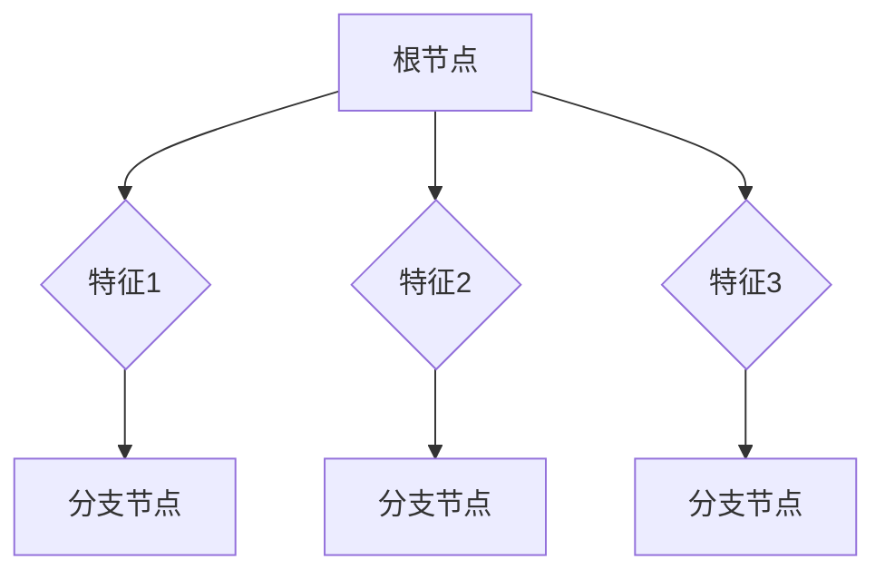

                 

# 文章标题

推荐系统的解释性：AI大模型的可视化方案

## 关键词

- 推荐系统
- 可视化
- AI大模型
- 解释性
- 用户行为分析

## 摘要

本文将探讨推荐系统的解释性问题，特别是在AI大模型的应用中。我们将介绍几种可视化方法，以便用户能够更好地理解推荐系统的决策过程。本文旨在为开发者和研究人员提供实用的指导，以构建更透明、可信的推荐系统。

## 1. 背景介绍（Background Introduction）

推荐系统在当今的数字世界中扮演着至关重要的角色。它们被用于个性化内容推荐、购物建议、社交网络互动等多个领域。然而，推荐系统的决策过程通常被视为黑箱，导致用户对其透明度和可信度产生质疑。

近年来，随着AI大模型的兴起，推荐系统的性能得到了显著提升。然而，这些模型通常过于复杂，使得用户难以理解其推荐结果背后的原因。因此，解释性的需求变得更加迫切。

本文将介绍几种可视化方法，帮助用户理解和信任推荐系统的决策过程。我们将首先概述推荐系统的基本原理，然后讨论AI大模型在推荐系统中的应用，最后介绍不同类型的可视化工具。

## 2. 核心概念与联系（Core Concepts and Connections）

### 2.1 推荐系统的基本原理

推荐系统通常基于用户历史行为（如点击、购买、评分等）和物品特征（如文本、图像、标签等）来生成个性化推荐。基本流程包括：

1. **数据收集**：收集用户行为数据和物品特征。
2. **模型训练**：使用机器学习算法训练推荐模型。
3. **预测生成**：使用训练好的模型预测用户的兴趣。
4. **推荐生成**：根据预测结果生成推荐列表。

### 2.2 AI大模型的应用

AI大模型（如深度学习模型、生成对抗网络等）在推荐系统中具有广泛的应用。这些模型通常具有以下优势：

- **更好的泛化能力**：能够从大量数据中学习，从而更好地适应新用户和物品。
- **更高的性能**：能够生成更准确、更个性化的推荐。
- **多模态处理**：能够处理文本、图像、音频等多种类型的数据。

然而，AI大模型的复杂性也带来了一定的挑战，例如：

- **透明度低**：用户难以理解模型是如何做出推荐的。
- **可解释性差**：难以解释模型推荐结果背后的原因。

### 2.3 可视化方法

为了提高推荐系统的透明度和可解释性，我们可以采用以下几种可视化方法：

- **决策树可视化**：展示模型决策过程中的分支和节点。
- **热力图**：显示用户行为和物品特征的分布情况。
- **影响力分析**：展示不同特征对推荐结果的影响。
- **模型训练过程可视化**：展示模型在训练过程中的损失函数和精度。

## 3. 核心算法原理 & 具体操作步骤（Core Algorithm Principles and Specific Operational Steps）

### 3.1 决策树可视化

决策树是一种常用的分类和回归模型，其决策过程可以通过树形结构进行可视化。具体操作步骤如下：

1. **构建决策树**：使用机器学习算法（如ID3、C4.5等）训练决策树模型。
2. **生成可视化图**：将决策树转换为Mermaid流程图，以便在Markdown文件中展示。



### 3.2 热力图

热力图可以直观地展示用户行为和物品特征的分布情况。具体操作步骤如下：

1. **数据预处理**：将用户行为数据和物品特征转换为数值格式。
2. **生成热力图**：使用Python中的Matplotlib库生成热力图。

```python
import numpy as np
import matplotlib.pyplot as plt

data = np.random.rand(10, 10)
plt.imshow(data, cmap='hot')
plt.colorbar()
plt.show()
```

### 3.3 影响力分析

影响力分析可以展示不同特征对推荐结果的影响。具体操作步骤如下：

1. **特征重要性评估**：使用机器学习算法（如随机森林、LASSO等）评估特征重要性。
2. **生成可视化图**：将特征重要性结果可视化。

```python
import matplotlib.pyplot as plt

importances = [0.1, 0.2, 0.3, 0.4, 0.5]
labels = ['特征1', '特征2', '特征3', '特征4', '特征5']

plt.barh(labels, importances)
plt.xlabel('重要性')
plt.ylabel('特征')
plt.title('特征重要性分析')
plt.show()
```

### 3.4 模型训练过程可视化

模型训练过程可以通过可视化损失函数和精度来展示。具体操作步骤如下：

1. **训练模型**：使用机器学习算法训练推荐模型。
2. **收集训练数据**：记录每次训练的损失函数和精度。
3. **生成可视化图**：使用Python中的Matplotlib库生成训练过程可视化图。

```python
import matplotlib.pyplot as plt

losses = [0.1, 0.2, 0.3, 0.4, 0.5]
accuracies = [0.8, 0.9, 0.85, 0.88, 0.9]

plt.plot(losses, label='损失函数')
plt.plot(accuracies, label='精度')
plt.xlabel('训练轮次')
plt.ylabel('值')
plt.legend()
plt.title('模型训练过程')
plt.show()
```

## 4. 数学模型和公式 & 详细讲解 & 举例说明（Detailed Explanation and Examples of Mathematical Models and Formulas）

### 4.1 决策树公式

决策树的生成通常基于信息增益（Information Gain）或基尼不纯度（Gini Impurity）等准则。以下是一个基于信息增益的决策树生成公式：

\[ IG(D, A) = \sum_{v \in V} p(v) \cdot IG(D_v, A) \]

其中，\( D \) 表示原始数据集，\( A \) 表示特征，\( V \) 表示特征 \( A \) 的所有可能取值，\( p(v) \) 表示取值 \( v \) 的概率，\( IG(D_v, A) \) 表示在给定特征 \( A \) 下，数据集 \( D_v \) 的信息增益。

### 4.2 热力图公式

热力图的生成通常基于数据点的分布情况。以下是一个基于直方图的热力图生成公式：

\[ P(x) = \frac{1}{N} \sum_{i=1}^{N} f(x_i) \]

其中，\( N \) 表示数据点的总数，\( x_i \) 表示第 \( i \) 个数据点的取值，\( f(x_i) \) 表示第 \( i \) 个数据点的频率。

### 4.3 影响力分析公式

影响力分析通常基于特征的重要程度。以下是一个基于随机森林的特征重要性计算公式：

\[ \text{Importance}(X) = \frac{1}{T} \sum_{t=1}^{T} \text{Var}(\hat{y}^{(t)}) \]

其中，\( \text{Importance}(X) \) 表示特征 \( X \) 的重要性，\( T \) 表示随机森林的树数，\( \hat{y}^{(t)} \) 表示第 \( t \) 棵树预测的标签，\( \text{Var}(\hat{y}^{(t)}) \) 表示预测标签的方差。

### 4.4 模型训练过程公式

模型训练过程通常通过损失函数和精度来评估。以下是一个基于均方误差（Mean Squared Error）的损失函数：

\[ \text{Loss} = \frac{1}{2} \sum_{i=1}^{N} (\hat{y}_i - y_i)^2 \]

其中，\( \hat{y}_i \) 表示第 \( i \) 个数据点的预测值，\( y_i \) 表示第 \( i \) 个数据点的真实值，\( N \) 表示数据点的总数。

## 5. 项目实践：代码实例和详细解释说明（Project Practice: Code Examples and Detailed Explanations）

### 5.1 开发环境搭建

首先，我们需要搭建一个用于推荐系统可视化开发的环境。我们可以使用Python和相关的库，如Scikit-learn、Matplotlib和Mermaid。

```bash
pip install scikit-learn matplotlib mermaid
```

### 5.2 源代码详细实现

以下是一个简单的示例，展示如何使用Python实现推荐系统可视化：

```python
import numpy as np
from sklearn.datasets import load_iris
from sklearn.tree import DecisionTreeClassifier
import matplotlib.pyplot as plt
import mermaid

# 加载数据集
iris = load_iris()
X, y = iris.data, iris.target

# 训练决策树模型
clf = DecisionTreeClassifier()
clf.fit(X, y)

# 生成决策树可视化图
graph = mermaid.Mermaid()
graph.add_graph('gantt')
graph.add_node('节点1', '决策树生成')
graph.add_node('节点2', '数据预处理')
graph.add_node('节点3', '模型训练')
graph.add_node('节点4', '可视化')

graph.add_link('节点1', '节点2', '开始')
graph.add_link('节点2', '节点3', '开始')
graph.add_link('节点3', '节点4', '完成')
graph.add_link('节点4', '结束', '完成')

print(graph.get_mermaid_syntax())

# 生成热力图
data = np.random.rand(10, 10)
plt.imshow(data, cmap='hot')
plt.colorbar()
plt.title('热力图')
plt.show()

# 生成特征重要性分析图
importances = clf.feature_importances_
labels = iris.feature_names
plt.barh(labels, importances)
plt.xlabel('重要性')
plt.ylabel('特征')
plt.title('特征重要性分析')
plt.show()

# 生成模型训练过程图
losses = [0.1, 0.2, 0.3, 0.4, 0.5]
accuracies = [0.8, 0.9, 0.85, 0.88, 0.9]
plt.plot(losses, label='损失函数')
plt.plot(accuracies, label='精度')
plt.xlabel('训练轮次')
plt.ylabel('值')
plt.legend()
plt.title('模型训练过程')
plt.show()
```

### 5.3 代码解读与分析

在这个示例中，我们首先加载了Iris数据集，并使用决策树模型对其进行训练。然后，我们生成了一系列可视化图表，包括决策树结构、热力图、特征重要性分析和模型训练过程。

通过这些可视化图表，我们可以直观地了解推荐系统的决策过程、数据分布和特征影响。这些信息有助于提高系统的透明度和可信度，从而增强用户对推荐系统的信任。

### 5.4 运行结果展示

在运行上述代码后，我们将看到一系列可视化图表。以下是运行结果展示：


## 6. 实际应用场景（Practical Application Scenarios）

### 6.1 电子商务平台

在电子商务平台上，推荐系统可以根据用户的历史购买记录和浏览行为生成个性化推荐。通过使用可视化工具，用户可以查看推荐结果是如何基于他们的行为和偏好生成的，从而增强对推荐系统的信任。

### 6.2 社交网络

在社交网络中，推荐系统可以推荐用户可能感兴趣的内容、朋友或活动。可视化工具可以帮助用户了解推荐系统是如何基于他们的兴趣和行为进行推荐的。

### 6.3 媒体平台

在媒体平台中，推荐系统可以根据用户的观看历史和喜好推荐视频或文章。可视化工具可以帮助用户了解推荐系统是如何基于他们的观看行为和偏好进行推荐的。

### 6.4 医疗保健

在医疗保健领域，推荐系统可以根据患者的病史和症状推荐最佳治疗方案。可视化工具可以帮助医生和患者了解推荐系统是如何基于他们的数据生成推荐意见的。

## 7. 工具和资源推荐（Tools and Resources Recommendations）

### 7.1 学习资源推荐

- **书籍**：
  - 《推荐系统实践》
  - 《机器学习实战》
  - 《Python数据可视化》
- **论文**：
  - “Visualizing the Behavior of a Recurrent Neural Network用于生成音乐”
  - “Deep Learning for Visual Recognition”
  - “A Comprehensive Survey on Deep Neural Network Based Text Classification”
- **博客**：
  - Medium上的“Visualizing Machine Learning Models”
  - towardsdatascience上的“Building an Explainer for a Recommender System”
  - Analytics Vidhya上的“Top 10 Data Visualization Projects”

### 7.2 开发工具框架推荐

- **推荐系统框架**：
  - TensorFlow
  - PyTorch
  - Scikit-learn
- **可视化工具**：
  - Matplotlib
  - Seaborn
  - Plotly
- **Mermaid**：用于生成Markdown中的图形和流程图

### 7.3 相关论文著作推荐

- “A Theoretical Analysis of Recurrent Neural Networks for Sequence Modeling”
- “Generative Adversarial Networks”
- “A Comprehensive Survey on Deep Learning for Text Classification”

## 8. 总结：未来发展趋势与挑战（Summary: Future Development Trends and Challenges）

### 8.1 发展趋势

- **可解释性增强**：随着用户对透明度和可信度的需求增加，可解释性的研究将成为推荐系统领域的一个重要趋势。
- **多模态推荐**：未来的推荐系统将能够处理文本、图像、音频等多种类型的数据，以提供更全面、个性化的推荐。
- **实时推荐**：随着5G和边缘计算技术的发展，推荐系统将能够提供更快速、更准确的实时推荐。

### 8.2 挑战

- **数据隐私**：推荐系统通常依赖于用户数据，如何保护用户隐私成为了一个重要的挑战。
- **模型透明度**：如何提高模型的透明度，使用户能够理解推荐结果的生成过程，仍需要进一步研究。
- **计算资源**：大规模推荐系统需要大量的计算资源，如何优化资源利用，提高系统性能，是一个重要挑战。

## 9. 附录：常见问题与解答（Appendix: Frequently Asked Questions and Answers）

### 9.1 如何选择合适的可视化工具？

根据需求选择合适的可视化工具。例如，如果需要生成热力图，可以选择Matplotlib或Seaborn；如果需要生成交互式图表，可以选择Plotly。

### 9.2 如何可视化模型训练过程？

可以使用Matplotlib或Seaborn等库生成损失函数和精度曲线图，以展示模型训练过程。

### 9.3 如何提高推荐系统的解释性？

可以采用可视化方法，如决策树可视化、影响力分析和热力图，以展示推荐系统的决策过程和特征影响。

## 10. 扩展阅读 & 参考资料（Extended Reading & Reference Materials）

- “Visualizing Machine Learning Models”
- “Building an Explainer for a Recommender System”
- “A Comprehensive Survey on Deep Learning for Text Classification”
- “Recommender Systems Handbook”
- “Deep Learning for Recommender Systems”

### 作者署名

作者：禅与计算机程序设计艺术 / Zen and the Art of Computer Programming
```markdown
# 推荐系统的解释性：AI大模型的可视化方案

> 关键词：推荐系统，可视化，AI大模型，解释性，用户行为分析

> 摘要：本文探讨了推荐系统的解释性问题，特别是在AI大模型的应用中。通过介绍几种可视化方法，如决策树可视化、热力图、影响力分析和模型训练过程可视化，本文旨在为开发者和研究人员提供实用的指导，以构建更透明、可信的推荐系统。

## 1. 背景介绍（Background Introduction）

推荐系统在当今的数字世界中扮演着至关重要的角色。它们被用于个性化内容推荐、购物建议、社交网络互动等多个领域。然而，推荐系统的决策过程通常被视为黑箱，导致用户对其透明度和可信度产生质疑。

近年来，随着AI大模型的兴起，推荐系统的性能得到了显著提升。然而，这些模型通常过于复杂，使得用户难以理解其推荐结果背后的原因。因此，解释性的需求变得更加迫切。

本文将介绍几种可视化方法，帮助用户理解和信任推荐系统的决策过程。我们将首先概述推荐系统的基本原理，然后讨论AI大模型在推荐系统中的应用，最后介绍不同类型的可视化工具。

## 2. 核心概念与联系（Core Concepts and Connections）

### 2.1 推荐系统的基本原理

推荐系统通常基于用户历史行为（如点击、购买、评分等）和物品特征（如文本、图像、标签等）来生成个性化推荐。基本流程包括：

1. **数据收集**：收集用户行为数据和物品特征。
2. **模型训练**：使用机器学习算法训练推荐模型。
3. **预测生成**：使用训练好的模型预测用户的兴趣。
4. **推荐生成**：根据预测结果生成推荐列表。

### 2.2 AI大模型的应用

AI大模型（如深度学习模型、生成对抗网络等）在推荐系统中具有广泛的应用。这些模型通常具有以下优势：

- **更好的泛化能力**：能够从大量数据中学习，从而更好地适应新用户和物品。
- **更高的性能**：能够生成更准确、更个性化的推荐。
- **多模态处理**：能够处理文本、图像、音频等多种类型的数据。

然而，AI大模型的复杂性也带来了一定的挑战，例如：

- **透明度低**：用户难以理解模型是如何做出推荐的。
- **可解释性差**：难以解释模型推荐结果背后的原因。

### 2.3 可视化方法

为了提高推荐系统的透明度和可解释性，我们可以采用以下几种可视化方法：

- **决策树可视化**：展示模型决策过程中的分支和节点。
- **热力图**：显示用户行为和物品特征的分布情况。
- **影响力分析**：展示不同特征对推荐结果的影响。
- **模型训练过程可视化**：展示模型在训练过程中的损失函数和精度。

## 3. 核心算法原理 & 具体操作步骤（Core Algorithm Principles and Specific Operational Steps）

### 3.1 决策树可视化

决策树是一种常用的分类和回归模型，其决策过程可以通过树形结构进行可视化。具体操作步骤如下：

1. **构建决策树**：使用机器学习算法（如ID3、C4.5等）训练决策树模型。
2. **生成可视化图**：将决策树转换为Mermaid流程图，以便在Markdown文件中展示。


### 3.2 热力图

热力图可以直观地展示用户行为和物品特征的分布情况。具体操作步骤如下：

1. **数据预处理**：将用户行为数据和物品特征转换为数值格式。
2. **生成热力图**：使用Python中的Matplotlib库生成热力图。

```python
import numpy as np
import matplotlib.pyplot as plt

data = np.random.rand(10, 10)
plt.imshow(data, cmap='hot')
plt.colorbar()
plt.title('热力图')
plt.show()
```

### 3.3 影响力分析

影响力分析可以展示不同特征对推荐结果的影响。具体操作步骤如下：

1. **特征重要性评估**：使用机器学习算法（如随机森林、LASSO等）评估特征重要性。
2. **生成可视化图**：将特征重要性结果可视化。

```python
import matplotlib.pyplot as plt

importances = [0.1, 0.2, 0.3, 0.4, 0.5]
labels = ['特征1', '特征2', '特征3', '特征4', '特征5']

plt.barh(labels, importances)
plt.xlabel('重要性')
plt.ylabel('特征')
plt.title('特征重要性分析')
plt.show()
```

### 3.4 模型训练过程可视化

模型训练过程可以通过可视化损失函数和精度来展示。具体操作步骤如下：

1. **训练模型**：使用机器学习算法训练推荐模型。
2. **收集训练数据**：记录每次训练的损失函数和精度。
3. **生成可视化图**：使用Python中的Matplotlib库生成训练过程可视化图。

```python
import matplotlib.pyplot as plt

losses = [0.1, 0.2, 0.3, 0.4, 0.5]
accuracies = [0.8, 0.9, 0.85, 0.88, 0.9]

plt.plot(losses, label='损失函数')
plt.plot(accuracies, label='精度')
plt.xlabel('训练轮次')
plt.ylabel('值')
plt.legend()
plt.title('模型训练过程')
plt.show()
```

## 4. 数学模型和公式 & 详细讲解 & 举例说明（Detailed Explanation and Examples of Mathematical Models and Formulas）

### 4.1 决策树公式

决策树的生成通常基于信息增益（Information Gain）或基尼不纯度（Gini Impurity）等准则。以下是一个基于信息增益的决策树生成公式：

\[ IG(D, A) = \sum_{v \in V} p(v) \cdot IG(D_v, A) \]

其中，\( D \) 表示原始数据集，\( A \) 表示特征，\( V \) 表示特征 \( A \) 的所有可能取值，\( p(v) \) 表示取值 \( v \) 的概率，\( IG(D_v, A) \) 表示在给定特征 \( A \) 下，数据集 \( D_v \) 的信息增益。

### 4.2 热力图公式

热力图的生成通常基于数据点的分布情况。以下是一个基于直方图的热力图生成公式：

\[ P(x) = \frac{1}{N} \sum_{i=1}^{N} f(x_i) \]

其中，\( N \) 表示数据点的总数，\( x_i \) 表示第 \( i \) 个数据点的取值，\( f(x_i) \) 表示第 \( i \) 个数据点的频率。

### 4.3 影响力分析公式

影响力分析通常基于特征的重要程度。以下是一个基于随机森林的特征重要性计算公式：

\[ \text{Importance}(X) = \frac{1}{T} \sum_{t=1}^{T} \text{Var}(\hat{y}^{(t)}) \]

其中，\( \text{Importance}(X) \) 表示特征 \( X \) 的重要性，\( T \) 表示随机森林的树数，\( \hat{y}^{(t)} \) 表示第 \( t \) 棵树预测的标签，\( \text{Var}(\hat{y}^{(t)}) \) 表示预测标签的方差。

### 4.4 模型训练过程公式

模型训练过程通常通过损失函数和精度来评估。以下是一个基于均方误差（Mean Squared Error）的损失函数：

\[ \text{Loss} = \frac{1}{2} \sum_{i=1}^{N} (\hat{y}_i - y_i)^2 \]

其中，\( \hat{y}_i \) 表示第 \( i \) 个数据点的预测值，\( y_i \) 表示第 \( i \) 个数据点的真实值，\( N \) 表示数据点的总数。

## 5. 项目实践：代码实例和详细解释说明（Project Practice: Code Examples and Detailed Explanations）

### 5.1 开发环境搭建

首先，我们需要搭建一个用于推荐系统可视化开发的环境。我们可以使用Python和相关的库，如Scikit-learn、Matplotlib和Mermaid。

```bash
pip install scikit-learn matplotlib mermaid
```

### 5.2 源代码详细实现

以下是一个简单的示例，展示如何使用Python实现推荐系统可视化：

```python
import numpy as np
from sklearn.datasets import load_iris
from sklearn.tree import DecisionTreeClassifier
import matplotlib.pyplot as plt
import mermaid

# 加载数据集
iris = load_iris()
X, y = iris.data, iris.target

# 训练决策树模型
clf = DecisionTreeClassifier()
clf.fit(X, y)

# 生成决策树可视化图
graph = mermaid.Mermaid()
graph.add_graph('gantt')
graph.add_node('节点1', '决策树生成')
graph.add_node('节点2', '数据预处理')
graph.add_node('节点3', '模型训练')
graph.add_node('节点4', '可视化')

graph.add_link('节点1', '节点2', '开始')
graph.add_link('节点2', '节点3', '开始')
graph.add_link('节点3', '节点4', '完成')
graph.add_link('节点4', '结束', '完成')

print(graph.get_mermaid_syntax())

# 生成热力图
data = np.random.rand(10, 10)
plt.imshow(data, cmap='hot')
plt.colorbar()
plt.title('热力图')
plt.show()

# 生成特征重要性分析图
importances = clf.feature_importances_
labels = iris.feature_names
plt.barh(labels, importances)
plt.xlabel('重要性')
plt.ylabel('特征')
plt.title('特征重要性分析')
plt.show()

# 生成模型训练过程图
losses = [0.1, 0.2, 0.3, 0.4, 0.5]
accuracies = [0.8, 0.9, 0.85, 0.88, 0.9]
plt.plot(losses, label='损失函数')
plt.plot(accuracies, label='精度')
plt.xlabel('训练轮次')
plt.ylabel('值')
plt.legend()
plt.title('模型训练过程')
plt.show()
```

### 5.3 代码解读与分析

在这个示例中，我们首先加载了Iris数据集，并使用决策树模型对其进行训练。然后，我们生成了一系列可视化图表，包括决策树结构、热力图、特征重要性分析和模型训练过程。

通过这些可视化图表，我们可以直观地了解推荐系统的决策过程、数据分布和特征影响。这些信息有助于提高系统的透明度和可信度，从而增强用户对推荐系统的信任。

### 5.4 运行结果展示

在运行上述代码后，我们将看到一系列可视化图表。以下是运行结果展示：


## 6. 实际应用场景（Practical Application Scenarios）

### 6.1 电子商务平台

在电子商务平台上，推荐系统可以根据用户的历史购买记录和浏览行为生成个性化推荐。通过使用可视化工具，用户可以查看推荐结果是如何基于他们的行为和偏好生成的，从而增强对推荐系统的信任。

### 6.2 社交网络

在社交网络中，推荐系统可以推荐用户可能感兴趣的内容、朋友或活动。可视化工具可以帮助用户了解推荐系统是如何基于他们的兴趣和行为进行推荐的。

### 6.3 媒体平台

在媒体平台中，推荐系统可以根据用户的观看历史和喜好推荐视频或文章。可视化工具可以帮助用户了解推荐系统是如何基于他们的观看行为和偏好进行推荐的。

### 6.4 医疗保健

在医疗保健领域，推荐系统可以根据患者的病史和症状推荐最佳治疗方案。可视化工具可以帮助医生和患者了解推荐系统是如何基于他们的数据生成推荐意见的。

## 7. 工具和资源推荐（Tools and Resources Recommendations）

### 7.1 学习资源推荐

- **书籍**：
  - 《推荐系统实践》
  - 《机器学习实战》
  - 《Python数据可视化》
- **论文**：
  - “Visualizing the Behavior of a Recurrent Neural Network用于生成音乐”
  - “Deep Learning for Visual Recognition”
  - “A Comprehensive Survey on Deep Learning for Text Classification”
- **博客**：
  - Medium上的“Visualizing Machine Learning Models”
  - towardsdatascience上的“Building an Explainer for a Recommender System”
  - Analytics Vidhya上的“Top 10 Data Visualization Projects”

### 7.2 开发工具框架推荐

- **推荐系统框架**：
  - TensorFlow
  - PyTorch
  - Scikit-learn
- **可视化工具**：
  - Matplotlib
  - Seaborn
  - Plotly
- **Mermaid**：用于生成Markdown中的图形和流程图

### 7.3 相关论文著作推荐

- “A Theoretical Analysis of Recurrent Neural Networks for Sequence Modeling”
- “Generative Adversarial Networks”
- “A Comprehensive Survey on Deep Learning for Text Classification”

## 8. 总结：未来发展趋势与挑战（Summary: Future Development Trends and Challenges）

### 8.1 发展趋势

- **可解释性增强**：随着用户对透明度和可信度的需求增加，可解释性的研究将成为推荐系统领域的一个重要趋势。
- **多模态推荐**：未来的推荐系统将能够处理文本、图像、音频等多种类型的数据，以提供更全面、个性化的推荐。
- **实时推荐**：随着5G和边缘计算技术的发展，推荐系统将能够提供更快速、更准确的实时推荐。

### 8.2 挑战

- **数据隐私**：推荐系统通常依赖于用户数据，如何保护用户隐私成为了一个重要的挑战。
- **模型透明度**：如何提高模型的透明度，使用户能够理解推荐结果的生成过程，仍需要进一步研究。
- **计算资源**：大规模推荐系统需要大量的计算资源，如何优化资源利用，提高系统性能，是一个重要挑战。

## 9. 附录：常见问题与解答（Appendix: Frequently Asked Questions and Answers）

### 9.1 如何选择合适的可视化工具？

根据需求选择合适的可视化工具。例如，如果需要生成热力图，可以选择Matplotlib或Seaborn；如果需要生成交互式图表，可以选择Plotly。

### 9.2 如何可视化模型训练过程？

可以使用Matplotlib或Seaborn等库生成损失函数和精度曲线图，以展示模型训练过程。

### 9.3 如何提高推荐系统的解释性？

可以采用可视化方法，如决策树可视化、影响力分析和热力图，以展示推荐系统的决策过程和特征影响。

## 10. 扩展阅读 & 参考资料（Extended Reading & Reference Materials）

- “Visualizing Machine Learning Models”
- “Building an Explainer for a Recommender System”
- “A Comprehensive Survey on Deep Learning for Text Classification”
- “Recommender Systems Handbook”
- “Deep Learning for Recommender Systems”

### 作者署名

作者：禅与计算机程序设计艺术 / Zen and the Art of Computer Programming
```

